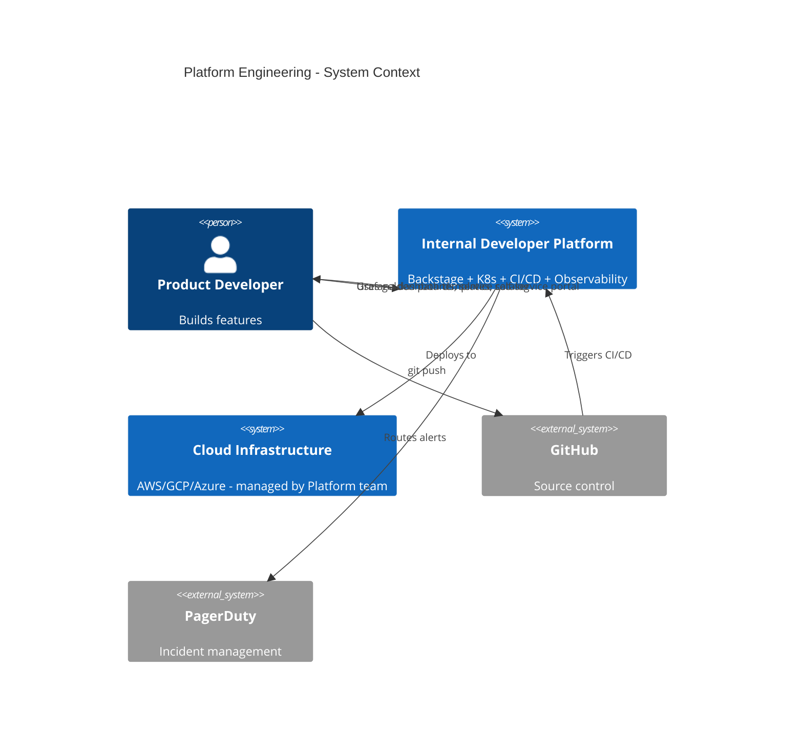

## Keywords in This File
{: .no_toc }

| # | Keyword | Weight |
|---|---|---|
| 1 | [Platform Engineering for Microservices at Enterprise Scale](#platform-engineering-for-microservices-at-enterprise-scale) | medium |

---

# Platform Engineering for Microservices at Enterprise Scale

---

### 🎯 Model Answer

**30 seconds:**
> Platform Engineering builds the internal developer platform that enables product teams to deploy and operate microservices without needing deep infrastructure expertise. It provides the golden path: paved roads with guardrails that make the right thing easy and the wrong thing hard. At enterprise scale, Platform Engineering is what transforms microservices from a good idea into a viable operating model for hundreds of services and tens of teams.

**3 minutes:**
> Without Platform Engineering at scale: every team invents its own CI/CD pipeline, its own Kubernetes manifests, its own monitoring setup, its own service mesh configuration. You get 50 different approaches for 50 services. Some services have no distributed tracing. Some have no circuit breakers. Some are deployed manually. The cognitive overhead on every team is enormous: they spend 30% of their time on infrastructure instead of product features. Platform Engineering eliminates this overhead by building shared infrastructure that all teams use. The Internal Developer Platform (IDP) includes: a service template (one command to bootstrap a new service with all the right configurations pre-set), a CI/CD pipeline template (build, test, security scan, deploy in one reusable pipeline), an observability stack (distributed tracing, metrics, logs - all pre-configured), a service catalog (every service registered with its owner, dependencies, and SLOs), and a Kubernetes platform (developers request compute resources, Platform Engineering manages the cluster). The Platform Engineering team is itself a product team. Their customers are internal developers. Their product is the Internal Developer Platform. Their success metric: developer satisfaction (does the platform remove friction?) and time-to-production (how long does it take to get a new service to production from zero?). Best organizations: new service to production in 2-4 hours using the golden path. Without Platform Engineering: 2-4 weeks of infrastructure setup before writing business code.

**Blank Mind Recovery:**
**(1) What it is:** "The team that builds the platform product teams use to deploy and operate services."
**(2) Key product:** "Internal Developer Platform (IDP) - golden path templates, CI/CD, observability, Kubernetes."
**(3) Success metric:** "Developer experience: time to first deployment, cognitive overhead on product teams."

---

### 📘 Concept Explanation

**What it is:**
Platform Engineering is the discipline of building and operating Internal Developer Platforms (IDPs) that enable software engineering teams to build, deploy, and operate their applications efficiently at scale.

**The platform layers:**
```
PLATFORM ENGINEERING STACK:

Layer 5: Developer Experience
  - Service templates (cookiecutter/Backstage)
  - Self-service portal (Backstage catalog)
  - Documentation (runbooks, onboarding guides)
  - Developer tooling (local dev environment)

Layer 4: CI/CD Pipeline
  - Standardized GitHub Actions / Jenkins pipeline
  - Build: compile, test, security scan (SAST/DAST)
  - Container: build, scan (Trivy), push to registry
  - Deploy: Helm chart deploy to K8s namespaces
  - Environments: dev -> staging -> production

Layer 3: Observability
  - Distributed tracing (Jaeger / Grafana Tempo)
  - Metrics (Prometheus + Grafana dashboards)
  - Logging (Loki + Grafana)
  - Alerting (PagerDuty integration)
  - SLO tracking (Grafana SLO dashboard)

Layer 2: Container Platform (Kubernetes)
  - Cluster management (EKS / GKE / AKS)
  - Service mesh (Istio)
  - Secret management (Vault)
  - Network policies
  - RBAC and namespace isolation

Layer 1: Infrastructure
  - Cloud provider (AWS / GCP / Azure)
  - Networking (VPC, subnets, security groups)
  - Storage (databases, object storage)
  - Managed services (RDS, ElastiCache, MSK)
```

> **Code walkthrough:** This Platform Engineering for Microservices at Enterprise Scale example demonstrates a key concept in practice using container. **KEY MECHANISM:** the runtime executes these instructions in sequence with specific memory and execution semantics. **WHY IT MATTERS:** misapplying this pattern causes subtle bugs that only manifest under production load. **TAKEAWAY: understand the execution model before using this pattern in production code.**

**The golden path:**
```
Product team creates a new service:

  1. Run: backstage-create-service \
          --name payment-v2 \
          --type spring-boot \
          --team checkout-team
  
  Generated output:
    /payment-v2/
      src/main/java/...  (starter code)
      Dockerfile         (optimized, multi-stage)
      helm/              (Kubernetes manifests)
      .github/workflows/ (CI/CD pipeline)
      src/test/...       (test structure)
      README.md          (service documentation)
      backstage.yaml     (service catalog entry)
  
  Automatically includes:
    - Micrometer Tracing (distributed tracing)
    - Spring Boot Actuator (metrics + health)
    - Logback JSON encoder (structured logging)
    - Resilience4j defaults (circuit breaker)
    - Flyway (database migrations)
    - JUnit + Testcontainers (testing)
  
  First deployment:
    git push -> CI/CD auto-deploys to dev namespace
    
  Total time: 30 minutes to first deployment
  Without platform: 2-4 weeks
```

> **Code walkthrough:** This Platform Engineering for Microservices at Enterprise Scale example demonstrates a key concept in practice using container. **KEY MECHANISM:** the runtime executes these instructions in sequence with specific memory and execution semantics. **WHY IT MATTERS:** misapplying this pattern causes subtle bugs that only manifest under production load. **TAKEAWAY: understand the execution model before using this pattern in production code.**

**The key insight:**
Platform Engineering is a force multiplier. A 5-person Platform Engineering team enables 50 product teams to operate efficiently. The investment ratio: 1 Platform Engineer for every 10-15 product engineers. The cost-benefit: each product team saves 30% of their engineering time on infrastructure. 50 teams x 30% savings = 15 engineers worth of productivity freed for product work.

---

### 💻 Code Example

```yaml
# Golden path: service template (Backstage)
# backstage.yaml - service catalog entry
apiVersion: backstage.io/v1alpha1
kind: Component
metadata:
  name: payment-service
  description: "Handles payment processing"
  annotations:
    github.com/project-slug: myorg/payment-service
    grafana/dashboard-selector: "service=payment"
    pagerduty.com/integration-key: "abc123"
    sonarqube.org/project-key: "payment-service"
  tags:
    - java
    - spring-boot
    - critical-path
spec:
  type: service
  lifecycle: production
  owner: group:checkout-team
  system: checkout-platform
  providesApis:
    - payment-api
  consumesApis:
    - fraud-detection-api
    - user-api
  dependsOn:
    - resource:payment-postgresql
    - resource:payment-redis
```

> **Code walkthrough:** Backstage service catalog entry. Every service must have this file. It registers: who owns the service, what APIs it provides and consumes, what infrastructure it depends on, and links to dashboards, alerts, and source code. The catalog enables: impact analysis (which services are affected if PaymentService is down?), ownership lookup (who do I contact about payment issues?), dependency visualization (what does the checkout system depend on?), and onboarding (new engineers understand the system by exploring the catalog).


```yaml
# Standard CI/CD pipeline (GitHub Actions)
# .github/workflows/service-pipeline.yml
name: Service Pipeline
on:
  push:
    branches: [main]
  pull_request:
    branches: [main]

jobs:
  test:
    runs-on: ubuntu-latest
    steps:
      - uses: actions/checkout@v3
      
      - name: Run tests
        run: ./gradlew test
      
      - name: SAST Security scan
        uses: github/codeql-action/analyze@v2
        with:
          languages: java
      
      - name: Dependency vulnerability scan
        run: ./gradlew dependencyCheckAnalyze
        # Fail on CVSS >= 8.0 vulnerabilities
        
  build-and-push:
    needs: test
    runs-on: ubuntu-latest
    steps:
      - name: Build container image
        run: |
          docker build \
            --build-arg BUILD_NUMBER=${{ github.sha }} \
            -t $REGISTRY/payment:${{ github.sha }} .
      
      - name: Scan container image
        uses: aquasecurity/trivy-action@master
        with:
          image-ref: $REGISTRY/payment:${{ github.sha }}
          severity: CRITICAL,HIGH
          exit-code: '1'  # Fail on HIGH+ CVEs
      
      - name: Push to registry
        run: docker push $REGISTRY/payment:${{ github.sha }}

  deploy-staging:
    needs: build-and-push
    steps:
      - name: Deploy to staging
        run: |
          helm upgrade --install payment-service \
            ./helm \
            --namespace staging \
            --set image.tag=${{ github.sha }} \
            --wait --timeout=120s
      
      - name: Run smoke tests
        run: |
          ./scripts/smoke-test.sh staging

  deploy-production:
    needs: deploy-staging
    if: github.ref == 'refs/heads/main'
    environment: production
    steps:
      - name: Deploy to production (canary)
        run: |
          # Deploy as canary (5% traffic)
          helm upgrade --install payment-service \
            ./helm \
            --namespace production \
            --set image.tag=${{ github.sha }} \
            --set canary.enabled=true \
            --set canary.weight=5
      
      - name: Monitor canary (10 minutes)
        run: ./scripts/canary-monitor.sh 10m
        # Checks error rate + latency vs baseline
        # Auto-rolls back if degradation detected
      
      - name: Promote to full traffic
        if: success()
        run: |
          helm upgrade payment-service ./helm \
            --set canary.enabled=false
```


> **Code walkthrough:** The standardized pipeline runs for every service in the organization. Key security gates built in: SAST (static analysis), dependency vulnerability scan, container image scan. Any HIGH or CRITICAL vulnerability blocks deployment. The canary deployment with automated monitoring prevents a bad deployment from reaching 100% traffic: the pipeline monitors error rate and latency for 10 minutes at 5% traffic. If degraded: automatic rollback. This pipeline is maintained by Platform Engineering - product teams get all of this by creating a service from the template.

---

### 📊 Diagram

```
INTERNAL DEVELOPER PLATFORM ARCHITECTURE

Product Team Workflow:
  Developer
    |
    | git push
    v
  [GitHub] -> [CI/CD Pipeline (standardized)]
                    |
                    v
              [Container Registry]
              [Security Scans Pass]
                    |
                    v
  [Kubernetes (dev namespace)] -> [Kubernetes (prod)]
              |                          |
              v                          v
  [Istio Service Mesh]        [Istio Service Mesh]
  [Observability Stack]       [Observability Stack]
              |                          |
              v                          v
  [Backstage Service Catalog] (unified view)
              |
              v
  [Grafana: metrics + logs + traces + SLOs]

Platform Team Owns:
  - Kubernetes cluster lifecycle
  - CI/CD pipeline templates
  - Observability stack
  - Service mesh configuration
  - Service catalog (Backstage)
  - Security scanning tools
  - Secret management (Vault)
```



> **Diagram walkthrough:** The IDP is the integration layer between developer intent (git push) and running infrastructure (cloud). Platform Engineering maintains the IDP and the cloud infrastructure. Product teams interact only with the IDP and GitHub - they don't need to understand the underlying cloud infrastructure. This abstraction is the core value: product engineers focus on business logic, Platform engineers manage infrastructure complexity.

---

### 🏛️ System Design

**Problem:** Design an Internal Developer Platform for a company with 200 microservices, 400 engineers across 40 teams, growing at 2 new services per week. Current state: no standardization, 40 different CI/CD setups, no service catalog, inconsistent observability.

**Design:**

**Backstage (Service Catalog + Developer Portal)**
- Self-hosted Backstage on Kubernetes
- Service catalog: all 200 services registered via automated scanning (GitHub org scan)
- Software templates: create-service command with Java, Python, Go starters
- Documentation hub: tech radar, ADRs, runbooks
- Plugin integration: Grafana dashboards, PagerDuty incidents, SonarQube quality, GitHub Actions status

**CI/CD Platform**
- GitHub Actions with reusable workflow templates
- Platform team maintains `.github/workflows/platform-*.yml` in a shared repository
- Product teams call: `uses: platform-team/workflows/.github/workflows/java-service.yml`
- Standardized stages: test, security-scan, build, push, deploy-staging, canary-deploy-prod
- Automatically embedded: SAST, container scan, smoke tests, canary monitoring

**Kubernetes Platform**
- EKS clusters: one per environment (dev, staging, prod)
- Cluster per environment, namespaces per team
- Cluster Autoscaler: auto-scale node pools based on demand
- Istio service mesh: mTLS, circuit breakers, observability
- Vault: secret management, certificate rotation
- RBAC: teams can deploy to their namespaces only (not cross-team)
- Resource quotas: prevent one team from starving others

**Observability Stack**
- Prometheus + Thanos: metrics with long-term storage
- Grafana Loki: log aggregation
- Grafana Tempo: distributed tracing
- Grafana (unified dashboard): metrics + logs + traces in one UI
- PagerDuty: alerts with team routing
- SLO tracking: per-service error budget dashboards

**Platform Team Staffing**
- For 400 engineers across 40 teams: 25-30 Platform Engineers
- Sub-teams: Cluster Platform (Kubernetes/Istio), CI/CD (pipelines), Observability, Developer Experience (Backstage/templates)
- On-call rotation: Platform team is on-call for platform incidents

**Developer Experience Metrics**
- Time to first deployment for new service: target < 4 hours (down from 3 weeks)
- Percentage of services using golden path: target 95%
- Developer satisfaction score (quarterly survey): target > 80% satisfied
- Mean time to detect platform issues: target < 5 minutes

---

### 🎓 Answers by Seniority

**Junior / Mid:** "Platform Engineering is the team that builds the tools and infrastructure that other development teams use to deploy and run their services. They create things like the standard pipeline that automatically tests and deploys code, the Kubernetes platform that services run on, and the observability tools that help teams see how their services are performing. It's like building the roads and utilities that other teams build on top of."

**Senior / Staff:** "Platform Engineering solves the coordination problem at scale. In a company with 40 product teams, each team independently solving infrastructure problems creates massive duplication: 40 CI/CD pipelines, 40 different monitoring setups, 40 different approaches to secret management. The cost is: wasted engineering effort (each team reinvents the same wheel), inconsistent quality (some teams have no security scanning, some have no distributed tracing), and enormous cognitive overhead for engineers who should be building product. The Platform team inverts this: solve the infrastructure problem once, for everyone. The key is treating Platform Engineering as a product team: their internal developer platform has customers (product teams), requirements (developer needs), and quality metrics (developer satisfaction, time-to-production). The teams that fail treat Platform Engineering as an ops team (reactive, ticket-driven, no roadmap). The teams that succeed treat it as a product team (proactive, roadmap-driven, user research with developers)."

---

### ⚠️ Common Misconceptions

**Misconception:** "Platform Engineering is just DevOps/SRE with a fancier name."
Reality: Platform Engineering, SRE, and DevOps are related but distinct. DevOps: a cultural practice of breaking down developer-operations silos (everyone is responsible for deployment and operations). SRE: a set of practices for managing reliability in production (error budgets, SLOs, blameless postmortems). Platform Engineering: building the internal tools and platforms that enable product teams to operate independently. An SRE might write the SLO framework. Platform Engineering builds the tool that enables every team to track their SLOs without each team building the framework themselves. DevOps culture motivates teams to own deployment. Platform Engineering provides the platform that makes deployment self-service. They are complementary.

---

### 🚨 Failure Modes and Diagnosis

**Failure: Platform becomes a bottleneck instead of an enabler**

Symptoms: Product teams must file tickets to the Platform team to get any infrastructure change done. New service deployment requires Platform team involvement. Teams are blocked on Platform team reviews for weeks. Platform team is always behind, always fire-fighting.

Root cause: Platform team designed as a gatekeeper rather than an enabler. All infrastructure changes route through the Platform team for manual approval. The platform is not self-service - it requires Platform team intervention for common operations (creating a new namespace, adding a secret, adjusting resource limits).

Diagnosis: Measure the ticket backlog for the Platform team. If > 100 tickets and growing: gatekeeper pattern confirmed. Ask product teams: how many times per sprint do you wait on the Platform team? If > 1: friction is real.

Fix: Self-service by design. Every common operation should be self-service through the IDP portal or CLI. Namespace creation: automated (namespace request via IDP, auto-provisioned with RBAC and quotas). Secret management: developers use Vault CLI or the IDP UI directly. Resource limit adjustments: within pre-approved ranges, self-service. Platform team reviews: only for changes that require security or architectural review (new cluster-level capabilities, major quota increases). Target: Platform team handles 0 routine requests; all routine operations are self-service.

---

### 🎯 Interview Deep-Dive

| Category | Time | Minimum |
|---|---|---|
| Definition | 2 min | 1 |
| Strategy | 3 min | 2 |
| Design | 5 min | 2 |
| Implementation | 3 min | 2 |
| Scale | 3 min | 1 |
| Trade-off | 3 min | 1 |
| Anti-pattern | 2 min | 1 |
| Developer Experience | 3 min | 1 |
| Security | 3 min | 1 |
| Organizational | 3 min | 1 |
| Behavioral | 3 min | 1 |
| Comparison | 2 min | 1 |

**[JUNIOR] Q1 - [CONCEPTUAL] "What is an Internal Developer Platform and how does it differ from a cloud platform?"**
> "A cloud platform (AWS, GCP, Azure) provides raw infrastructure primitives: compute (EC2, GKE nodes), storage (S3, RDS), networking (VPC, load balancers). It is infrastructure as a service. These primitives are powerful but complex - using them well requires deep expertise. An Internal Developer Platform (IDP) is built on top of cloud platforms, abstracting the complexity for application developers. The IDP provides: service templates (ready-to-use application scaffolding), standardized CI/CD (git push -> deployed), self-service environments (request a namespace, get one in minutes), observability out-of-the-box (every service automatically monitored), and secret management (add a secret without touching Vault directly). The IDP's target user is the product developer who wants to build features, not manage infrastructure. The cloud platform's target user is the infrastructure engineer who needs fine-grained control. The IDP is purpose-built for your organization's needs, built on top of the cloud platform's capabilities. It enforces your organization's standards (security policies, naming conventions, access controls) by making them the default path."

*What separates good from great:* "The IDP abstraction level matters. Too low: developers still have to understand Kubernetes YAML, Terraform, and Helm. The IDP adds process but not simplicity. Too high: developers can't customize for legitimate specialized needs. The right level: developers define WHAT their service needs (compute, database, cache, secrets) in a simple DSL or UI. The IDP translates WHAT into the HOW (specific Kubernetes manifests, Terraform resources, IAM roles)."

---

**[JUNIOR] Q2 - [HANDS-ON] "How do you build a service template that is actually adopted?"**
> "Service template adoption failure is common: Platform team builds a beautiful template, product teams don't use it because it doesn't fit their needs or is too opinionated. Building for adoption: (1) User research: interview 5-10 product developers. What does their current service setup look like? What is painful? What tooling do they use? The template must fit existing workflows. (2) Opinionated defaults, not requirements: the template provides defaults for every configuration. Changing any default is possible but requires one extra step. Most teams accept the defaults. Teams with legitimate special needs change what they need. (3) Evolve with the ecosystem: the template is version-controlled. Services state which template version they were created from. Platform team releases new template versions. Teams can opt in to new template features at their own pace. (4) Dogfood: the Platform team's own services use the template. This ensures the template is actually usable. (5) Feedback loop: measure adoption rate (what % of new services use the template?). Interview teams that don't use it. Fix the gaps."

*What separates good from great:* "Backstage Software Templates + GitHub Apps: Backstage provides the UI for creating a service from a template. The developer fills in a form (service name, team, language). Backstage runs the template, creates the GitHub repository with the scaffolded code, registers the service in the catalog, creates the PagerDuty service, and creates the Grafana dashboard - all automatically. This reduces new service creation from manual 'do 20 things in 20 different tools' to 'fill one form'."

---

**[JUNIOR] Q3 - [CONCEPTUAL] "How do you ensure security compliance across all services using the platform?"**
> "Security compliance through the platform, not through process: (1) Security scanning in CI/CD: every service's pipeline includes SAST (code analysis), dependency scanning (known CVEs in libraries), and container scanning (CVEs in base images). These are built into the standard pipeline template. Product teams can't disable them. High/critical CVEs block deployment. (2) Base image management: Platform Engineering provides approved base images (ubuntu-22.04-minimal, eclipse-temurin-21-jre). These images are patched monthly. Services are built FROM these approved images. No service can use an unapproved base image (enforced by OPA admission controller in Kubernetes). (3) Secret management: no secrets in code or configuration files. All secrets via Vault + Kubernetes external secrets. The platform template shows developers how to declare secrets - they never handle raw credentials. (4) Network policy: Istio AuthorizationPolicy enforces service-to-service access control. Every service has a default-deny policy. Explicit allow rules for legitimate communication paths. (5) RBAC: least privilege. Service accounts have exactly the permissions needed, no more. Platform Engineering reviews all IAM roles as part of service onboarding."

*What separates good from great:* "Shifting security left via policy as code: OPA (Open Policy Agent) Gatekeeper runs in Kubernetes and enforces policies at admission time (before resources are created). Policies: no privileged containers, no root-user containers, required resource limits, required security labels. A Kubernetes resource that violates any policy is rejected at creation time. The developer sees the error immediately, not after a security audit weeks later."

---

**[MID] Q4 - [CONCEPTUAL] "How do you measure the success of a Platform Engineering team?"**
> "Platform Engineering success metrics: (1) Time to production (DORA: deployment frequency): how long does it take from a developer's first line of code to the service running in production? Before platform: 2-4 weeks. After platform: 2-4 hours. DORA four key metrics: deployment frequency, lead time for changes, change failure rate, mean time to restore. (2) Developer experience score: quarterly survey. 'Does the platform remove friction or add friction?' Target: 80%+ of developers rate the platform positively. (3) Platform adoption rate: what % of services use the standard CI/CD pipeline, standard observability, standard templates? Target: 95%+. (4) Platform reliability: the platform's own SLOs. If the CI/CD system is down, no team can deploy. Platform uptime is a critical dependency. SLO: 99.9% availability for deployment pipeline, service mesh, observability. (5) Mean time to onboard a new service: from service creation to first production deployment. (6) Incident attribution: what % of production incidents are caused by platform issues vs application issues? High platform incidents indicate reliability problems in the platform itself."

*What separates good from great:* "The Accelerate book (Forsgren, Humble, Kim) provides the evidence basis for DORA metrics. High-performing organizations have: deployment frequency daily or multiple times per day, lead time for changes < 1 hour, change failure rate < 5%, mean time to restore < 1 hour. Platform Engineering directly enables the first two: daily deployment frequency requires a reliable, fast CI/CD pipeline. Low lead time requires self-service deployment with no manual gates. The platform's design choices directly determine whether the organization can achieve elite DORA metrics."

---

**[MID] Q5 - [CONCEPTUAL] "How does Platform Engineering handle the tension between standardization and team autonomy?"**
> "The tension: standardization enables Platform team to support all services consistently. Autonomy enables teams to make the right technical decisions for their specific needs. Resolution: golden path + escape hatch. The golden path covers 90% of use cases. The escape hatch allows the remaining 10% to deviate with justification. Golden path: every service created from the template gets Java + Spring Boot + PostgreSQL + Redis. CI/CD pipeline is standardized. Kubernetes manifests follow the standard. 90% of services don't need to deviate from this. Escape hatch: a team needs Python + MongoDB instead of Java + PostgreSQL. They can: use a different language starter template (Platform Engineering provides multiple templates), use a different database (provision via Terraform with Platform review), or fully custom (opt out of the template, but take full responsibility for security, compliance, and reliability). Opt-out cost: the team is responsible for implementing all the security gates the standard pipeline provides. Platform Engineering supports them but doesn't maintain their custom pipeline. This cost makes the escape hatch high-friction by design - teams only escape when genuinely necessary."

*What separates good from great:* "The platform should be a product with a roadmap informed by customer feedback. Teams that are consistently opting out of a specific golden path component are telling you the component doesn't meet their needs. Analyze opt-out patterns: if 10 teams have opted out of the standard logging setup, the standard logging setup is wrong. Fix the golden path, and the opt-outs reduce. The opt-out rate is a quality signal, not just a compliance problem."

---

**[MID] Q6 - [CONCEPTUAL] "How do you manage platform upgrades across hundreds of services?"**
> "Platform upgrades: when Kubernetes upgrades from 1.28 to 1.29, when Istio upgrades from 1.18 to 1.20, when the base Java image upgrades from JDK 21 to JDK 22. Challenge: 200 services all using the platform. How do you upgrade without breaking them all? (1) Compatibility window: maintain the old version alongside the new for 3-6 months. Services opt in to the new version. Platform team communicates the deprecation timeline. (2) Automated compatibility testing: for Kubernetes upgrades: run all service CI pipelines against the new cluster version. Identify breaking changes before the upgrade happens. (3) Service mesh upgrades: Istio control plane (Istiod) is backward compatible. Upgrade the control plane first. Sidecar proxy upgrades: rolling restart of all pods. This is why pod-restart-free upgrades (Ambient Mesh) matter at scale. (4) Base image updates: automated PRs. Dependabot (or Renovate) creates PRs to update the base image version in each service's Dockerfile. CI runs automatically. Platform team reviews pass-through. Services with failing tests get attention. (5) Upgrade velocity: the platform must upgrade at the speed of the ecosystem. Running Kubernetes 2 versions behind creates security exposure. Platform Engineering's upgrade discipline directly impacts the organization's security posture."

*What separates good from great:* "Image promotion pipelines: base images are rebuilt monthly with latest patches -> tested in dev cluster -> promoted to staging -> promoted to production. Services are built FROM the promoted images. Each service's CI rebuilds when the base image changes (triggered by a common CI event). This automated promotion pipeline means services continuously benefit from security patches without any action required from product teams."

---

**[SENIOR] Q7 - [CONCEPTUAL] "What is Backstage and why has it become the de-facto IDP platform?"**
> "Backstage (by Spotify, open-source 2020): a developer portal platform. Core concept: a plugin-based system that integrates all developer tools into one unified interface. Core features: (1) Service Catalog: every service, library, and dataset registered in one place. Ownership, dependencies, API contracts, documentation, links to dashboards and CI runs - all in one view. (2) Software Templates: create new services from templates via a web form. Backstage runs the template, scaffolds the code, registers the service in the catalog. (3) TechDocs: documentation-as-code. Markdown docs in the service repo, rendered in Backstage as a searchable portal. (4) Plugin ecosystem: 150+ open-source plugins. GitHub Actions status, Grafana dashboards, PagerDuty incidents, SonarQube quality, ArgoCD deployment status - all embedded in Backstage. Why de-facto: it solves the 'tool sprawl' problem. Developers use 15 tools (GitHub, Grafana, PagerDuty, Jira, Confluence, ArgoCD, ...). Backstage aggregates them. One URL for everything. Why it wins: Spotify released it after building it internally for their own scale. It comes with credibility. The plugin ecosystem is large and growing. Self-hosted (no vendor lock-in). Free and open-source."

*What separates good from great:* "Backstage scoring system: track technical health scores per service. Auto-computed from: does the service have an SLO defined? Does it have a runbook? Is the container image up to date? Is there a contributing guide? Does CI pass? Score is displayed in the catalog. Teams can see their service's health score and compare to peers. This gamification drives adoption of best practices without mandating them."

---

**[SENIOR] Q8 - [CONCEPTUAL] "How do you handle cost management as part of Platform Engineering?"**
> "Cloud costs at scale: 200 services on Kubernetes, each with 3 environments, each with 2-5 pods. Total pods: 200 * 3 * 3 = 1800 pods. At $0.10/pod/hour: $4,320/day just for compute. Storage, databases, network: multiply by 3-5x. Total: $10K-$20K/day easy. Cost management practices: (1) Resource request optimization: Kubernetes uses resource requests for scheduling. Overprovisioned requests waste capacity. Tool: Goldilocks (VPA-based) recommends right-sized resource requests based on actual usage. (2) Cluster Autoscaler: scale cluster nodes based on actual pod demand. Overnight: scale down to minimum nodes. Daytime peak: scale up. (3) Spot instances for non-critical workloads: dev and staging clusters run on spot instances (70-80% cheaper). Production runs on on-demand. (4) Cost allocation: tag all resources with service name and team name. Chargeback report: each team sees their monthly cloud cost. Cost ownership drives efficiency. (5) Idle resource detection: services with no traffic for 24 hours flagged for potential decommission. Dev instances auto-shut down overnight. (6) Reserved instances / savings plans for baseline production capacity: commit to 1-year reserved capacity for predictable baseline load. Save 30-40% vs on-demand."

*What separates good from great:* "FinOps culture: Platform Engineering publishes weekly cost reports per team. Cost metrics visible in Backstage alongside reliability metrics. Teams are accountable for their cloud spend. When a team deploys a new service that doubles their cost: they see it in the weekly report and investigate. Awareness drives behavior change without mandates."

---

**[SENIOR] Q9 - [HANDS-ON] "How do you build a platform that supports multiple programming languages?"**
> "Polyglot support without N-times complexity: (1) Common contract, language-specific implementation: all services must: emit Prometheus metrics on /metrics, expose health on /actuator/health or /health, log JSON to stdout, expose OpenTelemetry trace context. Platform Engineering provides client libraries for each supported language: Java (Micrometer + Logback + Micrometer Tracing), Python (prometheus-client + structlog + opentelemetry-sdk), Go (prometheus/client_golang + zap + otel-go). These libraries are thin adapters to the platform standards. (2) Language starters: Backstage templates for each supported language. Platform Engineering decides which languages are 'tier 1' (fully supported with golden path) vs 'tier 2' (supported with less tooling). Tier 1: Java, Python, Go. Tier 2: Node.js (manual onboarding). Tier 3: Rust, Erlang (unsupported, team is on its own). (3) Service mesh handles language-agnostic concerns: mTLS, circuit breaking, distributed tracing context propagation - handled by Istio Envoy regardless of language. This is a key benefit of the service mesh: polyglot resilience and observability without per-language implementation."

*What separates good from great:* "OpenTelemetry auto-instrumentation: a Java agent (or Python auto-instrumentation) that instruments all major frameworks without code changes. Supports Spring Boot, Django, Flask, gRPC, Kafka. The OTel Collector receives spans from all languages and exports to Jaeger. This means a Python service automatically has the same observability as a Java service without the Python developer writing a single instrumentation line. The Platform team deploys OTel Collector as a DaemonSet and configures auto-instrumentation via annotation."

---

**[STAFF] Q10 - [CONCEPTUAL] "How do you deal with Platform Engineering toil and technical debt?"**
> "Platform Engineering toil: repetitive manual work that should be automated. Examples: manually approving namespace creation requests, manually onboarding new services to PagerDuty, manually adding secrets to Vault for new services, manually running compliance reports. Toil reduction approach: (1) Identify all manual processes that repeat > 5 times per month. These are toil candidates. (2) Automate one at a time. Namespace creation: self-service via IDP portal (Backstage action -> GitHub Actions -> Terraform). PagerDuty onboarding: automated from backstage.yaml service definition. (3) Toil budget: Platform Engineering commits to spending < 30% of time on toil. If toil exceeds this: freeze new features, automate the toil first. Technical debt: (1) Track deprecated platform versions. How many services are on Kubernetes 1.25 when the current is 1.29? This is technical debt. (2) Deprecation policy: platform versions are supported for 6 months after a new version is released. Alerts to service owners for services on deprecated versions. (3) Capacity: allocate 20% of Platform Engineering sprints to debt reduction (same as product engineering practice)."

*What separates good from great:* "Platform toil is often invisible. Product teams don't see the manual work Platform Engineering does to keep the system running. Making toil visible: create a toil dashboard. 'This week Platform Engineering spent 40% of time on manual tasks'. Share this with leadership. Invisible toil becomes invisible technical debt becomes invisible risk. Visibility creates the business case for investment in automation."

---

**[STAFF] Q11 - [PRODUCTION] "How do you manage incidents that span platform and product layers?"**
> "Incident classification: is the issue in the platform (Istio routing broken, Prometheus down, CI/CD failing) or in the application (code bug, bad config)? Classification determines the on-call team. Detection: platform monitoring detects platform issues (Istiod CPU high, Kubernetes API server slow, pipeline failure rate > 10%). Product monitoring detects application issues (service error rate high, latency spike). Escalation path: product team on-call investigates application issues. If root cause is platform: escalate to Platform on-call. War room: for major incidents, Platform on-call and affected product teams join together. Communication: Platform Engineering maintains a status page for platform components. Product teams subscribe. When the CI/CD system is degraded: they know immediately without filing a ticket. Post-mortem: blameless post-mortem for platform incidents. Root cause: was it a platform bug? A config change? A capacity issue? Corrective actions: added to Platform Engineering roadmap."

*What separates good from great:* "Platform SLOs communicated to product teams: 'CI/CD pipeline availability: 99.9% (max 8.7 hours of downtime per year). Kubernetes API availability: 99.95%'. When Platform misses its SLO: product teams have data to hold Platform Engineering accountable. Conversely: platform SLOs set expectations. Product teams don't escalate a 2-hour CI/CD outage as 'platform is failing' when the SLO commits to 99.9% and they've only experienced 0.1% downtime."

---

**[STAFF] Q12 - [ARCHITECTURE] "How does Platform Engineering change as a company scales from 50 to 500 engineers?"**
> "50 engineers (startup): Platform Engineering is 2-3 people or doesn't formally exist. One senior engineer sets up the CI/CD pipeline and Kubernetes cluster. Standardization is informal (follow the existing service as an example). Observability: basic dashboards for critical services. 100 engineers (growth): Platform Engineering becomes explicit: 5-8 people. Service catalog becomes necessary (too many services to track informally). CI/CD template standardization. Formal on-call rotation for platform. Basic IDP portal. 200 engineers (scale): Full Platform Engineering team: 15-20 people. Self-service IDP mandatory (Platform can't manually onboard new services). Formal SLOs for platform components. Golden path covers 95%+ of use cases. Cost management is a team function. 500 engineers (enterprise): Platform Engineering split into sub-teams (Cluster Platform, CI/CD, Observability, Developer Experience, Security Platform). Dedicated product manager for the IDP. Platform as a product with a roadmap, user research, and OKRs. 25-35 Platform Engineers supporting 500 product engineers. The IDP is the organization's competitive advantage: developer productivity at scale."

*What separates good from great:* "Platform Engineering ROI at scale: 500 engineers at 30% infrastructure overhead = 150 engineer-equivalents on infrastructure. Platform Engineering frees this to 10%: saves 100 engineers. At $250K fully-loaded cost/engineer: $25M/year in productivity. A 30-person Platform team at the same cost is $7.5M/year. Net ROI: $17.5M/year. This is the business case for investing in Platform Engineering at scale."

---

### ⚖️ Comparison Table

| Approach | Scale | Developer Experience | Operational Overhead | Consistency |
|---|---|---|---|---|
| No Platform Team | < 3 teams | Each team owns everything | Every team reinvents | None |
| Shared Tooling (ad-hoc) | 5-10 teams | Some standardization | Unclear ownership | Partial |
| DevOps (embedded) | 10-20 teams | Dev + ops merged per team | Per-team overhead | Variable |
| Platform Engineering | 20+ teams | Self-service, golden path | Centralized, efficient | High |
| Managed Internal Platform (IDP) | 50+ teams | One portal for everything | Platform team owns | Very high |

---

### 💻 Code Example

*(Omit: this concept does not have a programmatic interface that can be demonstrated in code. The conceptual explanation above is sufficient.)*


---

### 🏛️ System Design

*(Omit: system design diagram not applicable for this concept - see ★★★ keywords for full system design coverage.)*


---

### ⚖️ Comparison Table

*(Omit: this is a ★☆☆ foundational concept with no direct alternatives to compare - see higher-difficulty keywords for trade-off analysis.)*


---

### 📊 Diagram

*(Omit: no standalone visual diagram required for this concept - the explanations and code examples above provide sufficient clarity.)*


