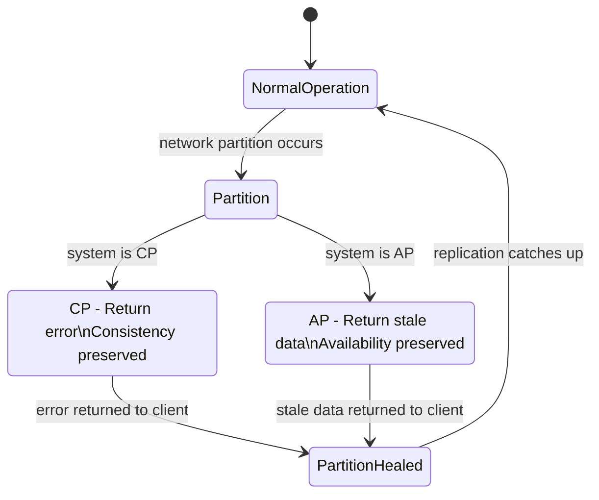
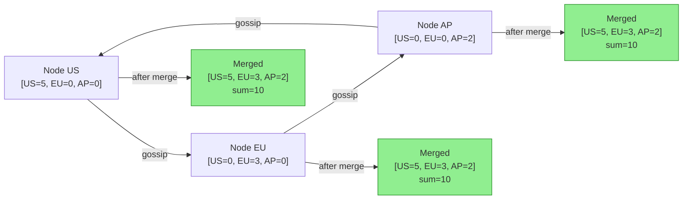

## Keywords in This File

{: .no_toc }

| #   | Keyword                                                              | Weight   |
| --- | -------------------------------------------------------------------- | -------- |
| 1   | [CAP Theorem and Distributed Systems Theory](#cap-theorem-and-distributed-systems-theory) | critical |
| 2   | [Eventual Consistency Formal Models](#eventual-consistency-formal-models) | high |

---

# CAP Theorem and Distributed Systems Theory

🎯 Interview Weight: critical - CAP theorem is asked in virtually
every senior+ distributed systems interview; misunderstanding it
is one of the most common candidate mistakes; Staff+ candidates
are expected to know PACELC and the limits of CAP framing.

---

### 🎯 Model Answer

**30 seconds:**
> CAP theorem states that a distributed system can guarantee at
> most two of three properties: Consistency (every read sees the
> most recent write), Availability (every request gets a response),
> and Partition tolerance (the system works despite network
> partitions). Since network partitions are unavoidable in any
> real distributed system, the real choice is always between
> consistency and availability during a partition - not a free
> choice of any two.

**3 minutes (Senior):**
> CAP is one of those theorems that is easy to misstate and
> harder to apply correctly. Let me walk through it precisely.
>
> Consistency in CAP means linearizability: if a write completes,
> every subsequent read across the cluster returns that value.
> This is a strong guarantee that requires synchronous replication.
> Availability means every non-failing node responds to every
> request - no timeouts, no errors. Partition tolerance means
> the system continues to function even when network messages
> between nodes are lost or delayed.
>
> The key insight is that partition tolerance is not optional.
> Any distributed system operating over a real network will
> experience partitions - even in a single datacenter, a switch
> can fail, a pod can be isolated, a network cable can be saturated.
> So the real choice is: during a partition, do you sacrifice
> consistency (CA becomes CP-or-AP) or availability?
>
> A CP system (like Zookeeper or etcd) refuses requests during
> a partition to avoid returning stale data. An AP system (like
> Cassandra or DynamoDB with eventual consistency) keeps
> responding but may return stale data.
>
> The practical application: CAP is a design-time lens, not an
> operations-time toggle. You choose your consistency model when
> you design the system, not when the partition happens. And the
> correct choice is domain-driven: financial transactions need
> CP (wrong balance is unacceptable); user feeds are fine with
> AP (stale tweets are acceptable).

**Framework:** WHAT -> WHY -> HOW -> TRADE-OFF -> EXAMPLE

*Adapting up:* Add PACELC (extends CAP to latency trade-offs
during normal operation), the distinction between CAP consistency
and ACID consistency, and the practical limits of the binary
CP/AP framing.

*Adapting down:* WHAT (distributed systems must choose between
consistency and availability during a network partition) +
WHY (partitions are unavoidable) + EXAMPLE (bank vs. social feed).

**Blank Mind Recovery:**

**(1) Restate:** "You are asking about the CAP theorem - let me
walk through what the three properties actually mean and why the
theorem has a surprising implication."

**(2) First principles:** "In a distributed system, nodes need
to agree on data. When a network partition prevents communication,
each node must decide: stop accepting requests (preserve
consistency) or keep responding (preserve availability). CAP
formalizes this trade-off."

**(3) Bridge:** "Think of two ATMs that share a bank account
and cannot communicate during a network outage. They can either
reject transactions (consistent but unavailable) or accept
transactions and risk double-spending (available but potentially
inconsistent). CAP says you cannot do both."

---

### 📘 Concept Explanation

**What it is:**
CAP theorem (Brewer's theorem, 2000) states that a distributed
data store can provide at most two of the following three
guarantees simultaneously: Consistency (C), Availability (A),
and Partition tolerance (P). Formally proved by Gilbert and Lynch
(2002), it applies to any system where data is replicated across
network-separated nodes.

**The problem it solves:**
Distributed systems designers face a fundamental tension: how do
multiple nodes that can lose communication with each other provide
a coherent view of data? CAP provides a theoretical framework for
understanding the irreducible trade-off and guides architects in
choosing the right consistency model for their domain.

**How it works:**

```
Definitions (precise):

C - Consistency (linearizability):
    Every read returns the most recent committed write
    or an error. Reads across all nodes return the same
    value at any given moment.
    NOT: eventual consistency
    NOT: ACID consistency (different concept)

A - Availability:
    Every request to a non-failing node receives a
    response (not an error). The response may not
    contain the most recent data.
    NOT: 100% uptime (a different concept)

P - Partition Tolerance:
    The system continues to operate even when an
    arbitrary number of messages between nodes are
    lost or delayed.
    NOT: "can tolerate all failures"

The theorem:
    In presence of a network partition, you must
    choose: C or A. You cannot have both.

    "CP": During partition, return error/timeout
          rather than stale data. Consistency preserved.
    "AP": During partition, return possibly stale data.
          Availability preserved.

Real examples:
    CP: Zookeeper, etcd, HBase, RDBMS with sync replication
    AP: Cassandra, DynamoDB (default), CouchDB, DNS
```

**The key insight:**
Partition tolerance is not a choice - it is a requirement. Any
system connected over a real network will experience partitions.
The theorem is better understood as: "during a network partition,
choose consistency or availability." In normal operation (no
partition), a well-designed system can provide both. This is
why the binary CP/AP classification is an oversimplification:
most databases are CP during partitions but AP-like in practice
because partitions are rare.

**When to use it:**
- Use CP (consistency priority): financial systems (ledger,
  inventory count, seat reservations), distributed locks,
  leader election, distributed configuration
- Use AP (availability priority): user feeds, caches,
  session data, product catalogs, DNS lookups, recommendation
  engines

**When NOT to use it:**
- CAP does not apply to single-node systems (no partitions
  possible by definition)
- CAP does not govern latency (see PACELC for that)
- CAP C is not ACID C: CAP consistency = linearizability;
  ACID consistency = "database constraints are not violated"
- Do not apply CAP to choose a database for a use case: use
  domain requirements (consistency model, availability target)

**Alternatives:**
- PACELC -> Extends CAP: during partition (P), trade Availability
  (A) vs Consistency (C); Else (E), trade Latency (L) vs
  Consistency (C); captures the latency dimension CAP misses
- BASE (Basically Available, Soft state, Eventually consistent)
  -> AP system design philosophy; trade-off CAP ignores
- ACID -> Transaction consistency model for single-node databases;
  different problem domain from CAP

**First-principles derivation:**
Two nodes, N1 and N2, share data. A write to N1 occurs. Before
N1 propagates to N2, a partition separates them. Now N2 receives
a read. Option A: N2 returns an error (C over A - consistent, not
available). Option B: N2 returns its stale value (A over C -
available, not consistent). There is no third option: N2 cannot
return the correct value because it has not received the write.
The theorem follows from this construction. The only way to
avoid the trade-off is to prevent partitions, which is
impossible in a real network.

---

### 💻 Code Example

**Example 1: CAP trade-off visible in Cassandra configuration**

```java
// Cassandra consistency levels demonstrate CAP trade-off explicitly
// The application CHOOSES consistency vs. availability per query

@Repository
public class ProductRepository {

    private final CqlSession session;
    private static final String SELECT_PRODUCT =
        "SELECT id, name, price FROM products WHERE id = ?";

    // AP mode: prefer availability over consistency
    // May return stale data during partition, but never errors
    public Optional<Product> findByIdEventuallyConsistent(UUID id) {
        Statement stmt = SimpleStatement
            .newInstance(SELECT_PRODUCT, id)
            // ONE: return data from any available replica
            // Even if other replicas have newer data
            .setConsistencyLevel(ConsistencyLevel.ONE);
        Row row = session.execute(stmt).one();
        return row == null
            ? Optional.empty()
            : Optional.of(mapRow(row));
    }

    // CP mode: prefer consistency over availability
    // Returns error during partition rather than stale data
    public Optional<Product> findByIdStronglyConsistent(UUID id) {
        Statement stmt = SimpleStatement
            .newInstance(SELECT_PRODUCT, id)
            // QUORUM: majority of replicas must respond
            // If quorum cannot be reached (partition): throws
            .setConsistencyLevel(ConsistencyLevel.QUORUM);
        // Will throw NoNodeAvailableException or WriteTimeout
        // during partition rather than return stale data
        Row row = session.execute(stmt).one();
        return row == null
            ? Optional.empty()
            : Optional.of(mapRow(row));
    }

    private Product mapRow(Row row) {
        return new Product(
            row.getUuid("id"),
            row.getString("name"),
            row.getBigDecimal("price")
        );
    }
}
```

> **Code walkthrough:** Cassandra's consistency levels make the
> CAP trade-off explicit and runtime-configurable. `ConsistencyLevel.ONE`
> is the AP choice: any replica responds, maximizing availability
> at the cost of possible staleness. `ConsistencyLevel.QUORUM` is
> the CP choice: majority of replicas must agree, sacrificing
> availability during partitions for correctness. Most production
> systems use QUORUM for writes and ONE for reads, accepting some
> read staleness while ensuring writes are durably recorded. The
> key insight: the trade-off is not a database property but a
> per-operation decision exposed to the application.

**Example 2: CP vs. AP in service design**

```java
// CP: Distributed lock with etcd
// Refuses to grant lock during partition
// (etcd leader election requires quorum)
public class InventoryReservationService {

    private final EtcdClient etcd;

    // CP: if etcd cannot achieve quorum during partition,
    // the lock acquisition FAILS. Better to reject the request
    // than to grant two processes the same lock.
    public boolean tryReserveInventory(
            String itemId, int quantity) {
        String lockKey = "/locks/inventory/" + itemId;
        try {
            // etcd leader must be reachable (CP behavior)
            LeaseGrantResponse lease = etcd.getLeaseClient()
                .grant(30, TimeUnit.SECONDS).get();

            // Lock acquisition fails if leader unreachable
            LockResponse lock = etcd.getLockClient()
                .lock(ByteSequence.from(lockKey, UTF_8),
                      lease.getID()).get();

            // Critical section: decrement inventory
            boolean reserved = decrementInventory(
                itemId, quantity);
            etcd.getLockClient()
                .unlock(lock.getKey()).get();
            return reserved;
        } catch (EtcdException e) {
            // During partition: return false, not wrong data
            return false;
        }
    }
}

// AP: User feed with Cassandra eventual consistency
// Returns possibly stale feed rather than error
public class FeedService {
    private final FeedRepository feedRepo;

    // AP: during partition, user sees stale feed
    // Acceptable: stale tweets < no feed at all
    public List<FeedItem> getUserFeed(UUID userId) {
        // ConsistencyLevel.ONE - AP choice
        return feedRepo.getRecentItems(
            userId,
            ConsistencyLevel.ONE,
            50
        );
    }
}
```

> **Code walkthrough:** The inventory reservation uses etcd
> (CP) because granting two reservations for the same item is a
> business correctness violation. During a partition, the lock
> fails - orders are rejected, not double-booked. The feed service
> uses Cassandra with ONE consistency (AP) because showing a
> slightly stale feed is acceptable - a 30-second-old tweet is
> not a business correctness violation. These are domain decisions,
> not database configuration decisions. CAP helps frame WHY the
> right consistency choice differs between these two use cases.

**Example 3: PACELC thinking extends CAP for normal operation**

```java
// PACELC: beyond partition, there is a latency-consistency
// trade-off even during NORMAL operation

// DynamoDB global tables: PACELC in practice
@Configuration
public class DynamoDBConfig {

    // P = partition: choose A (eventual) vs C (strong)
    // E = else (normal): choose L (low latency) vs C (strong)

    // AP + EL choice: lowest latency, eventual consistency
    // Good for: caches, user sessions, product catalogs
    AmazonDynamoDB eventuallyConsistentClient() {
        return AmazonDynamoDBClientBuilder.standard()
            // ReadConsistency not specified = eventual
            // Reads from any replica globally
            // Latency: ~1-2ms (nearest replica)
            .build();
    }

    // CP + EC choice: strong consistency, higher latency
    // Good for: financial ledger, inventory count, auctions
    public GetItemRequest stronglyConsistentRead(
            String tableName, String key) {
        return GetItemRequest.builder()
            .tableName(tableName)
            .key(Map.of("id",
                AttributeValue.fromS(key)))
            // Forces read from the primary partition
            // Latency: ~5-10ms (primary must respond)
            // P-split: primary unreachable = error (CP)
            .consistentRead(true)
            .build();
    }
}
```

> **Code walkthrough:** PACELC extends CAP by asking: even when
> there is no partition, do you prefer lower latency or stronger
> consistency? DynamoDB's `consistentRead=false` (default) is the
> EL choice: reads from any replica, lowest latency, possible
> staleness. `consistentRead=true` is the EC choice: reads from
> primary only, higher latency, guaranteed freshness. PACELC makes
> explicit what CAP ignores: the normal-operation latency vs.
> consistency trade-off that teams face every day, not just during
> the rare partition event.

---

### 🎓 Answers by Seniority

**Junior / Mid (0-5 years):**
> CAP theorem says a distributed system can only guarantee two out
> of three: consistency (all nodes return the same data), availability
> (every request gets a response), and partition tolerance (the
> system works when nodes cannot communicate). Since partitions
> always happen in real networks, the real choice is between
> consistency and availability when a partition occurs. Databases
> like Zookeeper choose consistency (CP); databases like Cassandra
> default to availability (AP).

Mid extension: mention that the choice is domain-driven. Financial
systems need CP (wrong balance is worse than no balance). Social
feeds are fine with AP (slightly stale tweets are acceptable).

*Push deeper:* Explain why "P" is not a real choice - you cannot
avoid partitions in distributed systems, which is why it is always
a CP vs. AP decision.

---

**Senior / Staff (5+ years):**
> CAP is more nuanced than the textbook version. First, partition
> tolerance is not optional - any system over a real network will
> experience partitions. So CAP reduces to: during a partition,
> choose consistency or availability. Second, the CAP "consistency"
> is linearizability, which is much stronger than ACID consistency
> (constraint satisfaction). Third, the binary CP/AP label is
> imprecise: most CP databases are available during normal operation
> and only sacrifice availability during partitions.
>
> The more useful framework for production decisions is PACELC.
> Even without a partition, there is a trade-off between latency
> and consistency. A strongly consistent read from a geographically
> distributed database requires coordinating the primary replica -
> that adds 50-100ms vs. an eventually consistent local read. For
> high-throughput APIs, that latency cost is significant.
>
> In production decisions, I apply CAP this way: if the cost of
> an inconsistency (stale read, double write) is a correctness
> violation (double-booking a seat, overdrawing an account), choose
> CP. If the cost is a tolerable degradation (stale recommendation,
> cached product description), choose AP. Most systems need both:
> CP for transactional data, AP for derived read models.

*Push deeper:* Discuss the limits of CAP: it does not model network
delay, only packet loss. Systems can violate CAP informally by
timing out requests (neither consistent nor available). The
distinction between "during partition" and "during normal operation"
latency trade-offs is what PACELC captures.

---

### ⚠️ Common Misconceptions

**Misconception 1: "You can choose any two of CAP."**
Partition tolerance is not optional in any network-connected
distributed system. The real choice is: during a network partition,
sacrifice consistency (AP) or availability (CP). Saying "I'll
use CA" means "I don't need to handle network partitions" - which
is only valid for single-node systems.

**Misconception 2: "CAP consistency is the same as ACID consistency."**
These are different concepts that share the letter C. CAP
consistency = linearizability (every read returns the most recent
write globally). ACID consistency = database constraint integrity
(foreign keys, unique constraints remain valid after a transaction).
A database can have ACID consistency without linearizability, and
vice versa. Confusing these in an interview is a significant red
flag.

**Misconception 3: "CP databases are always consistent."**
CP means: during a partition, the system chooses consistency
over availability. During normal operation, a CP system still
has replication lag for reads from replicas. "Strongly consistent"
typically means linearizable reads from the primary. Reads from
replicas are often eventually consistent even in "CP" databases.

**Misconception 4: "CAP is the right tool for choosing a database."**
CAP is a theoretical framing for understanding trade-offs. Choosing
a database requires considering: read/write ratio, query patterns,
consistency requirements, latency SLO, operational complexity,
cost, and team familiarity. CAP is one input, not the decision
criterion.

---

### 🚨 Failure Modes and Diagnosis

**Failure 1: CP system becomes unavailable during partition**

Symptom: ZooKeeper or etcd is returning "leader not available"
errors. Dependent services begin failing cascades.

Diagnosis: The cluster lost quorum (majority of nodes cannot
communicate). Common cause: rolling restart of 3 of 5 nodes
simultaneously (3 nodes down = quorum lost) or network partition
isolating the majority.

Fix: Never restart more than (N-1)/2 nodes simultaneously in a
quorum-based system (N=5 -> max 2 simultaneous restarts). For
recovery: restore network connectivity or bring nodes back online
to re-establish quorum. Services depending on the CP system
should implement a fallback (read from cache, serve degraded mode)
during the partition.

**Failure 2: AP system accumulates conflicts during partition**

Symptom: After a network partition heals, the distributed database
reports write conflicts. Two nodes wrote different values to the
same key during the partition. Last-write-wins resolved some
inconsistencies, losing data.

Diagnosis: The AP consistency model allowed both sides of the
partition to accept writes. On healing, the conflict resolution
strategy (last-write-wins, CRDTs, application-level merge) was
insufficient for the data type.

Fix: Review the conflict resolution strategy for the data type.
LWW (last-write-wins) is safe for idempotent data (user profile,
product catalog); it is destructive for counters and lists. Use
CRDTs (Conflict-free Replicated Data Types) for counters and sets.
Use application-level merge for complex objects.

**Failure 3: Believing stale reads cannot cause correctness issues**

Symptom: Two users simultaneously purchase the last item in stock.
Both receive confirmation. The AP system returned "1 unit available"
to both before either write propagated.

Diagnosis: Inventory was modeled as AP (eventually consistent),
but inventory count is a correctness-critical value that requires
CP or compare-and-swap semantics.

Fix: Move inventory reservation to a CP data store (RDBMS with
row-level locking, Redis SETNX, or a distributed lock). Use
the AP store only for the catalog display (stale inventory count
in browse is acceptable; stale inventory count in checkout is not).

---

### 🎯 Interview Deep-Dive

**Timing:** Hard - 15 min target

| Category | Questions |
|---|---|
| Definition | 2 |
| Mechanism | 2 |
| Comparison | 2 |
| Scenario | 2 |
| Debugging | 1 |
| Deep Dive | 2 |
| Misconception | 1 |

**Definition:**

Q: "What does each letter in CAP stand for, and what does each
mean precisely?"

A: C = Consistency: linearizability. Every read returns the most
recent committed write, or an error. All nodes return the same
value at the same logical time. This is NOT ACID consistency -
that is constraint integrity, a different concept. A = Availability:
every request to a non-failing node returns a response (not an
error or timeout). The response may contain stale data. This is
not "100% uptime" - it means the system does not refuse requests.
P = Partition Tolerance: the system continues to function even
when an arbitrary number of network messages between nodes are
lost or indefinitely delayed. Note: P is not optional for any
system operating over a real network. The theorem states: you
can have at most 2 of these 3 simultaneously. Since P is not
optional, the real choice is always C vs. A during a partition.

*What separates good from great:* Precisely distinguish CAP
consistency (linearizability) from ACID consistency. This
is one of the most common mistakes at all levels.

---

Q: "Why is Partition Tolerance not optional? What would a
non-partition-tolerant distributed system look like?"

A: A non-partition-tolerant system would shut down entirely
when any network message is lost - it would not process any
request until all nodes can communicate. In practice, this means
any network hiccup (a 1ms packet loss, a brief switch overload)
halts the entire system. No production distributed system
operates this way. Network partitions are not exceptional events
- they occur routinely in every datacenter. Even in a single
rack, switches fail, cables are misconnected, firmware bugs
cause brief network storms. The only system that can claim no
partition tolerance is a single-node system: it has no network
between replicas to partition. As soon as you have two nodes
communicating over a network, partition tolerance is the baseline
requirement. Therefore, the practical statement of CAP is: in
any real distributed system during a network partition, choose
consistency or availability.

*What separates good from great:* Know that P is a spectrum, not
binary. A "more partition-tolerant" system handles longer
partitions without requiring resolution. The theorem models
partitions as all-or-nothing; reality is more nuanced.

---

**Mechanism:**

Q: "Walk through the CAP proof construction. Why is it impossible
to have all three?"

A: The proof uses a two-node system. Node N1 and node N2 share
a key K. A write occurs to N1 (K=new). Before N1 propagates to
N2, a partition severs their communication. Now a read arrives
at N2. Three options: (1) N2 returns K=new: requires N2 to have
received the write before the partition, but the partition was
immediate. Not always possible. (2) N2 returns K=old (stale):
violates consistency - not the most recent write. (3) N2 returns
error: violates availability. There is no fourth option. N2
cannot return K=new without having received it; returning K=old
violates C; returning an error violates A. Therefore, C and A
cannot both hold during a partition. QED.

*What separates good from great:* Know that the proof is for
partition tolerance as a requirement. Remove P from the system
(single node: no partitions possible) and you can have both C
and A. This is why single-node RDBMS is "CA" - but it is not
a meaningful distributed system.

---

Q: "What is PACELC and how does it extend CAP?"

A: PACELC (Daniel Abadi, 2012) extends CAP to cover normal-
operation trade-offs. CAP only describes behavior during a
partition (P). PACELC adds: Even when there is no partition
(Else), distributed systems face a trade-off between Latency (L)
and Consistency (C). PACELC notation: Dynamo-style is PA/EL:
partition -> choose Availability; else -> choose Latency. etcd
is PC/EC: partition -> choose Consistency; else -> choose
Consistency (strong reads always go to leader). PACELC is more
useful for production database selection because normal-operation
latency is the dominant concern in most systems, not the rare
partition event. A system that is CP (consistent during partitions)
but EL (low latency by allowing replica reads in normal operation)
is a different operational choice from one that is CP and EC
(forces leader reads always, higher latency everywhere).

*What separates good from great:* Know specific databases in
PACELC terms: Cassandra = PA/EL (by default); DynamoDB strong
reads = PC/EC; DynamoDB eventual reads = PA/EL; Spanner = PC/EC
(strong consistency at cross-continental latency cost).

---

**Comparison:**

Q: "Compare Zookeeper (CP) vs. Cassandra (AP) for storing
distributed lock state. When would you choose each?"

A: For distributed lock state, Zookeeper (CP) is the correct
choice. Here is why: a distributed lock must provide mutual
exclusion guarantee. If two nodes believe they hold the same
lock simultaneously (which AP would allow during a partition),
the invariant is violated - two critical sections execute
concurrently. That is catastrophic. Zookeeper refuses to grant
a lock during a partition (CP behavior) - better to fail
loudly than grant a broken guarantee silently. Cassandra (AP)
is correct for data that tolerates staleness: user sessions,
product catalog, recommendation scores. During a partition,
Cassandra keeps serving reads from local replicas - possibly
stale but never erroring. For a product catalog, stale data
for 10 seconds is acceptable. For a lock, stale data for 10ms
is catastrophic. The deciding factor: what is the cost of
returning stale data? Zero cost -> AP. Data correctness
violation -> CP.

*What separates good from great:* Know that Zookeeper's CP
choice means it needs quorum for writes AND reads (reads from
leader or majority). This limits throughput. For high-throughput
data, Zookeeper is the wrong tool regardless of consistency
needs - use etcd or a CP RDBMS.

---

Q: "Why does the CAP 'CA' category (consistent and available,
no partition tolerance) not exist in practice?"

A: "CA" means a system that provides both consistency and
availability but cannot tolerate partitions. In practice, this
describes a single-node system: with no network between replicas,
there are no partitions. Single-node PostgreSQL is effectively
"CA" - consistent, available, and no partitions possible because
there is only one node. But this is not a distributed system.
As soon as you have two nodes communicating over a network,
network partitions become possible, and you must choose CP or AP.
The CA label is sometimes applied to systems that assume partitions
will not occur (e.g., nodes within a single datacenter connected
via low-latency LAN). This is a reasonable engineering assumption
for most operational periods, but fails when the assumption breaks
(datacenter network failure). The more accurate framing: "CA"
systems are CP systems with very short partition-event periods
(they sacrifice availability during the rare partition, making
the CA approximation valid in practice).

*What separates good from great:* Know the practical use: RDBMS
clusters (primary + synchronous replica) are effectively "CA" in
practice. They sacrifice availability during partition (failover
takes 30-60 seconds) but are consistent and available 99.9% of the
time. This is a valid design for most workloads.

---

**Scenario:**

Q: "Design the consistency model for a ride-sharing matching
system. A driver accepts two rides simultaneously because of a
partition. How do you prevent this?"

A: Driver acceptance is a mutual exclusion problem: only one
rider can be matched to a driver at a time. This requires CP
semantics. Solution: use a compare-and-swap (CAS) operation on
the driver's state. The driver's status record contains a version
number. The acceptance operation: `UPDATE drivers SET status =
MATCHED, rideId = ?, version = version + 1 WHERE driverId = ?
AND version = ? AND status = AVAILABLE`. If two requests arrive
simultaneously (partition allowed both), only one will succeed
(the version mismatch will fail the second). The matching service
must: (1) Read driver status with strong consistency (leader read).
(2) Send the match request with optimistic locking (version check).
(3) On optimistic lock failure, re-run the matching algorithm
(driver is no longer available). The partition-tolerant
implementation uses a CP data store (RDBMS, Redis with SETNX,
or etcd) for the driver state transition. The read-heavy parts
(driver location, ETA calculations) use AP stores for performance.

*What separates good from great:* Know the hybrid design: the
correctness-critical state (driver assignment status) uses CP;
the performance-critical reads (browse drivers) use AP. This is
the standard production pattern - not "all CP" or "all AP" but
"CP for the critical path, AP for everything else."

---

Q: "Your team proposes storing bank account balances in Cassandra
with eventual consistency to improve read availability. How do
you evaluate this?"

A: This proposal conflates availability with correctness. Bank
account balances have two constraints: (1) The balance must not
go below zero (overdraft prevention). (2) Reads must be accurate
for compliance and user trust. Eventual consistency violates both
under a partition: two concurrent withdrawals from the same
account can both read "100" (stale), both succeed, and leave the
account at -100. This is not an acceptable trade-off. The correct
architecture: use a CP store (RDBMS with row-level locking, or a
ledger database) for the balance. Use Cassandra only for the
read model: a separate, eventually-consistent projection of
balance history for display purposes. The balance change event
from the CP store populates the Cassandra read model. Users see
eventually-consistent balance history (1-2 second lag is
acceptable for display), but all writes enforce CP semantics.
This is the CQRS pattern applied to CAP trade-offs.

*What separates good from great:* Know the CQRS + event sourcing
pattern as the standard bridge between CP (command) and AP (query)
in financial systems. The command side is always CP; the query
side can be AP with a known lag.

---

**Debugging:**

Q: "Your Cassandra-based inventory service occasionally sells
the last item to two customers simultaneously. The bug is
intermittent and harder to reproduce under low load. What is
the root cause and how do you fix it?"

A: Root cause: inventory count is stored in Cassandra with
eventual consistency (ConsistencyLevel.ONE or QUORUM with
replication factor and partition) - two reads see "1 remaining"
before either write propagates. The intermittent nature: under
low load, writes propagate quickly and the window for conflicting
reads is small (milliseconds). Under high load, propagation lags
and the window widens. Reproduce: run a load test with 100
concurrent purchase attempts for an item with 1 unit. Count
how many succeed. More than 1 = confirmed bug.

Fix options: (1) Move inventory reservation to a CP store
(RDBMS with `SELECT ... FOR UPDATE`, or Redis with Lua script
for CAS). Cassandra retains product catalog data (AP is fine
for description and price). (2) Use Cassandra lightweight
transactions (LWT): `UPDATE inventory SET qty = qty - 1 WHERE
id = ? IF qty > 0`. LWT uses Paxos consensus - it is CP
within Cassandra, ~4x slower than normal writes. (3) Use
a pessimistic lock (Redis SETNX) around the inventory
decrement, time-bounded (lock expires in 5 seconds).

*What separates good from great:* Know Cassandra's LWT as a
built-in CP option at the cost of latency. Know the performance
numbers: LWT adds ~10ms vs. ~1ms normal write. For inventory
reservation at scale (Black Friday), LWT throughput may be
insufficient - move to RDBMS sharded by product category.

---

**Deep Dive:**

Q: "How does the CAP theorem apply (or not apply) to a
single-region vs. multi-region distributed system?"

A: CAP applies differently by scope. Single-region: partitions
occur but are short-lived (milliseconds to seconds) and localized
(usually one rack or one AZ). CP systems in a single region
sacrifice availability for very short partition windows - the
"CP" label is practically "CA" (available almost always, CP
during brief partitions). Multi-region: partitions between regions
are longer-lived (seconds to minutes) and higher-impact. An AP
database's "eventually consistent" can mean minutes-long
inconsistency across regions. A CP database's "not available
during partition" means the entire region is unavailable. The
design decision is starkly different: single-region CP is
operationally similar to highly available; multi-region CP
means your EU users cannot write if the US region loses
connectivity. Multi-region architectures typically accept a
split-brain design for most data (AP + conflict resolution)
and use synchronous coordination only for the minimal critical
state that requires strong consistency.

*What separates good from great:* Know Google Spanner as
the exception: it achieves external consistency (stronger than
linearizability) across regions using TrueTime API (atomic
clocks + GPS in every datacenter). But Spanner writes are
50-100ms even for single-region operations because it must
wait for clock uncertainty bounds. This is the PACELC EC
cost made tangible.

---

Q: "What are the practical limits of applying CAP theorem in
production system design decisions?"

A: CAP has four practical limitations. (1) Binary oversimplification:
CAP treats systems as fully CP or AP. Real systems are neither
extreme: they allow configuration per operation (Cassandra
consistency levels), have timeouts that make them neither C nor
A during severe partitions, and differ by operation type (reads
vs. writes may have different consistency models). (2) P is
modeled as binary: in CAP, a partition is total (all messages
lost). Real networks have partial partitions (some messages
delayed, some lost), and systems behave on a spectrum. (3) No
latency modeling: CAP ignores latency. In practice, the latency
cost of strong consistency (leader reads, quorum writes) is
the dominant operational concern - not the rare partition.
PACELC addresses this. (4) No fault tolerance modeling: CAP
models consistency and availability as binary. Real systems
have probabilistic availability (99.9% SLO) and partial
consistency (read-your-writes without global consistency).
The practical utility of CAP: it correctly identifies the
irreducible trade-off and forces the question "what is the
cost of stale data in this domain?" This question is worth
asking. The binary CP/AP answer is a starting point, not the
final decision.

*What separates good from great:* Know that experienced
engineers treat CAP as a starting framework and PACELC as
the refinement. The final design choice requires domain
analysis (what is the cost of stale data?), operational
analysis (how often do partitions actually occur and how
long do they last?), and latency analysis (what does strong
consistency cost in milliseconds?).

---

**Misconception / Trap:**

Q: "We're using an ACID-compliant database, so our system is
CAP-consistent - we don't need to worry about the CAP theorem."

A: This conflates two different uses of the word "consistency."
ACID consistency means: after a transaction commits, database
constraints (foreign keys, unique constraints, custom invariants)
are satisfied. CAP consistency means: linearizability - every
read across all nodes returns the most recent committed write.
A single-node RDBMS can be ACID-consistent but is not a
distributed system, so CAP does not apply (no partitions).
A distributed RDBMS with asynchronous replication (primary +
read replicas) is ACID-consistent per transaction on the primary
but NOT CAP-consistent: reads from replicas may return stale
data. The replica does not return the "most recent write" during
replication lag. So: ACID-compliant does not imply CAP-consistent.
Many ACID databases have eventually-consistent read paths.
The correct application: use ACID guarantees for transaction
integrity; use CAP analysis to understand the consistency
behavior of your replication topology during partitions and lag.

*What separates good from great:* Know the table of combinations:
(1) ACID + CAP-C: single-node PostgreSQL, or PostgreSQL with
synchronous replication and leader reads. (2) ACID + not CAP-C:
PostgreSQL with async replication and replica reads. (3) Not ACID
+ CAP-C: a linearizable key-value store without transaction support.
(4) Not ACID + not CAP-C: Cassandra with eventual consistency -
designed this way intentionally for performance.

---

### ⚖️ Comparison Table

| System | CAP Type | PACELC | Consistency Model | Best For |
|---|---|---|---|---|
| **Zookeeper / etcd** | CP | PC/EC | Linearizable | Distributed locks, leader election |
| Cassandra (default) | AP | PA/EL | Eventual | High-throughput, low-latency reads |
| Cassandra (QUORUM) | CP | PC/EL | Strong | When AP's staleness is too high |
| DynamoDB (eventual) | AP | PA/EL | Eventual | Serverless scale, user-facing |
| DynamoDB (strong) | CP | PC/EC | Linearizable | Financial, inventory |
| PostgreSQL (single) | CA* | N/A | Serializable | Single-node correctness |
| Spanner | CP | PC/EC | External | Global, multi-region correctness |
| Redis (default) | AP | PA/EL | Eventual | Caching, sessions |

*CA = single node, no partitions possible*

**The deciding factor:** What is the cost of reading stale data
in your domain? Zero cost (user feed, product catalog) -> AP.
Correctness violation (balance, seat reservation) -> CP. Measure
this per use case, not per service.

---

### 🏛️ System Design

*(Conditional: included because CAP theorem directly informs
every distributed system design decision and is expected
knowledge for any Staff+ system design interview.)*

**Where CAP appears in system design:**
- "Design a distributed payment system" -> CP for balances
- "Design a social feed" -> AP for feed data
- "Design a seat reservation system" -> CP for availability
- "Design a global database" -> PACELC trade-off discussion

**Example question:** "Design a globally distributed inventory
management system that must prevent overselling while serving
product availability reads from nearest datacenter."

**6-step framework answer:**

Step 1 CLARIFY (~5 min) - What is the cost of overselling?
(correctness violation) What is the acceptable latency for
reads? (low) How many regions? What consistency for writes
vs. reads?

Step 2 ESTIMATE (~5 min) - 100K products, 10K orders/sec
peak, 3 regions. Reads: 100x writes. Critical writes: inventory
reservation during checkout. Reads: catalog browsing.

Step 3 DESIGN (~10 min) - Split consistency by operation type.
Writes (reservation): CP store (PostgreSQL with row-level
lock or compare-and-swap). Reads (catalog): AP replicas in
each region (DynamoDB global tables or Cassandra multi-AZ
with eventual consistency).

Step 4 DEEP DIVE (~10 min) - The CP path: reservation request
hits single-region primary RDBMS. SELECT FOR UPDATE on inventory
row. Check quantity > 0. Decrement. Commit. Confirmation returned.
If region fails: reservation unavailable (CP behavior: better
to refuse than oversell). The AP path: product browse hits
nearest regional cache. Stale by up to 5 seconds. Acceptable.

Step 5 ALTS (~5 min) - All-CP: consistent but global reads
go to primary (50-100ms cross-region). Rejected for read
latency. All-AP: fast but overselling risk. Rejected for
checkout correctness.

Step 6 EVOLVE (~5 min) - At 10x scale: shard the CP primary
by product category. Each shard serves 1/N of reservations.
Distributed lock granularity: row-level lock per product
instead of table lock.

**Scale inflection point:**
At ~10K reservations/sec, row-level locking on a single PostgreSQL
primary becomes the bottleneck (PostgreSQL handles ~5-10K row
locks/sec per core). At this scale: shard inventory by product
category, or migrate reservation to Redis with Lua CAS scripts
(100K+ ops/sec single node, Redis Cluster for horizontal scale).

**Common system design traps:**
- Storing inventory count in AP Cassandra without LWT -
  leads to overselling under concurrent load
- Using synchronous multi-region replication for all data -
  adds 50-100ms to every write globally for data that
  does not require global consistency
- No separation of CP (checkout) vs. AP (browse) paths -
  over-engineering consistency requirements across the
  entire system

**Staff angle:** The most expensive mistake is applying CP
where AP would suffice (latency cost) or AP where CP is
required (correctness cost). The data classification exercise
- categorizing every data type by "what is the cost of stale
data?" - is the Staff-level contribution that prevents both
mistakes. This exercise should happen at design time, not
after the first overselling incident.

---

### 📊 Diagram

*(Conditional: included because the CP vs. AP partition behavior
is a canonical system design diagram.)*

```
During normal operation (no partition):
  Client --> Node1 (primary) --> replicate --> Node2
             [consistent read: current data]

During network partition:
  Client -X- Node1 (primary)  |  Client --> Node2 (replica)
  CP choice: Node2 returns error | AP choice: Node2 returns stale data
  [availability sacrificed]    | [consistency sacrificed]
```



> **Diagram walkthrough:** In normal operation, both CP and AP
> systems behave identically - the primary serves consistent data
> to all clients. The divergence occurs during a partition. A CP
> system (Zookeeper, etcd) detects it cannot confirm data freshness
> and returns an error to protect consistency. An AP system
> (Cassandra, DynamoDB eventual) returns the locally available
> data, which may be stale. After the partition heals, both systems
> converge to consistent state through replication - but the AP
> system may need to resolve write conflicts that occurred during
> the partition window.

---

---

# Eventual Consistency Formal Models

🎯 Interview Weight: high - asked at senior+ for distributed
systems roles; expected knowledge for anyone designing AP systems;
distinguishing weak vs. causal vs. strong eventual consistency
signals Staff-level depth.

---

### 🎯 Model Answer

**30 seconds:**
> Eventual consistency is a guarantee that if no new updates are
> made to an object, all replicas will eventually converge to
> the same value. "Eventually" means no time bound is specified.
> In practice, most production systems achieve convergence in
> milliseconds to seconds under normal conditions. The formal
> models distinguish between weak eventual consistency (just
> convergence) vs. strong eventual consistency (replicas that
> have processed the same updates have identical state, regardless
> of order).

**3 minutes (Senior):**
> Eventual consistency is often misunderstood as "anything goes
> until consistency catches up." That is not accurate. Eventual
> consistency is a specific, formal guarantee, and there is a
> spectrum from weak to strong with important operational
> implications.
>
> The weakest form: if no new writes occur, all replicas will
> eventually agree. This says nothing about order of convergence,
> conflict resolution, or intermediate state visibility. Cassandra
> with last-write-wins implements this.
>
> Stronger forms add invariants. Read-your-writes consistency:
> a client always sees its own most recent write. Monotonic read:
> a client never sees an older value after seeing a newer one.
> Causal consistency: writes that are causally related are seen
> in causal order by all clients (you see the reply to a message
> only after seeing the message). These are session guarantees
> that can be provided by eventual consistent systems.
>
> The strongest form for AP systems is strong eventual consistency
> (SEC, Shapiro 2011): correct if all operations are designed as
> CRDTs (Conflict-free Replicated Data Types). Two replicas that
> have processed the same set of operations (in any order) have
> identical state. SEC requires: commutativity (A+B = B+A),
> idempotency (A+A = A), and associativity ((A+B)+C = A+(B+C)).
> Under SEC, there are no write conflicts - the mathematical
> structure of the operations guarantees convergence.
>
> Production implication: for most data (user profiles, product
> catalogs), weak eventual consistency with LWW is sufficient.
> For shared data structures (shared documents, distributed
> counters, shopping carts), SEC with CRDTs avoids conflicts
> entirely.

**Framework:** WHAT -> WHY -> HOW -> TRADE-OFF -> EXAMPLE

*Adapting up:* Add formal CRDT proofs, the CRDTs in commercial
systems (Riak, Redis CRDT module, Apple's iOS sync), and the
CALM theorem (Consistency As Logical Monotonicity).

*Adapting down:* WHAT (all replicas will eventually agree) +
WHY (AP systems need a convergence guarantee) + EXAMPLE
(Cassandra, DynamoDB with eventual reads).

**Blank Mind Recovery:**

**(1) Restate:** "You are asking about eventual consistency
models - let me walk through what the consistency guarantee
actually means and what variations exist."

**(2) First principles:** "In a distributed system with AP
design, replicas can temporarily diverge. The question is:
what guarantees exist about convergence? Eventual consistency
defines the minimum: they will agree eventually. Stronger
models add more specific convergence properties."

**(3) Bridge:** "Think of it like collaborative document editing.
If two people edit the same document offline and sync later,
the question is: how do we merge? Simple eventual consistency
says 'last write wins' (one overwrites the other). CRDTs say
'design operations so merging is always safe and deterministic'
(operational transforms, conflict-free merges)."

---

### 📘 Concept Explanation

**What it is:**
Eventual consistency is a consistency model that guarantees that,
given enough time without new updates, all replicas in a distributed
system will converge to the same value. It is the consistency
model of AP systems (per CAP theorem) and covers a spectrum from
weak (minimal guarantees) to strong eventual consistency (SEC).

**The problem it solves:**
Synchronous replication (strong consistency) requires all replicas
to acknowledge each write before returning to the client. This
adds latency proportional to the slowest replica and blocks
availability during partitions. Eventual consistency allows writes
to return immediately after one replica commits, with propagation
happening asynchronously. This enables low latency and high
availability at the cost of temporary inconsistency between replicas.

**How it works:**

```
Eventual Consistency Spectrum:

WEAK (minimum):
  - All replicas converge if no new writes
  - No ordering or timing guarantees
  - Conflict resolution: last-write-wins (LWW)
  - Used by: DNS, Cassandra (default)

SESSION GUARANTEES (practical improvements):
  - Read-your-writes (RYW): client sees own writes
  - Monotonic reads: never see older state
  - Monotonic writes: writes appear in issue order
  - Used by: DynamoDB (session consistency)

CAUSAL (stronger):
  - Causally related operations seen in causal order
  - If A causes B, all nodes see A before B
  - Concurrent writes may be seen in any order
  - Used by: MongoDB causal sessions, COPS

STRONG EVENTUAL (SEC):
  - Replicas with same operations have same state
  - Regardless of operation order
  - No conflicts by design (CRDTs)
  - Used by: Riak with CRDTs, Redis CRDT module
```

**The key insight:**
Strong eventual consistency is achievable without coordination
through CRDTs (Conflict-free Replicated Data Types). CRDTs are
data structures where all operations are commutative, associative,
and idempotent. Because the order of operations does not matter
and duplicates are safe, replicas can independently apply any
sequence of operations and always reach the same final state.
No distributed lock required.

**When to use it:**
- Eventual consistency (any level): read-heavy, latency-sensitive
  data where staleness is tolerable (product catalog, user feeds,
  recommendation results, DNS records)
- Session consistency: user-facing data where users must see their
  own writes (shopping cart, user profile updates)
- Causal consistency: social features where reply/comment ordering
  matters but global ordering is unnecessary
- SEC/CRDTs: shared collaborative data (shopping carts, vote counts,
  distributed counters, presence indicators)

**When NOT to use it:**
- Financial transactions (balance must be CP - CAP consistent)
- Distributed locks (mutual exclusion requires CP)
- Leader election (correctness requires CP)
- Any data where the cost of stale reads is a correctness violation

**Alternatives:**
- Linearizability (strong consistency) -> Every read is current;
  higher latency; not available during partition
- Serializable transactions -> Transactions appear to execute
  serially; single-node-only or expensive in distributed context
- Read-committed -> Weaker than eventual in some models (anomalies
  possible); stronger in others

**First-principles derivation:**
Distributed systems with replication face a choice: synchronize
every write across all replicas (strong consistency, blocking),
or synchronize asynchronously (eventual consistency, non-blocking).
Strong consistency requires at least 2RTT per write (write to all
replicas, wait for all acknowledgments). For cross-region systems,
this is 100-200ms per write. For high-throughput systems at scale,
this is prohibitive. Eventual consistency enables sub-millisecond
writes to local replica while propagating asynchronously. The
cost is possible stale reads. The question is: is the staleness
cost acceptable for your domain?

---

### 💻 Code Example

**Example 1: G-Counter CRDT (increment-only counter)**

```java
// G-Counter: a CRDT that supports increment only
// Any replica can increment; merge is commutative (max per node)
// Strong eventual consistency: no conflicts possible
public class GCounter {
    // nodeId -> count map. Each node only increments its own slot.
    private final Map<String, Long> counts;
    private final String nodeId;

    public GCounter(String nodeId) {
        this.nodeId = nodeId;
        this.counts = new ConcurrentHashMap<>();
        this.counts.put(nodeId, 0L);
    }

    // Increment: only touches this node's slot
    public void increment() {
        counts.merge(nodeId, 1L, Long::sum);
    }

    // Value: sum of all node contributions
    public long value() {
        return counts.values().stream()
            .mapToLong(Long::longValue).sum();
    }

    // Merge: element-wise maximum (commutative, idempotent)
    // merge(A, B) == merge(B, A) regardless of order
    public GCounter merge(GCounter other) {
        GCounter merged = new GCounter(nodeId);
        // Merge: take max of each nodeId's count
        Set<String> allNodes = new HashSet<>();
        allNodes.addAll(this.counts.keySet());
        allNodes.addAll(other.counts.keySet());

        for (String node : allNodes) {
            long thisCount = this.counts.getOrDefault(node, 0L);
            long otherCount =
                other.counts.getOrDefault(node, 0L);
            // max is idempotent: max(a,a)=a
            // and commutative: max(a,b)=max(b,a)
            merged.counts.put(node, Math.max(thisCount, otherCount));
        }
        return merged;
    }
}

// Usage: page view counter across 3 datacenters
// Node US increments on US user visits
// Node EU increments on EU user visits
// Merge happens asynchronously; no conflicts, no coordination
GCounter usCounter = new GCounter("US");
GCounter euCounter = new GCounter("EU");
usCounter.increment(); // US gets a visit
euCounter.increment(); // EU gets a visit
// After gossip sync:
GCounter merged = usCounter.merge(euCounter);
System.out.println(merged.value()); // 2 - always correct
```

> **Code walkthrough:** The G-Counter CRDT demonstrates strong
> eventual consistency in code. Each node increments only its own
> slot in the map. The `merge` operation takes the element-wise
> maximum - which is commutative (order does not matter) and
> idempotent (merging the same counter twice gives the same result).
> Two datacenters can independently increment their counters and
> merge in any order - the final count is always the correct total.
> No distributed lock required. No coordination required.
> This is SEC: same operations in any order -> same state.

**Example 2: LWW (Last-Write-Wins) vs. CRDT conflict resolution**

```java
// BAD: LWW loses data under concurrent writes
// Concurrent writes in different partitions: only one survives
public class LWWRegister<T> {
    private T value;
    // Timestamp from wall clock - NOT monotonic, not coordinated
    private long timestamp;

    // PROBLEM: Two concurrent writes - the lower timestamp loses
    // If clocks are skewed, the "first" write may "win"
    public void set(T value, long timestamp) {
        if (timestamp > this.timestamp) {
            this.value = value;
            this.timestamp = timestamp;
        }
    }

    // Data loss: write at t=1000 (EU) wins over write at t=999
    // (US) even if the US write was "more recent" from user POV
}

// GOOD: OR-Set CRDT (Observed-Remove Set)
// No data loss: concurrent adds and removes are resolved correctly
public class ORSet<T> {
    // value -> set of unique tags that "proved" the add
    private final Map<T, Set<UUID>> elements;

    public ORSet() {
        this.elements = new ConcurrentHashMap<>();
    }

    // Add: associate a unique tag with the element
    // The tag is the "proof" this add operation occurred
    public void add(T element) {
        elements.computeIfAbsent(
            element, k -> new HashSet<>()
        ).add(UUID.randomUUID());
    }

    // Remove: remove all current tags for the element
    // Concurrent add (new tag) survives; only old tags removed
    public void remove(T element) {
        elements.remove(element);
    }

    // Merge: union of all tags per element
    // An element is present if it has any surviving tags
    public ORSet<T> merge(ORSet<T> other) {
        ORSet<T> merged = new ORSet<>();
        Set<T> allElements = new HashSet<>();
        allElements.addAll(this.elements.keySet());
        allElements.addAll(other.elements.keySet());
        for (T el : allElements) {
            Set<UUID> tags = new HashSet<>();
            tags.addAll(
                this.elements.getOrDefault(el, Set.of())
            );
            tags.addAll(
                other.elements.getOrDefault(el, Set.of())
            );
            if (!tags.isEmpty()) {
                merged.elements.put(el, tags);
            }
        }
        return merged;
    }
}
```

> **Code walkthrough:** The LWW register demonstrates the data
> loss problem with simple conflict resolution. Clock skew means
> the "winner" of a concurrent write may not be the intended one.
> The OR-Set CRDT solves this for shopping carts and item lists:
> each `add` operation gets a unique tag. A `remove` removes only
> the tags present at the time of removal. If add and remove are
> concurrent (partition), the add wins (its new tag survives).
> This is "add-wins" semantics - the correct behavior for shopping
> carts (user adds item on mobile, user removes same item on web
> concurrently - the add wins because the user probably wants the
> item in the cart).

**Example 3: Causal consistency with version vectors**

```java
// Version vector: tracks causal dependency
// Enables causal consistency without full ordering
public class CausalRegister<T> {
    private T value;
    // version vector: nodeId -> logical clock
    private final Map<String, Long> versionVector;
    private final String nodeId;

    public CausalRegister(String nodeId) {
        this.nodeId = nodeId;
        this.versionVector = new ConcurrentHashMap<>();
    }

    // Write: increment this node's clock
    public void write(T value) {
        this.value = value;
        versionVector.merge(nodeId, 1L, Long::sum);
    }

    // Merge: accept update only if it is causally after current
    public boolean mergeUpdate(
            T newValue,
            Map<String, Long> newVV) {
        // Is newVV causally after current?
        boolean dominates = newVV.entrySet().stream()
            .allMatch(e -> e.getValue() >=
                versionVector.getOrDefault(e.getKey(), 0L));

        if (dominates) {
            this.value = newValue;
            // Take element-wise max
            newVV.forEach((node, clock) ->
                versionVector.merge(node, clock,
                    Math::max));
            return true;
        }
        // Concurrent update - would need conflict resolution
        return false;
    }
}
```

> **Code walkthrough:** Version vectors track the causal history
> of each write. A write's version vector "dominates" the current
> if every node in the new vector has an equal or higher clock.
> This means "the writer has seen everything I have seen, plus more."
> Causal consistency guarantees that if write B was caused by write
> A (user replies to a post), all replicas see A before B. This
> is stronger than eventual consistency but weaker than total order.
> In practice, version vectors are used in systems like DynamoDB
> (vector clock variant) and Riak.

---

### 🎓 Answers by Seniority

**Junior / Mid (0-5 years):**
> Eventual consistency means all replicas in a distributed system
> will eventually agree on the same data, as long as no new writes
> occur. It does not mean the data is immediately consistent -
> there can be a window where different nodes return different
> values. It is used by systems like Cassandra and DynamoDB (in
> default mode) because it allows low-latency writes and high
> availability. The trade-off is that reads may return stale data
> for a brief period.

Mid extension: introduce the consistency spectrum (weak, session,
causal, strong eventual) and give examples of when each is appropriate.

*Push deeper:* Explain the difference between eventual consistency
and LWW conflict resolution vs. CRDT-based conflict-free merging.

---

**Senior / Staff (5+ years):**
> Eventual consistency is not a single model - it is a family
> of models with different guarantees. The minimum: all replicas
> converge eventually. The strongest AP form: strong eventual
> consistency (SEC) via CRDTs, where replicas with the same
> operations (in any order) have identical state.
>
> In practice, I apply three levels: weak eventual for read-heavy
> data where staleness is tolerable (product catalog, DNS), session
> consistency (read-your-writes, monotonic reads) for user-facing
> writes where the user must see their own changes, and causal
> consistency for social features where reply-before-message
> anomalies would be user-visible.
>
> The formal model distinction matters most for shared mutable
> data. Shopping carts, collaborative counters, presence indicators,
> and replicated sets need SEC-guaranteed CRDTs to avoid data
> loss under concurrent updates. LWW is simpler but loses data
> under concurrent writes - for a shopping cart, this means items
> disappear silently. OR-Set CRDT prevents this with add-wins
> semantics.
>
> The production reality: most teams use eventual consistency
> without modeling it formally. They discover the anomalies
> (items disappearing, counters undercounting) in production
> and then reach for CRDTs retroactively. The Staff-level value
> is identifying which data types need CRDT semantics at design
> time.

*Push deeper:* Discuss the CALM theorem (Consistency as Logical
Monotonicity): any computation that is logically monotonic (only
adds information, never retracts) can be implemented in an
eventually consistent manner without coordination. This formalizes
why CRDTs work: they are monotone semilattices. Non-monotone
computations (delete, update-in-place) require coordination.

---

### ⚠️ Common Misconceptions

**Misconception 1: "'Eventually' means it takes a long time."**
Under normal conditions (no partitions, healthy network), eventual
consistency in systems like Cassandra or DynamoDB converges in
10-100ms. "Eventually" is a lower bound (no time guarantee), not
an upper bound in practice. In most systems, reads are within
1-2 replication lag cycles of the write.

**Misconception 2: "Eventual consistency is just weak/bad consistency."**
Eventual consistency is a correct, formally defined model
appropriate for specific domains. It is not "consistency that
failed." Choosing eventual consistency for a product catalog
is architecturally correct. The mistake is choosing it for
inventory counts or financial balances.

**Misconception 3: "CRDTs solve all eventual consistency problems."**
CRDTs solve the conflict resolution problem for specific data
types. They do not provide: causal ordering guarantees (a CRDT
set does not know if the add happened before the remove from
a causal perspective), or global invariant enforcement (a
G-Counter cannot enforce "total count must not exceed budget").
CRDTs are best used for bounded, well-understood data structures.

**Misconception 4: "Read-your-writes is not eventually consistent."**
Read-your-writes (RYW) is a session consistency guarantee that
is compatible with eventual consistency. A system can be eventually
consistent globally while guaranteeing that a specific client
always sees its own most recent write. This is implemented by
routing reads and writes from the same session to the same replica
or by tagging reads with a write-version requirement.

---

### 🚨 Failure Modes and Diagnosis

**Failure 1: LWW causes silent data loss in shopping cart**

Symptom: Users report items disappearing from their cart after
adding them from a different device.

Diagnosis: The cart is stored in an eventually consistent store
with LWW conflict resolution. User adds item from mobile (write
to EU replica, t=100). User views cart on web (reads US replica,
t=99, before sync). Web shows old cart. User adds a different
item on web (write to US replica, t=101). On merge, US replica's
write (t=101) wins, overwriting the EU mobile write (t=100).
Mobile item is lost.

Fix: Use OR-Set CRDT for cart items. Each add operation gets a
unique tag. Merge takes the union of all tags. Items are never
lost due to concurrent adds; removes only remove tags present
at remove time.

**Failure 2: Monotonic read violation causing UI flicker**

Symptom: A user posts a status update and sees it in their feed.
After refreshing, the post disappears. After another refresh, it
appears again.

Diagnosis: Reads are not monotonic - the user is reading from
different replicas, one of which has not yet received the write.
Without monotonic read guarantee, the same client can see
newer then older data depending on which replica serves the read.

Fix: Implement monotonic reads via session tokens. When a write
completes, return the write's vector clock version to the client.
Client includes the version in subsequent reads. The serving
replica delays the response until it has caught up to the required
version (or routes to a replica that has).

**Failure 3: Causal ordering violation in comment threads**

Symptom: Users see replies to comments before seeing the original
comment. The reply appears in the thread, but clicking it shows
no parent.

Diagnosis: The comment system is eventually consistent without
causal ordering. The reply's write propagated to the reading
replica before the original comment's write.

Fix: Use causal consistency with vector clocks. Each comment
write carries the vector clock of its dependencies (the parent
comment). The replica delays surfacing a comment until all its
causal dependencies are locally available.

---

### 🎯 Interview Deep-Dive

**Timing:** Hard - 15 min target

| Category | Questions |
|---|---|
| Definition | 2 |
| Mechanism | 2 |
| Comparison | 2 |
| Scenario | 2 |
| Debugging | 1 |
| Deep Dive | 2 |
| Misconception | 1 |

**Definition:**

Q: "What is the difference between weak eventual consistency
and strong eventual consistency?"

A: Weak eventual consistency (EC) guarantees: if no new writes
occur, all replicas will eventually converge to the same value.
It says nothing about how conflicts are resolved or whether
replicas with the same operations have the same state. Last-write-
wins is a common conflict resolution strategy for weak EC.
Strong eventual consistency (SEC) adds: any two replicas that
have processed the same set of updates (in any order) have
identical state. No conflict resolution needed because the data
structure is designed so conflicts cannot occur. SEC is achieved
through CRDTs (Conflict-free Replicated Data Types), which are
mathematical structures where all operations are commutative,
associative, and idempotent. Practical difference: weak EC can
lose data under concurrent updates (last write overwrites all
others); SEC never loses data because the merge is conflict-free
by design.

*What separates good from great:* Know that SEC is provably
correct (Shapiro et al. 2011): a CRDT's mathematical properties
guarantee convergence without coordination. Weak EC requires
careful application-level conflict resolution.

---

Q: "What is causal consistency and how does it differ from
both strong consistency and eventual consistency?"

A: Causal consistency sits between eventual and strong consistency.
It guarantees: writes that are causally related are observed in
causal order by all processes. Causal order means: if operation
A happened-before operation B (A was observed before B was
issued), then all processes observe A before B. Concurrent
operations (neither happened-before the other) can be observed
in any order. Compared to strong consistency (linearizability):
causal consistency allows concurrent writes to be seen in
different orders by different processes, while linearizability
requires a single global total order. Compared to eventual
consistency: eventual consistency only guarantees eventual
convergence, with no ordering guarantee even for causally related
operations. Causal consistency is used in social features (replies
must appear after their parent posts), distributed document
editors (edit ordering must respect edit history), and
collaborative tools.

*What separates good from great:* Know that causal consistency
can be implemented efficiently with vector clocks (one counter
per process). This has much lower overhead than total ordering
(which requires consensus protocols like Paxos or Raft).
Causal consistency is "almost as strong as you need" for most
social and collaborative features.

---

**Mechanism:**

Q: "How does a CRDT achieve strong eventual consistency? Walk
through the G-Counter example."

A: CRDTs achieve SEC through mathematical structure. A G-Counter
(grow-only counter) works as follows: instead of a single integer,
the counter is a vector of integers, one per node. Each node only
increments its own slot in the vector (never modifies other nodes'
slots). The total count is the sum of all slots. Merge: element-
wise maximum. This merge is commutative (merge(A,B) = merge(B,A)),
idempotent (merge(A,A) = A), and associative. Therefore, two
replicas that have processed the same set of increments (in any
order) will have the same vector (after merging), and thus the
same total count. No coordination needed. No conflict resolution.
No concurrent-write data loss. The mathematical properties (join-
semilattice: monotone merge with a least upper bound) guarantee
convergence. Any data structure that is a join-semilattice with
monotone merge can be a CRDT.

*What separates good from great:* Know that the restriction
(grow-only, each node owns its slot) is what makes the math work.
A simple shared integer counter is NOT a CRDT because decrement
is not commutative when applied concurrently. To support
decrement, you use a PN-Counter: two G-Counters (one for
increments, one for decrements), with value = P.value - N.value.

---

Q: "How do version vectors enable causal consistency in
distributed databases?"

A: A version vector (VV) is a map from node ID to logical clock
value. Each write increments the writer's clock and includes
the current VV as the causal dependency. Read: a client receives
the VV of the data it reads. Write: the client sends the VV
it last read, plus its own increment. The database accepts the
write only if the write's VV is causally after the current
stored VV (element-wise comparison). If not, the write is
concurrent (neither causally after nor before) - the database
records both values and resolves the conflict (LWW, application
merge, or CRDT). Gossip propagation: when a node gossips an
update to another, the receiving node accepts the update only
if it has already applied all the causal dependencies (it has
seen all the events the writer saw). This guarantees causal
ordering at all replicas. Dynamo/DynamoDB uses a variant called
"vector clocks" for this purpose.

*What separates good from great:* Know the "version vector
explosion" problem: in a system with N nodes, each VV is O(N)
in size. At 1000 nodes, VVs become 1KB each. Systems address
this with DVVs (dotted version vectors) or by keeping VVs at
the client session level, not per-write.

---

**Comparison:**

Q: "Compare eventual, causal, and linearizable consistency for
a distributed social network's post and comment system."

A: For a social network with posts and comments, the right model
varies by data type. Post feed (what you see in your feed):
eventual consistency is sufficient. If a friend's post appears
in your feed 2 seconds late, that is tolerable. LWW or last-
modified wins for conflict resolution. Comments on posts: causal
consistency is required. If you see a reply to a comment before
the original comment, the UI breaks. Vector clocks ensure replies
appear after their parent. Likes counter: SEC via G-Counter CRDT.
Concurrent likes from multiple users must all count; LWW would
drop some. Strong consistency (linearizable): not needed for
any social feature. The cost (synchronous global coordination,
higher latency) is not justified by the consistency benefit for
a social domain. The deciding factor: what ordering or count
accuracy does the user experience require? Causal ordering for
threaded content, counter correctness for aggregate counts,
eventual for feed ordering.

*What separates good from great:* Know that using linearizable
consistency for a social feed is over-engineering - the cost
is 10-100ms added latency for global coordination, and the user
benefit is seeing a post 100ms sooner. The cost is not worth
the benefit.

---

Q: "LWW (Last-Write-Wins) vs. CRDT for conflict resolution in
a distributed shopping cart. Which would you choose and why?"

A: CRDT (specifically OR-Set) for the shopping cart. Reason:
the failure mode of LWW is silent data loss - an item added on
mobile is overwritten by a later write from web that does not
include it. Users cannot tell why items are missing. This erodes
trust and causes support tickets. The OR-Set CRDT has add-wins
semantics: concurrent add and remove -> add wins. This is the
correct behavior for shopping carts (if you added an item from
mobile and removed it from web concurrently, the item should
stay in the cart - the add is more recent from the user's
subjective view). LWW would be appropriate for simple string
values where the latest version is clearly correct (user
display name, profile picture URL). The deciding factor:
can the data ever be written concurrently from multiple sessions?
If yes, LWW loses data; CRDT is appropriate. If no (writes are
always from one session at a time), LWW is simpler.

*What separates good from great:* Know that Amazon's Dynamo
paper (2007) explicitly discusses the shopping cart use case
and introduces the CRDT approach for this reason. The Dynamo
paper is the foundational reference for eventual consistency
in production systems.

---

**Scenario:**

Q: "Design the consistency model for a distributed collaborative
text editor (like Google Docs) that must work offline and sync."

A: Collaborative text editors require operational transformation
(OT) or CRDT text types to resolve concurrent edits. The key
property: two users editing the same document offline must produce
a merge that reflects both users' intent. LWW would overwrite
one user's edits entirely. The CRDT approach uses a Sequence CRDT
(LSEQ or RGA algorithm): each character insertion is given a unique
globally ordered identifier (based on position + unique ID). When
two insertions occur at the same position (concurrent), the IDs
determine order. Deletions are implemented as tombstones (marked
deleted but kept in the sequence to preserve identifier references).
Merge: the set union of all insertions, with deletions applied
as tombstones. This is an SEC structure: any two replicas with
the same operations have identical document state.

The session model: offline sync uses causal consistency
(version vectors) to ensure a client's edits are applied after
all the operations it has seen. The client's document state at
last-sync time is the causal baseline; all pending local edits
are applied causally after it.

*What separates good from great:* Know that Google Docs uses
OT (Operational Transformation), not CRDTs, for historical
reasons (CRDTs were formalized after Docs was built). CRDTs
are now preferred for new implementations (Yjs, Automerge,
ShareDB) because they are easier to reason about and implement
correctly.

---

Q: "Your team uses DynamoDB with eventual consistency for an
order status update system. A customer support agent sees
'PENDING' for an order that was fulfilled 5 minutes ago.
How do you investigate and fix this?"

A: Step 1: Determine the replication lag. DynamoDB eventual reads
typically lag by milliseconds to seconds, not 5 minutes.
Five-minute staleness is abnormal. Check CloudWatch for
DynamoDB replication metrics and error rates. Step 2: Check
if the read is using a stale client-side cache. 5 minutes
is suspicious for a cache TTL. Review the support agent's
client code for any in-process or CDN caching of the response.
Step 3: Check for a partition or unhealthy replica. DynamoDB
global tables or multi-region setups can have cross-region
replication lag during network events. Step 4: If it is a
caching issue: reduce the cache TTL for order status to 10
seconds and implement cache invalidation on status update.
Step 5: If it is a genuine replication anomaly: switch the
order status read to `ConsistentRead=true` (CP read from
primary). The latency cost is ~5ms extra per read; justified
for a customer-facing support tool that must show current state.

*What separates good from great:* Know that the correct fix
is per-use-case: customer support tools for real-time status
checks should use strong reads. Public-facing order history
pages (read by customers who refreshed after placing an order)
can use eventual reads - 1-2 second staleness is tolerable.
Apply consistency requirements at the use-case level, not
the service level.

---

**Debugging:**

Q: "A distributed counter for tracking product views shows
values that are consistently 5-10% lower than expected based
on web server access logs. How do you diagnose this?"

A: Root cause candidates: (1) LWW counter: if the view count
is stored as a plain integer with LWW, concurrent increments
are lost. Two replicas both read count=1000, both increment to
1001, both write 1001. Result: one increment is lost. Under
high concurrency, 5-10% loss is plausible. Confirm: compare
the write throughput to the counter service against the web
server log event count. If the write count is close to log
count but the final value is low, concurrent writes are
being lost. (2) Counter is persisted in Cassandra with LWW
and a counter column instead of the native counter type.
Cassandra's counter type uses a CRDT internally; a regular
column with LWW would lose concurrent writes. Fix for (1):
migrate to a G-Counter CRDT or Cassandra's native counter
type (which uses a PN-Counter CRDT internally). Fix for (2):
use Cassandra `COUNTER` column type: it handles concurrent
increments correctly. Verification: run a load test that
sends N concurrent increments and verifies the final value
equals N.

*What separates good from great:* Know that Cassandra native
counter type IS a CRDT (PN-Counter). Using it correctly
prevents the common LWW data loss issue. The mistake is using
a regular column with `UPDATE SET views = views + 1` - this
is not safe under concurrent reads.

---

**Deep Dive:**

Q: "What is the CALM theorem and how does it connect to
eventual consistency?"

A: CALM (Consistency as Logical Monotonicity, Hellerstein 2010)
states: a program is eventually consistent without coordination
if and only if it is logically monotone. A computation is
monotone if adding new inputs never causes previously derived
outputs to be retracted. Examples: set union is monotone (you
can only add to the result), set intersection is non-monotone
(adding an element might cause it to appear in the intersection),
and increment is monotone (adding an increment only increases
the total). CALM connects to CRDTs: CRDTs are implementations
of monotone computations. A G-Counter is monotone (counts only
go up). A G-Set is monotone (elements only added). Non-monotone
operations (delete, decrement, update-in-place) require
coordination because they can cause previously derived results
to be retracted. CALM provides the formal foundation for when
you can safely use eventual consistency: if your computation
is monotone, eventual consistency is provably correct. If it
is non-monotone, you need coordination (locks, consensus).
In practice: build your systems from monotone building blocks
(CRDTs) where possible; use coordination only for the non-monotone
invariants.

*What separates good from great:* Know that CALM has practical
implications for service design. Event sourcing (append-only
event log) is a monotone computation: you only add events,
never retract. Eventual consistency over an event log is
provably safe (CALM). Projections that derive state from the
log may be non-monotone (if they require deletes), requiring
care in their eventual consistency model.

---

Q: "Compare the formal guarantees of causal consistency in
systems like MongoDB causal sessions vs. Cassandra timeline
consistency. When would you choose each?"

A: MongoDB causal sessions provide causally consistent reads and
writes within a session. The session carries a cluster time
(logical clock) on every operation. Reads are guaranteed to
reflect the results of all previous writes in the session.
Reads also reflect all writes causally before them (if a write
was based on a read, the next read reflects that write). This
is the full causal consistency guarantee within a session.
Cassandra timeline consistency uses local timestamps to order
writes and reads-by-timestamp. It does not provide causal
guarantees - two sequential operations may see non-causal
ordering if they are served by different replicas with replication
lag. Cassandra SERIAL/LOCAL_SERIAL consistency uses lightweight
transactions (Paxos) for conditional writes but does not
provide causal read ordering.

Choose MongoDB causal sessions when: you need per-session causal
guarantees (user sees their own updates, reply threads are
consistent within the user's view). Choose Cassandra when:
you need very high throughput and can tolerate eventual
consistency anomalies, or when you use CRDTs for conflict-free
data types that do not require causal ordering.

*What separates good from great:* Know that "causal consistency"
in MongoDB is scoped to a session - not global causal consistency.
Two different MongoDB sessions making concurrent writes may
see non-causal ordering from each other. True global causal
consistency requires a system-wide logical clock (like Google
Spanner's TrueTime), not per-session logical clocks.

---

**Misconception / Trap:**

Q: "Eventual consistency is just a temporary state - the system
is inconsistent for a moment but then becomes consistent.
It's basically the same as strong consistency, just slower."

A: This framing misunderstands both the mechanism and the
implications. First, "temporary inconsistency" has no time bound
in eventual consistency. Under normal conditions it is milliseconds;
under network partition, it can be indefinite. "Just slower" fails
during the partition scenario that CAP analyzes. Second, the two
models have fundamentally different behaviors during concurrent
writes. Under strong consistency (linearizability), one of two
concurrent writes wins and the other fails - there is a single,
deterministic total order. Under eventual consistency, both writes
may succeed and conflict resolution (LWW, CRDT merge) determines
the final state. This is not "slower" - it is a different execution
model. Third, the staleness window matters operationally. "Read
your own write" is not guaranteed in weak eventual consistency.
A user can submit a form, get a success response, reload the page,
and not see their update. This is not "slower consistency" - it is
a specific, named anomaly (read-your-writes violation) that requires
explicit session consistency to prevent. The correct framing:
eventual consistency and strong consistency are different consistency
models with different guarantees, different performance
characteristics, and appropriate for different domains.

*What separates good from great:* Know the specific anomalies
that eventual consistency allows and strong consistency prevents:
dirty reads (reading uncommitted data - only EC), stale reads
(reading non-current data - only EC), lost updates (concurrent
write overwrites - can happen in both without CAS), and write
skew (two transactions read the same state and write based on
different assumptions - EC allows, SC prevents). Naming specific
anomalies demonstrates formal understanding of the consistency
models.

---

### ⚖️ Comparison Table

| Model | Ordering | Conflicts | Use When |
|---|---|---|---|
| **Weak Eventual** | None | LWW | Read-heavy, staleness acceptable |
| Session (RYW) | Per-session | LWW | User sees own writes |
| Monotonic Read | Monotone per client | LWW | No "going back in time" |
| Causal | Causal order | LWW or CRDT | Reply threads, comments |
| Strong Eventual (CRDT) | None needed | Conflict-free | Shared counters, sets, carts |
| Linearizable | Total order | N/A (single winner) | Financial, locks, reservations |

**The deciding factor:** What ordering anomaly would be visible
to users and unacceptable? No anomaly tolerated -> linearizable.
Stale reads tolerable but own writes required -> session.
Reply ordering required -> causal. Concurrent updates with
no data loss -> SEC/CRDT.

---

### 🏛️ System Design

*(Conditional: included because eventual consistency models are
central to designing AP systems and are expected knowledge for
any distributed systems architecture interview.)*

**Where Eventual Consistency Models appear in system design:**
- "Design a distributed shopping cart that works offline"
- "Design a social feed system with global replication"
- "Design a distributed like/vote counter at 1B ops/day"
- "How do you handle concurrent edits in a shared document?"

**Example question:** "Design a globally distributed counter
service for tracking product views at 100K events/second."

**6-step framework answer:**

Step 1 CLARIFY (~5 min) - Approximate or exact? (approximate is
fine for view counts) Latency requirement? Data loss tolerance?
Read-to-write ratio? Global or single-region?

Step 2 ESTIMATE (~5 min) - 100K events/sec, 3 regions; 1KB per
event record; ~100GB/day. Read QPS for display: 10x write =
1M reads/sec across all products.

Step 3 DESIGN (~10 min) - G-Counter CRDT per product per region.
Each region independently increments its local slot. Async gossip
between regions every 1 second. Global view count = merge of all
regional G-Counters (sum of max per node).

Step 4 DEEP DIVE (~10 min) - The CRDT design provides SEC: no
write coordination needed. Each region accepts writes independently
at 33K events/sec. Merge is periodic (1-second gossip cycle).
Global view count has 1-second lag maximum - acceptable for
view counters. LWW would lose 5-10% of events under concurrent
writes at this throughput. CRDT loses none.

Step 5 ALTS (~5 min) - Alternative: centralized Redis counter
with INCRBY. Single point of failure, latency for non-primary
region. Rejected for global distribution. Alternative: Kafka
aggregate with exactly-once semantics. Correct but over-engineered
for approximate view counts.

Step 6 EVOLVE (~5 min) - At 10x: Redis Cluster with per-slot
G-Counter; at 100x: HyperLogLog for approximate unique visitors
(strongly eventually consistent and space-efficient).

**Scale inflection point:**
At ~1M events/sec per product (viral product during sale), the
G-Counter gossip merge becomes the bottleneck. At this scale,
use a tiered aggregation: regional G-Counter + daily summary
G-Counter, rolling up to weekly. The detail (per-second events)
is eventually consistent; the summary (per-day total) is compact.

**Common system design traps:**
- Using LWW for counters that receive concurrent updates - loses
  5-10% of events under load
- Requiring linearizable consistency for view counts - adds 50ms
  global coordination per event for a metric that is inherently
  approximate
- No conflict resolution strategy defined for shared mutable
  data - discovers the conflict resolution problem in production
  after data loss

**Staff angle:** The CRDT choice for view counters is the correct
default for any high-throughput aggregate metric. The Staff-level
contribution is establishing the CRDT-first standard for all
counters and sets in the platform, preventing the LWW data loss
pattern that affects many teams independently. A platform library
that provides CRDT-backed counters and sets removes the domain
knowledge requirement from each service team.

---

### 📊 Diagram

*(Conditional: included because the CRDT merge semantics and
consistency spectrum are visual concepts commonly drawn in
distributed systems discussions.)*

```
G-Counter CRDT merge (3 nodes):

Node US: [US=5, EU=0, AP=0] sum=5
Node EU: [US=0, EU=3, AP=0] sum=3
Node AP: [US=0, EU=0, AP=2] sum=2

After merge (element-wise max):
All nodes: [US=5, EU=3, AP=2] sum=10

SEC: all nodes with same operations = same state
```



> **Diagram walkthrough:** Three regional nodes independently
> increment their own slot in the G-Counter vector. Node US
> counted 5 events, EU counted 3, AP counted 2. Through gossip
> replication, each node eventually receives the other nodes'
> vectors. The merge operation takes the element-wise maximum
> of all received vectors. All three nodes converge to the same
> merged state: [US=5, EU=3, AP=2], total=10. This demonstrates
> SEC: regardless of the order gossip messages arrive, after all
> messages are processed, every node has identical state. No
> coordination, no locks, no conflict resolution logic required.

---
