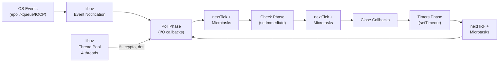

# Event Loop Phases and libuv Internals

---

### 🎯 Model Answer

**30 seconds:**

> libuv is the C library underlying Node.js that provides the event
> loop, I/O abstraction, and thread pool. The event loop has six phases
> in sequence: timers, pending callbacks, idle/prepare, poll, check,
> close callbacks. `process.nextTick` and Promise microtasks run
> between every phase (not in a phase - in between). The poll phase
> is where the event loop blocks waiting for I/O. libuv uses epoll
> (Linux), kqueue (macOS), or IOCP (Windows) for non-blocking network I/O,
> and a thread pool (4 threads by default) for file I/O, DNS, and crypto.

**3 minutes:**

**The poll phase is the heart of the event loop.** When the call stack
is empty and all microtasks (nextTick, Promises) are drained, the
event loop enters the poll phase. Here it:

1. Processes all ready I/O callbacks in the poll queue
2. If no pending timers or setImmediate: blocks indefinitely (sleep)
   until an OS event fires (TCP packet, file read complete)
3. If there are pending timers or setImmediate: blocks with a timeout

**Why blocking-sleep is correct:** When there's no work to do, the
process should yield the CPU. libuv calls `epoll_wait(fd, events, timeout)`
which suspends the thread until the OS has an event ready. This is
why Node.js uses near-zero CPU when idle (no polling loop needed).

**Thread pool (UV_THREADPOOL_SIZE):**
- Default: 4 threads
- Used for: `fs.*`, `dns.lookup()`, `crypto`, `zlib`
- Network I/O (TCP, UDP) does NOT use the thread pool - it uses
  non-blocking OS-level APIs (epoll/kqueue/IOCP)
- A large spike in `fs.readFile` calls can exhaust the thread pool

**Blank Mind Recovery:**

**(1) libuv:** "C library. Provides event loop + I/O abstraction across OS."

**(2) Six phases order:** "Timers -> pending -> idle -> poll -> check ->
close. nextTick between ALL phases."

**(3) Thread pool:** "4 threads (default). For fs, dns, crypto.
NOT for TCP/UDP (those use OS async)."

---

### 📘 Concept Explanation

**What it is:**

The architectural core of Node.js: libuv's event loop implementation,
its six phases, and how it bridges JavaScript to OS-level I/O.

**How it works:**

```
libuv event loop architecture:

  ┌─────────────────────────────────────┐
  │         Node.js Process             │
  │                                     │
  │  JavaScript (V8 engine)             │
  │  ┌─────────────────────────────┐   │
  │  │   Call Stack (synchronous)  │   │
  │  │   Microtask Queue (nextTick,│   │
  │  │   Promises)                 │   │
  │  └─────────────────────────────┘   │
  │                                     │
  │  libuv (C library)                 │
  │  ┌─────────────────────────────┐   │
  │  │    Event Loop (6 phases)    │   │
  │  │  Thread Pool (4 threads)    │   │
  │  │  Network I/O (OS-level)     │   │
  │  └─────────────────────────────┘   │
  └─────────────────────────────────────┘

Event loop phase details:

  Phase 1 - Timers:
    Runs expired setTimeout/setInterval callbacks.
    "Expired" = delay has passed since last poll phase.
    Not exact timing: timer fires at/after specified delay,
    not exactly at it.

  Phase 2 - Pending callbacks:
    Runs I/O callbacks deferred from the previous loop iteration
    (e.g., some TCP error callbacks).

  Phase 3 - Idle, Prepare:
    Internal use by libuv. Skip in understanding.

  Phase 4 - Poll:
    - Process incoming I/O events (file reads, network)
    - If poll queue empty + no pending timers:
        Block here waiting for OS events (epoll_wait/kqueue)
    - If poll queue empty + timers pending:
        Block for (time until next timer fires)
    - If setImmediate registered: proceed to check phase

  Phase 5 - Check:
    Runs setImmediate() callbacks.
    Always runs after poll phase.

  Phase 6 - Close callbacks:
    socket.on('close', ...), process.exit('close', ...) etc.

  Between EVERY phase:
    1. process.nextTick callbacks (drain completely)
    2. Promise microtask queue (drain completely)
    Recursive nextTick can starve the event loop!

  OS I/O implementations:
    Linux:  epoll_wait() - scalable event notification
    macOS:  kqueue() - BSD event notification
    Windows: IOCP (I/O Completion Ports)

  Thread pool (libuv):
    Used for: fs.readFile, fs.writeFile, dns.lookup,
    crypto (heavy ops), zlib
    NOT used: TCP, UDP, pipes, DNS over system resolver
    Threads: UV_THREADPOOL_SIZE env var (default 4, max 128)

  setImmediate vs setTimeout(fn,0) timing:
    Outside I/O callback: order is non-deterministic
    Inside I/O callback: setImmediate ALWAYS fires before setTimeout
    Reason: inside I/O = currently in poll phase.
    After poll: check phase (setImmediate) comes before
    next timers phase.
```

---

### 💻 Code Example

**Example (Internal Mechanism) - Event loop phase verification:**

```javascript
// Demonstrate phase ordering from inside I/O callback:
import { readFile } from 'fs';

readFile(__filename, () => {
  // We are now in the POLL phase callback.
  // After this callback: CHECK phase (setImmediate) runs,
  // then TIMERS phase (setTimeout).

  setTimeout(() => {
    console.log('1: setTimeout (timers phase)');
  }, 0);

  setImmediate(() => {
    console.log('2: setImmediate (check phase)');
  });

  process.nextTick(() => {
    console.log('3: nextTick (between-phase queue)');
  });

  Promise.resolve().then(() => {
    console.log('4: Promise microtask');
  });

  console.log('5: synchronous in I/O callback');
});

// Output ORDER (always, inside I/O callback):
// 5: synchronous in I/O callback
// 3: nextTick (between phases - runs before phase transition)
// 4: Promise microtask (microtask queue after nextTick)
// 2: setImmediate (check phase - next after poll)
// 1: setTimeout (timers phase - comes after check)

// Thread pool exhaustion test:
import crypto from 'crypto';
const UV_THREADPOOL_SIZE = parseInt(
  process.env.UV_THREADPOOL_SIZE ?? '4'
);

console.log('Thread pool size:', UV_THREADPOOL_SIZE);

// Fire 8 simultaneous crypto operations
// (default pool = 4, so 4 run first, 4 queue):
const start = Date.now();
let completed = 0;

for (let i = 0; i < 8; i++) {
  crypto.pbkdf2('password', 'salt', 100000, 64, 'sha512',
    () => {
      completed++;
      console.log(
        `pbkdf2 #${completed} done at +${Date.now()-start}ms`
      );
    }
  );
}
// With 4 threads: first 4 complete together (~1s),
// then next 4 complete together (~2s total)
// Shows thread pool batching
```

> **Code walkthrough:** The I/O callback ordering demonstrates phase
> sequencing precisely. After the poll callback completes, nextTick
> runs (between-phase), then Promise microtasks, then check phase
> (setImmediate), then the loop advances to timers phase (setTimeout).
> This is why setImmediate consistently beats setTimeout inside I/O
> callbacks - the check phase always precedes the next timers phase.
> The thread pool exhaustion test reveals parallel execution batching:
> with 4 threads, pbkdf2 operations batch into groups of 4. All 4
> complete at approximately the same time (~1 second), then the queued
> 4 begin. This demonstrates why UV_THREADPOOL_SIZE = CPU_CORES is
> optimal for CPU-bound thread pool operations.

---

### 📊 Diagram

```
Event loop and libuv flow:

  Incoming request (TCP connection)
         |
         v
  OS (epoll/kqueue/IOCP) notifies libuv
         |
         v
  libuv wakes event loop from poll phase
         |
         v
  I/O callback queued in poll phase
         |
         v
  JavaScript callback executes (V8)
         |
         v
  process.nextTick queue drains
         |
         v
  Promise microtask queue drains
         |
         v
  Event loop advances to next phase
```



> **Diagram walkthrough:** The event loop circles continuously through
> its six phases. The poll phase is central: OS events (network I/O via
> epoll) arrive here, waking the loop from its blocking wait. The thread
> pool is separate: file system, crypto, and DNS operations run in
> the pool's threads and post their completion callbacks to the poll
> phase. nextTick and microtask queues (shown between phases) are
> drained completely at every phase transition, before the loop advances.

---

### 🏛️ System Design

**Design: High-throughput Node.js service tuning**

For a Node.js service handling 10k req/s with mixed I/O workloads:

**Thread pool sizing:**
```
UV_THREADPOOL_SIZE = 2 * CPU cores
# For 8-core machine: 16 threads
# Rationale: thread pool workers are I/O bound (fs, dns),
# not CPU bound, so more than CPU count is beneficial
# Default 4 is almost always too small for production
```

**Event loop tuning:**
- Monitor p99 event loop lag (target <10ms)
- CPU-intensive routes -> worker thread pool (piscina)
- Batch I/O operations to reduce poll phase overhead

**Clustering:**
```javascript
import cluster from 'cluster';
import { cpus } from 'os';

if (cluster.isPrimary) {
  const numCPUs = cpus().length;
  for (let i = 0; i < numCPUs; i++) {
    cluster.fork();  // one Node.js process per core
  }
  cluster.on('exit', (worker) => cluster.fork()); // restart
} else {
  // each worker runs the HTTP server
  startServer();
}
```

**Cluster + worker threads:**
- Cluster: horizontal scale (one process per core, shared port)
- Worker threads: per-request CPU work within each process
- Combined: full use of all cores for both I/O and CPU

---

### ⚖️ Comparison Table

| Mechanism | Purpose | Runs on thread | Blocks JS? |
|---|---|---|---|
| Event loop | I/O + callbacks | Main thread | No |
| Thread pool | fs, dns, crypto | Worker threads | No |
| V8 GC | Memory reclaim | Main thread | Yes (briefly) |
| Worker threads | CPU parallelism | Worker threads | No |

---

### 🎓 Answers by Seniority

**Junior / Mid:**

> libuv is the C library that gives Node.js its non-blocking I/O. The
> event loop has six phases. The poll phase processes I/O events and
> can block (sleep) when there's nothing to do. `process.nextTick`
> runs between every phase. libuv has a thread pool of 4 threads for
> file system, DNS, and crypto - not for network I/O.

**Senior / Staff:**

> The nuances that matter in production: the thread pool is the
> overlooked bottleneck. All `fs.*` calls compete for 4 threads (by
> default). A burst of file operations creates a queue. `UV_THREADPOOL_SIZE`
> should be set based on I/O intensity, not CPU count. Network I/O
> bypasses the thread pool entirely - it uses OS event notification.
> The poll phase blocking-sleep means Node.js uses near-zero CPU when
> idle - this is why it's efficient for many long-lived connections
> (chat servers, webhooks). The nextTick/microtask queues draining
> between phases means a recursive nextTick can starve I/O - classic
> production gotcha.

---

### ⚠️ Common Misconceptions

**Misconception: `process.nextTick` is the "next tick" of the event loop.**

`process.nextTick` runs before the next event loop phase - technically
WITHIN the current iteration. "Next tick" refers to "before the loop
advances", not "at the next iteration". This is why it can starve the
event loop: if `nextTick` callbacks recursively schedule more `nextTick`
callbacks, the event loop never advances.

---

### 🚨 Failure Modes and Diagnosis

**Failure: DNS resolution is slow, causes request timeouts.**

Cause: `dns.lookup()` (used by default in net.connect, http.request)
goes through the thread pool. If the pool is exhausted with 4 threads
handling other operations, DNS lookups queue.

Diagnose:
```javascript
// Check DNS resolution time:
const start = Date.now();
import dns from 'dns';
dns.lookup('api.external.com', (err, address) => {
  console.log(`DNS: ${Date.now()-start}ms, addr: ${address}`);
});
// >100ms consistently = thread pool saturation

// Fix: increase thread pool:
// UV_THREADPOOL_SIZE=16 node server.js

// Or: use dns.resolve() (uses system resolver, bypasses pool):
dns.resolve4('api.external.com', (err, addresses) => {
  console.log(addresses[0]);
});
```

---

### 🎯 Interview Deep-Dive

| Question | Type | Difficulty | Time |
|---|---|---|---|
| What is libuv? | Definition | ★★☆ | 2 min |
| Walk me through the 6 event loop phases | Mechanism | ★★★ | 5 min |
| Why does setImmediate fire before setTimeout inside I/O? | Mechanism | ★★★ | 4 min |
| What does the thread pool handle vs OS event APIs? | Mechanism | ★★★ | 4 min |
| How do you diagnose thread pool exhaustion? | Debugging | ★★★ | 4 min |
| How would you tune UV_THREADPOOL_SIZE? | Production | ★★★ | 3 min |
| What happens if nextTick calls itself recursively? | Failure | ★★★ | 3 min |
| How does the poll phase's blocking wait work? | Mechanism | ★★★ | 4 min |
| epoll vs kqueue vs IOCP - what's the difference? | Theory | ★★★ | 3 min |
| How would you monitor event loop health in prod? | Production | ★★★ | 3 min |
| What is the relationship between V8 and libuv? | Definition | ★★★ | 2 min |
| How does Node.js handle 10k concurrent connections? | Scale | ★★★ | 4 min |

**Q: What happens step-by-step when you call `http.get('https://api.com/data', cb)`?**

A:

1. `http.get` creates a `ClientRequest` object
2. `ClientRequest` calls `dns.lookup` to resolve `api.com`
3. `dns.lookup` submits to the libuv thread pool
4. Thread pool runs the OS `getaddrinfo()` system call
5. When DNS resolves: thread posts result to the main event loop
6. Poll phase picks up the DNS callback: IP address available
7. libuv creates a TCP socket, calls `connect()` with non-blocking flag
8. OS registers the socket with epoll (Linux) for writable notification
9. Event loop returns to poll, waits for OS event
10. TCP handshake completes: OS signals libuv
11. libuv runs the connection callback
12. TLS handshake executes (using libuv crypto ops)
13. HTTP request bytes written to socket (non-blocking write)
14. OS delivers response bytes: epoll notifies libuv
15. Response data events fire on readable stream
16. User's `cb` called with response when headers received

*What separates good from great:* Understanding that DNS is the
hidden thread pool dependency. Many production issues with slow
`http.request` performance trace back to DNS lookup thread pool
contention, not the network itself.
