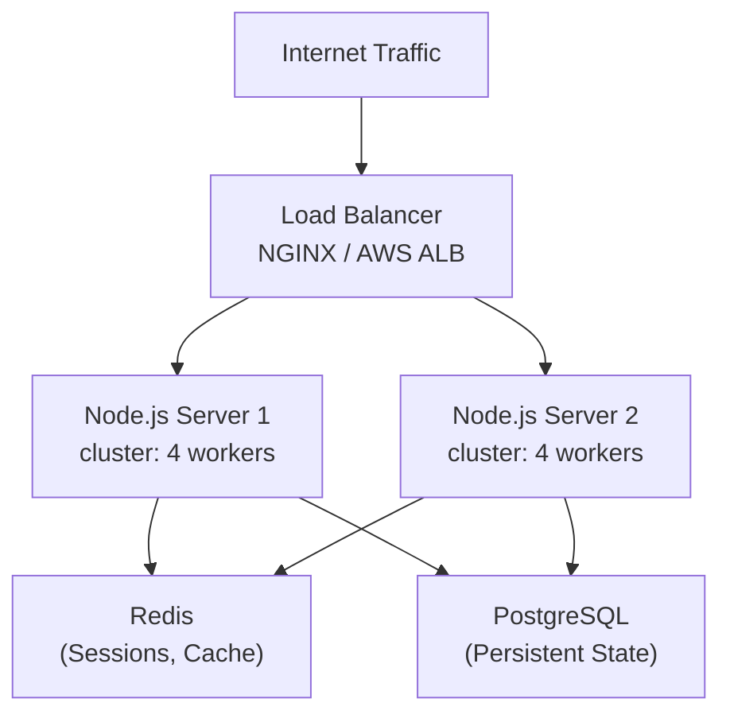

# Clustering and Horizontal Scaling

---

### 🎯 Model Answer

**30 seconds:**

> Node.js is single-threaded: one process uses one CPU core. Clustering
> spawns N worker processes (one per CPU core), all sharing the same
> port via OS-level load balancing. The primary process manages workers;
> if one crashes, it restarts. Beyond cluster: horizontal scaling means
> multiple machines behind a load balancer (NGINX, AWS ALB). State
> must move out of process memory into shared stores (Redis for sessions,
> PostgreSQL for persistent state) so any worker can handle any request.

**3 minutes:**

**The scaling problem:** A 16-core server with one Node.js process
uses 1/16th of its CPU capacity. Cluster spawns 16 processes; each
handles a subset of requests.

**Cluster module internals:**
- Primary process binds the socket (`listen()`)
- Workers receive socket file descriptors via IPC
- OS distributes new connections across workers
- Default algorithm: round-robin (Linux/macOS)
- Primary's job: manage workers, not handle requests

**Beyond single machine:**
1. Multiple machines + load balancer (NGINX, AWS ALB)
2. Load balancer needs session affinity disabled
   (requires stateless auth - JWTs, not session cookies)
3. Health checks: `/health` endpoint for load balancer
4. Graceful shutdown: drain in-flight requests before stopping

**Blank Mind Recovery:**

**(1) Why:** "Single-threaded = 1 core. Cluster = N processes = N cores."

**(2) How:** "Primary binds port. Workers share it. OS load-balances."

**(3) Stateless:** "Session in Redis, not memory. Any worker handles
any request."

---

### 📘 Concept Explanation

**What it is:**

Techniques for scaling Node.js beyond a single process: the cluster
module for multi-core utilization and horizontal scaling for multi-machine
deployments.

**How it works:**

```
Cluster module architecture:

  ┌──────────────────────────────────────┐
  │         Primary Process              │
  │  - Manages worker lifecycle          │
  │  - Restarts crashed workers          │
  │  - Does NOT handle HTTP requests     │
  │  - IPC channel to each worker        │
  └────────────┬─────────────────────────┘
               │ fork N times
               │ (N = CPU cores)
   ┌───────────┴────────────────────────┐
   │                                    │
   ▼                                    ▼
  Worker 1 (port 3000)   Worker 2 (port 3000)
  Worker 3 (port 3000)   Worker 4 (port 3000)
  (all share same port via SO_REUSEPORT / IPC fd)
                │
                ▼
         OS distributes connections
         (round-robin by default on Linux)

Graceful shutdown pattern:
  1. Signal (SIGTERM) received by primary
  2. Primary sends shutdown signal to all workers
  3. Each worker stops accepting new connections:
     server.close(() => process.exit(0))
  4. Existing connections drain (finish processing)
  5. Worker exits cleanly
  6. Primary exits when all workers done

PM2 (production process manager):
  pm2 start server.js -i max   # cluster mode, all cores
  pm2 start server.js -i 4     # 4 instances
  pm2 reload server.js         # zero-downtime reload
  pm2 logs                     # unified logs
  pm2 monit                    # process monitor

  PM2 advantages over manual cluster:
    - Automatic restart on crash
    - Log aggregation
    - Zero-downtime reload (rolling restart)
    - Process monitoring dashboard
    - Startup script generation (systemd)
```

---

### 💻 Code Example

**Example (Production) - Cluster with graceful shutdown:**

```javascript
import cluster from 'cluster';
import { cpus } from 'os';
import process from 'process';

const numCPUs = cpus().length;

if (cluster.isPrimary) {
  console.log(`Primary ${process.pid} starting ${numCPUs} workers`);

  // Spawn workers:
  for (let i = 0; i < numCPUs; i++) {
    cluster.fork();
  }

  // Restart crashed workers:
  cluster.on('exit', (worker, code, signal) => {
    if (!worker.exitedAfterDisconnect) {
      // Unexpected crash - restart:
      console.error(
        `Worker ${worker.process.pid} died (${signal ?? code})`
      );
      cluster.fork();
    }
  });

  // Graceful shutdown:
  process.on('SIGTERM', () => {
    console.log('Primary received SIGTERM, shutting down...');
    for (const worker of Object.values(cluster.workers)) {
      worker.send('shutdown');
    }
    // Force exit after 30s if workers don't drain:
    setTimeout(() => process.exit(0), 30000);
  });

} else {
  // Worker process:
  const { createServer } = await import('./server.js');
  const server = createServer();
  server.listen(3000);

  process.on('message', (msg) => {
    if (msg === 'shutdown') {
      server.close(() => {
        console.log(`Worker ${process.pid} done`);
        process.exit(0);
      });
    }
  });

  // Health endpoint (each worker responds):
  // GET /health -> { status: 'ok', pid: process.pid }
}

// Stateless requirement:
// BAD: session in memory (only works for single process):
const sessions = new Map(); // lost on worker restart!
app.use((req, res, next) => {
  req.session = sessions.get(req.cookies.sessionId) ?? {};
  next();
});

// GOOD: session in Redis (shared across all workers):
import session from 'express-session';
import RedisStore from 'connect-redis';
import { createClient } from 'redis';

const redisClient = createClient({ url: process.env.REDIS_URL });
await redisClient.connect();

app.use(session({
  store: new RedisStore({ client: redisClient }),
  secret: process.env.SESSION_SECRET,
  resave: false,
  saveUninitialized: false,
  cookie: { secure: true, httpOnly: true, maxAge: 86400000 }
}));
```

> **Code walkthrough:** `cluster.isPrimary` splits the same file into
> primary and worker behavior. The primary only manages lifecycle -
> forking, restarting on crash, graceful shutdown. Workers are complete
> Express servers, each listening on port 3000. The OS routes connections
> to any available worker. `worker.exitedAfterDisconnect` distinguishes
> intentional shutdown from crashes. The graceful shutdown sequence is
> critical: workers stop accepting new connections (`server.close()`),
> drain existing requests, then exit. The Redis session pattern is
> non-negotiable for clustered servers: in-memory state only exists
> in one worker's memory - the next request from the same user may
> hit a different worker.

---

### 📊 Diagram

```
Horizontal scaling architecture:

  Internet
     |
     v
  Load Balancer (NGINX / AWS ALB)
     |          |
     v          v
  Server 1   Server 2
  (4 cores)  (4 cores)
  cluster    cluster
  4 workers  4 workers
     |          |
     v          v
  Redis (sessions, cache)
  PostgreSQL (persistent state)
```



> **Diagram walkthrough:** The two-tier scaling model: cluster provides
> vertical scaling (use all cores on one machine); horizontal scaling
> (multiple machines) multiplies that by the number of instances. The
> load balancer distributes traffic without session affinity (any server
> can handle any request). Redis is the shared state layer: sessions,
> distributed locks, caches, pub/sub. All stateful operations use Redis
> or PostgreSQL, never in-process memory.

---

### 🏛️ System Design

**Design: Zero-downtime deployment for a clustered Node.js service**

**Problem:** How to deploy new code without dropping live requests?

**Solution: Rolling restart with PM2:**
```bash
# PM2 rolling restart (replaces workers one at a time):
pm2 reload server

# Internally:
# 1. Fork new worker with new code
# 2. Wait for new worker to signal ready (cluster.worker.process.send('ready'))
# 3. Disconnect old worker (drains connections)
# 4. Repeat for each worker

# In server code - signal ready after binding:
server.listen(PORT, () => {
  process.send?.('ready'); // PM2 listens for this
});
```

**Kubernetes rolling update:**
```yaml
strategy:
  type: RollingUpdate
  rollingUpdate:
    maxSurge: 1        # start 1 new pod before killing old
    maxUnavailable: 0  # never kill old pod until new is ready
```

**Requirements for zero-downtime:**
1. `/health` returns 200 only when server is ready
2. Graceful shutdown: drain in-flight requests before exit
3. Stateless: any worker can handle any request
4. Short connection drain timeout: 30s max before force-kill

---

### ⚖️ Comparison Table

| Strategy | Handles CPU bottleneck | Multi-machine | Complexity |
|---|---|---|---|
| Single process | No | No | Lowest |
| Cluster module | Yes (all cores) | No | Low |
| PM2 cluster | Yes | No | Low |
| K8s Deployment | Yes (via HPA) | Yes | High |

---

### 🎓 Answers by Seniority

**Junior / Mid:**

> Node.js is single-threaded so by default it only uses one CPU core.
> The cluster module spawns one process per core, all sharing the same
> port. The primary manages worker lifecycle. For multiple machines,
> put a load balancer in front. Sessions must be in Redis, not memory,
> so any worker can handle any request.

**Senior / Staff:**

> Cluster is the foundation, but production systems use PM2 or
> Kubernetes. Key insight: horizontal scaling requires stateless workers.
> This means: JWT auth (not session cookies that need a store), Redis
> for any shared state, no local file system assumptions (use S3/blob
> storage). Graceful shutdown is non-negotiable for Kubernetes: SIGTERM
> -> drain connections -> exit 0. The default 30s termination grace
> period must match your `server.close()` timeout. `maxUnavailable: 0`
> in K8s rolling updates ensures no capacity reduction during deploy.

---

### ⚠️ Common Misconceptions

**Misconception: Cluster module provides load balancing.**

The cluster module shares a socket across workers. The OS (or libuv's
round-robin on some platforms) distributes connections. This is not
true load balancing - it doesn't consider worker CPU or memory load.
A slow worker keeps accepting connections. True load balancing requires
an external proxy (NGINX, HAProxy, K8s Service) that can route based
on health and capacity.

---

### 🚨 Failure Modes and Diagnosis

**Failure: Cluster workers crash repeatedly in a loop.**

Cause: Worker crashes immediately after start (config error, port
already in use, missing env vars).

Diagnose:
```bash
# Run single worker without cluster to see startup error:
node server.js
# Or: temporarily log crash reason in primary:
cluster.on('exit', (worker, code, signal) => {
  console.error(`Worker exited: code=${code} signal=${signal}`);
  // If code=1 and immediate: startup error
  // Check: node server.js directly
});
```

Fix: Add startup delay between restarts to avoid rapid respawn:
```javascript
cluster.on('exit', (worker) => {
  setTimeout(() => cluster.fork(), 1000); // 1s delay
});
```

---

### 🎯 Interview Deep-Dive

| Question | Type | Difficulty | Time |
|---|---|---|---|
| Why use cluster in Node.js? | Definition | ★★☆ | 2 min |
| How does cluster share a port? | Mechanism | ★★★ | 3 min |
| What is graceful shutdown? | Production | ★★★ | 3 min |
| Why must clustered services be stateless? | Design | ★★★ | 3 min |
| PM2 vs Kubernetes - when to use each? | Decision | ★★★ | 3 min |
| How do you do zero-downtime deploys? | Production | ★★★ | 4 min |
| Cluster vs Worker Threads - difference? | Comparison | ★★★ | 3 min |
| How does load balancing work with cluster? | Mechanism | ★★★ | 3 min |
| What happens to in-flight requests during shutdown? | Failure | ★★★ | 3 min |
| How do you scale Node.js to 100k req/s? | Scale | ★★★ | 5 min |
| What monitoring do you add to a clustered app? | Production | ★★★ | 3 min |
| How would you implement rate limiting across workers? | Design | ★★★ | 4 min |

**Q: How would you scale a Node.js service from 1k to 100k req/s?**

A:

**Step 1 (1k -> 10k req/s): Use all cores.**
Single process -> cluster module or PM2. One process per core.
Profile and eliminate any event loop blocking.

**Step 2 (10k -> 50k): Add caching.**
- Cache database query results in Redis (TTL 60s)
- Cache rendered responses where possible
- Connection pooling: pg-pool, ioredis connection pool

**Step 3 (50k -> 100k): Horizontal scaling.**
- Multiple machines behind load balancer (NGINX/ALB)
- Auto-scaling group: add machines under load
- Database: read replicas for queries, connection pool
- Redis cluster: distribute cache across nodes

**Step 4: Architecture optimizations.**
- HTTP/2 multiplexing for API clients
- Response streaming for large payloads
- Message queue for async heavy operations (Bull/BullMQ)
- CDN for static assets and edge caching

*What separates good from great:* Understanding that 100k req/s
is a data access problem, not a Node.js problem. At that scale,
the database becomes the bottleneck. Node.js handles the I/O
fanout efficiently; the architectural challenge is avoiding
database saturation (connection limits, query load). Read replicas,
caching layers, and connection pooling are the tools.
