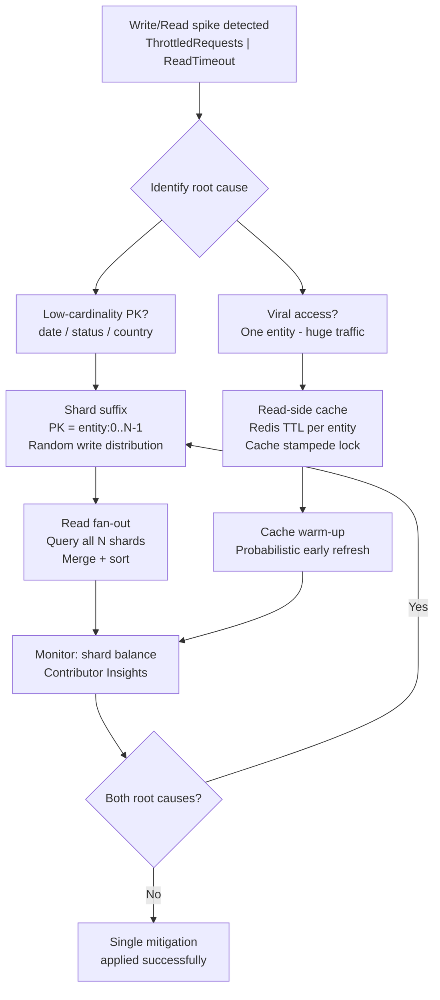

## Keywords in This File
{: .no_toc }

| # | Keyword | Weight |
|---|---|---|
| 1 | [Hot Partition Diagnosis and Mitigation](#hot-partition-diagnosis-and-mitigation) | ★★★ |

---

# Hot Partition Diagnosis and Mitigation

---

### 🎯 Model Answer

**30 seconds:**
> A hot partition occurs when one partition key receives disproportionately more traffic
> than others, causing that partition's node to become a bottleneck while other nodes
> remain underutilized. In Cassandra: one partition key (date, user status) receives all
> writes. In DynamoDB: one partition key exceeds 3,000 RCU or 1,000 WCU per second. In
> Redis Cluster: one hash slot receives all traffic. Diagnosis: look for throttling on
> specific keys, uneven node CPU/write rates, and low-cardinality partition keys. Fix:
> add a suffix or bucket to the partition key to distribute load.

**3 minutes (Senior):**
> Hot partition root causes: (1) Low-cardinality partition key - using `date`, `status`,
> `country`, or `user_type` as the partition key concentrates writes when one value
> dominates the data. (2) Viral content pattern - in social media, a single post or user
> goes viral; all reads/writes concentrate on that partition key. (3) Monotonically
> increasing partition key - using `timestamp` or auto-increment ID as partition key;
> all writes go to the "current" partition. (4) Sequential access patterns - caches where
> one object is accessed millions of times per second.
>
> Mitigation strategies: (1) Key suffix (shard key) - append a random suffix (0-N) to
> the partition key; N is the number of shards; distribute writes across N partitions;
> reads must fan out to all N partitions. (2) Write-side aggregation - accumulate writes
> in a queue or buffer; batch-flush to NoSQL; reduces hot partition write pressure.
> (3) Read-side caching - cache the hot partition's data in Redis; remove read pressure
> from the hot NoSQL partition. (4) Shard by access pattern - different access patterns
> get different tables/collections; viral content gets a separate hot-path table.

**Framework:** Identify -> Quantify -> Root cause -> Mitigation strategy -> Verify

**Blank Mind Recovery:**

**(1) Restate:** "Hot partition = one key gets more traffic than the node can handle.
Cause: low-cardinality key or viral access. Fix: add a random suffix (buckets) to spread
load. Reads must fan out to all buckets and merge."

**(2) First principles:** "Distributed databases distribute data by hashing partition
keys across nodes. If the partition key has low cardinality (few distinct values), few
nodes receive all the data. Traffic is distributed by key value, not by data volume.
The only way to increase parallelism is to increase the number of distinct partition key
values - which means changing the key."

**(3) Bridge:** "A hot partition is like having 1 cashier in a supermarket handle all
the customers while 9 cashiers are idle. The customer routing rule (partition key)
sends everyone to the same cashier (same node). Fix: change the routing rule to send
customers to different cashiers (add a bucket to the key) - but now some customers
(reads) must check multiple cashiers (fan-out) to find their item."

---

### 📘 Concept Explanation

**Hot Partition Taxonomy:**

```text
HOT PARTITION PATTERNS:

  1. LOW-CARDINALITY KEY:
     partition_key = "status:active"
     -> ALL active users -> 1 node
     -> "status:inactive" -> 1 different node
     -> Only 2 nodes receive any data!
     -> At 10K writes/second, both nodes overloaded

  2. TEMPORAL KEY:
     partition_key = date (e.g., "2024-01-15")
     -> All today's writes -> 1 node
     -> Yesterday's data -> 1 different node (idle)
     -> Write rate grows with data volume
     -> N nodes, but only 1 is active today

  3. VIRAL ACCESS:
     partition_key = post_id
     -> Viral post "post:999999"
     -> 10M reads/second to one partition
     -> Normal posts: 10 reads/second each
     -> Node holding post:999999 overwhelmed

  4. MONOTONIC KEY (write pattern):
     partition_key = user_id (auto-increment)
     -> New user IDs always > existing IDs
     -> Latest partition = most writes
     -> (Less common in NoSQL, more in SQL)

  HOT PARTITION INDICATORS:
  - Cassandra: one node CPU >> others
  - DynamoDB: ThrottledRequests on specific PK
  - Redis Cluster: one shard memory/CPU >> others
  - Application: slow reads/writes on specific entity
  - Monitoring: latency spike for subset of keys
```

> **Diagram walkthrough:** (1) WHAT IT DEPICTS: the four hot partition patterns with the
> access distribution for each, showing how different key design choices concentrate
> traffic onto specific nodes. (2) HOW TO READ IT: each pattern shows the partition key
> choice, the resulting data distribution, and the hot node indicator. (3) KEY
> RELATIONSHIP: all hot partition patterns share the same root cause - insufficient
> partition key cardinality or skewed access distribution relative to the key space;
> the fix in all cases is to increase the effective cardinality of the partition key.
> (4) EDGE CASE: pattern 3 (viral access) is the hardest to fix because the partition
> key (post_id) has perfect cardinality in theory; the problem is a temporary access
> skew, not a structural key design problem; the fix requires read-side caching, not
> partition key redesign. (5) INSIGHT: a senior engineer distinguishes between structural
> hot partitions (caused by key design - patterns 1, 2, 4) and access hot partitions
> (caused by traffic patterns - pattern 3); structural hot partitions require schema
> changes; access hot partitions require caching and read distribution.

**Mitigation Strategies:**

```text
MITIGATION STRATEGY COMPARISON:

  STRATEGY 1: KEY SUFFIX (SHARDING)
  Original key:  "event:2024-01-15"
  Sharded keys:  "event:2024-01-15:0"
                 "event:2024-01-15:1"
                 ...
                 "event:2024-01-15:9"
  Write: random_suffix = random(0,9)
         write to "event:2024-01-15:{suffix}"
  Read:  fan-out to all 10 suffixes + merge
  Pros:  eliminates hot partition
  Cons:  read complexity (N queries instead of 1)
         scatter-gather latency

  STRATEGY 2: WRITE BUFFER + BATCH FLUSH
  Write: -> Redis list (fast) -> batch pop -> NoSQL
  Pros:  absorbs write spikes
  Cons:  adds write latency (async)
         Redis becomes dependency
         data loss risk if Redis crashes

  STRATEGY 3: READ-SIDE CACHE
  Read:  Redis GET(key) -> hit: return
                        -> miss: NoSQL + Redis SET
  Pros:  removes read load from hot NoSQL partition
  Cons:  cache invalidation complexity
         only fixes read hot partitions

  STRATEGY 4: DEDICATED HOT-PATH TABLE
  Regular: writes to main table (PK = post_id)
  Viral:   writes to hot_content table
            (separate compaction, nodes, cache)
  Pros:  isolation; hot traffic doesn't impact normal
  Cons:  requires detecting "hot" content at write time
         schema duplication
```

> **Diagram walkthrough:** (1) WHAT IT DEPICTS: four hot partition mitigation strategies
> showing the trade-offs of each approach with write/read path examples. (2) HOW TO READ
> IT: each strategy block shows the write path, read path, pros, and cons; compare
> strategies based on the application's read-write ratio and latency requirements. (3)
> KEY RELATIONSHIP: key suffix (strategy 1) is the universal fix for structural hot
> partitions; read-side cache (strategy 3) is the universal fix for read hot partitions;
> write buffer (strategy 2) is appropriate for bursty write workloads where latency
> tolerance exists. (4) EDGE CASE: combining strategies is often necessary; viral content
> benefits from both read-side cache (reduce read pressure) AND key suffix (distribute
> write pressure); using only one strategy may not fully resolve the hot partition. (5)
> INSIGHT: a senior engineer measures the read/write ratio for the hot partition before
> choosing a strategy; if reads dominate (viral post), use read-side cache; if writes
> dominate (date-based partition), use key suffix; if both, use both.

---

### 💻 Code Example

```python
# BAD: DynamoDB with date as partition key
# -> hot partition for today's events

import boto3
from datetime import date, datetime

dynamo = boto3.resource("dynamodb")
table = dynamo.Table("sensor_events")

# BAD: all today's writes go to the same partition
def log_event_bad(sensor_id: str, event_data: dict):
    table.put_item(Item={
        "date": str(date.today()),  # partition key
        "sensor_id": sensor_id,    # sort key
        "timestamp": datetime.now().isoformat(),
        **event_data
    })
# All writes for today -> same partition -> throttling
# ThrottledRequests metric spikes in CloudWatch
```

> **Code walkthrough:** (1) WHAT IT SHOWS: the classic DynamoDB hot partition anti-pattern
> using `date` as the partition key, causing all today's writes to go to a single
> partition. (2) KEY MECHANISM: DynamoDB routes requests based on the hash of the
> partition key; `date.today()` returns the same string for all writes on the same day;
> all same-day writes hash to the same partition, which is on one DynamoDB server.
> (3) WHY IT MATTERS: a DynamoDB partition has a hard limit of 1,000 WCUs per second;
> if the application writes 2,000 events per second, all to the same partition, writes
> are throttled even if the total table capacity is 100,000 WCUs. (4) WHAT BREAKS:
> `ThrottledRequests` metric in CloudWatch spikes for this table; the application
> receives `ProvisionedThroughputExceededException` errors and must retry; at high rates,
> retries amplify the problem (retry storm). (5) TAKEAWAY: never use a date or time
> value as the sole partition key in a write-heavy DynamoDB table; the date key is a
> guaranteed hot partition pattern.

```python
# GOOD: DynamoDB with shard suffix to distribute load

import random

# GOOD: distribute writes across 10 "buckets" per date
SHARD_COUNT = 10

def log_event_good(sensor_id: str, event_data: dict):
    shard = random.randint(0, SHARD_COUNT - 1)
    table.put_item(Item={
        "date_shard": f"{date.today()}#{shard}",  # PK
        "sensor_id": sensor_id,                   # SK
        "timestamp": datetime.now().isoformat(),
        **event_data
    })
# Writes distributed across 10 partitions
# Each partition receives 1/10 of the total writes
# No single partition is throttled

# Read: must query all shards and merge results
def get_events_for_date(target_date: str):
    results = []
    for shard in range(SHARD_COUNT):
        pk = f"{target_date}#{shard}"
        response = table.query(
            KeyConditionExpression=(
                "date_shard = :pk"
            ),
            ExpressionAttributeValues={":pk": pk}
        )
        results.extend(response["Items"])
    return sorted(results, key=lambda x: x["timestamp"])
```

> **Code walkthrough:** (1) WHAT IT SHOWS: the shard suffix pattern that distributes
> DynamoDB writes across 10 partitions by appending a random shard number to the date
> partition key. (2) KEY MECHANISM: `f"{date.today()}#{shard}"` creates 10 distinct
> partition keys per date; writes are randomly distributed across the 10 partitions;
> each partition receives ~1/10 of the write rate; if total writes are 2,000/second,
> each partition receives ~200/second (well within the 1,000 WCU limit). (3) WHY IT
> MATTERS: this pattern eliminates the structural hot partition; the cost is that reads
> must fan out to all 10 partitions and merge results (a scatter-gather operation).
> (4) WHAT BREAKS: if `SHARD_COUNT` is too large, read fan-out becomes expensive
> (100 queries instead of 1); if too small, hot partitions may recur under extreme load;
> a starting value of 10 is appropriate for most use cases; increase if throttling
> returns. (5) TAKEAWAY: the shard suffix trades write distribution for read complexity;
> always measure the read frequency for the entity before choosing the shard count;
> for write-heavy, read-light entities (event logging), a high shard count is acceptable.

```python
# Viral content hot partition: read-side Redis cache
# for DynamoDB hot partition mitigation

import redis
import json

redis_client = redis.Redis(host="redis", port=6379)

CACHE_TTL_SECONDS = 60  # 1-minute cache for viral content

def get_post(post_id: str) -> dict:
    """Get post with Redis caching to handle viral traffic."""
    cache_key = f"post:{post_id}"

    # Check Redis cache first
    cached = redis_client.get(cache_key)
    if cached:
        return json.loads(cached)

    # Cache miss: fetch from DynamoDB (hot partition)
    response = table.get_item(
        Key={"post_id": post_id}
    )
    post = response.get("Item")
    if not post:
        return None

    # Cache in Redis with TTL
    # Only cache if this is a popular post
    # (to avoid caching rarely-accessed posts)
    redis_client.setex(
        cache_key,
        CACHE_TTL_SECONDS,
        json.dumps(post)
    )
    return post

# Cache stampede prevention for viral posts:
# Use Redis SET NX (set if not exists) for lock
def get_post_with_lock(post_id: str) -> dict:
    """Prevents cache stampede on cache miss."""
    cache_key = f"post:{post_id}"
    lock_key  = f"lock:post:{post_id}"

    # Try cache first
    cached = redis_client.get(cache_key)
    if cached:
        return json.loads(cached)

    # Try to acquire lock (only one thread rebuilds cache)
    acquired = redis_client.set(
        lock_key, "1", nx=True, ex=5
    )
    if acquired:
        # This thread rebuilds the cache
        post = _fetch_from_dynamo(post_id)
        if post:
            redis_client.setex(
                cache_key, CACHE_TTL_SECONDS,
                json.dumps(post)
            )
        redis_client.delete(lock_key)
        return post
    else:
        # Another thread is rebuilding; wait briefly
        import time
        time.sleep(0.05)
        cached = redis_client.get(cache_key)
        if cached:
            return json.loads(cached)
        # Fallback: fetch directly from DynamoDB
        return _fetch_from_dynamo(post_id)

def _fetch_from_dynamo(post_id: str) -> dict:
    response = table.get_item(
        Key={"post_id": post_id}
    )
    return response.get("Item")
```

> **Code walkthrough:** (1) WHAT IT SHOWS: a two-layer pattern combining a read-aside
> Redis cache with a distributed lock to prevent cache stampede on viral content;
> DynamoDB hot partition reads are absorbed by Redis. (2) KEY MECHANISM: the first
> function (`get_post`) is a simple cache-aside; the second (`get_post_with_lock`)
> adds a Redis `SET NX` lock so that only one thread rebuilds the cache on miss,
> preventing all concurrent requests from hitting DynamoDB simultaneously. (3) WHY IT
> MATTERS: without the lock, a cache expiry for a viral post triggers a stampede -
> all in-flight requests miss the cache and simultaneously hit DynamoDB; the DynamoDB
> partition experiences a burst equal to the number of concurrent requests, potentially
> causing throttling. (4) WHAT BREAKS: the lock approach has a failure mode: if the
> thread holding the lock crashes before setting the cache, the lock expires after 5
> seconds and another thread rebuilds; some requests fall back to DynamoDB during the
> 5-second window. (5) TAKEAWAY: use the lock-based cache rebuild pattern for high-
> traffic entities; accept the small window of DynamoDB fallback; 5 seconds of slightly
> elevated DynamoDB traffic is better than a full stampede every cache TTL.

---

### 🎓 Answers by Seniority

**Junior / Mid (0-5 years):**
> A hot partition is when one partition key gets much more traffic than others, overloading
> the node that stores it. Common cause: using a low-cardinality value (date, status) as
> the partition key, or one piece of content going viral. Fix: add a random number (0-9)
> suffix to the partition key to spread writes across 10 partitions. Reads must query all
> 10 partitions and merge results. For read-heavy hot partitions (viral content), add a
> Redis cache in front of the NoSQL database to absorb read traffic.

---

**Senior / Staff (5+ years):**
> Hot partition diagnosis workflow: (1) DynamoDB: enable Contributor Insights to see
> which partition keys are hottest; CloudWatch metric `ThrottledRequests` per table;
> `ConsumedReadCapacityUnits`/`ConsumedWriteCapacityUnits` by partition key. (2) Cassandra:
> `nodetool tpstats` to compare thread pool activity across nodes; `nodetool cfstats` for
> per-table read/write rates; Cassandra's built-in `system.size_estimates` for partition
> size distribution. (3) Redis Cluster: `redis-cli --cluster info` to see memory and
> key distribution per shard; `INFO keyspace` per node to compare key counts.
>
> Mitigation decision tree: If the hot partition is write-caused (structural key design):
> use shard suffix (immediate, zero downtime). If read-caused (viral content): use read-
> side cache (immediate, zero downtime). If both: use both. If the entity has a natural
> write-side aggregation (counters, metrics): use write aggregation + batch flush.
>
> Zero-downtime migration: changing the partition key requires writing to both old and
> new schemas simultaneously (dual write), migrating existing data, and then switching
> reads to the new schema. The dual-write window typically requires a data backfill job
> and careful cutover.

---

### ⚠️ Common Misconceptions

**Misconception 1: "Increasing provisioned capacity fixes hot partitions in DynamoDB."**

Increasing table-level provisioned capacity (RCUs/WCUs) does NOT fix a hot partition
because DynamoDB distributes capacity evenly across partitions. If a table has 10
partitions and 10,000 WCUs, each partition has 1,000 WCUs. If one partition receives
80% of writes (8,000 WCUs worth), it will be throttled regardless of the table total.
Increasing the table to 100,000 WCUs gives each partition 10,000 WCUs, which is enough
for the hot partition - but 9 other partitions are receiving 200 WCUs each, wasting 98%
of the provisioned capacity. The correct fix is partition key redesign.

The only exception: DynamoDB on-demand mode. With on-demand pricing, DynamoDB
automatically scales capacity to match traffic, including hot partitions (up to the
previous peak or 40,000 WCUs per table). On-demand mode absorbs structural hot partitions
at higher cost. It is a short-term mitigation, not a permanent solution.

**Misconception 2: "A read-side cache completely solves the hot partition problem."**

A read-side cache (Redis) absorbs read pressure, but: (1) it does not help write hot
partitions; if 90% of writes go to one partition key, caching does nothing for the write
bottleneck. (2) Caches have warm-up time; on cold starts (server restart, cache eviction),
all traffic hits the database until the cache is warm; for viral content with sudden
spikes, the cache may not be warm when the spike hits. (3) Cache misses during high
traffic still reach the database; the cache stampede problem requires additional
mitigation (probabilistic early expiration, lock-based refresh).

---

### 🚨 Failure Modes and Diagnosis

**Failure Mode 1: DynamoDB write throttling on a specific partition key.**

Symptom: `ProvisionedThroughputExceededException` errors; AWS CloudWatch
`ThrottledRequests` metric increasing; application retry storms.
Root cause: hot partition; one partition key receives more WCUs than its per-partition
limit.

Diagnosis:

```bash
# Enable DynamoDB Contributor Insights (via AWS CLI)
aws dynamodb enable-kinesis-streaming-destination \
  --table-name MyTable \
  --stream-arn arn:aws:kinesis:...

# Or use CloudWatch Contributor Insights
aws cloudwatch get-insight-rule-report \
  --rule-name "DynamoDB-hotPartitions-MyTable" \
  --start-time 2024-01-15T00:00:00Z \
  --end-time 2024-01-15T23:59:59Z \
  --period 3600 \
  --max-contributor-count 10
# Shows top 10 hottest partition keys in the time window
```

> **Code walkthrough:** (1) WHAT IT SHOWS: enabling and querying DynamoDB Contributor Insights to identify the hottest partition keys causing throttling. (2) KEY MECHANISM: Contributor Insights tracks the top N partition keys by consumed capacity and reports them in CloudWatch; the report shows which specific partition keys are consuming the most WCUs, confirming the hot partition hypothesis. (3) WHY IT MATTERS: without Contributor Insights, the only symptom is table-level throttling; with it, you can see that `"date:2024-01-15"` is consuming 80% of the table's WCUs, immediately identifying the root cause. (4) WHAT BREAKS: Contributor Insights has an additional cost (per million events analyzed); enable it on write-heavy tables proactively; the cost is justified by the operational visibility. (5) TAKEAWAY: enable DynamoDB Contributor Insights on all write-heavy production tables as standard practice; the visibility into per-key throughput is essential for diagnosing hot partitions before they become incidents.

**Failure Mode 2: Cassandra read timeout on a specific partition.**

Symptom: `ReadTimeoutException` for queries on one specific partition key value; other
partition keys respond normally; `nodetool tpstats` shows one node at 95% CPU.
Root cause: one partition key has an unusually large partition (hundreds of MB or GB)
OR has disproportionate read traffic.
Diagnosis:

```bash
# Check node-level read latency and rates
nodetool tpstats
# "ReadStage     Active Pending  Completed  Blocked"
# "Node-1:       4      0        1200000    0"  <- normal
# "Node-2:       4      12000    800000     0"  <- 12000 pending!
# -> Node-2 is overloaded -> hot data is on Node-2

# Find which token range Node-2 owns
nodetool ring | grep -A3 "Node-2-IP"
# Shows token range -> can infer which partition key values
# hash to this node

# Check partition size for specific key
nodetool getcompactionthreshold keyspace table
# + sstabledump to find partition bytes
nodetool cfstats keyspace.table | grep -i "partition"
# "Maximum partition size (bytes): 512000000"
# "Mean partition size (bytes): 1024"
# -> large partition imbalance -> data modeling issue
```

> **Code walkthrough:** (1) WHAT IT SHOWS: using `nodetool tpstats` to identify which node is overloaded, then `nodetool ring` to determine what token range it owns, and finally `cfstats` to check partition size distribution. (2) KEY MECHANISM: `nodetool tpstats` shows the thread pool status per node; 12,000 pending reads on Node-2 means reads are queuing because the node is processing them slower than they arrive; the `ring` command reveals Node-2's token range, helping identify which partition keys are stored there. (3) WHY IT MATTERS: these three commands together confirm: (a) which node is hot, (b) which partition keys hash to that node, (c) whether the problem is partition size (data modeling) or traffic (access pattern). (4) WHAT BREAKS: `nodetool ring` requires SSH access to a Cassandra node; in containerized deployments, `nodetool` may need to run inside the container. (5) TAKEAWAY: set up a monitoring dashboard with node-level read pending counts from `tpstats`; alert when pending reads exceed 100 on any node; this is the early warning for Cassandra hot partition incidents.

---

### ⚖️ Comparison Table

| Hot Partition Type | Database | Cause | Detection | Fix |
|---|---|---|---|---|
| Structural (key design) | DynamoDB | Low-cardinality PK | Contributor Insights | Shard suffix |
| Structural (key design) | Cassandra | Date/status as PK | tpstats node imbalance | Composite PK |
| Access skew (viral) | Any NoSQL | Traffic spike on one key | Latency for one entity | Read cache |
| Large partition | Cassandra | Unbounded rows per key | cfstats max partition | Time bucket |
| Write aggregation | Redis Cluster | One key all writes | Cluster info imbalance | Hash tag design |

---

### 🏛️ System Design

**Designing for Hot Partition Resistance: Social Media Feed System**

Use case: 10 million users; top influencer posts receive 1 million reads/second; write
rate: 100,000 posts/second.

Key design challenge: viral content creates hot partitions on the post storage tier.

Architecture layers:

Layer 1 - Write path:
- Posts go to Cassandra with composite partition key: `(user_id, date_bucket)`.
- `date_bucket` = `FLOOR(UNIX_TIMESTAMP / 86400)` (daily bucket).
- Result: each user's posts are spread across daily partitions; hot users have many
  partitions, not one.
- Shard count: set `date_bucket` granularity based on post volume per user.
  Influencer with 1,000 posts/day: hourly buckets to avoid large day-partitions.

Layer 2 - Fan-out on write:
- When a post is created, a background job writes the post_id to each follower's
  feed list (Cassandra: `user_feeds` table, PK = `follower_id`).
- This creates N writes (N = follower count) per post: acceptable for average users
  (N < 1,000); problematic for influencers (N = 10 million).
- Influencer optimization: skip fan-out for influencers (> 1M followers); instead,
  merge their posts at read time (fan-out on read for influencers only).

Layer 3 - Read path with caching:
- Read post: check Redis first (1-minute TTL for viral posts); on miss, read from
  Cassandra + populate Redis.
- Read feed: Redis sorted set for each user's feed (score = post timestamp).
- For influencer posts: computed at query time by merging the user's base feed
  (Redis) with the influencer's recent posts (Redis sorted set per influencer).

Layer 4 - Hot partition safety valve:
- Monitor Redis hit rate per cache key; keys with > 1,000 hits/second get pushed
  to CDN edge cache (additional layer).
- CDN absorbs the top 0.01% of viral content, preventing Redis from becoming the
  hot partition.

---

### 📊 Diagram

```text
HOT PARTITION DETECTION AND MITIGATION FLOW:

  [Write Burst to One Partition Key]
         |
         v
  ThrottledRequests CloudWatch metric spikes
  or Read Timeout for specific entity
         |
         v
  DIAGNOSE ROOT CAUSE:
  A) Low-cardinality PK (structural)?
     -> Enable Contributor Insights
     -> Confirm PK value
  B) Access skew (viral)?
     -> Check cache hit rate for entity
     -> Check Redis / CDN for this entity

  A (Structural)        B (Access Skew)
       |                      |
       v                      v
  Shard Suffix:         Read-Side Cache:
  PK = "2024-01-15"     key = f"post:{id}"
  -> PK = "2024-01-15   Redis GET -> miss
     :0" through ":9"   -> NoSQL + Redis SET
       |                      |
       v                      v
  Reads fan-out to 10   Read hits Redis (fast)
  shards + merge        NoSQL protected

  BOTH NEEDED IF:
  Write AND read hot -> apply both strategies
```

> **Diagram walkthrough:** (1) WHAT IT DEPICTS: the diagnostic and mitigation decision
> flow for a hot partition, branching into two paths based on the root cause (structural
> key design vs access skew). (2) HOW TO READ IT: start at the top with a write burst
> or read timeout; follow the diagnostic steps to determine root cause; apply the
> appropriate mitigation strategy from the left (structural) or right (access skew)
> branch. (3) KEY RELATIONSHIP: structural hot partitions require partition key changes
> (shard suffix) while access hot partitions require caching; the correct diagnosis
> determines the correct fix. (4) EDGE CASE: both root causes can exist simultaneously
> (a viral post also uses a date partition key); always diagnose both dimensions; apply
> both fixes if both are contributing. (5) INSIGHT: a senior engineer notes the bottom
> "BOTH NEEDED IF" case; most real-world hot partitions have multiple contributing
> factors; thorough diagnosis before choosing a mitigation strategy prevents fixing the
> wrong problem.



> **Diagram walkthrough:** (1) WHAT IT DEPICTS: the hot partition diagnosis and
> mitigation flowchart showing the decision process from detection to resolution. (2)
> HOW TO READ IT: start at the top (spike detected), follow the decision diamond for
> root cause, apply the appropriate mitigation from the left or right branch, then
> verify with monitoring. (3) KEY RELATIONSHIP: the final diamond asks "both root
> causes?" - if yes, both shard suffix AND read cache are needed; the diagram loops
> back to ensure both are applied. (4) EDGE CASE: "Cache warm-up - probabilistic early
> refresh" at node H is the proactive cache refresh strategy; before the cache TTL
> expires, a background thread refreshes the cache for high-traffic keys; this prevents
> the cache miss storm at TTL expiry. (5) INSIGHT: a senior engineer always monitors
> shard balance after applying the shard suffix fix (node I); if one shard still receives
> significantly more traffic than others, the distribution is not uniform - investigate
> whether the hash function or shard assignment is biased.

---

### 🎯 Interview Deep-Dive

| Category | Count | Coverage |
|---|---|---|
| Definition | 2 | Hot partition definition, types |
| Mechanism | 2 | DynamoDB partition limits, shard suffix |
| Debugging | 2 | DynamoDB Contributor Insights, Cassandra tpstats |
| Trade-off | 2 | Shard count selection, read-write trade-off |
| Scenario | 2 | Viral post, write throttling |
| Application | 2 | Social media design, cache stampede |

---

**[SENIOR] Q1 (Definition): What is a hot partition and why is it a fundamental problem in distributed NoSQL systems?**

A hot partition occurs when one partition key receives significantly more traffic (reads
or writes) than other partition keys, causing the node(s) responsible for that partition
to become a bottleneck.

Why it is a fundamental problem:
Distributed databases achieve scalability by distributing data across multiple nodes using
consistent hashing (or similar schemes) on the partition key. Each node handles a subset
of the key space. The assumption is that traffic is distributed proportionally to the key
distribution. When that assumption breaks - when one key or small set of keys receives
disproportionate traffic - the entire benefit of distribution is negated.

Specifically: if a 100-node cluster has one hot partition receiving 90% of writes:
- 1 node is at capacity.
- 99 nodes are underutilized.
- Adding more nodes does not help (the data for the hot key goes to the same node).
- The system behaves like a single-node system for the hot key.

This is the core tension in partitioned databases: distributing data evenly is not
sufficient; distributing traffic evenly is the actual requirement. Traffic distribution
depends on both the key distribution (how many distinct partition key values exist) and
the access distribution (how frequently each key is accessed).

*What separates good from great:* The partition key selection as a traffic contract.
When designing a NoSQL schema, the partition key is an implicit traffic contract: "I
promise that no single partition key value will receive more than X% of total traffic."
For systems where this promise cannot be guaranteed (viral content, event-driven systems),
the partition key design must include built-in traffic distribution (shard suffix) or
the system must use access-layer caching (Redis) as a traffic absorber. The partition
key is not just a data organization choice; it is a performance architecture decision.

---

**[SENIOR] Q2 (Mechanism): Explain the shard suffix pattern for hot partition mitigation. What are the implementation trade-offs?**

Shard suffix pattern:
Instead of using the natural partition key directly, append a random integer suffix
(0 to N-1) to create N virtual shards per logical entity.

Write path:
1. Generate random shard number: `shard = random.randint(0, N-1)`.
2. Write to the sharded key: `f"{base_key}:{shard}"`.
3. Each write randomly selects a shard; writes are uniformly distributed.

Read path:
1. Query all N shards: `[f"{base_key}:{i}" for i in range(N)]`.
2. Merge and sort results in application code.
3. Total read cost = N times the original single-read cost.

Shard count selection:
- N too small (< 3): writes may still be uneven (random variance at low N).
- N too large (> 100): read fan-out is expensive; N queries per read.
- Rule of thumb: N = `ceil(peak_write_rate / per_partition_limit) * 2` (2x headroom).
- For DynamoDB with 5,000 WCU peak on one key: N = `ceil(5000/1000) * 2 = 10`.

Trade-offs:
1. Read complexity: reads require N queries instead of 1; latency increases proportionally
   to N unless reads are parallelized (they should be).
2. Consistency: reads see the combined state of N shards at N different timestamps;
   this is acceptable for eventually consistent systems but may require coordination
   for systems needing consistent aggregate counts.
3. Transaction atomicity: multi-shard updates (updating two shard keys atomically) require
   distributed transactions, which most NoSQL systems do not support or support at high
   cost.

*What separates good from great:* The dynamic shard count. A fixed shard count of 10
wastes capacity when traffic is low and may be insufficient during traffic spikes.
DynamoDB's `Adaptive Capacity` reduces the hot partition problem but doesn't eliminate it.
A production solution: implement a shard count that increases based on measured throughput
(if measured WCUs for this key > 80% of capacity, increase shards; if < 20%, decrease
shards over time). This requires tracking per-key shard counts in a metadata table.
Most production systems use a fixed shard count that is "large enough for worst case";
this simplifies implementation at the cost of slight read overhead during normal load.

---

**[SENIOR] Q3 (Debugging): You see DynamoDB ThrottledRequests increasing but your table has on-demand capacity. What are the possible causes?**

On-demand DynamoDB capacity does not eliminate all throttling:

Cause 1 - Per-partition limits even in on-demand mode:
On-demand mode has a per-partition limit (the partition's "previous peak" or the
absolute limit). If a table has never been above 40,000 WCUs total, each partition's
limit is bounded by the table's historical throughput. A sudden spike exceeding the
historical peak triggers throttling during the period it takes DynamoDB to scale.

Cause 2 - Account-level table limits:
On-demand tables have an account-level limit for burst capacity (40,000 WCUs per
table by default). If the application exceeds this, throttling occurs even in on-demand
mode. Request a limit increase via AWS support.

Cause 3 - Per-item size affecting WCU count:
One WCU = 1 KB of write; a 10 KB item consumes 10 WCUs. If items grow in size (due to
application changes), each write costs more WCUs; the effective write throughput
decreases for the same number of items.

Cause 4 - Hot partition even in on-demand mode:
On-demand mode scales the table, not individual partitions proportionally. A structural
hot partition still causes throttling on that specific partition even if the table total
has capacity. Contributor Insights is essential for diagnosing this.

Diagnosis:

```bash
aws cloudwatch get-metric-statistics \
  --namespace AWS/DynamoDB \
  --metric-name ThrottledRequests \
  --dimensions Name=TableName,Value=MyTable \
               Name=Operation,Value=PutItem \
  --start-time 2024-01-15T00:00:00Z \
  --end-time 2024-01-15T01:00:00Z \
  --period 60 \
  --statistics Sum
# Compare ThrottledRequests timeline with
# ConsumedWriteCapacityUnits to find the burst time
```

> **Code walkthrough:** (1) WHAT IT SHOWS: querying CloudWatch for DynamoDB ThrottledRequests per operation to understand when and what type of requests are throttled. (2) KEY MECHANISM: the `Operation` dimension (PutItem, GetItem, etc.) shows whether reads or writes are throttled; comparing the throttle timeline with `ConsumedWriteCapacityUnits` shows whether the throttling coincides with write spikes. (3) WHY IT MATTERS: on-demand throttling is often transient (DynamoDB scaling up takes seconds); distinguishing between transient scale-up throttling and structural hot partition throttling determines whether to wait vs. redesign the schema. (4) WHAT BREAKS: CloudWatch metrics have a minimum 1-minute granularity; sub-minute spikes may average out in the metrics; for high-resolution diagnostics, enable DynamoDB Streams and analyze the record timestamps. (5) TAKEAWAY: for on-demand DynamoDB, always check both the throttle timeline and the Contributor Insights for hot partition analysis; the two metrics together confirm whether the throttling is temporary (scaling) or structural (hot partition).

*What separates good from great:* The pre-warming strategy. For predictable traffic
spikes (marketing campaigns, scheduled batch operations), DynamoDB on-demand does not
"pre-warm"; the first spike triggers the scaling. To avoid throttling during a known
spike, switch to provisioned mode with a high capacity setting before the spike, then
switch back to on-demand. This avoids the scale-up period throttling. Alternatively,
use the DynamoDB reserved capacity pricing model for the baseline and on-demand for spikes.

---

**[SENIOR] Q4 (Trade-off): Compare the read fan-out cost of the shard suffix pattern vs the access simplicity of read-side caching. When would you use each?**

Shard suffix read fan-out:
- Cost per read: N queries to NoSQL (N = shard count).
- Latency: if queries are parallelized, latency = max(N query latencies) + merge time.
  For N = 10 with 5ms average query time and parallel execution: ~6-8ms total.
- Consistency: all N shards return at the same logical time; no race condition.
- Cache-free: no cache warm-up, no cache invalidation, no cache stampede.
- Works for: both read-heavy and write-heavy hot partitions.

Read-side cache:
- Cost per read: Redis GET (< 1ms); on miss: 1 NoSQL query + Redis SET.
- Latency: 95%+ cache hit rate -> < 1ms for cached data.
- Consistency: cache may be stale by up to TTL seconds.
- Cache cold start: on deployment or eviction, all traffic hits NoSQL until warm.
- Cache stampede: on cache miss under high load, multiple requests hit NoSQL.
- Works for: read-heavy hot partitions; does not help write-heavy hot partitions.

Decision framework:
- Write-heavy hot partition: use shard suffix (cache does not help writes).
- Read-heavy hot partition (viral content): use read-side cache (simpler, faster reads).
- Mixed (heavy reads and writes): use shard suffix for write distribution + cache for reads.
- Real-time consistency required: use shard suffix (cache has staleness).
- Aggregated reads (sum, count) across partition: use shard suffix (must fan-out anyway).

*What separates good from great:* The probabilistic early expiration for read-side cache.
Instead of waiting for the cache TTL to expire before refreshing, implement probabilistic
early expiration: with probability `p = exp(-(TTL_remaining / avg_load_time))`, refresh
the cache proactively. High-traffic keys are refreshed before they expire, eliminating
the cache miss burst at TTL boundary. This is the "jitter" pattern applied to cache
expiry. Redis's `EXPIRE` command returns the remaining TTL; calculate the probability
in the application code; a background thread handles the refresh.

---

**[SENIOR] Q5 (Scenario): A social media platform's post storage is in Cassandra. One celebrity account's post goes viral with 5 million reads per minute. The Cassandra node holding that post is timing out. Walk through your mitigation in real time.**

Immediate triage (first 5 minutes):

Step 1 - Confirm hot node:

```bash
# On each Cassandra node, check read pending queue
for node in $(nodetool status | grep UN | awk '{print $2}'); do
  echo "Node: $node"
  ssh $node "nodetool tpstats" | grep ReadStage
done
# Find the node with >> pending reads vs others
# That node holds the viral post's partition
```

> **Code walkthrough:** (1) WHAT IT SHOWS: checking all Cassandra nodes' read pending queues to identify the hot node. (2) KEY MECHANISM: `ReadStage` in `tpstats` shows pending reads for each node; the hot node will have hundreds or thousands of pending reads while others are near zero. (3) WHY IT MATTERS: confirming which node is hot enables targeted intervention; it also confirms the root cause is a hot partition, not a general cluster issue. (4) WHAT BREAKS: this requires SSH access to each node; in cloud deployments (EKS, GKE), use `kubectl exec` instead; for automated detection, instrument `tpstats` with a Prometheus JMX exporter. (5) TAKEAWAY: set up a Prometheus + Grafana dashboard showing all Cassandra nodes' `ReadStage.pendingTasks`; a visual imbalance across nodes is the hot partition early warning signal.

Step 2 - Immediate mitigation: activate Redis cache for the viral post:
In the application, check if the Redis cache for `post:{id}` has a short TTL
(emergency TTL of 30 seconds); set it to cache the post for 60 seconds.
This moves subsequent reads from Cassandra to Redis.

Step 3 - Enable CDN caching for public post API endpoint:
Add `Cache-Control: max-age=30` to the post API response for this post_id.
CDN edge nodes absorb subsequent reads without hitting the backend.

Stabilization (next 30 minutes):

Step 4 - Monitor Cassandra node recovery:
After Redis + CDN are absorbing reads, the Cassandra node's pending read queue
should drain. Confirm with `nodetool tpstats` every 5 minutes.

Step 5 - Review post schema for structural fix:
Check if the post partition key is `post_id` (high cardinality = no structural
hot partition issue). If yes, the hot partition is access-pattern-based (viral),
not structural - no schema change needed.

Step 6 - Implement proactive viral detection:
Write a background job that monitors read rates per cache key; when a key exceeds
10,000 reads/minute, push it to a CDN-edge cache proactively.

*What separates good from great:* The write amplification during viral posts. When a
viral post receives millions of likes and comments, the write rate to the post's
partition key is also elevated (updating like count, adding comments). The read cache
helps with reads, but writes are still hitting the hot partition. Mitigation: use
optimistic counter aggregation (increment a Redis counter; batch-flush to Cassandra
every second); this reduces Cassandra write rate from 5M/minute to 60/minute. The
trade-off: like counts are approximate (up to 1 second stale) and Redis must be HA.

---

**[SENIOR] Q6 (Application): Describe how DynamoDB Adaptive Capacity works and when it is insufficient.**

DynamoDB Adaptive Capacity:
Adaptive Capacity is a DynamoDB feature that automatically shifts unused read/write
capacity from cold partitions to hot partitions in real time.

Mechanism:
1. DynamoDB monitors per-partition throughput consumption.
2. When one partition exceeds its share (table capacity / partition count), Adaptive
   Capacity "borrows" unused capacity from underutilized partitions.
3. The hot partition's effective capacity is increased; throttling is reduced.
4. The borrowed capacity is limited by the total table capacity; Adaptive Capacity
   cannot create capacity that does not exist.

When Adaptive Capacity helps:
- Temporary or bursty hot partitions: a viral post that is hot for 10 minutes benefits
  from Adaptive Capacity borrowing capacity from idle partitions.
- Mixed-temperature tables: if 90% of items are cold and 10% are hot, Adaptive Capacity
  can borrow from the cold 90% to serve the hot 10%.

When Adaptive Capacity is insufficient:
1. Sustained hot partitions: if the hot partition consistently consumes more than the
   total table capacity, Adaptive Capacity cannot compensate (no capacity to borrow).
2. All partitions hot simultaneously: if multiple partition keys are all hot at the same
   time, all borrow capacity simultaneously; there is no idle capacity to borrow.
3. Per-partition absolute limits: even with Adaptive Capacity, a single partition cannot
   exceed 3,000 RCU or 1,000 WCU per second (hard limit per partition node).
4. New tables without historical peaks: on-demand tables scale based on previous peak;
   a new table with no write history cannot handle a large spike immediately.

*What separates good from great:* The Adaptive Capacity interaction with Global Tables.
DynamoDB Global Tables replicate data across regions. Adaptive Capacity operates
independently in each region. A hot partition in us-east-1 benefits from Adaptive
Capacity in us-east-1, but the same partition in eu-west-1 may not be hot and is not
rebalanced. For globally distributed hot partitions (worldwide viral content), the
mitigation must be at the application layer (read-side caching at the CDN edge) rather
than relying on DynamoDB Adaptive Capacity alone.

---

**[STAFF] Q7 (Mechanism): Explain the concept of virtual nodes (vnodes) in Cassandra and how they help with hot partition mitigation.**

Virtual nodes (vnodes):
Traditional Cassandra assigned each physical node one token (a range of the hash ring).
With vnodes, each physical node owns many small token ranges (default: 256 per node).

How vnodes work:
- Each physical node owns 256 small, non-contiguous ranges of the hash ring.
- When data is written, it hashes to a specific token position.
- That position falls within one of the 256 ranges owned by one node.
- Because the 256 ranges are distributed around the ring, the data lands on a node
  that also holds data for many other, unrelated key ranges.

Vnodes and hot partitions:
- Vnodes help with physical node balance: adding or removing nodes is more balanced
  with vnodes (256 ranges moved instead of 1 large range).
- Vnodes do NOT help with hot partitions: if one partition key receives all traffic,
  that key still hashes to one token, which is still on one physical node. The vnode
  configuration does not change this.
- Vnodes DO help with uneven data distribution: if some partition key values are
  accessed more but the access is spread across many distinct keys, vnodes ensure those
  keys are distributed across all nodes (not concentrated on a few nodes).

The key distinction: hot partitions are caused by a single partition key value receiving
disproportionate traffic. Vnodes distribute different partition key values across nodes;
they cannot distribute the traffic for a single key value across multiple nodes.

*What separates good from great:* The token-aware client driver interaction. Cassandra
client drivers (DataStax Java/Python/Go drivers) use token-aware load balancing: they
know which node owns which token range and send requests directly to the correct node
(no coordinator hop). With vnodes, the token-aware driver must maintain a mapping of
256 token ranges per node; the metadata is larger but the benefit (direct routing) is
the same. Token-aware routing reduces latency by one network hop for most requests.
For hot partition mitigation, token-aware routing is neutral: all requests for the
hot partition key still go to the same one node. The fix must be at the data model
level (partition key redesign), not the client driver configuration.

---

**[STAFF] Q8 (Trade-off): When is it acceptable to live with a hot partition rather than re-engineer the schema?**

Situations where a hot partition may be acceptable:

1. Temporary hot partition (< 1 hour): a product launch, a scheduled event. If the
   hot partition duration is predictable and bounded, operational mitigations (Redis
   cache, CDN, on-demand scaling) may be sufficient. Re-engineering the schema for a
   1-hour event may not be worth the migration complexity.

2. Low read/write rates even for the "hot" partition: if the absolute throughput is
   within the partition's capacity, the partition is relatively hot but not actually
   throttling. Example: one status value receives 100 writes/second but the partition
   limit is 1,000/second - no problem. "Hot" is relative to capacity, not to peer
   partitions.

3. Schema migration cost exceeds benefit: if the schema has been in production for
   years and migrating the partition key requires a full table rebuild (hours to days),
   the migration risk may outweigh the hot partition risk. In this case: add Redis
   caching, increase Redis HA, and accept the hot partition while scheduling a
   maintenance migration.

4. Hot partition is a feature, not a bug: in some designs, the hot partition is
   intentional (a single "work queue" partition that all workers read from). If the
   partition is hot by design, the solution is to scale the partition's node (vertical
   scaling) and accept the bottleneck as a design choice.

Trade-off framework:
- Migration cost (time, risk, downtime) vs. production impact (throttling rate,
  customer SLA violations, error rate).
- If `production_impact_per_month > migration_cost`, migrate.
- If `migration_cost >> production_impact`, operate with the hot partition.

*What separates good from great:* The "strangler fig" migration pattern for partition
key changes. Rather than a big-bang migration (write to new schema, migrate all data,
cut over), use the strangler fig: write new data to both old and new schemas; migrate
reads to use the new schema first (cheaper to fix); gradually migrate historical data
in the background; retire the old schema after all reads are confirmed on the new schema.
This reduces migration risk from a scheduled outage to a gradual, reversible transition.

---

**[STAFF] Q9 (Scenario): A Redis Cluster is experiencing high memory on one shard. All other shards are nearly empty. What is the root cause and how do you diagnose and fix it?**

Root cause hypothesis: hash tag imbalance. All keys use the same hash tag, causing all
keys to hash to the same hash slot (and therefore the same shard).

Diagnosis:

```bash
# Check key distribution across shards
redis-cli --cluster info redis-node1:6379
# Shows: node_keys for each node
# If one node has 90% of keys -> hash tag issue

# Identify the hash pattern causing the imbalance
redis-cli --cluster call redis-node1:6379 DEBUG jmap
# or check INFO keyspace on each node:
redis-cli -h redis-node1 -p 6379 INFO keyspace
redis-cli -h redis-node2 -p 6379 INFO keyspace
# Dramatically different db0 key counts = imbalance

# Sample hot keys to identify the hash tag
redis-cli -h redis-node1 --hotkeys
# Shows: key name, access frequency
# Identify the common hash tag in hot key names
```

> **Code walkthrough:** (1) WHAT IT SHOWS: diagnosing Redis Cluster key distribution imbalance using `--cluster info` to compare key counts per shard, then `--hotkeys` to identify the specific hash pattern causing concentration. (2) KEY MECHANISM: `redis-cli --cluster info` shows `node_keys` per cluster node; a ratio of 90:5:5 across three nodes immediately indicates hot shard imbalance; `--hotkeys` samples the highest-accessed keys and reveals the hash tag pattern (e.g., all keys starting with `{orders}:` map to the same slot because `{orders}` is the hash tag). (3) WHY IT MATTERS: Redis Cluster limits individual shard memory and CPU; a shard with 90% of keys is likely to hit memory limits and become the performance bottleneck for all operations on those keys. (4) WHAT BREAKS: `--hotkeys` requires `maxmemory-policy allkeys-lfu` to be set; without LFU policy, the `--hotkeys` command returns an error. (5) TAKEAWAY: enable `maxmemory-policy allkeys-lfu` on all production Redis Cluster instances; this enables `--hotkeys` for diagnostics and automatically evicts least-frequently-used keys on memory pressure.

Fix options:

Fix 1 - Change hash tags to include discriminator:
If keys are `{orders}:user:123:item:1`, the hash tag `{orders}` puts all orders on
one slot. Change to `{user:123}:orders:item:1` - the hash tag `{user:123}` distributes
order data by user, spreading across all slots.

Fix 2 - Remove hash tags entirely:
If co-location is not required (no multi-key operations across these keys), remove the
hash tag; Redis hashes the full key name, distributing keys uniformly.

Fix 3 - Reshard the cluster:
After fixing the key design, use `redis-cli --cluster rebalance` to move slots and
keys to rebalance the cluster.

*What separates good from great:* The multi-key operation constraint. Hash tags exist
to co-locate related keys on the same slot for atomic multi-key operations (`MSET`,
`EVAL` with multiple keys, `MULTI/EXEC`). Changing hash tags breaks co-location and
makes multi-key operations fail with `CROSSSLOT Error`. Before changing hash tags, audit
all multi-key operations in the codebase to understand which keys must be co-located;
only remove or change hash tags where co-location is not required; redesign the data
access pattern for operations that require co-location with the new hash tag scheme.

---

**[STAFF] Q10 (Application): Design a write-optimized counter system for tracking page view counts, avoiding hot partition issues at 100 million page views per day.**

Requirements: track page view counts per URL; 100 million views/day (~1,157 views/second);
read count within 1-second accuracy for public display; store 90-day history.

Architecture: three-tier counter system to avoid hot partition.

Tier 1 - In-process counter (nanosecond writes):
- Each application server maintains an in-memory counter per URL in a concurrent map.
- No network I/O per write; increments in < 1 microsecond.
- Flush to Redis every 1 second.

Tier 2 - Redis counter (millisecond reads/writes):
- Background thread flushes in-memory counters to Redis `INCR url:{url_id}` every second.
- Redis is a single node per URL (no hash tag needed; counters for different URLs are on
  different Redis cluster nodes by hash).
- No hot partition: 1,157 views/second is trivially within Redis throughput (millions/second).
- TTL: 1-hour rolling window; sum of hourly buckets = daily count.

Tier 3 - Cassandra time-series (persistent, queryable):
- Background batch writes hourly aggregated counts from Redis to Cassandra.
- Cassandra table: `page_views (url_id, hour_bucket, view_count)`.
- Partition key = `url_id`; clustering key = `hour_bucket DESC`.
- Ingest rate: 1 write per URL per hour; for 10 million URLs = 167K writes/hour = 46/second
  total to Cassandra. No hot partition risk at this rate.

Hot partition avoidance by design:
- Individual URL counters use `INCR` on the URL's Redis key; different URLs are on
  different slots (no hash tag) -> uniform distribution.
- Cassandra writes are aggregated (hourly batch) -> extremely low per-partition write rate.
- Application-level caching for frequently read URLs (viral pages) -> CDN or Redis cache.

*What separates good from great:* The CRDT counter approach. For multi-datacenter
deployments where counters must be incremented concurrently in multiple regions, use
a CRDT (Conflict-free Replicated Data Type) counter. Redis modules (RedisBloom, custom
CRDT modules) or Riak-style CRDTs allow each datacenter to increment independently and
merge without conflicts. The final count is the sum of all increments from all replicas.
This eliminates cross-datacenter coordination for increments at the cost of slightly
approximate counts during replication lag. For page view counters (where approximate is
acceptable), CRDTs are the optimal multi-region solution.

---

**[STAFF] Q11 (Trade-off): How do you handle the read fan-out problem when the shard count must be large (N = 100) to absorb extreme write rates?**

The problem: with N = 100 shards, reading a single logical entity requires 100 parallel
queries and merging 100 result sets. Even with parallelism, this adds:
- Network round-trips: 100 concurrent connections.
- Memory: 100 result sets held in memory.
- CPU: merging and sorting 100 result sets.
- Latency: max(100 query latencies) + merge time.

Strategies to manage large fan-out:

Strategy 1 - Aggregation at write time (pre-aggregate):
Instead of reading from all 100 shards, maintain a separate aggregate table updated
by a background worker that reads the shards and computes aggregates. Reads use the
aggregate table (1 query); the shard fan-out is only in the background worker.
Trade-off: read staleness equal to the aggregate update frequency (1-60 seconds).

Strategy 2 - Hierarchical sharding:
10 shard groups of 10 shards each. Read from 10 "group aggregators" instead of 100
individual shards. Each group aggregator maintains a running total for its 10 shards.
Fan-out = 10 instead of 100; aggregate latency = time to read 10 group summaries.

Strategy 3 - Read-side merge service:
Deploy a dedicated service that continuously reads all 100 shards and maintains an
in-memory aggregated view. Client reads query this service (1 call); the service
returns the pre-merged result. The service is stateful but stateless-replicable
(multiple instances, each maintaining its own merged view).

Strategy 4 - Accept approximate reads:
For use cases where counts are approximate (page views, likes), use probabilistic
counting (HyperLogLog in Redis) instead of exact counts. A single Redis `PFCOUNT`
key per URL (or date bucket) eliminates sharding entirely for count queries.

*What separates good from great:* The time-bounded fan-out. For time-series data where
recent data is read most frequently, limit the fan-out to recent shards. Example:
100 shards exist but 95% of reads need only the last hour of data. Shards from the
last hour = 10 shards (out of 100). Reads fan out to 10 shards (not 100). Older
shard data is compacted into the aggregate table. This gives the write distribution
benefit of 100 shards with only 10-shard read fan-out for current data.

---

**[STAFF] Q12 (Scenario): During a Black Friday sale, a retail platform's DynamoDB table for product inventory experiences severe throttling specifically on the "flash_sale_item" category key. The engineering team has 2 hours before the sale goes live. Walk through the emergency remediation.**

Timeline: 2 hours to go live. Problem: `category_id = "flash_sale_item"` is the
partition key for sale items; all reads and writes will concentrate on this one partition.

Hour 1: Immediate mitigations (no schema changes):

Action 1 (minutes 0-15) - Enable DynamoDB on-demand mode:
Switch from provisioned to on-demand capacity; this allows DynamoDB Adaptive Capacity
to burst above the provisioned limit; reduces throttling risk for moderate spikes.

```bash
aws dynamodb update-table \
  --table-name product_inventory \
  --billing-mode PAY_PER_REQUEST
```

> **Code walkthrough:** (1) WHAT IT SHOWS: switching DynamoDB to on-demand billing mode via AWS CLI as an emergency mitigation. (2) KEY MECHANISM: on-demand mode enables DynamoDB to scale throughput automatically without a fixed limit; Adaptive Capacity can borrow from idle partitions to serve the hot `flash_sale_item` partition. (3) WHY IT MATTERS: this is a zero-downtime, zero-schema-change mitigation that can be executed in under 5 minutes; it buys time for other mitigations. (4) WHAT BREAKS: on-demand mode has higher per-request cost than provisioned; the cost for a Black Friday spike can be 5-10x the provisioned cost; this is acceptable as a short-term emergency measure. (5) TAKEAWAY: always have a runbook for switching to on-demand mode before major traffic events; test the procedure in staging; the transition from provisioned to on-demand takes seconds but the billing change is immediate.

Action 2 (minutes 15-45) - Deploy read-aside cache for flash sale items:
Add Redis caching for flash sale item reads. TTL = 5 seconds (inventory must be
relatively fresh for purchase eligibility checks). This removes read load from DynamoDB.

Action 3 (minutes 45-60) - Write-side rate limiting:
Deploy a write buffer that batches inventory updates; instead of updating DynamoDB
per purchase, accumulate updates in Redis (DECRBY on a Redis counter); flush to
DynamoDB every 5 seconds. This reduces DynamoDB write rate from peak purchases/second
to 12 per minute per item.

Hour 2: Schema fix preparation (for post-sale deployment):

Prepare a schema migration: change partition key from `category_id` to `(category_id,
item_shard)` where `item_shard = hash(item_id) % 20`; deploy after the sale ends.

Post-sale retrospective fix: move to `item_id` as partition key; query by category
via a GSI (Global Secondary Index). GSIs have their own partition key and can
distribute category reads across internal partitions.

*What separates good from great:* The chaos engineering lesson. This incident happens
because load testing did not include hot partition simulation. A proper pre-sale load
test would have identified the `flash_sale_item` hot partition weeks before Black Friday.
The post-incident action: implement hot partition simulation in the load testing suite;
run `k6` or `locust` with a distribution that concentrates 90% of traffic on one
partition key value; verify that DynamoDB Contributor Insights, CloudWatch alerts, and
application retries all behave as expected. Test the mitigations (cache, on-demand switch)
under simulated hot partition conditions before the next major traffic event.
