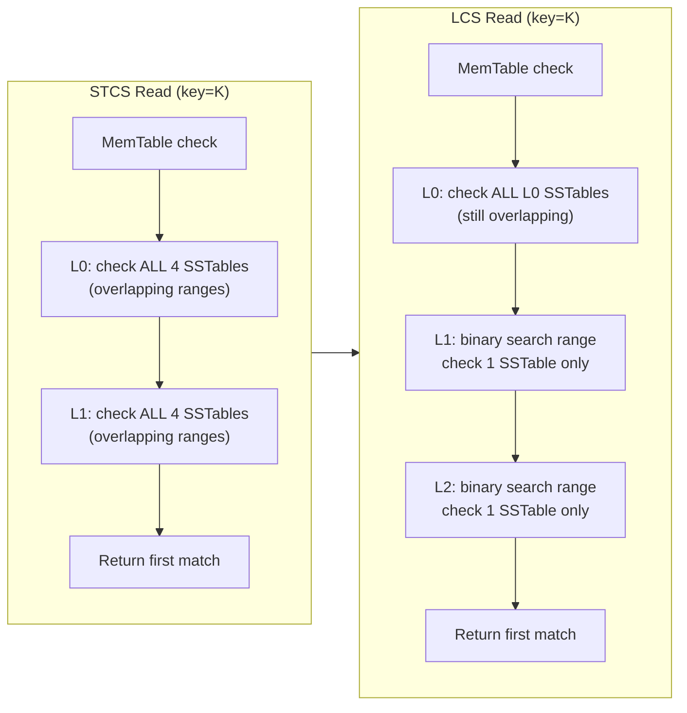

## Keywords in This File
{: .no_toc }

| # | Keyword | Weight |
|---|---|---|
| 1 | [LSM Tree Internals and Compaction](#lsm-tree-internals-and-compaction) | ★★★ |

---

# LSM Tree Internals and Compaction

---

### 🎯 Model Answer

**30 seconds:**
> LSM Tree (Log-Structured Merge Tree) is the storage engine behind Cassandra, RocksDB,
> LevelDB, and HBase. All writes go to an in-memory buffer (MemTable) and an append-only
> write-ahead log. When the MemTable fills, it is flushed to an immutable SSTable file on
> disk. Background compaction merges and garbage-collects SSTables. This gives LSM Trees
> very high write throughput (sequential I/O, no random writes) at the cost of higher
> read amplification (multiple SSTables must be checked per read) and space amplification
> (compaction lag means stale versions coexist).

**3 minutes (Senior):**
> LSM Tree internal flow: (1) Write path - write to WAL (durability), then in-memory
> MemTable (sorted by key). MemTable is bounded (typically 64 MB in Cassandra). On flush,
> a new immutable MemTable becomes an SSTable on disk. (2) Read path - check bloom filter
> first (may avoid I/O), then MemTable, then SSTables from newest to oldest (stop at first
> hit). (3) Compaction - background process that merges SSTables, removes tombstones
> older than `gc_grace_seconds`, de-duplicates versions. Two strategies: Size-Tiered
> (STCS - merge SSTables of similar size, good for write-heavy) and Leveled (LCS - keep
> data in levels of increasing size, better read amplification, higher write amplification).
> (4) Three amplification factors: write amplification (how many times each byte is
> written to disk), read amplification (how many SSTables are read per key lookup), space
> amplification (how much extra disk space is used for stale data). Each compaction
> strategy makes a different trade-off between the three.

**Framework:** Write path -> MemTable flush -> SSTable -> Compaction -> Read path -> Bloom filter -> Amplification

**Blank Mind Recovery:**

**(1) Restate:** "LSM Tree: writes go to MemTable (RAM) + WAL (disk). MemTable fills ->
flush to SSTable. Background compaction merges SSTables. Three trade-offs: write amp,
read amp, space amp. Bloom filters reduce read I/O. Compaction strategy controls the
balance."

**(2) First principles:** "B-Trees (PostgreSQL, MySQL) update data in-place: random
writes to specific pages. Random I/O is slow on HDD and moderately fast on SSD. LSM
Trees never update in-place: all writes are sequential (WAL append, MemTable, SSTable
flush). Sequential I/O is 10-100x faster than random I/O on HDD. For write-heavy
workloads, this is a decisive advantage."

**(3) Bridge:** "LSM Tree is like an inbox/outbox system. New emails (writes) go to your
inbox (MemTable, RAM). When inbox is full, you file them into your archive (SSTable flush).
Periodically, you reorganize the archive (compaction). When looking for an email (read),
you check the inbox first, then the archive. The inbox check is fast; archive is slower
because you may need to search through multiple files (read amplification). Periodically
cleaning the archive (compaction) improves search speed but takes time."

---

### 📘 Concept Explanation

**LSM Tree Architecture:**

```text
LSM TREE WRITE PATH:

  Client WRITE (key=K, val=V)
       |
  [1] Write-Ahead Log (WAL) <- durability
       |                         append-only file
  [2] MemTable (in-memory)   <- sorted skip list
       |                         bounded size (64MB)
       | (MemTable full)
       v
  [3] Immutable MemTable      <- stop new writes
       |                         flush in background
       v
  [4] L0 SSTable (disk)       <- sorted, immutable
       |                         (bloomfilter+index)
       | (L0 has 4+ SSTables)
       v
  [5] Compaction              <- merge + deduplicate
       |                         remove tombstones
       v
  L1, L2, ... Ln SSTables     <- leveled organization
  (non-overlapping ranges)       (in LCS strategy)

LSM TREE READ PATH:

  Client READ (key=K)
       |
  [1] Bloom Filter check      <- is K in this SSTable?
       | (negative -> skip)      100% recall (no FP skip)
       v
  [2] MemTable lookup         <- newest data first
       |
  [3] L0 SSTables (all)       <- L0 may overlap
       |                         newest to oldest
  [4] L1+ SSTables (binary)   <- non-overlapping ranges
       |                         binary search for range
       v
  Return first match found
  (newest version wins)
```

> **Diagram walkthrough:** (1) WHAT IT DEPICTS: the complete write path and read path
> of an LSM Tree, showing how data flows from a client write through WAL, MemTable,
> SSTable flush, compaction, and finally how reads traverse the data structures in
> reverse chronological order. (2) HOW TO READ IT: follow the write path top-to-bottom
> (client write to disk), then read path top-to-bottom (client read searching from newest
> to oldest data). (3) KEY RELATIONSHIP: writes are always sequential (WAL append, sorted
> MemTable, ordered SSTable); reads must check multiple data structures (read amplification)
> because the same key may have versions across multiple SSTables. (4) EDGE CASE: when
> many SSTables accumulate (compaction falling behind), read amplification rises; bloom
> filters prevent wasted I/O but do not eliminate the problem for keys that exist (bloom
> filters help only for non-existent key lookups). (5) INSIGHT: a senior engineer notices
> that bloom filters are essential for LSM read performance; a missing bloom filter on an
> LSM Tree means every read scans every SSTable on disk; bloom filters are not optional
> in production configurations.

**The Three Amplification Factors:**

```text
AMPLIFICATION FACTORS:

  WRITE AMPLIFICATION (WA):
    WA = total bytes written to disk /
         bytes written by client
    Cause: compaction rewrites data multiple times
    STCS: WA = 10-30x (data written many times
           during successive compactions)
    LCS:  WA = 10-25x (more frequent but smaller
           compactions per level)

  READ AMPLIFICATION (RA):
    RA = SSTables checked per read
    Without bloom filter: RA = N SSTables
    With bloom filter: RA = 1-2 (most reads)
    STCS: higher RA (overlapping SSTables,
          large compaction units)
    LCS:  lower RA (non-overlapping within levels)

  SPACE AMPLIFICATION (SA):
    SA = disk space used / logical data size
    Cause: old versions coexist with new until
           compaction removes them
    STCS: higher SA (large, infrequent compactions)
    LCS:  lower SA (more frequent cleanup per level)

  TRADE-OFF SUMMARY:
    STCS: low WA, high RA, high SA
          -> Good for write-heavy, batch analytics
    LCS:  high WA, low RA, low SA
          -> Good for read-heavy, mixed OLTP
    TWCS: time-series data, optimal for:
          no cross-time reads, TTL-heavy workloads
```

> **Diagram walkthrough:** (1) WHAT IT DEPICTS: the three amplification factors (WA, RA,
> SA) defined quantitatively with their causes and how each compaction strategy (STCS,
> LCS, TWCS) trades off between them. (2) HOW TO READ IT: each factor shows the formula,
> cause, and relative comparison between STCS and LCS; the trade-off summary shows which
> strategy to choose based on workload. (3) KEY RELATIONSHIP: the three amplification
> factors are in tension - optimizing one worsens another; STCS minimizes write
> amplification at the cost of read and space amplification; LCS does the reverse. (4)
> EDGE CASE: TWCS achieves all three low amplification factors but ONLY for time-series
> workloads where reads never span old time windows; for any workload with reads across
> time boundaries, TWCS degrades rapidly. (5) INSIGHT: a senior engineer uses TWCS
> automatically for any table with a time-based clustering column and TTL; TWCS + TTL
> is the canonical Cassandra pattern for time-series with automatic data expiry.

---

### 💻 Code Example

```bash
# RocksDB LSM Tree statistics (production diagnostic)
# Shows compaction state and amplification factors

# Get compaction stats (RocksDB embedded in application)
rocksdb_ldb --db=/var/lib/rocksdb/data stats

# Look for these key metrics in the output:
# Compaction Stats [default] - per-level summary
# Level    Files   Size     Score  Read(MB)  Rn(MB)
# L0        12      96MB    3.0    0MB       0MB
# L1         4     400MB    0.8    200MB     400MB
# L2        32    3200MB    0.6    600MB    3200MB

# High L0 file count (>4) = compaction falling behind
# High Score (>1.0) = this level needs compaction
# L0 score = L0 file count / level0_file_num_compaction_trigger
```

> **Code walkthrough:** (1) WHAT IT SHOWS: reading RocksDB compaction statistics to
> diagnose the state of the LSM Tree, specifically looking for signs of compaction falling
> behind. (2) KEY MECHANISM: `Score` for L0 is computed as `L0_file_count /
> level0_file_num_compaction_trigger` (default trigger: 4); a score > 1.0 means L0 has
> more files than the trigger, compaction is needed; read latency increases significantly
> when L0 has > 20 files (all L0 files are checked on every read). (3) WHY IT MATTERS:
> L0 compaction is the most critical indicator; uncontrolled L0 growth directly increases
> read amplification because L0 SSTables can have overlapping key ranges and all must be
> checked. (4) WHAT BREAKS: `ldb stats` requires access to the RocksDB data directory;
> in production, RocksDB metrics are usually exposed through application instrumentation
> (via callbacks) or Prometheus exporters; direct `ldb` access is for offline diagnosis.
> (5) TAKEAWAY: monitor L0 file count in production; alert when L0 > 10; this is the
> primary early warning for LSM Tree health degradation.

```java
// Cassandra: check SSTable compaction health
// via JMX (nodetool wraps JMX calls)

// In terminal:
// nodetool compactionstats
// Active compaction remaining time: 0h:02m:30s
// pending tasks: 247
//   keyspace      table           completed  total  unit
//   events        sensor_data     12500000   100M   keys
//   sessions      user_sessions   0          0      keys

// Cassandra SSTable count per table (high count = backlog)
// nodetool cfstats keyspace.events | grep "SSTable count"
// SSTable count: 143
// -> 143 SSTables for events table -> compaction severe backlog
// Target: < 10 SSTables per table for optimal read performance

// Trigger manual compaction for a specific table
// nodetool compact keyspace events
// (runs in background; use 'nodetool compactionstats' to monitor)
```

> **Code walkthrough:** (1) WHAT IT SHOWS: using Cassandra's `nodetool` commands to
> diagnose compaction backlogs via pending task counts and SSTable counts per table.
> (2) KEY MECHANISM: `nodetool compactionstats` shows active compaction and pending task
> count; 247 pending tasks means 247 SSTable merges are queued; `cfstats` SSTable count
> shows how many SSTables exist for a table - 143 is far above the healthy limit of ~10.
> (3) WHY IT MATTERS: 143 SSTables means every read for a key in the `events` table
> must check up to 143 files (mitigated by bloom filters); read latency increases
> significantly; compaction needs to run to merge these down. (4) WHAT BREAKS: triggering
> `nodetool compact` during peak traffic competes for I/O with reads and writes; schedule
> during off-peak hours; or use compaction throttling (`compaction_throughput_mb_per_sec`
> in cassandra.yaml). (5) TAKEAWAY: the SSTable count per table is the most important
> LSM Tree health indicator in Cassandra; alert when count exceeds 20; investigate and
> tune compaction before it exceeds 50.


```python
# Python: interact with RocksDB using python-rocksdb
# and demonstrate key write + read patterns

import rocksdb

# Open database with production options
opts = rocksdb.Options()
opts.create_if_missing = True
opts.max_write_buffer_number = 3  # number of MemTables
opts.write_buffer_size = 67108864 # MemTable size: 64 MB
opts.max_background_compactions = 4
opts.bloom_locality = 1  # enable bloom filter optimization

# Level compaction settings (LCS-like)
opts.num_levels = 7
opts.level0_file_num_compaction_trigger = 4
opts.level0_slowdown_writes_trigger = 20
opts.level0_stop_writes_trigger = 36

db = rocksdb.DB("db_path", opts)

# Write: fast, sequential
db.put(b"user:123", b'{"name":"Alice","age":30}')
db.put(b"user:124", b'{"name":"Bob","age":25}')

# Batch write: group writes for efficiency
batch = rocksdb.WriteBatch()
for i in range(1000, 2000):
    batch.put(
        f"user:{i}".encode(),
        f'{{"id":{i}}}'.encode()
    )
db.write(batch)

# Read: may check multiple SSTables
value = db.get(b"user:123")
if value:
    print(f"Found: {value.decode()}")

# Range scan: efficient for sorted key scans
it = db.iteritems()
it.seek(b"user:123")
for key, value in it:
    if not key.startswith(b"user:"):
        break
    print(key, value)
```


> **Code walkthrough:** (1) WHAT IT SHOWS: configuring and using RocksDB (an LSM Tree
> implementation) with production-relevant settings for write buffer (MemTable) size,
> compaction triggers, and bloom filters. (2) KEY MECHANISM: `write_buffer_size = 64 MB`
> sets the MemTable size; when full, the MemTable is flushed to L0; `max_write_buffer_number
> = 3` allows up to 3 MemTables in memory (1 active, 2 being flushed); `level0_file_num_
> compaction_trigger = 4` starts L0-to-L1 compaction when L0 has 4 files. (3) WHY IT
> MATTERS: batch writes are more efficient than individual puts because they reduce the
> per-write overhead of WAL fsync; for bulk loading, consider `disable_wal = True` with
> a manual snapshot for maximum throughput. (4) WHAT BREAKS: setting `write_buffer_size`
> too large delays flushing, increasing memory pressure; too small causes frequent flushes
> generating many small SSTables, increasing compaction pressure. (5) TAKEAWAY: tune
> `write_buffer_size` based on available RAM and write rate; a common production starting
> point is 64-256 MB per RocksDB instance with 2-4 MemTable slots.

---

### 🎓 Answers by Seniority

**Junior / Mid (0-5 years):**
> LSM Tree: writes go to RAM (MemTable) and a write-ahead log (WAL). When MemTable fills,
> it's flushed to disk as an SSTable file. SSTables are immutable. Background compaction
> merges SSTables to remove duplicates and tombstones. Reads check bloom filters first
> (avoid unnecessary disk reads), then MemTable, then SSTables newest-to-oldest. Used in
> Cassandra, RocksDB, LevelDB, HBase. The main advantage over B-Trees: all writes are
> sequential (fast), not random (slow).

---

**Senior / Staff (5+ years):**
> LSM Tree production considerations: (1) Compaction debt - if writes outpace compaction,
> SSTables accumulate; reads degrade; eventually writes slow (L0 stop writes trigger);
> tune `max_background_compactions` based on I/O bandwidth available. (2) Space
> amplification - during peak compaction, disk usage can temporarily double (old
> SSTables exist alongside new merged versions); provision disk at 2x logical data size.
> (3) Bloom filters are critical - a single bloom filter per SSTable with a 0.01% false
> positive rate fits in a few MB of RAM; loading bloom filters into OS page cache is
> essential; if bloom filters are evicted from cache, read performance degrades to the
> level of reading every SSTable. (4) Write stalls - RocksDB and Cassandra have admission
> control: slow writes when L0 reaches `slowdown_writes_trigger` and stop writes when
> it reaches `stop_writes_trigger`; applications must handle backpressure; monitor and
> alert before these thresholds are hit. (5) TWCS for time-series - when using Cassandra
> for time-series, TWCS (TimeWindowCompactionStrategy) creates one SSTable per time window;
> when data ages out of a window, the entire SSTable is deleted (no per-row compaction);
> this achieves nearly zero write amplification for time-series with TTL.

---

### ⚠️ Common Misconceptions

**Misconception 1: "LSM Trees are always faster than B-Trees."**

LSM Trees have better write throughput than B-Trees for write-heavy workloads because
all writes are sequential. However:
- For read-heavy workloads with frequent updates to the same key, B-Trees can outperform
  LSM Trees because in-place updates avoid read amplification.
- For random point reads, a B-Tree's direct page lookup is O(log N) with one or two
  disk accesses; an LSM Tree may check multiple SSTables (higher read amplification)
  even with bloom filters.
- PostgreSQL (B-Tree) with good cache hit rates outperforms RocksDB (LSM) for
  read-heavy OLTP workloads because the B-Tree read path is simpler.

LSM Trees are better when: write throughput is the bottleneck; writes significantly
outnumber reads; data is write-once or rarely updated.

**Misconception 2: "Compaction is optional - you can skip it to save I/O."**

Compaction is mandatory for LSM Tree correctness, not just performance. Without
compaction: (1) tombstones are never removed - deleted data accumulates on disk
indefinitely; (2) space amplification grows unboundedly - multiple versions of the same
key accumulate across SSTables; (3) read amplification grows without bound - more and
more SSTables must be checked per read. In Cassandra, skipping or delaying compaction
has a second correctness issue: tombstones have a `gc_grace_seconds` TTL; if they are
not processed by compaction before this TTL expires and then propagated through repair,
deleted data can be resurrected on nodes that missed the tombstone.

---

### 🚨 Failure Modes and Diagnosis

**Failure Mode 1: Write stall - database stops accepting writes.**

Symptom: application writes hang or return errors; Cassandra logs show `Rejecting
write operation for table` or RocksDB logs show `Stopping writes due to L0 file count`.
Root cause: L0 SSTable count has reached `stop_writes_trigger` (RocksDB default: 36
files); the system is deliberately stalling to allow compaction to catch up.
Diagnosis:

```bash
# RocksDB: check L0 file count
rocksdb_ldb --db=/var/lib/data stats | grep "L0 "
# "L0     36   288MB  9.0" -> 36 files, score 9.0 -> stalled

# Cassandra: check compaction pending tasks
nodetool compactionstats | head -5
# "pending tasks: 500" -> severe backlog
```

> **Code walkthrough:** (1) WHAT IT SHOWS: diagnostic commands for write stall root cause analysis in RocksDB and Cassandra. (2) KEY MECHANISM: an L0 score of 9.0 means 36 files exist vs the trigger of 4; writes are stopped; only compaction can drain the L0 backlog. (3) WHY IT MATTERS: write stalls are the most user-visible LSM Tree failure; applications experience complete write unavailability until compaction catches up. (4) WHAT BREAKS: increasing write throughput while a write stall is occurring makes it worse; the fix is to reduce write load and increase compaction I/O budget. (5) TAKEAWAY: prevent write stalls by monitoring L0 file count; alert at `slowdown_writes_trigger / 2` (RocksDB default: 10 files) before the stall occurs.

Fix: reduce write load temporarily; increase `max_background_compactions` / `concurrent_compactors`;
consider compaction throttling adjustments.

**Failure Mode 2: Tombstone accumulation causing slow reads or write rejections.**

Symptom (Cassandra): `ReadTimeoutException` for reads on specific partitions;
`TombstoneOverwhelmingException` in Cassandra logs.
Root cause: rows deleted with explicit `DELETE` statements (not TTL) generate tombstones;
tombstones are not cleaned up until compaction AND `gc_grace_seconds` has passed.
Diagnosis:

```bash
nodetool cfstats keyspace.table | grep tombstone
# "Tombstone scanned: 1245000"
# -> 1.2 million tombstones scanned per read -> severe

# Check if tombstone droppable
nodetool compactionstats keyspace.table
# "estimated droppable tombstones: 0.95"
# -> 95% of tombstones are old enough to drop
# -> run compaction to eliminate them
```

> **Code walkthrough:** (1) WHAT IT SHOWS: Cassandra diagnostic commands for identifying tombstone accumulation, including the tombstone scan count per read and the droppable tombstone ratio. (2) KEY MECHANISM: `Tombstone scanned: 1.2M` means every read for this partition is scanning 1.2 million tombstones to find live rows; Cassandra has a `tombstone_failure_threshold` (default: 100,000); if exceeded, reads fail with `TombstoneOverwhelmingException`. (3) WHY IT MATTERS: tombstone accumulation is one of the most common Cassandra production incidents; it is caused by misusing DELETE statements for what should be TTL-based expiry. (4) WHAT BREAKS: running `nodetool compact` during peak hours causes I/O contention; schedule off-peak or throttle via `cassandra.yaml: compaction_throughput_mb_per_sec`. (5) TAKEAWAY: always use TTL for data expiry in Cassandra rather than explicit DELETE statements; TTL-expired data is removed by TWCS without generating tombstones.

Fix: force compaction (`nodetool compact`); migrate to TTL-based expiry; switch to TWCS
for time-series tables.

---

### ⚖️ Comparison Table

| Storage Engine | Database | Compaction | WA | RA | SA | Best For |
|---|---|---|---|---|---|---|
| LSM (STCS) | Cassandra default | Size-tiered | Low | High | High | Write-heavy |
| LSM (LCS) | Cassandra option | Leveled | High | Low | Low | Read-heavy |
| LSM (TWCS) | Cassandra option | Time-window | Very low | Medium | Low | Time-series |
| LSM (RocksDB) | RocksDB/TiKV | Leveled | Medium | Low | Low | Mixed OLTP |
| B-Tree | PostgreSQL/MySQL | VACUUM/InnoDB | Low | Very low | Low | Read-heavy OLTP |
| B-Tree | SQLite | Auto | Low | Very low | Low | Embedded |

---

### 🏛️ System Design

**Designing a Write-Optimized Event Storage System:**

Use case: ingest 500,000 sensor events per second with read access for last 7 days.

Storage tier design:
1. Hot tier: Cassandra with TWCS, 7-day TTL, partition key = (sensor_id), clustering
   key = event_time DESC. Write throughput: 500K writes/second distributed across
   100 Cassandra nodes = 5,000 writes/node/second (well within capacity).
2. TWCS configuration: `window_unit = HOURS`, `window_size = 1` - one SSTable per hour.
   After 24 hours, expired hourly SSTables are dropped atomically (zero compaction for
   old data).
3. Bloom filter: enable per-partition bloom filter; 95% of reads are by sensor_id +
   time range; bloom filters ensure non-existent keys are not read from disk.
4. Compaction tuning: `concurrent_compactors = 4` per node;
   `compaction_throughput_mb_per_sec = 256` (tune based on disk I/O capacity).
5. Read pattern: `SELECT * FROM sensor_data WHERE sensor_id = ? AND event_time > ?`
   - always uses partition key; range scan within one partition.

Scale calculation: 500K writes/second * 200 bytes/event = 100 MB/s aggregate write
throughput; spread across 100 nodes = 1 MB/s per node; TWCS compaction overhead
adds 1-2x write amplification = 2 MB/s per node; well within SSD sequential write
capacity of 500 MB/s.

---

### 📊 Diagram

```text
LSM TREE COMPACTION STRATEGIES:

  SIZE-TIERED (STCS):
  L0: [A-Z][A-Z][A-Z][A-Z] -> compact
       |
  L1: [AAAA-ZZZZ] (larger) -> compact
       |
  L2: [AAAAAA-ZZZZZZ] (larger still)
  + Same-size SSTables merge together
  + Low write amplification
  - Overlapping key ranges in each level
  - Must check all SSTables in a level on read

  LEVELED (LCS):
  L0: [A-M][N-Z]     (small, overlapping)
  L1: [A-D][E-H][I-L][M-P][Q-T][U-Z] (10x L0)
  L2: [A-A][B-B]...[Z-Z]              (10x L1)
  + Non-overlapping key ranges in L1+
  + Read requires checking 1 SSTable per level
  - Higher write amplification (rewrite on promote)

  TIME-WINDOW (TWCS):
  Window 1: [T-24h][T-23h]...[T-1h] <- current writes
  Window 2: [T-48h][T-47h]...[T-25h] <- aged, compacting
  Window 3: [T-72h][T-71h]...[T-49h] <- TTL expiring soon
  [Drop entire window at TTL expiry]
  + No cross-window compaction
  + Zero write amplification for aged windows
  - Only works for time-series (no cross-time reads)
```

> **Diagram walkthrough:** (1) WHAT IT DEPICTS: the three major LSM Tree compaction
> strategies (STCS, LCS, TWCS) showing how SSTables are organized on disk and merged
> during compaction. (2) HOW TO READ IT: each strategy shows the level structure with
> the key range each SSTable covers; STCS merges same-size SSTables; LCS maintains
> non-overlapping key ranges per level; TWCS separates data by time window. (3) KEY
> RELATIONSHIP: STCS has overlapping key ranges per level (read must check all SSTables
> in the level); LCS has non-overlapping ranges (read checks one SSTable per level);
> TWCS has time boundaries (aged windows are never read for new queries). (4) EDGE CASE:
> TWCS degrades rapidly if queries span time windows (e.g., `SELECT` spanning 2 days
> must read from two window SSTables, and the older window may have many uncompacted
> SSTables because TWCS only compacts within-window). (5) INSIGHT: a senior engineer
> always selects the compaction strategy based on the read access pattern first, not the
> write pattern; TWCS for time-series, LCS for latency-sensitive reads, STCS for pure
> write-heavy batch workloads.

The following shows how LCS non-overlapping reads compare to STCS:



> **Diagram walkthrough:** (1) WHAT IT DEPICTS: the read path difference between STCS
> and LCS compaction, showing that LCS requires checking only 1 SSTable per level at L1+
> while STCS must check all SSTables in each level. (2) HOW TO READ IT: the STCS path
> (left) requires checking all SSTables at every level due to overlapping key ranges;
> the LCS path (right) uses binary search to find the single SSTable whose key range
> contains K at L1+. (3) KEY RELATIONSHIP: the non-overlapping property of LCS is the
> key enabler; it allows binary search on key ranges to identify exactly which SSTable
> contains a given key, reducing read I/O to O(levels) instead of O(total SSTables).
> (4) EDGE CASE: L0 is always overlapping in both strategies (SSTables are flushed from
> MemTable and may contain any key range); the improvement of LCS applies only to L1
> and below. (5) INSIGHT: both strategies check all L0 SSTables; keeping L0 small
> (triggered frequently) is important for both strategies; the `level0_file_num_compaction
> _trigger` setting directly controls how much read amplification exists at L0.

---

### 🎯 Interview Deep-Dive

| Category | Count | Coverage |
|---|---|---|
| Definition | 2 | LSM Tree structure, MemTable/SSTable |
| Mechanism | 3 | Compaction, bloom filters, write stall |
| Trade-off | 2 | STCS vs LCS, LSM vs B-Tree |
| Debugging | 2 | Tombstone accumulation, compaction backlog |
| Application | 2 | TWCS for time-series, write path tuning |
| Scenario | 1 | Write stall diagnosis |

---

**[SENIOR] Q1 (Definition): Explain the LSM Tree write path step by step.**

The complete LSM Tree write path:

Step 1 - Write to WAL (Write-Ahead Log): the write is appended to an on-disk WAL file.
This is a sequential disk write (fast). The WAL ensures durability: if the process
crashes before the MemTable is flushed, the write can be replayed from the WAL on
restart. The WAL is append-only; keys are not sorted in the WAL.

Step 2 - Write to MemTable: the key-value pair is inserted into the in-memory
MemTable, which is a sorted data structure (typically a skip list or red-black tree).
The MemTable is bounded in size (Cassandra: ~64 MB; RocksDB: configurable).

Step 3 - MemTable full: when the MemTable reaches its size limit, it becomes immutable
(no new writes) and a new MemTable is created for incoming writes. The immutable
MemTable is flushed to disk as an SSTable file.

Step 4 - SSTable flush: the immutable MemTable is written as a sorted, immutable
SSTable file. The SSTable includes: the data (sorted key-value pairs), a bloom filter
(probabilistic membership test), and an index (sparse index of key boundaries for
binary search). The WAL entries for this MemTable can now be discarded.

Step 5 - Compaction: background compaction merges multiple SSTables into larger ones,
removing duplicate versions and tombstones. This is when disk space is reclaimed.

*What separates good from great:* The multiple MemTable buffering pattern. Systems like
RocksDB allow `max_write_buffer_number = 3`: one active MemTable receiving writes + up
to 2 immutable MemTables being flushed. This prevents write stalls caused by MemTable
flush taking longer than the active MemTable fills. Without multiple MemTables, a single
slow SSTable flush blocks all writes. With 3 MemTables, the system tolerates flush
delays up to the time it takes to fill 2 MemTables (2 x 64 MB / write rate = buffer
time).

---

**[SENIOR] Q2 (Mechanism): How do bloom filters improve LSM Tree read performance? What are their limitations?**

Bloom filter role in LSM Tree reads:
A bloom filter is a probabilistic data structure that answers "is key K possibly in this
SSTable?" with two possible answers: "definitely not" (true negative, no false negatives)
or "possibly yes" (may be a false positive). Each SSTable has its own bloom filter.

Read path with bloom filter:
1. Check bloom filter: if the filter says "definitely not", skip the SSTable (no I/O).
2. If the filter says "possibly yes", read the SSTable index to find the block, then
   read the block. If the key is not found (false positive), it was wasted I/O.

Bloom filter performance impact:
- For non-existent keys: bloom filters eliminate nearly all I/O; only false positives
  require disk reads. With 1% false positive rate and 10 SSTables, expected wasted
  reads = 0.1 (essentially zero).
- For existing keys: bloom filters do not help; the key IS in one SSTable; the filter
  correctly says "possibly yes" for that SSTable and the read proceeds.
- For range scans: bloom filters do not apply; range scans must read SSTables that
  overlap the range regardless.

Limitations:
1. Bloom filters help most for non-existent key lookups (often the minority of reads).
2. For existing keys distributed across many SSTables (high key churn), every SSTable
   containing that key's history must be checked.
3. Bloom filter size affects false positive rate; larger filters = lower FP rate but
   more memory; typical production: 10 bits/key = 1% FP rate.

*What separates good from great:* The partition-level bloom filter in Cassandra. Standard
bloom filters answer "is this key in this SSTable?". Cassandra's partition-level bloom
filter answers "is this partition key in this SSTable?" This is coarser (a partition may
contain many rows) but uses less memory (one filter per partition instead of one per row).
For partition-based access patterns (which is the standard Cassandra pattern), this is
optimal. For row-level random access patterns, consider RocksDB's per-key bloom filters.

---

**[SENIOR] Q3 (Trade-off): Compare STCS and LCS compaction strategies. When would you switch from STCS to LCS in production?**

STCS (Size-Tiered Compaction Strategy):
- Algorithm: when 4+ SSTables of similar size exist, merge them into one larger SSTable.
- Write amplification: low (data is compacted fewer times; small SSTables merge into
  medium, medium into large).
- Read amplification: high (all SSTables in a tier may overlap in key ranges; reads
  must check all of them; bloom filters reduce wasted I/O but the check is still needed).
- Space amplification: high (old and new versions coexist until the next compaction tier).
- Best for: write-heavy workloads (IoT, logging, event ingestion) where reads are
  infrequent or always by partition key (bloom filters make reads acceptable).

LCS (Leveled Compaction Strategy):
- Algorithm: SSTables are organized into levels of increasing size (L1: 160 MB, L2: 1.6 GB,
  L3: 16 GB, with 10x multiplier). Within each level L1+, SSTables have non-overlapping
  key ranges. New SSTables from L0 are immediately compacted into L1.
- Write amplification: high (data is rewritten multiple times as it moves through levels).
- Read amplification: low (1 SSTable per level at L1+; binary search finds the correct
  SSTable; reads check O(levels) SSTables = typically 5-7 total).
- Space amplification: low (old versions are overwritten during leveled compaction).
- Best for: read-heavy workloads or mixed OLTP where read latency SLA is strict.

When to switch from STCS to LCS:
1. Read p99 latency is failing SLA and the cause is SSTable scan count.
2. The table has a mix of reads and writes (not purely write-heavy).
3. Space amplification of STCS is causing disk pressure.

*What separates good from great:* The hot/cold data split. In practice, many tables have
both hot (frequently updated, frequently read) and cold (write-once, rarely read) data.
STCS is better for cold data; LCS is better for hot data. Advanced production setups
use different tables (or separate storage) for hot vs cold data, each with the optimal
compaction strategy. RocksDB's BlobDB feature takes this further: small keys use LSM
compaction; large values (blobs) are stored in a separate append-only blob file, avoiding
write amplification for large value updates.

---

**[SENIOR] Q4 (Mechanism): Explain write stalls in RocksDB. What triggers them and how do you prevent them?**

Write stalls are RocksDB's admission control mechanism: when compaction falls behind,
RocksDB throttles or stops writes to give compaction time to catch up.

Three levels of write stall:

Level 1 - Slow down (`slowdown_writes_trigger`): when L0 file count reaches
`level0_slowdown_writes_trigger` (default: 20), RocksDB inserts an artificial delay
before each write. This throttles the writer to the compaction rate.

Level 2 - Stop (`stop_writes_trigger`): when L0 file count reaches
`level0_stop_writes_trigger` (default: 36), RocksDB stops all writes until compaction
drains L0 below the stop threshold. Writers receive a "write stall" error.

Level 3 - MemTable full: when all MemTable slots are full (active + immutable being
flushed), writes must wait for a flush to complete.

Causes: write throughput exceeds compaction throughput; I/O bandwidth is saturated by
writes; `max_background_compactions` is too low for the write rate.

Prevention:
1. Monitor L0 file count; alert at 10 files (halfway to slowdown trigger).
2. Increase `max_background_compactions` (default: 1) to 4-8 on multi-core servers.
3. Set `compaction_pri = kMinOverlappingRatio` (prioritize compaction that reduces
   read amplification most).
4. Use separate I/O priority for compaction (`low_io_priority`) to avoid competing with
   reads; but ensure enough bandwidth for compaction to keep up.
5. Size `write_buffer_size` and `max_write_buffer_number` to buffer enough writes to
   absorb burst traffic without triggering stalls.

*What separates good from great:* The write stall callback. RocksDB's `EventListener`
interface provides `OnStallConditionsChanged` callbacks; register a listener that emits
a metric when stalls begin and end; this enables correlation with application latency
spikes. Without the callback, write stalls appear in application logs as sudden latency
increases without an obvious cause. Production RocksDB deployments (TiKV, MyRocks,
CockroachDB) all implement write stall monitoring; the callback is essential for
production observability.

---

**[SENIOR] Q5 (Debugging): A Cassandra cluster is experiencing slow reads on a single table. Describe the diagnostic workflow.**

Step 1 - Check read latency at the table level:

```bash
nodetool cfstats keyspace.table_name | \
  grep -E "Read latency|Write latency|SSTable count"
# Read latency: 45ms (vs < 5ms expected)
# SSTable count: 87
# -> 87 SSTables = high read amplification -> compaction issue
```

> **Code walkthrough:** (1) WHAT IT SHOWS: using `nodetool cfstats` to check read latency and SSTable count for a specific Cassandra table. (2) KEY MECHANISM: `Read latency: 45ms` is the table-level average; comparing with the expected SLA (< 5ms) confirms the issue; `SSTable count: 87` immediately points to the cause - compaction falling behind. (3) WHY IT MATTERS: SSTable count is the first metric to check for slow reads in Cassandra; a high count directly causes read amplification. (4) WHAT BREAKS: `cfstats` shows per-table statistics; if you check at the node level instead of the table level, the metric is averaged across all tables, masking per-table issues. (5) TAKEAWAY: always use `cfstats keyspace.table_name` (with specific table name) for table-specific diagnostics; the node-level stats aggregate and mask per-table problems.

Step 2 - Check bloom filter effectiveness:

```bash
nodetool cfstats keyspace.table_name | \
  grep -E "bloom|false"
# Bloom filter false ratio: 0.5
# -> 50% of bloom filter checks are false positives
# -> bloom filter is too small for the data
```

> **Code walkthrough:** (1) WHAT IT SHOWS: checking the bloom filter false positive rate for a Cassandra table. (2) KEY MECHANISM: a 50% false positive rate means that for every SSTable checked because the bloom filter said "possibly yes", half are wasted reads (the key is not actually in that SSTable); an acceptable rate is < 0.1%; 50% indicates the bloom filter parameters are misconfigured. (3) WHY IT MATTERS: if bloom filters are ineffective, Cassandra reads all 87 SSTables on every read instead of just the relevant ones; this compounds the SSTable count problem. (4) WHAT BREAKS: to fix bloom filter false positive rate in Cassandra, alter the table to change `bloom_filter_fp_chance` to a lower value (e.g., 0.01 = 1%); the next compaction rebuilds the bloom filters. (5) TAKEAWAY: check bloom filter false positive ratio whenever SSTable count is high; a high false positive rate combined with high SSTable count is the worst-case read performance scenario in Cassandra.

Step 3 - Check partition size:

```bash
nodetool tablehistograms keyspace.table_name
# Partition Size (bytes)
# 50%ile: 512 bytes
# 75%ile: 4096 bytes
# 95%ile: 10 MB       <- unusually large partitions
# 99%ile: 50 MB       <- very large partitions -> consider redesign
```

> **Code walkthrough:** (1) WHAT IT SHOWS: the partition size histogram for a Cassandra table, showing that 5% of partitions exceed 10 MB and 1% exceed 50 MB. (2) KEY MECHANISM: Cassandra reads entire partitions for queries; a 50 MB partition requires reading 50 MB from disk for a query that might need 1 KB of data; this is inefficient and can cause read timeouts. (3) WHY IT MATTERS: large partitions indicate a data modeling problem (too much data per partition key); this is a separate issue from SSTable count but compounds read latency. (4) WHAT BREAKS: fixing large partitions requires data migration (changing the partition key to add a time bucket or additional discriminator); this is a significant schema change. (5) TAKEAWAY: use `tablehistograms` partition size distribution to identify large partition issues; a partition exceeding 100 MB in Cassandra is a data modeling anti-pattern requiring schema redesign.

Step 4 - Trigger compaction and monitor:

```bash
nodetool compact keyspace table_name
nodetool compactionstats
```

> **Code walkthrough:** (1) WHAT IT SHOWS: the commands to trigger manual compaction and then monitor its progress in Cassandra. (2) KEY MECHANISM: `nodetool compact keyspace table_name` submits a compaction task for the specified table; `nodetool compactionstats` shows active compaction progress (completion percentage, estimated time remaining, and keys processed). (3) WHY IT MATTERS: after diagnosing 87 SSTables and poor bloom filter effectiveness, compaction is the immediate fix; monitoring progress confirms the SSTable count is decreasing. (4) WHAT BREAKS: `nodetool compact` is a blocking compaction request; it uses I/O aggressively; run during off-peak hours or throttle via `cassandra.yaml: compaction_throughput_mb_per_sec`. (5) TAKEAWAY: after triggering `nodetool compact`, re-run `cfstats` every 5 minutes to confirm SSTable count is decreasing; if count is not decreasing, I/O bandwidth may be saturated.

*What separates good from great:* The multi-factor diagnosis. Slow Cassandra reads
rarely have a single cause. In this scenario, all three issues compound: high SSTable
count (compaction backlog) + poor bloom filter effectiveness + large partitions. Fixing
only one does not resolve the problem. The diagnostic workflow must identify all
contributing factors before applying fixes. Order of fixes: (1) trigger compaction to
reduce SSTable count; (2) alter `bloom_filter_fp_chance` for the next compaction;
(3) schedule a data migration to fix large partitions.

---

**[STAFF] Q6 (Trade-off): LSM Trees vs B-Trees for different workload profiles. When would you choose each for a new system?**

B-Tree (PostgreSQL, MySQL InnoDB):
Write path: find the correct page (tree traversal), modify the page in-place, write
the modified page to disk. This is random I/O for most writes.
Read path: tree traversal to find the page (O(log N) disk accesses). Predictable,
fast single-key lookups.

LSM Tree (RocksDB, Cassandra, LevelDB):
Write path: WAL append + MemTable insert (sequential I/O, in-memory). All writes are
O(1) amortized.
Read path: bloom filter + MemTable + multiple SSTables. Variable, depends on compaction
state.

Choose B-Tree when:
- Read latency SLA is strict (< 1ms p99 for random point reads).
- Update-heavy workloads (same key updated frequently); B-Trees update in place without
  creating versions; LSM Trees create a new version per update, requiring compaction to
  merge.
- Small to medium dataset (fits in RAM or buffer pool); cache hit rate is high; B-Tree
  reads are effectively RAM lookups.
- Complex queries with arbitrary ORDER BY, GROUP BY; B-Trees support efficient range
  scans and sorted access; LSM Tree range scans are more expensive.

Choose LSM Tree when:
- Write throughput is the primary constraint (> 100,000 writes/second).
- Write-once append workloads (time-series, event logs, audit logs).
- Disk is a bottleneck (SSDs can sustain sequential writes at much higher rates than
  random writes; LSM Trees maximize sequential I/O).
- Key-value access patterns (Redis uses a skip list, not LSM, but RocksDB is the
  backing store for embedded key-value in distributed systems).

*What separates good from great:* The hybrid approach. Many modern databases use both.
MyRocks (MySQL with RocksDB) replaces InnoDB (B-Tree) with RocksDB (LSM) for write-
heavy MySQL workloads, achieving 2-3x write throughput improvement with the same
hardware. TiKV (distributed key-value store for TiDB) uses RocksDB for write path but
implements a B+-Tree-like indexing layer above RocksDB for range queries. The optimal
storage engine depends on the ratio of reads to writes and the latency requirements
for each - not a simple rule.

---

**[STAFF] Q7 (Application): Design the compaction strategy for a Cassandra cluster storing real-time financial transaction events. Requirements: 500K writes/second, reads within last 7 days, 90-day retention.**

Requirements analysis:
- 500K writes/second: write-optimized storage required.
- Reads within last 7 days: reads cluster in recent time.
- 90-day retention: auto-expiry required.
- Financial events: immutable (no updates), append-only.

Data model:

```sql
CREATE TABLE transaction_events (
  account_id   UUID,
  event_time   TIMESTAMP,
  event_id     UUID,
  amount       DECIMAL,
  currency     TEXT,
  event_type   TEXT,
  PRIMARY KEY ((account_id, date_bucket), event_time, event_id)
) WITH CLUSTERING ORDER BY (event_time DESC)
  AND default_time_to_live = 7776000  -- 90 days in seconds
  AND compaction = {
    'class': 'TimeWindowCompactionStrategy',
    'compaction_window_unit': 'HOURS',
    'compaction_window_size': 1
  };
```

> **Code walkthrough:** (1) WHAT IT SHOWS: a complete Cassandra table definition for financial transaction events with a composite partition key (account_id + date_bucket), TWCS compaction, and 90-day TTL. (2) KEY MECHANISM: the composite partition key `(account_id, date_bucket)` distributes data by account AND by day - preventing one account from accumulating all events in a single partition; TWCS creates one SSTable per hour window; after 90 days, entire hourly SSTables are dropped atomically. (3) WHY IT MATTERS: TWCS + TTL is the optimal strategy for this workload: write amplification is nearly zero for aged data (entire window files are dropped, not individual row tombstones); read amplification is bounded (reads within 7 days access only 168 hourly windows). (4) WHAT BREAKS: if a query reads across `date_bucket` boundaries (e.g., all events for an account across all days), it requires one query per bucket value; this must be handled in the application (fan-out queries or denormalization). (5) TAKEAWAY: for time-series Cassandra tables with TTL, TWCS + TTL is always the correct compaction choice; the key challenge is partition key design (avoid unbounded single-account partitions with time buckets).

Compaction window selection: 1-hour windows balance compaction overhead (168 active
windows for 7 days) and file count. Larger windows (24 hours) reduce file count but
delay tombstone cleanup for expired data.

*What separates good from great:* The read fan-out challenge. TWCS optimizes writes
but the composite partition key (account_id + date_bucket) means that reading "all
events for account X in the last 7 days" requires 7 separate queries (one per date
bucket). The application must issue these 7 queries and merge results. For the query
patterns that need full account history, consider a secondary index or a separate
"account_summary" table updated via materialized views or application-level writes.
This is the fundamental NoSQL trade-off: optimize for the primary access pattern
(write throughput + recent reads) and accept complexity for secondary access patterns
(full account history reads).

---

**[STAFF] Q8 (Mechanism): Explain the role of the Write-Ahead Log (WAL) in LSM Trees. What happens if the WAL is disabled?**

WAL role in LSM Trees:
The Write-Ahead Log provides durability for MemTable writes. The MemTable is in RAM and
is lost on process crash. The WAL is an append-only file on disk that records every write
before it is applied to the MemTable. On crash recovery, the WAL is replayed to
reconstruct the MemTable state.

WAL write mechanics:
1. Write arrives.
2. Write appended to WAL (fsync optional; controlled by `wal_fsync_policy`).
3. Write applied to MemTable (in-memory, instant).
4. Acknowledge write to client.

WAL and MemTable relationship:
- A WAL segment corresponds to one MemTable.
- When a MemTable is flushed to an SSTable, the corresponding WAL segment can be deleted.
- Before deletion, the SSTable must be durably written to disk (fsync after flush).

What happens if WAL is disabled (RocksDB: `disable_wal = true`):
- Writes are applied to MemTable only.
- If the process crashes before the MemTable is flushed, all MemTable writes are lost.
- This is acceptable for: bulk loading scenarios (recreate from source if crash);
  cache workloads (data is ephemeral); testing and benchmarking.
- This is NOT acceptable for: production data that must survive crashes.

WAL durability options:
- RocksDB: `sync` flag per-write (fsync after each WAL append) or deferred (fsync when
  MemTable flushes).
- Cassandra: commitlog sync (periodic fsync) or batch sync (fsync per write batch).

*What separates good from great:* The WAL and SSTable durability gap. After a MemTable
flush, the SSTable is on disk but the WAL entry is not yet deleted. If the process
crashes after the SSTable flush but before the WAL segment is marked as applied, the
WAL is replayed on restart; the already-flushed MemTable writes are re-applied to a new
MemTable (resulting in a duplicate SSTable flush). LSM Tree compaction handles this by
de-duplicating versions; the most recent version wins. This is why LSM Trees are
idempotent on recovery: replaying WAL entries produces the correct final state because
newer versions overwrite older ones. B-Trees handle this differently (WAL redo log vs
LSM Tree WAL), but the core principle - WAL before data write - is the same.

---

**[STAFF] Q9 (Scenario): A RocksDB-backed application is experiencing periodic write stalls of 5-10 seconds every few minutes. The stalls are correlated with compaction activity. How do you diagnose and fix?**

Diagnosis:

```bash
# Check RocksDB LOG file for stall events
grep -E "Stall|slowdown|stop" /var/lib/rocksdb/LOG | tail -50
# [compaction_picker.cc:1234] Stopped writes because of too many
# L0 files: 36
# [db_impl.cc:2345] Compaction (L0->L1): 2048 files,
# 800ms, 1500MB

# Check compaction stats at the time of stall
grep "Compaction Stats" /var/lib/rocksdb/LOG | tail -20
# Shows L0 file count trends over time
```

> **Code walkthrough:** (1) WHAT IT SHOWS: examining the RocksDB LOG file to find write stall events and their causes - specifically L0 file count exceeding the stop_writes_trigger. (2) KEY MECHANISM: RocksDB logs `Stopped writes because of too many L0 files` when the stop_writes_trigger is reached; the subsequent log entry shows compaction duration (800ms) and size (1500MB) - confirming that L0-to-L1 compaction is the bottleneck. (3) WHY IT MATTERS: correlating the stall events with compaction entries in the LOG confirms that compaction throughput is insufficient for the write rate. (4) WHAT BREAKS: if the LOG file has been rotated since the stall, the historical data may not be available; implement log-based monitoring that exports stall events to a time-series monitoring system in production. (5) TAKEAWAY: always parse and monitor the RocksDB LOG file for stall events; a monitoring pipeline that alerts on write stalls before they cause user-visible impact is essential for production RocksDB deployments.

Root causes of periodic L0 write stalls:
1. Write bursts exceed MemTable drain rate during the burst.
2. L0-to-L1 compaction is slow (I/O contention with reads).
3. `max_background_compactions` is too low (1 compaction thread cannot keep up).

Fixes:

Fix 1 - Increase compaction threads:
`max_background_compactions = 4` (or match CPU cores available for background work).
`max_background_flushes = 2` (separate thread for MemTable flushes).

Fix 2 - Separate compaction from flush I/O:
Use two separate disk volumes: one for write-heavy (WAL + SSTable flush), one for
compaction output. Compaction I/O no longer competes with write I/O.

Fix 3 - Increase MemTable capacity:
`max_write_buffer_number = 4` (4 MemTable slots before blocking).
`write_buffer_size = 128MB` (larger MemTables absorb burst writes longer).

Fix 4 - Rate-limit writes:
Use RocksDB's write rate limiter to limit burst write rates and give compaction
sustained throughput: `rate_limiter = NewGenericRateLimiter(500 * 1024 * 1024)`
(500 MB/s write limit).

*What separates good from great:* The write rate limiter as a proactive measure.
Without rate limiting, write bursts can exhaust I/O bandwidth and trigger stalls.
With rate limiting, write throughput is capped at a sustainable rate (below compaction
throughput), preventing stall accumulation. The cost: sustained write throughput is
capped. For bursty workloads (human-driven traffic with peaks), rate limiting is
usually the right trade-off. For steady high-throughput workloads (IoT, telemetry),
scaling the number of RocksDB instances (sharding) is a better solution than rate
limiting.

---

**[STAFF] Q10 (Application): Explain TWCS in detail. What are the preconditions for using it safely?**

TWCS (TimeWindowCompactionStrategy) design:
TWCS divides time into fixed-size windows (e.g., 1 hour). All SSTables with data
from the same time window are compacted together. SSTables from different windows
are never compacted together. When all data in a window's SSTables has expired (TTL),
the entire SSTable set for that window is dropped atomically (no tombstone scanning).

TWCS operational behavior:
- Active window: receives new writes; SSTables flush into the active window.
- Completed windows: the window's SSTables are compacted together once; the resulting
  merged SSTable persists until TTL expiry.
- Expired windows: all data has expired; the SSTable file is deleted; no compaction
  needed; zero write amplification for cleanup.

Preconditions for safe TWCS use:

1. Data must have TTL: TWCS does not compact across windows; data that does not expire
   never gets cleaned up from old windows; space amplification grows unboundedly.

2. Writes must be in current or recent time windows: TWCS is designed for data where
   writes are temporally clustered around the current time. Out-of-order writes (writing
   data with timestamps from 30 days ago into a 1-hour window system) cause multiple
   "active" windows, defeating the window isolation benefit.

3. Reads should not span many windows: TWCS's read amplification advantage is that
   reads for a specific time range read few windows; if queries read across many windows
   (e.g., "all events in the last 90 days for account X"), TWCS provides no read
   amplification advantage.

4. Window size must match TTL: if TTL = 7 days and window size = 1 hour, there are
   168 active windows; if TTL = 7 days and window size = 1 day, there are 7 active
   windows. Larger windows reduce SSTable count but delay cleanup of expired data.

*What separates good from great:* The TWCS + CDC replication interaction. In multi-
datacenter Cassandra clusters with TWCS tables, hinted handoff replays may deliver
writes from the recent past to a node that was down; these writes arrive in the "wrong"
time window from the cluster's perspective; if the window that should receive them has
already been compacted and partially expired, the write lands in the current active
window, mixing old timestamps with new data. For TWCS correctness, the `max_hint_window
_in_ms` setting should be smaller than the TWCS window size; otherwise, old writes may
re-open closed windows. This is a subtle but production-critical configuration.

---

**[STAFF] Q11 (Mechanism): How does Cassandra's MemTable differ from RocksDB's MemTable? What are the production implications?**

Cassandra MemTable architecture:
- One MemTable per table (per column family) per node.
- Default implementation: on-heap Java heap (affected by JVM GC pauses).
- Alternative: off-heap MemTables (`memtable_allocation_type: offheap_objects`)
  using SLAB allocator; avoids GC pressure but increases native memory usage.
- Flush trigger: size-based (`memtable_heap_space_in_mb` and
  `memtable_offheap_space_in_mb`), time-based (`memtable_flush_period_in_ms`), or
  commitlog size-based.

RocksDB MemTable architecture:
- One active MemTable per column family + configurable immutable MemTable count.
- Default implementation: skip list (sorted, lock-free concurrent writes).
- Alternative: hash skip list (faster for prefix lookups), vector memtable (bulk loads).
- Flush trigger: size-based (`write_buffer_size`); number of immutable MemTables
  (`max_write_buffer_number`).

Production implications:

Cassandra on-heap MemTable + JVM GC:
- Large MemTables hold many objects; during GC (CMS or G1 GC), stop-the-world pauses
  can occur when old gen is full.
- G1GC is the standard for Cassandra 4.x; tuning: `-Xmx32g -Xms32g -XX:MaxGCPauseMillis=200`.
- Off-heap MemTables avoid GC but require `ulimit` tuning for virtual memory.
- Production issue: JVM heap size > 64 GB increases GC pause duration; keep JVM heap
  ≤ 32 GB; store more data in off-heap MemTables and SSTables.

RocksDB skip list MemTable:
- Lock-free concurrent writes (multiple threads write without locks).
- Requires careful memory sizing: too small -> frequent flushes -> many small SSTables
  -> compaction pressure; too large -> flush takes long -> write stall on MemTable full.

*What separates good from great:* The Cassandra off-heap buffer pool. Beyond the
MemTable, Cassandra uses an off-heap buffer pool for SSTable row cache and key cache.
Proper sizing: `row_cache_size_in_mb` (for frequently-read partitions) and
`key_cache_size_in_mb` (for frequently-looked-up partition keys). Key cache is almost
always worth enabling (small, high hit rate); row cache is workload-specific (only
effective if reads cluster on a small set of hot partitions). These caches reduce
SSTable disk reads and are complementary to bloom filters.

---

**[STAFF] Q12 (Scenario): You are designing the storage layer for a globally distributed key-value store. Compare using RocksDB (LSM Tree) vs PostgreSQL (B-Tree) as the underlying storage engine. What factors determine the choice?**

Design context: globally distributed key-value store, targeting 1 million writes/second
globally, 100ms p99 write latency, strong consistency within a datacenter.

Factors favoring RocksDB (LSM Tree):
1. Write throughput: 1M writes/second globally = 100K-200K per datacenter; RocksDB
   with proper compaction tuning handles 500K writes/second on NVMe SSD; PostgreSQL's
   B-Tree requires random I/O per write and struggles above 100K writes/second per node.
2. Write latency: RocksDB WAL append + MemTable insert = sequential I/O; consistent
   write latency regardless of dataset size; B-Tree random write latency varies with
   data size (more random I/O as working set exceeds buffer pool).
3. Log-structured design fits key-value patterns: key-value stores with arbitrary
   write distributions benefit from log-structured sequential I/O.
4. Embeddable: RocksDB is a library (embedded in the application process); no separate
   database process; lower latency (no IPC) and simpler deployment.

Factors favoring PostgreSQL (B-Tree):
1. Complex queries: if the key-value store needs range queries, secondary indexes, or
   complex WHERE conditions, B-Tree's sorted structure and flexible query planning win.
2. ACID transactions: if the key-value operations must be atomic with other relational
   data, PostgreSQL's transaction support is native; RocksDB's transactions are limited
   to the RocksDB database.
3. Operational maturity: PostgreSQL has extensive tooling, monitoring, backup solutions,
   and operational expertise available; RocksDB requires custom tooling for many
   operational tasks.

Decision for globally distributed key-value store: RocksDB. The write throughput
requirement (1M writes/second globally) and key-value access pattern (no complex queries)
favor RocksDB. CockroachDB, TiKV, and YugabyteDB all use RocksDB for exactly this
reason: distributed SQL/key-value at scale with high write throughput.

*What separates good from great:* The pluggable storage engine pattern. Both PostgreSQL
(through table access method API) and some distributed databases support pluggable
storage engines. TiDB supports both RocksDB (via TiKV) and a row-based engine for HTAP
workloads. The "correct" answer for a globally distributed key-value store may evolve:
start with RocksDB for write throughput; if analytical queries become important later,
add a columnar engine (Apache Arrow/Parquet) for OLAP queries over the same data. The
architecture decision is not "one storage engine for all time" but "the right engine
for today's requirements, with a path to change."
