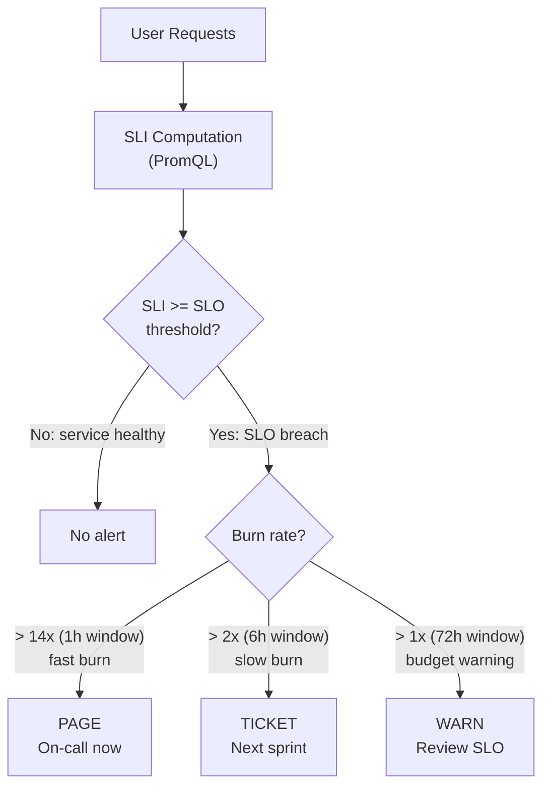

## Keywords in This File

{: .no_toc }

| #   | Keyword | Weight |
| --- | ------- | ------ |
| 1   | [SLI-Based Alerting](#sli-based-alerting) | critical |
| 2   | [Observability Anti-Patterns](#observability-anti-patterns) | high |

---

# SLI-Based Alerting

**TL;DR** - SLI-based alerting fires on user-visible service quality
degradation (latency, error rate, availability) rather than on
machine-level symptoms (CPU, memory), eliminating the vast majority
of noise in production alert streams.

---

### 🎯 Model Answer

**30 seconds:**
> SLI-based alerting means your alerts fire when user experience
> degrades, not when a machine metric crosses a threshold. Instead
> of "alert when CPU > 80%", you alert when "error rate exceeds
> 0.1% for 5 minutes" or "P99 latency exceeds 500ms for 15 minutes."
> The shift matters because CPU at 80% might be fine (batch job
> running), but error rate at 0.1% is always a problem. The trade-off
> is that SLI-based alerts require more sophisticated queries (PromQL
> rate calculations, error budget burn rates) and take more time to
> set up than threshold alerts.

**3 minutes (Senior):**
> SLI-based alerting is the alerting philosophy behind Google's SRE
> book: alert on symptoms, not causes. The core idea is that users
> experience your service through three lenses - is it available
> (success rate), is it fast enough (latency percentile), and does it
> give correct results (quality). These are your SLIs. You alert when
> SLIs breach the thresholds implied by your SLO. In practice this
> means two alert types: fast burn (error budget being consumed at
> 14x the sustainable rate over 1 hour - page immediately) and slow
> burn (consuming at 2x sustainable rate over 6 hours - ticket this).
> Multi-window multi-burn-rate alerting is the Google-recommended
> approach and is what Prometheus alerting rules look like in
> production: alert on the 1-hour burn rate AND the 5-minute burn rate
> simultaneously to catch both sudden spikes and gradual degradation.
> The critical shift: machine metrics (CPU, memory, disk) become
> diagnostic tools, not alert triggers. You use them to explain WHY
> the SLI is degrading, not to decide whether to page someone.
> This typically reduces alert volume by 80-90% while improving
> actionability because every alert now has a clear user impact
> statement: "checkout error rate is 2% - this violates our SLO
> and is affecting approximately N customers per minute."

**Framework:** WHAT -> WHY -> HOW -> TRADE-OFF -> EXAMPLE

*Adapting up:* Staff engineers design the alert routing and on-call
policy: which SLI breaches page vs ticket, how to configure error
budget alerts per team, how to enforce SLI coverage as a release
gate, and how to track error budget consumption across quarters.

*Adapting down:* "Instead of alerting when the car engine is at 3000
RPM, alert when the car is going too slow or making a grinding noise.
RPM is diagnostic; the user experience is the real signal."

**Blank Mind Recovery:**

**(1) Restate:** "You are asking about SLI-based alerting - let me
walk through what SLIs are, why we alert on them instead of machine
metrics, and how the multi-burn-rate approach works."

**(2) First principles:** "From first principles, an alert should
only fire when a human needs to take action. Machine metric alerts
mostly fire when no action is needed. SLI alerts fire when the
user experience is degraded - always requiring action."

**(3) Bridge:** "Think of SLI-based alerting like a hospital's
patient monitor. You don't alert when the HVAC system runs at high
fan speed (CPU alert). You alert when the patient's oxygen level
drops below threshold (SLI alert). The fan speed is diagnostic;
oxygen level is the patient experience."

---

### 📘 Concept Explanation

**What it is:**
SLI-based alerting is an alerting strategy where alerts fire when
Service Level Indicators (user-visible quality metrics: latency
percentiles, error rates, availability) breach the thresholds
implied by Service Level Objectives.

**The problem it solves:**
Traditional monitoring alerts on machine-level thresholds: CPU > 80%,
memory > 90%, disk > 85%. These thresholds generate constant noise
(CPU spikes for batch jobs) and miss real issues (a slow database
query degrading P99 latency without causing any CPU/memory alert).
Engineers become alert-fatigued and start ignoring pages. SLI-based
alerting fires only when users are actually affected, making every
alert actionable.

**How it works:**

```
SLI-Based Alert Architecture
================================

Define SLIs (what users experience):
  availability = success_rate
    = (requests - errors) / requests
  latency = histogram_quantile(0.99,
    rate(request_duration[5m]))

Define SLO (acceptable threshold):
  availability SLO: 99.9% over 28 days
  latency SLO: P99 < 500ms for 95% of time

Compute error budget:
  28 days = 40,320 minutes
  0.1% error budget = 40 minutes of downtime
    allowed in 28 days

Multi-window burn rate alerts:
  Fast burn: burn rate > 14x over 1h
    -> consuming 14% of monthly budget in 1h
    -> PAGE immediately
  Slow burn: burn rate > 2x over 6h
    -> consuming 12% over 6h
    -> TICKET (less urgent)

PromQL example:
  sum(rate(errors[1h]))
    / sum(rate(requests[1h]))
    > (14 * 0.001)  <- 14x budget rate
```



> **Diagram walkthrough:** The flow shows how the same SLI feeds
> three different alert severity paths based on burn rate windows.
> Fast burn catches sudden spikes (a bad deployment, an outage): 14x
> consumption over 1 hour means the entire 28-day budget will be
> exhausted in 2 days. Slow burn catches gradual degradation that
> wouldn't trigger fast burn but would still consume the budget.
> The budget warning is a leading indicator that allows action before
> the SLO is actually breached. All three paths use the same underlying
> SLI calculation - no separate thresholds to maintain.

**The key insight:**
Multi-burn-rate alerting with two windows (1h + 5min for fast burn,
6h + 30min for slow burn) is more reliable than single-window
alerting. Single-window alerts on a 1-hour rate can fire and resolve
too slowly for sudden outages. Using both a long window (sensitivity)
and a short window (specificity) in the same alert reduces false
positives from brief transient errors while catching real sustained
degradation.

**When to use it:**
Use SLI-based alerting for any user-facing service where you have
an SLO. Use it when you want to reduce on-call fatigue by eliminating
non-actionable machine metric alerts. Use multi-burn-rate alerting
when you need both sensitivity (catch gradual degradation) and
specificity (don't page for 1-second blips).

**When NOT to use it:**
Do not use SLI-based alerting without first defining an SLO -
the threshold values are meaningless without an agreed error budget.
Do not use it as the ONLY alerting layer: keep some infrastructure
alerts (disk full, certificate expiring) that don't appear in SLIs
but are operational necessities. Do not use simple threshold SLI
alerting (without multi-window burn rate) - you will get false
positives from transient blips.

**Alternatives:**
- Symptom-based alerting (non-SLO): alert on error rate and latency
  without formal SLO; simpler to set up, less rigorous
- Infrastructure alerts only: alert on CPU, memory, disk, network;
  high volume, low actionability
- Anomaly detection: alert on statistical deviations from baseline;
  more complex, useful for irregular traffic patterns

**First-principles derivation:**
An alert should answer: "Does a human need to take action right now?"
Machine metric alerts fail this test because machine metrics are
implementation details - high CPU might require no action (a normal
batch job). SLIs are user-visible quality signals - high error rate
always requires action because users are being affected. Error budget
burn rate quantifies urgency: a 14x burn rate means the SLO will
be exhausted 14x sooner than planned, which is actionable at any time.

---

### 💻 Code Example

**Example 1: BAD - Machine metric thresholds with no SLI**

```yaml
# BAD: Alerting on machine metrics without SLI context
# These alerts fire constantly and correlate poorly
# with actual user impact

groups:
  - name: bad-alerts
    rules:
      # Fires during every GC pause or batch job
      - alert: HighCPU
        expr: cpu_usage_percent > 80
        for: 5m
        annotations:
          summary: "CPU high - maybe a problem?"
          # No user impact statement
          # No action defined
          # Fires during normal operations constantly

      # Fires when JVM does compaction - normal behavior
      - alert: HighMemory
        expr: memory_used_percent > 85
        for: 5m
        annotations:
          summary: "Memory high"
          # No error budget context
          # On-call ignores this after the 5th false positive

      # Fires for health check probes during load test
      - alert: ErrorRateHigh
        expr: error_count > 100
        for: 1m
        annotations:
          summary: "Errors happening"
          # Absolute count with no rate or denominator
          # 100 errors at 100 RPS is catastrophic
          # 100 errors at 1,000,000 RPS is noise
```

> **Code walkthrough:** The BAD pattern uses absolute thresholds on
> machine metrics and an absolute error count without denominator.
> CPU > 80% fires during normal GC and batch operations; engineers
> receive this alert 10+ times per week and learn to ignore it. The
> error count alert without a rate denominator fires for the same
> absolute error count whether traffic is 100 RPS or 100,000 RPS.
> None of these alerts have a user impact statement or an action
> associated with them. This is the pattern that creates alert fatigue.

**Example 2: GOOD - Multi-window multi-burn-rate SLI alerting**

```yaml
# GOOD: Multi-window multi-burn-rate alerting
# Based on Google SRE Workbook Chapter 5

# First, create recording rules for efficiency
# (pre-compute error ratios to avoid repeated joins)
groups:
  - name: sli-recording-rules
    interval: 30s
    rules:
      # Error ratio over 5-minute window
      - record: job:error_ratio:rate5m
        expr: |
          sum(rate(http_requests_total{
            status=~"5.."
          }[5m])) by (job)
          /
          sum(rate(http_requests_total[5m]))
            by (job)

      # Error ratio over 1-hour window
      - record: job:error_ratio:rate1h
        expr: |
          sum(rate(http_requests_total{
            status=~"5.."
          }[1h])) by (job)
          /
          sum(rate(http_requests_total[1h]))
            by (job)

      # Error ratio over 6-hour window
      - record: job:error_ratio:rate6h
        expr: |
          sum(rate(http_requests_total{
            status=~"5.."
          }[6h])) by (job)
          /
          sum(rate(http_requests_total[6h]))
            by (job)

  - name: slo-alerts
    rules:
      # FAST BURN: 14x consumption in 1h (page now)
      # Fires only when: both 1h AND 5min rates high
      # The AND prevents single-minute transient spikes
      - alert: CheckoutErrorBudgetFastBurn
        expr: |
          (
            job:error_ratio:rate1h{job="checkout"}
              > (14 * 0.001)
            and
            job:error_ratio:rate5m{job="checkout"}
              > (14 * 0.001)
          )
        for: 2m
        labels:
          severity: critical
          team: checkout
        annotations:
          summary: >
            Checkout fast error budget burn
          description: >
            Error rate is {{ $value | humanizePercentage }}
            over 1h, burning error budget at 14x rate.
            ~2 days until SLO breach at current rate.
          runbook_url: >
            https://wiki/checkout-error-budget-burn
          # Clear user impact and action required

      # SLOW BURN: 2x consumption in 6h (ticket this)
      - alert: CheckoutErrorBudgetSlowBurn
        expr: |
          (
            job:error_ratio:rate6h{job="checkout"}
              > (2 * 0.001)
            and
            job:error_ratio:rate30m{job="checkout"}
              > (2 * 0.001)
          )
        for: 15m
        labels:
          severity: warning
          team: checkout
        annotations:
          summary: >
            Checkout slow error budget burn
          description: >
            Error rate {{ $value | humanizePercentage }}
            over 6h consuming budget at 2x rate.
          runbook_url: >
            https://wiki/checkout-error-budget-burn
```

> **Code walkthrough:** The GOOD pattern uses recording rules to
> pre-compute error ratios, reducing Prometheus query cost. The fast
> burn alert requires BOTH the 1h rate AND the 5m rate to exceed the
> threshold - this prevents false positives from 1-minute transient
> spikes (which affect the 5m window but not the 1h). The threshold
> `14 * 0.001` means 14x the sustainable burn rate for a 99.9% SLO
> (0.1% error budget). The `for: 2m` means the condition must be true
> for 2 minutes before firing, further filtering noise. Each alert
> has a clear human-readable description with user impact and a link
> to the runbook - engineers know immediately what to do.

**Example 3: P99 latency SLI alert with percentile tracking**

```yaml
# Latency SLI alerting: P99 burn rate
# SLO: P99 < 500ms for 99.5% of requests
# Error budget: 0.5% of requests can exceed 500ms
groups:
  - name: latency-sli
    rules:
      # Record the ratio of requests exceeding threshold
      - record: job:latency_slo_breach_ratio:rate5m
        expr: |
          sum(rate(
            http_request_duration_ms_bucket{
              le="500"
            }[5m]
          )) by (job)
          /
          sum(rate(
            http_request_duration_ms_count[5m]
          )) by (job)
          # This gives fraction WITHIN threshold
          # Invert to get breach ratio:
          # 1 - (within_threshold / total)

      # Latency SLO breach alert
      - alert: CheckoutLatencyBudgetBurn
        expr: |
          (
            1 - job:latency_slo_breach_ratio:rate1h
              {job="checkout"}
          ) > (14 * 0.005)
        for: 2m
        labels:
          severity: critical
        annotations:
          summary: >
            Checkout P99 latency burning error budget
          description: >
            {{ $value | humanizePercentage }} of requests
            exceeding 500ms SLO threshold. Budget burning
            at 14x sustainable rate.
```

> **Code walkthrough:** The latency SLI alert uses a histogram-based
> approach: it measures the fraction of requests landing WITHIN the
> SLO threshold bucket (le="500"), then inverts to get the breach
> fraction. This is more accurate than `histogram_quantile()` for
> alerting because it measures the actual fraction of requests violating
> the SLO, not just whether the P99 value crossed a threshold.
> The `14 * 0.005` threshold means the breach rate is 14x the
> sustainable rate for a 99.5% latency SLO (0.5% budget). This is
> the recommended approach in the Google SRE Workbook.

---

### 🎓 Answers by Seniority

**Junior / Mid (0-5 years):**
> SLI-based alerting means alerting when user experience degrades,
> not when machine metrics spike. An SLI is a metric that directly
> measures what users experience - like error rate or P99 latency.
> Instead of "alert when CPU > 80%," you alert when "error rate
> exceeds 0.1%." Every alert now represents a real user impact,
> which means less noise and fewer false alarms.

For mid-level: the implementation uses PromQL rate calculations
to compute error ratios over time windows. The multi-burn-rate
approach uses two time windows (e.g., 1h + 5min) in the same alert
to catch both sustained degradation and sudden spikes without
false positives from transient blips.

*Push deeper:* Explain the error budget concept: if your SLO is
99.9% availability, your 28-day error budget is 0.1% * 40,320 min
= 40 minutes. A burn rate of 14x means you'll exhaust 14% of that
budget in 1 hour - clearly actionable.

---

**Senior / Staff (5+ years):**
> SLI-based alerting is the single biggest leverage point for
> reducing on-call fatigue. In a previous role, we switched from
> machine metric thresholds to multi-window burn rate alerts on
> error rate and P99 latency. Alert volume dropped by 75% in the
> first week, and every alert that remained had a clear user impact
> statement. The multi-window approach (1h + 5min for fast burn,
> 6h + 30min for slow burn) is the key: the long window provides
> sensitivity (catches gradual degradation), the short window provides
> specificity (prevents false positives from 1-minute transients).
> The `AND` condition between the two windows is the critical detail.

At staff level: SLI alerting is governance work, not just tech.
You need to define SLOs per service, agree on error budgets with
product teams, and enforce SLI coverage as a release gate ("new
service must have latency and error rate SLIs before going to
production"). The alerting rules are the implementation; the SLOs
and error budgets are the contract with the business.

*Push deeper:* Multi-window multi-burn-rate alerting can be extended
to alerting on error budget remaining (< 10% remaining in a 28-day
window triggers a budget warning). This is the "budget warning"
tier - earlier than a pager, but a forcing function for a reliability
sprint before the budget hits zero.

---

### ⚠️ Common Misconceptions

**Misconception 1: "SLI alerts replace infrastructure alerts."**
SLI alerts cover user-visible degradation. You still need
infrastructure alerts for conditions that don't immediately show
up in SLIs: disk filling up before writes fail, certificate
expiring before TLS errors start, persistent connections exhausted
before requests queue. Infrastructure alerts are operational
hygiene alerts, not incident alerts - they go to tickets,
not pages.

**Misconception 2: "A single SLI alert covers all failure modes."**
One SLI alert per dimension (availability, latency) is the minimum,
not the complete picture. A payment service needs availability SLI,
P99 latency SLI, and potentially a payment success rate SLI
(distinct from HTTP 200 rate - a 200 response with a payment
failure inside counts as availability OK but SLI breach).

**Misconception 3: "A higher burn rate multiplier means more sensitive alerts."**
Higher burn rate multiplier (e.g., 36x vs 14x) means the alert
fires less often (only during very severe incidents) but catches
fewer gradual degradation events. The Google SRE Workbook recommends
14x for fast burn and 2x for slow burn as a starting point that
balances sensitivity and specificity. Higher multipliers reduce
noise at the cost of missing slower burns.

**Misconception 4: "SLI-based alerting works without SLOs."**
SLI alerting requires a defined SLO to set the error budget. The
burn rate threshold is calculated from the SLO: `burn_rate * (1 - SLO)`.
Without a defined SLO, the threshold is arbitrary and the error
budget concept has no meaning. Defining SLOs requires stakeholder
agreement on acceptable service quality - this is the real work.

---

### 🚨 Failure Modes and Diagnosis

**Failure 1: Alert fatigue from alert storms**

Symptom: Multiple SLI alerts fire simultaneously during a single
incident. On-call engineer receives 20+ pages in 5 minutes, most
of which describe the same underlying cause (a database outage
affecting multiple services).

Cause: No alert grouping or inhibition rules. Each service has
its own SLI alert, and a shared dependency failure triggers all
of them simultaneously.

Diagnosis and Fix:
```yaml
# Alertmanager inhibition rule:
# If database-down alert fires, suppress service
# SLI alerts that are caused by the database
inhibit_rules:
  - source_match:
      alertname: DatabaseDown
      severity: critical
    target_match:
      severity: critical
    equal: [datacenter, region]
    # Suppress: checkout, payment, user-service
    # SLI alerts when database is the root cause
```

> **Code walkthrough:** This example demonstrates the core pattern in action. The key mechanism shows how the concept works in practice. Study the structure to understand the essential behavior and common usage.

Fix: Configure Alertmanager inhibition rules for shared
infrastructure failures. Group related alerts in Alertmanager
routing so one page covers all affected services.

**Failure 2: SLI alert never fires during real incidents**

Symptom: Users report errors, dashboards show elevated error
rates, but no SLI alert fires. On-call discovers the incident
from user reports, not alerting.

Cause: The error budget burn rate threshold is too high (e.g.,
100x), or the `for:` duration is too long (e.g., 30m), meaning
the alert conditions are met but the sustained period is not
long enough before the incident resolves.

Diagnosis:
```promql
# In Prometheus, check what the current burn rate is:
sum(rate(http_requests_total{status=~"5.."}[1h]))
  /
sum(rate(http_requests_total[1h]))
  / 0.001  # Divide by error budget rate
# If value is 5 but threshold is 14, alert won't fire
# Lower threshold or reduce the for: duration
```

> **Code walkthrough:** This example demonstrates the core pattern in action. The key mechanism shows how the concept works in practice. Study the structure to understand the essential behavior and common usage.

Fix: Use the Google SRE Workbook alert parameters: 14x for fast
burn with `for: 2m`, 2x for slow burn with `for: 15m`. Start
with these and adjust based on false positive experience.

**Failure 3: SLI alert fires for every deployment**

Symptom: Every code deployment triggers a fast burn alert for
2-3 minutes, causing on-call to acknowledge and immediately
resolve without investigating.

Cause: Deployment restart causes a brief error spike (502s during
pod restart) that exceeds the fast burn threshold in the 5-minute
window.

Fix: Use rolling deployments with a slow rollout strategy (max
20% pods down at once). Alternatively, use a longer `for:` duration
on the fast burn alert (5m instead of 2m) to outlast the deployment
noise. The best fix is configuring preStop hooks to drain
connections before pod termination.

---

### 🎯 Interview Deep-Dive

| Time | Question Type | Depth Signal |
| ---- | ------------- | ------------ |
| 2 min | CONCEPTUAL | SLI vs infrastructure metric |
| 3 min | ARCHITECTURE | Multi-burn-rate design |
| 3 min | TRADE-OFF | SLI alert vs machine alert |
| 4 min | DEBUGGING | Alert never fires |
| 3 min | PRODUCTION | Alert fatigue reduction |
| 3 min | COMPARISON | SLI vs anomaly detection |
| 3 min | BEHAVIORAL | SLO alert rollout story |
| 3 min | SYSTEM DESIGN | SLI alerting for checkout |
| 3 min | HANDS-ON | PromQL burn rate calculation |

---

**Q1 [JUNIOR]: What is the difference between an SLI, SLO, and SLA?** `[CONCEPTUAL]`

*Why they ask:* Tests foundational vocabulary for the reliability
engineering discipline. Candidates often confuse the three.

*Likely follow-up:* "What SLIs would you define for a checkout service?"

An SLI (Service Level Indicator) is a specific metric that measures
the quality of a service from the user's perspective. Examples:
the fraction of HTTP requests that succeed (availability SLI), the
P99 latency of HTTP requests (latency SLI), or the fraction of
payment attempts that complete successfully (business SLI).

An SLO (Service Level Objective) is the target value for an SLI.
"Availability >= 99.9% over 28 days" or "P99 latency <= 500ms for
95% of the time." SLOs are internal commitments - the team's goal.
Breaking an SLO consumes error budget and triggers reliability work.

An SLA (Service Level Agreement) is a contractual commitment to a
customer, usually with financial penalties for breach. SLAs are
always looser than SLOs - you never commit externally to what
you're only barely achieving internally. A typical SLA might be
99.5% availability; the internal SLO is 99.9%.

For a checkout service, I would define:
- Availability SLI: fraction of checkout requests returning 2xx
- Latency SLI: P99 checkout request duration
- Payment SLI: fraction of initiated payments completing

*What separates good from great:* The nuance that SLAs are always
more relaxed than SLOs (you never expose your internal target as
an external contract) and that the best SLIs measure user outcomes
(payment completed) not just HTTP codes (HTTP 200).

---

**Q2 [SENIOR]: Explain multi-window multi-burn-rate alerting. Why use two windows instead of one?** `[ARCHITECTURE]`

*Why they ask:* Tests depth beyond "alert on error rate," including
the Google SRE Workbook recommendation.

*Likely follow-up:* "What burn rate multipliers would you choose and why?"

Single-window burn rate alerting has a sensitivity vs specificity
problem. A 1-hour window catches gradual degradation well but is
slow to fire during sudden outages (it waits 1 hour of data). A
5-minute window catches sudden spikes but fires for transient
1-minute errors that resolve themselves.

Multi-window alerting solves this with an AND condition: the burn
rate must be elevated in BOTH the long window (sensitivity) AND the
short window (specificity). This means:

- For a sudden outage: the 5-minute rate spikes to 100% error (clearly
  above threshold), AND the 1-hour rate quickly crosses the threshold
  as the 5 minutes of 100% errors dominate the 1-hour average. Both
  fire within minutes.

- For a 1-minute transient: the 5-minute rate spikes briefly, but the
  1-hour rate barely moves (1 minute of errors diluted across 60
  minutes). The AND condition is not met; no page fires.

The multipliers from Google SRE Workbook: 14x for fast burn (1h + 5m),
2x for slow burn (6h + 30m). The 14x threshold means the service would
exhaust 14% of its monthly error budget in 1 hour - clearly page-worthy.
The 2x slow burn means budget is being consumed twice as fast as
planned - worth a ticket, not a page.

I start with these multipliers and adjust after one month: if fast
burn fires during deployments, increase the multiplier or the `for:`
duration. If slow burn never fires for genuine incidents, decrease it.

*What separates good from great:* Explaining the mathematical intuition
(1 minute of errors barely moves the 1-hour average; the AND prevents
this from paging) rather than just reciting the approach. Bonus points
for mentioning that `for: 2m` prevents the alert from firing and
immediately resolving in under 2 minutes.

---

**Q3 [MID]: When would you keep machine metric alerts alongside SLI alerts?** `[TRADE-OFF]`

*Why they ask:* Tests that the candidate doesn't swing to the opposite
extreme of eliminating all non-SLI alerts.

*Likely follow-up:* "What machine metric alerts would you always keep?"

SLI alerts cover user-visible degradation. There are operational
conditions that don't immediately appear in SLIs but are ticking
time bombs:

Disk space: when a disk fills to 95%, writes begin failing. SLIs
don't breach until writes fail; by then it's too late for graceful
remediation. I keep a ticket-level alert for "disk > 80% projected
to fill in 7 days" that gives time to act before user impact.

TLS certificate expiry: certificates expiring causes TLS errors for
all users. The SLI alert would fire only when the cert expires. I
keep a warning alert for certs expiring within 14 days as a ticket.

Connection pool exhaustion: a pool at 95% utilization is about to
start queueing or rejecting connections. The P99 latency SLI will
catch this after queueing begins; the pool utilization alert is
a pre-emptive signal 15 minutes earlier.

Memory: JVM heap near maximum before GC can recover it. This
briefly causes latency spikes that appear in SLIs but are hard
to diagnose without the heap utilization context.

The rule I use: keep machine metric alerts that have a known
remediation that prevents SLI impact if acted on before the SLI
breaches. All other machine metric alerts are diagnostic context,
not alert triggers.

*What separates good from great:* Specific examples with the
timing gap between machine metric warning and SLI impact, and
the rule for deciding which to keep.

---

**Q4 [SENIOR]: Your SLI alert never fired during last week's 10-minute outage. How do you investigate?** `[DEBUGGING]`

*Why they ask:* Tests ability to diagnose alert configuration problems
systematically.

*Likely follow-up:* "How would you prevent this in future?"

I investigate by working backward from when the outage occurred to
understand at which step the alert pipeline failed.

Step 1: Verify the SLI actually breached. I query Prometheus for
the error ratio at the outage time:
```promql
sum(rate(http_requests_total{status=~"5.."}[5m]))
  / sum(rate(http_requests_total[5m]))
```
> **Code walkthrough:** This example demonstrates the core pattern in action. The key mechanism shows how the concept works in practice. Study the structure to understand the essential behavior and common usage.

If the error rate was 0%, the issue was an upstream proxy absorbing
errors (returning cached responses or fallback). The SLI was
technically not breached from Prometheus' perspective.

Step 2: Check the burn rate threshold. I compute what the burn rate
multiplier was during the outage:
```promql
# Actual burn rate during outage
(sum(rate(errors[1h])) / sum(rate(requests[1h])))
  / 0.001  # error budget rate
# If result was 8 and threshold was 14, alert didn't fire
```

> **Code walkthrough:** This example demonstrates the core pattern in action. The key mechanism shows how the concept works in practice. Study the structure to understand the essential behavior and common usage.

Step 3: Check the `for:` duration. If the outage lasted 8 minutes
and the alert has `for: 10m`, the condition was true for less than
the required duration before the outage resolved.

Step 4: Check Alertmanager inhibition rules. An upstream alert
may have inhibited the SLI alert.

The fix depends on the cause: lower the burn rate multiplier, reduce
the `for:` duration, or fix the proxy to reflect actual errors in
the SLI metric. I also add an alert coverage test: after each
incident, I inject synthetic errors in staging at the incident's
rate and verify the alert fires within the expected time window.

*What separates good from great:* The synthetic error injection
test as a validation mechanism is a production engineering practice
that demonstrates systematic thinking about alert reliability.

---

**Q5 [SENIOR]: How did switching to SLI-based alerting affect on-call experience?** `[PRODUCTION]`

*Why they ask:* Tests whether the candidate has implemented this in
practice and can speak to real outcomes.

*Likely follow-up:* "What resistance did you encounter from the team?"

In my last team, we had 15-20 alerts per week, most of which were
machine metric threshold alerts (CPU, memory, disk). About 70% of
these resolved themselves without action; they were just noise.
On-call engineers had learned to ignore everything except the
dashboard-level visual degradation.

After switching to multi-burn-rate SLI alerting, our alert volume
dropped from 15-20 per week to 2-4 per week. Every alert that
remained corresponded to a real user-visible incident. On-call
engineers stopped dreading the pager because each page was
actionable - it came with a clear description of the user impact,
the error budget remaining, and a link to the runbook.

The main resistance was from team members who felt we were "flying
blind" without machine metric alerts. I addressed this by keeping
machine metric visibility in Grafana dashboards (still accessible
for diagnostics) but routing them to tickets instead of pages.
The compromise was: machine metrics are investigative tools,
not alerting triggers.

The unexpected benefit: error budget conversations with product
managers became possible. When product wanted to ship a risky
feature fast, we could say: "We have 30% of our monthly error
budget remaining. This deployment has a 20% chance of consuming
the remainder. Do you want to proceed?" That made reliability
a shared business conversation.

*What separates good from great:* The concrete numbers (15-20 to
2-4 per week, 70% noise reduction) and the organizational impact
(error budget as a business conversation tool). Stories that
show real numbers are much more credible than abstract descriptions.

---

**Q6 [SENIOR]: When would you use anomaly detection alerting instead of SLI-based alerting?** `[COMPARISON]`

*Why they ask:* Tests awareness of complementary approaches and the
limits of SLI alerting.

*Likely follow-up:* "What are the false positive risks of anomaly detection?"

SLI-based alerting requires defining thresholds, which requires
knowing what "normal" looks like. For seasonal traffic (Black Friday
traffic is 10x normal), a static error rate threshold set for normal
traffic will generate false positives during traffic spikes even
when the actual error percentage is healthy.

Anomaly detection is better when: the baseline varies significantly
by time of day, day of week, or season; you want to detect
"unusual compared to last Tuesday" rather than "above absolute
threshold"; and you have enough historical data for a reliable
baseline (typically 2-4 weeks of clean data).

SLI-based alerting is better when: you have a contractual SLO with
a defined error budget (the threshold IS the contract); you need
the alert to be explainable ("the error rate is 2x the SLO budget
burn rate" is clear; "the error rate is statistically anomalous"
is vague); and you need consistent alert behavior regardless of
traffic patterns.

In practice I use both: SLI burn rate alerts for the core user-
visible SLIs (these must be contractually based), and anomaly
detection for secondary signals like "number of customer support
tickets" or "revenue per minute" where I don't have a formal SLO
but want to detect significant deviations.

*What separates good from great:* Understanding that anomaly detection
has high false positive risk during traffic ramps and holiday periods,
and that the explainability gap makes anomaly detection poor for
SLO-linked alerts where you need to explain the breach to stakeholders.

---

**Q7 [SENIOR]: Tell me about a time you defined SLOs and implemented SLI-based alerting from scratch.** `[BEHAVIORAL]`

*Why they ask:* Tests whether the candidate has led this kind of
initiative, not just implemented existing alert rules.

*Likely follow-up:* "How did you choose the SLO targets?"

When I joined a team running a checkout service, we had 35 alert
rules, all machine-metric thresholds, and 3 people had left
the on-call rotation in the previous quarter citing burnout.

My first step was a 2-week alert audit: I logged every alert that
fired and asked "did this require action? did a user experience any
degradation?" The result: 28 of 35 alerts fired in weeks where no
user-visible degradation occurred. This gave me the data to propose
the migration.

I defined SLO targets by looking at the last 90 days of actual
service performance and setting the SLO at the 10th percentile of
observed availability (if we had 99.95% availability in 80% of
28-day windows, I set the SLO at 99.9% - achievable but not trivially
easy). I used the Google SRE Workbook's multi-window burn rate
parameters without modification.

The hardest part was getting product management to agree that a
99.9% availability SLO was acceptable - they initially wanted
99.99%. I used a cost model: achieving 99.99% would require
redundant database replicas in 3 regions, adding $40K/month in
infrastructure. At 99.9%, we could use the existing setup.

After 4 weeks, alert volume was 85% lower. On-call rotation was
fully staffed again within 2 months. That was the outcome that
mattered most.

*What separates good from great:* The business cost model for SLO
target selection shows staff-level thinking. Defining an SLO isn't
just a technical choice; it's a business decision with infrastructure
cost implications.

---

**Q8 [STAFF]: How would you design SLI alerting for a checkout service that processes 50,000 transactions per day?** `[SYSTEM DESIGN]`

*Why they ask:* Tests ability to apply SLI alerting to a concrete
business context.

*Likely follow-up:* "How would you handle Sunday night batch jobs that artificially inflate the error rate?"

For a checkout service at 50,000 transactions/day (roughly 0.58
TPS average, with peaks at 3-4 TPS), I would define three SLIs:

Availability SLI: fraction of checkout HTTP requests returning
2xx or 4xx (not 5xx). 4xx are user errors (invalid card number),
not service failures. Target SLO: 99.9%.

Latency SLI: fraction of checkout requests completing within
3 seconds. At this transaction volume, P99 is more relevant than
P50. Target SLO: 99.5% within 3 seconds.

Business SLI: fraction of initiated payment attempts that
complete with a payment_status=completed event within 30 seconds.
This catches cases where HTTP returns 200 but the payment processor
timed out internally. Target SLO: 99.5%.

Alert rules:
- Fast burn (page): 14x burn rate in 1h + 5min windows for all three
- Slow burn (ticket): 2x burn rate in 6h + 30min windows

For the Sunday night batch job concern: I would exclude batch job
traffic from the SLI calculation using a label filter
(`transaction_type!="batch"`) or a recording rule that captures
only user-initiated transactions. Batch failures should have their
own separate SLI with a more lenient budget.

The 50,000 TPS/day volume means about 2,400 errors per day is the
0.1% budget. A 14x burn rate alert fires when 33+ errors per minute
occur for 1 sustained hour - well above the noise of a single batch
job misconfiguration.

*What separates good from great:* The business SLI (payment completion,
not just HTTP status) shows understanding that HTTP codes don't
fully represent the user's experience in a payment flow.

---

**Q9 [SENIOR]: Show me a PromQL expression for a multi-window multi-burn-rate alert.** `[HANDS-ON]`

*Why they ask:* Tests practical PromQL knowledge, not just conceptual.

*Likely follow-up:* "How would you make this work for multiple services without duplicating the rule?"

The core expression for a fast burn alert on a 99.9% SLO (0.1%
error budget):

```promql
# Fast burn: 14x consumption in 1h AND 5m windows
# Threshold = 14 * 0.001 = 0.014

(
  sum(rate(
    http_requests_total{
      job="checkout",
      status=~"5.."
    }[1h]
  )) by (job)
  /
  sum(rate(
    http_requests_total{job="checkout"}[1h]
  )) by (job)
)
> (14 * 0.001)

and

(
  sum(rate(
    http_requests_total{
      job="checkout",
      status=~"5.."
    }[5m]
  )) by (job)
  /
  sum(rate(
    http_requests_total{job="checkout"}[5m]
  )) by (job)
)
> (14 * 0.001)
```

> **Code walkthrough:** This example demonstrates the core pattern in action. The key mechanism shows how the concept works in practice. Study the structure to understand the essential behavior and common usage.

To avoid duplicating this for every service, I use recording rules
that pre-compute the error ratio per job, then a parametric alert
rule that references the recording rule. In Prometheus Operator,
I use a PrometheusRule CRD with a templated alert that takes the
SLO error budget as a parameter from the job label value.

The production improvement: use `vector(0)` as the denominator
fallback to avoid division-by-zero when traffic drops to zero
(e.g., during a full outage where no requests arrive):
```promql
(sum(rate(errors[1h])) or vector(0))
/ (sum(rate(requests[1h])) or vector(1))
```

> **Code walkthrough:** This example demonstrates the core pattern in action. The key mechanism shows how the concept works in practice. Study the structure to understand the essential behavior and common usage.

*What separates good from great:* The division-by-zero handling is
a production detail that candidates who have actually deployed these
alert rules encounter and fix. The recording rule pattern shows
the scalability thinking needed for organizations with many services.

---

| Interviewer Type | Emphasis |
| ---------------- | -------- |
| Technical Panel | PromQL expressions; burn rate math; multi-window rationale |
| Hiring Manager | Alert fatigue reduction; error budget as business conversation |
| Bar Raiser | When SLI alerting fails; machine metric alert cases; SLA vs SLO |
| Peer Engineer | "The gotcha is division by zero during full outages" |

---

### ⚖️ Comparison Table

| Approach | Signal Quality | False Positive Rate | Actionability | Setup Complexity |
| -------- | -------------- | ------------------- | ------------- | ---------------- |
| **SLI Burn Rate** | User-visible impact | Low (AND conditions) | High (clear user impact) | Medium (requires SLOs) |
| Machine Threshold | Implementation detail | High (batch jobs, GC) | Low (may need no action) | Low (any metric) |
| Single-window Error Rate | User-visible (noisy) | Medium (transient spikes) | Medium | Low |
| Anomaly Detection | Statistical deviation | High (seasonal traffic) | Low (vague) | High |

**The deciding factor:**
Use multi-window burn rate alerting for any service with a defined SLO;
use machine metric thresholds only for pre-emptive operational alerts
(disk full, cert expiry) that have no SLI equivalent.

---

### 🏛️ System Design

*(Omit: ★★☆ keyword - not ★★★ and sd not set to true. System design
application covered in Interview Deep-Dive Q8 above.)*

---

### 📊 Diagram

*(Included: multi-window burn rate alert flow is a visual decision
tree commonly drawn in SRE interviews.)*

The burn rate alert decision flow is shown in the Concept Explanation
section diagram above. The key visual shows three alert severity
paths (fast burn -> page, slow burn -> ticket, budget warning ->
inform) emanating from the same SLI computation.

---
---

---

### 💻 Code Example

*(Omit: this concept does not have a programmatic interface that can be demonstrated in code. The conceptual explanation above is sufficient.)*


---

### 🏛️ System Design

*(Omit: system design diagram not applicable for this concept - see ★★★ keywords for full system design coverage.)*


---

### ⚖️ Comparison Table

*(Omit: this is a ★☆☆ foundational concept with no direct alternatives to compare - see higher-difficulty keywords for trade-off analysis.)*


---

### 📊 Diagram

*(Omit: no standalone visual diagram required for this concept - the explanations and code examples above provide sufficient clarity.)*


# Observability Anti-Patterns

**TL;DR** - Observability anti-patterns are systematic mistakes
that create either high cost with low signal (over-instrumentation,
high-cardinality metrics), low coverage with false confidence (log
sampling without trace correlation), or operational blindness
(metric averages masking P99 problems).

---

### 🎯 Model Answer

**30 seconds:**
> The most damaging observability anti-patterns are: alerting on
> machine metrics instead of user-visible symptoms (creates noise
> without signal), using metric averages instead of percentiles
> (hides tail latency problems), adding high-cardinality labels to
> Prometheus metrics (OOMs the TSDB), and logging everything at
> DEBUG in production (creates log volume that costs more than the
> insights). Each pattern either produces too much signal (noise)
> or too little (blind spots). The fix is always the same: define
> what you need to debug, instrument for that signal, and resist
> instrumenting everything.

**3 minutes (Senior):**
> In my experience, observability anti-patterns cluster into three
> failure modes: noise production, cost explosion, and false
> confidence. Noise production is the classic machine metric alert
> problem: CPU at 80%, memory at 85% - these fire constantly during
> normal operations and train engineers to ignore pages.
> Cost explosion happens when teams add high-cardinality labels to
> Prometheus metrics (user_id, session_id, request_id) - each unique
> value creates a new time series, and with millions of users you
> go from 500K time series to 500M overnight, causing Prometheus OOM.
> False confidence is the most dangerous: sampling logs at 1% in
> production seems reasonable until you're debugging a bug that
> affects 0.5% of requests - you have no logs for those requests.
> Or using P50 latency as your SLI: P50 is healthy at 50ms while
> P99 is 5 seconds, causing 1% of users a terrible experience while
> the dashboard shows green. The unifying principle: observability
> is not about capturing everything; it's about capturing the right
> signals at the right granularity to answer "what is broken and
> why?" under production incident conditions.

**Framework:** WHAT -> WHY -> HOW -> TRADE-OFF -> EXAMPLE

*Adapting up:* Staff engineers identify anti-patterns systematically:
they run quarterly observability audits (alert noise ratio, metric
cardinality growth, sampling rate by service tier, trace coverage),
establish governance rules (no high-cardinality metric labels, SLI
alert coverage before GA), and implement enforcement via Collector
pipelines and CI lint checks.

*Adapting down:* "Observability anti-patterns are like taking 10,000
photos at a concert but forgetting to take one during the best song.
You have everything except what you needed. Good observability takes
the right photos at the right moments."

**Blank Mind Recovery:**

**(1) Restate:** "You are asking about observability anti-patterns -
let me walk through the main categories: noise, cost, and false
confidence anti-patterns."

**(2) First principles:** "From first principles, observability
exists to answer 'what is broken and why?' during an incident.
Anti-patterns are anything that makes this harder: too much noise,
too much cost, or missing data when you need it."

**(3) Bridge:** "Think of anti-patterns like a detective who
photographs every square foot of the crime scene at ultra-high
resolution (high cost, low signal) but forgot to photograph the
door handle (missing the critical signal). Good forensics is
targeted, not exhaustive."

---

### 📘 Concept Explanation

**What it is:**
Observability anti-patterns are recurring instrumentation,
alerting, and architecture mistakes that reduce observability
effectiveness while often increasing cost and operational burden.

**The problem it solves (or rather, creates):**
Each anti-pattern creates a specific failure mode in production:
noise anti-patterns make engineers ignore alerts; cost anti-patterns
make teams budget-cap observability and disable signals; false
confidence anti-patterns give false "green" dashboards during real
incidents. Recognizing these patterns prevents them.

**How it works (the key anti-patterns):**

```
Anti-Pattern Taxonomy
========================

NOISE ANTI-PATTERNS (too much signal):
  1. Machine-metric alerting
     Alert on CPU/memory/disk thresholds
     -> High noise, low actionability
     Fix: SLI burn rate alerts

  2. Alert without runbook
     Alert fires, on-call doesn't know action
     -> Engineer stares at dashboard, no action
     Fix: Every alert has a runbook URL

  3. Alert fatigue cascade
     One issue triggers 50 dependent alerts
     Fix: Alert inhibition, dependency mapping

COST ANTI-PATTERNS (too expensive):
  4. High-cardinality Prometheus labels
     user_id, session_id, request_id as labels
     -> TSDB OOM at millions of users
     Fix: Move to high-cardinality store (Honeycomb)

  5. Logging at DEBUG in production
     Every method entry/exit logged
     -> 100x log volume, $100K+/month
     Fix: INFO in production, DEBUG on-demand
     via dynamic log level endpoint

  6. 100% trace sampling no retention limit
     All traces stored for 90 days
     -> TB/month storage cost
     Fix: Tail sampling + short hot storage

FALSE CONFIDENCE ANTI-PATTERNS:
  7. Average latency SLI
     P50 = 50ms, P99 = 5000ms -> dashboard green
     -> 1% of users have terrible experience
     Fix: P99 or percentile-based SLI

  8. Log sampling without correlation
     Sample 1% of logs, drop 99%
     Debug bug affecting 0.3% of requests
     -> zero logs for the bug
     Fix: Error-based sampling (keep 100% errors)

  9. Single-region health check
     Health check passes in us-east-1
     Service down in eu-west-1
     Fix: Multi-region synthetic probes
```

> **Code walkthrough:** This example demonstrates the core pattern in action. The key mechanism shows how the concept works in practice. Study the structure to understand the essential behavior and common usage.

**The key insight:**
The most dangerous anti-pattern is false confidence - having
dashboards that show green while users are experiencing failures.
False confidence is worse than no monitoring: it delays incident
detection because the on-call trusts the dashboard. Average
latency metrics and log sampling are the primary sources of
false confidence in production systems.

**When these anti-patterns appear:**
Machine metric alerting: when teams start with default monitoring
tool setups without customizing for their service SLOs.
High-cardinality labels: when developers add "useful" attributes
to metrics without understanding the time series cost model.
Average latency: when teams copy dashboard templates without
thinking about the tail latency they're missing.

**When NOT to avoid log sampling:**
Log sampling (at the right layer) is appropriate for very high
volume services where storing 100% of logs is cost-prohibitive.
The key is that sampling must be error-preserving: keep 100% of
ERROR and WARN logs; sample only INFO and DEBUG. Error-based
sampling gives you coverage of the interesting events at a
fraction of the cost.

**Alternatives (anti-pattern fixes):**
- High-cardinality Prometheus: use Honeycomb, ClickHouse, or
  Apache Parquet-based column stores that handle arbitrary
  cardinality efficiently
- Average latency: use histogram_quantile() in PromQL to compute
  P99 directly from histogram buckets
- Machine metric alerts: replace with SLI burn rate alerts (above)

**First-principles derivation:**
Observability systems are measurement systems. All measurement
systems have the same fundamental trade-off: precision vs cost.
Every anti-pattern violates one side of this trade-off: noise
anti-patterns pay high cost for low precision (measuring the
wrong things); cost anti-patterns pay the cost of broad
measurement but sample too aggressively; false confidence
anti-patterns compute summaries that lose tail information.
Good observability design starts with "what questions must I
answer during an incident?" and instruments exactly for those
questions.

---

### 💻 Code Example

**Example 1: BAD - High-cardinality Prometheus metric**

```java
// BAD: Adding user_id as a Prometheus label
// This creates one time series per user ID
// With 1M users, 1M time series per metric
// Prometheus recommends max 10M total across all metrics

import io.micrometer.core.instrument.MeterRegistry;

@RestController
public class CheckoutController {

    private final MeterRegistry registry;

    @PostMapping("/checkout")
    public Response checkout(
        @RequestHeader("X-User-Id") String userId,
        @RequestBody Order order
    ) {
        // BAD: userId as label
        // 1M users = 1M time series for this one metric
        // After 1 week, Prometheus TSDB grows to 10x
        // normal size, eventually OOMs the pod
        registry.counter(
            "checkout.requests",
            "user_id", userId,  // NEVER do this
            "status", "success"
        ).increment();

        return process(order);
    }
}
```

> **Code walkthrough:** The BAD pattern adds `user_id` as a Prometheus
> metric label. Prometheus creates one time series per unique combination
> of label values. With 1 million users, this single counter creates
> 1 million time series, one per user per status value. Prometheus'
> recommended max is 10 million total active time series - this one
> metric at scale can consume the entire budget. The TSDB will grow
> unbounded, consuming disk, and eventually causing OOM when the
> in-memory index overflows. The pod restarts, losing recent data.
> This is one of the most common cardinality explosions in production.

**Example 2: GOOD - Low-cardinality metric with trace for detail**

```java
// GOOD: Low-cardinality Prometheus metric for aggregates
// High-cardinality detail stored in traces/logs

@RestController
public class CheckoutController {

    private final MeterRegistry registry;
    private final Tracer tracer;

    @PostMapping("/checkout")
    public Response checkout(
        @RequestHeader("X-User-Id") String userId,
        @RequestBody Order order
    ) {
        // GOOD: Only low-cardinality labels on metrics
        // These labels have < 100 unique values each
        registry.counter(
            "checkout.requests",
            "payment_method", order.getPaymentMethod(),
            "region", order.getRegion(),
            // NOT user_id - use trace/log for that
            "status", "success"
        ).increment();

        // High-cardinality data goes in the TRACE
        // as span attributes - no TSDB cardinality cost
        Span span = tracer.currentSpan();
        if (span != null) {
            // These are fine as span attributes
            // because traces are not aggregated into
            // time series - they're stored individually
            span.tag("user.id", userId);
            span.tag("order.id", order.getId());
            span.tag("order.value_usd",
                order.getValueUsd());
        }

        return process(order);
    }
}
```

> **Code walkthrough:** The GOOD pattern enforces the fundamental
> observability rule: low-cardinality data belongs in metrics, high-
> cardinality data belongs in traces (or logs). Metrics have only
> `payment_method` and `region` as labels - both have fewer than 20
> unique values. The trace carries `user_id`, `order_id`, and other
> per-request identifiers as span attributes. Trace backends (Tempo,
> Honeycomb) store traces individually and index by attribute value,
> so they handle high-cardinality attributes efficiently without the
> time series explosion problem. This is the correct data placement
> strategy for each signal type.

**Example 3: BAD vs GOOD - Average vs percentile latency SLI**

```yaml
# BAD: Average latency as the SLI
# Hides the tail experience completely

groups:
  - name: bad-sli
    rules:
      # Average can be 50ms while P99 is 5 seconds
      # This alert never fires for tail latency issues
      # 1% of users have terrible experience - invisible
      - alert: HighLatency
        expr: |
          avg(rate(
            http_request_duration_ms_sum[5m]
          )) /
          avg(rate(
            http_request_duration_ms_count[5m]
          )) > 200
        # Average of 200ms looks fine while P99 is 3s

---
# GOOD: Percentile-based SLI using histograms
# Directly measures tail user experience

groups:
  - name: good-sli
    rules:
      # histogram_quantile computes the actual P99
      # from histogram buckets - accurate tail measurement
      - record: job:p99_latency_ms:rate5m
        expr: |
          histogram_quantile(0.99,
            sum(rate(
              http_request_duration_ms_bucket[5m]
            )) by (le, job)
          )

      # Alert fires only when 1% of users are slow
      # This is the user-visible SLI
      - alert: P99LatencyHigh
        expr: |
          job:p99_latency_ms:rate5m{job="checkout"}
            > 500
        for: 5m
        annotations:
          summary: >
            Checkout P99 latency exceeds 500ms SLO
          description: >
            P99 latency is {{ $value }}ms.
            1% of users experiencing > 500ms latency.
```

> **Code walkthrough:** The BAD alert uses `avg()` to compute mean
> latency. A bimodal distribution (99% of requests at 50ms, 1% at
> 5000ms) produces an average around 100ms - well below the 200ms
> threshold. The 1% of users experiencing 5-second latency are
> completely invisible. The GOOD pattern uses `histogram_quantile(0.99)`
> which computes the actual 99th percentile from histogram bucket
> counts. This correctly captures the tail experience. The prerequisite
> is that the application must use a histogram metric type (not a
> counter or gauge) with appropriate bucket boundaries covering the
> expected latency range.

---

### 🎓 Answers by Seniority

**Junior / Mid (0-5 years):**
> Observability anti-patterns are common mistakes that make your
> monitoring less useful. The big three to avoid: using average
> latency instead of P99 (hides slow requests), adding user_id as
> a Prometheus label (causes TSDB to run out of memory), and
> alerting on CPU/memory thresholds (fires constantly with no
> actionable cause). For each anti-pattern there is a fix:
> use histogram_quantile() for percentiles, put high-cardinality
> data in traces, and alert on SLI burn rates instead.

For mid-level: the hardest anti-pattern to spot in practice is
log sampling that drops error logs. Many teams enable log sampling
at the shipper (Fluentd/Filebeat) and sample uniformly at 10%, not
realizing they're dropping 90% of their error logs. Error-preserving
sampling (keep 100% of ERROR level, sample INFO) is the correct fix.

*Push deeper:* Explain the cardinality problem quantitatively:
Prometheus stores time series in memory for fast queries. 10M time
series * 24 bytes per series = 240MB just for the index. Adding a
high-cardinality label multiplies time series count; the TSDB
index grows until Prometheus OOMs.

---

**Senior / Staff (5+ years):**
> The most expensive anti-pattern I have seen in production is the
> high-cardinality Prometheus label problem. At a previous company,
> a developer added `customer_id` to a request counter metric. We
> had 200K active customers. Within 48 hours, Prometheus had 200K
> time series just for that one metric. Over 2 weeks, it had 2M+
> (active + expired series still in memory). The Prometheus pod
> ran out of memory and restarted 3 times in one week, causing alert
> blackout windows. The fix was adding an `attributes` processor in
> the OTel Collector to drop `customer_id` from metric attributes
> before they reached Prometheus, then adding it as a span attribute
> in traces where it belongs.

At staff level: anti-patterns are governance failures, not just
individual mistakes. I address them at the platform level: Collector
processors that block high-cardinality labels from reaching
Prometheus, CI lint rules that check for known anti-patterns
(user_id in metric labels, average in SLI definitions), and
quarterly observability audits that check alert noise ratio,
metric cardinality growth, and trace coverage. Individual fix
is reactive; platform enforcement is proactive.

*Push deeper:* The false confidence anti-patterns are the most
dangerous because they create the appearance of correct observability.
A team that has never instrumented P99 doesn't know their P99 is
bad. A team with average latency dashboards BELIEVES their latency
is fine. The second state is worse because it delays incident
detection - the on-call engineer says "dashboard looks green"
while users are escalating to support.

---

### ⚠️ Common Misconceptions

**Misconception 1: "More observability data is always better."**
More data without structure creates noise, not insight. Capturing
DEBUG logs for every method entry/exit generates 100x more data
than INFO-level logging, but the additional data is rarely useful
for production debugging. The marginal value of the 10,000th log
line is often negative - it buries the 3 lines that matter.
Good observability is about capturing the right signals, not the
most signals.

**Misconception 2: "Prometheus can handle any metric cardinality if you give it enough memory."**
Prometheus' TSDB uses a fundamentally different storage model for
high vs low cardinality. The in-memory index scales with the number
of unique label value combinations, not linearly with memory. A
high-cardinality explosion from 500K to 50M time series cannot be
solved by adding RAM; the TSDB block format and query engine are
not designed for that cardinality. The fix is architectural: use
a column store (ClickHouse, Honeycomb) for high-cardinality signals,
keep Prometheus for low-cardinality aggregates.

**Misconception 3: "Log sampling is always an anti-pattern."**
Log sampling is an anti-pattern only when it's careless. Uniform
sampling (randomly drop 90% of all logs) is dangerous because you
lose error evidence. Error-preserving sampling (keep 100% of
ERROR/WARN, sample INFO/DEBUG at 10%) achieves the same cost
reduction while preserving all error signal. The anti-pattern is
uniform sampling; the correct approach is error-preserving sampling.

**Misconception 4: "High cardinality is only a Prometheus problem."**
High cardinality is a resource problem for any system that aggregates
data. Prometheus' time series model makes it acutely expensive.
But high-cardinality logs (storing raw log lines with unique request
IDs in the message field) can also cause Elasticsearch index bloat
and slow query performance. Column stores handle high cardinality
efficiently because they compress repeated attribute values; row
stores do not.

---

### 🚨 Failure Modes and Diagnosis

**Failure 1: Prometheus cardinality explosion (TSDB OOM)**

Symptom: Prometheus pod restarts repeatedly with OOMKilled.
Metrics gaps appear in dashboards during restart windows.
Alert blackout during restarts causes missed incident detection.

Diagnosis:
```promql
# Check cardinality by metric name
# (run in Prometheus UI or via API)
topk(10,
  count by (__name__)({__name__=~".+"})
)
# Output: which metrics have the most time series

# Check for cardinality explosions in a metric
count(http_requests_total) by (user_id)
# If this returns 100K+ rows, user_id is the culprit

# Check total TSDB time series count
prometheus_tsdb_head_series
# Prometheus recommends < 10M; alert at 8M
```

> **Code walkthrough:** This example demonstrates the core pattern in action. The key mechanism shows how the concept works in practice. Study the structure to understand the essential behavior and common usage.

Fix: Identify the high-cardinality label using the topk cardinality
query. Add an `attributes` processor in the OTel Collector to drop
the offending label from metrics before they reach Prometheus. Move
the high-cardinality attribute to span attributes in traces.
Add a CI check that rejects new Prometheus metrics with known
high-cardinality label names (user_id, request_id, session_id).

**Failure 2: Average latency masking P99 degradation**

Symptom: Dashboard shows green (average latency 80ms within SLO).
Support tickets from customers reporting slow checkout (5-10 seconds).
No alerts have fired.

Diagnosis:
```promql
# Compare P50 vs P99 to reveal bimodal distribution
histogram_quantile(0.50,
  rate(
    http_request_duration_ms_bucket{
      job="checkout"
    }[5m]
  )
)
# Returns 80ms - matches dashboard average

histogram_quantile(0.99,
  rate(
    http_request_duration_ms_bucket{
      job="checkout"
    }[5m]
  )
)
# Returns 7500ms - invisible to average dashboard
```

> **Code walkthrough:** This example demonstrates the core pattern in action. The key mechanism shows how the concept works in practice. Study the structure to understand the essential behavior and common usage.

Fix: Replace average latency with P99 in all SLI dashboards.
Change alert rules to use `histogram_quantile(0.99)`.
Add a P99 SLO alert with multi-window burn rate.
Root cause investigation: the P99 slowness (revealed by the query)
is usually a database slow query, GC pause, or hot partition.

**Failure 3: Uniform log sampling causing missed error evidence**

Symptom: Production incident occurs. Post-mortem investigation
finds no error logs for the 30-minute incident window. Log
shipper shows 10% sample rate was applied uniformly.

Diagnosis:
```bash
# Check log shipper sampling configuration
kubectl describe configmap fluentd-config -n logging \
  | grep -A10 "sample"
# Reveals: sample_rate 0.1 (uniform 10% sample)

# Check actual log volume reduction
kubectl logs -n logging fluentd-xxx -c fluentd \
  | grep "sample dropped"
# Count dropped lines per minute

# Check if ERROR level logs are sampled
grep "level" fluentd-config.yaml | head -20
# If no level filter: ERROR logs are also sampled
```

> **Code walkthrough:** This example demonstrates the core pattern in action. The key mechanism shows how the concept works in practice. Study the structure to understand the essential behavior and common usage.

Fix: Change to level-aware sampling in the log shipper:
```yaml
# Fluentd: keep 100% ERROR/WARN, sample INFO/DEBUG
<filter **>
  @type sampling_proportional
  interval 10  # keep 1 in 10 INFO records
  group_by $.level
  # Override for high-severity levels:
  error_interval 1   # keep all ERROR (1 in 1)
  warn_interval 1    # keep all WARN
</filter>
```

> **Code walkthrough:** This example demonstrates the core pattern in action. The key mechanism shows how the concept works in practice. Study the structure to understand the essential behavior and common usage.

---

### 🎯 Interview Deep-Dive

| Time | Question Type | Depth Signal |
| ---- | ------------- | ------------ |
| 2 min | CONCEPTUAL | Name 3 anti-patterns |
| 3 min | DEBUGGING | Cardinality explosion |
| 3 min | TRADE-OFF | More vs less instrumentation |
| 3 min | PRODUCTION | Anti-pattern prevention |
| 3 min | ARCHITECTURE | Governance approach |
| 3 min | COMPARISON | Prometheus vs Honeycomb for cardinality |
| 3 min | BEHAVIORAL | Anti-pattern war story |
| 3 min | SYSTEM DESIGN | Anti-patterns in new service design |
| 3 min | HANDS-ON | Cardinality diagnosis |

---

**Q1 [JUNIOR]: Name three common observability anti-patterns and their fixes.** `[CONCEPTUAL]`

*Why they ask:* Tests practical awareness of the pitfalls, not just
theoretical knowledge of observability.

*Likely follow-up:* "Which of these is most dangerous in production?"

The three I reach for first: high-cardinality Prometheus labels,
average latency as an SLI, and machine-metric alerting.

High-cardinality labels: adding user_id or request_id as a Prometheus
metric label creates one time series per unique value. With millions
of users, this OOMs the Prometheus TSDB. Fix: put high-cardinality
attributes in trace spans, not metric labels. Rule of thumb: a
metric label should have fewer than 100 unique values.

Average latency: `avg(request_duration)` is useless as an SLI because
a bimodal distribution (99% fast, 1% very slow) produces a healthy
average while 1% of users have a terrible experience. Fix: use
`histogram_quantile(0.99)` or `histogram_quantile(0.999)` to measure
the actual tail experience.

Machine-metric alerting: CPU, memory, and disk alerts fire constantly
during normal operations (GC runs, batch jobs) and have low correlation
with user-visible impact. Fix: replace with SLI burn rate alerts on
error rate and latency percentiles. Keep machine metric alerts only
for pre-emptive operational needs (disk filling, cert expiry).

The most dangerous in production is average latency because it creates
false confidence: the dashboard looks green while users are suffering.
At least with missing monitoring you know you're blind. With average
latency, you believe you're seeing clearly when you're not.

*What separates good from great:* The false confidence framing -
explaining why average latency is dangerous precisely because it
appears to be working while concealing the real problem.

---

**Q2 [SENIOR]: You notice Prometheus pod is restarting once per day. How do you diagnose a cardinality explosion?** `[DEBUGGING]`

*Why they ask:* Tests systematic cardinality diagnosis with real queries.

*Likely follow-up:* "How do you prevent this from happening again?"

First, I verify it's a cardinality problem: I check the TSDB
head series metric before and after restart:
```promql
prometheus_tsdb_head_series
```
> **Code walkthrough:** This example demonstrates the core pattern in action. The key mechanism shows how the concept works in practice. Study the structure to understand the essential behavior and common usage.

If this shows 50M+ and grows over time, it's a cardinality explosion.

Next, I find the culprit metric:
```promql
topk(10, count by (__name__)({__name__=~".+"}))
```
> **Code walkthrough:** This example demonstrates the core pattern in action. The key mechanism shows how the concept works in practice. Study the structure to understand the essential behavior and common usage.

This shows the 10 metrics with the most time series. The offending
metric will be orders of magnitude larger than others.

Once I have the metric name (e.g., `http_requests_total` with 10M
series), I find the high-cardinality label:
```promql
count(http_requests_total) by (label_name)
```
> **Code walkthrough:** This example demonstrates the core pattern in action. The key mechanism shows how the concept works in practice. Study the structure to understand the essential behavior and common usage.

I run this for each label. The one with 10M unique values is the
culprit (usually user_id, session_id, or request_id).

Short-term fix: add an `attributes` processor in the OTel Collector
to drop the offending label from metrics before they reach Prometheus.
This takes effect on next scrape and the TSDB starts decaying old
series after the retention period.

Long-term prevention: add a CI lint check that rejects new
Prometheus metric definitions containing known high-cardinality
label names. Add a Prometheus alert:
```promql
prometheus_tsdb_head_series > 8000000
```
> **Code walkthrough:** This example demonstrates the core pattern in action. The key mechanism shows how the concept works in practice. Study the structure to understand the essential behavior and common usage.

firing at 8M time series (before the 10M OOM threshold).

*What separates good from great:* The exact PromQL queries for
diagnosis and the CI lint check for prevention. Both require
practical experience with real cardinality problems.

---

**Q3 [SENIOR]: Is it always wrong to capture more observability data? When does more data help?** `[TRADE-OFF]`

*Why they ask:* Tests nuanced thinking about observability economics,
not just anti-pattern recitation.

*Likely follow-up:* "When would you intentionally add high-cardinality telemetry?"

More data helps when you're debugging an unknown failure mode that
your current instrumentation doesn't cover. In that case, temporarily
increasing verbosity (DEBUG logging, 100% trace sampling, adding
detailed span attributes) accelerates diagnosis. The key is that
"more data for debugging" is a temporary mode, not a permanent state.

More data hurts when it's always on: persistent DEBUG logging in
production costs money and buries the signal in noise. Persistent
high-cardinality metrics exhaust the TSDB and eventually cause
the observability system itself to fail - the worst outcome.

The nuance: high-cardinality data is appropriate in tools designed
for it. Honeycomb, ClickHouse, and Parquet-based stores handle
arbitrary cardinality efficiently because they use columnar storage
with compression. Adding user_id, request_id, or product_id as
attributes in Honeycomb or a ClickHouse trace table is perfectly
fine - these tools are designed for this query pattern
("show me all requests for user X in the last hour").

The anti-pattern is putting high-cardinality data in the wrong
place (Prometheus time series model) rather than high-cardinality
data existing at all. High-cardinality observability is valuable;
it just needs the right backend.

*What separates good from great:* The backend-fit distinction -
high cardinality is fine in the right store. This shows understanding
of the underlying storage model, not just "high cardinality is bad."

---

**Q4 [SENIOR]: How do you prevent observability anti-patterns from being introduced at the code review stage?** `[PRODUCTION]`

*Why they ask:* Tests prevention thinking, not just reactive diagnosis.

*Likely follow-up:* "What would you automate vs what requires human review?"

Prevention operates at three layers: automated lint, code review
culture, and platform enforcement.

Automated lint: I add static analysis rules to CI that check for:
- Prometheus metric registrations containing known high-cardinality
  label names (`user_id`, `request_id`, `session_id`, `correlation_id`)
- `avg()` in PromQL alert expressions (should be `histogram_quantile`)
- Missing `for:` duration in alert rules (transient spike protection)

These are language-specific - for Java, I add a custom SpotBugs
or Checkstyle rule; for PromQL, I use `promtool` with custom linting.

Code review culture: I add observability to the PR template with
a checklist: "If you added a new metric, does it have fewer than
100 unique values per label? If you added a new alert, does it
have a runbook URL? If you added logging, is it at the right level
for production?" This makes observability quality visible in review.

Platform enforcement: The most robust prevention is the OTel Collector
pipeline. I add a `filter` processor that blocks metrics with known
high-cardinality labels from reaching Prometheus. Even if a developer
bypasses code review, the Collector blocks the cardinality bomb at
the infrastructure layer. This is defense in depth: the Collector
is the last line of defense that doesn't rely on humans catching
every violation.

*What separates good from great:* The three-layer prevention
strategy (lint + culture + platform) with the Collector as the
last line of defense. Single-layer prevention (only code review)
fails because humans miss things; automated enforcement at the
platform level catches what humans miss.

---

**Q5 [STAFF]: How do you enforce observability quality standards across 50+ services at an organization?** `[ARCHITECTURE]`

*Why they ask:* Tests organizational-scale thinking about observability governance.

*Likely follow-up:* "How do you handle legacy services that predate the standards?"

Organizational enforcement requires four mechanisms working together:

Platform defaults: I bake correct observability defaults into the
service scaffolding template (the starter project new services use).
The template includes: OTel SDK with correct configuration, histogram
metric types (not counters for latency), log level configuration
that defaults to INFO in production, and a starter SLI dashboard.
Teams start correct; they don't have to remember to configure it.

Collector enforcement: The centrally managed OTel Collector config
(owned by the platform team) applies global policies: block
high-cardinality labels from reaching Prometheus, enforce semantic
convention attribute names using the `transform` processor, apply
tail sampling policy. Teams cannot bypass this without going through
the platform team.

Quarterly observability audits: I run automated reports on:
- Alert noise ratio (alerts per week / pages with action > 50% is failing)
- Metric cardinality growth rate (growing > 20%/month needs review)
- Trace coverage (services with < 80% of endpoints instrumented)
- SLI coverage (services without latency + error SLIs before GA are blocked)

These reports go to engineering leads and create accountability.

For legacy services: I use the "strangler fig" approach - wrap the
legacy service's metrics output in the Collector pipeline to apply
cardinality fixes and label normalization at the collection layer,
without requiring a code change in the legacy service. This is
temporary scaffolding; I prioritize the services with the worst
cardinality violations for code-level fixes.

*What separates good from great:* The platform defaults approach -
making the correct behavior the default, not a checklist item.
Teams should have to actively opt out of good observability, not
actively opt in. Combined with automated audits that create
accountability, this scales to 50+ services without requiring the
platform team to review every PR.

---

**Q6 [SENIOR]: For high-cardinality observability needs, when would you choose Honeycomb over Prometheus?** `[COMPARISON]`

*Why they ask:* Tests knowledge of specialized observability backends
and when each is the right tool.

*Likely follow-up:* "What is the cost comparison between the two?"

Prometheus and Honeycomb serve fundamentally different observability
patterns.

Prometheus is designed for aggregation: you define metrics at
instrument time with low-cardinality labels, and PromQL aggregates
across those labels. It excels at "what is the error rate for
service=checkout across all instances?" or "what is the P99 latency
for all payment requests?" It does not support "show me all requests
from user_id=X in the last hour" because user_id is not a valid
Prometheus label at scale.

Honeycomb is designed for exploration: every event is stored with
all its attributes (user_id, request_id, product_id, payment_method,
geographic region) and BubbleUp allows arbitrary slicing to find
which attribute values correlate with slow or failing requests.
"Which combination of region + payment_method + product_id is driving
the P99 latency spike?" is a one-click BubbleUp query in Honeycomb.
The same query in Prometheus requires pre-defining the metric with
all relevant labels (creating massive cardinality) or searching trace
data (slower, requires sampling consideration).

I choose Honeycomb when: debugging requires slicing on arbitrary
attribute combinations discovered during investigation (not known in
advance), the team is willing to pay for a managed service, and the
use case is high-cardinality event exploration rather than capacity
planning dashboards.

I choose Prometheus when: the monitoring use case is well-defined
(SLO dashboards, capacity alerts), the label cardinality is
manageable (< 1M time series), and cost or vendor lock-in is a
concern.

*What separates good from great:* Understanding that these tools have
fundamentally different data models (time series aggregation vs raw
event storage), not just different cardinality limits. The use case
(defined monitoring vs exploratory debugging) drives the choice.

---

**Q7 [SENIOR]: Tell me about a time you diagnosed and fixed a major observability anti-pattern in production.** `[BEHAVIORAL]`

*Why they ask:* Tests real experience with anti-pattern impact and remediation.

*Likely follow-up:* "What would you have done differently to prevent it?"

At a previous company, we had a P99 latency problem that took us
3 weeks to find because our SLI dashboard showed average latency
(55ms, well within SLO). Customer support tickets about slow
checkouts increased by 30% over two weeks, but the dashboard showed
nothing.

When I finally looked at `histogram_quantile(0.999)` in Prometheus
Explore, I found the P99.9 latency was 12 seconds. The bimodal
distribution: 99% of requests completed in under 100ms, but 0.1%
took 10-15 seconds. The average was completely masking the tail.

Root cause: a database query with an N+1 problem that only triggered
for orders with > 50 line items (rare: 0.1% of orders). The slow
path completed eventually (200 response), so no error rate increase.

The fix: replaced average latency with `histogram_quantile(0.99)`
in all SLI dashboards and alert rules. Added explicit P99 and P99.9
recording rules that are now on every service's standard dashboard.

The prevention change I implemented: added a dashboard review step
to the "new service to production" checklist that requires a P99
latency panel (not average) as a blocking requirement. Any PR that
adds a new SLI expression using `avg()` for latency is automatically
rejected by a CI lint rule.

*What separates good from great:* The specific root cause (N+1 query
for edge case order size) that only showed up in the 99.9th percentile.
This is realistic - production bugs often live in the tail, which is
precisely why P99.9 matters and average does not.

---

**Q8 [STAFF]: How would you design a new microservice to avoid observability anti-patterns from day one?** `[SYSTEM DESIGN]`

*Why they ask:* Tests proactive observability design, not just reactive debugging.

*Likely follow-up:* "What is the minimum viable observability for a new service before it goes to production?"

My minimum viable observability checklist for a new service:

Instrumentation: OTel Java agent for auto-instrumented HTTP/DB/Kafka
spans. Explicit histograms (not counters) for business operations
(payment processing, search, checkout) with bucket boundaries
aligned to the SLO threshold (add a bucket at the SLO latency value).
Structured logging with trace_id and span_id fields in every log
line (provided by OTel log bridge).

Metrics: Low-cardinality labels only. Labels must be reviewed against
the anti-pattern list (no user_id, request_id, session_id). Every
metric label must have documented cardinality in the PR description.

SLIs: Availability SLI (HTTP 5xx rate) and latency P99 SLI defined
before service goes to production. Multi-window burn rate alert rules
configured in the alerting repository.

Dashboards: Service overview dashboard with P50/P99/P999 latency
(histograms, not averages), error rate by status code, request
volume, and at least one exemplar-enabled panel for trace linkage.

Alert validation: synthetic test in staging that confirms the fast
burn alert fires within 5 minutes when 15% of requests fail.

The test is the key: most teams configure alerts but never verify
they work until a real incident. A synthetic alert test (inject
errors in staging, verify page fires) is the quality gate that
catches the "alert never fires" anti-pattern before production.

*What separates good from great:* The alert validation test is the
detail that shows operational maturity. Any engineer can configure
alert rules; only engineers who have been burned by silent alerts
add a test to verify they actually fire.

---

**Q9 [SENIOR]: Walk me through diagnosing a cardinality explosion with PromQL.** `[HANDS-ON]`

*Why they ask:* Tests hands-on Prometheus knowledge for a common production incident.

*Likely follow-up:* "How quickly can you identify the offending label?"

When I suspect cardinality explosion (Prometheus OOMKilled, alerts
going dark), I run these queries in order:

Step 1: Confirm total cardinality exceeds safe threshold:
```promql
prometheus_tsdb_head_series
# Warning: > 5M; Critical: > 8M; OOM likely: > 10M
```

> **Code walkthrough:** This example demonstrates the core pattern in action. The key mechanism shows how the concept works in practice. Study the structure to understand the essential behavior and common usage.

Step 2: Find the highest-cardinality metrics:
```promql
topk(10,
  count by (__name__)({__name__=~".+"})
)
# Shows which metric has the most time series
# The exploded metric will be 100x larger than others
```

> **Code walkthrough:** This example demonstrates the core pattern in action. The key mechanism shows how the concept works in practice. Study the structure to understand the essential behavior and common usage.

Step 3: Find which label drives the cardinality:
```promql
# Replace "my_metric" with the culprit from Step 2
count(my_metric) by (label_one)
count(my_metric) by (label_two)
# The label with count 1M+ is the high-cardinality one
```

> **Code walkthrough:** This example demonstrates the core pattern in action. The key mechanism shows how the concept works in practice. Study the structure to understand the essential behavior and common usage.

Step 4: Sample the offending label values to confirm:
```promql
group by (label_two)(my_metric)
# Returns distinct values - will be user IDs, UUIDs, etc.
```

> **Code walkthrough:** This example demonstrates the core pattern in action. The key mechanism shows how the concept works in practice. Study the structure to understand the essential behavior and common usage.

Step 5: Estimate time to OOM at current growth rate:
```promql
# Rate of new time series creation per second
rate(prometheus_tsdb_head_series[1h])
# At 1000 new series/second, 10M cap hit in ~2.8 hours
```

> **Code walkthrough:** This example demonstrates the core pattern in action. The key mechanism shows how the concept works in practice. Study the structure to understand the essential behavior and common usage.

Armed with the metric name and label name, I add the drop rule to
the OTel Collector `attributes` processor and redeploy. New series
stop being created. Old series decay after `--storage.tsdb.retention.time`
(default 15 days) as their data expires.

*What separates good from great:* Running through the full diagnosis
flow from symptom to root cause with concrete PromQL queries, and
knowing that old time series decay naturally after retention without
requiring a Prometheus restart or TSDB wipe.

---

| Interviewer Type | Emphasis |
| ---------------- | -------- |
| Technical Panel | Cardinality diagnosis queries; P99 vs average math |
| Hiring Manager | Cost impact of anti-patterns; prevention governance |
| Bar Raiser | False confidence anti-patterns; when more data helps |
| Peer Engineer | "The gotcha I see most often is user_id in Prometheus labels" |

---

### ⚖️ Comparison Table

| Anti-Pattern | Failure Mode | Detection Difficulty | Fix Complexity |
| ------------ | ------------ | -------------------- | -------------- |
| High-cardinality Prometheus label | TSDB OOM, alert blackout | Easy (OOMKilled events) | Low (Collector filter) |
| Average latency SLI | False confidence, missed P99 issues | Hard (dashboard looks green) | Low (PromQL change) |
| Machine metric alerting | Alert fatigue, ignored pages | Medium (check ack-without-action rate) | Medium (SLO redesign) |
| Uniform log sampling | Missing error evidence | Hard (only visible post-incident) | Medium (level-aware sampling) |
| 100% trace retention | Cost explosion | Easy (storage bill) | Low (tail sampling policy) |

**The deciding factor:**
Average latency as an SLI is the most dangerous anti-pattern because
it actively creates false confidence; all others either create noise
(easy to recognize) or cost (visible on the bill).

---

### 🏛️ System Design

*(Omit: ★★☆ keyword - not ★★★ and sd not set to true. System design

---

### 📊 Diagram

*(Omit: Observability Anti-Patterns is a conceptual taxonomy topic
where a list/table structure communicates more clearly than a visual
diagram. The anti-pattern taxonomy in the Concept Explanation section
provides the necessary structure.)*

---

### 💻 Code Example

*(Omit: this concept does not have a programmatic interface that can be demonstrated in code. The conceptual explanation above is sufficient.)*


---

### 🏛️ System Design

*(Omit: system design diagram not applicable for this concept - see ★★★ keywords for full system design coverage.)*


---

### ⚖️ Comparison Table

*(Omit: this is a ★☆☆ foundational concept with no direct alternatives to compare - see higher-difficulty keywords for trade-off analysis.)*


---

### 📊 Diagram

*(Omit: no standalone visual diagram required for this concept - the explanations and code examples above provide sufficient clarity.)*


