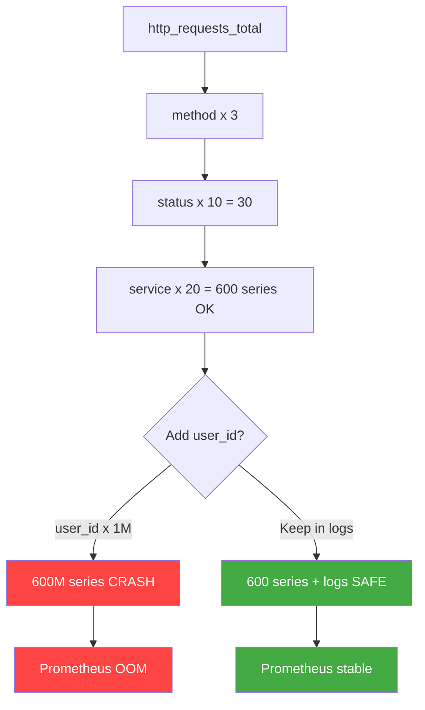
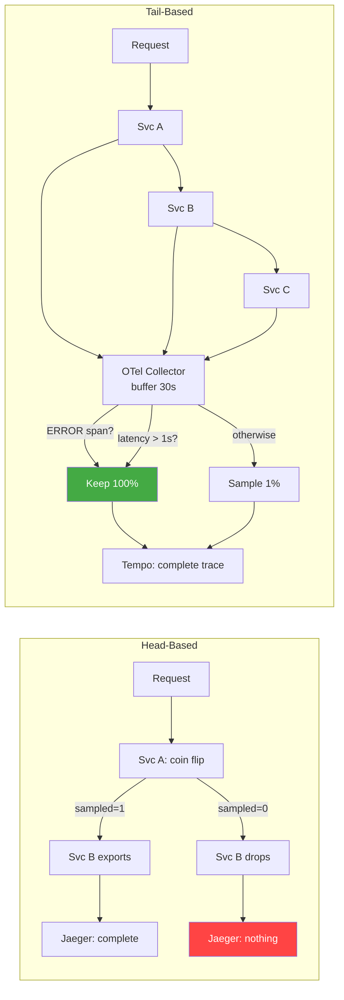

## Keywords in This File

{: .no_toc }

| #   | Keyword | Weight |
| --- | ------- | ------ |
| 1   | [Cardinality in Metrics](#cardinality-in-metrics) | critical |
| 2   | [Trace Sampling Strategies](#trace-sampling-strategies) | high |

---

# Cardinality in Metrics

**TL;DR** - Cardinality is the count of unique time series a
metric produces. A user_id label with 1M users creates 1M
series. This is the primary cause of Prometheus OOM in
production. Design label schemas to keep cardinality below
10K series per metric.

---

### 🎯 Model Answer

**30 seconds:**
> Cardinality is the number of unique time series a metric
> creates - determined by how many distinct label value
> combinations exist. A counter with a user_id label has
> cardinality equal to the number of unique users. At one
> million users, that is one million time series stored
> in Prometheus memory. High cardinality is the most common
> cause of Prometheus OOM-kills in production.

**3 minutes (Senior):**
> When I first worked with Prometheus at scale, the most
> disorienting failure I encountered was a Prometheus pod
> OOM-killed in the middle of an incident. We could not see
> the metrics we needed to diagnose the problem because the
> metrics system itself was down. Root cause: a developer had
> added a user_id label to an HTTP request counter, and we
> had 500,000 active users. In Prometheus, every unique
> combination of label values creates a distinct time series
> stored in memory. The TSDB keeps the most recent two hours
> of data in a WAL-backed memory structure. At ten bytes per
> sample and a fifteen-second scrape interval, 500,000 series
> costs roughly 500 MB of RAM just for the head block. We
> went from 5,000 series to 500,000 series with one label
> addition. The diagnosis is straightforward: check
> prometheus_tsdb_head_series for trend, then run
> topk(20, count by (__name__)({__name__=~".+"})) to find
> the offending metric. The fix is always label schema
> redesign: remove high-cardinality dimensions from metrics
> and route per-request context to logs and traces where it
> belongs. User IDs, session IDs, request IDs, and trace IDs
> are never valid Prometheus label values.

**Framework:** WHAT -> WHY -> HOW -> TRADE-OFF -> EXAMPLE

*Adapting up:* Extend with cardinality governance: enforcing
a per-metric series limit via Prometheus relabeling rules,
automated alerts when prometheus_tsdb_head_series exceeds a
threshold, and a pre-deployment metric review process.

*Adapting down:* Define cardinality clearly, state that
user_id is the canonical example of a cardinality bomb, and
describe the OOM symptom.

**Blank Mind Recovery:**

**(1) Restate:** "You are asking about cardinality in metrics -
let me walk through what it means and why it crashes
Prometheus in production."

**(2) First principles:** "From first principles, a Prometheus
metric with N unique label combinations stores N separate
time series in memory. Memory = series count x sample size
x retention window. A user_id label with 1M users = 1M
series - that is the cardinality explosion."

**(3) Bridge:** "Think of it like a database GROUP BY. Adding
user_id to a GROUP BY on a table with 1M rows creates 1M
groups. Prometheus labels ARE the GROUP BY columns for time
series storage. High-cardinality columns in a GROUP BY kill
query performance; high-cardinality labels in Prometheus
kill memory."

---

### 📘 Concept Explanation

**What it is:**
Cardinality in Prometheus metrics is the count of unique time
series produced by a metric. It equals the product of the
number of distinct values across all label dimensions.

**The problem it solves:**
Understanding cardinality prevents the most common Prometheus
production failure: OOM crash caused by labels that explode
the series count. Engineers who understand cardinality design
label schemas that are informative without being destructive.

**How it works:**
Every unique label set on a metric creates one time series
in the Prometheus TSDB head block. For a metric
http_requests_total with labels {method, status, service}:

```
Label dimension      Unique values   Series contribution
method               3               x3
status               10              x10
service              20              x20
Total series:        3 x 10 x 20  = 600  (manageable)

Add user_id:
user_id              1,000,000       x1,000,000
Total series:        600 x 1,000,000 = 600,000,000 (CATASTROPHIC)
```

Prometheus holds two hours of head samples in memory. At 15s
scrape interval that is 480 samples per series. At 10 bytes
per sample: 600M series x 480 x 10 = 2,880 TB. Even 1M series
= 4.8 GB RAM just for the head block.

**The key insight:**
Cardinality compounds multiplicatively, not additively.
Adding one high-cardinality label multiplies the total series
count by its value count. The multiplier is not additive.
This is why a single user_id label is catastrophic even when
all other labels are well-controlled.

**When to use it:**
Use Prometheus labels only for low-cardinality stable
dimensions: service name (10-50 values), HTTP method
(5 values), status code (10 values), environment (3 values),
region (5-10 values). Maximum target: under 10,000 series
per metric.

**When NOT to use it:**
Never use Prometheus labels for: user_id, session_id,
request_id, trace_id, order_id, or any identifier that
scales with traffic volume. These identifiers belong in
structured logs (for per-event context) and distributed
traces (for per-request causality).

**Alternatives:**

- Logs with structured fields - for user-scoped events with
  full context
- Distributed traces with exemplars - for correlating metric
  anomalies to specific traces without labels
- High-cardinality metrics backends - Honeycomb, Datadog APM,
  Lightstep - store high-cardinality dimensions natively

**First-principles derivation:**
Given a fixed memory budget M, storing K samples per series
per retention window T means: max_series = M / (K x sample_size).
At M=8GB, K=480, sample_size=10: max_series = 8GB / 4800 = 1.7M.
Any label that adds a dimension with value count V multiplies
the series count by V. A 100K-user user_id label on a 600-series
metric crosses the 1.7M ceiling immediately. The constraint is
physical - no configuration change fixes it without reducing
series count.

---

### 💻 Code Example

**BAD - cardinality bomb via user_id label:**

```java
// BAD: user_id creates series-per-user explosion
// 1M users = 1M series for this one counter
Counter badCounter = Counter.build()
    .name("checkout_requests_total")
    .help("Total checkout requests")
    // WRONG: user_id has cardinality = active user count
    .labelNames("service", "status", "user_id")
    .register();

// This call creates a new time series per unique userId
badCounter.labels("checkout", "success", userId).inc();
// After 1M unique users: 1M time series, ~500MB RAM
```

> **Code walkthrough:** The BAD example adds user_id as a
> label alongside service and status. With 1M users, this
> creates 1M time series for this counter alone. Each series
> needs memory for its sample history, index entry, and WAL
> buffer. The key mechanism is that Prometheus allocates per
> series, not per value - so the damage is structural and
> cannot be mitigated by scrape configuration after the fact.

**GOOD - low-cardinality labels only, user context in logs:**

```java
// GOOD: only stable, low-cardinality labels on metrics
// service(20) x status(10) = 200 series max
Counter goodCounter = Counter.build()
    .name("checkout_requests_total")
    .help("Total checkout requests")
    .labelNames("service", "status") // bounded cardinality
    .register();

// Per-user context goes to structured logs + traces, not
// to Prometheus labels
goodCounter.labels("checkout", "success").inc();

// Structured log carries the user-scoped context
log.atInfo()
    .addKeyValue("user_id", userId)
    .addKeyValue("trace_id", traceId)
    .addKeyValue("event", "checkout.completed")
    .log("Checkout succeeded");
```

> **Code walkthrough:** The GOOD example uses only
> low-cardinality labels: service (bounded by service count)
> and status (bounded by HTTP status codes). User context
> is routed to structured logs where it belongs - logs can
> handle high-cardinality fields because they are disk-indexed
> event records, not in-memory time series. The key mechanism
> is the separation of concerns: metrics answer "how much"
> and "how often" (aggregated), logs answer "what happened"
> (per-event with context).

**Diagnosing cardinality in production:**

```promql
# Find highest-cardinality metrics (run in Prometheus UI)
topk(20, count by (__name__) ({__name__=~".+"}))

# Monitor total series count trend
prometheus_tsdb_head_series

# Alert when series count grows unexpectedly (>10K/5min)
increase(prometheus_tsdb_head_series_created_total[5m]) > 10000

# Find which job contributes most series
topk(10, count by (job) ({__name__=~".+"}))
```

> **Code walkthrough:** These PromQL queries form the
> cardinality investigation toolkit. The first query identifies
> the worst offenders by metric name. The second monitors the
> total memory pressure. The third creates an alert for
> cardinality spikes (a developer deploying a high-cardinality
> metric causes the series creation rate to spike). The fourth
> identifies which scrape job is the source. Together they
> enable diagnosis in under five minutes.

---

### 🎓 Answers by Seniority

**Junior / Mid (0-5 years):**
> Cardinality in Prometheus is the number of unique time
> series a metric has. It is determined by the number of
> unique label value combinations. The dangerous case is
> adding high-cardinality labels like user_id - one million
> users means one million time series, which consumes gigabytes
> of RAM and causes Prometheus to crash with an OOM error.
> The rule is: only use low-cardinality, stable identifiers
> as labels. User IDs and trace IDs belong in logs and traces.

*Push deeper:* Describe how you would diagnose a cardinality
problem: topk() query to find offending metrics, and
prometheus_tsdb_head_series to see total memory pressure.

---

**Senior / Staff (5+ years):**
> Cardinality is the product of unique values across all label
> dimensions for a metric. It is the primary resource budget
> in Prometheus - every unique series costs memory in the TSDB
> head block. The critical failure pattern is multiplicative
> cardinality explosion: a single user_id label added to a
> 600-series metric creates 600 million series if you have
> 1M users. I diagnose cardinality problems with
> topk(20, count by (__name__)({__name__=~".+"})) to identify
> the offending metric, then trace it to a recent deployment.
> The fix is always label schema redesign. At the governance
> level, I enforce a metric registration gate that rejects
> any label with observed value count above a configurable
> threshold (default 1000) in the current scrape. This runs
> in CI as a PromRules linting step.

*Push deeper:* Describe exemplars as the correct bridge
between metrics and traces: Prometheus histogram exemplars
embed a trace_id as metadata on a sample point without
creating a label dimension. This gives trace correlation
without cardinality cost.

---

### ⚠️ Common Misconceptions

| Misconception | Reality |
| ------------- | ------- |
| "More labels = more information" | More labels means more time series. High-cardinality labels cause OOM and destroy query performance. The correct tool for high-cardinality data is logs and traces |
| "I can add trace_id as a label to correlate metrics and traces" | trace_id has cardinality equal to request count - billions per day. This is the most destructive cardinality bomb possible. Use Prometheus exemplars instead |
| "Cardinality only matters at FAANG scale" | A 10-service system with 100K users has 1M series from a single user_id label. Cardinality problems emerge at startup scale and worsen with growth |
| "Prometheus will auto-drop high-cardinality metrics" | Prometheus accepts all metrics until OOM. Without explicit limits (per-target label count limits in scrape_config), the crash is silent and total |
| "Reducing scrape interval fixes cardinality" | Scrape interval controls how often samples are stored per series, not how many series exist. Cardinality is a label schema problem, not a scrape frequency problem |

---

### 🚨 Failure Modes and Diagnosis

**Mode 1 - Cardinality explosion OOM-kills Prometheus**

Symptom: Prometheus pod OOM-killed. Restarts and OOM-kills
again. All metric-based alerts stop evaluating. Grafana
dashboards show "No data."

Root cause: A high-cardinality label (user_id, session_id,
request_id) was added to a metric. Series count grew from
thousands to millions.

Diagnostic steps:
```bash
# Check Prometheus restart count (Kubernetes)
kubectl get pod -n monitoring | grep prometheus
kubectl describe pod prometheus-xxx -n monitoring | grep -A5 OOMKilled

# After Prometheus restarts (if it can start):
# Find offending metric
curl -s http://prometheus:9090/api/v1/query \
  --data-urlencode \
  'query=topk(20,count by(__name__)({__name__=~".+"}))' \
  | jq '.data.result[] | {metric: .metric.__name__,
    series: .value[1]}'
```

Fix: Identify the offending metric and remove the
high-cardinality label via a relabel rule:
```yaml
# In Prometheus scrape config - drop user_id label
metric_relabel_configs:
  - action: labeldrop
    regex: user_id
```

Prevention: Enforce cardinality limits in CI with a
metric schema linting step. Alert on
`increase(prometheus_tsdb_head_series_created_total[5m]) > 5000`.

---

**Mode 2 - PromQL queries timeout due to high-cardinality aggregation**

Symptom: Grafana dashboards timeout on load. Prometheus
query log shows evaluation times over 30 seconds. Alert
evaluation starts lagging.

Root cause: Aggregation queries scan all series for a
high-cardinality metric. `sum by (user_id)
(requests_total)` on a metric with 1M series forces
Prometheus to iterate 1M series per query.

Diagnostic:
```promql
# Enable Prometheus query logging (query_log_file in config)
# Check prometheus_engine_query_duration_seconds P99
histogram_quantile(0.99,
  sum by (le) (rate(
    prometheus_engine_query_duration_seconds_bucket[5m]
  ))
)
```

Fix: Create recording rules to pre-aggregate expensive
queries. Or redesign the metric to remove the
high-cardinality label.

Prevention: Dashboard review process that checks query
evaluation time before deployment. Recording rules for
all dashboards used by alerts.

---

**Mode 3 - Label churn from ephemeral values**

Symptom: prometheus_tsdb_head_series_created_total
increases continuously at a steady rate even under
constant traffic. Prometheus memory grows without bound.
Old series accumulate in the TSDB block.

Root cause: A metric label contains an ephemeral value
that changes frequently: pod hash suffix, deployment
revision ID, ephemeral container ID, or random request
attribute. Each new value creates a new series; old
series are retained until TSDB compaction.

Diagnostic:
```promql
# Steady non-zero series creation = churn
rate(prometheus_tsdb_head_series_created_total[5m])

# Find churning metrics
increase(
  prometheus_tsdb_head_series_created_total[1h]
) > 100
```

Fix: Remove ephemeral labels. Use only stable values:
service name, environment, region, version. Pod hash
suffixes must never appear in labels.

Prevention: Enforce label naming conventions in admission
webhook: label values must match `[a-z][a-z0-9_-]*` and
must not contain auto-generated suffixes.

---

### 🎯 Interview Deep-Dive

| Question type | Time budget | Goal |
| ------------- | ----------- | ---- |
| Conceptual | 60 sec | Define cardinality precisely |
| Debugging | 90 sec | Diagnose cardinality OOM |
| Comparison | 60 sec | Labels vs logs vs traces for user context |
| Scenario | 2 min | Design a label schema for a checkout service |
| Trade-off | 90 sec | Cardinality vs observability richness |
| Production | 2 min | Describe a cardinality incident you handled |
| Behavioral | 2-3 min | STAR story of preventing a cardinality problem |
| Architecture | 90 sec | Cardinality governance at 50 services |
| Misconception | 60 sec | Why exemplars are better than trace_id labels |

---

**Q1 [JUNIOR] What is cardinality in Prometheus metrics?**

*Why they ask:* Tests foundational metrics knowledge.

*Likely follow-up:* Why does high cardinality cause problems?

Cardinality in Prometheus is the number of unique time series
that a metric has. Each unique combination of label values
creates a separate time series stored in memory. For a metric
with labels method, status, and service: if method has 3
values, status has 10, and service has 20, total cardinality
is 3 times 10 times 20 equals 600 time series. Adding a
user_id label with one million unique users multiplies the
total by one million - creating 600 million series. Each
series occupies memory for its sample history, index entry,
and WAL buffer. The problem is that Prometheus is designed
for time-series analytics, not per-entity storage. It stores
every series in memory for the last two hours (the head block)
regardless of how frequently the series is updated. One
million series equals roughly 500 MB to 5 GB of RAM depending
on scrape frequency. Prometheus cannot compress or evict active
series from the head block, so the memory consumption is
proportional to series count with no escape valve. The OOM
crash happens when the series count exceeds what the available
heap can hold.

*What separates good from great:* Great candidates can state
the formula: total_series = product(distinct_values_per_label)
and show why the multiplication makes individual high-cardinality
labels so catastrophic.

---

**Q2 [MID] How do you diagnose a cardinality explosion in production?**

*Why they ask:* Tests production debugging skills.

*Likely follow-up:* How do you identify which deployment caused it?

I start with three signals. First, Prometheus is OOM-killed
or shows memory growing faster than expected: check
`prometheus_tsdb_head_series` - if this is in the millions
and growing, cardinality is the issue. Second, I run the
top-cardinality query:
`topk(20, count by (__name__)({__name__=~".+"}))` to
find which metric has the most series. If one metric has
10x more series than the others, that is the offender.
Third, I check recent deployments: a cardinality explosion
usually starts at a specific time when a developer deployed
a metric with a new high-cardinality label. Check
`prometheus_tsdb_head_series_created_total` rate over time
to find the inflection point, then correlate with deployment
timestamps in your CI system. The fix path: identify the
metric, identify the label, drop the label via
`metric_relabel_configs` in the Prometheus scrape config,
allow Prometheus to restart and compact the TSDB, verify
series count returns to baseline.

*What separates good from great:* Great candidates describe
the immediate mitigation before the root cause fix: add a
`labeldrop` relabel rule to immediately stop the series
creation, buy time for a proper fix in the next deployment.

---

**Q3 [SENIOR] What are Prometheus exemplars and how do they solve
the trace correlation problem?**

*Why they ask:* Tests deep Prometheus knowledge.

*Likely follow-up:* How does Grafana display exemplars?

Exemplars are metadata attached to individual Histogram and
Summary observations in Prometheus. They store a trace_id
(or any key-value pair) alongside the metric observation
without creating a new label dimension. When Prometheus
scrapes a Histogram metric, the exemplar is stored as a
separate data point associated with a specific bucket
observation - not as a time series label. In the Prometheus
exposition format, an exemplar looks like:
`http_request_duration_seconds_bucket{le="0.5"} 12
# {trace_id="abc123"} 0.437 1620000000.000`. In OpenMetrics
format (required for exemplar support), the exemplar is
a named sample attached to the bucket value. Grafana
renders exemplars as dots on time series panels. When an
engineer sees a latency spike on the P99 graph, they can
click the exemplar dot to jump directly to the Tempo trace
for the specific request that was 4xx milliseconds slow.
This gives trace-to-metric correlation with zero cardinality
cost. The exemplar bypasses the cardinality problem because
it is metadata on a sample, not a label on the series.

*What separates good from great:* Great candidates describe
that exemplars require: the Java/Go/Python client to inject
trace_id from the current span context into the histogram
observation, Prometheus scrape config with
`enable_feature: exemplar-storage`, and Grafana configured
with Tempo as an associated trace data source.

---

**Q4 [MID] What labels are safe to add to a Prometheus metric?**

*Why they ask:* Tests metric schema design judgment.

*Likely follow-up:* What is the maximum cardinality you would accept for a label?

Safe labels have a small, stable, and bounded set of values.
The categories I use: environment (prod, staging, dev - 3
values), region (us-east-1, eu-west-1 - 5-10 values), service
(name of the microservice - 10-100 values), HTTP method
(GET, POST, PUT, DELETE - 4-7 values), HTTP status code
(200, 201, 400, 401, 404, 500, 503 - 10-20 values), feature
flag name (if bounded, 10-50 values). Unsafe labels that I
never add: user_id, customer_id, session_id, request_id,
trace_id, order_id, tenant_id (unless tenant count is small
and stable - under 1000). The practical rule: before adding
a label, ask "how many unique values can this have at peak
production traffic?" If the answer is "proportional to request
volume or user count," the label belongs in logs. I target
a maximum of 10,000 series per metric, which means the
product of all label value counts must stay under 10,000.

*What separates good from great:* Great candidates add the
multi-tenant exception: tenant_id can be a valid label if
you have a small, bounded, contractually fixed number of
tenants (for example, 50 enterprise customers). At 1000+
tenants it becomes a cardinality risk.

---

**Q5 [SENIOR] How do you enforce cardinality limits across 50
microservices in CI?**

*Why they ask:* Tests platform engineering and governance thinking.

*Likely follow-up:* How do you handle exceptions to the rule?

I enforce cardinality at three layers. Layer 1: metric
registration validation at test time. In the service's unit
tests, after registering all metrics, I run a cardinality
assertion: the total series count of all registered metrics
with mock label values must not exceed 100,000. This runs
in every pull request. Layer 2: PromRules linting in CI.
A linter scans metric definitions for label names that match
a blocklist (user_id, session_id, request_id, trace_id,
order_id). Any match fails the build with a cardinality
warning. Layer 3: Prometheus alerting rule that fires when
any metric's series count grows by more than 10,000 within
five minutes:
`increase(prometheus_tsdb_head_series_created_total[5m]) > 10000`.
This alert pages the on-call immediately when a cardinality
bomb is deployed to production. For exceptions: teams that
genuinely need high-cardinality metrics (for example, a
tenant-scoped SLO system with 200 tenants) submit a cardinality
budget request, which is reviewed against the Prometheus
memory allocation for the cluster. Approved exceptions are
documented with the maximum expected series count and a
re-review date.

*What separates good from great:* Great candidates describe
the Prometheus remote_write filter as a last-resort safety
valve: a metric_relabel_config rule that drops series above
a cardinality threshold before they are stored.

---

**Q6 [JUNIOR] Why should trace_id never be a Prometheus label?**

*Why they ask:* Tests understanding of cardinality implications.

*Likely follow-up:* How do you correlate metrics anomalies to traces?

trace_id should never be a Prometheus label because its
cardinality equals the request rate times the retention window.
At 1000 requests per second, trace_id has 1000 unique values
per second. Over a 30-day retention window, that is 2.6 billion
unique time series for any metric with a trace_id label. This
is physically impossible to store in Prometheus - even 1 million
series saturates most production deployments. The correct
approach for trace-to-metric correlation is Prometheus exemplars.
An exemplar attaches the trace_id as metadata to a specific
histogram bucket observation without creating a new time series.
When you see a P99 latency spike, Grafana shows an exemplar
dot on the chart. You click the dot and it opens the specific
trace in Jaeger or Tempo. This gives trace correlation for
the interesting cases (anomalies) without the cardinality cost.
In OpenTelemetry instrumentation, exemplars are injected
automatically when a span is sampled and a histogram
observation is recorded in the same request context.

*What separates good from great:* Great candidates describe
that exemplars only work for the sampled traces (typically
1% head-based sampling), so they capture some anomalies but
not all. For guaranteed trace capture on anomalies, tail-based
sampling is also needed.

---

**Q7 [STAFF] How does cardinality interact with Prometheus remote write
and long-term storage?**

*Why they ask:* Tests Prometheus at scale knowledge.

*Likely follow-up:* How does Thanos handle high-cardinality data?

Remote write forwards all ingested time series from Prometheus
to a long-term storage backend: Thanos, Cortex, or Mimir.
High-cardinality metrics are amplified in the remote write
pipeline because: first, they fill the remote write queue
faster than the backend can ingest. The queue is bounded
(default 500K samples), and when full, Prometheus drops samples.
Second, high-cardinality metrics cause high ingestion rate at
the backend, which translates directly to cost on hosted
backends (Grafana Cloud charges per series per month). Third,
Thanos and Cortex shard time series across storage nodes
using a hash of the metric labels. High-cardinality metrics
create hot shards because all series for a popular metric
hash to a limited set of shards. The mitigation: use recording
rules to pre-aggregate high-cardinality data before it reaches
remote write. For example, a metric with user_id can be
pre-aggregated to drop user_id before forwarding:
`record: job:requests:rate5m` aggregates across user_id,
reducing 1M series to 1 series in remote write. The original
high-cardinality data can be kept in a shorter-retention local
Prometheus if user-level breakdown is occasionally needed.

*What separates good from great:* Great candidates describe the
Mimir tenant isolation model: each tenant in Mimir has its own
cardinality budget enforced at ingestion, preventing one tenant's
cardinality explosion from affecting others in a multi-tenant deployment.

---

**Q8 [MID] What is the difference between high-cardinality in
metrics versus high-cardinality in logs?**

*Why they ask:* Tests cross-pillar data model understanding.

*Likely follow-up:* When is high-cardinality data better in logs?

High cardinality in Prometheus metrics is dangerous because
metrics are stored as in-memory time series, with every unique
label combination occupying RAM indefinitely for the retention
window. The cost is RAM, and it is a hard ceiling. High
cardinality in logs is acceptable because log stores (Loki,
Elasticsearch, Splunk) are optimized for disk-based event storage.
A log record with user_id as a field occupies disk space
proportional to the number of events, not the number of unique
users. Elasticsearch indexes user_id as an inverted index
(allowing fast field queries), but the index size grows with
event volume, not user count. Loki does not index log content
fields at all - it indexes only stream labels (high-level
selectors like app, env, namespace) and uses sequential scan
for field queries. The implication: user_id as a log field
in Loki is fine; user_id as a Loki stream label creates the
same cardinality problem as in Prometheus. The general rule:
high-cardinality data is safe in logs when stored as a field
(not as an index label), but must never appear as a Prometheus
metric label or as a Loki stream selector.

*What separates good from great:* Great candidates describe
Loki's specific design choice: only stream labels (in `{}`)
are indexed; pipeline fields (after `| json |`) are not
indexed. This means `{user_id="u-123"}` is a cardinality
bomb in Loki, but `{app="checkout"} | json | user_id="u-123"`
is a sequential scan (slower but not catastrophic).

---

**Q9 [SENIOR] Describe how you would recover a Prometheus instance
after a cardinality explosion OOM.**

*Why they ask:* Tests incident response knowledge.

*Likely follow-up:* How long does recovery take?

The recovery sequence has five steps. Step 1: stop the
cardinality source immediately. Deploy a Prometheus scrape
config change with a metric_relabel_configs labeldrop rule
for the offending label. This prevents new high-cardinality
series from being created. Step 2: restart Prometheus with
increased memory (if possible), or wait for it to restart
from its crash loop. On restart, Prometheus replays the WAL
which is fine as long as the labeldrop rule is active. Step 3:
verify series count is dropping. Check prometheus_tsdb_head_series
- after the labeldrop rule takes effect, new scrapes will
add the aggregated series (low count) and old series will
age out over the 2-hour head block window. Step 4: wait for
the TSDB to compact. Prometheus compacts every 2 hours,
which moves head block data to persistent blocks. After
compaction, the old high-cardinality series are no longer
in memory. Step 5: run a TSDB cleanup if needed. Use the
Prometheus API to delete specific metrics:
`curl -X POST http://prometheus:9090/api/v1/admin/tsdb/delete_series
--data-urlencode 'match[]={__name__="bad_metric"}'`. Follow
with a snapshot and reload. Recovery time: typically 2-4
hours for natural compaction, or 15-30 minutes if TSDB delete
is used.

*What separates good from great:* Great candidates mention
the --storage.tsdb.retention.size flag as a preventive
measure: limit disk usage to force Prometheus to drop old
blocks, which also removes high-cardinality historical data.

---

| Interviewer Type | Emphasis |
|---|---|
| Technical Panel | Lead with the cardinality formula: product of distinct values per label |
| Hiring Manager | Lead with the business impact: cardinality OOM during an incident doubles MTTR |
| Bar Raiser | Lead with exemplars and governance: the non-obvious solution to trace correlation without cardinality cost |
| Peer Engineer | Collaborative: "The first time I saw a Prometheus OOM in prod it was from user_id - now I review every new metric in PRs" |

---

### ⚖️ Comparison Table

| Approach | Cardinality | Use Case | Storage | Querying | Choose When |
| -------- | ----------- | -------- | ------- | -------- | ----------- |
| **Prometheus labels** | Low (< 10K series) | Rate, count, latency by stable dimensions | RAM (TSDB head) | PromQL - fast, indexed | Aggregated signals: error rate, p99 by service/method |
| Logs with fields | No cardinality limit | Per-event context, user actions, audit | Disk (Loki/ES) | LogQL/Lucene - sequential | User ID, session ID, any high-cardinality event attribute |
| Trace data | Per-trace storage | Causality, per-request timing breakdown | Trace backend | TraceQL - span search | End-to-end request flow, dependency analysis |
| Exemplars | Zero labels added | Metric-to-trace bridge | Exemplar store (separate) | Click-through in Grafana | Correlating latency spikes to specific traces without labels |
| High-cardinality metrics (Honeycomb, DD) | Unlimited | Per-user analytics, feature flagging | Columnar backend | Field-value queries | When you need both aggregation AND user-level breakdown on metrics |

**The deciding factor:**
If the dimension scales with user count or request volume,
it is not a Prometheus label - route it to logs, traces,
or a high-cardinality metrics backend.

---

### 🏛️ System Design

*(Omit: L3 intermediate keyword. System design connections for
Prometheus at scale are covered in the L4 Prometheus at Scale
file.)*

---

### 📊 Diagram

```
Cardinality multiplication (label schema):

  metric: http_requests_total
  labels: method(3) x status(10) x service(20)

  [method=GET]  [method=POST] [method=PUT]
       |               |            |
  [status=200..503] x10 each = 30 combinations
       |
  [service=s1..s20] x20 each = 600 total series

  ADD user_id (1M values):
  600 x 1,000,000 = 600,000,000 series  (CATASTROPHIC)

  Memory cost at 10 bytes/sample, 480 samples:
  600M x 480 x 10 = 2,880 TB  (IMPOSSIBLE)
```



> **Diagram walkthrough:** The multiplication tree shows how
> cardinality compounds. Starting from 600 safe series, adding
> a single user_id label with 1M values multiplies by 1M,
> making the metric physically impossible to store. The two
> paths - keep user context in labels (crash) versus route to
> logs (stable) - show the correct design decision. The key
> insight is that multiplication, not addition, is the danger.

---

---

# Trace Sampling Strategies

**TL;DR** - Trace sampling decides which traces to keep.
Head-based sampling decides at request entry (cheap, misses
rare errors). Tail-based sampling decides after completion
(captures all errors, costs memory buffer). The hybrid
strategy keeps all error traces while sampling healthy ones.

---

### 🎯 Model Answer

**30 seconds:**
> Trace sampling is how you control the volume and cost of
> distributed tracing. Recording every trace at high throughput
> is prohibitively expensive. Head-based sampling decides at
> the trace entry point before any spans are sent - it is cheap
> but misses rare failures. Tail-based sampling waits until the
> full trace is complete, then decides based on outcome, so it
> can capture all error traces while dropping healthy ones.
> Most production systems use a hybrid: 100% of error traces
> via tail-based, 1% of healthy traces via head-based.

**3 minutes (Senior):**
> When I designed the tracing strategy for a high-volume
> checkout service running at five thousand requests per second,
> I started with 100% sampling. Within a week we were storing
> 50 GB per day of trace data at a cost of around $1,200 per
> month just for trace storage. I needed to reduce cost without
> losing the traces that mattered during incidents. Head-based
> probabilistic sampling at 1% solved the cost problem
> immediately but created a new one: with a 0.1% error rate,
> about ten errors per second, a 1% sampling rate means we
> captured roughly 0.001 errors per second - effectively zero
> error traces. Engineers couldn't investigate failures because
> there were no traces to look at. The solution was tail-based
> sampling in the OpenTelemetry Collector. All spans for a
> trace are held in a 30-second buffer in the Collector. When
> the trace is complete, the policy evaluates: keep 100% of
> traces with an ERROR status span, keep 100% of traces
> exceeding one second latency, keep 1% of healthy traces
> randomly. The Collector needs 8 GB of heap to buffer 50,000
> in-flight traces, but the result is every incident trace is
> captured while storage costs dropped 90%.

**Framework:** WHAT -> WHY -> HOW -> TRADE-OFF -> EXAMPLE

*Adapting up:* Extend with adaptive sampling: dynamically
adjusting the sampling rate based on current error rate -
if error rate exceeds 1%, increase healthy trace sampling
to 5% to capture more context; if under 0.01%, reduce to 0.1%.

*Adapting down:* Define the two strategies, state the core
trade-off (head=cheap but misses errors, tail=captures errors
but needs buffer), and state which is standard for small services.

**Blank Mind Recovery:**

**(1) Restate:** "You are asking about trace sampling strategies -
let me walk through head-based versus tail-based and the
production trade-offs."

**(2) First principles:** "From first principles, storing every
trace at 1K RPS = 1,000 traces/second. At 100 KB per trace
= 100 MB/second = 8.6 TB/day. Sampling is the only option.
The question is: which traces are worth keeping?"

**(3) Bridge:** "Think of it like a hospital triage system.
Head-based is random triage at admission - cheap but misses
critically-ill patients who look healthy on arrival. Tail-based
triage diagnoses first, then decides severity. It catches
everyone critical but needs a waiting area to hold patients
during evaluation."

---

### 📘 Concept Explanation

**What it is:**
Trace sampling is the process of selecting a subset of
distributed traces to record, store, and make available for
analysis, balancing debuggability against storage cost.

**The problem it solves:**
At high traffic volumes, recording 100% of traces generates
prohibitive storage cost and collection overhead. Sampling
reduces trace volume to a manageable level while preserving
the traces most useful for debugging.

**How it works:**
Two fundamental strategies:

HEAD-BASED SAMPLING - decision at trace root:
```
Request arrives at Service A
  -> Root span starts
  -> Sampling decision: keep? (coin flip or hash)
  -> Decision propagated in traceparent header:
     traceparent: 00-traceId-parentSpanId-01 (sampled)
     traceparent: 00-traceId-parentSpanId-00 (not sampled)
  -> All downstream services check the sampled flag
  -> Sampled=0: spans still generated but not exported
  -> Final trace: either fully stored or fully dropped
```

TAIL-BASED SAMPLING - decision after trace completes:
```
Request arrives at Service A, B, C, D
  -> All spans exported to OTel Collector (no sampling yet)
  -> Collector buffers all spans by trace_id in memory
  -> After decision_wait (30s): trace is "complete"
  -> Policy evaluates the complete trace:
     - Contains ERROR span? -> keep (100%)
     - Duration > 1000ms?   -> keep (100%)
     - Otherwise?           -> keep (1%)
  -> Kept traces: forwarded to Jaeger/Tempo
  -> Dropped traces: spans discarded from buffer
```

**The key insight:**
Head-based and tail-based are fundamentally different problems.
Head-based cannot distinguish "this trace will contain an error"
from "this trace will be healthy" because the decision happens
before the trace runs. Tail-based can distinguish, but requires
buffering the entire trace in memory until completion. This
buffer is the central cost and operational complexity of
tail-based sampling.

**When to use head-based:**
Services with low error rates where statistical sampling is
sufficient for performance analysis. Services where
instrumentation overhead must be minimal. Systems where the
OTel Collector does not have tail sampling capability deployed.

**When to use tail-based:**
When error traces must be captured for incident investigation.
When SLO breach traces need 100% capture. When the OTel
Collector infrastructure supports the buffer overhead.

**Alternatives:**

- Probabilistic head-based (traceIdRatioBased) - 1% of all
  traces, deterministic by trace ID hash
- Rate-limited head-based - N traces per second regardless
  of traffic (prevents burst explosion)
- Adaptive sampling - dynamic rate based on current error
  rate or latency
- Always-on for errors only - special-case flag in request
  context: if early error detection (client-side validation
  failure), set sampled=1 in the header

**First-principles derivation:**
Given: 5,000 RPS, average trace size 100 KB, storage budget
$100/day, S3 cost $0.023/GB/month. Daily capacity at budget:
100/0.023 x 30 = 130 TB/day. Required sampling rate: 130 TB /
(5,000 x 100KB x 86400) = 130 TB / 43.2 TB = 3.0x over budget
at 100%. Need at least 33% sampling for cost budget. But at
0.1% error rate, 33% sampling still captures only 0.033% of
error traces. Tail-based with error policy: 100% of
0.1% x 5000 = 5 error traces/second = 5 x 100KB x 86400 = 43
GB/day for errors. Plus 1% of healthy = 432 GB/day. Total:
475 GB/day = $0.36/day. Cost drops from $960/day to $0.36/day
while capturing 100% of error traces.

---

### 💻 Code Example

**Head-based: BAD (100% sampling) vs GOOD (1% probabilistic):**

```java
// BAD: 100% sampling at 5K RPS = $960/day storage
SdkTracerProvider badProvider = SdkTracerProvider.builder()
    .addSpanProcessor(
        BatchSpanProcessor.builder(
            OtlpGrpcSpanExporter.builder()
                .setEndpoint("http://tempo:4317")
                .build()
        ).build()
    )
    // No sampler = ParentBased(AlwaysOn) = 100% sampling
    .build();
```

```java
// GOOD: 1% head-based + parent propagation
SdkTracerProvider goodProvider = SdkTracerProvider.builder()
    .setSampler(
        // Downstream services inherit parent's decision
        Sampler.parentBased(
            // Sample 1% of new root spans
            Sampler.traceIdRatioBased(0.01)
        )
    )
    .addSpanProcessor(
        BatchSpanProcessor.builder(exporter).build()
    )
    .build();
```

> **Code walkthrough:** The BAD example uses no explicit sampler,
> defaulting to 100% trace export. The GOOD example uses
> traceIdRatioBased(0.01) wrapped in parentBased. The parentBased
> sampler is critical: it ensures downstream services respect the
> root span's sampling decision (sampled flag in the traceparent
> header), producing either a complete trace or no trace at all.
> Without parentBased, each service makes an independent sampling
> decision, creating partial traces that cannot be analyzed.

**Tail-based sampling in OTel Collector:**

```yaml
# otel-collector-config.yaml
processors:
  tail_sampling:
    # Hold spans for 30s before sampling decision
    decision_wait: 30s
    # Max in-flight traces in memory buffer
    num_traces: 50000
    expected_new_traces_per_sec: 1000
    policies:
      # Policy 1: Keep ALL error traces (100%)
      - name: keep-errors
        type: status_code
        status_code:
          status_codes: [ERROR]

      # Policy 2: Keep ALL slow traces (>1s)
      - name: keep-slow
        type: latency
        latency:
          threshold_ms: 1000

      # Policy 3: Sample 1% of healthy traces
      - name: sample-healthy
        type: probabilistic
        probabilistic:
          sampling_percentage: 1

service:
  pipelines:
    traces:
      receivers: [otlp]
      processors: [tail_sampling]
      exporters: [otlp/tempo]
```

> **Code walkthrough:** The tail_sampling processor buffers all
> incoming spans by trace_id for decision_wait=30s. After 30s,
> the complete trace is evaluated against policies in priority
> order. The three-policy stack - errors first, then latency,
> then probabilistic fallback - ensures incident-relevant traces
> are kept at 100% while healthy traces are sampled at 1%.
> The num_traces=50000 parameter is the memory ceiling: at 50K
> in-flight traces with 100 KB average size, the buffer needs
> 5 GB of Collector heap. Size the Collector's Java/Go heap
> at 8 GB with this configuration.

---

### 🎓 Answers by Seniority

**Junior / Mid (0-5 years):**
> Trace sampling means recording only a fraction of all
> distributed traces. Head-based sampling makes the decision
> at the start of a request before any work happens - it is
> simple and cheap but cannot distinguish error traces from
> healthy ones, so it misses rare failures. Tail-based sampling
> holds all spans in a buffer until the trace completes, then
> applies rules: keep all traces with errors, keep all slow
> traces, randomly sample the rest. The trade-off is memory:
> tail-based needs a buffer for all in-flight traces.

*Push deeper:* Describe the hybrid approach: head-based 1%
for cost control plus tail-based error policy to capture
100% of incident traces.

---

**Senior / Staff (5+ years):**
> Trace sampling is the cost vs debuggability trade-off for
> distributed tracing. Head-based at 1% is the default choice
> but creates a critical gap: with a 0.1% error rate, 1% sampling
> captures essentially zero error traces. The production-correct
> solution is tail-based sampling in the OTel Collector: buffer
> all spans for 30 seconds, apply an error policy (keep 100%),
> apply a latency policy (keep all > 1s traces), then sample
> the remainder at 1%. The Collector needs 8 GB heap for a
> 50,000-trace buffer at typical span sizes. At the architecture
> level, I run multiple OTel Collector deployments: a lightweight
> head-based tier for commodity services, and a heavier tail-based
> tier with more memory for critical user-facing services.
> The tail-based Collector must be deployed as a stateful set
> (not a DaemonSet) because all spans for a trace must reach
> the same Collector instance for the buffering to work.

*Push deeper:* Describe load balancing for tail-based Collectors:
spans must be routed by trace_id hash to the same Collector
instance, using consistent hash-based load balancing at the
OTel Collector loadbalancer exporter.

---

### ⚠️ Common Misconceptions

| Misconception | Reality |
| ------------- | ------- |
| "Tail-based sampling is always better" | Tail-based requires a 30-60s memory buffer for all in-flight traces. At high volume, the Collector becomes a memory-intensive stateful component. Head-based is correct for services where statistical sampling is sufficient |
| "1% sampling means I see 1% of my errors" | False. With 0.1% error rate and 1% head-based sampling: probability of capturing any specific error = 1% x 0.1% = 0.0001%. Most errors are invisible |
| "Changing sampling rate does not affect metrics" | Sampling rate changes affect sampled trace counts used in derived metrics. If span-count-based alerting is used, a sampling rate change creates artificial count changes |
| "Partial traces (only some services sampled) are useful for debugging" | Partial traces without parentBased propagation are almost useless for root cause analysis. Always use parentBased sampler to ensure complete traces or no trace |
| "Tail-based sampling prevents data loss" | The buffer has a fixed size (num_traces). During traffic spikes, the buffer overflows and traces are dropped with no decision. Overflow is still data loss |

---

### 🚨 Failure Modes and Diagnosis

**Mode 1 - Error traces invisible due to head-based sampling**

Symptom: Error rate alert fires. Engineers open Jaeger and
find no traces matching the error time window. Alert is
assumed false positive. Incident investigation stalls.

Root cause: 1% head-based sampling was dropping 99% of
error traces. The error rate was 0.01% (100 errors/second
at 1M RPS). With 1% sampling, the expected number of captured
error traces per second was 100 x 0.01 = 1 trace/second -
often zero in a quiet minute.

Diagnostic:
```bash
# Check Collector span drop rate
# (requires Collector metrics endpoint)
otelcol_processor_dropped_spans_total

# Check if tail_sampling is configured
curl http://collector:8888/metrics | grep tail_sampling

# Check sampled vs unsampled ratios
otelcol_processor_tail_sampling_sampling_decision_timer_count
```

Fix: Add tail-based sampling with error policy to the OTel
Collector. Keep head-based for non-error traces.

Prevention: Test the sampling configuration by injecting
synthetic errors and verifying traces appear in Jaeger.
Add a synthetic trace validation to the monitoring runbook.

---

**Mode 2 - OTel Collector OOM from tail-sampling buffer overflow**

Symptom: OTel Collector pod OOM-killed during traffic spike.
All traces stop flowing to Jaeger/Tempo for 1-2 minutes
until Collector restarts. The restart loses all buffered
spans.

Root cause: num_traces=50,000 was insufficient for a sudden
traffic spike from 5,000 to 15,000 RPS. Incoming spans
created 150,000 in-flight traces, filling the buffer. New
traces were dropped entirely (no partial buffering).

Diagnostic:
```
# Collector metric for dropped traces
otelcol_processor_tail_sampling_sampling_trace_dropped_count

# Collector heap usage (should be < 80% of limit)
# Alert: heap > 6GB on an 8GB Collector
process_runtime_go_mem_stats_heap_alloc_bytes
```

Fix: Scale Collector horizontally using consistent hash-based
load balancing (LoadBalancingExporter) to distribute traces
across multiple Collector instances by trace_id hash. Each
Collector handles a subset of traces, reducing per-instance
buffer requirements.

Prevention: Add an alert for Collector heap > 75% limit.
Run load tests to determine the peak trace rate and size
the Collector buffer for 2x expected peak.

---

**Mode 3 - Partial traces causing incomplete root cause analysis**

Symptom: Traces in Jaeger show only 2 of 5 expected services.
The missing services have no spans for the affected requests.
Root cause analysis is impossible from partial traces.

Root cause: Services B and C were instrumented with an
AlwaysOff sampler for performance testing and were not
reverted. Or: services B and C use a different SDK that
does not respect the parent-based sampling decision,
making their own independent head-based decision (and
sampling at 0%).

Diagnostic:
```bash
# Find services not propagating the W3C traceparent header
# Check service B's outgoing HTTP headers
kubectl exec -it service-b-pod -- \
  curl -v http://service-c/api 2>&1 | grep traceparent

# If no traceparent header: service B is not instrumented
# If traceparent sampled flag = 00: service B is dropping
```

Fix: Ensure all services use Sampler.parentBased() wrapping
their local sampler. The parentBased sampler respects the
incoming traceparent sampled flag for downstream spans.
Standardize the OTel SDK configuration across all services
via a shared library.

Prevention: Integration test that verifies trace propagation:
send a request through the full service graph and assert
spans from all services appear in Jaeger for sampled traces.

---

### 🎯 Interview Deep-Dive

| Question type | Time budget | Goal |
| ------------- | ----------- | ---- |
| Conceptual | 60 sec | Explain head-based vs tail-based core difference |
| Debugging | 90 sec | Diagnose missing error traces |
| Comparison | 60 sec | Head vs tail vs adaptive |
| Scenario | 2 min | Design sampling strategy for checkout service |
| Trade-off | 90 sec | When NOT to use tail-based |
| Production | 2 min | Describe a sampling misconfiguration incident |
| Behavioral | 2-3 min | STAR story of improving trace debuggability |
| Architecture | 90 sec | Consistent hashing for tail-based Collectors |
| Technical depth | 90 sec | Exemplars as head-based complement |

---

**Q1 [MID] What is the difference between head-based and
tail-based trace sampling?**

*Why they ask:* Tests core tracing knowledge.

*Likely follow-up:* Which should you use for a checkout service?

Head-based sampling makes the sampling decision at the
beginning of a trace - at the root span in the first
service that receives the request. The decision is made
before any downstream service calls happen. It is
propagated to all downstream services via the sampled
flag in the W3C traceparent header. All downstream services
respect that flag: if sampled=1, they export spans; if
sampled=0, they generate spans for local processing (timeout
detection) but do not export them. Head-based is cheap: the
decision is instant, requires no buffering, and imposes
minimal overhead on the critical path. The limitation: the
sampling decision is made with zero information about what
the trace will do. A request that appears normal at entry
but fails 200ms later cannot be retroactively promoted to
sampled. Tail-based sampling holds all spans from all
services in a buffer until the trace is complete or times
out (typically 30 seconds). The complete trace is then
evaluated against policies: keep all error traces, keep all
slow traces, sample the rest. The limitation: requires a
stateful, memory-intensive buffer in the OTel Collector.
All spans for a given trace must reach the same Collector
instance (consistent hash-based routing).

*What separates good from great:* Great candidates describe
why parentBased sampler is required for head-based to work
correctly: without it, each service makes an independent
sampling decision, creating partial traces that cannot be
used for root cause analysis.

---

**Q2 [JUNIOR] Why does 1% head-based sampling miss most errors?**

*Why they ask:* Tests understanding of probability and sampling.

*Likely follow-up:* What is the solution?

With 1% head-based probabilistic sampling, any given request
has a 1% chance of having its trace recorded. If the error
rate is 0.1% (1 error per 1000 requests), the probability
of a specific error request being sampled is 1% x 0.1% =
0.0001%. At 1000 RPS with 0.1% errors = 1 error/second.
At 1% sampling, we capture 1 error per second x 1% = 0.01
error traces per second. Over ten minutes: 6 captured error
traces out of 600 actual errors. Most errors are invisible.
The solution is tail-based sampling with an error policy:
buffer all traces for 30 seconds, then keep 100% of traces
that contain a span with ERROR status. This ensures 100% of
error traces are captured regardless of the overall sampling
rate. Healthy traces continue to be sampled at 1% for cost
control. The hybrid approach captures all incident-relevant
traces while keeping storage costs manageable.

*What separates good from great:* Great candidates describe
the specific calculation: at 1000 RPS and 0.1% error rate,
tail-based sampling stores 1 error trace/second x 86400
seconds = 86,400 error traces/day. At 100 KB per trace =
8.6 GB/day for error traces. That is a concrete, affordable
storage cost for 100% error trace capture.

---

**Q3 [SENIOR] How do you configure the OTel Collector for tail-based
sampling in a Kubernetes deployment?**

*Why they ask:* Tests practical OTel Collector knowledge.

*Likely follow-up:* Why must tail-based Collector be a StatefulSet?

Tail-based sampling in Kubernetes requires three specific
decisions. First: StatefulSet not DaemonSet. The tail_sampling
processor buffers all spans for a trace in memory, keyed by
trace_id. If different spans for the same trace arrive at
different Collector pods, each pod has an incomplete view
and cannot make a correct policy decision. StatefulSet with
persistent pod identity is needed for consistent routing.
Second: consistent hash load balancing. A LoadBalancingExporter
upstream of the tail-sampling Collector routes spans by
trace_id hash to the same Collector pod consistently. This
is configured as a chain: service-side OTel SDK → lightweight
head-routing Collector (DaemonSet) → LoadBalancingExporter
→ tail-sampling Collector (StatefulSet). Third: memory sizing.
The tail-sampling Collector needs: num_traces x average_spans_per_trace
x average_bytes_per_span = 50,000 x 100 x 1,000 bytes = 5 GB.
Configure memory_limiter processor before tail_sampling with
a hard ceiling at 90% of the pod's memory limit. The
decision_wait=30s means Collectors hold spans for 30 seconds,
so the memory cost is proportional to: (RPS x spans/request
x 30s x bytes/span). At 5,000 RPS x 20 spans x 30s x 1KB = 3 GB.

*What separates good from great:* Great candidates describe
the fallback behavior: when the LoadBalancingExporter's
target Collector pod is unavailable, it routes to another
pod. Spans for the same trace arrive at different pods,
creating partial traces. This is acceptable data loss during
rolling restarts - document it in the runbook.

---

**Q4 [JUNIOR] What is rate-limited sampling?**

*Why they ask:* Tests breadth of sampling strategy knowledge.

*Likely follow-up:* When is rate-limited better than probabilistic?

Rate-limited sampling keeps a fixed number of traces per
second (or per time window) regardless of the incoming
traffic rate. For example, rate-limited at 100 traces/second:
at 1,000 RPS, 10% of traces are sampled. At 10,000 RPS, 1%
are sampled. At 100 RPS, 100% are sampled. The sampling
percentage adjusts automatically to maintain the target
rate. Rate-limited is better than probabilistic (percentage-
based) in two scenarios. First: low-traffic services during
off-peak hours. With 1% probabilistic at 10 RPS, you capture
0.1 traces/second - essentially zero traces to debug with.
Rate-limited at 1 trace/second ensures you always have
some traces. Second: burst protection. During a traffic
spike that indicates an attack or misconfiguration, probabilistic
at 1% captures proportionally more traces (expensive). Rate-
limited caps storage regardless of spike magnitude. The OTel
Collector `probabilistic_sampling` processor supports both
modes. For most services, I use probabilistic for tail-based
healthy trace sampling and rate-limited for head-based
Collector sampling at the service entry tier.

*What separates good from great:* Great candidates describe
the combination: rate-limited head-based (5 traces/second
baseline) plus tail-based error policy (100% of errors).
This guarantees baseline visibility plus complete error coverage.

---

**Q5 [SENIOR] How does adaptive sampling work and what are its risks?**

*Why they ask:* Tests advanced sampling knowledge.

*Likely follow-up:* What are the cardinality risks of adaptive sampling?

Adaptive sampling dynamically adjusts the sampling rate based
on current system signals - most commonly error rate and
latency distribution. The concept: when the error rate is
at the baseline 0.01%, sample healthy traces at 1%. When
the error rate spikes to 5% (incident in progress), increase
healthy trace sampling to 20% to capture more context. When
the error rate drops to 0.001% (night-time quiet), reduce
to 0.1%. OpenTelemetry's adaptive sampling support is
available in the Grafana Tempo backend (adaptive sampling
configuration that adjusts per-service sampling rates based
on ingestion signals) and in some vendor implementations.
The risks: first, the sampling rate change creates an
artificial change in sampled trace count metrics. Any
dashboard or alert based on sampled span counts will show
a spike or drop when the sampling rate changes. This must
be normalized: use `rate_adjustment_factor` to scale
counts by the inverse of the sampling rate. Second:
adaptive sampling requires feedback data (current error
rate) to make decisions. If the error rate signal is
unavailable (Prometheus is down), the adaptive system
falls back to a default rate. Third: adaptive sampling
changes the statistical properties of sampled traces over
time - analysis comparing error rates across time periods
must account for sampling rate changes.

*What separates good from great:* Great candidates describe
Grafana Tempo's consistent_over_traces sampling strategy,
which maintains probabilistic consistency across the same
trace_id for the same time window, preventing flip-flop
where a trace is sampled by one Collector replica but not
another.

---

**Q6 [STAFF] How do you design the tracing strategy for a
platform with 100 microservices?**

*Why they ask:* Tests platform-level architecture thinking.

*Likely follow-up:* How do you handle services with different criticality?

I segment services into three tiers for tracing strategy.
Tier 1: critical user-facing services (checkout, payment,
authentication) - tail-based sampling with 100% error capture
and 5% healthy trace sampling. These services handle revenue
and authentication; every incident trace must be available.
Tier 2: internal services (recommendation, catalog, inventory)
- head-based at 2% with rate-limited floor of 2 traces/second.
Enough for performance analysis and occasional debugging.
Tier 3: background jobs and batch processors - head-based
at 0.1% or per-job sampling (one trace per job run for
correctness verification). The infrastructure: Tier 1 services
route spans to tail-sampling OTel Collectors (StatefulSet,
8 GB heap, consistent hash load balancing). Tier 2 and 3
services route spans to lightweight head-sampling Collectors
(DaemonSet, 256 MB heap). Both tiers forward to Grafana Tempo
with separate retention policies: Tier 1 traces retained 30
days, Tier 2/3 retained 7 days. The cost breakdown: Tier 1
tail-based error traces (100% of 50 errors/second x 30 days
x 100KB) = 12 TB. Tier 2/3 head-based (2% x 4,950 RPS x 7
days x 100KB) = 600 GB. Total: 12.6 TB at $0.02/GB = $252/month.

*What separates good from great:* Great candidates describe
the sampling context propagation: Tier 1 services often call
Tier 2 services. When a Tier 1 span is sampled (sampled=1
in traceparent), the Tier 2 service uses parentBased sampler
and also exports the span, creating a complete cross-tier trace.
This means Tier 2 services effectively have higher sampling
rates for requests originating from Tier 1 - no configuration
needed.

---

**Q7 [MID] What is the W3C Trace Context standard and why is it required?**

*Why they ask:* Tests understanding of trace propagation standards.

*Likely follow-up:* What breaks without W3C Trace Context?

W3C Trace Context is a standard HTTP header format for
propagating trace identifiers across service boundaries. It
defines two headers: traceparent
(`00-{trace_id}-{parent_span_id}-{flags}`) and tracestate
(vendor-specific extensions). The flags byte contains the
sampled bit: 01 = sampled, 00 = not sampled. This standard
is required for two reasons. First, interoperability: a Java
service using OpenTelemetry, a Python service using OpenTracing,
and a Node.js service using Jaeger Client can all participate
in the same trace by reading and writing the standard
traceparent header. Without the standard, each tracing SDK
uses its own header format (Jaeger uses uber-trace-id, Zipkin
uses b3), and propagation breaks at the boundary between SDKs.
Second, head-based sampling propagation: the sampled flag in
traceparent is the mechanism by which a root span's sampling
decision is communicated to all downstream services. Without
this propagation, each service makes its own sampling decision,
creating partial traces. With it, a 1% root span sampling rate
is consistently applied across the entire trace graph.

*What separates good from great:* Great candidates describe
the OTel SDK's composite propagator: `W3CTraceContextPropagator`
plus `W3CBaggagePropagator` handles both trace context and
baggage (user-defined key-value pairs propagated through the
trace, such as user tier or feature flag state).

---

**Q8 [SENIOR] How do you validate that your sampling configuration
is working correctly?**

*Why they ask:* Tests testing discipline for observability infrastructure.

*Likely follow-up:* How do you test this in staging?

I validate sampling with three test types. First, synthetic
error injection: in staging, inject a known error into one
in every 10,000 requests. Verify that the error trace appears
in Jaeger within 60 seconds. If it does not, the tail-based
error policy is not working. Run this test weekly as part of
the observability health check. Second, sampling rate
validation: from Prometheus, compute the expected trace count:
`sampled_spans / total_spans = {expected_rate}`. Check that
`otelcol_exporter_sent_spans_total` divided by total incoming
spans matches the configured sampling rate within a 20%
tolerance. If the actual rate is significantly lower, the
Collector is dropping spans (buffer overflow or OOM). Third,
trace completeness validation: for sampled traces, verify
that all expected services appear in the trace graph. A
missing service indicates parentBased propagation failure.
Automate this: periodically pull a sample of traces from
Jaeger API and assert that each trace has spans from all
services in the expected call graph. Alert if more than 5%
of traces are incomplete.

*What separates good from great:* Great candidates describe
the Trace Validation Suite pattern: a dedicated test service
that generates synthetic user flows, marks them with a
known_synthetic baggage key, and then queries Jaeger after
60 seconds to verify the synthetic trace appears complete.
This runs as a continuous synthetic monitor.

---

**Q9 [STAFF] What is the cost model for tracing at scale and how
do you optimize it?**

*Why they ask:* Tests financial and architectural scale thinking.

*Likely follow-up:* How do you justify the tracing cost to leadership?

The tracing cost model has four components. First, collection
overhead: OTel SDK instrumentation adds 2-5 microseconds per
span and 1-3% CPU overhead for span creation and export.
BatchSpanProcessor amortizes export cost with configurable
batch size (512 spans) and export interval (5 seconds).
Second, network: span data is sent from services to Collectors.
At 50,000 RPS x 20 spans x 1 KB = 1 GB/second of span data
before sampling. After 1% sampling: 10 MB/second. Configure
compression (gzip) on the OTel OTLP exporter. Third, storage:
Grafana Tempo or Jaeger backend. Tempo on S3: $0.023/GB/month.
At 475 GB/day from the earlier calculation: $10.5/month for
30-day retention. Fourth, query infrastructure: Tempo querier
and compactor instances in Kubernetes. Two querier pods at
$50/month each = $100/month. Total: ~$210/month. Justification
to leadership: the MTTR improvement from having traces during
incidents. If one incident per month costs 4 hours of SRE time
at $200/hour, plus customer SLA credits of $5,000: total
incident cost $5,800. Reducing MTTR from 4 hours to 45 minutes
via traces saves 3.25 hours x $200 = $650 in SRE time plus
partial SLA credit savings. The $210/month tracing cost pays
for itself with the first incident.

*What separates good from great:* Great candidates describe
the tiered storage pattern for Tempo: recent traces (0-7 days)
in S3 Standard for fast querying, older traces (7-30 days) in
S3 Intelligent-Tiering for cost reduction, and traces older
than 30 days deleted. Automate the retention policy with
Tempo's compaction configuration.

---

| Interviewer Type | Emphasis |
|---|---|
| Technical Panel | Lead with the probability argument for why 1% sampling misses errors, then describe the tail-based architecture |
| Hiring Manager | Lead with cost vs debuggability trade-off and the specific dollar figures |
| Bar Raiser | Lead with the consistent hash routing requirement for tail-based and why StatefulSet is mandatory |
| Peer Engineer | Collaborative: "The first thing I always check in a new codebase is whether they are using parentBased sampler - without it traces are partial and useless" |

---

### ⚖️ Comparison Table

| Strategy | Decision Point | Error Capture | Storage Cost | Complexity | Choose When |
| -------- | -------------- | ------------- | ------------ | ---------- | ----------- |
| **Head probabilistic (1%)** | Trace entry | ~0% of errors at 0.1% error rate | Low (1% of all traces) | Minimal (SDK only) | Dev/staging, or services with high error rates where statistical sampling is sufficient |
| Head rate-limited (N/sec) | Trace entry | Low (rate-limited to N/sec) | Predictable (N x size) | Minimal (SDK only) | Baseline visibility + burst protection |
| **Tail error + probabilistic** | After completion | 100% of errors | Medium (all errors + 1% healthy) | High (StatefulSet Collector) | Production user-facing services |
| Adaptive | Dynamic | Variable | Dynamic | High (feedback loop) | High-variability error rates needing automatic adjustment |
| Always-on (100%) | N/A | 100% | Very high | Minimal | Dev environments, very low-volume services (< 10 RPS) |

**The deciding factor:**
If error trace loss during incidents is acceptable, use
head-based probabilistic. If all error traces must be
preserved for post-incident analysis, use tail-based with
an error policy. The infrastructure cost and complexity
of tail-based is justified by the debuggability improvement.

---

### 🏛️ System Design

*(Omit: L3 intermediate keyword. System design connections for
tracing infrastructure at scale are covered in the L4 and L5
files.)*

---

### 📊 Diagram

```
HEAD-BASED SAMPLING:
Client -> [Svc A: root span, flip coin -> sampled=1]
  -> traceparent: ...01 (sampled)
  -> [Svc B: reads sampled=1, exports span]
  -> [Svc C: reads sampled=1, exports span]
  -> Jaeger: COMPLETE TRACE (if lucky 1%)

TAIL-BASED SAMPLING:
Client -> [Svc A] -> [Svc B] -> [Svc C]
  ALL spans -> OTel Collector (buffer 30s)
  After 30s: COMPLETE trace evaluated:
  - Contains ERROR? -> KEEP (100%)
  - Duration > 1s?  -> KEEP (100%)
  - Otherwise?      -> SAMPLE (1%)
  -> Jaeger: COMPLETE TRACE (all errors captured)
```



> **Diagram walkthrough:** The head-based path shows a binary
> coin flip at the root span: with sampled=1, all downstream
> services export spans producing a complete trace; with
> sampled=0, all spans are dropped. The tail-based path shows
> all spans flowing to the Collector buffer regardless of
> outcome, with the policy decision made after completion.
> The key difference: tail-based sees the complete trace
> outcome (error vs healthy) before deciding, enabling 100%
> error capture while head-based makes a blind bet.
