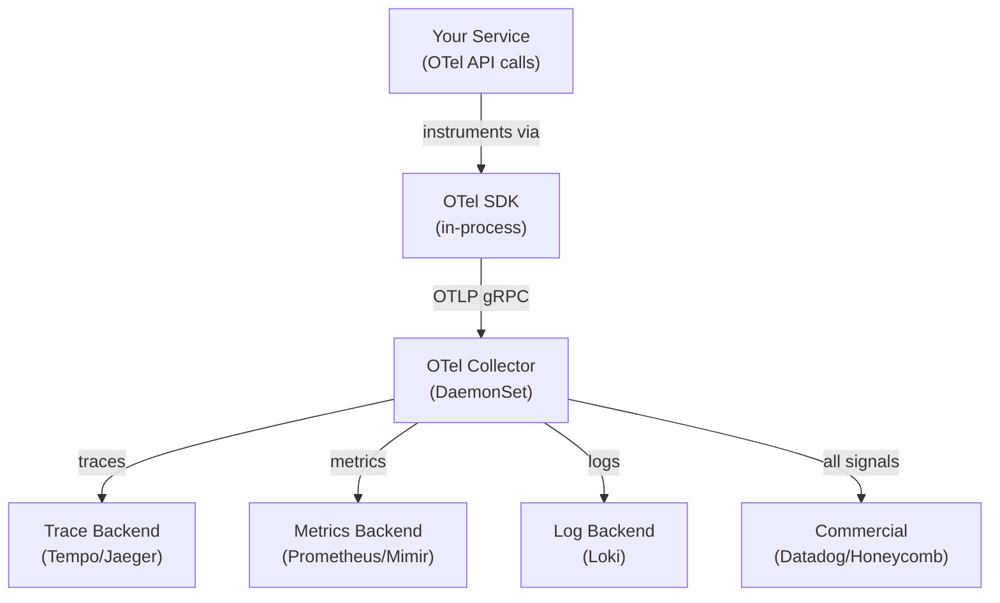
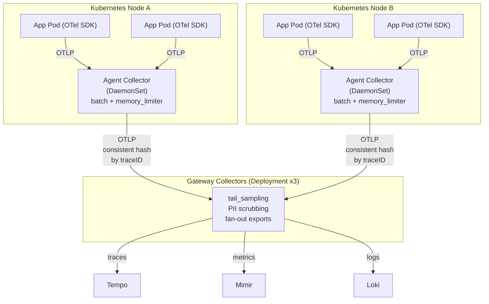
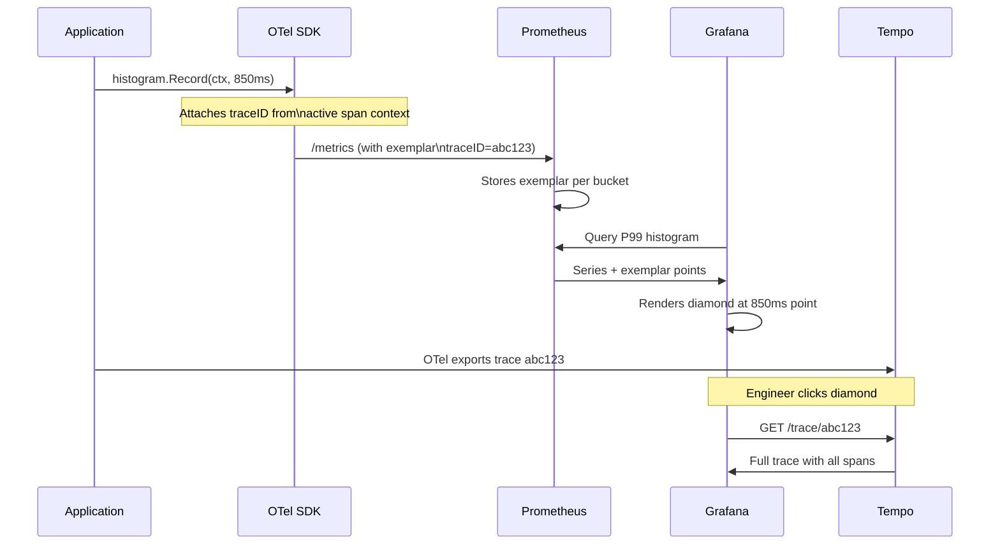

## Keywords in This File

{: .no_toc }

| #   | Keyword | Weight |
| --- | ------- | ------ |
| 1   | [OpenTelemetry Architecture](#opentelemetry-architecture) | critical |
| 2   | [Trace Exemplars](#trace-exemplars) | high |

---

# OpenTelemetry Architecture

**TL;DR** - OpenTelemetry (OTel) is the CNCF standard for
vendor-neutral telemetry instrumentation: a unified API, SDK,
and Collector pipeline that decouples your code from any specific
observability backend.

---

### 🎯 Model Answer

**30 seconds:**
> OpenTelemetry is an open standard for generating and exporting
> telemetry - traces, metrics, and logs - from any service to any
> backend. It has three layers: the API (the interface your code
> calls), the SDK (the implementation that processes telemetry),
> and the Collector (an agent that receives, transforms, and
> exports data to backends like Jaeger, Prometheus, or Datadog).
> The key trade-off is flexibility vs complexity: OTel lets you
> switch backends without code changes, but the Collector adds
> an operational dependency you must run and maintain.

**3 minutes (Senior):**
> OpenTelemetry is the result of merging OpenTracing and
> OpenCensus into a single CNCF project. It defines a consistent
> telemetry model across three signal types: traces (request
> flows across services), metrics (numeric aggregations over time),
> and logs (structured event records). The API layer is what your
> application code depends on - it contains no implementation,
> so adding it has essentially zero overhead and zero vendor lock-in.
> The SDK provides the actual implementation: sampling decisions,
> batch processing, and export pipelines. The Collector is an
> optional but nearly universal component: it runs as a DaemonSet
> or sidecar, receives telemetry from your services via OTLP
> (the OpenTelemetry Protocol), processes it (filtering, sampling,
> attribute enrichment), and exports to one or more backends. The
> critical production insight is that the Collector's processor
> pipeline is where you implement tail-based sampling, PII scrubbing,
> and cost control - putting this logic in the Collector rather than
> in application code keeps your services clean and makes policy
> changes operational rather than code deployments. Auto-
> instrumentation (Java agent, Python instrumentation) generates
> spans for HTTP, database, and messaging libraries without any code
> change. Manual instrumentation uses the OTel API to add custom
> spans and attributes. The non-obvious thing: OTel unifies the data
> model for all three signal types - a trace span can reference a
> metric exemplar, and a log record can carry a trace context. This
> correlation across signal types is what enables jumping from a
> slow P99 metric directly to the trace that caused it.

**Framework:** WHAT -> WHY -> HOW -> TRADE-OFF -> EXAMPLE

*Adapting up:* Staff engineers design the OTel topology: how many
Collector tiers (agent -> gateway), sampling budget per service,
which processors run at agent vs gateway, how to enforce schema
governance using the OTel semantic conventions, and the cost
implications of exporting all three signal types to a commercial
backend.

*Adapting down:* "OTel is the USB standard for observability. Just
as USB lets you plug any keyboard into any computer, OTel lets any
service send telemetry to any backend without changing your code."

**Blank Mind Recovery:**

**(1) Restate:** "You are asking about OpenTelemetry Architecture -
let me walk through the API, SDK, Collector, and OTLP protocol."

**(2) First principles:** "From first principles, every service
needs to export telemetry, but vendor-specific SDKs create lock-in.
OTel solves this by separating the instrumentation interface from
the backend implementation."

**(3) Bridge:** "Think of OTel like JDBC for observability. Your
code calls the OTel API (like JDBC's Connection interface). The SDK
is the driver (implements the interface). The Collector is a
connection pool / proxy - optional but very useful in production."

---

### 📘 Concept Explanation

**What it is:**
OpenTelemetry is a CNCF project providing a vendor-neutral,
open-standard set of APIs, SDKs, and tools for generating,
collecting, and exporting telemetry data (traces, metrics, logs)
from software systems.

**The problem it solves:**
Before OTel, every observability vendor had its own SDK. Switching
from Datadog to Honeycomb meant replacing all instrumentation code.
OpenTracing and OpenCensus both tried to solve this but were
incompatible with each other - teams had to choose before knowing
which would win. OTel merges both projects into one standard,
letting teams instrument once and export anywhere.

**How it works:**

```
OTel Architecture - signal flow
================================

Your Service
  |
  |  calls OTel API (traces, metrics, logs)
  v
OTel SDK (in-process)
  - SpanProcessor (BatchSpanProcessor)
  - MetricReader (PeriodicExporting)
  - LogRecordProcessor
  - Sampler (TraceIdRatioBased, etc.)
  |
  | OTLP gRPC/HTTP
  v
OTel Collector (DaemonSet / sidecar)
  [Receivers]
    otlp, jaeger, prometheus, zipkin
  [Processors]
    memory_limiter, batch,
    tail_sampling, attributes,
    resource, filter
  [Exporters]
    otlp -> Tempo / Honeycomb
    prometheus -> Grafana
    logging -> Loki
    otlp -> Datadog / New Relic
```



> **Diagram walkthrough:** The OTel SDK lives inside your service
> process - it intercepts API calls and batches telemetry for export.
> The Collector runs as a DaemonSet so every node has a local target
> for OTLP export, avoiding per-service backend configuration. The
> Collector's processor pipeline is where policy lives: tail sampling,
> attribute scrubbing, cost-control filtering. A single Collector can
> fan-out to multiple backends simultaneously, enabling the "export
> once, query anywhere" model.

**The key insight:**
The Collector's processor pipeline decouples observability policy
from application code. Changing sampling rates, scrubbing PII fields,
or switching backends requires a Collector config change and rollout -
not a code deployment across every service. This is the architectural
reason teams adopt OTel even when they have only one backend today.

**When to use it:**
Use OTel when you have multiple services or plan to. Use it when
you want backend flexibility or dual-export during migrations.
Use the OTel Java agent or Python auto-instrumentation for
immediate baseline coverage without code changes.

**When NOT to use it:**
Do not add the OTel Collector to a monolith with one service and
one backend - the operational overhead is not worth it. Do not use
OTel as a replacement for structured logging frameworks
(SLF4J, logback) - the log signal in OTel is supplementary.
Do not use the Collector as a message queue - it has no durable
persistence; use Kafka in front of the Collector for reliability.

**Alternatives:**
- Vendor SDKs (Datadog agent, New Relic agent): faster setup, vendor
  lock-in, usually less configuration effort for the happy path
- Manual HTTP export (Prometheus client, Zipkin client): simpler
  for single-signal single-backend, no Collector overhead
- eBPF-based auto-instrumentation (Odigos, Beyla): zero-code
  instrumentation at the kernel level, no SDK required

**First-principles derivation:**
Every production service has three observable state types: request
flows (traces), aggregated health numbers (metrics), and discrete
events (logs). Without a standard, each type needs its own SDK from
each vendor - 3 signals x N vendors = 3N dependencies. A standard
API collapses this to 3 interfaces, with implementations as plugins.
The Collector exists because the SDK inside your process cannot
make complex sampling decisions that require seeing multiple spans
(tail sampling needs the full trace before deciding to keep it).
A separate process (the Collector) buffers, decides, and routes.

---

### 💻 Code Example

**Example 1: BAD - Vendor SDK lock-in pattern**

```java
// BAD: Direct Datadog tracer - tied to one vendor
import com.datadoghq.trace.DDTracer;
import datadog.trace.api.Trace;

// App code imports vendor-specific classes
// Switching to Honeycomb requires replacing every import
// and every API call across all services
@Trace(operationName = "checkout.process")
public void processCheckout(Order order) {
    DDTracer tracer = DDTracer.builder().build();
    // Vendor-specific span creation
    datadog.trace.api.DDTags.SERVICE_NAME;
    // ... vendor API calls throughout
}
```

> **Code walkthrough:** The BAD pattern imports Datadog SDK classes
> directly into application code. Every service becomes a Datadog
> customer forever - switching backends requires a code change in
> every service. The `@Trace` annotation is a Datadog-specific API.
> If a competitor offers 10x better pricing, migration is a multi-
> quarter engineering project.

**Example 2: GOOD - OTel API + auto-instrumentation**

```java
// GOOD: OpenTelemetry Java Agent auto-instruments
// HTTP, JDBC, gRPC without any code changes.
// Add JVM arg: -javaagent:opentelemetry-javaagent.jar
// Configure via env vars:
// OTEL_SERVICE_NAME=checkout
// OTEL_EXPORTER_OTLP_ENDPOINT=http://otel-collector:4317
// OTEL_TRACES_SAMPLER=parentbased_traceidratio
// OTEL_TRACES_SAMPLER_ARG=0.1

// For custom spans, use the OTel API (vendor-neutral):
import io.opentelemetry.api.GlobalOpenTelemetry;
import io.opentelemetry.api.trace.Span;
import io.opentelemetry.api.trace.Tracer;

public class CheckoutService {

    // OTel API - no vendor in the import
    private static final Tracer tracer =
        GlobalOpenTelemetry.getTracer("checkout-service");

    public void processOrder(Order order) {
        Span span = tracer.spanBuilder("checkout.process")
            .setAttribute("order.id", order.getId())
            .setAttribute("order.value_usd",
                order.getValueUsd())
            .startSpan();
        try (var scope = span.makeCurrent()) {
            // business logic - exceptions auto-recorded
            paymentService.charge(order);
            inventoryService.reserve(order);
        } catch (Exception e) {
            // Mark span as error with structured info
            span.recordException(e);
            span.setStatus(
                io.opentelemetry.api.trace.StatusCode.ERROR,
                e.getMessage()
            );
            throw e;
        } finally {
            span.end(); // always end the span
        }
    }
}
```

> **Code walkthrough:** The GOOD pattern uses the vendor-neutral OTel
> API. The import path is `io.opentelemetry.api` - no vendor name
> appears. The Java agent handles all HTTP/JDBC spans automatically
> via bytecode instrumentation. Custom spans use `spanBuilder()` and
> `setAttribute()` - these are OTel API calls that work identically
> with any backend. The `try-with-resources` scope propagates the span
> context to child operations automatically. Switching from Jaeger to
> Honeycomb is a Collector config change, not a code change.

**Example 3: Production Collector pipeline - tail sampling**

```yaml
# otel-collector-config.yaml
# Tail sampling: decide AFTER seeing full trace
# Keeps 100% of errors, 1% of successful traces
receivers:
  otlp:
    protocols:
      grpc:
        endpoint: 0.0.0.0:4317
      http:
        endpoint: 0.0.0.0:4318

processors:
  memory_limiter:
    # Prevent OOM if spike in telemetry volume
    check_interval: 1s
    limit_mib: 512
    spike_limit_mib: 128
  batch:
    # Batch before sending to reduce network calls
    timeout: 5s
    send_batch_size: 1000
  tail_sampling:
    # Wait 5s for full trace before sampling decision
    decision_wait: 5s
    num_traces: 50000
    policies:
      - name: errors-policy
        type: status_code
        status_code: {status_codes: [ERROR]}
      - name: slow-policy
        type: latency
        latency: {threshold_ms: 1000}
      - name: probabilistic-policy
        type: probabilistic
        probabilistic: {sampling_percentage: 1}

exporters:
  otlp/tempo:
    endpoint: tempo:4317
    tls:
      insecure: true
  prometheusremotewrite:
    endpoint: http://mimir:9090/api/v1/push

service:
  pipelines:
    traces:
      receivers: [otlp]
      processors:
        [memory_limiter, batch, tail_sampling]
      exporters: [otlp/tempo]
    metrics:
      receivers: [otlp]
      processors: [memory_limiter, batch]
      exporters: [prometheusremotewrite]
```

> **Code walkthrough:** The Collector pipeline has three stages:
> receivers (where data enters), processors (where policy lives),
> and exporters (where data goes). `memory_limiter` is critical in
> production - without it a spike in trace volume can OOM the
> Collector. `tail_sampling` buffers full traces in memory for
> `decision_wait` seconds before deciding to keep or drop - this
> is why tail sampling requires the Collector: the SDK only sees
> individual spans, not the complete trace. The policy order matters:
> `errors-policy` evaluates first and overrides later policies for
> error traces. The `probabilistic` policy is the catch-all 1% sample
> for successful fast traces. This config keeps 100% of errors and
> slow requests at 1% of normal trace volume cost.

---

### 🎓 Answers by Seniority

**Junior / Mid (0-5 years):**
> OpenTelemetry is an open-source standard for adding observability
> to services. It provides a single API and SDK for traces, metrics,
> and logs that works with any backend - Jaeger, Prometheus, Datadog,
> or Honeycomb. The Java agent auto-instruments HTTP and database calls
> without any code changes. You configure the export endpoint and
> service name via environment variables.

For mid-level: the OTel Collector acts as a local agent that receives
telemetry from your services and forwards it to backends. It enables
features like tail-based sampling and PII scrubbing without touching
application code.

*Push deeper:* Explain the difference between head sampling (decision
at trace start, in the SDK) and tail sampling (decision after seeing
the full trace, in the Collector). Tail sampling is more accurate but
requires buffering full traces in memory.

---

**Senior / Staff (5+ years):**
> OpenTelemetry is the observability infrastructure layer I want
> under every service I operate. The API and SDK handle
> instrumentation; the Collector handles routing and policy. In
> practice, I deploy the OTel Java agent to get automatic spans for
> HTTP, JDBC, and Kafka without code changes, and I add manual spans
> for business events. The Collector runs as a DaemonSet so every
> node has a local OTLP target. The Collector pipeline is where I
> implement tail-based sampling - keep 100% of errors, 1% of happy
> paths - and PII scrubbing with the `attributes` processor. This
> keeps the backend cost manageable.

At staff level: the architectural decision is two-tier Collector
topology - an agent Collector (DaemonSet) for each node that handles
local buffering and sends to a gateway Collector (Deployment) that
does tail sampling, fan-out to multiple backends, and schema
validation. The gateway tier also enables gradual backend migration:
export to old and new backend simultaneously, validate consistency,
then cut over.

*Push deeper:* OTel semantic conventions define standard attribute
names (http.method, db.system, messaging.system). Enforcing these
conventions at the Collector layer with the `transform` processor
ensures consistent query patterns across all teams. Without
governance, each team invents its own attribute names and dashboards
break across service boundaries.

---

### ⚠️ Common Misconceptions

**Misconception 1: "OTel replaces my observability backend."**
OTel is the instrumentation and collection layer, not the storage
and query layer. You still need Tempo, Jaeger, or Honeycomb for
traces; Prometheus or Mimir for metrics; Loki or Elasticsearch for
logs. OTel is the pipe, not the database.

**Misconception 2: "The OTel Collector is required to use OTel."**
The Collector is optional. The OTel SDK can export directly to any
OTLP-compatible backend (Tempo, Honeycomb, Grafana Cloud) without
a Collector. The Collector adds tail sampling, fan-out, and policy
control - valuable in production, but not required to start.

**Misconception 3: "Auto-instrumentation gives you everything you need."**
Auto-instrumentation covers framework-level spans (HTTP request,
SQL query) but misses business context. A span for an HTTP request
does not tell you the order value, user tier, or which product
caused a failure. Manual spans and attributes add the business
context that makes traces actually useful for debugging.

**Misconception 4: "OTel head sampling is good enough."**
Head sampling (sample 1 in 100 at trace start) discards 99% of
errors because the sampling decision is made before you know if
the trace is interesting. Tail sampling (in the Collector, after
full trace arrives) lets you keep 100% of errors and slow requests.
Head sampling is a performance shortcut; tail sampling is the correct
approach for production debugging.

**Misconception 5: "OTLP and OTel are the same thing."**
OTLP (OpenTelemetry Protocol) is the wire format - the binary
protocol for transmitting telemetry data. OTel is the entire
project: API + SDK + Collector + OTLP + semantic conventions.
Many backends speak OTLP natively now (Tempo, Grafana Cloud,
Honeycomb) without running the OTel Collector.

---

### 🚨 Failure Modes and Diagnosis

**Failure 1: OTel Collector OOM under traffic spike**

Symptom: Collector pod crashes (OOMKilled) during high traffic;
traces and metrics drop completely for minutes until pod restarts.

Cause: The `tail_sampling` processor buffers full traces in memory
(50,000 traces by default). A traffic spike creates more concurrent
traces than the buffer can hold. Without `memory_limiter`, the
Collector uses all available memory before the OOMKiller acts.

Diagnosis:
```bash
# Check Collector memory usage
kubectl top pod -l app=otel-collector -n monitoring

# Check for OOMKilled events
kubectl describe pod <collector-pod> -n monitoring \
  | grep -A5 "OOMKilled"

# Check Collector's own metrics
# otelcol_processor_tail_sampling_count_traces_sampled
# otelcol_processor_dropped_spans
curl localhost:8888/metrics | grep tail_sampling
```

> **Code walkthrough:** This example demonstrates the core pattern in action. The key mechanism shows how the concept works in practice. Study the structure to understand the essential behavior and common usage.

Fix: Set `memory_limiter` as the first processor; set
`limit_mib` to 75% of the pod's memory limit. Scale the
Collector horizontally; use consistent hashing at the receiver
to route all spans of a trace to the same Collector instance
(required for tail sampling to work correctly).

**Failure 2: Spans exported without trace context propagation**

Symptom: Jaeger/Tempo shows single-span traces for every request;
no parent-child relationships even though multiple services are called.

Cause: Trace context (W3C TraceContext headers: `traceparent`,
`tracestate`) is not being propagated through the service mesh or
message queue. Each service starts a new root span.

Diagnosis:
```bash
# Check that services pass traceparent header
curl -v http://service-a/api/checkout 2>&1 \
  | grep -i traceparent
# Should see: traceparent: 00-<traceId>-<spanId>-01

# Check OTel SDK propagator config
# Java agent: OTEL_PROPAGATORS=tracecontext,baggage
printenv | grep OTEL_PROPAGATORS
```

> **Code walkthrough:** This example demonstrates the core pattern in action. The key mechanism shows how the concept works in practice. Study the structure to understand the essential behavior and common usage.

Fix: Ensure `OTEL_PROPAGATORS=tracecontext,baggage` in all services.
For Kafka consumers, propagate context from the message header
via the OTel messaging instrumentation library.

**Failure 3: Auto-instrumentation missing for in-house framework**

Symptom: HTTP calls from a custom HTTP client generate no spans.
Downstream service calls appear as separate traces.

Cause: OTel auto-instrumentation only covers well-known libraries
(Apache HttpClient, OkHttp, Spring RestTemplate). A custom HTTP
client built on raw java.net.HttpURLConnection is not instrumented.

Fix: Use the OTel API to manually create spans around the custom
client, or use the OTel Java SDK's `HttpClientAttributesExtractor`
to add semantic convention attributes to a manually created span.

---

### 🎯 Interview Deep-Dive

| Time | Question Type | Depth Signal |
| ---- | ------------- | ------------ |
| 2 min | CONCEPTUAL | Architecture layers |
| 3 min | ARCHITECTURE | Collector topology |
| 3 min | TRADE-OFF | Head vs tail sampling |
| 4 min | DEBUGGING | Missing spans |
| 3 min | PRODUCTION | Cardinality and cost |
| 2 min | COMPARISON | OTel vs vendor SDK |
| 3 min | BEHAVIORAL | OTel adoption story |
| 3 min | SYSTEM DESIGN | OTel in microservices |
| 3 min | HANDS-ON | Collector pipeline |

---

**Q1 [MID]: What are the three layers of OpenTelemetry and what does each do?** `[CONCEPTUAL]`

*Why they ask:* Tests understanding of the API/SDK/Collector separation,
not just "OTel is for observability."

*Likely follow-up:* "Why is the separation between API and SDK important?"

The three layers are the API, the SDK, and the Collector.

The API is the instrumentation interface - it's what your application
code imports. The key property is that the API has no implementation:
it's pure interfaces. This means you can add OTel API calls to a library
without forcing users to bring in any observability backend. If no SDK
is registered, the API calls are no-ops. This is how OTel avoids
requiring every library to bundle a tracer.

The SDK is the implementation of the API. It contains the SpanProcessor
(which batches and exports spans), the Sampler (which decides whether
to record a span), and the Exporter (which serializes spans and sends
them over OTLP, Zipkin, or Jaeger wire formats). The SDK lives in your
service process. Configuration happens via environment variables or code.

The Collector is an optional external process - typically a DaemonSet
in Kubernetes. It receives telemetry via OTLP, processes it (sampling,
filtering, attribute enrichment), and exports to backends. Moving
logic to the Collector means your application code stays clean: you
instrument once with the OTel API, and observability policy (what to
keep, where to send it) lives in Collector config files that operators
manage independently.

*What separates good from great:* Great candidates explain WHY the API/SDK
split exists - to let library authors instrument code without owning the
backend choice. The Collector's role as the policy enforcement point (tail
sampling, PII scrubbing) without code changes is the production insight.

---

**Q2 [SENIOR]: How would you design the OTel Collector topology for a 50-service Kubernetes cluster?** `[ARCHITECTURE]`

*Why they ask:* Tests production deployment thinking, not just knowing
that a Collector exists.

*Likely follow-up:* "What happens if the gateway Collector goes down?"

I would use a two-tier topology: agent collectors and gateway collectors.

The agent tier is a DaemonSet - one Collector pod per Kubernetes node.
Each agent receives OTLP traffic from all application pods on that node
(localhost or node IP), applies lightweight processors (memory limiter,
batch, resource attributes), and forwards to the gateway tier. The
agent is the first hop for telemetry: it's close to the source, so
network overhead is minimal, and it provides local buffering if the
gateway is temporarily unavailable.

The gateway tier is a Deployment (3-5 replicas) behind a LoadBalancer
service. Gateway Collectors receive from all agents and apply expensive
processing: tail sampling (requires buffering full traces, so stateful),
fan-out to multiple backends, and PII scrubbing. For tail sampling to
work correctly, all spans of the same trace must reach the same gateway
Collector instance. I achieve this with consistent hashing at the load
balancer (the `loadbalancing` exporter in the agent sends spans to the
gateway shard determined by trace ID hash).

For resilience: if the gateway goes down, agents buffer spans in memory
and retry. I set the agent's `queue_size` high enough to absorb 2-3
minutes of traffic. If agents also go down (node failure), the application
SDK has a local buffer (queue_size in the BatchSpanProcessor) to absorb
a few seconds. Beyond that, spans are dropped - acceptable if the gateway
downtime is short.

*What separates good from great:* The insight that tail sampling requires
consistent routing per trace ID is what distinguishes someone who has
operated OTel in production from someone who has only read the docs.
Most candidates miss that a naive round-robin load balancer breaks
tail sampling.

---

**Q3 [SENIOR]: When would you choose head sampling over tail sampling, and when is tail sampling essential?** `[TRADE-OFF]`

*Why they ask:* Tests understanding of the sampling trade-off, not just
knowing that sampling exists.

*Likely follow-up:* "What is the memory cost of tail sampling?"

Head sampling decides at the start of a trace whether to record it.
It's implemented in the SDK - zero infrastructure dependency, low
latency overhead. The downside is that you make the keep/drop decision
before you know if the trace is interesting. A 1% head sample drops
99% of traces uniformly, including 99% of errors and slow requests.

Tail sampling decides after the full trace is assembled - at the
Collector, after all spans arrive. This lets you keep 100% of errors
and 100% of requests exceeding a latency threshold, while sampling
down the healthy fast requests. The cost is memory: the Collector
must buffer all in-flight spans for `decision_wait` (typically 5-30
seconds) before making the sampling decision. At 1,000 RPS with 10
spans per trace and 5-second decision wait, that's 50,000 traces
in memory simultaneously.

I choose head sampling for: high-volume services where even errors
are common and I want a consistent sample rate (e.g., 10% of all
traces); latency-sensitive paths where the Collector's buffering adds
too much risk; and teams without bandwidth to operate a stateful
Collector.

I require tail sampling for: services where errors are rare but
critical (payment processing, authentication) and I cannot afford
to miss any error trace; SLO investigation where I need the exact
slow traces to debug a P99 latency regression; and compliance
requirements to retain all failure evidence.

*What separates good from great:* The best answers include concrete
numbers (memory cost of tail sampling at realistic RPS) and the
operational implication: tail sampling in the Collector is stateful,
requiring consistent routing of same-trace spans.

---

**Q4 [SENIOR]: You deploy OTel and traces are single-span - no parent-child relationships. What do you investigate?** `[DEBUGGING]`

*Why they ask:* Tests distributed trace context propagation knowledge -
a common production failure.

*Likely follow-up:* "How does context propagation work through a Kafka topic?"

Single-span traces mean context propagation is broken - each service
starts a new root span instead of creating a child of the caller's span.

First, I check which propagator format is configured. OTel supports
W3C TraceContext (the default and recommended), B3 (Zipkin's format),
and Jaeger. If services use different propagators, they can't read each
other's headers. I verify `OTEL_PROPAGATORS=tracecontext,baggage` on
all services.

Second, I check that intermediate layers don't strip headers. API
gateways (NGINX, Envoy), service mesh proxies (Istio Envoy sidecars),
and load balancers sometimes strip unknown headers. I add the W3C
`traceparent` header to the allow-list in the gateway configuration.

Third, for async paths: Kafka consumers don't automatically receive
trace context from the message header. I check that the OTel messaging
instrumentation is enabled (`OTEL_INSTRUMENTATION_KAFKA_ENABLED=true`)
and that producers write trace context to message headers.

```bash
# Verify traceparent header is forwarded
curl -H "traceparent: \
  00-0af7651916cd43dd8448eb211c80319c-b7ad6b7169203331-01" \
  http://service-a/api/health -v 2>&1 \
  | grep -E "traceparent|tracestate"
# If empty in response, the header was stripped upstream
```

> **Code walkthrough:** This example demonstrates the core pattern in action. The key mechanism shows how the concept works in practice. Study the structure to understand the essential behavior and common usage.

Fourth, I check for SDK version mismatch. Mixing OTel Java agent 1.x
on one service with a 2.x agent on another can cause propagation
failures if the major version changed the default propagator format.

*What separates good from great:* The Kafka context propagation case
and the intermediate proxy stripping case are both production realities
that candidates who've only used OTel in toy projects miss.

---

**Q5 [STAFF]: How do you control the cost of OTel telemetry in a high-volume production system?** `[PRODUCTION]`

*Why they ask:* Tests cost-awareness and observability economics, not
just technical correctness.

*Likely follow-up:* "Which signal type is typically most expensive?"

Cost control in OTel operates at three levels: sampling, cardinality
control, and backend selection.

Sampling is the largest lever for traces. With tail sampling in the
Collector, I keep 100% of errors and slow requests and 1-5% of
everything else. At 10,000 RPS, this reduces trace ingestion by 90%+
while preserving all debuggable traces.

Cardinality is the main driver of metric cost. Each unique combination
of label values creates a new time series. A `user_id` label on an
HTTP request metric is a cardinality bomb - millions of users, millions
of time series, Prometheus OOM. I enforce semantic conventions and
add `filter` and `transform` processors in the Collector to drop
high-cardinality attributes from metrics before they reach Prometheus.

Log verbosity is the cost driver for logs. I use the `filter` processor
in the Collector to drop DEBUG and INFO logs from chatty services in
production, keeping only WARN and ERROR. Combined with structured
logging, this reduces log volume by 80%+ without losing incident signal.

For backend selection: self-hosted (Grafana Mimir + Tempo + Loki) is
10-50x cheaper than commercial backends (Datadog, Splunk) at high volume
but requires operational investment. I recommend commercial backends for
teams < 5 engineers and self-hosted for teams willing to own the stack.

*What separates good from great:* The insight that cost control is a
continuous process - adding a new label to a metric can multiply costs
overnight - and that the Collector pipeline is the enforcement point
for cost policies without touching application code.

---

**Q6 [MID]: How does OpenTelemetry compare to vendor-native agents like the Datadog agent?** `[COMPARISON]`

*Why they ask:* Tests trade-off reasoning about the vendor vs standard choice.

*Likely follow-up:* "Would you recommend OTel for a startup on day 1?"

The core trade-off is flexibility vs simplicity.

Vendor agents (Datadog, New Relic, Dynatrace) offer faster time-to-value:
one agent deployment, one environment variable, and you have APM, logs,
metrics, and infrastructure monitoring in a single UI. The agent handles
all configuration, correlation, and feature activation. For a small team
without dedicated observability engineering capacity, this is often the
right choice.

OpenTelemetry offers backend neutrality: instrument once, export to any
backend. This is valuable when you want to avoid vendor lock-in, when you
need to export to multiple backends simultaneously (e.g., your own
Grafana stack for real-time plus a commercial tool for management
reports), or when you're migrating between backends and need dual export.

The practical gap is narrowing: Datadog, Dynatrace, and New Relic all
support OTLP ingestion now. You can use OTel instrumentation and still
send to Datadog - you get vendor neutrality on the instrumentation side
while retaining the Datadog UI. This is the hybrid approach I recommend
for large teams: OTel SDK + OTel Collector + OTLP export to Datadog.

*What separates good from great:* The nuance that vendor neutrality
is primarily valuable at the instrumentation layer (changing backends
costs code changes without OTel), not just at the collection layer.
The hybrid OTel-SDK + Datadog-backend approach captures the best of
both.

---

**Q7 [SENIOR]: Tell me about a time you adopted or rolled out OpenTelemetry across a team. What was the hardest part?** `[BEHAVIORAL]`

*Why they ask:* Tests real implementation experience and change management.

*Likely follow-up:* "How did you handle services that were already using a vendor SDK?"

In my last role, I led the OTel rollout across 12 microservices that
were using a mix of Zipkin, Jaeger, and a legacy Datadog agent.

The hardest part was not the technical implementation - it was getting
consistent trace context propagation across services that weren't all
updated simultaneously. During the migration window, some services were
on OTel (using W3C TraceContext), others were on Zipkin B3 format, and
the legacy Datadog agent used its own format. Cross-service traces
would break at any boundary between old and new instrumentation.

My solution was to configure OTel to be multi-propagator: setting
`OTEL_PROPAGATORS=tracecontext,b3,b3multi` on OTel-instrumented services
so they could read and write both formats. I rolled out OTel service by
service, starting with leaf services (no downstream dependencies) and
working backward to the entry points. This way, OTel services could
always read the legacy service's context, and legacy services could
read the B3 headers that OTel wrote.

The second hardest part was cardinality governance. As teams added
attributes to their spans, some added `user_id` and `session_id` as
span attributes, which are high-cardinality. When we converted spans
to metrics (using the SpanMetrics connector in the Collector), these
attributes exploded our Prometheus time series count from 500K to 8M.
I solved this by adding a `transform` processor in the Collector that
redacted `user_id` and `session_id` from metric conversions before
they reached Prometheus.

*What separates good from great:* The multi-propagator configuration
during migration is a detail that shows real operational experience.
The cardinality explosion from SpanMetrics is a genuine gotcha that
catches teams who don't think about the metrics implications of their
tracing attributes.

---

**Q8 [STAFF]: How does OpenTelemetry fit into a microservices system design interview?** `[SYSTEM DESIGN]`

*Why they ask:* Tests ability to connect OTel to system design, not just
treat it as a standalone technology.

*Likely follow-up:* "Where would you place OTel in a design for a payment processing system?"

In a system design interview, I introduce OTel as the observability
infrastructure layer, not as an afterthought. When the interviewer says
"how would you ensure reliability?" I immediately describe the three
observability pillars and then explain how OTel connects them.

For a payment processing system design:
- Every service exports traces via OTel SDK, auto-instrumented with the
  Java agent for all HTTP and DB calls
- Manual spans wrap the payment-specific business operations: charge,
  refund, dispute, with business attributes (amount, currency, merchant_id)
- The OTel Collector runs as a DaemonSet; tail sampling policy keeps
  100% of all payment traces (no sampling for financial transactions -
  every trace is evidence)
- Traces flow to Tempo; metrics flow to Mimir; the Collector enriches
  all telemetry with environment, region, and deployment version
- Grafana dashboards tie together: payment SLO dashboard (error rate,
  latency P99 by payment method), linked to traces for any SLO breach

The design question I raise: "Should we sample traces for payments?"
My answer: no. Payment traces are compliance evidence. The cost of
storing 100% of payment traces is small compared to the cost of a
missing trace during a dispute. I add this nuance to show I understand
the business context, not just the technology.

*What separates good from great:* Connecting OTel to business
requirements (compliance, SLO evidence) not just technical operation.
Most candidates describe the technical architecture; great candidates
justify the configuration choices with business context.

---

**Q9 [SENIOR]: Walk me through setting up a minimal but production-ready OTel Collector pipeline.** `[HANDS-ON]`

*Why they ask:* Tests practical Collector configuration knowledge.

*Likely follow-up:* "What is the first processor you always add and why?"

The first processor is always `memory_limiter`. Without it, a cardinality
spike or traffic burst will OOM the Collector and drop all telemetry.
I set `limit_mib` to 75% of the pod memory limit, and `spike_limit_mib`
to 25% of the limit. The Collector will start dropping telemetry gracefully
before hitting the hard limit, rather than crashing.

Then `batch` - critical for performance. Without batching, every span
generates one network call to the backend. With batching, thousands of
spans go in one call. I set `send_batch_size: 1000` and `timeout: 5s`
(whichever fires first triggers a batch export).

For traces with tail sampling: the `tail_sampling` processor comes
after memory_limiter and batch. I set `decision_wait: 10s` - long enough
for all spans in a distributed trace to arrive, short enough that memory
usage stays bounded.

For resources: the `resource` processor adds cluster-level attributes
(k8s.cluster.name, deployment.environment) that the SDK doesn't know.
The `resourcedetection` processor auto-detects cloud provider metadata
(AWS, GCP region, instance type).

The `filter` processor is the cost control valve: drop DEBUG/INFO logs
before they reach the log backend, drop metrics with known problematic
labels, drop spans from health check endpoints that add noise.

```yaml
processors:
  memory_limiter:
    check_interval: 1s
    limit_mib: 512
    spike_limit_mib: 128
  batch:
    timeout: 5s
    send_batch_size: 1000
  resource:
    attributes:
      - key: deployment.environment
        value: production
        action: upsert
  filter/drop-healthchecks:
    traces:
      span:
        - 'attributes["http.route"] == "/health"'
```

> **Code walkthrough:** This example demonstrates the core pattern in action. The key mechanism shows how the concept works in practice. Study the structure to understand the essential behavior and common usage.

*What separates good from great:* Knowing `memory_limiter` must come
first in the processor chain (OTel Collector processes in order) and
explaining why the filter processor drops health check spans before they
reach the tail sampler (reducing its memory burden).

---

| Interviewer Type | Emphasis |
| ---------------- | -------- |
| Technical Panel | Walk through Collector pipeline; explain tail sampling memory model |
| Hiring Manager | Focus on vendor neutrality value, migration path, team productivity |
| Bar Raiser | Lead with trade-offs: when NOT to use Collector; head vs tail sampling |
| Peer Engineer | "The gotcha I keep hitting is tail sampling with consistent routing" |

---

### ⚖️ Comparison Table

| Option | Instrumentation Lock-in | Sampling | Backend Flexibility | Operational Cost |
| ------ | ----------------------- | -------- | ------------------- | ---------------- |
| **OpenTelemetry** | None (vendor-neutral API) | Head + Tail | Any OTLP backend | Collector to operate |
| Datadog Agent | High (Datadog-specific API) | Head only | Datadog only | Low (managed) |
| Zipkin/Brave SDK | Medium (Brave API) | Head only | Zipkin, Jaeger | Low (no Collector) |
| Vendor OTLP | None (OTel SDK) | Head + Tail | Single vendor | Low (managed Collector) |

**The deciding factor:**
Choose OpenTelemetry when you need backend flexibility or plan a
migration; choose a vendor agent when operational simplicity and
time-to-value outweigh lock-in concerns.

---

### 🏛️ System Design

*(Omit: ★★☆ keyword - not ★★★ and sd not set to true. System design
connections covered in Interview Deep-Dive Q8 above.)*

---

### 📊 Diagram

*(Included: OTel component architecture is a commonly drawn system
design diagram and the mechanism is substantially clearer visually.)*

```
OTel Two-Tier Collector Topology
==================================

Node A                 Node B
+------------------+  +------------------+
| App Pod  App Pod |  | App Pod  App Pod |
| OTLP     OTLP    |  | OTLP     OTLP    |
+----+----------+--+  +----+----------+--+
     |          |          |          |
     v          v          v          v
+------------------+  +------------------+
| Agent Collector  |  | Agent Collector  |
| (DaemonSet)      |  | (DaemonSet)      |
| - memory_limiter |  | - memory_limiter |
| - batch          |  | - batch          |
| - resource attrs |  | - resource attrs |
+--------+---------+  +--------+---------+
         |                     |
         | consistent hash     | by trace ID
         v                     v
+--------------------------------------------+
| Gateway Collector (Deployment, 3 replicas) |
| - tail_sampling                            |
| - PII scrubbing (attributes processor)     |
| - fan-out exports                          |
+-------+----------+----------+--------------+
        |          |          |
        v          v          v
   [Tempo]    [Mimir]     [Loki]
   traces     metrics      logs
```



> **Diagram walkthrough:** Each Kubernetes node runs an agent Collector
> that receives local OTLP traffic - this keeps the network path short
> and provides per-node buffering. Agent Collectors forward to the gateway
> tier using consistent hashing by trace ID, ensuring all spans of the same
> trace arrive at the same gateway instance (required for tail sampling to
> see the complete trace). The gateway applies expensive stateful processing
> (tail sampling buffers 50,000 traces in memory) and fans out to all
> backends simultaneously. The two-tier design means adding a new backend
> (e.g., Datadog) requires only a gateway config change - no agent or
> application changes.

---
---

---

### 💻 Code Example

*(Omit: this concept does not have a programmatic interface that can be demonstrated in code. The conceptual explanation above is sufficient.)*


---

### 🏛️ System Design

*(Omit: system design diagram not applicable for this concept - see ★★★ keywords for full system design coverage.)*


---

### ⚖️ Comparison Table

*(Omit: this is a ★☆☆ foundational concept with no direct alternatives to compare - see higher-difficulty keywords for trade-off analysis.)*


---

### 📊 Diagram

*(Omit: no standalone visual diagram required for this concept - the explanations and code examples above provide sufficient clarity.)*


# Trace Exemplars

**TL;DR** - Trace Exemplars embed a specific trace ID and span ID
into a metric data point, creating a bidirectional link between
aggregated metrics and the individual trace that produced a spike.

---

### 🎯 Model Answer

**30 seconds:**
> A trace exemplar is a sample trace that represents a specific metric
> data point. When Prometheus records a histogram bucket, it can store
> one exemplar per bucket: the trace ID and span ID of a request that
> landed in that bucket. In Grafana, when you see a P99 latency spike,
> you can click the exemplar dot on the chart and jump directly to the
> Jaeger or Tempo trace that caused it - no searching, no guessing.
> The trade-off is that exemplar storage adds a small overhead to
> metrics, and you need both Prometheus and a trace backend (Tempo,
> Jaeger) to use them end-to-end.

**3 minutes (Senior):**
> The classic observability problem is: "My P99 latency spiked at 2:37am.
> Now I need to find a slow trace from that moment." Without exemplars,
> you search your trace backend by time range and hope you find one of
> the slow traces. With exemplars, Prometheus stores the trace ID of
> a slow request alongside the histogram bucket that recorded it. The
> link is precise: not "slow traces from this 30-second window" but
> "this specific trace caused this specific data point." Grafana
> renders exemplars as diamonds on time series charts. Clicking a
> diamond opens the exact trace in Tempo. This collapses the metrics-
> to-traces investigation from minutes of searching to one click.
> The implementation requires three things: the service SDK must
> populate exemplars in histograms (OTel Java SDK does this
> automatically when the trace context is active), Prometheus must
> be configured to scrape and store exemplars (enabled by default
> in Prometheus 2.43+), and the trace backend (Tempo) must store
> the referenced traces (meaning they must not be sampled out). The
> critical operational requirement: exemplars are only useful if the
> referenced traces exist. If you sample out 99% of traces, 99% of
> exemplar links will be dead ends. Pair exemplars with tail sampling
> to keep 100% of slow traces - those are exactly the traces your
> exemplars will reference.

**Framework:** WHAT -> WHY -> HOW -> TRADE-OFF -> EXAMPLE

*Adapting up:* Staff engineers configure the exemplar pipeline end-to-end:
OTel SDK populates trace context in histograms, Prometheus scrapes with
exemplars enabled, Grafana datasource links to Tempo, sampling policy
keeps 100% of slow requests. They also implement exemplar-based alerting
runbooks: "Alert fires -> click exemplar -> trace in Tempo -> root cause."

*Adapting down:* "Exemplars are like a QR code on a dashboard. Each
data point carries a QR code (the trace ID). Scanning it (clicking the
point) takes you to the exact conversation (trace) that created it."

**Blank Mind Recovery:**

**(1) Restate:** "You are asking about Trace Exemplars - let me
explain what they link and why that link matters for debugging."

**(2) First principles:** "From first principles, metrics show you
WHAT is happening (P99 latency is 500ms) but not WHY. Traces show
you WHY but finding the right trace in a haystack is hard. Exemplars
are the bookmark that connects the metric data point to the trace."

**(3) Bridge:** "Think of exemplars like GPS coordinates attached
to a weather reading. The temperature sensor records 38C, but the
exemplar tells you: 'This reading came from coordinate X,Y.' In
observability, the metric says P99=800ms, and the exemplar tells
you: 'This P99 spike came from trace ID abc123.'"

---

### 📘 Concept Explanation

**What it is:**
An exemplar is a specific trace sample (trace_id, span_id, and optional
labels) attached to a metric observation, enabling a link from a metric
data point to the trace that produced it.

**The problem it solves:**
Metrics tell you WHAT changed (P99 latency increased by 200ms) but not
WHY (which request, which code path). Finding the responsible trace
requires manual search: time-range query in the trace backend, then
filtering for slow spans. In high-volume systems this is slow and
error-prone - the interesting trace may be 1 in 10,000. Exemplars
make the link automatic and precise.

**How it works:**

```
Exemplar Flow
==============

1. Request hits service
   trace_id = "abc123" span_id = "def456"

2. OTel SDK records latency observation
   histogram.Record(ctx, 850ms)
   The SDK auto-attaches trace context as exemplar:
     {trace_id="abc123", span_id="def456", value=850}

3. Service exposes /metrics
   http_server_duration_ms_bucket
     {le="1000"} 42045
     # HELP exemplar {traceID="abc123"} 850

4. Prometheus scrapes and stores exemplar
   alongside the histogram bucket value

5. Grafana renders diamond on P99 chart
   at t=2:37:15, value=850ms

6. Engineer clicks diamond
   Grafana queries Tempo for trace "abc123"
   -> Full trace: all spans, all attributes,
      the exact slow database query visible
```



> **Diagram walkthrough:** The exemplar lifecycle has two independent
> data flows: the metric path (histogram value + trace ID to Prometheus)
> and the trace path (full span data to Tempo). They are linked only by
> the trace ID. When Grafana renders the exemplar diamond, it queries
> Prometheus for the trace ID and Tempo for the trace. If the trace was
> sampled out before reaching Tempo, the exemplar link is a 404. This
> is why sampling policy for slow requests must keep 100% - exemplars
> only work when the referenced trace exists.

**The key insight:**
Exemplars are useless if the referenced trace does not exist in the
trace backend. The most common implementation failure is enabling
exemplars while head-sampling 99% of traces - 99% of exemplar links
are dead ends. The correct pairing is exemplars with tail sampling
that keeps 100% of slow requests.

**When to use it:**
Use exemplars when you have both a Prometheus-compatible metrics
backend and a trace backend (Tempo, Jaeger). Use them when P99/P95
latency regression is your primary debugging use case. Use them
with Grafana's Explore view for trace linkage from dashboards.

**When NOT to use it:**
Do not enable exemplars if you have no trace backend - they add
storage overhead with no benefit. Do not rely on exemplars as your
only trace discovery mechanism - they only link from metric data
points you're already observing; they don't help with unexpected
error categories not yet on a dashboard.

**Alternatives:**
- Log-based trace linking: log the trace ID in structured log entries;
  query Loki for the trace ID; more flexible but slower workflow
- Manual trace search: query trace backend by time range and latency;
  no automatic link, but works without exemplar setup
- RED dashboard trace panels: Grafana panel showing recent slow traces
  from a fixed PromQL query; less precise than exemplar links

**First-principles derivation:**
A metric aggregates many individual events into a number (count, sum,
histogram). The aggregation loses the identity of individual events.
To recover identity, we need to preserve a reference to at least one
representative event per aggregation bucket. Exemplars are exactly
that: a probabilistic sample (one per bucket window) that retains the
identity pointer (trace ID) rather than discarding it. The design
is minimal: it adds one trace ID string to each histogram bucket,
which is negligible storage overhead but enables the full
metrics-to-traces jump.

---

### 💻 Code Example

**Example 1: BAD - Exemplars enabled but traces sampled out**

```java
// BAD: Exemplars enabled on metrics but
// traces are 1% head-sampled.
// 99% of exemplar links will be 404s in Tempo.

// SDK configured with head sampling:
SdkTracerProvider tracerProvider =
    SdkTracerProvider.builder()
        .setSampler(
            // 1% head sampling - most traces dropped
            Sampler.traceIdRatioBased(0.01)
        )
        .build();

// Histogram will populate exemplars with trace IDs
// But 99 out of 100 trace IDs don't exist in Tempo
// "Click exemplar" -> 404 from Tempo
// Engineers stop using exemplars after frustration
```

> **Code walkthrough:** The BAD pattern enables exemplars (which happen
> automatically when OTel and Prometheus are configured correctly) while
> head-sampling 99% of traces. The exemplar links appear in Grafana as
> clickable diamonds, but clicking most of them produces a "trace not
> found" error in Tempo because the referenced trace was dropped at the
> SDK sampling decision. Engineers quickly learn exemplars are unreliable
> and stop using them. The fix is tail sampling that explicitly preserves
> slow traces.

**Example 2: GOOD - Exemplars paired with tail sampling for slow requests**

```java
// GOOD: OTel Java SDK with exemplar-aware histogram
// Trace context automatically populates exemplars
// when trace is active during histogram.record()

// Step 1: Add OTel metrics with auto-exemplar support
import io.opentelemetry.api.metrics.DoubleHistogram;
import io.opentelemetry.api.GlobalOpenTelemetry;

public class OrderService {

    private static final DoubleHistogram latency =
        GlobalOpenTelemetry.getMeter("order-service")
            .histogramBuilder("http.server.duration")
            .setDescription(
                "HTTP request duration in milliseconds"
            )
            .setUnit("ms")
            // OTel SDK automatically attaches trace_id
            // as exemplar when a span is active
            .build();

    public Response processOrder(Request req) {
        long start = System.currentTimeMillis();
        // The active span context is present here
        // (injected by OTel Java agent)
        try {
            return doProcess(req);
        } finally {
            double durationMs =
                System.currentTimeMillis() - start;
            // OTel SDK records this AND attaches
            // current trace_id as exemplar automatically
            latency.record(
                durationMs,
                Attributes.of(
                    AttributeKey.stringKey("http.route"),
                    req.getRoute()
                )
            );
        }
    }
}
```

```yaml
# Prometheus scrape config with exemplars enabled
# (default in Prometheus 2.43+, explicit for older)
scrape_configs:
  - job_name: order-service
    static_configs:
      - targets: ['order-service:8080']
    # Enable exemplar storage
    # (enabled globally in prometheus.yml)

# prometheus.yml global config
global:
  # Enable exemplar storage globally
  enable_exemplar_storage: true

# Grafana Tempo datasource link to Prometheus
# In Grafana, configure Prometheus datasource:
# -> "Exemplars" tab -> "Internal link" -> Tempo
# TraceID field: ${__value.raw} -> Tempo trace query
```

> **Code walkthrough:** The GOOD pattern uses the OTel SDK's histogram,
> which automatically attaches the current span's trace ID as an exemplar
> when the recording happens inside an active span context. The application
> code does not need to explicitly set the exemplar - the SDK derives it
> from the trace context. Prometheus is configured with `enable_exemplar_storage`
> to retain exemplar data per bucket. In Grafana, the Tempo datasource is
> configured as an "internal link" from the Prometheus datasource so that
> clicking an exemplar diamond navigates to Tempo with the trace ID pre-filled.

**Example 3: Verification - Confirming exemplars are being stored**

```bash
# Verify exemplars appear in Prometheus scrape output
curl -s http://order-service:8080/metrics \
  | grep -A2 "http_server_duration"
# Expected output with exemplar:
# http_server_duration_ms_bucket{le="1000"} 42045
# # {traceID="abc123def456",spanID="789xyz"} 847

# Verify Prometheus stores exemplars
# Use Prometheus HTTP API
curl 'http://prometheus:9090/api/v1/query_exemplars' \
  --data-urlencode \
  'query=http_server_duration_ms_bucket' \
  --data-urlencode 'start=1717000000' \
  --data-urlencode 'end=1717003600' \
  | jq '.data[0].exemplars[0]'
# {"labels":{"traceID":"abc123"},"value":"847","timestamp":1717001234}

# Verify the referenced trace exists in Tempo
curl "http://tempo:3100/api/traces/abc123" \
  | jq '.batches[0].resource.attributes'
# If 404: trace was sampled out - fix sampling policy
```

> **Code walkthrough:** The verification process has three steps: confirm
> exemplars appear in the raw /metrics output (the `# { }` comment line
> is the OpenMetrics exemplar format), confirm Prometheus retains them
> via the query_exemplars API, and finally confirm the referenced trace
> exists in Tempo. A common debugging step is finding that exemplars
> exist in Prometheus but the trace is missing in Tempo - this confirms
> the sampling mismatch problem described in the BAD example.

---

### 🎓 Answers by Seniority

**Junior / Mid (0-5 years):**
> Trace exemplars attach a trace ID to a metric data point. When you
> see a P99 latency spike in Grafana, exemplars let you click the spike
> and jump directly to the trace that caused it. You need Prometheus
> for metrics storage (with exemplar storage enabled), a trace backend
> like Tempo, and OTel instrumentation that populates trace context
> during histogram recording.

For mid-level: the OTel Java SDK automatically populates exemplars in
histograms when a span is active - you don't need extra code. The
Grafana configuration requires linking the Prometheus datasource to
Tempo as an "internal link" for the clickable exemplar diamonds to work.

*Push deeper:* Explain why exemplars are useless with aggressive head
sampling: if 99% of traces are dropped at the SDK, 99% of exemplar
links will be dead ends in Tempo. This is why exemplars should be
paired with tail sampling for slow requests.

---

**Senior / Staff (5+ years):**
> Trace exemplars solve the metrics-to-traces gap - the classic
> problem of "I see the P99 spike but I can't find the slow trace."
> In production, I configure the OTel SDK to automatically embed
> trace IDs in histogram observations (this happens automatically
> when a span is active). Prometheus stores the exemplar alongside
> the bucket value. Grafana shows diamond markers on the time series
> chart for each exemplar. Clicking a diamond queries Tempo for that
> exact trace. The critical configuration requirement is that the
> tail sampling policy must retain 100% of slow requests - otherwise
> the exemplar link is a 404 in Tempo.

At staff level: the correct architecture pairs exemplars with a tail
sampling policy in the OTel Collector that explicitly preserves
slow requests (e.g., keep all traces with latency > 500ms). This
ensures every exemplar diamond in Grafana leads to a valid trace.
I also configure alerting runbooks to use exemplars: "P99 alert fires
-> open Grafana dashboard -> click exemplar at alert time -> root
cause trace in Tempo." This reduces MTTR for latency incidents from
30+ minutes of log searching to under 5 minutes.

*Push deeper:* At scale (10,000+ RPS), exemplar cardinality is
negligible - one exemplar per histogram bucket window per scrape
interval. The storage overhead is a trace ID string per bucket,
which is roughly 100 bytes per exemplar per 15-second scrape.
This is trivially small compared to the metric series storage.

---

### ⚠️ Common Misconceptions

**Misconception 1: "Exemplars require extra code in every service."**
OTel SDK histograms automatically populate exemplars when recording
inside an active span context. The Java agent instruments HTTP servers
automatically, so exemplars appear in all HTTP latency histograms
with zero application code changes. Extra code is only needed for
custom histograms outside of OTel auto-instrumented paths.

**Misconception 2: "Exemplars work with any sampling strategy."**
Exemplars only work if the referenced trace exists in the trace
backend. With 1% head sampling, 99% of exemplar diamonds in Grafana
will be 404s when clicked. The correct pairing is tail sampling
that explicitly preserves slow requests - the exact requests that
exemplars reference for P99 investigation.

**Misconception 3: "Exemplars are a Prometheus-only feature."**
The OpenMetrics standard includes exemplar support, and the OTel
metrics data model also supports exemplars. Grafana Mimir and Cortex
both support exemplar storage. Vendor backends (Datadog, New Relic)
have their own trace-to-metric linking mechanisms that serve the
same purpose under different names.

**Misconception 4: "Exemplars replace distributed tracing."**
Exemplars are a discovery mechanism, not a replacement for tracing.
They link specific metric points to traces, but you still need a
full distributed trace backend (Tempo, Jaeger) that stores the
complete span tree. An exemplar without a trace backend is a
pointer to nowhere.

---

### 🚨 Failure Modes and Diagnosis

**Failure 1: Exemplar diamonds appear but clicking gives "trace not found"**

Symptom: Grafana Explore shows orange diamond markers on P99 latency
chart. Clicking a diamond navigates to Tempo but returns "trace not
found" or an empty result.

Cause: The trace ID recorded in the exemplar was sampled out by the
OTel SDK or the Collector before reaching Tempo.

Diagnosis:
```bash
# Extract the trace ID from a failed exemplar
# In Grafana: hover over diamond -> note traceID

# Check if trace exists in Tempo
curl "http://tempo:3100/api/traces/<traceID>"
# 404 = trace was dropped by sampling

# Check SDK sampling configuration
printenv | grep OTEL_TRACES_SAMPLER
# If OTEL_TRACES_SAMPLER=traceidratio
# and OTEL_TRACES_SAMPLER_ARG=0.01
# -> 99% of traces dropped before Tempo

# Check tail sampling policy in Collector
# Look for latency-based policy covering slow requests
grep -A5 "latency" otel-collector-config.yaml
```

> **Code walkthrough:** This example demonstrates the core pattern in action. The key mechanism shows how the concept works in practice. Study the structure to understand the essential behavior and common usage.

Fix: Add a latency-based tail sampling policy that keeps 100% of
slow requests (> 500ms). This ensures that every exemplar that
appears in Grafana corresponds to a trace that exists in Tempo.

**Failure 2: Exemplars not appearing in Prometheus scrape output**

Symptom: Grafana shows no exemplar diamonds on P99 chart even
though OTel and Prometheus are both configured.

Diagnosis:
```bash
# Check if exemplars appear in raw /metrics output
curl http://service:8080/metrics \
  | grep -E "^#.*traceID"
# If empty: OTel SDK is not populating exemplars

# Check if enable_exemplar_storage is set
grep "enable_exemplar_storage" prometheus.yml
# Must be "true"

# Check Prometheus version (2.43+ required for default)
prometheus --version

# Check if histogram records happen inside a span
# Exemplars are only populated when a span is active
# in the OTel context at the time of record()
```

> **Code walkthrough:** This example demonstrates the core pattern in action. The key mechanism shows how the concept works in practice. Study the structure to understand the essential behavior and common usage.

Fix: Ensure `enable_exemplar_storage: true` in prometheus.yml.
Verify OTel SDK version >= 1.14 (exemplar support). Confirm
histogram.record() is called inside a context with an active
OTel span (the Java agent handles this for HTTP requests).

---

### 🎯 Interview Deep-Dive

| Time | Question Type | Depth Signal |
| ---- | ------------- | ------------ |
| 2 min | CONCEPTUAL | What exemplars link |
| 3 min | DEBUGGING | Dead exemplar links |
| 3 min | TRADE-OFF | Exemplars vs log linking |
| 3 min | PRODUCTION | Sampling strategy impact |
| 2 min | COMPARISON | Exemplars vs RED panels |
| 3 min | ARCHITECTURE | End-to-end exemplar pipeline |
| 3 min | BEHAVIORAL | Reducing MTTR with exemplars |
| 3 min | SYSTEM DESIGN | Exemplars in SLO dashboard |
| 3 min | HANDS-ON | Verification steps |

---

**Q1 [MID]: What is a trace exemplar and what problem does it solve?** `[CONCEPTUAL]`

*Why they ask:* Tests whether candidate understands the metrics-to-traces
gap and the exemplar's role as the bridge.

*Likely follow-up:* "How are exemplars different from just logging the trace ID?"

A trace exemplar is a sample attached to a metric data point that
contains a trace ID (and optionally a span ID) representing the
specific request that contributed to that metric value.

The problem it solves is the metrics-to-traces discovery gap.
When I see a P99 latency spike at 2:37am, I know WHAT happened
(P99 jumped to 900ms) but not WHY. To find the cause, I need a
specific slow trace from that moment. Without exemplars, I have to
search my trace backend by time range and latency, hoping one of
the slow traces is still stored. With exemplars, Prometheus stores
the trace ID of a representative request alongside each histogram
bucket. In Grafana, that trace ID appears as a clickable diamond
on the chart - clicking it opens the exact trace in Tempo.

The difference from logging the trace ID: logs are a separate data
stream. Finding the trace ID in a log entry requires a log query
(filter by time, by service, by slow=true), then copying the ID
to the trace backend. Exemplars embed the link directly in the
metric, making it one click instead of a multi-step search.

*What separates good from great:* Explaining that exemplars only work
if the referenced trace exists - connecting exemplars to the sampling
strategy requirement. This is the non-obvious production constraint
that separates "read the docs" from "built this in production."

---

**Q2 [SENIOR]: You enable exemplars but engineers report that clicking the diamonds gives "trace not found." What is wrong and how do you fix it?** `[DEBUGGING]`

*Why they ask:* Tests whether candidate understands the sampling
dependency that makes exemplars work or fail in production.

*Likely follow-up:* "How would you verify the fix worked?"

The problem is almost certainly that the trace referenced by the
exemplar was dropped by sampling before reaching the trace backend.

Here is my investigation sequence:

First, I extract the trace ID from one of the failing exemplars
(visible in the Grafana diamond tooltip or in the Prometheus UI
via query_exemplars). Then I check if it exists in Tempo:
`curl http://tempo:3100/api/traces/<traceID>`. A 404 confirms
the trace was dropped.

Second, I check the sampling configuration. `printenv | grep OTEL_TRACES_SAMPLER`
reveals if the SDK is using `traceidratio` (head sampling). If it's
sampling at 1-10%, most traces are dropped at source, and exemplars
reference traces that never made it to Tempo.

Third, if a Collector is in the path, I check the tail sampling policy.
If there's no latency-based policy keeping slow requests, the sampler
drops them probabilistically.

The fix is to add a tail sampling policy that preserves 100% of slow
requests. In the Collector config, I add a latency policy:
`{type: latency, latency: {threshold_ms: 500}}` before the
probabilistic policy. This ensures every request that creates a
slow exemplar (P99 spike) is preserved as a trace in Tempo.

To verify the fix: I wait for the next P99 spike, then click a
diamond. If the trace opens successfully in Tempo, the fix works.
I also check the Collector's tail sampling metrics:
`otelcol_processor_tail_sampling_count_traces_sampled` - the
latency policy should show non-zero counts.

*What separates good from great:* The specific verification commands
and the insight that the fix must be in the tail sampling policy, not
just in increasing the head sample rate.

---

**Q3 [SENIOR]: When would you prefer exemplars over a Loki log-based trace link?** `[TRADE-OFF]`

*Why they ask:* Tests whether candidate can evaluate two legitimate
approaches rather than treating exemplars as always superior.

*Likely follow-up:* "What are the prerequisites for exemplars?"

Both approaches link metric observations to specific traces. The
trade-off is precision vs setup cost.

Exemplars win when: I have a histogram metric on the exact path I
want to investigate (HTTP latency, DB query time). Exemplars appear
as clickable diamonds directly on the chart - zero search required.
The link is automatic (OTel SDK populates it) and requires no code
changes if auto-instrumentation is active. The workflow is:
see spike on dashboard -> click exemplar -> trace open. This is
ideal for SLO investigation workflows where dashboards are the
entry point.

Log-based linking wins when: I don't have a Prometheus metrics
backend, or when I want to find traces for events that don't map
cleanly to a histogram (e.g., a specific error type that doesn't
have a dedicated metric). With structured logging, I log trace_id
with every request. In Loki, I query `{app="checkout"} | json | latency > 500`
and get all slow requests with their trace IDs. I then copy a trace
ID to Tempo. More steps, but more flexible - I can filter on any
log field.

The prerequisites for exemplars are higher: OTel SDK with exemplar
support, Prometheus with `enable_exemplar_storage`, Grafana datasource
configured with Tempo link, and a tail sampling policy that preserves
slow traces. Log-based linking requires only structured logs and a log
aggregation backend - a lower setup threshold.

*What separates good from great:* Recognizing that both are valid
in different contexts, not treating exemplars as always superior.
The setup cost comparison is what helps teams choose the right approach
for their current maturity level.

---

**Q4 [SENIOR]: How do exemplars behave at 10,000 RPS? Is the storage overhead significant?** `[PRODUCTION]`

*Why they ask:* Tests practical capacity reasoning about observability cost.

*Likely follow-up:* "How many exemplars does Prometheus store per histogram?"

At 10,000 RPS, exemplar storage overhead is negligible. Here is the
math: Prometheus stores at most one exemplar per histogram bucket per
scrape interval (15 seconds by default). A typical HTTP latency histogram
has 10-15 buckets (up to 0.005s, 0.01s, 0.025s, ..., 10s). At 15 seconds
per scrape, each histogram stores 10-15 exemplars, each being a trace ID
(32 hex chars) + span ID (16 chars) + timestamp + value. Roughly 100
bytes per exemplar. At 10-15 exemplars per scrape, this is 1-1.5KB
per histogram per scrape interval.

For a service with 20 histogram metrics, exemplar storage adds 20-30KB
per 15-second scrape. Over 15 days retention, this is 2-3GB of additional
storage - trivial compared to the metric series storage.

The RPS (10,000 vs 100 vs 100,000) has minimal impact on exemplar
storage because Prometheus only keeps the most recent exemplar per
bucket - it's not a growing log of all exemplars, it's a single
"latest" exemplar per bucket. Higher RPS means more traces are
candidates for exemplar sampling, but the stored count stays bounded
at the number of histogram buckets.

The OTel SDK's exemplar sampling is also efficient: it uses reservoir
sampling to select a representative exemplar from all observations in
a collection interval, not a per-observation copy.

*What separates good from great:* The quantitative analysis. Most
candidates say "it's low overhead" without numbers. The insight that
Prometheus stores one exemplar per bucket (not one per request) is
what makes exemplars scale-invariant.

---

**Q5 [MID]: How do exemplars compare to Grafana RED dashboard trace panels?** `[COMPARISON]`

*Why they ask:* Tests awareness of alternative approaches to the same
problem.

*Likely follow-up:* "Can you use both in the same dashboard?"

Both approaches help you find traces from a metric dashboard. The
difference is precision and automation.

Grafana RED trace panels show a list of recent traces in a time
range. You configure a panel with a Tempo query (e.g., "all traces
for service=checkout with duration > 500ms in the last 5 minutes").
When a P99 alert fires, you open this panel and manually browse
the listed traces. It works, but requires manual correlation:
the P99 spike was at 2:37:15am - is the slow trace I see from
2:37:05 or 2:38:02? You have to eyeball it.

Exemplars give you a precisely correlated trace: the exemplar diamond
is at the exact timestamp of the metric data point, and clicking it
opens the specific trace that produced that value. No browsing, no
eyeballing. The link is automatic and precise.

In practice, I use both in the same dashboard. The exemplar diamonds
provide precise linkage for the specific data points I click on.
The RED trace panel provides browsable context around an incident -
useful for understanding the pattern across multiple slow traces, not
just the single exemplar.

*What separates good from great:* The nuanced view that both are
complementary, and the specific scenario where each is better.

---

**Q6 [SENIOR]: Walk me through the complete exemplar pipeline from OTel SDK to Grafana click.** `[ARCHITECTURE]`

*Why they ask:* Tests end-to-end understanding of the exemplar data flow.

*Likely follow-up:* "What configuration step is most commonly missed?"

The complete pipeline has six steps:

Step 1 (SDK): The OTel Java SDK intercepts HTTP requests via the
Java agent. When the request handler records a histogram observation
(latency), the SDK checks for an active span in the current context.
If a span is active, the SDK attaches its trace ID and span ID as
an exemplar to the histogram observation.

Step 2 (Exposition): When Prometheus scrapes /metrics, the Prometheus
client library in the service serializes histogram buckets in
OpenMetrics format, including the exemplar comment lines with trace
IDs.

Step 3 (Storage): Prometheus processes the scrape response, extracts
histogram values and exemplar records, and stores both in its TSDB.
`enable_exemplar_storage: true` must be set - without it, Prometheus
parses but discards exemplar data.

Step 4 (Trace export): Independently, the OTel SDK exports the full
trace to the Collector (and then to Tempo). The trace ID is the link
between the metric side and the trace side.

Step 5 (Query): Grafana queries Prometheus with PromQL for the
histogram metric. Prometheus returns both the time series values and
the associated exemplar records. Grafana renders the exemplar trace
IDs as orange diamond markers on the time series chart.

Step 6 (Navigation): The user clicks a diamond. Grafana reads the
trace ID from the exemplar data. It queries Tempo using the trace ID
via the configured internal datasource link. Tempo returns the full
trace tree. Grafana renders it in Explore.

The most commonly missed step is configuring the Grafana Prometheus
datasource to link to Tempo. In the datasource settings, under
"Exemplars", you must add an internal link to the Tempo datasource
with the TraceID field set to `${__value.raw}`. Without this, the
diamonds appear but are not clickable.

*What separates good from great:* The separate data flows for metrics
(to Prometheus) and traces (to Tempo) are completely independent -
they are linked only by the trace ID. Understanding this separation
is why both backends must have the data; it also explains why a
single point failure (Collector dropping traces) breaks exemplar
links even when metrics look fine.

---

**Q7 [SENIOR]: Describe a time when exemplars significantly reduced your incident MTTR.** `[BEHAVIORAL]`

*Why they ask:* Tests real-world application of exemplars in incident
response.

*Likely follow-up:* "What did you change after that incident?"

During a Black Friday preparation, we observed a P99 checkout latency
spike from 200ms to 850ms starting at 11pm. Our previous MTTR for
latency regressions was 25-30 minutes of log search. This was the
first incident after I had set up the full exemplar pipeline.

I opened the Grafana checkout SLO dashboard, saw the P99 spike, and
clicked the exemplar diamond at the peak. Tempo opened and showed
the full trace. Within 30 seconds, I could see that the inventory
service span took 700ms - with a database query span inside it
showing "full table scan on products table." The query had a missing
index on the product_category column that our team had just added
to support a new filtering feature.

Total time to root cause: 4 minutes. Without exemplars, the same
investigation would have taken 20-30 minutes of Loki log searching,
trying to correlate timestamps across service logs, and eventually
finding the slow query in the database slow query log.

After this incident, I updated our postmortem runbook to include
an exemplar investigation step as the mandatory second step after
alert acknowledgment. I also added a validation test to our CI
pipeline that verifies exemplar diamonds are clickable (not 404)
for the service's P99 histogram.

*What separates good from great:* The concrete MTTR numbers and the
follow-up action (runbook update, CI validation) demonstrate the
operational mindset - not just "it helped once" but "I systematized
the value."

---

**Q8 [STAFF]: How would you incorporate exemplars into a P99 SLO dashboard design?** `[SYSTEM DESIGN]`

*Why they ask:* Tests ability to design observability into a product,
not just operate tools.

*Likely follow-up:* "How would you handle exemplars for asynchronous Kafka processing?"

For a P99 SLO dashboard, I design around the error budget burn rate
as the primary signal, with exemplars as the investigation path.

The dashboard has three rows:

Row 1 (SLO health): The error budget remaining (28-day) and the burn
rate (1h fast burn, 6h slow burn). These are the alert-trigger signals.
A fast burn >14 or slow burn >2 triggers a page.

Row 2 (Signal detail): P50, P95, P99, P99.9 histograms with exemplar
diamonds enabled on P99 and P99.9. This is where investigation starts
when an alert fires. The SLI over the alert window is also shown to
contextualize severity.

Row 3 (Context): Error rate by status code, request volume, and a
Tempo trace search panel filtered to the current time range and high
latency - a complementary view to exemplar diamonds.

For async Kafka processing, exemplars require trace context propagation
through the message. The producer writes trace context to Kafka message
headers via OTel. The consumer reads the trace context from headers and
creates a child span. The consumer's histogram record() happens inside
this child span, so the exemplar traces the full producer-to-consumer
path. The configuration key is ensuring OTel Kafka instrumentation is
enabled on both producer and consumer (`OTEL_INSTRUMENTATION_KAFKA_ENABLED=true`).

*What separates good from great:* Connecting exemplars to the SLO
investigation workflow (alert fires -> P99 chart -> exemplar click ->
trace -> root cause) and addressing the async case that most candidates
miss.

---

**Q9 [MID]: What are the minimum configuration requirements to get exemplars working end-to-end?** `[HANDS-ON]`

*Why they ask:* Tests practical setup knowledge.

*Likely follow-up:* "How do you verify exemplars are flowing before an incident?"

The minimum configuration checklist:

1. OTel SDK with exemplar support: OTel Java agent >= 1.14, or OTel
   SDK >= 1.14 with the Prometheus exporter. The agent handles
   exemplar population automatically for auto-instrumented paths.

2. Prometheus with exemplar storage enabled:
   `enable_exemplar_storage: true` in prometheus.yml. Prometheus
   2.43+ has this default on. Older versions require explicit config.

3. Grafana Prometheus datasource configured with Tempo link: In
   the Prometheus datasource settings, "Exemplars" tab -> "Internal
   link" -> select the Tempo datasource -> set TraceID field to
   `${__value.raw}`. Without this, diamonds appear but are not
   clickable.

4. Tail sampling policy preserving slow traces: In the OTel Collector,
   a latency-based policy that keeps 100% of requests above your P99
   threshold. This ensures the traces referenced by exemplar diamonds
   exist in Tempo.

5. Traces reaching Tempo: Verify with `curl http://tempo:3100/api/search`
   and confirm traces from your service appear.

Verification before an incident:
```bash
# 1. Confirm exemplars in /metrics output
curl http://service:8080/metrics | grep "^# {traceID"

# 2. Confirm Prometheus stores them
curl 'http://prometheus:9090/api/v1/query_exemplars' \
  --data-urlencode \
  'query=http_server_duration_ms_bucket'

# 3. Verify one exemplar trace exists in Tempo
TRACE_ID=$(curl -s 'http://prometheus:9090/api/v1/query_exemplars'\
  --data-urlencode \
  'query=http_server_duration_ms_bucket' \
  | jq -r '.data[0].exemplars[0].labels.traceID')
curl "http://tempo:3100/api/traces/$TRACE_ID" | jq '.batches | length'
# Must return > 0
```

> **Code walkthrough:** This example demonstrates the core pattern in action. The key mechanism shows how the concept works in practice. Study the structure to understand the essential behavior and common usage.

*What separates good from great:* The end-to-end verification script
is something only engineers who have actually set up and debugged
exemplar pipelines have. The ordering of the checklist (SDK -> Prometheus
-> Grafana -> Sampling -> Tempo) matches the data flow direction.

---

| Interviewer Type | Emphasis |
| ---------------- | -------- |
| Technical Panel | Explain exemplar data model; walk through sampling dependency |
| Hiring Manager | Focus on MTTR improvement; dashboard-driven incident response |
| Bar Raiser | When exemplars fail; alternatives; cost model |
| Peer Engineer | "The gotcha is that exemplars with head sampling are dead links" |

---

### ⚖️ Comparison Table

| Approach | Setup Cost | Precision | Sampling Dependency | Works Without Traces |
| -------- | ---------- | --------- | ------------------- | -------------------- |
| **Trace Exemplars** | Medium (OTel+Prometheus+Grafana link) | Exact (specific trace ID) | High - trace must exist | No |
| Log Trace ID (Loki) | Low (structured logs) | Time-range (manual search) | None | No |
| RED Dashboard Panel | Low (Tempo query panel) | Time-range (browse) | None | No |
| Custom Metric Labels | Low | None (no trace link) | None | Yes |

**The deciding factor:**
Use exemplars when you want one-click navigation from a specific
metric data point to its trace; use log-based linking when you need
more flexible filtering or lack a Prometheus metrics backend.

---

### 🏛️ System Design

*(Omit: ★★☆ keyword - not ★★★ and sd not set to true. System design

---

### 📊 Diagram

*(Included: exemplar data flow is a visual pipeline that significantly
clarifies the two independent data paths that must converge.)*

See diagram in Concept Explanation section - the sequence diagram shows
the complete exemplar flow from histogram.record() to Grafana navigation.

---

### 💻 Code Example

*(Omit: this concept does not have a programmatic interface that can be demonstrated in code. The conceptual explanation above is sufficient.)*


---

### 🏛️ System Design

*(Omit: system design diagram not applicable for this concept - see ★★★ keywords for full system design coverage.)*


---

### ⚖️ Comparison Table

*(Omit: this is a ★☆☆ foundational concept with no direct alternatives to compare - see higher-difficulty keywords for trade-off analysis.)*


---

### 📊 Diagram

*(Omit: no standalone visual diagram required for this concept - the explanations and code examples above provide sufficient clarity.)*


