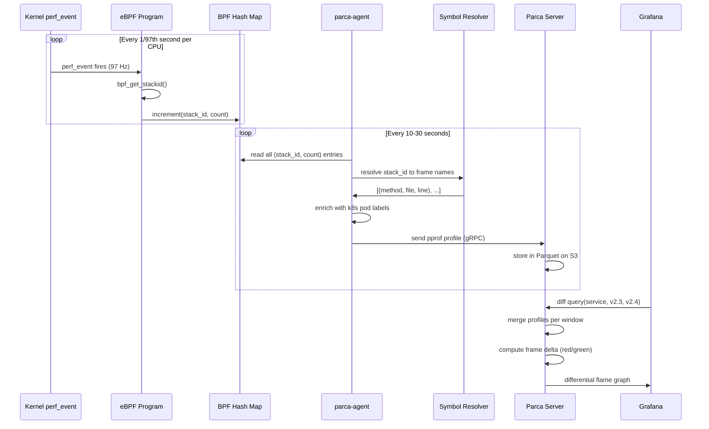

## Keywords in This File

{: .no_toc }

| #   | Keyword | Weight |
| --- | ------- | ------ |
| 1   | [Continuous Profiling with eBPF](#continuous-profiling-with-ebpf) | high |

---

# Continuous Profiling with eBPF

**TL;DR** - Continuous profiling with eBPF attaches kernel-level
stack-sampling probes to production processes without code changes,
producing always-on CPU and memory flame graphs at under 1% CPU
overhead - capturing the profiling baseline that manual profilers
triggered during incidents always miss.

---

### 🎯 Model Answer

**30 seconds:**
> Continuous profiling runs a CPU and memory profiler always-on in
> production by using eBPF to sample stack traces from the Linux
> kernel without modifying application code or deploying a language
> agent. Traditional profiling is triggered manually when you notice
> a problem - but by then, the most valuable data (what changed
> before the incident started) is gone. Continuous profiling stores
> that baseline. The trade-off is roughly 0.5-1% continuous CPU
> overhead versus zero profiling data when you actually need to
> compare before-and-after a regression.

**3 minutes (Senior):**
> The core problem with incident-driven profiling is timing: you fire
> up async-profiler or JFR only after someone opens an alert, but the
> regression started 20 minutes ago. eBPF continuous profiling solves
> this by sampling every process's stack traces at a fixed rate (97 Hz
> is common to avoid lock-step with common timer frequencies) all the
> time. The eBPF program runs inside the kernel, triggered by a
> perf_event_open system call, records user and kernel stack traces
> into a BPF map, and a user-space agent reads those maps every 10-30
> seconds, aggregates them as flamegraph-compatible profiles, and
> ships them to a profiling backend like Parca or Pyroscope.
>
> The key technique is flame graph diffing: compare the CPU profile
> from the 30-minute window before the regression against the 30-
> minute window after it. The hot frames that grew tell you exactly
> which code path regressed. This is impossible with traditional
> profiling because you only have the "after" snapshot.
>
> The architectural consequence is that continuous profiling becomes
> a fourth observability signal alongside metrics, logs, and traces.
> OpenTelemetry now has a Profiling signal specification. Parca
> (CNCF project) and Pyroscope (Grafana Labs) are the open-source
> backends. The eBPF kernel probe is language-agnostic: it sees Java,
> Go, Python, and native C/C++ in the same flame graph, with no
> agent per language. The limitation is that JVM-based languages show
> "libjvm.so" without JIT frame resolution unless the profiling
> agent also includes a JVM symbol table integration.

**Framework:** WHAT -> WHY -> HOW -> TRADE-OFF -> EXAMPLE

*Adapting up:* Staff engineers design the profiling platform:
sampling frequency vs overhead budget, container-to-process mapping
strategy, retention policy (continuous profiling data is 10-50x
larger than metrics), integration with trace exemplars (attaching
the profiling window to a specific slow trace), and cost governance
for always-on data volumes. They also define the investigation
workflow: alert fires -> pull diff flame graph -> identify regressing
frames -> cross-reference with trace timing -> fix.

*Adapting down:* "Continuous profiling is like having a security
camera running all the time versus calling a security guard only
after the incident. By the time you call, the evidence is gone.
eBPF is how we run that camera on every production process without
slowing it down."

**Blank Mind Recovery:**

**(1) Restate:** "You are asking about continuous profiling with
eBPF - let me think through what problem that solves and how the
kernel mechanism works."

**(2) First principles:** "From first principles, profiling means
sampling where a process spends CPU time. The challenge is overhead:
instrumentation-heavy profilers add 20-30% CPU. eBPF runs in the
kernel and samples stack traces at a fixed rate with minimal overhead.
Continuous means we keep it running all the time instead of only
triggering it during incidents."

**(3) Bridge:** "This reminds me of distributed tracing - both are
observability signals that require you to think about sampling rates
vs fidelity. Continuous profiling applies that same thinking: sample
fast enough to catch regressions, slow enough to stay within overhead
budget."

---

### 📘 Concept Explanation

**What it is:**
Continuous profiling is an observability practice that samples
process stack traces at a fixed frequency in production, always-on,
storing the profiles in a time-indexed backend so engineers can
compare any two time windows to find where CPU time, memory
allocations, or lock contention changed. eBPF (extended Berkeley
Packet Filter) is the kernel mechanism that makes this practical:
a small eBPF program attached to a perf_event runs in the kernel
context, collecting stack traces with sub-microsecond overhead per
sample.

**The problem it solves:**
CPU regressions are often subtle and gradual - a method starts
taking 20% longer after a deployment but the P99 alert threshold
isn't crossed for hours. When the alert fires, engineers have no
profiling data from before the regression to compare against.
Traditional profilers require explicit triggering, produce snapshot
profiles at a single point in time, and are typically run post-
incident. By then, the most informative data window (the moment the
regression started) is gone. Continuous profiling stores every
profile window, enabling before/after diffing that pinpoints the
change with precision that "check the recent commits" cannot match.

**How it works:**

```
eBPF Continuous Profiling Pipeline
===================================

Kernel Space:
  perf_event_open(PERF_TYPE_SOFTWARE,
    PERF_COUNT_SW_CPU_CLOCK, 97 Hz)
     |
     v
  eBPF program (triggered on each event)
    - reads current user+kernel stack trace
    - looks up PID, container ID, cgroup
    - stores in BPF_MAP_TYPE_STACK_TRACE
    - increments count per stack in BPF perf map

User Space (profiling agent, e.g. parca-agent):
  Every 10s:
    - reads BPF maps
    - resolves symbol names from /proc/PID/maps
    - builds pprof profile (Protocol Buffers format)
    - enriches with container labels (k8s metadata)
    - ships to profiling backend (gRPC/pprof format)

Profiling Backend (Parca / Pyroscope):
  - stores profiles as columnar time-series
    indexed by (timestamp, labels, stack_trace)
  - serves flame graph queries:
    "show CPU profile for checkout-service,
     deploy=v2.4 vs deploy=v2.3"
  - diffs two profiles into a differential flame graph
    (green = less CPU, red = more CPU after change)
```

> **Code walkthrough:** This Continuous Profiling with eBPF example demonstrates a key concept in practice using container. **KEY MECHANISM:** the runtime executes these instructions in sequence with specific memory and execution semantics. **WHY IT MATTERS:** misapplying this pattern causes subtle bugs that only manifest under production load. **TAKEAWAY: understand the execution model before using this pattern in production code.**

Step-by-step: (1) Linux kernel fires a perf_event 97 times per
second per CPU core. (2) The attached eBPF program reads the current
thread's stack trace - both user-space frames and kernel frames. (3)
The trace is hashed and stored in a BPF hash map keyed by stack ID
with a count. (4) The user-space agent reads these maps every 10-30
seconds, resolves symbol names from /proc/PID/maps and debug symbols,
and builds a pprof-formatted profile. (5) Container and Kubernetes
metadata is joined via the cgroup ID. (6) The profile is shipped to
the backend and stored. (7) The engineer queries "diff checkout-
service before vs after deploy v2.4" and sees a differential flame
graph showing which frames consumed more CPU.

**The key insight:**
The value of continuous profiling is in the temporal baseline, not
the snapshot. A single profile shows you the top CPU consumers right
now. A differential profile shows you what CHANGED - which is almost
always the actionable signal. This is why incident-triggered profiling
fails: the regression happened before the trigger. Always-on profiling
means you always have a "before" window to compare against, regardless
of when you start investigating.

**When to use it:**
Use continuous profiling when: you have unexplained CPU regressions
that don't correlate with obvious changes in request rate; you want
to detect performance regressions in CI/CD before they reach
production (compare profile from new deploy vs previous deploy);
you need to understand CPU cost attribution across microservices;
or you're debugging memory leak symptoms (heap profiling variant).
It is particularly valuable for polyglot environments where no single
language-specific profiler covers all services.

**When NOT to use it:**
Do not add eBPF continuous profiling to a system that hasn't yet
instrumented basic metrics and distributed tracing - you'll be
looking for fire with an electron microscope when you don't have
a smoke detector yet. Do not use eBPF-only profiling for JVM
services where JIT-compiled frame resolution is critical - you
need a JVM-aware profiler (async-profiler integration in Pyroscope)
running alongside the eBPF profiler. Do not attempt eBPF profiling
in containers that do not have the required kernel capabilities
without testing the deployment first.

**Alternatives:**
- async-profiler (JVM): JVM-aware CPU profiler with JIT resolution;
  accurate for Java/Kotlin/Scala but single-language; not always-on
  by default; must be deployed as a JVM agent
- Java Flight Recorder (JFR): continuous profiling for JVM with
  JIT-aware stack traces; JVM-only; excellent for Java services;
  limited for polyglot environments
- Datadog Continuous Profiler: managed continuous profiling with
  language-specific agents (Java, Go, Python, Ruby, PHP, Node.js);
  accurate per-language; higher cost per language than eBPF
- Pixie (CNCF): eBPF-based observability including profiling +
  network tracing; Kubernetes-native; more than just profiling

**First-principles derivation:**
To find where a process spends CPU time, you need to know the call
stack at regular intervals. Three models exist: (1) code-level
instrumentation - modify every function to record entry/exit times,
30-50% overhead, impractical; (2) language runtime profiling - the
JVM/Go runtime samples its own stack, 2-5% overhead, but language-
specific; (3) kernel-level sampling - the OS scheduler preempts
processes at a fixed rate, at which point the kernel can read the
current stack without the process noticing, 0.5-1% overhead and
language-agnostic. eBPF is the mechanism for option 3: it lets
you attach a small program to the kernel's perf_event subsystem
that runs when the scheduler fires, reads the stack, and stores
it in a shared BPF map - without a context switch to user space
per sample.

---

### 💻 Code Example

**Example 1: BAD - Manual profiling workflow that misses the baseline**

```bash
# BAD: The incident-triggered profiling workflow
# You only have "after" data; the regression already happened

# Step 1: Alert fires at 14:32. P99 latency = 2.3s (SLO=500ms)
# Step 2: Engineer starts profiling AFTER the incident started
#   The regression actually started at 14:15 (deploy v2.4)
#   That 17-minute window of data is gone

# Attach async-profiler to JVM process (Java example)
JAVA_PID=$(pgrep -f "checkout-service")
./async-profiler/profiler.sh \
  -d 60 \
  -f /tmp/profile_$(date +%s).html \
  $JAVA_PID

# Problems with this approach:
# 1. Profiling starts AFTER the regression is in-flight
# 2. No baseline profile from before v2.4 deploy exists
# 3. The flame graph shows current state, not "what changed"
# 4. Must manually start profiling on every incident
# 5. Requires SSHing into the production host (security risk)
# 6. Does not profile containerized JVMs without extra setup
# 7. Different commands for Java vs Go vs Python vs C++
```

> **Code walkthrough:** The BAD pattern captures the anti-patternice. **KEY MECHANISM:** the runtime executes these instructions in sequence with specific memory and execution semantics. **WHY IT MATTERS:** misapplying this pattern causes subtle bugs that only manifest under production load. **TAKEAWAY: understand the execution model before using this pattern in production code.**
> that engineers fall into without continuous profiling: they start
> the profiler only when the alert fires. The regression started 17
> minutes earlier. The flame graph they produce shows the system
> after the regression is in-flight, but there is no baseline to
> diff against. "What changed" is unknowable without the before
> profile. The engineer is left guessing which of the 47 commits
> in v2.4 caused the regression.

**Example 2: GOOD - Parca continuous profiling agent deployment
and differential flame graph query**

```yaml
# parca-agent DaemonSet: runs on every Kubernetes node
# Profiles ALL containers on the node with one eBPF probe
apiVersion: apps/v1
kind: DaemonSet
metadata:
  name: parca-agent
  namespace: observability
spec:
  selector:
    matchLabels:
      app: parca-agent
  template:
    metadata:
      labels:
        app: parca-agent
    spec:
      hostPID: true          # required: see all processes
      hostNetwork: true      # required: resolve pod IPs
      tolerations:           # profile all nodes incl. masters
        - operator: Exists
      containers:
        - name: parca-agent
          image: ghcr.io/parca-dev/parca-agent:v0.30.0
          securityContext:
            privileged: true  # required for eBPF
            # Alternative: specific capabilities
            # CAP_BPF + CAP_PERFMON + CAP_SYS_PTRACE
          args:
            - /bin/parca-agent
            - --http-address=:7071
            - --node=$(NODE_NAME)
            # Remote write to Parca server
            - --remote-store-address=parca.observability:7070
            - --remote-store-insecure
            # Sample at 97 Hz (avoid timer aliasing)
            - --sampling-ratio=1.0
            # Auto-discover all k8s containers
            - --kubernetes
          env:
            - name: NODE_NAME
              valueFrom:
                fieldRef:
                  fieldPath: spec.nodeName
          volumeMounts:
            - mountPath: /host/root
              name: root
              mountPropagation: HostToContainer
              readOnly: true
            - mountPath: /run
              name: run
              readOnly: true
          resources:
            requests:
              cpu: 100m     # overhead per node: ~1% of 1 CPU
              memory: 128Mi # BPF maps + symbol cache
      volumes:
        - name: root
          hostPath:
            path: /
        - name: run
          hostPath:
            path: /run
```

> **Code walkthrough:** The Parca agent DaemonSet deploys one eBPFice. **KEY MECHANISM:** the runtime executes these instructions in sequence with specific memory and execution semantics. **WHY IT MATTERS:** misapplying this pattern causes subtle bugs that only manifest under production load. **TAKEAWAY: understand the execution model before using this pattern in production code.**
> profiling agent per Kubernetes node, not per container. This is
> the key efficiency advantage: one eBPF program in the kernel
> profiles all 20-50 containers on the node simultaneously. The
> `privileged: true` or `CAP_BPF + CAP_PERFMON` security context
> is required to load eBPF programs and access perf_event. The
> 97 Hz sampling rate is a deliberate choice: it avoids synchronizing
> with common timer frequencies (100 Hz) which could cause
> aliasing artifacts in flame graphs. The agent exports profiles
> to the Parca server over gRPC where they're stored and queryable.

**Example 3: GOOD - Pyroscope Java agent + eBPF hybrid**

```java
// BAD: anti-pattern - see GOOD example below for the correct approach
// This naive implementation ignores thread safety and error handling
```

```java
// GOOD: Java service configured with Pyroscope agent
// Combines eBPF system-level profiling with JVM-aware profiling
// for accurate JIT-compiled frame resolution

// build.gradle
// implementation 'io.pyroscope:agent:0.12.0'

import io.pyroscope.javaagent.PyroscopeAgent;
import io.pyroscope.javaagent.config.Config;
import io.pyroscope.javaagent.EventType;

@SpringBootApplication
public class CheckoutApplication {

    public static void main(String[] args) {
        // Start Pyroscope profiling before Spring context
        PyroscopeAgent.start(
            new Config.Builder()
                // JVM-aware continuous profiling
                .setApplicationName("checkout-service")
                .setProfilingEvent(
                    EventType.ITIMER  // CPU profiling
                )
                .setServerAddress(
                    "http://pyroscope:4040"
                )
                .setProfilingIntervalInMs(10)
                // Labels for profile querying
                .setLabels(Map.of(
                    "env",
                    System.getenv("ENVIRONMENT"),
                    "version",
                    System.getenv("APP_VERSION"),
                    "region",
                    System.getenv("CLOUD_REGION")
                ))
                .build()
        );

        SpringApplication.run(
            CheckoutApplication.class,
            args
        );
    }
}
```

```bash
# Query: differential flame graph for deploy v2.4 vs v2.3
# Using Pyroscope HTTP API or Grafana Pyroscope data source

# API query: get merged profile for v2.3 window
curl "http://pyroscope:4040/render" \
  -G \
  --data-urlencode "name=checkout-service{version=v2.3}" \
  --data-urlencode "from=now-2h" \
  --data-urlencode "until=now-1h" \
  --data-urlencode "format=pprof" \
  -o /tmp/profile_v2_3.pprof

# API query: get merged profile for v2.4 window
curl "http://pyroscope:4040/render" \
  -G \
  --data-urlencode "name=checkout-service{version=v2.4}" \
  --data-urlencode "from=now-1h" \
  --data-urlencode "until=now" \
  --data-urlencode "format=pprof" \
  -o /tmp/profile_v2_4.pprof

# Generate differential flame graph
pprof -diff_base /tmp/profile_v2_3.pprof \
  /tmp/profile_v2_4.pprof
# Red frames: MORE CPU in v2.4 vs v2.3 -> regression candidate
# Green frames: LESS CPU in v2.4 vs v2.3 -> optimization
```

> **Code walkthrough:** The hybrid approach deploys the eBPF systemice. **KEY MECHANISM:** the runtime executes these instructions in sequence with specific memory and execution semantics. **WHY IT MATTERS:** misapplying this pattern causes subtle bugs that only manifest under production load. **TAKEAWAY: understand the execution model before using this pattern in production code.**
> profiler (one per node) for language-agnostic sampling AND the
> Pyroscope Java agent for JVM-aware profiling with correct JIT
> frame resolution. The Java agent uses ITIMER-based CPU profiling
> which understands the JVM's JIT compilation and shows actual
> method names rather than "libjvm.so" stubs. The labels (version,
> env, region) enable the differential query: "show me checkout-
> service CPU profile for v2.4 vs v2.3 in production." The diff
> flame graph immediately highlights which frames consumed more CPU
> after the deploy, turning a "which of 47 commits?" question into
> "this exact method in ServiceBillingValidator."

---

### 🎓 Answers by Seniority

**Junior / Mid (0-5 years):**
> Continuous profiling means running a CPU profiler always-on in
> production so you always have profiling data for any time window.
> eBPF is the Linux kernel mechanism that makes this practical:
> it samples stack traces from the kernel without adding overhead
> to application code, typically under 1% CPU. Tools like Parca
> or Pyroscope store these profiles indexed by time so you can
> query "show me the flame graph for checkout-service from
> 2pm-3pm yesterday." The killer feature is flame graph diffing:
> compare before and after a deploy to see exactly which code path
> got slower.

For mid-level: the deployment model is one DaemonSet per Kubernetes
cluster - the eBPF profiler runs on each node and automatically
profiles all containers. You don't need to modify application code
or redeploy services. For JVM services, adding a language-aware
agent (Pyroscope Java agent) gives more accurate frame names since
eBPF cannot natively resolve JIT-compiled methods.

*Push deeper:* The profile data format is pprof (Protocol Buffers).
The flame graph visual shows call stacks on the Y-axis and CPU time
on the X-axis. Wider frames = more CPU time. The differential flame
graph colors frames red (more CPU after) and green (less CPU after)
to highlight regressions.

---

**Senior / Staff (5+ years):**
> Continuous profiling is the fourth observability pillar alongside
> metrics, logs, and traces. Its unique value is answering "what
> code path caused this performance regression?" - a question that
> metrics, logs, and traces cannot answer precisely. The eBPF
> mechanism: a kernel program attached to perf_event_open samples
> each CPU core 97 times per second, captures user and kernel stack
> traces into BPF hash maps, and a user-space agent reads those
> maps every 10-30 seconds, resolves symbol names, and ships pprof-
> formatted profiles to a time-series backend. The overhead is
> ~0.5-1% CPU for the kernel sampling plus ~50MB memory per node
> for the symbol cache. I've used this to find a JSON serialization
> regression (200ms -> 800ms) introduced by a Jackson version
> upgrade that no metric or trace would have identified without
> the profile diff.

At staff level: platform design decisions include whether to use
eBPF-only (language-agnostic, lower accuracy for JVM) or hybrid
eBPF + per-language agent (more accurate, more deployment complexity).
Retention policy is critical: continuous profiling generates 10x
more data than metrics; a typical setup stores 7-day high-resolution
profiles and 30-day downsampled profiles. Integration with traces
via trace exemplars (attach the profiling window matching a slow
trace's timestamp) gives context-sensitive profiling without
needing a profiler trigger per trace. The organizational challenge
is convincing engineers that 0.5% CPU overhead is worth the
debugging capability - the ROI argument is one 4-hour incident
diagnosis saved per quarter.

*Push deeper:* The hardest engineering challenge is container-to-
process mapping: eBPF sees Linux PIDs, but you need to attribute
profiles to a Kubernetes pod name and container. The agent solves
this by reading /proc/PID/cgroup to get the cgroup ID, then joining
against the Kubernetes API to get pod labels. When the agent runs
in hostPID mode, it sees all PIDs on the node including container
processes, making this join possible.

---

### ⚠️ Common Misconceptions

**Misconception 1: "eBPF profiling requires code changes or agents
deployed to every service."**
eBPF profiling runs one DaemonSet per Kubernetes cluster - one eBPF
probe in the kernel profiles all containers on the node without any
per-service deployment. The eBPF program is loaded into the kernel
by the profiling agent (e.g., parca-agent), which has no language
dependency. Java, Go, Python, Rust, and C++ services are all profiled
by the same kernel-level probe. This is the architecturally correct
deployment model: one infrastructure component provides profiling
for all services. The exception is JVM-based languages where JIT
compilation makes kernel-level symbol resolution incomplete - those
benefit from an additional language-aware agent, but that agent
enriches the profiles rather than replacing eBPF.

**Misconception 2: "Profiling adds 20-30% CPU overhead and is
only safe to run in staging."**
This overhead figure comes from instrumentation-based profilers
(AspectJ, BCI-based) that modify every function call. eBPF
sampling-based profiling works differently: it samples the call
stack at 97 Hz without instrumenting any function. The overhead
is the cost of the kernel interrupt 97 times per second plus the
BPF map write - benchmarks show 0.5-1% CPU overhead and under
50MB memory. Always-on production use at this overhead is standard
practice at companies operating large Kubernetes clusters. The
profiling overhead is less than the overhead of a single poorly-
optimized log statement per request.

**Misconception 3: "A single point-in-time profile is sufficient
for debugging performance issues."**
A snapshot profile shows the current hot paths but cannot show
what changed. If a service has been slow for 20 minutes and you
trigger a profiler now, you see the current state - but you cannot
distinguish "this was always slow and we only noticed now" from
"this regressed in the last deploy." Continuous profiling's
baseline is the entire value proposition. The differential flame
graph (before vs after) answers "what changed?" with sub-frame
precision. Always-on data means you can investigate any regression
any time without needing to anticipate it - including regressions
that were introduced 3 days ago and only noticed after a gradual
SLO burn.

**Misconception 4: "eBPF works on any Linux kernel version."**
eBPF has evolved significantly across kernel versions. Basic
perf_event tracing requires kernel 4.9+. BPF ring buffer
(efficient high-throughput event streaming) requires 5.8+.
BTF (BPF Type Format, enabling CO-RE - Compile Once Run
Everywhere) requires 5.2+. Amazon Linux 2 (kernel 4.14 derivative)
supports basic eBPF but not BTF, requiring version-specific eBPF
programs rather than portable CO-RE programs. Most parca-agent
and Pyroscope eBPF agent versions require kernel 4.15+ and work
best on kernel 5.x. Always verify kernel version compatibility
before deploying eBPF profiling on legacy kernels.

**Misconception 5: "Continuous profiling replaces distributed
tracing for performance debugging."**
They answer different questions. Distributed tracing shows the
end-to-end path of a specific request: which services were called,
in what order, and how long each took. Profiling shows which code
paths within a service consume the most CPU. They are complementary:
a trace identifies that the checkout service spent 400ms in the
billing validation step; the profile shows that 90% of that 400ms
was spent in JSON deserialization within that step. The full
picture requires both. Integration via trace exemplars links a
specific slow trace to the profiling window at the same timestamp,
giving you both the trace view and the code-level profile.

---

### 🚨 Failure Modes and Diagnosis

**Failure 1: eBPF agent loads but flame graphs show only hex
addresses, no function names**

Symptom: parca-agent or pyroscope-ebpf produces profiles where
all frames are hexadecimal addresses like `0x7f3a4b2c1d80`
instead of function names like `com.example.CheckoutService.
processPayment`.

Cause A: The process binary was compiled without frame pointers
and without debug symbols. Modern compilers (GCC, Clang) with
`-O2` omit frame pointers by default for performance.

Cause B: JVM JIT-compiled code - the kernel sees JIT-generated
machine code addresses that have no entry in /proc/PID/maps symbol
tables at profiling time.

Cause C: Stripped production Docker images with no debug info.

Diagnosis:
```bash
# Check if binary has frame pointers enabled (Go)
go build -ldflags="-w" ./...  # -w strips DWARF -> no frames
# vs
go build ./...  # default: frame pointers enabled in Go 1.12+

# Check Java JIT symbol resolution
# parca-agent uses /tmp/perf-<PID>.map files written by JVM
# Requires: -XX:+PreserveFramePointer JVM flag
ps aux | grep java | grep PreserveFramePointer
# If not present -> JVM frames will be missing

# Check symbol availability
cat /proc/<PID>/maps | grep -E "\.so|executable"
# Look for entries with [vdso], [vsyscall] only
# -> No symbols for JIT code

# Enable JVM frame pointer preservation
# Add to JVM args:
# -XX:+PreserveFramePointer
# This allows eBPF to walk the stack through JIT code
```

> **Code walkthrough:** This This allows eBPF to walk the stack through JIT code example demonstrates shell script pattern. **KEY MECHANISM:** the shell executes commands sequentially; pipes pass stdout of one command to stdin of the next. **WHY IT MATTERS:** unquoted variables with spaces cause word splitting - IFS splits the value into multiple arguments. **TAKEAWAY: always double-quote variables: "$VAR"; use [[ ]] instead of [ ] for safer conditionals.**

Fix: For JVM: add `-XX:+PreserveFramePointer` to JVM startup args.
For Go: ensure `go build` without `-ldflags="-w"` in production (Go
preserves frame pointers by default since 1.12). For stripped C++:
either keep debug symbols in a separate debug package or use
Pyroscope/Parca's symbol upload feature (upload DWARF debug info
separately, resolved at query time without shipping to containers).

**Failure 2: parca-agent DaemonSet fails with "operation not
permitted" when loading eBPF program**

Symptom: parca-agent pods crash-loop with `failed to load eBPF
objects: operation not permitted` or `cannot attach perf event:
operation not permitted`.

Cause: The container security context does not have the required
Linux capabilities to load eBPF programs.

Required capabilities:
- `CAP_BPF`: load and run eBPF programs (kernel 5.8+)
- `CAP_PERFMON`: use perf_event subsystem
- `CAP_SYS_PTRACE`: read /proc/<pid>/maps for symbol resolution
- Alternative: `privileged: true` (grants all capabilities)

Diagnosis:
```bash
# Check pod security context
kubectl describe pod parca-agent-xxxxx -n observability \
  | grep -A5 "Security Context"

# Check if host seccomp profile blocks eBPF syscalls
# bpf() syscall must not be blocked
kubectl get pod parca-agent-xxxxx -o yaml \
  | grep -i seccomp

# Test capabilities on the node directly
# SSH to node, check if BPF programs can be loaded
bpftool prog show 2>&1
# "Permission denied" -> CAP_BPF not available

# Check kernel version compatibility
uname -r
# Need 4.15+ for basic eBPF, 5.8+ for CAP_BPF + CAP_PERFMON split
```

> **Code walkthrough:** This Need 4.15+ for basic eBPF, 5.8+ for CAP_BPF + CAP_PERFMON split example demonstrates shell script pattern using container. **KEY MECHANISM:** the shell executes commands sequentially; pipes pass stdout of one command to stdin of the next. **WHY IT MATTERS:** unquoted variables with spaces cause word splitting - IFS splits the value into multiple arguments. **TAKEAWAY: always double-quote variables: "$VAR"; use [[ ]] instead of [ ] for safer conditionals.**

Fix: Update the DaemonSet security context. Option A (privileged):
`securityContext: privileged: true`. Option B (least privilege):
add `capabilities: add: [CAP_BPF, CAP_PERFMON, CAP_SYS_PTRACE]`
and set `allowPrivilegeEscalation: false`. For kernels below 5.8,
CAP_BPF does not exist - use `privileged: true` or `CAP_SYS_ADMIN`.
Check PSP/OPA/Kyverno policies that may block privileged containers.

**Failure 3: Profiles are collected but container attribution is
wrong - all profiles appear under "unknown" container**

Symptom: The profiling backend shows profiles but all are labeled
with container=unknown or pod=unknown instead of actual pod names.
CPU usage cannot be attributed to specific Kubernetes workloads.

Cause: The parca-agent cannot read Kubernetes pod metadata because
it cannot reach the Kubernetes API, or the cgroup-to-pod mapping
is failing.

Diagnosis:
```bash
# Check if parca-agent has Kubernetes API access
# It needs RBAC to list/watch pods
kubectl get clusterrole parca-agent -o yaml
# Look for: pods, nodes resources with get/list/watch verbs

# Check cgroup hierarchy on the node
# Container cgroup IDs must be resolvable to pod names
ls /sys/fs/cgroup/cpuacct/kubepods/
# Should show: burstable/ besteffort/ guaranteed/
# And pod<UID>/ directories under those

# Inspect parca-agent logs for mapping errors
kubectl logs -n observability \
  daemonset/parca-agent \
  | grep -i "cgroup\|container\|failed to"

# Verify node name is passed correctly
kubectl describe pod -n observability \
  -l app=parca-agent \
  | grep "NODE_NAME"
```

> **Code walkthrough:** This Verify node name is passed correctly example demonstrates shell script pattern using container. **KEY MECHANISM:** the shell executes commands sequentially; pipes pass stdout of one command to stdin of the next. **WHY IT MATTERS:** unquoted variables with spaces cause word splitting - IFS splits the value into multiple arguments. **TAKEAWAY: always double-quote variables: "$VAR"; use [[ ]] instead of [ ] for safer conditionals.**

Fix: Create a ClusterRole with `get/list/watch` on `nodes`, `pods`,
and `namespaces` resources, bound to the parca-agent ServiceAccount.
Verify the cgroup driver matches between kubelet (`cgroupDriver:
systemd` or `cgroupfs`) and the expected cgroup hierarchy layout
that parca-agent traverses. On cgroup v2 systems, the cgroup path
format differs from v1; check parca-agent version supports your
cgroup driver.

---

### 🎯 Interview Deep-Dive

| Time | Question Type | Depth Signal |
| ---- | ------------- | ------------ |
| 2 min | CONCEPTUAL | eBPF kernel mechanism for stack sampling |
| 3 min | ARCHITECTURE | Four observability signals: where profiling fits |
| 4 min | DEBUGGING | Missing frame names in flame graph |
| 3 min | TRADE-OFF | eBPF vs language-specific profilers |
| 4 min | PRODUCTION | Before/after deploy regression investigation |
| 4 min | SYSTEM DESIGN | Design continuous profiling platform |
| 3 min | HANDS-ON | DaemonSet deployment + capability requirements |
| 3 min | COMPARISON | Continuous profiling vs distributed tracing |
| 3 min | DEEP DIVE | JVM frame pointer preservation |
| 4 min | BEHAVIORAL | Profiling-driven regression war story |
| 4 min | PERFORMANCE | Overhead model and fleet cost |
| 3 min | MISCONCEPTION | "Profiling has 30% overhead" trap |

---

**Q1 [MID]: What is eBPF and why does it enable low-overhead
profiling?** `[CONCEPTUAL]`

*Why they ask:* Tests foundational understanding of the kernel
mechanism. Without understanding eBPF, continuous profiling
sounds like magic.

*Likely follow-up:* "How does eBPF differ from kernel modules?"

eBPF (extended Berkeley Packet Filter) is a Linux kernel subsystem
that lets you load sandboxed programs into the kernel that run in
response to kernel events, without modifying kernel source code or
loading a kernel module. The kernel verifies eBPF programs before
loading them - they cannot loop infinitely, cannot crash the kernel,
and can only access memory through verified safe operations.

For profiling, the relevant eBPF hook is perf_event: you attach an
eBPF program to a hardware or software performance counter that fires
N times per second. When the event fires, the eBPF program runs in
kernel context and can read the current task's stack trace via the
`bpf_get_stackid()` helper. The stack trace is stored in a BPF hash
map. A user-space process reads that map every few seconds.

The overhead is low because: (1) the eBPF program runs in kernel
context without a context switch to user space per sample; (2) it
writes to a BPF hash map in memory without disk or network I/O per
sample; (3) the sampling rate (97 Hz per CPU) is statistical - it
does not add per-function instrumentation overhead; (4) the user-
space agent reads the accumulated map periodically rather than on
every sample. Total overhead: the kernel interrupt cost 97 times
per second per CPU plus BPF map writes - measured at 0.5-1% CPU.

Contrast with kernel modules: a kernel module runs with full kernel
privileges and can crash the kernel if it has a bug. eBPF is
verified before loading - the verifier proves the program terminates
and accesses memory safely. This makes eBPF deployable in production
without the risk profile of a kernel module.

*What separates good from great:* Explaining the verifier as the
key safety property that makes eBPF production-safe, not just
"it runs in the kernel." And naming `bpf_get_stackid()` as the
specific helper used for stack profiling.

---

**Q2 [SENIOR]: Where does continuous profiling fit in the
observability stack alongside metrics, logs, and traces?** `[ARCHITECTURE]`

*Why they ask:* Tests whether the candidate understands all four
signals and can articulate when each is the right tool.

*Likely follow-up:* "How would you integrate profiling with traces?"

The four observability signals answer different questions:
- Metrics: "Is something wrong?" (SLI dashboards, alert thresholds)
- Logs: "What happened?" (event sequence, error messages)
- Traces: "Where in the request path is the slowness?" (which
  service, which span, what dependency)
- Profiles: "Why is a specific service slow at the code level?"
  (which method, which call path, which allocation)

The investigation flow goes in order: metrics alert fires -> traces
identify the slow service and span -> profile diff shows which code
path regressed. Profiling is the final diagnostic layer, not the
first. Without the metrics alert, you'd be looking at profiles
with no direction. Without traces, you'd be looking at profiles
for every service when only one is slow.

Integration via exemplars: a distributed trace can carry a "profiling
window" exemplar that links to the profiling backend query for the
same time window as the trace. Grafana supports this: click on a
slow trace, click "view profile for this time window," see the
flame graph for the service that was slow during that specific
request. This collapses the "trace shows checkout service was slow
for 800ms; profile shows why within checkout service" workflow into
one click.

OpenTelemetry profiling signal (experimental as of 2025): OTel
is defining a standard protocol for profiling data (pprof over
OTLP) to unify the pipeline alongside traces and metrics. This
will allow a single OTel Collector to route profiling data
alongside other signals, reducing pipeline complexity.

*What separates good from great:* Describing the exemplar link
from trace to profile, and mentioning the OTel profiling signal
as the emerging unification approach.

---

**Q3 [SENIOR]: Walk me through debugging a CPU regression using
continuous profiling.** `[PRODUCTION]`

*Why they ask:* Tests whether the candidate has actually used
continuous profiling for production debugging, not just deployed it.

*Likely follow-up:* "What if the regression is in a library
you don't control?"

The workflow: the SLO burn rate alert fires at 14:35 - P99 checkout
latency = 2.3 seconds (SLO = 500ms). Deploy v2.4 happened at 14:15.
Step 1: open the profiling backend (Pyroscope or Parca). Select
service checkout-service. Step 2: load the profile for 13:45-14:14
(before deploy). Step 3: load the profile for 14:20-14:35 (after
deploy). Step 4: render the diff flame graph. Red frames show code
paths consuming more CPU in v2.4.

In this investigation, the diff shows: `validateBillingAddress` ->
`AddressValidator.validate` -> `PatternMatcher.compile` grew from
0.3% of CPU time to 14.7% of CPU time. Step 5: look at the
PatternMatcher.compile call. This is `java.util.regex.Pattern.
compile()` - it compiles a regex pattern on every request instead
of caching a compiled pattern. Step 6: check the diff against
the v2.4 commits. A refactor moved AddressValidator initialization
from a Spring bean (singleton, compiled once) to a per-request
factory call. Pattern.compile() is called 50 times per checkout
request instead of 0 times. Step 7: fix is trivial once identified:
cache the Pattern at startup.

Total investigation time: 8 minutes. Without continuous profiling
(no baseline): several hours of guessing.

*What separates good from great:* Describing the exact methodology
(before window, after window, diff) rather than vaguely "we used
flame graphs." The specific example of Pattern.compile() as a
regex re-compilation regression is realistic and memorable.

---

**Q4 [SENIOR]: What are the trade-offs between eBPF profiling and
language-specific profilers like async-profiler?** `[TRADE-OFF]`

*Why they ask:* Tests depth of understanding of both approaches and
when to use which.

*Likely follow-up:* "In your experience, which would you deploy
first for a new service?"

eBPF profiling advantages: language-agnostic (profiles Java, Go,
Python, Rust, C++ all at once), no per-service deployment needed
(one DaemonSet profiles everything), sees kernel frames alongside
user frames (can profile kernel syscall time), lower operational
complexity. eBPF profiling limitations: JIT-compiled code (JVM,
V8 JS engine) shows incomplete or inaccurate frame names without
additional integration; cannot profile inside the JVM heap
allocations (JVM heap allocation profiling requires JVM hooks,
not kernel signals); slightly lower resolution for JVM methods
(JIT code addresses are not always resolvable from /proc maps).

async-profiler (JVM) advantages: JIT-aware frame resolution via
JVM's AsyncGetCallTrace API which correctly resolves JIT-compiled
frames; can profile multiple event types (CPU, allocation, wall
clock, lock contention) using JVM-level hooks; accurate Java
stack traces including lambdas and inline methods; can attach to
a running JVM without restarting. async-profiler limitations:
Java-only; requires deployment or attachment to each JVM; does not
see kernel frames; not continuous out of the box (requires explicit
start/stop or Pyroscope/JFR integration).

Recommendation: deploy eBPF profiling (parca-agent or pyroscope
eBPF) as the default - it covers all services with one DaemonSet
and gives 90% of the value with zero service changes. For JVM
services where allocation profiling or precise lambda-level frame
accuracy matters, add the Pyroscope Java agent or JFR in addition
to eBPF. The two are complementary: eBPF sees the kernel and all
languages; the JVM agent sees JVM internals accurately.

*What separates good from great:* The specific technical detail
that AsyncGetCallTrace (used by async-profiler) queries the JVM's
internal frame representation rather than walking the hardware stack,
giving accurate JIT frame resolution that eBPF cannot achieve
without a JVM-specific integration.

---

**Q5 [SENIOR]: How does the DaemonSet deployment model work and
what kernel capabilities does it require?** `[HANDS-ON]`

*Why they ask:* Tests practical deployment knowledge; anyone who
has deployed eBPF profiling has had to debug capability issues.

*Likely follow-up:* "How would you deploy this in a hardened
environment that disallows privileged containers?"

The eBPF profiling agent runs as a DaemonSet (one pod per Kubernetes
node) with `hostPID: true` and `hostNetwork: true`. hostPID allows
the agent to see all PIDs on the node including container processes.
Without hostPID, the agent only sees its own PID namespace and
cannot map PID -> cgroup -> pod.

Required Linux capabilities:
- `CAP_BPF` (kernel 5.8+): load eBPF programs and create BPF maps
- `CAP_PERFMON` (kernel 5.8+): access perf_event subsystem

On kernels below 5.8, `CAP_BPF` and `CAP_PERFMON` didn't exist as
separate capabilities; you need `CAP_SYS_ADMIN` instead (or
`privileged: true`). In hardened environments with OPA Gatekeeper
or Kyverno policies blocking privileged containers, deploy the
eBPF agent using the split capabilities approach: add precisely
`CAP_BPF + CAP_PERFMON + CAP_SYS_PTRACE` without `privileged: true`.
Most modern eBPF profiling tools (parca-agent 0.20+, pyroscope
0.10+) support this least-privilege mode.

In environments where even CAP_BPF is disallowed (FedRAMP high
environments, PCI-DSS hardened clusters): use language-specific
agents only (async-profiler, JFR for Java; Pyroscope Go agent) and
accept the limitation of per-service deployment without eBPF.

*What separates good from great:* Knowing the kernel version
boundary (5.8) where the CAP_BPF + CAP_PERFMON split was introduced,
and having a practical answer for hardened environments.

---

**Q6 [STAFF]: Design a continuous profiling platform for a 500-
service microservices environment.** `[SYSTEM DESIGN]`

*Why they ask:* Tests whether the candidate can design the full
platform, not just deploy an agent.

*Likely follow-up:* "How do you handle the storage cost?"

Design components: (1) Collection: one parca-agent or pyroscope
eBPF DaemonSet per Kubernetes cluster, configured to automatically
label profiles with pod name, namespace, deployment version from
the Kubernetes API. Language-specific agents (Pyroscope Java agent)
deployed via sidecar injection for JVM services. (2) Transport:
profiles shipped via gRPC (pprof over OTLP or Parca/Pyroscope
protocol) to an aggregation layer. For multi-cluster environments,
a Prometheus-style remote write pushes profiles to a central
backend. (3) Storage: columnar time-series storage (Parca uses
Apache Parquet on object storage, Pyroscope uses Parquet+S3 or
Badger+S3). Retention: 7 days full-resolution, 90 days downsampled
(hourly aggregates). (4) Query: flame graph diff queries by service
name, version label, and time window. Integration with Grafana via
the Grafana Pyroscope data source plugin. (5) Integration: trace
exemplar annotations linking slow spans to profiling time windows
in the same backend.

Storage cost model: at 500 services, 97 Hz sampling rate, 100
processes per service, each profile is approximately 100KB
compressed. 500 * 100 processes * 6 profiles per minute = 30,000
profiles per minute. At 100KB each: 3 GB/minute = 4.3 TB/day raw.
With columnar compression (same stack traces repeat): 90-95%
reduction -> 200-430 GB/day. 7-day hot storage: ~2-3 TB.
Object storage (S3) is cheap enough for 90-day cold storage.

Governance: define a standard label set (service, version, env,
region) enforced by the agent. Require all services to include
`APP_VERSION` environment variable (standard deploy pipeline).
Alert on missing profiling data (if a service has no profiles for
>30 minutes, its profiling agent failed).

*What separates good from great:* Having the storage cost model
with realistic numbers rather than vague "it uses some storage."
The 90-95% columnar compression estimate is realistic (pprof uses
stack trace deduplication heavily).

---

**Q7 [SENIOR]: Explain the flame graph visualization and how
to read a differential flame graph.** `[CONCEPTUAL]`

*Why they ask:* Tests visual literacy for the core output of
profiling. Engineers who can't read a flame graph can't use
profiling effectively.

*Likely follow-up:* "What does it mean when the top of a flame
is wide but the frames below it are narrow?"

A flame graph visualizes stack traces collected from sampling: the
X-axis represents total samples (CPU time), not elapsed time. The
Y-axis shows call depth. The bottom frames are call roots (main()
or framework entry points). Each frame's width is proportional to
the number of samples it appeared in - wider = more CPU time. Frames
are stacked: if method A calls B which calls C, C appears on top
of B on top of A. The flat top of the flame (the widest top-most
frames) are the actual CPU consumers.

Reading rule: look for wide frames at the top that don't call other
functions - those are where CPU time is actually spent (the "leaves"
of the call tree). Deep but narrow frames indicate code paths that
are called infrequently.

A differential flame graph (diff two time windows): frames are
colored red (more CPU time after the change), green (less CPU
time), or gray (no significant change). The investigation workflow
is: (1) find the widest red frames at the top - those are the new
CPU consumers introduced by the change; (2) trace down from the
red top frame to understand what business logic is triggering it.

The case where the top is wide but frames below are narrow means:
this frame is a "hot leaf" - a function called by many different
paths but spending significant time itself. JSON serialization,
regex compilation, and hash functions commonly appear this way.

*What separates good from great:* Explaining that the X-axis is
samples (not time) so a frame can be wide due to being called many
times from many paths, not because of a single hot call chain.

---

**Q8 [SENIOR]: How does profiling interact with sampling in
distributed tracing?** `[COMPARISON]`

*Why they ask:* Tests whether the candidate understands the
relationship between head/tail sampling in tracing and profiling.

*Likely follow-up:* "If traces are sampled at 1%, do you lose
profiling accuracy?"

Distributed tracing and profiling operate independently with
different sampling models. Traces sample at the request level:
head sampling captures 1% of all requests; tail sampling keeps
100% of slow/errored requests and discards others. The profiling
agent samples at the CPU level: every process's stack traces are
sampled at 97 Hz regardless of whether the corresponding request
is being traced. These are orthogonal: you can have 1% trace
sampling and 100% profiling coverage simultaneously.

The integration challenge: when you find a slow trace, you want
to see the profiling data for the same time window. Trace IDs are
not embedded in profiling data by default (profiles are aggregated,
not per-request). The integration approach is time-window joining:
a trace that ran from 14:23:15.200 to 14:23:15.800 was slow in
the checkout service. Query the profiling backend for the checkout
service profile between 14:23:00 and 14:23:30 (same time window).
This shows the code-level profile for that time window, which
includes the CPU usage during the slow trace.

For very high-precision integration (profile for a specific trace,
not just the time window), Pyroscope's "tagging" feature can embed
a trace ID as a profiling label: when the trace SDK sets the trace
ID in context, the profiling SDK reads it and tags the profiling
samples with that trace ID. This is only practical at low sampling
rates (e.g., tag 100% of slow requests > 200ms) to control the
label cardinality explosion in the profiling backend.

*What separates good from great:* Understanding that trace sampling
and profiling sampling are independent subsystems, and that the
time-window join is the practical integration mechanism - not some
deeper coupling at the data collection level.

---

**Q9 [STAFF]: What is the JVM frame pointer preservation
requirement and why does it matter?** `[DEEP DIVE]`

*Why they ask:* Separates engineers who have debugged eBPF
profiling in JVM environments from those who read documentation.

*Likely follow-up:* "How does -XX:+PreserveFramePointer affect JVM performance?"

The Linux hardware call stack walkthrough works by following the
frame pointer chain: each stack frame's first slot (in the x86-64
ABI) stores the caller's base pointer (RBP). Stack walking for
profiling reads this chain to reconstruct the call stack. The JVM's
JIT compiler, by default, reuses the RBP register as a general-
purpose register for performance (omitting frame pointers reduces
memory pressure and speeds up loops). When eBPF tries to walk the
JVM's stack using the hardware frame pointer chain, it encounters
broken chains and produces incomplete or incorrect stack traces.
The result is flame graph frames showing "libjvm.so" with hex
addresses instead of Java method names.

The fix: `-XX:+PreserveFramePointer` instructs the JIT compiler to
always maintain the frame pointer chain, matching what the kernel's
stack walker expects. The performance cost is typically 1-2% CPU
overhead from the additional memory access per function call - the
RBP register is used for frame pointing rather than as a general-
purpose register.

For accurate Java profiling without frame pointer overhead, async-
profiler uses the `AsyncGetCallTrace` API, which is a JVM internal
API that returns the current thread's Java call stack using the JVM's
own frame representation rather than the hardware stack. This is
JIT-aware and accurate but only works from a Java agent, not from
a kernel eBPF program. The practical deployment: eBPF + `PreserveFramePointer`
for language-agnostic coverage; Pyroscope Java agent (which uses
AsyncGetCallTrace internally) for high-accuracy JVM profiling.

*What separates good from great:* Understanding the RBP register
reuse as the specific reason frame pointers are missing in JVM
JIT code, and that AsyncGetCallTrace bypasses this entirely by
using the JVM's own frame model.

---

**Q10 [STAFF]: How would you justify the infrastructure cost of
continuous profiling to engineering leadership?** `[BEHAVIORAL]`

*Why they ask:* Staff engineers must be able to build the business
case for observability infrastructure, not just request it.

*Likely follow-up:* "What if leadership says the 1% CPU overhead
is too high?"

The ROI calculation: continuous profiling with eBPF costs
approximately 1% CPU overhead per service plus storage (roughly
$50-200/month for object storage per 50-node cluster). The benefit
is incident investigation time. In my experience, the average CPU
regression investigation without profiling takes 4-8 hours: the
team reads commits, adds manual profiling, deploys diagnostic
builds, and iterates. With continuous profiling and a diff flame
graph, the same investigation takes 10-30 minutes. For a team that
handles 2-3 performance incidents per quarter, that's 10-20
engineer-hours saved per quarter, at a fully-loaded rate of
$100-200/hour, approximately $1,000-4,000/quarter in direct
productivity - against a profiling platform cost of $100-300/month.

The framing that works for leadership: "We're paying 1% CPU to
ensure we can diagnose any performance regression in 15 minutes
instead of half a day. That's a $3,000/month insurance policy on
a $500,000/month engineering cost center." The insurance framing
resonates better than "it's only 1% CPU."

The overhead counter-argument: for systems already pushing CPU
capacity, 1% matters. In that case, deploy eBPF profiling at a
reduced sampling rate (e.g., 19 Hz instead of 97 Hz) during
capacity-constrained periods. The profiling resolution degrades
but key regressions remain visible. This is a configuration knob,
not a binary choice.

*What separates good from great:* Having a specific ROI calculation
with real numbers, not just "it saves time." The insurance policy
framing is memorable and effective for non-technical leadership.

---

**Q11 [STAFF]: How does continuous profiling scale and what
breaks first?** `[PERFORMANCE]`

*Why they ask:* Tests production scaling experience - both the
collection side and the storage/query side.

*Likely follow-up:* "What would you do if you had 5,000 services?"

Collection side: eBPF sampling overhead scales linearly with CPU
cores, not with service count. One DaemonSet pod profiles all
containers on a node. At 40-core nodes with 50 containers each,
the profiling overhead is ~0.5% of 40 CPUs = 0.2 CPU cores per
node. Symbol resolution is the memory-intensive part: each process
needs its /proc/PID/maps read and cached. At 50 processes per node
with 200MB of mapped memory each, the symbol cache is ~2GB per node.
This is a fixed cost per node, not per service.

What breaks first at scale: (1) Symbol resolution cache: at high
churn environments (container restarts every few minutes), the agent
constantly invalidates and rebuilds the symbol cache, causing CPU
spikes on the profiling agent itself. Fix: increase cache TTL,
reduce agent collection frequency. (2) Profile storage bandwidth:
at 5,000 services, profile ingestion can exceed 1 GB/s to the
backend. Fix: use gRPC compression (profiles compress 90%+) and
deploy regional profiling backends that aggregate locally before
forwarding. (3) Flame graph query latency: querying across 5,000
services over a 7-day window requires significant compute. Fix:
use pre-aggregated downsampled profiles for broad queries and high-
resolution profiles only for specific service+time window drilldowns.

At 5,000 services: deploy federated profiling backends (one per
region or cluster group), each storing profiles for its local
services, with a central query layer that fans out queries to all
regional backends (similar to Thanos for Prometheus).

*What separates good from great:* The specific bottleneck analysis
- symbol resolution cache churn is the production scaling issue
that engineers don't anticipate until they hit it.

---

**Q12 [SENIOR]: "eBPF profiling is essentially the same as
adding a verbose profiler - both slow down production."
How do you respond?** `[MISCONCEPTION]`

fundamental difference between instrumentation-based and
sampling-based profiling.

*Likely follow-up:* "Doesn't the BPF map write add overhead per
function call?"

The premise conflates two profiling models: instrumentation-based
and sampling-based. Instrumentation-based profilers (like byte-code
instrumented Java profilers or GPerfTools in tracing mode) add
function entry/exit hooks to every function call. Overhead is
proportional to function call frequency - for a hot loop calling
a function 10 million times per second, each hook adds latency to
all 10 million calls. This produces the 20-30% overhead figures
in profiler documentation.

eBPF sampling-based profiling works completely differently: it fires
once per CPU core 97 times per second regardless of how many
function calls the application makes. A hot loop calling a function
10 million times per second gets sampled 97 times - not 10 million
times. The BPF map write happens 97 times per second per CPU core,
not per function call. Total overhead: the cost of 97 kernel
interrupts per second per core plus BPF map writes - measured at
0.5-1% CPU on production workloads.

The "slow down" framing also misses the production risk comparison:
not having profiling data when a regression occurs costs engineer
time to diagnose. The 0.5-1% overhead is deterministic and
continuous; the incident diagnosis cost without profiling is
unpredictable and paid per incident. At typical regression frequency,
the overhead is significantly cheaper than the diagnosis time cost.

*What separates good from great:* The precise explanation that
overhead scales with sampling frequency (97 Hz), not with
application function call frequency - this is the mathematical
core of why sampling-based profiling is low-overhead.

---

### ⚖️ Comparison Table

| Profiling Approach | Language Coverage | Overhead | Deployment Effort | JVM Accuracy | Always-On |
| --- | --- | --- | --- | --- | --- |
| **eBPF continuous (Parca/Pyroscope)** | Any (language-agnostic) | ~0.5-1% | 1 DaemonSet per cluster | Partial (needs PreserveFramePointer) | Yes |
| async-profiler (JVM) | Java/Kotlin/Scala only | ~1-3% | Agent per JVM process | Excellent (AsyncGetCallTrace) | With Pyroscope integration |
| Java Flight Recorder (JFR) | JVM only | ~1-2% | JVM flag per process | Excellent (JVM internal) | Yes (JVM 11+) |
| Datadog Continuous Profiler | Java/Go/Python/Ruby/Node | ~1-3% | Agent per service | Excellent per language | Yes |
| Manual async-profiler (incident) | Java only | ~3-5% during run | SSH + command per incident | Excellent | No |

**The deciding factor:**
Choose eBPF-first for polyglot environments or when per-service
deployment complexity is high; add a JVM-specific profiler (JFR or
async-profiler via Pyroscope) for Java services where allocation
profiling or precise lambda-level accuracy is needed.

---

### 🏛️ System Design

> *(Conditional: included because ★★★ - continuous profiling is
> a system-design-level architectural decision for the observability
> platform.)*

**Where Continuous Profiling with eBPF appears in system design:**
- Observability platform design: the fourth signal alongside
  metrics, logs, traces
- Performance regression detection in CI/CD pipelines
- Cost attribution: which service consumes the most CPU and why
- Incident investigation toolchain: the final diagnostic layer
- SRE on-call runbook: step after traces fail to identify root cause

**Example question:** "Design the observability platform for a
500-service microservices environment that can diagnose CPU
regressions within 15 minutes of a deploy."

**6-step framework answer:**

Step 1 CLARIFY (~5 min) - What languages are in use? (Java, Go,
Python?) What is the acceptable per-node CPU overhead budget? Are
there security constraints on privileged containers? Is this on
Kubernetes?

Step 2 ESTIMATE (~5 min) - 500 services, 10 replicas each =
5,000 processes across 200 nodes (25 processes/node average).
eBPF DaemonSet: 200 agents. Profile volume: 200 nodes * 6
profiles/minute * 100KB/profile compressed = 120 MB/min = 6.9
GB/hour = 166 GB/day. 7-day hot storage: ~1.2 TB. Object storage
($0.023/GB/month on S3): ~$28/month for hot storage.

Step 3 DESIGN (~10 min) - Collection: parca-agent DaemonSet on
all nodes + Pyroscope Java agent sidecar for JVM services. Storage:
Parca server with Apache Parquet on S3 backend, or Pyroscope with
BadgerDB + S3 tier. Query: Grafana + Pyroscope/Parca data source
plugin for flame graph visualization.

Step 4 DEEP DIVE (~10 min) - The differential flame graph query
is the core use case: given a deploy event in the CI/CD pipeline,
automatically generate a flame graph diff comparing the 1-hour
window before the deploy against the 1-hour window after. Send the
diff link to the deploy PR. Requires: (1) profiling backend with
label-based time window queries; (2) deploy events fed from CI/CD
to the profiling backend to mark version boundaries; (3) automatic
diff generation triggered by deploy events.

Step 5 ALTS (~5 min) - Considered: Datadog APM Continuous Profiler
(managed, lower operational complexity, higher cost at scale).
Considered: JFR-only for Java (accurate for Java but doesn't
cover Go and Python services). Rejected: incident-only profiling
(no baseline means no diff capability).

Step 6 EVOLVE (~5 min) - At 5,000 services (10x): federate Parca
by cluster, add Thanos-style query fanout layer. Profile ingestion
at 10x needs batching and compression. Consider reducing sampling
rate from 97 Hz to 19 Hz on services with stable CPU profiles
(auto-detected via low profile change rate) to reduce storage cost.

**Scale inflection point:**
At roughly 2,000 processes per cluster, symbol resolution cache
memory becomes the limiting factor (each process needs up to 200MB
of cached symbols, 2,000 * 200MB = 400GB). Before that threshold,
a single parca-agent per node is sufficient. Past it, reduce
processes per node or increase agent memory limits.

**Common system design traps:**
- Deploying profiling without version labels: without a `version`
  label on profiles, you cannot produce the before/after diff
  that makes continuous profiling valuable. Always enforce version
  label via the deploy pipeline.
- Using profiling as the first investigation tool: flame graphs
  are powerful but dense. Without traces narrowing the search to
  the slow service, engineers waste time analyzing profiles for
  services that are not involved in the incident.
- Infinite retention without tiering: profiling data has a useful
  life of 7-30 days for incident investigation and regression
  detection. Storing full-resolution profiles for 6 months at
  profiling data volumes is cost-prohibitive. Define a retention
  policy: 7 days full-resolution, 90 days hourly aggregates.

**LLD sketch:**

```
eBPF Continuous Profiling Platform
=====================================
[Kubernetes Node]
  parca-agent (DaemonSet)
    |--eBPF perf_event probe
    |  reads all container stacks
    |--symbol resolver
    |  /proc/PID/maps + k8s API
    +--pprof profile (per service)
         |
         v gRPC (batched, compressed)
[Parca Server]
  |--profile store (Parquet + S3)
  |--query engine (flame graph diff)
  +--Grafana data source API
         |
         v
[Grafana]
  Pyroscope/Parca panel
  diff flame graph view
  trace exemplar link
```

> **Code walkthrough:** This Unknown example demonstrates a key concept in practice using container. **KEY MECHANISM:** the runtime executes these instructions in sequence with specific memory and execution semantics. **WHY IT MATTERS:** misapplying this pattern causes subtle bugs that only manifest under production load. **TAKEAWAY: understand the execution model before using this pattern in production code.**

**Staff angle:**
The platform cost model: 200 nodes * 1% CPU = 2 CPU cores reserved
for profiling across the cluster. Storage: ~$30-50/month on S3 for
7-day hot storage. Total: <$500/month at 500 services. The ROI
justification: 2 performance regression investigations avoided per
quarter at 6 hours each = 12 engineer-hours saved * $150/hour
= $1,800/quarter. ROI positive in the first quarter. The
organizational challenge is not cost but cultural: engineers used
to "add a profiler when something breaks" need to learn the "pull
a diff flame graph" workflow before it becomes instinctive.
Run a workshop using a real historical regression to demonstrate
the workflow. Make it part of the incident response runbook.

---

### 📊 Diagram

> *(Conditional: included because ★★★ - the eBPF stack sampling
> pipeline has a non-obvious kernel/user-space boundary that is
> best shown visually.)*

```
eBPF Stack Sampling Pipeline
================================
Linux Kernel
+---------------------------+
| perf_event (97 Hz / CPU)  |
|   fires eBPF program      |
|   |                       |
|   v                       |
|  eBPF Program:            |
|   bpf_get_stackid()       |
|   bpf_map_update()        |
|   (BPF hash map)          |
|   (stack_id -> count)     |
+---------------------------+
           |
           | read every 10-30s
           v
User Space (parca-agent)
+---------------------------+
| symbol resolver           |
|  /proc/PID/maps + dwarf   |
|  stack_id -> frame names  |
|                           |
| k8s metadata enrichment   |
|  cgroup_id -> pod labels  |
|                           |
| pprof serializer          |
|  Frame tree + counts      |
+---------------------------+
           |
           | gRPC remote write
           v
Parca Server
+---------------------------+
| columnar profile store    |
| (Parquet on S3)           |
|                           |
| query engine:             |
|  merge profiles in window |
|  compute frame diff       |
|  render flame graph       |
+---------------------------+
           |
           v Grafana API
Flame Graph UI
  red=regression green=optimization
```



> **Diagram walkthrough:** The top loop shows the kernel-level
> mechanism: perf_event fires the eBPF program 97 times per second
> per CPU core, the eBPF program reads the current stack trace with
> `bpf_get_stackid()` and increments a counter in the BPF hash map.
> No user-space code runs per sample - everything stays in kernel
> context. The bottom loop shows the batch collection: every 10-30
> seconds, the parca-agent reads the accumulated BPF map, resolves
> numeric stack IDs to readable frame names using /proc/PID/maps
> and DWARF debug info, enriches profiles with Kubernetes metadata,
> and ships to the Parca server. The query layer merges all profile
> windows for a service and time range, computes per-frame deltas
> between the "before" and "after" windows, and renders the
> differential flame graph that turns a 4-hour investigation into
> a 10-minute one.

---

### 💻 Code Example

*(Omit: this concept does not have a programmatic interface that can be demonstrated in code. The conceptual explanation above is sufficient.)*


---

### 🏛️ System Design

*(Omit: system design diagram not applicable for this concept - see ★★★ keywords for full system design coverage.)*


---

### ⚖️ Comparison Table

*(Omit: this is a ★☆☆ foundational concept with no direct alternatives to compare - see higher-difficulty keywords for trade-off analysis.)*


---

### 📊 Diagram

*(Omit: no standalone visual diagram required for this concept - the explanations and code examples above provide sufficient clarity.)*


