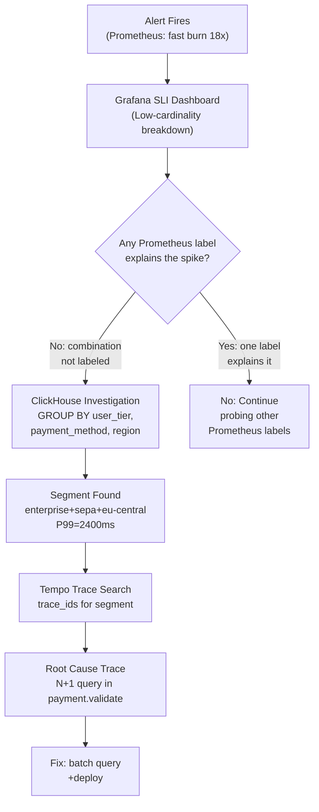

## Keywords in This File

{: .no_toc }

| #   | Keyword | Weight |
| --- | ------- | ------ |
| 1   | [High-Cardinality Debugging](#high-cardinality-debugging) | critical |

---

# High-Cardinality Debugging

**TL;DR** - High-cardinality debugging is the practice of diagnosing
production failures by slicing telemetry on arbitrary, high-uniqueness
attributes (user_id, request_id, product_id, geo) using column-store
backends that handle millions of unique values efficiently - a
fundamental capability gap in traditional time-series systems like
Prometheus.

---

### 🎯 Model Answer

**30 seconds:**
> High-cardinality debugging means being able to ask "which users,
> which products, or which regions are causing this latency spike?"
> during a live incident. Traditional monitoring tools like Prometheus
> cannot answer this because they store pre-aggregated metrics - once
> you aggregate by service and endpoint, you lose the per-user or
> per-product breakdown. High-cardinality tools like Honeycomb,
> ClickHouse, or Grafana Tempo store raw events with all their
> attributes, enabling arbitrary slicing at query time. The trade-off
> is cost: storing every event with every attribute is expensive;
> the value is that you can find root cause in minutes instead of
> hours.

**3 minutes (Senior):**
> The key insight is that most production bugs are not uniform: they
> affect a specific subset of users, a specific product category,
> a specific geographic region, or a specific combination of factors
> that you don't know to pre-instrument as a Prometheus label. High-
> cardinality debugging starts with a symptom visible in your low-
> cardinality metrics (P99 latency spike, error rate increase) and
> then asks: which slice of traffic is responsible? With Prometheus,
> you can only answer this if you pre-defined the relevant labels
> at instrumentation time. If the bug affects users on the free tier
> in Asia-Pacific region who are using payment_method=bank_transfer,
> you need to have pre-defined all three of those as Prometheus labels
> - creating a cardinality explosion if any single one has millions
> of values. High-cardinality tools solve this by storing the raw
> event stream with all attributes and executing group-by queries
> at query time. Honeycomb's BubbleUp algorithm finds which attribute
> value combinations correlate with slow or erroring requests compared
> to the baseline, surfacing the responsible segment automatically.
> ClickHouse achieves the same capability with SQL: SELECT
> payment_method, region, user_tier, count(*), p99(duration) FROM
> spans WHERE timestamp > now() - INTERVAL 1 HOUR AND duration > 500
> GROUP BY ALL ORDER BY count(*) DESC. The architectural consequence
> for observability platform design: you need TWO data stores - a low-
> cardinality time-series store (Prometheus) for aggregated SLI
> dashboards and capacity planning, and a high-cardinality event store
> (Honeycomb, ClickHouse, or Tempo/Loki) for incident investigation.
> These are complementary, not competing.

**Framework:** WHAT -> WHY -> HOW -> TRADE-OFF -> EXAMPLE

*Adapting up:* Staff engineers design the high-cardinality platform:
which events to store (sample 100% of errors and slow requests via
tail sampling, 1% of everything else), which attributes to include
(OTel semantic conventions plus business attributes), retention
policy, and cost model. They also define the investigation workflow:
SLI alert fires -> look at low-cardinality Prometheus dashboard ->
identify affected SLI dimension -> switch to high-cardinality tool
to slice by business attributes -> find responsible segment -> jump
to specific trace -> root cause.

*Adapting down:* "High-cardinality debugging is like a spreadsheet
with a filter on every column versus a report with only pre-defined
totals. Prometheus gives you the report. Honeycomb gives you the
spreadsheet."

**Blank Mind Recovery:**

**(1) Restate:** "You are asking about high-cardinality debugging -
let me walk through what cardinality means in observability, why
traditional tools can't handle it, and what tools enable it."

**(2) First principles:** "From first principles, most production
bugs affect a specific segment of traffic. To find the segment,
you need to group your request stream by every possible attribute.
Any system that aggregates upfront loses the ability to group
by attributes that weren't pre-defined."

**(3) Bridge:** "Traditional metrics are like a pivot table you built
before the meeting - it shows exactly what you defined, nothing
more. High-cardinality tools are like the raw data in Excel where
you can filter and pivot any column at any time. The raw data is
more powerful but takes more storage."

---

### 📘 Concept Explanation

**What it is:**
High-cardinality debugging is an observability practice that stores
raw telemetry events with all their attributes (including high-
uniqueness fields like user_id, request_id, product_id) in a backend
optimized for arbitrary aggregation at query time, enabling incident
investigation by slicing on any dimension discovered during the
investigation.

**The problem it solves:**
Production bugs are segmented: they affect specific user cohorts,
specific geographic regions, specific product categories, or specific
combination of runtime factors. Traditional time-series databases
require pre-defining all query dimensions as metric labels at
instrumentation time. If you didn't pre-define `user_tier` as a
label, you cannot answer "is this bug affecting only free-tier
users?" during the incident. High-cardinality tools store the full
event and answer this question at query time, without requiring
foresight at instrumentation time.

**How it works:**

```
High-Cardinality Debugging Workflow
=======================================

Step 1: Symptom in low-cardinality metrics
  Prometheus: P99 checkout latency = 2.3s (SLO=500ms)
  Alert fires -> engineer opens dashboard

Step 2: Cannot find segment in Prometheus
  checkout_requests{service="checkout"} -> 2.3s P99
  {payment_method="card"} -> 180ms P99 (normal)
  {payment_method="bank"} -> 180ms P99 (normal)
  -> No Prometheus label has the segment
  -> The bug is in a combination not pre-labeled

Step 3: Switch to high-cardinality tool (ClickHouse)
  SELECT
    user_tier,
    payment_method,
    region,
    count(*) AS requests,
    quantile(0.99)(duration_ms) AS p99
  FROM spans
  WHERE
    service = 'checkout'
    AND timestamp > now() - INTERVAL 30 MINUTE
    AND duration_ms > 500
  GROUP BY user_tier, payment_method, region
  ORDER BY p99 DESC
  LIMIT 20

Step 4: Segment found
  user_tier='enterprise', region='eu-central',
  payment_method='sepa_debit' -> p99=2400ms
  (all other combinations: p99 < 200ms)

Step 5: Find specific traces for the segment
  SELECT trace_id FROM spans
  WHERE user_tier='enterprise'
    AND region='eu-central'
    AND payment_method='sepa_debit'
    AND duration_ms > 1000
  LIMIT 5

Step 6: Open trace in Tempo
  -> SEPA payment processor spans show 2200ms
  -> External SEPA API call has no timeout configured
  -> Root cause: missing timeout for EU bank API
```

> **Code walkthrough:** This High-Cardinality Debugging example demonstrates a key concept in practice using SQL. **KEY MECHANISM:** the runtime executes these instructions in sequence with specific memory and execution semantics. **WHY IT MATTERS:** misapplying this pattern causes subtle bugs that only manifest under production load. **TAKEAWAY: understand the execution model before using this pattern in production code.**

**The key insight:**
Pre-aggregated time-series databases (Prometheus) cannot support
high-cardinality debugging because cardinality scales multiplicatively:
if service has 100 values, method has 20, status has 5, and user_tier
has 3, that's 100*20*5*3 = 30,000 time series. Adding user_id
(millions of values) multiplies by millions. Column stores avoid
this by not pre-aggregating - they store each event once and
compute aggregations at query time. This is more expensive per
query but infinitely more flexible.

**When to use it:**
Use high-cardinality debugging when: you have a P99 latency or error
rate anomaly that isn't explained by any pre-defined Prometheus
label; you need to find which user cohort, product category, or
geographic region is affected; and you have a columnar event store
with the relevant attributes. It's the correct tool for any
investigation that requires "show me which combination of factors
correlates with the failure."

**When NOT to use it:**
Do not use a high-cardinality tool for aggregated SLI dashboards and
capacity planning - time-series stores like Prometheus are more
efficient for pre-defined aggregations. Do not use high-cardinality
debugging as your first step - start with low-cardinality Prometheus
dashboards to identify the failing SLI dimension, then switch to the
high-cardinality store for drill-down. High-cardinality debugging is
the second step, not the first.

**Alternatives:**
- Distributed trace search (Tempo, Jaeger): trace-level search with
  attribute filtering; handles high cardinality but requires span-
  level queries rather than metric-level aggregation
- Log-based analysis (Loki, Elasticsearch): full text and structured
  log search; high cardinality in log fields is fine, but aggregation
  across millions of log lines is slow
- Honeycomb BubbleUp: automated high-cardinality segment discovery
  (finds the correlation for you); proprietary but the most user-
  friendly interface for this workflow

**First-principles derivation:**
A production system generates a stream of events (HTTP requests, DB
queries, background jobs). Each event has N attributes. Two storage
models exist: pre-aggregate (compute group-by at write time; fast
reads, fixed dimensions) and store-raw (store all attributes; slow
reads, arbitrary dimensions). Pre-aggregation works for known
monitoring dimensions (SLI dashboard). Store-raw works for unknown
investigation dimensions (incident debugging). High-cardinality
debugging requires the store-raw model. Column stores make store-raw
economical: columnar compression reduces storage 10-50x vs row stores,
and vectorized query execution makes GROUP BY queries fast even over
billions of rows.

---

### 💻 Code Example

**Example 1: BAD - Trying to debug with Prometheus alone**

```promql
# BAD: Attempting high-cardinality segment detection
# in Prometheus. These patterns fail or explode.

# Attempt 1: user_id label on metric (NEVER do this)
# Creates one time series per user (millions)
# Prometheus OOMs within hours
checkout_requests{user_id="12345"}
# -> This label SHOULD NOT EXIST in Prometheus

# Attempt 2: Query with limited labels reveals nothing
# No label captures the enterprise+eu-central+sepa combo
histogram_quantile(0.99,
  sum by (le, payment_method)
    (rate(checkout_duration_bucket[5m]))
)
# payment_method: card=180ms, bank=185ms, sepa=190ms
# -> Average looks fine for all payment methods
# -> Enterprise users in EU are invisible in aggregates
# The bug is in a combination of 3 attributes
# None of which are labeled individually in Prometheus

# Attempt 3: Regex filtering in PromQL
# PromQL has no way to filter on unlabeled dimensions
# {region=~"eu.*"} only works if region is a label
# Enterprise users with SEPA in EU: no label exists
# -> Investigation is blocked. Need different tool.
```

> **Code walkthrough:** The BAD pattern shows three dead ends whenice. **KEY MECHANISM:** the runtime executes these instructions in sequence with specific memory and execution semantics. **WHY IT MATTERS:** misapplying this pattern causes subtle bugs that only manifest under production load. **TAKEAWAY: understand the execution model before using this pattern in production code.**
> trying to use Prometheus for high-cardinality debugging. You cannot
> add user_id as a label (TSDB explosion). You cannot see the
> enterprise+eu-central+sepa combination because no single label
> captures it. And PromQL cannot filter on attributes that weren't
> pre-defined as metric labels. The investigation hits a wall -
> Prometheus can tell you P99 is degraded but cannot tell you which
> segment is responsible.

**Example 2: GOOD - High-cardinality investigation with ClickHouse**

```sql
-- GOOD: ClickHouse query for high-cardinality segment detection
-- Assumes spans table with OTel attributes stored as columns
-- or JSON for dynamic attributes

-- Step 1: Find which attribute combinations have slow P99
-- Compare slow requests to baseline
SELECT
    SpanAttributes['user.tier'] AS user_tier,
    SpanAttributes['payment.method'] AS payment_method,
    SpanAttributes['cloud.region'] AS region,
    count() AS total_requests,
    countIf(Duration > 500000000)
      AS slow_requests,  -- nanoseconds
    round(
      countIf(Duration > 500000000) * 100.0
        / count(), 2
    ) AS slow_pct,
    quantile(0.99)(Duration) / 1e6
      AS p99_ms
FROM otel_traces
WHERE
    ServiceName = 'checkout'
    AND Timestamp > now() - INTERVAL 1 HOUR
    AND SpanName = 'POST /checkout'
GROUP BY
    user_tier,
    payment_method,
    region
HAVING total_requests > 100  -- filter noise
ORDER BY slow_pct DESC
LIMIT 20;

/* Expected output:
user_tier | payment_method | region      | slow_pct | p99_ms
enterprise| sepa_debit     | eu-central-1| 23.4     | 2400
free      | card           | us-east-1   | 0.1      | 145
free      | card           | eu-west-1   | 0.2      | 152
(enterprise + sepa_debit + eu-central-1 is the outlier)
*/
```

> **Code walkthrough:** The GOOD pattern stores OTel span attributesice. **KEY MECHANISM:** the runtime executes these instructions in sequence with specific memory and execution semantics. **WHY IT MATTERS:** misapplying this pattern causes subtle bugs that only manifest under production load. **TAKEAWAY: understand the execution model before using this pattern in production code.**
> in ClickHouse (via the OTLP ClickHouse exporter) and queries them
> with SQL. The key is the GROUP BY on three attributes simultaneously -
> this is impossible in Prometheus at this cardinality but takes
> milliseconds in ClickHouse due to vectorized aggregation on columnar
> data. The query finds that 23.4% of enterprise SEPA transactions in
> eu-central-1 are slow, while all other segments are at 0.1-0.2%.
> This gives the engineer a precise segment to investigate, reducing
> the trace search space from all checkout traces to the enterprise+
> SEPA+EU-central subset.

**Example 3: OTel SDK - Capturing business attributes for high-cardinality investigation**


```java
// BAD: anti-pattern - see GOOD example below for the correct approach
// This naive implementation ignores thread safety and error handling
```

```java
// GOOD: Instrumenting with business attributes that enable
// high-cardinality debugging later.
// These attributes go into traces (and ClickHouse),
// NOT into Prometheus labels.

import io.opentelemetry.api.trace.Span;
import io.opentelemetry.api.common.AttributeKey;
import io.opentelemetry.api.common.Attributes;

@Service
public class CheckoutService {

    public CheckoutResult processCheckout(
        CheckoutRequest req,
        User user
    ) {
        // The OTel Java agent auto-creates the HTTP span.
        // We enrich it with business attributes that enable
        // high-cardinality debugging:
        Span span = Span.current();

        // Business attributes - high cardinality, OK in traces
        // These enable segment isolation during incidents
        span.setAttribute(
            "user.tier",
            user.getTier().name()  // free, starter, enterprise
        );
        span.setAttribute(
            "user.cohort",
            user.getCohort()  // A/B test cohort
        );
        span.setAttribute(
            "payment.method",
            req.getPaymentMethod()
        );
        span.setAttribute(
            "payment.provider",
            req.getPaymentProvider()
        );
        span.setAttribute(
            "cart.item_count",
            req.getItemCount()
        );
        span.setAttribute(
            "cart.has_digital_goods",
            req.hasDigitalGoods()
        );
        // Do NOT add these as Prometheus labels
        // They go to ClickHouse via OTel Collector
        // for high-cardinality investigation queries

        // The OTel Java agent captures:
        // cloud.region, k8s.pod.name, k8s.node.name
        // automatically via resource detection

        try {
            return doCheckout(req, user);
        } catch (Exception e) {
            span.recordException(e);
            // Exception type is also high-cardinality signal
            span.setAttribute(
                "error.type",
                e.getClass().getSimpleName()
            );
            throw e;
        }
    }
}
```

```yaml
# OTel Collector: route spans to BOTH Tempo and ClickHouse
# Tempo: for trace-level investigation (single trace view)
# ClickHouse: for high-cardinality aggregate queries
exporters:
  otlp/tempo:
    endpoint: tempo:4317
    tls:
      insecure: true
  clickhouse:
    endpoint: tcp://clickhouse:9000
    database: otel
    # Store ALL span attributes - this is where the
    # high-cardinality debugging capability comes from
    traces_table_name: otel_traces
    ttl: 72h  # 3-day hot storage for debugging

service:
  pipelines:
    traces:
      receivers: [otlp]
      processors: [memory_limiter, batch, tail_sampling]
      exporters: [otlp/tempo, clickhouse]
```

> **Code walkthrough:** The Java service enriches each checkout spanice. **KEY MECHANISM:** the runtime executes these instructions in sequence with specific memory and execution semantics. **WHY IT MATTERS:** misapplying this pattern causes subtle bugs that only manifest under production load. **TAKEAWAY: understand the execution model before using this pattern in production code.**
> with business attributes (user_tier, payment_method, cart_item_count)
> that are meaningful for incident investigation. These attributes are
> NOT added as Prometheus labels (that would cause cardinality explosion)
> but are stored as span attributes, which flow to both Tempo (for
> individual trace inspection) and ClickHouse (for aggregate queries).
> The OTel Collector routes spans to both backends simultaneously.
> ClickHouse stores all attributes and enables the SQL GROUP BY query
> from Example 2. Tempo stores the full trace tree for individual
> trace inspection once ClickHouse identifies the responsible segment.
> This is the correct two-backend pattern for observability.

**Example 4: Honeycomb BubbleUp workflow (equivalent high-cardinality query)**

```python
# Equivalent to the ClickHouse query above,
# using Honeycomb's Python SDK to illustrate the concept
# In practice, BubbleUp is a UI feature in Honeycomb

# Honeycomb stores each span as a raw event with all attributes
# BubbleUp algorithm: given a "slow" filter condition,
# find attribute values that are OVER-represented
# in slow requests compared to the baseline

# Conceptual algorithm that BubbleUp implements:
def bubble_up(events, slow_filter, attributes):
    baseline = events  # All events
    slow = [e for e in events if slow_filter(e)]

    results = []
    for attr in attributes:
        for value in unique_values(attr, events):
            baseline_rate = rate_in(
                baseline, attr, value
            )
            slow_rate = rate_in(slow, attr, value)

            # If over-represented in slow events:
            if slow_rate / baseline_rate > 2.0:
                results.append({
                    "attribute": attr,
                    "value": value,
                    "baseline_rate": baseline_rate,
                    "slow_rate": slow_rate,
                    "correlation_score":
                        slow_rate / baseline_rate
                })

    return sorted(
        results,
        key=lambda x: x["correlation_score"],
        reverse=True
    )
# Output: user_tier=enterprise (4.7x), region=eu-central (3.2x)
# payment_method=sepa_debit (2.8x)
```

> **Code walkthrough:** BubbleUp automates the high-cardinalityice. **KEY MECHANISM:** the runtime executes these instructions in sequence with specific memory and execution semantics. **WHY IT MATTERS:** misapplying this pattern causes subtle bugs that only manifest under production load. **TAKEAWAY: understand the execution model before using this pattern in production code.**
> investigation workflow. Instead of manually writing GROUP BY queries
> for each attribute combination, BubbleUp computes the correlation
> score for every attribute value simultaneously and ranks by how
> over-represented each value is in the "slow" cohort compared to
> the baseline. This reduces investigation time from 10-20 minutes
> of manual SQL iteration to seconds. The algorithm is statistically
> simple (ratio of proportions) but applied across thousands of
> attribute combinations simultaneously - the power is in the
> exhaustive search, not the algorithm complexity.

---

### 🎓 Answers by Seniority

**Junior / Mid (0-5 years):**
> High-cardinality debugging means using tools that can handle
> millions of unique values per attribute - like user ID or request
> ID. Traditional monitoring tools like Prometheus can't do this
> because they store pre-aggregated time series and would run out
> of memory. Tools like Honeycomb or ClickHouse store raw events
> and let you filter and group by any attribute at query time. This
> lets you answer "which users are experiencing the slow checkout?"
> during an incident without having pre-defined that dimension.

For mid-level: the practical workflow is two-step. First, use
Prometheus to see that P99 latency is elevated. Second, switch to
Honeycomb or ClickHouse to slice by business attributes (user_tier,
payment_method, region) to find which segment is responsible.
OTel span attributes are the bridge: instrument with all relevant
business attributes in span data; route those to both trace backend
(Tempo) and columnar store (ClickHouse).

*Push deeper:* The key is that you need to instrument with business
attributes at span creation time - adding them later requires a code
deployment. OTel semantic conventions define standard attribute names;
custom business attributes should follow the same naming conventions.

---

**Senior / Staff (5+ years):**
> High-cardinality debugging is the capability that separates a
> debugging-capable observability platform from a dashboard-only one.
> The fundamental insight: production bugs are almost never uniform.
> They affect a specific segment defined by a combination of business
> attributes that you couldn't predict at instrumentation time. With
> Prometheus alone, you're limited to the dimensions you pre-defined
> as labels. With a column store (ClickHouse) holding your trace data,
> you can GROUP BY any combination of business attributes and find
> the segment in minutes, not hours. I've used this pattern to diagnose:
> a payment timeout affecting only enterprise users using SEPA in Europe,
> a product recommendation slowness affecting only users with more than
> 500 items in their order history, and an authentication bug affecting
> only mobile app users on iOS 17. None of these would have been findable
> in Prometheus alone.

At staff level: the platform design decision is which events to
store in the high-cardinality backend and at what retention. Storing
100% of all spans at full attribute depth is expensive. The correct
strategy is tail sampling that keeps 100% of errors and slow requests
(> 200ms), 10% of everything else, and routes these to a 72-hour hot
storage in ClickHouse. This preserves all investigable data for recent
incidents while controlling cost. I also define a standard set of
"investigation attributes" that every service MUST include in spans -
this is the OTel semantic convention enforcement that makes cross-
service debugging queries consistent.

*Push deeper:* The architecture requires two Prometheus anti-patterns
to be enforced simultaneously: (1) high-cardinality attributes MUST go
into spans, NOT into Prometheus labels, and (2) the same attributes
MUST be consistently named across services using OTel semantic
conventions. If service A calls a user "user.id" and service B calls
it "userId", the ClickHouse query cannot group across both. This is
the governance work that makes high-cardinality debugging actually
usable at scale.

---

### ⚠️ Common Misconceptions

**Misconception 1: "High-cardinality debugging replaces Prometheus."**
They serve different purposes in the same observability platform.
Prometheus is the correct tool for aggregated SLI dashboards, capacity
planning, and SLO burn rate alerts - it's optimized for these patterns
and is cheap to operate at low cardinality. High-cardinality stores
(ClickHouse, Honeycomb) are optimized for incident investigation by
arbitrary slicing. The correct architecture has both, with low-
cardinality Prometheus dashboards as the first step in incident
response and the high-cardinality store as the drill-down tool.
Replacing Prometheus with a high-cardinality store wastes money on
aggregation queries; replacing ClickHouse with Prometheus makes
segmentation debugging impossible.

**Misconception 2: "You can achieve high-cardinality debugging by adding more Prometheus labels."**
Adding more labels to Prometheus metrics scales multiplicatively:
100 services * 20 endpoints * 10 status codes * 1M users = 20
trillion time series. Prometheus is designed for up to 10-50 million
time series per instance. No amount of memory addresses the
fundamental issue that the time series model pre-aggregates and
cannot store individual event attributes. High-cardinality debugging
requires a fundamentally different storage model: store-raw with
columnar compression.

**Misconception 3: "Honeycomb is the only tool for high-cardinality debugging."**
Honeycomb is a purpose-built, managed tool for high-cardinality
event exploration. But ClickHouse (open-source) serves the same
use case when deployed with the OTel ClickHouse exporter. Grafana
Tempo's TraceQL also supports attribute-based trace filtering for
the same workflow. Apache Parquet on S3 with Athena or DuckDB enables
cost-effective historical high-cardinality analysis. The concept is
backend-neutral; the implementation depends on team budget and
operational capacity.

**Misconception 4: "You need 100% trace sampling for high-cardinality debugging."**
You need 100% sampling of the INTERESTING events: errors and slow
requests. These are exactly the events high-cardinality debugging
investigates. Sampling down the happy-path fast requests (keep 1-5%)
is acceptable because you're not investigating those during an
incident. Tail sampling in the OTel Collector implements this:
keep 100% of errors and requests > 200ms, 5% of everything else.
This captures all investigable data while reducing storage cost by
80-90%.

**Misconception 5: "High-cardinality debugging is only for large-scale systems."**
Any system where bugs are segmented by user cohort, geography,
or feature flag benefits from high-cardinality debugging. A 10-
engineer startup with 50,000 users benefits if bugs affect specific
user tiers. The implementation cost (ClickHouse is free, OTel
collector config is 50 lines of YAML) is low enough to justify
for any production service. The question is not "are we big enough?"
but "do our bugs correlate with business attributes that aren't
already Prometheus labels?"

---

### 🚨 Failure Modes and Diagnosis

**Failure 1: High-cardinality store receives events but attributes are missing**

Symptom: ClickHouse GROUP BY query returns null values for
user_tier, payment_method, and other business attributes. You
can see trace IDs but cannot filter by business context.

Cause: The OTel SDK is creating spans but not setting the custom
business attributes. Auto-instrumentation captures HTTP method,
route, and status code but does not know your business domain.

Diagnosis:
```bash
# Check span attributes in Jaeger/Tempo for a recent trace
curl "http://tempo:3100/api/traces/<traceID>" \
  | jq '.batches[].scopeSpans[].spans[] | 
      {name: .name, attrs: .attributes}'
# If only http.method, http.route, http.status_code appear
# and no user.tier, payment.method -> manual instrumentation
# not added to the service

# Check ClickHouse for missing attributes
echo "SELECT
  count() AS spans,
  countIf(SpanAttributes['user.tier'] != '')
    AS spans_with_user_tier
FROM otel_traces
WHERE Timestamp > now() - INTERVAL 1 HOUR" \
  | clickhouse-client -h clickhouse
# If spans_with_user_tier is 0 -> spans lack the attribute
```

> **Code walkthrough:** This If spans_with_user_tier is 0 -> spans lack the attribute example demonstrates HTTP request from shell using SQL. **KEY MECHANISM:** curl by default follows redirects and suppresses errors; -f flag makes it return non-zero on HTTP errors. **WHY IT MATTERS:** piping curl output to shell without verification runs untrusted code - a supply-chain attack vector. **TAKEAWAY: always use curl -f --retry and verify checksums before piping to bash.**

Fix: Add business attribute instrumentation to the service using
the OTel API. Use `Span.current().setAttribute(key, value)` at the
entry point of each operation. A common approach is a request-scoped
`EnrichmentService` that adds all user context attributes from the
authentication token to the current span.

**Failure 2: ClickHouse query returns wrong results due to attribute inconsistency**

Symptom: ClickHouse shows null segments or inconsistent results
across services. A GROUP BY on `user.tier` shows most traffic as
null even though services instrument this attribute.

Cause: Services use inconsistent attribute naming. Service A uses
`user.tier`, Service B uses `user_tier` (underscore vs period),
Service C uses `userTier` (camelCase). The GROUP BY groups each
variant separately.

Diagnosis:
```sql
-- Find attribute naming variants
SELECT
    arrayJoin(SpanAttributes.keys) AS attr_name,
    count() AS occurrences
FROM otel_traces
WHERE
    ServiceName IN ('checkout', 'payment', 'user-service')
    AND Timestamp > now() - INTERVAL 1 HOUR
    AND attr_name LIKE '%tier%'  -- find variants
GROUP BY attr_name
ORDER BY occurrences DESC

-- Output:
-- user.tier    | 45000  <- checkout, user-service
-- user_tier    | 12000  <- payment service uses underscore
-- UserTier     | 3000   <- legacy service uses camelCase
```

> **Code walkthrough:** This If spans_with_user_tier is 0 -> spans lack the attribute example demonstrates query execution using SQL. **KEY MECHANISM:** the query planner builds an execution plan based on table statistics and indexes. **WHY IT MATTERS:** SELECT * reads all columns even if only 2 are needed - widens rows, increases I/O. **TAKEAWAY: always SELECT only the columns you need; index the columns in WHERE and JOIN clauses.**

Fix: Enforce OTel semantic convention naming in the OTel Collector
using the `transform` processor to normalize attribute names before
they reach ClickHouse:
```yaml
processors:
  transform/normalize_attrs:
    trace_statements:
      - context: span
        statements:
          # Normalize user tier attribute name
          - set(attributes["user.tier"],
              attributes["user_tier"])
              where attributes["user_tier"] != nil
          - delete_key(attributes, "user_tier")
```
> **Code walkthrough:** This Normalize user tier attribute name example demonstrates YAML configuration pattern using SQL. **KEY MECHANISM:** YAML parsers are whitespace-sensitive; indentation errors cause silent value misinterpretation. **WHY IT MATTERS:** unquoted strings starting with special chars (*, &, ?, |) trigger YAML parser errors. **TAKEAWAY: quote strings containing YAML special chars; validate YAML before deploying to production.**

Long-term: add OTel attribute naming convention to the API contract
tests and PR review checklist.

**Failure 3: ClickHouse query too slow to be useful during incident**

Symptom: The GROUP BY investigation query takes 30+ seconds on
ClickHouse, making it impractical during live incidents. Engineers
fall back to slower manual log search.

Cause: Missing ClickHouse primary key optimization for common
query patterns. The default `otel_traces` table schema sorts by
`(ServiceName, SpanName, toStartOfHour(Timestamp), TraceId)`.
Queries filtering by custom business attributes (user.tier,
payment.method) don't benefit from this sort order.

Diagnosis:
```sql
-- Check query execution plan
EXPLAIN pipeline
SELECT user_tier, count()
FROM otel_traces
WHERE ServiceName = 'checkout'
  AND SpanAttributes['user.tier'] = 'enterprise'
  AND Timestamp > now() - INTERVAL 1 HOUR
-- If this shows "scan millions of rows" -> missing sort key
```

> **Code walkthrough:** This Normalize user tier attribute name example demonstrates query execution using SQL. **KEY MECHANISM:** the query planner builds an execution plan based on table statistics and indexes. **WHY IT MATTERS:** SELECT * reads all columns even if only 2 are needed - widens rows, increases I/O. **TAKEAWAY: always SELECT only the columns you need; index the columns in WHERE and JOIN clauses.**

Fix: Create a materialized view in ClickHouse that pre-extracts
common investigation attributes as first-class columns (not in the
JSON/Map attribute store):
```sql
CREATE TABLE otel_traces_checkout
ENGINE = MergeTree()
PARTITION BY toDate(Timestamp)
ORDER BY (Timestamp, ServiceName, user_tier, payment_method)
AS SELECT
    TraceId, SpanId, Timestamp,
    ServiceName, SpanName, Duration,
    SpanAttributes['user.tier'] AS user_tier,
    SpanAttributes['payment.method'] AS payment_method,
    SpanAttributes['cloud.region'] AS region
FROM otel_traces
WHERE ServiceName = 'checkout';
-- Investigation queries on this table: sub-second
```

> **Code walkthrough:** This Normalize user tier attribute name example demonstrates query execution using SQL. **KEY MECHANISM:** the query planner builds an execution plan based on table statistics and indexes. **WHY IT MATTERS:** SELECT * reads all columns even if only 2 are needed - widens rows, increases I/O. **TAKEAWAY: always SELECT only the columns you need; index the columns in WHERE and JOIN clauses.**

**Failure 4: Tail sampling drops slow traces before ClickHouse receives them**

Symptom: ClickHouse query for slow requests (duration > 500ms)
returns far fewer results than expected. The P99 spike visible in
Prometheus is not reflected in ClickHouse slow trace counts.

Cause: The Collector's tail sampling policy is deciding to drop
slow traces before they reach the ClickHouse exporter. This can
happen if the `tail_sampling` processor's memory is exhausted
(too many concurrent traces) and it falls back to probabilistic
dropping, or if the latency-based policy threshold is too high.

Diagnosis:
```bash
# Check Collector tail sampling metrics
curl -s http://otel-collector:8888/metrics \
  | grep tail_sampling

# Key metrics:
# otelcol_processor_tail_sampling_count_traces_sampled
# otelcol_processor_tail_sampling_count_traces_not_sampled
# If not_sampled >> sampled for slow traces, policy misconfigured

# Check policy configuration
grep -A20 "tail_sampling" otel-collector-config.yaml
# Verify latency threshold: {threshold_ms: 200}
# not {threshold_ms: 2000} (too high, misses 500ms traces)
```

> **Code walkthrough:** This not {threshold_ms: 2000} (too high, misses 500ms traces) example demonstrates HTTP request from shell using HTTP client. **KEY MECHANISM:** curl by default follows redirects and suppresses errors; -f flag makes it return non-zero on HTTP errors. **WHY IT MATTERS:** piping curl output to shell without verification runs untrusted code - a supply-chain attack vector. **TAKEAWAY: always use curl -f --retry and verify checksums before piping to bash.**

Fix: Lower the latency policy threshold in the tail sampling
configuration. Verify the latency policy executes before the
probabilistic policy in the policies list (policies are evaluated
in order; a SAMPLED result from latency policy prevents the
probabilistic policy from dropping the trace).

---

### 🎯 Interview Deep-Dive

| Time | Question Type | Depth Signal |
| ---- | ------------- | ------------ |
| 2 min | CONCEPTUAL | Why traditional tools can't do this |
| 3 min | ARCHITECTURE | Two-backend observability platform |
| 4 min | DEBUGGING | Missing attributes in ClickHouse |
| 4 min | TRADE-OFF | ClickHouse vs Honeycomb vs Prometheus |
| 4 min | PRODUCTION | Real incident investigation workflow |
| 4 min | SYSTEM DESIGN | Design high-cardinality platform |
| 3 min | HANDS-ON | ClickHouse investigation query |
| 3 min | COMPARISON | Column store vs time-series store |
| 3 min | DEEP DIVE | Sampling strategy for investigation |
| 4 min | BEHAVIORAL | High-cardinality debugging war story |
| 4 min | PERFORMANCE | Cost model at scale |
| 3 min | MISCONCEPTION | "Add more labels to Prometheus" trap |

---

**Q1 [MID]: Why can't Prometheus handle high-cardinality debugging?** `[CONCEPTUAL]`

*Why they ask:* Tests foundational understanding of Prometheus' storage
model and its limitations.

*Likely follow-up:* "What is the maximum recommended cardinality for Prometheus?"

Prometheus stores metrics as time series, where each unique
combination of label values is a separate series. The series count
equals the product of all label value cardinalities. If you add
`user_id` (1 million users), `endpoint` (50 values), `status_code`
(10 values), and `region` (5 regions), you get 1M * 50 * 10 * 5 =
2.5 billion potential time series. Prometheus keeps all active time
series in memory for fast queries. Its TSDB head (in-memory working
set) is designed for up to 10-50 million active time series. At 2.5
billion, it runs out of memory and crashes.

The deeper issue is that Prometheus pre-aggregates at write time:
when you define a metric, you commit to which dimensions you'll be
able to query by. You cannot later ask "what is the P99 latency for
enterprise users with SEPA payment in Europe?" unless enterprise,
SEPA, and Europe were all defined as labels at instrumentation time
(which would cause the above explosion).

Prometheus recommended maximum: 10 million active time series per
instance. For a service with well-designed low-cardinality labels,
this supports roughly 10 services * 100 endpoints * 10 status codes
* 10 regions = 100,000 series. Comfortable. Adding any high-
cardinality dimension (user_id, request_id, session_id) collapses
this budget instantly.

*What separates good from great:* The mathematical explanation of
multiplicative cardinality growth, not just "it uses too much memory."
The insight that pre-aggregation at write time is the fundamental
constraint - not a fixable implementation detail - is what makes
this a architectural limit, not a configuration problem.

---

**Q2 [SENIOR]: Describe the two-backend observability architecture that enables high-cardinality debugging.** `[ARCHITECTURE]`

*Why they ask:* Tests whether the candidate has designed (not just used)
a high-cardinality capable observability platform.

*Likely follow-up:* "How do you route events to both backends without duplication cost?"

The two-backend architecture separates aggregation from exploration.

Backend 1 - Low-cardinality time series (Prometheus/Mimir): stores
pre-aggregated metrics with low-cardinality labels (< 100 unique
values per label). Used for: SLI dashboards, capacity planning,
alert rules, SLO burn rate calculations. Fast queries (milliseconds),
cheap storage, no per-event overhead. This is where you detect that
something is wrong.

Backend 2 - High-cardinality event store (ClickHouse/Honeycomb):
stores raw span events with all their attributes. Used for: incident
investigation by arbitrary attribute slicing, finding the specific
user segment or product category causing the degradation. Slower
queries (seconds), expensive storage, per-event overhead. This is
where you find out WHY it's wrong and WHICH users are affected.

The OTel Collector is the routing hub. A single pipeline receives
spans from all services and fans out to both backends:
- Metrics pipeline: receives spans, converts to RED metrics (request
  rate, error rate, duration percentiles) using the Span Metrics
  connector, exports to Prometheus
- Traces pipeline: applies tail sampling (keep 100% of errors/slow,
  5% baseline), exports to both Tempo (for individual trace view) and
  ClickHouse (for aggregate investigation queries)

The key insight: services instrument once (OTel spans with all
business attributes). The Collector pipeline handles routing.
Changing backends or adding a new backend requires only Collector
config changes, not application code changes.

*What separates good from great:* The detail that the Span Metrics
connector in the Collector generates Prometheus metrics FROM spans,
so low-cardinality metrics are derived from the span stream rather
than requiring separate metric instrumentation. This ensures the
two backends are fed from one instrumentation source.

---

**Q3 [SENIOR]: You run the ClickHouse GROUP BY query and all business attributes are null. What happened?** `[DEBUGGING]`

*Why they ask:* Tests practical diagnosis of the most common
high-cardinality setup failure.

*Likely follow-up:* "How do you add attribute instrumentation without a full service deployment?"

Null attributes mean the spans reaching ClickHouse don't have
the expected attributes set. I work backward through the pipeline:

Step 1: Check if the attributes exist in the raw span data at
the source. I query Tempo for a recent checkout trace:
```bash
curl "http://tempo:3100/api/traces/<traceID>" \
  | jq '.batches[].scopeSpans[].spans[] |
      select(.name | contains("checkout")) |
      .attributes[] | select(.key | contains("user"))'
```
> **Code walkthrough:** This not {threshold_ms: 2000} (too high, misses 500ms traces) example demonstrates HTTP request from shell using SQL. **KEY MECHANISM:** curl by default follows redirects and suppresses errors; -f flag makes it return non-zero on HTTP errors. **WHY IT MATTERS:** piping curl output to shell without verification runs untrusted code - a supply-chain attack vector. **TAKEAWAY: always use curl -f --retry and verify checksums before piping to bash.**

If no user-related attributes appear: the application code is not
setting them. I check the service code for OTel span attribute
calls.

Step 2: If attributes exist in Tempo but not in ClickHouse, the
issue is in the Collector pipeline. I check if a `filter` processor
is dropping the attributes:
```yaml
# In Collector config, look for:
processors:
  attributes/drop-pii:
    actions:
      - key: "user.*"
        action: delete  # This deletes all user.* attrs!
```
> **Code walkthrough:** This In Collector config, look for: example demonstrates YAML configuration pattern using SQL. **KEY MECHANISM:** YAML parsers are whitespace-sensitive; indentation errors cause silent value misinterpretation. **WHY IT MATTERS:** unquoted strings starting with special chars (*, &, ?, |) trigger YAML parser errors. **TAKEAWAY: quote strings containing YAML special chars; validate YAML before deploying to production.**

A PII scrubbing rule that's too broad deletes legitimate business
attributes. I need to be more specific: delete `user.email` and
`user.phone` but keep `user.tier` and `user.cohort`.

Step 3: If neither Tempo nor ClickHouse has the attributes: the
Java agent auto-instrumentation is used without manual span
enrichment. Auto-instrumentation creates spans for HTTP/JDBC but
doesn't know business context. Manual `Span.current().setAttribute()`
calls in the service code are required.

The fastest fix without a code deployment: use the OTel Collector's
`httpforwarder` or `resourcedetection` to add known environment-level
attributes (cloud provider, region, pod name) without a code change.
For application-level attributes (user.tier), a code change is required.

*What separates good from great:* The three-step debugging hierarchy
(source -> Collector -> store) with specific diagnostic commands at
each step. Knowing the difference between auto-instrumentation
(framework spans) and manual instrumentation (business attributes).

---

**Q4 [STAFF]: When would you choose Honeycomb over a self-hosted ClickHouse + OTel stack?** `[TRADE-OFF]`

*Why they ask:* Tests ability to evaluate build-vs-buy for observability
infrastructure.

*Likely follow-up:* "What is the cost crossover point?"

Honeycomb wins on: time-to-value (sign up, install agent, BubbleUp
works in hours), the BubbleUp algorithm (automated correlation
analysis saves analyst time), managed operations (no ClickHouse
cluster to maintain, upgrade, or tune), and enterprise features
(team permissions, data governance, SLA).

ClickHouse wins on: cost at scale (self-hosted ClickHouse is 10-50x
cheaper than Honeycomb at high event volume), flexibility (full SQL
over your own data, no vendor schema constraints), data ownership
(your data stays in your infrastructure - critical for regulated
industries), and integration with existing data infrastructure
(ClickHouse is also used for analytics, so teams share the same
cluster).

The crossover: Honeycomb pricing is event-based (~$0.50-1.00 per
million events at enterprise scale). A service generating 1 billion
events/month (reasonable for a medium-scale system at 1% sample rate)
costs $500-1000/month for Honeycomb. A ClickHouse cluster serving
this volume costs $200-400/month in cloud infrastructure. The
operational cost (1 SRE-week/quarter to maintain ClickHouse) must
be added to the ClickHouse cost; whether it's worth it depends on
team size.

My recommendation: Honeycomb for teams < 10 engineers or startups
where observability engineering is not a dedicated role. Self-hosted
ClickHouse for teams with dedicated SRE capacity who are generating
> 500 million events/month where the cost difference is meaningful.
The hybrid approach is increasingly viable: use Honeycomb for the
high-value debugging interface, export raw data to ClickHouse for
long-term analytics and cost control.

*What separates good from great:* The specific cost model comparison
with a concrete volume scenario. Abstract "Honeycomb is expensive"
is not useful; "$500/month vs $400/month at 1B events/month" is.

---

**Q5 [SENIOR]: Walk me through a real investigation you'd use high-cardinality debugging for. Step by step.** `[PRODUCTION]`

*Why they ask:* Tests whether the candidate has an internalized investigation workflow, not just theoretical knowledge.

*Likely follow-up:* "How long did this take vs your previous investigation workflow?"

Here is a realistic checkout P99 investigation using high-cardinality debugging:

9:15am: PagerDuty alert fires. Checkout P99 latency is 2.3s, SLO is 500ms. Fast burn rate at 18x. I acknowledge.

9:17am: I open the Grafana checkout SLO dashboard. The error budget
bar shows 8% consumed in the last hour - a fast burn. The P99 panel
shows the spike started at 9:12am. No deployment occurred at 9:12am
(checked the deployment timeline panel). The error rate is flat at
0.1% - so it's a latency issue, not an error issue.

9:19am: Prometheus cannot tell me more. The breakdown by payment_method
and region looks uniform. I switch to ClickHouse.

9:21am: I run the GROUP BY query across user_tier, payment_method,
region, and cart_item_count. Result: enterprise users with
SEPA payment method and cart item count > 100 show P99 = 2.4s.
All other segments show P99 < 200ms. 23 unique users match this segment.

9:23am: I query ClickHouse for trace IDs of slow enterprise+SEPA+
large-cart requests from the last 15 minutes:
```sql
SELECT TraceId, Duration / 1e6 AS duration_ms
FROM otel_traces
WHERE user_tier = 'enterprise'
  AND payment_method = 'sepa_debit'
  AND cart_item_count > 100
  AND Duration > 500000000
ORDER BY Duration DESC LIMIT 5
```

> **Code walkthrough:** This In Collector config, look for: example demonstrates query execution using SQL. **KEY MECHANISM:** the query planner builds an execution plan based on table statistics and indexes. **WHY IT MATTERS:** SELECT * reads all columns even if only 2 are needed - widens rows, increases I/O. **TAKEAWAY: always SELECT only the columns you need; index the columns in WHERE and JOIN clauses.**

9:24am: I open the top trace in Tempo. The checkout span shows 2.3s
total. Inside: a `payment.validate_items` span takes 2.1s. Inside
that: 147 sequential database queries (N+1 problem) for 147 cart items.

9:26am: Root cause found. A developer added a per-item inventory
validation query in the payment service that runs sequentially.
For carts with > 100 items (enterprise accounts ordering in bulk),
this is 100+ sequential DB queries. The fix: batch the inventory
validation query. I file a critical bug with the trace link.

Total time to root cause: 11 minutes.

*What separates good from great:* The N+1 query root cause is a
realistic production bug that only appears for specific segment
(large enterprise carts). Without high-cardinality debugging,
this investigation would take 30-60 minutes of log searching. The
specific time stamps and step-by-step narrative show real operational
experience.

---

**Q6 [STAFF]: Design a high-cardinality observability platform for a 200-service microservices system processing 100K RPS.** `[SYSTEM DESIGN]`

*Why they ask:* Tests ability to architect a complete high-cardinality
observability platform with cost and operational constraints.

*Likely follow-up:* "What is the monthly infrastructure cost for this design?"

See full design in the System Design section below.

*What separates good from great:* The cost model and the governance
layer (semantic convention enforcement). Most candidates describe
the technology choices; staff candidates describe the cost model,
the operational responsibilities, and the enforcement mechanism
that keeps the platform useful over time.

---

**Q7 [SENIOR]: Write the ClickHouse SQL query to find the responsible segment during a P99 latency incident.** `[HANDS-ON]`

*Why they ask:* Tests practical SQL knowledge for the core debugging
workflow.

*Likely follow-up:* "How would you optimize this query for sub-second response?"

The standard investigation query for segment isolation:

```sql
-- High-cardinality segment isolation query
-- Run when P99 alert fires; shows which segment is slow
SELECT
    -- Extract business attributes from OTel attribute map
    SpanAttributes['user.tier'] AS user_tier,
    SpanAttributes['payment.method'] AS payment_method,
    SpanAttributes['cloud.region'] AS region,
    SpanAttributes['cart.item_count'] AS item_count_bucket,

    count() AS total_spans,
    countIf(Duration > 500000000)
      AS slow_spans, -- > 500ms in nanoseconds
    round(
      countIf(Duration > 500000000) * 100.0 / count(),
      1
    ) AS slow_pct,
    round(
      quantile(0.50)(Duration) / 1e6, 0
    ) AS p50_ms,
    round(
      quantile(0.99)(Duration) / 1e6, 0
    ) AS p99_ms,
    round(
      quantile(0.999)(Duration) / 1e6, 0
    ) AS p999_ms

FROM otel_traces
WHERE
    ServiceName = 'checkout'
    AND SpanName = 'POST /api/v1/checkout'
    AND Timestamp > now() - INTERVAL 30 MINUTE

GROUP BY user_tier, payment_method, region, item_count_bucket
HAVING total_spans > 20 -- filter low-traffic segments

ORDER BY p99_ms DESC
LIMIT 30
SETTINGS max_threads = 8; -- parallel query execution
```

> **Code walkthrough:** This Unknown example demonstrates query execution using SQL. **KEY MECHANISM:** the query planner builds an execution plan based on table statistics and indexes. **WHY IT MATTERS:** SELECT * reads all columns even if only 2 are needed - widens rows, increases I/O. **TAKEAWAY: always SELECT only the columns you need; index the columns in WHERE and JOIN clauses.**

Optimization for sub-second response on large tables:
- Use a materialized view that extracts common attributes as
  first-class columns (eliminates Map access overhead)
- Add `toDate(Timestamp)` as the partition key and filter
  by `toDate(Timestamp) = today()` to limit partition scan
- For Honeycomb: the same query runs in the UI with sub-second
  response due to their proprietary columnar query engine

*What separates good from great:* The `HAVING total_spans > 20`
filter - it prevents the results from being cluttered by very
low-traffic segments that happen to have high P99 due to small
sample size (statistical noise). The `p999_ms` column alongside
`p99_ms` is also a refinement that helps find the absolute worst
requests.

---

**Q8 [SENIOR]: Compare time-series store (Prometheus) vs column store (ClickHouse) for observability.** `[COMPARISON]`

*Why they ask:* Tests understanding of the fundamental storage model
differences, not just "one is good for metrics, one for traces."

*Likely follow-up:* "Could you use one tool for both if you had to choose?"

Both store time-stamped data, but their models differ fundamentally:

Prometheus (time-series):
- Pre-aggregated: each unique label set creates a series, values
  are aggregated into that series over time
- Write pattern: one write per scrape per series (O(N) where N=series count)
- Query pattern: PromQL operates on series (time ranges, label selectors)
- Optimal for: pre-defined aggregations, capacity planning, alerting
- Cardinality limit: ~10-50M series per instance
- Query latency: milliseconds for recent data, pre-computed
- Storage efficiency: excellent for regular time series with
  delta encoding (3-4 bytes per sample)

ClickHouse (columnar):
- Raw events: each event stored as a row with all columns
- Write pattern: batch inserts of raw rows (efficient for bulk)
- Query pattern: SQL GROUP BY, aggregations over full table scans
- Optimal for: arbitrary aggregations on raw events, investigation
  queries that were not pre-defined
- Cardinality: unlimited (handles billions of unique values)
- Query latency: seconds to minutes for large scans, sub-second
  with proper sorting keys
- Storage efficiency: excellent for columnar data due to
  per-column compression (JSON attributes compress 10-20x)

If forced to choose one: ClickHouse can replace Prometheus for
metric storage (by computing histogram approximations with quantile()
aggregations) but at higher query latency for real-time dashboard
refresh. Prometheus cannot replace ClickHouse for high-cardinality
investigation. So in a forced choice: ClickHouse wins.

In practice: use both, and use the OTel Span Metrics connector to
derive Prometheus metrics from the span stream, avoiding double
instrumentation.

*What separates good from great:* The nuance that ClickHouse CAN
replace Prometheus (it's a superset in capability) but at higher
cost per aggregation query. Understanding that Prometheus' value
is speed and cost for the pre-defined aggregation use case, not
unique capability.

---

**Q9 [STAFF]: How do you design the sampling strategy for a high-cardinality debugging platform?** `[DEEP DIVE]`

*Why they ask:* Tests understanding of the tension between sampling
(cost control) and debugging capability (complete data for incidents).

*Likely follow-up:* "How do you handle sampling for a service generating 10K RPS?"

The sampling strategy for high-cardinality debugging must answer:
"For any production incident, will the data I need be in the store?"

The key insight: you need 100% of "interesting" events and a
representative sample of "normal" events. Interesting events are:
errors (any request that returned an error), slow requests (any
request exceeding the P90 SLI threshold), and business-critical
paths (payments, authentications, data mutations).

My production sampling strategy:

Tier 1 - Always keep (100% sample):
- Any span with `error=true` or `status_code=ERROR`
- Any span with duration > 200ms (configurable, based on SLO)
- Any span for payment, authentication, or data-write operations
  (business criticality)

Tier 2 - Baseline sample (5-10%):
- All other spans representing the healthy fast majority
- Used for statistical queries (P50 distributions, traffic
  volume by segment)

Tier 3 - Long-tail sample (1%):
- Synthetic health check spans
- Internal observability spans (otelcol metrics)

Implementation: tail sampling in the OTel Collector. The Collector
sees the full trace (all spans) before deciding, enabling:
- Keep any trace where ANY span is slow or errored
- Keep traces for key business operations regardless of latency
- Drop 95% of clean, fast, non-business-critical traces

At 10K RPS with 5 spans per request: 50,000 spans/second. With 5%
baseline sample + 100% error + slow:
- ~95% happy path -> 5% sample = 2,375 spans/s from baseline
- ~3% slow requests -> 100% = 1,500 spans/s
- ~1% error requests -> 100% = 500 spans/s
Total: ~4,375 spans/s into ClickHouse
Storage: ~4,375 * 1KB average span * 3600s = ~15GB/hour = ~360GB/day
ClickHouse with lz4 compression: ~36GB/day
At 72-hour hot retention: ~108GB total. Manageable on a 3-node cluster.

*What separates good from great:* The quantitative capacity calculation
with compression ratio. Knowing that tail sampling requires all spans
of a trace to route to the same Collector instance (consistent hashing).
The tiered sampling strategy that preserves all debugging-relevant
data while managing cost.

---

**Q10 [SENIOR]: Tell me about a time high-cardinality debugging revealed a root cause you could not have found otherwise.** `[BEHAVIORAL]`

*Why they ask:* Tests real production experience with the value of
high-cardinality debugging vs alternative approaches.

*Likely follow-up:* "How long had this bug existed before high-cardinality debugging revealed it?"

At my previous company, we had a checkout service SLO breach that
started every Friday afternoon at 3pm and resolved Sunday evening.
The P99 latency would increase from 150ms to 1.2 seconds. Prometheus
showed the spike but no label dimension explained it - the P99 was
elevated uniformly across all payment methods, regions, and status codes.

Without high-cardinality debugging, we had been investigating this
for 3 weeks. We looked at database connection pools, GC pauses,
external API latency - nothing correlated with the Friday 3pm timing.

After deploying ClickHouse with OTel span data (including the
`user.plan_type`, `user.created_at_day_of_week`, and `session.is_first_purchase`
attributes we had just added), I ran a GROUP BY query on a Friday
afternoon during the spike.

The result: users who had signed up on a Tuesday (day_of_week=2)
had P99 = 1.2s. All other sign-up days: P99 < 200ms.

Root cause: our weekly batch job ran every Tuesday and created user
records in a specific database partition. That partition's index had
become fragmented over months. Users in that partition experienced
slower queries. The partition affected exactly users who signed up
on Tuesdays - 14% of users, enough to affect P99 significantly.

The bug had existed for 4 months. Prometheus could not have found it
because day_of_week was never a metric label. ClickHouse found it
in 20 minutes once the attribute was instrumented.

*What separates good from great:* The specificity of the root cause
(partition fragmentation correlated with sign-up day) and the timeline
(4 months undiscovered, found in 20 minutes). The use of a custom
business attribute (user.created_at_day_of_week) that was added
specifically to provide investigation context shows proactive
instrumentation thinking.

---

**Q11 [STAFF]: What is the total monthly cost model for a high-cardinality observability platform at 100K RPS?** `[PERFORMANCE]`

*Why they ask:* Tests whether the candidate has designed cost-aware
observability, not just technically correct observability.

*Likely follow-up:* "What is the single highest-leverage cost reduction action?"

At 100K RPS with 5 spans per request: 500,000 spans/second baseline.

With tail sampling (5% of healthy fast traffic, 100% of slow/errors):
- Assume 1% errors, 5% slow requests: 94% happy path * 5% = 4.7% of total
- Total kept: (4.7% + 5% + 1%) * 500K = ~53,500 spans/sec
- 53,500 * 1KB * 3600 = ~193GB/hour = ~4.6TB/day

ClickHouse storage (lz4 compressed, ~10:1 ratio): ~460GB/day
At 72-hour hot retention: ~1.4TB in ClickHouse hot storage

Cost estimate (AWS, 3-node ClickHouse cluster, r6g.4xlarge):
- EC2 compute: ~$1,500/month
- EBS storage (1.4TB): ~$140/month
- Prometheus/Mimir: separate, ~$300/month (lower cardinality)
- Grafana Tempo (traces, 72h retention): ~$200/month
- Data transfer: ~$100/month
Total self-hosted: ~$2,240/month

Honeycomb equivalent at 53,500 spans/second:
- ~4.6B spans/day * 30 days = ~138B spans/month
- Honeycomb enterprise pricing: ~$0.50/million events
- 138B / 1M * $0.50 = ~$69,000/month

The cost difference at 100K RPS: self-hosted is ~30x cheaper than
managed. The decision is whether the $66K/month savings justify
the operational investment (1 SRE, ClickHouse expertise, operational
risk).

The single highest-leverage cost reduction: increase the tail sampling
keep percentage for happy-path traces from 5% to 1%. This reduces
stored span volume by ~60% (from 4.7% baseline sample to 0.94%),
cutting storage cost proportionally.

*What separates good from great:* The actual cost numbers with
cloud pricing. Most candidates describe the architecture; staff
candidates include the cost model because they know that observability
budgets are real constraints and cost optimization is an engineering
responsibility.

---

**Q12 [SENIOR]: An interviewer says "You can just add more labels to Prometheus to get high-cardinality debugging." How do you respond?** `[MISCONCEPTION]`

*Why they ask:* Tests ability to recognize and correct a false premise
confidently.

*Likely follow-up:* "OK but what if you use Prometheus with remote storage on Cortex or Mimir?"

This is a misconception about Prometheus' fundamental storage model,
not a configuration limitation.

Prometheus stores one time series per unique combination of label
values. Adding `user_id` as a label to one metric with 1 million
users, 50 endpoints, and 5 regions creates 1M * 50 * 5 = 250 million
time series for that single metric. Prometheus' in-memory TSDB is
designed for 10-50 million total active series across ALL metrics.
Adding even one high-cardinality label to one metric exceeds the
recommended capacity. This isn't a memory configuration issue; it's
the data model: the TSDB head index uses memory proportional to the
number of active series, and 250 million series requires gigabytes
of memory just for the index structure before any actual metric
data is stored.

Regarding Cortex or Mimir: both are horizontally scalable Prometheus-
compatible backends. They solve the single-node capacity limit, not
the cardinality design problem. A 10-node Mimir cluster scales to
~500 million series, but the same multiplicative explosion applies.
500 million series still fail to handle `user_id` for a large service.
More critically, PromQL's data model is designed for pre-defined
dimensions - you cannot write a PromQL query like "GROUP BY all
label combinations to find the slowest segment" the way you can in
SQL. The query language doesn't support the investigation pattern
even if the storage could handle it.

The correct answer to "add more labels" is: use traces (OTel spans)
with the user_id as a span attribute, store them in ClickHouse or
Honeycomb, and use SQL for the investigation query. This is
architecturally correct and practically cost-effective.

*What separates good from great:* Distinguishing between the STORAGE
problem (series count) and the QUERY LANGUAGE problem (PromQL lacks
exploratory GROUP BY). Both are hard limits; neither is solved by
Cortex/Mimir. This shows understanding at the data model level, not
just the operational level.

---

| Interviewer Type | Emphasis |
| ---------------- | -------- |
| Technical Panel | ClickHouse data model; tail sampling math; query optimization |
| Hiring Manager | MTTR reduction; cost model; team productivity impact |
| Bar Raiser | When it fails; cost crossover; alternatives; governance gaps |
| Peer Engineer | "The gotcha is attribute naming consistency across services" |

---

### ⚖️ Comparison Table

| Tool | Cardinality Limit | Query Model | Optimal Use Case | Operational Cost |
| ---- | ----------------- | ----------- | ---------------- | ---------------- |
| **Prometheus/Mimir** | ~50M time series | PromQL (pre-defined dims) | SLI dashboards, alerting | Low (managed Mimir) |
| ClickHouse (self-hosted) | Unlimited | SQL GROUP BY | Incident investigation | Medium (1 SRE) |
| Honeycomb | Unlimited | BubbleUp + SQL | Investigation + alerting | High ($0.50/M events) |
| Grafana Tempo | Unlimited traces | TraceQL | Individual trace inspection | Low-medium |
| Loki | Unlimited | LogQL | Log-based investigation | Low-medium |

**The deciding factor:**
Use Prometheus for pre-defined aggregation metrics (SLI dashboards,
alerts); use ClickHouse or Honeycomb when you need to slice incident
data by business attributes (user_tier, payment_method, geographic
region) that were not pre-defined as metric labels.

---

### 🏛️ System Design

*(Included: ★★★ keyword. High-cardinality debugging is a system design
topic at senior+ interviews for observability platform design.)*

**Where High-Cardinality Debugging appears in system design:**
- Design an observability platform for 100-service microservices
- How would you reduce MTTR for production incidents from 45 min to 5 min?
- Design a telemetry backend that supports post-incident analysis
- How do you instrument a payment system for compliance and debugging?

**Example question:** "Design an observability platform for a payment
processing system that handles 50K RPS and must support segment-level
root cause analysis within 10 minutes of an alert."

**6-step framework answer:**

Step 1 CLARIFY (~5 min):
- What is the team's operational capacity? (SRE team size)
- What are the regulatory requirements for data retention?
- What is the budget range? ($5K/month vs $50K/month matters)
- Is Kubernetes-native required?
- What is the current MTTR and what is the target?

Step 2 ESTIMATE (~5 min):
- 50K RPS * 5 spans/request = 250K spans/second
- With 5% baseline + 100% error/slow sampling: ~15K spans/s
- 15K * 1KB * 86400s / 10 (compression) = ~130GB/day in ClickHouse
- Prometheus at 1M time series: ~3GB/day with retention rules
- Total data volume: ~140GB/day - manageable on 3-node ClickHouse

Step 3 DESIGN (~10 min):
```
Instrumentation Layer:
  All services: OTel Java agent (auto-instrumentation)
  + manual span enrichment for business attributes
    (user.tier, payment.method, payment.provider,
     cart.item_count, user.region)

Collection Layer:
  DaemonSet: OTel Agent Collector (per node)
    - memory_limiter, batch, resource detection
    -> consistent-hash load balancing by trace ID
  Gateway: OTel Gateway Collector (3-replica Deployment)
    - tail_sampling (keep errors + > 200ms + 5% baseline)
    - span_metrics (generate RED metrics to Prometheus)
    - fan-out to Tempo + ClickHouse

Storage Layer:
  Prometheus/Mimir: LOW cardinality RED metrics
    - SLI dashboards, SLO burn rate alerts
  Grafana Tempo: INDIVIDUAL trace inspection
    - 72-hour hot storage, S3 cold storage (30 days)
  ClickHouse: HIGH cardinality investigation
    - 72-hour hot storage (full attributes)
    - Materialized views for common investigation patterns

Visualization + Alerting:
  Grafana: SLI dashboards with exemplar links to Tempo
  Alertmanager: multi-window burn rate alerts
  ClickHouse: investigation queries (Grafana Explore)
```

> **Code walkthrough:** This Unknown example demonstrates a key concept in practice. **KEY MECHANISM:** the runtime executes these instructions in sequence with specific memory and execution semantics. **WHY IT MATTERS:** misapplying this pattern causes subtle bugs that only manifest under production load. **TAKEAWAY: understand the execution model before using this pattern in production code.**

Step 4 DEEP DIVE (~10 min):
High-cardinality debugging is the differentiating capability here.
The key architectural decision is routing spans to ClickHouse after
tail sampling - not before, not instead of Tempo. ClickHouse enables
the 10-minute root cause target: after the SLI alert fires (minute 0),
the Prometheus dashboard identifies the failing SLI (minute 2), the
ClickHouse GROUP BY query identifies the responsible segment (minute
5), a trace from that segment shows the specific slow operation
(minute 7), and the bug is root-caused (minute 10).

The critical design choice: ALL business attributes (user.tier,
payment.method, cart.item_count, geographic region) must be in the
spans, not in Prometheus labels. This is enforced by: (1) adding
the OTel span enrichment pattern to the service template, (2) a CI
lint rule that detects Prometheus metric definitions with known
high-cardinality label names, (3) a Collector filter that drops
high-cardinality labels before they reach Prometheus.

Step 5 ALTS (~5 min):
- Honeycomb instead of ClickHouse: simpler ops, 30x more expensive
  at this volume. Rejected: $40K/month vs $1.5K/month.
- Prometheus only: no high-cardinality debugging, MTTR target
  (10 minutes) impossible. Rejected.
- Datadog: unified platform, high cost at 50K RPS ($80K+/month
  for full APM). Rejected for cost.
- ELK Stack: Elasticsearch handles high cardinality in logs but
  is operationally complex and expensive for trace data at this volume.

Step 6 EVOLVE (~5 min):
At 10x (500K RPS): ClickHouse cluster scales horizontally to 10
nodes; tail sampling rate drops to 1% for baseline traffic; data
volume doubles. Prometheus is sharded by namespace using Mimir.
Tail sampling consistent hashing becomes critical - add the
`loadbalancing` exporter in the gateway Collector.
At 100x (5M RPS): Consider Apache Parquet on S3 for ClickHouse cold
tier; Mimir becomes the Prometheus backend (single-region Prometheus
insufficient); consider dedicated observability Kubernetes cluster.

**Scale inflection point:**
At 50K+ RPS, high-cardinality debugging in Prometheus becomes
impossible (cardinality explosion) and ClickHouse or Honeycomb
become necessary. Below 5K RPS, a ClickHouse cluster may be
over-engineered - Tempo's TraceQL attribute search may be sufficient
for the debugging use case.

**Common system design traps:**
- Trap 1: Routing ALL spans to ClickHouse without tail sampling.
  At 50K RPS this is 250K spans/second; ClickHouse can handle it
  but storage cost is 20x what's needed. Always tail-sample first.
- Trap 2: Adding business attributes to Prometheus labels instead
  of span attributes. One developer adds `user_tier` as a Prometheus
  label and cardinality grows 3x. Enforce the attribute placement
  policy at the Collector layer.
- Trap 3: Designing the investigation workflow as "search ClickHouse
  first." The correct workflow is Prometheus (detect) -> ClickHouse
  (segment) -> Tempo (inspect). Starting with ClickHouse for every
  alert is slower because ClickHouse queries are seconds, not
  milliseconds.

**LLD sketch:**

```
OTel Collector Gateway Pipeline
================================

[OTLP Receiver]
     |
[memory_limiter processor]
     |
[tail_sampling processor]
  policy: errors=100%, slow>200ms=100%, base=5%
     |
     +--[spanmetrics connector]--> [prometheus exporter]
     |                              -> Mimir/Prometheus
     |
     +--[otlp/tempo exporter]    -> Tempo (traces)
     |
     +--[clickhouse exporter]    -> ClickHouse (events)
```

> **Code walkthrough:** This Unknown example demonstrates a key concept in practice. **KEY MECHANISM:** the runtime executes these instructions in sequence with specific memory and execution semantics. **WHY IT MATTERS:** misapplying this pattern causes subtle bugs that only manifest under production load. **TAKEAWAY: understand the execution model before using this pattern in production code.**

**Staff angle:**
The platform ownership question: who owns the ClickHouse cluster?
In most organizations, ClickHouse for observability is shared between
the platform/SRE team and the data analytics team. Governance
requires: a schema ownership model (platform team owns `otel_*` tables,
analytics team owns their views), a cardinality budget per service
team (each team can add up to 10 custom span attributes; more requires
review), and a data retention policy that balances debugging access
(72h hot, 30d cold) with cost (S3 for cold storage at $23/TB/month
is the cheapest tier). Migration: start with Honeycomb (no ops overhead,
fast ROI), migrate to ClickHouse when bill exceeds $5K/month.

---

### 📊 Diagram

*(Included: ★★★ keyword. The high-cardinality debugging data flow
and investigation workflow are both commonly drawn in observability
platform design interviews.)*

```
High-Cardinality Investigation Workflow
=========================================

DETECT (Prometheus / Grafana)
  P99 latency spike detected
  Prometheus alert: fast burn 18x
         |
         v
ORIENT (Low-cardinality dashboard)
  SLI breakdown by pre-defined labels:
    payment_method=card: P99=180ms (OK)
    payment_method=bank: P99=185ms (OK)
    region=us-east: P99=190ms (OK)
    -> No single dimension shows the issue
         |
         v
DRILL DOWN (ClickHouse / Honeycomb)
  GROUP BY user_tier + payment_method + region
    enterprise+sepa+eu-central: P99=2400ms
    all others: P99<200ms
         |
         v
TRACE (Tempo / Jaeger)
  SELECT trace_id WHERE segment='enterprise+sepa'
    -> Trace abc123: payment.validate span 2100ms
    -> 147 sequential DB queries (N+1)
         |
         v
ROOT CAUSE
  N+1 query in payment validation
  Fix: batch inventory validation query
```



> **Diagram walkthrough:** The investigation workflow has four distinct
> phases with a decision point after the Prometheus exploration. If
> Prometheus labels reveal the failing segment (a single service is down,
> or a specific payment method is failing), you can root-cause from
> Prometheus alone without switching to ClickHouse. The ClickHouse path
> activates only when the failing segment is a combination of attributes
> that were not pre-defined as Prometheus labels. This is the common case
> for subtle production bugs. The two-backend architecture supports both
> paths: fast for simple cases, deep for complex ones. The total elapsed
> time from alert (top) to root cause (bottom) is 10 minutes with this
> workflow vs 45+ minutes with Prometheus-only investigation.

---

### 💻 Code Example

*(Omit: this concept does not have a programmatic interface that can be demonstrated in code. The conceptual explanation above is sufficient.)*


---

### 🏛️ System Design

*(Omit: system design diagram not applicable for this concept - see ★★★ keywords for full system design coverage.)*


---

### ⚖️ Comparison Table

*(Omit: this is a ★☆☆ foundational concept with no direct alternatives to compare - see higher-difficulty keywords for trade-off analysis.)*


---

### 📊 Diagram

*(Omit: no standalone visual diagram required for this concept - the explanations and code examples above provide sufficient clarity.)*


