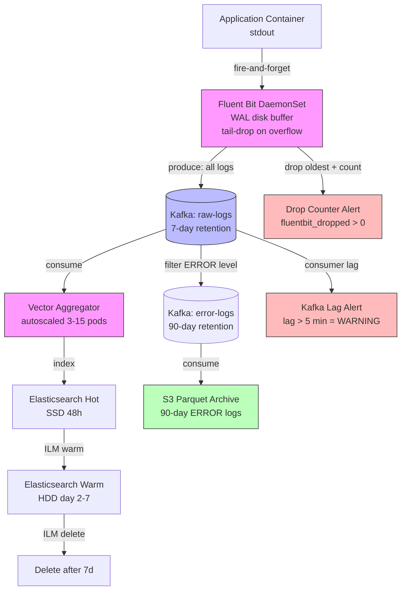

## Keywords in This File

{: .no_toc }

| #   | Keyword | Weight |
| --- | ------- | ------ |
| 1   | [Log Pipeline Reliability](#log-pipeline-reliability) | critical |

---

# Log Pipeline Reliability

**TL;DR** - Log pipeline reliability is the engineering discipline of
ensuring that log data flows from production services to the search
backend without silent loss, unacceptable lag, or cascading pressure
back onto the services being observed - requiring deliberate choices
about disk buffering, back-pressure handling, durability guarantees,
and degraded-mode behavior when any pipeline component is unavailable.

---

### 🎯 Model Answer

**30 seconds:**
> A log pipeline is reliable when it delivers logs to the backend
> without dropping data, without degrading the services producing
> the logs, and without becoming a single point of failure during
> incidents. The core trade-off is between durability and throughput:
> writing logs to a disk buffer before shipping makes them durable
> but adds latency and disk I/O; keeping them in memory is fast but
> loses data on crash. The pattern that works at scale is a tiered
> buffer - memory for low-latency throughput, disk persistence for
> durability, and a clear shedding policy (drop vs block) when the
> sink is unavailable.

**3 minutes (Senior):**
> Log pipelines fail in ways that are invisible until you're in an
> incident and realize your logs aren't there. The three failure
> modes I've seen most are: silent drops (the log agent ran out
> of buffer space and silently discarded events without any alert
> firing), pipeline pressure on the application (the application's
> logger blocks waiting for the log agent to accept events, slowing
> down request processing), and ordering violations (logs arrive
> out of order at the backend, breaking time-based queries).
>
> The architecture that prevents all three: deploy a log agent
> (Fluent Bit or Vector) as a DaemonSet on each Kubernetes node,
> configured with a disk-backed WAL for persistence. The agent
> tails the container stdout files, parses them into structured
> events, and ships to an aggregator (a Kafka topic or a stateful
> Fluentd/Vector aggregator). The key design principle: the agent
> NEVER back-pressures the application. If the agent's buffer is
> full, it drops the oldest events from the buffer (tail-drop) or
> samples at a configurable rate. The application never blocks on
> log I/O.
>
> For durability: the WAL provides persistence across agent restarts
> and node reboots. The agent tracks the file offset position in
> the WAL. On restart, it resumes from the last committed offset.
> This gives at-least-once delivery semantics: if the agent crashes
> after reading but before delivering, the events are re-delivered
> after restart. The backend (Elasticsearch, Loki) must handle
> duplicate events idempotently (by log line ID or timestamp+host).
>
> For high-cardinality log volumes (10GB/min from a 500-node
> cluster), the intermediate Kafka topic provides back-pressure
> absorption: services produce to Kafka instantly, consumers (Logstash,
> Fluentd) process at their own rate. The queue depth in Kafka
> makes the lag visible (a metric you can alert on) rather than
> silent drop in the agent.

**Framework:** WHAT -> WHY -> HOW -> TRADE-OFF -> EXAMPLE

*Adapting up:* Staff engineers design the log pipeline topology,
retention tiers, and degraded-mode contracts. They define: what
is the maximum acceptable log lag during a backend failure, which
log streams must be durable vs lossy, and what sampling policy
applies when the pipeline reaches capacity. They also define the
alerting strategy for pipeline health itself (pipeline observability).

*Adapting down:* "A log pipeline is like a postal system. The service
is the sender, the log backend is the recipient, and the pipeline
is the mail infrastructure. Reliability means: your letter gets
there (no drops), it doesn't slow down your day to write it (no
back-pressure), and if the post office is temporarily closed, your
letters are held in a local buffer until it reopens (disk buffer)."

**Blank Mind Recovery:**

**(1) Restate:** "You are asking about making log pipelines reliable -
let me walk through the failure modes of a typical log pipeline
and the architectural patterns that address each."

**(2) First principles:** "From first principles, a log pipeline
has a producer (application), a transport (agent + network), and
a consumer (backend). Reliability means the consumer eventually
receives what the producer sent. The challenges are: transport
outages, consumer back-pressure, and transport capacity limits
relative to producer rate."

**(3) Bridge:** "This is similar to the reliability engineering
of any message queue system. The concepts map directly: WAL is
like a persistent queue, back-pressure is like producer throttling,
dead letter queues are for undeliverable events. The log-specific
challenges are the high volume (gigabytes per minute) and the
requirement to never slow down the producing service."

---

### 📘 Concept Explanation

**What it is:**
Log pipeline reliability is the set of architectural patterns,
configuration choices, and operational practices that ensure log
data flows from application services through collection agents,
transport layers, and aggregators to the final storage backend
with defined durability guarantees, bounded latency, and isolation
between pipeline failures and service availability.

**The problem it solves:**
Log pipelines fail silently. A service continues running normally
while its logs are being silently dropped by a full agent buffer,
a misconfigured parser causing events to be rejected, or a backend
outage causing queue saturation. Engineers discover the loss only
during an incident when they need the logs for RCA and find gaps.
Additionally, poorly designed pipelines create back-pressure: when
the log agent slows down due to a backend outage, it can block
the application's logger, causing request latency increases or
timeouts that are unrelated to the service's actual business logic.

**How it works:**

```
Log Pipeline Architecture - Production Pattern
================================================

Application (container)
    |
    | stdout/stderr (structured JSON)
    | (fire-and-forget: app never blocks on log write)
    v
[Fluent Bit DaemonSet - Node Agent]
    |  reads container log files (tail input)
    |  parses and enriches events
    |  writes to disk-backed WAL (persistence)
    v
[Memory Buffer]   <- fast path, low latency
    |  if full: tail-drop oldest events (never block)
    v
[Disk Buffer (WAL)]  <- persistence across restarts
    |  at-least-once delivery guarantee
    v
[Output Plugins - parallel]
    |         |          |
    v         v          v
 [Kafka]  [Loki]   [Dead Letter S3]
 (high-   (direct   (for rejected/
  volume)  path)     unparse-able events)

Aggregator tier (Fluentd / Vector):
[Kafka topic] -> [Aggregator] -> [Elasticsearch/Loki]
                       |
                       v
                 [Back-pressure control]
                 if Elasticsearch slow:
                   - buffer in Kafka
                   - alert on lag > 5min
                   - drop if lag > 30min with alert

Monitoring the pipeline itself:
  Fluent Bit metrics:
    fluentbit_input_records_total    (events ingested)
    fluentbit_output_dropped_total   (silently dropped)
    fluentbit_filter_records_total   (parsed)
  
  Kafka lag metric:
    kafka_consumer_group_lag         (processing delay)
  
  Alert: pipeline_drop_rate > 0.01% for 5 minutes
```

**The key insight:**
The most dangerous log pipeline failure is not a noisy crash but a
silent drop with no alert. The fundamental reliability requirement is
therefore not zero loss (often unachievable at extreme throughput)
but VISIBLE loss: any data loss must be counted, measured, and alerted
on. An operation team that knows they're losing 0.1% of logs during
a backend maintenance window can make an informed decision. An
operation team that discovers they lost 100% of logs for the last
2 hours during an incident cannot. Instrument the pipeline itself.

**When to use it:**
Design for log pipeline reliability when: you operate production
services where logs are the primary debugging tool (most services),
you have compliance requirements for log retention (financial, medical,
security audit), or you have high log volume (> 1GB/minute per
cluster) where silent drops are likely. Every production log pipeline
needs at least: disk-backed buffering, drop counting and alerting,
and application isolation (never block service on log I/O).

**When NOT to use it:**
Do not over-engineer log reliability for non-critical logging paths.
Debug-level log streams in development environments can use simple
in-memory buffers and lossy delivery. Do not add a Kafka tier to
a pipeline that processes < 100MB/minute - the operational overhead
of Kafka exceeds the reliability benefit at that scale. Do not attempt
exactly-once delivery semantics for logs; the overhead (distributed
transactions) is not justified for log data.

**Alternatives:**
- Vector: all-in-one log collection and routing; high-performance
  Rust implementation; supports both agent and aggregator roles;
  growing community
- Fluentd + Fluent Bit: Fluent Bit as lightweight DaemonSet agent,
  Fluentd as stateful aggregator; mature ecosystem; higher memory
  footprint than Vector
- Logstash: part of the Elastic Stack; rich transformation pipeline;
  higher resource usage; tightly integrated with Elasticsearch
- OpenTelemetry Collector with log receiver: unified telemetry
  pipeline handling metrics, traces, AND logs; growing adoption

**First-principles derivation:**
A log pipeline is a producer-consumer queue with high-throughput
producers and variable-speed consumers. The fundamental constraint
is: producer rate can spike (error flood from a failing service)
while consumer throughput is bounded (Elasticsearch indexing rate).
When producer rate > consumer rate, data must either be buffered
(disk), dropped (shedding), or slowed down (back-pressure). Back-
pressure is unacceptable because it propagates failures to the
service being observed. So the choice is buffer or drop. Buffering
adds latency and disk cost but preserves data. Dropping loses data
but prevents disk exhaustion. The correct answer is: buffer with
a bound, drop when the buffer is full, count and alert on every drop.

---

### 💻 Code Example

**Example 1: BAD - Log pipeline that silently drops and blocks services**

```yaml
# BAD: Fluent Bit configuration that causes silent drops
# and can block service log output

# BAD Pattern 1: No disk buffer (memory only, no persistence)
[SERVICE]
    Flush        5
    Log_Level    info

[INPUT]
    Name         tail
    Path         /var/log/containers/*.log
    Tag          kube.*
    Mem_Buf_Limit 5MB   # only 5MB memory buffer
    # When full: Fluent Bit pauses tailing
    # This is BACK-PRESSURE: the container log file
    # stops being consumed; the Docker log writer
    # eventually blocks the application's log write

[OUTPUT]
    Name         es
    Host         elasticsearch
    Port         9200
    # No retry configuration: if ES is down,
    # events are dropped with no count, no alert
    # No dead letter queue: rejected events vanish

# What happens when Elasticsearch is unavailable:
# 1. Output plugin fails, events stay in memory buffer
# 2. Memory buffer fills to 5MB limit
# 3. Fluent Bit pauses the tail input plugin
# 4. /var/log/containers/ log files stop being consumed
# 5. Docker log driver blocks application log writes
# 6. Application request handlers stall on logger.info()
# 7. Service P99 latency spikes - looks like app regression
# 8. Engineers debug the wrong service for 45 minutes
```

> **Code walkthrough:** The BAD pattern creates two failure modes.
> First, the 5MB memory buffer with no disk persistence means all
> log data is lost on Fluent Bit pod restart. Second, when Elasticsearch
> is unavailable, the buffer fills, Fluent Bit pauses tailing, and
> back-pressure propagates to the application: the Docker log driver
> blocks when the container log files aren't being consumed. The
> application's `logger.info()` calls block, causing service latency
> spikes that look like application regressions but are actually log
> pipeline failures. This is the most dangerous pattern because the
> symptom (high P99 latency) points to the wrong cause.

**Example 2: GOOD - Fluent Bit with disk buffering and explicit drop policy**

```yaml
# GOOD: Fluent Bit configuration with disk buffer,
# explicit drop policy, and metrics for visibility

[SERVICE]
    Flush        5          # flush every 5 seconds
    Log_Level    warn
    # Enable built-in HTTP server for metrics
    HTTP_Server  On
    HTTP_Listen  0.0.0.0
    HTTP_Port    2020

[INPUT]
    Name              tail
    Path              /var/log/containers/*.log
    Tag               kube.*
    Refresh_Interval  5
    # CRITICAL: Storage type = filesystem enables WAL
    # Fluent Bit records file offset in WAL
    # On restart: resumes from last committed position
    # This gives at-least-once delivery
    storage.type      filesystem
    # storage.pause_on_chunks_overlimit Off means
    # Fluent Bit does NOT pause on buffer full -
    # it writes new events and drops oldest (tail-drop)
    # APPLICATION IS NEVER BLOCKED
    storage.pause_on_chunks_overlimit  Off

[FILTER]
    Name              kubernetes
    Match             kube.*
    Merge_Log         On
    K8S-Logging.Parser On

[OUTPUT]
    Name              es
    Match             kube.*
    Host              ${ELASTICSEARCH_HOST}
    Port              9200
    Index             logs-%Y.%m.%d
    
    # Retry configuration: attempt 5 times before giving up
    Retry_Limit       5
    
    # Storage filesystem for the output queue too
    storage.total_limit_size 2G   # max disk for output queue
    
    # If the output queue fills: drop the OLDEST events
    # (recent events are more valuable for active incidents)
    storage.backlog.mem_limit 10M

[OUTPUT]
    # Dead letter queue: send rejected/malformed events to S3
    # These are events that repeatedly fail to reach ES
    Name              s3
    Match             fluentbit.dropped.*
    bucket            ${LOG_DLQ_BUCKET}
    s3_key_format     /dropped/%Y/%m/%d/%H/%M-%S.gz

# Monitoring: these metrics exported via HTTP server
# Alert on:
# fluentbit_output_dropped_records_total increasing
# fluentbit_output_retried_records_total > threshold
# fluentbit_input_storage_chunks_up > 90% of limit
```

> **Code walkthrough:** The GOOD configuration uses `storage.type =
> filesystem` to write all buffered log events to disk, enabling WAL-
> backed persistence and at-least-once delivery on restart.
> `storage.pause_on_chunks_overlimit Off` is the critical setting that
> prevents back-pressure: when buffers are full, Fluent Bit drops
> the oldest events rather than pausing input and blocking the
> application. The 2GB `storage.total_limit_size` provides 30-60
> minutes of buffer at typical log rates, covering most backend
> maintenance windows. The dead letter queue (S3 output) captures
> rejected events rather than losing them silently. The HTTP metrics
> server exposes drop counts for alerting.

**Example 3: Kafka-based pipeline for high-volume log ingestion**

```yaml
# GOOD: High-volume log pipeline with Kafka as buffer
# Used when log rate exceeds what Elasticsearch can index
# directly from agent pushes.

# --- Fluent Bit DaemonSet (agent tier) ---
[OUTPUT]
    Name             kafka
    Match            kube.*
    Brokers          kafka-0:9092,kafka-1:9092,kafka-2:9092
    Topics           raw-logs
    # Kafka producer: at-least-once delivery
    # rdkafka configuration:
    rdkafka.request.required.acks   -1    # all replicas ack
    rdkafka.message.timeout.ms      30000 # 30s delivery timeout
    rdkafka.queue.buffering.max.ms  50    # low-latency buffering
    # If Kafka is unavailable: Fluent Bit buffers on disk
    # (up to 2G configured above) and retries

# --- Vector Aggregator (consumer from Kafka) ---
# vector-aggregator.toml
[sources.kafka_logs]
type = "kafka"
bootstrap_servers = "kafka-0:9092,kafka-1:9092,kafka-2:9092"
group_id = "vector-aggregator"
topics = ["raw-logs"]
auto_offset_reset = "earliest"  # start from committed offset
# consumer_group_id commit interval:
# commit every batch of 1000 events or 5 seconds
# provides at-least-once delivery with bounded redelivery

[transforms.parse_json]
type = "remap"
inputs = ["kafka_logs"]
source = '''
  . = parse_json!(.message)
  .parsed_at = now()
'''

[transforms.add_retention_class]
type = "remap"
inputs = ["parse_json"]
source = '''
  # Classify logs by retention requirement
  # ERROR logs -> 90 days (compliance)
  # INFO logs -> 30 days (operational)
  # DEBUG logs -> 7 days (development)
  if exists(.level) {
    if .level == "ERROR" || .level == "FATAL" {
      .retention_class = "long"
    } else if .level == "DEBUG" || .level == "TRACE" {
      .retention_class = "short"
    } else {
      .retention_class = "medium"
    }
  }
'''

[sinks.elasticsearch]
type = "elasticsearch"
inputs = ["add_retention_class"]
endpoints = ["http://elasticsearch:9200"]
index = "logs-%Y.%m.%d"
# Back-pressure: if ES is slow, Vector slows Kafka consumption
# Kafka consumer lag becomes the visible buffer metric
# Alert on lag > 5 minutes
```

```bash
# Monitor Kafka lag to detect pipeline slowdown
# (the VISIBLE alternative to silent drop)
kafka-consumer-groups.sh \
  --bootstrap-server kafka-0:9092 \
  --describe \
  --group vector-aggregator

# Output:
# TOPIC     PARTITION  CURRENT-OFFSET  LOG-END-OFFSET  LAG
# raw-logs  0          12345678       12350000        4322
# raw-logs  1          11234567       11238900        4333
# Total lag: ~4300 events (~30 seconds of logs)
# Alert threshold: lag > 50000 events (5 minutes)
```

> **Code walkthrough:** The Kafka-based pipeline separates the agent
> tier (Fluent Bit producers to Kafka) from the aggregator tier
> (Vector consumers from Kafka). The critical reliability benefit:
> Kafka absorbs any rate mismatch between agent production and
> Elasticsearch indexing. When Elasticsearch is slow, the Kafka
> consumer lag grows visibly (and alertably) instead of causing
> silent drops in the agent. The `rdkafka.request.required.acks = -1`
> setting requires acknowledgment from all in-sync replicas before
> confirming delivery - this prevents data loss if the Kafka leader
> fails immediately after write. The Vector remap transform adds a
> retention class to each log event, enabling different ILM policies
> in Elasticsearch based on log severity.

**Example 4: Graceful degradation - sampling under load**

```python
# GOOD: Log sampling policy that activates under load
# Preserves all ERROR logs, samples INFO/DEBUG when
# the pipeline is under pressure.
# This is the application-side sampling policy,
# NOT the pipeline-side (complementary approaches).

import logging
import time
from threading import Lock

class AdaptiveLogSampler:
    """
    Samples log events based on pipeline pressure signal.
    Priority: ERROR/CRITICAL always pass through.
    INFO/DEBUG sampled at rate configured by ops.
    """

    def __init__(self):
        self.sample_rate = 1.0   # 100% initially
        self.lock = Lock()
        self._last_drop_time = 0

    def should_log(self, level: str) -> bool:
        # Critical events ALWAYS logged, never sampled
        if level in ("ERROR", "CRITICAL", "FATAL"):
            return True

        # Under normal conditions: log everything
        if self.sample_rate >= 1.0:
            return True

        # Under load: sample probabilistically
        import random
        return random.random() < self.sample_rate

    def set_sample_rate(self, rate: float) -> None:
        """
        Called by ops system when pipeline lag increases.
        rate=1.0: normal (log everything)
        rate=0.1: 10% sampling (high load)
        rate=0.01: 1% sampling (severe overload)
        """
        with self.lock:
            self.sample_rate = max(0.001, min(1.0, rate))
            if rate < 1.0:
                logging.getLogger(__name__).warning(
                    "Log sampling activated",
                    extra={
                        "sample_rate": rate,
                        "reason": "pipeline_pressure"
                    }
                )

class SampledLogger:
    """Wrapper around Python logger with adaptive sampling."""

    def __init__(self, name: str, sampler: AdaptiveLogSampler):
        self._logger = logging.getLogger(name)
        self._sampler = sampler

    def info(self, msg: str, **kwargs) -> None:
        if self._sampler.should_log("INFO"):
            self._logger.info(msg, extra=kwargs)

    def error(self, msg: str, **kwargs) -> None:
        # Always log errors regardless of sample rate
        self._logger.error(msg, extra=kwargs)

# Usage: ops automation sets sample rate based on
# Fluent Bit drop metric or Kafka lag metric
sampler = AdaptiveLogSampler()
# Normal operation:
sampler.set_sample_rate(1.0)

# When Kafka lag > 100K events:
# sampler.set_sample_rate(0.1)  # 10% of INFO

# When Kafka lag > 500K events:
# sampler.set_sample_rate(0.01)  # 1% of INFO

# Errors always flow regardless of pressure
```

> **Code walkthrough:** The adaptive sampler implements the application-
> side component of graceful degradation. When the pipeline signals
> overload (via Kafka lag alerting or Fluent Bit drop metrics), the
> sample rate drops automatically - discarding INFO and DEBUG logs
> but passing 100% of ERROR and CRITICAL events. This keeps the
> pipeline capacity available for the high-value events (errors during
> incidents) while voluntarily shedding the low-value events (debug
> output during normal operation). The key invariant: errors are never
> sampled. The sampling decision is logged itself (so you know sampling
> was active and can account for it in analysis).

---

### 🎓 Answers by Seniority

**Junior / Mid (0-5 years):**
> Log pipeline reliability means making sure logs actually get from
> the service to where you can search them, without getting dropped
> or slowing down the service. The main things I've learned: use a
> local buffer (like a Fluent Bit DaemonSet with disk storage) so
> logs aren't lost when the backend is temporarily unavailable, and
> make sure the log agent never blocks the application - it should
> drop old logs rather than slow down request processing. I also
> monitor the pipeline itself: if Fluent Bit starts dropping events
> or Kafka lag grows, that's a signal before you need to debug logs
> and find they're missing.

For mid-level: the two-tier architecture (agent -> Kafka -> aggregator)
is the production standard for high-volume deployments. Fluent Bit
agents tail container logs and produce to Kafka (at-least-once with
disk buffering). A Vector or Fluentd aggregator consumes from Kafka
and indexes to Elasticsearch or Loki. The Kafka consumer lag metric
is the key health indicator: if it grows, the aggregator is falling
behind and logs will arrive late at the backend. Alert on lag
> 5 minutes; at > 30 minutes, consider activating sampling to
prevent the queue from growing unboundedly.

*Push deeper:* The at-least-once vs at-most-once trade-off applies
to logs. Exactly-once is not practical for log pipelines at scale.
At-least-once (Fluent Bit WAL + Kafka committed offsets) means
duplicate events may appear in the backend during recovery - the
backend must handle this gracefully. At-most-once (no WAL, no retry)
means data is lost on agent restart. For production, at-least-once
is the minimum acceptable guarantee.

---

**Senior / Staff (5+ years):**
> Log pipeline reliability is harder than it looks because the
> failure modes are silent by default. The two patterns I enforce
> on every production pipeline: (1) the agent must never back-pressure
> the application - configure `storage.pause_on_chunks_overlimit Off`
> in Fluent Bit, which drops oldest buffered events rather than
> pausing the tail input; (2) every drop must be counted and alerted
> on - `fluentbit_output_dropped_records_total` increasing is a
> severity-warning alert because silent data loss in a log pipeline
> means blind spots during the next incident.
>
> The hardest scenario I've debugged: a Fluent Bit DaemonSet was
> configured with the default `pause_on_chunks_overlimit On` setting.
> Our Elasticsearch cluster had a 10-minute rolling upgrade window.
> During the upgrade, Fluent Bit paused tailing, Docker log buffers
> filled, and our Go services started showing 200ms P99 latency
> spikes as `log.Printf()` calls blocked. It looked like a service
> regression from the application metrics. Trace RCA showed the
> goroutines were blocked on log writes. Took 35 minutes to diagnose
> because nobody expected the log pipeline to cause application
> latency spikes. After that incident: all Fluent Bit configs moved
> to `pause_on_chunks_overlimit Off` and I added a log pipeline
> health dashboard as a mandatory panel in every service's runbook.

At staff level: the retention tier design is the long-term cost
optimization. Every organization faces the same economics: storing
7 days of full-resolution DEBUG/INFO/ERROR logs is cheap; storing
90 days is expensive. The tiered approach: keep 7 days of all logs
in hot storage (Elasticsearch on SSD), move to warm storage
(Elasticsearch on HDD or S3-backed) for 30 days, delete or archive
to cold S3/Glacier for ERROR-level logs only beyond 30 days. This
reduces storage costs by 60-80% while maintaining full 90-day
retention for compliance-relevant error logs.

*Push deeper:* The pipeline observability layer requires dedicated
attention. The pipeline is the tool you use to debug incidents;
if the pipeline is broken during an incident, you have no tools.
I implement a separate "meta-pipeline" that monitors the production
log pipeline: Prometheus scraping Fluent Bit metrics, Kafka lag
alerts, Elasticsearch indexing rate alerts. These fire to a
different PagerDuty escalation than application alerts, so the
on-call engineer for the platform team is paged for pipeline
issues rather than the application on-call.

---

### ⚠️ Common Misconceptions

**Misconception 1: "Log pipeline failures are not service-affecting because logs are not in the request path."**
Log pipeline failures become service-affecting when back-pressure
propagates from the agent to the application. Docker's default
log driver (`json-file`) writes container stdout to files
synchronously on the application's log write path. If Fluent Bit
tailing pauses (due to buffer exhaustion with the default config),
the log file is not consumed, the file grows beyond Docker's
configured max size limit, Docker blocks the write, and the
application's `logger.info()` call blocks the request handler
goroutine/thread. This produces P99 latency spikes in the
application that look like application regressions but are
caused by the log pipeline.

**Misconception 2: "Adding more memory to Fluent Bit buffer improves reliability."**
A larger in-memory buffer delays the problem without solving it.
When the backend is unavailable long enough to exhaust any in-memory
buffer, events are dropped silently. The correct solution is a
disk-backed buffer (WAL) that persists across agent restarts and
node reboots, providing at-least-once delivery instead of
best-effort delivery. Disk storage is also cheaper than RAM for
equivalent buffer capacity: 2GB of disk buffer costs $0.05/month
vs $0.20/month for 2GB additional RAM.

**Misconception 3: "At-least-once delivery means no data loss."**
At-least-once delivery means events may be delivered more than once
(duplicates) but not zero times. Data loss is still possible:
if the disk buffer fills before the backend recovers, new events
are dropped even with at-least-once configured for already-buffered
events. At-least-once only means events that were written to the WAL
before the failure will be re-delivered after recovery. Events that
arrive after the WAL is full are still dropped. True data loss
prevention requires a pipeline with sufficient buffer capacity to
outlast the expected maximum backend outage duration.

**Misconception 4: "Elasticsearch is the only reliable log backend."**
Grafana Loki is architecturally different from Elasticsearch and
more suitable for high-volume log ingestion at lower cost. Loki
does not index log content (only labels), so it accepts ingestion
at much higher throughput with less RAM and CPU. Queries are slower
(full text search requires scanning log files, not inverted index
lookups) but for most log analysis use cases (filtering by service,
time range, log level) label-based queries are sufficient. At very
high log volumes (> 10GB/min per cluster), Loki's lower indexing
overhead makes it more reliable under load than Elasticsearch.

**Misconception 5: "Log pipeline reliability is about never dropping logs."**
Zero data loss is often the wrong target. The correct target is
KNOWN data loss: every dropped event is counted, and the loss is
visible as a metric before it becomes a problem. During Elasticsearch
maintenance or a log flood from a runaway service, controlled sampling
with explicit counters is operationally superior to attempting zero
loss (which would require unbounded buffering and eventually causes
disk exhaustion). Define your SLO as "< 0.1% of events dropped
during normal operation, with all drops counted and alerted on"
rather than "zero drops ever."

---

### 🚨 Failure Modes and Diagnosis

**Failure 1: Application P99 latency spike caused by log back-pressure**

Symptom: P99 latency increases across multiple services simultaneously
without any deployment. Traces show goroutines/threads blocked in log
write calls. No error rate increase. Coincides with Elasticsearch
maintenance or cluster unavailability.

Cause: Fluent Bit DaemonSet with `storage.pause_on_chunks_overlimit On`
(the default). When Elasticsearch is unavailable, Fluent Bit's output
queue fills, Fluent Bit pauses the tail input plugin, the container
log files stop being consumed, Docker's log driver blocks application
log writes.

Diagnosis:
```bash
# Check Fluent Bit storage state (per node)
kubectl exec -n logging fluent-bit-xxxxx -- \
  curl -s localhost:2020/api/v1/storage | python3 -m json.tool
# Look for: chunks_up (in-memory chunks), chunks_fs (disk chunks)
# If chunks_up approaching limit: buffer is full

# Check Fluent Bit output plugin retry state
kubectl exec -n logging fluent-bit-xxxxx -- \
  curl -s localhost:2020/api/v1/metrics | grep "retry"
# High retry count with increasing error count -> ES down

# Verify on a sample node that log tailing is paused
kubectl exec -n logging fluent-bit-xxxxx -- \
  curl -s localhost:2020/api/v1/metrics \
  | grep "input.tail.files_opened"
# If this counter stopped incrementing -> tailing paused

# Check application goroutine stack (Go)
kill -SIGQUIT <app-pid>  # prints goroutine dump
# Look for: goroutines blocked on: syscall.Write
# in os.File.Write or log.Printf
```

Fix: Set `storage.pause_on_chunks_overlimit Off` in all Fluent Bit
configurations. This changes the behavior from "pause input when
full" to "drop oldest buffered events when full." Applications
are never blocked. Add a `fluentbit_output_dropped_records_total`
alert to catch when drops begin. Deploy the fix with a rollout
that restarts DaemonSet pods to apply immediately.

**Failure 2: Silent log data loss - gaps in Elasticsearch during incident**

Symptom: During an incident investigation, Kibana/Grafana Loki
shows no logs for specific services or time ranges. The services
were running and generating logs (visible from Prometheus request
rate metrics), but the logs didn't arrive in the backend.

Cause: Multiple possibilities - Fluent Bit buffer was full and
dropping events with no alert configured, Elasticsearch rejected
events due to index mapping conflicts (field type mismatch), or
the Kafka consumer group fell behind and events expired from the
topic (topic retention shorter than consumer lag).

Diagnosis:
```bash
# Check Fluent Bit drop counters across all nodes
kubectl get pods -n logging -l app=fluent-bit \
  -o name | xargs -I{} kubectl exec {} -- \
  curl -s localhost:2020/api/v1/metrics \
  | grep "dropped"
# Non-zero and growing -> drops are happening

# Check Elasticsearch rejected events
curl -s "http://elasticsearch:9200/_nodes/stats/indices" \
  | jq '.nodes[] | .indices.indexing.index_failed'
# Non-zero -> ES rejecting documents
# Check reason:
curl -s "http://elasticsearch:9200/_cat/indices?v&h=\
index,docs.deleted,store.size" | head -20
# High docs.deleted may indicate failed index operations

# For Loki: check ingestion rate vs drops
curl -s "http://loki:3100/metrics" | grep "loki_ingester"
# loki_ingester_chunks_flushed_total
# loki_ingester_streams_created_total

# Check Kafka topic retention vs consumer lag
kafka-consumer-groups.sh \
  --bootstrap-server kafka-0:9092 \
  --describe --group vector-aggregator
# If LAG > TOPIC_RETENTION_IN_EVENTS:
# events expired from Kafka before consumption
```

Fix: Add alerting on Fluent Bit drop counters (immediate). For
Elasticsearch mapping conflicts: implement strict index templates
that define all expected field types, preventing dynamic mapping
from accepting mixed-type fields. For Kafka retention: increase
topic retention to at least 2x the maximum expected consumer lag.

**Failure 3: Log pipeline overwhelmed by error flood from a failing service**

Symptom: Log pipeline health dashboard shows Kafka lag growing
rapidly. Aggregator CPU saturated. Elasticsearch indexing rate
maxed out. Unrelated services' logs are delayed by 10+ minutes
because the pipeline is full of one service's error logs.

Cause: A service enters an error loop, logging an exception for
every request. At 1,000 RPS * 5 log lines per request * 5 KB per
line = 25 MB/second of log data from one service. The pipeline
capacity (typically 5-20 MB/second for a medium cluster) is
exhausted by one failing service.

Diagnosis:
```bash
# Find which service is flooding the pipeline
# In Fluent Bit: check input records per tag
kubectl exec -n logging fluent-bit-xxxxx -- \
  curl -s localhost:2020/api/v1/metrics \
  | grep "input.tail" | sort -t'=' -k2 -rn | head -10
# kube.namespace.payment-service = 95% of input rate

# In Kafka: check message rate per partition
kafka-log-dirs.sh --bootstrap-server kafka-0:9092 \
  --topic raw-logs \
  | grep "offsetLag"
# Partitions for the flooding service namespace show
# high offset advancement rates
```

Fix (immediate): add a rate limiting filter in Fluent Bit for
the flooding service's log stream:
```yaml
[FILTER]
    Name           throttle
    Match          kube.production.payment-service.*
    Rate           1000    # max 1000 events/second
    Window         10      # over 10-second window
    Action         drop    # drop excess events
    Print_Status   True    # log when throttling
```
This limits the flood to 1,000 events/second while the service
is being fixed. Add this as a standard emergency filter in your
runbooks. Long-term: implement per-service log rate limits
in the pipeline by default (e.g., 5,000 events/second per service).

**Failure 4: Fluent Bit DaemonSet restart loses buffered log events**

Symptom: After a Kubernetes node restart or Fluent Bit DaemonSet
update, 2-3 minutes of logs are missing from Elasticsearch.
The gap corresponds to the Fluent Bit pod downtime.

Cause: Fluent Bit is configured with `storage.type memory` (the
default). All buffered events in the memory buffer are lost when
the pod restarts. The log file offset tracking is also in memory,
so Fluent Bit starts reading from the beginning or end of log files
after restart depending on configuration.

Diagnosis:
```bash
# Confirm storage type (should be filesystem for production)
kubectl exec -n logging fluent-bit-xxxxx -- \
  cat /fluent-bit/etc/fluent-bit.conf | grep "storage.type"
# If not "filesystem": missing persistence

# Check if Fluent Bit track file positions
# (filesystem storage writes the position file to disk)
ls /var/fluent-bit/state/
# Should see *.db files (position tracking database)
# If empty: memory storage, positions lost on restart
```

Fix: Enable filesystem storage and mount a persistent volume
for the Fluent Bit state directory:
```yaml
# Fluent Bit DaemonSet config
[SERVICE]
    storage.path    /var/fluent-bit/state
    # This directory needs a persistent volume:

# In Kubernetes DaemonSet spec:
volumes:
  - name: fluent-bit-state
    hostPath:
      path: /var/lib/fluent-bit/state
      type: DirectoryOrCreate
volumeMounts:
  - name: fluent-bit-state
    mountPath: /var/fluent-bit/state
# Using hostPath ensures the state survives pod restarts
# (as long as the node is not replaced)
```

---

### 🎯 Interview Deep-Dive

| Time | Question Type | Depth Signal |
| ---- | ------------- | ------------ |
| 2 min | DEFINITION | What makes a log pipeline "reliable"? |
| 3 min | MECHANISM | Back-pressure and isolation |
| 3 min | DEBUGGING | Silent drop investigation |
| 3 min | MECHANISM | At-least-once delivery in log pipelines |
| 3 min | TRADE-OFF | Disk buffer vs memory buffer |
| 4 min | PRODUCTION | Log flood causing pipeline capacity issues |
| 3 min | COMPARISON | Fluent Bit vs Vector vs Logstash |
| 3 min | DEEP DIVE | WAL mechanics in Fluent Bit |
| 4 min | SYSTEM DESIGN | Log pipeline for 500-node Kubernetes cluster |
| 3 min | MISCONCEPTION | "Never drop logs" false target |
| 3 min | PERFORMANCE | Log pipeline under burst load |
| 3 min | BEHAVIORAL | Pipeline failure that caused incident blindness |

---

**Q1 [MID]: What does "reliable" mean for a log pipeline, and what are the key reliability properties?** `[DEFINITION]`

*Why they ask:* Tests whether the candidate has a precise definition
of log pipeline reliability beyond "logs don't get dropped."

*Likely follow-up:* "Would you accept 0.1% log loss if the alternative was back-pressure?"

Reliability for a log pipeline means meeting four properties:

1. Durability: log events written to the pipeline are eventually
   delivered to the backend under defined failure conditions (agent
   restart, backend outage of duration X). This requires disk-backed
   buffering and retry logic.

2. Application isolation: pipeline failures do not degrade the
   services being observed. A full agent buffer, a dead backend, or
   a misconfigured parser must never cause the log-producing service
   to slow down or error.

3. Visibility: any data loss or significant lag is measured, visible
   as a metric, and alerted on before it causes incident blindness.
   "Silent drops" violate this property.

4. Bounded latency: under normal conditions, logs arrive at the
   backend within an acceptable time (typically < 30 seconds for
   operational use cases, < 5 minutes for compliance use cases).
   Unbounded latency means "logs arrive eventually but not when
   you need them during an active incident."

Property 2 (application isolation) and Property 1 (durability) are
in tension: strict durability (never drop) with no back-pressure
requires infinite buffering, which eventually exhausts disk and
causes application failures. The pragmatic resolution is durability
with a bounded drop policy: buffer up to N GB on disk; if the buffer
exceeds N GB, drop the oldest events (which are less useful for
active incident investigation) and count each drop.

*What separates good from great:* Explicitly naming application
isolation as a reliability property. Most candidates define reliability
as "logs don't get dropped" and miss the critical back-pressure
isolation property that makes log pipeline failures service-affecting.

---

**Q2 [SENIOR]: How can a log pipeline cause application latency spikes, and how do you prevent it?** `[MECHANISM]`

*Why they ask:* Tests whether the candidate has seen or understands
the back-pressure propagation failure mode.

*Likely follow-up:* "How would you diagnose this during a live incident?"

The back-pressure propagation path:
1. Fluent Bit DaemonSet (default config: `storage.pause_on_chunks_overlimit On`)
2. Elasticsearch is unavailable for 10 minutes
3. Fluent Bit's output queue fills
4. Fluent Bit pauses its tail input plugin
5. Container log files stop being consumed (they grow on disk)
6. Docker's default `json-file` log driver has a configurable `max-size`
   (default 10MB per file). When the file is not consumed, Docker
   stops accepting new log writes from the container.
7. The Go runtime / Java log library calls `os.File.Write()` or
   `FileOutputStream.write()`, which blocks waiting for Docker
8. The calling goroutine or thread is blocked
9. Request handler goroutines/threads are blocked on `logger.Info()`
10. Service P99 latency increases by 100-500ms for affected requests

The propagation requires three conditions: synchronous log writes
in the application, Docker's `json-file` driver (most Kubernetes
setups), and Fluent Bit's pause-on-overflow behavior.

Prevention:
- Set `storage.pause_on_chunks_overlimit Off` in Fluent Bit (most important)
- Configure Docker log driver with `max-file: 5` to have multiple
  rolling files, reducing the chance that all files fill simultaneously
- Use asynchronous logging in the application (Java Log4j2 async
  appenders, Go's `go log.Printf()` wrapped in goroutine)
- Add Fluent Bit buffer health monitoring: alert when buffer > 80%
  full, fix backend before it blocks

Diagnosis during incident:
```bash
# Fast check: is Fluent Bit paused?
kubectl exec -n logging fluent-bit-pod -- \
  curl -s localhost:2020/api/v1/metrics | grep "input.tail"
# Compare consecutive calls: if files_opened stops incrementing
# -> tailing is paused

# Check goroutine dump (Go)
kubectl exec app-pod -- kill -SIGQUIT 1
# Search for: blocked in syscall.Write
# in log-related frames
```

*What separates good from great:* The complete propagation chain
(ES down -> Fluent Bit pause -> Docker block -> app block) and the
specific prevention setting. Candidates who only say "configure
async logging" without knowing the `pause_on_chunks_overlimit`
setting have not operated Fluent Bit in production.

---

**Q3 [SENIOR]: You're debugging an incident and find 2-hour log gaps for one service. How do you investigate the cause?** `[DEBUGGING]`

*Why they ask:* Tests structured diagnostic thinking for the hardest
log pipeline failure mode: silent drops.

*Likely follow-up:* "How do you tell whether the logs were generated but not stored vs never generated?"

Step 1: Confirm the service was running and processing requests
during the gap. If Prometheus request rate metrics show traffic
during the gap, the service was alive. If no request metrics exist
for the gap: the service was down and logs are expected to be absent.

Step 2: Check if logs were generated but dropped before reaching
the backend. Compare the service's internal log generation counter
(if instrumented) with the backend count. If not instrumented,
check Fluent Bit drop metrics for the node running the service:
```bash
kubectl exec -n logging fluent-bit-<node> -- \
  curl -s localhost:2020/api/v1/metrics | grep "drop"
# Also check Prometheus for this metric over the gap timeframe:
# fluentbit_output_dropped_records_total{node="the-node"}
```

Step 3: Check Fluent Bit's file position tracking. If Fluent Bit
was restarted during the gap and has memory-backed storage, it may
have skipped events:
```bash
# Check Fluent Bit restart times
kubectl get events -n logging | grep fluent-bit | grep "Killing\|Started"
# If restart within the gap window: likely position loss
```

Step 4: Check Elasticsearch for rejected documents (mapping errors).
A new log field with inconsistent type (once a string, once a
number) causes Elasticsearch to reject the document:
```bash
curl -s "http://elasticsearch:9200/logs-*/_stats/indexing" \
  | jq '.indices | to_entries[] |
    select(.value.total.indexing.index_failed > 0) |
    {index: .key, failed: .value.total.indexing.index_failed}'
```

Step 5: Check Kafka consumer lag during the gap (if Kafka is in
the pipeline). If the aggregator fell behind during the gap,
logs arrived late at Elasticsearch - they may be present but
with timestamps that appear outside the expected search window.

*What separates good from great:* The distinction between "logs not
generated" vs "logs generated but dropped vs logs generated and
delayed." These require different fixes. Step 1 (comparing request
metrics with log counts) is the key diagnostic step that candidates
with cross-signal observability experience take immediately.

---

**Q4 [MID]: What is at-least-once delivery for logs and what does it require in the pipeline?** `[MECHANISM]`

*Why they ask:* Tests understanding of delivery semantics, which is
the foundation of durability guarantees.

*Likely follow-up:* "How does Fluent Bit WAL provide at-least-once delivery?"

At-least-once delivery means every log event that enters the pipeline
is guaranteed to be delivered to the backend at least once. Duplicate
delivery (the same event delivered twice) is acceptable; zero delivery
is not.

This requires two mechanisms:

1. Persistent position tracking: the agent must record which log
   file offset (or Kafka offset) it has successfully delivered.
   On restart, it resumes from the last committed position. Without
   this, the agent either reprocesses all events from the start
   (duplicates) or loses events generated since the last restart
   (data loss).

2. Retry-on-failure: when delivery fails (backend unavailable,
   network error), the agent must retry until delivery succeeds.
   Without retry, a temporary backend unavailability causes permanent
   data loss.

Fluent Bit provides at-least-once delivery with:
- `storage.type filesystem`: writes all buffered events and the
  file position tracking database to disk. The position DB stores
  the byte offset in each container log file that has been
  successfully delivered. On restart: resume from the stored offset.
- `Retry_Limit 5` (or `False` for infinite retries): retry failed
  deliveries up to 5 times with exponential backoff before giving up.

The duplicate handling requirement: the backend must be idempotent
for re-delivered events. Elasticsearch with a document `_id` based
on a hash of the log line content and timestamp handles duplicates
transparently (duplicate write = update to same document = no-op
in effect). Loki handles duplicates by checking for duplicate
`{stream, timestamp, line}` tuples during ingestion.

*What separates good from great:* The position tracking database
detail. Most candidates know "disk buffer = at-least-once" but
don't know that the position tracking (separate from the event
buffer) is the mechanism that enables resuming from the correct
offset rather than re-reading from the beginning of every file.

---

**Q5 [SENIOR]: When would you use Kafka in a log pipeline and when is it over-engineering?** `[TRADE-OFF]`

*Why they ask:* Tests ability to evaluate architectural complexity
vs benefit.

*Likely follow-up:* "What is the minimum log volume that justifies adding Kafka?"

Kafka belongs in a log pipeline when:

1. Log volume exceeds the direct indexing throughput of the backend.
   Elasticsearch handles 5-20GB/hour per node. A 100-node Kubernetes
   cluster generating 50GB/hour of logs requires a 3-5 node
   Elasticsearch cluster to keep up. If a single failing service
   generates a log flood that exceeds this capacity, Kafka absorbs
   the burst. Without Kafka, the burst hits Elasticsearch directly
   and either drops events or overloads the cluster for all tenants.

2. You need to fan out to multiple backends. If logs need to go to
   both Elasticsearch (operational search) and S3 (compliance archive)
   and a security SIEM, Kafka enables one pipeline to produce and
   multiple consumers to read independently at their own pace.

3. You need replay capability. Kafka retains messages for a
   configurable period (typically 7 days). If Elasticsearch has
   a 2-day outage, you can replay 2 days of logs from Kafka after
   Elasticsearch recovers. Without Kafka, those 2 days are lost.

Kafka is over-engineering when:

1. Log volume < 10GB/hour for the entire cluster. At this volume,
   Fluent Bit -> Elasticsearch directly (with disk buffering) is
   simpler, cheaper, and has fewer failure modes (no Kafka cluster
   to operate).

2. You have a single backend (no fan-out requirement). Kafka adds
   latency (50-200ms broker round-trip) and operational overhead
   without benefit.

3. The team has no Kafka expertise. Kafka partition rebalancing,
   consumer group offset management, and topic retention configuration
   are non-trivial to get right. A misconfigured Kafka in the log
   pipeline is worse than no Kafka.

Threshold: Kafka becomes justified at > 10GB/hour log volume OR
fan-out to 2+ backends OR replay requirement.

*What separates good from great:* The specific threshold (10GB/hour)
and the replay capability as a distinct justification for Kafka
that's often overlooked. Candidates who say "Kafka for production
log pipelines always" have not operated the operational overhead.

---

**Q6 [SENIOR]: A service is generating 10GB/minute of logs due to an error loop. How do you handle it without breaking other services' logging?** `[PRODUCTION]`

*Why they ask:* Tests incident response for the log flood scenario,
which is a common production failure.

*Likely follow-up:* "How do you prevent the flood from affecting the flooding service's SLO?"

10GB/minute is 170MB/second. Most log pipelines are designed for
1-5MB/second per service. This single service is consuming 34-170x
its expected share of pipeline capacity.

Immediate mitigation (within 5 minutes):

Step 1: Identify the flooding service using Fluent Bit metrics
or Kafka lag per partition by namespace.

Step 2: Apply Fluent Bit rate limit for the flooding service's
namespace. This drops events from that service but does not
affect other services:
```yaml
[FILTER]
    Name        throttle
    Match       kube.production.payment-service.*
    Rate        5000     # 5000 events/second max
    Window      10
    Action      drop
    Print_Status True   # alert when throttling starts
```

Step 3: Apply this filter via Kubernetes ConfigMap update and
restart the DaemonSet pods (rolling restart). Takes 2-3 minutes.
After restart, the flooding service's log rate is capped; other
services' logs flow normally.

Step 4: Contact the on-call for the flooding service and escalate.
The rate limit is a temporary measure; the service needs to be
fixed or its error rate reduced.

Step 5: After the service is fixed, remove the rate limit filter.

Medium-term: implement per-service default rate limits (5,000
events/second per service by default, adjustable via annotation)
in the Fluent Bit DaemonSet. Deploy as part of the standard
Fluent Bit base configuration. This prevents any single service
from flooding the pipeline, even during error loops.

The key constraint: the mitigation must not back-pressure the
flooding service. Dropping excess events in Fluent Bit with
`Action drop` discards them without blocking the service's
log writes. The service continues operating (though poorly, since
it's in an error loop); logs above the threshold are dropped.

*What separates good from great:* The `throttle` filter with
`Action drop` (not `Action pause`). Pausing the input would
cause back-pressure; dropping excess events prevents it. The
specific YAML configuration is the kind of detail that comes
from having operated Fluent Bit in production.

---

**Q7 [SENIOR]: Compare Fluent Bit, Vector, and Logstash for a production log pipeline.** `[COMPARISON]`

*Why they ask:* Tests ability to evaluate tooling choices with
concrete criteria.

*Likely follow-up:* "Which would you choose for a greenfield Kubernetes deployment today?"

Fluent Bit:
- Written in C; very low resource usage (~20MB RAM, ~0.1 CPU cores)
  ideal for DaemonSet agent on every node
- Strong Kubernetes integration (pod metadata enrichment, auto-
  discovery of container logs)
- Supports most common outputs (Elasticsearch, Loki, Kafka, Splunk)
- WAL-backed disk buffering for reliability
- Weakness: plugin system (Lua for custom transforms) is less
  developer-friendly than Vector's VRL language

Vector:
- Written in Rust; high performance and memory safety; 2-3x faster
  than Fluent Bit per CPU core at the same task
- VRL (Vector Remap Language): expressive, safe transformation
  language that is easier to write and debug than Lua
- Can run as both agent (DaemonSet) and aggregator (stateful service),
  reducing the number of different tools
- Native support for metrics, logs, AND traces in one pipeline
- Weakness: smaller ecosystem than Fluent Bit; fewer community
  output plugins; higher operational complexity if used as aggregator

Logstash:
- JVM-based; higher resource usage (~500MB RAM, 0.5-1 CPU cores)
  makes it unsuitable as a DaemonSet agent on large clusters
- Rich filter plugin ecosystem (hundreds of community plugins)
- Part of the Elastic Stack; deep Elasticsearch integration
- Weakness: JVM startup time and GC pauses can cause latency
  spikes; not suitable for a DaemonSet agent role due to resource
  cost; better suited as a dedicated aggregator server

My recommendation for greenfield Kubernetes:
- Agent (DaemonSet): Fluent Bit (lowest resource, best K8s integration)
  OR Vector (if you want VRL transforms and don't want two tools)
- Aggregator: Vector (if you need a stateful aggregator) or
  eliminate the aggregator tier by routing Fluent Bit directly
  to Kafka, which handles the aggregation function

*What separates good from great:* The "use Vector if you want one
tool" insight. Many teams run both Fluent Bit (agent) and Fluentd
(aggregator), creating operational complexity. Vector can replace
both with one tool and language.

---

**Q8 [STAFF]: Explain how Fluent Bit's WAL works internally and what "position file" tracking means.** `[DEEP DIVE]`

*Why they ask:* Tests deep internals knowledge of the primary
reliability mechanism in Fluent Bit.

*Likely follow-up:* "What are the consistency guarantees on a node restart vs a node failure?"

Fluent Bit's WAL (Write-Ahead Log) and position tracking are two
separate mechanisms that together provide at-least-once delivery:

WAL mechanism:
- When events are read from input plugins (tail, tcp, syslog),
  they are written to the WAL as "chunks" before being sent to output
- The WAL is a directory of binary files under the `storage.path`
  directory configured in the SERVICE block
- Each chunk file is named with a monotonic ID and contains a batch
  of events
- When the output plugin successfully delivers a chunk to the backend,
  Fluent Bit deletes the corresponding WAL chunk file
- On restart: Fluent Bit scans the WAL directory and re-sends any
  chunk files that weren't deleted (weren't confirmed delivered)
- This provides at-least-once delivery: chunks delivered but not
  confirmed before crash are re-sent (duplicates)

Position file (tail input plugin specifically):
- The tail input plugin tracks the byte offset in each log file
  that it has read and committed to the WAL
- Position is stored in a SQLite database file under `storage.path`
- On restart: Fluent Bit reads the position file and resumes tailing
  from the last committed offset in each log file
- Without position tracking: restart reads from the end of log files
  (default: `db.sync` behavior) or the beginning

Node restart vs node failure:
- Node restart (graceful): both WAL and position file are safely
  flushed because the pod shuts down gracefully with a SIGTERM,
  Fluent Bit flushes in-flight data and writes its position. On
  restart: reads from last position, WAL chunks are re-sent.
- Node failure (sudden crash/OOM): WAL chunks currently in memory
  (not yet flushed to disk) are lost. Position file may have
  partial writes. Fluent Bit uses SQLite's journaling mode which
  provides atomic writes: the position file is either at the
  last committed position or at an earlier position (never a partial
  update). The WAL may have chunks that were in memory but not yet
  written to disk at crash time.
- Implication: `storage.type filesystem` provides at-least-once
  for graceful shutdown and partial at-least-once for crash (events
  in memory buffer at crash time may be lost).

*What separates good from great:* The distinction between WAL
(event durability) and position file (offset tracking), and the
specific crash semantics (SQLite atomic writes for position file
vs potential in-memory WAL loss on crash).

---

**Q9 [STAFF]: Design a log pipeline for a 500-node Kubernetes cluster running 200 microservices with a 90-day compliance retention requirement.** `[SYSTEM DESIGN]`

See the full System Design section below.

*What separates good from great:* The tiered retention cost model
and the per-service rate limiting architecture. Candidates who
propose storing 90 days of full-resolution logs without a retention
tier strategy have not thought through the cost implications.

---

**Q10 [MID]: "Log pipelines should never drop logs. Zero data loss is the reliability target." Is this correct?** `[MISCONCEPTION]`

*Why they ask:* Tests whether the candidate has a pragmatic vs
absolutist view of log reliability.

*Likely follow-up:* "What SLO would you set for a production log pipeline?"

This statement sets the wrong target and leads to worse outcomes
than a thoughtful drop policy. The reasons:

First, zero-drop is often unachievable at high throughput without
infinite buffering. Infinite buffering fills disk, which causes
OS-level errors and can crash the agent and the node. A disk-exhausted
log agent can fail in ways that cause application back-pressure
(see the Docker/Fluent Bit back-pressure failure mode). The cure
(disk full) is worse than the disease (controlled drops).

Second, zero-drop during a service error flood means the flooding
service consumes all pipeline capacity, delaying logs from all
other services. Controlled per-service rate limiting (which involves
drops for the flooding service) is better for the overall system.

Third, not all logs have equal value. DEBUG logs generated during
normal operation have near-zero value for incident investigation.
ERROR logs generated during an incident are critical. A policy that
drops DEBUG logs first (by priority) and never drops ERROR logs is
better than a policy that drops randomly to maintain aggregate zero-drop.

The correct target: define an SLO like "< 0.1% of ERROR-level log
events dropped during normal operation; all drops counted, alerted,
and visible as a metric; zero silent drops." This is achievable,
measurable, and provides the operational guarantee that matters.

*What separates good from great:* The priority-based shedding policy:
ERROR logs never dropped, DEBUG logs dropped first. This is the
operational answer that shows understanding of what log data is
actually used for (incident investigation = errors).

---

**Q11 [SENIOR]: Your log pipeline handles 5GB/minute normally. During a product launch, traffic triples to 15GB/minute for 2 hours. How does your pipeline respond?** `[PERFORMANCE]`

*Why they ask:* Tests understanding of burst handling and capacity design.

*Likely follow-up:* "What pre-launch preparation would you do for an expected traffic spike?"

At 3x normal throughput for a 2-hour window:

Stage 1 (first 5 minutes): Kafka absorbs the burst. At 15GB/minute,
Kafka receives 3x the normal message rate. If Kafka partitions were
designed for 5x capacity (standard over-provisioning), the brokers
handle it. Consumer lag begins growing because the Vector aggregator
(sized for 5GB/minute steady state) processes at its maximum rate
while input rate is 3x higher.

Stage 2 (minutes 5-30): Kafka lag grows to 10-20 minutes. Grafana
shows logs arriving with 10-20 minute delay. This is acceptable
if the SLO is "logs arrive within 30 minutes during high load."
No data is lost yet; events are queued in Kafka.

Stage 3 (minutes 30-120): If the aggregator cannot catch up, lag
grows toward the topic retention limit. At 7-day retention and
3x overrate, Kafka holds 21 days equivalent of lag before events
expire. So no data loss occurs during a 2-hour burst.

Stage 4: After launch traffic normalizes, the aggregator catches
up. Kafka lag returns to zero over the next 2 hours.

Pre-launch preparation:
1. Pre-scale Vector aggregator replicas from 2 to 6 (3x capacity)
2. Pre-scale Elasticsearch ingest tier from 5 to 10 nodes
3. Set Kafka consumer lag alert threshold to 30 minutes (relaxed
   from the normal 5 minutes) for the launch window
4. Enable log sampling at 50% for non-error logs via the
   service-side adaptive sampler
5. After launch: scale back down, restore alert thresholds

*What separates good from great:* The Kafka as burst absorber
analysis with specific retention math (7-day retention handles
2-hour burst at 3x). The pre-launch preparation steps show
operational experience with planned capacity events.

---

**Q12 [STAFF]: Describe a time when a log pipeline failure caused an incident to take longer to resolve than it should have.** `[BEHAVIORAL]`

*Why they ask:* Tests real operational experience with the cost of
log pipeline failures.

*Likely follow-up:* "What was the root cause and what did you change?"

During a Black Friday deployment, our payment service started
returning errors for a subset of European transactions. The incident
was declared at 14:15. By 14:30, we were looking for logs from the
payment service in Kibana and found nothing - the last log entry
was from 12:45, nearly 90 minutes earlier.

Initial hypothesis (wrong): the service was crashing silently with
no logs. We started looking at JVM crash dumps and core files. At
15:00, a senior engineer noticed that the payment service's P99
latency had increased sharply at 12:45 - exactly when the logs
stopped. This was the back-pressure signature: Fluent Bit was paused,
blocking the service's log writes, which was causing latency spikes.

We checked Fluent Bit. The output queue was full. The cause: a
Elasticsearch index rollover had failed at 12:43 due to a disk
space issue on the Elasticsearch warm nodes. All incoming logs were
being rejected by Elasticsearch. Fluent Bit's retry queue filled,
causing the pause-on-overflow. The resulting log starvation meant
we were debugging the payment incident with no logs from 12:45 onward.

We fixed Elasticsearch disk first (added disk capacity at 15:10),
then restarted Fluent Bit pods. Logs from 12:45 to 15:10 were in
Fluent Bit's disk WAL (we had recently enabled filesystem storage).
They replayed into Elasticsearch over the next 20 minutes.

The payment incident root cause was in the 12:45 logs: a new
certificate authority rotation had invalidated TLS certificates for
European payment processors but not US ones. We found this in the
replayed logs at 15:32 - 1 hour 17 minutes after the incident was
declared, when it could have been found in 10 minutes with functioning
logs.

Three changes after: (1) `pause_on_chunks_overlimit Off` deployed
everywhere, (2) Elasticsearch disk space alert at 70% (it was only
alerting at 90%), (3) log pipeline health dashboard added as a
mandatory first panel in every incident runbook.

*What separates good from great:* The specific timeline quantifying
the cost: 1 hour 17 minutes to root cause vs an estimated 10 minutes
with functioning logs = 67 minutes of additional incident duration
caused by the log pipeline failure. Making the cost concrete is
what drives organizational change.

---

### ⚖️ Comparison Table

| Pattern | Durability | Throughput | Operational Cost | Application Isolation |
|---------|-----------|------------|------------------|----------------------|
| **Disk WAL + tail-drop** | At-least-once (WAL size bounded) | High | Low | Full (drop, not block) |
| Memory buffer + retry | Best-effort (lost on crash) | Very high | Very low | Partial (blocks on OOM) |
| Kafka intermediary | At-least-once with replay | Very high | Medium-high | Full (Kafka absorbs burst) |
| Syslog UDP | Best-effort (no guarantee) | Medium | Very low | Full (fire-and-forget) |
| Syslog TCP with ack | At-least-once per TCP | Medium | Low | Partial (TCP back-pressure) |

**The deciding factor:** choose Kafka when log volume exceeds direct
backend indexing capacity or you need replay capability; choose Disk
WAL + tail-drop when operational simplicity is paramount and volume
is within direct pipeline capacity; never use memory-only buffers
for production pipelines.

---

### 🏛️ System Design

> *(Conditional: included because Log Pipeline Reliability is ★★★
> and directly drives observability infrastructure architecture
> decisions at every organization running production Kubernetes.)*

**Where Log Pipeline Reliability appears in system design:**
- Kubernetes observability stack design (DaemonSet agent selection)
- Compliance logging architecture (90-day, 7-year retention)
- Multi-tenant log isolation design
- Cost optimization for log storage at scale

**Example question:** "Design a log collection and retention platform
for a 500-node Kubernetes cluster running 200 microservices, with
90-day compliance retention for all ERROR logs and 7-day operational
retention for all logs."

**6-step framework answer:**

Step 1 CLARIFY (~5 min)
- What is the expected log volume? (GB/minute per cluster)
- What compliance standard requires the 90-day retention? (SOC2, HIPAA, PCI?)
- Is the 90-day requirement for raw logs or for audit-trail-level logs?
- What is the SLO for log query latency? (< 5 seconds for Kibana query?)
- Multi-tenancy requirement? (Can teams A and B query each other's logs?)

Step 2 ESTIMATE (~5 min)
- 500 nodes * avg 10MB/minute per node = 5GB/minute = 300GB/hour
- 7-day retention at full volume: 300GB/hr * 168hr = 50TB
- 90-day ERROR-only retention: assuming ERROR logs = 1% of volume
  -> 3GB/minute * 90 days = 389TB... wait, that's too much
  -> 3GB/hr (1% of 300GB) * 2160hr (90d) = 6.5TB ERROR-only
- Total: 50TB hot (7d) + 6.5TB warm (90d ERROR) = ~57TB storage

Step 3 DESIGN (~10 min)
```
[500 Kubernetes Nodes]
    |  container stdout/stderr
    v
[Fluent Bit DaemonSet - per node]
    config: storage.type=filesystem,
            pause_on_chunks_overlimit=Off,
            disk WAL: 4GB per node
    |
    | produce all logs
    v
[Kafka cluster - 9 brokers, RF=3]
    topic: raw-logs (7-day retention)
    topic: error-logs (90-day retention)
    throughput: 5GB/min sustained, 15GB/min burst
    |           |
    |           | Kafka Streams or consumer for error fan-out
    v           v
[Vector Aggregator]   [S3 archive - error logs only]
  3-15 pods (autoscaled)  (90-day, Glacier after 30d)
    |
    v
[Elasticsearch 7-day hot]
  Warm tier: HDD (days 2-7)
  Hot tier: SSD (< 48h for incident response)
  ILM: delete after 7 days
    |
    v
[Kibana + Grafana Loki]
  Log search and dashboards
```

Step 4 DEEP DIVE (~10 min)
The critical design decision: dual Kafka topics for tiered retention.
All logs go to `raw-logs` (7-day retention). A Kafka Streams
consumer reads `raw-logs`, filters for ERROR/CRITICAL level events,
and republishes to `error-logs` (90-day retention). Vector reads
`error-logs` and writes to S3 in Parquet format, partitioned by
`service/date/hour`. S3 with Athena or ClickHouse provides the
query interface for compliance audits on the 90-day archive.

Per-service rate limiting in Fluent Bit prevents log floods from
consuming all Kafka capacity:
```yaml
[FILTER]
    Name         throttle
    Match        kube.*
    Rate         5000   # 5000 events/sec default per service
    Window       10
    Action       drop
    Print_Status True
```

This limit is configurable per service via annotation
(`logging.example.com/max-events-per-second: "20000"` for high-traffic services).

Step 5 ALTS (~5 min)
- Loki instead of Elasticsearch: lower indexing cost (label-only
  index), better for high-volume label-based filtering, worse for
  full-text search. Prefer Loki if teams primarily filter by
  service+level+time rather than full-text search.
- OpenTelemetry Collector as agent: unified logs+metrics+traces
  pipeline with one agent; increases resource footprint vs Fluent Bit
  but reduces operational tool count
- Commercial (Splunk, Datadog Logs): eliminates operational overhead
  at 10-20x the infrastructure cost; justified for smaller teams
  or compliance-heavy industries

Step 6 EVOLVE (~5 min)
At 10x (5,000 nodes, 50GB/minute): Kafka cluster scales to 27
brokers. The bottleneck shifts to Elasticsearch: 50GB/minute requires
~50 Elasticsearch ingest nodes at full utilization. Consider replacing
Elasticsearch with Loki at this volume: Loki ingestion is CPU-bound
at the chunk compressor level, scales linearly with more ingester nodes,
and requires less total storage than Elasticsearch's inverted index.

**Scale inflection point:**
A direct Fluent Bit -> Elasticsearch pipeline is sufficient for
< 10GB/minute cluster log volume. Above 10GB/minute, Kafka as an
intermediary becomes necessary to absorb burst traffic and decouple
agent and backend scaling. The 500-node estimate (5GB/minute at 10MB/
minute per node average) is right at this threshold; Kafka is
justified for the burst capacity and fan-out requirements.

**Common system design traps:**
- Trap 1: Storing 90 days of all logs. At 5GB/minute, this is
  648TB. Cost: ~$13K/month on S3 standard. Fix: filter to ERROR
  logs only for long-term retention (1% of volume = 6.5TB).
- Trap 2: Single Elasticsearch cluster for both hot search and
  archive. The archive query pattern (compliance audits, rare)
  competes with operational queries (incident response, frequent).
  Fix: separate hot (Elasticsearch SSD, 7 days) from archive
  (S3 Parquet, 90 days) with different query interfaces.
- Trap 3: No per-service rate limits. A single misbehaving service
  can flood the entire pipeline. Fix: Fluent Bit throttle filter
  with per-service limits.

**Staff angle:**
The cost model drives every design decision at scale. I quantify
total cost of ownership quarterly: Kafka cluster ($2K/month), Vector
aggregator pods ($500/month), Elasticsearch hot tier ($5K/month),
S3 archive ($1.3K/month based on 6.5TB) = $8.8K/month.
Commercial alternatives (Splunk at equivalent volume): $50-100K/month.
This 6-10x cost difference justifies the operational investment in
self-hosted infrastructure for a team with dedicated SRE capacity.
The governance layer I enforce: all services must use the standard
structured logging format (JSON with `{timestamp, level, service,
trace_id, message}`). Non-compliant services' logs are tagged with
a `format_violation` label and routed to a quarantine index, not
the operational index. This prevents malformed log data from polluting
search results and causing Elasticsearch mapping conflicts.

---

### 📊 Diagram

> *(Conditional: included because Log Pipeline Reliability is ★★★
> and the multi-tier architecture with back-pressure isolation paths
> requires visual representation to understand the failure modes
> and data flow.)*

```
Log Pipeline - Reliability Architecture
=========================================

Application (container)
  | stdout (fire-and-forget, never blocks)
  v
[Fluent Bit DaemonSet]
  | storage.type=filesystem (WAL)
  | pause_on_chunks_overlimit=Off (tail-drop)
  | throttle: 5K events/sec/service
  |
  +--[normal path]-----------> [Kafka: raw-logs]
  |                                    |
  +--[ES down, WAL full]-------> DROP  |
     (oldest events, count alert)      |
                                       |
                         +-------------+
                         |
                         v
                [Vector Aggregator]
                  consumers at max rate
                  |
                  +--[ES healthy]---> [Elasticsearch 7d]
                  |
                  +--[ES slow]-----> Kafka lag increases
                                     (visible, alertable)
                                     NOT a silent drop
                                     
Error retention path:
[Kafka: raw-logs] -> [filter: level=ERROR] -> [Kafka: error-logs 90d]
                                                     |
                                                     v
                                              [S3 Parquet archive]
                                              (Athena for compliance queries)

Monitoring (pipeline observability):
  - fluentbit_output_dropped_records_total > 0 -> WARNING
  - kafka_consumer_group_lag{group=vector} > 50K -> WARNING  
  - elasticsearch_indexing_index_failed > 0 -> CRITICAL
```



> **Diagram walkthrough:** The ASCII diagram emphasizes the reliability
> failure paths: the `tail-drop on overflow` path (oldest events
> dropped when Fluent Bit WAL is full, with a counter alert) and the
> `Kafka lag increases` path when the Vector aggregator falls behind
> (visible as a metric, not a silent drop). These two paths represent
> the two controlled degradation modes - both are measured and alerted.
> The Mermaid flowchart shows the full data flow including the
> compliance retention fan-out: all logs to `raw-logs` Kafka topic,
> ERROR-only logs to the `error-logs` topic and then S3 Parquet.
> The two alert outputs (Drop Counter and Kafka Lag Alert) represent
> the key principle: any data loss or delay must be visible before
> it becomes incident blindness.
