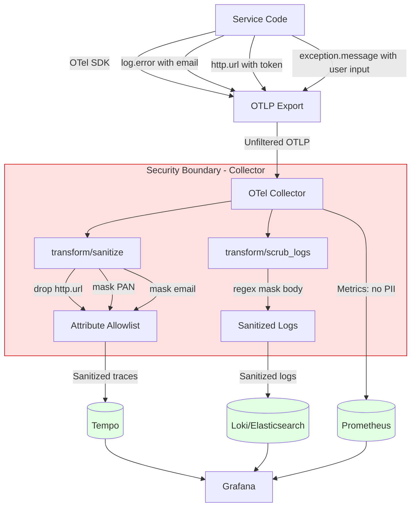

## Keywords in This File

{: .no_toc }

| #   | Keyword | Weight |
| --- | ------- | ------ |
| 1   | [Sensitive Data Security in Observability Pipelines](#sensitive-data-security-in-observability-pipelines) | critical |

---

# Sensitive Data Security in Observability Pipelines

**TL;DR** - Sensitive data (PII, PHI, payment card data, auth
tokens) leaks into observability pipelines through log interpolation,
exception messages, auto-instrumented HTTP bodies, and span
attributes - and once written to append-only stores like
Elasticsearch or S3, selective deletion under GDPR or PCI-DSS
is prohibitively expensive, making collection-point sanitization
the only scalable defense.

---

### 🎯 Model Answer

**30 seconds:**
> Observability pipelines are a common PII leak vector because
> developers log variables that contain user data, OTel auto-
> instrumentation captures HTTP request bodies and query strings
> with tokens, and exception messages include user input verbatim.
> Once this data is in Elasticsearch or a log archive on S3, GDPR's
> "right to erasure" becomes extremely expensive to comply with -
> you'd need to rewrite immutable log archives. The defense is
> sanitization at the collection point, not at the storage layer:
> the OTel Collector scrubs and masks attributes before they leave
> your network, using an allowlist of safe attributes rather than
> a blocklist of known-sensitive ones.

**3 minutes (Senior):**
> The threat model for observability data security has three
> distinct dimensions. First, regulatory compliance: GDPR requires
> the ability to delete a specific user's personal data on request;
> HIPAA requires that protected health information never appears
> in logs accessible to non-healthcare-authorized systems; PCI-DSS
> prohibits storing full PANs (Primary Account Numbers) anywhere,
> including debug logs. Observability stores are almost never
> designed to support selective record deletion - they're write-
> optimized append-only systems. An Elasticsearch index with 3
> months of logs cannot efficiently delete records containing
> a specific user's email address.
>
> Second, data exfiltration risk: observability data is typically
> more widely accessible than production databases. Your Grafana
> instance, Kibana dashboard, and PagerDuty alert payloads are
> accessible to the entire engineering team. If your production
> database is properly access-controlled but your application
> logs user account numbers in error messages, the observability
> system is the weakest link.
>
> Third, the auto-instrumentation blindspot: OTel auto-
> instrumentation for HTTP frameworks (Spring, Flask, Express)
> automatically captures URL path parameters, query strings,
> and sometimes request bodies as span attributes. The query
> string `?reset_token=abc123xyz&email=user@example.com` becomes
> a span attribute automatically. Without attribute filtering,
> password reset tokens and email addresses flow into your trace
> backend.
>
> The architectural defense: treat the OTel Collector as a data
> security boundary. All telemetry flows through the Collector
> before reaching any backend. The Collector's `transform`
> processor applies an allowlist of safe attributes (service
> name, HTTP method, HTTP status code, error type) and drops
> or masks everything else. The transform processor can also
> apply regex-based masking (replace 16-digit sequences with
> XXXX-XXXX-XXXX-XXXX). The Collector is the one place in your
> pipeline where data sanitization is centrally enforced.

**Framework:** WHAT -> WHY -> HOW -> TRADE-OFF -> EXAMPLE

*Adapting up:* Staff engineers define the data classification
policy (what categories of data are safe for observability vs.
require masking vs. must be dropped), implement it in the OTel
Collector configuration enforced by policy-as-code, design the
audit trail for data access to observability backends, and
establish compliance review checkpoints in the deploy pipeline
that verify no new PII-bearing attributes were added.

*Adapting down:* "Observability data is like the receipts from
your database operations. If you write a customer's credit card
number on the receipt to help debug a payment issue, and then
that receipt gets stored in a filing cabinet accessible to 200
engineers, you've violated PCI-DSS. Sanitize the receipt before
it gets filed."

**Blank Mind Recovery:**

**(1) Restate:** "You are asking about sensitive data in
observability pipelines - let me think through how PII gets
in, why it's a compliance problem, and how to prevent it."

**(2) First principles:** "From first principles, observability
systems collect operational data that describes what code is
doing. Code processes user data. When developers log or trace
their code's behavior, they often include the data they're
processing. The challenge is separating 'what the code did'
(safe to log) from 'what data it processed' (often sensitive)."

**(3) Bridge:** "This is similar to the database principle of
not storing more than you need. In observability, the equivalent
is: log the shape of the operation (user lookup, payment
processing) not the content (user email, card number). The
OTel Collector is the enforcement point, equivalent to a
parameterized query preventing SQL injection at the DB layer."

---

### 📘 Concept Explanation

**What it is:**
Sensitive data security in observability pipelines is the
practice of identifying, preventing, masking, and governing
the flow of personally identifiable information (PII),
protected health information (PHI), payment card data (PCI),
authentication credentials, and other regulated data through
metrics, logs, trace, and profiling systems - so that operational
debugging data does not become a compliance liability or
exfiltration vector.

**The problem it solves:**
Modern application frameworks, OTel auto-instrumentation, and
verbose logging practices routinely include user data in
telemetry. A Spring `@GetMapping` endpoint auto-instrumented
with OTel will include URL parameters in span attributes. An
exception handler logging `e.getMessage()` will include the
user input that caused the exception. A "slow query" log
statement including the full SQL query may include parameters
with user email addresses. This data flows from application
containers to log aggregation (Elasticsearch, Loki), trace
backends (Tempo, Jaeger, Honeycomb), and metrics systems,
all of which: have broader access than the production database;
retain data for months on append-only storage; feed alert
payloads to PagerDuty and Slack; and are exported to data
warehouses for analysis. Once sensitive data reaches these
systems, GDPR's right to erasure, HIPAA's minimum necessary
standard, and PCI-DSS prohibition on storing PANs become very
expensive compliance problems.

**How it works:**

```
Observability Data Security Architecture
==========================================

Application Tier:
  [Service A] [Service B] [Service C]
      |            |           |
      v            v           v
  OTel SDK (auto-instrument + manual spans)
      |
      +-- RISK ZONE: spans include URL params,
          exception messages, request headers
      v
  OTel Collector (SECURITY BOUNDARY)
  +------------------------------------------+
  | Step 1: attribute allowlist filter        |
  |   DROP: http.url (may have tokens)        |
  |   KEEP: http.method, http.status_code     |
  |   KEEP: http.route (path template, safe)  |
  |                                           |
  | Step 2: regex masking                     |
  |   PAN: r"\d{16}" -> "XXXX-XXXX-XXXX-XXXX"|
  |   Email: r"\w+@\w+\.\w+" -> "[redacted]"  |
  |   Token: r"[a-z0-9]{32,}" -> "[token]"   |
  |                                           |
  | Step 3: log body scrubbing                |
  |   "user email: bob@x.com"                 |
  |   -> "user email: [redacted]"             |
  |                                           |
  | Step 4: sampling (reduce volume)         |
  |   keep 100% errors + slow traces          |
  |   keep 1% everything else                 |
  +------------------------------------------+
      |
      v (sanitized telemetry only)
  Backends:
    Prometheus (metrics, no PII vectors)
    Tempo/Jaeger (traces, attributes clean)
    Loki/Elasticsearch (logs, bodies scrubbed)
```

The enforcement strategy: allowlist over blocklist. A blocklist
of known-sensitive attributes (email, ssn, card_number) misses
new PII-bearing attributes as developers add them. An allowlist
of explicitly approved attributes (http.method, http.status_code,
db.system, service.name) drops everything not explicitly permitted.
Developers who need a new attribute in observability must add it
to the allowlist with a security review, not discover it was
accidentally included.

**The key insight:**
Observability stores are almost universally append-only and not
designed for selective deletion. Elasticsearch can delete
documents by query, but rebuilding the inverted index after bulk
deletions takes hours and costs significant I/O. S3 log archives
cannot be retroactively edited without rewriting entire files.
Kafka topics with log compaction delete old versions but don't
support surgical "delete all messages containing this user's email."
The compliance cost of retroactive remediation is 100x the cost
of collection-point prevention. Scrub at ingress, always.

**When to use it:**
Apply observability pipeline security controls whenever you handle
user PII (any consumer-facing system under GDPR), PHI (healthcare
under HIPAA), payment card data (PCI-DSS), or authentication
credentials. Also applicable for internal SaaS tools where
employee data flows through the application. The minimum viable
posture: allowlist attribute filtering in the OTel Collector
plus regex-based masking for patterns that auto-instrumentation
might capture.

**When NOT to use it:**
Do not over-mask to the point of making observability useless.
A trace with 100% of attributes redacted cannot help diagnose
production incidents. The goal is structured masking: preserve
operational signal (service name, HTTP method, status code, span
duration, error type) while removing content signal (user data,
credentials, payment data). Calibrate the allowlist to preserve
the attributes needed for incident investigation, not the minimum
required by regulations.

**Alternatives:**
- Data Loss Prevention (DLP) scanning at storage ingestion: scan
  documents on write with regex-based DLP rules, reject on match;
  works for logs, adds latency and cost; misses metrics/traces
- Tokenization: replace PII with a reversible token (e.g., user
  email -> UUID); enables correlation without storing raw PII;
  requires a token store and is complex for span attributes
- Data masking at query time: allow raw data in storage but apply
  masking when queries are served to non-privileged users; complex
  to enforce consistently; leaves raw PII in storage (GDPR risk)
- Per-environment sanitization: only apply masking in production,
  allow full data in staging; risky if staging uses production
  data copies; usually insufficient for compliance

**First-principles derivation:**
Data security requires controlling access and minimizing exposure.
In observability, access control is weak by design (observability
must be accessible to on-call engineers during incidents - you
can't have MFA + approval workflows when diagnosing a P0).
Therefore, minimize exposure: don't collect sensitive data in the
first place. The OTel Collector is the enforcement point because
it is the single pipeline component through which all telemetry
flows before distribution to multiple backends. Enforcing the
policy once in the Collector is equivalent to enforcing it in
all downstream systems simultaneously. This is the principle of
"defense at the narrowest point in the pipeline."

---

### 💻 Code Example

**Example 1: BAD - Auto-instrumentation capturing sensitive URL
parameters and exception messages verbatim**

```java
// BAD: Spring controller with OTel auto-instrumentation
// Auto-instrumentation captures the full URL as a span attribute
// including query parameters that contain sensitive data

@RestController
public class UserController {

    @GetMapping("/api/users/reset-password")
    public ResponseEntity<Void> resetPassword(
        @RequestParam String email,
        @RequestParam String token
    ) {
        // OTel auto-instrumentation AUTOMATICALLY captures:
        // http.url = "/api/users/reset-password?
        //   email=user@example.com&token=abc123xyz789..."
        // This goes into EVERY trace for this endpoint
        // -> email and token are now in your trace backend
        // -> accessible to all engineers with Grafana access
        // -> retained for 30-90 days per your retention policy

        try {
            userService.resetPassword(email, token);
            return ResponseEntity.ok().build();
        } catch (InvalidTokenException e) {
            // BAD: logging the exception message which contains
            // the user's email and the attempted token
            log.error(
                "Password reset failed: {}",
                e.getMessage()
                // getMessage() = "Invalid token for user@example.com"
                // This log line contains PII
            );
            throw e;
        }
    }
}

// BAD: Logging SQL query content in slow query debug logging
@Repository
public class UserRepository {
    public User findByEmail(String email) {
        String sql = "SELECT * FROM users WHERE email = '"
            + email + "'";
        // BAD: also SQL injection vulnerability
        log.debug("Executing query: {}", sql);
        // -> "Executing query: SELECT * FROM users
        //     WHERE email = 'user@example.com'"
        // -> Email is now in your log aggregation system
        return jdbcTemplate.queryForObject(sql, userRowMapper);
    }
}
```

> **Code walkthrough:** Three BAD patterns in one controller: OTel
> auto-instrumentation captures the full URL with email and token
> query parameters, the exception message includes the user's
> email address and is logged verbatim, and the SQL query is
> constructed with string concatenation (SQL injection risk) AND
> logged with the email embedded. Each of these produces PII in
> different observability backends: the span attribute goes to
> Tempo/Honeycomb, the log line goes to Elasticsearch/Loki, and
> the "slow query" log goes to both. GDPR right to erasure now
> requires deleting from three append-only backends.

**Example 2: GOOD - OTel Collector sanitization pipeline**

```yaml
# OTel Collector config: sanitize spans before forwarding
# This is the CENTRAL enforcement point for all services

receivers:
  otlp:
    protocols:
      grpc:
        endpoint: 0.0.0.0:4317

processors:
  # Step 1: Allowlist - keep only safe span attributes
  # Drop everything not explicitly permitted
  attributes/allowlist:
    actions:
      # Keep these safe operational attributes:
      - key: http.method
        action: upsert
      - key: http.status_code
        action: upsert
      - key: http.route       # path template, not actual URL
        action: upsert
      - key: db.system
        action: upsert
      - key: db.operation     # SELECT/INSERT, not the query
        action: upsert
      - key: error.type
        action: upsert
      - key: service.name
        action: upsert
      # Everything else: drop via transform processor below

  # Step 2: Transform - drop known-sensitive attributes
  # and mask patterns that slip through
  transform/sanitize:
    error_mode: ignore
    trace_statements:
      - context: span
        statements:
          # Drop URL - may contain tokens and PII
          - delete_key(attributes, "http.url")
          # Drop request headers - auth tokens
          - delete_key(attributes, "http.request.header.authorization")
          - delete_key(attributes, "http.request.header.cookie")
          # Drop query string - tokens, emails
          - delete_key(
              attributes,
              "http.request.query_string"
            )
          # Mask 16-digit sequences (payment card numbers)
          # Pattern: 4 groups of 4 digits
          - replace_pattern(
              attributes["db.statement"],
              "\\b\\d{4}[\\s-]?\\d{4}[\\s-]?\\d{4}[\\s-]?\\d{4}\\b",
              "XXXX-XXXX-XXXX-XXXX"
            )
          # Mask email addresses in any remaining string values
          - replace_pattern(
              attributes["exception.message"],
              "[a-zA-Z0-9._%+-]+@[a-zA-Z0-9.-]+\\.[a-zA-Z]{2,}",
              "[email-redacted]"
            )
          # Drop DB statement body (may have user data as params)
          # Keep only db.operation (SELECT/UPDATE/DELETE)
          - delete_key(attributes, "db.statement")

  # Step 3: Log body scrubbing for log pipeline
  transform/scrub_logs:
    error_mode: ignore
    log_statements:
      - context: log
        statements:
          # Mask emails in log body
          - replace_pattern(
              body,
              "[a-zA-Z0-9._%+-]+@[a-zA-Z0-9.-]+\\.[a-zA-Z]{2,}",
              "[email-redacted]"
            )
          # Mask tokens (32+ alphanumeric chars after '=')
          - replace_pattern(
              body,
              "token=[a-zA-Z0-9]{32,}",
              "token=[redacted]"
            )
          # Mask credit card patterns
          - replace_pattern(
              body,
              "\\b\\d{4}[\\s-]?\\d{4}[\\s-]?\\d{4}[\\s-]?\\d{4}\\b",
              "XXXX-XXXX-XXXX-XXXX"
            )

  batch:
    timeout: 5s

exporters:
  otlp/tempo:
    endpoint: tempo:4317
    tls:
      insecure: true
  loki:
    endpoint: http://loki:3100/loki/api/v1/push
  prometheusremotewrite:
    endpoint: http://prometheus:9090/api/v1/write

service:
  pipelines:
    traces:
      receivers: [otlp]
      processors:
        [transform/sanitize, batch]
      exporters: [otlp/tempo]
    logs:
      receivers: [otlp]
      processors:
        [transform/scrub_logs, batch]
      exporters: [loki]
```

> **Code walkthrough:** The OTel Collector configuration implements
> a three-layer defense: first the `transform/sanitize` processor
> drops known-sensitive span attributes (http.url, authorization
> header, full db.statement, cookie) and applies regex masking
> for PAN and email patterns that might have slipped through in
> exception messages or remaining attributes. Second, the
> `transform/scrub_logs` processor applies regex masking to log
> body content for emails, tokens, and card numbers. The processors
> run in the pipeline before any exporter, ensuring all backends
> receive only sanitized data. The `error_mode: ignore` setting
> means a transform failure does not drop the span entirely - it
> continues with whatever attributes remain.

**Example 3: GOOD - Safe instrumentation patterns in application code**

```java
// GOOD: Manual span instrumentation that avoids capturing PII

@RestController
public class UserController {

    @GetMapping("/api/users/reset-password")
    public ResponseEntity<Void> resetPassword(
        @RequestParam String email,
        @RequestParam String token
    ) {
        Span span = Span.current();

        // GOOD: Log the shape of the operation, not the content
        // - Record that we received a reset request (no email)
        // - Record boolean outcomes, not the data itself
        span.setAttribute(
            "password_reset.requested", true
        );
        // GOOD: Record user tier (business-relevant, not PII)
        // using a non-identifying opaque ID
        try {
            User user = userService
                .findByEmail(email);  // email stays in DB layer
            span.setAttribute(
                "user.tier",
                user.getTier().name()  // free/premium, not email
            );
            span.setAttribute(
                "user.id",
                // Use opaque internal ID, not email
                user.getInternalId()
            );

            userService.resetPassword(user, token);
            span.setAttribute(
                "password_reset.success", true
            );
            return ResponseEntity.ok().build();
        } catch (InvalidTokenException e) {
            span.setAttribute(
                "password_reset.success", false
            );
            span.setAttribute(
                "error.type",
                "INVALID_TOKEN"  // error type, not user's email
            );
            // GOOD: Log structured error without PII
            log.warn(
                "Password reset attempt failed "
                + "[error_type=INVALID_TOKEN "
                + "user_tier={}]",
                // Log user tier (safe) not email (PII)
                span.getAttribute(
                    AttributeKey.stringKey("user.tier")
                )
            );
            return ResponseEntity.badRequest().build();
        }
    }
}

// GOOD: Safe slow query logging using parameterized queries
// and logging only metadata, not SQL content
@Repository
public class UserRepository {
    public User findByEmail(String email) {
        // GOOD: parameterized query (also prevents SQL injection)
        String sql =
            "SELECT * FROM users WHERE email = ?";
        StopWatch sw = new StopWatch();
        sw.start();
        User result = jdbcTemplate.queryForObject(
            sql,
            userRowMapper,
            email  // parameter, not concatenated
        );
        sw.stop();
        if (sw.getTotalTimeMillis() > 100) {
            // GOOD: log query shape + timing, not SQL content
            log.warn(
                "Slow query [operation=find_user_by_email "
                + "duration_ms={}]",
                sw.getTotalTimeMillis()
            );
        }
        return result;
    }
}
```

> **Code walkthrough:** Three GOOD patterns: the span captures
> the operation shape (tier, outcome, error type) using opaque
> identifiers (user.id as internal ID, error.type as a code)
> rather than user content (email, token). The log warning records
> operational metadata (error type, user tier, duration) without
> any user-identifying data. The repository uses parameterized
> queries (SQL injection protection) and logs only the query
> name and timing, not the SQL statement with parameters. Together,
> these give full observability into "how many reset requests
> failed, for which user tiers, with which error types" without
> any personal data appearing in any observability backend.

**Example 4: Compliance audit - detecting PII leaks in existing
telemetry**

```bash
# Audit existing traces/logs for PII leaks
# Run this before deploying sanitization to understand exposure

# Scan Elasticsearch logs for email patterns
curl -X GET "http://elasticsearch:9200/logs-*/_search" \
  -H "Content-Type: application/json" \
  -d '{
    "size": 10,
    "query": {
      "regexp": {
        "message": "[a-zA-Z0-9._%+-]+@[a-zA-Z0-9.-]+\\.[a-zA-Z]{2,}"
      }
    },
    "_source": ["@timestamp", "service.name", "message"],
    "highlight": {
      "fields": {"message": {}}
    }
  }'
# Returns: log lines containing email patterns
# -> shows which services and log levels have PII exposure

# Scan Tempo traces for PII-bearing span attributes
# Using tempo-cli or direct parquet scan
tempo-cli query tag-values \
  --tag="http.url" \
  --service="checkout-service" \
  --start=$(date -d "1 hour ago" +%s) \
  --end=$(date +%s) \
  | grep -E "email=|token=|card="
# Returns: http.url values that contain sensitive params

# Check ClickHouse spans for sensitive attribute keys
echo "SELECT
    arrayJoin(SpanAttributes.keys) AS attr,
    count() AS occurrences
FROM otel_traces
WHERE Timestamp > now() - INTERVAL 1 HOUR
    AND (
        attr LIKE '%email%'
        OR attr LIKE '%password%'
        OR attr LIKE '%token%'
        OR attr LIKE '%card%'
        OR attr LIKE '%ssn%'
    )
GROUP BY attr
ORDER BY occurrences DESC" \
  | clickhouse-client -h clickhouse
# Returns: sensitive attribute keys present in traces
```

> **Code walkthrough:** The audit queries scan all three observability
> backends for known PII patterns: email regex in Elasticsearch
> logs, http.url with sensitive parameters in Tempo traces, and
> suspicious attribute key names in ClickHouse spans. This gives
> a baseline exposure assessment before deploying the OTel Collector
> sanitization. The output drives the sanitization policy: services
> that appear frequently in the results need either application-
> code instrumentation fixes or Collector transform rules. Run
> this scan after every major OTel upgrade (new auto-instrumentation
> may capture new attributes) and after adding new integrations
> (new SDK features may introduce new attribute names).

---

### 🎓 Answers by Seniority

**Junior / Mid (0-5 years):**
> Observability pipelines are a common place for PII to leak
> because developers log or trace user data while debugging
> features. Common sources: logging `user.email` in error handlers,
> OTel auto-instrumentation capturing URL query strings that
> contain tokens or emails, and exception messages that include
> the input that caused the error. The fix has two parts: in
> application code, log structured fields with opaque identifiers
> (user ID, error type code) instead of user content; and in the
> OTel Collector, add a transform processor that masks or drops
> known-sensitive attribute patterns before they reach the
> backend. The Collector is the safety net for attributes that
> slip through application-level discipline.

For mid-level: compliance requirements matter here - GDPR's right
to erasure is very hard to fulfill in append-only observability
stores. The golden rule is: prevent PII from entering the pipeline
entirely, because removing it afterward is extremely expensive.
The OTel Collector's transform processor is the right place to
apply a centralized allowlist of safe attributes.

*Push deeper:* The priority order for fixing PII in observability:
(1) fix at source (change application code to not log PII), (2)
add Collector sanitization as safety net, (3) add DLP scanning
at storage ingestion as a last resort. Source fixes are cheaper
because they also improve code quality; Collector fixes are
cheaper than storage-layer remediation.

---

**Senior / Staff (5+ years):**
> I treat the OTel Collector as a data security boundary in the
> same way I treat a WAF as a network security boundary. All
> telemetry flows through a centrally configured Collector before
> reaching any backend. The Collector configuration is under
> version control and reviewed in PRs. The transform processor
> implements an attribute allowlist: only explicitly approved
> attributes pass through; all others are dropped. This is more
> robust than a blocklist of known-bad attributes because new PII-
> bearing attributes (added by developers or new OTel versions)
> are blocked by default. I've seen the blocklist approach fail
> when a new OTel HTTP instrumentation version started including
> http.request.body as a span attribute - it shipped to production
> for 3 weeks before someone noticed the user passwords in traces.
>
> For GDPR compliance, I define a retention policy by data
> category: operational telemetry (service name, HTTP method,
> status code, duration) - 90 days. Any trace or log that
> somehow contains PII despite the Collector sanitization -
> 7 days with automated deletion. I implement this by running
> a weekly audit scan (similar to the Elasticsearch query above)
> against all backends with a policy that any backend storing
> potential PII automatically triggers a 7-day TTL policy
> for that index or partition.

At staff level: the governance model matters. Defining which
attributes are allowed in observability is a data classification
decision that should be owned by the platform team, ratified by
a security review, and enforced via automated policy-as-code
(OPA policies on the Collector config, not just code review).
Developers who need a new attribute must submit a PR to the
Collector allowlist with a security justification. This creates
an audit trail and prevents PII from slipping through as "it was
just for debugging." I also integrate the attribute audit scan
into CI/CD: every deploy triggers a 30-minute post-deploy scan
of the new traces for PII patterns, with a Slack alert if any
are found.

*Push deeper:* The PCI-DSS scope reduction angle is important:
if observability backends never receive cardholder data (PANs,
CVVs), your observability infrastructure is out of PCI scope.
This is a significant compliance and audit cost reduction. The
Collector transform processor that masks PANs and drops payment
card attributes is not just a data hygiene measure - it shrinks
your PCI audit surface area by removing observability backends
from the cardholder data environment.

---

### ⚠️ Common Misconceptions

**Misconception 1: "OTel auto-instrumentation only captures safe
operational data."**
OTel HTTP auto-instrumentation captures span attributes according
to OTel semantic conventions, which include `http.url` (full URL
with query parameters), `http.request.header.*` (all HTTP headers),
and in some SDKs `http.request_content_length` and body capture
for specific content types. The full URL contains query parameters:
`/api/reset?email=user@example.com&token=resettoken123` becomes
a span attribute as-is. Auth headers (Authorization: Bearer <token>)
are sometimes included depending on the SDK version and
configuration. The OTel specification does NOT auto-redact these
- that is the application operator's responsibility. Check your
OTel SDK version's default attribute capture behavior and test
with a proxy intercepting the gRPC to your Collector.

**Misconception 2: "You can delete PII from observability stores
after it's been written."**
Elasticsearch supports delete-by-query, but it marks documents
as deleted and defers the actual deletion to segment merging,
which may not happen until the next index rollover. The inverted
index is not immediately updated, meaning the deleted data may
still appear in searches for hours. Index lifecycle management
can eventually drop old data, but surgical deletion by email
address across 90 days of logs is an I/O-intensive operation
that can destabilize the cluster. Loki on S3 has no selective
deletion capability - you'd need to rewrite entire chunks. S3
log archives require rewriting entire files. The cost of
retroactive deletion is consistently an order of magnitude higher
than prevention. Compliance teams sometimes accept the risk
because they don't understand the operational cost of retroactive
deletion until it becomes necessary.

**Misconception 3: "Masking PII with a hash still counts as GDPR
compliance."**
GDPR applies to any data that can identify a natural person,
including pseudonymized data (hashed identifiers) if the hash
can be reversed or if the hashed value can be linked back to
an individual by cross-referencing other data. Hashing
`user@example.com` to `SHA256(user@example.com)` does not
anonymize it under GDPR if your system stores the plaintext
email alongside the hash. The correct interpretation: if the
observability system cannot be used to identify a specific
individual without cross-referencing other controlled systems,
it may be outside GDPR scope for that specific data point.
This requires legal review for your specific use case. The
pragmatic engineering approach: drop PII entirely where possible;
use opaque internal IDs (database-generated UUIDs, not derived
from personal data) where a user identifier is operationally
needed.

**Misconception 4: "A blocklist of known-sensitive field names
is sufficient."**
A blocklist catches known fields (email, password, card_number,
ssn) but misses new fields added by developers or new OTel SDK
versions. When a developer adds `user.billing_address` or when
OTel starts capturing `db.statement` by default (which may
contain parameterized values), the blocklist does not protect
against these new vectors. The allowlist approach (only permitted
attributes pass through) is the correct model. Every new attribute
requires explicit review and addition to the allowlist. This
creates friction but prevents the "3 weeks of passwords in
traces before someone noticed" failure mode.

**Misconception 5: "Application developers should handle all
PII sanitization in their code."**
Relying solely on developer discipline produces inconsistent
results across a large engineering organization. New developers
don't know the PII policy. Auto-instrumentation adds attributes
outside developer control. Library updates introduce new attribute
capture. The Collector-level sanitization is not a replacement
for developer education - it's a defense in depth layer. The
correct model: educate developers to avoid logging PII in code
(primary prevention) AND enforce an attribute allowlist in the
Collector (secondary prevention). Either layer alone is
insufficient; both together make the pipeline robust to
individual mistakes.

---

### 🚨 Failure Modes and Diagnosis

**Failure 1: OTel upgrade silently introduces new PII-bearing
span attributes**

Symptom: Security audit finds email addresses in trace span
attributes in Tempo/Honeycomb 3 weeks after an OTel SDK upgrade.
The team had Collector blocklist rules for `http.url` but not
for `http.request.header.x-user-email` which the new OTel HTTP
SDK version started capturing automatically.

Cause: OTel SDK semantic conventions evolve across versions.
The HTTP instrumentation in OTel Java SDK 1.26+ added capture
of additional HTTP request headers. The team's Collector
transform blocklist was written for SDK 1.20 conventions.

Diagnosis:
```bash
# Check which OTel SDK version is running
grep "opentelemetry" services/pom.xml
# opentelemetry-bom: 1.26.0

# Check what new attributes version 1.26 added
# https://opentelemetry.io/docs/specs/semconv/changelog/
# HTTP: added http.request.header.* capture for common headers

# Scan traces for the new attribute
tempo-cli query tag-names \
  --service="user-service" \
  --start=$(date -d "7 days ago" +%s) \
  --end=$(date +%s) \
  | grep -E "header|auth|email|user"
# Output: http.request.header.x-user-email (new)

# Measure exposure
echo "SELECT
  count() AS traces_with_email,
  min(Timestamp), max(Timestamp)
FROM otel_traces
WHERE SpanAttributes['http.request.header.x-user-email']
  != ''
  AND Timestamp > now() - INTERVAL 30 DAY" \
  | clickhouse-client -h clickhouse
```

Fix immediate: add `delete_key(attributes, "http.request.header.x-user-email")` to the Collector transform processor. Deploy immediately. For the root cause: switch from blocklist to allowlist in the Collector - this specific attack vector becomes impossible. Add the OTel changelog review to the SDK upgrade checklist. Add the audit scan to CI/CD post-deploy checks.

**Failure 2: Exception messages including user input appear
in structured logs**

Symptom: Kibana search for a specific email address returns
log lines from the payment service with exception messages
including the email and the last 4 digits of a card.

Cause: The payment service exception handler logs the full
exception including `e.getMessage()`. The underlying validation
library includes the input that failed validation in its
exception messages: `"Invalid email format: user@example.com"`.
The Collector log scrubbing was configured but the regex was
not matching due to an escape character issue.

Diagnosis:
```bash
# Test the Collector regex on a sample log line
# Using otelcol's built-in telemetry or debug exporter
cat <<EOF | docker exec -i otelcol-debug \
  otelcol-debugger --test-transform
log body: "Invalid email format: user@example.com card: 4532015112830366"
transform statement: replace_pattern(body, "[a-zA-Z0-9._%+-]+@[a-zA-Z0-9.-]+\.[a-zA-Z]{2,}", "[email-redacted]")
EOF
# Test if the regex matches. Common mistake: unescaped dot
# "\." vs "." - period in regex matches any character
# Correct escape in YAML: "\\." (YAML escape + regex escape)

# Verify Collector config YAML escaping
grep -A5 "replace_pattern" /etc/otelcol/config.yaml
# Incorrect: "[a-zA-Z0-9._%+-]+@[a-zA-Z0-9.-]+\.[a-zA-Z]{2,}"
#   (single backslash consumed by YAML parser)
# Correct:   "[a-zA-Z0-9._%+-]+@[a-zA-Z0-9.-]+\\.[a-zA-Z]{2,}"
#   (double backslash: one for YAML, one for regex)
```

Fix: correct the YAML escape in the Collector config. Redeploy
Collector. For application-side fix: wrap validation exception
messages to not include user input: `throw new ValidationException("Email format invalid")` instead of the library's default message. Add unit tests for exception message content as part of the PII test suite.

**Failure 3: Metrics labels created with high-cardinality PII
(email as a label value)**

Symptom: Prometheus runs out of memory 48 hours after a new
feature deploy. Investigation finds a new metric
`user_actions_total{user_email="..."}` with millions of unique
label values - one per unique user email.

Cause: A developer added user email as a Prometheus metric label
to track per-user activity, not realizing (a) Prometheus cannot
handle millions of unique label values and (b) this creates GDPR
exposure in Prometheus + long-term storage (Thanos/Cortex).

Diagnosis:
```bash
# Find the metric causing the cardinality explosion
curl -s "http://prometheus:9090/api/v1/label/__name__/values" \
  | jq '.data | .[]' | while read metric; do
    count=$(curl -s \
      "http://prometheus:9090/api/v1/series?match[]=${metric}" \
      | jq '.data | length')
    if [ "$count" -gt 10000 ]; then
      echo "HIGH: ${metric} has ${count} series"
    fi
  done
# Output: user_actions_total has 2,847,392 series

# Identify the high-cardinality label
curl -s "http://prometheus:9090/api/v1/labels" \
  | jq '.data | .[]' | grep -v "^__"
# Output includes: user_email (new high-cardinality label)

# Check when it was introduced
curl -s "http://prometheus:9090/api/v1/query?query=count\
  (user_actions_total{user_email=~'.+'}) by (user_email)" \
  | jq '.data.result | length'
# Returns millions -> confirms the issue
```

Fix immediate: delete the metric from Prometheus (POST to
`/api/v1/admin/tsdb/delete_series?match[]=user_actions_total`
followed by `POST /api/v1/admin/tsdb/clean_tombstones`). Remove
the user_email label from the metric instrumentation code.
Replace with aggregated metrics: `user_actions_total{user_tier="enterprise"}` (low cardinality, safe). Add cardinality validation
to CI/CD: Prometheus rule linting tools can catch labels with
unbounded cardinality based on label naming conventions.

---

### 🎯 Interview Deep-Dive

| Time | Question Type | Depth Signal |
| ---- | ------------- | ------------ |
| 2 min | CONCEPTUAL | PII leak vectors in observability |
| 3 min | ARCHITECTURE | OTel Collector as security boundary |
| 3 min | DEBUGGING | Finding PII in existing telemetry |
| 4 min | TRADE-OFF | Allowlist vs blocklist approach |
| 4 min | PRODUCTION | GDPR erasure compliance for logs |
| 4 min | SYSTEM DESIGN | Observability pipeline security architecture |
| 3 min | HANDS-ON | Collector transform processor config |
| 3 min | COMPARISON | PII in logs vs traces vs metrics |
| 4 min | DEEP DIVE | PCI-DSS scope and cardholder data |
| 4 min | BEHAVIORAL | PII incident war story |
| 3 min | PERFORMANCE | Sanitization overhead in the pipeline |
| 3 min | MISCONCEPTION | "Hashed PII is GDPR-compliant" trap |

---

**Q1 [MID]: What are the most common ways PII enters observability
pipelines?** `[CONCEPTUAL]`

*Why they ask:* Tests baseline awareness. Engineers who haven't
thought about this answer "when developers log the wrong thing."
Engineers with production experience name specific vectors.

*Likely follow-up:* "Which vector is hardest to prevent?"

Five vectors, ranked by how surprising they are to engineers:

(1) Explicit developer logging: `log.error("User {} failed checkout: {}", user.getEmail(), exception.getMessage())`. Most visible and easiest to fix with code review.

(2) OTel auto-instrumentation: the HTTP instrumentation automatically captures `http.url` (with query strings containing tokens and emails), `http.request.header.*` (including Authorization and custom user-ID headers), and in some SDK versions request body fragments. Not visible in the application code - requires reviewing the OTel SDK documentation for your version.

(3) Exception messages: Java validation libraries (Hibernate Validator, Spring Validation) include the invalid value in exception messages: "must be a well-formed email address: 'user@example.com'". If these exceptions are logged or captured as span events, the email is in observability.

(4) Database slow query logging: ORMs and JDBC loggers configured to log slow queries include the SQL statement with parameter values substituted in (some drivers do this by default for readability). A slow `SELECT * FROM users WHERE email = ?` becomes `SELECT * FROM users WHERE email = 'user@example.com'` in the slow query log.

(5) Metrics label cardinality mistakes: a developer adds `user_email` as a Prometheus label "just to debug this incident" and forgets to remove it. Millions of unique label values crash Prometheus and create GDPR exposure simultaneously.

The hardest to prevent is (2) because it requires reviewing OTel SDK release notes after every upgrade - application code reviews won't catch it.

*What separates good from great:* Naming OTel auto-instrumentation as a non-obvious vector and explaining that it requires SDK-level review, not application code review.

---

**Q2 [SENIOR]: Why is the OTel Collector the right place to
enforce data sanitization rather than each individual service?** `[ARCHITECTURE]`

*Why they ask:* Tests architectural reasoning and understanding
of enforcement points vs. per-service discipline.

*Likely follow-up:* "What happens if a service bypasses the Collector?"

The OTel Collector is the correct enforcement point for three reasons:

(1) Centralization: all telemetry flows through a Collector before reaching any backend. Configuring one Collector transform processor is equivalent to deploying the same sanitization to all 500 services simultaneously. Per-service enforcement requires coordinated deployment across all services and breaks down when services use different OTel SDK versions, different languages, or are maintained by different teams.

(2) Defense in depth against auto-instrumentation: OTel auto-instrumentation adds attributes at the SDK level, inside the service. Application code cannot suppress it without modifying SDK configuration. The Collector is outside the SDK and can filter attributes after they're generated but before they reach the backend. It's the safety net for attribute capture that developers cannot control.

(3) Auditability: Collector configuration is under version control, reviewed in PRs, and deployed via GitOps. You can audit what sanitization is applied and when it was changed. Per-service sanitization code is scattered across dozens of repositories with inconsistent implementation.

The limitation: the Collector cannot sanitize log messages that are generated inside the application and exported as pre-formatted strings. If a developer formats a log message with an email embedded (`"Processing request for user@example.com"`) before it reaches the OTel logs SDK, the Collector receives an opaque string and can only apply regex masking (blunt instrument, may cause false positives). Source-level fix is required for log body content; Collector is reliable for structured attributes.

*What separates good from great:* The defense-in-depth argument that the Collector catches auto-instrumentation attributes that application code cannot suppress.

---

**Q3 [SENIOR]: How does GDPR's right to erasure conflict with
observability data retention, and how do you handle it?** `[PRODUCTION]`

*Why they ask:* Tests practical compliance experience. This is
a real production challenge that many teams encounter.

*Likely follow-up:* "What do you tell a user who requests erasure
of data that is in your logs?"

GDPR Article 17 (right to erasure) requires that organizations delete a person's personal data on request without undue delay. Observability stores are almost universally designed for write-optimized append-only access - they are not designed for surgical deletion of records associated with a specific person.

In practice: Elasticsearch can execute a delete-by-query, but the documents aren't immediately removed from the inverted index - they're marked as deleted and the index is rebuilt at the next segment merge (which may be hours or days later). S3 log archives require rewriting entire files to remove records. Loki on S3 has no selective deletion API at all. These are fundamentally incompatible with the "without undue delay" requirement.

The legally defensible approaches: (1) argue that observability data does not constitute personal data under GDPR because it doesn't identify a natural person without disproportionate effort - this requires that PII never enters the pipeline in the first place; (2) implement data subject requests as "delete within 30 days" by setting very short retention policies for any log data that might contain PII (7-day retention means every piece of data is gone within 7 days, satisfying the "without undue delay" requirement when combined with a processing period); (3) hash all user identifiers to pseudonyms in observability data such that the pseudonym cannot be linked back to the person without the mapping table, which is kept separately under access controls.

The practical engineering answer: the cheapest GDPR compliance strategy is the OTel Collector allowlist that prevents PII from entering observability in the first place. With no PII in observability backends, GDPR erasure requests have no observability scope. This is the "minimum necessary" principle applied to observability.

*What separates good from great:* Understanding the "without undue delay" standard and having a realistic answer to "what do you do when PII is already in your Elasticsearch after 90 days." The honest answer is that it's expensive and the prevention-first approach is the only scalable model.

---

**Q4 [SENIOR]: What is PCI-DSS scope and how does observability
pipeline security affect it?** `[DEEP DIVE]`

*Why they ask:* Tests PCI-DSS knowledge at the senior level. PCI-DSS scope reduction is a significant compliance cost driver.

*Likely follow-up:* "What is a PAN and why is it different from other PII?"

PCI-DSS (Payment Card Industry Data Security Standard) defines the "cardholder data environment" (CDE) as any system that stores, processes, or transmits cardholder data (Primary Account Number = full 16-digit card number, cardholder name when stored with PAN, expiry date, service code, and sensitive authentication data including CVV). Every system in scope for PCI-DSS must undergo quarterly vulnerability scans, annual penetration testing, and biannual compliance assessments.

Observability systems are in PCI scope if they receive cardholder data. A Prometheus metrics system that receives a metric with a card number label value, an Elasticsearch cluster that receives a log line with a PAN, or a trace backend that receives a span with card data is a CDE component requiring PCI compliance. Observability systems can have thousands of metrics, millions of log lines, and millions of spans - auditing all of them for PCI compliance is extremely expensive.

The scope reduction strategy: the OTel Collector transform processor that masks all PAN patterns (16-digit sequences matching Luhn algorithm or card number heuristics) before telemetry reaches any backend keeps all observability backends out of PCI scope. The Collector itself becomes the boundary - it processes cardholder data in transit but does not store it, and can be isolated into the CDE while all downstream backends are out of scope. This is a significant audit cost reduction.

The PAN masking rule in the Collector: replace 16-digit sequences (with optional spaces or hyphens between groups of 4) with `XXXX-XXXX-XXXX-XXXX`. This is a heuristic and will also mask non-card 16-digit numbers, which is acceptable (over-masking for PCI is better than under-masking). The transform processor regex handles common card number formats: `\b\d{4}[\s-]?\d{4}[\s-]?\d{4}[\s-]?\d{4}\b`.

*What separates good from great:* Understanding that the Collector as a boundary can isolate the CDE to just the Collector rather than all downstream backends, and being able to articulate the cost reduction argument for security leadership.

---

**Q5 [STAFF]: How would you design an observability pipeline
security architecture for a 500-service environment under GDPR
and PCI-DSS?** `[SYSTEM DESIGN]`

*Why they ask:* Tests staff-level design capability to build
the security architecture, not just configure a single Collector.

*Likely follow-up:* "How do you enforce the allowlist across
500 services without every team configuring their own Collector?"

Architecture: (1) Centralized OTel Collector fleet as the single data security boundary. All services send to a regional Collector deployment (not directly to backends). The Collector config is under version control, changes require security review, deployed via ArgoCD. No service can push telemetry directly to backends.

(2) Attribute allowlist enforced in the Collector transform processor. The allowlist is stored in a shared config repository. New attributes require a PR with security review. The allowlist is documented with the business justification for each approved attribute.

(3) Post-deploy PII audit scan: a GitHub Action or Tekton pipeline step triggers 30 minutes after each deploy, queries the trace and log backends for PII patterns (email regex, PAN heuristics, token patterns), and posts results to the deploy PR. Any PII detection triggers an incident ticket.

(4) Data classification tags: the OTel resource attributes include a `data.classification` tag (`public`, `internal`, `restricted`) set per service in the Collector routing configuration. Restricted services (payment, healthcare) route to a higher-sensitivity Collector instance with stricter masking and shorter retention.

(5) Retention by classification: public/internal telemetry - 90 days. Restricted telemetry (payment service, user authentication service) - 7 days. Anything flagged by the PII audit scan - 24 hours with auto-deletion.

*What separates good from great:* The post-deploy automated audit scan as a feedback loop that catches new PII exposure within 30 minutes of a deploy, before it accumulates days of data in the backends.

---

**Q6 [SENIOR]: How does sanitization in the OTel Collector
affect pipeline performance?** `[PERFORMANCE]`

*Why they ask:* Engineers often resist sanitization controls
because of perceived performance impact. Tests ability to
quantify the overhead.

*Likely follow-up:* "At what throughput does the Collector
transform processor become a bottleneck?"

The OTel Collector transform processor runs as an in-process Go
goroutine for each pipeline batch. The processing cost is:
(1) attribute deletion: O(N) per span where N is the attribute count - negligible; (2) regex matching: the dominant cost. A complex regex with backtracking can take microseconds per match application. For 1,000 spans per batch with 10 attributes each and 5 regex patterns, that's 50,000 regex evaluations per batch.

Benchmarks on modern hardware: simple alternation regexes (no backtracking) on 100-character strings run at ~100ns per match in Go's `regexp` package. 50,000 evaluations = 5ms per batch. At 100 batches per second throughput, that's 500ms of CPU per second - 0.5 CPU cores dedicated to regex processing on the Collector node.

Optimization: compile the most common false-positive sources first (PAN regex hits numeric strings in duration values, timestamps). Use the `attributes` context selector to only apply regex to string-typed attributes and skip numeric attributes entirely. Pre-filter with string contains check before expensive regex: `attributes["exception.message"] != nil` before applying email regex.

For very high throughput (>50,000 spans/sec through a single Collector), scale the Collector horizontally (multiple Collector replicas behind a load balancer). The transform processor is stateless and scales linearly. At 500 services generating 100 spans/sec each = 50,000 spans/sec, a Collector fleet of 3-5 nodes with the transform processor handles it comfortably.

*What separates good from great:* The specific O(N regex evaluations) cost model with realistic numbers, and the stateless horizontal scaling answer.

---

**Q7 [SENIOR]: Walk me through detecting PII leaks in existing
observability data.** `[DEBUGGING]`

*Why they ask:* Tests whether the candidate can diagnose an
existing compliance problem, not just prevent future ones.

*Likely follow-up:* "What do you do if you find thousands of log
lines with user emails from 3 months ago?"

The audit workflow has three phases:

Phase 1 - identify exposure: query all three signal backends for PII patterns. For Elasticsearch: use the regexp query with email pattern across all log indices for the past 7 days. For traces (ClickHouse or Tempo): query span attribute keys for suspicious names (email, token, card, password, ssn, dob) and check their values. For Prometheus/Thanos: use the `/api/v1/series` API to list all label names and flag any that appear PII-bearing (email, user_id with email format, phone).

Phase 2 - assess severity and scope: for each found vector, determine: how long has this been happening (check oldest timestamp), how many records are affected, which services and endpoints produce it, and which regulatory framework applies (GDPR, PCI-DSS, HIPAA). Generate a summary report with these dimensions.

Phase 3 - remediate: (1) deploy Collector sanitization for the identified vectors immediately to stop new data flowing in; (2) for existing data: if < 30 days and under GDPR, assess whether deleting by query is feasible and document the attempt; if > 30 days or S3 archives, assess whether the data can be argued as not identifying (the "disproportionate effort" GDPR exemption) or whether a regulatory notification is required; (3) add the detected patterns to the post-deploy audit scan so recurrence triggers an immediate alert.

If 3 months of user emails are in logs: notify your legal/privacy team. The legal team determines whether this constitutes a reportable breach under GDPR (Article 33 - 72-hour notification to supervisory authority if "likely to result in a risk for the rights and freedoms of natural persons"). Operational data with email addresses is usually below the breach notification threshold but requires a Privacy Impact Assessment.

*What separates good from great:* Having a specific phase-by-phase workflow rather than vague "we'd investigate," and knowing the GDPR Article 33 breach notification threshold.

---

**Q8 [SENIOR]: Compare PII exposure risk in logs vs traces vs
metrics.** `[COMPARISON]`

*Why they ask:* Tests nuanced understanding that different
signals have different PII exposure profiles.

*Likely follow-up:* "Which signal is hardest to sanitize?"

Logs have the highest PII exposure risk: developers write log
messages as free-form strings with variable interpolation. The
entire log body is a potential PII vector. Regex-based Collector
masking is the only scalable defense, and it's a blunt instrument
(false positives possible). Logs are also the most voluminous
signal and are typically retained for 30-90 days - more data
stored = more compliance exposure over time.

Traces have medium-high exposure risk: structured attributes
are more easily sanitized via attribute deletion than free-form
strings, BUT OTel auto-instrumentation adds attributes that
developers don't control. The http.url attribute is the most
common PII vector in traces. Regex masking on attribute values
is reliable for structured patterns (PAN, email). The span event
`exception.message` is the trace equivalent of a log line - same
free-form string risk.

Metrics have low PII exposure risk in most cases: metric values
are numeric, and PII does not appear in numeric values. The
risk is in metric label values: if a developer adds a user
identifier as a label, it creates both a GDPR/PCI exposure AND
a Prometheus cardinality explosion simultaneously. Prometheus
itself provides some protection because high-cardinality labels
will cause OOM before data accumulates - though this is a
terrible protection mechanism.

Hardest to sanitize: logs, because the body is unstructured.
Easiest to sanitize: metric labels, because they're enumerable
and auditable via the `/api/v1/labels` endpoint.

*What separates good from great:* The observation that Prometheus
cardinality explosion provides "incidental" PII protection for
metrics (though at the cost of crashing Prometheus) - a realistic
production insight.

---

**Q9 [STAFF]: A developer argues that sanitizing observability
data makes debugging impossible because you can't correlate
events to specific users. How do you respond?** `[BEHAVIORAL]`

*Why they ask:* Tests ability to handle real organizational
resistance to security controls with a reasoned technical
response.

*Likely follow-up:* "What if the customer support team needs
to find a specific user's traces for a complaint?"

This is a real tension and the developer is right that naive
"delete all user identifiers" approaches break incident
investigation. The answer is not "yes PII" vs "no identifiers"
- it's structured pseudonymization: replace email addresses with
opaque user IDs that are not personally identifying but are
stable and enable correlation.

The operational data model: store `user.id` as an internal
database-generated UUID in observability data. When investigating
an incident for a specific user, look up their UUID in the user
database (access-controlled, logged), then use that UUID to
query the observability backend. The observability backend
never has the email - but you can still find all traces for
a specific user. GDPR: a UUID without the mapping table is
not personal data under most interpretations (the mapping
table is separately controlled). PCI: no cardholder data
in observability. Customer support: they look up the user
UUID in the admin console, then search Kibana with that UUID.

For the specific customer support use case: build a dedicated
"user trace lookup" UI in your internal admin console that
performs the UUID mapping in a controlled, logged environment.
Support engineers see the traces for the specific user's requests
without the observability backend storing the email.

*What separates good from great:* Having the specific opaque
UUID solution rather than just saying "use anonymization."
The operational workflow for customer support (lookup UUID in
admin console, then use UUID in Kibana) is the realistic
implementation that makes the security control usable.

---

**Q10 [SENIOR]: How do you handle the "Honeycomb stores ALL
span attributes including user data - that's PII exposure"
concern with managed observability vendors?** `[DEEP DIVE]`

*Why they ask:* Tests awareness of vendor data residency,
DPA requirements, and how to evaluate observability vendors
from a compliance perspective.

*Likely follow-up:* "What is a Data Processing Agreement and
why does it matter for observability vendors?"

Every observability vendor (Datadog, Honeycomb, New Relic,
Grafana Cloud) that receives telemetry data processes that
data on behalf of your organization. Under GDPR, this requires
a Data Processing Agreement (DPA) that specifies: what data
is processed, how it's stored, who can access it, how it's
deleted on request, and which subprocessors are used.

The risk assessment process: (1) Determine what data reaches
the vendor. If your OTel Collector applies full attribute
sanitization before forwarding to Honeycomb, only sanitized
data reaches the vendor - the DPA scope is limited to
operational telemetry, not personal data. (2) If unsanitized
data does reach the vendor, review the vendor's DPA: do they
store data in your required geographic region? (EU data
sovereignty under GDPR Schrems II), can they execute
deletion requests?, do they pass through data to subprocessors
(CDN, cloud storage) with adequate protections?

The practical answer: deploy the OTel Collector as a sanitization
boundary before forwarding to any managed vendor. The vendor
never receives PII, the DPA scope is minimal (operational
metrics and anonymized telemetry), and vendor changes (switching
from Honeycomb to Grafana Cloud) don't require re-evaluating
PII handling - only the Collector configuration changes.

*What separates good from great:* Knowing that the Collector-as-
boundary pattern has a direct benefit for vendor DPA compliance,
reducing the scope of what the vendor processes.

---

**Q11 [SENIOR]: What tests would you add to CI/CD to prevent
PII regressions in observability?** `[HANDS-ON]`

*Why they ask:* Tests shift-left security thinking -
prevention at development time, not reactive detection.

*Likely follow-up:* "How do you test that the OTel Collector
sanitization works correctly?"

Three levels of testing:

(1) Application code level: unit tests that verify log output
and span attributes do not contain PII patterns. Use a test
observer in the OTel SDK that captures all span attributes
produced during a test execution. Assert that no attribute
key matches the PII-bearing pattern list (email, password,
card, ssn, token) and no attribute value matches email or
PAN regex patterns.

(2) OTel Collector config level: the transform processor
config can be tested with otelcol's built-in telemetry
testing or with a test harness that sends known test spans
with PII attributes through the Collector and asserts the
sanitized output has the attributes removed or masked.
Add this as a CI step that runs the Collector locally with
the production config against a test trace payload.

(3) Post-deploy integration test: 30 minutes after deploy,
a scheduled job queries the trace and log backends for
the deployed service with PII detection queries (email
regex in Elasticsearch, PAN pattern in Tempo). Any hits
trigger an alert and create a security incident. This is
the last line of defense after application and Collector
tests.

The important gap to cover: OTel SDK version upgrades
may add new attribute capture. The post-deploy test catches
this. Add a specific test case that sends an HTTP request
with PII in the query string to the deployed service and
verifies the trace backend does not contain the query string
value.

*What separates good from great:* All three levels of defense -
application, Collector config, and post-deploy integration -
rather than just one layer.

---

**Q12 [SENIOR]: "Just hash the email before logging it and
you're GDPR-compliant." How do you respond?** `[MISCONCEPTION]`

*Why they ask:* Tests whether the candidate understands GDPR's
pseudonymization vs anonymization distinction.

*Likely follow-up:* "What makes data truly anonymous under GDPR?"

The premise is partially correct and partially dangerous.
GDPR distinguishes between pseudonymization (reversible - replaces
identifier with another that can be mapped back) and anonymization
(irreversible - cannot be linked back to an individual even with
additional information). SHA256 hashing of an email address is
pseudonymization under GDPR, not anonymization, if:
- The original email is stored anywhere in your systems
  (which it is, in your user database)
- The hash can be recomputed to identify the person by
  trying known emails (a "rainbow table" attack on email
  hashes is trivial - there are only so many email formats)
- The hashed value can be cross-referenced with other
  datasets to identify the person

GDPR still applies to pseudonymized data. GDPR Recital 26 says
pseudonymized data "should be considered to be information on
an identifiable natural person." This means right-to-erasure
requests still apply to hashed emails if the hash can be
traced back to a specific person.

What's true: pseudonymization reduces risk and may satisfy
some GDPR obligations (it's considered a security measure).
What's false: it doesn't remove the data from GDPR scope.

What actually achieves compliance for observability: replace
the email with an opaque internal UUID that has no deterministic
relationship to the email. The UUID can only be resolved to
an email by querying the user database with appropriate access
controls. The UUID in observability data, in isolation, cannot
identify a natural person - this is close to true anonymization
in practice (not purely, since the mapping still exists, but
the "disproportionate effort" threshold for re-identification
may be crossed).

*What separates good from great:* Knowing the specific GDPR
recital (26) that defines pseudonymized data as still within
GDPR scope, and the specific technical distinction between
deterministic hash (traceable) and opaque UUID (not directly
traceable from observability data alone).

---

### ⚖️ Comparison Table

| Approach | PII Prevention | GDPR Compliance | Debugging Usability | Operational Cost | PCI Scope Impact |
| --- | --- | --- | --- | --- | --- |
| **OTel Collector allowlist + masking** | High (drops at ingestion) | Compliant (no PII in backends) | High (operational attributes preserved) | Low (centralized config) | Reduces scope |
| Application-code discipline only | Medium (human error gap) | Risky (auto-instrumentation misses) | High | Medium (per-service effort) | Partial reduction |
| Post-storage DLP scanning | Low (PII already stored) | Non-compliant (PII at rest) | High | High (scan all writes) | No scope reduction |
| Blocklist attribute filtering | Medium (misses new vectors) | Risky (evolving auto-instrumentation) | High | Low | Partial reduction |
| No sanitization | None | Non-compliant | Highest | None upfront, high compliance debt | In scope |

**The deciding factor:**
The OTel Collector allowlist with regex masking is the only
approach that is simultaneously compliant (no PII reaches
backends), usable for debugging (operational attributes
preserved), and operationally scalable (one configuration
covers all services) - all other approaches have a critical
deficiency in at least one dimension.

---

### 🏛️ System Design

> *(Conditional: included because ★★★ - sensitive data in
> observability is a system-design-level decision that
> affects the entire platform architecture.)*

**Where Sensitive Data Security in Observability Pipelines
appears in system design:**
- Observability platform design: security architecture for the
  data pipeline
- Regulatory compliance systems (healthcare, fintech, e-commerce)
- Data governance: data classification and retention policies
- PCI-DSS scope management: keeping observability out of CDE

**Example question:** "Design the observability pipeline for a
payment processing system that must comply with PCI-DSS and
GDPR while maintaining full debugging capability."

**6-step framework answer:**

Step 1 CLARIFY (~5 min) - What signals are we collecting?
(metrics, logs, traces, profiles) What regulations apply?
(PCI-DSS for payment data, GDPR for EU user data) What is
the debugging capability requirement? (full incident
investigation in under 30 minutes for P1 incidents) Is
there an existing OTel deployment or starting fresh?

Step 2 ESTIMATE (~5 min) - 50 services, 1,000 requests/sec
peak. Trace volume: 1,000 * 50 spans average * 1KB/span =
50MB/sec. Log volume: 1,000 * 2 log lines/request * 500
bytes/line = 1MB/sec. Collector processing capacity needed:
50MB/sec traces + 1MB/sec logs through the security processor.

Step 3 DESIGN (~10 min) - All services export via OTel SDK
to a centralized Collector fleet (3 Collector nodes for HA).
The Collector applies the attribute allowlist + regex masking
for PANs and emails. Sanitized telemetry goes to Tempo (traces),
Loki/Elasticsearch (logs), Prometheus (metrics). The Collector
fleet is the only system that processes pre-sanitization data.
All backends are post-sanitization and out of PCI scope.

Step 4 DEEP DIVE (~10 min) - The attribute allowlist is the
key policy instrument. Stored in a Git repository with branch
protection requiring security review for changes. The allowlist
is pulled by the Collector on startup via a config map mounted
from the repo. Post-deploy PII audit scans query all backends
30 minutes after each deploy with PII detection queries and
create incidents if hits are found. User identifier strategy:
all user-identifying data in observability uses the internal
UUID (`user.id`) not email. The UUID mapping is in the user
database only, access-controlled and audited.

Step 5 ALTS (~5 min) - Considered: per-service sanitization
(rejected: inconsistent enforcement, high coordination cost).
Considered: DLP at storage ingestion (rejected: PII stored
temporarily in-flight, more complex architecture). Considered:
managed vendor with DPA (acceptable for non-PII sanitized data
post-Collector).

Step 6 EVOLVE (~5 min) - At 10x scale: federate Collector
fleet by service domain (payment, identity, catalog). Different
domains have different sanitization requirements; federated
Collectors allow domain-specific policies without a monolithic
config. Add an automated attribute catalog that inventories
all attributes seen in the past 7 days and flags any not in
the allowlist.

**Scale inflection point:**
At roughly 100MB/sec through a single Collector node, the
transform processor's regex execution becomes CPU-bound
(approximately 1 CPU core per 10MB/sec of sanitization
throughput). Below that threshold, 2-3 Collector nodes
with standard compute handle the pipeline. Above it,
scale horizontally or optimize regexes to reduce backtracking.

**Common system design traps:**
- Applying sanitization at the backend's ingest API rather
  than the Collector: data transits the network unsanitized
  and is processed by the backend (even briefly) before
  deletion - may not satisfy PCI-DSS "never stored" requirement.
- Using a blocklist instead of an allowlist: new OTel SDK
  versions or developers add new PII-bearing attributes and
  they slip through the blocklist until manually discovered.
- Not version-controlling the Collector config: sanitization
  policy changes happen via "edit the ConfigMap directly"
  with no audit trail and no review process.

**LLD sketch:**

```
Observability Security Architecture
======================================
[Services + OTel SDK]
    | OTLP/gRPC (pre-sanitization)
    v (internal network only)
[Collector Fleet - SECURITY BOUNDARY]
  +---------------------------------+
  | transform/sanitize processor    |
  |   allowlist filter              |
  |   PAN masking                   |
  |   email masking                 |
  |   token scrubbing               |
  +---------------------------------+
    | OTLP/gRPC (post-sanitization)
    +---> Tempo (traces)
    +---> Loki (logs)
    +---> Prometheus (metrics)
    (all backends: no PII, out of PCI scope)
```

**Staff angle:**
The compliance cost model: one security engineer-month to
design and implement the Collector sanitization pipeline.
Ongoing: quarterly attribute audit scan reviews and annual
DPA reviews for managed vendors. The cost avoided: a GDPR
breach notification to a supervisory authority costs up to
4% of global annual turnover. A PCI-DSS audit failure costs
$5,000-$100,000 per month in fines plus the cost of bringing
systems into compliance under a remediation plan. The Collector
sanitization pipeline is the cheapest compliance control for
observability infrastructure. Frame this to leadership as:
"This is the firewall for our observability data. We don't
debate the cost of a network firewall."

---

### 📊 Diagram

> *(Conditional: included because ★★★ - the data flow with
> the security boundary and the risk zones requires visual
> representation to understand where PII enters and is
> removed.)*

```
Observability PII Risk and Mitigation Flow
==========================================
[Service Code]
  |-- explicit logging: user.email in log.error()
  |-- OTel auto-instrument: http.url with query params
  |-- exception message: includes user input
  v (OTLP, unfiltered)
[OTel Collector - SECURITY BOUNDARY]
  |
  +-- transform/sanitize:
  |     drop: http.url, auth headers
  |     mask: PAN pattern -> XXXX-XXXX-XXXX-XXXX
  |     mask: email -> [email-redacted]
  |     allowlist: http.method, status, route only
  |
  +-- transform/scrub_logs:
  |     regex mask log bodies
  |
  v (OTLP, sanitized)
[Backends: Tempo / Loki / Prometheus]
  (no PII, out of PCI/GDPR scope)
  |
  v (query API)
[Grafana / Kibana] - accessible to all engineers
  (safe: no PII reaches dashboards)
```



> **Diagram walkthrough:** The top section shows the three primary
> PII entry vectors: explicit developer logging, OTel auto-
> instrumented HTTP URLs with query parameters, and exception
> messages that include user input. All flow via OTLP to the
> OTel Collector, which is the single security enforcement
> boundary (shown in red). The Collector applies two layers:
> attribute-level sanitization (allowlist + regex masking for
> PAN and email in span attributes) and log body scrubbing
> (regex masking over unstructured log message text). Only
> sanitized telemetry reaches the backends (shown in green),
> which are therefore out of PCI and GDPR scope. Engineers
> using Grafana see only operational telemetry with no
> personal or payment data.
