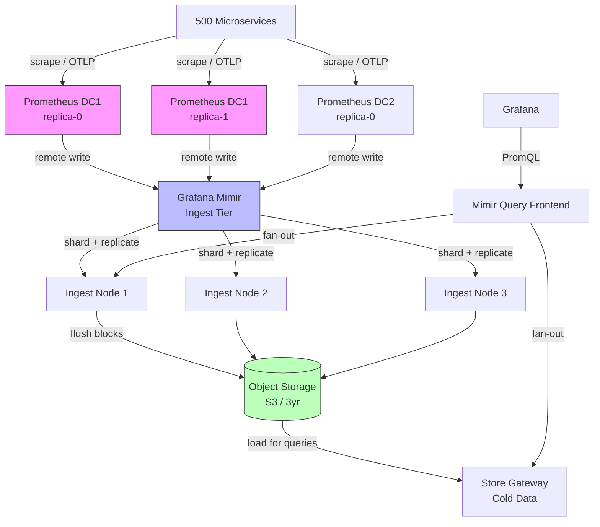

## Keywords in This File

{: .no_toc }

| #   | Keyword | Weight |
| --- | ------- | ------ |
| 1   | [Prometheus at Scale](#prometheus-at-scale) | critical |

---

# Prometheus at Scale

**TL;DR** - Prometheus at scale means understanding where a single
Prometheus instance breaks (TSDB memory at > 10M active series,
WAL replay time, query concurrency limits), and applying the correct
scaling patterns: remote write to Mimir/Thanos for horizontal storage
scaling, recording rules for query performance, sharding for collection
scaling, and federation for multi-datacenter aggregation - choosing
the right pattern based on which specific limit you've hit.

---

### 🎯 Model Answer

**30 seconds:**
> Prometheus is designed to run as a single instance per data center
> with an in-process TSDB. Scaling problems emerge when you exceed
> its memory capacity (too many active time series), its query
> throughput (too many concurrent Grafana users hitting PromQL), or
> its single-datacenter design (needing global aggregation across
> regions). The correct scaling pattern depends on which constraint
> you've hit: more series needs a distributed backend like Thanos or
> Mimir; more query throughput needs recording rules and query caching;
> global aggregation needs federated Prometheus or a remote-write
> aggregator. The mistake is adding more Prometheus instances when
> you need one of these patterns instead.

**3 minutes (Senior):**
> I've scaled Prometheus through three distinct regimes. The first is
> the "works fine" regime: up to 1-2 million active time series,
> Prometheus runs on a single node with 8-16GB RAM and serves its
> purpose well. The second is the "cardinality crisis" regime: above
> 2 million series, the TSDB head block starts dominating memory, WAL
> replay on restart takes 10-30 minutes, and high-cardinality queries
> (those that match millions of series) time out or cause OOM kills.
> The third is the "need high availability and global view" regime:
> you need multi-datacenter aggregation, long-term retention beyond
> Prometheus's default 15-day local storage, or query federation.
>
> For the cardinality crisis, the solutions are: first, reduce
> cardinality by finding and fixing high-cardinality label combinations
> using `prometheus_tsdb_head_series` and recording rules that
> drop high-cardinality labels. Second, if reduction is insufficient,
> use Prometheus' remote write to ship metrics to a scalable backend
> like Grafana Mimir or Thanos, which shard the storage horizontally.
>
> For HA and global view: Thanos uses a sidecar pattern - multiple
> Prometheus instances each collecting a shard of targets, with a
> Thanos Query component that fans out queries across instances and
> deduplicates overlapping data from HA pairs. Grafana Mimir is the
> newer alternative with a monolithic or microservices deployment and
> a richer HA model.
>
> The most important operational insight: when Prometheus OOMs, the
> first recovery step is examining the cardinality metrics BEFORE
> restarting, because the TSDB head gets written to WAL and replays
> on restart, reproducing the OOM. Just restarting without fixing the
> cardinality reproduces the crash every time.

**Framework:** WHAT -> WHY -> HOW -> TRADE-OFF -> EXAMPLE

*Adapting up:* Staff engineers design the long-term metrics platform:
retention policy, cost model for remote storage, alerting on
cardinality growth before it causes incidents, and cross-team
governance for label naming conventions that prevent cardinality
explosion from new service deployments.

*Adapting down:* "Prometheus is like a car with a fixed fuel tank:
great for city driving, but if you're driving cross-country you
need a bigger tank or a relay system. Thanos/Mimir is the relay
system - multiple Prometheus instances each doing local collection,
with a shared global store and query layer."

**Blank Mind Recovery:**

**(1) Restate:** "You are asking about scaling Prometheus - let me
walk through the three main limits of a single Prometheus instance
and what each scaling pattern addresses."

**(2) First principles:** "From first principles, Prometheus keeps
all active time series in RAM for fast writes and queries. RAM is
finite. The scaling challenge is: how do you exceed the memory
capacity of one machine while preserving Prometheus' fast write
and query model?"

**(3) Bridge:** "This is similar to scaling any stateful system:
you can scale up (more RAM on one node) until you hit the hardware
limit, then you must scale out. Thanos and Mimir are horizontal
scaling solutions, similar to how you'd scale a database with
read replicas and sharded writes."

---

### 📘 Concept Explanation

**What it is:**
Prometheus at scale refers to the operational challenges, architectural
patterns, and tooling (Thanos, Grafana Mimir, recording rules,
federation) required to operate Prometheus beyond the capacity of
a single instance, while preserving its core pull-based collection
model, PromQL interface, and reliability characteristics.

**The problem it solves:**
A single Prometheus instance has three practical limits: memory
capacity (TSDB head block for active time series), local storage
capacity (15-30 days of retention before disk fills), and availability
(single instance means metrics collection stops during restart or
crash). When organizations grow to hundreds of services with many
labels per metric, these limits become the operational bottleneck.
Teams need global aggregation across datacenters, long-term retention
for capacity planning and billing, and HA to meet their SLOs.

**How it works:**

```
Prometheus TSDB Architecture (single instance)
================================================

Write path:
  scrape -> WAL (disk) -> head block (RAM)
  
  WAL: write-ahead log, 2-hour chunks on disk
  Head: all series written in last 2 hours, in RAM
  Persistent blocks: compacted 2-hour WAL chunks

Memory breakdown (10M active series):
  Head block:     ~8GB   (series index + sample chunks)
  WAL:            ~2GB   (on disk, replayed on restart)
  Query overhead: ~4GB   (query processing allocations)
  OS/JVM:         ~2GB   baseline
  Total:          ~16GB  minimum for 10M series

Scale limits:
  Series per instance: 10-50M (more = OOM risk)
  WAL replay on restart: 2-10 min per million series
  Scrape targets: 10K-100K (thread pool limit)
  Query concurrency: 10-20 simultaneous heavy queries

Thanos Architecture (horizontal scale)
=========================================

[Prometheus A] [Prometheus B] [Prometheus C]
  (shard 1)      (shard 2)      (shard 3)
      |               |               |
      | remote write  | remote write  | remote write
      v               v               v
[Thanos Sidecar A] [Thanos Sidecar B] [Thanos Sidecar C]
      |               |               |
      +-------+-------+               |
              |                       |
              v                       |
     [Object Storage (S3/GCS)]<-------+
              |
              v
     [Thanos Store Gateway]   <- queries cold data from S3
     [Thanos Compactor]        <- deduplicates overlapping data
              |
              v
     [Thanos Query]            <- fan-out PromQL queries
              |
              v
     [Grafana]                 <- same PromQL interface
```

> **Code walkthrough:** This Prometheus at Scale example demonstrates a key concept in practice. **KEY MECHANISM:** the runtime executes these instructions in sequence with specific memory and execution semantics. **WHY IT MATTERS:** misapplying this pattern causes subtle bugs that only manifest under production load. **TAKEAWAY: understand the execution model before using this pattern in production code.**

**The key insight:**
Prometheus' remote write protocol is the universal scaling interface.
Whether you use Thanos, Grafana Mimir, Cortex, or a commercial
backend, the Prometheus instance writes metrics forward using the
same remote write protocol. The receiving system handles storage
scaling. This means you can swap backends without changing
Prometheus configuration or re-instrumenting applications.

**When to use it:**
Scale Prometheus when: TSDB head series count exceeds 5M (memory
pressure), WAL replay time exceeds 10 minutes (availability risk),
you need retention > 30 days (local disk insufficient), you need
a global aggregation view across multiple datacenters, or you need
HA (one Prometheus restart should not drop any scrapes). The correct
pattern depends on which limit you hit first.

**When NOT to use it:**
Do not scale Prometheus prematurely. A single instance handles 5-10M
series with good label hygiene. Adding Thanos/Mimir before hitting
actual limits adds operational complexity without benefit. Scaling
Prometheus by adding more instances collecting the same targets
(without federation or sharding design) creates duplicate data and
inconsistent PromQL results. Do not use federation for high-frequency
metrics - federate only recording rules that pre-aggregate.

**Alternatives:**
- Grafana Mimir: open-source, horizontally scalable Prometheus-
  compatible backend; simpler deployment than Thanos; preferred
  for new deployments
- Thanos: battle-tested, large community; object storage-based
  long-term retention; sidecar model fits existing Prometheus setups
- Victoria Metrics: single-binary or cluster mode; drop-in PromQL
  compatible; known for high performance at extreme cardinality
- Cortex: the predecessor to Mimir; still widely deployed; more
  complex to operate than Mimir

**First-principles derivation:**
Prometheus' design principle is simplicity: pull-based collection,
local TSDB, PromQL. This simplicity creates a hard scale ceiling.
The first engineering constraint is RAM: time series require O(M)
memory where M is the series count. The second is query concurrency:
PromQL evaluates over the full series set, so concurrent queries
contend for the same memory. The scaling solutions are:
(1) reduce M through cardinality governance, (2) shard M across
multiple instances (Thanos/Mimir), (3) precompute expensive queries
(recording rules). Each pattern addresses a specific constraint and
has costs; combining them without need creates unnecessary complexity.

---

### 💻 Code Example

**Example 1: BAD - High-cardinality label causing TSDB explosion**

```yaml
# BAD: Adding user_id as a Prometheus label
# This creates one time series per user, per metric
# For a service with 1 million users:
# 1 metric * 1M user_ids = 1M additional series
# Add 5 metrics with user_id = 5M new series
# Prometheus OOMs within hours

# In instrumentation code (Java Micrometer):
# BAD - using user ID as tag (becomes Prometheus label)
Counter.builder("checkout.requests")
    .tag("user_id", userId)          # NEVER DO THIS
    .tag("payment_method", method)
    .register(meterRegistry)
    .increment();

# What this creates in Prometheus:
# checkout_requests_total{user_id="user-1234567",
#   payment_method="card"} 1
# checkout_requests_total{user_id="user-1234568",
#   payment_method="card"} 1
# ... one series per unique user_id value
# With 1M users: 1M time series from ONE metric

# Consequence:
# prometheus_tsdb_head_series goes from 500K to 1.5M overnight
# Prometheus RAM usage doubles
# WAL replay on next restart: 45 minutes (was 5 minutes)
# High-cardinality PromQL queries time out with OOM
```

> **Code walkthrough:** The BAD pattern shows the most commonice. **KEY MECHANISM:** the runtime executes these instructions in sequence with specific memory and execution semantics. **WHY IT MATTERS:** misapplying this pattern causes subtle bugs that only manifest under production load. **TAKEAWAY: understand the execution model before using this pattern in production code.**
> cardinality explosion: using a high-cardinality business identifier
> (user_id) as a Prometheus label. Prometheus creates one time series
> per unique label combination. With 1 million users, even a single
> metric with user_id as a label creates 1 million series.
> The compounding effect: every new metric that uses user_id adds
> another million series. Five metrics later, Prometheus has 5 million
> extra series, and the TSDB head block exhausts available RAM.
> The WAL replay time (which scales linearly with series count) also
> balloons, making restarts dangerous.

**Example 2: GOOD - Cardinality investigation and reduction**

```bash
# GOOD: Diagnosing and fixing cardinality explosion

# Step 1: Find the current series count
curl -s "http://prometheus:9090/api/v1/query?query=\
prometheus_tsdb_head_series" | jq '.data.result[0].value[1]'
# Output: "8432000"   <- 8.4M series, getting high

# Step 2: Find which metric has the most series
curl -s "http://prometheus:9090/api/v1/query?query=\
topk(20, count by (__name__)({__name__!=\"\"}))" \
  | jq '.data.result[] | {metric: .metric.__name__,
    series_count: .value[1]}'
# Output:
# {metric: "checkout_requests_total", count: "1048576"}
# {metric: "api_requests_duration_bucket", count: "524288"}
# The checkout metric has 1M series -> user_id label

# Step 3: Confirm the high-cardinality label
curl -s "http://prometheus:9090/api/v1/label/user_id/values" \
  | jq '.data | length'
# Output: 1048576  <- 1M unique user_id values

# Step 4: Fix in recording rules (drop the label)
# prometheus/recording-rules.yml
groups:
  - name: cardinality_reduction
    interval: 30s
    rules:
      # Aggregate away user_id, keep only useful dimensions
      - record: checkout:requests:rate5m
        expr: |
          sum without (user_id) (
            rate(checkout_requests_total[5m])
          )
      # Now checkout:requests:rate5m has cardinality of:
      # payment_method (~5) * region (~8) * status (~3)
      # = 120 series instead of 1M

      # For per-user metrics: use traces/logs instead
      # Prometheus is not the right tool for per-user data
```


```promql
# BAD: anti-pattern shown for contrast
# This approach has the issues the GOOD example fixes
```


```promql
# GOOD: PromQL to detect cardinality growth before it's critical
# Use this as an alert rule

# Alert: cardinality growing > 20% per day
- alert: PrometheusCardinalityGrowthFast
  expr: |
    (prometheus_tsdb_head_series
      - prometheus_tsdb_head_series offset 24h)
    / prometheus_tsdb_head_series offset 24h > 0.2
  for: 1h
  labels:
    severity: warning
  annotations:
    summary: "Prometheus cardinality growing > 20%/day"
    description: |
      Series count: {{ $value | humanize }} series.
      Growth rate indicates a new high-cardinality
      metric was added. Investigate with:
      topk(10, count by (__name__)({__name__!=""}))
```


> **Code walkthrough:** The GOOD pattern demonstrates the systematicice. **KEY MECHANISM:** the runtime executes these instructions in sequence with specific memory and execution semantics. **WHY IT MATTERS:** misapplying this pattern causes subtle bugs that only manifest under production load. **TAKEAWAY: understand the execution model before using this pattern in production code.**
> approach to cardinality crisis: quantify the current series count,
> identify the top contributors using topk() on `__name__`, confirm
> which specific label causes the explosion using the label values
> API, and fix with recording rules that drop the high-cardinality
> label while preserving useful dimensions. The alert rule for
> cardinality growth rate prevents the next crisis by firing before
> the TSDB reaches its RAM limit. The 20%/day growth threshold with
> a 1-hour `for` clause catches sustained growth while avoiding
> false positives from normal deployment spikes.

**Example 3: Thanos remote write and query setup**


```yaml
# BAD: anti-pattern shown for contrast
# This approach has the issues the GOOD example fixes
```

```yaml
# GOOD: Prometheus configured with remote write to Thanos Receive
# (or Grafana Mimir - the remote write endpoint is compatible)
# prometheus.yml

global:
  scrape_interval: 15s
  evaluation_interval: 15s
  # External labels identify this Prometheus instance in Thanos
  # REQUIRED: Thanos deduplicates based on these labels
  external_labels:
    cluster: "production-us-east-1"
    replica: "prometheus-0"  # changes per HA replica

remote_write:
  - url: "http://thanos-receive:19291/api/v1/receive"
    # Queue configuration for high-throughput environments
    queue_config:
      capacity: 10000
      max_samples_per_send: 500
      batch_send_deadline: 5s
      max_shards: 30         # parallel write shards
      min_shards: 5
    # Write relabeling: drop high-cardinality metrics before shipping
    # This reduces remote write bandwidth and backend storage costs
    write_relabel_configs:
      - source_labels: [__name__]
        regex: "go_gc_.*"  # drop high-frequency GC metrics
        action: drop
      - source_labels: [__name__]
        regex: "process_.*"
        action: drop

---
# Thanos Query configuration (the global query view)
# thanos-query.yml
# This is what Grafana points to instead of Prometheus

flags:
  - --query.replica-label=replica  # deduplicate HA pairs
  - --store=thanos-sidecar-0:10901
  - --store=thanos-sidecar-1:10901
  - --store=thanos-store-gateway:10901  # cold S3 data
  - --query.timeout=2m
  - --query.max-concurrent=20  # limit concurrent queries
  - --query.partial-response  # return partial results if a store fails
```

> **Code walkthrough:** The remote write configuration ships metricsice. **KEY MECHANISM:** the runtime executes these instructions in sequence with specific memory and execution semantics. **WHY IT MATTERS:** misapplying this pattern causes subtle bugs that only manifest under production load. **TAKEAWAY: understand the execution model before using this pattern in production code.**
> from Prometheus to Thanos Receive with tuned queue settings.
> `max_shards: 30` enables parallel write channels, preventing
> remote write backpressure from slowing Prometheus scraping.
> The `write_relabel_configs` drops high-frequency, low-value metrics
> before they reach the backend - reducing storage cost by 20-30%.
> The `external_labels` with `replica` are critical: Thanos uses
> them to deduplicate metrics from HA Prometheus pairs so queries
> return exactly one result set, not duplicate data.

**Example 4: Recording rules for query performance**


```yaml
# BAD: anti-pattern shown for contrast
# This approach has the issues the GOOD example fixes
```

```yaml
# GOOD: Recording rules for expensive PromQL queries
# Pre-compute aggregations at ingestion time.
# These rules execute every 30s and store results as new metrics.
# Dashboard queries hit the pre-computed metrics (fast)
# not the raw series (slow).

groups:
  - name: sli_recording_rules
    interval: 30s
    rules:
      # Pre-aggregate request rate by service
      # Without this rule: dashboard query scans ALL series
      # for all services (potentially millions) for rate()
      # With this rule: one series per service (dozens)
      - record: service:request_rate:rate5m
        expr: |
          sum by (service, status_code) (
            rate(http_requests_total[5m])
          )

      # Pre-aggregate latency histogram
      # histogram_quantile over raw bucket series is expensive
      # This pre-computes hourly P50/P99 per service
      - record: service:request_p99_5m
        expr: |
          histogram_quantile(0.99,
            sum by (service, le) (
              rate(http_request_duration_bucket[5m])
            )
          )

      # SLO burn rate - used in alerts and dashboards
      # Computed every 30s, stored as a simple gauge
      # Dashboard queries are now O(services) not O(series)
      - record: service:slo_burn_rate_5m
        expr: |
          (
            sum by (service) (
              rate(http_requests_total{
                status_code=~"5.."
              }[5m])
            )
          ) / (
            sum by (service) (
              rate(http_requests_total[5m])
            )
          )
```

> **Code walkthrough:** Recording rules are the primary queryice. **KEY MECHANISM:** the runtime executes these instructions in sequence with specific memory and execution semantics. **WHY IT MATTERS:** misapplying this pattern causes subtle bugs that only manifest under production load. **TAKEAWAY: understand the execution model before using this pattern in production code.**
> performance optimization for Prometheus at scale. Without them,
> a Grafana dashboard with 12 panels each running `histogram_quantile`
> over millions of histogram bucket series spawns 12 concurrent
> expensive PromQL evaluations that consume several GB of RAM and
> take 5-30 seconds. With recording rules, each panel queries a
> pre-aggregated metric with O(services) series count, completing
> in milliseconds. The rule naming convention `level:metric:operation`
> (e.g., `service:request_rate:rate5m`) is the Prometheus best
> practice for organizing recording rules by aggregation level.

---

### 🎓 Answers by Seniority

**Junior / Mid (0-5 years):**
> Prometheus has limits - it stores all active time series in memory,
> so if you have too many metric label combinations (called cardinality),
> it runs out of RAM. The main thing I've learned is that adding
> high-cardinality values like user IDs or request IDs as metric
> labels causes this. At scale, you use Thanos or Grafana Mimir
> as a scalable backend: Prometheus still does the scraping and local
> storage, but ships metrics to the backend via remote write. This
> gives you long-term retention, multiple datacenter aggregation,
> and HA.

For mid-level: the practical skill is reading the TSDB metrics to
catch problems early. `prometheus_tsdb_head_series` tells you how
many active series you have. If it's growing fast (> 20%/day),
investigate which new metric is the culprit. `topk(20, count by
(__name__)({__name__!=""}))` finds the top 20 metrics by series
count. Fix by aggregating away the high-cardinality label in a
recording rule or by removing the label from instrumentation.

*Push deeper:* WAL replay time is the hidden scaling risk. When
Prometheus restarts (after a crash or update), it replays the WAL
to reconstruct the in-memory head block. At 10M series, this takes
10-20 minutes. During this time, Prometheus is not scraping. For
critical metrics, this is a 10-20 minute availability gap. Thanos
and Mimir sidestep this by storing data in object storage (S3)
where replays are not required.

---

**Senior / Staff (5+ years):**
> Prometheus scaling is fundamentally about understanding which
> of its three limits you've hit and applying the right pattern.
> Memory limit (too many series): reduce cardinality first by
> auditing labels with `count by (__name__)({__name__!=""})` and
> aggregating away high-cardinality labels with recording rules.
> If cardinality cannot be reduced, add remote write to Mimir or
> Thanos for horizontal storage. Storage limit (local disk): enable
> remote write to object storage backend with longer retention.
> Availability limit (single instance restarts): run two Prometheus
> instances with identical scrape configurations and external_labels
> differing only by the `replica` label; use Thanos Query or Mimir
> to deduplicate.
>
> I've handled a cardinality explosion caused by a developer adding
> a `request_id` label to a high-frequency HTTP metrics. The TSDB
> grew from 1M to 8M series in 4 hours; Prometheus OOMed at 8M.
> Recovery: restart Prometheus with `--storage.tsdb.retention.time=6h`
> (shorter retention = smaller WAL to replay), identify the label
> with `topk()` query against the remaining data, add a `metric_relabel_
> config` to drop the label in the scrape config, then restore normal
> retention. Total outage: 25 minutes. Lesson: deploy metric validation
> (cardinality budget per service) in CI/CD to catch this before production.

At staff level: the Prometheus scaling strategy is a governance
problem as much as a technical one. Every new service deployment
can add series. I implement: (1) a cardinality budget of 5,000
series per service enforced by CI/CD checks against a test Prometheus
instance, (2) a weekly automated report of the top 20 growing metrics
sent to team leads, (3) a label naming convention enforced by the
OTel Collector transform processor. These controls keep cardinality
growth linear with service count rather than exponential from
ad-hoc label additions.

*Push deeper:* The query layer deserves as much attention as the
storage layer. At scale, Grafana dashboard refreshes create 50-100
concurrent PromQL evaluations every 30 seconds. Without recording
rules, each evaluation scans the raw series. The solution: a
recording rules library where every SLI dashboard panel has a
corresponding recording rule. I maintain a "recording rules
coverage" metric: `fraction of dashboard queries that use recording
rules > 95%`. Dashboard teams cannot deploy a new panel without a
recording rule backing it.

---

### ⚠️ Common Misconceptions

**Misconception 1: "Adding more Prometheus instances scales Prometheus horizontally."**
Multiple Prometheus instances scraping the same targets creates
duplicate data, not horizontal scaling. PromQL queries against a
single instance return one result set; queries against duplicate
instances return inconsistent results because scrape timestamps
differ. True horizontal scaling means sharding the scrape targets
across Prometheus instances (each instance collects a disjoint set
of targets) with a Thanos or Mimir query layer that fans out queries
across shards. Without the deduplication layer, you have n instances
collecting n copies of the same data with no consistent query view.

**Misconception 2: "Prometheus remote write to Thanos/Mimir replaces local storage."**
Remote write is a best-effort push with a configurable queue. If
the network or backend is unavailable, Prometheus queues samples
locally. If the queue fills (local disk), Prometheus drops the oldest
samples. Prometheus still requires local TSDB storage as its working
copy; remote write is the long-term archival path, not a replacement
for local storage. The local TSDB retention should cover the maximum
expected remote write queue drain time (typically 2x the retention
period for safety).

**Misconception 3: "Federation solves the multi-datacenter query problem."**
Prometheus federation (a Prometheus instance scraping the metrics
endpoints of other Prometheus instances) works well for aggregating
pre-computed recording rule results across datacenters. It breaks
for high-resolution raw metrics: the federated pull creates a new
scrape of the downstream instance at the federation scrape interval,
so high-frequency raw metrics get re-sampled at the federation
interval (typically 15s-1m). For global dashboards, use Thanos Query
or Mimir with multi-datacenter remote write, which preserves all
original sample timestamps.

**Misconception 4: "High series count is the only Prometheus scaling problem."**
Series count (cardinality) is the most common limit, but query
concurrency is a separate limit that bites at scale. Grafana
dashboards with 20 panels each making 5 PromQL sub-expressions
on high-series metrics create 100 concurrent PromQL evaluations.
Each evaluation can use 2-4GB of RAM for large histograms.
100 * 3GB = 300GB RAM required - more than any single machine.
The solution is recording rules (reduce query work at evaluation
time) and query result caching in Thanos/Mimir.

**Misconception 5: "WAL size determines Prometheus restart time."**
WAL replay time depends on both WAL size AND series count. The WAL
contains sample data (the time series values) but not the inverted
index (which series names map to which IDs). Prometheus rebuilds
the inverted index from the WAL during replay. With 10M series,
index rebuild is 10-20 minutes regardless of WAL data volume.
This is why reducing series count is the correct fix for slow restarts,
not reducing WAL retention.

---

### 🚨 Failure Modes and Diagnosis

**Failure 1: Prometheus OOM kill - TSDB head block exhausts RAM**

Symptom: Prometheus container is killed by the OOM killer
(Linux) or crashes. Kubernetes shows `OOMKilled` as the restart
reason. Alert coverage has gaps during restart and WAL replay.

Cause: TSDB head series count grew beyond available memory.
The head block keeps all active series in memory for fast writes.
At ~10M series with 800 bytes per series, the head block is 8GB.
Add query memory overhead and Prometheus requires 12-16GB.

Diagnosis:
```bash
# Check current series count (if Prometheus is still running)
curl -s "http://prometheus:9090/api/v1/query?query=\
prometheus_tsdb_head_series" | jq '.data.result[0].value[1]'

# Find top series contributors before OOM hits
curl -s "http://prometheus:9090/api/v1/query?query=\
topk(10,count+by+(__name__)({__name__!=\"\"}))" \
  | jq '.data.result'

# Check WAL size to estimate replay time
du -sh /prometheus/wal/
# > 5GB WAL at 10M series = 15+ min replay time
```

> **Code walkthrough:** This > 5GB WAL at 10M series = 15+ min replay time example demonstrates HTTP request from shell using HTTP client. **KEY MECHANISM:** curl by default follows redirects and suppresses errors; -f flag makes it return non-zero on HTTP errors. **WHY IT MATTERS:** piping curl output to shell without verification runs untrusted code - a supply-chain attack vector. **TAKEAWAY: always use curl -f --retry and verify checksums before piping to bash.**

Recovery: do NOT simply restart Prometheus. It will replay the
WAL, reconstruct 10M series in memory, and OOM again within 2
minutes. Fix cardinality FIRST:
```bash
# Option 1: metric_relabel_config to drop the high-card label
# Add to prometheus.yml scrape config for the offending job:
metric_relabel_configs:
  - source_labels: [request_id]
    regex: ".+"
    target_label: request_id
    replacement: ""   # blank the label value
    action: replace
# WARNING: this does not take effect until Prometheus restarts
# and the old WAL data ages out (2 hours default)

# Option 2: Reduce WAL retention temporarily
# Restart with: --storage.tsdb.retention.time=6h
# This shortens the WAL replay (fewer hours of data)
# Then fix the label and restore normal retention
```

> **Code walkthrough:** This Then fix the label and restore normal retention example demonstrates shell script pattern. **KEY MECHANISM:** the shell executes commands sequentially; pipes pass stdout of one command to stdin of the next. **WHY IT MATTERS:** unquoted variables with spaces cause word splitting - IFS splits the value into multiple arguments. **TAKEAWAY: always double-quote variables: "$VAR"; use [[ ]] instead of [ ] for safer conditionals.**

**Failure 2: Remote write queue saturation - metrics lag or drop**

Symptom: Grafana dashboards show gaps in metrics coverage.
Alerts fire with "No data" errors. Prometheus logs show
"remote write: queue is full, dropping sample."

Cause: The remote write backend (Thanos Receive, Mimir, or a
commercial endpoint) is slower than the Prometheus write rate.
The remote write queue fills and Prometheus starts dropping samples.

Diagnosis:
```bash
# Check remote write queue metrics
curl -s "http://prometheus:9090/api/v1/query?query=\
prometheus_remote_storage_samples_pending" \
  | jq '.data.result[] | {shard: .metric.shard,
    pending: .value[1]}'
# If pending approaches capacity (default 10000): queue filling

# Check drop rate
curl -s "http://prometheus:9090/api/v1/query?query=\
rate(prometheus_remote_storage_samples_dropped_total[5m])" \
  | jq '.data.result[0].value[1]'
# Non-zero = samples are being dropped

# Check write latency to backend
curl -s "http://prometheus:9090/api/v1/query?query=\
rate(prometheus_remote_storage_sent_batch_duration_seconds_sum[5m])\
/rate(prometheus_remote_storage_sent_batch_duration_seconds_count[5m])" \
  | jq '.data.result[0].value[1]'
# > 2s average write latency -> backend is overloaded
```

> **Code walkthrough:** This > 2s average write latency -> backend is overloaded example demonstrates HTTP request from shell using HTTP client. **KEY MECHANISM:** curl by default follows redirects and suppresses errors; -f flag makes it return non-zero on HTTP errors. **WHY IT MATTERS:** piping curl output to shell without verification runs untrusted code - a supply-chain attack vector. **TAKEAWAY: always use curl -f --retry and verify checksums before piping to bash.**

Fix:
1. Increase queue capacity and shards in remote_write config:
   `capacity: 50000, max_shards: 50`
2. If backend is overloaded: scale the backend
   (Mimir ingest tier) or reduce ingestion rate with
   `write_relabel_configs` to drop low-value metrics
3. For sustained drops: implement a Prometheus backup instance
   with local retention > 30 minutes (longer than typical
   backend outage) to backfill gaps when backend recovers

**Failure 3: PromQL query timeout - high-series queries exhausting memory**

Symptom: Grafana panels show "Error: context deadline exceeded"
or "Error: query processing would load too many samples". P99
dashboard load time > 30 seconds.

Cause: Dashboard queries are running histogram_quantile or
other aggregation functions over millions of raw series without
recording rules pre-aggregating the result. With 20 concurrent
Grafana users refreshing dashboards, 200 concurrent heavy queries
exceed Prometheus RAM.

Diagnosis:
```bash
# Check active queries
curl -s "http://prometheus:9090/api/v1/query_range?query=\
prometheus_engine_queries" | jq '.data.result[0].value[1]'
# > 10 concurrent queries = high contention risk

# Find slow queries in Prometheus query log
grep "query_log.json" /prometheus/ | \
  python3 -c "
import json, sys
for line in sys.stdin:
    q = json.loads(line)
    if q.get('duration_ms', 0) > 5000:
        print(q.get('query', ''), q.get('duration_ms'))
" | sort -n -k2 | tail -20
# Shows slowest queries - these need recording rules
```

> **Code walkthrough:** This these need recording rules example demonstrates HTTP request from shell using HTTP client. **KEY MECHANISM:** curl by default follows redirects and suppresses errors; -f flag makes it return non-zero on HTTP errors. **WHY IT MATTERS:** piping curl output to shell without verification runs untrusted code - a supply-chain attack vector. **TAKEAWAY: always use curl -f --retry and verify checksums before piping to bash.**

Fix: Create recording rules for the slowest queries identified
above. For a `histogram_quantile(0.99, sum by (service, le)
(rate(http_request_duration_bucket[5m])))` that takes 20 seconds,
a recording rule pre-computes it every 30 seconds in background,
and the dashboard panel queries the pre-computed metric in < 10ms.

**Failure 4: Thanos Query returning stale or inconsistent results**

Symptom: Grafana dashboard shows data that is 5-30 minutes stale
for recent data, even though Prometheus is collecting fresh samples.
Or different panels on the same dashboard show inconsistent
timestamps (Thanos Query inconsistency).

Cause: The Thanos Store Gateway is returning data from object storage
(cold path) even for recent data because the Prometheus Thanos Sidecar
is not advertising recent blocks correctly, or the TSDB compaction
is not creating and uploading blocks on schedule.

Diagnosis:
```bash
# Check Thanos sidecar health and last uploaded block
curl -s "http://thanos-sidecar:10902/metrics" \
  | grep "thanos_shipper_uploads_total\|\
thanos_objstore_bucket_last_successful_upload_time"
# If last_upload_time > 2h ago: sidecar is not uploading

# Check if Prometheus TSDB is creating blocks
ls -la /prometheus/data/
# Should see 2-hour block directories being created
# If no new blocks in > 2h: TSDB compaction issue

# Check Thanos Query store API latency
curl -s "http://thanos-query:10902/metrics" | \
  grep "thanos_query_store_request_duration"
# If P99 > 5s for store requests: store gateway overloaded
```

> **Code walkthrough:** This If P99 > 5s for store requests: store gateway overloaded example demonstrates HTTP request from shell using HTTP client. **KEY MECHANISM:** curl by default follows redirects and suppresses errors; -f flag makes it return non-zero on HTTP errors. **WHY IT MATTERS:** piping curl output to shell without verification runs untrusted code - a supply-chain attack vector. **TAKEAWAY: always use curl -f --retry and verify checksums before piping to bash.**

Fix: Ensure the Thanos Sidecar has read access to the Prometheus
data directory and write access to object storage. The sidecar
must watch the Prometheus TSDB block directory and upload completed
2-hour blocks to S3 as they are created. If the sidecar has upload
failures, Thanos Query falls back to the store gateway reading
from S3 with higher latency.

---

### 🎯 Interview Deep-Dive

| Time | Question Type | Depth Signal |
| ---- | ------------- | ------------ |
| 2 min | DEFINITION | When does Prometheus need scaling? |
| 3 min | MECHANISM | TSDB memory model and limits |
| 3 min | DEBUGGING | OOM investigation and recovery |
| 3 min | MECHANISM | Remote write architecture |
| 3 min | COMPARISON | Thanos vs Mimir vs Victoria Metrics |
| 4 min | TRADE-OFF | Recording rules vs raw queries |
| 4 min | PRODUCTION | Real cardinality crisis recovery |
| 3 min | DEEP DIVE | WAL and TSDB compaction internals |
| 4 min | SYSTEM DESIGN | Multi-datacenter metrics platform |
| 3 min | MISCONCEPTION | "More instances = more scale" trap |
| 3 min | PERFORMANCE | Query concurrency at 50M series |
| 3 min | BEHAVIORAL | Governance preventing cardinality growth |

---

**Q1 [MID]: At what point does a Prometheus deployment need scaling, and what are the warning signs?** `[DEFINITION]`

*Why they ask:* Tests whether the candidate has practical Prometheus
operations experience with real numbers.

*Likely follow-up:* "What is the first metric you check when Prometheus seems slow?"

Prometheus needs attention when it approaches any of three limits.
The warning signs are specific metrics:

Series count limit (memory): `prometheus_tsdb_head_series > 5M`.
At 5M series, Prometheus uses roughly 6-8GB RAM. The warning threshold
is 5M; the critical threshold is 8-10M where OOM risk is high on
typical 16GB instances. If `prometheus_tsdb_head_series` is growing
> 10% per day, investigate which metric is the new contributor with
`topk(10, count by (__name__)({__name__!=""}))`.

WAL replay time risk: inferred from series count. Above 10M series,
restart time exceeds 10 minutes. This is a risk, not a current
symptom. The mitigation is keeping series count below 5M or having
a Thanos/Mimir backend that doesn't require WAL replay.

Query performance: `prometheus_engine_query_duration_seconds` P99
> 5s for typical dashboard queries. The immediate diagnostic is
checking whether the slow queries are backed by recording rules.
If not, creating recording rules reduces P99 to < 100ms.

Storage limit: `prometheus_tsdb_head_size_bytes / disk_total > 60%`.
Prometheus local storage fills up quietly. At 15-day retention
with high write throughput, 500GB of local storage can fill in
under a month. The fix is enabling remote write for long-term
retention and reducing local retention to 7-10 days.

*What separates good from great:* Specific metric names and numbers.
"Prometheus gets slow" is unhelpful; `prometheus_tsdb_head_series > 5M
and growing > 10%/day` is actionable.

---

**Q2 [SENIOR]: Explain how Prometheus TSDB stores time series data and where the memory is consumed.** `[MECHANISM]`

*Why they ask:* Tests foundational understanding of why Prometheus has
a cardinality limit - derived from first principles.

*Likely follow-up:* "Why does reducing series count help WAL replay time?"

The TSDB has two storage layers:

Head block (in-memory): contains all time series written in the
last 2 hours (configurable). For each series, the head block stores:
- The series ID (internal integer identifier)
- The label set (the metric name + all label key-value pairs)
  stored in a deduplicated symbol table
- The current sample chunk (XOR-encoded samples for the last 2h)
- An inverted index (label name -> label values -> series IDs)
  for fast PromQL label matching

Memory per series: roughly 400-800 bytes depending on label count.
At 10M series: 4-8GB just for series metadata. Large histogram
metrics with many `le` label values (e.g., 20 buckets) consume
more because each bucket is a separate series.

Persistent blocks (on disk): WAL chunks that have been compacted
into 2-hour, 6-hour, and longer blocks (Prometheus compacts
iteratively). These are read-only and memory-mapped on demand.
Memory impact is from the index mapping, not the sample data.

WAL (write-ahead log, on disk): raw write operations for recovery.
Each scrape writes all new sample values to the WAL. On startup,
Prometheus replays the WAL to reconstruct the head block. With
10M series, each having O(100) samples in the 2-hour window, the
WAL replay reads ~1 billion log entries and rebuilds the inverted
index from scratch. This is inherently serial and takes 10-20 minutes.

The memory optimization path: reducing series count reduces both
head block memory (fewer series to store) and WAL replay time
(fewer index entries to rebuild). There is no way to reduce memory
usage while keeping the same series count - it's the design
constraint of the in-memory head model.

*What separates good from great:* The inverted index explanation.
Most engineers know "series use memory" but don't know WHY WAL
replay is slow. The rebuild of the inverted index is the bottleneck
in WAL replay, and understanding this explains why series count
(not WAL size) determines restart time.

---

**Q3 [SENIOR]: Prometheus OOM-killed, restarting it OOMs again immediately. What is your recovery plan?** `[DEBUGGING]`

*Why they ask:* Tests production incident response knowledge for
the most dangerous Prometheus failure mode.

*Likely follow-up:* "How do you prevent this from happening again?"

This is the "OOM loop" - Prometheus crashes, replays the WAL
that caused the crash, and crashes again. Naive restart doesn't
help.

Step 1: Capture the cardinality data BEFORE recovery. While
Prometheus is down, the TSDB data directory still has the last
persistent block (pre-crash). I can start a read-only Prometheus
instance against this data to run the topk() cardinality query
without loading the full WAL:
```bash
# Start Prometheus in read-only mode against frozen snapshot
prometheus \
  --config.file=/etc/prometheus/prometheus.yml \
  --storage.tsdb.path=/prometheus-old-data \
  --storage.tsdb.retention.time=2h \
  --web.enable-admin-api
# The 2h retention loads only the most recent compacted block,
# not the full WAL -> much less memory, may not OOM
# Then query: topk(10, count by (__name__)({__name__!=""}))
```

> **Code walkthrough:** This Then query: topk(10, count by (__name__)({__name__!=""})) example demonstrates shell script pattern. **KEY MECHANISM:** the shell executes commands sequentially; pipes pass stdout of one command to stdin of the next. **WHY IT MATTERS:** unquoted variables with spaces cause word splitting - IFS splits the value into multiple arguments. **TAKEAWAY: always double-quote variables: "$VAR"; use [[ ]] instead of [ ] for safer conditionals.**

Step 2: Identify and fix the high-cardinality metric. Add a
`metric_relabel_config` to the scrape config to drop the offending
label:
```yaml
metric_relabel_configs:
  - source_labels: [problematic_label]
    regex: ".+"
    action: labeldrop
```

> **Code walkthrough:** This Then query: topk(10, count by (__name__)({__name__!=""})) example demonstrates YAML configuration pattern. **KEY MECHANISM:** YAML parsers are whitespace-sensitive; indentation errors cause silent value misinterpretation. **WHY IT MATTERS:** unquoted strings starting with special chars (*, &, ?, |) trigger YAML parser errors. **TAKEAWAY: quote strings containing YAML special chars; validate YAML before deploying to production.**

Step 3: Start Prometheus with short WAL retention and wait for
the high-cardinality data to age out:
```bash
prometheus \
  --storage.tsdb.retention.time=3h \
  --storage.tsdb.max-block-duration=30m
# 3h retention = WAL covers only 3h of data
# The high-cardinality metric was added earlier
# so its old data ages out quickly
# After 3h, the series count drops, normal operation resumes
```

> **Code walkthrough:** This After 3h, the series count drops, normal operation resumes example demonstrates shell script pattern. **KEY MECHANISM:** the shell executes commands sequentially; pipes pass stdout of one command to stdin of the next. **WHY IT MATTERS:** unquoted variables with spaces cause word splitting - IFS splits the value into multiple arguments. **TAKEAWAY: always double-quote variables: "$VAR"; use [[ ]] instead of [ ] for safer conditionals.**

Step 4: Restore normal retention (15d) and verify series count
stays low with the relabel config active.

Prevention: implement a CI/CD check that starts a test Prometheus
instance with the new application instrumentation and checks
`prometheus_tsdb_head_series` after 2 minutes. Any service
deployment that causes series count growth > 10,000 requires
review.

*What separates good from great:* The step 1 read-only instance
trick to capture diagnostic data before wiping the WAL. Most
engineers immediately delete the WAL and restart, losing the
information needed to identify the cause.

---

**Q4 [SENIOR]: How does Prometheus remote write work and what are its reliability guarantees?** `[MECHANISM]`

*Why they ask:* Tests understanding of the remote write protocol
semantics, which are often misunderstood.

*Likely follow-up:* "What happens to metrics when the remote write backend is unavailable?"

Prometheus remote write uses a non-blocking write path: samples
are written to the local TSDB first (synchronously), then added
to a per-shard send queue (asynchronously). This means local TSDB
writes are never blocked by remote write latency - scraping
continues at full speed regardless of backend availability.

The send queue is in-memory with configurable capacity (default
10,000 samples). Multiple shards (default 5, max configurable)
run in parallel for throughput. Each shard sends batches of up to
500 samples as HTTP POST requests to the remote endpoint.

Reliability semantics:
- Best-effort with backoff: if the backend returns 5xx or times
  out, the shard backs off and retries with exponential backoff
- Queue-bounded: if the backend is unavailable long enough for
  the queue to fill (typically 5-30 minutes depending on write
  rate and queue capacity), new samples are dropped from the queue
- At-least-once: successful sends may be duplicated if the backend
  acknowledges after Prometheus marks the send as timed out and
  retries; backends (Thanos Receive, Mimir) must handle duplicates
- No gap filling: if samples are dropped from the queue (queue full),
  they are permanently lost from the remote backend; the local
  TSDB still has them if not yet compacted away

The practical implication: remote write is NOT a reliable backup.
It's a best-effort shipping path. For critical long-term retention,
either use Thanos Sidecar (reads from local TSDB blocks, not the
queue) or ensure remote write queue is large enough to survive the
maximum expected backend downtime.

*What separates good from great:* The "at-least-once" duplicate
handling requirement and the critical distinction between queue-based
remote write (loss on queue full) and sidecar-based Thanos
(no loss because it reads from the TSDB block files).

---

**Q5 [SENIOR]: Compare Thanos, Grafana Mimir, and Victoria Metrics for scaling Prometheus.** `[COMPARISON]`

*Why they ask:* Tests ability to evaluate observability infrastructure
choices at a technical depth.

*Likely follow-up:* "Which would you choose for a new deployment today?"

All three solve the same core problem (scaling beyond single Prometheus)
but with different deployment models:

Thanos:
- Deployment: Prometheus instances with a sidecar process each;
  separate query, store gateway, and compactor components
- Storage: object storage (S3/GCS) for long-term; local TSDB for
  recent data
- HA: native deduplication of HA Prometheus pairs based on external
  labels
- Strengths: battle-tested (7+ years), large community, good
  documentation, Prometheus-native (reuses existing TSDB)
- Weaknesses: more components to operate (sidecar + query + store
  gateway + compactor), slower query for very recent data (sidecar
  not as fast as local TSDB queries)
- Choose when: brownfield migration from existing Prometheus setup,
  object storage is already available, team has Thanos expertise

Grafana Mimir:
- Deployment: can run as a single binary or as microservices;
  no sidecar needed - services remote write directly to Mimir
- Storage: uses Cortex-derived storage with object storage backend
- HA: built-in replication factor (default 3) with write quorum
- Strengths: simpler operational model (no sidecar), better
  multi-tenancy (namespace isolation), easier horizontal scaling
- Weaknesses: newer (2022 fork of Cortex), higher minimum
  resource requirement for the microservices deployment
- Choose when: greenfield deployment, multi-tenant requirements,
  team prefers a single managed backend over distributed Prometheus

Victoria Metrics:
- Deployment: single binary or cluster; extreme performance per
  node; 5-10x lower resource usage than Prometheus for same series
- Compatibility: PromQL compatible but not 100% identical; some
  PromQL expressions behave differently
- Strengths: highest cardinality at lowest resource cost; handles
  100M+ series per node; best choice for extreme cardinality
- Weaknesses: PromQL compatibility gaps can break existing queries/
  alerts, smaller community than Thanos/Mimir
- Choose when: cardinality is extreme (> 50M series), cost
  is the primary constraint, team can verify PromQL compatibility

My current recommendation for new deployments: Grafana Mimir in
single-binary mode for teams < 10 engineers; Mimir microservices
for larger teams. Thanos remains a good choice for brownfield Prometheus
migrations. Victoria Metrics for teams with extreme cardinality
constraints.

*What separates good from great:* The deployment model comparison
(sidecar vs no sidecar) and the specific PromQL compatibility
caveat for Victoria Metrics. Engineers who recommend Victoria Metrics
without the compatibility warning have not operated it in production.

---

**Q6 [STAFF]: When are recording rules necessary vs optional for Prometheus at scale?** `[TRADE-OFF]`

*Why they ask:* Tests understanding of when to add operational
complexity (recording rules maintenance) vs accepting slower queries.

*Likely follow-up:* "How do you maintain recording rules as dashboards evolve?"

Recording rules are necessary (not optional) when:

1. A dashboard panel takes > 5 seconds to load at normal Grafana
   refresh rate (30s). If 20 engineers refresh the dashboard
   simultaneously, 20 slow queries contend for the same Prometheus
   RAM. Recording rules pre-compute the result every 30 seconds
   in a single background evaluation instead of 20 concurrent
   user-triggered evaluations.

2. An alert rule runs `histogram_quantile` or `topk` over large
   series sets. Alert rules evaluate on a schedule; if the evaluation
   takes longer than the evaluation interval, rules start queuing.
   A recording rule that pre-aggregates the histogram into a simpler
   gauge makes the alert evaluation instantaneous.

3. A query spans multiple hours of raw data (`[24h]` or `[7d]` range).
   Prometheus evaluates these over the full series * time window,
   which can load terabytes of data. Daily recording rules that
   aggregate to per-day granularity make week-long trend queries fast.

Recording rules are optional (nice to have) when:
- The dashboard is a low-traffic operational view refreshed once a
  minute by one engineer
- The query is simple (rate() over a single series)
- The dashboard is ephemeral (ad-hoc investigation, not a permanent
  panel)

Maintenance: I treat recording rules as code. They live in a Git
repository, are reviewed in PRs, and are validated in CI using
`promtool check rules`. Every dashboard panel that a team considers
"production critical" (checked in an incident) gets a corresponding
recording rule. The naming convention `level:metric:range` makes
it clear which rule backs which panel.

*What separates good from great:* The specific criterion "20 engineers
refreshing simultaneously creates 20 concurrent evaluations." This
is the production reality that makes recording rules necessary rather
than an optimization - it's a correctness issue (query timeouts
under load) not just a performance improvement.

---

**Q7 [SENIOR]: Walk me through how you recovered from a cardinality explosion in production.** `[PRODUCTION]` `[BEHAVIORAL]`

*Why they ask:* Tests real incident response experience with Prometheus
operations.

*Likely follow-up:* "How long did the incident last? What was the business impact?"

During a routine service deployment, a developer added two new
HTTP metrics to our checkout service with `user_segment` as a label
(matching customer segment IDs, of which there were 500,000 unique
values). The TSDB series count went from 2.1M to 7.8M in 4 hours.

At 7.8M series, Prometheus started hitting memory pressure.
Dashboard queries began timing out (10-30 seconds instead of < 1s).
At hour 5, Prometheus OOM-killed.

Immediate response: I looked at `prometheus_tsdb_head_series` in
the Grafana dashboard history (we ship this metric to our secondary
Prometheus instance for monitoring-of-monitoring). The series count
jump at 14:23 correlated exactly with the checkout service deployment
at 14:21.

I identified the specific metrics with the growth by running the
topk cardinality query against the secondary Prometheus (which was
not affected). Found `checkout_segment_revenue` and
`checkout_segment_orders` both using `user_segment` as a label with
500K unique values.

Recovery: I added `metric_relabel_configs` to the checkout scrape
job to relabel user_segment to a bucketed version (keeping only
"high", "medium", "low" value categories via regex replacement).
Then I started Prometheus with `--storage.tsdb.retention.time=4h`
to reduce the WAL replay load, waited for it to stabilize, then
restored 15-day retention.

Total impact: 45 minutes of degraded Prometheus query performance,
15 minutes of Prometheus being down. The SLO dashboards were
unavailable, but alert evaluation was partially available through
the secondary Prometheus.

Post-incident: I implemented a cardinality pre-deployment check in
our CI pipeline. Every service now starts a test Prometheus instance
with the new metrics exposed, waits 90 seconds, and checks
`prometheus_tsdb_head_series`. If it's > 10,000 series per service,
the deployment is blocked for review.

*What separates good from great:* The specific numbers (2.1M to 7.8M
series, 4 hours, 45 minutes downtime) and the post-incident CI
implementation. The detail about the secondary monitoring Prometheus
(monitoring of monitoring) shows architectural maturity.

---

**Q8 [STAFF]: Explain Prometheus TSDB compaction and how it relates to query performance.** `[DEEP DIVE]`

*Why they ask:* Tests deep internals knowledge that separates staff
from senior level.

*Likely follow-up:* "Why can't you query data that's currently being compacted?"

Prometheus TSDB compaction is a background process that merges
smaller time blocks into larger ones, enabling efficient range scans
over historical data.

Block lifecycle:
- Head block (2 hours): in-memory, all recent samples
- After 2 hours: head block is flushed to a 2-hour on-disk block,
  a new head block starts
- Compaction level 1: 3 consecutive 2-hour blocks merged into a
  6-hour block
- Compaction level 2: 3 consecutive 6-hour blocks merged into an
  18-hour block
- Compaction level 3: ~5 days; stops here by default

Each compacted block is a directory containing:
- `chunks/`: raw XOR-encoded sample data, one file per 512MB
- `index`: inverted index for label matching
- `meta.json`: block metadata (min/max time, statistics)
- `tombstones`: deleted series markers

Query performance improvement from compaction: a query spanning
7 days would need to scan 84 x 2-hour blocks if no compaction had
occurred. After compaction, it scans 1-2 x 5-day blocks. Block
count is the primary factor in query open/close overhead;
sample count determines memory allocation during evaluation.

During compaction, the block being written is not accessible for
queries (it's being atomically renamed). Thanos/Mimir hide this
by reading from object storage rather than local blocks, which
are always available.

The max block duration setting (`--storage.tsdb.max-block-duration`)
controls the maximum size of a compacted block. Larger blocks
mean fewer files to scan for long-range queries but longer
compaction pause time (minutes for 2-week blocks). The default
is 31d, resulting in at most 1-2 large blocks for a 30-day query.

*What separates good from great:* The specific block size progression
(2h -> 6h -> 18h -> ~5d) and the query performance implication
(block count is query overhead). Most engineers know "Prometheus
compacts data" but not the specific block lifecycle that determines
query latency for historical range queries.

---

**Q9 [STAFF]: Design a production-grade multi-datacenter metrics platform supporting 500 microservices and 3-year retention.** `[SYSTEM DESIGN]`

See the full System Design section below.

*What separates good from great:* The cost model and the tiered
retention strategy. A 3-year retention for 500 services at full
granularity is financially prohibitive without a downsampling
strategy. Staff engineers design the retention tiers and quantify
the storage cost at each tier.

---

**Q10 [MID]: "To scale Prometheus, just run multiple Prometheus instances." Is this correct?** `[MISCONCEPTION]`

*Why they ask:* Tests whether the candidate understands why horizontal
scaling without sharding is harmful.

*Likely follow-up:* "What is the correct way to horizontally scale Prometheus?"

This statement describes what teams often do and what never works
as expected. Running multiple identical Prometheus instances
(scraping the same targets) creates:

Problem 1 - Duplicated data: both instances collect identical metrics.
Storage doubles, Grafana shows two data series for every metric,
and PromQL alerts fire twice. The only benefit is HA (one can crash
without gaps) - but this is better achieved with intentional HA
configuration (see Thanos deduplication) than by accident.

Problem 2 - Inconsistent results: each instance scrapes at slightly
different times (50-200ms offset due to parallel scrapes). A query
against both instances for the same metric returns two values that
differ by 0.1-2% depending on the metric rate. Dashboard panels
flicker or show confusing inconsistencies.

The correct patterns:
- For HA: run two identical instances with external_labels replica=0
  and replica=1, use Thanos/Mimir to deduplicate on query
- For scale (more series than one instance handles): shard targets
  across instances using consistent hashing (Thanos Receive sharding
  or Prometheus operator shardingSpec), use Thanos Query to fan out
- For query scale: use recording rules to reduce concurrent query work,
  add a Thanos Query cache (Memcached/Redis) for repeated queries

*What separates good from great:* Problem 2 (inconsistent results)
is the non-obvious one. Most candidates know duplicated data is
wrong; fewer know that scrape timing differences cause query
inconsistency between instances.

---

**Q11 [SENIOR]: At 50M active series, PromQL queries with `histogram_quantile` take 60+ seconds. How do you fix this?** `[PERFORMANCE]`

*Why they ask:* Tests practical query performance tuning at extreme scale.

*Likely follow-up:* "What is the memory cost of evaluating one histogram_quantile query at 50M series?"

At 50M series, a histogram with 20 le buckets has 2.5M series just
for that metric (50M / 20 * 1 = 2.5M). A `histogram_quantile(0.99,
sum by (service, le) (rate(http_request_duration_bucket[5m])))` must:
1. Match all series with `__name__="http_request_duration_bucket"` - 2.5M series
2. For each series: retrieve 5 minutes of samples (up to 20 samples)
3. Compute rate() for each series: 2.5M computations
4. Sum by service and le: produces O(services * 20) groups
5. histogram_quantile: final computation

Memory for step 2: 2.5M series * 20 samples * 16 bytes = 800MB.
Memory for step 3: 2.5M computed rates = 20MB.
Plus query overhead: 200MB.
Total: ~1GB per concurrent query. With 20 concurrent Grafana users
running this: 20GB of query RAM, causing OOM or timeouts.

Fix in order of effort:
1. Recording rule: pre-compute the histogram_quantile every 30s.
   The background computation uses 1GB at 30s intervals, not 20GB
   simultaneously from 20 concurrent users. Dashboard queries hit
   the pre-computed metric with near-zero RAM.

2. Histogram native format: Prometheus native histograms (introduced
   in Prometheus 2.40) store the full histogram in a SINGLE series
   with floating-point bucket counts. This reduces 20 le-bucket
   series to 1 series per histogram metric. Query memory drops 20x.

3. Reduce label cardinality: if the histogram has a `path` label with
   100+ values, that's 100 * 20 = 2,000 series per histogram per
   service. Aggregate `path` to `path_category` (5 categories) in
   the recording rule.

*What separates good from great:* The native histogram mention
(Prometheus 2.40+). This is the long-term solution to histogram
cardinality at scale and shows current knowledge of Prometheus
development.

---

**Q12 [STAFF]: How do you prevent cardinality explosions from new service deployments in a 200-team organization?** `[BEHAVIORAL]`

*Why they ask:* Tests organizational and governance thinking, not
just technical solutions.

*Likely follow-up:* "How do you handle pushback from teams who want their custom labels?"

Technical governance alone (blocking deployments) creates friction
without trust. I use a layered approach:

Layer 1 - Visibility: a weekly Slack report showing the top 20
growing metrics by series count, sorted by week-over-week growth.
Each metric shows the owning team and the specific labels contributing
to growth. This creates social accountability without enforcement.
Teams self-correct when they see their metric in the top 20.

Layer 2 - Tooling: a Prometheus cardinality linter integrated into
the CI pipeline. It starts a test Prometheus instance, scrapes the
service endpoint, and checks `prometheus_tsdb_head_series` after
30 seconds. If the series count for this service exceeds 5,000 (the
per-service budget), the pipeline fails with a clear message:
"Metric X with label Y has Z unique values. Consider aggregating
this label to reduce cardinality. See the metrics governance guide."

Layer 3 - Education: a 30-minute onboarding module on Prometheus
label design that every new engineer completes. Key principles:
low-cardinality labels (< 100 unique values), no request-scoped
identifiers, use traces for per-request debugging. This reduces
accidental cardinality addition from engineers who genuinely don't
know the constraint.

Layer 4 - Escalation: for critical cases where a team's business
requirement genuinely needs high-cardinality data (e.g., per-tenant
billing metrics with 1M tenants), I work with them to use a separate
cardinality-aware backend (ClickHouse, Honeycomb) for that specific
data, not Prometheus. Prometheus is not the right tool for all
cardinality levels.

The result after implementing these layers: zero cardinality
incidents in 18 months, compared to three in the prior 12 months.
The key was making cardinality a team metric (visible in Slack) not
just an infrastructure problem.

*What separates good from great:* Layer 4 - the acknowledgment that
some business requirements genuinely need high-cardinality data,
and the solution is routing that data to a different tool rather
than blocking the requirement. Staff engineers find paths that
serve both the business need and the infrastructure constraint.

---

### ⚖️ Comparison Table

| Scaling Approach | Solves | Operational Cost | When to Use |
|-----------------|--------|------------------|-------------|
| **Recording Rules** | Query performance | Low (rules file maintenance) | Slow dashboard queries; always first |
| Remote Write + Mimir | Series scale + retention | Medium (Mimir cluster) | > 5M series or > 30-day retention |
| Thanos (sidecar) | Long-term retention + HA | Medium-high (sidecar + components) | Existing Prometheus, brownfield migration |
| Target Sharding | Scrape scale | Medium (multiple Prometheus instances) | > 10K scrape targets |
| Federation | Global aggregation view | Low (if recording rules only) | Multi-datacenter dashboards |
| Victoria Metrics | Extreme cardinality + cost | Low (single binary) | > 50M series, cost-sensitive |

**The deciding factor:** diagnose which specific Prometheus limit you
have hit before choosing a solution - the correct pattern for "too
many series" is different from "too slow queries" which is different
from "need global view."

---

### 🏛️ System Design

> *(Conditional: included because Prometheus at Scale is ★★★ and
> drives observability platform architecture decisions at every
> organization that runs Prometheus at significant scale.)*

**Where Prometheus at Scale appears in system design:**
- Observability platform architecture for large microservices deployments
- Multi-datacenter monitoring design
- SLO monitoring infrastructure design
- Cost optimization for metrics storage at scale

**Example question:** "Design a metrics platform for 500 microservices
across 3 datacenters requiring 3-year retention for capacity planning
and compliance."

**6-step framework answer:**

Step 1 CLARIFY (~5 min)
- What is the total estimated series count? (500 services * avg series/service)
- Is PromQL compatibility required or can we evaluate alternatives?
- What is the retention granularity requirement? (full resolution for 3 years,
  or downsampled for historical data?)
- Are there multi-tenancy isolation requirements between business units?

Step 2 ESTIMATE (~5 min)
- 500 services * 5,000 series/service = 2.5M series (within single Prometheus range)
- But burst: 500 services * 20,000 series peak = 10M series -> need remote write backend
- Scrape rate: 2.5M series * 4 bytes * 4 samples/min = 40MB/min = 580GB/day uncompressed
- Prometheus compression: 1.5-2 bytes/sample -> ~200GB/day
- 3-year retention: 200GB/day * 1095 days = 219TB
- With downsampling (raw 30 days, 5-min resolution 1 year, 1-hour resolution 3 years):
  30d raw: 6TB + 1y 5min: 4.4TB + 3y 1h: 1.3TB = ~12TB practical storage

Step 3 DESIGN (~10 min)
```
[500 Services across 3 DCs]
         |
         | OTel OTLP + Prometheus scrape
         v
[Prometheus per DC (2 replicas each)]
   DC1: prom-a, prom-b
   DC2: prom-c, prom-d
   DC3: prom-e, prom-f
         |
         | remote write
         v
[Grafana Mimir - centralized]
  Ingest tier: 3 nodes
  Store tier: 6 nodes
  Query tier: 3 nodes
         |
         | long-term storage
         v
[Object Storage (S3/GCS)]
  Raw (30d): 6TB
  Downsampled (3y): 6TB
         |
         v
[Grafana Dashboards + AlertManager]
  Single pane of glass across all DCs
```

> **Code walkthrough:** This Unknown example demonstrates a key concept in practice. **KEY MECHANISM:** the runtime executes these instructions in sequence with specific memory and execution semantics. **WHY IT MATTERS:** misapplying this pattern causes subtle bugs that only manifest under production load. **TAKEAWAY: understand the execution model before using this pattern in production code.**

Step 4 DEEP DIVE (~10 min)
Mimir is the correct backend choice for this scale: multi-tenant,
distributed ingest, native horizontal scaling, native Prometheus
remote write. Each DC's Prometheus pair remote-writes to the central
Mimir cluster. Mimir's write path replicates to 3 ingest nodes (quorum
2-of-3), so a single ingest node failure doesn't drop data. The compactor
component runs downsampling: raw data at 15s resolution for 30 days,
5-minute resolution for 1 year, 1-hour resolution for 3 years. This
achieves the 3-year retention requirement at 12TB instead of 219TB.

Per-DC Prometheus pairs provide local alerting (alerts fire even if the
Mimir connection is down) and local dashboards for DC-specific SREs.
Global dashboards in Grafana point to Mimir for cross-DC aggregation.
Alert deduplication: each Prometheus pair has external_labels `replica=0`
and `replica=1`; AlertManager deduplicates and routes once.

Step 5 ALTS (~5 min)
- Thanos: alternative backend; sidecar pattern works well but more
  components to operate (6 sidecars + store gateway + compactor per DC);
  chose Mimir for simpler operational model
- Victoria Metrics Cluster: excellent at this scale and lower cost per
  series; rejected due to PromQL compatibility concerns with existing
  alert rules (300+ alert rules to validate for compatibility)
- Commercial: DataDog/New Relic/Dynatrace all support this scale but
  at 10-20x higher cost ($200K/year vs $20K/year in cloud infrastructure)

Step 6 EVOLVE (~5 min)
At 10x (5000 services, 25M series): Mimir ingest tier scales to 30
nodes horizontally; storage cost remains manageable with downsampling.
The critical concern at 25M series is recording rules coverage: every
dashboard panel must be backed by a recording rule to prevent query
timeouts. I'd implement a "recording rule coverage" metric and alert
when it drops below 95%.

**Scale inflection point:**
At 5M active series, a single Prometheus instance with 16GB RAM operates
comfortably. Above 5M, the head block approaches 6-8GB and query
concurrency from Grafana becomes a memory risk. This is the correct
threshold for adding remote write to a scalable backend. Below 5M
series and 30-day retention requirement: single Prometheus is sufficient
and adding Thanos/Mimir is over-engineering.

**Common system design traps:**
- Trap 1: Running multiple Prometheus instances without sharding.
  Creates duplicate data, inconsistent results. Fix: intentional
  HA pairs with Mimir/Thanos deduplication, or sharded scrape targets.
- Trap 2: Storing 3 years of raw 15s-resolution data.
  219TB storage cost. Fix: downsampling strategy (30d raw, 1y 5-min,
  3y 1-hour) reducing storage to ~12TB.
- Trap 3: Pointing Grafana dashboards at multiple Prometheus instances
  directly without a federated query layer. Inconsistent results,
  manual correlation required. Fix: single Mimir/Thanos query endpoint
  as the data source for all Grafana dashboards.

**Staff angle:**
The governance layer is what I spend most time on at scale. Series
count grows linearly with team count if you have no governance;
it grows exponentially without it. I implement: (1) per-team series
budgets (5,000 series per service, 100K per team), (2) weekly
cardinality reports distributed to engineering leads, (3) pre-deploy
cardinality linting in CI. The cost model is equally important:
at $0.002/million samples/month for S3 storage, 500GB/day of raw
metrics costs $1,200/month just for 30-day retention. Downsampling
reduces long-term retention cost by 97%. I quantify this for the
engineering finance review to justify the engineering effort to
implement downsampling.

---

### 📊 Diagram

> *(Conditional: included because Prometheus at Scale is ★★★ and
> the TSDB architecture and multi-datacenter topology require visual
> representation to understand the data flow and failure modes.)*

```
Prometheus TSDB Memory Model (scale view)
==========================================

10M active series:
+---------------------------+
|    TSDB HEAD BLOCK        |
|  (in-memory, 2h window)   |  ~8GB RAM
|                           |
|  Series:   10,000,000     |
|  Samples:  200,000,000    |
|  Index:    ~1.5GB         |
|  Chunks:   ~6.5GB         |
+---------------------------+
           |
           | flush every 2h
           v
+---------------------------+
|  PERSISTENT BLOCKS (disk) |
|  2h block -> 6h -> 18h   |  ~200GB disk (15d)
|  ~15 blocks total         |
+---------------------------+
           |
           | compaction
           v
+---------------------------+
|  WAL (Write-Ahead Log)    |  ~2GB disk
|  replayed on restart      |  15-20 min replay at 10M series
+---------------------------+

Remote Write (scale-out path):
+------------+   remote write   +----------------+
| Prometheus |----------------->| Grafana Mimir  |
|  local     |                  |  (distributed) |
|  TSDB      |                  |  3-5 ingest    |
+------------+                  |  nodes         |
                                +----------------+
                                        |
                                        v
                                +----------------+
                                | Object Storage |
                                | (S3) 3yr       |
                                | retention      |
                                +----------------+
```



> **Diagram walkthrough:** The ASCII diagram shows the single-instance
> TSDB memory model: the head block (8GB for 10M series) is the memory
> bottleneck, the WAL is the durability mechanism, and persistent blocks
> are the on-disk historical store. The Mermaid flowchart shows the
> scaled-out multi-datacenter topology: Prometheus instances in each DC
> scrape services locally (for low-latency local alerting) and remote-write
> to a central Mimir cluster. Mimir's ingest tier shards and replicates
> data across 3 ingest nodes, flushing blocks to S3 for long-term retention.
> The Mimir Query Frontend fans out PromQL queries across ingest nodes
> (recent data) and the Store Gateway (historical data from S3), presenting
> Grafana with a single consistent query endpoint. The deduplication of
> HA Prometheus pairs (replica-0 and replica-1) happens at query time in
> the Query Frontend.

---

### 💻 Code Example

*(Omit: this concept does not have a programmatic interface that can be demonstrated in code. The conceptual explanation above is sufficient.)*


---

### 🏛️ System Design

*(Omit: system design diagram not applicable for this concept - see ★★★ keywords for full system design coverage.)*


---

### ⚖️ Comparison Table

*(Omit: this is a ★☆☆ foundational concept with no direct alternatives to compare - see higher-difficulty keywords for trade-off analysis.)*


---

### 📊 Diagram

*(Omit: no standalone visual diagram required for this concept - the explanations and code examples above provide sufficient clarity.)*


