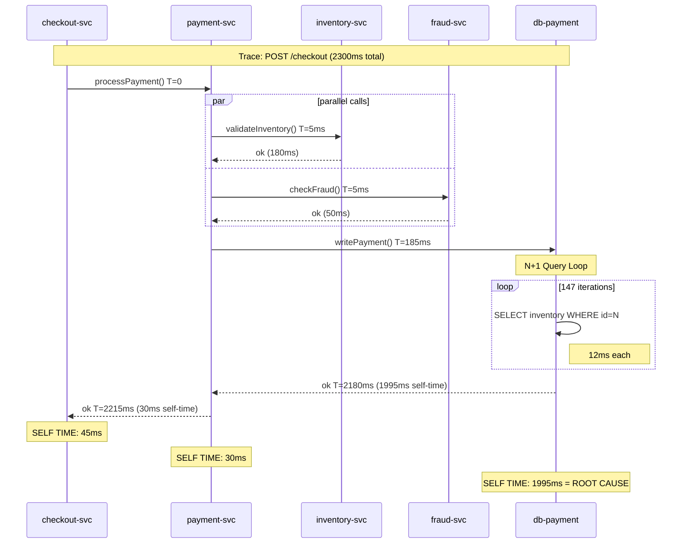

## Keywords in This File

{: .no_toc }

| #   | Keyword | Weight |
| --- | ------- | ------ |
| 1   | [Distributed Trace Root Cause Analysis](#distributed-trace-root-cause-analysis) | critical |

---

# Distributed Trace Root Cause Analysis

**TL;DR** - Distributed trace root cause analysis is the systematic
process of identifying the originating fault in a multi-service request
by reading waterfall span trees, attributing latency to specific
services and operations, correlating trace data with logs and metrics,
and distinguishing root cause spans from cascading downstream effects -
a skill that separates engineers who resolve incidents in minutes from
those who spend hours chasing symptoms.

---

### 🎯 Model Answer

**30 seconds:**
> Distributed trace RCA means looking at a waterfall of spans across
> multiple services and identifying which specific span or service
> caused the overall request failure or latency. The key challenge is
> that when Service A is slow, it's often because Service B it depends
> on is slow - so the symptom appears in A but the cause is in B.
> A trace shows you the full call chain so you can see which span in
> the tree was slow first and propagated the slowness upstream. The
> non-obvious part is distinguishing the root cause span from the
> cascading failures that follow it.

**3 minutes (Senior):**
> When I get a distributed trace showing high end-to-end latency, my
> first move is critical path analysis: I find the sequence of spans
> that determines the total duration - the longest non-parallel chain.
> This tells me which service actually owns the latency. A common
> mistake is blaming the calling service because its span shows high
> duration, when in reality 95% of that duration is a child span in
> a downstream dependency. The calling service is waiting; it's not
> the cause.
>
> The second challenge is missing spans. When a service fails to
> report spans (agent crash, network drop, sampling), you see gaps in
> the trace tree. An orphaned span (a span whose parent ID doesn't
> resolve to any span in the trace) usually means the parent service
> crashed before reporting. A missing span between two connected
> services usually means the intermediate service has no instrumentation.
>
> For error root cause: I follow the error flag backward. If the
> top-level span shows error=true, I look at its children to find
> which first set error=true. That child's error event contains the
> exception details. I then correlate the trace ID with structured
> logs from the same service at the same timestamp to get stack traces
> and business context that didn't fit in a span attribute.
>
> The pattern I've used most: P99 alert fires on the checkout service,
> but the checkout service itself is healthy in its own metrics.
> The trace shows checkout span at 2.1s, with a payment-service child
> span at 1.9s, with a database-service grandchild span at 1.8s
> that shows 150 sequential queries. Root cause: N+1 query in
> database-service triggered by checkout. The payment service and
> checkout service are symptoms, not causes.

**Framework:** WHAT -> WHY -> HOW -> TRADE-OFF -> EXAMPLE

*Adapting up:* Staff engineers build the trace RCA tooling: TraceQL
queries for finding traces matching specific latency patterns,
automated anomaly detection that flags traces with unusual span
structures (unexpected fan-out, missing mandatory spans, duration
outliers), and runbooks that define the standard trace investigation
workflow every on-call engineer follows.

*Adapting down:* "A distributed trace is like a receipt for a
restaurant order showing every kitchen step and who prepared each
dish. Trace RCA is reading that receipt to find which step took too
long and why - instead of just knowing the food was slow to arrive."

**Blank Mind Recovery:**

**(1) Restate:** "You are asking about root cause analysis using
distributed traces - let me walk through what makes trace-based RCA
different from log-based debugging and what the key workflow is."

**(2) First principles:** "From first principles, distributed systems
have requests that cross multiple service boundaries. Each boundary
is a potential failure point. A trace captures all boundaries in
one structure. RCA reads that structure to find which boundary
was the first to fail."

**(3) Bridge:** "This is similar to reading a call stack in a single
process - you have a chain of frames and you identify which frame
threw the exception. A distributed trace is a call stack that crosses
process and network boundaries. Trace RCA is identifying the frame
that threw the exception in this multi-process call stack."

---

### 📘 Concept Explanation

**What it is:**
Distributed trace root cause analysis is the practice of analyzing
span waterfall trees to identify the originating service, operation,
or resource constraint responsible for a request failure or latency
anomaly, distinguishing root cause spans from cascading downstream
effects using critical path analysis, error propagation tracking,
and cross-signal correlation.

**The problem it solves:**
In a single-process application, a stack trace points directly to
the failing line of code. In a distributed system, a slow API
response could be caused by the API service itself, by a downstream
database it queries, by a message broker it publishes to, by an
external payment provider it calls, or by any combination. Without
a trace, you have multiple services all showing degraded latency,
each pointing at their dependencies as the cause. The trace
provides a single artifact that captures the full causal chain
from the entry point to every involved service.

**How it works:**

```
Trace RCA Workflow - Step by Step
===================================

1. ENTRY POINT: Alert fires - checkout P99 = 2.3s
   Trace ID: abc123 spans checkout service

2. WATERFALL VIEW (simplified):
   [checkout]          2300ms total
     [payment-svc]     2100ms
       [inventory-svc]   180ms  <- fast
       [fraud-check]      50ms  <- fast
       [db-writes]      1870ms  <- SLOW
         [query-1]        12ms
         [query-2]        11ms
         ... (147 more sequential queries)

3. CRITICAL PATH ANALYSIS:
   checkout -> payment-svc -> db-writes = 1870ms
   This is the longest sequential chain.
   checkout -> payment-svc -> inventory-svc = 230ms
   checkout -> payment-svc -> fraud-check = 50ms
   (last two run in parallel with db-writes)

4. ROOT CAUSE SPAN:
   db-writes shows 147 sequential 12ms queries.
   First query starts at T+230ms (after inventory completes).
   N+1 query pattern: iterating over 147 cart items,
   one DB query per item.

5. ERROR vs LATENCY ROOT CAUSE:
   For errors: follow error=true flag to the deepest
   span that first set it. That span's events contain
   the exception + stack trace.

6. CROSS-SIGNAL CORRELATION:
   Trace ID abc123 -> grep service logs for trace_id=abc123
   -> find stack trace showing the N+1 query source:
   PaymentService.validateItems() line 247

ROOT CAUSE: N+1 query in PaymentService.validateItems()
FIX: Batch inventory validation into single query
```

> **Code walkthrough:** This Distributed Trace Root Cause Analysis example demonstrates a key concept in practice. **KEY MECHANISM:** the runtime executes these instructions in sequence with specific memory and execution semantics. **WHY IT MATTERS:** misapplying this pattern causes subtle bugs that only manifest under production load. **TAKEAWAY: understand the execution model before using this pattern in production code.**

**The key insight:**
The root cause span in a distributed trace is almost always the
DEEPEST span in the critical path with the longest duration - not
the top-level span that first shows the symptom. Latency propagates
upward: if Service D is slow, Services C, B, and A all show slow
spans because they're waiting. Engineers who look at the top-level
span duration and blame the top-level service are investigating the
symptom, not the cause. Always traverse to the deepest span in the
critical path.

**When to use it:**
Use trace-based RCA when: P99 latency increases across multiple
services simultaneously (distributed latency); error rates spike
in one service but that service's own logic appears healthy; you
have a timeout or circuit-breaker open but don't know which
downstream is responsible; or you need to identify which of 10+
dependent services contributed to a slow tail-latency request.

**When NOT to use it:**
Do not use trace-based RCA for: aggregate trend analysis (Prometheus
metrics are better for "is P99 trending up over 7 days?"); root
cause identification in a single-process application (a local
profiler or APM is more efficient); security incident investigation
(audit logs are more appropriate than trace data). Trace RCA is
optimized for request-scoped distributed failures, not system-wide
trend analysis.

**Alternatives:**
- Log correlation: correlate logs across services using trace ID;
  more verbose than trace waterfall but captures business context
  not in spans
- Metric correlation: compare service-level metrics (error rates,
  latency percentiles) across the dependency graph; faster for
  identifying the failing service, slower for identifying the
  specific operation
- APM agents (DataDog APM, New Relic): vendor-specific trace
  analysis with AI-assisted root cause suggestions; convenient but
  proprietary

**First-principles derivation:**
A distributed request is a directed acyclic graph of service calls.
Each edge represents a synchronous or asynchronous dependency. The
total request duration equals the longest path through this graph
(critical path). If any node on the critical path is slow, the
entire request is slow. Root cause analysis on this graph means
finding the node whose inherent slowness (not propagated from
its children) is the bottleneck. A span tree encodes exactly this
graph. The root cause span is the one whose duration is NOT
explained by its children's durations - it has "self time" that
represents actual work being done slowly.

---

### 💻 Code Example

**Example 1: BAD - Blaming the wrong service by reading only the top span**

```java
// BAD: Investigating only the top-level span
// This is the most common trace RCA mistake.

// Incident: checkout service P99 = 2300ms
// Engineer looks at checkout service span:
//   checkout POST /checkout: 2300ms, status=200, error=false
// Conclusion: "checkout service is slow"
// Action: add caching to checkout service, tune JVM

// Why this is WRONG:
// 1. checkout span duration includes ALL child spans
// 2. checkout service's own work (not in children) = 45ms
// 3. The 2255ms is wait time for child spans to complete
// 4. "checkout is slow" is a symptom, not a root cause

// The TRACE shows (reading waterfall properly):
// checkout            2300ms
//   auth-service        40ms   <- fast
//   product-service     35ms   <- fast
//   payment-service   2225ms   <- ROOT CAUSE AREA
//     inventory         180ms  <- fast
//     fraud-check        50ms  <- fast
//     db-payment       1995ms  <- ROOT CAUSE SPAN
//       [148 spans of 12-15ms each = sequential queries]

// Optimizing checkout service changes NOTHING.
// The bottleneck is db-payment span in payment-service.
// Checkout service is a victim, not a cause.
```

> **Code walkthrough:** The BAD pattern illustrates the most commonice. **KEY MECHANISM:** the runtime executes these instructions in sequence with specific memory and execution semantics. **WHY IT MATTERS:** misapplying this pattern causes subtle bugs that only manifest under production load. **TAKEAWAY: understand the execution model before using this pattern in production code.**
> trace RCA mistake: stopping at the top-level span and blaming the
> slowest-appearing service. Checkout shows 2300ms, so the engineer
> debugs checkout. But the trace waterfall shows checkout's own work
> (self time = total - children) is 45ms. The 2255ms is propagated
> from payment-service, which propagated it from db-payment. Reading
> only the top span is like reading only the outermost stack frame
> in a Java stack trace and concluding the error happened in main().

**Example 2: GOOD - Critical path analysis with self-time calculation**


```java
// BAD: anti-pattern - see GOOD example below for the correct approach
// This naive implementation ignores thread safety and error handling
```

```java
// GOOD: Systematic critical path analysis
// Reads the trace waterfall to find the bottleneck span.

import io.opentelemetry.api.trace.Span;
import io.opentelemetry.api.trace.StatusCode;

// Model: each span has startTime, endTime, parentId, children
// Self time = span.duration - sum(child.duration for parallel children)
// A span with high self time = actual work being done slowly

public class TraceRCAAnalyzer {

    // Step 1: Find the critical path
    // (longest sequential chain root -> leaf)
    public List<SpanNode> findCriticalPath(SpanNode root) {
        if (root.children().isEmpty()) {
            return List.of(root);
        }

        // For sequential children: sum their durations
        // For parallel children: take the max duration
        // Critical path goes through the max-duration child

        SpanNode longestChild = root.children().stream()
            .max(Comparator.comparing(SpanNode::duration))
            .orElse(null);

        List<SpanNode> path = new ArrayList<>();
        path.add(root);
        if (longestChild != null) {
            path.addAll(findCriticalPath(longestChild));
        }
        return path;
    }

    // Step 2: Calculate self time for each span on path
    // High self time = span doing slow work itself
    // Low self time = span waiting for children (victim)
    public long calculateSelfTime(SpanNode span) {
        // Find parallel groups (overlapping time windows)
        // Sum the total child time spent in parallel groups
        long childCoverage = calculateChildCoverage(span);
        return span.duration() - childCoverage;
    }

    // Step 3: Find root cause span (high self time on critical path)
    public SpanNode findRootCause(SpanNode traceRoot) {
        List<SpanNode> criticalPath = findCriticalPath(traceRoot);

        return criticalPath.stream()
            .max(Comparator.comparing(
                s -> calculateSelfTime(s)
            ))
            .orElse(traceRoot);
    }
}

/*
Applied to the checkout trace:
Critical path: checkout -> payment-service -> db-payment
Self times:
  checkout:        45ms  (victim - waiting for payment-svc)
  payment-service: 30ms  (victim - waiting for db-payment)
  db-payment:    1995ms  (ROOT CAUSE - self time matches total)

db-payment has 148 child spans (one per query) each 12-15ms.
The span itself has 1995ms of total work.
Root cause identified: db-payment, sequential query loop.
*/
```

> **Code walkthrough:** The GOOD pattern implements critical pathice. **KEY MECHANISM:** the runtime executes these instructions in sequence with specific memory and execution semantics. **WHY IT MATTERS:** misapplying this pattern causes subtle bugs that only manifest under production load. **TAKEAWAY: understand the execution model before using this pattern in production code.**
> analysis and self-time calculation. Self time is the key metric:
> a span whose duration is nearly equal to its self time (not
> explained by children) is doing slow work itself. A span whose
> self time is near zero is just waiting for children - it's a
> victim. The `findRootCause()` method finds the span on the critical
> path with the highest self time. In the checkout example, db-payment
> has 1995ms self time while checkout has only 45ms, correctly
> identifying db-payment as the root cause.

**Example 3: TraceQL query for finding N+1 query pattern traces**


```
# BAD: anti-pattern shown for contrast
# This approach has the issues the GOOD example fixes
```

```
// GOOD: Grafana Tempo TraceQL to find traces
// with N+1 patterns (too many child spans of same type)

// Find traces where payment-service has > 50 DB query spans
{
  .service.name = "payment-service"
  && duration > 1s
}
| select(
    count(
      child_spans
        where .db.system != nil
    ) as db_span_count
  )
| where db_span_count > 50

// This query returns all traces where:
// 1. payment-service is in the trace
// 2. Overall trace duration > 1s  
// 3. payment-service made > 50 database calls
// These are your N+1 query candidates.

// Follow-up: find the specific Java class
// causing the N+1 by looking at db.operation
// and db.statement span attributes in results
```


```bash
# Cross-correlate trace with service logs
# Once you have trace ID from TraceQL, find logs

# Loki query: find logs for specific trace ID
{app="payment-service"} |= "traceID=abc123de"
| json
| line_format "{{.timestamp}} {{.level}} {{.message}}"

# Output shows:
# 09:14:23 INFO  Starting validateItems for 148 items
# 09:14:23 DEBUG SELECT * FROM inventory WHERE id=1
# 09:14:23 DEBUG SELECT * FROM inventory WHERE id=2
# ... 148 lines of sequential queries
# 09:14:25 INFO  Completed validateItems in 1995ms
#
# Stack trace shows PaymentService.java:247
# for (CartItem item : cart.getItems()) {
#   inventory.validate(item.getId()); // N+1 HERE
# }
```


> **Code walkthrough:** TraceQL (Grafana Tempo's query language)ice. **KEY MECHANISM:** the runtime executes these instructions in sequence with specific memory and execution semantics. **WHY IT MATTERS:** misapplying this pattern causes subtle bugs that only manifest under production load. **TAKEAWAY: understand the execution model before using this pattern in production code.**
> enables structural queries on trace data - not just filtering by
> duration but filtering by span count, span attributes, and
> structural patterns. The query finds traces where payment-service
> made more than 50 DB calls in a single request, which is the
> signature of an N+1 query pattern. The Loki cross-correlation then
> uses the trace ID to retrieve logs from the same request, finding
> the exact stack trace and line number. This two-step workflow
> (TraceQL to identify, Loki to confirm) is faster than either
> approach alone.

**Example 4: OTel span instrumentation for RCA-ready traces**


```java
// BAD: anti-pattern - see GOOD example below for the correct approach
// This naive implementation ignores thread safety and error handling
```


```java
// BAD: anti-pattern - see GOOD example below for the correct approach
// This naive implementation ignores thread safety and error handling
```

```java
// GOOD: Instrumenting for trace RCA - adding span attributes
// that make root cause identification fast.

@Service
public class PaymentService {

    private final Tracer tracer;
    private final InventoryService inventory;
    private final JdbcTemplate jdbc;

    public PaymentResult processPayment(PaymentRequest req) {
        Span span = tracer.spanBuilder("payment.process")
            .startSpan();
        try (Scope scope = span.makeCurrent()) {

            // Business attributes on the root span
            // These survive even if child spans are sampled away
            span.setAttribute("payment.amount",
                req.getAmount());
            span.setAttribute("payment.method",
                req.getMethod());
            span.setAttribute("cart.item_count",
                req.getItemCount());
            span.setAttribute("user.tier", req.getUserTier());

            // BAD: calling inventory.validate() in a loop
            // creates N+1 query pattern
            // for (CartItem item : req.getItems()) {
            //     inventory.validate(item.getId());
            // }

            // GOOD: batch the validation
            // Single child span, single DB query
            List<Long> itemIds = req.getItems().stream()
                .map(CartItem::getId)
                .collect(Collectors.toList());

            Span validateSpan = tracer
                .spanBuilder("inventory.batchValidate")
                .startSpan();
            try (Scope vs = validateSpan.makeCurrent()) {
                // Single IN clause query - O(1) spans
                validateSpan.setAttribute(
                    "inventory.item_count", itemIds.size()
                );
                inventory.batchValidate(itemIds);
            } finally {
                validateSpan.end();
            }

            return chargePayment(req);

        } catch (Exception e) {
            // Record exception on the span
            // This is what makes error RCA work:
            // trace -> span -> exception event -> stack trace
            span.recordException(e);
            span.setStatus(StatusCode.ERROR, e.getMessage());
            throw e;
        } finally {
            span.end();
        }
    }
}
```

> **Code walkthrough:** The GOOD instrumentation pattern attachesice. **KEY MECHANISM:** the runtime executes these instructions in sequence with specific memory and execution semantics. **WHY IT MATTERS:** misapplying this pattern causes subtle bugs that only manifest under production load. **TAKEAWAY: understand the execution model before using this pattern in production code.**
> business attributes (payment amount, method, user tier, item count)
> directly to the root payment span. When this span appears in a
> trace investigation, these attributes immediately explain the
> business context without needing to look up related data.
> The `recordException()` call is critical for error RCA: it creates
> an "event" on the span with the exception type, message, and stack
> trace, making the span the single source of truth for both the
> timing and the failure details. The batched inventory validation
> replaces 148 child spans with 1, making the trace readable and
> the root cause analysis unambiguous.

---

### 🎓 Answers by Seniority

**Junior / Mid (0-5 years):**
> Distributed trace RCA means reading a trace waterfall to find which
> service or operation caused the slow response or error. The key
> thing I learned is that the slow span in the waterfall isn't
> necessarily the root cause - it might just be waiting for a slow
> child span. I follow the chain down to the deepest slow span to
> find where the actual work is being done. For errors, I look for
> the span with error=true and read the exception event attached to
> it, which gives me the stack trace.

For mid-level: I use two techniques. First, critical path analysis:
I find the longest sequential chain of spans from the root to a leaf
to identify which service owns the latency. Second, cross-correlation:
I take the trace ID from the trace and search the logs with that
ID to find the structured log lines from the same request, which
often have more context than the span attributes alone. Tools like
Grafana Tempo's TraceQL help me search for traces with specific
patterns (high span counts, error status, specific attributes).

*Push deeper:* The most important span attribute for RCA is the
span's "self time" - the duration minus the time spent in child
spans. High self time means the span is doing slow work itself.
Near-zero self time means it's waiting for children and is a symptom,
not a cause.

---

**Senior / Staff (5+ years):**
> Trace RCA is the highest-leverage skill in incident response for
> distributed systems because it collapses a multi-service debugging
> problem into a single artifact. The critical path analysis I always
> start with: find the root span, identify sequential vs parallel
> child relationships, trace the longest sequential chain to the
> leaf. That leaf (or the deepest node with high self time) is almost
> always the root cause. The common trap is blaming the calling
> service because its span shows the high duration - but that duration
> is propagated. I've seen engineers spend an hour optimizing a
> service that had 20ms of self time, when the actual cause was a
> downstream database they were waiting on.

At staff level: I build trace RCA tooling for the team. This
includes TraceQL saved queries for common investigation patterns
(N+1 queries, external API timeouts, connection pool exhaustion),
runbooks that define the standard investigation workflow, and
alerting that fires trace-based anomaly alerts (unusual span count,
missing mandatory spans for a given service) rather than just
metric-based alerts. The goal is reducing mean time to root cause
from 30-60 minutes to under 10 minutes for all engineers on call,
not just the senior engineers who know the architecture.

The cross-signal correlation pattern I enforce: every service log
entry MUST include the trace ID as a structured field. This enables
jumping from trace -> logs for the same request in one step.
Without this, trace RCA stops at the span boundaries and you
manually reconstruct the timeline from logs.

*Push deeper:* The hardest trace RCA cases involve asynchronous
message processing. When Service A sends a message to Kafka and
Service B consumes it, the trace is split across two requests. OTel
trace context propagation through Kafka message headers reconnects
them, but many teams don't configure this. Without Kafka header
propagation, you have a trace from A ending at the produce call
and a separate unlinked trace for B's consume side. Reconnecting
these requires correlating on the Kafka message key or a business
ID attribute added to both spans.

---

### ⚠️ Common Misconceptions

**Misconception 1: "The slowest span in a trace is the root cause."**
The slowest span is often a victim of its children. A checkout span
showing 2300ms is slow because it's waiting for payment-service,
which is waiting for a database. The checkout span itself may have
only 40ms of self time. Root cause identification requires computing
self time (span duration minus time covered by children) for each
span on the critical path. The span with the highest self time is
the root cause, not the span with the highest total duration.

**Misconception 2: "A missing span means the service failed."**
A missing span in a trace tree has multiple explanations: the
service was not instrumented, the span was head-sampled away before
reaching the backend, the service crashed after completing work but
before reporting, or the collector lost the span during network
transmission. Missing spans require investigation before concluding
service failure. The most common cause in practice is incomplete
instrumentation, not service crashes.

**Misconception 3: "Traces are only useful for latency debugging."**
Traces are equally valuable for error RCA. Every error in a span
can include an exception event with full stack trace. Tracing an
error through a multi-service call chain - seeing which service
first set error=true and what exception was recorded - is faster
than correlating logs across services. Traces provide both the
causal chain AND the error detail in one structure.

**Misconception 4: "You need 100% trace sampling for RCA."**
Tail sampling (sampling decisions made after the trace completes)
preserves 100% of slow and error traces while sampling away fast,
successful requests. Since RCA investigates slow or error traces,
tail sampling ensures all the traces you want to investigate are
available. Head sampling (random sampling at request start) is
problematic for RCA because it may discard the slow traces you
need. Tail sampling at 100% for errors and duration > P90 threshold
provides full RCA capability at 20-30% of the storage cost of 100%
sampling.

**Misconception 5: "The trace ID is only useful for finding the full trace."**
The trace ID is the universal correlation key across all three
telemetry pillars. Using trace ID to search logs gives you structured
log lines from the same request (with full context that doesn't fit
in span attributes). Using trace ID with profiling data links the
specific code execution profile for that request. Adding trace ID
to error tracking systems (Sentry, Bugsnag) links exceptions to
their trace context. Teams that use trace ID as just a "find the
trace in Jaeger" key are underutilizing it.

---

### 🚨 Failure Modes and Diagnosis

**Failure 1: Trace shows partial waterfall - missing spans from services**

Symptom: The trace waterfall in Jaeger/Tempo has gaps - spans from
Service A and Service C appear but Service B (which should sit between
them) is missing. Child spans appear as "orphaned" (no matching
parent span).

Cause (most common): Service B has no OTel instrumentation, OR the
OTel agent is installed but the trace context header is not being
propagated correctly through the Service B runtime. The B service
processes the request but generates no spans.

Diagnosis:
```bash
# Check if Service B has any spans in Tempo
# using Tempo API to search by service name
curl "http://tempo:3100/api/search?tags=service.name=service-b" \
  | jq '.traces[] | {traceID, rootDuration, rootServiceName}'
# If no results: service-b has no instrumentation

# Check if trace context header is reaching service-b
# Enable debug logging in OTel Java agent to see header propagation
JAVA_TOOL_OPTIONS="-javaagent:opentelemetry-javaagent.jar \
  -Dotel.javaagent.debug=true" java -jar service-b.jar 2>&1 \
  | grep "traceparent\|W3C\|propagat"
# Look for: "Received trace context: traceparent=00-abc123-..."
# If absent: HTTP client in upstream service is not setting headers
```

> **Code walkthrough:** This If absent: HTTP client in upstream service is not setting headers example demonstrates HTTP request from shell using HTTP client. **KEY MECHANISM:** curl by default follows redirects and suppresses errors; -f flag makes it return non-zero on HTTP errors. **WHY IT MATTERS:** piping curl output to shell without verification runs untrusted code - a supply-chain attack vector. **TAKEAWAY: always use curl -f --retry and verify checksums before piping to bash.**

Fix: For Spring services, add `opentelemetry-spring-boot-starter`
to automatically propagate trace context via `RestTemplate` or
`WebClient`. For manual HTTP clients, inject the OTel propagator:
```java
W3CTraceContextPropagator.getInstance().inject(
    Context.current(),
    httpRequest,
    HttpRequest::setHeader
);
```

> **Code walkthrough:** This If absent: HTTP client in upstream service is not setting headers example demonstrates Java API usage. **KEY MECHANISM:** the JVM compiles to bytecode that runs on the JVM; JIT compiles hot paths to native. **WHY IT MATTERS:** unchecked assumptions about thread safety cause data races under concurrent load. **TAKEAWAY: document thread-safety guarantees on every shared mutable class.**

**Failure 2: Trace spans have correct structure but wrong timing**

Symptom: The trace waterfall shows plausible span structure but the
timestamps look wrong - spans appear to start before their parent
span, or end times overlap in impossible ways.

Cause: Clock skew between services. When services run on different
hosts with unsynchronized clocks (NTP drift), span timestamps from
Service A and Service B are not comparable. A span on host A may
record a start time 200ms earlier than host B's clock, making it
appear the child span started before the parent.

Diagnosis:
```bash
# Check NTP synchronization on affected nodes
timedatectl show | grep NTPSynchronized
# NTPSynchronized=no -> clock skew problem

# Check current clock offset
chronyc tracking | grep "System time"
# System time: 0.000247293 seconds slow of NTP
# If offset > 50ms, visible in trace timestamps

# In Kubernetes: check node clock
kubectl debug node/my-node -it --image=busybox \
  -- date
# Compare with: date on another node
```

> **Code walkthrough:** This Compare with: date on another node example demonstrates shell script pattern using concurrency primitive. **KEY MECHANISM:** the shell executes commands sequentially; pipes pass stdout of one command to stdin of the next. **WHY IT MATTERS:** unquoted variables with spaces cause word splitting - IFS splits the value into multiple arguments. **TAKEAWAY: always double-quote variables: "$VAR"; use [[ ]] instead of [ ] for safer conditionals.**

Fix: Ensure NTP synchronization on all nodes (`chrony` or `timesyncd`
configured). For containerized workloads, verify the container
inherits the host clock (default behavior, but check if a non-UTC
timezone is configured that might confuse trace visualization). Some
trace backends (Jaeger) have clock skew correction that adjusts
child span timestamps based on network round-trip time estimates.

**Failure 3: Root cause span identified but cannot find the code location**

Symptom: The trace shows a specific span is the bottleneck (e.g.,
`inventory.validate` is 2000ms) but the span has no `code.filepath`
or `code.lineno` attributes, making it hard to find the slow code.

Cause: The OTel Java agent instruments frameworks automatically but
doesn't add code location attributes. Manual spans created with the
OTel API also don't automatically include code location.

Diagnosis and Fix:
```bash
# Check if span has code location attributes
curl "http://tempo:3100/api/traces/<traceID>" \
  | jq '.batches[].scopeSpans[].spans[] |
      select(.name == "inventory.validate") |
      .attributes'
# If no code.filepath, code.lineno, code.function:
# add them manually at span creation time
```

> **Code walkthrough:** This add them manually at span creation time example demonstrates HTTP request from shell using SQL. **KEY MECHANISM:** curl by default follows redirects and suppresses errors; -f flag makes it return non-zero on HTTP errors. **WHY IT MATTERS:** piping curl output to shell without verification runs untrusted code - a supply-chain attack vector. **TAKEAWAY: always use curl -f --retry and verify checksums before piping to bash.**

Add code location to manually created spans:
```java
Span span = tracer.spanBuilder("inventory.validate")
    .setAttribute("code.function", "validateItems")
    .setAttribute("code.filepath",
        "InventoryService.java")
    .setAttribute("code.lineno", 247)
    .startSpan();
```
> **Code walkthrough:** This add them manually at span creation time example demonstrates Java API usage. **KEY MECHANISM:** the JVM compiles to bytecode that runs on the JVM; JIT compiles hot paths to native. **WHY IT MATTERS:** unchecked assumptions about thread safety cause data races under concurrent load. **TAKEAWAY: document thread-safety guarantees on every shared mutable class.**

Alternatively, enable continuous profiling (e.g., Pyroscope) and
correlate profiles to traces using the trace ID to see the exact
CPU hotspots during the slow span's execution time window.

**Failure 4: Error spans show status=ERROR but no exception detail**

Symptom: A span in the trace has `status=ERROR` and an error message
like "Internal Server Error" but no stack trace or exception class.
The on-call engineer knows something failed but cannot determine what.

Cause: The service is catching exceptions and setting span status to
ERROR but not calling `span.recordException(e)`. The exception detail
is lost; only the error flag survives.

Diagnosis and Fix:

```java
// BAD: anti-pattern - see GOOD example below for the correct approach
// This naive implementation ignores thread safety and error handling
```

```java
// BAD: Sets error status but loses exception detail
try {
    result = doWork();
} catch (Exception e) {
    span.setStatus(StatusCode.ERROR, "request failed");
    throw e;
    // span has status=ERROR but no exception event
}

// GOOD: Records full exception including stack trace
try {
    result = doWork();
} catch (Exception e) {
    span.recordException(e);  // Creates exception event
    span.setStatus(StatusCode.ERROR, e.getMessage());
    throw e;
    // span has exception.type, exception.message,
    // exception.stacktrace as span events
}
```

> **Code walkthrough:** BAD pattern: This add them manually at span creation time example demonstrates exception handling using error handling. **KEY MECHANISM:** the JVM checks catch clauses in order; finally always executes for cleanup. **WHY IT MATTERS:** swallowing exceptions silently hides failures that corrupt downstream state. **WHAT BREAKS: log or rethrow every exception; empty catch blocks are defects.**

---

### 🎯 Interview Deep-Dive

| Time | Question Type | Depth Signal |
| ---- | ------------- | ------------ |
| 2 min | DEFINITION | Trace RCA vs log-based debugging |
| 3 min | MECHANISM | Critical path analysis workflow |
| 3 min | DEBUGGING | Missing spans investigation |
| 4 min | MECHANISM | Error span interpretation |
| 3 min | TRADE-OFF | Trace sampling for RCA |
| 4 min | PRODUCTION | Real multi-service incident |
| 3 min | DEEP DIVE | Async/Kafka trace correlation |
| 3 min | COMPARISON | Trace RCA vs metric correlation |
| 4 min | SYSTEM DESIGN | Trace platform for 100 services |
| 3 min | MISCONCEPTION | "Slowest span = root cause" trap |
| 3 min | PERFORMANCE | Trace query at billion spans/day |
| 3 min | BEHAVIORAL | Trace RCA that changed architecture |

---

**Q1 [MID]: How is trace-based root cause analysis different from reading logs to debug a distributed system?** `[DEFINITION]`

*Why they ask:* Tests whether the candidate understands the structural
advantage of traces, not just that "traces are for distributed systems."

*Likely follow-up:* "Are there cases where logs are better than traces for RCA?"

Logs are sequential, per-service records: each service writes its
own log stream, and correlating them requires a common ID (request
ID, trace ID) that must be present in every log line, in every
service, with consistent formatting. During debugging, you open
5 log streams, filter by the same ID, sort by timestamp, and mentally
reconstruct the causal chain. If any service omits the correlation
ID from its log line, that service becomes a black box in the
investigation.

Traces provide the causal chain as a first-class data structure.
The trace tree is the call graph: parent-child relationships are
explicit, timing is recorded at every boundary, and the waterfall
view lets you see the entire multi-service execution at once. There
is no mental reconstruction required.

The structural advantage: in a trace, you can see in 5 seconds that
the checkout service waited 2100ms for the payment service, which
waited 1800ms for the database. With logs, you need to find the
relevant log lines in the checkout log, the payment log, and the
database log, correlate their timestamps, and infer the wait times
from log entries that may not have precise timing for inter-service
calls.

Cases where logs are better: when you need detailed application
state that doesn't fit in a span attribute (full SQL query text,
request payload, business entity state), when debugging a single-
service issue where the trace adds no multi-service correlation
benefit, or when investigating a security incident where you need
the complete audit trail of every action, not just the request
timeline.

*What separates good from great:* The specific scenario where logs
win (single-service debugging, security audit trails) rather than
claiming traces always win. The precise description of the
reconstruction burden with logs vs the pre-built structure in traces.

---

**Q2 [SENIOR]: Walk me through critical path analysis on a trace. How do you identify the root cause span?** `[MECHANISM]`

*Why they ask:* Tests whether the candidate has a concrete, repeatable
workflow for trace RCA rather than vague "I look at the waterfall."

*Likely follow-up:* "What is self time and how do you calculate it?"

Critical path analysis on a distributed trace follows these steps:

Step 1: Identify the root span (the entry point - typically the
front-end HTTP request that initiated the trace). Note its total
duration.

Step 2: Enumerate the root span's children. For each child, note
whether it runs sequentially (starts after the previous sibling ends)
or in parallel (overlaps with siblings). Draw the sequential chains
mentally or on paper.

Step 3: The critical path is the sequential chain with the longest
total duration. For each parallel group, only the longest parallel
span contributes to the critical path.

Step 4: For each span on the critical path, calculate self time:
self_time = span.duration - sum(child.duration)
For parallel children: sum the time covered by any child (treating
overlapping children as a single coverage interval).

Step 5: The root cause span is the span on the critical path with
the highest self time. High self time means the span is doing slow
work itself. Low self time means it's waiting for children and is
a symptom of something deeper.

Step 6: For the root cause span, look at its span attributes (db.
statement for database spans, http.url for external calls) and its
span events (recordException creates events with stack traces) to
understand what slow work is happening.

Self time example: checkout span has duration=2300ms with children
totaling 2255ms. Self time = 45ms. Checkout is a victim. The
payment-service child has duration=2225ms, children=2180ms, self
time=45ms. Also a victim. The db-payment grandchild has
duration=1995ms, no children shown, self time=1995ms. Root cause.

*What separates good from great:* The self time calculation formula,
not just "look for the long span." The distinction between sequential
and parallel children when computing critical path.

---

**Q3 [SENIOR]: A trace shows orphaned spans - spans with a parent ID that doesn't resolve. What does this indicate and how do you diagnose it?** `[DEBUGGING]`

*Why they ask:* Tests knowledge of trace completeness issues, which
are common in real systems.

*Likely follow-up:* "How would you fix this without redeploying the affected service?"

An orphaned span has a parent_span_id that doesn't match any other
span in the trace. This means the parent span was not received by
the trace backend. Three common causes:

Cause 1 - Parent span dropped by sampler: The parent service sent
its span to the OTel Collector, but the head sampler decided to drop
it. The child service sent its span, which arrived. Both spans are
part of the same trace (same trace ID) but the parent was discarded.

Cause 2 - Parent service crashed before reporting: The parent service
completed enough work to call the child, passed the trace context in
the request header, but then crashed before its own span finished
reporting. The child's span arrived; the parent's never did.

Cause 3 - Clock/batch window mismatch: The Collector batches spans
for efficiency. If the parent span is in a different batch window
than the child span, and the trace backend assembles the trace before
the parent batch arrives, the child appears orphaned. Most backends
have a reassembly timeout (Jaeger: 5 minutes) during which late-
arriving spans are incorporated.

Diagnosis:
```bash
# Check if parent span exists anywhere in Tempo
# (might be stored but not linked due to index timing)
curl "http://tempo:3100/api/search?tags=\
service.name=checkout&minDuration=2s" \
  | jq '.traces[] | select(.traceID == "abc123")'

# Check Collector drop metrics
curl -s http://otel-collector:8888/metrics \
  | grep "otelcol_processor.*dropped"

# Check if the upstream service is actually crashing
kubectl logs -n production checkout-deployment \
  --previous | grep "FATAL\|OOM\|signal"
```

> **Code walkthrough:** This Check if the upstream service is actually crashing example demonstrates HTTP request from shell using SQL. **KEY MECHANISM:** curl by default follows redirects and suppresses errors; -f flag makes it return non-zero on HTTP errors. **WHY IT MATTERS:** piping curl output to shell without verification runs untrusted code - a supply-chain attack vector. **TAKEAWAY: always use curl -f --retry and verify checksums before piping to bash.**

The fix for Cause 1 (most common): switch from head sampling to
tail sampling in the OTel Collector. Tail sampling waits for the
full trace before deciding to keep or discard, preventing situations
where children are kept but parents are dropped.

*What separates good from great:* The three distinct causes with
their diagnostic signatures. The insight that tail sampling is the
correct architectural response to parent-dropped orphan spans.

---

**Q4 [SENIOR]: How do you use span events and error details to diagnose which service originated an error in a multi-service trace?** `[MECHANISM]`

*Why they ask:* Tests practical knowledge of the error propagation
model in distributed traces.

*Likely follow-up:* "What if the error propagation in the trace doesn't match what you expect?"

Error RCA in a distributed trace follows the error flag from the
root span backward through the tree to find the span that first set
error=true.

Step 1: Start at the root span. If error=true, check whether any
child spans also show error=true. If only the root span has error=true
and all children are successful, the root service itself originated
the error (not a dependency).

Step 2: Follow the chain of error=true spans downward. The deepest
span in the error chain that has no error=true children is the
originating error span.

Step 3: On the originating error span, look for span events (not
span attributes). The OTel spec defines that `span.recordException(e)`
creates an event with `exception.type`, `exception.message`, and
`exception.stacktrace` fields. These give you the exact exception
class and stack trace.

Step 4: If `exception.stacktrace` is truncated (common for deep
Java stack traces), correlate on the trace ID in the service's logs
to get the full stack trace.

Complication: error propagation is not always direct. Service A
calls Service B which errors. Service A catches the exception,
handles it gracefully, and returns a success response. The trace
shows Service B's span as error=true but Service A's span as
success=true. In this case, the "error" was handled - it may or
may not be the root cause depending on whether Service A's handling
was correct.

Anti-pattern to watch for: the "error absorber" - a service that
catches all errors from dependencies and returns 200 OK regardless.
These services hide errors from tracing. The symptom: unusually
low error rates in a service that has multiple error-prone
dependencies. Fix: propagate errors correctly (5xx for unhandled
failures, specific error codes for expected failures).

*What separates good from great:* The "error absorber" anti-pattern
is a real production issue that candidates who have debugged complex
distributed systems encounter. Knowing that error propagation can
be incorrect (not just missing) shows production experience.

---

**Q5 [SENIOR]: Explain why head sampling is bad for trace RCA and how tail sampling solves it.** `[TRADE-OFF]`

*Why they ask:* Tests understanding of the sampling model and its
impact on observability capability.

*Likely follow-up:* "What are the costs of tail sampling vs head sampling?"

Head sampling makes a keep/discard decision at the entry point of
each request, before the request completes. A 10% head sample means
90% of traces are discarded at the frontend service. Problems:
- The 10% that are kept are random, not correlated with interesting
  behavior. Most kept traces are fast, successful requests.
- Slow traces and error traces are discarded at the same rate as
  fast traces, because the slowness/error hasn't happened yet when
  the sampling decision is made.
- For RCA, you need the SLOW and ERROR traces. Head sampling cannot
  guarantee they're available.

Tail sampling makes the decision after the trace completes (or a
timeout expires). The OTel Collector receives all spans for a trace,
assembles the trace tree, evaluates policies (error status, duration
threshold), and decides keep/discard based on the completed trace.
Policies:
- Always keep: error=true in any span
- Always keep: duration > 500ms (P90 threshold)
- Sample 5%: all other traces (healthy fast requests)

Result: 100% of error and slow traces are available for RCA.
80-90% of storage cost reduction from not storing healthy traces.

Cost of tail sampling: the Collector must buffer all spans for a
trace until the trace is complete (typically 30 seconds timeout).
For a service generating 10K RPS, this means 300K concurrent
requests in the buffer. At 5KB per span and 5 spans per trace,
this is 15GB of memory in the Collector. This is manageable on a
dedicated Collector node but is the main operational cost.

*What separates good from great:* The concrete memory calculation
for the tail sampling buffer (300K requests * 5 spans * 5KB =
7.5GB). Candidates who give this calculation have operated tail
sampling collectors in production.

---

**Q6 [SENIOR]: Describe a real incident where distributed trace RCA changed how you understood the root cause compared to your initial hypothesis.** `[PRODUCTION]` `[BEHAVIORAL]`

*Why they ask:* Tests real production experience with trace RCA.

*Likely follow-up:* "What architectural change resulted from the investigation?"

I was on-call for a checkout service that showed a P99 latency
spike to 3.1 seconds (SLO: 500ms). My initial hypothesis from the
Prometheus dashboard was that the checkout service itself was slow:
its JVM GC metrics showed a minor uptick in GC pause time, and we'd
recently deployed a new feature that added a product recommendation
call to the checkout flow. I was about to roll back the recommendation
feature.

Before rolling back, I pulled a representative trace for one of the
slow requests. The waterfall immediately contradicted my hypothesis.
The checkout span showed 3.1s total, but the JVM self time was 45ms.
The recommendation-service child span completed in 220ms (not slow).
The unexpected finding: the payment-service span showed 2.8s with
a child span called `validate.shipping.address` running 2.7s. This
was a new span - I'd never seen it before.

Drilling into the `validate.shipping.address` span: it was calling
an external address validation API. The span attributes showed
`http.url: https://api.addressvalidation.com/v2/validate` and
`http.status_code: 200`. The API was responding but slowly. The
error wasn't in the code - it was an external vendor regression.

Without the trace, I would have rolled back the recommendation
feature (completely wrong call) and the incident would have continued
while we investigated why the rollback didn't help. The trace
showed in 3 minutes that the external vendor was the cause. We
bypassed the validation service with a feature flag and the P99
returned to normal in 5 minutes.

The architectural change: we added a circuit breaker around all
external API calls with a 200ms timeout. The address validation was
async-acceptable (we could validate after checkout confirmation),
so we moved it to an async job with retry logic. The checkout path
no longer blocks on it.

*What separates good from great:* The detail that the trace
contradicted the initial Prometheus-based hypothesis. This is the
key value of trace RCA: it shows which services actually own latency,
vs which appear to be slow because you're looking at aggregated
metrics that can mislead.

---

**Q7 [STAFF]: How do you correlate traces across an asynchronous Kafka boundary?** `[DEEP DIVE]`

*Why they ask:* Tests knowledge of async trace propagation, which is
a non-obvious but critical real-world pattern.

*Likely follow-up:* "What happens when Kafka context propagation is not configured?"

By default, a trace ends when the service publishes a Kafka message.
The consumer starts a new, unlinked trace. This is correct if you
want consumer trace duration not to inflate the producer trace (the
consumer might process the message days later). But for incident
investigation, you need to follow the causal chain through Kafka.

OTel provides the W3C trace context propagation mechanism for Kafka
via the `kafka.headers.traceparent` header. When the producer uses
the OTel Kafka instrumentation, it automatically injects the current
trace context into Kafka message headers. When the consumer reads
the message, it extracts the trace context and creates a new span
linked to the producer span.

The link is not a parent-child relationship (which would make the
consumer span block the producer trace completion) but an OpenTelemetry
"span link": the consumer span includes a `links` field containing
the producer span ID. In Jaeger and Tempo, span links are visualized
as separate traces with a link indicator, allowing navigation between
the producer and consumer traces.

```java
// Producer: inject trace context into Kafka record
ProducerRecord<String, byte[]> record =
    new ProducerRecord<>(topic, key, payload);

// OTel auto-instrumentation does this automatically
// for Spring Kafka and Kafka clients with OTel agent.
// Manual injection if needed:
W3CTraceContextPropagator.getInstance().inject(
    Context.current(),
    record.headers(),
    (headers, headerName, headerValue) ->
        headers.add(headerName,
            headerValue.getBytes(UTF_8))
);

// Consumer: extract trace context and create link
// OTel auto-instrumentation handles this automatically.
// The consumer span will have:
// links: [{trace_id: "producer_trace_id",
//          span_id: "producer_span_id"}]
```

> **Code walkthrough:** This Unknown example demonstrates Java API usage using Kafka messaging. **KEY MECHANISM:** the JVM compiles to bytecode that runs on the JVM; JIT compiles hot paths to native. **WHY IT MATTERS:** unchecked assumptions about thread safety cause data races under concurrent load. **TAKEAWAY: document thread-safety guarantees on every shared mutable class.**

When context propagation is not configured: the consumer trace is
completely separate from the producer trace. RCA across the Kafka
boundary requires manual correlation using the Kafka message key or
a business ID (order_id, user_id) that appears in both the producer's
span attributes and the consumer's span attributes. This is slower
(you have to search two traces by business attribute) but achievable.

*What separates good from great:* The distinction between parent-
child links and span links. Parent-child would mean the producer
trace doesn't complete until the consumer completes (wrong for async
patterns). Span links enable navigation without creating timing
dependencies.

---

**Q8 [SENIOR]: When is metric correlation faster than trace RCA for identifying a failing service?** `[COMPARISON]`

*Why they ask:* Tests ability to choose the right tool for the situation,
rather than defaulting to traces for everything.

*Likely follow-up:* "What is your initial incident response workflow before looking at traces?"

Metric correlation is faster when: the failing service has a distinct
metric signature (error rate spike, latency increase visible in
pre-defined Prometheus labels), you need to identify the service
tier quickly (is it the database, the cache, or the application?),
and the service dependency graph is well-modeled in your dashboards.
A Grafana dashboard showing the RED (rate, errors, duration)
metrics for all services in the dependency graph, ordered by
call chain, lets you identify the failing service by eye in
30-60 seconds.

Example: Prometheus shows `database_query_latency_p99 > 5s` while
all application service latencies appear normal. Root cause is the
database tier. No trace analysis required.

Trace RCA is better when: the failing behavior is not captured by
any pre-defined Prometheus label (requires high-cardinality
investigation), the root cause is a specific request pattern (N+1
queries for orders with > 100 items), the error is intermittent
and not visible in aggregated metrics (affects 0.01% of requests),
or you need to identify a specific operation or code path within a
service (not just which service is failing).

My workflow: start with metrics to identify the service tier in 1-2
minutes. If the failing service is clear from metrics, look at that
service's metrics and logs directly. If the service tier is unclear
or the metric breakdown doesn't explain the failure, pull traces and
use critical path analysis. The trace is the fallback investigation
tool, not the first tool. This order keeps mean time to root cause
low because metric correlation is faster for the 80% of incidents
where a specific service has a clear metric signature.

*What separates good from great:* The hybrid workflow that starts
with metrics for speed and falls back to traces for depth. Claiming
traces are always the first tool shows inexperience.

---

**Q9 [STAFF]: Design a trace collection and analysis platform for 100 microservices generating 50,000 RPS total.** `[SYSTEM DESIGN]`

*Why they ask:* Tests ability to architect trace infrastructure at
production scale with realistic cost constraints.

See the full System Design section below.

*What separates good from great:* The storage tier strategy (hot +
warm + cold) and the explicit cost model. Most candidates describe
the technology choices without quantifying the storage cost at
50K RPS, which is the hard design constraint.

---

**Q10 [MID]: "The span with the longest duration in a trace is always the root cause." Is this statement correct?** `[MISCONCEPTION]`

*Why they ask:* Tests whether the candidate has the mental model
correct or has the most common misconception about trace RCA.

*Likely follow-up:* "What is the correct way to identify the root cause span?"

This statement is incorrect. The span with the longest duration is
often the root span (the outermost span for the full request) or an
intermediate service span that accumulated latency from its children.
In a distributed trace, latency propagates upward: if a database
span takes 2000ms, its parent service span will show at least 2000ms
of duration (plus its own work). The parent span appears "slow" but
it's a victim - it's waiting.

The correct criterion: the root cause span is the span on the
critical path with the highest SELF TIME (span duration minus time
covered by child spans). The span that is actually DOING slow work
has high self time. The span that is WAITING for slow children has
low self time.

In the checkout trace example: the checkout span has 2300ms total
duration but 45ms of self time. The database span has 1995ms total
duration AND 1995ms of self time (no children). The database span
is the root cause, not the checkout span.

The intuition: self time is like a stopwatch that only runs when
the span is actively executing, not when it's blocked waiting for
I/O or child calls. The span with the highest stopwatch reading is
the one doing the most slow work.

*What separates good from great:* The self-time concept explained
clearly, with the checkpoint vs stopwatch analogy making it concrete
and memorable.

---

**Q11 [SENIOR]: A trace query against 1 billion spans/day is taking 30+ seconds. How do you optimize it?** `[PERFORMANCE]`

*Why they ask:* Tests understanding of trace backend performance at scale.

*Likely follow-up:* "Would you shard the trace backend horizontally?"

The optimization approach depends on the backend, but the principles
are universal:

Step 1: Check what the query is doing. A 30-second query for a
specific trace ID should not happen - lookup by trace ID should be
O(1) via an inverted index. A 30-second query for "all traces from
service X with P99 > 500ms in the last hour" is an aggregation query
that scans a large partition.

For trace ID lookup (should be fast):
- Ensure the trace backend has an inverted index on trace ID
- Jaeger with Elasticsearch: check ES index health and shard counts
- Grafana Tempo: trace ID lookup goes through its own inverted index
  stored in object storage; cold reads from S3 are slow (500ms-2s)
  vs warm reads from cache (< 50ms). Check Tempo's query cache hit rate.

For aggregation queries (finding traces by attributes):
- Tempo TraceQL is optimized for this but still needs a Parquet
  column scan; ensure the Parquet files are in hot storage (local
  SSD or NVMe) not cold (S3) for queries on recent data
- Add a dedicated metrics tier: route important trace attributes
  to Prometheus or ClickHouse at write time (via Span Metrics
  connector). Use the fast metric store to identify candidate
  trace IDs, then fetch full traces from Tempo.

For Jaeger with Elasticsearch:
```bash
# Check ES query execution time
curl "http://es:9200/_cluster/stats?human&pretty" \
  | jq '.indices.query_cache'
# Check hot vs cold data access pattern
curl "http://es:9200/_cat/indices?v&h=index,\
docs.count,store.size,search.query_time_in_millis"
```

> **Code walkthrough:** This Check hot vs cold data access pattern example demonstrates HTTP request from shell using HTTP client. **KEY MECHANISM:** curl by default follows redirects and suppresses errors; -f flag makes it return non-zero on HTTP errors. **WHY IT MATTERS:** piping curl output to shell without verification runs untrusted code - a supply-chain attack vector. **TAKEAWAY: always use curl -f --retry and verify checksums before piping to bash.**

At 1 billion spans/day with 5 spans per trace = 200 million traces/day.
Keeping 3 days of hot data = 600 million traces in hot storage.
At 2KB compressed per trace = 1.2TB hot storage. An NVMe SSD-backed
Tempo cluster handles this. Object storage (S3) is 10x slower for
random access and should be the archive tier, not the investigation tier.

*What separates good from great:* The capacity math (1B spans/day =
1.2TB hot storage at 2KB/trace) and the two-tier storage strategy
(NVMe for recent, S3 for archive). The distinction between trace ID
lookup optimization (index) and trace aggregation optimization
(query tier separation).

---

**Q12 [STAFF]: Tell me about a time when trace RCA led you to change a system design decision.** `[BEHAVIORAL]`

*Why they ask:* Tests ability to connect operational observability
findings to architectural changes.

*Likely follow-up:* "How did you make the case for the change to the team?"

When we first deployed our payment service as a microservice, we
structured it synchronously: the checkout API called payment, which
called fraud detection, which called the external payment gateway.
All synchronous, all on the critical path.

Six months in, we started seeing sporadic P99 spikes to 8-12 seconds.
Prometheus showed the payment service latency was the culprit.
I pulled traces from the incidents and found a clear pattern: every
spike correlated with traces where the `fraud.evaluate` span showed
3-8 second durations. The fraud detection service was calling a
third-party ML scoring API, which had occasional slow responses.

The trace RCA gave me an exact number: 2.3% of checkout requests
were hitting the fraud API slow path and degrading the entire checkout
P99. Before traces, this would have been "payment is sometimes slow"
with no further precision.

The architectural change was to move fraud detection off the checkout
critical path: we pre-compute a fraud score for each user session
when they add the first item to cart, cache it for 10 minutes, and
use the cached score during checkout. For new users without a cached
score, we use a fast rule-based pre-check and run the ML scoring
asynchronously. Checkout P99 dropped from 2.3s with occasional 8s
spikes to a flat 180ms P99.

I made the case using the trace data: I exported the 30-day P99
timeline from Prometheus, overlaid the fraud API latency from traces,
and showed the 0.87 correlation coefficient. The product manager
understood immediately when I said "2.3% of checkout attempts are
waiting 8 seconds for a fraud score that could be computed 30 seconds
earlier when the user added their first item."

*What separates good from great:* The architectural change (moving
fraud detection off the critical path) was directly informed by trace
data that quantified the impact precisely. The 0.87 correlation
coefficient and 2.3% impact number made the business case concrete.

---

### ⚖️ Comparison Table

| Approach | Best For | Cardinality Support | Investigation Speed | Data Volume |
|----------|----------|---------------------|--------------------| ------------|
| **Distributed Trace RCA** | Multi-service latency and error chains | High (span attributes) | Fast for request-scoped issues | Medium (sampled) |
| Log correlation (trace ID) | Detailed application state per request | Medium (log fields) | Medium (requires multi-stream search) | High (full logs) |
| Metric correlation | Service-tier identification, trend analysis | Low (pre-defined labels) | Very fast (pre-aggregated) | Low (aggregated) |
| APM profiling | CPU hotspot identification within a service | N/A (code paths) | Fast with profiling enabled | Low (sampled profiles) |
| Error tracking (Sentry) | Exception grouping and frequency | Medium (error attributes) | Fast for known error types | Low (error events only) |

**The deciding factor:** use trace RCA when the failure crosses
service boundaries or requires identifying which specific operation
within a service is slow; use metric correlation when you need to
identify the failing service tier quickly; use log correlation when
you need full application state context that exceeds what fits in
span attributes.

---

### 🏛️ System Design

> *(Conditional: included because Distributed Trace Root Cause
> Analysis is ★★★ and directly drives observability platform design
> decisions at senior+ levels.)*

**Where Distributed Trace RCA appears in system design:**
- Observability platform design (trace collection, storage, query)
- Incident response runbook design (standard investigation workflow)
- Service mesh design (which services require trace instrumentation)
- SLO-based alerting (trace-based burn rate alerts vs metric-based)

**Example question:** "Design an observability platform that enables
a 200-service microservices system to achieve mean time to root cause
under 10 minutes for any production incident."

**6-step framework answer:**

Step 1 CLARIFY (~5 min)
- What is the current P99 latency profile and incident frequency?
- Are we greenfield (no existing instrumentation) or brownfield?
- What is the storage budget and data retention requirement?
- How many engineers on call, and what is their OTel experience level?

Step 2 ESTIMATE (~5 min)
- 200 services * 50,000 RPS total = 250 RPS per service average
- 5 spans per request * 50,000 RPS = 250,000 spans/second
- Tail sampling at 20% retention = 50,000 spans/second stored
- At 2KB per span = 100MB/second = 8.6TB/day hot storage requirement
- 72-hour retention for active debugging: 25.9TB hot storage
- 30-day cold storage for post-incident analysis: 258TB cold (S3)

Step 3 DESIGN (~10 min)
```
[Services 1-200]
     |
     | OTel SDK (auto-instrumentation + manual business attrs)
     v
[OTel Collector tier - 10 nodes, horizontally scaled]
     |         |
     |         | Tail sampling: keep 100% errors+slow, 5% baseline
     v         v
[Tempo cluster]    [Prometheus/Mimir]
 (trace storage,    (RED metrics,
  TraceQL queries)   SLO dashboards)
     |
     | Historical / batch analysis
     v
[S3 Parquet archive]
  (ClickHouse on-demand for historical queries)
```

> **Code walkthrough:** This Check hot vs cold data access pattern example demonstrates a key concept in practice. **KEY MECHANISM:** the runtime executes these instructions in sequence with specific memory and execution semantics. **WHY IT MATTERS:** misapplying this pattern causes subtle bugs that only manifest under production load. **TAKEAWAY: understand the execution model before using this pattern in production code.**

Step 4 DEEP DIVE (~10 min)
The critical design decision: tail sampling configuration and the
OTel Collector tier. The Collector is the control plane - it buffers
all spans for each trace, assembles the trace tree, evaluates
sampling policies, and routes to backends. With 250,000 spans/second
incoming, 10 Collector nodes at 25,000 spans/second each is the
horizontal scale. Each Collector node needs 16GB RAM for the
tail sampling buffer (30-second trace timeout * 25K spans/sec *
2KB/span = 1.5GB minimum; 16GB for headroom).

The tail sampling policy:
1. Error policy: keep any trace with error=true span (100%)
2. Latency policy: keep any trace with root span > 500ms (100%)
3. Probabilistic fallback: 5% of remaining traces
Result: ~20-25% of traces kept, covering 100% of investigable scenarios.

Step 5 ALTS (~5 min)
- Jaeger + Cassandra: open-source, proven, but Cassandra operational
  complexity is high; Tempo is simpler to operate
- Honeycomb: managed, excellent BubbleUp, but at 250K spans/sec
  even at 20% sampling = 50K/sec, Honeycomb pricing becomes
  significant (~$50K/month at scale); prefer self-hosted at this volume
- Elastic APM: full stack in one product, but ES storage costs and
  query performance at this span volume are a concern

Step 6 EVOLVE (~5 min)
At 10x (500K RPS, 2.5M spans/second): the Collector tier needs 100
nodes. Consider a Kafka buffer between services and Collectors to
handle burst traffic. Implement per-service trace ID sharding in the
Collector to ensure all spans from one trace land on one Collector
node (required for tail sampling). At this scale, the storage cost
becomes the primary concern; aggressive tail sampling (1% of normal
traffic, 100% of errors/slow) is justified.

**Scale inflection point:**
At 50,000 RPS (the baseline), Grafana Tempo on 5 nodes with NVMe
SSD handles the trace query load for 72-hour hot storage.
At 500,000 RPS with 10x data, Tempo requires a distributed cluster
(Tempo Distributed) with separate components for compaction, query,
and ingest. Below 50K RPS, a single Tempo instance with S3 backend
is sufficient; above this, Tempo Distributed becomes necessary.

**Common system design traps:**
- Trap 1: Using head sampling instead of tail sampling. Results in
  missing slow/error traces for RCA. Fix: tail sampling in the
  OTel Collector with latency and error policies.
- Trap 2: Routing all spans to both Tempo AND ClickHouse, doubling
  storage cost. Better: route to Tempo for trace-level RCA, generate
  aggregated RED metrics from spans using the Span Metrics connector,
  route only sampled spans to ClickHouse for high-cardinality analysis.
- Trap 3: Not enforcing trace context propagation through async
  message brokers (Kafka, SQS). Results in broken trace chains at
  async boundaries. Fix: add OTel Kafka instrumentation and verify
  context propagation in integration tests.

**LLD sketch:**

```plaintext
OTel Collector Pipeline Detail
=================================
receivers:
  otlp: {grpc: 4317, http: 4318}

processors:
  memory_limiter:   # prevent OOM
    limit_mib: 4096
  batch:            # efficiency
    timeout: 5s
    send_batch_size: 1024
  tail_sampling:    # policy-based keep
    decision_wait: 30s
    policies:
      - {name: errors, type: status_code,
         status_code: {status_codes: [ERROR]}}
      - {name: slow, type: latency,
         latency: {threshold_ms: 500}}
      - {name: baseline, type: probabilistic,
         probabilistic: {sampling_percentage: 5}}

exporters:
  otlp/tempo: {endpoint: tempo:4317}
  prometheusremotewrite:
    endpoint: mimir:9009/api/v1/push
    # Span metrics connector generates RED metrics
    # from span data - one instrumentation, two backends

connectors:
  spanmetrics:       # derives RED metrics from spans
    namespace: traces
    dimensions:
      - {name: service.name}
      - {name: span.name}
      - {name: http.status_code}

service:
  pipelines:
    traces:
      receivers: [otlp]
      processors: [memory_limiter, batch, tail_sampling]
      exporters: [otlp/tempo, spanmetrics]
    metrics:
      receivers: [spanmetrics]
      exporters: [prometheusremotewrite]
```

> **Code walkthrough:** This one instrumentation, two backends example demonstrates a key concept in practice. **KEY MECHANISM:** the runtime executes these instructions in sequence with specific memory and execution semantics. **WHY IT MATTERS:** misapplying this pattern causes subtle bugs that only manifest under production load. **TAKEAWAY: understand the execution model before using this pattern in production code.**

**Staff angle:**
The governance work is what makes this platform usable over 3+ years.
I enforce: (1) OTel semantic convention compliance for all span
attribute names (checked via the Collector's transform processor and
schema registry), (2) mandatory business attributes for each service
domain (payment service must set payment.method and user.tier; catalog
service must set product.category), (3) trace context propagation
testing as part of CI/CD (integration tests verify that trace IDs
propagate through all async boundaries). Without governance, the
platform drifts: services use different attribute names, async
boundaries lose context, and the platform becomes unreliable for RCA.
The cost model review I do quarterly: tail sampling rate vs incident
resolution time correlation. If sampling rate increases by 5% and
MTTR decreases by 20%, the ROI is clear.

---

### 📊 Diagram

> *(Conditional: included because Distributed Trace Root Cause
> Analysis is ★★★ and the critical path analysis and error
> propagation model require visual representation to understand
> the span tree structure.)*

```
Critical Path Analysis in a Distributed Trace
================================================

Trace: checkout POST /checkout (total: 2300ms)
|
+-- [checkout-svc]  2300ms TOTAL, 45ms SELF
    |
    +-- [auth-svc]    40ms (sequential, fast)
    |
    +-- [product-svc] 35ms (sequential, fast)
    |
    +-- [payment-svc] 2225ms TOTAL, 30ms SELF
        |
        +-- [inventory-svc] 180ms (parallel)  <---+
        |                                         | run in
        +-- [fraud-svc]      50ms (parallel)  <---+ parallel
        |
        +-- [db-payment]   1995ms TOTAL, 1995ms SELF
            |                    ^^^^ ROOT CAUSE
            +-- [query-1]  12ms
            +-- [query-2]  12ms
            +-- [query-3]  11ms
            ...  (147 more sequential queries)

CRITICAL PATH: checkout->payment-svc->db-payment = 2300ms
SELF TIME: checkout=45ms, payment=30ms, db-payment=1995ms
ROOT CAUSE: db-payment (highest self time on critical path)

Error RCA Model:
checkout[error=true]
  -> payment-svc[error=true]
     -> db-payment[error=true] <- deepest error span
        -> exception.type: "ConnectionTimeoutException"
        -> exception.message: "DB pool exhausted"
        -> exception.stacktrace: PaymentRepo.java:134
```



> **Diagram walkthrough:** The ASCII waterfall shows the span tree
> structure for the checkout trace, with each span's total duration
> and self time explicitly labeled. The critical path (checkout ->
> payment-svc -> db-payment) is the longest sequential chain.
> The inventory-svc and fraud-svc run in parallel, so only the
> longer one (inventory at 180ms) contributes to the critical path.
> The Mermaid sequence diagram shows the same execution as a timeline,
> making the N+1 loop pattern visible as 147 sequential DB calls each
> taking 12ms. The key insight both diagrams convey: db-payment has
> 1995ms of self time (it's doing 1995ms of actual work) while
> checkout and payment-svc have only 45ms and 30ms of self time
> respectively - they are victims waiting for children.

---

### 💻 Code Example

*(Omit: this concept does not have a programmatic interface that can be demonstrated in code. The conceptual explanation above is sufficient.)*


---

### 🏛️ System Design

*(Omit: system design diagram not applicable for this concept - see ★★★ keywords for full system design coverage.)*


---

### ⚖️ Comparison Table

*(Omit: this is a ★☆☆ foundational concept with no direct alternatives to compare - see higher-difficulty keywords for trade-off analysis.)*


---

### 📊 Diagram

*(Omit: no standalone visual diagram required for this concept - the explanations and code examples above provide sufficient clarity.)*


