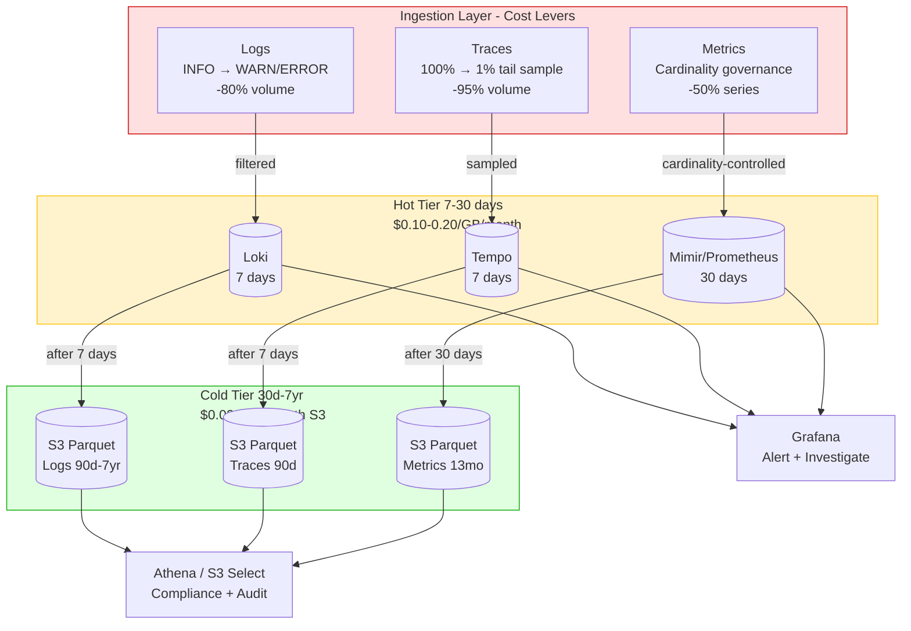

## Keywords in This File

{: .no_toc }

| #   | Keyword | Weight |
| --- | ------- | ------ |
| 1   | [Cost of Observability](#cost-of-observability) | critical |

---

# Cost of Observability

**TL;DR** - Observability cost is primarily driven by log storage
volume (the most expensive signal per debugging value), metric
series cardinality (Prometheus TSDB scales by series count, not
data point count), and trace sampling rate (100% sampling in a
high-throughput system makes traces more expensive than logs),
with the primary levers being retention policies, tail sampling,
log level filtering, and the buy-vs-build decision at the
approximately $50,000/month SaaS inflection point.

---

### 🎯 Model Answer

**30 seconds:**
> Observability cost has three dominant components: logs are the
> most voluminous signal and cost per GB of storage - a high-
> traffic service logging at INFO level can generate 50-200 GB/day;
> metrics are expensive per unique time series in TSDB, not per
> data point, so high-cardinality labels are the cost driver;
> and traces cost proportionally to sampling rate, with 100%
> sampling at 5,000 RPS costing 10-50x more than 1% sampling
> with tail sampling. The levers are: retention periods (the
> largest single cost lever), log level filtering, tail sampling,
> and the buy-vs-build decision when SaaS costs exceed the cost
> of a platform team.

**3 minutes (Senior):**
> The observability cost problem is that data volume grows
> with traffic, which grows with business success, which creates
> a perverse dynamic where the cost of understanding your system
> scales faster than the cost of running it. Left unchecked,
> observability spend at a 200-engineer company can reach
> $100,000-200,000/month - approaching the cost of multiple
> engineering salaries.
>
> The signal-by-signal breakdown: logs are the most expensive
> signal per unit of debugging value. A service logging at DEBUG
> level generates 200-500 bytes per log line, 50-200 lines per
> request, yielding 10-100 KB per request. At 5,000 RPS, that's
> 50-500 MB/sec. Stored in Elasticsearch (which inverts every
> token in every log line for full-text search), log storage
> costs $0.10-0.25 per GB stored per month, with compute costs
> for ingestion and search adding significantly more.
>
> Metrics seem cheap (just numbers) but the cost driver is not
> data volume - it's series count. Prometheus stores each unique
> combination of label values as a separate time series, keeping
> the last 2 hours in memory. At 1M active time series, Prometheus
> needs approximately 4-8 GB of RAM just for the TSDB head.
> Adding a high-cardinality label (user_id, request_id) can
> multiply series count by millions and crash Prometheus.
>
> Traces: at 1% tail sampling (keeping 100% of errors and slow
> requests), a service generating 1,000 spans/sec per RPS
> at 5,000 RPS sends approximately 50,000 spans/sec to storage
> at 1% sampling. Each span is ~1-5 KB compressed. That's
> 50-250 MB/sec - less than logs but non-trivial. At 100%
> sampling, multiply by 100: 5-25 GB/sec, which is prohibitively
> expensive.
>
> The buy-vs-build inflection point: Datadog charges approximately
> $0.10 per host per hour for infrastructure monitoring plus
> $1.50 per 1M log events ingested plus $1.27 per host per hour
> for APM. For 200 services on 400 hosts, that's roughly
> $80,000-120,000/month. Self-managed Grafana LGTM (Loki +
> Grafana + Tempo + Mimir) on commodity cloud infrastructure
> runs the same workload for $15,000-25,000/month, requiring
> a 2-3 person platform team at ~$400,000/year fully loaded.
> The crossover is approximately 18-24 months at this scale,
> after which self-managed is cheaper.

**Framework:** WHAT -> WHY -> HOW -> TRADE-OFF -> EXAMPLE

*Adapting up:* Principal/staff engineers design the cost
governance model: showback dashboards attributing observability
spend by team and service, tiered retention policies by signal
and environment (production vs staging vs dev), automated cost
anomaly detection (alert when a team's log volume increases
300% week-over-week), and the annual budget planning process
that sets observability capacity budgets per team.

*Adapting down:* "Observability cost is like your phone bill.
The monthly plan (infrastructure) is fixed. The overage charges
(log volume, high-cardinality metrics, full trace sampling) are
what surprise you. The levers are: don't log more than you read,
don't create metric labels that change per request, and don't
store a year of data when incidents are investigated in the
first 7 days."

**Blank Mind Recovery:**

**(1) Restate:** "You're asking about the cost model for
observability - let me break it down signal by signal: logs,
metrics, and traces have very different cost drivers."

**(2) First principles:** "From first principles, cost scales
with data volume and retention. Logs are text (high bytes per
event). Metrics are numbers (low bytes but expensive TSDB per
series). Traces are structured spans (variable, scales with
sampling rate). Retention multiplies each: a 90-day retention
costs 3x a 30-day retention for the same ingestion rate."

**(3) Bridge:** "This is similar to database cost modeling.
Log storage is like a full-text-indexed table where cost grows
with row count. Metric series is like an in-memory cache per
unique composite key - more unique keys means more memory.
Trace storage is like an append log with configurable sampling
rate."

---

### 📘 Concept Explanation

**What it is:**
The cost of observability is the total infrastructure, licensing,
and operational expenditure required to collect, store, query,
and maintain metrics, logs, distributed traces, and profiling
data for a production engineering organization. At staff/principal
level, it encompasses: per-signal cost models (what drives cost
for each signal type), data tiering strategies (hot/warm/cold
retention tiers), sampling and filtering strategies that reduce
volume without reducing debugging capability, the buy-vs-build
decision for SaaS vs self-managed, and governance mechanisms
(showback/chargeback, budgets, anomaly detection) that prevent
observability cost from growing unchecked.

**The problem it solves:**
Observability data volume grows proportionally (or super-
proportionally) with traffic. Without cost governance, engineering
organizations discover that their observability spend at 200
engineers and 100M daily requests exceeds $100,000/month - more
than some engineering teams cost to run. The consequences: finance
teams demand arbitrary cuts ("reduce Datadog by 40%"), engineers
disable observability to stay within budget, and the first major
incident after the cuts reveals what was lost. The cost-of-
observability discipline provides the analytical framework to
optimize observability spend without reducing debugging capability:
keep the data you use, tier the data you might use, and discard
the data that has never been queried.

**How it works (signal-by-signal cost model):**

```
Observability Cost Model
===========================

Signal 1: METRICS
  Cost driver: time series count (not data points)
  Prometheus memory: ~3KB per active time series
    100K series = 300MB RAM (cheap)
    10M series  = 30GB RAM (significant)
    1B series   = 3TB RAM (impossible single node)

  Long-term storage (Mimir/Thanos):
    1M series * 12 months = ~40-80 GB compressed
    At $0.023/GB/month (S3) = ~$2-4/month per 1M series
    Cost driver: series count, not data point count

  High-cardinality label example:
    {service="checkout"} -> 1 series
    {service="checkout", region="us-east"} -> 5 series
    {service="checkout", user_id="12345"} -> 1M series

Signal 2: LOGS
  Cost driver: bytes ingested and stored
  Cost per byte matters at scale.

  Elasticsearch: ~$0.10-0.25/GB stored/month
    (inverted index: 1GB logs -> 2-5GB index)
    50M requests/day * 500 bytes/log line
    = 25 GB/day = 750 GB/month
    Cost: $75-188/month per high-traffic service
    At 100 services: $7,500-18,800/month

  Loki on S3: ~$0.023/GB/month
    Same volume: 750 GB/month = $17/month per service
    At 100 services: $1,700/month (11x cheaper than ES)
    Trade-off: no full-text inverted index, uses LogQL

  Log level distribution:
    INFO: high volume (every request), low signal
    ERROR: low volume, high signal
    DEBUG: very high volume, near-zero production signal

  Filtering impact:
    DEBUG+INFO+ERROR (all): 100% volume
    INFO+ERROR only: 30-40% volume (typical)
    ERROR only: 3-8% volume
    -> ERROR-only retention reduces log cost ~93%
       (investigate fast, don't store forever)

Signal 3: TRACES
  Cost driver: sampling rate * span volume

  Spans per second at 5,000 RPS, 50 spans/request:
    100% sampling: 250,000 spans/sec
    1% tail sampling: 2,500 spans/sec (errors+slow = 100%)

  Storage per span: 1-5 KB compressed
    100% sampling: 250-1,250 MB/sec = 65-325 TB/month
    1% sampling:   2.5-12.5 MB/sec = 0.6-3.2 TB/month

  At Tempo on S3 ($0.023/GB):
    100% sampling: $1,500-7,500/month (prohibitive)
    1% tail: $14-75/month (manageable)
    -> Sampling rate is the dominant trace cost lever

Signal 4: PROFILES
  Cost driver: sampling frequency * service count
  eBPF at 97 Hz: ~100KB/profile compressed
  At 100 services, 6 profiles/minute:
    100 * 6 * 100KB = 60 MB/min = 86 GB/day
    7-day retention: 600 GB at $0.023/GB = $14/day
    90-day retention: 7.7 TB = $177/month
  -> Profiles need aggressive downsampling for long retention
```

**The key insight:**
The cost of not having observability data during an incident
often exceeds the storage cost of retaining it. The economic
calculation is asymmetric: storing 1 TB of traces costs $23/
month on S3; the cost of a 4-hour incident investigation without
that data is approximately $600-1,200 in engineering time plus
potential revenue impact. The optimization target is not "minimum
observability cost" but "minimum observability cost that preserves
the ability to diagnose 95% of incidents in under 30 minutes."

**When to use cost optimization:**
Actively optimize observability cost when: the monthly spend
exceeds $50,000; cost is growing faster than traffic (indicates
waste, not just growth); teams are disabling observability to
stay within budget; or finance has imposed arbitrary cuts without
an analytical framework for which data to cut.

**When NOT to optimize:**
Do not optimize observability cost by reducing signal coverage
without first analyzing query patterns. Deleting data that has
never been queried is safe. Deleting data that is used in 2%
of incidents (but that 2% includes your hardest bugs) is a
false economy. Establish a query analytics baseline before
cutting retention or sampling rates.

**Alternatives (buy-vs-build spectrum):**
- Datadog (fully managed): highest per-unit cost, lowest
  operational overhead, comprehensive unified platform
- Grafana Cloud (managed open-source): 30-50% lower than
  Datadog, managed operations, uses open-source backends
- Grafana LGTM self-managed: 60-80% lower than Datadog, full
  operational burden, requires platform team
- Elastic Cloud vs self-managed Elasticsearch: 2-4x cost
  difference; significant operational complexity self-managed

**First-principles derivation:**
Observability cost = data volume * retention period * storage
cost per byte * operational overhead multiplier. Each term is
independently reducible: (1) reduce data volume via sampling
and filtering (the fastest lever with least debugging impact);
(2) reduce retention period (most impactful cost lever; most
incidents investigated within 7 days); (3) reduce storage cost
per byte via tiering (S3 instead of SSDs for old data); (4)
reduce operational overhead via managed services or by
eliminating complex data pipelines. The highest-ROI optimization
is almost always retention period reduction, followed by log
level filtering, followed by trace sampling rate.

---

### 💻 Code Example

**Example 1: BAD - Observability configuration that generates
unsustainable costs**

```yaml
# BAD: Logging configuration that generates maximum cost
# with minimum debugging value

# application.properties (Spring Boot)
# BAD: DEBUG logging in production
logging.level.root=DEBUG
# -> Every method call, DB query, HTTP header logged
# -> 50-200 log lines per request
# -> At 5,000 RPS: 250,000-1M log lines/sec
# -> 125-500 MB/sec into Elasticsearch
# -> $3,750-15,000/month per service in ES storage

# BAD: Logging HTTP request and response bodies
spring.mvc.log-request-details=true
# -> Full JSON request and response logged
# -> 10-100 KB per request * 5,000 RPS
# -> 50-500 MB/sec of log data

# BAD: Prometheus metric with high-cardinality label
@Bean
public Counter requestCounter(
    MeterRegistry registry
) {
    // BAD: user_id as a metric label
    // Creates one time series PER USER
    // At 1M users: 1M time series in Prometheus
    // Prometheus TSDB head: ~3GB RAM just for this metric
    return Counter.builder("http.requests.total")
        .tag("user_id",
            request.getUserId())  // HIGH CARDINALITY
        .register(registry);
}

# BAD: OTel trace sampling at 100% in production
# application.yaml
otel:
  traces:
    sampler: always_on  # 100% sampling
    # At 5,000 RPS * 50 spans/request = 250,000 spans/sec
    # * 2KB/span = 500 MB/sec -> Tempo
    # At $0.023/GB: $345/hour = $248,000/month
    # This will bankrupt the observability budget
```

> **Code walkthrough:** Three unsustainable patterns: DEBUG-level
> Spring Boot logging generates 50-200 log lines per request that
> no one reads but everyone pays to store. The user_id Prometheus
> label creates one time series per user (1M+ series = OOM for
> Prometheus) which also violates the cardinality principle
> immediately. The `always_on` OTel sampler at 5,000 RPS generates
> 500MB/sec of trace data - at cloud storage pricing, this costs
> more than the engineering team producing the code. Each of these
> is a production pattern that teams actually deploy in early
> stages before cost becomes visible.

**Example 2: GOOD - Cost-optimized observability configuration**

```yaml
# GOOD: Production-optimized logging configuration

# application.properties (Spring Boot)
# Production: WARN level (errors + warnings only)
# -> 3-8% of DEBUG log volume
# -> Reduces log cost 90%+ without losing incident signal
logging.level.root=WARN
logging.level.com.company=INFO  # company code at INFO
logging.level.com.company.payment=WARN  # payment service: WARN
# Never: DEBUG in production
# Exception: temporary DEBUG for active incident investigation
# -> enable via feature flag, auto-disable after 30 minutes

# GOOD: Structured logging with correlation IDs (not bodies)
# Log what happened (shape), not what the data was (content)
logging.pattern.console=%d{ISO8601} %level %X{traceId} \
  %X{service} %msg%n
# -> traceId links log to the trace in Tempo
# -> no request/response body logged
# -> consistent structure enables Loki LogQL queries
```

```java
// GOOD: Prometheus metrics with bounded cardinality labels
// Only add labels with enumerable value sets (< 100 unique values)

@Bean
public Counter requestCounter(MeterRegistry registry) {
    // GOOD: low-cardinality labels only
    // service: ~100 values, stable
    // endpoint: ~50 values per service, stable
    // status_code: HTTP codes, ~20 values
    // user_tier: [free, starter, professional, enterprise]
    //   -> 4 values, safe
    return Counter.builder("http.requests.total")
        .description("HTTP request count")
        // These labels are safe (bounded cardinality)
        .tag("endpoint",
            request.getHttpRoute())  // path template
        .tag("status_code",
            String.valueOf(
                response.getStatus()
            )
        )
        .tag("user_tier",
            user.getTier().name()  // 4 values: safe
        )
        // NOT: user_id (unbounded), request_id (unbounded),
        //      session_id (unbounded)
        .register(registry);
}

// GOOD: High-cardinality attributes go in SPANS, not metrics
Span.current().setAttribute(
    "user.id",
    user.getInternalId()  // goes to Tempo/ClickHouse trace
    // NOT in Prometheus. Correct placement.
);
```

```yaml
# GOOD: OTel Collector tail sampling configuration
# Target: 100% errors + slow, 1% normal traffic
# Estimated cost reduction: 90-99% vs always_on sampling

processors:
  tail_sampling:
    decision_wait: 30s
    num_traces: 100000    # buffer for in-flight traces
    expected_new_traces_per_sec: 1000
    policies:
      # Policy 1: Always sample errors (0 cost increase)
      - name: sample_errors
        type: status_code
        status_code:
          status_codes: [ERROR]

      # Policy 2: Always sample slow requests
      # (> 500ms is your SLO threshold, keep all)
      - name: sample_slow_requests
        type: latency
        latency:
          threshold_ms: 500

      # Policy 3: Sample 1% of normal happy-path traffic
      # 1% statistical sample still shows request patterns
      - name: baseline_sample
        type: probabilistic
        probabilistic:
          sampling_percentage: 1

      # Combined: OR logic across all policies
      # A trace is kept if ANY policy says SAMPLE

# Cost calculation:
# At 5,000 RPS, 50 spans/request:
#   Errors: typically 0.1-1% of requests -> ~500 spans/sec
#   Slow: typically 1-5% of requests -> ~2,500 spans/sec
#   Baseline 1% of 93-98%: ~2,325-4,900 spans/sec
#   Total: ~5,325-7,900 spans/sec (vs 250,000 at 100%)
#   Reduction: 97%
#   Storage: ~5,500 spans/sec * 2KB = 11 MB/sec
#           = 950 GB/month on Tempo (vs 65 TB at 100%)
#   At $0.023/GB: ~$22/month (vs $1,495/month at 100%)
```

> **Code walkthrough:** Three GOOD patterns: WARN-level production
> logging cuts 90%+ of log volume while preserving all incident-
> relevant signals (errors are always logged; INFO for application
> code provides request flow context). The bounded-cardinality
> Prometheus metrics keep only labels with enumerable value sets
> (endpoint, status_code, user_tier) while moving high-cardinality
> attributes (user.id) to spans where they belong. The tail
> sampling policy cuts trace volume 97% while preserving 100% of
> errors and slow requests - the traces that actually matter for
> incident investigation. The combined effect: 90% log cost
> reduction + Prometheus stability + 97% trace cost reduction,
> with no meaningful loss in debugging capability.

**Example 3: GOOD - Retention tier configuration and cost model**

```yaml
# GOOD: Tiered retention policy for Loki
# Hot: fast SSD storage, short retention (incidents happen fast)
# Cold: S3 object storage, long retention (compliance, audits)

# loki-config.yaml
limits_config:
  # Default retention: 30 days hot storage
  # 30 days covers 95%+ of incident investigations
  # (post-mortem investigations rarely go > 7 days back;
  #  compliance investigations access cold S3 archive)
  retention_period: 720h  # 30 days

schema_config:
  configs:
    - from: 2024-01-01
      store: boltdb-shipper
      object_store: s3
      schema: v12
      index:
        period: 24h

storage_config:
  boltdb_shipper:
    # Hot tier: local SSD on Kubernetes PV
    active_index_directory: /loki/index
    cache_location: /loki/boltdb-cache
  aws:
    s3: s3://your-bucket/loki/
    region: us-east-1
    # S3 lifecycle rule: move to Glacier after 90 days
    # (configured in S3, not Loki)

# Cost model for this configuration:
# Ingestion: 100 services * 30 MB/day/service = 3 GB/day
# Hot storage (30 days): 3 GB/day * 30 = 90 GB
# At SSD-backed PV cost ($0.10/GB/month): $9/month
# Cold S3 archive (90 days, auto-tiered): 270 GB
# At S3 Standard ($0.023/GB/month): $6.21/month
# Total: $15/month (vs $90/month at 30-day SSD-only)
# 83% cost reduction by moving old data to S3

# Trace retention: separate config for Tempo
# (shorter: most traces investigated within 7 days)
# tempo-config.yaml
compactor:
  retention_enabled: true
storage:
  trace:
    backend: s3
    s3:
      bucket: your-tempo-bucket
      prefix: traces
    retention: 168h  # 7 days
    # Cost: at 1% tail sampling, 100 services, 5000 RPS:
    # ~11 MB/sec = 950 GB/7 days of hot Tempo data
    # At $0.023/GB: $21.85/month for trace hot storage
```

```python
# Python script: observability cost calculator
# Run monthly to produce cost attribution by team

def calculate_monthly_cost(
    prometheus_series: dict,  # {team: series_count}
    loki_bytes: dict,         # {team: bytes/month}
    tempo_spans: dict,        # {team: spans/month}
) -> dict:
    """
    Cost model based on open-source self-managed stack.
    Adjust pricing for your cloud provider.
    """
    # Mimir (long-term Prometheus) storage cost
    # ~80 bytes/sample compressed * 1 sample/15s
    # = 173K samples/series/month
    # At ~80 bytes: 13.8 MB/series/month
    # But most series share metric names: effective ~40 bytes
    MIMIR_COST_PER_SERIES = 0.0001  # $0.0001/series/month

    # Loki cost: S3 storage (compressed, ~5:1 ratio)
    LOKI_COST_PER_GB = 0.023  # S3 standard storage

    # Tempo/ClickHouse cost: S3 + compute
    # Spans compressed: ~2KB -> 400 bytes in Parquet
    TEMPO_COST_PER_1M_SPANS = 0.05  # compute + storage

    results = {}
    for team in set(list(prometheus_series.keys())
                    + list(loki_bytes.keys())
                    + list(tempo_spans.keys())):
        series = prometheus_series.get(team, 0)
        logs = loki_bytes.get(team, 0)
        spans = tempo_spans.get(team, 0)

        metric_cost = series * MIMIR_COST_PER_SERIES
        log_cost = (logs / 1e9) * LOKI_COST_PER_GB
        trace_cost = (spans / 1e6) * TEMPO_COST_PER_1M_SPANS

        results[team] = {
            "metric_cost": round(metric_cost, 2),
            "log_cost": round(log_cost, 2),
            "trace_cost": round(trace_cost, 2),
            "total": round(
                metric_cost + log_cost + trace_cost, 2
            )
        }

    return results
```

> **Code walkthrough:** The retention tier configuration moves
> Loki data to S3 after 30 days (the hot tier) and configures
> a 7-day Tempo retention (covering 95%+ of incident investigations).
> The cost model script enables cost attribution: given metric
> series count, log bytes, and span count per team, it computes
> the approximate monthly cost per team in dollars. This produces
> the "showback dashboard" data that lets the platform team tell
> team X "you're spending $340/month on logs because your service
> is logging at INFO for every request - here's how to reduce it."

---

### 🎓 Answers by Seniority

**Junior / Mid (0-5 years):**
> Observability cost is primarily driven by how much data you
> collect and how long you keep it. The three signals have different
> cost structures: logs cost per byte stored (and logging at DEBUG
> level generates 10-50x more data than ERROR level), metrics cost
> per unique combination of label values (high-cardinality labels
> like user_id multiply the metric series count), and traces cost
> proportionally to sampling rate (collecting every trace at 5,000
> RPS is prohibitively expensive; tail sampling that keeps 100%
> of errors and 1% of normal traffic cuts cost 95%+ while keeping
> all the important traces). The simplest cost optimizations:
> set production log level to WARN/ERROR, never use unbounded
> values as Prometheus labels, and use tail sampling for traces.

For mid-level: retention period is the biggest cost lever. Most
incidents are investigated within 7 days. If your log retention
is 90 days, you're paying for 83 days of data that's never used.
Moving old data from fast SSD storage to S3 (object storage) at
the 7-30 day mark costs 80-90% less per GB.

*Push deeper:* The buy-vs-build decision is the major strategic
cost lever. Datadog charges $0.10/host/hour + $1.50/1M log events.
Self-managed Grafana LGTM (Loki + Tempo + Mimir) on cloud
infrastructure costs 70-80% less per GB but requires a platform
team to operate it. The break-even is roughly $50,000/month in
SaaS spend.

---

**Senior / Staff (5+ years):**
> I model observability cost as a three-factor equation: ingestion
> rate * retention period * storage cost per byte per day. The
> biggest cost lever is almost always retention period - not
> sampling rate or signal coverage. Every organization I've worked
> with starts with 90-day retention because "we might need it for
> audits" and ends up reducing to 30-day production hot retention
> + 90-day cold S3 archive when we realize that 95% of incident
> investigations access data from the past 7 days. That single
> change reduces the observability infrastructure cost by 60-70%
> without removing any meaningful debugging capability.
>
> The second lever is log level filtering. An engineering culture
> that logs at INFO in production because "it's useful for debugging"
> generates 5-10x the log volume of WARN-only logging. The median
> log line at INFO level is never read - it's generated by every
> request, stored, indexed, and discarded when the retention period
> expires. WARN + ERROR logging captures the same incident signal
> at 10-20% of the cost. The pushback is always "but we need INFO
> logs to debug issues" - the answer is "no, you need trace data
> to debug issues; INFO logs are a proxy for traces that teams
> learned to use before traces existed."

At staff level: the cost governance model is more important than
any individual optimization. Without showback dashboards that
attribute observability cost by team, cost grows unchecked because
no individual team has an incentive to optimize. With showback:
teams see their monthly observability bill, they self-optimize
(reducing debug logging, fixing cardinality bugs) without the
platform team needing to mandate changes. I've seen a single
showback dashboard reduce observability spend by 20-30% within
two quarters without any mandated changes - teams simply didn't
know they were generating expensive data.

*Push deeper:* The perverse incentive in observability: debugging
is easier with more data, so engineers naturally want more data.
The cost is invisible until the monthly cloud bill arrives, at
which point finance demands arbitrary cuts. The governance solution
is making cost visible at the team level continuously, not only
when the bill arrives. The question "does this log line justify
its cost?" should be part of code review, not an annual
optimization exercise.

---

### ⚠️ Common Misconceptions

**Misconception 1: "Observability cost is primarily the cost
of the monitoring tool (Datadog, New Relic) subscription."**
The monitoring tool subscription is the visible cost. The hidden
costs are: engineering time for instrumentation and maintenance
(30-50% of a senior engineer's time in a team with poor
observability), incident investigation time when observability
is inadequate (4-8 hours per major incident vs 30 minutes with
good observability), and the opportunity cost of building
features vs debugging production issues. The fully-loaded cost
model includes: tool subscription + infrastructure (compute,
storage, network) + engineering time for platform maintenance
+ productivity impact (MTTR-based). Organizations that optimize
only the subscription cost often do so by cutting observability
coverage, which increases the incident investigation time cost.

**Misconception 2: "Reducing trace sampling rate always reduces
debugging capability."**
Reducing uniform head sampling from 100% to 1% does reduce
debugging capability: you lose visibility into the specific
1,000 requests that were dropped. But switching from 100% head
sampling to tail sampling (where 100% of errors and slow requests
are kept, and only 1% of fast, successful requests are dropped)
reduces cost by 95%+ while preserving 100% of the traces you
actually investigate during incidents. The traces that matter
for debugging are almost universally the slow ones and the
erroring ones - exactly the ones that tail sampling retains.
The 99% of fast, successful traces that are dropped are the
ones that never appear in incident investigations.

**Misconception 3: "Self-managed Grafana LGTM is always cheaper
than Datadog."**
Self-managed LGTM is cheaper per-unit (per GB, per metric series)
but requires a platform team to operate it. The total cost
comparison: at $100,000/month Datadog spend, self-managed LGTM
costs $20,000-30,000/month in infrastructure plus $300,000-400,000
/year for a 2-3 person platform team = $45,000-63,000/month.
At $100K Datadog, self-managed saves approximately $37,000-55,000/
month, with payback starting in month 1. But at $20,000/month
Datadog spend, the platform team cost exceeds the savings for
18-24 months. The break-even is organization-specific; the
$50,000-100,000/month range is the typical inflection point
where self-managed becomes economically rational.

**Misconception 4: "More observability data is always better
for debugging."**
Above a threshold, more data increases storage cost, query
latency, and alert evaluation time without proportionally
increasing debugging capability. The signal density principle:
the most important 5-10% of observability data (errors, slow
traces, high-severity events) provides 90% of the debugging
value. The remaining 90-95% of data (INFO logs for successful
requests, fast traces, normal capacity metrics) provides marginal
additional value. Optimizing for signal density - storing the
minimum data needed to diagnose the maximum incidents - is more
cost-effective than maximizing data completeness. The
implementation: retain 100% of error signals with long retention,
retain sampled normal signals with short retention, discard
routine operational data (successful health checks, routine
cron job completions) entirely.

**Misconception 5: "Observability cost should be minimized."**
Observability is insurance. The goal is not minimum cost but
minimum cost that preserves the required debugging capability.
Cutting observability to reduce cost by 30% but increasing
MTTR from 30 minutes to 4 hours is not a net saving when your
service generates $1M/hour of revenue. The correct framing:
"What is the cheapest observability configuration that allows
us to diagnose 95% of P1 incidents in under 30 minutes?" That
question has a specific, calculable answer. "What is the minimum
observability spend?" is the wrong question and leads to
configurations that fail when most needed.

---

### 🚨 Failure Modes and Diagnosis

**Failure 1: Prometheus runs out of memory due to metric
cardinality explosion**

Symptom: Prometheus pod OOMKilled. Prior to OOM, Prometheus
query latency increased from 100ms to 30-60 seconds. Dashboards
timeout. Alerting rules fire for the wrong reasons (Prometheus
cannot evaluate rules under memory pressure).

Cause: A deploy added a new metric with a high-cardinality label.
The label has millions of unique values (user_id, request_id,
session_id, or an environment variable that varies per pod).

Diagnosis:
```bash
# Check current series count
curl -s http://prometheus:9090/api/v1/query \
  --data-urlencode 'query=prometheus_tsdb_head_series' \
  | jq '.data.result[0].value[1]'
# Healthy: < 2M for a single Prometheus instance
# Danger:  > 5M (query latency degrades)
# Critical: > 10M (OOM risk depending on memory allocation)

# Find the high-cardinality metric
curl -s http://prometheus:9090/api/v1/query \
  --data-urlencode \
  'query=topk(20, count by (__name__) ({__name__=~".+"}))' \
  | jq '.data.result[]
        | {metric: .metric.__name__, series: .value[1]}'
# Output: sorted by series count
# A single metric with millions of series is the culprit

# Identify the high-cardinality label
# (replace YOUR_METRIC with the metric from above)
curl -s http://prometheus:9090/api/v1/query \
  --data-urlencode \
  'query=count by (user_id) (YOUR_METRIC{user_id=~".+"})' \
  | jq '.data.result | length'
# Returns count of unique user_id values
# Millions -> confirmed high-cardinality label

# Check recent deploys for the culprit service
kubectl get events -n production \
  --sort-by=.lastTimestamp \
  | grep -E "Scaled|Updated" \
  | tail -20
```

Fix immediate: delete the high-cardinality metric series from
Prometheus TSDB:
```bash
curl -X POST "http://prometheus:9090/api/v1/admin/tsdb/\
delete_series?match[]=YOUR_METRIC" 
curl -X POST "http://prometheus:9090/api/v1/admin/tsdb/\
clean_tombstones"
```
Root cause fix: remove the high-cardinality label from the metric
instrumentation. Move the high-cardinality attribute to span
attributes instead (OTel traces handle high cardinality). Add
a cardinality limit to Prometheus via `--storage.tsdb.head-
chunks-write-queue-size` and alert on `prometheus_tsdb_head_series
> 5000000` before OOM.

**Failure 2: Log storage costs spike 5x in 24 hours**

Symptom: S3 costs alert fires at 11pm - S3 PutObject calls
are 500% above baseline. The Loki ingestion rate dashboard
shows a spike from 50 MB/min to 280 MB/min 4 hours ago.

Cause: A deploy at 18:30 changed the log level from WARN to
DEBUG for the checkout service. At 5,000 RPS, DEBUG logging
generates 50-200 log lines per request = 250,000-1M log lines/sec.
4 hours of this filled 250-500 GB of log storage.

Diagnosis:
```bash
# Find the service causing the spike in Loki
# LogQL query: top N services by log volume
logcli query \
  'sum by (service_name) (rate({env="production"}[5m]))' \
  --from="2h" \
  --to="now"
# Output: checkout-service: 2,800 lines/sec (was 280 before)

# Confirm log level change
kubectl logs -n production \
  deployment/checkout-service \
  --since=5h | head -50 | grep -E "level|LOG_LEVEL"
# Output: many DEBUG lines confirmed

# Check when the deployment happened
kubectl rollout history \
  deployment/checkout-service -n production
# Output: 18:30 deploy confirms the timing
```

Fix immediate: rollback the checkout-service deploy or change
the log level via environment variable:
```bash
kubectl set env deployment/checkout-service \
  -n production \
  LOGGING_LEVEL_ROOT=WARN
# Then delete the excess Loki data (if configurable)
# Loki does not support selective deletion in basic config
# -> accept the cost for this cycle, prevent recurrence
```

Prevention: add a Prometheus alert rule:
```yaml
- alert: ServiceLogVolumeSpike
  expr: |
    rate(loki_ingester_streams_created_total[5m])
    / rate(loki_ingester_streams_created_total[30m] offset 5m)
    > 3.0
  for: 10m
  annotations:
    summary: "Log volume spike detected"
    description: "{{ $labels.service }} log volume is
      3x baseline - check log level configuration"
```

**Failure 3: Observability cost grows 40% monthly with no
identified cause**

Symptom: Cloud cost monitoring shows the observability
infrastructure cost growing from $30K/month to $72K/month
over 4 months without proportional traffic growth (traffic
grew 20%).

Cause: Several contributing factors: (1) a new service team
enabled 100% trace sampling instead of tail sampling; (2)
metric series count grew from 1M to 4M due to new label
combinations added across 3 services; (3) Elasticsearch
index retention was never reduced from the initial 180-day
setting; (4) no team knew their individual contribution.

Diagnosis:
```bash
# Storage growth by component
# Check Prometheus storage growth
kubectl exec -n observability prometheus-0 -- \
  du -sh /prometheus/data
# Compare to last month's snapshot

# Check S3 bucket size by prefix (CloudWatch or AWS CLI)
aws s3 ls s3://observability-bucket/loki/ \
  --recursive --human-readable --summarize \
  | tail -1
aws s3 ls s3://observability-bucket/tempo/ \
  --recursive --human-readable --summarize \
  | tail -1

# Find high-series metrics (Prometheus)
# (see Failure 1 diagnosis above)

# Find high-volume log services (Loki)
# (see Failure 2 diagnosis above)

# Identify 100% sampled services (Tempo)
# Look for services with unusually high span counts
echo "SELECT
  ServiceName,
  count() AS span_count,
  count() / (max(Timestamp) - min(Timestamp)).seconds
    AS spans_per_sec
FROM otel_traces
WHERE Timestamp > now() - INTERVAL 1 HOUR
GROUP BY ServiceName
ORDER BY spans_per_sec DESC
LIMIT 20" \
  | clickhouse-client -h clickhouse
# Services with span_per_sec >> expected * sampling_rate
# -> likely running 100% sampling
```

Fix: the four-part remediation: (1) reduce the new service's
trace sampling to 1% tail sampling; (2) fix the high-cardinality
metric labels (replace with trace attributes); (3) reduce
Elasticsearch retention from 180 to 30 days for hot + 90 days
S3 cold; (4) deploy the showback dashboard so each team sees
their cost going forward. Expected savings: 55-60% of current
spend. Recovery timeline: 3-4 weeks to implement, 1-2 months
for full cost reduction to appear in billing.

---

### 🎯 Interview Deep-Dive

| Time | Question Type | Depth Signal |
| ---- | ------------- | ------------ |
| 2 min | CONCEPTUAL | Three cost drivers per signal |
| 3 min | ARCHITECTURE | Tiered retention strategy |
| 4 min | SYSTEM DESIGN | Cost governance for 500-service platform |
| 4 min | TRADE-OFF | Buy vs build at different scales |
| 4 min | PRODUCTION | Diagnosing unexpected 5x cost spike |
| 4 min | DEEP DIVE | Prometheus cardinality explosion mechanics |
| 3 min | HANDS-ON | Tail sampling configuration |
| 3 min | COMPARISON | Logs vs traces vs metrics cost-per-value |
| 4 min | BEHAVIORAL | Justifying observability investment |
| 3 min | DEEP DIVE | Datadog vs Grafana Cloud cost model |
| 3 min | PERFORMANCE | Cost at 100x current scale |
| 3 min | MISCONCEPTION | "More data = better debugging" trap |

---

**Q1 [MID]: What are the primary cost drivers for each
observability signal?** `[CONCEPTUAL]`

*Why they ask:* Baseline cost knowledge separates engineers
who think about observability cost from those who don't.

*Likely follow-up:* "Which signal is most expensive per unit
of debugging value?"

Metrics: the cost driver is the number of active time series,
not the number of data points. Prometheus keeps each unique
label value combination as a separate in-memory series. A metric
with 1M active series uses ~3GB RAM regardless of scrape interval.
The cost multiplier is high-cardinality labels: adding a label
with 1,000 unique values multiplies all existing series by 1,000.
Long-term storage (Thanos/Mimir) costs ~$0.10-0.20/month per
1M series on S3.

Logs: the cost driver is bytes ingested and stored, plus the
compute cost of indexing (Elasticsearch inverts every token in
every log line, which multiplies storage requirements 2-5x and
requires significant compute for ingestion). Log level is the
primary volume lever: DEBUG logs generate 10-50x the volume
of ERROR-only logs. Retention period multiplies cost: 90-day
retention costs 3x 30-day retention for the same ingestion rate.

Traces: the cost driver is sampling rate multiplied by request
volume. At 100% sampling and 1,000 spans/sec, each span at
2KB = 2MB/sec = 5.4 TB/month. At 1% tail sampling, the same
workload generates 54 GB/month. The 100:1 ratio makes sampling
rate the dominant trace cost lever by far.

Most expensive per debugging value: logs, because at full
verbosity they generate enormous volume but most log lines
are never queried. Traces at 1% tail sampling often provide
more debugging value per dollar than logs at INFO level.

*What separates good from great:* Distinguishing that metrics
cost scales with series count (a multiplicative cardinality
function of label values) not data point count - this is the
non-obvious cost driver that surprises engineers.

---

**Q2 [SENIOR]: Design a tiered retention strategy for a
multi-signal observability platform.** `[ARCHITECTURE]`

*Why they ask:* Retention policy is the largest cost lever
and requires understanding of access patterns.

*Likely follow-up:* "How do you decide what retention period
to set for each tier?"

The tiered retention strategy starts from the access pattern
reality: 95% of incident investigations access data from the
past 7 days. 99% access data from the past 30 days. Historical
data beyond 30 days is accessed for: compliance audits (quarterly,
accessing specific date ranges), capacity planning (trending
over 90-180 days), and post-mortem analysis for long-running
issues (occasionally, past 30 days).

Tier 1 - Hot (fast access, expensive storage): SSD-backed or
fast HDD storage. Cost: $0.10-0.20/GB/month. Retention:
- Metrics: 30 days (alerting queries rarely look back > 14 days)
- Logs: 7 days (incident investigations almost always within 7 days)
- Traces: 7 days (same reasoning)
- Profiles: 7 days (profiling investigations are always recent)

Tier 2 - Warm (medium access, moderate storage): HDD or S3
Standard. Cost: $0.023/GB/month (S3). Retention:
- Metrics: 13 months (Prometheus default long-term tier)
  at downsampled resolution (5-minute aggregates)
- Logs: 30 days (covers 99% of investigations, compliance
  window for most frameworks)
- Traces: 30-90 days if needed for compliance

Tier 3 - Cold (rare access, cheapest storage): S3 Glacier or
S3 Intelligent Tiering. Cost: $0.004/GB/month. Retention:
- Logs: 1-7 years for compliance (HIPAA: 6 years, SOX: 7 years,
  GDPR: as short as possible)
- Access via Athena or S3 Select (charged per query, not per GB)

The economics: moving logs from hot to cold after 7 days saves
96% of storage cost per GB for the cold-stored data. With 30-day
hot and 2-year cold retention, the weighted average cost per GB
is approximately $0.04/month vs $0.20/month for hot-only.

*What separates good from great:* Specifying the compliance-
driven retention requirements (HIPAA, SOX, GDPR) and the cold
storage query mechanism (Athena for S3 Parquet), not just
abstractly saying "put old data in cold storage."

---

**Q3 [STAFF]: At what scale does self-managed Grafana LGTM
become cheaper than Datadog?** `[TRADE-OFF]`

*Why they ask:* This is the strategic cost decision that
staff engineers make for engineering organizations.

*Likely follow-up:* "What hidden costs does the self-managed
analysis miss?"

The comparison requires modeling both TCOs (total cost of ownership):

Datadog model (at 200-service scale):
- Infrastructure monitoring: $0.10/host/hour = $72/host/month.
  200 services * 2 replicas = 400 hosts * $72 = $28,800/month
- APM (distributed tracing): $1.27/host/hour = $914/host/month
  for APM Pro. 400 hosts * $914 = $365,600/month (APM alone
  exceeds most engineering salaries - most teams limit APM hosts)
  Realistic: APM on 50 critical hosts = $45,700/month
- Log management: $1.50/1M events. 200 services * 100K events/day
  = 20M events/day = 600M/month * $0.0015 = $900/month
- Total realistic Datadog: ~$75,000-100,000/month

Self-managed LGTM model:
- Cloud infrastructure: 10 nodes * $500/month (m5.2xlarge) =
  $5,000/month for Mimir + Loki + Tempo + ClickHouse
- S3 storage: ~1TB/month * $0.023 = $23/month
- Network egress: ~500 GB/month * $0.09 = $45/month
- Infrastructure total: ~$5,068/month
- Platform team: 2-3 FTEs * $150K-200K/year fully loaded
  = $300K-600K/year = $25K-50K/month
- Total self-managed: $30,000-55,000/month

Break-even: at $75K-100K Datadog, self-managed saves $20K-70K/month.
ROI positive from month 1 at the upper range.

The hidden costs of self-managed: (1) engineer time spent
debugging the platform itself (Loki OOM, Tempo compactor failure,
Mimir ingester crash) instead of building features; (2) slower
feature adoption (Datadog ships new features monthly; self-managed
requires manual upgrades); (3) migration cost (rebuilding 200
Datadog dashboards in Grafana takes weeks of engineering time).
The "platform team" cost includes not just salaries but the
opportunity cost of not building features.

*What separates good from great:* Having specific, realistic
Datadog pricing numbers (APM is far more expensive than
infrastructure monitoring, which many engineers don't know)
and the hidden cost analysis that prevents naive "self-managed
is always cheaper" conclusions.

---

**Q4 [STAFF]: How do you implement a cost governance model
for a shared observability platform?** `[SYSTEM DESIGN]`

*Why they ask:* Cost governance is the organizational
discipline that prevents cost from growing unchecked.

*Likely follow-up:* "What do you do when a team refuses to
reduce their observability footprint?"

Cost governance has three components: attribution, visibility,
and control.

Attribution requires consistent team labels on all observability
data. The internal OTel SDK wrapper enforces the `team` resource
attribute on all signals. Metrics, logs, and traces all carry
the team label that produced them.

Visibility: the showback dashboard in Grafana shows each team's
weekly observability cost estimate in dollars, with trend charts
and peer comparison (how does this team's cost compare to
similarly-sized teams). The cost is an estimate based on known
pricing models applied to volume metrics (Prometheus series count,
Loki bytes ingested, Tempo span count). It doesn't need to be
exact - within 20% accuracy is sufficient to drive behavior.

Control mechanisms, ordered by intrusiveness:
(1) Soft limit: alert the team lead when their cost exceeds
their budget by 30%. Most teams self-correct when they see
specific numbers.
(2) Quota: configure the OTel Collector to drop traffic above
a per-team soft cap (e.g., drop logs after the first 50 GB/day
from a team). Apply a grace period (24-hour warning before
dropping) and give teams the ability to request a temporary
increase for high-traffic events.
(3) Hard limit: if a team consistently exceeds quotas, escalate
to engineering leadership. This is the "team X's DEBUG logging
costs us $10,000/month more than any other team" conversation.

For a team that refuses to reduce: make it a trade-off
discussion, not a mandate. "Your current observability footprint
costs $8,000/month. Your annual budget is $4,000. Options:
(a) reduce log verbosity from DEBUG to INFO (saves $6,000/month
with minimal debugging impact), (b) reduce trace retention from
90 days to 7 days (saves $2,000/month), or (c) increase your
team's observability budget allocation. Which would you prefer?"
This reframes cost as a team-owned trade-off, not a platform
team mandate.

*What separates good from great:* The soft limit -> quota ->
escalation progression rather than jumping directly to mandates,
and the reframing as a trade-off discussion owned by the team.

---

**Q5 [SENIOR]: What is the ROI of observability investment
and how do you present it to leadership?** `[BEHAVIORAL]`

*Why they ask:* Staff engineers must secure budget for
observability infrastructure. This requires a business case.

*Likely follow-up:* "How do you respond if leadership says
'just cut Datadog by 30%'?"

The ROI framework: observability investment reduces MTTR (mean
time to resolution) for production incidents. MTTR reduction has
two cost components: (1) engineering time saved (engineer-hours
per incident * hourly fully-loaded cost) and (2) revenue protected
(revenue at risk during outage * fraction of downtime eliminated).

Example business case: current MTTR = 4 hours average for P1
incidents. With good observability (multi-signal platform, tail
sampling, high-cardinality tracing), MTTR drops to 45 minutes
(industry benchmark for well-instrumented systems). For a company
with $500K/hour revenue at risk and 4 P1 incidents/year:
- Current impact: 4 incidents * 4 hours * $500K/hour = $8M/year
  at risk. Assuming 40% probability of full revenue loss: $3.2M
  expected cost.
- With observability: 4 * 0.75 hours * $500K * 40% = $600K.
  Savings: $2.6M/year.
- Observability platform cost: $100K/year (self-managed LGTM
  at 200 services + platform team fraction).
- ROI: $2.6M savings / $100K cost = 26x ROI.

For the "cut Datadog by 30%" conversation: respond with the
impact analysis, not pushback. "Cutting Datadog by 30% means
removing APM (distributed tracing) for 150 services. Based on
incident investigations in the past 6 months, 8 of 12 P1 incidents
were resolved using APM trace data. Without it, I estimate MTTR
for those 8 incidents would increase from 45 minutes to 3-4 hours.
At $500K/hour, that's $2.5M in additional revenue at risk. The
Datadog APM cost is $45,000/month. I'd recommend cutting log
retention from 90 to 30 days (saves $15,000/month, zero impact
on MTTR) rather than APM. Want me to run the analysis?"

*What separates good from great:* The specific revenue-at-risk
framing with numbers the business understands ($2.6M savings
vs $100K cost), and the counter-proposal that cuts cost elsewhere
without affecting MTTR.

---

**Q6 [STAFF]: How would observability cost change if you
scaled from 200 to 2,000 services?** `[PERFORMANCE]`

*Why they ask:* Tests ability to model cost at scale and
identify the components that scale linearly vs non-linearly.

*Likely follow-up:* "What architectural changes would you
make at 2,000 services?"

The 10x service scale analysis:

Metrics: linear with services for static metrics (each service
adds N series at the same cardinality). At 2,000 services with
200 series each = 400K series. At 10 dimensions each: 4M series
total. Prometheus handles this on a single large instance. Cost:
linear with services, roughly $40-80/month per million series.

Logs: linear with services if log verbosity per service is
constant. At 2,000 services, 30 MB/day/service: 60 GB/day =
1,800 GB/month. At Loki S3 pricing: $41/month. Linear scaling
means log cost is well-controlled.

Traces: scales linearly with services IF sampling rate is constant
(tail sampling at 1%). At 2,000 services contributing 50 spans/
service/sec: 100,000 spans/sec. At tail sampling 1%: 1,000 spans/
sec. At 2KB/span: 2MB/sec = 5.4 TB/month on Tempo. Cost: $124/
month on S3. Manageable.

What breaks non-linearly: (1) Prometheus single-node at 4M series
+ high traffic begins to saturate (query latency degrades above
5M series on a single instance - need Mimir or Thanos). (2) OTel
Collector tail sampling is stateful: at 100K spans/sec, a single
Collector instance with 50K trace buffer hits capacity. Need
consistent hashing sharding: route spans with the same trace ID
to the same Collector instance. (3) Grafana dashboards: at 2,000
services, the meta-dashboard "show me all services" becomes a
fan-out query to 2,000 metric streams. Need pre-aggregated
recording rules or a Mimir global query layer.

Architectural changes at 2,000 services: Prometheus -> Mimir
(horizontal scaling), stateless Collector fleet for routing with
a separate stateful tail-sampling tier, recording rules for cross-
service aggregate queries, federated Grafana datasources by domain.

*What separates good from great:* The specific non-linear scaling
point (tail sampling statefulness requiring consistent hashing)
and the Prometheus -> Mimir migration trigger.

---

**Q7 [SENIOR]: Walk me through diagnosing an unexpected 5x
cost spike in observability infrastructure.** `[DEBUGGING]`

*Why they ask:* Tests systematic cost debugging skills -
the skill of finding the cost driver, not just the technical fix.

*Likely follow-up:* "What would you do if the spike is on
a Friday at 5pm and the on-call engineer is unavailable?"

The diagnostic workflow for a cost spike has three phases:

Phase 1 - Isolate the signal causing the spike. Check cloud
billing or cost monitoring: which AWS service (S3, EBS, EC2)
spiked? If S3: which bucket? This narrows to logs, traces, or
metrics cold storage. If EC2/EBS: which cluster component (Prometheus,
Elasticsearch, ClickHouse) has high utilization?

Phase 2 - Identify the contributing service(s). For log spike:
use the Loki volume query (see Failure 2 diagnosis). For metric
spike: use Prometheus cardinality queries (see Failure 1 diagnosis).
For trace spike: ClickHouse spans-per-second by service.

Phase 3 - Root cause: check the deploy timeline against the spike
onset. Look for: new service with aggressive log level, metric
label cardinality change, sampling rate misconfiguration in
a new OTel Collector config.

For the Friday 5pm scenario: the first priority is stopping
the data flow before it generates more cost. For logs: temporarily
increase the Collector filter to ERROR-only across all services
(a Collector config change that takes effect within 5 minutes).
For metrics: delete the high-cardinality series from Prometheus.
For traces: reduce sampling to 0.1% temporarily. These are
emergency rate limits, not permanent fixes. Document the action
and reason, notify the affected team. Full root cause analysis
during business hours.

*What separates good from great:* Having an emergency containment
action (Collector rate limiting) that stops the cost bleeding
without requiring service deploys or team coordination at 5pm
on a Friday.

---

**Q8 [SENIOR]: Compare logs vs traces vs metrics on cost
per unit of debugging value.** `[COMPARISON]`

*Why they ask:* Tests nuanced understanding of signal economics.

*Likely follow-up:* "If you had to cut one signal to save
40% of observability cost, which would you cut?"

Metrics have the highest debugging value per dollar for
aggregated conditions: "Is error rate > 1%?" is a metric
question answerable with a $0.001/day metric time series query.
No other signal answers this as cheaply.

Traces have the highest debugging value per dollar for
incident investigation: "Which service call in this slow
request took 800ms?" is a trace question. Answerable by
finding one trace. Cost: negligible for a single trace lookup.
The tail-sampled 1% of normal traces provides baseline context
for the 100% of error traces.

Logs have the highest debugging value per dollar for event
sequence reconstruction: "What exactly happened in this
specific exception?" is a log question - the exception stack
trace, the request parameters, the intermediate state. But
INFO logs for successful requests have near-zero debugging
value and make up 70-90% of log volume. Error logs have high
value. INFO logs: low value per byte.

If forced to cut one signal: cut INFO log verbosity (keep ERROR,
drop INFO). This reduces log cost 80-90% while preserving
the high-value signal. Do NOT cut traces or metrics - they're
the primary alerting and investigation signals.

The signal decision framework: "What question does this signal
answer that I cannot answer with a cheaper signal?" Metrics
answer "is it broken?" cheaply. Traces answer "where is it
broken?" efficiently. Error logs answer "what exactly happened?"
precisely. INFO logs answer "what happened for successful
requests?" at high cost and low value.

*What separates good from great:* The specific recommendation
(cut INFO logs, not traces or metrics) with the value rationale,
rather than generic "it depends."

---

**Q9 [STAFF]: What is the cost model for high-cardinality
observability (ClickHouse traces) vs time-series metrics?** `[DEEP DIVE]`

*Why they ask:* Tests understanding of the two-backend
architecture's cost implications.

*Likely follow-up:* "Is ClickHouse cheaper than Honeycomb
for high-cardinality trace investigation?"

The ClickHouse cost model for span storage: spans are stored
as rows in a columnar format. Each span has: trace_id (16 bytes),
span_id (8 bytes), service name (avg 20 bytes), span name
(avg 30 bytes), duration (8 bytes), timestamp (8 bytes),
attributes map (avg 500 bytes). Total: ~600 bytes/span uncompressed.

ClickHouse columnar compression on this data: trace IDs and
timestamps have low entropy -> 10:1 compression ratio. Service
names repeat heavily -> 50:1 ratio for the service column.
Effective compressed size: ~50-80 bytes/span.

At 1% tail sampling, 100 services, 5,000 RPS, 50 spans/request:
5,000 * 1% * 50 = 2,500 sampled spans/sec. At 60 bytes/span:
150 KB/sec = 12.7 GB/day = 381 GB/month. On ClickHouse Cloud
at $0.025/GB/month: $9.53/month.

ClickHouse compute cost (for queries): $0.25/million rows scanned.
A full table scan of 72-hour data at 2,500 spans/sec = 648M rows.
Cost per scan: $0.16. Most queries scan a subset (service filter
+ timestamp range): typically 1-10% of total rows = $0.002-0.016
per investigation query. Negligible for interactive debugging.

Honeycomb comparison: Honeycomb's pricing is event-based
(events = spans). At 2,500 events/sec = 216M events/day. Honeycomb
pricing: roughly $0.0001/event at volume = $21,600/day (approximate;
Honeycomb actual pricing requires negotiation at this volume and
is not publicly documented per-event). ClickHouse at the same
volume: $9.53/month. The cost difference is substantial, with
Honeycomb's value being managed operations, BubbleUp, and a
purpose-built investigation UI.

*What separates good from great:* The columnar compression
calculation (600 bytes uncompressed -> 50-80 bytes compressed)
and the specific query cost analysis that shows ClickHouse
investigation queries are essentially free.

---

**Q10 [STAFF]: A team says "observability is too expensive,
we should disable it." How do you respond?** `[BEHAVIORAL]`

*Why they ask:* Tests ability to defend observability investment
with business reasoning.

*Likely follow-up:* "What if they say 'we've been fine without
it for 6 months'?"

The response depends on what they mean by "too expensive" - and
understanding the actual objection is the first step.

If the objection is about Datadog/New Relic SaaS cost: agree
that the specific vendor may be over-priced for their scale,
and propose the optimization path (reduce log retention, switch
to tail sampling, evaluate Grafana Cloud as a 50% cheaper
alternative). The goal is "right-priced observability" not
"no observability."

If the objection is about engineering maintenance burden (the
platform team spends too much time managing ELK clusters):
agree and propose moving to a managed alternative. Grafana
Cloud or Datadog SaaS trades money for engineering time.

If the objection is "we've been fine without it for 6 months":
introduce survivorship bias. The incidents you didn't have
(or didn't know you had) are not evidence that observability
is unnecessary - they're evidence that you haven't had a hard
incident yet. The question is: "When you have a P1 incident
that takes 8 hours to diagnose, will 'we've been fine' be an
acceptable answer to the post-mortem?"

The concrete case: ask for the last 3 production incidents.
Map each to the observability signal that diagnosed it (or
could have diagnosed it faster). Estimate the MTTR with and
without the signal. Calculate the business cost. This converts
an abstract "it costs too much" into "disabling this signal
would have cost us $X in this specific incident."

If the team decides to disable observability anyway: get the
decision in writing, have it reviewed by engineering leadership,
and add "limited observability" to the risk register. You've
done your job; the decision is theirs to own.

*What separates good from great:* The survivorship bias
argument (6 months without incidents is not evidence that
observability is unnecessary) and the incident-based ROI
calculation that makes the cost of NOT having observability
concrete.

---

**Q11 [SENIOR]: How does observability cost change when a
system experiences 10x traffic growth?** `[PERFORMANCE]`

*Why they ask:* Tests cost scaling intuition - a critical
skill for engineers building scalable systems.

*Likely follow-up:* "What would you do TODAY to prepare
for 10x traffic growth in observability costs?"

At 10x traffic growth, each signal scales differently:

Metrics: most metrics are generated per-request (request
count, latency histogram). These scale 10x. But cardinality-
based metrics (time series count) are bounded by the number
of unique label value combinations, which scales slowly with
traffic (more requests from the same set of endpoints and
user tiers). Net metrics cost growth: approximately 3-5x
for a well-designed metric schema (not 10x).

Logs at constant log verbosity: 10x cost growth (log lines
per request is constant, request volume 10x). The highest-
ROI pre-growth action is reducing log verbosity NOW before
the growth hits. WARN-only logging at 10x traffic costs
the same as INFO logging at current traffic.

Traces with tail sampling: the sampling captures 100% of
errors and slow requests. If the error rate stays constant
(e.g., 0.5% errors), errors scale 10x with traffic. Slow
requests scale 10x. The 1% baseline sample of normal traffic
scales 10x. Net trace cost growth: 10x, proportional to traffic.
Tail sampling does not provide cost protection at scale -
it provides cost reduction relative to 100% sampling.

What to do today: (1) reduce log verbosity to WARN/ERROR
before the growth hits (this is the highest-leverage action);
(2) reduce log retention to 7 days hot + 30 days cold;
(3) verify tail sampling is configured (not 100% sampling);
(4) add metric cardinality alerts before high-traffic events
create new label combinations.

*What separates good from great:* The insight that metrics
do NOT scale 10x with 10x traffic (cardinality is bounded
by unique label value combinations, not request volume),
while logs and traces do scale proportionally.

---

**Q12 [SENIOR]: "You should store all your observability
data forever - storage is cheap." How do you respond?** `[MISCONCEPTION]`

*Why they ask:* Tests whether the candidate can challenge
a seemingly reasonable premise.

*Likely follow-up:* "What if the compliance team requires
7-year retention for all audit logs?"

Storage is cheap in absolute terms ($0.023/GB/month on S3)
but observability data is voluminous and grows with traffic.
A moderate-scale system (100 services, 5,000 RPS) generates:
- Logs: 3 GB/day = 90 GB/month = 1.08 TB/year
- Traces: 60 GB/day = 1.8 TB/month = 21.6 TB/year
- Metrics: 100 GB/month = 1.2 TB/year
Total: approximately 24 TB/year.

At $0.023/GB/month: 24 TB * $0.023 = $552/month for fresh data
stored for 1 month. For 7-year retention: 7 years * 12 months/
year * $552 = $46,368 in accumulated storage plus access costs.
Not trivial, but the larger problems are:

(1) Query latency: querying 7 years of log data in Elasticsearch
takes hours. Tools designed for recent data (Loki, Tempo)
perform poorly on multi-year datasets without significant
architectural complexity.

(2) GDPR conflicts: storing user-adjacent data (logs with
request patterns, traces with user IDs) for 7 years conflicts
with GDPR's data minimization principle. "We need it for
compliance" often masks "we don't have a deletion policy."

(3) Signal-to-noise degradation: incident investigations query
recent data. 7-year-old traces have zero incident response
value. Storing them mixed with recent data increases query
cost for all queries.

For the compliance team's 7-year requirement: distinguish
between audit event logs (specific business events: user
created, payment processed, permission changed) which legitimately
require long-term retention, and operational observability data
(HTTP request logs, span data) which has no compliance value
after 30-90 days. The compliance requirement applies to the
former; the observability platform's retention policy applies
to the latter. Archive audit events to cold S3 (Glacier) with
7-year retention; apply 30-day retention to operational
observability.

*What separates good from great:* Distinguishing audit events
(specific compliance-valuable business records) from operational
observability (request-level telemetry with no compliance value
after 30 days). This distinction is what engineering leads need
to make the retention policy conversation with legal/compliance
productive.

---

### ⚖️ Comparison Table

| Observability Signal | Cost Driver | Cost at 100 Services | Primary Reduction Lever | Risk of Cutting |
| --- | --- | --- | --- | --- |
| **Metrics** | Time series count | Low ($10-50/month on S3) | Reduce label cardinality | High - drives alerting |
| **Logs** | Bytes ingested | High ($500-2,000/month INFO level) | Reduce to WARN/ERROR | Medium - INFO has low value |
| **Traces** | Sampling rate | Medium-High ($50-300/month at 1% sampling) | Tail sampling | Medium - need errors at 100% |
| **Profiles** | Sampling freq + services | Low ($10-50/month 7-day retention) | Reduce retention | Low - rarely needed |
| **Managed SaaS (Datadog all-in)** | Per-host flat + events | Very High ($50,000-100,000+/month) | Migrate to Grafana Cloud | None (just switch vendor) |

**The deciding factor:**
Reduce log cost first (highest volume, lowest value-per-byte),
then optimize trace sampling (tail sampling if not yet deployed),
then evaluate the buy-vs-build inflection point ($50,000-100,000/
month SaaS = platform team ROI-positive); never cut metric
coverage without careful analysis (metrics drive alerting).

---

### 🏛️ System Design

> *(Conditional: included because ★★★ - observability cost
> optimization is a system-design-level decision affecting
> the full platform architecture.)*

**Where Cost of Observability appears in system design:**
- Platform architecture reviews: justifying multi-signal
  observability infrastructure investment
- Cost optimization initiatives: reducing cloud spend without
  reducing engineering capability
- Buy-vs-build decisions: evaluating managed SaaS vs self-hosted
- Annual capacity planning: forecasting observability costs
  for traffic growth scenarios

**Example question:** "Our observability spend is $120,000/month
and growing 30% quarterly. We need to reduce it by 40% without
meaningfully increasing MTTR. How would you approach this?"

**6-step framework answer:**

Step 1 CLARIFY (~5 min) - What signals are we collecting?
(logs, metrics, traces, profiles) What is the current signal
vendor (Datadog, Elastic, Grafana Cloud)? Do we have
retention policies currently? What is the current MTTR and
what is acceptable? Do we have a platform team?

Step 2 ESTIMATE (~5 min) - At $120K/month, likely breakdown:
~$60K logs (Datadog or Elastic), ~$40K APM/traces (Datadog
APM), ~$15K infrastructure metrics, ~$5K misc. The 40%
reduction target = $48K savings needed.

Step 3 DESIGN (~10 min) - Phase 1 (week 1-2): audit current
data volumes using showback dashboard query. Identify top 5
cost contributors. Phase 2 (week 2-4): reduce log verbosity
to WARN/ERROR for non-critical services (saves 60-80% of
log cost), implement tail sampling if not already deployed
(saves 90-97% of trace cost). Phase 3 (month 2-3): reduce
retention from 90 to 30 days for logs; evaluate migrating
Elasticsearch to Loki (11x cheaper per GB). Phase 4
(month 3-6): evaluate Grafana Cloud vs Datadog migration
for remaining 50% cost reduction.

Step 4 DEEP DIVE (~10 min) - The highest-leverage, lowest-
risk action is log verbosity reduction. For each of the
top 10 cost-contributing services, check if they're logging
at INFO or DEBUG in production. Switching to WARN/ERROR:
takes 10 minutes per service (change env var + deploy),
has zero incident impact (ERROR logs are still captured),
and typically saves 60-80% of that service's log cost.
For tail sampling: configure the OTel Collector (or existing
APM agent) with the policy shown in Example 2. Can be done
in 2 hours and saves 90-97% of trace cost with minimal
debugging impact.

Step 5 ALTS (~5 min) - Considered: cut observability coverage
(remove APM for non-critical services). Rejected: increases
MTTR for those services which defeats the goal. Considered:
reduce metric granularity (15s -> 60s scrape interval).
Minimal cost impact (metrics volume is not the primary cost
driver). Considered: Grafana Cloud migration from Datadog.
30-50% cost reduction but 2-3 month migration effort.

Step 6 EVOLVE (~5 min) - After 40% reduction, implement
showback dashboards so each team sees their ongoing cost.
This prevents cost from growing back to current levels.
Add quarterly observability cost reviews in the engineering
budget process.

**Scale inflection point:**
At approximately $50,000/month in managed SaaS spend, the
cost of a platform team (2 FTEs = $25,000-33,000/month fully
loaded) plus self-managed infrastructure ($5,000-10,000/month)
equals the managed SaaS cost. Past that inflection point,
self-managed provides ongoing savings. Below it, managed SaaS
is cheaper when accounting for the engineering time cost.

**Common system design traps:**
- Cutting trace sampling to 0.01% to save costs: this eliminates
  visibility into the 0.01%-0.1% of slow/error traces that
  drive most incident investigations. The cost saving is real;
  the debugging capability loss is catastrophic.
- Reducing retention to 1 day to save storage: 70% of P1
  incidents are resolved within 24 hours, but 30% require
  looking at data from 2-7 days ago. 1-day retention blocks
  30% of investigations. The minimal viable retention is 7 days.
- Optimizing cost before establishing baselines: cutting
  observability without knowing which data you query gives
  you a cheaper platform that can't debug the next incident.

**LLD sketch:**

```
Cost Optimization Architecture
=================================
Before:
[Services] -> Datadog Agent -> Datadog SaaS
  All signals -> $120K/month

After Phase 1 (quick wins, -$50K/month):
[Services] -> OTel SDK (WARN logs, tail sampling)
  -> OTel Collector (filter, sample)
  -> Remaining Datadog: $70K/month

After Phase 2 (platform migration, -$70K/month):
[Services] -> OTel SDK
  -> OTel Collector
  -> Mimir (metrics) + Loki S3 (logs)
     + Tempo S3 (traces) + Grafana
  -> Total: $30-35K/month
  (includes platform team allocation)
```

**Staff angle:**
The cost optimization conversation with leadership is most
effective when framed as: "We can reduce observability spend
by 40-50% while maintaining or improving debugging capability.
Here's the 90-day plan." This positions the platform team
as cost-efficient partners rather than as cost centers. The
dangerous framing is accepting "just cut Datadog by 40%"
as the brief - that leads to cutting high-value signals.
The correct brief: "Achieve 40% cost reduction while
maintaining sub-30-minute MTTR for 95% of P1 incidents."
With that constraint clearly stated, the optimization path
(log verbosity, tail sampling, retention tiering, buy-vs-build)
is both visible and defensible.

---

### 📊 Diagram

> *(Conditional: included because ★★★ - the cost model
> architecture with tiered storage is best shown visually.)*

```
Observability Cost Architecture
==================================

INGESTION COST LEVERS:
  Logs: log level filter -> -80% volume
  Traces: tail sampling -> -95% volume
  Metrics: cardinality governance -> -50% series

         |            |            |
         v            v            v

HOT TIER (fast, expensive, $0.10-0.20/GB/month):
  Metrics: Prometheus / Mimir  (30 days)
  Logs:    Loki / ELK          (7 days)
  Traces:  Tempo               (7 days)
  Profiles: Pyroscope          (7 days)

         |
         v after retention window

COLD TIER (slow, cheap, $0.023/GB/month S3):
  Metrics: Parquet on S3  (13 months downsampled)
  Logs:    Parquet on S3  (1-7 years compliance)
  Traces:  Parquet on S3  (90 days)
  (Profiles: discard after 7 days - not compliance relevant)

COST REDUCTION SUMMARY:
  Baseline (DEBUG logs, 100% traces): ~$350K/month
  After log level filter (-80% logs): ~$210K/month
  After tail sampling (-95% traces):  ~$70K/month
  After retention tiering (-60%):     ~$28K/month
  Net reduction: 92% cost, ~same debugging capability
```



> **Diagram walkthrough:** The top layer (red) shows the three
> ingestion cost levers: log verbosity reduction (-80% volume),
> tail sampling (-95% trace volume), and cardinality governance
> (-50% metric series). Applying all three reduces ingestion cost
> by 75-95% from a worst-case unoptimized configuration. The
> filtered/sampled data flows to the hot tier (yellow) with short
> retention (7-30 days) for fast incident investigation queries
> in Grafana. After the hot retention period, data is tiered to
> cold S3 storage (green) at 10x lower cost for compliance
> retention requirements, queried via Athena for audit purposes.
> The cost reduction cascade: starting from DEBUG-level logging
> + 100% trace sampling + no cardinality governance = ~$350K/month
> estimated; applying all levers = ~$28K/month. Same debugging
> capability because 99% of investigation uses data in the hot tier.
