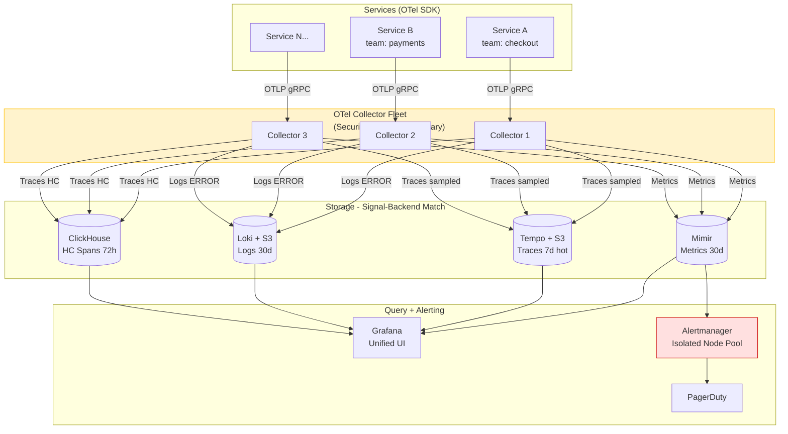

## Keywords in This File

{: .no_toc }

| #   | Keyword | Weight |
| --- | ------- | ------ |
| 1   | [Observability Platform Design](#observability-platform-design) | critical |

---

# Observability Platform Design

**TL;DR** - Observability platform design is the staff/principal-
level practice of architecting multi-signal (metrics, logs, traces,
profiles) infrastructure as a shared internal platform - defining
signal routing, storage tiers, cost governance, OTel standardization,
vendor strategy, and team autonomy boundaries - so that 500
engineers can debug production independently without rebuilding
the pipeline themselves.

---

### 🎯 Model Answer

**30 seconds:**
> Observability platform design is about building the infrastructure
> that makes observability a shared capability rather than something
> each team reinvents. The key decisions are: which open-source
> components vs managed vendors for each signal, how to standardize
> instrumentation across teams without removing autonomy, how to
> attribute and control cost as the platform scales, and how to
> make the platform itself reliable enough that it doesn't go down
> during the incidents it's supposed to help diagnose. The hardest
> part isn't the technology - it's defining the contract between
> the platform team and the product teams.

**3 minutes (Senior):**
> At staff level, observability platform design starts from a
> question that no tooling documentation answers: "Who owns the
> observability platform and what are their responsibilities?" In
> most engineering organizations, observability degrades over time
> because there's no clear owner. Logs go to Elasticsearch because
> someone set it up 3 years ago. Metrics go to Prometheus because
> the Kubernetes operator installed it. Traces go to two different
> backends because two teams evaluated different tools and never
> agreed. The result is a fragmented platform that requires
> institutional knowledge to navigate and has no clear cost
> accountability.
>
> The platform team model: a dedicated observability platform team
> (2-5 engineers for a 200-500 engineer org) owns the collection
> pipeline, storage, and query infrastructure. Product teams own
> instrumentation - they instrument their services with OTel and
> follow conventions defined by the platform team, but they control
> what signals they emit. The platform team provides the internal
> OTel SDK wrapper that enforces mandatory resource attributes
> (service.name, team, environment, version) without requiring
> each team to configure them.
>
> The four architectural pillars: (1) Unified collection via OTel
> Collector as the single data pipeline, routing signals to
> appropriate backends without vendor lock-in. (2) Signal-backend
> matching: Prometheus for low-cardinality metrics and alerting,
> columnar store (ClickHouse/Honeycomb) for high-cardinality trace
> investigation, object-backed store (Loki/S3 or Tempo/S3) for
> log and trace cold storage. (3) Cost governance: showback
> dashboards that attribute observability cost to each team by
> signal volume; automatic retention policy enforcement. (4) SLOs
> for the platform itself: the observability platform has its own
> SLOs (99.9% availability for alerting pipeline, < 30-second
> metric ingestion latency) because an observability platform
> that goes down during incidents is worse than no platform.

**Framework:** WHAT -> WHY -> HOW -> TRADE-OFF -> EXAMPLE

*Adapting up:* Principal engineers extend the platform design
to multi-region and multi-cloud federation: a global query layer
(Thanos querier for metrics, Tempo search for traces) that
federates data from regional Prometheus/Tempo instances while
each region's data is independently available during network
partitions. They also design the observability-as-a-product
model: the platform team has a roadmap, an SLA with product
teams, a quarterly review cycle, and measures its own success
by the mean time to detection and resolution for product
incidents.

*Adapting down:* "An observability platform is like an office
building's electrical and plumbing infrastructure. You don't
want every tenant to run their own generator and dig their own
water line. The platform team lays down the infrastructure once.
Tenants (product teams) plug in their appliances (services) and
pay their utility bill. The building manager (platform team)
ensures the infrastructure is reliable and the cost is fair."

**Blank Mind Recovery:**

**(1) Restate:** "You're asking about designing the full
observability platform across an engineering organization - let
me think through the key architectural decisions and the
organizational model."

**(2) First principles:** "From first principles, observability
exists to let engineers understand production system behavior.
At scale, the cost of each team building their own observability
exceeds the cost of a shared platform. A shared platform needs
standardized instrumentation, shared storage, cost governance,
and reliability guarantees. The design is those four dimensions."

**(3) Bridge:** "This is similar to designing a data platform:
you have data producers (services), a collection pipeline, storage,
and consumers (engineers querying during incidents). The decisions
are the same: what schema standard do producers follow, what
storage tier matches each access pattern, how do you handle
multi-tenancy and cost attribution?"

---

### 📘 Concept Explanation

**What it is:**
Observability platform design is the architectural discipline
of building and operating the shared infrastructure that collects,
stores, routes, and makes queryable all observability signals
(metrics, logs, distributed traces, profiling) for an engineering
organization. At staff/principal level, it encompasses: the
signal routing architecture, storage backend selection per signal,
OpenTelemetry standardization and internal SDK distribution,
multi-tenant cost attribution and governance, platform reliability
(SLOs for the platform itself), and the organizational model
(platform team scope and product team contract).

**The problem it solves:**
Without a platform team and shared infrastructure, observability
fragments: each product team chooses different tools, different
log formats, different metric naming conventions, and different
trace backends. Cross-team incident investigation becomes
impossible because signals use incompatible schemas. Cost is
uncontrolled because no one owns the total observability spend.
When a new service is built, the team spends 2-3 weeks setting
up observability instead of building features. And the observability
infrastructure itself is unreliable because no one runs it as
a production service with SLOs. The observability platform model
solves all four: standardization, cost control, new-service time-
to-visibility, and platform reliability.

**How it works:**

```
Observability Platform Architecture
=====================================

COLLECTION LAYER (platform-owned):
+-----------------------------------+
| OTel Collector Fleet              |
|   receive: OTLP (grpc/http)       |
|   process: transform, filter,     |
|            tail_sampling, batch   |
|   export: per signal to backend   |
+-----------------------------------+
  ^            ^             ^
  |            |             |
[Service A] [Service B] [Service C]
  OTel SDK    OTel SDK    OTel SDK
  (internal   (internal   (internal
   wrapper)    wrapper)    wrapper)
               |
           mandatory labels:
           service.name, team,
           env, version, region

STORAGE LAYER (signal-backend matching):
+----------+ +----------+ +----------+
|Prometheus| |   Tempo   | |   Loki   |
| metrics  | |  traces   | |  logs    |
| 30-day   | | 7-day hot | | 30-day   |
| hot      | | +S3 90d   | | hot+S3   |
+----------+ +----------+ +----------+
+---------------------+
|    ClickHouse        |
| high-cardinality     |
| spans: 72h hot       |
+---------------------+

QUERY LAYER:
+-----------------------------------+
| Grafana (unified query interface) |
|   Prometheus data source          |
|   Tempo data source               |
|   Loki data source                |
|   Pyroscope data source           |
|   ClickHouse data source          |
+-----------------------------------+

GOVERNANCE:
+-----------------------------------+
| cost attribution (by team label)  |
| retention enforcement             |
| OTel schema registry              |
| platform SLO dashboard            |
+-----------------------------------+
```

**The key insight:**
The observability platform is a product, not infrastructure.
Product teams are its customers. It needs a roadmap, an SLA,
a feedback loop, and success metrics. When the platform team
treats it as infrastructure, it optimizes for "does it run?"
When it treats it as a product, it optimizes for "does it
reduce MTTR for incident investigations?" - which is the
correct metric. The platform team's success is measured by
product team outcomes, not by platform uptime alone.

**When to use it:**
Design a formal observability platform when: the organization
has more than 50 engineers and 20+ services (fragmentation cost
exceeds centralization cost); observability cost is growing
faster than engineering team size; cross-team incident
investigations require manually correlating signals from
different systems; onboarding a new service to observability
takes more than 1 day. Before 50 engineers, a simpler self-
serve model (Grafana Cloud, Datadog) with minimal platform team
involvement is usually more cost-effective.

**When NOT to use it:**
Do not build a complex multi-signal open-source platform for
a startup with 5-20 engineers. A managed solution (Datadog,
New Relic, Grafana Cloud) provides 90% of the functionality
at a fraction of the engineering cost. The "build vs buy"
inflection point for observability is roughly $50,000-100,000/
month in managed SaaS spend - below that threshold, buying is
almost always cheaper than building and operating open-source
alternatives. Do not invest in a custom platform if the
engineering team does not have the operational maturity to
run production services reliably.

**Alternatives:**
- Fully managed SaaS (Datadog, New Relic, Grafana Cloud):
  zero infrastructure management, higher per-unit cost at
  scale, vendor lock-in; correct for <50-engineer organizations
- Self-managed Grafana LGTM stack (Loki, Grafana, Tempo,
  Mimir): open-source multi-signal platform, lower cost at
  scale, significant operational burden; correct for 100+
  engineers with dedicated platform team
- OpenSearch + Prometheus + Jaeger (non-Grafana stack): fully
  open-source without Grafana Enterprise features, vendor-
  neutral; higher integration complexity
- Single-vendor APM (Datadog, New Relic): unified agent,
  proprietary collection, seamless UX; trading flexibility
  for convenience and higher lock-in

**First-principles derivation:**
An engineering organization generates observability data as
a byproduct of operating software. The data is valuable for
debugging, capacity planning, alerting, and compliance. As
the volume of services and data grows, two forces push toward
centralization: (1) economies of scale - storage costs per
GB are lower at platform scale than per-team provisioning;
(2) network effects - cross-service debugging requires
consistent schemas across teams, which is achievable only
with a shared platform and standards. The platform design
is the engineering discipline of realizing these economies
and network effects while preserving team autonomy for
instrumentation choices.

---

### 💻 Code Example

**Example 1: BAD - Fragmented observability without a platform**

```yaml
# BAD: Service A team's observability setup (chosen independently)
# Uses Datadog agent for metrics + separate ELK for logs
# No OTel; uses Datadog proprietary SDK

apiVersion: v1
kind: ConfigMap
metadata:
  name: datadog-agent-config
data:
  datadog.yaml: |
    api_key: <DATADOG_API_KEY>
    logs_enabled: true
    apm_config:
      enabled: true
    # Non-standard service naming:
    # Service A uses "checkout-svc"
    # Service B uses "CheckoutService"
    # Service C uses "checkout"
    # -> Cross-service trace correlation is impossible

---
# Service B team (independent setup)
# Uses Prometheus + Zipkin for traces (different from A)
# Log format: plaintext with custom timestamp
apiVersion: apps/v1
kind: Deployment
metadata:
  name: payment-service
spec:
  template:
    spec:
      containers:
        - name: payment-service
          image: payment-service:v1.2
          # No common labels for cost attribution
          # No version label for deployment tracking
          # No team label for ownership
          env:
            - name: ZIPKIN_ENDPOINT
              value: http://zipkin:9411/api/v2/spans
            # Different trace backend than Service A
            # -> Checkout -> Payment traces are in
            #    Datadog APM (checkout) and Zipkin (payment)
            # -> No single view of end-to-end trace

# Result after 2 years:
# - 4 different trace backends across teams
# - 3 different log formats (Datadog, ELK, Loki)
# - No cross-service trace correlation
# - Observability cost: $85,000/month, unattributed
# - New service setup: 3-5 days per service
# - MTTR for cross-service incidents: 4-8 hours
```

> **Code walkthrough:** The BAD pattern shows what happens without
> a platform team enforcing standards. Service A uses Datadog APM
> and Service B uses Zipkin with different service names and no
> common resource attributes. A trace that spans both services
> cannot be stitched together because they're in different backends
> with incompatible naming. Cost attribution is impossible because
> there are no team labels on any metrics. The cumulative outcome:
> $85,000/month in observability spend with no accountability,
> 4-8 hour MTTR for cross-service incidents, and 3-5 days to onboard
> each new service.

**Example 2: GOOD - Internal OTel SDK wrapper enforcing platform
standards**

```java
// GOOD: Internal OTel SDK wrapper that platform team distributes
// All services import this instead of raw OTel SDK
// Enforces mandatory labels without developer effort

// build.gradle (internal SDK)
// implementation 'com.company:observability-sdk:2.1.0'

package com.company.observability;

import io.opentelemetry.api.OpenTelemetry;
import io.opentelemetry.sdk.OpenTelemetrySdk;
import io.opentelemetry.sdk.resources.Resource;
import io.opentelemetry.sdk.trace.SdkTracerProvider;
import io.opentelemetry.exporter.otlp.grpc.OtlpGrpcSpanExporter;
import io.opentelemetry.sdk.metrics.SdkMeterProvider;
import io.opentelemetry.semconv.resource.attributes.ResourceAttributes;

public class CompanyObservability {

    /**
     * Initialize observability for a service.
     * Reads service metadata from environment variables
     * set by the deployment platform (Kubernetes labels
     * injected via Downward API).
     *
     * Mandatory env vars (enforced by deploy pipeline):
     *   SERVICE_NAME, TEAM_NAME, APP_VERSION, ENVIRONMENT
     *
     * Developers DO NOT configure these - the platform does.
     */
    public static OpenTelemetry init() {
        String serviceName =
            requireEnv("SERVICE_NAME");
        String teamName =
            requireEnv("TEAM_NAME");
        String appVersion =
            requireEnv("APP_VERSION");
        String environment =
            requireEnv("ENVIRONMENT");
        String region =
            System.getenv("CLOUD_REGION");

        // Mandatory resource attributes for all services
        // These enable cross-team correlation and cost
        // attribution by team
        Resource resource = Resource.getDefault()
            .merge(Resource.create(
                Attributes.of(
                    ResourceAttributes.SERVICE_NAME,
                    serviceName,
                    // Platform-standard attribute names
                    // (documented in schema registry)
                    AttributeKey.stringKey("team"),
                    teamName,
                    ResourceAttributes.SERVICE_VERSION,
                    appVersion,
                    ResourceAttributes.DEPLOYMENT_ENVIRONMENT,
                    environment,
                    ResourceAttributes.CLOUD_REGION,
                    region != null ? region : "unknown"
                )
            ));

        // Collector endpoint from environment
        // (set by platform team via Kubernetes ConfigMap)
        String collectorEndpoint =
            System.getenv("OTEL_COLLECTOR_ENDPOINT");
        if (collectorEndpoint == null) {
            // Fallback for local development
            collectorEndpoint =
                "http://localhost:4317";
        }

        SdkTracerProvider tracerProvider =
            SdkTracerProvider.builder()
                .setResource(resource)
                .addSpanProcessor(
                    BatchSpanProcessor.builder(
                        OtlpGrpcSpanExporter.builder()
                            .setEndpoint(collectorEndpoint)
                            .build()
                    ).build()
                )
                .build();

        SdkMeterProvider meterProvider =
            SdkMeterProvider.builder()
                .setResource(resource)
                .registerMetricReader(
                    PeriodicMetricReader.builder(
                        OtlpGrpcMetricExporter.builder()
                            .setEndpoint(collectorEndpoint)
                            .build()
                    )
                    .setInterval(Duration.ofSeconds(30))
                    .build()
                )
                .build();

        return OpenTelemetrySdk.builder()
            .setTracerProvider(tracerProvider)
            .setMeterProvider(meterProvider)
            .buildAndRegisterGlobal();
    }

    private static String requireEnv(String name) {
        String val = System.getenv(name);
        if (val == null || val.isBlank()) {
            throw new IllegalStateException(
                "Required environment variable not set: "
                + name
                + ". Set via Kubernetes Downward API or deploy config."
            );
        }
        return val;
    }
}
```

> **Code walkthrough:** The internal SDK wrapper has one job:
> ensure that every service in the organization emits telemetry
> with the same mandatory resource attributes (service.name, team,
> version, environment, region) without requiring developers to
> configure them. The platform team sets these via Kubernetes
> Downward API (labels injected as environment variables). When
> a developer uses `CompanyObservability.init()`, they get
> properly labeled telemetry for free. The Collector endpoint is
> also centrally controlled. This makes cost attribution by team
> trivial (sum metric volume by `team` label), enables cross-team
> trace correlation, and ensures the onboarding checklist is "add
> the SDK dependency and call init()" - not "configure 12 OTel
> environment variables."

**Example 3: GOOD - Collector routing configuration for
multi-signal, multi-backend platform**

```yaml
# OTel Collector configuration for the platform
# Routes each signal to the appropriate backend
# based on signal type and attributes

receivers:
  otlp:
    protocols:
      grpc:
        endpoint: 0.0.0.0:4317
      http:
        endpoint: 0.0.0.0:4318

processors:
  # Mandatory resource enrichment for all signals
  resource/enrich:
    attributes:
      - key: cluster.name
        value: ${CLUSTER_NAME}
        action: upsert
      - key: collector.version
        value: "1.4.2"
        action: upsert

  # Tail sampling: keep 100% errors/slow, 1% normal
  # Applied only to traces, before routing
  tail_sampling/production:
    decision_wait: 30s
    num_traces: 50000
    expected_new_traces_per_sec: 1000
    policies:
      - name: always_sample_errors
        type: status_code
        status_code: {status_codes: [ERROR]}
      - name: always_sample_slow
        type: latency
        latency: {threshold_ms: 200}
      - name: sample_normal_traffic
        type: probabilistic
        probabilistic: {sampling_percentage: 1}

  # Log routing: separate processing for different log levels
  filter/error_logs_only:
    logs:
      include:
        match_type: strict
        log_bodies: []
      exclude:
        match_type: regexp
        record_attributes:
          - key: log.level
            value: "^(DEBUG|INFO)$"

  batch:
    timeout: 5s
    send_batch_size: 512

exporters:
  # Traces: Tempo for hot storage + ClickHouse for HC queries
  otlp/tempo:
    endpoint: tempo:4317
    tls:
      insecure: true

  clickhouse/traces:
    endpoint: tcp://clickhouse:9000
    database: otel
    traces_table_name: otel_traces
    ttl: 72h  # 3-day hot storage for investigation

  # Metrics: Prometheus remote write
  prometheusremotewrite:
    endpoint: "http://mimir:9009/api/v1/push"
    resource_to_telemetry_conversion:
      enabled: true  # converts resource attrs to labels

  # Logs: Loki
  loki:
    endpoint: http://loki:3100/loki/api/v1/push
    tenant_id: "platform"  # multi-tenant Loki

service:
  pipelines:
    # Traces pipeline: tail sample + dual export
    traces:
      receivers: [otlp]
      processors:
        [resource/enrich, tail_sampling/production, batch]
      exporters: [otlp/tempo, clickhouse/traces]

    # Metrics pipeline: pass-through with enrichment
    metrics:
      receivers: [otlp]
      processors: [resource/enrich, batch]
      exporters: [prometheusremotewrite]

    # Logs pipeline: error-level only to Loki hot
    # (DEBUG/INFO go to S3 cold storage via separate pipeline)
    logs:
      receivers: [otlp]
      processors:
        [resource/enrich, filter/error_logs_only, batch]
      exporters: [loki]
```

> **Code walkthrough:** The Collector configuration shows the
> platform's signal routing logic. Traces go to both Tempo
> (for individual trace inspection in Grafana) and ClickHouse
> (for high-cardinality aggregate queries) with tail sampling
> that keeps 100% of errors and slow requests. Metrics go to
> Mimir (Prometheus-compatible, horizontally scalable). Logs
> are filtered to error-level only for hot storage in Loki
> (reducing cost), with DEBUG/INFO going to a separate cold
> pipeline (not shown) that archives to S3. The `resource/enrich`
> processor adds cluster metadata that the SDK doesn't know.
> This single Collector configuration handles all three signals
> for all services on the cluster.

---

### 🎓 Answers by Seniority

**Junior / Mid (0-5 years):**
> An observability platform is the shared infrastructure that
> handles metrics, logs, and traces for all services in an
> organization. Instead of each team setting up their own
> Prometheus and Elasticsearch, a platform team runs centralized
> backends and provides a standardized way for product teams
> to instrument their services. The standard is OpenTelemetry:
> each service uses the OTel SDK to emit signals to a centralized
> OTel Collector, which routes them to the appropriate storage
> backend. The benefits are: one place to query all services,
> consistent labeling that enables cross-service trace correlation,
> and shared cost for storage infrastructure.

For mid-level: the platform team provides an internal SDK wrapper
that pre-configures all mandatory labels (service name, team,
environment, version) so product teams don't have to. The OTel
Collector is the central routing and processing component. Backend
choices depend on the signal: Prometheus for time-series metrics,
Tempo or Jaeger for traces, Loki or Elasticsearch for logs.

*Push deeper:* The key tension the platform team manages is
standardization vs autonomy: the platform enforces mandatory
resource attributes (needed for cross-service correlation) but
does not dictate what custom spans or metrics each service emits.
Teams own their instrumentation; the platform owns the pipeline.

---

**Senior / Staff (5+ years):**
> I've designed observability platforms for 100-500 engineer
> organizations and the consistent lesson is: the technology
> choices are secondary to the organizational model. The first
> decision is: who owns the platform and what is their scope?
> Without a clear owner, standards erode, cost grows unchecked,
> and each new incident reveals another gap in the platform
> coverage. The platform team model I recommend: 2-4 engineers
> (for a 200-engineer org) who own the Collector fleet, storage
> backends, Grafana configuration, and the internal SDK wrapper.
> Product teams own their own instrumentation and dashboards
> (within the platform's query infrastructure). The contract:
> the platform team guarantees 99.9% availability for the metric
> alerting pipeline and < 1-minute log ingestion latency; product
> teams guarantee using the internal SDK and following the
> attribute naming registry.
>
> On technology: I standardize on the Grafana LGTM stack (Loki,
> Grafana, Tempo, Mimir) with ClickHouse for high-cardinality
> trace investigation. This gives full open-source multi-signal
> observability at 30-50% of equivalent Datadog costs at 200+
> engineer scale. The OTel Collector is the non-negotiable piece:
> it's the vendor-neutral collection pipeline that prevents
> backend lock-in. If we decide to replace Tempo with Jaeger
> or Loki with Elasticsearch, we change the Collector exporter
> config - the services don't change at all.

At staff level: the cost governance model is the hardest part
to get right. Observability cost grows with data volume which
grows with requests which grows with traffic. Without showback
(showing each team their observability spend) or chargeback
(billing teams for their usage), cost attribution is impossible
and the platform team gets blamed for cost overruns it cannot
control. I implement team-level showback dashboards in Grafana
that show each team: their log volume per day, their trace
volume, their metric series count, and the approximate cost
using vendor pricing models applied to storage volume.

*Push deeper:* The platform team should have SLOs for the
platform itself and treat incidents against those SLOs with
the same severity as product incidents. An observability platform
that degrades during a production incident (when it's needed most)
is a second-order catastrophe. I run the alerting pipeline at
a separate reliability tier from the analytics pipeline: metric
ingestion and alert evaluation run on independent infrastructure
with dedicated Prometheus instances, so a ClickHouse OOOM that
takes down the analytics cluster doesn't affect alerting.

---

### ⚠️ Common Misconceptions

**Misconception 1: "Observability platform design is just picking
tools - Datadog vs Prometheus vs Grafana."**
Tool selection is the 20% of the decision that gets 80% of the
attention. The 80% that determines success: the organizational
model (who owns the platform, what is the product team contract),
the instrumentation standard (which resource attributes are
mandatory, how they're enforced), cost governance (how observability
spend is attributed and controlled), and platform reliability
(the alerting pipeline has its own SLOs). Organizations that
spend months evaluating Datadog vs Grafana Cloud but don't define
any of these organizational aspects end up with a beautiful tool
that degrades over 18 months because no one owns it.

**Misconception 2: "OpenTelemetry auto-instrumentation is
sufficient for a production observability platform."**
OTel auto-instrumentation captures generic HTTP, database, and
gRPC spans with standard attributes. It does not capture business
context: which user tier made the request, which product category
was browsed, which payment method was used, which A/B test
variant was active. The incidents that are hardest to diagnose
are almost always segmented by business context that
auto-instrumentation doesn't know about. A platform design
that relies solely on auto-instrumentation produces observability
that tells you an endpoint was slow but cannot tell you which
user cohort or product category is affected. Custom span
enrichment with business attributes is non-optional for
production-quality observability.

**Misconception 3: "The observability platform should be highly
available enough that it never goes down."**
The alerting pipeline (the component that evaluates alert rules
and sends PagerDuty notifications) must be highly available
because an alert that doesn't fire is a silent outage. But the
analytics pipeline (high-cardinality trace investigation,
historical log analysis) has much lower availability requirements.
Trying to make ClickHouse and Elasticsearch as highly available
as Prometheus alerting is expensive and usually not worth it.
The correct design: separate the alerting path from the analytics
path, give each its own SLO, and invest HA engineering where it
matters (alerting: 99.9%+, analytics: 99%, cold storage query:
99.5%).

**Misconception 4: "Adopting OTel eliminates vendor lock-in
for observability."**
OTel standardizes the collection protocol (OTLP) and the semantic
conventions for attribute naming. It does NOT eliminate lock-in
from the query layer. Grafana's query language (LogQL, TraceQL,
PromQL), Datadog's search syntax, Honeycomb's BubbleUp algorithm,
and New Relic's NRQL are all proprietary. Switching backends means
rewriting all dashboards, alert rules, and investigation playbooks.
The vendor lock-in that OTel eliminates is at the collection
layer (no proprietary agents in each service). The lock-in that
remains is at the query and visualization layer. A truly portable
observability platform needs a query abstraction layer (Grafana
with open-source backends) or accepts query-layer lock-in as
an explicit trade-off.

**Misconception 5: "More data always means better observability."**
More data increases storage cost, query latency, and alert
evaluation time without proportionally improving debugging
capability. The most effective observability platforms are
engineered for signal density: storing the minimum data needed
to diagnose the maximum number of incidents. Tail sampling
that keeps 100% of errors and 1% of happy-path requests is
not a compromise - it's an optimization. Logging at INFO level
in production for every request adds cost but rarely adds
debugging value over ERROR-only logs because incidents are
almost always surfaced by error conditions first. The signal
density mindset: "What is the lowest-cost data store that
lets us diagnose 95% of incidents in under 30 minutes?"

---

### 🚨 Failure Modes and Diagnosis

**Failure 1: Observability platform goes down during a P1
production incident**

Symptom: A P1 customer-impacting incident fires. The on-call
engineer opens Grafana to check the alerting dashboard and
Grafana is unavailable. Logs in Kibana are stale (ingestion
stopped 45 minutes ago). The observability platform is down
at the worst possible moment.

Cause: The observability platform shares infrastructure with
the production workloads. A noisy neighbour on the same cluster
consumed all CPU, causing OOM kills including the OTel Collector
and Prometheus. Alternatively, a ClickHouse OOOM during a large
analytics query took down the same Prometheus instance that
handles alerting.

Diagnosis and prevention:
```yaml
# Separate alerting infrastructure from analytics
# Run alert-critical components on dedicated node pool

# Dedicated Prometheus for alerting only
# (not analytics queries, not recording rules)
apiVersion: apps/v1
kind: Deployment
metadata:
  name: prometheus-alerting
  namespace: observability
spec:
  template:
    spec:
      # Dedicated node pool: never shares with analytics
      nodeSelector:
        observability-tier: alerting-critical
      tolerations:
        - key: observability-alerting
          operator: Exists
          effect: NoSchedule
      containers:
        - name: prometheus
          image: prom/prometheus:v2.48.0
          args:
            # Only alert evaluation rules, no recording rules
            - --config.file=/etc/prometheus/alerting-only.yml
            # Small TSDB: only what alerting queries need
            - --storage.tsdb.retention.time=2h
          resources:
            # Guaranteed QoS: never OOM-killed
            requests:
              cpu: 2
              memory: 4Gi
            limits:
              cpu: 2
              memory: 4Gi

# Alert rule config: only SLI metrics needed for alerting
# (separate from analytics Prometheus that has all metrics)
```

Fix: isolate the alerting pipeline on dedicated nodes with
guaranteed compute. Run two Prometheus instances: `prometheus-
alerting` (only SLI metrics, alert rules, 2h retention) and
`prometheus-analytics` (all metrics, recording rules, 30d
retention). PagerDuty receives alerts from `prometheus-alerting`
only. The analytics instance can degrade without affecting alert
delivery. Run the OTel Collector that feeds `prometheus-alerting`
on the same dedicated node pool.

**Failure 2: Observability cost grows 40% month-over-month with
no cost attribution**

Symptom: The cloud bill shows observability infrastructure cost
(S3 storage, Elasticsearch cluster compute, ClickHouse disks)
growing 40% in 3 months. No team can explain why. The platform
team is asked to "reduce cost" but has no data on which team
or service is responsible.

Cause: No cost attribution exists. All observability data goes
into shared backends with no team-level volume tracking. A new
team deployed a service that logs at DEBUG level for every request
(10x the normal log volume). Another team added a hot metric
with a high-cardinality label. The platform team has no visibility
into who added what.

Diagnosis:
```promql
# Prometheus: find top metric series by team
# Requires 'team' label on all metrics (from internal SDK)
topk(10,
  count by (team) (
    {__name__=~".+"}
  )
)
# Output: which teams have the most metric series

# Loki: log volume by service (last 7 days)
sum by (service_name) (
  rate(
    {env="production"}[24h]
  )
) * 86400
# Output: log bytes per day per service

# ClickHouse: trace volume by team (spans per day)
SELECT
    ServiceName,
    count() AS span_count,
    formatReadableSize(
      sum(length(SpanAttributes.keys)) * 200
    ) AS est_storage
FROM otel_traces
WHERE Timestamp > now() - INTERVAL 7 DAY
GROUP BY ServiceName
ORDER BY span_count DESC
LIMIT 20
```

Fix: build a cost attribution dashboard in Grafana showing each
team's observability footprint: log volume (GB/day), metric series
count, trace volume (spans/day), and estimated monthly cost using
a per-GB pricing model. Review with engineering leads quarterly.
For the DEBUG logging issue: add a Loki alert rule that fires
when a service's log volume exceeds its 7-day average by 300%.
For high-cardinality metrics: add Prometheus cardinality alerts
on the `prometheus_tsdb_head_series` metric per service.

**Failure 3: Cross-team trace correlation broken - traces from
Service A cannot be linked to Service B's traces**

Symptom: An incident affects checkout latency. Checkout calls
payment. The checkout trace in Tempo shows a slow external call
but clicking "find related traces" returns nothing from the
payment service. Checkout and payment traces are in Tempo but
are not linked.

Cause: Service A (checkout) uses OTel Java SDK with W3C
TraceContext propagation. Service B (payment) uses a legacy
Zipkin instrumentation library that propagates Zipkin B3 headers.
When checkout calls payment, the W3C `traceparent` header is
not recognized by payment's Zipkin instrumentation. Payment
starts a new trace root instead of a child span.

Diagnosis:
```bash
# Check which propagation headers checkout sends
kubectl exec -it \
  deployment/checkout-service -- \
  curl -v http://payment-service/api/charge 2>&1 \
  | grep -E "traceparent|b3|X-B3"
# Output: traceparent: 00-a1b2c3... (W3C format)
# but no X-B3-TraceId (Zipkin format)

# Check what payment service expects
kubectl exec -it \
  deployment/payment-service -- \
  env | grep -i "ZIPKIN\|TRACE\|PROPAGAT"
# Output: ZIPKIN_ENDPOINT=http://zipkin:9411
# No OTel configuration -> still using Zipkin client

# Verify in Tempo: traces from payment service
# all have trace_id that doesn't match any checkout trace
tempo-cli query traces \
  --service="payment-service" \
  --start=$(date -d "1 hour ago" +%s) \
  --end=$(date +%s) \
  | head -10 | jq '.rootSpanName'
# All "POST /api/charge" spans are root spans (no parent)
# -> Confirms: payment starts new trace for each request
```

Fix: migrate payment service to OTel SDK with W3C TraceContext
propagation. If immediate migration is not possible, configure
OTel Collector to perform B3 -> W3C trace context translation
using the `tracetranslator` component, or configure the checkout
service to send both W3C and B3 headers simultaneously
(`OTEL_PROPAGATORS=tracecontext,b3multi`). The platform team
documents all supported propagation formats in the schema
registry and enforces W3C as the standard for new services.

---

### 🎯 Interview Deep-Dive

| Time | Question Type | Depth Signal |
| ---- | ------------- | ------------ |
| 3 min | CONCEPTUAL | Four signals and their purpose |
| 4 min | ARCHITECTURE | Platform team model and contract |
| 4 min | SYSTEM DESIGN | 500-service platform architecture |
| 4 min | TRADE-OFF | OSS platform vs managed SaaS |
| 4 min | PRODUCTION | Observability platform P1 incident |
| 4 min | DEEP DIVE | Cost governance and showback |
| 3 min | DEBUGGING | Cross-team trace correlation failure |
| 3 min | COMPARISON | Centralized vs federated platform |
| 3 min | HANDS-ON | Internal SDK wrapper design |
| 4 min | BEHAVIORAL | Building platform consensus across teams |
| 4 min | PERFORMANCE | Platform scale and federation |
| 3 min | MISCONCEPTION | "OTel eliminates vendor lock-in" trap |

---

**Q1 [SENIOR]: What are the four observability signals and
when do you use each?** `[CONCEPTUAL]`

*Why they ask:* Tests whether the candidate has a coherent mental
model for the full observability stack.

*Likely follow-up:* "When would you add profiling to an existing
metrics + logs + traces platform?"

The four signals answer different questions at different levels
of specificity:

Metrics answer "is something wrong at scale?" - aggregated
numerical measurements over time (request rate, error rate,
latency percentiles). Query: "What percentage of checkout
requests returned 5xx in the last 5 minutes?" Metrics are
cheap to store (pre-aggregated numbers) and fast to query.
They drive alerting because you can alert on aggregates.
Limitation: they don't tell you which specific requests failed.

Logs answer "what happened to this specific request or process?"
- structured or unstructured event records with timestamps and
context. Query: "Show me all ERROR logs from the checkout service
in the last hour." Logs provide the narrative of what happened.
Limitation: they're expensive at high volume and unstructured
text is hard to query systematically.

Distributed traces answer "where in the end-to-end request path
is the latency?" - the call graph of a specific request across
service boundaries with timing. Query: "Show me this slow trace
- which service call took the most time?" Traces are essential
for microservices where latency attribution requires seeing all
hops. Limitation: they only tell you where in the call path the
slowness is, not which code path within a service.

Profiles answer "why is this specific service slow at the code
level?" - CPU and memory sampling with flame graphs. Query: "Show
me the flame graph for checkout-service from the last 30 minutes
compared to yesterday." Profiles pinpoint the exact code path.
Limitation: they require eBPF or language agents, and flame
graphs require significant expertise to read.

Add profiling when: you have unexplained CPU regressions that
traces cannot isolate to a single service call, or when you need
to diagnose performance regressions introduced by a specific deploy.

*What separates good from great:* Articulating that each signal
answers a different question and that they're used in a sequence
(metric alert -> trace investigation -> profile diagnosis) rather
than as independent tools.

---

**Q2 [STAFF]: How would you design the observability platform
for a 500-service microservices organization at 10,000 RPS?** `[SYSTEM DESIGN]`

*Why they ask:* The flagship staff-level observability question.
Tests end-to-end platform design thinking.

*Likely follow-up:* "How does your design handle the data volume
growing 5x over the next year?"

The platform design has five layers:

(1) Collection: OTel Collector fleet, 3 nodes per cluster for HA.
All services export via OTLP to the Collector. The Collector
applies: tail sampling (100% errors + slow, 1% normal traffic),
attribute sanitization, resource enrichment, and signal routing.
The internal SDK wrapper handles mandatory resource attributes.

(2) Storage per signal: Metrics -> Mimir (Prometheus-compatible,
horizontally scalable for long-term storage at low per-GB cost).
Traces hot -> Tempo on S3 (7-day retention). Traces HC queries ->
ClickHouse (72-hour hot storage for segment analysis). Logs hot ->
Loki on S3 (30-day ERROR-level logs). Logs cold -> S3 Parquet
(90-day archive, queried with Athena for compliance).

(3) Query: Grafana as the unified query interface with data sources
for all backends. Standard dashboards for: service health (golden
signals), deployment comparison, cost attribution by team.

(4) Governance: team-level showback dashboards showing observability
cost per team. Attribute schema registry documenting approved
attributes. OTel Collector config under GitOps with security
review for changes.

(5) Platform reliability: alerting pipeline (Prometheus + Alertmanager
+ PagerDuty) on dedicated nodes with guaranteed compute, isolated
from analytics workloads. SLO: 99.9% alert delivery, < 30s metric
ingestion latency. Quarterly platform reliability review.

For 5x data growth: Mimir scales horizontally (add ingesters and
queriers). Tempo/Loki scale via object storage (S3 is effectively
unlimited). ClickHouse scales with more nodes. The Collector fleet
scales by adding replicas (stateless, load-balanced).

*What separates good from great:* Explicitly separating the alerting
pipeline from the analytics pipeline with different reliability
requirements, and having a concrete 5x growth plan rather than
vague "we'd scale out."

---

**Q3 [STAFF]: What is the platform team model and what is the
contract with product teams?** `[ARCHITECTURE]`

*Why they ask:* Separates engineers who understand observability
technology from those who understand observability as a
product/platform discipline.

*Likely follow-up:* "What happens when a product team wants to
use a different observability backend than the platform standard?"

The platform team owns: the OTel Collector fleet configuration
and deployment, the storage backends (Prometheus/Mimir, Tempo,
Loki, ClickHouse), the Grafana instance and standard dashboards,
the internal SDK wrapper and schema registry, the cost
attribution dashboards, and the SLOs for the platform itself.

The product team owns: their service's instrumentation (spans,
metrics, logs emitted), their team-specific Grafana dashboards
and alerts, and their service-level SLOs.

The contract: the platform team guarantees (in writing, as an
internal SLA): < 30-second metric ingestion latency from emit
to Prometheus, < 60-second log ingestion latency from emit to
Loki queryable, < 2-minute trace ingestion latency from emit
to Tempo queryable, 99.9% alert delivery availability, and
a support response time for platform issues (e.g., 4 hours
for P2 platform incidents).

Product teams agree to: use the internal OTel SDK wrapper
(not raw OTel or proprietary agents), include mandatory resource
attributes from the schema registry (service.name, team, version,
env), follow attribute naming conventions in the schema registry
for custom attributes, and not connect to platform backends
directly (only through the Collector).

When a product team wants a different backend: the standard
answer is "if it's for production incident diagnosis, the
platform standard tools should be sufficient - bring the use
case to the platform team for evaluation." For specialized
use cases (e.g., real-user monitoring, mobile crash reporting)
that the platform doesn't cover, the team can run their own
tooling. But for the core backend signals, variance reduces
the network effect that makes the shared platform valuable
(cross-team trace correlation, cost attribution).

*What separates good from great:* Having a specific written SLA
with latency guarantees rather than vague "it's reliable." The
SLA creates accountability and makes the platform team treat
their own service with the same rigor as product teams.

---

**Q4 [STAFF]: How do you implement cost governance for a
shared observability platform?** `[DEEP DIVE]`

*Why they ask:* Observability cost is a real and growing problem
in large engineering orgs. This tests whether the candidate has
operational experience with cost attribution.

*Likely follow-up:* "What would you do if one team's log volume
suddenly spiked and was costing $10,000/month extra?"

Cost attribution requires that all observability data carries a
`team` resource attribute (enforced by the internal SDK wrapper).
With that label, you can compute per-team cost using billing
models applied to volume:

Log cost: `team_log_gb_per_day * $0.10/GB/day` (Loki S3 storage
cost model). Metric series cost: `team_metric_series * $0.0001/
series/month`. Trace cost: `team_span_count_per_day * $0.001/1M
spans` (ClickHouse compute + storage).

The showback dashboard shows each team: their weekly volume trend,
their cost estimate, and a comparison to the previous period and
to similar-sized teams. It does NOT charge teams a bill (that's
chargeback, which creates friction); it shows them their footprint
(showback) so they understand their impact.

For the $10,000/month spike: the showback dashboard would surface
this within hours. The platform team alerts the team lead: "Your
log volume increased 800% since Tuesday's deploy. This is costing
$X/month. Please investigate." The likely cause: a developer set
log level to DEBUG and deployed without noticing. The fix: set
a team-level log volume quota in the OTel Collector (drop traffic
above N GB/hour per team) and alert before applying the quota.

Long-term governance: define observability budgets per team in
the annual capacity planning process. Teams that consistently
exceed their budget meet with the platform team to optimize
(increase sampling, reduce log verbosity, drop unnecessary metrics).
This creates a feedback loop that aligns observability cost with
business value.

*What separates good from great:* Having a specific cost model
with actual numbers (log cost per GB, metric cost per series)
rather than vague "we'd track it." The distinction between
showback and chargeback, and why showback is the better first
step.

---

**Q5 [STAFF]: Compare centralized vs federated observability
platform architectures.** `[COMPARISON]`

*Why they ask:* At scale (hundreds of services, multiple teams),
centralized vs federated is a real architectural decision.

*Likely follow-up:* "How does your choice affect cross-team
incident investigation?"

Centralized: one Collector fleet, one set of backends, one Grafana
instance for the entire organization. All teams see the same
signal store. Cross-team trace correlation works by default because
all traces are in one Tempo instance. Cost attribution is centralized.
Platform team has full visibility and control. Limitations: the
platform becomes a bottleneck for configuration changes; one
noisy tenant can affect all others; single point of failure for
analytics infrastructure.

Federated: each team or domain has its own Collector and storage
backends. A global query layer (Thanos for metrics, Grafana
datasource aggregation for logs/traces) federates queries across
all backends. Each team has full autonomy over their observability
stack within platform standards. Cross-team trace correlation
requires the global query layer to stitch traces from different
backends. Limitations: more complex query layer, higher total
infrastructure cost (less shared storage), cross-team correlation
is harder to implement correctly.

Recommendation by scale:
- < 100 engineers / < 50 services: centralized, managed SaaS
  (Grafana Cloud, Datadog) - zero infrastructure overhead
- 100-300 engineers / 50-200 services: centralized, self-managed
  Grafana LGTM stack - one platform team, shared backends
- 300-1000 engineers / 200+ services: federated by domain
  (payment platform, identity platform, etc.) with global query
  layer - autonomy without sacrificing cross-team correlation

*What separates good from great:* The specific scale thresholds
and the cross-team trace correlation challenge for federated
architectures (stitching traces from different Tempo instances
requires the global query layer to reconstruct the trace from
fragments).

---

**Q6 [STAFF]: How do you build cross-team adoption of the
observability platform?** `[BEHAVIORAL]`

*Why they ask:* Observability platforms fail without adoption.
Staff engineers need to drive organizational change, not just
build technology.

*Likely follow-up:* "How do you handle teams that resist adopting
the internal SDK?"

Adoption requires demonstrating value before demanding compliance.
The strategy: (1) build the platform for the teams who want it
first (early adopters); (2) demonstrate concrete value (reduced
MTTR in a real incident); (3) make adoption easier than the
alternative; (4) enforce standards only for new services.

I've used this approach: start by instrumenting the highest-
traffic service with the platform (which the team already wants
better observability for). Help them diagnose their first incident
using the platform's tools. Publish the incident analysis,
highlighting "how the new observability platform reduced our
investigation time from 3 hours to 20 minutes." This becomes
the case study that other teams want to replicate.

Then: offer platform onboarding support (1:1 with each team's
lead during their first platform integration). The first
integration is always the hardest; making it easy with direct
support converts skeptics. Once a team is on the platform,
the cross-service trace links to neighboring teams who are
NOT on the platform create organic pull: "Why can't I see the
trace for the payment call? Oh, payment service isn't on the
platform yet. Can they add it?"

For teams that resist: usually the objection is one of three
things: (a) "We have existing Datadog dashboards and we don't
want to rebuild them" -> offer to build Grafana equivalents
for them as part of onboarding support; (b) "The platform
doesn't support X feature we need" -> put it on the platform
roadmap, give them a timeline; (c) "We don't trust a shared
platform to be reliable" -> show them the platform SLO
dashboard and the incident history. Mandate adoption only for
new services and leave existing services on a voluntary
migration path with a clear sunset date for unsupported
tooling.

*What separates good from great:* The "early adopter case study"
strategy and the organic pull from cross-service trace linking.
The distinction between mandating for new services vs. voluntary
migration for existing ones is the politically pragmatic approach.

---

**Q7 [STAFF]: How do you handle multi-region observability in
a global system?** `[PERFORMANCE]`

*Why they ask:* Multi-region is a real architectural challenge
for platform design at scale.

*Likely follow-up:* "How do you ensure alerting works during
a regional network partition?"

Multi-region architecture: each region runs an independent
observability stack (Collector fleet + regional backends). Regional
independence is critical: if the US-East region has a P1 incident,
US-East alerting must not depend on a query to EU-West. Each
region's alerting pipeline is fully autonomous.

Regional backends: each region runs its own Prometheus (for
alerting), Loki (for logs), and Tempo (for traces). The regional
backends are the primary investigation tools during incidents.

Global query layer (for cross-region analysis): Thanos Querier
federates metric queries across regional Prometheus instances.
Grafana Enterprise's multi-datasource queries can aggregate
Loki/Tempo instances across regions. This global layer is for
analytics (compare error rates between US-East and EU-West)
not for alerting (which stays regional).

Data residency: EU data must not leave EU under GDPR. The regional
architecture naturally enforces this: EU services send telemetry
to EU Collector -> EU backends. The global query layer does not
replicate raw data; it executes queries against each regional
backend separately and aggregates results. No EU telemetry data
crosses to US instances.

SLO for global query: the global Thanos/Grafana layer can tolerate
higher latency (5-10 second query response vs. 1-second for
regional) because it's for analysis, not real-time alerting.

*What separates good from great:* The explicit separation of
regional independence for alerting vs. global federation for
analytics, and calling out GDPR data residency as a constraint
that the regional architecture naturally satisfies.

---

**Q8 [STAFF]: What are the SLOs for the observability platform
itself?** `[DEEP DIVE]`

*Why they ask:* Tests whether the candidate treats the
observability platform as a production service with reliability
requirements.

*Likely follow-up:* "How do you monitor the observability platform
itself? (meta-observability)"

The observability platform has at least three distinct SLOs:

Alert delivery SLO: 99.9% of triggered alerts reach PagerDuty
within 5 minutes of the threshold breach. Measurement: synthetic
alert injection (fire a test alert every 5 minutes and measure
the round-trip time to PagerDuty). Error budget: 43.8 minutes
per month. Incident priority: P1 if alert delivery drops below
99.5% (the on-call rotation is blind).

Metric ingestion SLO: 99.9% of metric batches are queryable in
Prometheus within 30 seconds of emission. Measurement: synthetic
counter emitted every 30 seconds from each cluster, queried
via Prometheus API, latency measured. Error budget: 43.8 minutes
per month.

Log queryability SLO: 99.5% of log lines are queryable in Loki
within 60 seconds of emission. Measurement: synthetic log line
with unique ID emitted every minute, Loki API queried for the
ID, latency measured. Error budget: 3.65 hours per month.

Meta-observability: the observability platform needs its own
observability. Prometheus monitors itself (it emits self-metrics).
The Collector fleet has a dedicated metrics pipeline to a separate
Prometheus instance that doesn't route through itself. Loki is
monitored with a separate lightweight Prometheus-Loki stack running
on different infrastructure. The SLO dashboards are served from
a separate Grafana instance than the main platform (avoiding
a single Grafana failure masking all SLO breaches simultaneously).

*What separates good from great:* Having specific, measurable
SLO definitions with measurement methodology (synthetic signals)
rather than vague "it should be reliable." The meta-observability
point - the separate lightweight monitoring stack - demonstrates
operational maturity in thinking about failure scenarios.

---

**Q9 [STAFF]: How do you design the attribute schema registry
and why does it matter?** `[ARCHITECTURE]`

*Why they ask:* The schema registry is often missing from
observability platform designs and causes significant operational
problems.

*Likely follow-up:* "What happens if a team adds an attribute
that conflicts with an existing attribute used by another team?"

The attribute schema registry is a central catalog of approved
observability attributes with their definitions, allowed value
sets, and owning teams. It's the canonical reference for "what
does `user.tier` mean, what values are allowed, and which team
owns its definition?"

Without it: Service A uses `user.tier` with values [free, premium,
enterprise]. Service B uses `user.tier` with values [basic, pro,
enterprise-plus]. Service C uses `user_tier` (underscore). A
ClickHouse query that groups by `user.tier` across all services
returns inconsistent results. The cross-service analytics that
make the shared platform valuable are broken.

Registry implementation: a YAML file in a shared repository
(owned by the platform team) with entries like:

```yaml
attributes:
  user.tier:
    type: string
    description: "User subscription tier"
    allowed_values: [free, starter, professional, enterprise]
    owner_team: identity-platform
    stability: stable
    added: 2024-01
  payment.method:
    type: string
    description: "Payment method used"
    allowed_values: [card, bank_transfer, paypal, crypto]
    owner_team: payments
    stability: stable
    added: 2024-03
```

Enforcement: the OTel Collector's transform processor validates
span attributes against the registry (attribute keys not in the
registry are allowed in test environments but logged as warnings;
in production, they're dropped after a 30-day grace period for
new attributes). A CI/CD step checks new attributes against the
registry before deploy.

When a team wants to add a new attribute: they submit a PR to
the registry with the attribute definition, receive review from
the platform team and any team that will use the attribute across
services, and merge after approval. This creates the audit trail
and prevents semantic conflicts.

*What separates good from great:* The practical YAML implementation
and the enforcement mechanism (Collector validation, grace period
for new attributes). The specific failure mode (inconsistent
user.tier values across services) makes the problem concrete.

---

**Q10 [STAFF]: How do you measure the observability platform's
impact on engineering productivity?** `[BEHAVIORAL]`

*Why they ask:* Staff engineers must justify platform investment
with business-level metrics, not just technical ones.

*Likely follow-up:* "What would you measure in the first 6 months
of a new platform?"

The observability platform's impact is measurable through incident
outcomes: MTTR (mean time to resolution), the fraction of
incidents resolved without escalation, and the time from alert
to first hypothesis (which correlates with the quality of the
observability tooling).

Concrete metrics to track: (1) Median time from alert fire to
root cause identified - baseline before platform deployment, then
quarterly after. My experience: this drops from 2-4 hours to
20-40 minutes after deploying a well-designed multi-signal
platform. (2) Fraction of incidents diagnosed using trace data -
a proxy for whether distributed tracing is actually being used.
(3) Number of "blind" incidents (incidents where the on-call
engineer had no useful observability data) per quarter. (4) New
service onboarding time (time from first commit to meaningful
dashboards and alerts) - a direct measure of platform usability.

For the first 6 months: measure all four baselines on the first
week. Establish the internal SDK with mandatory labels in month 1.
Deploy the Collector fleet and standard backends in month 2.
Build the cost attribution dashboards in month 3. Run an incident
response workshop in month 4 using the new tools on a historical
incident. Measure MTTR in month 6 vs baseline. If MTTR hasn't
improved 30%+, the tooling is good but the playbooks and on-call
training need attention.

*What separates good from great:* Framing platform success in
engineering productivity outcomes (MTTR) rather than platform
metrics (uptime, ingestion rate) - the latter are means to the
end, not the end itself.

---

**Q11 [STAFF]: How does observability platform design change
for a 5,000-service environment?** `[PERFORMANCE]`

*Why they ask:* Tests whether the candidate understands the
scale inflection points in platform design.

*Likely follow-up:* "What breaks first when you scale from
500 to 5,000 services?"

At 5,000 services (10x from 500), several components hit their
limits:

Collector fleet: 5,000 services each generating 100 spans/sec
= 500,000 spans/sec. A single Collector handles ~10,000 spans/sec.
Need 50 Collector replicas. The tail_sampling processor is
stateful (it needs to see all spans in a trace to make a
sampling decision). At 500,000 spans/sec, tail sampling across
50 Collector replicas requires routing all spans from the same
trace to the same Collector instance (consistent hashing on
trace ID). Without this, a trace with its spans spread across
multiple Collectors gets sampled by each independently.

Prometheus: 5,000 services with 200 metric series each = 1
million series. Single Prometheus handles 10-50M series but
query latency degrades above 5M. Switch to Mimir (horizontally
scalable Prometheus-compatible storage) with 10+ ingesters.

Grafana: 1,000 engineers each opening Grafana during incidents
creates a fan-out query problem. Use Grafana's query caching,
restrict complex historical queries to non-peak hours, and
separate read replicas for analytics vs alerting queries.

What breaks first: the tail_sampling processor is typically
the first bottleneck because it's stateful. The solution is
a dedicated "sampling tier" - a set of Collector replicas that
receive all spans, perform tail sampling, and forward sampled
spans to the regular Collector fleet for routing. This separates
the stateful sampling step from the stateless routing step.

*What separates good from great:* The specific tail_sampling
stateful problem at scale and the consistent hashing solution
- this is the production engineering detail that separates
architects who've operated at scale from those who haven't.

---

**Q12 [SENIOR]: "OpenTelemetry eliminates vendor lock-in for
observability." Is that true?** `[MISCONCEPTION]`

*Why they ask:* Tests ability to correct a widely-cited but
partially false claim.

*Likely follow-up:* "Where does vendor lock-in remain after
adopting OTel?"

OTel eliminates vendor lock-in at the collection layer: services
emit OTLP (OTel Protocol) to a Collector, which can route to
any OTLP-compatible backend. Switching from Jaeger to Tempo
requires changing the Collector's exporter config - services
don't change at all. This is genuine lock-in reduction and
is a major reason to adopt OTel.

Where vendor lock-in remains after OTel adoption:

(1) Query language: Grafana/Loki uses LogQL. Elasticsearch uses
KQL and Lucene query syntax. Kibana has its own UI conventions.
Honeycomb uses their own query builder and BubbleUp. If you
switch trace backends from Tempo to Honeycomb, all your Grafana
TraceQL queries need to be rewritten in Honeycomb's query
language. All alert rules that reference trace data need updating.

(2) Dashboards: Grafana dashboards (JSON) do not export to Datadog.
Datadog dashboards don't import to Grafana. Your entire dashboard
library is locked to your visualization layer.

(3) Alert rules: Prometheus alert rules (PromQL) work with
Prometheus, Mimir, and Thanos. They do not work with Datadog,
New Relic, or Grafana Cloud's Cloud Alerting (which has its
own syntax). Switching alert backends requires rewriting all
alert rules.

(4) Machine learning features: Datadog's AI/ML anomaly detection,
Elastic's machine learning job features, and New Relic's
intelligence features are proprietary and have no OTel equivalent.

The realistic framing: OTel reduces lock-in at collection by
~80% and at storage by ~50% (many backends accept OTLP natively
now). Lock-in at query (dashboards, alert rules, language) remains
near 100%. The total lock-in reduction is significant but not
complete. OTel is worth adopting even with remaining lock-in at
the query layer.

*What separates good from great:* Naming the three specific
remaining lock-in points (query language, dashboards, alert
rules) with concrete examples, not just saying "query layer."

---

### ⚖️ Comparison Table

| Platform Approach | Initial Cost | Scale Cost | Cross-team Correlation | Operational Burden | Flexibility |
| --- | --- | --- | --- | --- | --- |
| **Managed SaaS (Datadog)** | Low (hours to setup) | High ($$$+ at 500+ services) | Excellent (unified agent) | Very Low | Low (vendor constraints) |
| **Grafana LGTM (self-managed)** | Medium (2-4 weeks) | Low-Medium ($) | Good (OTel + shared backends) | Medium (dedicated platform team) | High |
| **Grafana Cloud (managed LGTM)** | Low-Medium (days) | Medium ($$) | Good | Low | High |
| **Fragmented (per-team choice)** | Low upfront | Very High (duplication) | Poor (incompatible schemas) | High (per-team) | Very High |
| **OpenSearch + Prometheus + Jaeger** | Medium | Low ($) | Good with OTel | High (no unified support) | High |

**The deciding factor:**
Choose managed SaaS (Datadog) for < 100 engineers where
operational simplicity outweighs cost; choose self-managed
Grafana LGTM at > 200 engineers with a dedicated platform team
where the total SaaS cost exceeds platform team cost; choose
Grafana Cloud as the middle path for growing organizations
that want managed infrastructure without full vendor lock-in.

---

### 🏛️ System Design

> *(Conditional: included because ★★★ and L5 - observability
> platform design IS a system design topic at staff level.)*

**Where Observability Platform Design appears in system design:**
- Staff/principal interview system design: "Design the
  observability platform for our engineering organization"
- Infrastructure design reviews for new product platforms
- Engineering manager performance reviews (MTTR as a platform
  success metric)
- Cost optimization exercises (observability spend growing
  faster than engineering team)

**Example question:** "Our engineering organization has 200
services and 150 engineers. We have fragmented observability
(4 different trace backends, no consistent labeling, $80,000/
month spend with no attribution). Design a 12-month plan to
consolidate onto a unified platform."

**6-step framework answer:**

Step 1 CLARIFY (~5 min) - What's the primary pain point:
MTTR, cost attribution, or cross-team correlation? How many
engineers can we dedicate to the platform team? Is there an
existing OTel adoption? What compliance requirements exist?

Step 2 ESTIMATE (~5 min) - 200 services, 150 engineers,
$80K/month current spend. Target: 60% cost reduction to
$32K/month by year-end using open-source LGTM stack.
Platform team: 3 engineers full-time.

Step 3 DESIGN (~10 min) - Phase 1 (M1-M3): deploy OTel
Collector fleet + Mimir + Loki + Tempo as the standard
backend. Publish internal SDK wrapper. Phase 2 (M3-M6):
migrate highest-traffic services (top 20 by request volume)
to the platform. Demonstrate MTTR improvement. Phase 3
(M6-M12): migrate remaining services, sunset fragmented
backends, implement cost attribution.

Step 4 DEEP DIVE (~10 min) - The migration strategy is
service-by-service, starting with the most visible services.
Each migration follows: add internal SDK wrapper to service,
configure to dual-write to old backend and new platform for
2 weeks (validation), cut over to platform-only, retire old
backend. The Collector tail sampling policy is the most
critical configuration: it determines what data volume reaches
each backend and directly controls cost.

Step 5 ALTS (~5 min) - Considered: keep Datadog for some
teams, migrate others to Grafana (rejected: split creates
two first-class platforms with no cross-team correlation).
Considered: Grafana Cloud instead of self-managed (acceptable
if platform team headcount is constrained).

Step 6 EVOLVE (~5 min) - At 3x current scale (600 services):
federate by domain (payments, identity, core platform), each
domain with its own Collector fleet and backends, unified by
a global Thanos + Grafana query layer.

**Scale inflection point:**
At approximately 5,000 active metric series per service *
200 services = 1M total series, single-node Prometheus becomes
slow for dashboards (> 5-second query latency on 30-day range
queries). Before that, single Prometheus handles it comfortably.
Past it, migrate to Mimir or Thanos for horizontally scalable
long-term metric storage.

**Common system design traps:**
- Migrating tool-by-tool instead of signal-by-signal: replacing
  Jaeger with Tempo but leaving logs on the old ELK stack means
  cross-signal correlation (trace -> log) still requires
  navigating two different systems with different query interfaces.
- Not establishing mandatory resource attributes first: migrating
  100 services without a consistent `team` label means cost
  attribution is impossible until all 100 services are re-
  instrumented with the label.
- Conflating monitoring with observability: replacing Nagios
  with Prometheus is not an observability platform migration.
  Full observability requires all four signals (metrics + logs
  + traces + profiles) with cross-signal linkage.

**LLD sketch:**

```
Observability Platform - Component View
=========================================
[Services (200)]
  | OTel SDK (internal wrapper)
  | mandatory: service, team, env, version
  v OTLP gRPC
[Collector Fleet (3 nodes)]
  | tail_sampling + sanitize + route
  +-> Mimir (metrics, 30d)
  +-> Tempo + S3 (traces, 7d hot + 90d cold)
  +-> Loki + S3 (logs, 30d)
  +-> ClickHouse (HC spans, 72h)
[Grafana]
  | unified query UI
  | standard dashboards
  | cost attribution views
[Alertmanager]
  | -> PagerDuty
  | isolated from analytics cluster
```

**Staff angle:**
The ROI of the platform: $80K/month current spend reduced to
$32K/month on LGTM self-managed = $48K/month savings = $576K/year.
Platform team cost: 3 FTEs at ~$300K/year fully loaded = $900K
total. ROI payback: ~19 months. But the MTTR improvement is the
larger value: if the platform reduces MTTR from 3 hours to 30
minutes for 10 P1 incidents/year, that's 25 engineer-hours saved
per incident * $150/hour * 10 incidents = $37,500/year in direct
productivity, plus the business revenue recovery from faster
incident resolution. At $1M/hour of potential revenue loss for
major incidents, even one incident resolved 2.5 hours faster
pays for the entire platform team's year.

---

### 📊 Diagram

> *(Conditional: included because ★★★ - the full platform
> architecture with signal routing is the central visualization
> for this topic.)*

```
Observability Platform Reference Architecture
================================================

[Services]          [Synthetic Tests]
    |                     |
    v OTLP                v OTLP
[OTel Collector Fleet - 3 nodes, HA]
    |
    +-- [tail sampling]
    |     100% errors + slow
    |     1% normal
    |
    +----+----+----+
    |    |    |    |
    v    v    v    v
[Mimir][Tempo][Loki][ClickHouse]
  30d    7d   30d     72h
  metric trace  log   HC spans
    |    |    |    |
    +----+----+----+
              |
           [Grafana]
              |
    +---------+---------+
    |                   |
[Alertmanager]  [Dashboards]
    |
[PagerDuty]
(isolated node pool)
```



> **Diagram walkthrough:** Services (with mandatory team labels)
> emit OTLP to the Collector fleet (highlighted yellow as the
> central routing and security boundary). The Collector applies
> tail sampling (keeping errors and slow traces, discarding normal
> traffic) and routes each signal to its optimal backend: Mimir
> for time-series metrics (good for aggregation and alerting),
> Tempo for trace hot storage (fast individual trace lookup),
> ClickHouse for high-cardinality span analytics, and Loki for
> structured log storage. Grafana provides unified query access
> to all backends. The Alertmanager pipeline (highlighted red)
> runs on isolated nodes with guaranteed compute, separate from
> the analytics backends, ensuring alert delivery survives
> analytics cluster failures. This separation is the architectural
> decision that keeps the platform reliable when it's needed most
> - during incidents.
