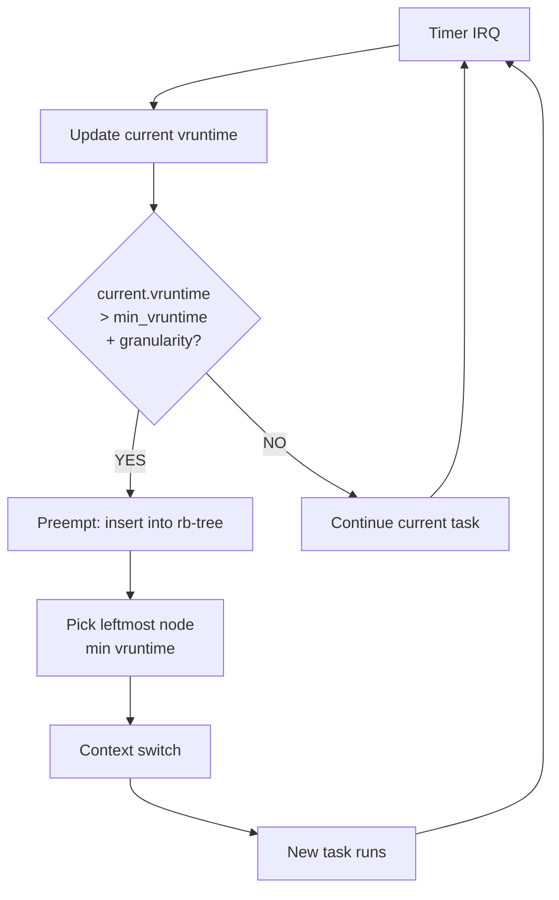
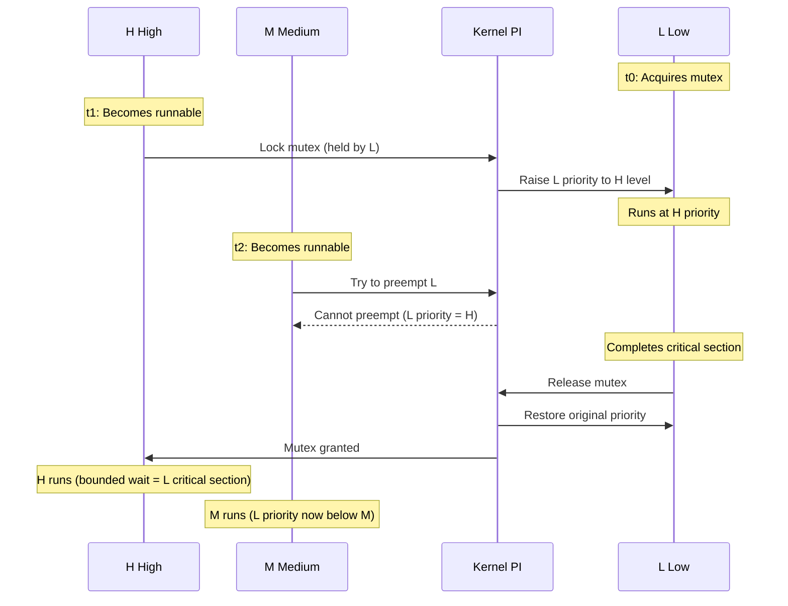

## Keywords in This File
{: .no_toc }

| # | Keyword | Weight |
|---|---|---|
| 10 | [CPU Scheduling Algorithms](#cpu-scheduling-algorithms) | high |
| 11 | [Preemption and Priority Inversion](#preemption-and-priority-inversion) | high |

---

# CPU Scheduling Algorithms

🎯 Interview Weight: High - Asked in every systems programming interview and OS fundamentals screen. Knowing CFS internals separates candidates who used Linux from candidates who understand it.

---

## 📋 Quick Reference

**One-line definition:** The OS algorithm that decides which runnable process or thread occupies the CPU at each scheduling point.

**Difficulty:** ★★☆ | **Asked at:** All | **Seniority:** Mid-Senior

---

### 🎯 Model Answer

**30 seconds:**
> CPU scheduling is the OS mechanism that selects which runnable process or thread runs next on the CPU. The scheduler runs at every quantum expiry, I/O completion, or explicit yield. Linux uses CFS - the Completely Fair Scheduler - which gives each process a proportional share of CPU time using a red-black tree sorted by virtual runtime. The key insight is that "fair" means proportional to weight, not equal in time.

**3 minutes (Senior):**
> CPU scheduling determines system responsiveness and throughput. The classic algorithms - FCFS, SJF, and Round Robin - are interview building blocks, but production systems use far more sophisticated mechanisms. Linux CFS replaced the O(1) scheduler in kernel 2.6.23 by abandoning fixed time quanta. Instead, CFS tracks a "virtual runtime" for each process and always runs the process with the lowest vruntime, guaranteeing that all runnable processes converge to equal CPU time over any window. The vruntime advances at a rate inversely proportional to the process's weight - a `nice -5` process's vruntime advances half as fast as a `nice 0` process, giving it twice the CPU share. Processes are stored in a red-black tree keyed by vruntime, so selecting the next process is O(log n). For real-time workloads, Linux provides `SCHED_FIFO` (cooperative, runs until it blocks or yields) and `SCHED_RR` (preemptive with a real-time quantum), both of which preempt CFS tasks. In production I use `cgroups cpu.shares` and `cpu.cfs_quota_us` to limit container CPU consumption and prevent a runaway container from starving other tenants.

**Framework:** WHAT → WHY → HOW → TRADE-OFF → EXAMPLE

*Adapting up:* Discuss NUMA-aware scheduling, scheduler groups in cgroups v2, and the `schedutil` CPU frequency governor.

*Adapting down:* Define Round Robin and state that Linux uses CFS.

**Blank Mind Recovery:**

**(1) Restate:** "So you are asking about CPU scheduling - what determines which process runs next."

**(2) First principles:** "From first principles: multiple processes compete for a single CPU. The OS needs a policy to decide order and duration. The policy determines response time, throughput, and fairness."

**(3) Bridge:** "Round Robin is the simplest fair scheduler. CFS generalises RR by replacing a fixed quantum with proportional virtual time, which is why it handles mixed workloads better."

---

### 📘 Concept Explanation

**What it is:**
CPU scheduling is the operating system function that selects which process or thread from the run queue gets CPU time next. It runs at each scheduling event: timer interrupt (quantum expiry), blocking system call, explicit yield, or wake-up.

**The problem it solves:**
Without scheduling, a long-running CPU-bound process would monopolise the CPU, making interactive processes unresponsive. Scheduling provides the illusion of concurrent execution on a single CPU, prevents starvation, and enables response time guarantees for interactive and real-time workloads.

**How it works - Classic algorithms:**

```
FCFS (First Come First Served):
  Non-preemptive. Run in arrival order.
  P1(burst=24ms), P2(burst=3ms), P3(burst=3ms)
  P1 runs 24 -> P2 runs 3 -> P3 runs 3
  Avg wait: (0+24+27)/3 = 17ms  CONVOY EFFECT

SJF (Shortest Job First):
  Non-preemptive. Schedule shortest burst.
  P2 runs 3 -> P3 runs 3 -> P1 runs 24
  Avg wait: (6+0+3)/3 = 3ms  OPTIMAL (future knowledge)

Round Robin (RR):
  Preemptive. Each process gets quantum q.
  q=4ms: P1(4)->P2(3)->P3(3)->P1(4)->...
  Good response but context-switch overhead.

MLFQ (Multi-Level Feedback Queue):
  Multiple RR queues with different priorities.
  New jobs enter top queue (high priority, short q).
  If job uses its quantum, it drops to lower queue.
  Adapts: I/O-bound stays high, CPU-bound sinks.
  Used by Windows and macOS schedulers.
```

> **Diagram walkthrough:** This shows four classic scheduling algorithms with concrete process examples. FCFS (top) demonstrates the convoy effect: P1's 24ms burst forces P2 and P3 to wait 24ms each, giving average wait time of 17ms. SJF (second) minimises average wait time to 3ms by running shortest jobs first, at the cost of requiring future knowledge. Round Robin (third) shows interleaving with q=4ms, providing bounded response time at the cost of context switches. MLFQ (bottom) depicts the adaptive queue structure where I/O-bound processes maintain high priority and CPU-bound processes sink. KEY RELATIONSHIP: each algorithm trades off a different objective - FCFS optimises CPU utilisation at the expense of response time; RR optimises response time at the expense of throughput; MLFQ dynamically adapts. EDGE CASE: SJF is provably optimal for average wait time but requires knowing future burst length - in practice, it estimates burst length using exponential averaging of previous bursts. INSIGHT: MLFQ approximates SJF without needing future knowledge - a long-running CPU job naturally sinks to the bottom queue, just as SJF would deprioritise it.

**How Linux CFS works:**

```
CFS (Completely Fair Scheduler) - Linux 2.6.23+:

  Each task has vruntime (virtual runtime, ns).
  vruntime advances at rate:
    actual_time * (1024 / weight)
    weight(nice=0)  = 1024 (reference)
    weight(nice=-5) = 1820 -> 0.56x rate
    weight(nice=+5) = 335  -> 3.05x rate

  Run queue: red-black tree keyed by vruntime.
  Next task = leftmost node (smallest vruntime).
  Selection: O(log n). Insertion: O(log n).

  Scheduling tick:
  1. Add elapsed time to current task vruntime
  2. If vruntime > leftmost + preempt_threshold:
       preempt and reschedule
  3. Else continue running current task
```

> **Diagram walkthrough:** This shows the CFS algorithm's core mechanism. The vruntime formula shows that a `nice -5` process accumulates vruntime 44% slower than a `nice 0` process, giving it proportionally more CPU time. The red-black tree stores all runnable processes; the scheduler always picks the leftmost node (minimum vruntime). KEY RELATIONSHIP: a process that hasn't run accumulates no vruntime, so it is selected preferentially when it becomes runnable - this is CFS's starvation-prevention mechanism. EDGE CASE: when a sleeping task wakes after a long sleep, its vruntime would be far behind the minimum - CFS clamps the wakeup vruntime to `min_vruntime` to prevent this task from monopolising the CPU with accumulated "credit". INSIGHT: the `nice` value maps to a weight ratio, not a fixed time quantum - this means the actual CPU share is stable regardless of the total number of runnable tasks.

**The key insight:**
CFS is fair in proportion to weight, not equal in time. A `nice -5` process gets proportionally more CPU than `nice 0`, and the fairness window converges over any measurement interval regardless of the number of tasks. This is fundamentally different from MLFQ which uses discrete priority levels.

**When to use it:**
Understanding scheduling matters when: diagnosing CPU starvation (nice values, cgroup quotas), building real-time systems (SCHED_FIFO/SCHED_RR), isolating container workloads (cpu.cfs_quota_us), or debugging latency issues caused by scheduling delay.

**When NOT to use it:**
Do not use `SCHED_FIFO` for non-real-time workloads - a `SCHED_FIFO` process that spins without blocking starves all CFS tasks permanently. Do not use a very small nice value (-20) without cgroup isolation - it can starve monitoring, logging, and health check processes.

**Alternatives:**
- MLFQ → Approximates SJF without future knowledge; used in Windows/macOS
- SCHED_FIFO/SCHED_RR → Deterministic real-time; kernel 5.3+ adds SCHED_DEADLINE
- EDF (Earliest Deadline First) → Optimal for real-time; Linux SCHED_DEADLINE implements it

**First-principles derivation:**
Given N tasks sharing one CPU, the OS needs a policy. Equal time slices (RR) are fair but ignore importance differences. Weighted time slices require future knowledge (SJF). CFS resolves this by tracking accumulated CPU time proportional to weight, always running the task that has received the least share. The red-black tree makes the "who received least" query efficient at O(log n).

---

### 💻 Code Example

```java
// BAD: Thread.setPriority() for CPU isolation
// Priority mapping is JVM-version-dependent
Thread t = new Thread(() -> {
    while (true) doWork();
});
t.setPriority(Thread.MAX_PRIORITY); // 10
t.start();
// Java priority 10 -> OS nice ~ -4 on OpenJDK/Linux
// Java priority 1  -> OS nice ~ +4
// Mapping is NOT guaranteed by JVM spec.
// Do NOT rely on this for resource isolation.
```

> **Code walkthrough:** This shows the BAD pattern of using Java thread priority for CPU resource isolation. KEY MECHANISM: Java's `Thread.setPriority(10)` sets a JVM-level hint, which the JVM may translate to an OS nice value, but the mapping is JVM-implementation-dependent and version-specific. WHY IT MATTERS: code that depends on thread priority for resource isolation is non-portable and fragile - the JVM may ignore priorities entirely on some platforms. WHAT BREAKS: on Windows with many threads or on JVMs with their own scheduling, priorities may be ignored; on Linux with OpenJDK, the mapping exists but is undocumented in the JVM spec. TAKEAWAY: never use `Thread.setPriority()` for resource isolation in production; use cgroup `cpu.shares` or Kubernetes resource limits instead.

```java
// GOOD: read scheduling state via /proc
// for production diagnosis
import java.io.*;
import java.nio.file.*;

public class SchedulingDiagnosis {
    /**
     * Read schedstat for a process:
     * Field 1: time on CPU (ns)
     * Field 2: time waiting in run queue (ns)
     * Field 3: number of timeslices run
     */
    public static void printSchedStat(int pid)
            throws IOException {
        String path =
            "/proc/" + pid + "/schedstat";
        String stat = Files.readString(
            Path.of(path)).trim();
        String[] parts = stat.split(" ");
        long cpuTime    = Long.parseLong(parts[0]);
        long waitTime   = Long.parseLong(parts[1]);
        long timeslices = Long.parseLong(parts[2]);
        System.out.printf(
            "PID %d: CPU=%.2fms"
            + " Wait=%.2fms"
            + " Slices=%d RunRatio=%.1f%%%n",
            pid,
            cpuTime / 1e6,
            waitTime / 1e6,
            timeslices,
            100.0 * cpuTime / (cpuTime + waitTime)
        );
    }
}
```

> **Code walkthrough:** This GOOD pattern reads `/proc/PID/schedstat` to get the scheduler's view of CPU time and wait time. KEY MECHANISM: the three fields come directly from kernel per-task scheduling statistics; the wait_time (field 2) is the total nanoseconds the task spent runnable but not scheduled - the diagnostic metric for CPU starvation. WHY IT MATTERS: a process with CPU time 1ms and wait time 50ms has a run ratio of 2%, meaning it spent 98% of its time waiting for CPU even when ready to run; this points to CPU over-commitment, cgroup quota exhaustion, or a competing higher-weight process. WHAT BREAKS: `schedstat` requires `/proc/sys/kernel/sched_schedstats` to be enabled; it defaults to off in some kernels for performance. TAKEAWAY: use `/proc/PID/schedstat` to quantify scheduling latency precisely - it separates "slow because CPU-starved" from "slow because of its own work".

```bash
# Production: diagnose CPU scheduling issues
# List processes with nice value and CPU%
ps -eo pid,ni,pcpu,comm --sort=-pcpu

# Check cgroup CPU quota for a container
# quota / period = fraction of one CPU
cat /sys/fs/cgroup/cpu/docker/<id>/\
cpu.cfs_quota_us
cat /sys/fs/cgroup/cpu/docker/<id>/\
cpu.cfs_period_us

# View scheduling latency
cat /proc/$(pgrep java)/sched | \
  grep -E "nr_switches|wait_sum"

# Set nice value (requires sudo for negative)
sudo renice -n -5 -p <PID>
```

> **Code walkthrough:** These production diagnostic commands expose scheduling state from three angles. KEY MECHANISM: `ps -eo ni` reads the nice value from `/proc/PID/stat` field 19; the cgroup quota commands show the fraction of one CPU the container is allowed (quota_us / period_us); `cat /proc/PID/sched` exposes the task's wait_sum and nr_switches directly from the CFS per-task statistics structure. WHY IT MATTERS: throttled containers show `nr_throttled` rising in `cpu.stat` - if `throttled_time` is increasing, the container is CPU-constrained by its limit, not by host capacity. WHAT BREAKS: `renice` requires `CAP_SYS_NICE` to go negative - containers without this capability cannot lower their nice value, making this approach unreliable in container workloads. TAKEAWAY: always check `cpu.stat throttled_time` and `schedstat wait_time` together when diagnosing CPU-related latency - throttling (cgroup quota) and starvation (nice competition) produce the same symptom but need different fixes.

---

### 🎓 Answers by Seniority

**Junior / Mid (0-5 years):**
> CPU scheduling is the OS algorithm that decides which process runs next on the CPU. Linux uses CFS - the Completely Fair Scheduler. CFS gives each process a proportional share based on its "nice" value. A lower nice value means higher weight and more CPU time. Processes are stored in a red-black tree by virtual runtime; CFS always picks the process with the lowest vruntime.

*Push deeper:* The classic interview algorithms are FCFS, SJF, and Round Robin. FCFS is simple but causes convoy effects. SJF minimises average wait time but requires future knowledge. Round Robin is fair but context-switch-heavy. CFS generalises RR with proportional weights.

---

**Senior / Staff (5+ years):**
> Linux CFS provides proportional fairness across heterogeneous workloads. The core mechanism is vruntime: each process's accumulated CPU time is divided by its weight, and CFS always runs the process with the smallest vruntime. This guarantees all runnable processes converge to their fair share regardless of task count. For containers, cgroup `cpu.cfs_quota_us` adds hard throttling on top of CFS fairness - the container is suspended when its quota is exhausted, visible as `throttled_time` in `/sys/fs/cgroup/cpu/.../cpu.stat`. I've diagnosed several incidents where a service appeared CPU-bound but was actually suspended by the Kubernetes CPU limit.

*Push deeper:* For real-time workloads, `SCHED_DEADLINE` (Linux 3.14+) implements EDF (Earliest Deadline First) with bandwidth reservation. A thread declares its runtime budget per period; the kernel guarantees the budget is met as long as total deadline load stays below CPU capacity. This enables provably bounded latency alongside CFS tasks.

---

### ⚠️ Common Misconceptions

**Misconception 1: "Lower nice value = dedicated CPU time, like a hard limit."**
Reality: nice values set a weight ratio between competing processes, not absolute guarantees. If no other processes compete for CPU, a `nice 0` and `nice -20` process both get 100% of available CPU. The weight ratio only matters when multiple processes are simultaneously runnable.

**Misconception 2: "CFS gives every process equal time slices."**
Reality: CFS does not use fixed time quanta. The scheduling period (typically 6ms) is divided proportionally among runnable tasks based on weights. A `nice -5` process (weight 1820) gets 64% of the period; `nice 0` (weight 1024) gets 36%.

**Misconception 3: "Java thread priorities control CPU usage on Linux."**
Reality: Java thread priorities map inconsistently to OS nice values across JVM versions and platforms. For production CPU isolation, use cgroup limits, not thread priorities.

**Misconception 4: "SCHED_FIFO is safe for any high-priority work."**
Reality: a `SCHED_FIFO` thread that never blocks permanently starves ALL other processes on that CPU core, including kernel threads. Only use `SCHED_FIFO` for threads that yield or block frequently.

**Misconception 5: "More cores = no scheduling problems."**
Reality: with N cores and N+1 runnable threads, exactly one thread still waits. CFS load-balances across cores, but NUMA topology and cache affinity mean migration between cores has a cost - a thread moved to a different NUMA node loses its entire L1/L2 cache warm state.

---

### 🚨 Failure Modes and Diagnosis

**Failure 1: CPU throttling in containers causing latency spikes**

Symptom: service latency spikes at irregular intervals (every ~100ms) even under low CPU load. `top` shows low CPU usage.

Root cause: Kubernetes CPU limit too low. Container exhausts `cfs_quota_us` per period and is suspended for the remainder (throttled), causing request processing pauses.

Diagnosis:
```bash
# Check throttled_time for the container
CGROUP=$(cat /proc/$(pgrep java)/cgroup \
  | grep cpu | cut -d: -f3)
cat /sys/fs/cgroup/cpu${CGROUP}/cpu.stat
# Output:
# nr_periods    12340
# nr_throttled  4892   # 40% of periods: BAD
# throttled_time 489200000  # ~490ms suspended
```

> **Code walkthrough:** This diagnosis script reads the cgroup cpu.stat file to find throttling events. KEY MECHANISM: `nr_throttled` counts periods where the container consumed its entire `cfs_quota_us` and was suspended for the remainder; `throttled_time` accumulates total suspension duration in nanoseconds. WHY IT MATTERS: a `nr_throttled / nr_periods` ratio above 5-10% indicates the CPU limit is too restrictive and is likely causing latency spikes. WHAT BREAKS: simply checking `%CPU` in `top` misses throttling - the container IS using its full quota (100% of allowed CPU) but appears idle during suspension. TAKEAWAY: for CPU-intensive services, check `cpu.stat throttled_time` BEFORE assuming a CPU bottleneck - the fix is raising the CPU limit, not optimising the code.

Fix: increase `resources.limits.cpu` in the Kubernetes pod spec.

**Failure 2: Monitoring/log processes starved by application**

Symptom: health checks fail intermittently; Prometheus metrics stop updating.

Root cause: application process has lower vruntime (ran earlier, consumed more CPU) than monitoring processes. Scheduler favours application in bursts, temporarily starving monitoring.

Diagnosis:
```bash
# Compare vruntime of competing processes
cat /proc/$(pgrep java)/sched | \
  grep -E "vruntime|wait_sum"
cat /proc/$(pgrep prometheus)/sched | \
  grep -E "vruntime|wait_sum"
# Large vruntime gap = one process has CPU
# credit the scheduler is paying back
```

> **Code walkthrough:** Comparing vruntime between competing processes shows scheduling credit imbalances. KEY MECHANISM: if the application has vruntime 50ms and Prometheus has vruntime 500ms, CFS will preferentially run the application for the next ~450ms of wall time to close the gap. WHAT BREAKS: this happens after a Java GC pause - during STW GC, application threads stop, Prometheus continues running and accumulates higher vruntime; when GC ends, CFS runs application threads preferentially to close the vruntime gap. TAKEAWAY: vruntime imbalances are temporary and self-correcting; persistent starvation usually indicates cgroup quota exhaustion or wrong nice values.

Fix: isolate monitoring processes in a separate cgroup with guaranteed CPU shares.

**Failure 3: SCHED_FIFO process hangs the system**

Symptom: machine becomes unresponsive to SSH, keyboard, everything. Only reset resolves it.

Root cause: a `SCHED_FIFO` thread entered a tight loop (bug: missing blocking call). It runs at the highest real-time priority, preempting all CFS tasks including kernel threads.

Fix: `chrt -r -p 0 <PID>` from another real-time thread to reset the scheduling policy. Linux limits real-time CPU consumption to `sysctl kernel.sched_rt_runtime_us` out of `sysctl kernel.sched_rt_period_us` (default: 950ms/1000ms = 95%), reserving 5% for CFS.

---

### 🎯 Interview Deep-Dive

| Category | Count | Coverage |
|---|---|---|
| Conceptual | 3 | CFS mechanism, classic algorithms, vruntime |
| Debugging | 2 | throttling diagnosis, starvation symptoms |
| Trade-off | 2 | CFS vs MLFQ, nice vs cgroup |
| Behavioral | 1 | scheduling incident story |
| Production | 1 | Kubernetes CPU limits |

---

**[JUNIOR] Q1 - [CONCEPTUAL] What is the difference between preemptive and non-preemptive scheduling?**

Non-preemptive (cooperative) scheduling: a process runs until it voluntarily gives up the CPU - either by calling a blocking system call (I/O, sleep), explicitly yielding, or exiting. FCFS and SJF in their basic forms are non-preemptive.

Preemptive scheduling: the OS can interrupt a running process at any time - typically at timer interrupt (every 1-4ms on Linux) - and context-switch to a higher-priority or next-in-queue process. Round Robin and CFS are preemptive.

Why preemptive matters in production: a CPU-bound process that enters an infinite loop cannot monopolise the CPU. Interactive processes (terminals, GUIs) get CPU within one quantum (1-4ms) even if a background process is running. Real-time processes (SCHED_FIFO) can preempt normal CFS processes immediately when they become runnable.

The trade-off: preemption adds overhead. Every context switch saves and restores registers (~1-5 microseconds) and potentially invalidates cache lines. For throughput-maximising batch workloads, larger quanta (less frequent preemption) improve performance; for latency-sensitive interactive workloads, smaller quanta improve response time.

*What separates good from great:* Linux uses adaptive preemption via the `CONFIG_PREEMPT` kernel config option: `PREEMPT_NONE` (no preemption except explicit yield - for server/throughput), `PREEMPT_VOLUNTARY` (preemption at explicit preemption points - desktop default), `PREEMPT_RT` (full real-time preemption - every kernel code path is preemptable, used in industrial control). The choice of kernel preemption model is a compile-time decision that affects every process on the system.

---

**[JUNIOR] Q2 - [CONCEPTUAL] Why does Round Robin have good response time but worse throughput than FCFS?**

Round Robin divides CPU time into fixed quanta (typically 10-100ms). Every process gets a turn within one scheduling period, guaranteeing that no process waits longer than `(n-1) * quantum` milliseconds before its next turn. This bounded wait time gives excellent interactive response time.

The throughput cost: every quantum boundary incurs a context switch (register save/restore, TLB flush, cache pressure). With n=100 processes and q=10ms, there are 10 context switches per second per process = 1000 context switches per second total. At 5 microseconds per context switch, that is 0.5% overhead from switches alone. More importantly, each switch wastes L1/L2 cache - after a switch, the new process must reload its working set.

FCFS has no context switches between processes (each runs to completion). A CPU-bound process that runs for 10 seconds makes zero context switches. This maximises cache reuse and throughput. But the response time for a process that arrives after a long process is terrible - the convoy effect.

The real world: Linux CFS approximates RR with proportional shares. The default `sched_latency_ns` (6ms) is the target scheduling period within which every runnable process gets at least one turn. With more processes, each gets a smaller slice of the 6ms period.

*What separates good from great:* The optimal quantum depends on the workload mix. Too small (1ms) causes excessive context switch overhead. Too large (100ms) causes poor interactive response. Linux dynamically scales the minimum scheduling granularity (`sched_min_granularity_ns`) with the number of runnable processes to maintain O(1) overhead per process regardless of task count.

---

**[MID] Q3 - [MECHANISM] How does CFS maintain fairness without using fixed time quanta?**

CFS maintains fairness through virtual runtime (vruntime): accumulated CPU time normalized by the process's weight.

The mechanism step by step:
1. Each runnable process has a vruntime counter (nanoseconds of CPU time, weighted by priority).
2. When a process runs, its vruntime increases at rate: `delta_real * (1024 / weight)`. A `nice 0` process (weight=1024) has vruntime = real CPU time. A `nice -5` process (weight=1820) has vruntime advance at 56% of real time rate.
3. CFS stores all runnable processes in a red-black tree keyed by vruntime. The leftmost node (minimum vruntime) is cached for O(1) access.
4. The scheduler always runs the process with minimum vruntime (leftmost node).
5. After running for one scheduling period slice, if the current process's vruntime has advanced past another process's vruntime by more than `sched_wakeup_granularity_ns`, the scheduler preempts and switches.

Why this is fair: a process that has not run accumulates no vruntime, so it will be selected preferentially when it becomes runnable. Over any measurement window longer than one scheduling period, CPU shares converge to the weight ratios.

Sleep/wake interaction: when a sleeping process wakes up, its vruntime would be very low. CFS sets its wakeup vruntime to `max(its_saved_vruntime, min_vruntime)`, where `min_vruntime` is the current minimum in the tree. This prevents a long-sleeping process from getting a burst of "credit" that starves other processes.

*What separates good from great:* vruntime is in kernel clock units, not wall clock units. On a NUMA system with variable CPU frequencies (CPUfreq scaling), the relationship between vruntime and actual CPU work depends on the CPU frequency at the time the work was done. The `schedutil` governor (Linux 4.7+) integrates with CFS to dynamically scale CPU frequency based on runqueue depth, connecting the scheduler to CPU power management.

---

**[MID] Q4 - [MECHANISM] What is the Linux scheduling class hierarchy and how does SCHED_FIFO relate to CFS?**

Linux implements scheduling as a hierarchy of scheduling classes, each with fixed priority relative to the others. Higher-priority classes always preempt lower-priority ones.

The hierarchy (highest to lowest):
1. `stop_sched_class` - migration and stop tasks (CPU migration, CPU hotplug)
2. `dl_sched_class` - SCHED_DEADLINE tasks (EDF real-time)
3. `rt_sched_class` - SCHED_FIFO and SCHED_RR tasks (POSIX real-time, priority 1-99)
4. `fair_sched_class` - SCHED_NORMAL and SCHED_BATCH tasks (CFS)
5. `idle_sched_class` - SCHED_IDLE tasks (run only when nothing else is runnable)

At each scheduling point, the kernel checks classes from highest to lowest priority. If a `dl_sched_class` task is runnable, it runs; only if no deadline tasks are runnable does the scheduler check `rt_sched_class`, and so on.

SCHED_FIFO specifics: FIFO tasks within the same static priority level run in FIFO order. A SCHED_FIFO task runs until it blocks on I/O, explicitly yields, or is preempted by a higher-static-priority real-time task. Time spent running is unbounded.

Production implication: any `SCHED_FIFO` thread with priority >= 1 preempts ALL CFS tasks. SCHED_FIFO is used for: audio servers (PulseAudio's real-time thread), network polling in DPDK, and kernel driver interrupt threads.

*What separates good from great:* Linux limits real-time CPU consumption to `sysctl kernel.sched_rt_runtime_us` microseconds out of every `sysctl kernel.sched_rt_period_us` period (default: 950ms/1000ms = 95%). The 5% reservation prevents real-time tasks from completely starving CFS workloads - SSH and the watchdog still get 5% CPU even with a runaway SCHED_FIFO thread.

---

**[MID] Q5 - [TRADE-OFF] When would you choose SCHED_DEADLINE over SCHED_FIFO for real-time workloads?**

SCHED_FIFO and SCHED_DEADLINE address different real-time scheduling problems.

SCHED_FIFO: static priority, runs until blocks or yields. Use when the task must run at the highest possible priority and can guarantee it yields frequently enough. Examples: interrupt handling, audio buffer filling.

SCHED_DEADLINE: declares `(runtime, deadline, period)` per task. The kernel reserves `runtime` nanoseconds out of every `period` nanoseconds, guaranteeing each task runs its full budget before its deadline. Use when the task has a periodic nature with bounded execution time and a hard deadline.

Example: a real-time audio synthesizer must process 10ms of audio every 20ms. With SCHED_FIFO at priority 80, it preempts everything below priority 80 but has no deadline guarantee. With `SCHED_DEADLINE(runtime=8ms, deadline=20ms, period=20ms)`, the kernel guarantees 8ms of CPU every 20ms and schedules it to meet the 20ms deadline.

SCHED_DEADLINE advantage: deterministic bandwidth reservation. The kernel rejects admission if total deadline load exceeds CPU capacity, preventing overcommit. With SCHED_FIFO, there is no admission control.

SCHED_DEADLINE disadvantage: requires accurate runtime estimates. If a task consistently runs longer than its declared runtime, it gets throttled until the next period.

*What separates good from great:* SCHED_DEADLINE implements EDF (Earliest Deadline First). EDF is provably optimal for meeting periodic deadline requirements - it achieves 100% CPU utilisation for feasible deadline sets, while SCHED_FIFO (Rate Monotonic Scheduling-style) achieves only ~69% utilisation for harmonic task sets. For complex real-time systems with multiple periodic tasks, EDF is theoretically and practically superior to static-priority scheduling.

---

**[SENIOR] Q6 - [DEBUGGING] A production Java service has high P99 latency but low CPU usage. How do you determine if scheduling is the cause?**

Step 1 - Distinguish CPU idle from CPU throttled:
```bash
# Check if container is being throttled by cgroup
CGROUP=$(cat /proc/$(pgrep java)/cgroup \
  | grep '^[0-9]*:cpu' | head -1 \
  | cut -d: -f3)
cat /sys/fs/cgroup/cpu${CGROUP}/cpu.stat
# nr_throttled > 0 AND throttled_time > 0
# = container hitting its CPU quota
```

> **Code walkthrough:** This reads cgroup cpu.stat to determine if the service's P99 latency is caused by CPU quota throttling rather than actual CPU demand. KEY MECHANISM: when a container exhausts `cfs_quota_us` in a period, the kernel's CFS bandwidth controller suspends the container until the next period starts - this appears as low CPU usage (the container IS idle during suspension) while causing visible request latency. WHY IT MATTERS: without this check, operators often assume the service needs code optimisation when the real fix is raising the Kubernetes CPU limit. WHAT BREAKS: in containers without cgroup CPU limits (no Kubernetes resource limits set), `cpu.cfs_quota_us` will be -1 and throttling cannot occur. TAKEAWAY: always check `cpu.stat` before blaming application code for high latency under low CPU.

Step 2 - Check scheduling wait time (run queue latency):
```bash
# schedstat: [cpu_time_ns wait_time_ns slices]
awk '{
  printf "CPU: %.1fms Wait: %.1fms"
         " Ratio: %.1f%%\n",
  $1/1e6, $2/1e6, 100*$1/($1+$2)
}' /proc/$(pgrep java)/schedstat
```

> **Code walkthrough:** This computes the run queue latency ratio from `/proc/PID/schedstat`. KEY MECHANISM: the wait_time field counts nanoseconds spent runnable but not scheduled - pure scheduling overhead, not I/O or lock wait. A CPU:Wait ratio of 50:50 means the process waits as long as it executes. WHY IT MATTERS: a `nice 0` application competing with a `nice -10` system process will show high wait_time even without throttling. WHAT BREAKS: schedstat values are cumulative since process start; compute deltas between two samples 10 seconds apart to get the current rate. TAKEAWAY: `schedstat wait_time / (cpu_time + wait_time)` is the scheduling overhead ratio; above 20% for a latency-sensitive service warrants investigation.

Step 3 - If throttling and wait time are both low, use `perf sched latency` to examine per-thread maximum scheduling latency and the function that delayed the wake-up.

*What separates good from great:* Distinguishing "scheduling delay" (process was runnable but no CPU available) from "I/O wait" (process blocked waiting for a system call). Both appear as low CPU in `top`. `schedstat wait_time` measures only scheduling delay; `strace -c` counts blocking system calls. The fix is different: scheduling delay needs CPU increase; I/O wait needs async I/O or database optimisation.

---

**[SENIOR] Q7 - [TRADE-OFF] What is the cost of setting all containers to high CPU priority on a shared host?**

Setting all containers to `nice -10` is equivalent to setting all of them to `nice 0` - it cancels out. The nice/vruntime mechanism is relative: if process A has weight 1820 (nice -5) and process B also has weight 1820 (nice -5), CFS gives them equal CPU. Priority only matters in context of competing processes with DIFFERENT weights.

Real risks of aggressive nice values on shared hosts:

1. Monitoring and health check starvation: if an application container is `nice -10` but the Prometheus node exporter runs at `nice 0`, the exporter is significantly deprioritised. On a CPU-saturated host, health checks time out, the orchestrator marks the instance unhealthy, and traffic is redirected - making the load problem worse.

2. Kernel thread starvation (rare but catastrophic): kernel worker threads (kworker, ksoftirqd) run at CFS priority. A cluster of `nice -15` application threads can starve kernel I/O completion handlers, causing network stack hangs even though the application appears CPU-busy.

3. Neighbour container effects: on Kubernetes, all pods on the same node share the same CFS run queue. Pod A with `nice -10` steals CPU from all other pods on the node, not just pods in the same namespace.

Better approach: use Kubernetes `resources.requests.cpu` for scheduling priority (higher requests = priority scheduling on less-loaded nodes) and `resources.limits.cpu` for hard enforcement via cgroup quotas.

*What separates good from great:* The CFS group scheduling feature (enabled in most production kernels) adds a hierarchy: cgroup-level vruntime accounting means containers in different cgroups compete at the cgroup level first, then within each cgroup. This means a `nice -10` thread inside a low-priority cgroup can be beaten by a `nice 0` thread in a high-priority cgroup. Understanding group scheduling vs flat scheduling is the difference between correctly reasoning about Kubernetes CPU resource management and being confused by why nice values don't work as expected.

---

**[SENIOR] Q8 - [BEHAVIORAL] Describe a scheduling-related production incident you diagnosed.**

Production incident: Java microservice with inconsistent P95 latency (usually 5ms, occasionally spiking to 150ms every ~100ms). No visible errors in logs. CPU usage at 40%.

Initial hypothesis: GC pause. Checked GC logs with `-Xlog:gc*` - GC pauses were 2-4ms, not 150ms.

Second hypothesis: I/O wait. Checked `iostat -x 1` - disk I/O under 10% utilization.

Breakthrough: checked Kubernetes pod resource spec. `resources.limits.cpu: "500m"` - half a CPU. The service handled 1000 RPS with average CPU time 0.4ms/request = 400ms CPU per second = 0.4 CPU. Just under the limit in steady state, but request bursts pushed it over 0.5 CPU for 100ms periods.

Confirmation: `cat /sys/fs/cgroup/cpu/.../cpu.stat` showed `nr_throttled` incrementing at ~10/second, `throttled_time` growing at ~50ms/second - exactly matching the 150ms latency spikes on the periodic 100ms CFS quota window.

Fix: raised `resources.limits.cpu` to `"1000m"` (1 full CPU). P95 latency immediately dropped to consistent 6ms.

Lesson: CPU throttling is invisible in process-level CPU metrics. The container appears to be using 40% CPU because it IS only using 40% of the host's CPU - but it is allowed 50% of ONE CPU (500m) and bursting above that. Diagnosis required cgroup stats, not process stats.

*What separates good from great:* The reason CPU throttling creates periodic latency spikes (not random spikes) is the CFS bandwidth controller's period-based enforcement. The period is `cfs_period_us` (default 100ms). The quota resets every 100ms. When a burst exhausts the quota mid-period, the container is suspended until the period resets - exactly 100ms from the period start. This 100ms periodicity is the tell that separates cgroup throttling from random scheduling noise.

---

**[STAFF] Q9 - [DESIGN] How would you design a multi-tenant CPU scheduling framework for a cloud platform?**

A multi-tenant scheduler must provide: fair-share isolation between tenants, SLA guarantees for premium tiers, and efficient utilisation.

Hierarchy design:
- Tenant level: each tenant gets a cgroup with guaranteed `cpu.shares` proportional to their subscription tier. Premium tenants get 2x shares; standard get 1x.
- Service level within tenant: each service is a sub-cgroup with its own quota and shares for isolation within the tenant.
- Spot/preemptible tier: `SCHED_IDLE` policy - runs only when no other work is present; immediately preempted when billed work arrives.

Reservation vs burst model:
- Reserve `cpu.shares` for fairness at overcommit
- Use `cpu.cfs_quota_us` to enforce hard limits for predictable latency SLAs
- Allow `cpu.cfs_burst_us` (Linux 5.14+) for temporary quota bursts to handle request spikes

Admission control: track total `cfs_quota_us` across all pods per CPU. Reject new pods if total quota would exceed 95% of CPU capacity (leaving headroom for kernel and monitoring).

Observability: aggregate `throttled_time` and `nr_throttled` per tenant per minute via eBPF programs attached to CFS bandwidth control tracepoints. Alert tenants when throttling exceeds 1% of periods.

*What separates good from great:* The fundamental tension in multi-tenant scheduling: burst capacity vs isolation. With strict per-tenant quotas, tenants get predictable performance but cannot burst above their limit even when capacity is available. With shares-only scheduling, tenants can burst freely but can starve each other under load. AWS EC2's T-instance credit model is a middle ground: unused quota accumulates as credits, allowing short bursts that "borrow" future quota. This requires per-tenant credit accounting and careful credit replenishment rate design to prevent infinite burst capacity accumulation.

---

### ⚖️ Comparison Table

| Scheduler | Fairness | Response Time | Throughput | Production Use |
|---|---|---|---|---|
| **CFS (Linux default)** | Proportional to weight | 1-4ms | High | Linux 2.6.23+, all containers |
| MLFQ | Approximates SJF | Good for I/O-bound | High | Windows NT, macOS XNU, FreeBSD |
| Round Robin | Equal time slices | Bounded by n*quantum | Medium | Classic OS teaching, embedded RTOS |
| SCHED_FIFO | None (RT preempts all) | Microseconds for RT | Max for RT task | Audio, DPDK, kernel driver threads |
| SCHED_DEADLINE | EDF bandwidth | Guaranteed per task | Optimal for RT sets | Industrial control, automotive |
| FCFS | FIFO | Unbounded | High | Batch workloads, simple embedded |

**The deciding factor:**
For interactive/server workloads: CFS with cgroup quotas. For periodic real-time tasks with hard deadlines: SCHED_DEADLINE. For hard real-time with static priorities: SCHED_FIFO. For batch/background: SCHED_IDLE (`nice 19` or `ionice idle`).

---

### 🏛️ System Design

*(Omit: ★★☆ keyword - system design section is reserved for ★★★ expert-level architecture topics)*

---

### 📊 Diagram

CFS scheduling decision flow from timer interrupt through vruntime comparison to context switch or continue.

```
CFS SCHEDULING DECISION (Timer Interrupt)
==========================================
[Timer IRQ]
     |
     v
[Update current
 task's vruntime]
     |
     v
current.vruntime             YES   [Preempt: add to
> min_vruntime +  ---------->      rb-tree, pick
  granularity?                     leftmost node]
     |                                  |
     NO                                 v
     |                            [Context switch
     |<---------------------------to new task]
     v
[Continue running
 current task]
(next timer IRQ)
```
> **Diagram walkthrough:** This ASCII flowchart depicts the CFS scheduling decision triggered on every timer IRQ. Read top to bottom: vruntime is updated for the current task, then compared against the minimum vruntime in the run queue plus the preemption granularity threshold. If the task has consumed its proportional share, it is inserted back into the red-black tree and the leftmost node (minimum vruntime) is scheduled next; otherwise the current task continues. KEY RELATIONSHIP: the preemption check is what drives CFS fairness - it ensures no single task runs past its proportional window.

The CFS run queue stores all runnable processes in a red-black tree sorted by vruntime, with the next-to-run task always at the leftmost position.



> **Diagram walkthrough:** This shows the CFS scheduling decision loop triggered on every timer interrupt. Read the flow top to bottom: every timer IRQ first updates the current task's vruntime by adding elapsed real time multiplied by the weight normalisation factor. The decision diamond checks whether the current task's vruntime has advanced past the minimum in the run queue by more than the preemption threshold (sched_min_granularity_ns). KEY RELATIONSHIP: if yes, the task is preempted - it is inserted back into the red-black tree at its current vruntime, and the leftmost node (next minimum vruntime task) is selected for a context switch. EDGE CASE: if the run queue has only one task, it always passes the check (min_vruntime = its own vruntime) and never preempts - the single task runs until it blocks voluntarily. INSIGHT: the preemption threshold prevents pathological thrashing where tasks with nearly equal vruntime constantly switch; the granularity threshold ensures a task runs for at least a minimum slice before being eligible for preemption.

---

---

# Preemption and Priority Inversion

🎯 Interview Weight: High - A classic senior/staff systems question. The Mars Pathfinder incident (1997) made this famous. Every systems programmer should explain priority inversion, priority inheritance, and prevention strategies.

---

## 📋 Quick Reference

**One-line definition:** Priority inversion is when a high-priority task is indirectly blocked by a low-priority task that holds a resource the high-priority task needs, while a medium-priority task preempts the low-priority task in between.

**Difficulty:** ★★☆ | **Asked at:** FAANG, Mid-size | **Seniority:** Senior

---

### 🎯 Model Answer

**30 seconds:**
> Priority inversion occurs when a high-priority task is blocked waiting for a resource held by a low-priority task, and a medium-priority task preempts the low-priority task before it releases the resource. The high-priority task effectively runs at the low-priority task's priority. The solution is priority inheritance: the OS temporarily raises the low-priority task's priority to match the highest-priority task waiting for its resource, preventing medium-priority tasks from preempting it.

**3 minutes (Senior):**
> Priority inversion violates the fundamental assumption of priority-based scheduling: that a high-priority task can always preempt a lower-priority task. The three-task scenario: task H (high priority) needs mutex M; task L (low priority) holds mutex M; before L can release M, task M (medium priority) preempts L. Now H waits for M, M runs freely, and L cannot release M because M preempts it. H is blocked by M - a lower-priority task. The canonical example is the Mars Pathfinder spacecraft in 1997. The bus manager (high priority) was blocked on a mutex held by the meteorology task (low priority), and the communications task (medium priority) kept preempting the meteorology task. The watchdog timer detected the bus manager had not run within its deadline and reset the spacecraft. NASA engineers diagnosed it remotely and enabled priority inheritance in the VxWorks RTOS. The OS-level fix is priority inheritance: when L holds a mutex that H is waiting for, the kernel temporarily elevates L's priority to H's level so M cannot preempt L. L runs at H's priority, releases the mutex, H proceeds, L's priority drops back. An alternative is priority ceiling protocol: every mutex has a declared ceiling equal to the highest priority of any task that will ever lock it; on acquisition, the task's priority is immediately raised to the ceiling.

**Framework:** WHAT → WHY → HOW → TRADE-OFF → EXAMPLE

*Adapting up:* Discuss POSIX priority inheritance (`PTHREAD_PRIO_INHERIT`), priority ceiling (`PTHREAD_PRIO_PROTECT`), and the kernel's PI-futex implementation.

*Adapting down:* Explain the three-task scenario and state that priority inheritance is the fix.

**Blank Mind Recovery:**

**(1) Restate:** "So priority inversion is about high-priority tasks being unexpectedly blocked - let me think through how that happens."

**(2) First principles:** "A high-priority task must be able to preempt lower-priority tasks. Priority inversion is when something prevents that. The only thing that can prevent it is blocking on a shared resource."

**(3) Bridge:** "This is similar to deadlock, but instead of a cycle, it is a chain: H waits for L's lock, M preempts L. H appears deadlocked with M but they share no resource directly."

---

### 📘 Concept Explanation

**What it is:**
Priority inversion is a scheduling anomaly where a high-priority task is indirectly delayed by a medium-priority task due to a shared resource (typically a mutex) held by a low-priority task.

**The problem it solves:**
Understanding priority inversion is necessary to correctly design real-time systems, embedded software, and any system that mixes high-priority and low-priority threads sharing mutexes. Without mitigation, real-time guarantees are violated silently.

**How it works - The three-task scenario:**

```
PRIORITY INVERSION TIMELINE:
==============================
Time  H (high)      M (mid)       L (low)
 t0                               L acquires mutex
 t1   H runs,
      tries mutex -> BLOCKED
 t2                 M runnable,
                    preempts L
 t3                 M runs...     L waiting
 t4                 M runs...     L waiting
 t5   H still BLOCKED             L finally runs
 t6                               L releases mutex
 t7   H acquires mutex, runs

H blocked from t1 to t7 because M preempts L.
H's effective priority = L's priority.
```

> **Diagram walkthrough:** This timeline shows the three phases of priority inversion. At t0, low-priority L acquires mutex (fine so far). At t1, H preempts L but immediately blocks on the mutex - correct behaviour. At t2-t5, medium-priority M preempts L (because L has low priority, unrelated to the mutex) and runs freely while H remains blocked. KEY RELATIONSHIP: H cannot run because it needs the mutex; L holds the mutex but cannot run because M preempts it; H's effective priority has become L's priority via the mutex dependency chain. EDGE CASE: with N medium-priority tasks all preempting L, H can be delayed indefinitely - this unbounded priority inversion caused the Mars Pathfinder resets. INSIGHT: priority inversion requires three tasks at three different priority levels; a two-task system (H waits for L) cannot invert priority since there is no third task to preempt L.

**Priority inheritance solution:**

```
PRIORITY INHERITANCE TIMELINE:
================================
Time  H (high)      M (mid)       L (low*)
 t0                               L acquires mutex
 t1   H blocks on mutex
      Kernel: raise L to H's priority
 t2                 M runnable,
                    tries to preempt L
 t3                 CANNOT preempt  L* runs at
                    (L* priority     H priority
                    = H priority)
 t4                               L* releases mutex
                                  L priority restored
 t5   H acquires mutex, runs
 t6                 M now runs
                    (L priority
                    now below M)

H's wait = L's critical section length (bounded).
```

> **Diagram walkthrough:** Priority inheritance fixes inversion by dynamically elevating L's priority when H blocks on L's mutex. Read the key change at t2-t3: M cannot preempt L because the kernel raised L's priority to H's level. L holds the mutex at H's effective priority, completing its critical section without interruption. KEY RELATIONSHIP: H's maximum blocking time is now bounded by L's critical section length, not by L's total remaining runtime - this converts unbounded inversion to bounded inversion. EDGE CASE: chained priority inheritance - if L is also waiting for another mutex held by LL, the kernel must propagate H's priority through the chain. Linux's PI-futex handles up to 48 levels of inheritance chains. INSIGHT: priority ceiling protocol avoids chains entirely by pre-raising priority on mutex acquisition, at the cost of requiring accurate priority ceiling declarations for every mutex.

**The key insight:**
Priority inversion is not a bug in specific code - it is an emergent behavior of combining priority-based scheduling with shared mutable resources. Every system that has both priority-differentiated tasks AND shared locks is vulnerable. The fix (priority inheritance) is at the OS/mutex layer, not the application layer.

**When to use it:**
Priority inheritance (`PTHREAD_PRIO_INHERIT`) should be used when: mixing real-time and non-real-time threads sharing mutexes; implementing any system with priority-based scheduling classes; writing OS kernels or RTOS applications.

**When NOT to use it:**
Priority ceiling (`PTHREAD_PRIO_PROTECT`) is preferable when you know in advance the maximum priority of any task that will lock a given mutex - it has lower overhead (no priority propagation chain) but requires explicit ceiling declaration. Do not use priority inheritance when the lock hierarchy is unknown or dynamic.

**Alternatives:**
- Priority ceiling protocol → Pre-raise priority on acquisition; eliminates chains but requires static ceiling values
- Lock-free algorithms → Eliminate mutexes entirely; no shared mutable state = no inversion possible
- Dedicated high-priority worker → Have the lock holder run at high priority always

**First-principles derivation:**
Priority scheduling assumes H always preempts L. This invariant breaks when H needs something L has. The only way to restore the invariant is to temporarily make L as important as H (priority inheritance) or to prevent any preemption during lock holding (priority ceiling). Both sacrifice some scheduling flexibility for correctness.

---

### 💻 Code Example

```c
// BAD: default pthread mutex allows inversion
#include <pthread.h>

pthread_mutex_t shared_lock =
    PTHREAD_MUTEX_INITIALIZER;

void* high_priority_task(void* arg) {
    // H blocks here if L holds the lock and
    // M preempts L -> PRIORITY INVERSION
    pthread_mutex_lock(&shared_lock);
    critical_section();
    pthread_mutex_unlock(&shared_lock);
    return NULL;
}
// PTHREAD_MUTEX_INITIALIZER creates a mutex
// with PTHREAD_PRIO_NONE (no PI).
// Inversion is possible when priority-
// differentiated threads share this lock.
```

> **Code walkthrough:** This BAD pattern uses the default mutex initialization which provides no priority inheritance protection. KEY MECHANISM: `PTHREAD_MUTEX_INITIALIZER` creates a `PTHREAD_MUTEX_DEFAULT` type with `PTHREAD_PRIO_NONE` protocol - when a high-priority thread blocks on this mutex, the kernel does not raise the lock holder's priority, leaving the system vulnerable to priority inversion. WHY IT MATTERS: this is the default for most POSIX code, meaning priority inversion is the default behavior unless explicitly opted into protection. WHAT BREAKS: on a loaded embedded system with three priority levels (SCHED_FIFO 90/50/10), the watchdog (priority 90) can wait indefinitely for a lock held by a low-priority task that medium-priority tasks continuously preempt - exactly the Mars Pathfinder scenario. TAKEAWAY: any code that combines `SCHED_FIFO`/`SCHED_RR` threads with shared mutexes MUST use `PTHREAD_PRIO_INHERIT` or `PTHREAD_PRIO_PROTECT` mutexes.

```c
// GOOD: priority inheritance mutex
#include <pthread.h>

pthread_mutex_t pi_lock;

void init_pi_mutex(void) {
    pthread_mutexattr_t attr;
    pthread_mutexattr_init(&attr);

    // Enable priority inheritance protocol
    pthread_mutexattr_setprotocol(
        &attr,
        PTHREAD_PRIO_INHERIT  // the fix
    );
    // Error detection type (optional but useful)
    pthread_mutexattr_settype(
        &attr,
        PTHREAD_MUTEX_ERRORCHECK
    );

    pthread_mutex_init(&pi_lock, &attr);
    pthread_mutexattr_destroy(&attr);
}

// When H blocks on pi_lock held by L:
// - Kernel records: pi_lock.owner = L,
//                  pi_lock.waiters = {H}
// - Kernel elevates L's priority to H's level
// - L cannot be preempted by medium tasks
// - L releases lock
// - L's priority drops back to original
// - H acquires lock and runs
```

> **Code walkthrough:** This GOOD pattern creates a pthread mutex with `PTHREAD_PRIO_INHERIT` protocol, enabling the kernel's priority inheritance mechanism. KEY MECHANISM: `pthread_mutexattr_setprotocol(PTHREAD_PRIO_INHERIT)` sets the mutex protocol attribute; when a higher-priority thread blocks, `pthread_mutex_lock()` calls the kernel's PI-futex interface which propagates the blocking thread's priority to the lock holder via `task_struct.pi_blocked_on` linked list. WHY IT MATTERS: this single attribute change converts an inversion-prone mutex into an inversion-safe one with bounded blocking time equal to the critical section length. WHAT BREAKS: priority inheritance adds overhead per lock acquisition because the kernel must check and potentially update priority chains; for locks never contended between different-priority threads, this overhead is unnecessary. TAKEAWAY: use `PTHREAD_PRIO_INHERIT` for any mutex shared between threads of different scheduling priority classes.

```java
// Java: no direct PI control available.
// ReentrantLock fair mode limits starvation.
// Lock-free is the best Java mitigation.
import java.util.concurrent.atomic.AtomicReference;
import java.util.concurrent.locks.ReentrantLock;

// Fair lock: threads acquire in FIFO order,
// preventing starvation (but not full PI)
private final ReentrantLock lock =
    new ReentrantLock(true); // fair=true

// BETTER for Java: use lock-free CAS
// to eliminate mutex entirely
private final AtomicReference<State> state =
    new AtomicReference<>(State.IDLE);

// CAS avoids mutexes -> no inversion possible
boolean tryTransition(State from, State to) {
    return state.compareAndSet(from, to);
}

// synchronized has no priority control:
synchronized void badMethod() {
    // Any thread can acquire regardless
    // of Java thread priority
    criticalSection();
}
```

> **Code walkthrough:** This Java example shows the best available priority inversion mitigation in the JVM. KEY MECHANISM: Java's `ReentrantLock(fair=true)` uses an AQS FIFO waiting queue - threads acquire in arrival order, preventing a late-arriving lower-priority thread from jumping ahead. However, Java does NOT provide true POSIX priority inheritance because JVM thread priorities do not map reliably to OS RT priorities. WHY IT MATTERS: for critical JVM services, the most effective inversion mitigation is using lock-free data structures (AtomicReference, ConcurrentHashMap, lock-free queues) to eliminate mutex contention entirely - no mutex = no inversion. WHAT BREAKS: `ReentrantLock(fair=true)` reduces throughput by 20-40% compared to unfair mode because every acquisition requires an ordered queue check; only use it when fairness semantics are actually required. TAKEAWAY: in the JVM, prefer lock-free algorithms over fair locks for performance; if you need true real-time priority scheduling, use JNI with POSIX PI mutexes.

---

### 🎓 Answers by Seniority

**Junior / Mid (0-5 years):**
> Priority inversion happens when a high-priority task can't run because it's waiting for a lock held by a low-priority task, and a medium-priority task preempts the low-priority task in between. The high-priority task ends up waiting even though it should have precedence. The fix is priority inheritance: temporarily raise the lock holder's priority to the waiting task's level so nothing can interrupt it before releasing the lock.

*Push deeper:* The classic example is the Mars Pathfinder spacecraft (1997). It kept resetting because a high-priority thread (bus manager) was blocked on a mutex held by a low-priority task (meteorology data), and a medium-priority task (communications) kept preempting the low-priority task. Priority inheritance was available in the VxWorks RTOS but had been disabled to save resources.

---

**Senior / Staff (5+ years):**
> Priority inversion violates the real-time guarantee that a high-priority task can preempt a low-priority task. It occurs in the three-task scenario: H blocks on a mutex held by L; M preempts L (because L has low priority, not because of the mutex). H's effective priority becomes L's priority, bounded only by how long M decides to run - potentially indefinitely. The OS-level fix is priority inheritance (`PTHREAD_PRIO_INHERIT`): the kernel elevates L's priority to H's level when H blocks on L's mutex, preventing M from preempting L. Linux implements this via PI-futex with recursive priority propagation through `task_struct.pi_blocked_on` chains up to 48 levels deep. The alternative is priority ceiling (`PTHREAD_PRIO_PROTECT`): pre-declare the maximum priority that will ever lock a mutex, and raise to that ceiling on acquisition - eliminating chains at the cost of static ceiling declarations.

*Push deeper:* The Linux kernel's own locking infrastructure uses PI mutexes (`rt_mutex`) for kernel real-time locking. All `struct mutex` objects in the PREEMPT_RT kernel patch are actually `rt_mutex` with priority inheritance. This demonstrates that even kernel code at the lowest level needs priority inheritance to maintain real-time guarantees.

---

### ⚠️ Common Misconceptions

**Misconception 1: "Priority inversion is a deadlock."**
Reality: priority inversion is not a deadlock. In a deadlock, a cycle exists in the lock dependency graph - no task can proceed. In priority inversion, the tasks CAN proceed (L will eventually run and release the mutex), just not as quickly as their priority implies. The system makes progress; it just violates the priority ordering.

**Misconception 2: "Priority inheritance makes real-time systems safe from inversion."**
Reality: priority inheritance converts unbounded inversion to bounded inversion. The high-priority task still waits - for the duration of the critical section of the low-priority task. If that critical section is long (file I/O, network call), the high-priority task may still miss its deadline. Priority inheritance guarantees the wait is bounded by the critical section, but it does not eliminate the wait.

**Misconception 3: "Only RTOS/embedded systems have priority inversion."**
Reality: any system with priority-differentiated threads and shared mutexes can experience priority inversion. Java thread pools with different priorities sharing `synchronized` blocks; Linux services using SCHED_FIFO; even kernel threads sharing spinlocks. Priority inversion in production Linux services is common and rarely diagnosed correctly.

**Misconception 4: "Using a higher nice value for the low-priority task prevents inversion."**
Reality: nice values set CPU scheduling weight, not mutex priority. When a low-priority task holds a mutex, making the scheduler favour or disfavour it does not change the mutex ownership. Only priority inheritance (changing the effective scheduling priority based on mutex dependency) addresses inversion.

**Misconception 5: "Lock-free data structures eliminate all real-time synchronisation issues."**
Reality: lock-free algorithms eliminate mutex-based priority inversion but can cause livelock (tasks retry forever without progress under contention) and CAS operations can fail repeatedly under high contention, causing high-priority tasks to spin - a different form of unpredictable latency.

---

### 🚨 Failure Modes and Diagnosis

**Failure 1: Watchdog timeout caused by priority inversion (Mars Pathfinder pattern)**

Symptom: periodic system resets or watchdog timeouts in an embedded/real-time system. The system appears to be running but specific high-priority operations miss their deadlines.

Mechanism: a watchdog task at the highest priority periodically acquires a mutex to record a heartbeat. A low-priority data collection task holds this mutex for longer than expected. A medium-priority task continuously preempts the low-priority task. Watchdog misses its deadline, fires.

Diagnosis:
```bash
# Enable kernel tracing of rt_mutex events
echo 1 > /sys/kernel/debug/tracing/events/\
rtmutex/enable
cat /sys/kernel/debug/tracing/trace_pipe
# Look for: rtmutex_lock_blocked events
# showing which task blocks which task
```

> **Code walkthrough:** This enables kernel tracing of rt_mutex events to expose priority inversion chains. KEY MECHANISM: the `rtmutex` tracepoints record when a task blocks on a PI mutex (`rtmutex_lock_blocked`) and when priority inheritance occurs (`rtmutex_pi_entry`) - the trace shows both the blocking task and the lock holder whose priority is raised. WHY IT MATTERS: without this tracing, priority inversion appears as a random delay or timeout with no obvious cause in application logs. WHAT BREAKS: ftrace tracing has overhead (~5-10% CPU) and fills the trace buffer quickly on a loaded system; use a brief trace window (5-10 seconds) and filter by specific events. TAKEAWAY: `ftrace` with rtmutex events is the definitive Linux tool for diagnosing priority inversion - it shows exact task chains and priority propagation.

Fix: add `PTHREAD_PRIO_INHERIT` to the shared mutex; alternatively, replace the mutex with a lock-free data structure.

**Failure 2: Java service with intermittent high latency under load**

Symptom: a high-priority request handler (health check endpoint) shows intermittent 200ms+ response time under load, while regular requests process in <10ms.

Root cause: `synchronized` method shared between a high-priority health check thread and multiple low-priority request processing threads. Under load, a request thread holds the lock when the health check thread arrives. Other request threads continue to run before the lock holder completes.

Diagnosis:
```bash
# jstack shows BLOCKED threads with holder
jstack <PID> 2>&1 | grep -A5 "BLOCKED"
# Look for: waiting to lock <addr> (held by <thread>)
# Also: enable lock contention profiling
java -XX:+UnlockDiagnosticVMOptions \
     -XX:+PrintVMOptions \
     -jar service.jar
```

> **Code walkthrough:** `jstack` reads the JVM's safepoint-consistent thread dump including lock ownership and waiting state; a thread in `BLOCKED (on object monitor)` state is waiting for a Java synchronized lock. KEY MECHANISM: the thread dump shows both the blocked thread and the thread holding the lock, identifying the exact `synchronized` method causing contention. WHY IT MATTERS: identifying the specific method and lock allows targeted refactoring - replacing the synchronized block with a lock-free alternative or moving the shared data to a lock-free cache. WHAT BREAKS: `jstack` requires the JVM to reach a safepoint (brief STW pause) which can take 10-100ms on a loaded JVM; use it for initial diagnosis, then switch to Async-Profiler with `-e lock` for production monitoring. TAKEAWAY: use `jstack` for initial lock contention diagnosis; the output directly identifies the holding thread and blocked threads.

Fix: replace the synchronized resource with a lock-free `ConcurrentHashMap` or `AtomicReference`; move health check state to a separate non-shared `AtomicLong`.

**Failure 3: SCHED_FIFO thread causes system-wide hang**

Symptom: system becomes unresponsive. SSH connections hang. Recovery requires physical reset.

Root cause: a `SCHED_FIFO` thread in a tight spin loop (missing blocking call or yield). It preempts all CFS tasks including kernel threads.

Prevention: always add `sched_yield()` or blocking calls in SCHED_FIFO threads; never run SCHED_FIFO without a watchdog that can intervene from a higher-priority context. Linux's `sysctl kernel.sched_rt_runtime_us` (default 950000 = 95% of each period) reserves 5% for CFS as a safety net.

---

### 🎯 Interview Deep-Dive

| Category | Count | Coverage |
|---|---|---|
| Conceptual | 3 | inversion definition, three-task scenario, Mars Pathfinder |
| Mechanism | 2 | PI and priority ceiling internals |
| Debugging | 2 | diagnosis commands, real-time system analysis |
| Trade-off | 1 | PI vs ceiling vs lock-free |
| Behavioral | 1 | incident involving synchronisation issue |

---

**[JUNIOR] Q1 - [CONCEPTUAL] Explain the three-task priority inversion scenario.**

Priority inversion requires exactly three tasks at three distinct priority levels, plus a shared mutex. Call them H (high), M (medium), and L (low).

The sequence that creates inversion:
1. L runs and acquires mutex M (nothing wrong yet).
2. H becomes runnable. H tries to acquire mutex M. H BLOCKS because L holds it. L runs.
3. M becomes runnable. M preempts L (because L has low priority, and M has medium priority).
4. M runs freely. L cannot run (preempted by M). H cannot run (blocked on M held by L).
5. H is effectively running at L's priority, blocked behind M.

The inversion: H should be able to preempt M (H > M in priority). But H cannot run because it depends on L's lock, and M preempts L. The priority relationship between H and M is effectively inverted.

Why this matters: in a real-time system, H might be a critical control task that must respond within 1ms. L might be a data logging task running a long operation. M might be a communication task. H blocks for as long as M decides to run - which could be seconds in a pathological case. The real-time guarantee is violated.

The fix is simple: when H blocks on M held by L, temporarily raise L's effective priority to H's level. Now M cannot preempt L. L completes quickly. H acquires M. Priorities return to normal. This is priority inheritance.

*What separates good from great:* The "three" in "three-task scenario" is the minimum. Real systems have dozens of priority levels with multiple tasks at each. Priority inversion can propagate through a chain: H waits for L which waits for LL which waits for LLL. Each link in the chain is another opportunity for medium-priority tasks to delay the chain. Linux's PI-futex handles this by recursively propagating priority inheritance through `task_struct.pi_blocked_on` chain links, up to `MAX_LOCK_DEPTH` (default 48 levels).

---

**[JUNIOR] Q2 - [CONCEPTUAL] What happened in the Mars Pathfinder incident and what was the fix?**

The Mars Pathfinder incident (July 4, 1997) is the most famous priority inversion case in production history. The spacecraft's computer was rebooting periodically, endangering the mission. The bug was identified and patched remotely from Earth within days.

The system: VxWorks RTOS running on the spacecraft. Three tasks:
- ASI/MET task (meteorology): LOW priority, collected weather data, held a shared information bus mutex during long operations
- Bus manager task: HIGH priority, coordinated access to the spacecraft's information bus (IPC mechanism), periodically needed the same mutex
- Communications task: MEDIUM priority, managed radio communication

The inversion: the bus manager (high priority) waited for a mutex held by the meteorology task (low priority). The communications task (medium priority) preempted the meteorology task before it released the mutex. The bus manager was blocked indefinitely. The watchdog timer detected the bus manager had not run within its deadline, concluded the system was hung, and reset the computer.

The fix: VxWorks had priority inheritance available as a mutex option. It had been disabled on this mutex to reduce overhead. NASA engineers remotely changed the `priority_inheritance` global flag from `false` to `true` via the debugger port. The resets stopped immediately. The patch was verified on a ground testbed first.

The lesson: priority inheritance was available but disabled for "performance." In real-time systems, the performance cost of priority inheritance is almost always worth it. The failure mode (missed deadline + system reset) is far more costly than the microseconds of inheritance overhead per lock acquisition.

*What separates good from great:* The broader lesson is about testing real-time systems: the priority inversion on Pathfinder was not triggered in any ground test because the specific timing (meteorology task holding the mutex exactly when the communications task became runnable) did not occur in the test environment but did occur on Mars due to slightly different timing. This is a fundamental challenge in real-time system testing: the failure requires specific temporal ordering that may not be reproducible in controlled tests. Formal verification or systematic temporal testing (running all pairs of tasks at their exact period boundaries) can catch these cases.

---

**[MID] Q3 - [MECHANISM] How does priority inheritance work at the OS level in Linux?**

Linux implements priority inheritance through PI-futex (Priority Inheritance Fast Userspace Mutex), introduced in kernel 2.6.18.

Data structures:
- Each task has a `pi_blocked_on` pointer: points to the `rt_mutex_waiter` it is currently blocked on (or NULL if not blocked).
- Each `rt_mutex` has a `waiters` sorted list (by priority) and an `owner` pointer.
- Each task has a `pi_waiters` list: all waiters waiting for a mutex this task owns.

Priority inheritance algorithm:
1. Thread H tries to acquire mutex M (held by L): `pthread_mutex_lock(M)`.
2. Kernel checks: M is locked, owner = L. H has higher priority than L.
3. Kernel: set `H.pi_blocked_on = M.waiter(H)`. Add H to `M.waiters`. Add `M.waiter(H)` to `L.pi_waiters`.
4. Kernel recalculates L's effective priority: `max(L.normal_priority, max(L.pi_waiters))`. L's priority is now H's priority.
5. Kernel adjusts L's position in the run queue (L moves to higher-priority position).
6. Recursion: if L is blocked on another mutex held by LL, the kernel propagates H's priority to LL. Repeats up to `MAX_LOCK_DEPTH` levels.

Unlock algorithm:
1. L calls `pthread_mutex_unlock(M)`.
2. Kernel: remove H from `M.waiters`. Set M.owner = H. Wake H.
3. Kernel: recalculate L's effective priority. `pi_waiters` may now be empty, so L's priority returns to `L.normal_priority`.
4. L's position in the run queue is adjusted back to its original position.

Overhead: `pthread_mutex_lock` with `PTHREAD_PRIO_INHERIT` adds one kernel entry per lock acquisition. On a lightly-contended mutex, this is ~100-200ns overhead versus ~20-50ns for a non-PI mutex.

*What separates good from great:* The PI-futex implementation uses a two-layer approach: the futex word in userspace handles the fast uncontended case (a single CAS operation, no kernel entry). Only when the lock IS contended does the kernel enter to manage priority propagation. This means the overhead of PI mutexes is paid only under contention - exactly when it matters. Uncontended PI mutex acquisition is nearly identical to non-PI mutex acquisition.

---

**[MID] Q4 - [MECHANISM] What is the priority ceiling protocol and how does it differ from priority inheritance?**

Priority ceiling protocol (PCP) prevents priority inversion by proactively raising the lock holder's priority on acquisition, rather than reactively raising it when a higher-priority task blocks.

Priority ceiling: every mutex has a declared ceiling value = the maximum priority of any task that will EVER lock this mutex. When any task T acquires the mutex, T's effective priority is immediately raised to the ceiling.

Comparison:

Priority Inheritance: reactive. Priority is raised ONLY when a higher-priority task actually blocks. No unnecessary priority raises when there is no contention.

Priority Ceiling: proactive. Priority is raised on EVERY acquisition, regardless of whether any higher-priority task is waiting. Prevents inversion from ever starting, but raises priority unnecessarily when there is no contention.

When to use each:
- Priority inheritance: when the maximum priority of waiters is not known at design time; when the mutex is rarely contended by high-priority tasks.
- Priority ceiling: when the set of tasks and their priorities is fully known at design time (e.g., AUTOSAR automotive systems, DO-178C avionics); when minimising blocking time is more important than minimising scheduling overhead.

Implementation in POSIX: `pthread_mutexattr_setprotocol(PTHREAD_PRIO_PROTECT)` + `pthread_mutexattr_setprioceiling()` sets the ceiling value.

The additional benefit of priority ceiling: it also prevents deadlock caused by cyclic lock ordering. If the mutex ceiling is the highest priority in the system, no task can preempt the lock holder between acquiring the first and second mutex, eliminating the opportunity for deadlock.

*What separates good from great:* In practice, most production code uses priority inheritance rather than priority ceiling because priority ceiling requires accurate static ceiling declarations for every mutex - declarations that become stale as the system evolves. Priority inheritance adapts dynamically to actual priority relationships without configuration. AUTOSAR and avionics use priority ceiling because their systems have fixed, verified task sets where static analysis can verify ceiling correctness at design time.

---

**[SENIOR] Q5 - [DEBUGGING] How would you diagnose priority inversion in a live production system?**

Step 1 - Confirm the symptom is scheduling-related:
```bash
# High-priority thread waiting with no CPU use
# AND no I/O = scheduling issue
cat /proc/$(pgrep watchdog)/schedstat
# [cpu_time_ns] [wait_time_ns] [nr_switches]
# High wait_time, low cpu_time = scheduling wait

# Check if it's mutex wait specifically:
cat /proc/$(pgrep watchdog)/wchan
# "futex_wait_queue_me" = waiting on futex
# = blocked on a mutex/semaphore
```

> **Code walkthrough:** Reading `schedstat` and `wchan` for the high-priority task determines whether it is stuck in a scheduling wait or a mutex wait. KEY MECHANISM: `wchan` (wait channel) contains the kernel function the task is blocked in; `futex_wait_queue_me` means the task is sleeping on a futex (userspace mutex/semaphore), which is the signature of a blocked PI-mutex acquisition. WHY IT MATTERS: this distinguishes priority inversion (mutex wait) from I/O blocking (different wchan values like `ep_poll`, `pipe_wait`, `tcp_recvmsg`) - the fix is completely different for each. WHAT BREAKS: `wchan` shows the immediate blocking point; for chained priority inversion (H waits for L which waits for LL), you need to follow the chain and check L's wchan too. TAKEAWAY: `wchan == futex_wait_queue_me` is the first indicator of priority inversion; combined with high `schedstat wait_time` and low `schedstat cpu_time`, it confirms the mutex wait is causing scheduling delay.

Step 2 - Identify who holds the mutex:
```bash
# Kernel ftrace for rt_mutex events:
echo 1 > /sys/kernel/debug/tracing/events/\
rtmutex/rtmutex_lock_blocked/enable
# Stream events for 5 seconds:
timeout 5 cat \
  /sys/kernel/debug/tracing/trace_pipe
```

> **Code walkthrough:** These commands identify the mutex holder and confirm priority inheritance activation. KEY MECHANISM: the `rtmutex_lock_blocked` tracepoint fires when a task blocks on an rt_mutex, recording both the waiting task and the lock holder - direct evidence of priority inversion. WHY IT MATTERS: without knowing the holder, you know there is an inversion but not which code to fix. WHAT BREAKS: ftrace ring buffer fills quickly on a loaded system; use `trace_pipe` (streaming) rather than `trace` (buffered) to capture events in real-time without buffer overflow. TAKEAWAY: kernel ftrace with rtmutex tracepoints is the definitive diagnosis tool; it shows the exact task chains and priority propagation.

Step 3 - Verify priority inheritance is active: if priority is being inherited, the lock holder's priority should match the waiting task's priority. Compare `cat /proc/<holder_pid>/sched | grep prio` to the waiter's priority.

*What separates good from great:* The hardest priority inversion cases to diagnose are transient ones: the inversion occurs, is resolved, and the evidence (elevated priority) disappears before anyone looks. Set up automated alerting: monitor `schedstat wait_time / cpu_time` ratio for critical threads. When this ratio spikes above a threshold (10:1 wait to run), automatically capture a thread dump and the wchan state of each critical thread. This gives post-mortem evidence of transient inversions.

---

**[SENIOR] Q6 - [TRADE-OFF] When should you use lock-free algorithms instead of priority inheritance?**

Lock-free algorithms eliminate mutexes entirely, eliminating priority inversion by definition. The trade-off is complexity and specific properties required.

Use lock-free instead of priority inheritance when:
1. Well-known lock-free variants exist: queues (MPSC/MPMC queue with CAS), maps (ConcurrentHashMap uses lock striping), counters (AtomicLong), flags (AtomicBoolean). These are production-proven and more efficient than PI mutexes under high concurrency.
2. The critical section is short (1-10 instructions): CAS-retry overhead is lower than mutex overhead when contention is low.
3. The workload is read-heavy: RCU (Read-Copy-Update) is lock-free for readers in the kernel; Java's `CopyOnWriteArrayList` is a userspace equivalent.

Use priority inheritance instead when:
1. The critical section is complex (database transaction, multi-step state update): implementing these lock-free requires significant expertise.
2. Progress guarantees are required: a lock-free algorithm can livelock (CAS retries indefinitely) under adversarial contention. PI mutexes guarantee the highest-priority thread eventually acquires the mutex.
3. Ordering guarantees are needed: PI mutexes provide mutual exclusion; lock-free algorithms with CAS provide atomicity but not ordering between different variables without careful memory ordering primitives.

The hybrid approach: use lock-free for the common path and PI mutex for the fallback. Many real-time audio frameworks use a lock-free ring buffer for the audio data path (zero mutex overhead in the hot path) and a PI mutex only for control plane updates (stop/start/config changes) that happen infrequently.

*What separates good from great:* Lock-free does not mean wait-free. Lock-free algorithms guarantee system-wide progress (at least one thread makes progress) but not per-thread progress (a specific thread may retry indefinitely). Wait-free algorithms guarantee per-thread progress (every thread completes in a bounded number of steps). In real-time systems, wait-free is required for hard deadlines; lock-free is sufficient for soft deadlines. On x86, `LOCK XADD` (Fetch-and-Add) is wait-free; CAS loops are only lock-free.

---

**[SENIOR] Q7 - [DEBUGGING] A real-time thread with SCHED_FIFO misses its 1ms deadline intermittently. How do you investigate?**

SCHED_FIFO should preempt everything below it - intermittent deadline misses point to: a higher-priority task preempting it (kernel thread or interrupt), priority inversion, NMI/SMI stall (hardware), or IRQ binding issues.

Diagnosis:

Step 1 - Confirm the thread IS SCHED_FIFO:
```bash
chrt -p <PID>
# Should show "SCHED_FIFO" and priority
```
> **Code walkthrough:** `chrt -p` reads the actual OS scheduling policy and static priority via `sched_getscheduler()` and `sched_getparam()`. KEY MECHANISM: displays the kernel-level scheduling class (SCHED_FIFO, SCHED_RR, SCHED_NORMAL) and the real-time priority (1-99 for RT). WHY IT MATTERS: an application may set SCHED_FIFO at startup but lose it silently if `CAP_SYS_NICE` is insufficient, falling back to SCHED_NORMAL. WHAT BREAKS: if the output shows SCHED_NORMAL instead of SCHED_FIFO, the entire real-time scheduling assumption is wrong. TAKEAWAY: always verify actual scheduling policy before diagnosing deadline misses - do not assume the intended policy is in effect.

Step 2 - Check for higher-priority competing tasks:
```bash
ps -eo pid,policy,rtprio,comm --sort=-rtprio \
  | grep -v "TS"
# If another task has higher rtprio -> it preempts
```

> **Code walkthrough:** This two-command sequence confirms the task's scheduling policy and identifies competing real-time tasks. KEY MECHANISM: `chrt -p <PID>` reads the task's scheduling policy and static priority via `sched_getscheduler()` and `sched_getparam()`; `ps -eo policy,rtprio` shows all processes with their RT priority. WHY IT MATTERS: a kernel thread running at SCHED_FIFO priority 99 (e.g., a migration thread) can preempt an application SCHED_FIFO thread at priority 80. WHAT BREAKS: kernel threads with `policy=FF` in `ps` output are legitimate high-priority kernel work - do not change their priority without understanding their function. TAKEAWAY: if no task has higher priority than your real-time thread, the deadline miss is caused by something that bypasses the priority scheduler entirely (SMI, NMI, or IRQ latency).

Step 3 - Check for SMI stalls: SMI (System Management Interrupt) is triggered by hardware (BIOS/UEFI) and completely suspends the CPU for microseconds to milliseconds with no OS visibility. Use `cyclictest` to measure interrupt latency and detect SMI spikes above 100 microseconds.

Step 4 - Check for priority inversion via `wchan` as described in Q5.

*What separates good from great:* SMI stalls are the most common cause of deadline misses in SCHED_FIFO threads on commodity x86 hardware. SMIs are triggered by power management events, thermal throttling, DIMM error correction, and BMC communication. They are invisible to the OS scheduler because the CPU halts completely during SMI execution (typically 50-150 microseconds, but up to 10ms+ for ECC memory scrubbing). On cloud VMs, hypervisor VM-exits produce similar stalls. For hard real-time on commodity hardware, use `isolcpus` kernel parameter + `irqbalance` tuning + BIOS SMI disable where possible.

---

**[STAFF] Q8 - [DESIGN] Design a real-time audio system that avoids priority inversion without using PI mutexes.**

The problem: an audio server must fill an audio output buffer every 5ms (the audio period). Any delay > 5ms causes an audible glitch.

Architecture using lock-free design:

```
┌─────────────────────────────────┐
│   AUDIO THREAD (SCHED_FIFO 80)  │
│                                 │
│   [Lock-free ring buffer read]  │
│           |                     │
│   [DSP processing]              │
│           |                     │
│   [ALSA buffer write]           │
│   (direct DMA, no mutex)        │
└─────────────────────────────────┘
            ^
            | (atomic head/tail update)
            |
┌─────────────────────────────────┐
│  CONTROL THREAD (SCHED_NORMAL)  │
│                                 │
│   [Decode/decompress audio]     │
│   [Write to lock-free ring buf] │
│   [Atomic tail pointer update]  │
└─────────────────────────────────┘
```

> **Diagram walkthrough:** This architecture separates audio processing (real-time) from data preparation (normal priority) using a lock-free SPSC ring buffer. The control thread writes decoded audio data into the ring buffer and updates the tail pointer atomically; the audio thread reads from the head pointer and updates it atomically. KEY RELATIONSHIP: the ring buffer has power-of-2 capacity so head/tail wrapping is a bitwise AND; the audio thread never waits for the control thread. EDGE CASE: if the control thread falls behind and the ring buffer empties, the audio thread has no data - the protocol is to output silence rather than block. INSIGHT: the lock-free design means no mutex priority inversion is possible on the critical audio path, but the control thread can still be delayed by the scheduler - the ring buffer's depth (typically 2-4 audio periods = 10-20ms) provides the safety margin for control thread scheduling jitter.

Key design decisions:
1. SPSC lock-free ring buffer: single-producer, single-consumer uses only head/tail atomic updates. No CAS retry loops - SPSC is wait-free for both producer and consumer.
2. Memory ordering: producer uses `release` store on tail; consumer uses `acquire` load on tail. Ensures all written data is visible before the tail update.
3. Fallback: if ring buffer underruns, output silence. Never block the audio thread.
4. Control path changes (volume, plugin load): use a command queue (lock-free SPSC queue of commands). The audio thread reads commands between processing blocks, applying them without holding locks.

*What separates good from great:* The lock-free ring buffer pattern is insufficient for plugin loading. Loading a VST plugin requires allocating memory, loading a shared library, and initialising the plugin - operations that may take 100ms+ and involve kernel calls that block. Professional audio hosts (Logic Pro, Ableton Live) use a suspend/resume protocol: the audio thread processes a "suspend" command (stops calling the plugin), the loader thread loads and initialises the new plugin, then sends a "resume" command with the new plugin pointer. The audio thread updates the plugin pointer atomically (wait-free). The "suspend" window (typically 10-20ms) is audible as silence but acceptable for a plugin load operation - this is the user-visible cost of correctness.

---

**[STAFF] Q9 - [TRADE-OFF] How does the choice between priority inheritance and lock-free design change as a system scales to distributed systems?**

At single-process scale: priority inheritance with PI mutexes is sufficient and simpler. Lock acquisition overhead is low, contention is manageable, and PI mutex debugging tools provide good visibility.

At multi-service (microservices) scale: lock-free data structures win for high-throughput paths. Concurrent queues, lock-free maps, and RCU become standard. PI mutexes remain for configuration changes, state machine transitions, and multi-variable atomicity.

At distributed system scale: traditional mutex-based priority inheritance becomes inapplicable - distributed systems have no shared address space, so mutexes do not exist across service boundaries. Priority inversion manifests as: a low-priority RPC blocking a high-priority RPC's downstream dependency. The distributed equivalent of priority inheritance is: priority propagation in RPC metadata. gRPC supports deadline propagation; some service mesh implementations support request priority classification. When a high-priority request waits for a downstream service processing a low-priority request, the distributed priority inversion is resolved by processing queues ordered by incoming request priority.

The scaling insight: as systems scale from single-process to distributed, the unit of scheduling changes from thread to service instance to datacenter region, but the priority inversion problem recurs at each level. The solution at each level follows the same pattern: track blocking dependencies, propagate priority to the blocker.

*What separates good from great:* Kubernetes pod priority and preemption is cluster-level priority inheritance. A high-priority pod that cannot be scheduled because a low-priority pod consumes the required resources triggers preemption - the low-priority pod is evicted to make room for the high-priority pod. This is the distributed analog of `PTHREAD_PRIO_INHERIT`: the scheduler enforces that high-priority work preempts low-priority work across the entire cluster, not just within a single CPU's run queue. The challenge at this scale is that preemption (evicting a pod) is much more expensive than priority inheritance (a few nanoseconds) - pod eviction may take seconds and requires graceful shutdown, data flush, and state migration.

---

### ⚖️ Comparison Table

| Approach | Prevents Inversion | Overhead | Complexity | Use When |
|---|---|---|---|---|
| **PI Mutex (PTHREAD_PRIO_INHERIT)** | Yes (bounded) | ~100-200ns contended | Low | Mixed-priority threads sharing mutable state |
| Priority Ceiling (PTHREAD_PRIO_PROTECT) | Yes (proactive) | Low (no chains) | Medium (static ceiling) | Fixed task set with known ceiling values |
| Lock-free (CAS/atomic) | Yes (no mutex) | Very low | High | High-throughput counters, queues, maps |
| Wait-free | Yes (no mutex) | Lowest | Very high | Hard real-time, bounded latency required |
| SCHED_DEADLINE | N/A (different guarantee) | Low | Medium | Periodic real-time with known runtime |
| Default mutex (PTHREAD_MUTEX_DEFAULT) | No | Lowest | None | Single-priority thread pools, no RT |

**The deciding factor:**
If threads have different scheduling priorities (SCHED_FIFO or different nice values with real-time SLAs): use PI mutex or lock-free. If the system has fixed static priorities with known bounds: priority ceiling. If the critical path is read-heavy and performance-sensitive: RCU or lock-free. Default mutex only for systems with no real-time requirements.

---

### 🏛️ System Design

*(Omit: ★★☆ keyword - system design section is reserved for ★★★ expert-level architecture topics)*

---

### 📊 Diagram

Priority inversion and its resolution via priority inheritance visualized as scheduling timelines.

```
WITHOUT PRIORITY INHERITANCE:
===============================
Time: 0  1  2  3  4  5  6  7  8
H:    .  .  BLOK BLOK BLOK BLOK .
M:    .  .  .   RUN  RUN  RUN  .
L:    RUN .  .   .    .   RUN  .
      ^       ^              ^
      L acq.  H blocks       L releases mutex
      mutex   on mutex       H acquires

H blocked t2-t7: M running holds L back.
H effective priority = L priority.

WITH PRIORITY INHERITANCE:
============================
Time: 0  1  2  3  4  5  6  7  8
H:    .  .  BLOK .    .   RUN  .
M:    .  .  .   WAIT WAIT .    RUN
L*:   RUN .  .   RUN  RUN .    .
      ^       ^            ^
      L acq.  H blocks,    L releases mutex
      mutex   kernel       H acquires, L
              raises L     priority restored
              to H level

L* = L running at H's elevated priority.
M cannot preempt L* (same priority as H).
H wait bounded by L's critical section only.
```
> **Diagram walkthrough:** These two ASCII timelines compare scheduling behavior without and with priority inheritance. WITHOUT PI (top): H is blocked from t2-t7 as M preempts L for 5 time units - unbounded inversion. WITH PI (bottom): the kernel raises L's priority to H's level at t1, so M cannot preempt L at t2-t3, and H's wait is bounded to the length of L's critical section. KEY RELATIONSHIP: in the PI case, L* runs at H's effective priority, making it equivalent in rank to H from the scheduler's perspective.

The following diagram shows the kernel's role as an active participant, dynamically adjusting priorities based on mutex dependency.



> **Diagram walkthrough:** The ASCII timelines (top two) compare scheduling behavior with and without priority inheritance across 8 time units. Without PI, H is blocked from t2 to t7 because M preempts L continuously - a 5-unit delay caused by a medium-priority task, which violates H's real-time guarantee. With PI, the kernel raises L's priority to H's level when H blocks, so M cannot preempt L at t2-t3, and H's wait is bounded to t2-t4 (just L's critical section). KEY RELATIONSHIP: the sequence diagram shows the kernel as an active participant - it intercepts H's lock attempt, raises L's priority, blocks M's preemption attempt, and restores priorities after L releases. EDGE CASE: if L is also blocked on another mutex held by LL, the kernel must propagate H's priority to LL as well - the sequence would show a third level of priority elevation. INSIGHT: the key metric is H's wait time: without PI it equals M's total runtime (unbounded); with PI it equals L's critical section length (bounded) - this conversion from unbounded to bounded is what makes real-time guarantees achievable.
