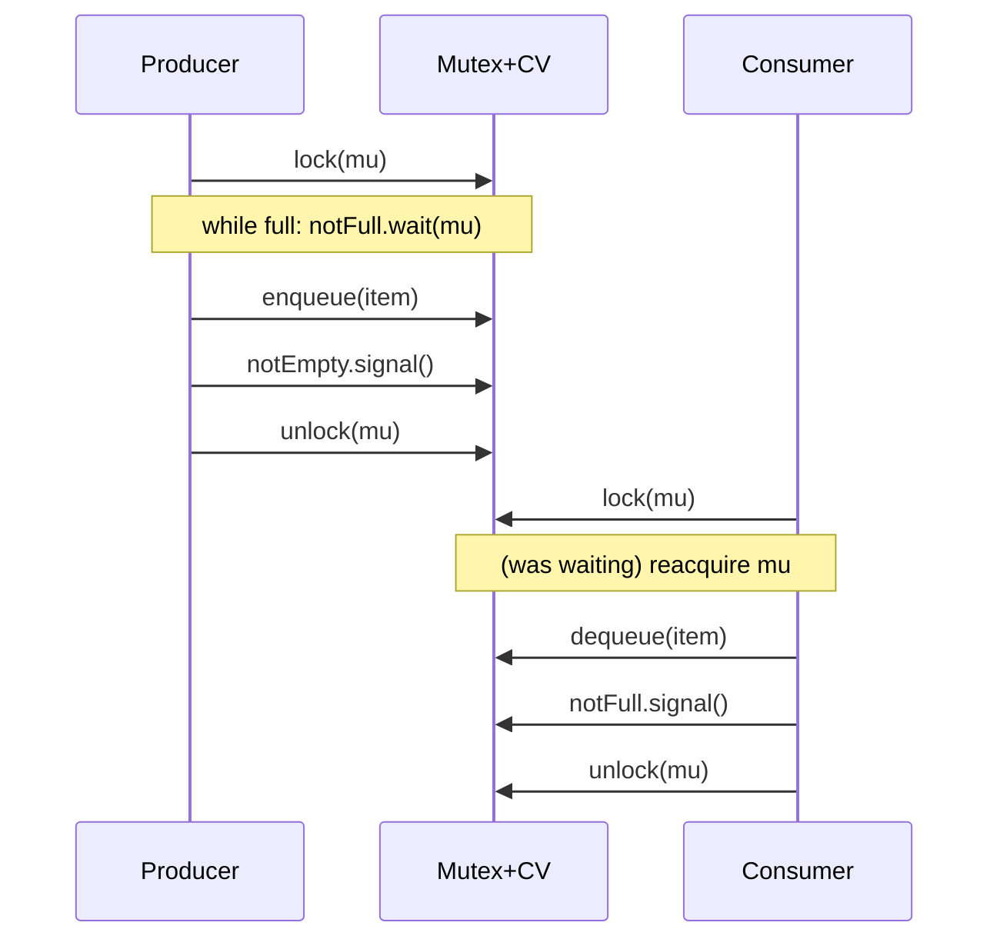
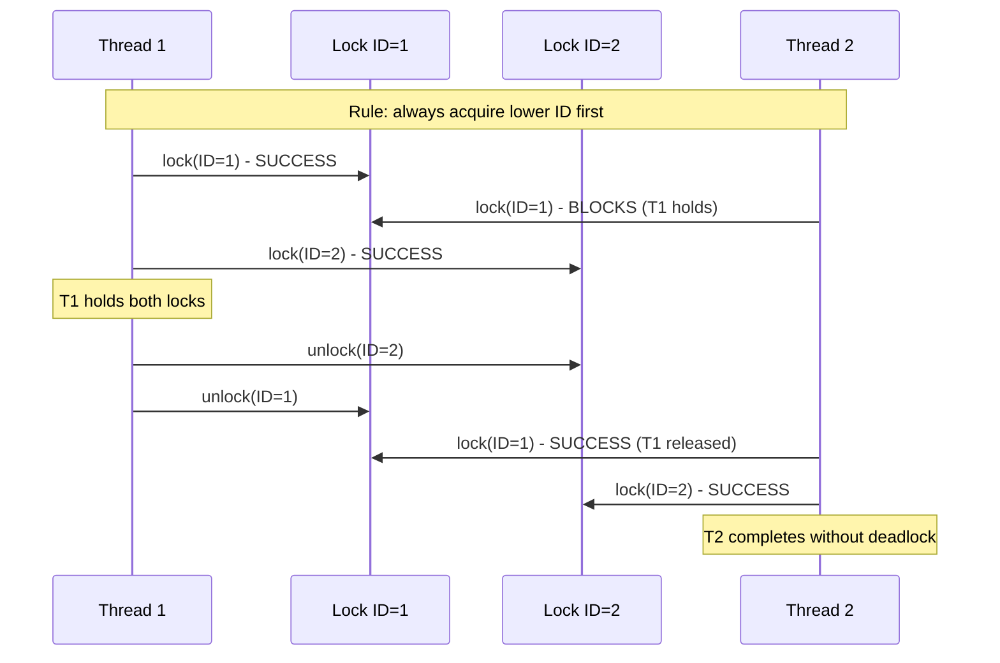

## Keywords in This File
{: .no_toc }

| # | Keyword | Weight |
|---|---|---|
| 12 | [Mutex, Semaphore, and Condition Variables](#mutex-semaphore-and-condition-variables) | high |
| 13 | [Deadlock: Detection, Prevention, and Avoidance](#deadlock-detection-prevention-and-avoidance) | high |

---

# Mutex, Semaphore, and Condition Variables

🎯 Interview Weight: High - The building blocks of concurrent programming. Asked at every level from junior (explain a mutex) to staff (design a lock-free concurrent data structure, explain futex internals). Getting these wrong signals a fundamental gap in systems knowledge.

---

## 📋 Quick Reference

**One-line definition:** Synchronization primitives that control concurrent access to shared state: mutex for mutual exclusion, semaphore for counting resource availability, condition variable for event signaling within a critical section.

**Difficulty:** ★★☆ | **Asked at:** All | **Seniority:** Junior-Senior

---

### 🎯 Model Answer

**30 seconds:**
> A mutex provides mutual exclusion: at most one thread holds the lock at a time. A semaphore has a count; `wait` decrements it (blocks when 0), `signal` increments it. A condition variable enables a thread inside a critical section to wait for a specific condition to become true without spinning, releasing the mutex atomically while waiting and reacquiring it before returning to the caller. Together these three primitives are sufficient to implement any synchronization pattern.

**3 minutes (Senior):**
> These three primitives address orthogonal synchronization needs. A mutex solves mutual exclusion: the invariant is that at most one thread executes inside the critical section simultaneously. A semaphore solves resource counting: it tracks how many instances of a resource are available, blocking consumers when count reaches zero. A condition variable solves conditional waiting: a thread needs the mutex (to read shared state) and a predicate to be true (to proceed) - it should release the CPU while waiting but must hold the mutex to inspect and modify the state. The POSIX model combines them: `pthread_cond_wait(&cv, &mutex)` atomically releases the mutex and blocks; when signaled, it reacquires the mutex before returning. The "atomically" is crucial - a gap between releasing the mutex and blocking creates a lost-wakeup bug. At the kernel level, POSIX mutexes use futex (fast userspace mutex): an uncontended lock/unlock is a single atomic compare-and-swap in userspace (no syscall); only on contention does the kernel's wait queue participate. This makes uncontended locking nearly free (~20-50ns vs ~1000ns for a syscall).

**Framework:** WHAT -> MECHANISM -> PITFALLS -> ALTERNATIVES

*Adapting up:* Explain futex internals, spurious wakeups, and the while-loop predicate requirement.

*Adapting down:* Mutex = locked door; semaphore = parking lot counter; condition variable = bell at the doctor's office.

**Blank Mind Recovery:**

**(1) Restate:** "Mutex, semaphore, condition variable - the classic synchronization trio."

**(2) First principles:** "Multiple threads share memory. Without coordination, two threads writing the same variable produce undefined behavior. A mutex prevents that by allowing only one thread in the critical section."

**(3) Bridge:** "Once you have mutual exclusion, you need to wait for conditions efficiently. That's where condition variables come in - they let you sleep inside the critical section without holding the lock."

---

### 📘 Concept Explanation

**What it is:**
Mutex, semaphore, and condition variable are OS-provided synchronization primitives that coordinate access to shared state between concurrent threads or processes.

**The problem they solve:**
Without synchronization, concurrent access to shared mutable state produces data races: non-deterministic outcomes depending on thread scheduling. These primitives provide ordering guarantees that make concurrent programs correct.

**Mutex - how it works:**

```
MUTEX STATE MACHINE:
======================
UNLOCKED                    LOCKED(owner=T1)
    |                            |
    | T1.lock()                  | T1.unlock()
    v                            v
LOCKED(owner=T1)           UNLOCKED
                                 |
    T2.lock() while LOCKED:      | T2 woken
    -> T2 added to wait queue    | T2 acquires lock
    -> T2 blocks (sleeps)
```

> **Diagram walkthrough:** This state machine shows mutex ownership transitions. A mutex starts UNLOCKED; the first thread to call lock() transitions it to LOCKED and records itself as the owner. KEY RELATIONSHIP: ownership means the mutex has a concept of "who holds it" - only the owner can unlock. EDGE CASE: recursive mutexes (PTHREAD_MUTEX_RECURSIVE) allow the same thread to lock multiple times without deadlocking, incrementing an internal counter; each lock() must be paired with an unlock(). INSIGHT: a non-recursive mutex acquired twice by the same thread deadlocks - a common bug in error-handling code paths that acquire the lock, call a function that also acquires the lock, and deadlock because the error case was never tested.

**Semaphore - how it works:**

```
SEMAPHORE: initialized count = N
  wait()   (P / down / decrement):
    if count > 0: count--; proceed
    else: block until count > 0
  signal() (V / up / post / increment):
    count++
    if any threads waiting: wake one

Binary semaphore (N=1):
  - Equivalent to mutex for mutual exclusion
  - BUT: no ownership - any thread can signal
  - Use: event signaling between threads

Counting semaphore (N>1):
  - Tracks resource pool (N=connection pool)
  - Producer/consumer: empty=0, full=0, mu=1
```

> **Diagram walkthrough:** This shows semaphore semantics for binary (N=1) and counting (N>1) variants. A binary semaphore's signal/wait cycle is equivalent to mutex lock/unlock for mutual exclusion, but critically lacks ownership - any thread can call signal(), even one that never called wait(). KEY RELATIONSHIP: this lack of ownership makes semaphores appropriate for event signaling (producer signals, consumer waits) but inappropriate for mutual exclusion (ownership is needed to prevent accidental unlock by wrong thread). EDGE CASE: initializing a semaphore to 0 and having a consumer wait() before the producer signal() is the correct producer/consumer pattern - the consumer blocks until the first item is produced. INSIGHT: the classic producer/consumer with a bounded buffer requires three semaphores: `empty` (tracks free slots, initialized to buffer_size), `full` (tracks filled slots, initialized to 0), and `mutex` (initialized to 1 for buffer access protection) - combining counting and binary semaphore roles.

**Condition Variable - how it works:**

```
CORRECT PATTERN (always while, not if):
=========================================
// Thread A (consumer/waiter):
pthread_mutex_lock(&mu);
while (!condition_is_true()) {  // NOT if
    pthread_cond_wait(&cv, &mu);
    // Atomically: releases mu, blocks.
    // On wake: reacquires mu, returns.
}
do_work_with_shared_state();
pthread_mutex_unlock(&mu);

// Thread B (producer/signaler):
pthread_mutex_lock(&mu);
update_shared_state();
pthread_cond_signal(&cv);  // OR broadcast
pthread_mutex_unlock(&mu);

// WHY while and not if:
// Spurious wakeups: POSIX allows cond_wait
//   to return with no signal (rare, but
//   required to be handled correctly).
// Predicate state can change between
//   wakeup and reacquisition of mutex.
```

> **Diagram walkthrough:** This shows the correct condition variable usage pattern with the mandatory `while` loop. The `while (!condition)` guard handles two scenarios: spurious wakeups (POSIX allows cond_wait to return without a signal for implementation reasons) and predicate change between signal and lock reacquisition (if multiple threads wait on the same condition, only one gets the resource; the others must re-check). KEY RELATIONSHIP: the atomic release-and-sleep in `cond_wait` is what prevents the lost-wakeup bug - without atomicity, Thread B could signal after Thread A checks the condition but before Thread A calls cond_wait, and the signal would be lost. EDGE CASE: `pthread_cond_signal` wakes at most one waiter; `pthread_cond_broadcast` wakes all waiters - use broadcast when all waiters might be able to proceed (state change benefits multiple threads), use signal when exactly one can proceed. INSIGHT: condition variables are not edge-triggered (they don't "remember" a missed signal) - they are level-triggered: the state must be true when the waiter checks it, which is why the state check and the wait must be within the same mutex lock.

**The key insight:**
Mutex alone handles "who can run" (mutual exclusion). Condition variable handles "when to run" (event-driven execution). Using a mutex alone for waiting (polling the condition) wastes CPU and causes priority inversion. Using condition variable without mutex creates lost-wakeup races. The combination is necessary and sufficient for most concurrent patterns.

**When to use each:**

- **Mutex**: any critical section protecting shared state from concurrent writes
- **Semaphore**: resource pool management, inter-thread signaling without ownership
- **Condition variable**: waiting inside a critical section for a predicate to become true

**When NOT to use:**

- Do not use a mutex for inter-process signaling when semaphore or shared memory is appropriate
- Do not use `if` instead of `while` with condition variables (spurious wakeups)
- Do not hold a mutex during long I/O operations - minimise critical section scope

**Alternatives:**

- `java.util.concurrent.locks.ReentrantLock` + `Condition` - Java equivalent with additional features
- `std::mutex` + `std::condition_variable` - C++11 equivalent
- `asyncio.Lock` + `asyncio.Condition` - Python async equivalent (coroutine-based)
- Lock-free algorithms (AtomicInteger, ConcurrentLinkedQueue) for high-throughput scenarios

**First-principles derivation:**
Concurrent threads share memory. Instruction interleaving is non-deterministic. Any sequence of reads/writes where at least one is a write is a data race with undefined behavior. A mutex serialises such sequences by wrapping them in an atomic section. Once serialised, we need efficient waiting for state changes - busy-waiting wastes CPU; sleeping requires a mechanism to wake up on state change. That mechanism is the condition variable: sleep here (releasing mutex for others) and wake me when something changes.

---

### 💻 Code Example

```java
// BAD: polling with sleep (busy-wait variant)
// CPU waste AND variable latency
class BadQueue<T> {
    private final List<T> items =
        new ArrayList<>();

    public synchronized void put(T item) {
        items.add(item);
    }

    // BAD: polls every 1ms - wastes CPU,
    // increases latency by up to 1ms
    public T take() throws InterruptedException {
        while (true) {
            synchronized (this) {
                if (!items.isEmpty()) {
                    return items.remove(0);
                }
            }
            Thread.sleep(1); // polling sleep
        }
    }
}
```

> **Code walkthrough:** This BAD pattern polls a shared list with a 1ms sleep between checks. KEY MECHANISM: the thread wakes every 1ms, acquires the lock, checks the list, and goes back to sleep if empty - even if no items will arrive for seconds. WHY IT MATTERS: with 100 consumer threads each polling at 1ms intervals, this generates 100,000 lock acquisitions per second even with an empty queue. WHAT BREAKS: latency is bounded below by the sleep interval (items available can wait up to 1ms), and adding items triggers no immediate consumer wake-up. TAKEAWAY: never poll a condition with sleep; use condition variables to be notified exactly when the condition changes.

```java
// GOOD: BlockingQueue pattern using
// condition variable equivalent
import java.util.concurrent.locks.*;

class BoundedQueue<T> {
    private final Object[] items;
    private int head, tail, count;
    private final ReentrantLock lock =
        new ReentrantLock();
    private final Condition notEmpty =
        lock.newCondition();
    private final Condition notFull  =
        lock.newCondition();

    BoundedQueue(int capacity) {
        items = new Object[capacity];
    }

    public void put(T item)
            throws InterruptedException {
        lock.lock();
        try {
            while (count == items.length) {
                notFull.await(); // wait for space
            }
            items[tail] = item;
            tail = (tail + 1) % items.length;
            count++;
            notEmpty.signal(); // wake consumer
        } finally {
            lock.unlock(); // ALWAYS unlock
        }
    }

    @SuppressWarnings("unchecked")
    public T take() throws InterruptedException {
        lock.lock();
        try {
            while (count == 0) {
                notEmpty.await(); // wait for item
            }
            T item = (T) items[head];
            items[head] = null; // prevent leak
            head = (head + 1) % items.length;
            count--;
            notFull.signal(); // wake producer
            return item;
        } finally {
            lock.unlock();
        }
    }
}
```

> **Code walkthrough:** This GOOD pattern implements a classic bounded blocking queue using ReentrantLock with two condition variables. KEY MECHANISM: `notFull.await()` atomically releases the lock and blocks the producer when the queue is full; `notEmpty.await()` does the same for the consumer when the queue is empty. On state change, `notEmpty.signal()` wakes exactly one blocked consumer, and `notFull.signal()` wakes exactly one blocked producer. WHY IT MATTERS: no CPU is wasted polling - threads sleep until the exact state they need is available. The `try/finally` ensures the lock is always released even on exception. WHAT BREAKS: using `if` instead of `while` around the await calls - spurious wakeups cause the thread to proceed with count==0 (take) or count==capacity (put), corrupting the array. TAKEAWAY: the while+await pattern is the canonical condition variable usage; every await must be guarded by a while loop that re-checks the predicate.

```java
// FAILURE: lost wakeup
// (hypothetical non-atomic implementation)
class BrokenQueue<T> {
    private final List<T> items =
        new ArrayList<>();
    private final Object lock = new Object();

    // BROKEN: check and wait are not atomic
    // GAP between isEmpty check and wait():
    // producer can add+notify between them.
    // The notify is LOST; take() blocks
    // indefinitely even though item exists.
    public T take() throws InterruptedException {
        if (items.isEmpty()) {
            synchronized (lock) {
                lock.wait(); // too late - missed
            }
        }
        return items.remove(0);
    }
}
```

> **Code walkthrough:** This failure example shows the lost-wakeup race that condition variables are designed to prevent. KEY MECHANISM: the broken code checks `items.isEmpty()` OUTSIDE the synchronized block, then enters the block to call `wait()`. Between the check and the wait, another thread can add an item and call `notify()` - this notify fires with no one waiting, and is permanently lost. WHY IT MATTERS: the original thread then calls `wait()` and blocks indefinitely even though an item is available. WHAT BREAKS: this produces a livelock-like symptom: the producer thinks the item was delivered, the consumer is stuck waiting. TAKEAWAY: the condition check and the wait MUST be within the same lock scope - `synchronized(lock) { while(isEmpty()) { lock.wait(); } }` makes them atomic with respect to each other.

---

### 🎓 Answers by Seniority

**Junior / Mid (0-5 years):**
> A mutex is a lock that allows only one thread to enter a critical section at a time. A semaphore is like a mutex but with a count - it allows N threads simultaneously (binary semaphore with N=1 is similar to a mutex but without ownership). A condition variable lets a thread wait inside a critical section until a specific condition is met, atomically releasing the mutex while waiting. You always use `while` not `if` with condition variables because of spurious wakeups - the OS can wake a thread even without a signal.

---

**Senior / Staff (5+ years):**
> At the implementation level, POSIX mutexes use futex (fast userspace mutex): the mutex state is an integer in shared memory. On lock, a CAS from 0 to 1 succeeds without any syscall if uncontended (~20ns). Only on contention does the thread call `futex(FUTEX_WAIT)` to enter the kernel's wait queue. This means 99%+ of lock acquisitions in a low-contention system have zero syscall overhead. Condition variable `wait` is `FUTEX_WAIT` directly. The while-loop-around-wait pattern is mandatory not just for spurious wakeups but because even in the absence of them, predicate state can change between the time you are woken (signal fires) and the time you reacquire the mutex. In Java, `java.util.concurrent` uses `AbstractQueuedSynchronizer` which similarly CAS-spins briefly before parking the thread.

---

### ⚠️ Common Misconceptions

**Misconception 1: "A binary semaphore and a mutex are interchangeable."**
Reality: a semaphore has no ownership - any thread can call signal, including threads that never called wait. A mutex is owned by the thread that acquired it; only the owner can release it. This ownership property is what enables priority inheritance. Using a semaphore for mutual exclusion breaks priority inheritance and allows accidental double-signal.

**Misconception 2: "`if (!condition)` is fine instead of `while (!condition)` with cond_wait."**
Reality: spurious wakeups are explicitly permitted by POSIX and occur in practice on Linux under high load or signals. Additionally, predicate state can change between signal and lock reacquisition. Using `if` causes threads to proceed with the predicate false, which is a data race or logic error.

**Misconception 3: "Holding a mutex makes the code thread-safe."**
Reality: a mutex only protects threads that ALSO acquire the same mutex before accessing shared state. If any thread accesses the shared variable without acquiring the mutex, the mutex provides no protection.

**Misconception 4: "condition_broadcast is always safer than condition_signal."**
Reality: broadcast wakes all waiters, causing a "thundering herd" where N threads contend for the same mutex. Most find the predicate false and go back to sleep, wasting O(N) context switches. Use broadcast only when the state change benefits multiple waiters; use signal when exactly one waiter should proceed.

**Misconception 5: "Semaphores are deprecated; mutexes are always better."**
Reality: semaphores are the correct tool for producer-consumer signaling and resource pool management. The POSIX semaphore `sem_post` from a signal handler is async-signal-safe; `pthread_mutex_unlock` is not. For inter-process synchronization, POSIX named semaphores work across processes; `pthread_mutex` requires shared memory with PTHREAD_PROCESS_SHARED attribute.

---

### 🚨 Failure Modes and Diagnosis

**Failure 1: Deadlock from lock ordering violation**

Symptom: application hangs indefinitely. Thread dump shows all threads BLOCKED. CPU usage is 0%.

Root cause: Thread A acquires lock1 then tries lock2; Thread B acquires lock2 then tries lock1. Neither can proceed.

```bash
# Java: jstack shows lock graph
jstack <PID> 2>&1 | grep -A10 "deadlock"
jstack <PID> 2>&1 | grep -E \
  "BLOCKED|waiting to lock"

# Linux C/C++: gdb for deadlock
gdb -p <PID> -ex "thread apply all bt" \
    -ex "quit" 2>&1 | grep -A3 \
    "pthread_mutex_lock"
```

> **Code walkthrough:** These commands identify deadlocked threads and the locks they hold/need. KEY MECHANISM: `jstack` attaches to the JVM and reads thread state; it detects lock cycles and prints "Found one Java-level deadlock" with the chain; `gdb thread apply all bt` prints the call stack of all threads, showing which threads are stuck in `pthread_mutex_lock`. WHY IT MATTERS: a deadlock is permanent - the application cannot recover without a restart. WHAT BREAKS: jstack requires the JVM to reach a safepoint; a thread stuck in a native mutex lock may not respond to safepoint requests. TAKEAWAY: establish a lock ordering convention early (lock A always before lock B) and enforce it via code review.

Fix: establish and document a total ordering on all mutexes. Every thread acquires locks in the same order. Verify with ThreadSanitizer or Helgrind.

**Failure 2: Lost wakeup causing indefinite blocking**

Symptom: consumer thread stuck waiting indefinitely even though items were produced. No deadlock (producer runs fine).

```java
// Broken: check outside lock
if (queue.isEmpty()) {         // Thread A here
    // Thread B inserts + signals here -> LOST
    synchronized(lock) {
        lock.wait(); // blocks forever
    }
}
```

> **Code walkthrough:** This shows the classic lost-wakeup race in Java. KEY MECHANISM: Thread A checks `queue.isEmpty()` and finds it true; before Thread A enters the synchronized block to call wait(), Thread B calls `add()` and `notify()` - but Thread A hasn't called `wait()` yet, so the notify has no recipient and is discarded. WHY IT MATTERS: Thread A then calls `wait()` and blocks forever even though an item is in the queue. WHAT BREAKS: the symptom is a "stuck consumer" with no error; adding more items doesn't help since the stuck thread is in `wait()` with no one to wake it. TAKEAWAY: the condition check and the wait MUST always be inside the same synchronized block.

Fix: move the condition check inside the same lock scope as the `wait` call. Always use `while (predicate) { cv.wait(); }`.

**Failure 3: Thundering herd from broadcast**

Symptom: high context-switch rate and latency spikes when a large batch of items arrives.

Root cause: `pthread_cond_broadcast` wakes all N waiting consumer threads; all N try to acquire the mutex; N-1 find no work and go back to sleep; O(N) wasted context switches per batch arrival.

Fix: replace broadcast with signal when exactly one consumer should handle one item. Call signal K times for K new items, or use broadcast only when the predicate can be true for ALL waiters simultaneously (e.g., shutdown).

---

### 🎯 Interview Deep-Dive

| Category | Count | Coverage |
|---|---|---|
| Conceptual | 3 | mutex vs semaphore, cond var mechanism, spurious wakeups |
| Mechanism | 2 | futex internals, atomic wait-release |
| Debugging | 2 | deadlock diagnosis, lost wakeup symptoms |
| Trade-off | 1 | signal vs broadcast |
| Behavioral | 1 | synchronization bug story |

---

**[JUNIOR] Q1 - [CONCEPTUAL] What is the difference between a mutex and a semaphore?**

Both prevent concurrent access conflicts, but they solve different problems and have different semantics.

Mutex (Mutual Exclusion Lock):
- Binary state: locked or unlocked
- Has ownership: only the thread that locked it can unlock it
- Used for: protecting a critical section from concurrent access
- The OS can use ownership to implement priority inheritance
- On owning thread death, POSIX can return EOWNERDEAD for robust mutexes

Semaphore:
- Integer count: 0 to N
- No ownership: any thread (or process) can call signal
- Used for: counting available resources, event signaling between threads
- Binary semaphore (N=1): similar to mutex for signaling, but without ownership
- Counting semaphore (N>1): resource pool (database connections, worker slots)

The ownership distinction matters in two ways: (1) A mutex protects against accidental double-unlock; a semaphore can be mistakenly signaled from the wrong thread. (2) Priority inheritance requires ownership to know whose priority to raise; semaphores cannot participate in priority inheritance.

Rule of thumb: use mutex for mutual exclusion; use semaphore for counting or event signaling.

In Java: `synchronized`/`ReentrantLock` are mutexes; `Semaphore` class is a counting semaphore. In Go: `sync.Mutex` is a mutex; `chan struct{}` with capacity N acts as a counting semaphore.

*What separates good from great:* POSIX defines robust mutexes (`PTHREAD_MUTEX_ROBUST`) that notify waiting threads when the lock owner terminates without unlocking (returns `EOWNERDEAD`). This is critical for server processes where a thread holding a mutex can crash: without robust mutexes, the crashed thread's lock is never released and all waiting threads block forever. Semaphores have no equivalent mechanism because there is no owner to "die."

---

**[JUNIOR] Q2 - [CONCEPTUAL] Why must condition variable waits always use `while` instead of `if`?**

`while (!condition) { cv.wait(); }` is mandatory because condition variable wait can return in two situations where the condition is still false:

Reason 1 - Spurious wakeups: POSIX explicitly allows `pthread_cond_wait` to return even without a corresponding signal or broadcast. This is not a bug - it is permitted by the specification to simplify implementation on some hardware architectures. Linux spurious wakeups are rare but happen on signal delivery. If code uses `if` instead of `while`, it proceeds with a false predicate.

Reason 2 - Lost predicate between signal and lock reacquisition: `cond_wait` wakes up and competes to reacquire the mutex. Another thread may have consumed the resource between the signal and this thread's mutex reacquisition. When this thread finally holds the mutex, the predicate is false again.

Reason 3 - Broadcast semantics: when the signaler calls `broadcast`, ALL waiting threads wake up and compete for the mutex. Only the first one to acquire it may find the condition still true. All others must re-check and re-wait.

Code pattern that always works:
```java
lock.lock();
try {
    while (!predicate()) { // ALWAYS while
        condition.await();
    }
    // predicate is true AND we hold the lock
    doWork();
} finally {
    lock.unlock();
}
```

> **Code walkthrough:** This while-loop pattern handles all three spurious wakeup scenarios. KEY MECHANISM: after await() returns, the predicate is immediately rechecked while holding the mutex - this is the only moment where predicate check and work execution are atomic with respect to other threads. WHY IT MATTERS: the "spurious wakeup" contract means any production code that uses `if` is technically incorrect and will fail under load on specific hardware or OS configurations. WHAT BREAKS: consequences range from subtle (item processed twice, count off by one) to severe (null pointer dereference, buffer overflow). TAKEAWAY: treat `while (!predicate) { cv.wait(); }` as a mandatory formula, not an optimization.

*What separates good from great:* The Java Memory Model (JMM) provides an additional guarantee: after `Object.wait()` returns, the thread has full visibility of all writes that happened before the corresponding `notify()` call. This ensures the signaling thread's writes to shared state are visible to the woken thread without additional memory barriers, making the while-loop pattern safe across all JVM implementations.

---

**[MID] Q3 - [MECHANISM] How does a futex work and why is it important for mutex performance?**

A futex (Fast Userspace muTEX) is the Linux kernel mechanism that makes POSIX mutex and condition variable operations fast for the common (uncontended) case.

The core insight: most mutex operations in a well-designed concurrent program are uncontended. A system call costs ~1000ns. An atomic CAS in userspace costs ~5ns. If we can handle the uncontended case without a syscall, we save 200x overhead.

Futex mechanism:
1. The mutex state is an integer in shared memory (one word in the process's address space).
2. Lock (uncontended path): CAS from 0 (free) to 1 (locked). Succeeds atomically. No syscall. Takes ~5-20ns.
3. Lock (contended path): CAS fails. Call `futex(FUTEX_WAIT, mutex_addr, 1)`. The kernel checks that the value is still 1 (not released between failed CAS and syscall), adds the thread to a wait queue keyed by `mutex_addr`, and suspends the thread.
4. Unlock: set the integer to 0. If the wait queue is non-empty, call `futex(FUTEX_WAKE, mutex_addr, 1)` to wake one waiter.

Why the "double check" in the kernel matters: between a failed CAS and the futex syscall, the lock holder could have released the lock. The kernel atomically checks the value again before blocking; if the value has changed (lock is free), the thread does not block and immediately retries the CAS.

Performance numbers:
- Uncontended: 15-20ns (one CAS + memory barrier)
- Contended: 5-50 microseconds (two context switches)

Java's `synchronized` (OpenJDK HotSpot): uses an adaptive locking strategy: thin lock (CAS spin, 2-3 iterations), then inflated lock backed by OS futex.

*What separates good from great:* The futex address serves as a hash key in the kernel's futex wait queue hash table. On a multi-process system using POSIX semaphores across processes (shared memory), the same futex mechanism works across process boundaries by using the physical page address as the hash key, enabling cross-process coordination without a syscall for the uncontended case.

---

**[MID] Q4 - [MECHANISM] Explain the atomic release-and-sleep in condition variable wait - why can't it be split into two steps?**

`pthread_cond_wait(cv, mutex)` must atomically release the mutex AND put the thread to sleep. If these were two separate steps, the lost-wakeup bug would be unavoidable.

Why atomicity is required:

```
Non-atomic sequence (broken):
  Thread A (waiter):          Thread B (signaler):
  1. mutex.unlock()
                              2. queue.add(item)
                              3. cv.signal()
  4. [signal missed]
  5. cv.wait_only()           -> waits FOREVER
```

> **Code walkthrough:** This timeline shows why non-atomic split would fail. KEY MECHANISM: between step 1 (unlock) and step 5 (wait), Thread B fires the signal - but Thread A hasn't called wait() yet, so the signal has no recipient and is discarded. WHY IT MATTERS: Thread A then enters wait() and sleeps forever even though an item was added. WHAT BREAKS: the producer believes it successfully signaled, the consumer is stuck - no error, just a hung program. TAKEAWAY: this is the fundamental argument for why cond_wait must be atomic.

Linux implementation: atomically add the thread to the condvar's waiter list AND release the mutex in one sequence that cannot be interrupted, using the futex mechanism to ensure no signal can be lost between the mutex release and the sleep.

The atomicity guarantee: no signal can be "lost" between the mutex release and the sleep. The signaler must hold the same mutex to modify state and call signal - so if the waiter holds the mutex during the atomic release, the signaler cannot fire the signal until after the waiter has registered as sleeping.

*What separates good from great:* The precise atomicity guarantee in POSIX: a signal that fires while the waiter is in `cond_wait` (between mutex release and sleep) WILL wake the waiter. A signal that fires before `cond_wait` is called (before the mutex release) is NOT guaranteed to wake the waiter - this is why the predicate must be checked inside the mutex BEFORE calling cond_wait.

---

**[SENIOR] Q5 - [DEBUGGING] A production service is running but processing no work. Thread dump shows all worker threads in WAITING state. How do you diagnose?**

Symptom profile: all workers blocked, no CPU, no errors, no progress.

Step 1 - Thread dump analysis:
```bash
# Java: jstack to see what all threads wait on
jstack <PID> 2>&1 | grep -B5 -A10 \
  "WAITING\|TIMED_WAIT\|BLOCKED"
# Look for: all threads waiting on same object
# Also: is the producer thread running?
```

> **Code walkthrough:** jstack shows the lock address and call stack for every blocked thread. KEY MECHANISM: threads in `WAITING` state show the object monitor address they're waiting on; if all threads wait on the same address, the issue is a missing signal. WHY IT MATTERS: distinguishing WAITING (waiting for notify) from BLOCKED (waiting for lock entry) determines the root cause. WHAT BREAKS: jstack requires a safepoint; under extreme load, safepoint may take 10-30 seconds. TAKEAWAY: look for the producer thread in the dump; if the producer is also in WAITING state or does not exist, the producer is the problem.

Step 2 - Check the producer: is the producer thread alive? Is it calling `signal`/`notify` after adding items?

Step 3 - Check for condition variable misuse:

Common causes:
1. `notify()` called outside the lock - signal fires but waiter does not see the state change
2. `notify()` called before workers start waiting (startup race)
3. Producer died (crashed) without notifying workers

Step 4 - Verify the signal reaches workers via monitoring: add a counter of `signal` calls and `wait` calls. If signal counter is 0 and wait counter is N, the producer is not signaling.

*What separates good from great:* The hardest case is a notification race at startup. The fix: use a robust predicate-based check - consumers check a queue size or generation counter, and the producer updates this counter before signaling. Even if a signal is missed, consumers check the predicate when they start and find it non-empty, proceeding without waiting.

---

**[SENIOR] Q6 - [TRADE-OFF] When would you use a semaphore instead of a mutex + condition variable?**

The combination of mutex + condition variable can implement anything a semaphore does, but semaphores have specific advantages:

Use semaphore when:
1. Inter-process signaling: POSIX named semaphores (`sem_open`) work across unrelated processes. Mutex across processes requires shared memory and `PTHREAD_PROCESS_SHARED` attribute.
2. Signal handler signaling: `sem_post` is async-signal-safe; `pthread_mutex_unlock` and `pthread_cond_signal` are NOT.
3. Simple resource counting: a counting semaphore for a connection pool (initial count = pool_size) is simpler than mutex + condition + counter.

Use mutex + condition variable when:
1. Predicate is complex: the condition depends on multiple shared variables
2. Multiple conditions: a bounded queue with two conditions (full and empty) needs two condition variables
3. Ownership semantics: the OS provides priority inheritance only for mutexes

Signal handler safe example:
```c
sem_t sig_semaphore;

void signal_handler(int sig) {
    // SAFE: sem_post is async-signal-safe
    sem_post(&sig_semaphore);
    // pthread_mutex_lock() here
    // = UNDEFINED BEHAVIOR (not async-safe)
}

void* worker_thread(void* arg) {
    while (1) {
        sem_wait(&sig_semaphore);
        handle_signal();
    }
}
```

> **Code walkthrough:** This pattern uses a semaphore to safely bridge a signal handler and a worker thread. KEY MECHANISM: `sem_post` is in POSIX's list of async-signal-safe functions - it can be called from signal handlers without risk of deadlock. WHY IT MATTERS: calling `pthread_mutex_lock` from a signal handler can deadlock if the main thread was holding the mutex when the signal arrived. WHAT BREAKS: if the worker thread calls `sem_wait` with a large pending signal count (many signals accumulated), it processes them serially - if processing is slow, signal backlog grows. TAKEAWAY: `sem_post` from signal handlers to wake a dedicated signal-handling thread is the standard Unix pattern for safe signal processing.

*What separates good from great:* In Go, channels serve the role of both semaphore and condition variable: a buffered channel with capacity N is a counting semaphore; an unbuffered channel is a rendezvous point. Go's design choice to build both into a single abstraction with goroutine-friendly blocking (parks the goroutine, not the OS thread) is why Go programs often outperform pthreads programs at high concurrency - goroutines blocked on channels don't waste OS thread stack space.

---

**[SENIOR] Q7 - [DEBUGGING] How do you detect and prevent lock contention hotspots in a Java service under load?**

Lock contention occurs when multiple threads frequently compete for the same lock. It manifests as CPU under-utilization under high load.

Detection:
```bash
# JVM: async-profiler with lock profiling
java \
-agentpath:/path/to/libasyncProfiler.so\
=start,event=lock,file=contention.html \
-jar service.jar
# File shows lock contention by method,
# sorted by total blocked time
```

> **Code walkthrough:** Async-Profiler's lock event mode records every time a thread blocks attempting to acquire a `synchronized` lock or ReentrantLock. KEY MECHANISM: async-profiler uses JVM JVMTI events for monitor contention - it captures the exact lock object class, the contended method, and time spent waiting. WHY IT MATTERS: without a profiler, contention is invisible in CPU profiles (blocked threads have zero CPU) - you need a wall-clock or lock profile, not a CPU profile. WHAT BREAKS: async-profiler with lock mode adds ~3-5% CPU overhead and increases GC pressure; disable it after identifying the hotspot. TAKEAWAY: any service with >10% blocking time in wall-clock profiles has a lock contention problem worth investigating.

Common fixes for lock contention:
1. Lock striping: instead of one lock for the whole map, use N locks for N buckets (ConcurrentHashMap uses 16 stripes)
2. Read-write lock: `ReentrantReadWriteLock` allows N concurrent readers; only writers need exclusion
3. Lock-free: replace the contended lock with `AtomicLong`, `ConcurrentLinkedQueue`, or `LongAdder`
4. Thread-local state: avoid sharing by keeping state per-thread (`ThreadLocal`); merge at read time

*What separates good from great:* `LongAdder` vs `AtomicLong` is a case study in contention-aware design. `AtomicLong` uses a single CAS on one memory location - under high concurrency, many threads spin and retry. `LongAdder` maintains per-CPU striped cells; each thread updates its local cell with no contention; reads sum all cells. Under high concurrency (>4 threads), `LongAdder` throughput is 10-20x higher. The price is slightly stale reads (sum is approximate if threads are concurrently incrementing).

---

**[STAFF] Q8 - [BEHAVIORAL] Describe a synchronization bug you found in production and how you fixed it.**

Production incident: a Java microservice processing events from Kafka showed increasing lag over hours. Adding partitions and consumer threads did not help - all threads were present but lag grew.

Investigation: async-profiler showed 80% of wall clock time in `synchronized` methods on a single `HashMap` used as an in-memory deduplication cache. All 32 consumer threads were serialized through this one lock.

Root cause: the deduplication check was added as a quick bug fix: `synchronized(cache) { if (!cache.contains(id)) { cache.put(id, now); } }`. Under 32 threads and 10,000 events/second, this was 10,000 synchronized operations per second with 32 threads competing.

Fix: replaced `HashMap` + `synchronized` with `ConcurrentHashMap.putIfAbsent()`. `putIfAbsent` is atomic at the bucket level (16-32 buckets with independent locks) - threads only contend when inserting into the same bucket. P99 latency dropped from 200ms to 12ms. Kafka lag cleared in minutes.

Follow-up: added a bounded cache with `LinkedHashMap` as LRU to prevent memory growth when event IDs are unbounded.

Lesson: a single `synchronized` block is a serialization point. Any code path that must be called by every thread serialises all threads.

*What separates good from great:* The diagnosis was only possible because async-profiler exists. The same bug with standard JMX monitoring would have appeared as "CPU below capacity" with no indication that threads were blocked waiting for a lock. Investing in observability tooling (async-profiler, continuous profiling with Pyroscope/Parca) pays for itself on the first production synchronization bug.

---

**[STAFF] Q9 - [DESIGN] How would you implement a high-throughput rate limiter using these primitives?**

A rate limiter allows at most N operations per second. Under high concurrency, it must be accurate and add minimal latency to the hot path.

Token bucket algorithm with lock-free implementation:

```java
import java.util.concurrent.atomic.*;

public class TokenBucketLimiter {
    private final long maxTokens;
    private final AtomicLong tokens;
    private volatile long lastRefill;
    private final long refillPerSecond;

    public TokenBucketLimiter(
            long maxTokens, long ratePerSec) {
        this.maxTokens = maxTokens;
        this.refillPerSecond = ratePerSec;
        this.tokens = new AtomicLong(maxTokens);
        this.lastRefill = System.nanoTime();
    }

    public boolean tryAcquire() {
        refillIfNeeded();
        // CAS loop: atomically decrement if > 0
        while (true) {
            long current = tokens.get();
            if (current <= 0) return false;
            if (tokens.compareAndSet(
                    current, current - 1)) {
                return true;
            }
            // CAS failed: another thread changed
            // tokens; retry (lock-free, not
            // wait-free)
        }
    }

    private void refillIfNeeded() {
        long now = System.nanoTime();
        long elapsed = now - lastRefill;
        if (elapsed >= 1_000_000_000L) {
            long add = refillPerSecond
                * (elapsed / 1_000_000_000L);
            tokens.getAndUpdate(t ->
                Math.min(t + add, maxTokens));
            lastRefill = now;
        }
    }
}
```

> **Code walkthrough:** This lock-free token bucket uses CAS (compareAndSet) to atomically decrement the token count without a mutex. KEY MECHANISM: the CAS loop reads the current token count, attempts to decrement it atomically, and retries if another thread modified the count between the read and the CAS. WHY IT MATTERS: under high concurrency (100+ threads), a mutex-based rate limiter serialises all requests through one lock; the CAS-based version allows parallel acquisitions with no mutex overhead. WHAT BREAKS: `lastRefill` is a volatile long - two threads may both pass the `elapsed > 1s` check and both add tokens, slightly over-refilling; for strict limiting, the refill also needs CAS. TAKEAWAY: CAS loops are the lock-free pattern for atomic decrement-with-check; they are correct under any concurrency level but degrade under extreme contention (many threads spinning).

*What separates good from great:* The choice between Guava's `RateLimiter` (mutex-based, smooth bursty) and a lock-free CAS bucket depends on access pattern. Guava's `RateLimiter` stores debt (allows burst above rate, pays back over time) and is mutex-serialised but very predictable. At Google-scale services, the rate limiter is distributed (Redis or a dedicated quota service), and the local rate limiter is just a local cache of the quota to avoid per-request network round-trips. The local-plus-distributed hybrid tolerates up to one quota window of over-limit requests.

---

### ⚖️ Comparison Table

| Primitive | Ownership | Count | Async-Signal-Safe | Inter-Process | Best Use |
|---|---|---|---|---|---|
| **Mutex (pthread)** | Yes (owner) | Binary | No | With PROCESS_SHARED | Critical section protection |
| Semaphore (POSIX) | No | 0..N | Yes (sem_post) | Yes (named sem) | Resource counting, signal handlers |
| Condition Variable | No (needs mutex) | N/A | No | With PROCESS_SHARED | Predicate-based waiting |
| Java synchronized | Yes (monitor) | Binary | N/A | No | Java critical sections |
| Java ReentrantLock | Yes | Binary | N/A | No | Advanced Java locking |
| Go channel | N/A | Buffered cap | N/A | No | Go synchronization idiom |

**The deciding factor:**
Mutex for mutual exclusion with ownership semantics. Semaphore for counting, inter-process, or signal handlers. Condition variable for complex predicate waiting. Lock-free for maximum throughput on well-understood access patterns.

---

### 🏛️ System Design

*(Omit: ★★☆ keyword - system design section is reserved for ★★★ expert-level keywords)*

---

### 📊 Diagram

The producer/consumer synchronization pattern showing how mutex and condition variables coordinate data flow between threads.

```
PRODUCER/CONSUMER WITH BOUNDED QUEUE:
========================================
Producer Thread         Consumer Thread
     |                        |
  lock(mu)                lock(mu)
     |                        |
while full:             while empty:
  notFull.wait(mu)        notEmpty.wait(mu)
     |                        |
  enqueue(item)           dequeue(item)
     |                        |
  notEmpty.signal()       notFull.signal()
     |                        |
  unlock(mu)              unlock(mu)
```

> **Diagram walkthrough:** This shows the symmetric producer/consumer pattern with two condition variables. Both threads begin by acquiring the same mutex. KEY RELATIONSHIP: the mutex is shared - only one thread can be in its critical section at a time; the condition variables allow the other thread to sleep while releasing the mutex. EDGE CASE: if the consumer calls `dequeue` while the producer is in `enqueue` on the same queue position, the mutex prevents this overlap. INSIGHT: the two condition variables (`notFull` and `notEmpty`) are essential - using one and calling `broadcast` would wake both producers and consumers when only one type needs to run, causing thundering herd.

The following sequence diagram shows the temporal ordering of mutex acquisition and condition variable signaling between producer and consumer.



> **Diagram walkthrough:** This sequence diagram depicts the producer/consumer message flow. The Producer acquires the mutex, enqueues an item, signals the Consumer via `notEmpty`, and releases the mutex. The Consumer was blocked in `notEmpty.await(mu)` - when signaled, it reacquires the mutex, dequeues, signals `notFull` for the producer, and releases. KEY RELATIONSHIP: the `signal` call and mutex release by the producer happen before the consumer reacquires the mutex - this is why the while-loop predicate recheck is necessary; another consumer could have dequeued between the signal and the mutex reacquisition. EDGE CASE: with multiple producers and consumers, all producers share `notFull` and all consumers share `notEmpty`; `signal()` wakes one random waiter of the correct type. INSIGHT: the mutex is the serialization point, but the condition variables are what prevent busy-waiting - without them, threads would repeatedly acquire and release the mutex just to check the predicate.

---

---

# Deadlock: Detection, Prevention, and Avoidance

🎯 Interview Weight: High - Deadlock is asked at every senior interview. Detection algorithms, Banker's Algorithm for avoidance, and practical prevention strategies are all in scope. The interviewer wants to see systematic thinking about resource dependency cycles.

---

## 📋 Quick Reference

**One-line definition:** Deadlock is a state where a set of processes are each waiting for a resource held by another in the set, creating a circular wait with no possibility of progress.

**Difficulty:** ★★☆ | **Asked at:** All | **Seniority:** Mid-Senior

---

### 🎯 Model Answer

**30 seconds:**
> Deadlock occurs when four conditions hold simultaneously: mutual exclusion (resources are non-shareable), hold-and-wait (a process holds resources while waiting for others), no preemption (resources can't be forcibly taken), and circular wait (a cycle in the resource dependency graph). To prevent deadlock, eliminate at least one of these conditions - the most practical is eliminating circular wait by imposing a total ordering on lock acquisition.

**3 minutes (Senior):**
> The four Coffman conditions for deadlock are necessary and sufficient: mutual exclusion, hold-and-wait, no preemption, and circular wait. Prevention eliminates one condition permanently. The most practical prevention strategy is lock ordering: if every thread acquires mutexes in the same global order (lock A always before lock B), a circular wait cannot form. Avoidance (Banker's Algorithm) maintains a "safe state" by never granting requests that could lead to deadlock even if all remaining requests are maximal - it requires knowing maximum resource claims in advance, making it impractical for general-purpose OSes but applicable in real-time embedded systems. Detection allows deadlock to occur but periodically scans the resource allocation graph for cycles. When detected, recovery kills or rollbacks victims. In databases (InnoDB, Postgres), deadlock detection runs continuously on the lock wait graph; on cycle detection, the engine kills the cheapest transaction. In Java, ThreadMXBean detects JVM-level deadlocks involving object monitors and java.util.concurrent locks.

**Framework:** WHAT -> CONDITIONS -> STRATEGIES -> PRODUCTION

*Adapting up:* Discuss distributed deadlock (wait-for graph across nodes), lock-free elimination of deadlock, and database MVCC as a deadlock prevention mechanism.

*Adapting down:* Explain the dining philosophers and state lock ordering as the fix.

**Blank Mind Recovery:**

**(1) Restate:** "Deadlock - when processes are stuck waiting for each other in a cycle."

**(2) First principles:** "Process A has resource 1 and needs resource 2. Process B has resource 2 and needs resource 1. Neither can proceed. They are stuck."

**(3) Bridge:** "This is the dining philosophers problem. The fix is: all philosophers must pick up forks in the same order (left then right, or numbered lowest to highest). Then no circular wait can form."

---

### 📘 Concept Explanation

**What it is:**
Deadlock is a permanent blocking state where a set of processes cannot make progress because each holds at least one resource and waits for a resource held by another in the set, forming a dependency cycle.

**The problem it solves:**
Understanding deadlock is necessary to design safe concurrent systems. Deadlocks are silent - no error, no crash, just stopped progress - making them hard to detect and diagnose without deliberate analysis.

**The four Coffman conditions:**

```
COFFMAN CONDITIONS (ALL four must hold
for deadlock to be POSSIBLE):
=========================================
1. MUTUAL EXCLUSION:
   Resource can only be held by one
   process at a time (mutex, file lock).

2. HOLD AND WAIT:
   A process holds at least one resource
   while waiting to acquire another.

3. NO PREEMPTION:
   Resources cannot be forcibly taken;
   only the holder can release them.

4. CIRCULAR WAIT:
   P1 waits for P2, P2 waits for P3,
   ..., Pn waits for P1.

   [P1] --holds--> [R1]
    |                ^
   waits             |
    |             holds
    v                |
   [R2] <--waits-- [P2]
```

> **Diagram walkthrough:** This shows the four Coffman conditions and the resource dependency cycle that causes deadlock. The box at the bottom shows a two-process deadlock: P1 holds R1 and waits for R2; P2 holds R2 and waits for R1 - a cycle. KEY RELATIONSHIP: all four conditions must hold simultaneously; eliminating ANY ONE prevents deadlock. EDGE CASE: in a system with shareable resources (read-only files), condition 1 (mutual exclusion) is violated and deadlock is impossible for those resources. INSIGHT: the four conditions framework is a diagnostic checklist - when investigating a suspected deadlock, verify each condition is present; the one that's breakable is the target for the fix.

**Three strategies to handle deadlock:**

```
PREVENTION (eliminate a Coffman condition):
=============================================
1. Mutual Exclusion: use shareable resources
   (read-only data, functional state).
2. Hold-and-Wait: require ALL needed resources
   at once before starting (all-or-nothing).
   Cost: low resource utilization.
3. No Preemption: allow OS to forcibly take
   a resource (rollback and retry).
   Cost: complex state management.
4. Circular Wait (BEST): impose total ordering
   on resource acquisition.
   All threads lock in same numbered order.
   Cost: discipline, code review enforcement.
```

> **Diagram walkthrough:** This lists four prevention strategies, each targeting a different Coffman condition. Strategy 4 (circular wait elimination) is highlighted as BEST because it requires only a naming/ordering convention, not any OS mechanism change. KEY RELATIONSHIP: eliminating circular wait is sufficient because the other three conditions can coexist without causing deadlock as long as no cycle forms in the wait-for graph. EDGE CASE: imposing total ordering is easy when locks are statically known at compile time but difficult when locks are determined dynamically (e.g., locking two database rows where row IDs are input data - sort by row ID before locking). INSIGHT: databases handle dynamic lock ordering by sorting row keys and locking in ascending order, propagating through all transactions and preventing deadlock without detection overhead.

**The Banker's Algorithm for deadlock avoidance:**
The Banker's Algorithm grants resource requests only if the system will remain in a "safe state" - a state where there exists some order in which all processes can complete.

```
SAFE STATE: there exists an ordering
  P1, P2, ..., Pn where each Pi's
  maximum remaining need can be satisfied
  by currently available resources PLUS
  resources held by Pj where j < i.

ALGORITHM: on each request:
  1. Tentatively grant the request.
  2. Run the safety check (O(N^2)).
  3. If safe: permanently grant.
     If unsafe: deny and make P wait.
```

> **Diagram walkthrough:** The Banker's Algorithm maintains a safe state invariant. "Safe" means at least one thread can complete, freeing its resources for other threads to complete in sequence. KEY RELATIONSHIP: the safety check is O(N^2) where N is the number of processes - this is the performance cost of avoidance vs prevention. EDGE CASE: a system can be in an unsafe state without being deadlocked - unsafe means deadlock is possible if remaining requests are maximal; actual deadlock requires ALL processes to make their maximum requests. INSIGHT: the Banker's Algorithm is named after a bank that won't lend money if doing so could prevent it from satisfying all outstanding loan obligations.

**The key insight:**
Prevention via lock ordering is the most practical strategy for production systems. Avoidance requires knowing maximum resource needs upfront (impractical for general purpose). Detection requires choosing a victim and rollback (complex). Lock ordering is a coding convention enforced by code review and tools.

**When to use each:**
- Lock ordering (prevention): any concurrent system with known lock hierarchy
- Banker's Algorithm (avoidance): real-time embedded systems with fixed task sets
- Detection/recovery: databases (row-level locks, dynamic dependency)

**Alternatives:**
- Lock-free data structures: no locks = no deadlock possible
- Single-threaded event loop (Node.js, Redis): no shared mutable state between threads
- Software Transactional Memory (STM): transactions retry automatically on conflict

**First-principles derivation:**
A cycle in the "waits-for" graph is a necessary condition for deadlock. If the graph is acyclic, no deadlock. To prevent cycles: impose a topological order on all resources (numbering) and require acquisition in order - then all edges in the waits-for graph point from lower numbers to higher numbers, and a cycle is impossible.

---

### 💻 Code Example

```java
// BAD: Classic two-lock deadlock
class Account {
    private final int id;
    private double balance;

    // WRONG: locks accounts in parameter order
    // Thread A: transfer(acc1, acc2, 100)
    //   -> acquires acc1, waits for acc2
    // Thread B: transfer(acc2, acc1, 100)
    //   -> acquires acc2, waits for acc1
    // DEADLOCK: circular wait
    public static void transfer(
            Account from, Account to,
            double amount) {
        synchronized (from) {
            synchronized (to) {
                from.balance -= amount;
                to.balance   += amount;
            }
        }
    }
}
```

> **Code walkthrough:** This BAD pattern shows the classic two-account transfer deadlock. KEY MECHANISM: Thread A calls `transfer(acc1, acc2, 100)` and acquires lock on acc1, then tries acc2. Simultaneously Thread B calls `transfer(acc2, acc1, 100)` and acquires acc2, then tries acc1. Both threads hold one lock and wait for the other - circular wait, deadlock. WHY IT MATTERS: this pattern is the most common cause of production deadlocks in financial systems; the bug only manifests under concurrent transactions. WHAT BREAKS: application hangs indefinitely; thread dump shows both threads BLOCKED; no error is logged. TAKEAWAY: never acquire two locks in an order determined by caller-provided arguments - this creates a runtime-determined lock order that can create cycles.

```java
// GOOD: Lock ordering by account ID
// Prevents circular wait
public static void transferSafe(
        Account from, Account to,
        double amount) {
    // ALWAYS lock lower-ID account first
    Account first  = (from.id < to.id)
        ? from : to;
    Account second = (from.id < to.id)
        ? to : from;

    synchronized (first) {
        synchronized (second) {
            from.balance -= amount;
            to.balance   += amount;
        }
    }
}
// Thread A: transfer(acc1, acc2, 100)
//   -> first=acc1(id=1), second=acc2(id=2)
//   -> locks 1 then 2
// Thread B: transfer(acc2, acc1, 100)
//   -> first=acc1(id=1), second=acc2(id=2)
//   -> SAME ORDER: locks 1 then 2
// -> No circular wait possible
```

> **Code walkthrough:** The GOOD pattern imposes total ordering by always locking the lower-ID account first. KEY MECHANISM: regardless of call order, both threads will try to acquire lock on account ID 1 before account ID 2 - the first thread wins the ID-1 lock and proceeds; the second thread blocks on ID-1 and never creates a circular dependency. WHY IT MATTERS: this converts a runtime-determined lock order into a static invariant at O(1) comparison overhead. WHAT BREAKS: if account IDs are not unique (multiple accounts with ID 1), this approach fails - the ordering must be a strict total order with no ties. TAKEAWAY: for any operation that acquires multiple locks, impose a global ordering (by ID, by memory address, by hash) and always acquire in that order.

```java
// PRODUCTION: tryLock with timeout as
// deadlock escape hatch
import java.util.concurrent.TimeUnit;
import java.util.concurrent.locks.ReentrantLock;

class SafeAccount {
    final ReentrantLock lock =
        new ReentrantLock();
    double balance;

    // tryLock prevents PERMANENT blocking.
    // Returns false if lock not acquired
    // within 100ms; caller can retry.
    public static boolean transferWithTimeout(
            SafeAccount from,
            SafeAccount to,
            double amount)
            throws InterruptedException {
        boolean fromLocked = false;
        boolean toLocked   = false;
        try {
            fromLocked = from.lock.tryLock(
                100, TimeUnit.MILLISECONDS);
            if (!fromLocked) return false;

            toLocked = to.lock.tryLock(
                100, TimeUnit.MILLISECONDS);
            if (!toLocked) return false;

            from.balance -= amount;
            to.balance   += amount;
            return true;
        } finally {
            if (toLocked)   to.lock.unlock();
            if (fromLocked) from.lock.unlock();
        }
    }
}
```

> **Code walkthrough:** This production pattern uses `tryLock` with a timeout to prevent indefinite deadlock blocking. KEY MECHANISM: if the second lock cannot be acquired within 100ms, both locks are released and the operation returns false - the caller can retry with backoff. WHY IT MATTERS: this converts a potential permanent deadlock into a bounded timeout with a recovery path; the service degrades gracefully rather than hanging. WHAT BREAKS: under high contention, many transfers may time out and retry, creating livelock (threads keep retrying but never succeed) - add exponential backoff and jitter. TAKEAWAY: `tryLock` with timeout is the standard fallback when lock ordering is difficult to enforce statically; it bounds the deadlock duration to the timeout value.

---

### 🎓 Answers by Seniority

**Junior / Mid (0-5 years):**
> Deadlock occurs when processes are stuck waiting for each other in a cycle. The four conditions required are: mutual exclusion, hold-and-wait, no preemption, and circular wait. The simplest prevention is lock ordering - always acquire locks in the same order everywhere in the code. The dining philosophers problem is the classic example: if all philosophers pick up the left fork first, they all wait for the right fork and nobody eats. Fix: one philosopher picks up the right fork first, breaking the circular wait.

---

**Senior / Staff (5+ years):**
> Deadlock prevention via lock ordering is O(1) overhead but requires global awareness of all locks and enforcement through code review and tooling (ThreadSanitizer, Helgrind). In microservices, "locks" are external services and "lock ordering" means defining a dependency order between services to prevent circular waits at the architecture level. Database-level deadlocks are handled differently: InnoDB's deadlock detection runs a DFS on the wait-for graph of row locks on every lock grant; cycle detection is O(N) per check; the victim is the transaction with the smallest undo log. MVCC reduces deadlock probability by allowing readers to access old versions without blocking writers, but write-write conflicts still require locking.

---

### ⚠️ Common Misconceptions

**Misconception 1: "Deadlock and livelock are the same thing."**
Reality: deadlock - threads are blocked, doing nothing, forever. Livelock - threads are active, consuming CPU, but making no useful progress (e.g., two threads each detect the other has a lock, both back off, both retry, both conflict again, indefinitely). Deadlock is detectable (CPU=0 for affected threads); livelock looks like high CPU with no throughput.

**Misconception 2: "Using tryLock instead of lock eliminates deadlock."**
Reality: tryLock prevents indefinite blocking but can cause livelock. If two threads each acquire one lock and then fail `tryLock` for the second, both release, retry, and deadlock-pattern again. Adding random backoff plus jitter converts livelock to a probabilistic success.

**Misconception 3: "Deadlock only involves two processes."**
Reality: deadlock can involve any number of processes in a cycle. Distributed systems regularly have multi-service deadlock chains involving 5-10 services.

**Misconception 4: "A database with transactions is immune to deadlock."**
Reality: databases have row-level deadlocks when transactions lock rows in different orders. PostgreSQL, MySQL InnoDB, Oracle, and SQL Server all have deadlock detection that kills one transaction when a cycle is detected.

**Misconception 5: "The Banker's Algorithm is used in production OSes."**
Reality: Linux and Windows do not use the Banker's Algorithm because it requires knowing maximum resource requirements in advance (impossible for general programs) and the O(N^2) safety check is too expensive per request.

---

### 🚨 Failure Modes and Diagnosis

**Failure 1: Deadlock in database transactions**

Symptom: operations randomly fail with `ERROR 1213 (40001): Deadlock found when trying to get lock; try restarting transaction` (MySQL), or `ERROR: deadlock detected` (PostgreSQL).

```sql
-- MySQL: show last deadlock
SHOW ENGINE INNODB STATUS;
-- Grep for "DEADLOCK" section
-- Shows: transaction IDs, SQL, lock details

-- PostgreSQL: view lock wait graph
SELECT blocked.pid,
       blocking.pid AS blocking_pid,
       blocked_activity.query
FROM pg_stat_activity blocked
JOIN pg_stat_activity blocking
  ON blocking.pid = ANY(
    pg_blocking_pids(blocked.pid))
WHERE blocked.wait_event_type = 'Lock';
```

> **Code walkthrough:** These SQL queries diagnose database deadlocks. KEY MECHANISM: MySQL's `SHOW ENGINE INNODB STATUS` includes the full deadlock log with transaction SQL, lock type, and the chosen victim; PostgreSQL's `pg_blocking_pids()` returns the PIDs of all sessions blocking a given session. WHY IT MATTERS: database deadlocks are self-resolving (the database kills the victim) but indicate a design problem with transaction lock ordering. WHAT BREAKS: InnoDB only stores the MOST RECENT deadlock - high-frequency deadlocks overwrite each other; use pt-deadlock-logger (Percona Toolkit) to log all deadlocks to a table. TAKEAWAY: examine the SQL in the deadlock log to identify the transactions and lock acquisition order; then fix the ordering.

Fix: ensure all transactions that access multiple rows do so in consistent key order. Sort IDs before beginning transactions that lock multiple rows.

**Failure 2: Java thread pool exhaustion deadlock**

Symptom: a Java service with a fixed thread pool (10 threads) hangs. No errors. Thread dump shows 10 threads all BLOCKED or WAITING.

Root cause: task T1 submits subtask T2 to the SAME thread pool and calls `future.get()` to wait for T2. With 10 threads all doing this, all 10 wait for their subtasks, but the pool has no thread to execute the subtasks. Pool exhaustion deadlock.

```bash
jstack <PID> 2>&1 | grep -A20 \
  "pool-.*thread\|Future.get"
# Look for: multiple threads in Future.get()
# with no thread executing submitted tasks
```

> **Code walkthrough:** This jstack command identifies thread pool exhaustion deadlock. KEY MECHANISM: all N threads are in `Future.get()` (WAITING) waiting for their submitted tasks; since all pool threads are waiting, no thread is available to execute the submitted tasks. WHY IT MATTERS: this is a subtle deadlock that can be hard to distinguish from ordinary slow execution - all threads are active (WAITING, not BLOCKED on a lock) but no progress is made. WHAT BREAKS: increasing the pool size does not fix the bug - it just delays it until all N threads are waiting. TAKEAWAY: never submit tasks to the same thread pool and call `get()` from within a pool thread; use `ForkJoinPool` (work-stealing) or separate pools for tasks that await other submitted tasks.

Fix: use `ForkJoinPool` for recursive task decomposition; or use separate executor pools for tasks that depend on other tasks; or use CompletableFuture chaining to avoid blocking.

---

### 🎯 Interview Deep-Dive

| Category | Count | Coverage |
|---|---|---|
| Conceptual | 3 | Coffman conditions, dining philosophers, safe state |
| Mechanism | 2 | resource allocation graph, Banker's Algorithm |
| Debugging | 2 | database deadlock, Java thread pool exhaustion |
| Trade-off | 1 | prevention vs avoidance vs detection |
| Behavioral | 1 | production deadlock story |

---

**[JUNIOR] Q1 - [CONCEPTUAL] What are the four Coffman conditions for deadlock?**

The four Coffman conditions (1971) are necessary AND sufficient for deadlock to occur. All four must be present simultaneously:

1. Mutual Exclusion: at least one resource must be held in a non-shareable mode - only one process can use it at a time. Example: a printer, a file lock, a database row lock.

2. Hold and Wait: a process must be holding at least one resource and waiting to acquire additional resources currently held by other processes.

3. No Preemption: resources cannot be forcibly taken away from a process; they can only be released voluntarily.

4. Circular Wait: there exists a set {P0, P1, ..., Pn} of waiting processes such that P0 waits for P1, P1 waits for P2, ..., Pn waits for P0.

Why all four: if mutual exclusion is absent, resources are shareable and no blocking occurs. If hold-and-wait is absent, processes request all resources atomically. If preemption is present, the cycle can be broken. If circular wait is absent, the wait-for graph is a DAG and processes eventually complete.

*What separates good from great:* The four conditions are a diagnostic framework, not just a definition. When a deadlock occurs, systematically check which conditions are present: (1) is this a shared-read resource that could be made shareable? (2) can we acquire all locks atomically? (3) can we use tryLock to break hold-and-wait? (4) can we impose ordering to prevent circular wait? The condition that's cheapest to break is the prevention target.

---

**[JUNIOR] Q2 - [CONCEPTUAL] Explain the dining philosophers problem and its solution.**

Setup: five philosophers sit at a circular table. Between each pair is a single fork. A philosopher needs BOTH adjacent forks to eat. Each philosopher's lifecycle: think -> pick up left fork -> pick up right fork -> eat -> put down both forks -> repeat.

The deadlock: if all five philosophers simultaneously pick up their left fork, each holds one fork and waits for the right fork (held by the right neighbor). Five-way circular deadlock.

Solution 1 - Lock ordering: number the forks 1-5. Each philosopher picks up the lower-numbered fork first. Philosophers 1-4 pick up fork N then N+1. Philosopher 5 picks up fork 1 then fork 5 (right then left). This breaks the circular wait: philosopher 5 will contend with philosopher 1 for fork 1; only one can hold fork 1, and the other waits without holding any fork.

Solution 2 - Resource hierarchy: only allow 4 philosophers to eat simultaneously (semaphore with initial count 4). At most 4 out of 5 try to eat; one philosopher always finds both forks available.

Solution 3 - All-or-nothing: a philosopher picks up both forks atomically or waits. No hold-and-wait.

The most used in production: Solution 1 (lock ordering) - requires no central coordinator and has minimal overhead.

*What separates good from great:* The real-world analog is a database transaction that locks rows based on user input. The solution is to sort row keys before locking - equivalent to numbering forks. This requires the application to express all its lock needs before acquiring any, which is the "Resource hierarchy / Lock ordering" approach applied dynamically.

---

**[MID] Q3 - [MECHANISM] What is the resource allocation graph and how does it detect deadlock?**

A Resource Allocation Graph (RAG) is a directed graph that models resource assignment and requests:

Nodes:
- Process nodes (circles): P1, P2, ..., Pn
- Resource nodes (rectangles): R1(n1 instances), R2(n2 instances)

Edges:
- Request edge: P -> R (Pi is requesting resource Rj)
- Assignment edge: R -> P (Ri has assigned an instance to Pi)

Deadlock detection:

For single-instance resources: deadlocked if and only if the RAG has a cycle. DFS cycle detection runs in O(V+E).

For multi-instance resources: a cycle is necessary but not sufficient. Reduction algorithm:
1. Find a process whose resource requests can all be granted from available resources.
2. Grant them, run the process to completion, release all its resources.
3. Repeat until no such process exists.
4. If any processes remain, those are deadlocked.

The RAG is the theoretical basis for practical deadlock detection in databases. MySQL InnoDB's deadlock detection runs a DFS on the lock wait graph on every lock grant - O(N) per grant for N transactions. Only new edges can create cycles, so only the new edges are followed backward.

*What separates good from great:* The RAG identifies deadlock but not victims. Victim selection involves minimising recovery cost: transaction size (smaller undo log = cheaper rollback), transaction age (avoid restarting long-running ones), number of resources held (fewer held = less collateral damage). Postgres kills the most recently started transaction to minimise undo work.

---

**[MID] Q4 - [MECHANISM] Explain the Banker's Algorithm for deadlock avoidance.**

The Banker's Algorithm prevents deadlock by ensuring the system remains in a "safe state."

Definitions:
- `Available[j]`: units of resource type j currently available
- `Max[i][j]`: maximum units of resource j that process i will ever request
- `Allocation[i][j]`: units of resource j allocated to process i
- `Need[i][j] = Max[i][j] - Allocation[i][j]`: remaining need

Safety Check (O(N^2)):
1. Let `Work = Available`, `Finish[i] = false`.
2. Find i where `Finish[i]=false` AND `Need[i] <= Work`.
3. If found: `Work += Allocation[i]`, `Finish[i] = true`, go to step 2.
4. If all `Finish[i] = true`: safe state. Else: unsafe.

Resource Request Algorithm:
1. Check `Request[i] <= Need[i]` and `Request[i] <= Available`.
2. Tentatively grant: `Available -= Request[i]`, `Allocation[i] += Request[i]`, `Need[i] -= Request[i]`.
3. Run Safety Check. If safe: commit. If unsafe: rollback and make Pi wait.

Why not used in general-purpose OSes: requires declaring maximum resource needs upfront (impossible for general programs); O(N^2) per request is too expensive at scale.

Where it IS used: certified RTOS kernels (OSEK/VDX for automotive, DO-178C for avionics) with fixed task sets and known resource bounds.

*What separates good from great:* The Banker's Algorithm is conservative: it denies requests that could lead to deadlock even if the worst case never actually occurs, reducing resource utilization. Production reality: lock ordering (prevention) is always preferred because it eliminates deadlock at zero runtime overhead.

---

**[SENIOR] Q5 - [DEBUGGING] How do you diagnose a deadlock in a production Java service with no visible errors?**

Step 1 - Confirm it is deadlock (not livelock or overload):
- CPU at 0%: deadlock (threads blocked) vs. CPU at 100%: overload or livelock
- Process running, accepting connections, but not processing: deadlock in processing threads

Step 2 - Thread dump analysis:
```bash
# Send SIGQUIT to get thread dump
kill -3 <PID>
# Or: jstack to dump to stdout
jstack <PID> > /tmp/dump.txt 2>&1
grep -c "BLOCKED\|WAITING" /tmp/dump.txt
grep "Found.*deadlock" /tmp/dump.txt
```

> **Code walkthrough:** `kill -3` (SIGQUIT) triggers a thread dump to stderr in the JVM without stopping the process. KEY MECHANISM: the JVM walks all thread states at a safepoint; threads in `BLOCKED (on object monitor)` are waiting for a `synchronized` lock. WHY IT MATTERS: `grep "Found.*deadlock"` shows the JVM's own deadlock detection output with the full lock chain. WHAT BREAKS: the JVM detects deadlocks involving Java monitors and java.util.concurrent locks; it does NOT detect deadlocks involving native code (JNI) or OS-level resources. TAKEAWAY: `jstack` + "Found deadlock" is the fastest path to confirming and identifying a Java deadlock.

Step 3 - Identify the lock chain from the dump:

A deadlocked dump shows:
- "waiting to lock" (what it needs)
- "held" (what it has)
- "Found 1 Java-level deadlock" section with the full cycle

Fix: apply lock ordering (sort by account ID) and redeploy.

*What separates good from great:* For intermittent deadlocks, set up continuous deadlock monitoring: `ThreadMXBean mxbean = ManagementFactory.getThreadMXBean(); long[] deadlocked = mxbean.findDeadlockedThreads();` called every 30 seconds from a watchdog thread. Log the thread dump automatically when deadlock is detected. This captures evidence of transient deadlocks that resolve themselves before an operator can respond.

---

**[SENIOR] Q6 - [TRADE-OFF] Compare deadlock prevention, avoidance, and detection. When do you use each?**

The three strategies represent a spectrum from proactive safety to reactive recovery:

Prevention (eliminate a Coffman condition):
- Pro: zero runtime overhead; deadlock is structurally impossible
- Con: requires global design discipline; reduces flexibility
- Use when: designing a new system with known, bounded lock structure

Avoidance (Banker's Algorithm):
- Pro: maximally flexible - allows any safe allocation; no deadlock
- Con: requires max resource declarations upfront; O(N^2) per allocation
- Use when: fixed task set with bounded, known resource needs (RTOS, embedded)

Detection and Recovery:
- Pro: no restriction on resource allocation; maximal throughput until deadlock
- Con: requires detection overhead; victim selection; rollback complexity
- Use when: deadlock is rare and cost of recovery is acceptable (databases)

In practice:
- Application code: prevention (lock ordering, `tryLock`)
- Databases: detection (DFS on wait-for graph, automatic rollback)
- RTOS: avoidance (pre-declared task resource profiles)
- Cloud services: timeout-based recovery (all blocking operations have bounded timeout)

The hybrid most common in production: prevention as primary, detection as secondary (monitoring + alerting), timeout as recovery.

*What separates good from great:* In distributed systems, "deadlock" extends beyond OS mutexes to service-level circular dependencies. Service A calls Service B calls Service A creates a distributed deadlock if both calls block. The prevention equivalent is a call graph DAG; detection is timeout + circuit breaker; avoidance is saga orchestration. The same theoretical framework applies at every scale.

---

**[SENIOR] Q7 - [DEBUGGING] How do you detect and fix a database deadlock loop in a high-throughput MySQL service?**

Symptoms: sporadic `ERROR 1213: Deadlock found when trying to get lock` in logs; automatic transaction retry causes retry storms; P99 latency spikes.

```sql
-- Step 1: View the last deadlock details
SHOW ENGINE INNODB STATUS\G
-- LATEST DETECTED DEADLOCK section shows:
-- transaction IDs, SQL, lock type, victim

-- Step 2: Monitor deadlock frequency
SELECT count
FROM information_schema.INNODB_METRICS
WHERE name = 'lock_deadlocks';
-- Track rate of increase per minute

-- Step 3: Identify lock ordering
-- If TX1 locked row A then row B
-- and TX2 locked row B then row A:
-- -> Sort row IDs before locking
SELECT id FROM orders
WHERE id IN (?, ?)
ORDER BY id           -- SORT FIRST
FOR UPDATE;           -- THEN LOCK
```

> **Code walkthrough:** These three steps move from identification (what deadlocked) through frequency monitoring (how bad) to root cause (why). KEY MECHANISM: `SHOW ENGINE INNODB STATUS` contains the full deadlock log including the SQL statements and lock types; the `INNODB_METRICS` counter provides a monotonically increasing count for alerting; the `ORDER BY id FOR UPDATE` pattern forces consistent lock ordering. WHY IT MATTERS: without the SQL statements from the deadlock log, it is impossible to know which code path caused the circular lock ordering. WHAT BREAKS: InnoDB only stores the MOST RECENT deadlock; high-frequency deadlocks overwrite each other before they can be examined. TAKEAWAY: always examine the SQL in the deadlock log; it directly identifies the transactions and their lock acquisition order.

Fix patterns:
1. Sort row keys before updating in any multi-row transaction
2. Use `SELECT ... FOR UPDATE ORDER BY id` for consistent lock ordering
3. Reduce transaction size: shorter transactions hold locks less time
4. Use `READ COMMITTED` isolation level where possible

Retry strategy: retry up to 3 times with exponential backoff (50ms, 100ms, 200ms). Alert if retry count exceeds 100/minute.

*What separates good from great:* InnoDB's deadlock detection is a DFS on the transaction lock wait graph running on every lock grant - O(N) per grant. At high transaction volumes (>10,000 TPS), this overhead becomes measurable. `innodb_deadlock_detect=OFF` disables detection but requires `innodb_lock_wait_timeout` for timeout-based recovery. For applications with confident lock ordering, disabling detection and relying on timeout can improve throughput at the cost of slower recovery from accidental deadlocks.

---

**[STAFF] Q8 - [BEHAVIORAL] Describe a deadlock incident you diagnosed in production.**

Production incident: a Python Django service processing user orders started timing out after a deployment. All database connections were in use. New requests queued and timed out.

Initial investigation: database connection pool exhausted (max_connections=20). All 20 connections were active. Expected under load - but we had not increased traffic.

Deeper investigation: `SELECT * FROM pg_stat_activity WHERE state = 'active'` showed 20 connections with `wait_event_type = 'Lock'` - all 20 were waiting for locks. Not connection pool exhaustion: database-level deadlock using all connections.

Root cause: the deployment changed the order of two database updates in a transaction. The original code updated `orders` then `inventory`. The new code updated `inventory` then `orders` for one specific code path (the refund flow). Two concurrent requests - one normal order, one refund - would each hold one table-level lock and wait for the other, deadlocking. With all 20 connection pool threads waiting, no new connections could process the deadlock victim queries.

Postgres detected the deadlock and killed one transaction - but Django's default behaviour retried the killed transaction immediately, re-acquired the same locks, and deadlocked again. The retry was amplifying the deadlock.

Fix: unified the lock acquisition order in both code paths (`orders` always before `inventory`). Also disabled automatic transaction retry for these operations (using explicit retry logic with backoff and a maximum attempt count).

Lesson: the deployment introduced a silent lock ordering reversal. Code review cannot catch dynamic lock ordering across different code paths without explicit lock dependency annotation.

*What separates good from great:* The retry amplification was the most dangerous part. Postgres detected and killed one transaction - but Django's automatic retry immediately recreated the same deadlock, converting a transient deadlock into a permanent storm. Automatic retry without backoff converts transient deadlock into permanent DoS. The fix was both the ordering fix AND disabling automatic transaction retry for these operations.

---

**[STAFF] Q9 - [DESIGN] How would you design a distributed transaction system that avoids deadlock?**

Distributed transactions spanning multiple services cannot use OS mutexes or the Banker's Algorithm. Deadlock means Service A is waiting for Service B, and Service B is waiting for Service A.

Design approach: Saga pattern with orchestration.

Orchestration (no distributed deadlock):
- A central orchestrator calls each service in sequence
- If step N fails, the orchestrator calls compensation for steps 1..N-1
- Services process requests independently (no waiting for each other)
- No circular wait: dependency graph is a tree (orchestrator at root)

Lock ordering for distributed resources:
- Assign a global ID to every shared resource (database row, cache key, account)
- Sort all resource IDs before beginning
- Acquire distributed locks (Redis SETNX, ZooKeeper, DynamoDB conditional writes) in sorted order
- Release all locks on commit or rollback

Timeout-based recovery:
- All distributed locks have a TTL (time-to-live)
- If a service crashes while holding a lock, TTL expiry releases it automatically
- Surviving services retry after exponential backoff with jitter

```
SAGA ORCHESTRATION (deadlock-free):
======================================
Orchestrator
  |
  +--> Service A (reserve inventory)
  |      OK? -> continue
  |      FAIL? -> compensate previous
  |
  +--> Service B (charge payment)
  |      OK? -> continue
  |      FAIL? -> compensate A
  |
  +--> Service C (create shipment)
         OK? -> commit
         FAIL? -> compensate A+B

No circular dependencies.
Each service is called once and completes.
```

> **Diagram walkthrough:** This shows the Saga orchestration pattern for distributed deadlock prevention. The orchestrator calls services in a linear sequence; each service either succeeds or returns a compensatable failure. KEY RELATIONSHIP: the dependency graph is a tree (orchestrator to services), not a graph - trees have no cycles, making deadlock structurally impossible. EDGE CASE: if the orchestrator itself crashes mid-saga, the saga log (persisted checkpoint) allows resumption from the last completed step. INSIGHT: the fundamental insight is that distributed deadlock requires circular service calls - if you design your service call graph as a DAG (orchestrator pattern), circular wait cannot occur.

*What separates good from great:* Kubernetes pod priority and preemption is cluster-level priority inheritance. A high-priority pod that cannot be scheduled because a low-priority pod consumes required resources triggers preemption - the low-priority pod is evicted. This is the distributed analog of priority inheritance: the scheduler enforces that high-priority work preempts low-priority work across the entire cluster. The challenge at this scale is that preemption (evicting a pod) is far more expensive than priority inheritance (nanoseconds) - pod eviction requires graceful shutdown, data flush, and state migration, typically taking seconds.

---

### ⚖️ Comparison Table

| Strategy | Deadlock Possible | Runtime Cost | Flexibility | Use Case |
|---|---|---|---|---|
| **Prevention (lock ordering)** | No | Zero | Low (fixed order) | Application code, concurrent services |
| Avoidance (Banker's) | No | O(N^2) per alloc | Medium | RTOS, certified embedded |
| Detection + Recovery | Yes (bounded) | O(N) per alloc | High | Databases (InnoDB, Postgres) |
| Timeout + Retry | Yes (bounded time) | Minimal | High | Cloud services, HTTP APIs |
| Lock-free | No | Lowest overhead | Medium | High-throughput primitives |
| All-or-nothing acquire | No | Medium | Low (all upfront) | Short transactions, embedded |

**The deciding factor:**
For application code: prevention (lock ordering). For databases with complex transactions: detection. For real-time systems with known task sets: avoidance. For distributed systems: timeout + saga + lock-free where possible.

---

### 🏛️ System Design

*(Omit: ★★☆ keyword - system design section is reserved for ★★★ expert-level keywords)*

---

### 📊 Diagram

Resource allocation graph showing two-process deadlock and the cycle that indicates deadlock.

```
RESOURCE ALLOCATION GRAPH - DEADLOCK:
========================================
         [R1]          [R2]
         (o)           (o)
        / ^            ^ \
     holds|          holds|
      /   |           |   \
     v    |           |    v
   [P1]---+-->waits-->[P2]
         P1 waits for R2 (held by P2)
         P2 waits for R1 (held by P1)
         CYCLE = DEADLOCK (single-instance)

SAME GRAPH - NO DEADLOCK:
==========================
         [R1]          [R2]
        / ^            ^ \
     holds|          holds|
      /   |           |   \
     v    |           |    v
   [P1]   |   [P3]   |  [P2]
          |    waits--+
  P3 waits for R2 (held by P2)
  P2 waits for R1 (held by P1)
  P1 is NOT waiting -> P1 completes,
  releases R1, P2 proceeds, P3 proceeds.
  NO CYCLE = NOT DEADLOCK
```

> **Diagram walkthrough:** These two resource allocation graphs contrast a deadlocked state (cycle present) and a safe state (no cycle). In the DEADLOCK graph: P1 holds R1 and requests R2; P2 holds R2 and requests R1 - the two request edges and two assignment edges form a cycle. KEY RELATIONSHIP: a cycle in the RAG with single-instance resources is NECESSARY AND SUFFICIENT for deadlock. In the SAFE graph: P3 waits for R2 (held by P2); P2 waits for R1 (held by P1); but P1 is NOT waiting for anything - P1 will complete, release R1, P2 can proceed. EDGE CASE: with multi-instance resources, a cycle is necessary but not sufficient. INSIGHT: the difference between deadlock and no-deadlock in the two graphs is that P1 in the safe case has no outgoing request edge - one process can always complete, which is exactly what "safe state" means in Banker's Algorithm.

The following sequence diagram shows how lock ordering prevents the circular wait cycle from forming between two threads.



> **Diagram walkthrough:** This sequence diagram shows how lock ordering prevents the circular wait that would otherwise cause deadlock. Both threads enforce the same ordering: acquire Lock ID=1 before Lock ID=2. When T1 holds Lock 1 and attempts Lock 2, T2 is blocked on Lock 1 - T2 has not yet acquired any lock, so there is no cycle. KEY RELATIONSHIP: T2 is blocked but not deadlocked because T1 can complete (it holds all locks it needs) and will release them. EDGE CASE: if the two locks had equal IDs, the ordering must break ties consistently (by memory address or name hash). INSIGHT: compare this to the deadlock case where T2 acquires Lock 2 first - T2 would hold Lock 2 and need Lock 1, while T1 holds Lock 1 and needs Lock 2, creating the cycle. The ordering prevents T2 from ever acquiring Lock 2 before Lock 1.
