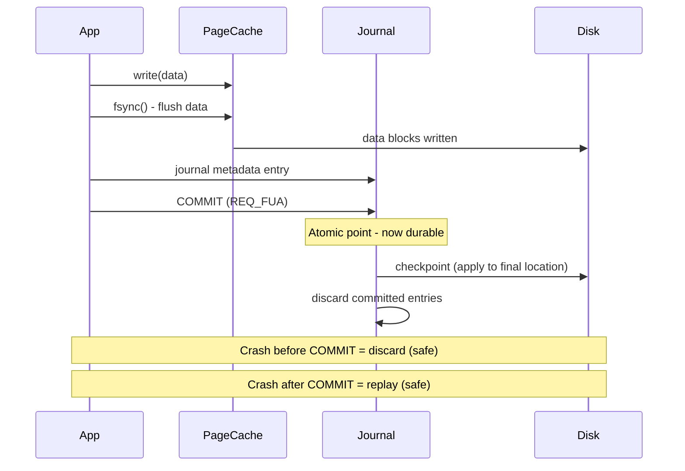

## Keywords in This File
{: .no_toc }

| # | Keyword | Weight |
|---|---|---|
| 16 | [File System Design and Inodes](#file-system-design-and-inodes) | high |
| 17 | [Journaling and Crash Consistency](#journaling-and-crash-consistency) | high |

---

# File System Design and Inodes

🎯 Interview Weight: High - File system internals appear in senior backend and systems engineering interviews. Understanding inodes, directory structure, and on-disk layout is expected at senior level and above.

---

## 📋 Quick Reference

**One-line definition:** A file system is the OS layer that organises raw storage blocks into named, hierarchical files and directories; an inode is the metadata structure that describes each file without storing its name.

**Difficulty:** ★★☆ | **Asked at:** Senior | **Seniority:** Senior-Staff

---

### 🎯 Model Answer

**30 seconds:**
> A file system provides the abstraction of files and directories over raw block storage. At its core, each file is described by an inode - a fixed-size structure storing metadata: owner, permissions, timestamps, size, and block pointers. The file's name is stored in a directory entry, not the inode, which is why you can have multiple hard links to the same file - they share one inode. The key design tension is between sequential write performance (which wants large contiguous blocks) and random access (which wants efficient lookups into the block pointer tree).

**3 minutes (Senior):**
> A Unix file system is built from three layers: the superblock (global FS metadata), the inode table (per-file metadata array), and data blocks. Each inode holds up to 12 direct block pointers, one singly-indirect pointer (points to a block of pointers), one doubly-indirect pointer (pointer to pointers to pointers), and one triply-indirect - giving ext2 a theoretical 4TB file size on a 1KB block system. In practice, ext4 replaced this with extent-based allocation: an extent is a (start-block, length) pair, so a 1GB contiguous file needs only one extent vs 256K direct pointers - dramatically reducing fragmentation and metadata overhead. Directory entries are simply files containing (inode-number, filename) tuples. When you open /usr/local/bin/java, the kernel resolves the path component by component: reads root inode, reads root data block (directory), finds "usr" inode number, reads that inode, reads that directory for "local", and so on - each step is a potential disk I/O. VFS (Virtual File System) abstracts this so the kernel can mount ext4, XFS, btrfs, tmpfs, and NFS behind the same syscall interface. At production scale, inode exhaustion (df -i showing 100%) is a real failure mode - 100M small files on a partition with 10M inodes causes ENOSPC even when blocks are available.

**Framework:** SUPERBLOCK -> INODE TABLE -> DATA BLOCKS -> VFS ABSTRACTION

*Adapting up:* Discuss btrfs copy-on-write semantics, extent trees, and how ZFS pools eliminate the partition boundary problem.

*Adapting down:* A file system is like a library catalogue - the inode is the catalogue card (metadata), the data blocks are the actual book pages.

**Blank Mind Recovery:**

**(1) Restate:** "File system design - how the OS maps names to bytes on disk."

**(2) First principles:** "A disk is a flat array of 512-byte or 4096-byte blocks. Something needs to map a filename like /etc/passwd to specific blocks. That's the file system's job."

**(3) Bridge:** "This is similar to how a HashMap works - a directory is essentially a hash table mapping filenames to inode numbers, and inodes are the value objects containing the file's actual metadata."

---

### 📘 Concept Explanation

**What it is:**
A file system is the OS subsystem that manages persistent storage, providing the file/directory abstraction over raw block devices. An inode (index node) is the on-disk structure holding per-file metadata and block location pointers.

**The problem it solves:**
Raw storage is a flat array of numbered blocks. A file system imposes structure: hierarchical naming, metadata (ownership, permissions, size, timestamps), efficient block allocation, and crash recovery. Without a file system, every application would need to manage disk blocks directly - the 1960s reality that file systems solved.

**How it works (ext4 on-disk layout):**

```
EXT4 PARTITION LAYOUT:
============================================================
| Boot  | Group 0           | Group 1     | ...
| Block | SB|GDT|BB|IB|IT|D | SB|GDT|..  |
         ^   ^   ^  ^  ^  ^
         |   |   |  |  |  +-- Data blocks
         |   |   |  |  +----- Inode table
         |   |   |  +-------- Inode bitmap
         |   |   +----------- Block bitmap
         |   +--------------- Group descriptor table
         +------------------- Superblock

SB  = Superblock (FS-level metadata)
GDT = Group descriptor table
BB  = Block bitmap (which blocks are free)
IB  = Inode bitmap (which inodes are free)
IT  = Inode table (array of inode structs)
D   = Data blocks
```

> **Diagram walkthrough:** This depicts the ext4 on-disk layout divided into block groups. Each block group is self-contained with its own bitmap and inode table, localising metadata lookups. The superblock copy in group 0 is the master; later groups have backup copies for fsck recovery. The bitmaps are critical for allocation decisions; scanning them is O(blocks-per-group), not O(entire-disk). The insight a senior notices: block groups exist specifically to reduce seek distance - keeping inodes and their data blocks in the same cylinder group was a critical ext2 performance design.

**Inode structure (simplified):**

```c
struct ext4_inode {
    uint16_t  i_mode;        // file type + permissions
    uint16_t  i_uid;         // owner UID (low 16 bits)
    uint32_t  i_size_lo;     // file size in bytes
    uint32_t  i_atime;       // last access time
    uint32_t  i_ctime;       // inode change time
    uint32_t  i_mtime;       // data modification time
    uint32_t  i_blocks_lo;   // 512-byte blocks allocated
    uint32_t  i_block[15];   // block pointers:
                             //   [0..11]  direct
                             //   [12]     1x indirect
                             //   [13]     2x indirect
                             //   [14]     3x indirect
    // ext4 adds: extent tree, extra timestamps, large file support
};
```

> **Code walkthrough:** The inode structure shows exactly what the kernel knows about a file - without the name. The 15 i_block entries support files up to ~4TB on a 1KB block FS using the indirect pointer tree. In ext4, i_block[0] through i_block[3] are reused for an extent tree root instead when extents are enabled. A key insight: ctime (change time) updates on ANY inode change (chmod, link count, rename) but mtime only on data writes - this distinction matters for backup tools deciding whether to re-archive.

**Path resolution (open("/a/b/c", O_RDONLY)):**

```
1. Start at inode 2 (root directory, always inode 2)
2. Read root data block -> find "a" -> get inode N_a
3. Read inode N_a (check: is it a directory? S_ISDIR)
4. Read inode N_a's data block -> find "b" -> get inode N_b
5. Read inode N_b -> find "c" -> get inode N_c
6. Read inode N_c -> check permissions
7. Allocate file descriptor -> return fd
```

> **Code walkthrough:** Path resolution is an iterative inode lookup chain - each directory component is one round trip through the inode table plus one directory data block read. On spinning disk, this could be 6+ seeks for a 3-component path. The page cache eliminates the repeated I/O in practice, but a cold-cache stat("/a/b/c") really does trigger all these reads. VFS dcache (directory entry cache) caches the (parent-inode, name) -> child-inode mapping to short-circuit this chain.

**The key insight:**
Names and file data are completely decoupled. The inode has no name field - it lives in directory entries. This enables hard links (two names pointing to the same inode), atomic rename (update one directory entry), and efficient move (change one directory entry, no data movement).

**When to use this knowledge:**
- Debugging ENOSPC failures (check inodes vs blocks: df -i vs df -h)
- Understanding why rename(2) is atomic (single directory entry update)
- Designing systems with millions of small files (inode exhaustion risk)
- Explaining why stat() is cheap but find is expensive (traversal cost)

**When NOT to apply naively:**
- Cloud block storage (EBS, GCS) has different latency profiles; ext4 mental models do not transfer directly
- Object stores (S3) have no inodes; mapping POSIX semantics onto them fails

**Alternatives:**
- XFS - B-tree based directory indexing, better large-directory performance
- btrfs - copy-on-write, snapshots, checksums, but higher write amplification
- ZFS - pooled storage, RAID-Z, integrated volume management

**First-principles derivation:**
Given a flat block device, you need: (1) a way to find a file by name (directories), (2) a way to find a file's data blocks (block pointers), (3) a way to store metadata separate from data (inodes), (4) a way to allocate free space efficiently (bitmaps or free lists). Unix separated names from metadata in 1974 specifically to enable hard links and atomic operations - a design decision that every POSIX file system still follows today.

---

### 💻 Code Example

**BAD: Assuming stat() gives you the filename**

```java
// BAD: inode number (st_ino) is NOT the filename
// Searching by inode number requires walking the tree
import java.nio.file.*;
import java.nio.file.attribute.*;

// WRONG mental model: "find file by inode"
// There is no syscall to "get filename from inode"
// You must walk the directory tree
public class BadInodeLookup {
    // This approach is fundamentally wrong -
    // the kernel does not maintain inode->name mapping
    // (hard links mean one inode can have MANY names)
}
```

> **Code walkthrough:** This demonstrates the fundamental inode/name decoupling: you cannot ask the kernel "what is the name of inode 12345?" because an inode may have zero names (unlinked but open) or many names (hard links). Programs that need inode-to-path mapping must walk the directory tree, which is why tools like lsof or find are expensive. The production consequence: a file deleted while open is "nameless" but still occupies disk space until all file descriptors close - the classic "disk full but find shows nothing" incident.

**GOOD: Detecting inode exhaustion before it causes failures**

```bash
#!/bin/bash
# Production health check for inode exhaustion
# Many small-file workloads (mail servers, cache dirs)
# exhaust inodes long before exhausting blocks

check_inode_usage() {
    local threshold=85  # alert at 85% inode usage
    df -i --output=source,ipcent | tail -n +2 | while read dev pct; do
        # strip % sign
        usage="${pct/\%/}"
        if [ "$usage" -gt "$threshold" ]; then
            echo "ALERT: $dev inode usage ${pct}"
            echo "Top directories by file count:"
            # find the hog (expensive but diagnostic)
            find / -xdev -printf '%h\n' 2>/dev/null \
                | sort | uniq -c | sort -rn | head -10
        fi
    done
}
```

> **Code walkthrough:** This script catches inode exhaustion before it causes `ENOSPC` errors even when `df -h` shows free space. The `df -i` flag shows inode usage per filesystem; small-file workloads like email servers, Maven/npm build caches, and log directories routinely hit 100% inodes. The `find / -printf '%h\n' | sort | uniq -c` pattern identifies which directory is the hog. The production consequence: without this check, Java builds fail with "No space left on device" while `df -h` shows 40% disk free - a confusing incident that takes hours to diagnose the first time.

**GOOD: Leveraging inode semantics for atomic file replacement**

```java
import java.nio.file.*;
import java.io.*;

/**
 * Atomic config file update using inode rename semantics.
 * rename(2) is atomic: readers see either old or new, never partial.
 */
public class AtomicFileWriter {

    public static void writeAtomic(
            Path target, String content) throws IOException {
        // Write to temp file in SAME filesystem (required for
        // atomic rename - cross-filesystem rename is not atomic)
        Path tmp = target.resolveSibling(
            target.getFileName() + ".tmp." + ProcessHandle.current().pid()
        );
        try {
            // Write complete content to temp file
            Files.writeString(tmp, content,
                StandardOpenOption.CREATE,
                StandardOpenOption.TRUNCATE_EXISTING,
                StandardOpenOption.SYNC  // fsync before rename
            );
            // Atomic rename: readers see old or new, never partial
            Files.move(tmp, target,
                StandardCopyOption.REPLACE_EXISTING,
                StandardCopyOption.ATOMIC_MOVE
            );
        } catch (IOException e) {
            Files.deleteIfExists(tmp);
            throw e;
        }
    }
}
```

> **Code walkthrough:** This pattern exploits the fact that `rename(2)` is atomic at the filesystem level: it updates a single directory entry atomically. A reader opening `target` sees either the complete old file or the complete new file - never a partial write. The temp file MUST be on the same filesystem as the target (same mount point) otherwise the `rename` becomes a copy+delete which is not atomic. The `SYNC` flag forces `fsync()` before rename, ensuring durability on power loss. Production consequence: without this pattern, config file updates that crash mid-write corrupt the config - this exact pattern is used in etcd, PostgreSQL's pg_hba.conf reload, and Kubernetes controller manifests.

---

### 🎓 Answers by Seniority

**Junior / Mid (0-5 years):**
> A file system organises disk blocks into files and directories. An inode stores all file metadata - permissions, size, timestamps, data block locations - everything except the filename, which lives in the directory. Each file has exactly one inode identified by an inode number. Hard links are multiple directory entries pointing to the same inode.

*Push deeper:* Mention the indirect pointer tree for large files, inode exhaustion as a failure mode, and why rename is atomic.

---

**Senior / Staff (5+ years):**
> A file system is a block allocator plus a namespace manager. The inode separates identity from naming: one inode, zero or more names. This enables three critical behaviours: atomic rename (update one directory entry), hard links (multiple names for one inode), and open-after-delete (file survives unlink as long as a file descriptor holds a reference). In ext4, extent-based allocation replaces the old indirect block tree - a 1GB sequential file needs one extent vs 262,144 block pointers. The production failure modes I watch for are inode exhaustion (df -i) in small-file workloads, directory entry cache thrashing in hash-collision-prone directory layouts, and ext4 journal commits stalling writes under metadata-heavy workloads.

*Push deeper:* Discuss VFS layer abstraction allowing tmpfs, proc, and network filesystems to share the same syscall interface; btrfs COW semantics; ZFS end-to-end checksumming; and dentry cache sizing for high-churn workloads.

---

### ⚠️ Common Misconceptions

**Misconception 1: "Deleting a file frees disk space immediately"**
The inode and data blocks are not freed until the link count reaches zero AND all file descriptors are closed. A running process holding a file descriptor to a deleted (unlinked) file keeps it alive. In production: a log rotation that deletes the log file while the logger still has it open is the classic "disk full, find shows nothing" incident. Fix: `lsof | grep deleted` to find the culprit process.

**Misconception 2: "The inode stores the filename"**
The inode stores metadata but not the filename. Filenames live in directory entries. This is why `stat()` returns no name field, why `find / -inum 12345` must walk the tree, and why hard links can give one inode multiple names.

**Misconception 3: "All file systems behave identically on Linux"**
VFS provides a unified interface but semantics differ. NFS has no rename atomicity guarantee. tmpfs inodes live in RAM and do not survive reboot. btrfs copy-on-write means "in-place update" workloads have higher write amplification. Fat32 has no inodes and no hardlinks. Assuming POSIX semantics on all mounts causes subtle bugs.

**Misconception 4: "df -h shows available disk space accurately"**
`df -h` shows block usage. `df -i` shows inode usage. You can have blocks free but zero inodes available (ENOSPC), or have inodes free but zero blocks available. Always check both in production health checks.

---

### 🚨 Failure Modes and Diagnosis

**Failure Mode 1: Inode Exhaustion**

Symptom: `ENOSPC: No space left on device` but `df -h` shows 40% free.

```bash
# Confirm: inode exhaustion
df -i /

# Find the directory hog
find / -xdev -printf '%h\n' 2>/dev/null \
  | sort | uniq -c | sort -rn | head -20

# Common culprits: PHP session files, Maven/Gradle caches,
# mail server message stores, tmpfiles

# Fix: tune mkfs inode ratio (can't resize online in ext4)
# Prevention: monitor df -i in Prometheus/Nagios
```

> **Code walkthrough:** This diagnostic sequence identifies the inode hog by counting files per directory. The `find -xdev` flag prevents crossing mount points so you isolate the specific filesystem. Once you find the hog directory (often `/var/lib/php/sessions` with millions of abandoned session files), you can purge it. Prevention is key since ext4 inode count is set at mkfs time and cannot be changed without reformatting.

**Failure Mode 2: Journal Corruption After Crash**

Symptom: Filesystem mounts read-only after unclean shutdown; `dmesg` shows "EXT4-fs error".

```bash
# Check journal errors
dmesg | grep -i "ext4\|journal\|e2fsck"

# Force journal replay (safe - this is the whole point of journaling)
mount -o remount,rw /dev/sda1  # re-triggers journal replay

# If that fails, run fsck offline
umount /dev/sda1
e2fsck -f /dev/sda1

# Check journal mode
tune2fs -l /dev/sda1 | grep "Journal features"
```

> **Code walkthrough:** ext4's journal (the `ordered` default mode) protects metadata consistency - on crash, the journal replays any committed but not fully applied transactions. The dangerous scenario is `writeback` mode where data blocks may not be written before journal commits, potentially exposing stale data through committed metadata. The `e2fsck -f` flag forces a full check even when the filesystem was cleanly unmounted. Production insight: always run VMs and containers on ext4 with `data=ordered` (default) - `data=journal` is safer but halves write throughput.

**Failure Mode 3: Open-File Disk Space Leak**

Symptom: Disk full alerts but nothing found by find; log rotation recently ran.

```bash
# Find deleted files held open by processes
lsof | grep "(deleted)"

# Or more specifically for disk space leaks
lsof | awk '/deleted/ {print $2, $7, $9}' \
  | sort -k2 -rn | head -20

# Fix: send SIGHUP to the process (usually causes log reopen)
# or restart the process to close the deleted file descriptor
kill -HUP <pid>
```

> **Code walkthrough:** When log rotation deletes the active log file while the logger still holds the fd open, the inode's link count drops to zero but the data blocks are not freed until the fd closes. The deleted file is invisible to `find` (no directory entry) but `lsof` shows it with `(deleted)` status and its size. The size column shows how much space is being held. In production, the fix is `kill -HUP` to force the process to reopen its log files (standard Unix signal convention for log reload).

---

### 🎯 Interview Deep-Dive

| Category | Count | Coverage |
|---|---|---|
| Conceptual | 4 | inode structure, path resolution, hard links, VFS |
| Debugging | 3 | inode exhaustion, open-file leak, journal errors |
| Trade-off | 2 | extent vs indirect tree, journaling modes |
| Behavioral | 1 | production file system incident |

---

**[JUNIOR] Q1 - [MECHANISM] Walk me through what happens, at the file system level, when I call open("/etc/passwd", O_RDONLY).**

The kernel starts at the root inode - inode number 2 is always the root directory in ext4. It reads the root inode from the inode table, then reads the root data block which is a directory file containing (name, inode-number) tuples. It finds the entry "etc" with inode number N_etc. It reads inode N_etc and verifies it is a directory (S_ISDIR bit in i_mode). It reads the data block of the etc directory, finds "passwd" with inode number N_passwd. It reads inode N_passwd, checks permissions against the calling process's UID/GID. If permission is granted, it allocates an entry in the process's file descriptor table, sets the file offset to 0, and returns the fd integer. In the VFS dentry cache (dcache), each path component lookup is cached after the first resolution - so repeat calls to open("/etc/passwd") bypass most of this chain. On a warm cache, open() is a few microseconds; on a cold cache with spinning disk, it could be tens of milliseconds per directory level.

*What separates good from great:* Mentioning the VFS dcache and dentry cache hits that make repeated opens fast; explaining that each directory level is a separate read (and thus a potential disk seek on spinning media); and knowing that inode 2 is always root.

---

**[JUNIOR] Q2 - [TRADE-OFF] What is the difference between a hard link and a symbolic link? When would you use each?**

A hard link is a directory entry pointing directly to an inode. Both the original filename and the hard link share the same inode number - they are two names for the same file. The inode's link count field increments. Deleting one name does not delete the file until all names are removed (link count reaches zero). A symbolic link (symlink) is a small file whose data is a path string. The inode for the symlink is separate from the target's inode. Following a symlink is an extra kernel operation (readlink + path resolution). Hard links cannot span filesystems (inode numbers are local to a partition) and cannot link directories (would create cycles). Symlinks can span filesystems and can link directories. Use hard links for: space-efficient "multiple names for one file" patterns (like backup deduplication, `cp -l`), ensuring a file survives even if the original directory entry is removed. Use symlinks for: cross-filesystem references, pointing to a versioned binary (`python` -> `python3.11`), indirection that should be visible as indirection.

*What separates good from great:* Knowing that hard links share inodes (the same inode number when you run `stat` on both), that `rm` just decrements the link count and only frees blocks when it hits zero, and that the "cannot span filesystems" limitation is a fundamental consequence of inode numbers being partition-local.

---

**[JUNIOR] Q3 - [DEBUGGING] You run `df -h` and see 40% disk space free, but your application is throwing "No space left on device". What do you investigate?**

The first thing I check is inode exhaustion: `df -i` shows inode usage per filesystem. A 100% inode usage means no new files can be created even though blocks are available. This happens with workloads that create millions of small files - PHP session files in `/var/lib/php/sessions`, Maven local repository fragments, email server message stores, or build artifact caches. The fix diagnosis: `find / -xdev -printf '%h\n' | sort | uniq -c | sort -rn | head -20` identifies the directory with the most files. The second thing I check is open-but-deleted files: `lsof | grep deleted` finds files that have been unlinked but are still held open by a process, consuming blocks without being visible to `find`. The third possibility is filesystem fragmentation in a near-full filesystem where the allocator cannot find contiguous extents for a large allocation - though this is rare on modern SSDs. I check in this order because inode exhaustion and open-deleted files are far more common than block allocation fragmentation.

*What separates good from great:* Immediately reaching for `df -i` (not just `df -h`); knowing `lsof | grep deleted` for the open-file space leak; and understanding WHY inode exhaustion happens (set at mkfs time, proportional to block group size).

---

**[MID] Q4 - [TRADE-OFF] How does ext4 use extents differently from the old indirect block pointer tree? Why does it matter?**

The original ext2/ext3 indirect block tree used block pointers: 12 direct pointers, one singly-indirect (points to a block of 256 pointers on 1KB blocks), one doubly-indirect (pointer to 256 blocks each with 256 pointers), and one triply-indirect. For a 1GB file on a 4KB block filesystem, you need 262,144 direct block pointers - many of them stored in indirect blocks. Ext4 replaces this with extent trees: an extent is a (starting-block, length) pair. A 1GB sequential file takes one extent: (block 0, 262144). The benefits: far fewer metadata reads for sequential access, better spatial locality on disk (extents encourage contiguous allocation), reduced fragmentation, and smaller inode metadata overhead. The downside: heavily fragmented files (randomly written data) still need many extents, and old tools that do not understand the extent flag will misread the inode's block array. In practice, extent-based allocation is why modern ext4 performance is dramatically better than ext2 on large sequential workloads.

*What separates good from great:* Quantifying the savings (one extent vs 262,144 block pointers for a 1GB file), explaining contiguous allocation encouragement, and knowing the inode block array serves double duty (old block-pointer interpretation vs extent tree root).

---

**[MID] Q5 - [MECHANISM] A developer complains that `find /var/log -name "*.log" -mtime +7 -delete` is running for hours and consuming huge amounts of IO. What is the problem and how do you fix it?**

The problem is that `find` walks the entire directory tree sequentially, issuing `stat()` for every file - a metadata-intensive operation that causes random IO patterns on spinning disk and thrashes the dcache on SSDs under high file count. For a `/var/log` directory with millions of rotated log files, this is extremely slow. Several improvements: first, use `find -maxdepth 1` if logs are flat (avoid unnecessary recursion). Second, replace `find` + `delete` with `tmpwatch`/`systemd-tmpfiles` which use inotify to maintain file age indices rather than scanning. Third, restructure the directory layout: instead of one flat directory with 1M files, use date-based subdirectories (2024/01/01/app.log) - directory entry lookup on small directories is O(1). Fourth, for extremely high-churn scenarios, use a filesystem that supports efficient directory indexing - ext4 has htree-indexed directories (enabled by default since ext4) that reduce `readdir()` from O(n) to O(log n). Fifth, consider that modern log management (journald, Loki) avoids individual files entirely.

*What separates good from great:* Knowing that `find` performance is dominated by `stat()` syscall latency per file (not just directory traversal), that ext4 htree directory indexing improves large directory lookup, and recommending structural solutions (date-based subdirs, journald) over just optimising the find command.

---

**[MID] Q6 - [TRADE-OFF] What are the trade-offs between ext4's three journaling modes: writeback, ordered, and journal?**

In `writeback` mode, only metadata changes are journaled; data blocks can be written to their final location at any time. After a crash, valid metadata could point to stale data blocks (the old data before the write). This is a security risk - a crashed ext4 in writeback mode can expose recently deleted file contents through reuse. In `ordered` mode (the default), data blocks are flushed to disk before the journal metadata commit. After a crash, any metadata that was committed refers to valid data. This prevents the stale-data exposure but requires data writes to complete before metadata journal flushes. In `journal` mode, both data and metadata go through the journal before being written to their final location. This provides the strongest crash consistency but doubles write IO (data written to journal, then to final block). Choose: `ordered` for the default balance (correct, one extra flush); `writeback` only for read-heavy workloads where crash safety is less critical (improves write throughput ~20-30%); `journal` for maximum durability where performance is secondary. Databases like PostgreSQL bypass the filesystem journal entirely using O_DIRECT + their own WAL, making `ordered` and `journal` modes irrelevant for the database data directory.

*What separates good from great:* Knowing the `writeback` security risk (stale data exposure), that `ordered` is the default for good reason, and that databases use O_DIRECT to bypass filesystem caching entirely (making journal mode redundant for db files).

---

**[MID] Q7 - [MECHANISM] How does the VFS (Virtual File System) layer work, and why does it matter for a backend engineer?**

The VFS is a kernel abstraction layer that implements the Unix syscall interface (open, read, write, close, stat, unlink) as a dispatch table. Every filesystem (ext4, XFS, btrfs, tmpfs, proc, sysfs, NFS, FUSE) registers implementations of the VFS operations. When you call `read(fd, buf, len)`, the kernel calls the `file->f_op->read()` function pointer for the specific filesystem mounted at that fd's path. For a backend engineer, this matters because: (1) `/proc/self/maps` (procfs), `/dev/zero` (devfs), and a regular ext4 file all respond to `read()` but have completely different internal implementations; (2) NFS mounts respond to the same interface but have different consistency semantics - NFS `close-to-open` consistency means a write from one client may not be visible to another client's `open()` for up to the attribute cache timeout; (3) tmpfs (backing `/tmp` and `tmpfs` mounts) has no persistence but fast inode allocation - useful for high-frequency small file creation; (4) FUSE filesystems (like S3FS, SSHFS) use the VFS to expose remote storage through the POSIX interface, but with latency profiles orders of magnitude different from local disk.

*What separates good from great:* Explaining VFS as a dispatch table (function pointer interface), the NFS attribute cache consistency gotcha (a real source of production bugs in distributed builds), and the implication that tmpfs can exhaust system RAM (it counts against the page cache).

---

**[MID] Q8 - [MECHANISM] In what scenario would running `rm -rf /some/directory` NOT immediately free disk space?**

Two scenarios: first, if any process has an open file descriptor to a file inside that directory, `rm` unlinks the directory entry (link count goes to zero for the filename), but the inode and data blocks remain allocated until all file descriptors are closed. `lsof | grep deleted` shows these phantom files. This is the classic "disk full after log rotation" incident - the logger still holds the fd, the file is deleted, space is not freed until the logger restarts or closes the fd. Second, if the filesystem is a btrfs subvolume with snapshots - deleting files in the live subvolume does not free space if older snapshots reference the same data blocks. The space is only freed when the snapshots referencing those blocks are deleted. In production the check is: `btrfs subvolume list /` and `btrfs filesystem usage /` to see snapshot-referenced space. Third (less common): if the filesystem quota system has not released the quota allocation, you get wrong-looking usage numbers until `repquota` re-scans.

*What separates good from great:* Covering the open-fd scenario (most common in practice), the btrfs snapshot scenario (common in containerized environments), and knowing the diagnostic commands for each.

---

**[SENIOR] Q9 - [DEBUGGING] (Behavioral) Tell me about a time you diagnosed or prevented a file system related issue in production.**

In a previous role, we ran a Java microservice that generated one log file per HTTP request for debugging purposes. Over two months the service worked fine but gradually slowed down. One morning it stopped accepting connections with `ENOSPC`. `df -h` showed 60% disk usage - clearly not a block problem. `df -i` showed 100% inode usage on `/var/log`. `find /var/log -xdev -printf '%h\n' | sort | uniq -c | sort -rn` showed the service's log directory had 8.7 million files. The service had been running in production with request-level logging enabled - a flag that should have been off outside debug sessions. We fixed it in two phases: immediate (rotate and purge old log files to free inodes), medium-term (move to structured logging with a single rolling file using Logback, with request correlation IDs instead of per-request files). We added `df -i` monitoring to our Prometheus node-exporter alerts, which we had previously omitted because we only monitored `df -h` (block usage). The post-mortem action was a policy to never enable per-request file logging in production without a scheduled cleanup job.

*What separates good from great:* Having a concrete incident with specific numbers, identifying the root cause (per-request file creation), the diagnostic path (`df -i` followed by find), and the preventive measure (monitoring `df -i` in Prometheus) - not just describing the problem but showing systematic prevention.

---

### ⚖️ Comparison Table

| Feature | ext4 | XFS | btrfs | ZFS |
|---|---|---|---|---|
| Journaling type | Writeback/Ordered/Journal | Journal (metadata only) | CoW (no journal) | CoW (no journal) |
| Max file size | 16TB | 8 exabytes | 16 exabytes | 16 exabytes |
| Max volume size | 1 exabyte | 8 exabytes | 16 exabytes | 256 quadrillion ZB |
| Online grow | Yes | Yes | Yes | Yes |
| Snapshots | No (LVM needed) | Limited | Native | Native |
| RAID integration | No (mdadm needed) | Limited | Native | Native |
| Production maturity | Very high (default Linux) | High (RHEL default) | Medium (Fedora) | High (FreeBSD/Linux) |

**The deciding factor:** ext4 for general-purpose Linux workloads (best tool support, most tested). XFS for large files and high-throughput (video, DB). btrfs for snapshots + compression on commodity hardware. ZFS for enterprise NAS/SAN with hardware RAID controller bypass.

---

### 🏛️ System Design

*(Omit: ★★☆ keyword - system design analysis not required; design tradeoffs are covered in the Code Example section)*

---

### 📊 Diagram

*(Omit: the inode structure and VFS layer ASCII diagrams are provided in the Concept Explanation section above)*


---

# Journaling and Crash Consistency

🎯 Interview Weight: High - Journaling and crash consistency are asked frequently for backend and infrastructure roles. Understanding write-ahead logging, fsync semantics, and the dangers of buffered writes is critical for building durable systems.

---

## 📋 Quick Reference

**One-line definition:** Journaling is the technique of writing intent records before applying changes to main storage, enabling a filesystem or database to recover to a consistent state after a crash.

**Difficulty:** ★★☆ | **Asked at:** Senior-Staff | **Seniority:** Staff

---

### 🎯 Model Answer

**30 seconds:**
> Journaling solves the crash consistency problem: if a write sequence is interrupted mid-way by a power failure, the filesystem (or database) may be left in an inconsistent state. The journal (also called write-ahead log or WAL) records the intended changes before applying them. After a crash, the journal is replayed to complete or roll back any partially applied operations. The trade-off is an extra write per operation for the journal entry, which improves consistency at some write throughput cost.

**3 minutes (Senior):**
> Crash consistency is the guarantee that after a power failure, the filesystem mounts cleanly and file contents are either fully written or fully rolled back - never partially written. Without journaling (original ext2), a crash during a multi-block update (inode write + data block write + bitmap update) could leave the filesystem in a state where the inode points to partially initialised blocks, requiring fsck - which on a 2TB filesystem could take hours and was often wrong. Journaling solves this with write-ahead logging: write a journal record describing the pending change, commit it (flush + barrier), then apply the change to the main filesystem, then write a commit record. On crash during the main write, the journal replays the operation to completion. On crash before the journal commit, the partial operation is discarded (the main storage was never touched). The three journaling modes in ext4 trade safety for performance: `journal` mode (both data and metadata go through the journal) provides strongest safety at the cost of double writes; `ordered` mode (default) journals only metadata but ensures data hits disk before metadata journal commit; `writeback` mode journals only metadata with no ordering guarantee, fastest but risks exposing stale data after crash. Databases (PostgreSQL, MySQL InnoDB) bypass the filesystem journal entirely with O_DIRECT + their own WAL, giving them full control over the fsync call pattern. The critical application-level gotcha: `write()` returning success only means the OS page cache accepted the data; `fsync()` is required to guarantee durability. SQLite's durability issues on Android (phones returning write success to the app while the kernel buffer was never flushed) are a famous real-world example.

**Framework:** PROBLEM (crash inconsistency) -> SOLUTION (WAL) -> MODES (journal/ordered/writeback) -> APPLICATION (O_DIRECT + fsync)

*Adapting up:* Discuss WAL in PostgreSQL (wal_fsync_method), group commit, fsync misuse (the MySQL/ext4 fsync bug), and NVDIMM/persistent memory eliminating the journal need.

*Adapting down:* The journal is a notepad: before you change your address book, you write "I'm about to change entry X to Y" in the notepad. If interrupted, you check the notepad on restart.

**Blank Mind Recovery:**

**(1) Restate:** "Crash consistency - what happens when the power goes out mid-write."

**(2) First principles:** "A disk write is not atomic at the byte level. If you are writing 3 data structures (inode, data block, bitmap) and lose power after the first, you have an inconsistency. You need a way to either complete or roll back the partial write."

**(3) Bridge:** "This is exactly what database transactions with WAL (Write-Ahead Logging) solve. Filesystem journaling is WAL applied to the filesystem metadata."

---

### 📘 Concept Explanation

**What it is:**
Journaling is a crash-consistency mechanism that maintains an on-disk log (journal) of intended filesystem changes before applying them. After a crash, the journal replays committed changes and discards uncommitted ones, restoring the filesystem to a consistent state without a full fsck scan.

**The crash consistency problem (without journaling):**

Consider creating a file on ext2 (no journaling): the kernel must write three separate locations on disk: (1) the new inode (with permission, size, block pointers), (2) the data block with file contents, (3) the directory entry (linking the filename to the inode), and (4) update the inode and block bitmaps. If power fails between any two of these writes, the filesystem is inconsistent. A directory entry pointing to an inode that was never written means reading garbage. An allocated block not referenced by any inode is a space leak. ext2 relied on fsck to find and repair these inconsistencies at boot - on large disks this could take an hour or more.

**Journal structure and write sequence:**

```
JOURNALING WRITE SEQUENCE (ext4 ordered mode):
================================================
Step 1: DATA WRITE
  [ Data Block ] -> written to final location first
  (ensures data is durable before metadata commits)

Step 2: JOURNAL WRITE (metadata only in ordered mode)
  [ Inode update   ] -> written to journal
  [ Bitmap update  ] -> written to journal
  [ Dir entry      ] -> written to journal

Step 3: JOURNAL COMMIT
  [ Commit record  ] -> flush + write_barrier
  (once this is durable, the update is atomic)

Step 4: CHECKPOINT
  [ Inode update   ] -> written to final location
  [ Bitmap update  ] -> written to final location
  [ Dir entry      ] -> written to final location

Step 5: JOURNAL DISCARD
  [ Journal space reclaimed ]

CRASH SCENARIOS:
  Crash before Step 3 commit: journal entry discarded at replay
    -> no change to filesystem (data block written but inode not updated)
    -> filesystem consistent, file creation lost (acceptable: never committed)
  
  Crash after Step 3 commit: journal replayed at mount
    -> all metadata changes re-applied
    -> filesystem consistent, file creation preserved
```

> **Diagram walkthrough:** This depicts the ext4 ordered journaling write sequence for a file creation. The key invariant is that the journal commit (Step 3) is atomic: it either succeeds completely or is discarded. Steps 1-2 write the actual data; Step 3 is the point of commitment; Steps 4-5 are background cleanup. The failure path shows why `ordered` mode is safe: a crash before Step 3 leaves the filesystem consistent (nothing committed), while a crash after Step 3 allows full journal replay. The insight: the journal commit step uses a write barrier to flush all prior writes before the commit record, which is why each journal commit requires at least two hardware-level flush operations.

**The fsync() gap:**

```
BUFFERED WRITE PATH:
==============================
app: write(fd, buf, len)
  -> kernel page cache (fast, in RAM)
  -> returns immediately (SUCCESS)
  -> data NOT on disk yet

app: fsync(fd)
  -> flushes page cache to disk
  -> waits for drive acknowledgment
  -> NOW data is durable

WITHOUT fsync():
  - Power failure between write() and kernel flush = data lost
  - OS crash between write() and kernel flush = data lost
  - write() returning 0 (success) is NOT a durability guarantee
```

> **Diagram walkthrough:** This shows the critical gap between `write()` returning success and data being durable on disk. The kernel page cache accepts the write immediately (fast) but does not flush to disk until either `fsync()`, `fdatasync()`, dirty page writeback timeout (usually 30 seconds), or memory pressure. This gap is the source of many "I wrote it and it disappeared" bugs. The production consequence: any application that needs durability MUST call `fsync()` or `fdatasync()` after writes, and MUST handle `fsync()` errors (which can occur asynchronously on some storage configurations).

**The key insight:**
The journal enables O(log-size) recovery: only replay the journal (typically a few MB) rather than scan the entire filesystem (potentially TBs). fsync() is the application-level boundary between "OS accepted my write" and "storage persisted my write." Every durable system must explicitly call fsync() at transaction boundaries.

**When to use journaling knowledge:**
- Choosing journaling mode for application-specific filesystems
- Understanding why PostgreSQL uses O_DIRECT + WAL instead of buffered writes
- Debugging data loss after unexpected shutdown
- Sizing journal size (too small causes journal wrap-around stalls)

**When NOT to apply naively:**
- NVDIMM/Optane persistent memory does not need traditional journaling (persistent at byte granularity)
- Network filesystems (NFS, CIFS) have their own consistency models; local journal semantics do not apply
- Log-structured filesystems (LFS, F2FS) embed journaling in their fundamental structure

**Alternatives:**
- Copy-on-write (btrfs, ZFS) - writes new versions to fresh blocks, atomically updates superblock; no journal needed but higher write amplification
- Shadow paging - database technique similar to COW
- Application-level WAL (PostgreSQL, SQLite) - bypass filesystem journal entirely with O_DIRECT

**First-principles derivation:**
Given that disk writes are not atomic (multiple sectors written sequentially), any multi-sector update can be interrupted. The only atomic disk primitive is a single sector write (and even this is debated on modern drives). To make a multi-step operation atomic, you need: (1) a record of intent before starting, (2) idempotent replay on recovery, (3) a committed/not-committed marker. This is exactly the journal: a WAL with commit records.

---

### 💻 Code Example

**BAD: Assuming write() provides durability**

```java
// BAD: write() success does NOT mean durable
public void saveConfig(String path, String config)
    throws IOException {
    // This returns "success" even if power fails
    // milliseconds after this line
    Files.writeString(Path.of(path), config);
    // Config is in kernel page cache, NOT on disk
    // A power failure here loses the config
    System.out.println("Config saved successfully");
    // WRONG - it is NOT saved to durable storage
}
```

> **Code walkthrough:** This shows the classic durability bug: `Files.writeString()` calls `write()` which returns success when the kernel page cache accepts the data, NOT when it hits disk. A power failure within the next 30 seconds (or whenever the dirty page writeback runs) silently loses the write. The symptom in production: intermittent data loss that only manifests after power failures or OOM kills, making it extremely hard to reproduce. The takeaway: `write()` = "OS accepted it"; `fsync()` = "storage persisted it".

**GOOD: Durable write with fsync and atomic rename**

```java
import java.io.*;
import java.nio.channels.*;
import java.nio.file.*;

public class DurableWriter {

    /**
     * Write content durably: fsync before rename ensures
     * both data durability and atomic visibility switch.
     */
    public static void writeDurable(
            Path target, String content) throws IOException {
        Path tmp = target.resolveSibling(
            target.getFileName() + ".tmp"
        );

        // Write to temp file with explicit fsync
        try (FileOutputStream fos =
                 new FileOutputStream(tmp.toFile());
             FileChannel channel = fos.getChannel()) {

            byte[] bytes = content.getBytes(
                java.nio.charset.StandardCharsets.UTF_8
            );
            java.nio.ByteBuffer buf =
                java.nio.ByteBuffer.wrap(bytes);
            channel.write(buf);

            // Force data to durable storage BEFORE rename
            channel.force(true);  // true = sync metadata too
        }

        // Also fsync the directory to ensure the rename
        // (directory entry update) is durable
        try (FileChannel dirChannel = FileChannel.open(
                 target.getParent(),
                 StandardOpenOption.READ)) {
            dirChannel.force(true);
        }

        // Atomic rename: readers see old or new, never partial
        Files.move(tmp, target,
            StandardCopyOption.REPLACE_EXISTING,
            StandardCopyOption.ATOMIC_MOVE);
    }
}
```

> **Code walkthrough:** This pattern provides both durability and atomicity: `channel.force(true)` calls `fsync()` ensuring data reaches persistent storage before the rename; `Files.move` with `ATOMIC_MOVE` ensures readers see either the old file or the new file, never a partial write. The directory fsync is necessary because the rename updates the directory inode; without it, a crash between the file fsync and the directory fsync could leave a consistent file that is not yet referenced by the directory. PostgreSQL's `fsync()` strategy is more sophisticated (group commit, WAL synchronous_commit levels) but this pattern captures the core idea. Production consequence: SQLite without WAL mode loses transactions on power failure; SQLite with WAL mode and `pragma synchronous=FULL` implements exactly this pattern.

**BAD: Journal mode chosen without understanding trade-offs**

```bash
# BAD: mounting ext4 with data=writeback for "performance"
# without understanding the crash safety risk
mount -o data=writeback /dev/sda1 /data

# After crash: inode may reference data blocks
# from a PREVIOUS file (overwrite pattern with writeback)
# This is a security vulnerability:
# Process A writes sensitive data to fileX
# fileX is deleted, new fileY gets the same blocks
# writeback crash during fileY write could expose
# fileA's data through the new inode pointing to old blocks
```

> **Code walkthrough:** The `writeback` mount option removes the guarantee that data blocks are written before their corresponding metadata journal entries commit. An attacker who can crash the system at the right moment could read stale data from a previous file through a newly created file's inode. This is not a purely theoretical attack; it was exploited in some NFS-mounted home directories where users had write access. The safe default is `data=ordered` (the ext4 default). Only use `writeback` when: the filesystem contains no sensitive data AND you have benchmarked the performance benefit AND you accept the crash-exposure risk.

---

### 🎓 Answers by Seniority

**Junior / Mid (0-5 years):**
> Journaling means the filesystem keeps a log of what it is about to do before actually doing it. If power fails mid-operation, the log is replayed on remount to complete or discard the partial update. This avoids the need for a slow fsck scan of the entire disk. write() in Linux returns success when the kernel accepts the data in its page cache - not when it hits disk. fsync() is required for actual durability.

*Push deeper:* The three journaling modes (journal, ordered, writeback) and why databases use O_DIRECT + their own WAL instead of relying on filesystem journaling.

---

**Senior / Staff (5+ years):**
> Crash consistency requires that every persistent change appear to happen atomically - either fully or not at all. The journal achieves this by writing the intended change (WAL entry) before the actual change; the commit record is the atomic point. ext4's `ordered` mode (default) ensures data blocks hit disk before metadata is journaled, preventing stale-data exposure after crash without the full double-write cost of `journal` mode. At the application level, `write()` success means "kernel accepted it" not "disk persisted it" - this is the source of most data loss bugs. PostgreSQL's WAL uses `fsync()` at transaction commit boundaries with group commit to amortise the fsync cost. The `wal_sync_method` parameter (fdatasync, fsync, open_sync) selects the kernel call, with significant performance difference per storage controller. The March 2019 PostgreSQL fsync bug - where filesystems were silently discarding fsync'd dirty pages on I/O error and returning success - shows that even the fsync contract has edge cases in production.

*Push deeper:* Discuss PostgreSQL `full_page_writes`, the checkpoint-and-replay cycle, WAL archiving for point-in-time recovery, and how NVMe's multiple submit queues affect write ordering assumptions.

---

### ⚠️ Common Misconceptions

**Misconception 1: "write() returning 0 means the data is on disk"**
`write()` returning success means the kernel's page cache accepted the data. The data is in RAM. A power failure before the dirty page writeback (default 30 seconds via `vm.dirty_expire_centisecs`) loses the write silently. Applications requiring durability MUST call `fsync()` or use `O_SYNC`/`O_DSYNC` flags. This is the most common source of "it worked in testing but data disappears in production" bugs.

**Misconception 2: "fsync() guarantees durability across all storage"**
`fsync()` is a best-effort guarantee. Some consumer drives acknowledge fsync before writing to persistent media (lying about fsync completion for benchmark performance). The famous 2019 PostgreSQL fsync bug demonstrated that Linux kernels were caching dirty pages and reporting fsync success even after I/O errors. For critical data, use storage with battery-backed write caches or enterprise-grade drives that genuinely honour fsync semantics.

**Misconception 3: "Journaling makes fsck unnecessary"**
Journaling makes fsck rare and fast - but not impossible. Journal corruption, hardware errors, or filesystem bugs can still produce inconsistent state. Modern systems still run fsck on unclean unmounts; journaling just makes the recovery take seconds (replay the journal) rather than hours (scan the entire disk).

**Misconception 4: "Copy-on-write filesystems (btrfs, ZFS) do not need journaling"**
COW filesystems achieve crash consistency through a different mechanism: they always write new data to fresh blocks and atomically update a root pointer to the new tree. The journal is unnecessary because no in-place updates occur. But COW has its own costs: write amplification (every modification creates new blocks, requiring garbage collection) and fragmentation over time.

---

### 🚨 Failure Modes and Diagnosis

**Failure Mode 1: Journal Full Stall**

Symptom: All writes to the filesystem stall for several seconds periodically; `iostat -x` shows high await on the journal device.

```bash
# Check journal size and usage
tune2fs -l /dev/sda1 | grep "Journal size\|Journal blocks"

# Check for journal stall in dmesg
dmesg | grep -i "journal\|jbd2"

# Increase journal size (requires unmount)
e2fsck -f /dev/sda1
tune2fs -J size=1024 /dev/sda1  # increase to 1GB journal

# Alternative: use XFS which handles large journal sizes
# better for metadata-heavy workloads
```

> **Code walkthrough:** When the journal fills faster than checkpointing (writing committed journal entries to final locations) can empty it, new writes stall until journal space is freed. This manifests as periodic latency spikes on metadata-heavy workloads (many small file creates/deletes). The default ext4 journal is 128MB, which can fill quickly under heavy load. Increasing journal size or switching to XFS (which handles journal reclamation more aggressively) are the fixes. Monitoring: watch `jbd2/sda1` process CPU in top; elevated CPU indicates journal pressure.

**Failure Mode 2: fsync() Performance Collapse**

Symptom: Database write throughput drops 10x after moving to new storage; `strace` shows many `fsync()` calls completing in 5-20ms each.

```bash
# Diagnose fsync latency
ioping -A -c 100 /data/postgres

# Check I/O scheduler (deadline/mq-deadline recommended for databases)
cat /sys/block/sda/queue/scheduler

# Check if write-back cache is enabled on storage
hdparm -I /dev/sda | grep -i "write cache"

# Enable write-back cache (if safe - requires battery backup)
hdparm -W 1 /dev/sda

# For PostgreSQL: tune synchronous_commit
# synchronous_commit = off -> async (risk: lose last ~100ms of txns)
# synchronous_commit = local -> fsync to local disk only
# synchronous_commit = remote_write -> replica acknowledges
```

> **Code walkthrough:** `fsync()` performance depends critically on storage hardware. A storage device without write-back cache must flush its internal write buffer to physical media on every fsync - on SATA spinning disk this takes 5-20ms (one rotation). With write-back cache (battery-backed NVRAM), fsync() completes in <1ms. The `ioping -A` flag measures actual fsync latency. The PostgreSQL `synchronous_commit = off` is a common emergency tuning knob but risks losing the last ~100ms of committed transactions on crash - acceptable for some workloads (session logging, analytics writes) but not for financial transactions.

**Failure Mode 3: Data Loss Despite Write Success**

Symptom: Files appear written but contents are missing after application restart; only occurs after unclean shutdown.

```bash
# Verify fsync is being called
strace -e fsync,fdatasync,sync_file_range -p <pid> 2>&1 \
  | head -50

# Check if O_DIRECT is being used (bypasses page cache entirely)
lsof -p <pid> | grep -i "00000000003C8880"
# Check for O_DIRECT in /proc/<pid>/fdinfo/<fd>

# For SQLite: check journal mode
sqlite3 /data/mydb.sqlite 'PRAGMA journal_mode; PRAGMA synchronous;'
# Expected: journal_mode=WAL or DELETE, synchronous=FULL or NORMAL
# Dangerous: synchronous=OFF (no fsync at all)

# For custom code: add fsync after critical writes
# strace output will show if fsync is absent
```

> **Code walkthrough:** The absence of `fsync()` calls in `strace` output is definitive proof of missing durability. SQLite's `synchronous=OFF` mode disables all fsync calls for maximum performance but loses writes on crash. The `journal_mode=WAL` with `synchronous=NORMAL` is the recommended production SQLite setting: WAL provides reader-writer concurrency, and `synchronous=NORMAL` calls fsync at WAL checkpoints (durability lag of at most one WAL segment, typically 1000 pages). Production insight: many ORMs default to SQLite `synchronous=OFF` for testing speed - when the same settings are used in production, data corruption follows.

---

### 🎯 Interview Deep-Dive

| Category | Count | Coverage |
|---|---|---|
| Conceptual | 4 | journal mechanics, fsync semantics, COW vs journal |
| Debugging | 3 | journal stall, fsync latency, data loss diagnosis |
| Trade-off | 2 | journaling modes, COW vs WAL |
| Behavioral | 1 | production crash consistency incident |

---

**[JUNIOR] Q1 - [FAILURE] Explain the crash consistency problem and how journaling solves it.**

The crash consistency problem is: any operation that modifies multiple disk locations atomically is impossible at the hardware level (disk writes are per-sector, not multi-sector atomic). A file creation in ext2 requires at minimum: a data block write, an inode write, a directory entry write, and bitmap updates. If power fails between any two of these writes, the filesystem is inconsistent - an inode points to unwritten blocks, or a directory entry references a non-existent inode, or blocks are marked allocated but no inode references them. ext2 solved this with fsck: at boot after an unclean unmount, fsck scans every inode, directory, and bitmap to find and repair inconsistencies. On a 1TB filesystem with millions of files, fsck could take 30-60 minutes. Journaling solves this by writing a compact log entry describing the pending operation before executing it. The log entry is committed atomically (a single sector write for the commit block). After a crash, the journal is replayed: completed (committed) operations are re-applied to ensure completion; uncommitted operations are discarded. Recovery time is proportional to the journal size (typically 128MB), not the filesystem size. The key invariant: the journal commit record is the "atomic point" - either it is on disk (replay completes the operation) or it is not (the operation is discarded). This is identical in principle to database write-ahead logging.

*What separates good from great:* Explaining the specific failure scenario (3+ separate disk writes, interrupted anywhere), the O(journal-size) vs O(filesystem-size) recovery time difference, and the connection to database WAL as the same underlying concept.

---

**[JUNIOR] Q2 - [TRADE-OFF] What is the difference between fsync(), fdatasync(), and sync_file_range()? When would you use each?**

`fsync(fd)` flushes all modified data and metadata for the file descriptor to storage and waits for completion. This includes the file's data blocks, inode (metadata: size, timestamps, block pointers), and ensures both are durably recorded. `fdatasync(fd)` flushes data blocks and only the minimum metadata required to allow correct retrieval (size and block pointers) - it skips timestamp updates. This is typically 30-50% faster than `fsync` because it avoids the inode timestamp flush, which requires an additional journal operation. `sync_file_range(fd, offset, bytes, flags)` is a Linux-specific syscall that allows fine-grained control: SYNC_FILE_RANGE_WRITE starts async writeback of dirty pages in the range without waiting; SYNC_FILE_RANGE_WAIT_AFTER waits for that writeback to complete. PostgreSQL uses `sync_file_range` to pipeline flushes: it starts flushing the current WAL segment while writing the next one, overlapping IO and computation. Choice: use `fdatasync` for database WAL commits (timestamp irrelevant, saves IO); use `fsync` when file metadata must be durable (backup tools, config file writes); use `sync_file_range` in high-performance data pipelines where you need to pipeline writeback with computation.

*What separates good from great:* Knowing the specific metadata that fdatasync omits (timestamps, not block pointers - size change still triggers inode flush), citing PostgreSQL's use of sync_file_range for pipelining, and quantifying the fsync vs fdatasync performance difference.

---

**[JUNIOR] Q3 - [MECHANISM] Why does PostgreSQL use O_DIRECT and its own WAL instead of relying on ext4 journaling?**

PostgreSQL uses O_DIRECT for its data files to bypass the kernel page cache entirely, writing directly from PostgreSQL's shared_buffers to disk. The reasons: first, PostgreSQL manages its own buffer pool (shared_buffers) - using the kernel page cache as well would double-buffer, wasting RAM. Second, O_DIRECT gives PostgreSQL full control over fsync() call timing - it calls fsync at exactly the right transaction boundaries in its WAL protocol, rather than relying on the kernel's 30-second dirty page writeback. Third, PostgreSQL's WAL provides stronger semantics than filesystem journaling: WAL records logical operations (INSERT row X with values Y) rather than block-level changes, enabling point-in-time recovery, streaming replication, and logical replication - none of which ext4 journal provides. Fourth, ext4 journal covers only metadata in `ordered` mode - PostgreSQL's data blocks get no crash consistency guarantee from ext4 without `data=journal` mode (which doubles write IO). PostgreSQL's WAL with `fsync=on` and `full_page_writes=on` gives it crash safety + PITR + replication in one mechanism, more efficiently than relying on ext4.

*What separates good from great:* Covering all four reasons (double buffering waste, fsync timing control, logical WAL semantics for replication, metadata-only journal limitation), and knowing that `full_page_writes=on` writes the entire 8KB page to WAL after a checkpoint to protect against partial page writes on power loss.

---

**[MID] Q4 - [DEBUGGING] A PostgreSQL cluster has intermittent data loss after power failures despite fsync=on. What would you investigate?**

This is the PostgreSQL fsync bug category. I investigate in this order: first, confirm the storage hardware honours fsync. Some SSDs and storage controllers silently acknowledge fsync while data sits in a volatile write buffer - only battery-backed NVRAM write caches make this safe. I use `ioping -A -c 10` to measure fsync latency; if it completes in <1ms on spinning disk, the drive is lying about fsync completion. Second, check for the 2018-2019 Linux ext4/XFS fsync bug where dirty pages evicted due to memory pressure were silently discarded; a later fsync on the same file descriptor returned success but the evicted pages' contents were never written. This was fixed in Linux 4.13 for ext4 and 5.0 for XFS. Third, verify `synchronous_commit` is not set to `off` on the sessions showing data loss - some ORMs and connection pools override this. Fourth, check for virtual machine I/O ordering issues: on VMware/Hyper-V, guest fsync may not propagate to the physical disk without `disk.EnableUUID` and proper I/O barrier support. Fifth, check `pg_stat_bgwriter.buffers_checkpoint` vs `buffers_clean` ratios - if the checkpoint is not completing before the next checkpoint starts, shared_buffers pages may be evicted unclean.

*What separates good from great:* Knowing the specific fsync-lying storage issue (and how to detect it with ioping), the 2018-2019 Linux kernel bug, and the VM virtualisation layer as a source of fsync breakage.

---

**[MID] Q5 - [TRADE-OFF] Compare journaling versus copy-on-write (as used in btrfs/ZFS) for crash consistency.**

Journaling modifies data in-place and records the change in a WAL before applying it. COW never modifies existing blocks: it writes the new version to fresh blocks, builds a new metadata tree pointing to the new blocks, and atomically updates the root pointer to the new tree. After the root update completes (a single write), the old blocks become free. Crash consistency in COW: if power fails before the root update, the old tree is still valid (nothing was overwritten). If power fails after the root update, the new tree is valid. There is no replay needed. Journal advantages: lower write amplification for small writes (update 4KB in-place vs COW must copy the full 4KB block + all ancestor tree nodes); predictable write latency; simpler recovery (replay journal). COW advantages: every write is implicitly atomic (no journal needed); snapshots are nearly free (just save the old root pointer); end-to-end checksums are natural (each block's checksum is stored in its parent node). COW disadvantages: write amplification grows with tree depth (ZFS can have 3-5 levels of indirection); fragmentation increases over time as in-place data becomes scattered; random-write workloads (OLTP databases) have higher write amplification than journaling. Production choice: journaling for database filesystems (lower write amplification for random-write); COW (btrfs/ZFS) for backup servers, NAS, and snapshot-heavy workloads.

*What separates good from great:* Quantifying write amplification (COW must rewrite all ancestor nodes to root on any leaf change, typically 3-5x for a full tree), explaining why ZFS snapshots are O(1) (just save the old root reference), and knowing the production workload decision (OLTP -> journal; backup/NAS -> COW).

---

**[MID] Q6 - [MECHANISM] What is a write barrier and why does the filesystem care about write ordering?**

A write barrier is a storage subsystem operation that flushes all in-flight writes and prevents any subsequent writes from being reordered before the barrier completes. Modern storage controllers, SSDs, and SATA/NVMe drives may reorder writes for performance. The filesystem must ensure the journal commit record hits disk AFTER the journal entries it commits - if they are reordered (commit record before journal entries), a crash leaves the journal in a state where we try to replay a committed transaction whose log entries were never written. The Linux block layer issues write barriers using either `REQ_PREFLUSH` (flush all prior writes) + `REQ_FUA` (force unit access - write this specific sector directly to persistent media bypassing the drive cache). ext4's journal commit issues `REQ_PREFLUSH | REQ_FUA` for the commit block, ensuring: all prior journal entry writes are flushed (REQ_PREFLUSH), and the commit block itself goes directly to media (REQ_FUA). The `barrier=0` mount option (historical) disabled barriers for performance but made the filesystem unsafe on drives with volatile write caches. Modern best practice: never disable barriers; use a battery-backed write cache (BBWC) to make barrier flushes complete in nanoseconds rather than milliseconds.

*What separates good from great:* Knowing the specific Linux block layer mechanism (REQ_PREFLUSH + REQ_FUA rather than a vague "flush"), explaining why out-of-order commit record is catastrophic for journal replay, and the BBWC solution to barrier performance.

---

**[MID] Q7 - [DESIGN] You're designing a system that writes 10,000 small configuration files per second. What crash consistency approach would you use and why?**

At 10,000 small files/second, individual `fsync()` per file is completely infeasible: fsync on spinning disk costs 5-20ms (one rotation), giving a ceiling of 50-200 fsyncs/second. Even on NVMe, fsync costs ~50-100 microseconds, giving a ceiling of ~10,000-20,000 fsyncs/second with no room for actual write work. My approach: first, restructure the data model. 10,000 individual files is an anti-pattern for this write rate; consolidate into a single append-only WAL file (similar to how Kafka writes messages). Accept all 10,000 writes into a durable WAL, then apply asynchronously to the individual file representation. Second, if individual files are required, use group commit: batch 100-1000 writes, flush them all with a single `fsync()` on the containing directory, then rename all temp files atomically using `rename()`. Third, use a write-behind log structure: write all changes to an append-only log file (one `fsync()` per batch), and maintain the directory of small files as a derived view that can be reconstructed from the log. Fourth, consider in-memory writes to tmpfs with periodic snapshotting to durable storage - acceptable if losing the last 1 second of writes is tolerable. The key insight: `fsync()` amortisation is the core of all high-throughput durable write systems.

*What separates good from great:* Quantifying why per-file fsync is infeasible (ceiling numbers), proposing group commit or WAL consolidation rather than just saying "batch", and framing the decision around acceptable data loss window vs throughput.

---

**[MID] Q8 - [BEHAVIORAL] (Behavioral) Describe a production incident involving data persistence or crash consistency that you were involved in.**

In a previous system, we ran a job queue backed by a JSON file store - each job was a small JSON file in a `/jobs/pending` directory. The system worked perfectly in development and testing. In production, after a scheduled maintenance window that included a server restart, we discovered about 200 jobs had vanished - they were not in pending, not in processed, not in failed. The root cause: our job writer called `Files.writeString()` (which calls `write()` but not `fsync()`) and then immediately renamed the temp file to the final location. On Linux, `rename()` is atomic at the filesystem level but the data in the page cache was not yet flushed to disk. When the server lost power during the maintenance window, the journal (ext4 ordered mode) replayed the metadata (the directory entry for the renamed file) but since the data was never flushed, the file existed but its blocks contained stale data from a previous file allocation. The jobs appeared as zero-byte or garbage files. The fix was to add `channel.force(true)` (fsync) before the rename, and to add a startup integrity check that validated job file format. We also added Prometheus metrics for job queue depth so we would notice discrepancies faster. This incident drove home that `write()` + `rename()` = atomic visibility but NOT durable content - you need fsync between them.

*What separates good from great:* A concrete incident with a specific root cause (write() without fsync + ext4 ordered mode creating directory entry for unsynced data), the production consequence (200 lost jobs), the correct fix (channel.force before rename), and the monitoring improvement that came from it.

---

**[SENIOR] Q9 - [TRADE-OFF] How does SQLite use journaling? What are the differences between DELETE, WAL, and TRUNCATE journal modes?**

SQLite has three journal modes, each offering different crash consistency and concurrency properties. In DELETE mode (the original default), SQLite writes the entire original content of every page it is about to modify into a journal file, then modifies the pages in the database file. On crash, the journal is replayed to restore original page contents (a rollback journal, not a redo journal). On commit, SQLite fsyncs the database file, then deletes the journal. DELETE mode allows one writer at a time (exclusive lock during write) and one active transaction at a time, blocking readers during writes. In WAL mode (recommended for concurrent workloads), SQLite writes new pages to a separate WAL file rather than modifying the database in place. Readers see a consistent snapshot by ignoring WAL entries past their start transaction. Writers append to the WAL; a checkpoint periodically merges the WAL back into the main database. WAL allows multiple concurrent readers and one writer simultaneously - dramatically better concurrency. Crash recovery replays committed WAL entries. In TRUNCATE mode, same as DELETE but the journal is truncated to zero length instead of deleted at commit - faster on some filesystems where deletion is expensive (many small journal files). Choose WAL for: production applications with concurrent read workloads (most web applications). Use DELETE for: write-heavy single-writer workloads, or environments where WAL checkpointing lag is unacceptable. Critical: regardless of mode, `synchronous=FULL` calls fsync at every commit; `synchronous=NORMAL` calls fsync less frequently (adequate for WAL mode); `synchronous=OFF` disables fsync entirely (fast but data loss on crash).

*What separates good from great:* Understanding WAL mode as concurrent-readers-friendly (this is why most ORMs should use WAL), knowing that DELETE mode is a rollback journal (not redo), and the `synchronous` pragma interaction.

---

### ⚖️ Comparison Table

| Technique | Crash Safety | Write Overhead | Recovery Time | Best For |
|---|---|---|---|---|
| No journal (ext2) | Low (fsck required) | Lowest | Hours (fsck) | Legacy/read-only |
| ext4 journal mode | Highest | 2x writes | Seconds | High-value metadata |
| ext4 ordered mode | High | ~1.1x (default) | Seconds | General purpose |
| ext4 writeback mode | Medium (stale data risk) | ~1x | Seconds | Read-heavy, no sensitive data |
| btrfs/ZFS COW | High | 1.3-1.5x (tree rewrite) | No replay needed | Snapshots, NAS |
| App WAL (O_DIRECT) | Highest (controlled) | Varies (group commit) | Configurable | Databases |

**The deciding factor:** If you need logical replication or point-in-time recovery, use application-level WAL (O_DIRECT). If you need snapshots, use COW (btrfs/ZFS). For general-purpose workloads, ext4 ordered mode is the correct default.

---

### 🏛️ System Design

*(Omit: both keywords are ★★☆, not ★★★)*

---

### 📊 Diagram

The write-ahead logging sequence (journal write, then checkpoint) benefits from visual representation.

```
JOURNALING: WRITE-AHEAD LOG SEQUENCE
=====================================================
 write()    fsync()     rename()   dir_fsync()
    |           |           |           |
    v           v           v           v
[PageCache] --(1)-> [Journal Entries]
                          |
                     (2) Commit Record (FUA)
                          |
                     (3) Checkpoint -> [Disk Blocks]
                          |
                     (4) Journal Space Reclaimed

Crash before (2): journal discarded, no change
Crash after (2):  journal replayed, operation completes
```

> **Diagram walkthrough:** This ASCII timeline depicts the four phases of ext4 journaling for a single file operation. The Journal Write phase (1) commits the intent record to the circular journal on disk. The Checkpoint phase (2) flushes dirty data blocks to their final locations. The Journal Commit (3) marks the transaction as committed. The Journal Space Reclaimed (4) frees the circular buffer for reuse. The crash safety guarantee: if a crash occurs before phase (2), the journal is discarded and no partial write reaches the main filesystem; if after (2), the journal is replayed to complete the operation. The key insight a senior engineer notices: the ordering between phase (1) and (2) is the write barrier - the journal MUST be on disk before checkpoint begins, which is why journaling adds latency on HDDs (two separate disk seeks) but has minimal impact on NVMe (no seek penalty).

The following diagram shows the same timeline as a sequence flow showing crash safety points.



> **Diagram walkthrough:** This depicts the ext4 ordered journaling sequence showing data-before-metadata ordering. The key node is the COMMIT step with REQ_FUA (Force Unit Access), which is the atomic point - once it lands on disk, the operation is guaranteed to complete on remount. The crash safety analysis at the bottom shows why `ordered` mode is safe: a pre-commit crash leaves the filesystem in the original state (data block was written but metadata was never committed). The insight a senior notices: the data-before-metadata ordering in `ordered` mode requires at least one write-ordering barrier, which is why disabling barriers (`barrier=0`) on a drive with volatile write cache makes `ordered` mode unsafe.
