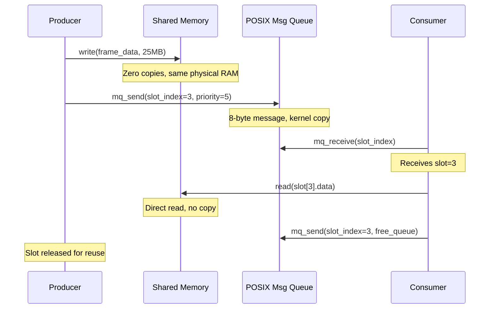
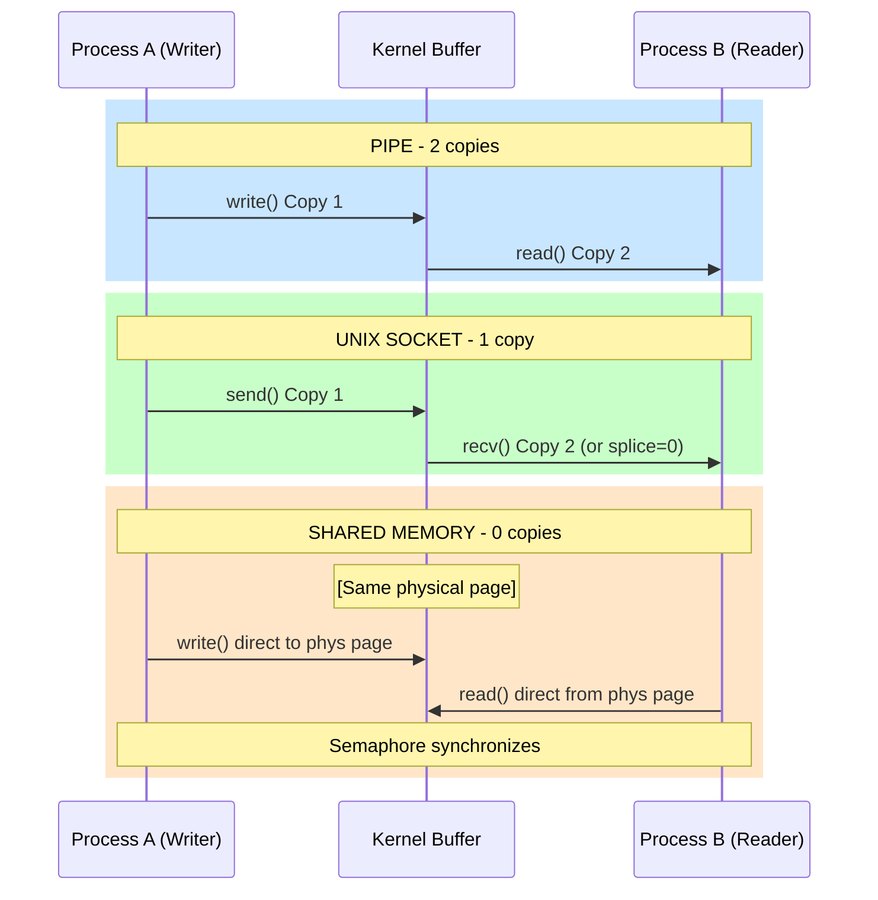

## Keywords in This File
{: .no_toc }

| # | Keyword | Weight |
|---|---|---|
| 14 | [Inter-Process Communication Mechanisms](#inter-process-communication-mechanisms) | high |
| 15 | [Pipes, Sockets, and Shared Memory](#pipes-sockets-and-shared-memory) | high |

---

# Inter-Process Communication Mechanisms

🎯 Interview Weight: High - IPC is a core operating systems concept that bridges theory and practice. Senior engineers are expected to know when to choose pipes vs message queues vs shared memory, and to articulate the performance trade-offs of each.

---

## 📋 Quick Reference

**One-line definition:** IPC (Inter-Process Communication) is the set of OS mechanisms that allow separate processes to exchange data and synchronize execution: pipes, FIFOs, message queues, shared memory, sockets, signals, and semaphores.

**Difficulty:** ★★☆ | **Asked at:** Mid-Senior | **Seniority:** Mid-Senior

---

### 🎯 Model Answer

**30 seconds:**
> IPC mechanisms allow separate processes to communicate and synchronize. The main categories are: message passing (pipes, FIFOs, message queues, sockets) - where data is copied through the kernel - and shared memory - where processes map the same physical page into their address spaces and exchange data with zero kernel copies. The trade-off is simplicity vs performance: message passing is easier to use correctly and safe by default; shared memory requires explicit synchronization (mutexes, semaphores) but eliminates copy overhead.

**3 minutes (Senior):**
> IPC mechanisms differ on three axes: (1) copy overhead - message passing copies data through kernel buffers (one or two copies), shared memory has zero copies after setup; (2) synchronization built-in - pipes and sockets provide flow control (blocking when buffer is full/empty), shared memory requires application-level locks; (3) scope - anonymous pipes are parent-child only; named pipes (FIFOs) and sockets work across unrelated processes; POSIX message queues persist across program runs (until unlinked). The performance hierarchy is: shared memory fastest (no copies, RAM speed) > Unix domain sockets (one kernel copy, local only) > TCP loopback (two copies, networking overhead) > POSIX message queues (one copy, structured). Choice depends on: data volume (large blobs -> shared memory), process relationship (parent/child -> pipe), network vs local (socket vs pipe), and whether persistence is needed (message queue vs pipe). At Google's scale, services use gRPC over Unix domain sockets for intra-machine communication (lower overhead than TCP loopback) and gRPC over TCP for cross-machine.

**Framework:** MECHANISM -> PERFORMANCE -> SYNCHRONIZATION -> CHOICE CRITERIA

*Adapting up:* Discuss zero-copy sendfile, splice syscall, io_uring for async IPC, and RDMA for sub-microsecond inter-machine communication.

*Adapting down:* Pipe = a tube; message queue = a mailbox; shared memory = shared whiteboard.

**Blank Mind Recovery:**

**(1) Restate:** "IPC - how two processes talk to each other."

**(2) First principles:** "Processes have separate virtual address spaces. They can't read each other's memory directly. The OS provides mechanisms to bridge them."

**(3) Bridge:** "The fastest bridge is no bridge at all - shared memory maps the same physical RAM into both address spaces. The safest bridge is a kernel-managed queue - a pipe or message queue copies data through the kernel which handles synchronization automatically."

---

### 📘 Concept Explanation

**What it is:**
Inter-Process Communication (IPC) is the collection of OS mechanisms that allow processes with separate address spaces to exchange data and synchronize their execution.

**Why processes need IPC:**
Processes are isolated by design (memory protection). A web server process cannot directly read variables from a database worker process. IPC provides controlled channels for this communication while preserving process isolation.

**IPC mechanism taxonomy:**

```
IPC MECHANISMS:
=====================================
MESSAGE PASSING (kernel-mediated):
  Pipe (anonymous):
    - Unidirectional byte stream
    - Parent-child only (fd inheritance)
    - Kernel buffer: typically 64KB
    - Blocking when full/empty

  FIFO (named pipe):
    - Unidirectional byte stream
    - Any two unrelated processes
    - Created as filesystem entry
    - Same kernel buffer semantics

  POSIX Message Queue (mq_open):
    - Bidirectional, typed messages
    - Priority ordering built-in
    - Persists until mq_unlink()
    - Any unrelated processes

  Socket (AF_UNIX / AF_INET):
    - Bidirectional byte stream or dgram
    - Local (Unix domain) or network (TCP)
    - Most flexible; highest overhead

SHARED MEMORY (zero kernel copy):
  POSIX shm (shm_open + mmap):
    - Same physical pages in both spaces
    - Fastest: no kernel copies after setup
    - Requires explicit synchronization
    - Application-level locks required

  mmap(MAP_SHARED, fd):
    - File-backed shared memory
    - Changes visible to all who mmap
    - Kernel manages page cache
```

> **Diagram walkthrough:** This taxonomy organises IPC mechanisms by whether the kernel copies data (message passing) or maps the same physical pages into multiple address spaces (shared memory). KEY RELATIONSHIP: message passing mechanisms trade performance (one kernel copy per message) for built-in synchronization (blocking semantics); shared memory eliminates copies but shifts synchronization responsibility to the application. EDGE CASE: POSIX message queues have a maximum message count and size that must be configured at creation; exceeding the count blocks `mq_send()` until a reader consumes a message. INSIGHT: Unix domain sockets (`AF_UNIX`) are message passing but the kernel can optimise them to avoid copies on the same machine (fd passing, splice) - they are the preferred IPC mechanism for local service-to-service communication in production systems.

**How pipe data flow works:**

```
ANONYMOUS PIPE DATA FLOW:
===========================
Writer Process         Kernel          Reader Process
       |                 |                    |
  write(fd[1], data)    |                    |
       |----copy 1----> |                    |
       |               [pipe buffer ~64KB]   |
       |               (circular ring buf)   |
       |                 |                    |
       |                 |   read(fd[0], buf) |
       |                 |----copy 2-------->|
```

> **Diagram walkthrough:** This shows the two-copy path of anonymous pipe communication. The writer copies data from user space to the kernel's pipe buffer (copy 1); the reader copies from the kernel buffer to its user space (copy 2). KEY RELATIONSHIP: the two copies are what make pipes safe but slower than shared memory; the kernel owns the buffer and provides implicit synchronization. EDGE CASE: if the writer fills the 64KB buffer (typical Linux default), the next `write()` blocks until the reader consumes data - this provides natural flow control. INSIGHT: `ulimit -p` reports pipe buffer size in 512-byte blocks; Linux allows increasing it via `fcntl(fd, F_SETPIPE_SZ, size)` up to `/proc/sys/fs/pipe-max-size` (default 1MB) for high-throughput applications.

**Shared memory data flow:**

```
SHARED MEMORY DATA FLOW:
============================
Process A address space:
  | ... | mapped_region | ... |
                |
     Same physical page
                |
Process B address space:
  | ... | mapped_region | ... |

  A writes to mapped_region:
    -> B reads from mapped_region
    -> ZERO kernel copies
    -> BUT: race condition without lock
```

> **Diagram walkthrough:** This shows how shared memory maps the same physical page into two virtual address spaces, eliminating kernel copies. Process A's write to the mapped region is immediately visible in Process B's mapped region because they point to the same physical RAM. KEY RELATIONSHIP: "zero copies" is the fundamental performance advantage - for large data (10MB+), shared memory is orders of magnitude faster than pipe. EDGE CASE: if Process A writes 100 bytes while Process B reads, a partial read is possible without a mutex - shared memory requires the application to implement its own synchronization (POSIX semaphores or mutexes with PTHREAD_PROCESS_SHARED). INSIGHT: Android uses Ashmem (anonymous shared memory) for large data transfers between processes; the media server uses it to share decoded video frames with the compositor without any copies - this is why video playback can be GPU-composited at near-zero CPU cost.

**Performance comparison:**

```
IPC PERFORMANCE (approximate, 4KB message):
==============================================
Mechanism           | Latency  | Throughput
--------------------|----------|------------
Shared memory + sem |  ~200ns  | ~10 GB/s
Unix domain socket  |   ~5us   |  ~2 GB/s
TCP loopback        |  ~20us   |  ~1 GB/s
POSIX msg queue     |   ~5us   |  ~2 GB/s
Pipe (anonymous)    |   ~5us   |  ~2 GB/s
Named pipe (FIFO)   |   ~5us   |  ~2 GB/s
```

> **Diagram walkthrough:** This table shows approximate IPC performance for small 4KB messages on a modern Linux system. Shared memory dominates in throughput because it eliminates kernel involvement after setup. KEY RELATIONSHIP: Unix domain sockets and pipes are similar in performance because both use a single kernel copy; TCP loopback adds networking stack overhead (TCP/IP headers, checksum, protocol state machine). EDGE CASE: for very small messages (<64 bytes), context switch overhead dominates; shared memory with spinlock can be slower than a pipe for tiny messages because the pipe blocks efficiently (OS parks the thread) while spinlock wastes CPU. INSIGHT: for IPC between services on the same machine, Unix domain sockets are preferred over TCP loopback in production because they skip the TCP state machine, use local socket buffer (no network buffer copies), and support credential passing (SO_PEERCRED) for authentication.

**When to use each:**
- **Pipe**: parent-child communication, command pipelines (`ls | grep`), stdin/stdout redirection
- **FIFO**: two unrelated processes on same machine, producer-consumer with logging
- **Message queue**: structured messages with priority, decoupled services, persistent queues
- **Shared memory**: large data transfer (images, video frames, ML model weights), zero-copy pipelines
- **Unix domain socket**: flexible local RPC, bidirectional communication, file descriptor passing

**When NOT to use:**
- Do not use TCP loopback for local IPC when Unix domain sockets are available (unnecessary overhead)
- Do not use shared memory without proper synchronization (atomic flags or POSIX semaphores)
- Do not use anonymous pipes between unrelated processes (they cannot be inherited)

**Alternatives:**
- D-Bus: desktop Linux IPC framework (message-oriented, type-safe, service registry)
- gRPC with Unix domain socket: structured RPC with Protocol Buffers over Unix socket
- io_uring shared ring buffer: async kernel-bypass IPC for ultra-low latency

**First-principles derivation:**
Processes are isolated by virtual memory. To communicate, they need the OS as intermediary (message passing) or a common physical mapping (shared memory). The intermediary adds copies; the common mapping adds synchronization complexity. The choice is always: "Is the copy cost higher than the synchronization complexity cost for this use case?"

---

### 💻 Code Example

```c
// BAD: TCP loopback for local IPC
// Unnecessary overhead on same machine

// Server:
int fd = socket(AF_INET, SOCK_STREAM, 0);
struct sockaddr_in addr = {
    .sin_family = AF_INET,
    .sin_port   = htons(8080),
    .sin_addr.s_addr = INADDR_LOOPBACK
};
bind(fd, (struct sockaddr*)&addr,
    sizeof(addr));
listen(fd, 5);
// BAD: full TCP stack for same-machine IPC
// - TCP header overhead
// - TCP state machine (SYN/ACK/FIN)
// - Two copies: write->kernel, kernel->read
// - ~20us latency vs ~5us for Unix socket
```

> **Code walkthrough:** This BAD pattern uses TCP loopback for same-machine IPC. KEY MECHANISM: TCP loopback traverses the full Linux TCP/IP stack: TCP header construction, IP routing lookup, loopback driver, TCP receive, socket buffer copy - all unnecessary when both processes are on the same machine. WHY IT MATTERS: ~20us latency vs ~5us for Unix domain sockets; at 100,000 messages/second this is 1.5 seconds of unnecessary overhead per second. WHAT BREAKS: under high load, TCP loopback creates TIME_WAIT connection exhaustion (default 60 second wait per closed connection) if not using `SO_REUSEADDR`. TAKEAWAY: never use TCP loopback (`127.0.0.1`) for local process communication; use Unix domain sockets which are specifically designed and optimised for this case.

```c
// GOOD: Unix domain socket for local IPC
// ~4x lower latency than TCP loopback

// Server:
int srv = socket(AF_UNIX, SOCK_STREAM, 0);
struct sockaddr_un addr = {0};
addr.sun_family = AF_UNIX;
strncpy(addr.sun_path, "/tmp/myservice.sock",
    sizeof(addr.sun_path) - 1);
unlink(addr.sun_path); // remove stale socket
bind(srv, (struct sockaddr*)&addr,
    sizeof(addr));
listen(srv, 128);

// Client (same machine):
int cli = socket(AF_UNIX, SOCK_STREAM, 0);
connect(cli, (struct sockaddr*)&addr,
    sizeof(addr));
// Now communicate via read()/write()
// No TCP overhead. ~5us latency.
// Supports credentials:
// SO_PEERCRED -> verify peer process UID
struct ucred cred;
socklen_t len = sizeof(cred);
getsockopt(cli, SOL_SOCKET, SO_PEERCRED,
    &cred, &len);
// cred.uid = peer process UID
```

> **Code walkthrough:** This GOOD pattern uses a Unix domain socket which is optimised for same-machine IPC. KEY MECHANISM: `AF_UNIX` sockets bypass the TCP/IP stack entirely; data flows directly between socket buffers in kernel memory with one copy per send/receive. `SO_PEERCRED` provides the peer process's UID/GID/PID without any application-level authentication. WHY IT MATTERS: 4x lower latency than TCP loopback; credential passing enables secure local authentication (systemd, Docker daemon, D-Bus all use this pattern). WHAT BREAKS: Unix socket path is limited to ~108 characters (`sun_path` in `sockaddr_un`); long service names cause `ENAMETOOLONG`. The socket file must be `unlink()`ed on clean shutdown or the next bind will fail with `EADDRINUSE`. TAKEAWAY: for any local service-to-service communication (health checks, control plane, metrics), use Unix domain sockets with a path like `/run/service/control.sock`.

```c
// BAD: System V shared memory - legacy API
// with no cleanup on crash
#include <sys/ipc.h>
#include <sys/shm.h>

// Creates SHM using opaque integer key
// (no cleanup on process crash!)
key_t key = ftok("/tmp/shmfile", 1);
int shmid = shmget(key, 1024 * 1024,
    IPC_CREAT | 0600);
void* ptr = shmat(shmid, NULL, 0);
// BAD: shmid persists until IPC_RMID;
// crash = leaked shared memory segment;
// ipcs -m shows all leaking segments
// after repeated crashes.
// No semaphore: RACE CONDITION on access!
memcpy(ptr, data, len); // unsynchronized
```

> **Code walkthrough:** This BAD pattern uses System V `shmget` which has poor lifecycle management and no synchronization. KEY MECHANISM: System V shared memory segments are identified by integer keys from `ftok()`; they persist in kernel memory until explicitly removed with `shmctl(shmid, IPC_RMID, NULL)`. If the owning process crashes before calling IPC_RMID, the segment leaks until reboot. WHY IT MATTERS: a service that crashes repeatedly can exhaust the system's shared memory limit (`/proc/sys/kernel/shmmax`), preventing any new shared memory allocation. WHAT BREAKS: `ipcs -m` will show leaked segments accumulating; cleaning them requires `ipcrm -m <shmid>` for each leaked segment. TAKEAWAY: never use System V `shmget` in new code; use POSIX `shm_open` which is file-based, auto-cleaned by the OS when all mappings close, and uses standard file permissions.

```c
// GOOD: POSIX shared memory for zero-copy
// large data transfer
#include <sys/mman.h>
#include <fcntl.h>
#include <semaphore.h>

// Producer process:
int fd = shm_open("/myshm",
    O_CREAT | O_RDWR, 0600);
ftruncate(fd, sizeof(SharedBuffer));
SharedBuffer* buf = mmap(NULL,
    sizeof(SharedBuffer),
    PROT_READ | PROT_WRITE,
    MAP_SHARED, fd, 0);
close(fd);

// Semaphore for synchronization
sem_t* sem = sem_open("/mysem",
    O_CREAT, 0600, 0);

// Write data to shared buffer
memcpy(buf->data, large_data, DATA_SIZE);
buf->size = DATA_SIZE;
sem_post(sem); // signal consumer

// Consumer process (mirrors setup):
// same shm_open/mmap with O_RDONLY
// sem_wait(sem) -> read buf->data
// ZERO COPIES after initial setup
```

> **Code walkthrough:** This POSIX shared memory pattern achieves zero-copy data transfer between processes. KEY MECHANISM: `shm_open` creates a named shared memory object in `/dev/shm`; `mmap` with `MAP_SHARED` maps the same physical pages into both processes' virtual address spaces; `sem_post/sem_wait` provides the producer/consumer synchronization without any data copying. WHY IT MATTERS: for large data (100KB+), shared memory throughput is ~10 GB/s vs ~2 GB/s for pipes; for a machine-learning inference service receiving 10MB model inputs, this is the difference between 1ms and 5ms per request. WHAT BREAKS: if the producer writes while the consumer reads without synchronization, the consumer may see partial writes (torn reads). The semaphore ensures the consumer only reads after the producer has completed the write. TAKEAWAY: use POSIX shared memory (`shm_open`) not `shmget` (System V) - the POSIX API is cleaner, doesn't require explicit IPC_RMID cleanup, and integrates with mmap naturally.

---

### 🎓 Answers by Seniority

**Junior / Mid (0-5 years):**
> IPC allows separate processes to communicate. The main mechanisms are: pipes (byte streams, parent-child only), FIFOs (same but for unrelated processes), message queues (typed structured messages), shared memory (fastest, zero copies but needs manual synchronization), and sockets (most flexible, work over the network). The key trade-off is that message passing mechanisms (pipes, sockets) copy data through the kernel and provide automatic synchronization, while shared memory avoids copies but requires explicit locking.

---

**Senior / Staff (5+ years):**
> At the kernel level, pipes use a circular ring buffer in kernel memory (~64KB on Linux by default). A write blocks when the buffer is full; a read blocks when empty - the kernel handles this with wait queues on the two ends of the pipe, so the OS directly swaps between writer and reader without busy-waiting. Shared memory uses the page table: `mmap(MAP_SHARED)` creates page table entries in both processes pointing to the same physical frame; a write by one process sets the "dirty" bit on the shared page; the other process reads it from the same physical address. There are no page faults after the initial mapping because the pages are already in RAM. The performance hierarchy is well-defined for large data: shared memory >> Unix domain socket > pipe >> TCP loopback, but for small messages (<1KB) and high-frequency communication, the difference between Unix socket and pipe is negligible, and shared memory can be slower due to lock contention.

---

### ⚠️ Common Misconceptions

**Misconception 1: "Named pipes (FIFOs) are the same as regular pipes."**
Reality: anonymous pipes exist only in memory and are only accessible via inherited file descriptors (parent to child). FIFOs appear as filesystem entries (`mkfifo /tmp/myfifo`) and can be opened by any process that has filesystem access. They both use the same kernel ring buffer mechanism, but their accessibility differs fundamentally.

**Misconception 2: "Shared memory is always faster than pipes."**
Reality: for small messages, shared memory can be slower because the synchronization overhead (semaphore or mutex) exceeds the copy cost. A pipe or Unix socket handles small messages with one kernel copy that is cache-warm and highly optimised. Shared memory wins for large data (>64KB) where the copy cost dominates the synchronization cost.

**Misconception 3: "POSIX message queues and Unix message queues are the same."**
Reality: POSIX message queues (`mq_open`, `mq_send`, `mq_receive`) are different from System V message queues (`msgget`, `msgsnd`, `msgrcv`). POSIX message queues have a cleaner API, support `select()`/`poll()` (on Linux), and are identified by names. System V message queues use integer keys and a legacy API. Always prefer POSIX on modern systems.

**Misconception 4: "TCP loopback is fine for local IPC since it's just the loopback interface."**
Reality: TCP loopback still traverses the full TCP stack: SYN/ACK handshake, TCP segment formatting, IP routing, loopback driver, TCP receive state machine, socket buffer management. It has ~4x higher latency than Unix domain sockets. At 100,000 messages/second, this adds ~1.5 seconds of overhead per second.

**Misconception 5: "File descriptor passing requires shared memory."**
Reality: Unix domain sockets support `SCM_RIGHTS` ancillary messages that allow a process to send an open file descriptor to another process. The receiving process gets a new descriptor that refers to the same open file description (including position, flags). This is how systemd passes listening sockets to services, and how the container runtime passes network namespaces to new containers.

---

### 🚨 Failure Modes and Diagnosis

**Failure 1: Broken pipe (SIGPIPE) kills writer process**

Symptom: writer process terminates with "Broken pipe" or receives SIGPIPE signal unexpectedly.

Root cause: the writer writes to a pipe or socket where the reader has closed the read end without consuming all data.

```bash
# Diagnose: check for SIGPIPE handling
strace -e trace=signal -p <PID> 2>&1 \
  | grep -i "sigpipe\|write.*EPIPE"

# In code: ignore SIGPIPE and handle EPIPE
// C: ignore SIGPIPE
signal(SIGPIPE, SIG_IGN);
// Then check write() return for EPIPE:
ssize_t n = write(fd, buf, len);
if (n < 0 && errno == EPIPE) {
    // Reader gone, close connection
    close(fd);
}
```

> **Code walkthrough:** SIGPIPE is sent to the writer when it tries to write to a pipe or socket with no reader. KEY MECHANISM: by default, SIGPIPE terminates the process - a dangerous default for server processes that should handle client disconnects gracefully. `SIG_IGN` causes `write()` to return -1 with `errno == EPIPE` instead, giving the code a chance to handle the disconnection. WHY IT MATTERS: a server process that doesn't ignore SIGPIPE will terminate when any client disconnects unexpectedly - a common source of "server dies randomly" bugs. WHAT BREAKS: ignoring SIGPIPE globally affects all threads; use `send(fd, data, len, MSG_NOSIGNAL)` on Linux to suppress SIGPIPE for a single send call. TAKEAWAY: any server process should install `signal(SIGPIPE, SIG_IGN)` at startup; handle EPIPE in all write/send error paths.

Fix: always ignore SIGPIPE at process start for server processes; handle EPIPE in write error paths.

**Failure 2: Shared memory race condition**

Symptom: consumer reads partially written data from shared memory buffer; random crashes, corrupted output, or assertion failures.

Root cause: producer writes multiple fields to shared memory; consumer reads between individual writes before the producer has finished writing all fields.

```c
// BROKEN: no synchronization
// Producer:
shm->size = data_size;       // write 1
shm->checksum = compute();   // write 2
memcpy(shm->data, src, size);// write 3
// Consumer reads between writes 1 and 3
// -> sees valid size, invalid data

// FIX: semaphore per-write cycle
// Producer:
memcpy(shm->data, src, size); // write first
shm->checksum = compute();
shm->size = data_size;
sem_post(sem); // signal only when DONE
// Consumer:
sem_wait(sem); // waits until all fields ready
// -> reads consistent state
```

> **Code walkthrough:** This shows the race condition in shared memory access and the semaphore fix. KEY MECHANISM: without synchronization, the consumer can read shm->size (already written) and shm->data (not yet written), getting a valid size but corrupted data. The fix writes all data first, then signals the semaphore - the consumer only reads after the signal confirms all fields are written. WHY IT MATTERS: this race is non-deterministic - it only manifests when the consumer is scheduled between specific writes, making it rare and hard to reproduce. WHAT BREAKS: the corrupted data may not immediately cause a crash - it propagates through the system, causing failures far from the write site. TAKEAWAY: in shared memory, always complete all writes before signaling; the semaphore acts as a memory barrier ensuring the consumer sees the fully written state.

Fix: use a POSIX semaphore (or mutex with PTHREAD_PROCESS_SHARED) to signal completion of a full write cycle; never allow partial reads.

---

### 🎯 Interview Deep-Dive

| Category | Count | Coverage |
|---|---|---|
| Conceptual | 2 | IPC taxonomy, performance hierarchy |
| Mechanism | 2 | pipe kernel buffer, shared memory page table |
| Debugging | 2 | SIGPIPE, shared memory race |
| Trade-off | 2 | copy cost vs synchronization, when to use each |
| Design | 1 | choosing IPC for a real service |

---

**[JUNIOR] Q1 - [CONCEPTUAL] What is the difference between message passing IPC and shared memory IPC?**

Message passing IPC (pipes, message queues, sockets): the OS acts as an intermediary. Data is copied from the sender's address space into a kernel buffer, then copied again from the kernel buffer into the receiver's address space. The kernel manages synchronization: writes block when the buffer is full; reads block when it's empty. You get safety and simplicity at the cost of two copies per message.

Shared memory IPC: the OS maps the same physical memory page(s) into both processes' virtual address spaces. When process A writes to the mapped region, process B immediately reads the same physical bytes - zero copies. However, the kernel provides no synchronization; the application must explicitly lock (POSIX semaphore, mutex with PTHREAD_PROCESS_SHARED) to prevent races.

Choosing between them:
- Data volume: small messages (< 64KB) -> pipes or sockets (copy overhead is negligible, synchronization is free). Large data (images, ML model tensors) -> shared memory (copy cost matters).
- Simplicity: if correctness is paramount and throughput is secondary -> message passing.
- Latency: if sub-microsecond latency matters -> shared memory.
- Network: if processes are on different machines -> sockets (TCP/UDP) - shared memory doesn't cross network boundaries.

*What separates good from great:* The "zero copy" claim for shared memory is true after setup, but setup itself requires a `mmap()` syscall which has OS overhead. Additionally, once data is in the mapped region, reading it from a different process may cause a TLB miss or page fault on first access if the page was recently swapped out. In practice, shared memory shines for sustained high-bandwidth transfers (video processing, ML inference) but is overkill for infrequent small messages.

---

**[JUNIOR] Q2 - [CONCEPTUAL] What is a pipe and how does it differ from a FIFO (named pipe)?**

Both pipes and FIFOs are unidirectional byte streams in the kernel's memory, but they differ in how processes access them:

Anonymous pipe:
- Created by `pipe(fd[2])` syscall returning two file descriptors
- Only accessible via these inherited file descriptors
- Child processes inherit open file descriptors from their parent
- Use case: parent-child communication, shell pipelines (`ls | wc`)

Named pipe (FIFO):
- Created by `mkfifo("/tmp/mypipe", 0600)` - appears as a filesystem entry
- Any process with filesystem access can open it by name: `open("/tmp/mypipe", O_RDONLY)`
- Semantically identical to anonymous pipe once opened (same kernel ring buffer)
- Use case: communication between unrelated processes on the same machine

Both block the writer when the buffer is full (~64KB on Linux) and block the reader when empty. Both deliver data in order (FIFO). Neither supports seeking or random access.

Key limitation: both are unidirectional - you need two pipes for bidirectional communication. For bidirectional local communication between unrelated processes, use Unix domain sockets instead.

Shell example:
```bash
# Anonymous pipe (created by shell):
ls -la | grep ".txt" | wc -l
# Shell creates two anonymous pipes;
# ls writes to first pipe;
# grep reads from first, writes to second;
# wc reads from second.
# No process knows the others exist;
# the shell sets up the file descriptors.
```

> **Code walkthrough:** This shell command shows the anonymous pipe chain in action. KEY MECHANISM: the shell calls `pipe()` twice and uses `dup2()` to redirect each process's stdout to the write end of a pipe and stdin to the read end of the next pipe; each subprocess only sees its stdin and stdout, unaware of the pipe mechanism. WHY IT MATTERS: the pipe buffer (64KB) provides automatic flow control - if `grep` is slow, `ls` blocks when the pipe fills up, preventing unbounded memory growth. WHAT BREAKS: a process in the pipeline that exits early (e.g., `head -1`) closes the read end; the next write from the upstream process triggers SIGPIPE. TAKEAWAY: shell pipes are anonymous pipes managed entirely by the shell; the `|` operator is syntactic sugar for `pipe() + fork() + dup2()`.

*What separates good from great:* The Linux kernel has a splice/tee optimization for pipe chains: `splice(pipe_read_end, NULL, pipe_write_end, NULL, len, SPLICE_F_MOVE)` transfers data directly between two kernel pipe buffers without ANY user-space copy. This is the basis of how web servers (nginx) implement zero-copy file serving: they splice the file into a socket's kernel buffer, bypassing user space entirely. A chain of spliced pipes achieves true zero-copy kernel-to-kernel transfer.

---

**[MID] Q3 - [MECHANISM] How does the Linux kernel implement pipe buffering and flow control?**

Linux implements pipes using a circular ring buffer in kernel memory:

Structure: the pipe has two halves represented by a single `pipe_inode_info` struct, containing an array of `pipe_buffer` descriptors pointing to physical pages. Default capacity: 16 pages = 64KB.

Write path:
1. Writer calls `write(pipe_write_fd, data, len)`.
2. Kernel checks available capacity in the ring buffer.
3. If space available: copy data to the buffer page, advance write pointer. Return `len`.
4. If no space: add writer to the pipe's write wait queue; put thread to sleep; reschedule.
5. When reader consumes data: wake the sleeping writer from the wait queue.

Read path:
1. Reader calls `read(pipe_read_fd, buf, len)`.
2. Kernel checks available data in ring buffer.
3. If data available: copy to user buffer, advance read pointer. Return bytes read.
4. If no data: add reader to read wait queue; put thread to sleep.
5. When writer produces data: wake the sleeping reader.

Flow control is therefore implicit: full buffer sleeps the writer; empty buffer sleeps the reader. No explicit synchronization needed by the application.

Buffer size tuning:
```c
// Increase pipe buffer to 1MB (max by default)
fcntl(pipe_fd, F_SETPIPE_SZ, 1024 * 1024);

// Check current size:
int size = fcntl(pipe_fd, F_GETPIPE_SZ);
// Also: /proc/sys/fs/pipe-max-size
//   (system-wide maximum, default 1MB)
```

> **Code walkthrough:** `F_SETPIPE_SZ` allows a process to increase the pipe buffer size for high-throughput communication. KEY MECHANISM: a larger buffer allows the writer to produce more data before blocking, reducing context switch frequency between writer and reader. WHY IT MATTERS: with a 64KB buffer and a writer producing 1MB chunks, the writer context-switches 16 times per chunk; with a 1MB buffer, it writes the full chunk without any context switches. WHAT BREAKS: increasing all pipe buffers system-wide would exhaust kernel memory; `F_SETPIPE_SZ` affects only the specific pipe file descriptor. TAKEAWAY: for high-throughput pipes (log aggregation, data processing), increase buffer size to amortise context switch cost; measure with `perf stat -e context-switches`.

*What separates good from great:* Linux 5.1 introduced the ability to use `io_uring` for pipe operations: `IORING_OP_SPLICE` allows async pipe splicing where the kernel performs the transfer without suspending the userspace thread. For applications processing many concurrent streams, io_uring-based pipe I/O avoids the per-operation context switch that traditional pipe I/O requires, enabling millions of messages per second on a single core.

---

**[MID] Q4 - [TRADE-OFF] When would you choose a Unix domain socket over a pipe or a POSIX message queue?**

Each mechanism has a distinct niche based on requirements:

Choose pipes when:
- Simple parent-child data streaming
- One-directional data flow (logs, stdout capture)
- Shell pipeline integration is needed
- Simplest possible implementation

Choose POSIX message queues when:
- Messages need priority ordering (mq_send has priority parameter)
- Message boundaries must be preserved (pipes are byte streams, message queues are message-oriented)
- The queue should persist between process restarts (survives until `mq_unlink()`)
- Multiple readers competing for messages from one writer

Choose Unix domain sockets when:
- Bidirectional communication (request/response RPC)
- Multiple clients connecting to one server (accept() loop)
- File descriptor passing between processes (SCM_RIGHTS)
- Credential verification of the peer process (SO_PEERCRED)
- Need full socket API (select, poll, epoll)
- gRPC, REST API, or any protocol over local transport

Practical example - a container runtime:
```
containerd -> runc:
  Unix domain socket (bidirectional RPC)
  - Bidirectional protocol required
  - FD passing (network namespace FD)
  - Credential check (root only)

Kubernetes kubelet -> containerd:
  gRPC over Unix domain socket
  - CRI protocol (structured RPC)
  - Unix socket: /run/containerd/containerd.sock
```

> **Code walkthrough:** This ASCII diagram shows how two major container runtime layers use Unix domain sockets for bidirectional control-plane communication. KEY MECHANISM: containerd creates and listens on a Unix domain socket; runc (the low-level OCI runtime) connects as a client; the bidirectional socket carries the container lifecycle protocol (create, start, exec, kill, delete). WHY IT MATTERS: using Unix domain sockets rather than TCP ports means the runtime API is unreachable from within containers (no port to bind to) and requires no network configuration. WHAT BREAKS: if the containerd socket file is deleted or inaccessible, all kubelet-to-container communication breaks; container status becomes stale and the kubelet cannot start new pods. TAKEAWAY: Unix domain sockets are the standard IPC mechanism for local control-plane APIs in container runtimes, desktop environments (D-Bus), and any service that needs bidirectional local communication with built-in credential verification.

*What separates good from great:* Unix domain sockets support `SOCK_SEQPACKET` (sequenced packet socket) which combines the best of pipes and message queues: it preserves message boundaries (like message queues), maintains order (like pipes), and is bidirectional (like sockets). For applications that need framed messages but not a full request-response model, `AF_UNIX + SOCK_SEQPACKET` is the precise fit. Docker's container runtime uses this for the shim-runc communication channel.

---

**[SENIOR] Q5 - [DEBUGGING] A service using POSIX shared memory is occasionally returning corrupted data. How do you diagnose?**

Corruption in shared memory has three primary causes: unsynchronized access, memory barrier violations, and size mismatch.

Step 1 - Rule out unsynchronized access:
```bash
# ThreadSanitizer detects data races
# (for same-process shared state):
gcc -fsanitize=thread -g -o svc service.c
./svc
# TSAN output: "DATA RACE on 0x..." shows
# the conflicting accesses and threads

# For inter-process races:
# Add logging to shared memory writes:
# - Record PID, timestamp, operation
#   into a ring buffer in shared memory
# - Read the ring buffer post-crash
```

> **Code walkthrough:** ThreadSanitizer detects unsynchronized accesses within a single process's threads. KEY MECHANISM: TSAN instruments every memory read and write with shadow memory tracking; if two threads access the same address without a happens-before relationship (lock, atomic, etc.), it reports a race. WHY IT MATTERS: shared memory race conditions are silent data corruption bugs - no crash, no error, just wrong values that propagate through downstream processing. WHAT BREAKS: TSAN cannot detect inter-process races on shared memory (it only sees one process's accesses); for cross-process races, add explicit logging to the shared memory structure. TAKEAWAY: for same-process shared memory races, TSAN is definitive; for cross-process races, add a ring-buffer log in shared memory and read it after detecting corruption.

Step 2 - Check memory barriers:
```c
// Wrong: compiler may reorder writes
shm->data[0] = value1;  // may be delayed
shm->ready = 1;         // seen before data!

// Correct: full memory barrier
shm->data[0] = value1;
__sync_synchronize(); // or atomic_thread_fence
shm->ready = 1;
```

> **Code walkthrough:** This shows how CPU/compiler reordering can corrupt shared memory communication even without a data race. KEY MECHANISM: modern CPUs and compilers can reorder stores for performance; the CPU's store buffer may flush `shm->ready` before `shm->data[0]`. The `__sync_synchronize()` (GCC full memory barrier) forces all prior stores to complete before any subsequent stores, ensuring the consumer sees `data[0]` before seeing `ready=1`. WHY IT MATTERS: this bug is CPU-model specific - it may not appear on x86 (strong memory model) but manifests on ARM (weaker model), making it a portability nightmare. WHAT BREAKS: without memory barriers, the bug manifests as "occasional wrong values" that appear only on multicore or non-x86 systems. TAKEAWAY: always use atomic operations or explicit memory barriers when shared memory is read by a different process/thread; never rely on compiler-generated store order.

Fix: add synchronization (semaphore for process-level) and memory barriers (atomic writes for CPU-level reordering).

*What separates good from great:* Linux provides `futex`-based process-shared mutexes: `pthread_mutexattr_setpshared(&attr, PTHREAD_PROCESS_SHARED)` makes the mutex usable across processes that share the same memory region. This is safer than raw semaphores because it provides ownership semantics (the owning process can be detected), and with `PTHREAD_MUTEX_ROBUST`, if the lock holder process crashes, the next locker gets `EOWNERDEAD` and can recover the shared state.

---

**[SENIOR] Q6 - [TRADE-OFF] How would you choose IPC for a high-throughput data pipeline where a producer generates 1GB/s of data for a consumer on the same machine?**

At 1GB/s, copy overhead becomes the dominant factor.

Analysis:

Pipe (64KB buffer, two copies): 1GB/s * 2 copies = 2GB/s of memory bandwidth just for the IPC. A modern server has ~50-100 GB/s memory bandwidth. Feasible but uses 2-4% of total bandwidth. Latency ~5us per message.

Unix domain socket (one copy): similar to pipe but configurable buffer. Still 1 copy = 1GB/s memory bandwidth.

Shared memory (zero copies): after setup, consumer reads directly from producer's write location. Total memory bandwidth: 1GB/s for the producer write + 1GB/s for the consumer read = 2GB/s total, but no copies. Latency ~200ns.

Decision: for 1GB/s sustained throughput, use shared memory with a ring buffer:

```
RING BUFFER IN SHARED MEMORY:
==============================
[ slot 0 ][ slot 1 ][ slot 2 ][ slot 3 ]
     ^                              ^
  read_idx                      write_idx

Producer: write to slots[write_idx % N]
          atomic increment write_idx
Consumer: read from slots[read_idx % N]
          atomic increment read_idx
Sync: use atomic stores/loads for indices
      (no mutex needed if single producer,
       single consumer)
```

> **Diagram walkthrough:** This shows a lock-free single-producer single-consumer ring buffer in shared memory. The producer writes to write_idx and atomically increments it; the consumer reads from read_idx and atomically increments it. KEY RELATIONSHIP: with a single producer and single consumer, the ring buffer needs only atomic index operations (no mutex) because the producer only writes to slots it owns (write_idx % N) and the consumer only reads from slots the producer has finished (read_idx < write_idx). EDGE CASE: the buffer must check for full (write_idx - read_idx == N) before writing; full condition blocks or drops data depending on policy. INSIGHT: this pattern is used in Linux's `io_uring` (submission/completion ring buffers), DPDK's rte_ring, and the Linux kernel's `kfifo` - it is the canonical pattern for high-throughput inter-thread/inter-process data transfer.

At 1GB/s with 1MB slots: 1000 slot transfers per second. Atomic increment ~5ns. Synchronization overhead: 5 microseconds per second total - negligible compared to the data transfer cost.

*What separates good from great:* DPDK (Data Plane Development Kit) pushes this to the extreme: ring buffers between CPU cores using huge pages (eliminating TLB misses) and cache-line-aligned slot boundaries (eliminating false sharing). A DPDK-based packet processor on a 40-core server can sustain 100 Gbps (12.5 GB/s) of zero-copy packet processing by keeping all data in L3 cache via careful ring buffer sizing (cache-resident ring = ~L3_size / 2). The key insight: "zero copy" is not just about avoiding explicit `memcpy()` calls - it's about keeping data in the exact memory hierarchy level that the consumer will access it from.

---

**[SENIOR] Q7 - [DEBUGGING] How do you diagnose and fix SIGPIPE crashes in a pipe-based service?**

SIGPIPE is sent to a process when it writes to a pipe or socket whose read end has been closed. By default, SIGPIPE terminates the process.

Diagnosis:
```bash
# Check if SIGPIPE is killing the process:
# In process exit codes, terminated-by-signal
# reports as exit code 128 + signum
# SIGPIPE = signal 13 -> exit code 141
echo $?  # after process terminates
# If 141: SIGPIPE was the cause

# strace to catch the write that causes SIGPIPE:
strace -e trace=write,signal -p <PID> \
  2>&1 | grep -A2 "SIGPIPE\|EPIPE"

# Check signal disposition:
cat /proc/<PID>/status | grep SigIgn
# Bit 12 (SIGPIPE) set = SIGPIPE is ignored
```

> **Code walkthrough:** These diagnostic steps identify SIGPIPE as the crash cause. KEY MECHANISM: exit code 141 (128 + 13) uniquely identifies SIGPIPE termination; `strace` shows the exact `write()` call that returned EPIPE before the signal fired. WHY IT MATTERS: SIGPIPE crashes are silent - no error message, no core dump by default, just a sudden process termination that appears as a crash. WHAT BREAKS: in a pipeline of processes, SIGPIPE cascades: when the last process exits, SIGPIPE kills the second-to-last, which kills the third-to-last, etc. TAKEAWAY: check exit code 141 first when diagnosing unexplained process terminations in pipe-based systems.

Fix strategies:
1. Ignore SIGPIPE globally: `signal(SIGPIPE, SIG_IGN)` at startup; handle `EPIPE` from `write()`.
2. Per-call: `send(fd, data, len, MSG_NOSIGNAL)` suppresses SIGPIPE for this call (Linux only).
3. For sockets: `setsockopt(fd, SOL_SOCKET, SO_NOSIGPIPE, &1, sizeof(1))` (macOS/BSD).

Best practice for server processes:
```c
int main(void) {
    // First line of main: ignore SIGPIPE
    signal(SIGPIPE, SIG_IGN);
    // Now all write/send calls return EPIPE
    // on broken pipe instead of killing
    // the process.
    // ...
}
```

> **Code walkthrough:** This shows the recommended first-line-of-main SIGPIPE handling for server processes. KEY MECHANISM: `signal(SIGPIPE, SIG_IGN)` installs a no-op handler that causes `write()` to return -1 with errno=EPIPE instead of sending the terminating signal. WHY IT MATTERS: every production server should have this - client disconnects are normal events that should be handled gracefully, not cause process termination. WHAT BREAKS: if you have a background thread that should die on a broken connection (streaming log writer), SIGPIPE was doing that automatically; with SIG_IGN you must check EPIPE explicitly in the write path. TAKEAWAY: `signal(SIGPIPE, SIG_IGN)` is a one-line fix that belongs in every server process's main function, at the top.

*What separates good from great:* SIGPIPE is a historical Unix design decision that made sense when processes were always interactive (a broken pipeline should stop the writer). For modern server processes, it's a footgun. Go's runtime ignores SIGPIPE for writes to non-terminal file descriptors. Python's `subprocess.PIPE` with `communicate()` automatically handles SIGPIPE. Node.js ignores SIGPIPE by default. If you're writing a server in C/C++, you are expected to know to ignore it explicitly - interviewers often probe this as a "have you actually built production C servers" signal.

---

**[STAFF] Q8 - [DESIGN] Design the IPC architecture for a video processing pipeline that receives 4K frames at 60fps.**

Requirements: 4K = 3840x2160 pixels, 3 bytes/pixel = 25MB per frame. 60fps = 1.5GB/s sustained data rate. Must not drop frames. Latency target: < 16ms end-to-end (one frame budget).

Step 1 - Eliminate copies:
At 1.5GB/s, every copy costs (1.5GB/s) / (memory bandwidth ~50GB/s) = 3% of bandwidth per copy stage. With 4 processing stages, copies consume 12% of bandwidth. Use shared memory ring buffer throughout.

Step 2 - Design the shared memory pool:
```
FRAME POOL DESIGN:
==========================
pool: 10 pre-allocated frame slots
  [frame_0: 25MB | frame_1: 25MB | ...]
  [header: sequence_num, timestamp,
           ref_count, state]

PIPELINE STAGES:
  Capture -> Decode -> Filter -> Encode

  Each stage takes ownership of a slot:
  1. Capture: acquires a free slot
     writes frame bytes
     posts to Decode queue

  2. Decode: dequeues from Capture
     processes in-place (no copy)
     posts slot reference to Filter

  3. Filter: same pattern

  4. Encode: writes output to file/network
     releases slot (ref_count = 0)
```

> **Diagram walkthrough:** This pool design eliminates all intermediate copies by passing slot references (integers) rather than frame data between stages. KEY RELATIONSHIP: each stage posts a slot index to the next stage's queue; the frame data never moves - only the ownership reference changes. EDGE CASE: if the Encode stage is slower than 60fps, the pool fills up; the Capture stage must either drop frames (fire-and-forget) or block (introduces jitter). INSIGHT: reference counting on slots allows frames to be consumed by multiple outputs simultaneously (recording + live streaming) without copying.

Step 3 - IPC mechanism for the queues (slot indices, not frame data):
- Message passing queue for slot indices: POSIX message queue per stage interface
- Each message = 8 bytes (slot index + metadata)
- At 60 messages/second per queue: negligible overhead

Step 4 - Memory layout:
- Use huge pages (2MB or 1GB) for the frame pool: eliminates TLB misses across 25MB frames
- Pin pages with `mlock()`: prevents swap-out causing frame drops
- Use NUMA-aware allocation if CPU and GPU are on different NUMA nodes

*What separates good from great:* The Linux DMA-BUF framework (used in V4L2, GStreamer) implements exactly this design at the kernel level: a `dma_buf` is a shared memory object that can be imported by different device drivers without CPU copies. A camera driver captures a frame into a DMA-BUF; the GPU compositor reads from the same DMA-BUF without any CPU involvement. The frame data moves from camera to display entirely via DMA, never touching CPU caches. At 8K/120fps (now commercially available), this is the only architecture that doesn't require enterprise-class memory bandwidth.

---

**[STAFF] Q9 - [TRADE-OFF] How does io_uring change the IPC performance landscape compared to traditional pipe/socket IPC?**

Traditional pipe/socket IPC requires a syscall per operation:
- `write(pipe_fd, data, len)` = one syscall
- `read(pipe_fd, buf, len)` = one syscall

At 1,000,000 operations/second: 2,000,000 syscalls/second = ~4 CPU cores just for syscall overhead (~2 microseconds per syscall round-trip).

io_uring eliminates this: operations are submitted to a ring buffer shared between user and kernel space. The kernel polls the ring buffer; the user submits without a syscall (using memory writes to a shared ring).

```
IO_URING DESIGN:
=================
User space     |   Kernel space
               |
Submission     |   Completion
 Ring (SQE)  --|-->  Ring (CQE)
  write ops    |    results
  read ops     |
               |
User submits:  |  Kernel reads SQE
  *sqe = op    |  processes async
  (no syscall  |  writes CQE result
  if polling)  |  (no syscall)
```

> **Diagram walkthrough:** io_uring uses two ring buffers (Submission Queue Entries = SQEs, Completion Queue Entries = CQEs) shared between user and kernel space. The user writes SQEs directly into the shared ring and reads CQEs back - no syscall required in polling mode. KEY RELATIONSHIP: the "SQPOLL" mode launches a kernel thread that continuously polls the SQ ring, allowing the user to submit operations with a simple memory write (~5ns) instead of a syscall (~1000ns). EDGE CASE: SQPOLL burns a kernel thread continuously; it should only be enabled when submission rate is high enough to justify the dedicated CPU core. INSIGHT: io_uring can splice from file to socket in a single operation (`IORING_OP_SPLICE`) with zero user-space involvement - the kernel reads from the file and writes to the socket in a single kernel operation.

Performance impact:
- Traditional pipe: 2,000,000 syscalls/second max (per CPU core)
- io_uring (SQPOLL): 10,000,000+ ops/second per core (memory-write submissions)
- io_uring with multi-shot: one syscall for unlimited reads from a pipe

Use when: network services with >500K messages/second; any pipeline where syscall overhead appears in profiling (>5% of wall time in `syscall` category).

*What separates good from great:* io_uring's key innovation for IPC is `IORING_OP_RECV_MULTISHOT` (Linux 5.20): submit one receive operation and get unlimited completions without resubmitting. For a pipe that continuously receives messages, traditional code submits a new `read()` after each completion; with multishot, one submission handles all future data. This changes the model from "N reads = N syscalls" to "1 syscall for all reads until pipe closes." For a service receiving 10M messages/second, this eliminates 10M syscalls/second at the cost of a single initial submission.

---

### ⚖️ Comparison Table

| Mechanism | Scope | Direction | Copies | Sync Included | Persistence | Best For |
|---|---|---|---|---|---|---|
| **Anonymous Pipe** | Parent-child | Unidirectional | 2 | Yes (blocking) | No (fd) | Shell pipes, parent-child |
| Named Pipe (FIFO) | Any local process | Unidirectional | 2 | Yes (blocking) | Until delete | Unrelated local processes |
| POSIX Message Queue | Any local process | Bidirectional | 1-2 | Yes (blocking) | Until unlink | Priority queues, structured msgs |
| Unix Domain Socket | Any local process | Bidirectional | 1 | Partial (flow) | No | Local RPC, FD passing |
| Shared Memory | Any local process | Bidirectional | 0 | No (manual) | Until shm_unlink | Large data, high throughput |
| TCP Loopback | Any local/network | Bidirectional | 2 | Partial (flow) | No | Cross-machine, protocol compat |

**The deciding factor:**
Large data on same machine: shared memory. Local bidirectional RPC: Unix domain socket. Shell pipelines/parent-child: anonymous pipe. Cross-machine: TCP socket. Priority messages: POSIX message queue. Signal handlers: semaphore.

---

### 🏛️ System Design

*(Omit: ★★☆ keyword - system design section is reserved for ★★★ expert-level keywords)*

---

### 📊 Diagram

IPC mechanism selection decision tree based on process relationship, data size, and direction requirements.

```
IPC SELECTION DECISION TREE:
===============================
Same machine?
  NO  -> TCP socket (or UDP)
  YES ->
    Parent-child only?
      YES -> Anonymous pipe
      NO  ->
        Large data (>64KB)?
          YES -> Shared memory + semaphore
          NO  ->
            Bidirectional?
              YES -> Unix domain socket
              NO  ->
                Priority/structured msgs?
                  YES -> POSIX msg queue
                  NO  -> Named pipe (FIFO)
```

> **Diagram walkthrough:** This decision tree guides IPC mechanism selection from the most fundamental question (same machine?) to increasingly specific requirements. Start at "Same machine?" because cross-machine communication eliminates all kernel-IPC options. KEY RELATIONSHIP: bidirectionality eliminates pipes (unidirectional), large data eliminates message passing (copy overhead), and priority/structured messages differentiate POSIX queues from FIFOs. EDGE CASE: if you need both large data AND bidirectionality, combine approaches: shared memory for data, Unix domain socket for control messages (metadata, completion signals). INSIGHT: in practice, the choice narrows to two: Unix domain socket for control/small data (flexible, bidirectional, standard API) and shared memory for bulk data (fast, zero-copy); combine them for high-performance service architectures.

The following sequence shows the data flow when choosing shared memory + message queue for a large-data pipeline.



> **Diagram walkthrough:** This sequence shows the zero-copy pipeline combining shared memory for bulk data and a POSIX message queue for control messages (slot indices). The Producer writes 25MB to shared memory (no copy from producer perspective - it's writing directly to the mapped region), then sends an 8-byte slot index via the message queue. The Consumer receives the slot index (one small kernel copy), reads the 25MB frame directly from shared memory (no copy), then signals the slot as free. KEY RELATIONSHIP: the message queue carries only metadata (8 bytes), while the shared memory carries all bulk data (25MB) - this hybrid approach gets zero-copy data transfer with structured control flow. EDGE CASE: if the Consumer is slow and the slot pool fills, the Producer must either drop frames or block on mq_send when the free_queue is empty. INSIGHT: this pattern - POSIX message queue for slot management, shared memory for data - is the architecture used by DPDK, GStreamer, and most high-throughput media frameworks; the message queue provides built-in priority (process urgent frames first) without sacrificing data transfer performance.

---

---

# Pipes, Sockets, and Shared Memory

🎯 Interview Weight: High - The three workhorses of local IPC, each with distinct performance profiles and use cases. Interviewers at mid-senior level expect hands-on knowledge: API details, buffer sizes, synchronization requirements, and production war stories.

---

## 📋 Quick Reference

**One-line definition:** The three primary local IPC mechanisms: pipes (byte streams via kernel buffer), sockets (network-protocol IPC supporting local and remote), and shared memory (direct physical page sharing with no kernel involvement after setup).

**Difficulty:** ★★☆ | **Asked at:** Mid-Senior | **Seniority:** Mid to Senior

---

### 🎯 Model Answer

**30 seconds:**
> Pipes are simple unidirectional byte streams: parent writes, child reads, kernel handles synchronization. Sockets are bidirectional and support both local (Unix domain) and network (TCP/UDP) communication; Unix domain sockets are preferred for local IPC due to ~4x lower latency than TCP loopback. Shared memory maps the same physical pages into multiple processes' address spaces, achieving zero-copy data transfer at RAM speed, but requires the application to provide synchronization (POSIX semaphores or mutexes).

**3 minutes (Senior):**
> The performance hierarchy for local IPC is: shared memory (~200ns latency, ~10 GB/s throughput) > Unix domain socket (~5us, ~2 GB/s) > TCP loopback (~20us, ~1 GB/s) > anonymous pipe (~5us, ~2 GB/s). Pipes have a fixed kernel buffer (~64KB on Linux, configurable up to 1MB via `F_SETPIPE_SZ`); writes block when the buffer is full, reads block when empty - this provides automatic flow control. Unix domain sockets support `SOCK_STREAM` (byte stream like TCP) and `SOCK_SEQPACKET` (like TCP but preserving message boundaries); they also support file descriptor passing via `SCM_RIGHTS` ancillary messages, which is how container runtimes and desktop environments pass capabilities between processes. Shared memory using POSIX `shm_open` + `mmap(MAP_SHARED)` creates a shared physical mapping; the key operations are the `mmap` syscall (once per setup) and then raw memory reads/writes at hardware speed. The synchronization requirement is often underestimated: even with a single producer and single consumer, a memory barrier (or atomic operation) is needed to prevent CPU store reordering from making the consumer see a "ready" flag before the data it guards.

**Framework:** MECHANISM -> PERFORMANCE -> USE CASE -> GOTCHAS

*Adapting up:* Discuss splice/sendfile zero-copy optimisations, io_uring for pipes, and RDMA for inter-machine shared memory.

*Adapting down:* Pipe = walkie-talkie (one direction); socket = phone call (both directions); shared memory = shared notebook (both write to the same page).

**Blank Mind Recovery:**

**(1) Restate:** "Three IPC mechanisms - pipe, socket, shared memory."

**(2) First principles:** "Pipe: data flows through the kernel. Socket: same as pipe but bidirectional and can work over the network. Shared memory: both processes see the same RAM directly."

**(3) Bridge:** "The faster the mechanism, the more the application needs to manage. Pipe: fully managed by the kernel. Socket: mostly managed. Shared memory: application manages everything."

---

### 📘 Concept Explanation

**What it is:**
Pipes, sockets, and shared memory are the three most commonly used IPC primitives in production Linux systems, each representing a different point on the performance-versus-convenience spectrum.

**Pipe internals:**

```
PIPE KERNEL STRUCTURE (Linux):
=================================
struct pipe_inode_info {
  unsigned int nrbufs;   // filled slots
  unsigned int curbuf;   // read position
  unsigned int buffers;  // total slots (16)
  struct pipe_buffer bufs[16]; // pages
  wait_queue_head_t rd_wait;
  wait_queue_head_t wr_wait;
  unsigned int r_counter; // readers count
  unsigned int w_counter; // writers count
}

Each pipe_buffer:
  -> points to one 4KB physical page
  -> offset: start of valid data in page
  -> len: bytes of valid data

Total pipe capacity: 16 pages * 4KB = 64KB
Configurable: F_SETPIPE_SZ up to 1MB
```

> **Diagram walkthrough:** This shows the internal structure of a Linux pipe. The pipe maintains a circular buffer of 16 physical pages (64KB total). Each `pipe_buffer` entry points to a page and tracks the valid byte range within it. KEY RELATIONSHIP: the read/write wait queues are what implement the blocking semantics - when the buffer is full, the writer is added to `wr_wait` and descheduled; when the reader consumes a page, it wakes the writer from `wr_wait`. EDGE CASE: if both the read and write counts drop to zero (all file descriptors closed), the pipe is freed. INSIGHT: Linux has a "pipe splice" optimisation where data can be moved between pipes without copying to userspace at all - the kernel just re-links the `pipe_buffer` page pointer from one pipe's ring to another's.

**Socket internals - Unix domain vs TCP:**

```
UNIX DOMAIN SOCKET (AF_UNIX):
==============================
[Process A]  --write()-->  [kernel socket buf]
                               | (one copy)
               [kernel socket buf]  --read()-->
                                    [Process B]

Kernel path:
  write() -> socket buffer copy ->
  direct read from buffer

NO: IP routing, TCP segmentation,
    checksum, ACK, retransmission,
    congestion control
YES: one kernel copy, flow control

TCP LOOPBACK (AF_INET):
========================
[Process A]  --write()-->  [TCP send buf]
                              | TCP seg
              [IP layer] -> [loopback driver]
              [TCP recv buf] --read()--> [Proc B]

Two copies + full TCP stack overhead
```

> **Diagram walkthrough:** These two paths contrast Unix domain socket and TCP loopback data flow. Unix domain socket makes one kernel copy (sender buffer to receiver buffer); TCP loopback makes the same copy but also traverses the full TCP/IP protocol stack (segmentation, IP routing, loopback driver, TCP receive state machine). KEY RELATIONSHIP: the TCP overhead is ~15us of CPU time per round-trip in addition to the copy cost; this is why Unix domain sockets are ~4x faster than TCP loopback for the same data. EDGE CASE: for very large messages (>1MB), both mechanisms are dominated by the copy cost (memory bandwidth limited), and the TCP overhead becomes relatively smaller - at 1GB message size, TCP vs Unix socket latency difference is only ~5%. INSIGHT: nginx uses Unix domain sockets to communicate with PHP-FPM workers; switching from TCP loopback to Unix domain sockets reduces PHP request overhead by ~0.5ms per request at moderate load.

**Shared memory page table mechanics:**

```
PHYSICAL MEMORY LAYOUT:
=========================
Physical RAM:
  [ ... | Frame 100 | Frame 101 | ... ]
           (holds shared data)

Process A virtual address space:
  Page Table Entry (0x7f00...) -> Frame 100
  Page Table Entry (0x7f01...) -> Frame 101

Process B virtual address space:
  Page Table Entry (0x6f00...) -> Frame 100
  Page Table Entry (0x6f01...) -> Frame 101

Both map to SAME physical frames.
No copy on read or write.
```

> **Diagram walkthrough:** This shows how `mmap(MAP_SHARED)` creates different virtual addresses in each process that map to the same physical frames. Process A writes to its virtual address 0x7f00...; the MMU translates to physical Frame 100; Process B reads from its virtual address 0x6f00...; the MMU translates to the same physical Frame 100. KEY RELATIONSHIP: the data never moves - both processes access the same bits in DRAM. EDGE CASE: if one process has the data in its CPU cache, the other process's read gets a cache hit if they share L3 (same NUMA node) or a cache miss with cross-NUMA fetch if on different sockets. INSIGHT: NUMA-aware memory allocation (`numa_alloc_onnode`) ensures both producer and consumer access the shared memory from the same NUMA node, keeping data in shared L3 and avoiding cross-socket memory bus traffic.

**Key operational differences:**

```
COMPARISON:
============
PIPE            SOCKET          SHARED MEMORY
  |               |                  |
Kernel buf      Kernel buf       Physical page
(two copies)    (one copy)       (zero copies)
  |               |                  |
Sync: auto      Sync: auto       Sync: manual
(blocking)      (blocking)       (semaphore/mutex)
  |               |                  |
Scope:          Scope:           Scope:
parent-child    any local        any local
(anonymous)     or network       (after mmap)
  |               |                  |
Buffer: 64KB    Buffer: 4MB      Buffer: ram_size
(configurable)  (configurable)   (mmap size)
  |               |                  |
FD passing: no  FD passing: yes  FD passing: no
                (Unix domain)
```

> **Diagram walkthrough:** This comparison table shows the three key dimensions across pipe, socket, and shared memory. All three use different kernel buffer strategies: pipe has a small dedicated ring buffer, socket has protocol-layer buffers configurable via `setsockopt`, and shared memory uses physical pages directly. KEY RELATIONSHIP: the "Sync: manual" requirement for shared memory is the cost of zero-copy; the kernel cannot track when both processes have finished with a region, so the application must use explicit signals. EDGE CASE: Unix domain sockets support file descriptor passing (SCM_RIGHTS) which neither pipes nor shared memory support - this unique capability makes Unix sockets the preferred IPC for capability delegation (passing an open file descriptor to another process without giving it filesystem path access). INSIGHT: socket buffer sizes (SO_RCVBUF, SO_SNDBUF) can be set much larger than pipe buffer sizes - up to the system limit in `/proc/sys/net/core/rmem_max` - making sockets better for bursty high-volume IPC while pipes are better for steady-state streaming.

**First-principles derivation:**
Pipe: the kernel needs to buffer data in transit and provide ordering guarantees. A kernel ring buffer with blocking read/write satisfies this with minimal complexity. Socket: same as pipe but needs addressing (path or IP:port) and bidirectionality; the socket abstraction generalises to network. Shared memory: the page table is the OS's mechanism for translating virtual to physical addresses; by pointing two virtual addresses to the same physical frame, we get sharing as a natural extension of the paging mechanism.

---

### 💻 Code Example

```c
// BAD: not handling partial reads on sockets
// Sockets can return fewer bytes than requested
char buf[1024];
int n = read(sock_fd, buf, 1024);
// WRONG: n may be 512; remaining 512 bytes
// will arrive in the next read()
process_message(buf, n); // partial message!
```

> **Code walkthrough:** This BAD pattern assumes a single `read()` returns a complete application message. KEY MECHANISM: sockets are byte streams - `read()` returns however many bytes are in the socket buffer at that moment, which may be less than requested. The OS does not know where application messages begin or end. WHY IT MATTERS: this bug produces sporadic message truncation, typically manifesting as "protocol parse error" or "unexpected end of data" under load when the sender outpaces the receiver. WHAT BREAKS: the bug is timing-dependent - on a fast local connection with small messages, `read()` almost always returns the full message; on a slow or loaded connection, partial reads are frequent. TAKEAWAY: all socket reads MUST loop until the expected number of bytes is received; never assume a single read() gives you a complete message.

```c
// GOOD: length-prefixed protocol with
// complete read loop
#include <stdint.h>

// Read exactly n bytes into buf
ssize_t read_exact(int fd, void* buf,
                   size_t n) {
    size_t total = 0;
    while (total < n) {
        ssize_t r = read(fd,
            (char*)buf + total, n - total);
        if (r <= 0) return r; // error or EOF
        total += r;
    }
    return total;
}

// Read a length-prefixed message
// Format: [4-byte length][payload bytes]
int recv_message(int fd, char** out,
                 size_t* out_len) {
    uint32_t len_net;
    // Read 4-byte big-endian length prefix
    if (read_exact(fd, &len_net,
                   sizeof(len_net)) != 4) {
        return -1;
    }
    uint32_t len = ntohl(len_net);
    if (len > MAX_MSG_SIZE) return -1;
    char* buf = malloc(len);
    if (!buf) return -1;
    if (read_exact(fd, buf, len) != (ssize_t)len){
        free(buf);
        return -1;
    }
    *out = buf;
    *out_len = len;
    return 0;
}
```

> **Code walkthrough:** This GOOD pattern implements a length-prefixed protocol with a guaranteed-complete read loop. KEY MECHANISM: `read_exact()` loops calling `read()` until exactly `n` bytes have been received, handling partial reads transparently. The application protocol uses a 4-byte length prefix in network byte order to delimit messages - the receiver reads the prefix, knows the exact payload size, and reads exactly that many bytes. WHY IT MATTERS: this is the correct idiom for all socket-based message protocols; failing to use it causes intermittent data corruption that is very difficult to debug. WHAT BREAKS: if `len` is not validated before `malloc(len)`, a malicious or buggy sender can send a 4GB length prefix causing OOM (memory exhaustion attack). TAKEAWAY: every socket message protocol needs: (1) a `read_exact` loop, (2) a length prefix for framing, (3) a maximum message size check before allocation.

```c
// PRODUCTION: Unix domain socket FD passing
// Transfer an open file descriptor from
// server to client via SCM_RIGHTS
#include <sys/socket.h>
#include <sys/un.h>

// Server: send fd to client
void send_fd(int unix_sock, int fd_to_send) {
    char buf[1] = {0};
    struct iovec iov = {buf, 1};
    char cmsgbuf[CMSG_SPACE(sizeof(int))];

    struct msghdr msg = {0};
    msg.msg_iov    = &iov;
    msg.msg_iovlen = 1;
    msg.msg_control    = cmsgbuf;
    msg.msg_controllen = sizeof(cmsgbuf);

    struct cmsghdr* cmsg =
        CMSG_FIRSTHDR(&msg);
    cmsg->cmsg_level = SOL_SOCKET;
    cmsg->cmsg_type  = SCM_RIGHTS;
    cmsg->cmsg_len   = CMSG_LEN(sizeof(int));
    memcpy(CMSG_DATA(cmsg), &fd_to_send,
           sizeof(int));

    sendmsg(unix_sock, &msg, 0);
    // client now has its own fd pointing to
    // same open file description
}
```

> **Code walkthrough:** This production pattern passes an open file descriptor to another process via Unix domain socket SCM_RIGHTS. KEY MECHANISM: `SCM_RIGHTS` is an ancillary message (control message) attached to a `sendmsg()` call; the kernel duplicates the file descriptor in the receiver's file descriptor table, creating a new fd pointing to the same open file description (same file offset, same flags). WHY IT MATTERS: this enables capability delegation without filesystem access - a privilege server can open a file as root and pass the fd to an unprivileged client; the client can read the file without having permission to open it. WHAT BREAKS: if the receiver's file descriptor table is full (ulimit -n exceeded), the sent fd is silently dropped; the receiver's `recvmsg()` succeeds but has no fd in the control message. TAKEAWAY: SCM_RIGHTS fd passing is the Unix security model in action - pass capabilities (file descriptors), not credentials.

---

### 🎓 Answers by Seniority

**Junior / Mid (0-5 years):**
> Pipes are unidirectional byte streams with a kernel buffer - the writer writes, the kernel buffers, the reader reads; the kernel handles blocking. Sockets are similar but bidirectional and can work over a network; Unix domain sockets are faster for local communication than TCP. Shared memory lets both processes see the same RAM directly - no copies - but you need to add your own locking (semaphores) to prevent race conditions. For most local service communication, use Unix domain sockets; for bulk data transfer (large files, video frames), use shared memory.

---

**Senior / Staff (5+ years):**
> The implementation details matter at scale. Pipe splice (`splice()` syscall) can move data between pipe file descriptors entirely in kernel space without copying to userspace - used in nginx for zero-copy file serving. Unix domain socket FD passing via `SCM_RIGHTS` is how systemd socket activation works: systemd creates the listening socket, the service starts (without privileges), and systemd passes the socket fd to the service - the service never needed to bind to a privileged port. For shared memory, the key correctness requirement is a memory barrier (x86 TSO model provides most of it "for free" but ARM requires explicit `dmb` instructions). POSIX `pthread_mutex_t` with `PTHREAD_PROCESS_SHARED` is the safest synchronization for shared memory - it supports priority inheritance and robust locking (EOWNERDEAD if process dies holding the lock).

---

### ⚠️ Common Misconceptions

**Misconception 1: "A socket read always returns a complete message."**
Reality: sockets are byte streams (SOCK_STREAM). A single `read()` call can return any number of bytes from 1 to the amount requested. Always use a `read_exact` loop or a framing protocol (length prefix) to read complete messages.

**Misconception 2: "Shared memory is always safe to read if the writer has exited."**
Reality: if the writer sets a "ready" flag in shared memory and exits, a reader may see the flag before seeing the data if there is no memory barrier between them. Even on x86 (which has a relatively strong memory model), compiler optimisations can reorder stores. Always use `std::atomic` or `__sync_synchronize()` to enforce ordering.

**Misconception 3: "Closing the write end of a pipe signals EOF to the reader."**
Reality: only when ALL write ends of the pipe are closed does the reader get EOF (read returns 0). If a process forks and both parent and child hold the write end, the reader gets EOF only after BOTH close. Forgetting to close the inherited write end in the reader process causes it to wait forever (no EOF arrives because the write end is still open in the reader itself).

**Misconception 4: "Unix domain sockets and TCP sockets have the same API, so switching is transparent."**
Reality: the address structure is different (`sockaddr_un` vs `sockaddr_in`). More importantly, Unix domain sockets support ancillary messages (SCM_RIGHTS, SCM_CREDENTIALS) that TCP does not support; any code that uses these features cannot be transparently ported to TCP.

**Misconception 5: "The `mmap` file and the shared memory region are unrelated."**
Reality: `mmap(MAP_SHARED, fd)` and `shm_open` + `mmap` are the same mechanism. `shm_open` creates a file in `/dev/shm` (a tmpfs); `mmap(MAP_SHARED, file_fd)` maps a regular file. The difference is persistence: `/dev/shm` objects are tmpfs (RAM-backed, fast, lost on reboot); `mmap` on a regular file persists to disk (slower due to fsync, survives reboot).

---

### 🚨 Failure Modes and Diagnosis

**Failure 1: Pipe read returns 0 (EOF) prematurely**

Symptom: reader loop exits before all data is consumed; downstream processing is incomplete with no error.

Root cause: all write ends of the pipe are closed before all data is read. Most commonly: the process forked and the child (reader) did not close the inherited write end of the pipe.

```bash
# Diagnose: check open file descriptors
# on the process that has the "unexpected EOF"
ls -la /proc/<PID>/fd | grep pipe
# Look for: same pipe inode on read AND write
# ends in the same process

# In code: close the unused end immediately
// Parent writes, child reads:
int fds[2];
pipe(fds);
if (fork() == 0) {
    // CHILD: close write end
    close(fds[1]); // MUST do this!
    read_from_pipe(fds[0]);
    exit(0);
}
// PARENT: close read end
close(fds[0]);
write_to_pipe(fds[1]);
```

> **Code walkthrough:** This shows the critical close-unused-end pattern for pipes. KEY MECHANISM: the reader process (child) must close `fds[1]` (the write end) immediately after fork. If it doesn't, the child holds both ends; when the parent finishes and closes `fds[1]`, there is still one open write end (the child's), so `read()` in the child blocks indefinitely waiting for more data (no EOF because write end is still open). WHY IT MATTERS: this is a common fork+pipe bug that causes child processes to hang indefinitely. WHAT BREAKS: the parent also needs to close `fds[0]` (the read end) it doesn't use - failing to do so prevents proper EOF signaling and wastes file descriptors. TAKEAWAY: after `pipe() + fork()`, each side must close the end it does not use; this rule applies to every pipe-across-fork operation.

Fix: always close the unused pipe end immediately after `fork()`, both in parent and child.

**Failure 2: Unix domain socket file not cleaned up**

Symptom: service fails to start after a crash with `bind: Address already in use` (EADDRINUSE) even though no process is using the socket.

Root cause: when a process that owns a Unix domain socket file crashes, the socket file (`/tmp/myservice.sock`) remains on the filesystem. A restart attempt to `bind()` to the same path fails.

```c
// FIX: unlink before bind
struct sockaddr_un addr = {0};
addr.sun_family = AF_UNIX;
strncpy(addr.sun_path, SOCKET_PATH,
    sizeof(addr.sun_path) - 1);

// Remove stale socket file
if (unlink(addr.sun_path) < 0
    && errno != ENOENT) {
    perror("unlink");
    exit(1);
}
// Now safe to bind:
bind(srv_fd, (struct sockaddr*)&addr,
    sizeof(addr));

// Also: clean up on exit
atexit(cleanup_socket);
void cleanup_socket(void) {
    unlink(SOCKET_PATH);
}
```

> **Code walkthrough:** This shows the correct Unix domain socket lifecycle management. KEY MECHANISM: `unlink(path)` removes the socket file if it exists (ENOENT is benign - the file didn't exist, which is fine). The `atexit()` handler removes the socket on clean exit; crash recovery is handled by the unconditional `unlink()` at startup. WHY IT MATTERS: this EADDRINUSE-on-restart is one of the most common deployment bugs for Unix socket services. WHAT BREAKS: if two service instances start simultaneously, the second instance will `unlink()` the first instance's socket, causing the first instance to lose its listening socket silently. TAKEAWAY: use `unlink()` before `bind()` to handle crash recovery; use systemd socket activation or a file lock to prevent simultaneous instances.

Fix: always `unlink()` the socket path before `bind()`; add `atexit()` cleanup for graceful shutdown.

---

### 🎯 Interview Deep-Dive

| Category | Count | Coverage |
|---|---|---|
| Conceptual | 2 | pipe vs socket vs shared memory, byte stream framing |
| Mechanism | 2 | pipe buffer, Unix socket vs TCP overhead |
| Debugging | 2 | premature EOF, EADDRINUSE |
| Trade-off | 2 | when to use each, FD passing |
| Design | 1 | production service IPC architecture |

---

**[JUNIOR] Q1 - [CONCEPTUAL] Why do socket reads need to loop to receive a complete message?**

Sockets are byte streams (SOCK_STREAM). The kernel does not know where application messages begin or end - it just delivers bytes in order. A single `read()` call returns however many bytes are currently in the receive buffer, which may be:

- Exactly the number requested
- Fewer bytes (the sender hadn't sent all of them yet, or the buffer was partially full)
- Just 1 byte (particularly under high network load)
- 0 bytes (connection closed = EOF)

Why this happens: the sender's `write()` and the receiver's `read()` are not synchronized. The sender may call `write(512)` on TCP; the TCP segment arrives, is segmented by the network, and the first segment (say 300 bytes) arrives before the second (212 bytes). The receiver's first `read(512)` returns 300. The rest arrives after.

On a local Unix domain socket, partial reads happen less often but are still possible when the sender writes faster than the receiver reads and the socket buffer partially fills.

Correct pattern:
```c
// Always read with a loop:
size_t read_all(int fd, char* buf, size_t n) {
    size_t got = 0;
    while (got < n) {
        ssize_t r = read(fd, buf+got, n-got);
        if (r <= 0) return got; // error or EOF
        got += r;
    }
    return got; // == n on success
}
```

> **Code walkthrough:** This `read_all` function loops until exactly `n` bytes are received. KEY MECHANISM: each iteration reads as many bytes as are available (up to the remaining needed); the offset `buf+got` advances the write position so new bytes are appended correctly. WHY IT MATTERS: without this loop, any message >1 byte can be partially received, causing every downstream parse to fail intermittently. WHAT BREAKS: if the connection drops mid-message, `read()` returns 0 (EOF) or -1 (error); the function returns `got` which may be less than `n` - the caller must check the return value. TAKEAWAY: use `read_all` or equivalent for any socket read where you know the expected size; use a length-prefix protocol to determine the expected size.

*What separates good from great:* Datagram sockets (`SOCK_DGRAM`, UDP) do preserve message boundaries - one `sendto()` corresponds to one `recvfrom()`, and you always get either the full message or nothing (if the buffer is too small, the rest is silently discarded). For applications that need message boundaries AND reliability, `AF_UNIX + SOCK_SEQPACKET` combines both properties: ordered, reliable delivery with preserved message boundaries, on a local connection.

---

**[JUNIOR] Q2 - [CONCEPTUAL] What happens when you write to a full pipe buffer?**

When the pipe buffer is full (default 64KB on Linux), `write()` blocks: the calling thread is put to sleep (added to the pipe's write wait queue) until a reader consumes enough data to free space.

Detailed sequence:
1. Writer calls `write(pipe_fd, data, 65536)` (writes 64KB to an empty pipe).
2. Kernel copies data to the pipe ring buffer. Buffer is now full.
3. Writer calls `write(pipe_fd, more_data, 4096)` (tries to write 4KB more).
4. Kernel checks buffer: no space. Adds writer thread to write wait queue. Thread sleeps.
5. Reader calls `read(pipe_fd, buf, 4096)`. Kernel copies 4KB from pipe buffer to user. Buffer now has 4KB free.
6. Kernel wakes the sleeping writer. Writer's `write()` copies 4KB and returns 4096.

This is automatic flow control: slow readers naturally throttle fast writers without any explicit rate limiting or polling.

Atomic writes for pipes: POSIX guarantees that writes of `<= PIPE_BUF` bytes (at least 512 bytes, Linux = 4096) are atomic - they either complete fully or not at all without interleaving with other writers. Writes larger than PIPE_BUF may be split and interleaved with other writers' data.

Non-blocking pipes: `fcntl(fd, F_SETFL, O_NONBLOCK)` makes `write()` return `EAGAIN` immediately if the buffer is full instead of blocking - useful in event-driven servers where blocking would stall the event loop.

*What separates good from great:* The pipe buffer size affects throughput because it determines the maximum burst before the writer must context-switch to let the reader catch up. With a 64KB buffer and a context switch costing ~5us, a writer producing 1GB/s needs 1GB/s / 64KB = 15,625 context switches per second, adding ~80ms/second of overhead. Increasing the buffer to 1MB (`F_SETPIPE_SZ`) reduces context switches to 1,000 per second (~5ms/second overhead). For high-throughput pipes, always tune the buffer size.

---

**[MID] Q3 - [MECHANISM] How do Unix domain sockets achieve lower latency than TCP loopback?**

Both mechanisms use one kernel copy per message, but TCP loopback traverses additional protocol layers:

TCP loopback path (for a 1KB message):
1. `send(tcp_fd, data, 1024, 0)` - user to kernel copy
2. TCP: segment the data, add TCP header (20 bytes)
3. IP: add IP header, compute checksum
4. Loopback driver: route to lo interface
5. TCP receive: validate checksum, update receive window, send ACK (another round-trip)
6. Socket buffer: store in receive buffer
7. `read(tcp_fd, buf, 1024)` - kernel to user copy

Total: ~2 kernel copies + TCP state machine + (optionally) delayed ACK (up to 200ms in some configurations)

Unix domain socket path:
1. `send(unix_fd, data, 1024, 0)` - user to kernel socket buffer copy
2. `read(unix_fd, buf, 1024)` - kernel socket buffer to user copy

Total: 2 kernel copies, no protocol headers, no ACK, no checksum

Performance numbers (local benchmark):
```bash
# Measure round-trip latency:
# Unix domain: ~4-6 microseconds
# TCP loopback: ~15-25 microseconds
# Difference: 3-5x for small messages

# Can verify with: sockperf or netperf
sockperf under-load --ip 127.0.0.1 \
  --port 11111 --time 10
# vs AF_UNIX equivalent
```

> **Code walkthrough:** This benchmark command measures TCP loopback round-trip latency. KEY MECHANISM: sockperf is a socket performance testing tool that measures latency distribution (average, p99, p999) for streaming and request/response patterns. WHY IT MATTERS: knowing that Unix domain sockets save ~15us per round-trip helps justify the extra setup complexity; at 100K requests/second, this is 1.5 seconds of CPU per second saved. WHAT BREAKS: sockperf measures application-level latency including syscall overhead; for kernel-only socket latency, use `perf trace` to measure time from `write()` syscall entry to `read()` return in the server. TAKEAWAY: always benchmark IPC choices for your specific message sizes and concurrency levels; the 3-5x ratio is for small messages; large messages are dominated by copy cost and the ratio shrinks.

*What separates good from great:* Linux has a `TCP_NODELAY` option that disables Nagle's algorithm and sends packets immediately without waiting for the buffer to fill. For request-response protocols, Nagle's algorithm adds up to 200ms latency (the delayed ACK timer waiting for more data). Always set `TCP_NODELAY` for low-latency TCP services - the fact that TCP loopback still needs this flag is another reason Unix domain sockets are preferable for local communication.

---

**[MID] Q4 - [MECHANISM] Explain how file descriptor passing works across a Unix domain socket.**

File descriptor passing via `SCM_RIGHTS` allows process A to send an open file descriptor to process B. Process B receives a new file descriptor number pointing to the same open file description.

Kernel mechanism:
1. Process A calls `sendmsg(unix_sock, &msg, 0)` with a control message (`cmsghdr`) of type `SCM_RIGHTS` containing the fd number.
2. Kernel looks up the fd in Process A's file descriptor table, getting the pointer to the kernel's `struct file` (the open file description).
3. Kernel increments the reference count on `struct file`.
4. Kernel copies the `struct file` pointer into Process B's file descriptor table under a new (available) fd number.
5. Process B's `recvmsg()` returns with the control message containing the new fd number.

The result: both processes have file descriptors pointing to the same `struct file` - same open file description (same file offset, same flags, same permissions).

Use cases:
1. Privilege separation: a root process opens a socket bound to port 80 and passes it to an unprivileged service
2. Service handoff: zero-downtime restarts where the old process passes its listening sockets to the new process
3. Container runtime: passing network namespace file descriptors, device file descriptors between namespaces
4. systemd socket activation: systemd creates listening sockets and passes them to services via `SD_LISTEN_FDS`

Security implication: the receiving process gets all the permissions of the file description, not just read access. If process A passes a root-owned file descriptor to an unprivileged process, that process can write to the file even though it could not have opened it. File descriptor passing is a capability-based security mechanism - treat it with the same caution as giving someone your password.

*What separates good from great:* Chrome uses fd passing for its multi-process sandbox: the browser process opens GPU, font, and network file descriptors as root, then passes them to sandbox workers that have no filesystem access and no system call privileges (seccomp-bpf filter). The sandboxed renderer process can render web pages using GPU resources it could never open itself. This is the Unix security principle of minimum privilege achieved through capability passing rather than setuid or broad filesystem permissions.

---

**[SENIOR] Q5 - [DEBUGGING] A multi-process application using shared memory occasionally produces garbled output. How do you reproduce and fix it?**

Garbled shared memory output indicates either unsynchronized access, memory ordering violation, or a size/alignment mismatch.

Step 1 - Reproduce reliably:
```bash
# Stress-test with many concurrent processes:
for i in $(seq 1 100); do
    ./producer &
done
for i in $(seq 1 100); do
    ./consumer &
done
wait
# If garbling is random: race condition
# If systematic: size/alignment bug
```

> **Code walkthrough:** This stress-test script launches 100 concurrent producer and consumer processes to reliably trigger race conditions in shared memory access. KEY MECHANISM: race conditions in shared memory are timing-dependent; under normal load only one or two processes access the region simultaneously, making races rare. With 100 concurrent processes, contention is constant and races manifest within seconds. WHY IT MATTERS: intermittent corruption bugs that appear once per week in production can be reproduced in minutes with concurrency stress tests. WHAT BREAKS: if the test machine has insufficient RAM for 200 processes each mapping a large shared memory region, the test itself may fail with OOM; size the shared memory region to fit within available RAM divided by the number of producers. TAKEAWAY: always stress-test shared memory code with 10-100x normal concurrency before declaring it correct; correctness under low concurrency does not imply correctness under high concurrency.

Step 2 - Enable memory error detection:
```bash
# Valgrind helgrind detects synchronization
# errors for pthreads in shared memory
valgrind --tool=helgrind ./consumer
# Reports: "lock not held" race conditions

# For cross-process races (harder):
# Add checksums to shared memory writes:
uint32_t crc = crc32(data, len);
shm->checksum = crc;
shm->ready = 1;
// Consumer validates:
if (crc32(shm->data, shm->size)
    != shm->checksum) {
    log("CORRUPTION DETECTED");
}
```

> **Code walkthrough:** Adding a CRC checksum to shared memory blocks converts silent corruption into a detectable error. KEY MECHANISM: the producer computes a checksum over the data after writing, stores it alongside the data, then sets the ready flag. The consumer validates the checksum after reading; a mismatch indicates either a race condition (consumer read while producer was writing) or memory ordering violation (consumer saw stale data). WHY IT MATTERS: shared memory corruption is often silent - the wrong value is plausible enough to pass downstream validation. Adding checksums immediately converts silent errors into loud failures, dramatically speeding up diagnosis. WHAT BREAKS: if the checksum itself is a single 32-bit value written non-atomically, a reader could read a partially written checksum and the check fails spuriously; use `uint32_t` (4 bytes, one aligned write on x86) for the checksum to ensure it's written atomically. TAKEAWAY: instrument shared memory with checksums during development and testing; disable them in production only after the synchronization logic is verified.

Step 3 - Fix: add semaphore with proper memory barrier:
```c
// Producer:
memcpy(shm->data, src, len); // write data
shm->size = len;
// Full barrier: all stores before sem_post
// are visible to sem_wait consumers
sem_post(sem); // THEN signal

// Consumer:
sem_wait(sem); // THEN read
// sem_wait provides acquire semantics:
// all stores before sem_post in producer
// are visible here
memcpy(dst, shm->data, shm->size);
```

> **Code walkthrough:** This shows the correct producer/consumer pattern with POSIX semaphore acting as both a synchronization signal and a memory barrier. KEY MECHANISM: POSIX sem_post has release semantics (all prior stores are visible to the consumer after sem_wait), and sem_wait has acquire semantics (all stores from before sem_post are visible after sem_wait). This means the consumer's read of `shm->data` and `shm->size` is guaranteed to see the producer's writes. WHY IT MATTERS: on ARM/POWER CPUs, without these memory ordering semantics, the consumer can read stale values even when the sem_wait itself returns correctly. WHAT BREAKS: using a simple integer flag (`shm->ready = 1`) instead of a semaphore does NOT provide memory ordering guarantees on weakly ordered CPUs without an explicit memory barrier. TAKEAWAY: always use a POSIX semaphore (not a plain flag) as the synchronization signal between shared memory writer and reader; the semaphore's acquire/release semantics provide the necessary memory ordering.

*What separates good from great:* The C11 atomics model provides the most portable solution: `_Atomic` keyword on the ready flag gives explicit acquire/release semantics that the compiler and hardware must honor on all platforms. `atomic_store_explicit(&shm->ready, 1, memory_order_release)` in the producer and `atomic_load_explicit(&shm->ready, memory_order_acquire)` in the consumer correctly orders the data writes with the flag write/read on ARM, x86, POWER, and any other architecture. This is the modern C/C++ approach; the older `__sync_synchronize()` approach is a full fence (stronger than needed, adds some overhead).

---

**[SENIOR] Q6 - [TRADE-OFF] What are the security implications of using shared memory for IPC?**

Shared memory has unique security properties that differ from message-passing IPC:

1. No access control per-message: once two processes map the same shared memory region, any process with access to the region can read or write any part of it at any time. There is no per-message sender verification.

2. Information disclosure: a malicious reader in a shared memory region can read data that was "deleted" by the writer (the writer cleared its copy but the physical page still has the data in the reader's mapping).

3. TOCTOU race (Time Of Check To Time Of Use):
```c
// Vulnerable: check then use with race
if (shm->role == ADMIN) {       // check
    // attacker changes role between check
    // and use:
    grant_access(shm->request); // use
}
// Fix: copy-then-check:
Role role = shm->role;          // atomic copy
char* req = strdup(shm->request);
if (role == ADMIN) {
    grant_access(req);          // use copy
}
```

> **Code walkthrough:** This TOCTOU example shows how a concurrent writer can change shared memory between a check and its corresponding use. KEY MECHANISM: the attacker changes `shm->role` from USER to ADMIN between the `if` check and the `grant_access` call; `grant_access` uses an admin role that was correct at check time but is now USER. The fix reads the role atomically into a local copy and uses the local copy - the attacker cannot change a local variable. WHY IT MATTERS: TOCTOU vulnerabilities in security checks are critical security flaws; shared memory's direct accessibility makes TOCTOU attacks trivial compared to message-passing where the message is immutable after send. WHAT BREAKS: even with the fix, `strdup(shm->request)` reads from shared memory which could be modified mid-copy; for security-critical code, always size-bound copies and validate the full copy before use. TAKEAWAY: never make security decisions based on data read from shared memory without copying it to local (process-private) storage first.

4. Secure shared memory practices:
- Use `shm_open` with mode `0600` (owner only) - never `0777`
- Prefer message-passing (Unix domain socket) for security-sensitive IPC where authentication is required
- If shared memory must be used for security-sensitive data: encrypt the contents, sign with HMAC

*What separates good from great:* Linux `memfd_create()` (Linux 3.17+) creates an anonymous file that exists only in memory and is never accessible via the filesystem path. Combined with `ftruncate()` and `mmap()`, it creates "sealed" shared memory that can be passed via fd (SCM_RIGHTS over Unix socket) with precise control: `fcntl(memfd, F_ADD_SEALS, F_SEAL_WRITE)` makes the memory read-only, preventing any process (including the creator) from modifying it after sealing. This is how Chrome sandboxed renderer processes share font data with the browser process: the browser creates a sealed `memfd` with font metrics, passes it to the renderer, and the renderer cannot modify the data even if compromised.

---

**[SENIOR] Q7 - [DEBUGGING] A service using a POSIX message queue is hitting max queue depth. How do you diagnose and fix it?**

Symptom: `mq_send()` blocks or returns `EAGAIN` (if non-blocking); queue depth monitoring shows steady increase.

Diagnosis:
```bash
# Check queue attributes
# mq_getattr fills struct mq_attr:
#   mq_maxmsg: max messages in queue
#   mq_msgsize: max bytes per message
#   mq_curmsgs: current message count

# Via filesystem (Linux):
cat /proc/$(pidof myservice)/fdinfo/<mq_fd>
# OR:
ls /dev/mqueue/  # shows named queues
cat /dev/mqueue/myqueue  # shows metadata

# Increase queue limits (system-wide):
sysctl fs.mqueue.msg_max   # default 10
sysctl fs.mqueue.msgsize_max # default 8192
```

> **Code walkthrough:** These diagnostic commands expose POSIX message queue state. KEY MECHANISM: Linux exposes POSIX message queues under `/dev/mqueue/` as a pseudo-filesystem; each named queue appears as a file whose contents show current depth, max depth, and message size. WHY IT MATTERS: the system-wide defaults are very conservative (max 10 messages, 8192 bytes each) - production services almost always need to increase these. WHAT BREAKS: increasing `fs.mqueue.msg_max` system-wide increases memory usage for all queues; over-provision only what is needed by calculating `max_msg * msgsize` per queue. TAKEAWAY: always set explicit `mq_attr` when creating a message queue (not the defaults); design the producer/consumer rate such that average queue depth is <10% of capacity, leaving headroom for bursts.

Fix strategies:
1. Increase queue depth at creation: `mq_attr.mq_maxmsg = 1000` in `mq_open()`
2. Increase consumer throughput (add consumer processes or threads)
3. Add back-pressure: producer checks queue depth before sending; slows down when depth > threshold
4. Use non-blocking `mq_send` + explicit retry queue on the producer side

*What separates good from great:* POSIX message queues support `mq_notify()` which sends a signal or creates a thread when a message arrives in an empty queue. This avoids the producer/consumer polling or blocking: the consumer sleeps (using `sigsuspend` or `pthread_cond_wait`) and wakes up exactly when a new message arrives. Compared to a blocking `mq_receive()`, this is more efficient when messages are infrequent and the consumer should not burn a thread just waiting - particularly relevant in embedded systems where thread counts are limited.

---

**[STAFF] Q8 - [BEHAVIORAL] Describe a production incident involving IPC that you diagnosed and fixed.**

Incident: a data processing service written in Python used `multiprocessing.Queue` (backed by a POSIX pipe) to fan out work to 16 worker processes. Under normal load, it processed 50,000 items/second. After a peak traffic event, throughput dropped to 2,000 items/second and never recovered.

Initial investigation: CPU usage was low (20%), all 16 worker processes were alive, no errors in logs. Workers were receiving messages (log "processing item X") but at 1/25th the normal rate.

Root cause discovery: `strace -p <worker_pid>` showed the worker spending 90% of time in `flock()` calls. The Python `multiprocessing.Queue` uses a lock (file lock via `flock`) around every `put()` and `get()` to make the queue thread-safe. After the traffic spike, 16 processes were all contending on the same lock, serialising completely.

Deeper root cause: during the spike, the main process had fallen behind (was producing faster than workers consumed). By the time the spike ended, there were 500,000 items queued. With 500,000 items, every `get()` acquires and releases the lock, causing 500,000 * 16 lock operations to clear the backlog - completely serialised.

Fix: replaced `multiprocessing.Queue` with per-worker `multiprocessing.SimpleQueue` (no lock, each worker has its own queue). Main process round-robins items across worker queues. Lock contention eliminated. Throughput returned to 50,000 items/second.

Second fix: added queue depth monitoring and back-pressure (main process slows ingestion when any worker queue depth > 1000).

Lesson: `multiprocessing.Queue` is a single-lock serialization point under high concurrency. Shared queues scale to N workers only if the lock acquisition rate is low.

*What separates good from great:* The failure mode was a queue that never actually emptied once congested - the 500,000 items created a lock storm that prevented the workers from catching up. This is a priority inversion pattern: under stress, the system becomes less capable of handling the existing backlog, making the backlog grow faster, making the lock contention worse. The pattern is recognisable: "performance drops sharply and doesn't recover even after the load spike ends." Any shared resource with O(N) contention (N = queue depth) has this failure mode. Per-worker queues (shard-per-consumer) are the standard fix.

---

**[STAFF] Q9 - [DESIGN] How would you design a zero-copy logging pipeline for a service generating 100MB/s of log data?**

Requirements: 100MB/s log throughput, <1ms impact on application latency, durable storage, structured log format.

Design - zero-copy pipeline using shared memory ring buffer:

```
APPLICATION PROCESS     |  LOG WRITER PROCESS
                        |
write log entry to      |  read from ring buffer
ring buffer (mmap):     |  -> write to file/kafka
  struct log_entry {    |
    uint64_t ts_ns;     |  Use sendfile/splice:
    uint32_t level;     |  no user-space copies
    uint32_t thread_id; |  from ring to file
    uint32_t len;       |
    char msg[MAX_MSG];  |
  }                     |
                        |
  atomic increment      |
  write_idx             |
                        |
SYNCHRONIZATION:        |
  Lockless SPSC ring    |
  (single-producer if   |
  per-thread ring):     |
  memory_order_release  |
  on write_idx update   |
```

> **Diagram walkthrough:** This design uses a per-thread lockless ring buffer in shared memory. Each application thread writes to its own ring (no contention), the log writer process polls all rings and writes to persistent storage. KEY RELATIONSHIP: per-thread rings eliminate all locking in the hot path (application threads never contend); the log writer is the only consumer, so a single-producer single-consumer ring is correct. EDGE CASE: if the log writer falls behind (disk slow), the ring fills up; the application must either drop logs (lossy) or block (latency impact). INSIGHT: for production services, lossy with a "dropped N log entries" counter is almost always preferable to blocking - the application's primary job is not logging.

Persist path - zero-copy to disk:
- `mmap` the ring buffer file and `mmap` the output log file
- `memcpy` within kernel (copy_file_range or splice) from ring pages to file pages
- Alternatively: `io_uring` with `IORING_OP_SPLICE` for kernel-only copy

At 100MB/s: ring buffer must be large enough to absorb bursts. 1GB ring covers 10 seconds of bursts at 100MB/s.

*What separates good from great:* syslog-ng and Vector (the modern log pipeline) use exactly this architecture: per-thread lock-free ring buffers for in-process log capture, shared memory IPC to a dedicated log writer process, and io_uring-based async writes to disk or Kafka. The key insight is that logging is structurally a high-throughput append-only operation - it maps perfectly to ring buffers + sequential writes, which are the highest-performance primitives on modern hardware (sequential writes saturate NVMe at 7GB/s; random writes plateau at 500MB/s). Designing the log pipeline for sequential I/O gives 14x throughput headroom vs random I/O.

---

### ⚖️ Comparison Table

| Feature | Pipe | Unix Socket | Shared Memory |
|---|---|---|---|
| **Copies per message** | 2 | 1-2 | 0 (after setup) |
| **Latency (4KB)** | ~5us | ~5us | ~200ns |
| **Throughput** | ~2 GB/s | ~2 GB/s | ~10 GB/s |
| **Sync included** | Yes (blocking) | Yes (blocking) | No (manual) |
| **Bidirectional** | No | Yes | Yes |
| **FD passing** | No | Yes (SCM_RIGHTS) | No |
| **Credential check** | No | Yes (SO_PEERCRED) | No |
| **Network capable** | No | No | No |
| **Persistence** | No | No | Until shm_unlink |

**The deciding factor:**
Pipe for simple unidirectional streaming. Unix domain socket for bidirectional local RPC with security features. Shared memory for maximum throughput on large data. Combine Unix socket (control) + shared memory (data) for production high-throughput services.

---

### 🏛️ System Design

*(Omit: ★★☆ keyword - system design section is reserved for ★★★ expert-level keywords)*

---

### 📊 Diagram

Data flow comparison showing copy counts and kernel involvement for each IPC mechanism.

```
IPC DATA FLOW COMPARISON:
============================
PIPE (two copies):
  Proc A write() -> [kernel ring buf] ->
    Proc B read()
  Copy 1: A->kernel  Copy 2: kernel->B

UNIX SOCKET (one-two copies):
  Proc A send() -> [socket send buf] ->
    [socket recv buf] -> Proc B recv()
  Copy 1: A->sock_buf  Copy 2: sock_buf->B

SHARED MEMORY (zero copies):
  Both processes map same physical page:
  Proc A: virt 0x7f00 -> phys Frame 100
  Proc B: virt 0x6f00 -> phys Frame 100
  A write() -> B read() (no copies)
  BUT: manual sync required
```

> **Diagram walkthrough:** These three flow diagrams show the kernel buffer stages each mechanism traverses. Pipe and socket each have explicit kernel buffers where data "rests" between writer and reader - each transfer to/from the kernel buffer is one copy. KEY RELATIONSHIP: shared memory eliminates kernel buffers entirely by pointing both virtual address spaces at the same physical frames; the absence of kernel buffers is why there are no copies and why there is also no automatic synchronization. EDGE CASE: for very small messages (<64 bytes), shared memory can be SLOWER than pipe because the semaphore acquire/release (~200ns) exceeds the cost of the pipe's two copies (~100ns for 64 bytes at memory bandwidth). INSIGHT: the pipe and socket data flows look similar, but socket buffers are much larger (configurable up to 256MB via SO_RCVBUF) than pipe buffers (max 1MB), making sockets better for bursty transfers where the writer can get far ahead of the reader.

The following sequence diagram shows the complete lifecycle of a message through each mechanism.



> **Diagram walkthrough:** This sequence diagram shows the copy stages for all three IPC mechanisms side by side. The blue section (pipe) shows two explicit kernel buffer copies; the green section (Unix socket) shows one or two copies depending on whether splice is used; the orange section (shared memory) shows both processes accessing the same kernel-managed physical page with no explicit copies. KEY RELATIONSHIP: the physical page in shared memory IS the kernel buffer, but accessed directly by both processes rather than through kernel copy operations. EDGE CASE: "Unix socket 1 copy" applies to `SOCK_STREAM`; with `SOCK_DGRAM` on Unix domain, Linux can use page-sharing for zero-copy sends (experimental feature in newer kernels). INSIGHT: the total latency difference between pipe/socket (~5us) and shared memory (~200ns) is dominated by the context switch cost of blocking reads/writes - the copy cost itself is only ~100ns for 4KB at 40GB/s memory bandwidth; the 25x latency difference is mostly context switch overhead, not copy overhead.
