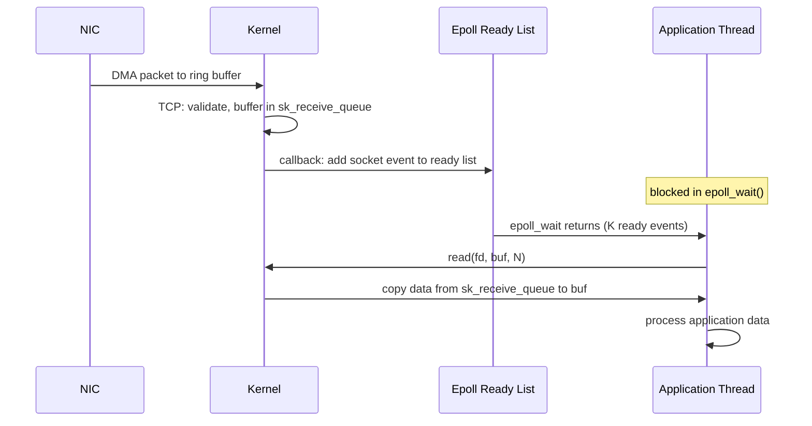

## Keywords in This File
{: .no_toc }

| # | Keyword | Weight |
|---|---|---|
| 23 | [I/O Models: Blocking, Non-blocking, Async, and epoll](#io-models-blocking-non-blocking-async-and-epoll) | critical |

---

# I/O Models: Blocking, Non-blocking, Async, and epoll

🎯 Interview Weight: Critical - I/O model understanding underpins Node.js, Netty, Nginx, and every high-performance server architecture. This is tested in senior Java/backend interviews and system design rounds for any service handling >1K concurrent connections.

---

## 📋 Quick Reference

**One-line definition:** Linux provides five I/O models (blocking, non-blocking, multiplexed I/O via select/poll/epoll, signal-driven, and asynchronous I/O) that trade programmer complexity for thread efficiency; epoll is the kernel mechanism that enables C10K-level concurrency in a single thread.

**Difficulty:** ★★★ | **Asked at:** Senior-Staff | **Seniority:** Senior-Staff

---

### 🎯 Model Answer

**30 seconds:**
> Linux I/O happens in five models: blocking (thread waits until data is ready), non-blocking (thread polls by returning EAGAIN immediately), I/O multiplexing (one thread monitors many fds via select/poll/epoll), signal-driven (kernel notifies via SIGIO when ready), and async I/O (kernel performs the I/O and notifies completion). Epoll is the Linux-specific I/O multiplexer that scales to millions of fds using event notifications - it powers Node.js, Nginx, Netty's NIO transport, and Kafka's network layer.

**3 minutes (Senior):**
> The C10K problem (10,000 concurrent connections) exposed the limit of the one-thread-per-connection model: each thread consumes 512KB-2MB of stack, and 10K threads = 5-20GB RAM just for stacks. Epoll solves this differently: one thread registers interest in thousands of file descriptors with `epoll_create` + `epoll_ctl`, then blocks on `epoll_wait`. The kernel maintains a ready list - when data arrives on a socket, the kernel adds it to the ready list and wakes the thread. `epoll_wait` returns only the fds that are ready, not all monitored fds - this is the key O(1) vs O(N) difference from select/poll. Two modes: edge-triggered (ET, notified once when state changes from not-ready to ready) and level-triggered (LT, notified repeatedly while data remains available). LT is safer (default) but may cause spurious wakeups; ET requires draining the fd completely on each notification to avoid missing events. In Java, this is NIO Selectors (backed by epoll on Linux). Netty wraps NIO with an event loop model where each EventLoop thread owns ~100K connections via epoll. Node.js uses libuv which wraps epoll. Understanding this model is essential for sizing thread pools: a 32-thread Netty server can handle hundreds of thousands of connections because most time is spent waiting for I/O in epoll, not in threads.

**Framework:** BLOCKING -> POLLING -> MULTIPLEXING (epoll) -> ASYNC (io_uring)

*Adapting up:* io_uring (Linux 5.1+, fully async kernel I/O with completion rings), io_uring in Java via Project Loom integration, and the implications of virtual threads (Java 21) on I/O model selection.

*Adapting down:* Imagine 10,000 customers waiting for packages. Blocking I/O: 10,000 employees each waiting by one door. Epoll: one employee watching a dashboard that lights up only when a door has a delivery.

**Blank Mind Recovery:**

**(1) Restate:** "I/O models - how a thread interacts with I/O operations that take time. Epoll - efficient way to monitor many connections at once."

**(2) First principles:** "Network I/O has latency (packets are slow). If a thread blocks waiting for each packet, you need one thread per connection. If a thread can be notified when any of many connections have data, one thread can serve all of them."

**(3) Bridge:** "This is why Node.js can handle thousands of concurrent connections with a single thread - it uses epoll via libuv to monitor all sockets and calls JavaScript callbacks only when data is ready."

---

### 📘 Concept Explanation

**What it is:**
Linux I/O models are the interfaces between application code and the kernel's I/O subsystem. They differ in who waits (thread or kernel), when data transfer happens (synchronous or asynchronous), and how readiness is communicated (poll, interrupt, completion queue).

**The five POSIX I/O models:**

```
I/O MODEL COMPARISON:
============================================================
Model         System call   Thread blocked?  Data copy when?
---------     -----------   ---------------  ---------------
Blocking      read()        Yes - until data Kernel -> user
              recv()        arrives          buffer during
                                             the call

Non-blocking  read() with   No - returns     Kernel -> user
              O_NONBLOCK    EAGAIN if empty  buffer if ready,
                            else copies data else EAGAIN

Multiplexed   select()      Yes - until      Kernel -> user
I/O (epoll)   poll()        readiness event  buffer in second
              epoll_wait()  fires; then read call (separate
                            is still needed  read() step)

Signal-driven fcntl()       No - SIGIO       Kernel -> user
I/O           SIGIO         fires on ready   buffer in signal
                                             handler (complex)

Async I/O     io_uring      No - completion  Kernel -> user
(io_uring)    aio_read()    ring entry fires buffer in kernel;
                                             no extra copy
```

> **Diagram walkthrough:** The models form a spectrum from maximum simplicity (blocking - the kernel does everything, the thread just waits) to maximum efficiency (async io_uring - the kernel does everything including the data copy, the thread is never blocked). The middle options trade complexity for parallelism. The key multiplexing distinction: epoll requires two steps - wait for readiness (epoll_wait), then copy data (read()) - whereas async I/O (io_uring) combines both into one kernel operation with a completion queue entry. This two-step requirement in epoll means the thread is still involved in the data copy, but that copy is very fast (data is ready in the socket buffer).

**Select vs Poll vs Epoll internals:**

```
SCALABILITY COMPARISON:
============================================================
select():
  - Pass ALL monitored fds to kernel every call (O(N) copy)
  - Kernel scans ALL fds for readiness (O(N) scan)
  - Limited to FD_SETSIZE (typically 1024) fds
  - Returns a bitmask - must scan all to find ready ones

poll():
  - Pass ALL monitored fds to kernel every call (O(N) copy)
  - Kernel scans ALL fds for readiness (O(N) scan)
  - No FD_SETSIZE limit (unlimited fds)
  - Still O(N) per call; unusable for 100K+ fds

epoll():
  - epoll_ctl(): register fd interest ONCE (O(1))
  - epoll_wait(): kernel returns ONLY ready fds
  - Kernel maintains ready list using callback on socket
  - O(1) for adding/removing fds
  - O(K) per epoll_wait where K = ready fds (not total)
  - No copy of all fds on every call
  - Scales to millions of fds
```

> **Diagram walkthrough:** The fundamental scalability difference is O(N) vs O(K) where N is total monitored fds and K is ready fds. With select/poll, even if only 1 of 10,000 sockets has data, the kernel must scan all 10,000. With epoll, the kernel uses kernel-side callbacks: when a socket receives data, the socket's receive handler adds it to the epoll instance's ready list directly. The application calls `epoll_wait`, which returns only the K ready fds - if 5 of 10,000 sockets have data, epoll_wait returns an array of 5 events. This scales because most time is spent with K << N.

**Edge-triggered vs Level-triggered epoll:**

```
EDGE vs LEVEL TRIGGERED:
============================================================
Level-triggered (LT) [DEFAULT]:
  - epoll_wait returns fd as long as data is available
  - If 1KB of data arrives and read() reads 512 bytes:
    next epoll_wait STILL returns this fd (512B remaining)
  - Simpler to use; no risk of missing data
  - Potential spurious wakeups if data is consumed slowly

Edge-triggered (ET):
  - epoll_wait returns fd ONLY when state changes
    (from not-ready to ready)
  - If 1KB arrives and read() reads 512B:
    next epoll_wait will NOT return this fd
    (state did not change - was already "readable")
  - MUST drain the fd completely on each notification
    using a loop: while(read(fd, buf, N) > 0)
    until EAGAIN
  - Higher performance (fewer wakeups)
  - MUST use O_NONBLOCK with ET (blocking read stalls)
```

> **Diagram walkthrough:** Edge vs level triggering is the most common epoll mistake. Level-triggered is forgiving: if you forget to read all data, you will be notified again. Edge-triggered is strict: one notification per readiness transition, so if you don't drain the fd on that notification, you lose subsequent data. ET requires the fd to be set O_NONBLOCK so the draining loop (`while(read(...) > 0) {}`) stops cleanly at EAGAIN instead of blocking forever. The performance advantage of ET is real but modest; the correctness risk is high. Production recommendation: use LT unless benchmarking shows LT is the bottleneck.

**The Java NIO Selector (epoll wrapper):**

```
JAVA NIO / NETTY ARCHITECTURE:
============================================================
Java NIO Selector (backed by epoll on Linux):
  Selector selector = Selector.open();
  channel.configureBlocking(false);  // O_NONBLOCK
  channel.register(selector, SelectionKey.OP_READ);
  // epoll_ctl ADD under the hood

  while (running) {
    selector.select();  // epoll_wait
    Set<SelectionKey> ready = selector.selectedKeys();
    for (SelectionKey key : ready) {
      if (key.isReadable()) {
        readFromChannel(key.channel());  // read()
      }
    }
    ready.clear();
  }

Netty event loop model:
  EventLoop thread (1 per CPU core)
    |
    +--> Selector (epoll_wait)
    +--> Channel N1 (socket fd)
    +--> Channel N2 (socket fd)
    +--> ... up to ~100K channels per EventLoop
    +--> Execute submitted tasks in same thread
         (avoids lock contention between threads)
```

> **Diagram walkthrough:** Java NIO's Selector maps directly to epoll: `Selector.open()` creates an epoll fd, `channel.register()` calls `epoll_ctl(ADD)`, and `selector.select()` calls `epoll_wait()`. Netty builds an event loop model on top: each EventLoop thread owns a Selector and handles all I/O for its assigned channels without cross-thread coordination. This is why Netty can serve millions of connections with a handful of threads - each thread is blocked in `epoll_wait` for most time, and when events arrive, the event loop processes them sequentially (no concurrent access to channel state from multiple threads, hence no locks).

**The key insight:**
I/O efficiency is about minimizing thread blocking time. Blocking I/O couples one thread to one connection. Epoll decouples threads from connections: one thread watches all connections and wakes only when work is available. The number of threads needed is proportional to the number of cores (for CPU work), not the number of connections (for I/O waiting).

**When to use each model:**
- Blocking I/O: simple scripts, short-lived tools, <100 connections
- Non-blocking polling: never in application code (busy loop wastes CPU)
- Epoll/NIO multiplexing: web servers, API gateways, any high-concurrency service
- io_uring: highest-throughput storage servers, database I/O paths (needs Java support)
- Java virtual threads (Java 21+): blocking-style code that the JVM converts to non-blocking; use for greenfield applications

**When NOT to apply naively:**
- epoll's event loop model blocks on CPU-bound work - never do CPU-intensive operations in an event loop thread (Netty: offload to a separate executor)
- Virtual threads (Java 21+) make non-blocking I/O transparent but do not eliminate the need to understand epoll for tuning

---

### 💻 Code Example

**BAD: Blocking I/O for concurrent connections**

```java
// BAD: One thread per connection - cannot scale past ~10K threads
// 10K connections * 1MB stack = 10GB RAM for stacks alone
// At 100K connections: OutOfMemoryError

public class BlockingServer {
    public void start(int port) throws IOException {
        ServerSocket server = new ServerSocket(port);
        while (true) {
            // Blocks until a connection arrives
            Socket client = server.accept();
            // New thread per connection - unscalable
            new Thread(() -> handleClient(client)).start();
            // Each thread: 512KB-2MB of stack
            // 10K concurrent: 5GB-20GB RAM for stacks
        }
    }

    private void handleClient(Socket client) {
        try {
            InputStream in = client.getInputStream();
            // Blocks until data arrives - thread tied to conn
            int data = in.read();
            // process...
        } catch (IOException e) {
            // handle
        }
    }
}
```

> **Code walkthrough:** The one-thread-per-connection model is simple but has a hard scalability ceiling. Each Java thread allocates an OS thread with a stack (default 512KB, often 1-2MB). 10,000 threads = 5-20GB of RAM for stacks alone, before any application memory. The OS scheduler struggles with 10K threads (context switch overhead increases), and creating/destroying threads for short-lived connections adds latency. This is the exact model that caused the C10K problem in 1999 and is the reason epoll was created.

**GOOD: Non-blocking I/O with epoll via Java NIO**

```java
import java.nio.channels.*;
import java.nio.ByteBuffer;
import java.net.InetSocketAddress;
import java.util.Iterator;

// GOOD: Single thread handles thousands of connections
// via epoll event loop
public class NioServer {

    public void start(int port) throws Exception {
        Selector selector = Selector.open();  // epoll_create
        ServerSocketChannel server =
            ServerSocketChannel.open();
        server.bind(new InetSocketAddress(port));
        server.configureBlocking(false);      // O_NONBLOCK
        server.register(                      // epoll_ctl ADD
            selector, SelectionKey.OP_ACCEPT);

        ByteBuffer buffer = ByteBuffer.allocate(1024);

        while (true) {
            // Blocks until at least one fd is ready
            selector.select();               // epoll_wait
            Iterator<SelectionKey> it =
                selector.selectedKeys().iterator();

            while (it.hasNext()) {
                SelectionKey key = it.next();
                it.remove();                 // must remove

                if (key.isAcceptable()) {
                    SocketChannel client =
                        server.accept();
                    client.configureBlocking(false);
                    client.register(         // epoll_ctl ADD
                        selector,
                        SelectionKey.OP_READ);

                } else if (key.isReadable()) {
                    SocketChannel client =
                        (SocketChannel) key.channel();
                    buffer.clear();
                    int bytesRead = client.read(buffer);
                    if (bytesRead == -1) {
                        client.close();  // epoll_ctl DEL
                    } else {
                        buffer.flip();
                        // process data...
                        client.write(buffer);
                    }
                }
            }
        }
    }
}
```

> **Code walkthrough:** This NIO server uses a single thread to handle all connections via epoll. `Selector.open()` creates the epoll file descriptor. `server.register(selector, OP_ACCEPT)` calls `epoll_ctl(epollfd, EPOLL_CTL_ADD, serverfd, EPOLLIN)`. `selector.select()` calls `epoll_wait()` and blocks until at least one fd is ready. The returned `selectedKeys()` contains only the fds with pending events - if 5 of 10,000 clients have data, only 5 SelectionKeys are returned. `it.remove()` is mandatory: Selector does not automatically clear processed keys (unlike epoll which clears them on next wait). The key insight: all I/O operations on non-blocking channels return immediately with data if available, or with 0/-1 if not - the thread never blocks waiting for data.

**GOOD: epoll via Linux system call (C reference)**

```c
#include <sys/epoll.h>
#include <fcntl.h>
#include <unistd.h>

#define MAX_EVENTS 64
#define MAX_CONNECTIONS 100000

int set_nonblocking(int fd) {
    int flags = fcntl(fd, F_GETFL, 0);
    return fcntl(fd, F_SETFL, flags | O_NONBLOCK);
}

int run_epoll_server(int server_fd) {
    // Create epoll instance (one fd watches all connections)
    int epollfd = epoll_create1(EPOLL_CLOEXEC);

    struct epoll_event ev, events[MAX_EVENTS];
    ev.events = EPOLLIN;  // level-triggered read
    ev.data.fd = server_fd;
    epoll_ctl(epollfd, EPOLL_CTL_ADD, server_fd, &ev);

    while (1) {
        // Wait for events - returns up to MAX_EVENTS ready fds
        // Blocks if no events; -1 timeout = wait forever
        int nfds = epoll_wait(
            epollfd, events, MAX_EVENTS, -1);

        for (int i = 0; i < nfds; i++) {
            int fd = events[i].data.fd;

            if (fd == server_fd) {
                // New connection
                int client_fd = accept4(
                    server_fd, NULL, NULL,
                    SOCK_NONBLOCK | SOCK_CLOEXEC);
                ev.events = EPOLLIN;
                ev.data.fd = client_fd;
                epoll_ctl(
                    epollfd,
                    EPOLL_CTL_ADD,
                    client_fd,
                    &ev);
            } else {
                // Data available on client_fd
                char buf[4096];
                ssize_t n = read(fd, buf, sizeof(buf));
                if (n <= 0) {
                    epoll_ctl(
                        epollfd,
                        EPOLL_CTL_DEL,
                        fd, NULL);
                    close(fd);
                }
                // process buf[0..n-1]
            }
        }
    }
}
```

> **Code walkthrough:** This is the raw Linux epoll API used by Nginx and Node.js under the hood. `epoll_create1()` creates the epoll instance (returns a file descriptor). `epoll_ctl(EPOLL_CTL_ADD)` registers each socket fd with the epoll instance - this is O(1) and done once per connection. `epoll_wait()` blocks and returns up to MAX_EVENTS ready events - each event contains the fd and the event type. For 100,000 connected clients with 10 sending data at once, `epoll_wait` returns 10 events, not 100,000. `SOCK_NONBLOCK` on accept4 sets O_NONBLOCK atomically with accept, avoiding the separate fcntl call. `EPOLL_CTL_DEL` on close is good practice (not strictly required since close() removes the fd from all epoll instances, but explicit is clearer).

---

### 🎓 Answers by Seniority

**Junior / Mid (0-5 years):**
> Blocking I/O means a thread waits until data is available - simple but ties one thread per connection, limiting scalability. Non-blocking I/O uses O_NONBLOCK so read() returns immediately. Epoll is a Linux mechanism that lets one thread watch thousands of connections and wake up only when any of them have data ready - this is how Nginx and Node.js handle high concurrency. Java NIO's Selector is built on epoll.

*Push deeper:* Edge-triggered vs level-triggered epoll, the specific O(N) vs O(1) scalability improvement over select/poll, Java virtual threads (Java 21) as the modern alternative, and io_uring as the next-generation async I/O.

---

**Senior / Staff (5+ years):**
> The I/O model determines the relationship between threads and connections. Blocking: 1 thread = 1 connection (C10K limit). Epoll: 1 thread = up to ~100K connections (all waiting for I/O simultaneously). The epoll efficiency is O(K) per wait call (K = ready fds), vs O(N) for select/poll (N = all monitored fds). In Java, NIO Selectors map to epoll, and Netty's EventLoop model (one EventLoop thread per core, each owning a Selector with ~100K channels) is how modern Java servers scale. I tune epoll usage by: (1) using level-triggered mode (default) for correctness, (2) setting `SelectionKey.interestOps()` dynamically to avoid registering for write interest when the write buffer is empty (unnecessary wakeups), (3) avoiding any blocking operation in the event loop thread (database calls, CPU work must be offloaded to a separate executor). With Java 21 virtual threads, structured concurrency with blocking-style NIO is viable again because the JVM pins virtual threads only when they are actually executing Java code, not when they are blocked in I/O kernel calls.

*Push deeper:* io_uring, its performance advantage for sequential I/O over epoll (batch syscall submission), and the implications for Java storage engines (RocksDB, Kafka log).

---

### ⚠️ Common Misconceptions

**Misconception 1: "Non-blocking I/O means the data transfer is asynchronous"**
Non-blocking I/O means the system call returns immediately (with EAGAIN) if data is not available, rather than blocking. But when data IS available, `read()` still copies data synchronously from the kernel socket buffer to the user-space buffer in the same system call. The data copy is synchronous. True async I/O (io_uring, aio) means the kernel performs the data copy and notifies the application via a completion queue - the application thread never directly calls read().

**Misconception 2: "Epoll eliminates the need for multiple threads"**
Epoll allows one thread to monitor many connections for I/O readiness, eliminating threads blocked waiting for I/O. But CPU-bound work must still run on threads. The correct model: epoll with N threads (where N = CPU cores) for event dispatching, and a separate thread pool for CPU-bound processing. Doing CPU work in the event loop thread starves all other connections handled by that thread.

**Misconception 3: "Select/poll and epoll are equivalent, just with different APIs"**
Select and poll are O(N) per call (N = all monitored fds), requiring the kernel to scan all registered fds on every call. Epoll is O(K) per call (K = ready fds) because the kernel maintains a ready list that is populated by callbacks when sockets receive data. For N=10,000 with K=10 ready fds: select/poll scan 10,000; epoll returns 10. The performance difference at scale is not marginal - select at 100K fds makes 100K kernel state checks per call; epoll makes 100.

**Misconception 4: "Java NIO channels are truly zero-copy"**
Java NIO `FileChannel.transferTo()` uses `sendfile()` on Linux for zero-copy transfer from file to socket (Kafka uses this). But standard `SocketChannel.read()` into a `ByteBuffer` still copies data from the kernel socket buffer to the Java heap (unless using direct ByteBuffers which avoid the extra heap copy but still involve a kernel-to-off-heap copy). True zero-copy for application-level processing requires io_uring with registered buffers.

---

### 🚨 Failure Modes and Diagnosis

**Failure Mode 1: Selector Spin Loop (100% CPU on event loop thread)**

Symptom: One event loop thread at 100% CPU; JVM stack shows continuous `selector.select()` calls returning 0 or immediately.

```java
// CAUSE: JDK epoll bug (pre-Java 11) - epoll spurious wakeup
// selector.select() returns 0 immediately in a loop
// CPU burns in tight loop doing nothing

// DIAGNOSTIC:
// 1. Thread dump shows EventLoop thread in Selector.select()
// 2. CPU profiler shows 100% in selector/epoll code
// 3. Netty logs: "Selector.select() returned prematurely"

// DETECTION IN NETTY:
// Netty has built-in spin detection:
// io.netty.selectorAutoRebuildThreshold (default 512)
// If select() returns 0 more than 512 times in 1 second,
// Netty rebuilds the Selector (epoll instance rebuild)

// MANUAL WORKAROUND (non-Netty NIO code):
int emptySelects = 0;
while (running) {
    int selected = selector.select(1000);
    if (selected == 0) {
        if (++emptySelects >= 512) {
            rebuildSelector();   // create new Selector, re-reg
            emptySelects = 0;
        }
    }
    // process ready keys...
}
```

> **Code walkthrough:** The JDK epoll spin bug is a known issue in older JDKs (fixed in Java 11) where `Selector.select()` returns 0 spuriously in a tight loop, burning 100% CPU. Netty's auto-rebuild mechanism detects this: if select() returns 0 more than 512 times in a short window, Netty creates a new Selector, re-registers all channels, and closes the broken Selector. The rebuild takes milliseconds and is transparent to active connections. This is one reason Netty is preferred over raw NIO - it handles JDK quirks. Diagnosis: thread dump with stack traces showing the event loop thread cycling through select() with no actual I/O processing.

**Failure Mode 2: Event Loop Starvation from Blocking Operation**

Symptom: High p99 latency; epoll thread not blocked in epoll_wait; all CPU on event loop thread but no actual I/O throughput.

```java
// BAD: Blocking database call in Netty event loop handler
@ChannelHandler.Sharable
public class BadHandler extends SimpleChannelInboundHandler<String> {
    @Override
    protected void channelRead0(ChannelHandlerContext ctx,
                                String msg) {
        // This blocks the event loop thread for 50-200ms!
        // All other channels on this EventLoop are starved
        String result = database.query(msg);
        ctx.writeAndFlush(result);
    }
}

// GOOD: Offload to executor
@ChannelHandler.Sharable
public class GoodHandler extends SimpleChannelInboundHandler<String> {
    private final EventExecutorGroup executor =
        new DefaultEventExecutorGroup(8);  // 8 DB threads

    @Override
    protected void channelRead0(ChannelHandlerContext ctx,
                                String msg) {
        // ctx.executor() = EventLoop thread; do NOT block it
        executor.submit(() -> {
            String result = database.query(msg);
            // Write back on the EventLoop thread
            ctx.writeAndFlush(result);
        });
    }
}
```

> **Code walkthrough:** An event loop thread handles all I/O events for ~100K channels. If the handler blocks for 100ms on a database query, all 100K channels are delayed by 100ms. The pattern is insidious: each request looks fine in isolation (100ms DB query) but the cumulative effect is that all pending connections experience the full blocking duration. The diagnostic: Netty's `io.netty.handler.timeout.IdleStateHandler` or a custom metrics handler measuring time from `channelRead` entry to `writeAndFlush`. The fix is always to offload blocking operations to a separate executor and return control to the event loop immediately.

---

### 🎯 Interview Deep-Dive

| Category | Count | Coverage |
|---|---|---|
| Conceptual | 4 | I/O models, epoll internals, ET vs LT, Java NIO |
| Debugging | 3 | selector spin, event loop starvation, fd leak |
| Trade-off | 3 | blocking vs epoll, ET vs LT, epoll vs io_uring |
| Behavioral | 1 | I/O scaling production incident |
| Design | 1 | design a high-throughput server |

---

**[JUNIOR] Q1 - [TRADE-OFF] Explain the five Linux I/O models and when you would use each.**

Linux I/O models: (1) Blocking I/O - `read()` blocks until data is available; simplest model; thread is tied to connection; appropriate for <100 concurrent connections or simple tools. (2) Non-blocking I/O - `read()` with `O_NONBLOCK` returns EAGAIN immediately if no data; application must poll by calling read() repeatedly; wasteful (busy loop burns CPU) unless combined with select/poll/epoll. (3) I/O multiplexing - `select()`, `poll()`, or `epoll_wait()` blocks until any of multiple fds are ready, then non-blocking reads service each ready fd; the standard model for high-concurrency servers; Nginx, Node.js, Netty use epoll. (4) Signal-driven I/O - `fcntl(fd, F_SETOWN, pid)` + `fcntl(fd, F_SETFL, O_ASYNC)` configures the kernel to send SIGIO when the fd is ready; the signal handler then reads the data; rarely used due to async-signal-safety complexity and signal coalescing (multiple ready fds generate one signal). (5) Asynchronous I/O - `io_uring` submits read/write operations to a kernel ring buffer and the kernel performs the I/O asynchronously, placing completion events in a separate ring; the application polls the completion ring; eliminates both waiting and the explicit read step; best for disk I/O on NVMe storage.

*What separates good from great:* The signal coalescing problem with signal-driven I/O (explaining why it is practically unusable), and io_uring's ring buffer model (both submission queue and completion queue) as the next-generation async approach.

---

**[JUNIOR] Q2 - [TRADE-OFF] How does epoll achieve O(1) scalability compared to select/poll?**

Select and poll require the application to pass all monitored file descriptors to the kernel on every call. The kernel then iterates through all fds checking readiness (by calling each socket's `poll` file operation to check if data is available in its receive buffer). This is O(N) work per call where N is the number of monitored fds - even if only 1 of 10,000 sockets has data, the kernel checks all 10,000. Additionally, the application must receive the full fd set back and scan it to find which fds are ready. Epoll changes the model with a stateful kernel data structure: `epoll_create()` creates an epoll instance (an rb-tree and a ready list). `epoll_ctl(ADD)` registers a socket with the epoll instance once; the kernel attaches a callback to the socket's wait queue - when data arrives in the socket's receive buffer, this callback fires and adds the socket's epoll_event to the ready list. `epoll_wait()` simply returns the current contents of the ready list (up to maxevents). The O(1) is for the callback (fired when data arrives, cost independent of total monitored fd count). `epoll_wait()` is O(K) where K is ready fds, but K << N in practice. For N=1,000,000 monitored fds and K=100 ready: select would do 1,000,000 kernel polls per call; epoll does 100 ready-list reads.

*What separates good from great:* The kernel callback mechanism (not just "epoll uses a different data structure") - the ready list is populated by socket receive callbacks, making it O(1) to maintain, not by scanning on each wait call.

---

**[MID] Q3 - [TRADE-OFF] What is the difference between edge-triggered and level-triggered epoll, and which should you use?**

Level-triggered (LT) is the default: `epoll_wait` returns a fd as long as there is unread data in its receive buffer. If the application reads 512 bytes of a 1024-byte buffer, the next `epoll_wait` call will return that fd again (512 bytes remain). LT is forgiving: missing a read opportunity means you will be notified again on the next wait call. Edge-triggered (ET): `epoll_wait` returns a fd only when its state transitions from not-ready to ready (the edge of the state change). If 1024 bytes arrive and the application reads only 512, the next `epoll_wait` will NOT return this fd - no new data arrived, so no edge transition. The remaining 512 bytes are effectively "stuck" unless new data arrives (causing another edge). ET requires the application to drain the fd completely on each notification: loop `read()` until it returns EAGAIN (no more data). The fd must be O_NONBLOCK for this to work correctly (so the draining loop stops at EAGAIN rather than blocking). Practical recommendation: use LT for most applications. ET provides slightly better performance (fewer spurious wakeups) but requires rigorous drain-to-EAGAIN logic and is easy to get wrong (partial reads silently lose data). Production servers like Nginx use ET for the performance benefit with careful implementation; most application-level servers use LT.

*What separates good from great:* The "stuck data" scenario for ET (data present but no new notification until new data arrives), the O_NONBLOCK requirement for safe draining, and the production server recommendation with reasoning.

---

**[MID] Q4 - [MECHANISM] What is io_uring and how does it improve on epoll for disk I/O?**

io_uring (Linux 5.1+, 2019) is a kernel I/O interface based on two ring buffers shared between user space and the kernel: a submission queue (SQ) where the application writes I/O requests, and a completion queue (CQ) where the kernel writes I/O results. The application submits batches of I/O operations (reads, writes, accept, send, recv) to the SQ without any syscall - it writes directly to the shared memory ring. A single `io_uring_enter` syscall submits all pending operations and optionally waits for completions. The kernel processes submissions asynchronously using a kernel thread (sqpoll mode eliminates even the io_uring_enter syscall). Completion events appear in the CQ and the application reads them without a syscall. The advantage over epoll for disk I/O: epoll works for sockets (TCP/UDP receive buffers are ready immediately when data arrives) but Linux page cache reads for files are not interruptible the same way - `read()` on a file blocks even with O_NONBLOCK if the page is not in cache. io_uring's async disk reads avoid this: the kernel submits the disk read to the block layer and writes a completion when done. For network I/O, io_uring's main advantage is batching: one syscall submits 100 accept/read/write operations, vs epoll which requires a syscall per I/O operation. Current production use: io_uring powers TiKV's storage layer, some Kafka proposals, and WireGuard on Linux 5.6+. Java support: Project Loom experiments with io_uring integration; the Netty team has an experimental io_uring transport.

*What separates good from great:* The shared memory ring mechanism (writes without syscalls), the sqpoll mode (zero-syscall I/O), the specific problem with epoll and non-cacheable disk reads, and the batching advantage for network I/O.

---

**[SENIOR] Q5 - [DESIGN] How would you design a high-throughput HTTP server handling 1 million concurrent connections?**

At 1M concurrent connections, the design constraints are: (1) file descriptor limit: default 1024/process, must set `/proc/sys/fs/file-max` and `ulimit -n` to 1M+; (2) memory: each socket's kernel receive/send buffers are 4-87KB default - 1M sockets * 8KB = 8GB kernel memory for socket buffers alone; (3) thread count: must use epoll, not per-thread model. Architecture: multiple processes/threads bound to the same socket with `SO_REUSEPORT` - each process gets a subset of connections through the kernel's socket hash distribution (load-balancing without a single accept bottleneck). Each process runs an epoll event loop with one thread per core. Configuration: `sysctl -w net.core.somaxconn=65535` (accept queue depth), `sysctl -w net.ipv4.tcp_max_syn_backlog=65535` (SYN queue), `net.ipv4.tcp_tw_reuse=1` (TIME_WAIT socket reuse). Memory: reduce socket buffer sizes for mostly-idle connections: `net.ipv4.tcp_rmem` and `tcp_wmem` min sizes to 4KB. Use a user-space HTTP parser that processes requests without copying (pointing into the existing receive buffer). In Java: Netty with native epoll transport (`EpollEventLoopGroup` instead of `NioEventLoopGroup`) for lower JNI overhead; tune EventLoop count to `CPU_CORES * 2`; use pooled direct ByteBuffers (`PooledByteBufAllocator`) to eliminate GC pressure.

*What separates good from great:* The socket buffer memory calculation (8GB kernel memory - this is the real constraint, not the fd limit), `SO_REUSEPORT` for multi-process accept without locking, and the Netty native epoll vs NIO tradeoff (native epoll bypasses the Java Selector abstraction layer).

---

**[SENIOR] Q6 - [TRADE-OFF] How does Java NIO Selector interact with epoll, and what are its limitations vs native epoll?**

Java NIO's `Selector` on Linux is backed by epoll. `Selector.open()` calls `epoll_create()`. `SelectableChannel.register(selector, ops)` calls `epoll_ctl(EPOLL_CTL_ADD)`. `Selector.select()` calls `epoll_wait()`. The registered ops (OP_READ, OP_WRITE, OP_ACCEPT, OP_CONNECT) map to epoll event flags (EPOLLIN, EPOLLOUT). The limitations vs native epoll: (1) Java NIO always uses level-triggered epoll (no edge-triggered option from the Selector API). (2) The JDK has historically had a bug where `select()` returns spuriously (the "epoll spin bug"), fixed in Java 11. (3) Each `select()` call involves a JNI transition from Java to native, adding overhead for very-high-frequency select loops. (4) Selected keys are returned as a Java `Set<SelectionKey>` requiring object allocation (mitigated by key reuse). (5) The `selectedKeys().clear()` step is manual - forgetting it causes infinite re-processing of handled events. Netty's native epoll transport (`EpollServerSocketChannel`) bypasses the Java NIO Selector entirely, using JNI to call epoll directly. This provides: edge-triggered mode support, `SO_REUSEPORT` for multi-process accept, and `EPOLLEXCLUSIVE` for efficient multi-thread accept. The performance difference in microbenchmarks is 10-30% for very high connection rates; for most production applications, standard NIO is sufficient.

*What separates good from great:* The specific Selector API limitations (LT-only, spurious wakeup bug, manual key clearing), Netty native epoll as the solution, and the realistic performance gain assessment (10-30% micro, less significant in macro).

---

**[SENIOR] Q7 - [TRADE-OFF] What happens at the kernel level when a TCP packet arrives for a socket registered with epoll?**

The packet arrival sequence: (1) NIC receives the Ethernet frame and writes it to a ring buffer via DMA; fires an interrupt (or uses NAPI polling for high-throughput). (2) The kernel network softirq processes the ring buffer, strips Ethernet header, routes IP packet, matches TCP header to a socket (using a hash of src/dst IP/port pairs). (3) The TCP layer appends the payload to the socket's receive buffer (sk_receive_queue). (4) The TCP layer calls `wake_up()` on the socket's wait queue (`sk_sleep`). (5) The epoll subsystem has registered a callback on this wait queue. The callback fires, checks if the socket is in a connected epoll instance's interest list, and if so: adds an `epoll_event` entry to the epoll instance's ready list (a double-linked list); if a thread is blocked in `epoll_wait`, wakes it via its wait queue. (6) The thread in `epoll_wait` returns with the ready events. (7) The application calls `read()` on the socket, which copies data from the kernel socket buffer (sk_receive_queue) to the user-space buffer. The copy happens in the `read()` call, not during packet arrival. This is why epoll is "ready notification" not "completion notification": you are notified that data is ready to copy, but you still perform the copy synchronously.

*What separates good from great:* The wait queue callback mechanism (the kernel plumbing connecting TCP receive to epoll notification), the distinction between ready notification (epoll) vs completion notification (io_uring), and explicitly noting that the data copy happens in the application's read() call, not during packet arrival.

---

**[SENIOR] Q8 - [MECHANISM] How do Java virtual threads (Java 21) change the I/O model for Java applications?**

Java virtual threads (Project Loom, GA in Java 21) are user-mode threads scheduled by the JVM onto a pool of OS threads (carrier threads). When a virtual thread executes a blocking I/O operation (socket read, file read, JDBC query), the JVM detects the blocking point and unmounts the virtual thread from its carrier thread. The carrier thread is then free to run other virtual threads. When the I/O completes (via epoll notification internally), the virtual thread is rescheduled onto a carrier thread and continues. From the developer's perspective: write blocking-style code (`inputStream.read()`) and the JVM handles the async under the hood. The epoll event loop runs inside the JVM's common pool, invisibly to application code. Impact on I/O model selection: virtual threads eliminate the ergonomic complexity of reactive/async programming (callbacks, CompletableFuture chains, Reactor/RxJava) for I/O-bound services. A Java 21 HTTP server with virtual threads uses `Thread.ofVirtual().start(() -> handleRequest(socket))` per connection - the code looks like the blocking one-thread-per-connection model, but the JVM implements it with epoll internally. Limitations: virtual threads still block on CPU-intensive work (which occupies a carrier thread) and on synchronized Java code that holds a monitor (they "pin" to the carrier thread). The recommendation: use virtual threads for new Java 21+ applications doing I/O-bound work; keep traditional NIO/reactive for CPU-bound event processing or very latency-critical paths where you want direct epoll control.

*What separates good from great:* The unmounting mechanism (virtual thread unmounts from carrier thread at blocking point, re-mounts when I/O completes), the "pinning" limitation with synchronized blocks, and the practical recommendation (virtual threads for new apps, direct NIO for extreme latency tuning).

---

**[SENIOR] Q9 - [BEHAVIORAL] (Behavioral) Describe an incident where I/O model choice caused a production problem.**

A Spring Boot API service was experiencing random latency spikes of 2-10 seconds under moderate load (1,000 req/s). The service used Spring WebMVC (blocking Tomcat) with synchronous HTTP client calls to downstream services. Under normal conditions, each request thread completed in 50-100ms. Under moderate load, some requests were taking 2+ seconds. Investigation: thread dump showed hundreds of threads in `sun.net.www.http.HttpClient.parseHTTPHeader` - the default `RestTemplate` uses Java's built-in HTTP client which is blocking. When a downstream service slowed down (due to a DB query taking 500ms), the response was delayed. With Tomcat's default 200 threads and 1,000 req/s, the math: 1,000 * 0.5s = 500 average concurrent threads needed, exceeding the 200-thread pool immediately. The fix: switched to WebFlux (reactive, epoll-based) with WebClient for the downstream calls. The event loop model with non-blocking HTTP calls meant slow downstream services caused back-pressure (WebFlux's flow control) rather than thread pool exhaustion. The 2-second spikes disappeared; the service handled 5,000 req/s with 4 event loop threads. Lesson: a single slow downstream service call can cascade thread pool exhaustion in a blocking I/O model; non-blocking I/O isolates the slowness to backpressure.

*What separates good from great:* The quantitative analysis (1,000 req/s * 500ms latency = 500 concurrent threads needed vs 200 available - showing the math), the root cause as cascading thread pool exhaustion (not the downstream slowness itself), and the specific fix (WebFlux + WebClient) with the measured improvement.

---

**[STAFF] Q10 - [MECHANISM] What is the self-pipe trick and why is it needed with epoll?**

The self-pipe trick solves the problem of making process signals (SIGTERM, SIGCHLD, etc.) compatible with an epoll event loop. The issue: `epoll_wait()` blocks a thread. If a SIGTERM arrives while the thread is in `epoll_wait()`, the signal handler fires and the call returns with EINTR. But complex signal handler code (calling mutex-protected functions) violates async-signal-safety rules. The self-pipe trick: create a pipe (`pipe2(pipefd, O_NONBLOCK)`). Register the read end with epoll (EPOLLIN). In the signal handler, write one byte to the write end (`write(pipefd[1], "x", 1)` - write is async-signal-safe). The epoll_wait wakes up (pipe read end is readable). In the event loop's normal context (safe to call any function), read the byte from the pipe and handle the signal. Modern Linux alternative: `signalfd()` - creates a special fd that becomes readable when a signal arrives, designed for exactly this epoll integration. Register the signalfd with epoll and read signal information from it like any other event. Java uses the self-pipe trick internally: `AbstractSelector` implementations use a pair of sockets (pipe equivalent) to interrupt `select()`/`epoll_wait()` when `wakeup()` is called from another thread.

*What separates good from great:* The async-signal-safety constraint as the motivation (not just "signals don't work with epoll"), the signalfd as the modern Linux alternative, and knowing Java's Selector.wakeup() uses the same pipe mechanism internally.

---

**[STAFF] Q11 - [DEBUGGING] How would you diagnose and fix high p99 latency in a Netty-based service?**

High p99 latency in Netty typically has three root causes: event loop starvation, write buffer backpressure, or GC pauses. Diagnosis: first, check if the event loop thread is blocked: `jstack <pid> | grep -A20 "EventLoop"` - if EventLoop threads show stack traces inside handler code (not in `epoll_wait`), they are blocked on a slow operation. Second, check write buffer fullness: Netty's `Channel.isWritable()` returns false when the outbound buffer exceeds `channelWritabilityChanged` threshold; log this event in a `ChannelDuplexHandler`. Third, check GC: `jstat -gcutil <pid> 1000` showing frequent GC pauses of >50ms causes p99 spikes. Fixes: for event loop starvation, offload all blocking operations to a separate executor (database queries, HTTP calls) and return control to the event loop immediately. For write backpressure: stop writing when `!channel.isWritable()` and resume in `channelWritabilityChanged`. Configure `ChannelOption.WRITE_BUFFER_HIGH_WATER_MARK` and `LOW_WATER_MARK` appropriately (default: high=64KB, low=32KB). For GC: switch to G1GC or ZGC; use `PooledByteBufAllocator.DEFAULT` (Netty default) to reuse ByteBuffers and reduce allocation rate; avoid converting ByteBufs to Java Strings unnecessarily (forces copy and allocation).

*What separates good from great:* The three distinct root causes with specific diagnostic commands, the write buffer watermark mechanism (Netty's backpressure control), and the PooledByteBufAllocator as the specific GC pressure reduction technique.

---

**[STAFF] Q12 - [FAILURE] What is the C10M problem and how do kernel bypass techniques like DPDK address it?**

The C10K problem (10,000 connections, ~2000) was solved by epoll. The C10M problem (10 million connections or 10 million packets per second, ~2012) exposed a new bottleneck: the Linux kernel network stack itself. At 10M PPS, the overhead per packet in the kernel stack - interrupt handling, socket buffer management, TCP/IP processing, copy from socket buffer to user space - becomes the bottleneck, not the application. DPDK (Data Plane Development Kit) bypasses the kernel network stack entirely: the NIC driver runs in user space, polling the NIC's ring buffer directly (no interrupts). Packets are processed in user space with zero copies and no kernel syscalls for each packet. The trade-off: applications must implement their own networking stack (or use DPDK's libraries for TCP/IP), and the DPDK process monopolizes CPU cores for polling. Kernel bypass techniques: DPDK (user-space drivers), XDP (eXpress Data Path - eBPF programs in the NIC driver before the kernel stack), and io_uring with zero-copy receives (emerging). For most backend applications: epoll scales to 1-10M connections without DPDK. DPDK is used in firewalls, load balancers, and network function virtualization where packet-per-second rate (not connection count) is the bottleneck.

*What separates good from great:* Framing C10M as a packets-per-second problem (not just connection count), explaining DPDK's user-space polling model and the zero-copy mechanism, XDP as the kernel-side alternative, and the realistic scope of who needs DPDK (network functions, not typical API servers).

---

### ⚖️ Comparison Table

| Model | Syscall | Thread blocks | Scalability | Complexity | Use case |
|---|---|---|---|---|---|
| Blocking | read() | Yes, always | O(N) threads | Low | Simple scripts, <100 conn |
| Non-blocking | read()+O_NONBLOCK | No (busy poll) | Poor (CPU waste) | Medium | Combined with epoll only |
| select/poll | select()/poll() | Yes, until ready | O(N) scan | Medium | Legacy, <1K fds |
| epoll | epoll_wait() | Yes, until ready | O(K) ready | Medium | Linux servers, 1K-1M conn |
| io_uring | io_uring_enter() | No (async) | O(1) | High | NVMe disk, batch network |
| Virtual threads | read() (JVM async) | No (JVM unmounts) | O(K) epoll | Low | Java 21+ I/O-bound services |

**The deciding factor:** Thread model determines memory at scale (blocking = 1MB/conn RAM); epoll decouples thread count from connection count; io_uring eliminates the user-kernel boundary for I/O operations.

---

### 🏛️ System Design

**System Design: High-Throughput Message Gateway (Kafka-style Broker Network Layer)**

Design the network I/O layer for a message broker that handles 1M connections with 100K msg/s throughput.

```
BROKER NETWORK LAYER ARCHITECTURE:
======================================
Client Connections (1M total)
         |
  [Acceptor Thread Pool]  <- SO_REUSEPORT, 4 threads
  Each thread: accept() from shared server socket
         |
  [Processor Thread Pool]  <- 16 threads (2x cores)
  Each Processor: epoll event loop
    - 62,500 connections per Processor
    - Read requests from connected clients
    - Parse request bytes (non-blocking)
    - Place request on Request Queue
         |
  [Request Queue]  <- bounded, backpressure
         |
  [Handler Thread Pool]  <- 100 threads
  Business logic, storage writes, response
         |
  [Response Queue]  <- per-Processor queues
         |
  [Processor Thread]  <- epoll + OP_WRITE
  Write responses back to clients
```

> **Diagram walkthrough:** This shows the Kafka-style Acceptor/Processor/Handler network architecture. Each layer (Acceptor, Processor, Handler) has a distinct role: Acceptors distribute new connections via SO_REUSEPORT, Processors run epoll event loops handling I/O for assigned connections, Handlers execute business logic in a separate thread pool. The bounded Request Queue is the backpressure point: when full, Processors stop reading from epoll until capacity returns. The key relationship: I/O work (epoll, read, write) is decoupled from business logic work (handler threads) to prevent either from blocking the other. The edge case: a slow Handler that does not process the Request Queue causes the Processor to back off, which in turn applies TCP backpressure to clients.

**Key design decisions:**

1. Acceptor/Processor separation - acceptors hand off fds to Processors, avoiding per-connection thread creation
2. SO_REUSEPORT on acceptors - kernel distributes new connections across acceptors without lock contention
3. Bounded Request Queue - backpressure: when queue is full, Processor stops reading from epoll until queue drains
4. Response Queue per Processor - avoids cross-thread channel access, all writes happen on the channel's owning Processor
5. Read/write separation - OP_READ registered always; OP_WRITE registered only when a response is queued (avoid unnecessary write-ready events)

This is essentially Kafka's Acceptor/Processor/Handler model, which handles millions of connections with ~50 threads total.

---

### 📊 Diagram

The following shows the epoll event loop model and how packets flow from NIC to application:

```
PACKET -> APPLICATION DATA FLOW:
========================================
  NIC                 KERNEL            USER SPACE
  ---                 ------            ----------
  [Packet arrives]
     |
  [DMA to ring buf]
     |
  [NAPI softirq]
     |
  [TCP stack: seq
   check, buffer]
     |
  [sk_receive_queue] --callback--> [epoll ready list]
                                         |
                                   [epoll_wait returns]
                                         |
                                   [read(fd, buf, N)]
                                    copies data from
                                    sk_receive_queue
                                    to user buf
                                         |
                                   [application data]
```

> **Diagram walkthrough:** This shows the two-phase nature of epoll I/O: the kernel receives and buffers the packet (phase 1), then notifies the application of readiness via the epoll ready list (transition), and the application copies the data in a separate read() call (phase 2). The callback on sk_receive_queue is the kernel mechanism that makes epoll O(1): rather than scanning all sockets for readiness, the kernel fires the callback when data arrives, maintaining the ready list incrementally. The senior insight: the data copy still happens in the application's read() call - epoll is ready notification, not completion notification like io_uring.



> **Diagram walkthrough:** This sequence diagram shows the full path from NIC to application. The epoll callback (Kernel -> EpollReady) is the O(1) mechanism: fired exactly when data arrives, not polled periodically. The application thread blocks in epoll_wait and is woken only when the ready list is non-empty. The final read() call is the only user-kernel boundary for the data transfer. The key relationship: epoll decouples the packet arrival (async, driven by the network) from the data copy (synchronous, driven by the application). The edge case: if the application does not call read() quickly enough, the socket receive buffer fills, TCP flow control reduces the window, and the sender slows - this is natural TCP backpressure.
