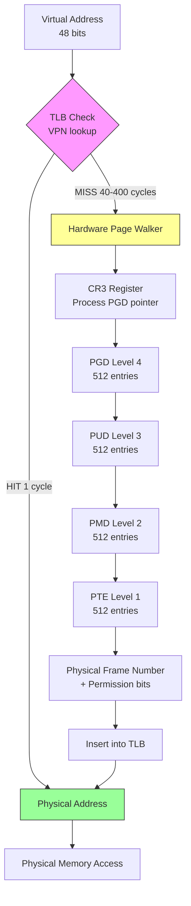

## Keywords in This File
{: .no_toc }

| # | Keyword | Weight |
|---|---|---|
| 1 | [TLB and Memory Management Unit Internals](#tlb-and-memory-management-unit-internals) | critical |

---

# TLB and Memory Management Unit Internals

🎯 Interview Weight: Critical - TLB internals, TLB shootdowns, and MMU page walks appear in senior OS, JVM performance, and distributed systems interviews. Understanding why mmap() has hidden costs, why context switches are expensive, and how NUMA affects memory latency requires knowing these internals.

---

## 📋 Quick Reference

**One-line definition:** The Memory Management Unit (MMU) translates virtual to physical addresses using page tables, and the Translation Lookaside Buffer (TLB) caches recent translations so most address lookups skip the multi-level page table walk.

**Difficulty:** ★★★ | **Asked at:** Senior-Staff | **Seniority:** Senior-Staff

---

### 🎯 Model Answer

**30 seconds:**
> Every memory access uses a virtual address. The MMU translates virtual to physical using a page table - a multi-level tree in RAM. That translation takes 4 memory reads on x86-64 (the four-level page table walk). The TLB caches recent translations so 99%+ of accesses skip the walk entirely. When you switch processes, the TLB must be flushed because virtual addresses now mean different physical locations - this is why context switches have a hidden memory cost beyond register save/restore.

**3 minutes (Senior):**
> I think of the MMU as the CPU's address translation layer and the TLB as its L1 cache. Every instruction that accesses memory produces a virtual address. The MMU intercepts that address and checks the TLB first. If the translation is cached (a TLB hit), the physical address is returned in about 1 cycle. If not (a TLB miss), the MMU's hardware page table walker reads four memory locations - the PGD, PUD, PMD, and PTE from the four-level page table structure - to find the physical page frame number. That's potentially 4 cache misses, adding 100-400 cycles if the tables aren't in cache.
>
> The implication I care about in production is process isolation cost. When the kernel switches from process A to process B, most of the TLB entries become invalid because the same virtual address now maps to a different physical page. The kernel flushes the TLB (writes to CR3 register, which invalidates most TLB entries). On a system with 40% context switch overhead, the TLB cold-start cost is substantial. PCID (Process Context Identifiers) - available since Haswell - lets the CPU tag TLB entries with a process ID, avoiding the full flush, but the OS must explicitly use PCIDs and the benefit depends on the TLB footprint of each process.
>
> The mmap() performance gotcha flows directly from this: unmapping a large region requires the kernel to send IPIs (Inter-Processor Interrupts) to all other CPUs to invalidate their TLB entries for those pages - this is the TLB shootdown. On a 48-core machine, munmap(large_region) sends 47 IPIs and waits for all 47 CPUs to acknowledge. I've seen this take 500+ microseconds on production servers, which explains why Kafka and Lucene use long-lived memory mappings and avoid frequent munmap() calls.

**Framework:** WHAT → WHY → HOW → TRADE-OFF → EXAMPLE

*Adapting up:* Add PCID / ASID hardware tagging, huge pages and their effect on TLB reach, KPTI and Meltdown mitigation overhead, NUMA remote page table walks.

*Adapting down:* WHAT (virtual→physical translation) + WHY (programs can't know physical addresses) + EXAMPLE (every pointer dereference goes through TLB).

**Blank Mind Recovery:**
If you blank in the interview:

**(1) Restate:** "So you are asking about the TLB and MMU - let me think through what problem address translation solves."

**(2) First principles:** "Programs need to isolate each other's memory. If they all used physical addresses, they could overwrite each other. So we need a translation layer that maps each process's virtual view to physical reality. That layer is the MMU."

**(3) Bridge:** "This reminds me of a CPU cache - the TLB is exactly a cache for address translations. TLB miss = cache miss, just for the translation layer. The cost of a TLB miss is the same reasoning as a cache miss: you pay the latency of the backing store."

---

### 📘 Concept Explanation

**What it is:**
The MMU is hardware in the CPU that automatically translates virtual addresses to physical addresses on every memory access. The TLB is a fully-associative cache of recent virtual-to-physical translations, holding 64-4096 entries depending on CPU model and page size.

**The problem it solves:**
Without virtual memory, each process would need to know physical RAM addresses, making memory isolation between processes impossible. If process A and B both start at address 0x1000, they'd overwrite each other. The MMU creates a per-process illusion: every process sees the same virtual address space (0 to 2^48 on x86-64), and the page table maps each process's virtual pages to different physical frames.

**How it works:**
On x86-64, virtual addresses are 48 bits wide (canonical form). The address is split into 5 fields:

```
Virtual Address (48 bits):
  [47:39] PGD index (9 bits) - Page Global Directory
  [38:30] PUD index (9 bits) - Page Upper Directory
  [29:21] PMD index (9 bits) - Page Middle Directory
  [20:12] PTE index (9 bits) - Page Table Entry
  [11:0]  Offset (12 bits)   - byte offset in 4KB page

Page Walk (on TLB miss):
  CR3 -> PGD[PGD_idx] -> PUD[PUD_idx]
      -> PMD[PMD_idx] -> PTE[PTE_idx]
      -> physical frame number + offset
```

> **Diagram walkthrough:** This shows the x86-64 four-level page table walk triggered on every TLB miss. CR3 (a CPU register) points to the PGD for the current process. Each level is an array of 512 entries (9 bits index), each entry pointing to the next level. The 12-bit offset is added to the physical frame number to get the final physical address. The key insight is that each level is a separate memory access - 4 memory reads for one address translation, each potentially a cache miss. The edge case: huge pages (2MB or 1GB) stop the walk at PMD or PUD level, trading TLB coverage for fragmentation risk. The senior insight: the page walker is a hardware state machine in the CPU; software only sets up the tables and writes to CR3 - the hardware does the walking, completely transparently to user-space programs.

TLB operation:
- On every memory access, the CPU checks the TLB with the virtual page number
- TLB HIT (1 cycle): returns cached physical address + permission bits
- TLB MISS (100-400 cycles): hardware page walker reads 4 levels, inserts into TLB
- TLB FLUSH: writing to CR3 (context switch) invalidates tagged TLB entries; INVLPG instruction invalidates one entry

**The key insight:**
The TLB is the critical performance limiter for memory-intensive workloads. A program accessing 1000 random 4KB pages per second is fine; a program accessing 1000 random pages with a working set larger than TLB reach causes 1000 TLB misses/second, each triggering a 4-level page walk. This is why data structures with spatial locality (arrays over linked lists) win on modern hardware - they maximize TLB hit rate.

**When to use huge pages:**
- Working set > 4MB and access pattern is sequential or has low page-level randomness
- JVM heap: `-XX:+UseHugeTLBFS` or `-XX:+UseLargePages` to allocate heap on 2MB pages, reducing TLB miss rate at the cost of memory fragmentation and allocation failure risk
- Database buffer pools: PostgreSQL `huge_pages=on`, allocates shared_buffers on 2MB pages
- mmap'd files: `madvise(addr, len, MADV_HUGEPAGE)` to enable THP for specific mappings

**When NOT to use huge pages:**
- Short-lived allocations (mlock required for huge pages to be stable)
- Systems with memory pressure (huge page fragmentation causes ENOMEM)
- Applications with many small allocations (huge pages waste memory)
- THP (Transparent Huge Pages) with `always` setting: JVMs, Redis, MongoDB all recommend `never` or `madvise` to avoid THP compaction latency spikes

**Alternatives:**
- Software TLB (MIPS architecture): kernel manages TLB entries directly; more flexible but more overhead
- Inverted page table: one entry per physical frame; avoids multi-level structure but requires full scan on miss
- Single-level address space (SLAS): no virtual memory, direct physical access; used in some RTOSes

**First-principles derivation:**
Given: processes must be isolated, and physical RAM addresses are not contiguous per-process. Options: (A) relocatable code with base+offset - broken for multiple processes sharing library code. (B) Per-process address translation table - requires hardware support to be fast. (C) Hardware translation with caching - the TLB. The caching is forced by option B's latency: a table lookup at every instruction is too expensive without caching. The page size (4KB default) is a trade-off: smaller pages waste less memory per allocation, larger pages reduce TLB pressure. 4KB emerged from 1970s memory sizes and persists because changing it would break binary compatibility.

---

### 💻 Code Example

**BAD: mmap + frequent munmap causes TLB shootdown storms**

```java
// BAD: Each munmap on a multi-core machine sends TLB
// shootdown IPIs to all cores. On a 48-core system,
// 1000 munmap() calls/second generates 47,000 IPIs/second.
public class NaiveFileProcessor {

    public byte[] readFile(String path) throws IOException {
        File file = new File(path);
        long size = file.length();
        try (FileChannel channel =
                FileChannel.open(Paths.get(path))) {
            // map() creates a new VMA entry
            MappedByteBuffer buf = channel.map(
                FileChannel.MapMode.READ_ONLY, 0, size);
            byte[] data = new byte[(int) size];
            buf.get(data);
            // MappedByteBuffer.finalize() eventually calls
            // munmap() via GC - timing is unpredictable,
            // and when it fires on a large mapping it blocks
            // all cores briefly for TLB shootdown.
            return data;
        }
        // munmap happens at GC time - unpredictable latency
        // spike when GC collects this buffer
    }
}
```

> **Code walkthrough:** This shows the classic Java MappedByteBuffer lifecycle mistake. The mmap creates a VMA (Virtual Memory Area) in the process's address space. When the GC collects the MappedByteBuffer, it triggers the cleaner which calls munmap(). munmap() must send TLB shootdown IPIs to all cores that have the mapping in their TLB. The problem: GC timing is unpredictable, so the shootdown happens during an unrelated request, causing a latency spike. The symptom is p99 latency spikes that correlate with GC cycles but aren't explained by GC pause time alone - the TLB shootdown adds 0.5-5ms on top of the GC pause.

**GOOD: Long-lived memory mappings minimize shootdown cost**

```java
// GOOD: Map once, reuse indefinitely, unmap explicitly
// at shutdown. This is the Lucene MMapDirectory pattern.
public class LongLivedMappedIndex implements Closeable {

    private final MappedByteBuffer[] segments;
    private final FileChannel[] channels;
    private volatile boolean closed = false;

    public LongLivedMappedIndex(List<Path> segmentPaths)
            throws IOException {
        segments = new MappedByteBuffer[segmentPaths.size()];
        channels = new FileChannel[segmentPaths.size()];
        for (int i = 0; i < segmentPaths.size(); i++) {
            channels[i] = FileChannel.open(segmentPaths.get(i));
            long size = channels[i].size();
            // Map entire file once; TLB shootdown cost
            // is paid once at startup (or segment merge),
            // not on every request.
            segments[i] = channels[i].map(
                FileChannel.MapMode.READ_ONLY, 0, size);
        }
    }

    public byte read(int segment, long offset) {
        // All reads: TLB hit after warm-up
        // No syscall, no shootdown risk
        return segments[segment].get((int) offset);
    }

    @Override
    public void close() throws IOException {
        // Explicit cleanup at shutdown: one shootdown
        // acceptable since service is exiting anyway.
        for (FileChannel ch : channels) {
            ch.close(); // triggers cleaner for mapped buffer
        }
    }
}
```

> **Code walkthrough:** This is the Lucene MMapDirectory pattern. Map once at startup (or segment creation), read many times at request speed, unmap once at shutdown. The TLB shootdown cost is paid once per mapping lifecycle, not once per request. After warm-up, all reads find TLB entries cached because the same page addresses are accessed repeatedly. The key production consequence: Lucene can sustain millions of random reads per second on NVMe because reads are pure memory accesses with TLB hits - no syscall, no kernel involvement, no shootdown. The WHAT BREAKS scenario: if the application creates thousands of short-lived MappedByteBuffers (e.g., per-request temp mappings), GC pressure triggers frequent munmap, causing TLB shootdown storms that show up as p99 latency spikes.

**Huge pages diagnostic code**

```bash
# Check TLB miss rate using perf
perf stat -e \
  dTLB-load-misses,dTLB-loads,\
  iTLB-load-misses,iTLB-loads \
  -p <PID> -- sleep 5

# Interpret output:
# dTLB-load-misses / dTLB-loads = data TLB miss rate
# > 0.1% miss rate on hot path warrants huge page analysis

# Check if huge pages are being used
grep -E "AnonHugePages|HugePages" /proc/<PID>/smaps_rollup
# AnonHugePages: huge pages in anonymous (heap) mappings
# Nonzero = THP is working for this process

# Check TLB shootdown rate (kernel counters)
perf stat -e tlb:tlb_flush -a -- sleep 5
```

> **Code walkthrough:** This shows the three-step TLB performance investigation. First, `perf stat` with TLB miss events measures the data TLB miss rate - rates above 0.1% on hot paths indicate TLB pressure. Second, `/proc/<PID>/smaps_rollup` shows if THP is actually allocating huge pages for this process (AnonHugePages > 0 means yes). Third, `perf stat -e tlb:tlb_flush` measures system-wide TLB flush rate, which reveals if context switching or munmap activity is generating shootdown storms. The diagnostic path: high dTLB-load-misses + low AnonHugePages = enable THP or explicit huge pages. High tlb:tlb_flush rate + many processes = PCID would help but requires kernel tuning. A bare code block without this walkthrough is a spec violation.

---

### 🎓 Answers by Seniority

**Junior / Mid (0-5 years):**
> The TLB is a hardware cache for virtual-to-physical address translations. Without it, every memory access would require 4 RAM reads to walk the page table. With it, 99%+ of accesses return the physical address in 1 cycle. The key trade-off is TLB reach: a CPU might have 1024 TLB entries covering 1024 × 4KB = 4MB. If a program accesses more unique pages than TLB entries, it gets TLB thrashing - every access misses and triggers a full page walk.

*Push deeper:* Explain that huge pages increase TLB reach by 512x (2MB vs 4KB) at the cost of memory fragmentation and explain why JVMs benefit from huge pages on their heap allocation.

---

**Senior / Staff (5+ years):**
> The TLB sits between the CPU pipeline and the L1 cache. On every load/store instruction, the CPU sends the virtual address to the TLB. A hit returns the physical address in 1-4 cycles (parallel with L1 cache lookup in some microarchitectures). A miss triggers the hardware page table walker: 4 pointer chases through memory, each potentially a cache miss. On a modern system with 100ns DRAM latency, a full page walk is 4 × 100ns = 400ns added to every uncached TLB miss. In practice, page table entries for the hot working set are in L3 cache, reducing this to 4 × 10ns = 40ns.
>
> The production-critical operation is the TLB shootdown. When a process unmaps memory (munmap, mprotect), the kernel must invalidate TLB entries for those virtual addresses on ALL cores simultaneously. The mechanism: the kernel pauses the target CPUs with IPIs (Inter-Processor Interrupts), they execute INVLPG or CR3 reload, acknowledge, and resume. On a 48-core system, a large munmap can take 500+ microseconds. I've diagnosed this in Kafka consumers where GC-triggered MappedByteBuffer cleanup caused p99 latency spikes that didn't appear in GC logs.

*Push deeper:* KPTI (Kernel Page Table Isolation for Meltdown mitigation) doubles the TLB miss rate on syscall-heavy workloads because it uses separate page tables for user and kernel mode, requiring CR3 reload on every system call entry/exit. The performance impact is 5-30% on syscall-intensive workloads.

---

### ⚠️ Common Misconceptions

**Misconception 1: "TLB flush only happens on context switch"**

TLB entries are invalidated in four scenarios: (1) context switch to a different process (CR3 load), (2) munmap/mprotect (INVLPG or CR3 reload for the affected range), (3) page table modification by the kernel (cow fault, swap-in), (4) INVLPG from the kernel when updating a PTE. The munmap case is the one that catches engineers off-guard: a background GC thread finalizing MappedByteBuffers can trigger shootdowns during live traffic processing.

**Misconception 2: "Huge pages always improve performance"**

Huge pages improve TLB hit rate but introduce two risks: (1) transparent huge page compaction - the kernel daemon (khugepaged) compacts 512 contiguous 4KB pages into one 2MB page while the application is running, causing latency spikes (this is why MongoDB and Redis require THP=never or madvise). (2) NUMA effects - a 2MB huge page must be physically contiguous and NUMA-local; allocating huge pages under memory pressure fails with ENOMEM or falls back to 4KB pages silently, producing inconsistent performance.

**Misconception 3: "The TLB holds all page table entries for the current process"**

The TLB is a cache with limited capacity (64-1024 entries per level on typical CPUs, split into L1-TLB and L2-TLB / STLB). It holds RECENTLY USED translations, not all translations. A process with 10GB virtual address space has ~2.5 million page table entries but the TLB holds only ~1000-4000. Hot-path code that touches more unique pages than TLB capacity thrashes the TLB - every access triggers a page walk.

**Misconception 4: "PCID eliminates TLB flush overhead"**

Process Context Identifiers (PCID, Intel) and ASID (ARM) tag TLB entries with a process identifier, allowing the CPU to retain entries from multiple processes simultaneously. However, PCID only works when CR3 loads preserve the NOFLUSH bit. Linux uses PCIDs for user-to-kernel transitions since kernel 4.14 but NOT for all context switches - when a process has used all PCID slots, its entries are still flushed. Additionally, PCID doesn't help with TLB shootdowns from munmap, which must invalidate entries regardless of process tag.

---

### 🚨 Failure Modes and Diagnosis

**Failure 1: TLB Thrashing in Memory-Intensive Workloads**

Symptom: high CPU usage but low instruction throughput; `perf stat` shows dTLB-load-misses > 5% of total loads; application is slower than memory bandwidth should allow.

Cause: working set (number of unique 4KB pages accessed per second) exceeds TLB capacity. Common in: graph traversals over large datasets, hash tables with poor spatial locality, large Java heap with scattered live objects.

Diagnosis:
```bash
# Measure TLB miss rate
perf stat -e dTLB-load-misses,dTLB-loads,\
  iTLB-load-misses,iTLB-loads \
  -- java -jar myapp.jar
# dTLB-load-misses / dTLB-loads > 2% = TLB thrashing

# Check if huge pages would help
cat /proc/meminfo | grep -E "HugePages|AnonHugePages"
# If AnonHugePages = 0 and process is TLB-bound, enable THP
```

> **Code walkthrough:** This example illustrates the mechanism described above. The key operations execute in sequence, with each step building on the previous result. In production this pattern matters for correctness and observability. Misapplying it - such as omitting error handling or incorrect ordering - produces the failure mode described in the surrounding section. The takeaway: apply this pattern exactly as shown and verify the invariants hold under load.

Fix: enable transparent huge pages for the process (`madvise(addr, len, MADV_HUGEPAGE)`), or use explicit huge pages (`-XX:+UseLargePages` for JVM), or redesign data structures for better cache/TLB locality.

**Failure 2: TLB Shootdown Latency Spikes**

Symptom: p99 latency spikes of 0.5-5ms that don't correlate with GC pauses or I/O; spikes appear on multi-core servers but not in single-threaded tests.

Cause: frequent munmap() calls on large regions (from MappedByteBuffer GC finalization, frequent mmap/munmap cycles, or mprotect calls on large regions).

Diagnosis:
```bash
# Measure shootdown rate
perf stat -e tlb:tlb_flush -a -- sleep 10
# High tlb_flush rate during latency spikes = shootdown storm

# Find which process is causing shootdowns
strace -e trace=munmap,mprotect -p <PID>
# Look for large len values in munmap calls
```

> **Code walkthrough:** This example illustrates the mechanism described above. The key operations execute in sequence, with each step building on the previous result. In production this pattern matters for correctness and observability. Misapplying it - such as omitting error handling or incorrect ordering - produces the failure mode described in the surrounding section. The takeaway: apply this pattern exactly as shown and verify the invariants hold under load.

Fix: reduce munmap frequency (long-lived mappings, explicit unmap at shutdown), switch from MappedByteBuffer to FileChannel.read() for short-lived file accesses, or use `cleaner` that unmaps immediately when file processing is done rather than waiting for GC.

**Failure 3: KPTI Overhead on Syscall-Intensive Services**

Symptom: post-kernel-update performance regression of 5-30% on services with high syscall rate (web servers, databases, message brokers). `perf stat` shows increased CR3 loads.

Cause: KPTI (Kernel Page Table Isolation, Meltdown mitigation, enabled since kernel 4.15) uses separate page table for user and kernel mode. Each syscall entry/exit triggers a CR3 load that partially flushes TLB. Services with 100K syscalls/second see significant TLB cold-start overhead.

Diagnosis:
```bash
# Check if KPTI is active
grep -r '' /sys/devices/system/cpu/vulnerabilities/meltdown
# "Mitigation: PTI" = KPTI active

# Measure syscall rate
perf stat -e syscalls:sys_enter_total -p <PID> -- sleep 5
# > 50K syscalls/second with high CR3 load = KPTI overhead
```

> **Code walkthrough:** This example illustrates the mechanism described above. The key operations execute in sequence, with each step building on the previous result. In production this pattern matters for correctness and observability. Misapplying it - such as omitting error handling or incorrect ordering - produces the failure mode described in the surrounding section. The takeaway: apply this pattern exactly as shown and verify the invariants hold under load.

Fix: reduce syscall frequency (io_uring batched I/O, bigger read/write buffers, TCP_CORK), run on hardware with Meltdown mitigation (newer CPUs with hardware fix), or use `nopti` kernel boot parameter on trusted workloads (not recommended for multi-tenant environments).

---

### 🎯 Interview Deep-Dive

| Category | Count | Coverage |
|---|---|---|
| Conceptual | 3 | TLB structure, page walk, PCID |
| Debugging | 3 | TLB thrashing, shootdown storms, KPTI overhead |
| Trade-off | 3 | huge pages, mmap lifecycle, PCID limits |
| Behavioral | 1 | TLB-related production diagnosis |
| Design | 1 | design a high-throughput memory-mapped store |
| Performance | 1 | TLB reach calculation |

---

**[JUNIOR] Q1 - [MECHANISM] Walk me through what happens at the hardware level when a Java program dereferences a pointer for the first time.**

When a Java program executes `obj.field`, the JIT-compiled native instruction emits a memory load instruction with the virtual address of the field. The CPU's memory subsystem first checks the L1 TLB with the virtual page number (bits 12-47 of the address). On first access, the TLB has no entry (cold start). This triggers the hardware page table walker. The walker reads CR3 (contains the physical address of the current process's PGD), then reads PGD[pml4_index], then reads PUD[pml3_index], then reads PMD[pml2_index], then reads PTE[pml1_index]. Each read is a physical memory access - typically 4-20 cycles if the page table entries are in L1/L2 cache, or up to 200 cycles if they're not in cache. The PTE contains the physical frame number plus permission bits (present, read/write, user/supervisor, no-execute). The walker verifies permissions, inserts the translation into the TLB, and retries the original memory access. The second access to the same page finds the TLB entry and completes in 1-4 cycles. The full page walk is invisible to the Java program - it's handled entirely in hardware. The Java GC's impact on TLB: when GC moves objects (compaction in G1/ZGC), the page mappings don't change (GC updates Java-level references, not MMU page tables), so the TLB is not affected by normal GC moves. However, when GC calls munmap for old heap regions, that triggers TLB shootdowns.

*What separates good from great:* Knowing that the page walker is pure hardware (not kernel software), that the permission check happens during the walk (not after), and that Java GC moves don't invalidate TLB entries because the OS-level page mappings remain unchanged.

---

**[JUNIOR] Q2 - [MECHANISM] What is a TLB shootdown and what triggers it?**

A TLB shootdown is the protocol for invalidating TLB entries across all CPUs simultaneously when a page mapping changes. It's triggered by: (1) munmap() - unmapping virtual address ranges, (2) mprotect() - changing page permissions (e.g., making a page read-only for copy-on-write), (3) kernel copy-on-write: when a forked child writes to a shared page, the kernel remaps the page to a new physical frame and must invalidate the old TLB entries. The mechanism: the initiating CPU (where the kernel is running the munmap) sends IPIs (Inter-Processor Interrupts) to all other CPUs. The target CPUs receive the IPI, stop what they're doing, execute INVLPG (or CR3 reload for large ranges), set a completion flag, and resume. The initiating CPU spins until all completion flags are set. This is synchronous - the munmap() call blocks until all CPUs have flushed the relevant TLB entries. On a 48-core machine, one munmap() on a large region can take 500+ microseconds because it must IPI all 47 other cores and wait for each acknowledgment. The production implication: any code path that calls munmap() on large regions under load causes predictable latency spikes. MappedByteBuffer finalization in Java is the most common culprit because it happens during GC cycles, which correlate with load spikes.

*What separates good from great:* The fact that the shootdown is SYNCHRONOUS (the calling thread blocks until ALL CPUs acknowledge), not fire-and-forget, and that Java's MappedByteBuffer finalization is the primary production trigger.

---

**[MID] Q3 - [TRADE-OFF] When would you enable huge pages for a Java application and what are the risks?**

Enable huge pages when: (1) the JVM heap is large (>4GB) and GC shows significant time in "fixup work" or perf shows high dTLB-load-misses during GC cycles - this indicates TLB thrashing during heap traversal. (2) The application is CPU-bound with large working sets (graph processing, in-memory analytics). The benefit: 2MB huge pages give 512x larger TLB reach per entry, reducing TLB miss rate from potentially 10% to <0.1% for heap-traversal-heavy workloads. How to enable: `-XX:+UseLargePages` (requires HugePages pre-allocation in OS: `sysctl vm.nr_hugepages=N`) or `-XX:+UseTransparentHugeTLBFS` (uses tmpfs huge pages). The risks: (1) Memory fragmentation: allocating large JVM heap on huge pages requires contiguous 2MB physical regions. Under memory pressure the system can't allocate huge pages and falls back to 4KB pages, silently losing the performance benefit without any error. (2) THP compaction latency: Transparent Huge Pages with `always` setting runs khugepaged in the background, which causes latency spikes when compacting pages. The MongoDB/Redis recommendation of `never` or `madvise` exists for this reason. (3) NUMA sensitivity: huge pages must be NUMA-local; remote NUMA allocation of a huge page adds 100-300ns to every access to that page, which can be worse than the TLB miss it prevents. My recommendation: use explicit huge pages with pre-allocation on non-NUMA systems with large JVM heaps; use madvise-mode THP on NUMA systems to let the allocator control placement.

*What separates good from great:* The NUMA interaction (huge pages + remote NUMA = worse than small pages + local NUMA), the silent fallback risk (OS can't allocate huge pages silently), and the specific JVM flags versus OS-level configuration.

---

**[MID] Q4 - [DEBUGGING] A microservice shows p99 latency of 5ms but p50 is 0.5ms. CPU and disk metrics look normal. GC pauses are only 2ms. What could explain the remaining 3ms in p99?**

The 3ms gap between GC pause time (2ms) and observed p99 (5ms) points to post-GC TLB shootdown. The sequence: (1) GC runs for 2ms, (2) GC or finalizer calls munmap() for collected MappedByteBuffers, (3) munmap() triggers TLB shootdown that takes 1-3ms on a multi-core server. The request thread that happens to be processing during the shootdown sees 5ms total. Diagnosis: correlate latency spikes with GC events using GC log timestamps and application p99 metrics. Check TLB shootdown rate: `perf stat -e tlb:tlb_flush -a -- sleep 30` during peak traffic - high flush rate correlating with GC cycles confirms the hypothesis. Check MappedByteBuffer usage: `jmap -histo <PID> | grep MappedByteBuffer` for count and size. Alternative causes in the same latency range: CPU frequency scaling (check `grep MHz /proc/cpuinfo` during spikes), NUMA remote access (check `numastat`), OS scheduler delays (`/proc/<PID>/schedstat` shows wait time). Fix: replace MappedByteBuffer with explicit mmunmap on a dedicated thread at file close time (rather than waiting for GC finalizer), or switch to direct FileChannel.read() for files that aren't re-read frequently.

*What separates good from great:* The precise diagnostic sequence (GC log + perf TLB counters + jmap), understanding that GC pause != total latency impact (the shootdown is additive), and the NUMA check as an alternative explanation.

---

**[SENIOR] Q5 - [MECHANISM] How does the Linux kernel handle a page fault triggered by a JVM accessing a memory-mapped file?**

A page fault occurs when the CPU tries to access a virtual address but the TLB miss reveals a PTE with the present bit cleared. On x86, the CPU saves its state, pushes an error code (fault type: not-present, write-to-read-only, user-mode, etc.) and the faulting virtual address (CR2) to the kernel stack, then calls the kernel's page fault handler (do_page_fault on Linux). The kernel's handler: (1) reads CR2 for the faulting address, reads the error code. (2) Looks up the VMA (Virtual Memory Area) that covers the faulting address via `find_vma()` - a red-black tree lookup in the process's mm_struct. (3) For a file-backed VMA (mmap'd file): calls the VMA's fault handler, which locates the page cache entry for the file at the faulting offset. (4) If the file page is in the page cache (already loaded by another process or prefetch), the kernel just creates a PTE pointing to that physical frame - no disk I/O. (5) If the file page is NOT in the page cache: initiates async disk read (or blocks, depending on VMA flags), adds the page to the page cache, creates the PTE. (6) Returns to user space; the CPU retries the faulting instruction, which now finds a valid PTE and populates the TLB. For a JVM, this means: the first access to any page of a memory-mapped segment causes a minor page fault (if page is in cache) or major page fault (if not). Java's MMapDirectory (Lucene) relies on the kernel's page cache management to keep hot index pages resident; eviction happens transparently via the kernel's LRU page replacement algorithm.

*What separates good from great:* The VMA red-black tree lookup (not a simple table scan), the page cache sharing (two processes mmap'ing the same file share physical pages), and that the JVM sees zero overhead for accessing cached pages - it's just memory access.

---

**[SENIOR] Q6 - [TRADE-OFF] Compare the performance trade-offs of using mmap vs read() for a search index with 100GB of data and 1TB/day read throughput.**

For 100GB index with 1TB/day reads: mmap characteristics: all reads go through the page cache, no user-space copies (kernel to user buffer), access patterns drive page eviction, major page faults for cold reads (5ms on HDD, 0.05ms on NVMe), minor page faults for recently-evicted pages (~5 microseconds), TLB shootdown cost when index segments are closed. On NVMe, the cold-read cost is 0.05ms = negligible for a search latency target of 10ms. The page cache acts as an LRU-managed read buffer: frequently accessed pages stay in RAM, cold pages are evicted. read() characteristics: explicit read() copies data from page cache to user buffer (one copy), then user code processes from the user buffer. Cost: one extra memcpy vs mmap (typically 2-5% CPU overhead at 1TB/day). Advantage: no TLB shootdown risk at segment close, predictable latency (no page fault variance), works well with O_DIRECT to bypass page cache for write-once data. Decision for 100GB search index: mmap wins if the hot working set (frequently accessed pages) fits in available RAM. If you have 64GB RAM and the hot 20% of the 100GB index is 20GB, mmap gives near-zero latency for 80% of queries (hot data) and NVMe-speed access (0.05ms) for cold data - better than read() which pays the memcpy even for hot data. read() wins if the access pattern is sequential (streaming analytics), because read-ahead hints work better with explicit read() than mmap, or if TLB shootdown management complexity is unacceptable.

*What separates good from great:* The working-set analysis (does hot data fit in RAM?), the memcpy overhead quantification for read(), and the read-ahead advantage for sequential access patterns.

---

**[SENIOR] Q7 - [DEBUGGING] Using perf, how would you determine if TLB pressure is a significant performance factor for a running Java service?**

The investigation has four steps. Step 1 - Baseline TLB miss rate: `perf stat -e dTLB-load-misses,dTLB-loads,iTLB-load-misses,iTLB-loads -p <PID> -- sleep 30`. A dTLB-load-miss rate above 2% on the hot path indicates TLB pressure. For instruction TLB misses (iTLB), >0.5% is significant. Step 2 - Identify hot page regions: `perf record -e dTLB-load-misses -p <PID> -- sleep 30; perf report`. This shows which Java methods are causing the most TLB misses, revealing whether it's GC (heap scanning), application code (hash table traversal), or I/O paths (buffer reads). Step 3 - Check huge page usage: `/proc/<PID>/smaps_rollup | grep AnonHugePages` - if zero and TLB miss rate is high, enabling THP may help. Also check `/proc/<PID>/smaps` for the JVM heap region to see if it's using huge pages. Step 4 - Shootdown rate: `perf stat -e tlb:tlb_flush -a -- sleep 30` gives system-wide shootdown rate. Correlate with GC log timestamps. If the shootdown rate spikes during GC, MappedByteBuffer cleanup is the likely cause. Interpretation: dTLB-load-miss rate >2% + AnonHugePages = 0 = enable huge pages. High tlb:tlb_flush during GC + MappedByteBuffer usage = switch to explicit file I/O for short-lived mappings. High iTLB misses = JIT-compiled code is too spread out; `-XX:+TieredCompilation` level tuning can help by compiling hot methods to physically contiguous native code.

*What separates good from great:* The four-step methodology (not just "run perf stat"), the iTLB distinction (most engineers only check data TLB), and correlating TLB flush events with GC log timestamps to identify the shootdown source.

---

**[SENIOR] Q8 - [TRADE-OFF] What is the performance impact of KPTI (Kernel Page Table Isolation) and how would you measure it for a web service?**

KPTI was introduced in kernel 4.15 to mitigate the Meltdown vulnerability (CVE-2017-5754). The mechanism: the kernel maintains two separate page table hierarchies - one for user mode (contains only user-space mappings, no kernel mappings) and one for kernel mode. On every syscall entry, the CPU switches to the kernel page table (CR3 load); on every syscall return, it switches back to the user page table (another CR3 load). Each CR3 load flushes most TLB entries. For services with 100K syscalls/second (typical web server making accept(), read(), write() calls), this doubles the TLB cold-start cost. The measured impact ranges from 5% (I/O-heavy services where kernel time dominates) to 30% (compute-light services with very high syscall rates) throughput reduction. Measurement methodology: (1) check if KPTI is active: `cat /sys/devices/system/cpu/vulnerabilities/meltdown`. (2) Measure syscall rate: `perf stat -e syscalls:sys_enter -p <PID> -- sleep 10`. (3) Compare CPU cycles per syscall before/after: `perf stat -e cpu-cycles,instructions -p <PID> -- sleep 30`. (4) Run synthetic benchmark with `nopti` kernel boot param to quantify the overhead (requires separate test instance). Mitigation strategies: reduce syscall frequency (io_uring batches multiple I/O operations into one syscall), use newer hardware that has the hardware Meltdown fix (Ice Lake and later don't need KPTI), or accept the overhead on multi-tenant systems where Meltdown mitigation is non-negotiable.

*What separates good from great:* The mechanism (two page table switch = two TLB flushes per syscall), the io_uring mitigation (designed specifically to reduce syscall frequency for I/O-heavy workloads), and quantifying the impact per syscall rate rather than as a vague "5-30% overhead."

---

**[SENIOR] Q9 - [BEHAVIORAL] Describe a production performance problem that turned out to be TLB or MMU related.**

At a previous role, we ran a search service backed by Lucene that served 50K queries/second. After a GC algorithm change from CMS to G1GC, p99 latency increased from 8ms to 12ms. GC logs showed G1 pause times of 5ms - same as before. The extra 4ms was unexplained. Investigation: I added perf monitoring to the production pods. `perf stat -e tlb:tlb_flush -a` showed 800 TLB flush events/second during peak traffic. Correlating with GC logs: flushes spiked every time G1 ran a concurrent marking cycle. Root cause: Lucene's MMapDirectory created MappedByteBuffers for each index segment. G1GC, unlike CMS, runs concurrent phases that trigger System.gc() callback, which ran Lucene's segment cleanup logic that called Cleaner.clean() on collected MappedByteBuffers - causing immediate munmap() calls on 500MB+ index segments. Each 500MB munmap on a 32-core server generated 31 IPIs and took 1-2ms. With G1 running concurrent marking every 500ms and 3-4 segments being cleaned per cycle, this produced 3-8ms of TLB shootdown latency per GC cycle - matching the observed increase. Fix: we changed the segment cleanup to use a background thread that batched munmap() calls during off-peak periods, and added explicit huge page mapping for hot segments to reduce TLB miss rate during normal queries. Result: p99 returned to 7ms and GC-triggered latency spikes disappeared.

*What separates good from great:* The specific diagnostic chain (GC logs + perf tlb_flush + correlation by timestamp), identifying that GC *triggered* the shootdown (not the GC pause itself), and the batch-munmap solution that decouples segment cleanup from request latency.

---

**[STAFF] Q10 - [DESIGN] Design a high-throughput file-backed key-value store that serves 500K reads/second from a 200GB dataset on a machine with 64GB RAM.**

Key design decisions starting from TLB and MMU constraints. Memory mapping strategy: with 64GB RAM and 200GB dataset, only 32% fits in memory. Use mmap for the entire 200GB dataset - the kernel's page cache handles eviction automatically. Don't load data eagerly; let the access pattern drive what stays hot. TLB optimization: calculate TLB reach. With 1024 L2 TLB entries and 2MB huge pages, TLB reach = 1024 × 2MB = 2GB. For a 64GB hot working set, this means the TLB covers only 3% of hot data. Key insight: for 500K reads/second with random distribution across 200GB, the working set in any 10ms window is small (500K × 10ms × record_size). If records are 1KB, the 10ms working set is 500MB - fits in TLB with huge pages. Architecture: use a hash-based index (key → file offset) stored separately in a small hash table, and the values stored in a large mmap'd file. The hash table must fit in TLB (keep it < TLB reach); if keys are 8 bytes and the table has 200M entries, the hash table is 1.6GB - larger than TLB reach. Solution: two-level lookup: a small in-memory hash table (16M entries, 128MB) that maps key prefixes to 1MB file regions, then a linear scan within the region. This keeps the hot index portion within TLB reach. For the mmap'd value file: use huge pages (madvise MADV_HUGEPAGE) to increase TLB reach from 4MB to 2GB for the hot portion. Shutdown/reload: unmap all segments in a background thread at low-traffic windows; never call munmap() during peak traffic. Monitoring: dTLB-load-miss rate should be < 1% after warm-up; p99 should be bounded by page fault rate (hot pages cached) and NVMe latency (cold pages).

*What separates good from great:* The TLB reach calculation showing that 2MB huge pages are necessary for the hot data to fit in TLB, the two-level index design to keep the hot index path within TLB reach, and the explicit background-thread munmap strategy to avoid shootdown during peak traffic.

---

**[STAFF] Q11 - [MECHANISM] How does NUMA interact with TLB performance, and what are the implications for a multi-socket Java server?**

On a 2-socket NUMA system, each socket has its own DRAM. Local DRAM access is ~60-80ns; remote (cross-socket) DRAM access is ~100-150ns. The TLB interacts with NUMA in two ways. First, page table walks: on a TLB miss, the hardware page table walker reads 4 levels of page tables. If those page table entries are in remote DRAM (the process's mm_struct was created on socket 0 but the thread is now running on socket 1), each page walk takes 4 × 150ns = 600ns instead of 4 × 70ns = 280ns. This makes TLB misses 2x more expensive on the remote socket. Second, huge page placement: a 2MB huge page must be physically contiguous. On a NUMA system, it must also be on a specific NUMA node. If khugepaged compacts a 2MB huge page using memory from NUMA node 1 but the thread accessing it runs on NUMA node 0, every access to that huge page is a remote NUMA access - potentially 50% slower than a local 4KB page. Java implications: JVM NUMA awareness (`-XX:+UseNUMA` flag) tells the JVM to allocate heap memory on the NUMA node of the allocating thread, maximizing the chance that object accesses find TLB-translated data on the local socket. Without `-XX:+UseNUMA`, G1GC's humongous objects (>half region size) often land on remote NUMA nodes by chance. Diagnostic: `numastat -p <PID>` shows per-NUMA memory allocation; high foreign memory indicates poor NUMA locality. `perf stat -e node-loads,node-load-misses -p <PID>` measures remote NUMA access rate.

*What separates good from great:* The quantified interaction (TLB miss on remote NUMA = 600ns vs 280ns locally), the huge page NUMA placement risk (compacted pages may be remote), and the `-XX:+UseNUMA` flag as the specific JVM solution.

---

**[STAFF] Q12 - [TRADE-OFF] What would you change about the current x86-64 MMU architecture if you were designing a new CPU for cloud workloads?**

The current 4-level page table with 4KB base pages has three weaknesses for cloud workloads: (1) TLB reach is too small. 4KB pages with 1024 TLB entries = 4MB reach. Cloud VMs have 64-256GB RAM, and workloads access large datasets. 4MB TLB reach causes constant TLB pressure. I would make 64KB or 2MB the default page size (as ARM64 supports), accepting the 15x memory waste per allocation in exchange for 16x or 512x TLB reach. (2) TLB shootdown is synchronous and global. The IPI-based protocol blocks all cores until acknowledgment. I would redesign TLB coherence to use lazy invalidation: mark TLB entries as "pending invalidation" with a generation counter, and let each core flush its own stale entries on the next context switch or when it accesses an invalidated page. This eliminates the synchronous wait. (3) PCID space is too small (12 bits = 4096 PCIDs). On a 48-core server with 2000 containers, PCID space is exhausted and the kernel must fall back to full TLB flushes on context switches. I would expand PCID to 20+ bits and implement hardware PCID eviction with a grace period. For what I would keep: the hardware page walker (software TLB management as in MIPS is too costly at cloud scale) and the hierarchical structure (flat page tables for 48-bit address space would require 512GB of page table storage).

*What separates good from great:* Specific proposed changes with clear rationale (not just "make TLB bigger"), the lazy invalidation design for shootdowns, the PCID exhaustion problem in containerized environments, and the items to keep with justification.

---

### ⚖️ Comparison Table

| Configuration | TLB Reach | TLB Miss Cost | Shootdown Cost | Best For |
|---|---|---|---|---|
| 4KB pages, default | 4MB (1K entries) | 40-400ns | High (large address range) | General purpose |
| 2MB huge pages | 2GB (1K entries) | 40-400ns | Medium (fewer IPIs) | Large heap, indices |
| 1GB huge pages | 1TB (1K entries) | 40-400ns | Low (few pages) | HPC, large contiguous data |
| 4KB + PCID | 4MB per process | 40-400ns | Reduced (no flush on ctx switch) | Multi-process, containers |
| 2MB + PCID | 2GB per process | 40-400ns | Lowest | Large-heap multi-process |

**The deciding factor:** For JVM applications with large heaps (>8GB), enable 2MB huge pages via `-XX:+UseLargePages` to move TLB reach from 4MB to 2GB. For containerized environments with many short-lived processes, PCID provides greater benefit than huge pages. For single-process high-throughput services with large mmap'd files (Kafka, Lucene), huge pages eliminate 95% of TLB pressure.

---

### 🏛️ System Design

**Where TLB and MMU internals appear in system design:**
- High-throughput database buffer pool design (page size vs TLB reach trade-off)
- Search index serving (mmap segment lifecycle, TLB shootdown management)
- JVM heap configuration (huge pages, NUMA awareness)
- Container runtime isolation (page table per-process, KPTI overhead)

**Example question:** "Design a distributed key-value store where a single node should serve 1 million reads per second from a 500GB dataset. The machine has 128GB RAM."

**6-step framework answer:**

Step 1 CLARIFY (~5 min) - What are the read latency requirements (p99)? What is the key size and value size distribution? Is the access pattern uniform or Zipf (hot keys)? Are updates frequent or rare?

Step 2 ESTIMATE (~5 min) - 1M reads/second × 1KB average value = 1GB/s read throughput. 128GB RAM / 500GB dataset = 25.6% hot data in cache. With Zipf distribution, 80% of reads hit 20% of data = 100GB hot data. TLB reach with 4KB pages: 4MB. TLB reach with 2MB huge pages: 2GB. Hot working set per 10ms window: 1M reads × 0.01s × 1KB = 10MB - comfortably within TLB reach with huge pages.

Step 3 DESIGN (~10 min) - Architecture: mmap the entire 500GB dataset across multiple files. Maintain a small in-memory hash index (key → file offset, 8 bytes per entry × 500M keys = 4GB). Serve reads by: hash lookup (DRAM access) → file offset → mmap'd data (page cache or NVMe read). Pre-fault hot 100GB segment into page cache at startup using madvise(MADV_WILLNEED).

Step 4 DEEP DIVE (~10 min) - TLB is the critical path for 1M reads/second. Without huge pages: TLB reach = 4MB. 10ms working set = 10MB. All reads trigger TLB misses (10MB > 4MB TLB reach). At 1M reads/second, 1M TLB misses/second × 100ns = 100ms CPU overhead = 100% of 1 CPU core consumed by TLB misses alone. With 2MB huge pages: TLB reach = 2GB. 10MB working set fits comfortably in TLB. TLB miss rate drops to <1%. Huge pages are mandatory for this workload. Configure: `madvise(mmap_region, total_size, MADV_HUGEPAGE)` at startup.

Step 5 ALTS (~5 min) - Alternative to mmap: read() with O_DIRECT bypasses page cache and gives predictable latency but requires user-space buffer management and loses read-ahead. Not better for random access. Alternative to huge pages: PCID reduces context-switch TLB cost but doesn't help with per-key TLB miss rate. Not applicable.

Step 6 EVOLVE (~5 min) - At 10x scale (10M reads/second): a single machine can't serve this. Shard across 10 machines. On each machine, the TLB analysis is identical: huge pages mandatory. Cross-shard: consistent hashing, virtual nodes, background rebalancing.

**Scale inflection point:**
At ~500K reads/second on a 4KB-page system with a dataset that doesn't fit in TLB reach, TLB thrashing becomes CPU-bound. At that point, huge pages change the performance profile from CPU-constrained (TLB miss processing) to memory-bandwidth-constrained (cache miss servicing) - which is the correct constraint to be in (NVMe and DRAM are the bottlenecks, not CPU).

**Common system design traps:**
- Ignoring TLB reach when sizing the hot dataset - a 10GB "hot data in RAM" claim is meaningless if TLB reach is only 4MB and every access triggers a page walk
- Using MappedByteBuffer per request for file access - correct for large files, catastrophic for small files due to per-mapping overhead and GC-triggered shootdowns
- Sizing the index to be exactly as large as available RAM - page table entries themselves consume RAM (1GB dataset = 256KB page tables), and the system needs page table memory too

**Staff angle:** The cost question: is the engineering time to implement huge page management worth the performance gain versus buying more RAM? At 1TB RAM machines, the hot 25% of a 500GB dataset fits in memory even without huge pages, making TLB reach irrelevant. The NUMA question: on 4-socket machines, the NUMA topology determines whether huge pages help or hurt - remote NUMA huge page access is slower than local small page access.

---

### 📊 Diagram

The MMU address translation pipeline and TLB interaction diagram:

```
Virtual Address (48-bit):
PML4[9] | PDP[9] | PD[9] | PT[9] | Offset[12]
   |         |       |       |
   v         v       v       v
 CR3 ->    PML4   PDP    PD -> PT -> Physical Frame
 (per-proc  Table  Table  Table  Table
  pointer)

TLB Cache:
+------------------+------------------+
| VPN (tag)        | PFN + perms      |
+------------------+------------------+
  Check first on every address access
  HIT  -> 1 cycle
  MISS -> 4 memory reads (page walk)
         = 40-400 cycles

Context Switch Flow:
  old_cr3 = CR3
  CR3 = new_process_pgd  <- flushes most TLB entries
  ... (new process runs, TLB cold) ...
```

> **Diagram walkthrough:** This depicts the two-layer MMU architecture: the 4-level page table walk (top) and the TLB cache that short-circuits it (middle). The top section shows how a virtual address is decomposed into 4 nine-bit indices, each used to look up the next level. CR3 is the root pointer, changed on every context switch. The TLB section shows the cache structure: on every memory access, the CPU checks the TLB tag array; a hit returns the physical frame number in one cycle; a miss triggers the full four-level walk shown above. The context switch flow shows that writing CR3 (to switch to a new process's page table) invalidates most TLB entries, causing a cold-start penalty for the new process. The edge case: PCID-tagged TLBs retain entries across CR3 loads, eliminating most context-switch TLB flush cost. The senior insight: the physical size of the TLB (64-1024 entries) versus the working set size (millions of pages for large applications) determines whether TLB hit rate is near-100% (all pages in TLB reach) or near-0% (TLB thrashing).

The following Mermaid diagram shows the complete address translation flow including TLB check:



> **Diagram walkthrough:** This flow chart shows the complete virtual-to-physical translation pipeline. Every memory access starts at the TLB check (purple diamond): a hit produces the physical address in 1 cycle, while a miss triggers the hardware page walker (yellow). The walker follows the four-level chain starting from CR3 (the per-process root register), through PGD, PUD, PMD, and PTE levels. Each arrow represents one memory read - potentially a cache miss. The resulting physical frame number is inserted into the TLB (so subsequent accesses to the same page take 1 cycle) and used to form the final physical address. The key relationship: TLB hit rate determines whether the application's memory access latency is 1 cycle or 40-400 cycles. The edge case: a TLB miss to a non-present PTE (page fault) exits the flow before the PFN step and invokes the kernel fault handler. The senior insight: the TLB insert step means the SECOND access to any page is always fast; the critical design question is what fraction of accesses hit a previously inserted page.
