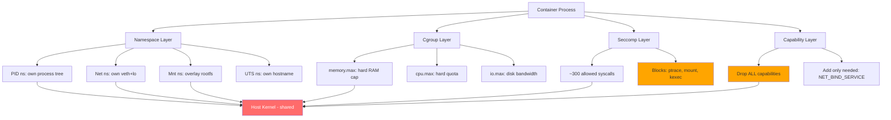

## Keywords in This File
{: .no_toc }

| # | Keyword | Weight |
|---|---|---|
| 22 | [Container Isolation: Namespaces and Cgroups](#container-isolation-namespaces-and-cgroups) | critical |

---

# Container Isolation: Namespaces and Cgroups

🎯 Interview Weight: Critical - This is the single most important OS internals question for backend engineers in the 2020s. Understanding how Docker containers work at the kernel level is required for senior roles, Kubernetes deployments, and any infrastructure or platform engineering position.

---

## 📋 Quick Reference

**One-line definition:** Linux containers are processes with restricted views of the system (namespaces) and bounded resource consumption (cgroups) - not lightweight virtual machines, but isolated processes sharing the host kernel.

**Difficulty:** ★★★ | **Asked at:** Senior-Staff | **Seniority:** Senior-Staff

---

### 🎯 Model Answer

**30 seconds:**
> A Docker container is a Linux process (or process group) running with two kernel features: namespaces, which restrict what the process can see (its own PID tree, network interfaces, filesystem mount points, hostname, users, IPC objects), and cgroups (control groups), which limit what the process can use (CPU cores, memory, disk IO, network bandwidth). There is no hypervisor, no separate kernel - the container shares the host kernel. Container "isolation" is the intersection of these two mechanisms plus an optional seccomp syscall filter.

**3 minutes (Senior):**
> Linux has 8 namespace types: mount (filesystem), PID (process IDs), network (interfaces, routing tables), IPC (semaphores, message queues), UTS (hostname, domain name), user (UID/GID mapping), cgroup (cgroup root), and time. When Docker starts a container, it calls `unshare()` or `clone()` with flags for each desired namespace. The container's PID 1 sees itself as PID 1 in its PID namespace; from the host, it has a normal PID (e.g., PID 4823). Network namespace isolation means the container has its own eth0 with its own IP, connected to the host via a veth pair - two virtual ethernet interfaces with a kernel bridge in between. Cgroups (v1 or v2) are hierarchical resource limits applied through a virtual filesystem at `/sys/fs/cgroup/`. Setting `memory.max=512m` on a cgroup limits the sum of all processes in that cgroup to 512MB of RAM; exceeding it triggers OOM-kill within the cgroup. The container escape attack surfaces: exploiting a vulnerability in the host kernel that a syscall in the container reaches (mitigated by seccomp), having privileged container capabilities (CAP_SYS_ADMIN enables namespace manipulation), or exploiting container runtime vulnerabilities (runc CVEs). Understanding this model is critical for security hardening, performance tuning (CPU throttling under cgroup CFS quota), and capacity planning (cgroup memory limits vs JVM heap settings).

**Framework:** NAMESPACE (visibility isolation) + CGROUP (resource isolation) + SECCOMP (syscall filter) = CONTAINER

*Adapting up:* Kubernetes pod vs container namespace sharing (containers in a pod share the network namespace by default), Windows containers (Hyper-V vs process isolation), gVisor (kernel-in-userspace for stronger isolation).

*Adapting down:* Namespaces are like blinders for a process - it can only see what you allow it to see. Cgroups are like a budget - the process can only spend as much CPU/memory as its budget allows.

**Blank Mind Recovery:**

**(1) Restate:** "Container isolation - how Linux prevents containers from seeing or using more than they should."

**(2) First principles:** "Two orthogonal problems: visibility (can this process see other processes, filesystems, network interfaces?) and resource consumption (how much CPU/RAM can it use?). Linux solves them with namespaces and cgroups respectively."

**(3) Bridge:** "This is why Docker is 'fast to start' compared to VMs - there is no kernel boot, no hypervisor overhead. You are just starting a process with some kernel restrictions applied. Those restrictions (especially cgroup setup) add 50-200ms, not minutes."

---

### 📘 Concept Explanation

**What it is:**
Linux container isolation uses two kernel primitives: namespaces restrict what system resources are visible to a process or process group, and cgroups limit how much of those resources the group may consume. Together they create the illusion of an isolated system without a separate kernel.

**The 8 Linux namespace types:**

```
LINUX NAMESPACE TYPES (as of kernel 5.x):
==========================================
Namespace  Flag            Isolates
---------  ----            --------
Mount      CLONE_NEWNS     Filesystem mount points;
                           each NS has its own mount tree
PID        CLONE_NEWPID    Process IDs; container sees
                           its own PID 1 (init)
Network    CLONE_NEWNET    Network interfaces, routes,
                           iptables, port numbers
IPC        CLONE_NEWIPC    SysV IPC, POSIX message queues
UTS        CLONE_NEWUTS    Hostname and NIS domain name
User       CLONE_NEWUSER   UID/GID - allows unprivileged
                           user to be UID 0 inside NS
Cgroup     CLONE_NEWCGROUP Cgroup root view
Time       CLONE_NEWTIME   System/boot clocks (kernel 5.6+)

Docker uses by default:
  mount, PID, network, IPC, UTS namespaces
  (user namespace optional due to complexity)
```

> **Diagram walkthrough:** The eight namespace types address different visibility dimensions orthogonally. The PID namespace is most surprising: a process that thinks it is PID 1 inside its namespace has a completely different PID (e.g., 4823) on the host. The user namespace is the most powerful and the most dangerous: it allows an unprivileged host user to appear as root (UID 0) inside the namespace, which combined with other capabilities could enable privilege escalation. Docker does not use user namespaces by default for this reason. The network namespace creates the container's private network stack - the container's eth0 is a virtual interface with no physical hardware behind it.

**Cgroup v1 vs v2 architecture:**

```
CGROUP HIERARCHY:
==========================================
Cgroup v1 (legacy - per-subsystem trees):
  /sys/fs/cgroup/memory/mycontainer/
    memory.limit_in_bytes = 536870912    (512MB)
    memory.usage_in_bytes = 209715200    (current)
    memory.failcnt = 0                   (OOM events)
  /sys/fs/cgroup/cpu/mycontainer/
    cpu.cfs_quota_us  = 100000           (1 CPU)
    cpu.cfs_period_us = 100000           (100ms period)

Cgroup v2 (unified hierarchy - kernel 4.5+, default 5.0+):
  /sys/fs/cgroup/mycontainer/
    memory.max = 536870912               (unified)
    cpu.max = "100000 100000"            (quota period)
    io.max = "8:0 rbps=10485760"         (disk IO limit)
  All subsystems in one hierarchy
  Better accounting (processes in only ONE cgroup)

KEY METRICS to monitor per container:
  memory.usage_in_bytes vs memory.limit_in_bytes
  (ratio > 0.85 = OOM kill risk)
  cpu.stat: usage_usec (actual), throttled_usec (throttled)
  throttled_usec > 10% of usage_usec = CPU throttling
```

> **Diagram walkthrough:** Cgroup v1 and v2 both limit resource consumption but with different hierarchy models. V1 has separate hierarchy trees per subsystem (memory, cpu, blkio, net_cls) which causes the "process in multiple cgroups" accounting problem. V2 unifies all subsystems under one tree, ensuring each process belongs to exactly one cgroup. The production concern is cpu.stat's `throttled_usec`: when a container's CPU quota is exhausted (100ms of CPU in every 100ms window), it is throttled for the rest of the period. Throttled time is invisible to the application but shows as p99 latency spikes - the application is ready to run but the kernel holds it back.

**The container networking model:**

```
HOST KERNEL NETWORK STACK:
================================
  [eth0: 10.0.0.1]              <- host physical NIC
       |
  [docker0 bridge: 172.17.0.1]  <- virtual bridge
       |         |
  [veth0]     [veth2]           <- veth pairs
       |           |
  [container1     [container2    <- container namespaces
   eth0:            eth0:
   172.17.0.2]      172.17.0.3]

Packets: container1 -> veth0 -> bridge -> veth2 -> container2
         container1 -> veth0 -> bridge -> NAT via iptables -> eth0 -> internet
```

> **Diagram walkthrough:** Each container gets a veth pair: one end in the container's network namespace (appears as `eth0` to the container), one end in the host's default namespace (appears as `vethXXXX`). The host's docker0 bridge connects all container veth ends. Outbound traffic from a container is NAT'd by iptables rules on the host. This model explains: why containers can communicate with each other by IP (same bridge), why `localhost` in a container does NOT reach the host (different network namespace), and why port binding (`-p 8080:80`) works (iptables DNAT rule forwards host:8080 to container:80).

**The key insight:**
Containers are not lightweight VMs - they are processes with restricted kernel visibility and bounded resource access. The isolation is real (a process cannot escape its namespace without a kernel vulnerability or misconfigured capability), but it shares the host kernel. A kernel vulnerability is exploitable from inside a container. This fundamental difference from VMs determines the security tradeoffs: containers have near-zero startup overhead and near-zero performance overhead, but a shared kernel attack surface.

**When to use namespace/cgroup knowledge:**
- Diagnosing CPU throttling in Kubernetes pods (cgroup cpu.max quota)
- Container breakout vulnerability assessment (which namespaces are shared?)
- JVM heap sizing in containers (JVM before Java 11 cannot read cgroup memory limits)
- Writing custom monitoring that reads from /sys/fs/cgroup directly

**When NOT to apply naively:**
- Container isolation is NOT equivalent to VM isolation for multi-tenant hosting of untrusted code - use gVisor, Kata Containers, or hardware VMs
- The container "being root inside" is dangerous even with namespace isolation if the user namespace is not configured

**Alternatives:**
- gVisor: Go-implemented kernel that intercepts syscalls, running in user space
- Kata Containers: lightweight VMs that look like containers
- Firecracker: microVM for serverless (AWS Lambda)
- Unikernels: single-application kernels

---

### 💻 Code Example

**BAD: JVM not respecting container memory limits (pre-Java-11)**

```bash
# BAD: Default JVM heap sizing reads host memory, not cgroup limit
# On a host with 32GB RAM, in a container limited to 1GB:

docker run --memory=1g openjdk:8 java -XshowSettings:all 2>&1 \
  | grep "Max. Heap Size"
# Output: Max. Heap Size: 7.97G  <- reads host RAM, not cgroup!
# JVM allocates ~25% of HOST RAM as max heap
# Container is killed by OOM immediately when heap reaches 1GB
# Error: java.lang.OutOfMemoryError (container OOM kill, not JVM GC)
```

> **Code walkthrough:** Pre-Java-8u191 JVM (and Java 9, early Java 10) reads `/proc/meminfo` to determine available memory for default heap sizing. `/proc/meminfo` reflects the HOST's total memory, not the container's cgroup memory limit. A container with 1GB cgroup limit on a 32GB host causes the JVM to set MaxHeapSize to ~8GB. The JVM then allocates heap exceeding the cgroup limit, and the container OOM killer fires, abruptly terminating the JVM. No GC, no OutOfMemoryError - just sudden process death. This was a production surprise for every team that containerized Java services in 2015-2018.

**GOOD: Container-aware JVM configuration**

```bash
# GOOD: Java 11+ automatically reads cgroup limits
# UseContainerSupport is enabled by default since Java 11

docker run --memory=1g openjdk:11 java \
  -XX:+PrintFlagsFinal -version 2>&1 | grep MaxHeapSize
# Output: MaxHeapSize = 268435456  <- 256MB (25% of 1GB cgroup limit)

# For Java 8u191+ (backport):
docker run --memory=1g openjdk:8u191 java \
  -XX:+UseContainerSupport \
  -XX:MaxRAMPercentage=75.0 \
  -jar app.jar
# MaxRAMPercentage=75 -> heap = 768MB (75% of 1GB)
# Leaves 256MB for OS, off-heap buffers, JVM overhead

# Best practice JVM flags for containerized services:
# -XX:+UseContainerSupport          (default Java 11+)
# -XX:MaxRAMPercentage=75.0         (75% of cgroup memory.max)
# -XX:InitialRAMPercentage=50.0     (start with 50%)
# -XX:+ExitOnOutOfMemoryError       (crash instead of limp)
# -XX:+HeapDumpOnOutOfMemoryError   (capture heap state)
# -XX:HeapDumpPath=/dumps/heap.hprof
```

> **Code walkthrough:** `UseContainerSupport` (default since Java 11) makes the JVM read cgroup memory limits from `/sys/fs/cgroup/memory/memory.limit_in_bytes` (cgroup v1) or `/sys/fs/cgroup/memory.max` (cgroup v2) instead of `/proc/meminfo`. Combined with `MaxRAMPercentage=75.0`, the JVM sizes the heap to 75% of the container's memory limit, leaving 25% for OS overhead, non-heap JVM memory (Metaspace, direct buffers, stack frames), and native libraries. `ExitOnOutOfMemoryError` is critical for containers: instead of running in a degraded GC-overloaded state, the container exits and Kubernetes restarts it with a fresh JVM.

**GOOD: Reading container resource limits for monitoring**

```bash
#!/bin/bash
# Read container cgroup limits and current usage
# Works inside a container (cgroup v2 assumed)

CGROUP_PATH="/sys/fs/cgroup"

echo "=== Memory ==="
LIMIT=$(cat $CGROUP_PATH/memory.max 2>/dev/null)
USAGE=$(cat $CGROUP_PATH/memory.current 2>/dev/null)
if [ "$LIMIT" != "max" ] && [ -n "$LIMIT" ]; then
    PCT=$((USAGE * 100 / LIMIT))
    echo "Usage: $((USAGE/1048576))MB / $((LIMIT/1048576))MB ($PCT%)"
    [ "$PCT" -gt 85 ] && echo "WARN: >85% memory - OOM kill risk"
fi

echo "=== CPU ==="
CPU_MAX=$(cat $CGROUP_PATH/cpu.max 2>/dev/null)
# Format: "quota_us period_us" or "max period_us"
echo "CPU quota: $CPU_MAX"

echo "=== CPU Throttling ==="
grep -E "throttled_usec|usage_usec" $CGROUP_PATH/cpu.stat
# throttled_usec/usage_usec > 10% = performance impact
```

> **Code walkthrough:** From inside a container, `/sys/fs/cgroup/` is the container's cgroup view (thanks to the cgroup namespace). Reading `memory.max` and `memory.current` gives exact limit and usage without external tooling. The 85% memory threshold is the operational warning level: above 85% of the cgroup memory limit, the OOM killer can fire with little warning for transient spikes. The CPU throttling diagnostic reads `cpu.stat`: if `throttled_usec` is more than 10% of `usage_usec`, the container is CPU-throttled for more than 10% of its compute time - enough to cause p99 latency spikes. This script is useful as a startup health check in Kubernetes init containers.

**GOOD: Creating a namespace manually (educational)**

```bash
# Educational: manual container creation without Docker
# Demonstrates the actual kernel calls Docker wraps

# 1. Create a new PID, UTS, mount, and network namespace
sudo unshare --pid --uts --mount --net --fork \
  /bin/bash

# Inside the new namespaces:
hostname container-demo       # set hostname in UTS namespace
mount -t proc proc /proc      # mount procfs in mount namespace
ps aux                        # only sees processes in PID namespace
ip link                       # sees only loopback (network namespace)

# This is essentially what Docker does,
# plus: overlay filesystem for the container rootfs,
#       veth pair for network,
#       cgroup hierarchy for resource limits
```

> **Code walkthrough:** The `unshare` command calls the `unshare(2)` syscall, which creates new namespaces for the calling process and detaches it from the specified parent namespaces. After `unshare --pid --fork`, the shell's children run in a new PID namespace where the first child is PID 1. Docker wraps these syscalls (plus OverlayFS mount, veth pair creation, cgroup configuration, and seccomp filter setup) into the `docker run` workflow. Understanding this command-line equivalent of Docker's `CreateContainer` operation clarifies what container isolation actually means at the kernel level.

---

### 🎓 Answers by Seniority

**Junior / Mid (0-5 years):**
> Docker containers use Linux namespaces to limit what a process can see (other processes, the network, the filesystem) and cgroups to limit how much CPU and memory it can use. Unlike virtual machines, containers share the host's Linux kernel - there's no separate OS. This is why containers start fast and have little overhead. The trade-off is that all containers on a host share the same kernel, so a kernel vulnerability can be exploited from inside a container.

*Push deeper:* The specific namespace types and what each isolates, cgroup v2 cpu throttling and its impact on latency, the JVM heap sizing problem in containers, and container escape via CAP_SYS_ADMIN.

---

**Senior / Staff (5+ years):**
> Containers are processes wrapped in Linux namespaces (PID, network, mount, IPC, UTS) with cgroup resource constraints and an optional seccomp syscall filter. I know the kernel boundary: container isolation is namespace-deep, not kernel-deep - a container runs the same kernel code that the host runs. This matters for security (kernel CVEs affect all containers) and performance (cgroup CPU quota throttling causes latency spikes that are invisible in application metrics). I diagnose throttling with `cpu.stat`'s `throttled_usec` metric, which Kubernetes exposes as `container_cpu_cfs_throttled_seconds_total`. For JVM containers: always set `MaxRAMPercentage=75.0` and `UseContainerSupport` (default Java 11+) to prevent OOM kills from mis-sized heaps. For container security: non-root user, `CAP_DROP=ALL`, no-new-privileges, custom seccomp profile, read-only rootfs. The threat model for containers vs VMs: containers have a shared kernel attack surface; VMs have hardware-virtualized isolation; Kata Containers and Firecracker are the middle ground (lightweight VMs that behave like containers).

*Push deeper:* eBPF-based container observability (Cilium, Pixie), the Linux kernel's CLONE_NEWUSER flag and rootless containers (Podman), and Kubernetes pod security contexts mapping to specific namespace/capability configurations.

---

### ⚠️ Common Misconceptions

**Misconception 1: "Containers are lightweight virtual machines"**
Containers share the host kernel. There is no hypervisor, no separate kernel, no hardware virtualization. A VM has its own kernel, a hardware-virtualized CPU, and its own memory management completely separate from the host. Container isolation is provided by kernel primitives (namespaces, cgroups) that can be bypassed by kernel vulnerabilities. VM isolation requires compromising the hypervisor AND the host kernel.

**Misconception 2: "A container running as non-root is secure"**
Non-root UID in the container does not prevent container escape if the container has `CAP_SYS_ADMIN`, runs with `--privileged`, shares the host PID or network namespace, or can mount the host filesystem. Container security requires: non-root UID + dropped capabilities + seccomp profile + read-only rootfs + no-new-privileges.

**Misconception 3: "CPU cgroup limits control scheduling fairly"**
Cgroup CFS (Completely Fair Scheduler) quota creates hard limits: if a container uses its quota of CPU time in the first 20ms of a 100ms period, it is throttled for the remaining 80ms. This can cause severe p99 latency spikes even when the system has idle CPU. A container with a 1-CPU quota on a host with 16 idle CPUs can still be throttled if its burst usage exceeds the quota in the current period.

**Misconception 4: "Docker -m sets the total container memory"**
`docker run -m 512m` sets the memory cgroup limit. By default, Docker also sets a swap limit equal to twice the memory limit (1GB swap in this case). Total memory available is 512MB RAM + 512MB swap = 1GB. To disable swap for the container, use `--memory-swap=512m` (same as -m, disabling swap) or `--memory-swappiness=0`.

---

### 🚨 Failure Modes and Diagnosis

**Failure Mode 1: JVM Container OOM Kill with No Java Exception**

Symptom: Java container dies suddenly with exit code 137 (SIGKILL from OOM); no OutOfMemoryError in logs; GC logs show no unusual activity.

```bash
# Exit code 137 = killed by signal 9 (SIGKILL)
# In Kubernetes: OOMKilled reason in pod status
kubectl describe pod <pod> | grep -A5 "State:"
# State: Terminated
# Reason: OOMKilled
# Exit Code: 137

# Check current heap size vs memory limit
kubectl exec <pod> -- \
  java -XX:+PrintFlagsFinal -version 2>&1 | grep MaxHeapSize

# Check cgroup memory limit vs JVM configured heap
kubectl exec <pod> -- \
  cat /sys/fs/cgroup/memory.max

# Fix: set MaxRAMPercentage to leave headroom
# ENV JAVA_OPTS="-XX:MaxRAMPercentage=75.0 \
#                -XX:+UseContainerSupport"
# The 25% headroom covers: Metaspace (~200MB),
# Direct ByteBuffers, thread stacks, native libs
```

> **Code walkthrough:** Exit code 137 is the definitive indicator of OOM kill by the Linux OOM killer (not a Java OOM). The OOM killer sends SIGKILL which cannot be caught - hence no Java exception or graceful shutdown. The immediate diagnostic: compare `MaxHeapSize` (from JVM flags) to `memory.max` (cgroup limit). If MaxHeapSize + JVM overhead > memory.max, OOM kill is expected under full load. The 75% rule leaves 25% for non-heap JVM memory. Always add OOMKilled to your Kubernetes alerting.

**Failure Mode 2: CPU Throttling Causing Latency Spikes**

Symptom: Service p99 latency is 5-10x p50; CPU utilization looks low (40-60%); throttling is the actual cause.

```bash
# Check CPU throttling stats inside container
cat /sys/fs/cgroup/cpu.stat
# nr_throttled: number of throttle events
# throttled_usec: total time throttled
# usage_usec: total CPU time used
# throttled_usec/usage_usec ratio > 10% = significant

# In Kubernetes via metrics
kubectl top pods  # shows CPU usage but NOT throttling
# Use Prometheus:
# container_cpu_cfs_throttled_seconds_total
# container_cpu_cfs_periods_total

# Fix option 1: increase CPU limit
# resources:
#   limits:
#     cpu: "2"    # was "1"

# Fix option 2: remove CPU limit (controversial)
# Only safe if other pods have their own limits
# Best practice in Kubernetes: set requests, be careful with limits

# Fix option 3: use cpu.weight (cgroup v2 relative shares)
# instead of cpu.max (hard quota) - allows bursting
```

> **Code walkthrough:** CPU throttling is invisible to CPU utilization metrics - a throttled container shows 50% CPU utilization because it is idle for the throttled periods. The only way to see it is via `cpu.stat`'s `throttled_usec`. In Kubernetes, the Prometheus metric `container_cpu_cfs_throttled_seconds_total` tracks this. The production debate: CPU limits in Kubernetes cause throttling even when the node has spare capacity. Many production operators run without CPU limits (only requests) to allow burst, relying on requests for scheduling guarantees. This is a valid trade-off for latency-sensitive services.

**Failure Mode 3: Container Escape via CAP_SYS_ADMIN**

Symptom: Container process accesses host filesystem; security audit finds privileged capability enabled.

```bash
# Check if a running container has dangerous capabilities
docker inspect <container> | \
  python3 -c "
import json, sys
c = json.load(sys.stdin)[0]
caps = c['HostConfig'].get('CapAdd', [])
priv = c['HostConfig'].get('Privileged', False)
print('Privileged:', priv)
print('Added caps:', caps)
"

# If CAP_SYS_ADMIN or Privileged=true:
# Container can mount host cgroupfs and execute code:
# mkdir /tmp/cgrp; mount -t cgroup -o rdma \
#   cgroup /tmp/cgrp
# This is a known container escape technique

# Fix: remove CAP_SYS_ADMIN and run non-privileged
# docker run --cap-drop ALL --cap-add NET_BIND_SERVICE ...

# Kubernetes equivalent in pod spec:
# securityContext:
#   capabilities:
#     drop: ["ALL"]
#     add: ["NET_BIND_SERVICE"]
#   allowPrivilegeEscalation: false
```

> **Code walkthrough:** `CAP_SYS_ADMIN` is the "god capability" - it enables mount(2), unshare(2), and dozens of other privileged operations that enable well-documented container escape techniques. The most common: mounting the host's cgroupfs, then using cgroup notify_on_release or cgroup v1 release_agent to execute arbitrary commands on the host. The Kubernetes fix is `securityContext.capabilities.drop=["ALL"]` combined with `allowPrivilegeEscalation: false` (maps to `NoNewPrivileges`). These should be enforced by Kubernetes PodSecurity admission controller at the namespace level to prevent misconfiguration.

---

### 🎯 Interview Deep-Dive

| Category | Count | Coverage |
|---|---|---|
| Conceptual | 4 | namespace types, cgroup v1/v2, network model, kernel sharing |
| Debugging | 4 | OOM kills, CPU throttling, container escape, JVM sizing |
| Trade-off | 3 | containers vs VMs, CPU quota vs shares, user namespace tradeoffs |
| Behavioral | 1 | container production incident |

---

**[JUNIOR] Q1 - [TRADE-OFF] Explain how PID namespaces work and what happens when the container's PID 1 dies.**

A PID namespace creates an isolated view of the process tree. Processes inside the namespace see only the processes within that namespace, with their own PID numbering starting from 1. The first process in the namespace is PID 1 (the "init" process for that namespace). From the host's perspective, this same process has a regular host PID (e.g., PID 4823). When a process in the namespace calls `fork()`, the child gets the next available PID in the namespace (e.g., PID 2) but also has a distinct host PID (e.g., PID 4824). If PID 1 within the namespace dies, all other processes in that namespace receive SIGKILL and die immediately - there is no reparenting to another process within the namespace (unlike the host where orphans are adopted by init/systemd). This is why in a Docker container: if your entrypoint process (PID 1) crashes, all other processes in the container die. This is also why Docker recommends using a proper init process (tini, dumb-init) as PID 1 in containers that spawn child processes - a bare application as PID 1 does not handle SIGTERM correctly, does not reap zombie children, and does not properly forward signals to child processes.

*What separates good from great:* Knowing that PID 1 death kills all other processes in the namespace (not just orphans), and the tini/dumb-init recommendation with the specific reason (proper signal forwarding and zombie reaping) - this is a real production pain point that interviewers expect seniors to know.

---

**[JUNIOR] Q2 - [MECHANISM] How does container networking work at the kernel level? What is a veth pair?**

Container networking uses three kernel primitives: network namespaces, virtual ethernet pairs (veth), and a Linux bridge. Each container gets its own network namespace containing a loopback interface and one end of a veth pair, appearing as `eth0`. The other end of the veth pair sits in the host's default network namespace, attached to a virtual bridge (docker0). A veth pair is a pair of virtual Ethernet interfaces connected by a kernel data path: anything written to one end appears on the other end immediately, within the same kernel context. The bridge (docker0) acts as a virtual L2 switch: it learns MAC addresses and forwards frames between attached veth ends, allowing containers to communicate with each other at L2. For outbound traffic, iptables MASQUERADE rules NAT the container's IP address to the host's IP before forwarding to the physical NIC. For port binding (`-p 8080:80`), iptables DNAT rules redirect packets arriving at host:8080 to container_ip:80. The practical implications: `localhost` inside a container reaches the container's own loopback, NOT the host (different network namespace). To reach the host, use the docker0 bridge IP (172.17.0.1 typically) or the `host.docker.internal` DNS name (added by Docker Desktop). Container-to-container communication uses the bridge IP (172.17.0.2 to 172.17.0.3) without going through the physical NIC.

*What separates good from great:* Explaining veth as a kernel-internal virtual cable (same kernel, zero-copy packet forwarding), the iptables NAT mechanism for external access, and the `localhost` gotcha that causes production debugging confusion.

---

**[MID] Q3 - [TRADE-OFF] What is the difference between cgroup v1 and v2, and which should you use?**

Cgroup v1 (2007, kernel 2.6.24) organizes resources in separate hierarchy trees per subsystem: one tree under `/sys/fs/cgroup/memory/`, another under `/sys/fs/cgroup/cpu/`, etc. A process can be in different groups in different subsystems, which causes inconsistent accounting - the CPU quota might be on a different group than the memory limit for the same process. V1 has known bugs in memory accounting when using both memory and memory-swap controllers. Cgroup v2 (kernel 4.5, widely available in kernel 5.0, default in modern distros) uses a single unified hierarchy: all resource controllers for a process live under the same cgroup directory. A process belongs to exactly one cgroup. V2 adds better IO accounting (`io.max` with per-device limits), improved memory event notifications, and the cpu.weight (relative shares) controller which allows bursting above a share when the system has spare capacity. Docker supports cgroup v2 natively since Docker 20.10. Kubernetes supports cgroup v2 since v1.19 (stable in 1.25). For new deployments: use cgroup v2. The migration concern: Java applications using `-XX:+UseContainerSupport` automatically read from the correct v1 or v2 path based on what is mounted. The production diagnostic difference: v2 has better per-container OOM event reporting with `memory.events` showing `oom` and `oom_kill` counters per cgroup.

*What separates good from great:* The v1 multi-hierarchy inconsistency problem, v2's unified hierarchy and cpu.weight for burst behavior, and the Kubernetes version milestones for v2 support.

---

**[MID] Q4 - [TRADE-OFF] How does CPU throttling work in containers and why does it cause latency spikes even when CPU is underutilized?**

Linux cgroup CPU quota uses the Completely Fair Scheduler (CFS) quota mechanism. A container's CPU limit is expressed as a quota/period pair: `cpu.max = "100000 100000"` means 100ms CPU time allowed per 100ms wall-clock period (effectively 1 CPU). The CFS scheduler tracks how much CPU time each cgroup has consumed in the current period. When a cgroup exhausts its quota, all its processes are throttled (preempted and not rescheduled) for the remainder of the period. This is a hard ceiling, not a weighted share. The latency spike mechanism: a request handler starts at t=0ms in a 100ms period, the container has used 80ms of its 100ms quota already from concurrent requests. At t=0ms, the handler gets 20ms of CPU, then is throttled for 80ms waiting for the next period. The response time is 100ms instead of 20ms - despite the host having 15 idle CPU cores. The utilization metric shows the container at 80% CPU (80ms used / 100ms period) which looks healthy; the throttling is invisible in standard CPU metrics. The diagnostic: `cat /sys/fs/cgroup/cpu.stat` inside the container, checking `throttled_usec`. In Kubernetes, `container_cpu_cfs_throttled_seconds_total` exposes this. The fix for latency-sensitive services: either increase the CPU limit to provide headroom, or use cpu.weight (cgroup v2 relative shares) instead of a hard quota - shares allow bursting when spare capacity exists.

*What separates good from great:* The precise mechanism (quota exhausted in period -> throttle for remainder, regardless of host idle CPUs), the utilization-looks-fine-but-throttled observation, and the cpu.weight alternative for burst-tolerant scheduling.

---

**[SENIOR] Q5 - [MECHANISM] What is a user namespace and why does Docker not use it by default?**

A user namespace creates an isolated view of UID and GID mappings. Inside the user namespace, a process can have UID 0 (root) while outside it maps to an unprivileged UID (e.g., UID 65534 on the host). This enables "rootless" containers: an unprivileged user on the host can run a container where the container process appears as root to itself but has no special host privileges. User namespaces also allow other namespace types to be created without requiring host root - creating PID, network, or mount namespaces normally requires `CAP_SYS_ADMIN`. Docker does not use user namespaces by default for several reasons: complexity of UID mapping configuration, incompatibility with shared volume ownership (host files owned by UID 1000 appear as root inside the container without user namespace mapping), performance overhead from UID mapping in syscall paths, and historical kernel vulnerabilities specific to user namespaces (multiple CVEs where user namespace creation enabled privilege escalation). Docker supports user namespaces via `userns-remap` in daemon.json, which maps all container root UIDs to a high UID range on the host. Podman uses rootless user namespaces by default, making it more secure out of the box at the cost of some feature compatibility.

*What separates good from great:* The specific Docker limitation (volume UID mismatch), the kernel CVE risk with user namespaces (historically a significant attack surface), and knowing Podman as the rootless alternative.

---

**[SENIOR] Q6 - [DEBUGGING] How would you debug a Java service that keeps getting OOM-killed in a Kubernetes pod?**

My debugging sequence: First, confirm it is OOM kill and not a different crash: `kubectl describe pod <pod>` shows "OOMKilled" in the State section, and `kubectl get events` shows container OOM events. Exit code 137 confirms SIGKILL from OOM. Second, identify whether it is the cgroup OOM killer (Kubernetes) or the JVM OOM (Java heap): if there are `java.lang.OutOfMemoryError` entries in logs, it is a JVM heap OOM; if the pod simply disappears with exit 137 and no Java OOM in logs, it is the cgroup OOM killer. Third, for cgroup OOM: check heap configuration with `kubectl exec <pod> -- java -XX:+PrintFlagsFinal -version 2>&1 | grep -E "MaxHeapSize|MaxRAM"`. Check cgroup limit with `kubectl exec <pod> -- cat /sys/fs/cgroup/memory.max`. If MaxHeapSize + JVM overhead > memory.max, resize the heap to 75% of the cgroup limit using `MaxRAMPercentage=75.0`. Fourth, for JVM OOM: take a heap dump `kubectl exec <pod> -- jmap -dump:format=b,file=/tmp/heap.hprof <pid>` and analyze with Eclipse MAT to find the dominant retained object tree. Fifth, check for off-heap memory leaks: direct ByteBuffers, `sun.misc.Unsafe.allocateMemory`, JNI native allocations - these do not appear in heap dumps. Monitor with `jcmd <pid> VM.native_memory summary`.

*What separates good from great:* Distinguishing cgroup OOM kill from JVM OOM (different causes, different fixes), the 75% MaxRAMPercentage sizing rule with the remaining 25% accounting, and knowing off-heap leaks are invisible to heap dump analysis.

---

**[SENIOR] Q7 - [TRADE-OFF] What are the security boundaries of container isolation and when is VM isolation required?**

Container isolation has three enforcement layers: namespaces (visibility), cgroups (resource limits), and seccomp+capabilities (syscall filter). A container cannot escape these boundaries through normal operations. However, the boundaries have a fundamental weakness: all containers on a host share the same kernel. A vulnerability in the kernel's syscall handling code (e.g., a buffer overflow in the `ptrace` subsystem, or a TOCTOU in `openat`) is reachable from inside a container via the allowed syscalls. Container escape CVEs (like runc CVE-2019-5736 and Docker CVE-2020-15257) exploit exactly this: the container runtime or kernel processes a request from the container that, due to a bug, allows writing to the host's filesystem or executing code in the host's context. VM isolation provides a stronger boundary: the hypervisor (or hardware virtualization support) enforces the boundary using CPU hardware features (EPT/NPT for memory, IOMMU for DMA). Exploiting VM isolation requires either a hypervisor vulnerability (rarer, since hypervisor code is simpler) or a hardware vulnerability (even rarer). VM isolation is required when: hosting untrusted third-party code (multi-tenant SaaS), compliance requirements mandate strict isolation (PCI-DSS, certain government standards), the workload has a known high-risk attack surface (sandboxing untrusted JavaScript or user-submitted code). The middle ground: gVisor intercepts all syscalls in user space (preventing direct kernel access), and Kata Containers runs containers inside lightweight VMs (hardware-isolated but container-lifecycle compatible).

*What separates good from great:* The specific mechanism of container escape (shared kernel syscall surface), naming specific CVEs (runc, Docker), the VM isolation strength explanation (hypervisor + hardware virtualization), and gVisor/Kata as the middle-ground solutions.

---

**[SENIOR] Q8 - [TRADE-OFF] How do Kubernetes resource requests and limits differ from Docker's -m and --cpus flags?**

Docker's `-m 512m` and `--cpus 1` set hard cgroup limits: the process can never use more than 512MB memory or 1 CPU. Kubernetes separates requests from limits: `resources.requests` expresses what the scheduler should reserve for this pod when placing it on a node; `resources.limits` expresses the cgroup hard cap. Requests are used for scheduling decisions only - they do not limit actual runtime usage until limits are set. A pod with `cpu: requests=0.5, limits=1.0` is scheduled onto a node where 0.5 CPUs are available, but at runtime may burst to 1.0 CPU (limited by the cgroup quota). A pod with only `cpu: requests=0.5` (no limits) can burst to use all available host CPUs if the node has spare capacity. The memory semantics are different: memory requests affect scheduling but the actual cgroup limit is set to `memory.limits` (if specified) or unlimited (if only requests). A pod with only `memory: requests=512m` (no limits) can grow unboundedly and trigger the node's system OOM killer. Production recommendations: always set memory limits to prevent runaway consumers from affecting other pods; be careful with CPU limits on latency-sensitive services (throttling causes latency spikes); set requests accurately to enable proper scheduling (under-requesting CPU causes over-subscription and throttling).

*What separates good from great:* The requests-for-scheduling vs limits-for-cgroup distinction, knowing that memory without limits can trigger node-level OOM (affecting other pods), and the specific latency recommendation for CPU limits.

---

**[SENIOR] Q9 - [BEHAVIORAL] (Behavioral) Describe a container isolation or resource management incident you encountered.**

At a company running microservices on Kubernetes, a single pod began consuming all CPU on its node, causing all other pods on that node to become unresponsive. Investigation showed the pod had no CPU limit set (only a request) - an oversight in the Kubernetes deployment manifest. A bug introduced in that day's release caused an infinite loop in error handling under specific database timeout conditions. Without a CPU limit, the pod's cgroup was unrestricted and consumed all 16 CPUs on the node. The Kubernetes scheduler was still routing new requests to the node (the node was "healthy" from the scheduler's perspective - memory was fine, node was up) while those requests were starved of CPU. We identified the issue by running `kubectl top pods -n production --sort-by=cpu` which immediately showed one pod consuming 1600% CPU (16 cores). Fix: `kubectl rollout undo deployment/myservice` stopped the incident in 90 seconds. Remediation: added CPU limits to all deployment manifests, and added a linting rule to our CI pipeline (conftest + OPA Gatekeeper) that rejects Kubernetes manifests without both CPU and memory limits. Lesson: resource limits in Kubernetes are not optional safety measures; they are the isolation guarantee that prevents one misbehaving service from affecting its neighbors.

*What separates good from great:* The root cause (missing CPU limit, not a code bug), the observability tool used (`kubectl top --sort-by=cpu` - this is the exact diagnostic), the fast remediation (rollout undo, not manual cgroup manipulation), and the systematic prevention (CI linting with conftest/OPA).

---

**[STAFF] Q10 - [MECHANISM] What is overlay filesystem and how does Docker use it for container layers?**

OverlayFS (overlay2 in Docker) is a union filesystem that merges multiple directory layers into a single view. Docker uses it to implement container layers: the Docker image is stored as a set of read-only layers (each corresponding to a Dockerfile instruction), and the running container adds one writable layer (the container layer) on top. OverlayFS merges these layers so the container sees a single unified filesystem. The mechanism: OverlayFS maintains three directories per container: lower (the image layers, read-only), upper (the writable container layer), and merged (the union view the container sees). When a container reads a file: OverlayFS looks in upper first, then lower layers in order; returns the first match. When a container writes a file that exists in a lower layer: copy-on-write - the file is copied from the lower layer to upper, then modified in upper; the lower layer is unchanged. When a container deletes a file from a lower layer: a "whiteout" file is created in upper marking the deletion; the lower file is not modified. The practical implications: containers that write heavily to their filesystem (logs to stdout, temp files) accumulate data in the upper writable layer which consumes disk on the host. Docker inspect shows the container's layer path. Large container images with many layers increase overlay2 lookup times (each file access must search from upper down through all lower layers). Image optimization: fewer layers (multi-stage builds, squashing) improves layer lookup performance.

*What separates good from great:* The whiteout mechanism for deletions (most engineers don't know how deletes work in overlay), the copy-on-write on first write (explaining why initial writes to large files are slower), and the layer count performance implication for image optimization.

---

**[STAFF] Q11 - [TRADE-OFF] How do CPU shares (cpu.weight in cgroup v2) differ from CPU quota (cpu.max)?**

CPU shares (cpu.weight in v2, cpu.shares in v1) define RELATIVE priority: a container with weight=200 gets twice the CPU time of one with weight=100, but only when the CPU is contended. When CPUs are idle, all processes run without restriction regardless of weights. CPU quota (cpu.max) defines an ABSOLUTE cap: a container set to quota=100ms per 100ms period gets exactly 1 CPU maximum, even if 15 CPUs are idle. The practical difference: CPU quota prevents a container from ever using more than its limit, regardless of system load. CPU shares allow bursting to use available capacity during idle periods but throttle back to share-proportional allocation under contention. For latency-sensitive applications (API services, real-time processing): CPU quota causes throttling latency spikes even under low total system load (if the container's own quota is exhausted). CPU shares allow the service to burst to meet spikes without being throttled. For batch or background jobs: CPU quota is appropriate - it prevents the job from monopolizing CPUs and affecting foreground services. The Kubernetes default uses CPU quota (limits: cpu specifies quota). Many production operators of latency-sensitive services configure CPU requests but no CPU limits, relying on shares (Kubernetes uses requests to set relative weights when no limit is specified) to prevent scheduling imbalance while allowing burst.

*What separates good from great:* The "only matters under contention" characteristic of shares (vs quota's absolute hard cap regardless of load), the specific production recommendation for latency vs batch, and the Kubernetes requests-without-limits pattern for burst-tolerant services.

---

**[STAFF] Q12 - [BEHAVIORAL] What is a container escape and describe a known technique?**

A container escape is when a process inside a container gains access to resources outside its namespace or cgroup boundaries - typically gaining access to the host filesystem, other container namespaces, or the host network. A well-known technique exploiting cgroup v1's `release_agent` mechanism: the container process requires `CAP_SYS_ADMIN` and the host's cgroup filesystem to be accessible from inside the container. Steps: (1) Mount the cgroup filesystem inside the container: `mkdir /tmp/cgrp && mount -t cgroup -o rdma cgroup /tmp/cgrp`. (2) Create a new cgroup child: `mkdir /tmp/cgrp/child`. (3) Enable release_agent notification: `echo 1 > /tmp/cgrp/child/notify_on_release`. (4) Write a reverse-shell script to the host filesystem using the cgroup filesystem path, and set it as the release_agent: `host_path=$(sed -n 's/.*\perdir=\([^,]*\).*/\1/p' /etc/mtab); echo "$host_path/cmd" > /tmp/cgrp/release_agent`. (5) Write the reverse shell into `/cmd` via the overlay path. (6) Trigger agent execution by killing all processes in the child cgroup. The release_agent script executes on the host as root. The defense: `--cap-drop ALL` removes CAP_SYS_ADMIN, preventing the mount call. Kubernetes PodSecurity `restricted` profile enforces this. This exact technique was used in real red-team exercises against misconfigured Kubernetes clusters.

*What separates good from great:* Knowing the specific cgroup release_agent mechanism (not just saying "there are container escapes"), the step-by-step exploit flow (shows real kernel knowledge), and the prevention (cap drop) being the blocking mechanism at step 1.

---

### ⚖️ Comparison Table

| Isolation | Kernel Shared | Startup | Memory Overhead | Escape Surface |
|---|---|---|---|---|
| Process (no isolation) | Yes | <1ms | None | All syscalls |
| Container (namespaces+cgroups) | Yes | 50-500ms | <50MB | Kernel CVEs, CAP_SYS_ADMIN |
| gVisor | Intercepted | 200ms-2s | ~50MB extra | gVisor kernel bugs |
| Kata Containers | No (guest kernel) | 500ms-2s | ~128MB | Hypervisor CVEs |
| VM (KVM/Hyper-V) | No | 10-60s | >512MB | Hypervisor + hardware CVEs |
| Firecracker microVM | No (guest kernel) | 125ms | ~5MB | Hypervisor (small) |

**The deciding factor:** For trusted workloads (your own code), containers + hardened seccomp/capabilities = sufficient. For untrusted code (multi-tenant) or compliance requirements = Kata/Firecracker/VM.

---

### 🏛️ System Design

**System Design: Multi-Tenant Container Platform Security Architecture**

Design a Kubernetes cluster that can safely run containers from multiple untrusted tenants.

```
MULTI-TENANT CONTAINER PLATFORM:
===================================
                [Admission Controller]
                        |
         +--------------+-------------+
         |              |             |
   Tenant A NS    Tenant B NS   Tenant C NS
         |              |             |
   [Pod SecContext]  [Pod SecContext]  ...
   - runAsNonRoot: true
   - CAP_DROP: ALL
   - ReadOnlyRootFS: true
   - seccompProfile: RuntimeDefault

         [Node A]        [Node B]
         Tenant A only   Tenant B only
         (node taint+toleration)

   [Kata Containers Runtime]  <- for highest isolation
   Container -> Lightweight VM -> Host Kernel
```

> **Diagram walkthrough:** This shows a multi-tenant Kubernetes security architecture. Namespace-per-tenant (top row) enforces network isolation via Kubernetes NetworkPolicy. Node-per-tenant (middle) provides kernel-level isolation at the cost of resource efficiency. The Kata Containers runtime (bottom) provides VM-level isolation for the strongest security-at-density combination. Each tenant gets a dedicated node taint+toleration to prevent cross-tenant pod scheduling. The key relationship: isolation granularity scales from namespace (cheapest) to node (most expensive) to Kata VM (best security/density tradeoff). The senior insight: most enterprise deployments use namespace isolation + PodSecurity restricted profile, which is sufficient for trusted tenants with strict egress controls.

**Key design decisions:**

1. Namespace-per-tenant - prevents pod-to-pod communication across tenants via network policies
2. Node-per-tenant (optional) - prevents shared kernel attack surface (highest security, most expensive)
3. Kata Containers runtime - provides VM-level isolation while maintaining container UX
4. PodSecurity restricted profile enforced by admission controller - no root, no caps, seccomp
5. NetworkPolicy default-deny - tenant pods cannot reach other tenants' pods by default
6. ResourceQuota per namespace - prevents one tenant exhausting cluster resources

**Trade-off:** Full node-per-tenant at 1:1 provides the strongest isolation but is expensive; shared nodes with Kata provides strong isolation at better density; shared nodes with standard containers is lowest cost but highest blast radius for kernel CVEs.

---

### 📊 Diagram

The following diagram shows the full namespace + cgroup + seccomp container isolation stack:

```
CONTAINER ISOLATION ARCHITECTURE:
===========================================
Container Process (PID 1 in PID ns)
    |
    | mounts [OverlayFS: image layers + writable]
    | network [veth in network ns -> docker0 bridge]
    | hostname [UTS namespace: container-specific]
    | IPC [isolated SysV/POSIX IPC objects]
    |
    +----> NAMESPACE LAYER (visibility isolation)
    |        PID ns: sees only own process tree
    |        Net ns: sees only own veth + lo
    |        Mnt ns: sees only overlay rootfs
    |        UTS ns: sees only own hostname
    |
    +----> CGROUP LAYER (resource limits)
    |        memory.max: hard RAM cap -> OOM if exceeded
    |        cpu.max: hard CPU quota -> throttle if exceeded
    |        io.max: disk bandwidth limit
    |
    +----> SECCOMP LAYER (kernel attack surface)
    |        default profile: ~300 allowed syscalls
    |        blocks: ptrace, kexec, mount, unshare...
    |
    +----> CAPABILITY LAYER (privilege control)
             drop ALL: no root special powers
             add: only what service needs

HOST KERNEL (shared by all containers on host)
    - Vulnerabilities reachable via allowed syscalls
    - Protected by seccomp + capability reduction
```

> **Diagram walkthrough:** This shows the four-layer container isolation stack applied to a single container process. The namespace layer controls visibility - the process sees a private filesystem, network, and process tree. The cgroup layer controls resource consumption - hard caps enforced by the kernel's scheduler and memory management. The seccomp layer reduces the kernel attack surface by blocking syscalls not needed by the workload. The capability layer removes root's special powers - the process may run as UID 0 inside but cannot mount filesystems or manipulate other processes' namespaces. The insight a senior notices: the shared host kernel at the bottom is the fundamental weakness - all four layers restrict the attack surface but cannot eliminate it while the kernel is shared.



> **Diagram walkthrough:** This flowchart shows how all four isolation layers converge on the shared host kernel. The namespace and cgroup layers are orthogonal - one controls visibility, the other controls consumption. The seccomp and capability layers reduce the kernel attack surface exposed to the container. The red host kernel node emphasizes the fundamental security boundary: despite four isolation layers, the kernel is shared, and kernel vulnerabilities are reachable via the allowed syscalls. The orange (seccomp BLOCK and capability DROP) nodes are the active restrictions that narrow this attack surface.
