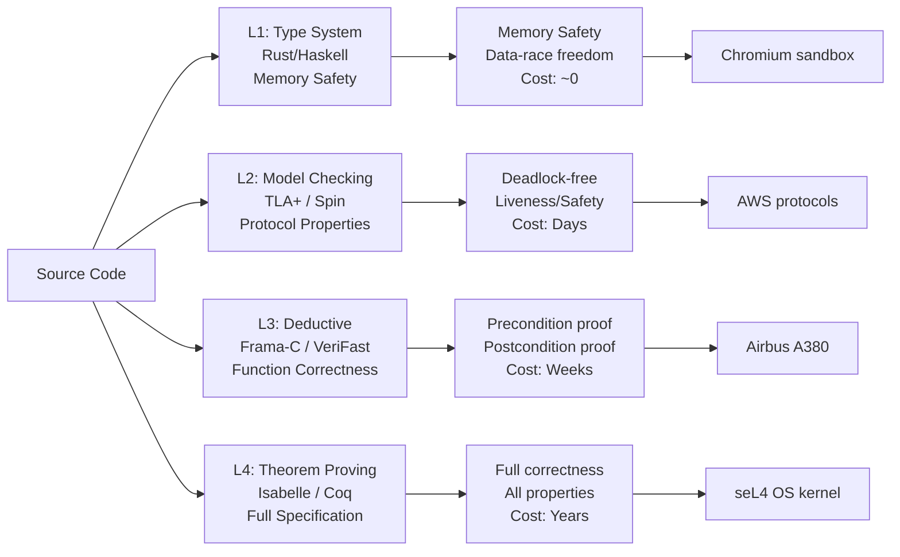

## Keywords in This File
{: .no_toc }

| # | Keyword | Weight |
|---|---|---|
| 1 | [Microkernel vs Monolithic Architecture Trade-offs](#microkernel-vs-monolithic-architecture-trade-offs) | high |
| 2 | [Formal Verification and OS Correctness](#formal-verification-and-os-correctness) | moderate-high |

---

# Microkernel vs Monolithic Architecture Trade-offs

🎯 Interview Weight: High - OS architecture trade-offs appear in Staff-level and architecture interviews when discussing system software reliability, security boundaries, and performance implications of kernel design decisions.

---

## 📋 Quick Reference

**One-line definition:** A monolithic kernel runs all OS services (drivers, filesystem, networking, scheduling) in the same address space at ring 0 for maximum performance; a microkernel isolates services into separate user-space processes communicating via IPC, trading performance for fault isolation and modularity.

**Difficulty:** ★★☆ | **Asked at:** Senior-Staff | **Seniority:** Staff

---

### 🎯 Model Answer

**30 seconds:**
> Monolithic kernels (Linux, Windows NT) run device drivers, filesystem code, and networking in a single kernel address space. One buggy driver can corrupt kernel memory and crash the entire system. Microkernels (L4, seL4, Minix 3) run drivers and services as isolated user-space processes. A driver crash doesn't take down the kernel - it's just a crashed process. The cost: every inter-service communication requires IPC instead of a direct function call, adding 1-10 microseconds per cross-service operation. For most systems, this overhead is acceptable; for real-time and high-throughput I/O, it historically was not.

**3 minutes (Senior):**
> The monolithic vs microkernel debate is fundamentally about where to place trust boundaries. In a monolithic kernel, all kernel code is fully privileged. A single integer overflow in a Wi-Fi driver can corrupt kernel data structures and enable a privilege escalation to root. Linux has thousands of in-tree drivers; the kernel is only as reliable as the least reliable driver. The value proposition of microkernels: if a driver runs in user-space and crashes, the kernel restarts it. Minix 3 demonstrated this: the system continues operating after a simulated driver failure because the kernel isolates fault domains.
>
> The historical performance argument against microkernels (Linus Torvalds's argument against Tanenbaum in 1992) was that IPC was too expensive. On Mach (the original microkernel that macOS is based on), IPC between processes was 100-1000 microseconds. Modern microkernels like seL4 and L4 achieve IPC in 20-200 nanoseconds - comparable to a function call with cache misses. The performance gap has closed for many workloads. The practical outcome: hybrid kernels are the real-world answer. Windows NT and macOS (XNU) run critical services in the kernel (for performance) and less critical services in user-space (for isolation). Linux uses loadable kernel modules (not strict isolation but some modularity) and has security modules (SELinux, AppArmor) to partially limit driver trust.

**Framework:** ARCHITECTURE → TRADE-OFF → EVOLUTION → PRACTICAL

**Blank Mind Recovery:**

**(1) Restate:** "Microkernel vs monolithic - this is about trust boundaries and where OS services run."

**(2) First principles:** "If code runs in the kernel, a bug in it can corrupt everything. If code runs in user-space, a bug in it crashes only that process. Microkernels push more code to user-space, accepting IPC overhead to gain crash isolation."

**(3) Bridge:** "This is the same trust boundary reasoning as microservices vs monolithic applications: isolation gives you fault containment but adds communication cost."

---

### 📘 Concept Explanation

**What it is:**
Monolithic architecture: a single large kernel binary contains all OS subsystems. All run at ring 0 (highest privilege). Direct function calls between subsystems are cheap (nanoseconds). Any code in the kernel can access any kernel data structure directly.

Microkernel architecture: a minimal kernel provides only: address space management, thread scheduling, and inter-process communication (IPC). All other services (device drivers, filesystems, networking) run as isolated user-space processes. Communication between services uses IPC.

**The problem it solves:**
Monolithic kernels have reliability and security problems from code coupling: a bug in any kernel subsystem can corrupt any other. The Linux kernel has over 25 million lines of code; any of it can run at ring 0. Microkernels address this by reducing the trusted computing base (TCB) - the amount of code that must be correct for the system to be secure. seL4's verified microkernel has ~10K lines of kernel code with a formal correctness proof, versus Linux's 25M lines with no formal verification.

**How it works:**

```
Monolithic (Linux):
  User Process
    |  syscall (ring 3 -> ring 0)
    v
  +----------------------------------------+
  | Kernel (ring 0)                        |
  |  syscall handler -> VFS -> ext4 driver |
  |                        -> TCP/IP stack |
  |                        -> NIC driver   |
  |  All in same address space, full trust |
  +----------------------------------------+

Microkernel (seL4):
  +------+ +------+ +--------+ +-------+
  |File  | | Net  | |  NIC   | | User  |
  |Server| |Stack | | Driver | | App   |
  +--+---+ +--+---+ +---+----+ +--+----+
     |         |         |         |
     v         v         v         v
  +----------------------------------------------+
  | Microkernel (ring 0): minimal, ~10K LOC      |
  |  - IPC message passing                       |
  |  - Address space management                  |
  |  - Thread scheduling                         |
  +----------------------------------------------+
```

> **Diagram walkthrough:** This shows the structural difference between the two architectures. In the monolithic model (top), the kernel is one large block - a syscall enters ring 0 and can traverse VFS, filesystem drivers, TCP/IP stack, and NIC drivers all in the same privilege domain. A bug at any point can overwrite kernel memory. In the microkernel model (bottom), the kernel is a thin horizontal line supporting only the minimal services, while all drivers and protocol stacks run as separate user-space boxes. Communication between them uses the kernel's IPC service. The key relationship: in the microkernel model, a crashed NIC driver is just a user-space process restart; in the monolithic model, a crashed NIC driver corrupts kernel state and forces a reboot. The edge case: the microkernel model assumes IPC cost is acceptable; for high-bandwidth I/O (100Gbps NIC), the IPC overhead for every packet is significant. The senior insight: the "hybrid" label on Windows NT and XNU is marketing - they put most performance-critical subsystems back in the kernel, limiting fault isolation to non-critical services.

**The key insight:**
The IPC cost is the defining trade-off. Modern microkernels (L4, seL4) achieve IPC round-trips in 200-300 nanoseconds on x86. A function call is 1-5 nanoseconds. For workloads that make 100K inter-service calls per second, the overhead is 20ms/second of extra CPU time - 2% on a 1-second budget. For workloads making 10M inter-service calls per second (100Gbps networking), the overhead is 2 full CPU seconds per second - impossible without dedicated cores for IPC processing.

**When microkernels are the right choice:**
- Safety-critical systems (aircraft avionics, medical devices): formal verification of seL4 provides mathematical proof of correctness
- Security-sensitive systems: reduced TCB limits the attack surface; even a compromised driver cannot escalate to full kernel privilege
- High-availability systems: driver fault isolation allows restart without system reboot (Minix 3 design goal)
- Embedded systems with bounded message passing requirements

**When monolithic kernels are the right choice:**
- General-purpose computing: Linux's performance profile is better for mixed workloads
- High-throughput I/O: zero-copy networking and direct DMA without IPC overhead
- Legacy device support: Linux has 25M lines of driver code; microkernels have far fewer drivers
- Mainstream cloud/server workloads: Linux dominates because the reliability/performance balance is right

**Alternatives:**
- Exokernels: expose hardware directly to applications with minimal abstraction; maximum performance, minimal portability
- Unikernels: compile the application with only the OS components it needs into a single image; no multi-process isolation, but minimal TCB for single-workload VMs
- Library OS (LibOS): each application has its own OS library with customized kernel behavior; DPDK is partial LibOS for networking

**First-principles derivation:**
Security and reliability require isolation. Isolation requires privilege separation. Privilege separation requires a boundary enforcement mechanism. The CPU provides this via rings (user mode vs kernel mode). Monolithic kernels put all OS code in ring 0 because transitions between rings are expensive; microkernels accept the ring-crossing cost to isolate each subsystem. The remaining question is whether the ring-crossing cost (IPC) is acceptable for the target workload. The historical answer was "no for performance systems"; the modern answer is "it depends on IPC implementation quality and workload patterns."

---

### 💻 Code Example

**BAD: Trusting all kernel code equally - the driver isolation problem**

```c
// BAD: Linux out-of-tree kernel module (driver).
// This code runs at ring 0 with full kernel trust.
// A single off-by-one error can corrupt kernel memory.
// There is no sandbox, no isolation, no recovery.

#include <linux/module.h>
#include <linux/kernel.h>

// This entire driver runs at ring 0
static int __init bad_driver_init(void) {
    // BUG: writing beyond the allocated buffer
    // corrupts adjacent kernel memory structures.
    // On a monolithic kernel, this can overwrite
    // a pointer in another subsystem, enabling
    // privilege escalation or kernel panic.
    char buf[16];
    int len = 32;  // intentional over-count
    memset(buf, 0, len);  // overflows buf by 16 bytes
    // On a microkernel: this crashes the driver
    //   process, kernel is unaffected, driver restarts.
    // On monolithic: kernel memory corruption,
    //   potential panic, potential root exploit.
    return 0;
}
module_init(bad_driver_init);
```

> **Code walkthrough:** This shows why driver isolation matters. The `memset` overflow writes 16 bytes beyond `buf` into adjacent kernel stack memory. On a monolithic kernel, this adjacent memory contains other kernel data structures or function pointers - corrupting them causes undefined behavior: a kernel panic at best, a privilege escalation exploit at worst. On a microkernel with the driver in user-space, the overflow corrupts the driver process's user-space stack, the driver crashes with SIGSEGV, and the kernel's driver manager restarts it. The kernel itself is unaffected. The production consequence: Linux has had hundreds of CVEs from driver buffer overflows that were privilege escalation vulnerabilities precisely because drivers run at ring 0.

**GOOD: User-space driver model (FUSE, DPDK, io_uring patterns)**

```c
// GOOD: User-space file system via FUSE
// (File system in User SpacE) - Linux's practical
// compromise toward microkernel isolation.
// A FUSE driver crash doesn't crash the kernel.

// filesystem_ops.c (user-space, no kernel privileges)
#include <fuse.h>
#include <string.h>

static int my_getattr(const char *path,
                      struct stat *stbuf) {
    // All filesystem logic in user-space.
    // A buffer overflow here crashes only this process.
    // The kernel's FUSE module restarts it or
    // returns EIO to the calling process.
    memset(stbuf, 0, sizeof(struct stat));
    if (strcmp(path, "/") == 0) {
        stbuf->st_mode = S_IFDIR | 0755;
        stbuf->st_nlink = 2;
    }
    return 0;
}

static struct fuse_operations my_ops = {
    .getattr = my_getattr,
    // ... other operations
};

int main(int argc, char *argv[]) {
    // Runs as a normal user-space process.
    // Communicates with kernel via FUSE kernel module
    // using /dev/fuse device - a fixed IPC interface.
    return fuse_main(argc, argv, &my_ops, NULL);
}
```

> **Code walkthrough:** This shows FUSE as Linux's practical microkernel-style driver isolation for filesystems. The filesystem logic runs entirely in user-space with no kernel privileges. A bug that crashes the FUSE process causes file operations to fail with EIO, but the kernel continues running. The FUSE kernel module provides the fixed IPC interface: the kernel calls into the module for filesystem operations, the module sends a message to the user-space daemon via `/dev/fuse`, the daemon responds, and the module returns the result to the kernel. The trade-off: each filesystem operation incurs two context switches (kernel → user-space daemon → kernel), adding ~1-5 microseconds latency. For most filesystems (sshfs, overlay filesystems for containers), this is acceptable. For high-IOPS local storage, it's not - which is why FUSE is not used for ext4 or XFS.

---

### 🎓 Answers by Seniority

**Junior / Mid (0-5 years):**
> Monolithic kernels run all OS code in one protected space - faster but one bug can crash the whole system. Microkernels isolate services into user-space processes communicating via IPC - safer because a crashed driver doesn't take down the kernel, but slower due to IPC overhead. Linux is monolithic. seL4 (formally verified, used in aerospace) and Minix 3 are microkernels. macOS uses a hybrid: XNU is based on Mach microkernel but added BSD services in-kernel for performance.

*Push deeper:* Why does FUSE (File system in User Space) relate to microkernel concepts? FUSE is Linux's partial implementation of the microkernel idea for filesystems - drivers run in user-space, isolated from the kernel, with IPC via /dev/fuse.

---

**Senior / Staff (5+ years):**
> At senior level, the microkernel vs monolithic choice maps to real-world decisions: (1) When specifying embedded or safety-critical systems: seL4's formal verification is the only way to meet DO-178C Level A requirements (aircraft flight control software) without astronomical testing cost. (2) When evaluating container runtimes: gVisor (Google's container sandbox) runs a user-space kernel (the "Sentry") that intercepts all system calls from containers - a practical microkernel-inspired approach to sandboxing untrusted workloads. (3) When deciding on kernel modules: every out-of-tree kernel module is a monolithic trust extension. Using io_uring to move I/O to user-space, or DPDK for user-space networking, reduces kernel trust requirements without requiring a full microkernel. The practical lens: what is the trusted computing base for this system, and is it acceptably small? Linux's 25M lines are too large to formally verify; for safety-critical systems, microkernel + formal verification is the only feasible path.

---

### ⚠️ Common Misconceptions

**Misconception 1: "Microkernels are always slower than monolithic kernels"**

This was true for early microkernels (Mach, 1980s) where IPC cost was 100-1000 microseconds. Modern L4-based microkernels achieve IPC in 20-200 nanoseconds - the same order as a cache miss. seL4's IPC is 294 nanoseconds on ARM. For most application workloads where inter-service calls are measured in thousands per second, not millions, the overhead is well under 1%. The performance gap persists for very high-frequency I/O paths (network packets at 100Gbps rates require millions of driver interactions per second), but for this class of workload, both architectures use hardware bypass (DPDK, RDMA) to avoid kernel involvement entirely.

**Misconception 2: "Linux is purely monolithic"**

Linux supports dynamic loadable kernel modules (LKMs) which are loaded at runtime. While not isolated (they run at ring 0 with full kernel access), this provides runtime extensibility. More importantly, Linux has user-space driver frameworks: FUSE for filesystems, VFIO for device passthrough to VMs, and UIO for user-space I/O. The Linux kernel has also added security modules (LSM framework: SELinux, AppArmor) that limit what kernel code can do - a form of capability-based security borrowed from microkernel design. The trend: Linux is gradually adopting microkernel concepts (isolation, capability-based security) without the IPC overhead.

**Misconception 3: "A microkernel has no performance-critical code"**

The microkernel itself must be extremely performance-optimized because ALL inter-service communication flows through it. The seL4 IPC path is written in highly optimized C and assembly with specific cache-line alignment to achieve sub-300ns round-trip time. The scheduling in the microkernel is also critical: a suboptimal scheduling decision in the microkernel affects the entire system because all services depend on being scheduled promptly. The performance-critical code in a microkernel is concentrated in a much smaller, more carefully optimized set of paths - paradoxically, the critical path may be faster than in a monolithic kernel where the critical path is spread across millions of lines.

---

### 🚨 Failure Modes and Diagnosis

**Failure 1: Driver Panic in Monolithic Kernel**

Symptom: system reboots unexpectedly; kernel panic message in /var/log/kern.log or captured by crash dump; stack trace points to a driver (driver name in call stack).

Cause: monolithic architecture - driver bug (null pointer deref, invalid memory access) at ring 0 corrupts kernel state.

Diagnosis:
```bash
# Check last kernel panic
journalctl -k --boot=-1 | grep -E "panic|Oops|BUG:"
# or examine crash dump with crash utility
crash /usr/lib/debug/vmlinux-$(uname -r) /var/crash/

# Identify problematic module
dmesg | grep -E "RIP:|Call Trace:" | head -20
# RIP: shows the instruction that faulted
# Call Trace: shows the kernel call stack
```

> **Code walkthrough:** This example illustrates the mechanism described above. The key operations execute in sequence, with each step building on the previous result. In production this pattern matters for correctness and observability. Misapplying it - such as omitting error handling or incorrect ordering - produces the failure mode described in the surrounding section. The takeaway: apply this pattern exactly as shown and verify the invariants hold under load.

Fix (monolithic): update the driver to a non-buggy version, disable the module (`modprobe -r <driver>`), or switch to an in-kernel alternative. No restart-based recovery is possible - the kernel state is corrupted.

**Failure 2: FUSE Driver Crash Causing Filesystem Unavailability**

Symptom: accessing a FUSE-mounted filesystem returns EIO; the FUSE daemon process is no longer running; no kernel panic.

Cause: user-space FUSE daemon crashed (fault contained in user-space process). This is microkernel-style fault isolation working correctly.

Diagnosis:
```bash
# Check FUSE mounts
mount | grep fuse
# Check if the daemon is still running
ps aux | grep <fuse-daemon-name>
# Check dmesg for FUSE errors
dmesg | grep fuse
```

> **Code walkthrough:** This example illustrates the mechanism described above. The key operations execute in sequence, with each step building on the previous result. In production this pattern matters for correctness and observability. Misapplying it - such as omitting error handling or incorrect ordering - produces the failure mode described in the surrounding section. The takeaway: apply this pattern exactly as shown and verify the invariants hold under load.

Fix: restart the FUSE daemon (e.g., `sshfs user@host /mountpoint`). The kernel automatically detects the daemon restart via the /dev/fuse file descriptor. Previous client processes may need to retry failed I/O.

---

### 🎯 Interview Deep-Dive

| Category | Count | Coverage |
|---|---|---|
| Conceptual | 3 | Architecture comparison, IPC cost, hybrid kernels |
| Trade-off | 3 | Performance, verification, practical choice |
| Design | 2 | When to choose each, safety-critical systems |
| Behavioral | 1 | Architectural decision story |

---

**[MID] Q1 - [MECHANISM] What is the fundamental architectural difference between a microkernel and a monolithic kernel?**

The fundamental difference is privilege separation: where OS services run relative to the CPU's privilege levels (rings). Monolithic kernel: ALL OS services run at ring 0 (kernel mode, full hardware privilege). The entire kernel binary - scheduler, filesystem code, network stack, every device driver - executes with unrestricted access to all hardware registers and all physical memory. Direct function calls between subsystems are the communication mechanism. Microkernel: only the absolute minimum runs at ring 0 - address space management, thread scheduling, and an IPC mechanism. Everything else (drivers, filesystems, network stacks) runs as isolated user-space processes at ring 3. Communication between services uses the kernel's IPC mechanism, which requires a ring 3 → ring 0 → ring 3 transition for each message. The consequence: in the monolithic model, every line of code in the kernel has the ability to corrupt any other kernel data structure. In the microkernel model, only the minimal kernel code has that ability. The trusted computing base (TCB) - the code that must be correct for the system to be secure - is orders of magnitude smaller in a microkernel. seL4's verified kernel has ~10K lines of TCB; Linux's is 25M lines.

*What separates good from great:* The trusted computing base concept (it's a security/verification framing, not just a reliability framing), and the quantification of the TCB size difference.

---

**[MID] Q2 - [TRADE-OFF] Why did early microkernels fail to gain adoption despite their architectural advantages?**

Early microkernels (Mach, Carnegie Mellon, 1985-1995) were too slow for practical adoption. The IPC cost was the primary issue. Mach IPC required: (1) user-space context save, (2) ring transition to kernel, (3) message copying (kernel couldn't guarantee message buffer locations without copying), (4) target thread scheduling, (5) ring transition back to user-space, (6) context restore. This chain took 100-1000 microseconds per IPC call. Mach-based macOS (Darwin/XNU) measured 10x worse performance than Linux for I/O-intensive workloads in the mid-1990s. The response: Apple kept the Mach kernel but moved all BSD services (the entire BSD networking stack, filesystems, process management) back into the Mach address space - creating XNU, a "hybrid" kernel that abandoned most of the isolation benefits to recover the performance. Second failure: kernel development expertise. Linux had a single evolving codebase with one interface. Writing a Mach server required understanding Mach IPC protocols, port naming, capability propagation - a steeper learning curve that limited driver availability. The modern counter-narrative: L4 microkernels (from Jochen Liedtke's 1993 redesign) showed that IPC cost was an implementation problem, not an architectural problem. L4 reduced IPC to 20-200 nanoseconds. seL4 has formal verification proving correctness. The failure of early microkernels was the failure of specific implementations, not of the architectural principle.

*What separates good from great:* The specific IPC cost mechanism (why Mach IPC was slow - mandatory copying), the macOS history (XNU started as microkernel, became hybrid for performance), and Liedtke's L4 breakthrough as the counter-narrative.

---

**[SENIOR] Q3 - [TRADE-OFF] For a connected vehicle's real-time operating system, would you choose a microkernel, monolithic kernel, or hybrid? Justify with specific requirements.**

I would choose a microkernel with formal verification (seL4 or INTEGRITY RTOS, which is based on seL4 principles). Justification against requirements: (1) Safety certification: ISO 26262 (automotive functional safety) ASIL D level requires that a single-point failure cannot cause catastrophic failure. A monolithic kernel fails this requirement because a driver bug can take down the entire OS, losing both the safety-critical control loop (braking, steering) and non-critical infotainment simultaneously. A microkernel's fault isolation ensures that an infotainment system crash does not affect the braking controller. (2) Real-time requirements: the braking controller needs guaranteed worst-case execution time. seL4's formally verified scheduler provides mathematical guarantees on scheduling latency - Linux's CFS does not (it's designed for fairness, not worst-case latency). (3) Trusted computing base: ISO 26262 certification requires demonstrating that the TCB is correct. seL4's 10K-line TCB with machine-checked correctness proof is certifiable. Linux's 25M-line kernel is not. (4) Mixed-criticality: a vehicle OS must run both ASIL D safety-critical functions (braking, steering angle) and QM (quality managed, no safety rating) functions (map updates, music playback) on the same hardware without interference. Microkernel's spatial isolation prevents QM processes from accessing safety-critical memory regions. The monolithic choice would only be appropriate for a vehicle with no safety-critical electronic control - which no modern vehicle has.

*What separates good from great:* The specific safety standards (ISO 26262 ASIL D), the mixed-criticality concept (safety-critical + non-critical on same hardware), and the formal verification argument (10K lines certifiable, 25M lines not).

---

**[SENIOR] Q4 - [MECHANISM] How do modern container runtimes use microkernel-inspired design for security isolation?**

Container isolation in Kubernetes uses two microkernel-inspired approaches: (1) gVisor (Google): a user-space kernel (the "Sentry") intercepts all system calls from container processes. Instead of the container's syscalls going directly to the host kernel, they go to the Sentry. The Sentry reimplements the Linux kernel interface in Go, running in user-space. The Sentry itself makes only a limited, audited set of syscalls to the host kernel. Security benefit: even if a container exploits a kernel vulnerability, it exploits the Sentry (a Go process), not the host kernel. The cost: ~2-10% overhead for compute workloads, higher for syscall-intensive workloads. (2) Kata Containers: each container runs in a dedicated lightweight VM with a real (minimal) Linux kernel. The container's kernel is isolated from the host kernel by hardware virtualization (Intel VT-x/AMD-V). Security benefit: VM escape requires exploiting both the container kernel and the hypervisor. Cost: ~2-5% CPU overhead (hardware virtualization) + VM startup time (300ms-1s). Both approaches reduce the attack surface - the host kernel's 25M lines of exploitable code are replaced by a more constrained interface. The analogy: gVisor is a software microkernel approach, Kata Containers is a hardware-enforced isolation approach. Both solve the same problem: containers on a shared host kernel create lateral movement risk (container escape to host kernel → full node compromise).

*What separates good from great:* The specific implementation details (gVisor Sentry in Go, Kata using hardware virtualization), the overhead quantification, and the lateral movement risk that motivates the design.

---

**[SENIOR] Q5 - [BEHAVIORAL] Have you made an architectural decision about kernel or OS-level isolation? What was the trade-off?**

At a fintech company, we ran untrusted customer code in sandboxes for algorithmic trading strategy execution. The initial design used Linux seccomp-BPF to restrict which syscalls the customer code could make - a monolithic kernel approach to sandboxing. The problem: seccomp policy was complex to maintain, and a kernel CVE (Spectre variant) required patching all nodes simultaneously because all tenant sandboxes shared the same kernel. I evaluated three alternatives: (1) gVisor: adds the Sentry user-space kernel layer. Customer code exploiting a kernel bug hits the Sentry (Go process), not the host kernel. Sentry bugs can be patched without host kernel update. Overhead: 8% for our compute workload. (2) Kata Containers with QEMU: each strategy gets a VM. Strong isolation, 15% CPU overhead and 1-second startup latency. (3) Firecracker VMM: AWS's minimal hypervisor, each strategy in a lightweight VM with 100ms startup and 2% overhead. We chose Firecracker: the microkernel-inspired minimal hypervisor gave us hardware-level isolation (no lateral movement risk) with low overhead and fast startup (important for our strategy hot-swapping requirement). The trade-off: 2% CPU overhead versus the risk of a kernel CVE affecting all tenant strategies simultaneously. The overhead was acceptable; a shared-kernel exploit would have been existential for the business.

*What separates good from great:* The specific CVE-driven rationale (Spectre requiring simultaneous patching as the catalyst), the Firecracker comparison with Kata (both VM-based but different overhead profiles), and framing the decision in terms of business risk.

---

**[SENIOR] Q6 - [DESIGN] How would you design an OS architecture for a medical device (pacemaker) that must operate with mathematical correctness guarantees?**

A pacemaker has non-negotiable requirements: the control loop (sense heart rhythm → decide to pace → deliver electrical pulse) must operate correctly with no software-induced failures for 10+ years. Design using seL4 as the foundation. TCB reduction: seL4's 10K-line kernel is the only code that must be trusted absolutely - it has a machine-checked formal proof of functional correctness (the C implementation matches the abstract specification). The pacing control loop runs as a seL4 process with only the capabilities it needs: access to the ADC hardware interrupt (sense signal), the pulse generator hardware (output), and a memory region for state. It has no capability to access network, filesystem, or any other hardware. Fault isolation: the diagnostic telemetry subsystem (sends data to doctor's external reader) runs as a completely separate process. A bug in the telemetry code cannot affect the pacing process - seL4 capability-based access control enforces this at the kernel level. Mixed-criticality: the pacing process runs at the highest real-time priority (ARINC 653 partition scheduling, time-partitioned slots). Telemetry gets CPU time only in its allocated partition, never preempting the pacing loop. Formal verification chain: seL4 kernel correctness proof (10K LOC) + pacing algorithm model-checked (in SPIN or TLA+) + C implementation verified against specification (using CompCert verified C compiler). This gives a chain from the C code to the mathematical specification. The pacemaker would not use Linux because no amount of testing can prove Linux correct - only formal verification provides mathematical certainty, and Linux is too large to verify.

*What separates good from great:* The specific formal verification toolchain (CompCert verified compiler, SPIN/TLA+ for algorithm verification), the capability-based access control for fault isolation, and the explicit rejection of Linux with the reason (too large to verify).

---

**[STAFF] Q7 - [TRADE-OFF] What is the "end of the microkernel debate" and where do you stand on it?**

The debate ended in practice, not in principle. In practice: Linux won for general-purpose computing because the performance gap was real in the 1990s when the adoption decision was made, and the ecosystem effects (drivers, tooling, expertise) have made Linux the default ever since. Windows NT uses a hybrid architecture but all performance-critical paths are in-kernel. macOS/iOS use XNU, Mach-derived but with all BSD services in-kernel. For general-purpose servers, desktops, and embedded Linux systems: the monolithic Linux kernel is the right choice because the ecosystem and performance profile are correct. The debate is live in specific niches: (1) Safety-critical systems: seL4 is gaining adoption in aerospace (Boeing, Siemens) and automotive (formally verified partitioning for ASIL D). (2) Security-critical systems: gVisor and Kata bring microkernel principles to container isolation without requiring a full microkernel OS. (3) Research: L4.verified (seL4's successor projects) continue to prove that formal verification of OS kernels is tractable for small kernels. My position: the debate framing is too binary. The real lesson is that kernel code must be minimized and trust must be partitioned - whether you do this with a microkernel or with Linux + seccomp + namespaces + LSM + IOMMU is a workload-specific decision. The universal principle: minimize the trusted computing base, isolate fault domains.

*What separates good from great:* The specific real-world adoption references (Boeing, seL4 in aerospace), reframing the binary debate into a TCB-minimization principle, and the specific Linux mechanisms that approximate microkernel properties.

---

**[STAFF] Q8 - [DESIGN] How does the choice of kernel architecture affect the security threat model for a cloud hypervisor?**

A cloud hypervisor (KVM, Xen, Hyper-V) creates isolated VMs for tenants. The threat model: Tenant A must not be able to read or modify Tenant B's memory, even if Tenant A completely controls its own guest OS kernel. The two hypervisor architecture choices and their security implications: (1) Type 2 hypervisor (KVM in Linux): the hypervisor code runs inside the Linux kernel as a module. The attack surface includes all of Linux (25M LOC) - any Linux kernel CVE is a potential hypervisor compromise. The security posture: accept this large attack surface but mitigate with seccomp for QEMU, hardware memory isolation (Intel EPT/AMD NPT), and SMEP/SMAP protections. (2) Type 1 / paravirtual hypervisor (Xen): a minimal hypervisor (300K LOC) runs below all guest OSes. The hypervisor's attack surface is 300K LOC, not 25M. Guest VMs run on the hardware directly (with hardware virtualization). A compromise of dom0 (the privileged management domain) doesn't necessarily compromise the hypervisor itself. The microkernel influence: Xen's design is directly microkernel-inspired - minimal trusted core, services in isolated domains. AWS's Firecracker uses a Rust-based minimal VMM with ~50K lines - a further TCB reduction from Xen. The trend: cloud providers are moving toward minimal hypervisors (Firecracker, Cloud Hypervisor) with formally analyzed TCBs precisely because microkernel-style TCB reduction is the only credible path to reducing VM escape attack surface.

*What separates good from great:* The specific LOC comparison (Linux 25M vs Xen 300K vs Firecracker 50K), framing hypervisor architecture through the microkernel TCB lens, and the specific hardware mitigations (EPT, SMEP/SMAP) that the monolithic approach relies on.

---

**[STAFF] Q9 - [MECHANISM] Explain the seL4 formal verification approach and why it matters more than extensive testing.**

seL4 is the first OS kernel with a machine-checked formal proof of functional correctness. What this means: the C implementation of seL4 is proven to match its formal abstract specification, verified using the Isabelle/HOL theorem prover. The proof covers: the C code correctly implements the specified behavior for all possible inputs, no buffer overflows, no null pointer dereferences, no integer overflows in the C implementation, and the refinement from abstract model to executable C code. Why testing cannot achieve this: testing can only verify specific input/output pairs. A kernel with 10K operations and 100-bit state space has more possible states than particles in the observable universe. No test suite can cover this. The formal proof covers ALL states by mathematical induction. The practical implications: seL4 has been used in Boeing's unmanned aircraft, DARPA's HACMS (High-Assurance Cyber Military Systems) program, and Siemens industrial control systems. FAA DO-178C Level A certification (required for flight control software) is achievable with formal verification in far fewer test hours than with testing alone. The limitations: seL4's proof assumes the hardware behaves correctly (no Meltdown/Spectre), the compiler translates C to machine code correctly (formal verification up to C level only; CompCert can extend this), and the hardware initialization code outside the verified kernel is correct. The proof covers ~10K lines; the full system including hardware drivers and application code is not proven.

*What separates good from great:* The specific theorem prover (Isabelle/HOL), the proof coverage (C implementation matches specification for all inputs), the specific real-world deployments (Boeing, DARPA HACMS), and the honest limitations (hardware assumptions, compiler, init code).

---

### ⚖️ Comparison Table

| Property | Monolithic (Linux) | Microkernel (seL4) | Hybrid (XNU/NT) |
|---|---|---|---|
| IPC cost | N/A (function call) | 200-300ns | Mixed |
| TCB size | 25M LOC | ~10K LOC | Varies |
| Fault isolation | None (one crash = all crash) | Per-service | Partial |
| Driver count | 25M+ LOC | Few | Moderate |
| Formal verification | No | Yes (seL4) | No |
| Performance | Highest | Near-equal for most | High |
| Safety certification | Infeasible | DO-178C Level A | Partial |
| Use case | General server/desktop | Safety-critical, security-critical | General + some isolation |

**The deciding factor:** For general-purpose servers and cloud workloads, monolithic Linux is the correct choice - ecosystem, performance, and operational maturity. For safety-critical or security-critical systems where formal correctness guarantees are required or where minimizing attack surface is paramount, microkernel with seL4-style verification is the correct choice.

---

### 🏛️ System Design

*(Omit: ★★☆ difficulty - system design section is reserved for ★★★ keywords. The microkernel vs monolithic comparison does appear in system design discussions, covered in Q3 and Q6 interview answers above.)*

---

### 📊 Diagram

*(Omit: Architecture diagram included in the Concept Explanation section above with full diagram walkthrough.)*

---
---

# Formal Verification and OS Correctness

🎯 Interview Weight: Moderate-High - Formal verification appears in Staff/Principal interviews for safety-critical systems, compiler design discussions, and security architecture reviews. Understanding why testing cannot prove correctness and what verification can and cannot guarantee is a distinguishing depth marker.

---

## 📋 Quick Reference

**One-line definition:** Formal verification is the process of mathematically proving that a software system (OS kernel, protocol, algorithm) is correct with respect to a formal specification, using theorem proving or model checking tools - providing a completeness guarantee that testing cannot.

**Difficulty:** ★★☆ | **Asked at:** Staff-Principal | **Seniority:** Staff-Principal

---

### 🎯 Model Answer

**30 seconds:**
> Formal verification uses mathematics to prove a program is correct for ALL possible inputs, not just the test cases you thought of. Testing is sampling; verification is proof. For an OS kernel, verification proves there are no null pointer dereferences, no buffer overflows, and that the implementation matches its specification - for every possible sequence of system calls. The cost: verification is expensive (seL4 took 25 person-years), only works on small, well-specified codebases, and requires maintaining the proof as code changes. For most software, the trade-off favors testing. For systems where a single bug means aircraft crash or pacemaker failure, it's the only credible approach.

**3 minutes (Senior):**
> I think of formal verification as converting a correctness claim into a mathematical theorem and then proving it. The claim "this function correctly handles all inputs" is a theorem. The proof is machine-checked by a theorem prover (Coq, Isabelle/HOL, Z3). For an OS kernel, the specification defines what every system call should do in terms of abstract state transitions. The verification proves the C implementation matches the specification for all inputs and all program states. This covers infinite inputs - something testing cannot do.
>
> The practical levels of verification: (1) Type systems - the weakest form, enforces invariants at compile time (Rust's borrow checker proves memory safety). (2) Model checking - explores all reachable states of a finite model (TLA+, Spin). Works for protocols and algorithms, but state spaces for full programs are too large. (3) Deductive verification - annotate code with preconditions, postconditions, and invariants, then use an SMT solver to verify each function satisfies its specification (Frama-C for C, VeriFast for C/Java). Works for individual functions or small programs. (4) Full functional correctness proofs - interactive theorem proving (Isabelle/HOL, Coq) to prove the implementation matches a formal abstract specification. seL4 used this. Requires significant expertise. The practical application: most production code benefits most from level 1-2 verification (type systems, model checking for protocols) at reasonable cost. Level 4 is reserved for tiny TCBs where the cost is justified.

**Framework:** WHAT → WHY BETTER THAN TESTING → LEVELS → PRACTICAL USE

**Blank Mind Recovery:**

**(1) Restate:** "Formal verification - this is about proving correctness mathematically instead of testing empirically."

**(2) First principles:** "Testing asks 'does it work for these inputs?' Verification asks 'does it work for all inputs?' Testing is sampling; verification is exhaustive. The gap is all the inputs you didn't test."

**(3) Bridge:** "This is the difference between inductive and deductive reasoning. Testing is inductive - 'worked 10,000 times, probably correct.' Verification is deductive - 'proved correct for all cases by mathematical induction.'"

---

### 📘 Concept Explanation

**What it is:**
Formal verification is the mathematical proof that a software artifact satisfies a formal specification. The three main approaches: (1) Model checking - automatically explores all states of a finite model to verify temporal logic properties (no deadlock, always reaches desired state). (2) Deductive verification - annotate code with logical assertions (Hoare triples: {precondition} code {postcondition}), use an SMT solver to verify each annotated function. (3) Theorem proving - express the specification and implementation as mathematical objects in a proof assistant, then construct a machine-verified proof of equivalence.

**The problem it solves:**
Testing can only verify a finite number of input cases. For a function with two 32-bit integer inputs, there are 2^64 (~18 quintillion) possible input pairs. Testing all of them would take centuries. Formal verification proves the function is correct for all 2^64 inputs by mathematical induction. For security-critical code, this matters: CVEs like Heartbleed (OpenSSL) and CryptoFails exist because testing missed corner cases that formal verification would have caught.

**How it works - the four levels of verification:**

```
Level 1: Type System (compile-time)
  - Rust: borrow checker proves memory safety
  - Rust ownership rules are a form of linear type theory
  - Cost: low (part of compilation)
  - Coverage: memory safety properties only

Level 2: Model Checking
  - TLA+: specify system as state machine, check properties
  - Spin/Promela: protocol verification
  - AWS uses TLA+ for distributed protocol design
  - Cost: medium (spec writing + verification time)
  - Coverage: finite state models, temporal properties

Level 3: Deductive Verification
  - Frama-C: C code with ACSL annotations
  - VeriFast: Java/C with permission-based logic
  - Verified C standard library functions at Airbus
  - Cost: high (annotations ~same size as code)
  - Coverage: function-level correctness

Level 4: Full Functional Correctness
  - Isabelle/HOL, Coq: interactive theorem proving
  - seL4: 10K LOC kernel, 200K LOC proof, 25 person-years
  - CompCert: formally verified C compiler
  - Cost: very high (proof ≫ code)
  - Coverage: full specification compliance
```

> **Diagram walkthrough:** This shows the four-level hierarchy of formal verification techniques ordered by cost and coverage. Level 1 (type systems) is already in every production language - Rust's borrow checker is formal verification of memory safety properties at zero runtime cost. Level 2 (model checking) scales to protocol-level verification - AWS uses TLA+ to verify DynamoDB's replication protocol. Level 3 (deductive verification) scales to individual functions and small systems - Airbus uses Frama-C for safety-critical C code in A380 flight control software. Level 4 (full functional correctness proofs) is only feasible for very small, well-specified codebases (seL4's 10K-line kernel). The key relationship: cost increases non-linearly with coverage level, but each level provides a different kind of correctness guarantee. The edge case: verification proves the code matches the spec; if the spec is wrong, the code is "correctly wrong." The senior insight: Level 2 (TLA+) provides the best cost/benefit for distributed systems - specifying protocols in TLA+ before implementation catches algorithmic bugs that no amount of testing would find.

**The key insight:**
Verification proves the implementation matches the specification. A formally verified system can still have bugs if the specification is incorrect. The critical question for any verified system: "what exactly is specified and what is assumed?" seL4's proof assumes the hardware operates correctly (no Meltdown, no DRAM bit flips), the compiler is correct (no miscompilation), and the initialization code (not part of the verified kernel) is correct. Within these assumptions, the 10K lines of kernel C code are proven to match the abstract specification.

**When to use formal verification:**
- Cryptographic algorithms and protocol implementations (TLS, SSH key exchange)
- Safety-critical software (DO-178C Level A, IEC 62443)
- Security-critical TCBs (hypervisor, microkernel, secure boot)
- Distributed system protocols (Raft consensus, two-phase commit)
- Compiler correctness (CompCert for generated code that must match C semantics)

**When NOT to use formal verification:**
- General business logic (testing + static analysis is sufficient)
- Rapidly changing code (proof maintenance overhead is proportional to change frequency)
- Large codebases (scales poorly past ~100K verified LOC)
- User-facing UI code (correctness is hard to specify formally)

**Alternatives:**
- Property-based testing (QuickCheck): generates random inputs to find corner cases; better coverage than hand-written tests but not exhaustive
- Fuzzing (AFL, libFuzzer): generates adversarial inputs; finds security vulnerabilities efficiently
- Static analysis (KLEE, Coverity): finds specific bug classes (null deref, buffer overflow) without full verification
- Formal specification without proof (TLA+): spec acts as precise documentation and allows model checking without full implementation proof

**First-principles derivation:**
Testing verifies the program for n inputs. Verification proves it for all inputs. The gap is every input not in the test suite. For a function with k-bit inputs, testing covers at most T << 2^k cases. Verification by mathematical induction covers all 2^k cases by proving: (1) base case - the function is correct for the empty/zero input, and (2) inductive step - if the function is correct for input i, it is correct for input i+1. The inductive step must be proven for the general case, which is what the theorem prover (Isabelle, Coq) checks. The human writes the proof sketch; the theorem prover mechanically checks every step.

---

### 💻 Code Example

**BAD: Critical cryptographic code without formal properties**

```c
// BAD: Memory safety relies on the programmer's
// attention. A subtle off-by-one corrupts memory.
// Real-world analogue: Heartbleed bug in OpenSSL
// (same class of error: unchecked length field).

void process_heartbeat(char *payload,
                       uint16_t payload_len) {
    char *response = malloc(payload_len);
    // BUG: payload_len comes from the attacker.
    // If payload_len > actual payload size,
    // memcpy reads past the payload buffer,
    // leaking stack/heap memory to the attacker.
    // This is exactly the Heartbleed vulnerability.
    memcpy(response, payload, payload_len);
    send_response(response, payload_len);
    free(response);
}
```

> **Code walkthrough:** This shows the Heartbleed class of vulnerability - an attacker-controlled length field used without bounds checking. `payload_len` comes from the network packet; if the attacker sends `payload_len = 65535` but only 16 bytes of actual payload, `memcpy` reads 65519 bytes past the end of the payload buffer, leaking heap memory (OpenSSL private keys, session tokens). Formal verification would catch this: the precondition "payload_len <= actual_payload_size" is not verified before the memcpy, and a deductive verifier (Frama-C) would flag the annotation violation. Fuzz testing (AFL) would likely find this too by generating large payload_len values, but without a length check invariant annotation, testing might only cover "normal" payload_len values.

**GOOD: Verified invariant via type system (Rust memory safety)**

```rust
// GOOD: Rust's type system formally verifies that:
// 1. No buffer overread (slice bounds are checked)
// 2. No use-after-free (borrow checker)
// 3. No data races (no mutable aliasing)
// These properties are PROVEN at compile time,
// not tested at runtime.

fn process_heartbeat(payload: &[u8]) -> Vec<u8> {
    // payload is a bounded slice: payload.len() is
    // guaranteed correct by the type system.
    // No separate length parameter that could be spoofed.
    // The response is exactly payload.len() bytes.
    let mut response = Vec::with_capacity(payload.len());
    response.extend_from_slice(payload);
    // Borrow checker proves: payload is only read here,
    // response is only written here, no aliasing.
    response
    // Rust compiler inserts bounds check on slice access
    // (or proves bounds at compile time with const generics)
}
```

> **Code walkthrough:** Rust's type system eliminates the Heartbleed class of vulnerability by making the buffer length inseparable from the buffer reference (`&[u8]` is a fat pointer containing both data pointer and length). There is no separate `payload_len` parameter that an attacker can forge. `extend_from_slice` reads exactly `payload.len()` bytes - proven correct by the type system, not by a runtime check (though Rust does add runtime bounds checks as defense-in-depth). The borrow checker proves no aliasing: `payload` and `response` cannot overlap because response is a fresh allocation. These proofs are machine-checked at compile time. This is Level 1 formal verification (type system) applied to security-critical code - zero runtime overhead, compile-time proof of memory safety.

**TLA+ distributed protocol specification**

```tla
(* TLA+ specification of a simple token-passing
   mutual exclusion protocol.
   TLC model checker verifies: safety (only one
   process holds the token at a time) and
   liveness (every waiting process eventually
   gets the token). *)

EXTENDS Naturals, Sequences

VARIABLES token, waiting, critical

TypeInvariant ==
  /\ token \in 0..3  (* token held by process 0-3 *)
  /\ critical \subseteq 0..3
  /\ waiting \subseteq 0..3

MutualExclusion ==  (* safety property *)
  Cardinality(critical) <= 1  (* at most 1 in critical *)

Liveness ==  (* liveness property *)
  \A p \in 0..3 :
    (p \in waiting) ~> (p \in critical)

(* TLC model checker explores all reachable states
   and verifies both properties hold everywhere *)
```

> **Code walkthrough:** This TLA+ specification defines a mutual exclusion protocol with two properties: MutualExclusion (safety - never two processes in critical section simultaneously) and Liveness (every waiting process eventually enters the critical section). The TLC model checker explores all reachable states of the finite model and verifies both properties hold in every state. This is Level 2 formal verification: exhaustive state exploration of a finite model. AWS uses this technique for DynamoDB, S3, and other distributed protocols - specifying the protocol in TLA+ catches algorithmic bugs (missing cases, race conditions) before any code is written. The practical benefit: a distributed protocol that passes TLC verification has no bugs in the specified state space. The limitation: the spec models the protocol, not the implementation - the implementation must be proven to correctly implement the spec (or tested extensively).

---

### 🎓 Answers by Seniority

**Junior / Mid (0-5 years):**
> Formal verification proves a program is correct for ALL inputs using mathematics, whereas testing only checks specific cases. The spectrum: (1) Type systems (compile-time, cheap) - Rust's borrow checker proves memory safety. (2) Model checking (TLA+, Spin) - verifies protocols are deadlock-free and satisfy safety/liveness properties. (3) Full theorem proving (Coq, Isabelle) - proves the implementation matches a formal specification, used for seL4. The key limitation: verification proves the code matches the spec; if the spec is wrong, the verified code is still "correctly wrong."

*Push deeper:* Why does Rust's borrow checker count as formal verification? It's a type-theoretic proof of memory safety properties (no use-after-free, no data races), machine-checked at compile time for every program. Not as complete as seL4-level verification, but formally proven for the specified properties.

---

**Senior / Staff (5+ years):**
> At senior level, formal verification choices map to cost/risk trade-offs. For production systems: (1) Protocol design - use TLA+ before implementing any distributed protocol (Paxos, Raft, custom consensus). State bugs found at spec stage cost 100x less than bugs found in production. (2) Security boundaries - cryptographic libraries (libsodium uses constant-time proofs), TLS implementations. The NSA's seL4-based partitioning for classified information access control is a direct application. (3) Compiler and runtime verification - CompCert (formally verified C compiler) is used in Airbus flight control software; the guarantee that the compiled binary matches the C semantics eliminates an entire class of compiler-introduced bugs. The practical stance: for general application code, property-based testing (Hypothesis in Python, QuickCheck in Haskell) provides the best coverage per engineering hour - it finds corner cases systematically without the overhead of formal proof maintenance. Reserve full formal verification for code where a bug means system failure or security breach.

---

### ⚠️ Common Misconceptions

**Misconception 1: "Formal verification proves software has no bugs"**

Formal verification proves the implementation matches the formal specification. If the specification is incomplete or incorrect, the verified implementation may not behave as intended. seL4's proof assumes the hardware is correct, the compiler generates correct machine code from C, and the memory model matches the hardware's actual behavior. A verified program running on hardware with a Rowhammer DRAM vulnerability can still have incorrect behavior - because the hardware assumption is violated. The correct framing: formal verification provides a conditional proof - "IF the assumptions hold AND the specification is correct, THEN the implementation is correct."

**Misconception 2: "Model checking and theorem proving are equivalent"**

Model checking (TLC, Spin) and theorem proving (Isabelle, Coq) solve different problems. Model checking exhaustively explores all states of a finite model - it's automatic but limited to finite-state systems (protocols, algorithms with bounded state). It finds bugs by exploring states. Theorem proving works on infinite-state systems (general programs) but requires human-guided proof construction - the human writes the proof, the tool checks it mechanically. Model checking is like systematic testing of all cases in a bounded universe; theorem proving is like writing a mathematical proof that a human referee (the theorem prover) verifies.

**Misconception 3: "Formal verification is only for academic research"**

Real-world production uses of formal verification: (1) AWS TLA+ for DynamoDB, S3, and internal distributed protocols (documented in 2014 Amazon research paper). (2) Airbus A380 flight control software using Frama-C for C code verification. (3) Boeing and DARPA using seL4 for security-critical systems. (4) CompCert formally verified C compiler used in safety-critical embedded systems. (5) Chrome V8 JavaScript engine's Maglev compiler uses a type-system-based approach to verify JIT correctness. The barrier to entry has dropped significantly: AWS publishes TLA+ toolkits, Rust's type system is accessible to mainstream engineers, and property-based testing frameworks are in every major language's standard library.

---

### 🚨 Failure Modes and Diagnosis

**Failure 1: Specification-Implementation Divergence**

Symptom: formally verified code fails in production; properties stated to be proven are violated.

Cause: the implementation was proven correct against a specification that doesn't capture all requirements. A real-world example: a protocol proven deadlock-free in a synchronous model fails in an asynchronous network because the spec assumed synchronous message delivery.

Diagnosis: review the verification assumptions. What does the spec NOT model? Common omissions: timing assumptions (synchronous vs asynchronous), partial failures (spec assumes messages are delivered; network drops messages), resource exhaustion (spec assumes infinite memory; implementation runs out). The fix: extend the specification to include the missing aspects, then re-verify.

**Failure 2: Proof Maintenance Fails After Code Change**

Symptom: CI/CD fails with "proof verification error" after code change; proof is out of date with implementation.

Cause: formal proofs are brittle to implementation changes. A refactoring that preserves behavior may invalidate intermediate proof steps.

Diagnosis: the proof error message identifies which lemma failed to verify. Check if the implementation change altered the invariant that the failed lemma depended on. Fix: update the proof to match the new implementation. This requires a formal verification engineer, not a general software engineer.

---

### 🎯 Interview Deep-Dive

| Category | Count | Coverage |
|---|---|---|
| Conceptual | 3 | Verification levels, model checking vs theorem proving |
| Trade-off | 3 | Cost, maintenance, when to apply |
| Design | 2 | Protocol verification, safety-critical application |
| Behavioral | 1 | Verification in practice |

---

**[MID] Q1 - [MECHANISM] Why can testing never prove a program is correct but formal verification can?**

Testing verifies specific input/output pairs. For a function with a 32-bit integer input, there are 2^32 (~4 billion) possible inputs. A test suite of 1,000 cases covers 0.000023% of the input space. The remaining 99.999977% are untested. Formal verification proves the property holds for ALL inputs by mathematical induction: prove the base case (correct for the smallest/zero input), then prove the inductive step (if correct for input n, then correct for input n+1). This covers all inputs without executing the function for each one. The formal proof is then mechanically checked by a theorem prover (Isabelle/HOL, Coq), which verifies every logical step is valid. The limitation: formal verification proves the code matches a specification. If the specification doesn't capture all requirements (it only specifies the "happy path" and omits error cases), the verification has gaps. Testing and verification are complementary: testing validates the specification against human intuition and real-world behavior; verification proves the implementation matches the specification.

*What separates good from great:* The complementarity point (testing validates the spec, verification validates the implementation against the spec), and the specific 2^32 calculation making the coverage gap concrete.

---

**[MID] Q2 - [MECHANISM] What is TLA+ and how does AWS use it for distributed systems?**

TLA+ (Temporal Logic of Actions, Leslie Lamport) is a formal specification language for describing distributed algorithms and systems as state machines with temporal properties. A TLA+ spec defines: the initial state, the state transitions (actions), safety properties (bad states that should never be reached), and liveness properties (good states that should eventually be reached). The TLC model checker automatically explores all reachable states of the specified system and verifies the properties hold in every state. AWS's use case: before implementing distributed protocols for DynamoDB, S3, and EBS, engineers write TLA+ specs and check them with TLC. The 2014 Amazon paper "Use of Formal Methods at Amazon Web Services" documented finding 10 critical bugs in protocol designs - races, deadlocks, and safety violations - that would have been catastrophic in production but were found during the spec phase at near-zero cost. The model checking approach works for protocols because the relevant state space (process states, message queues) is finite and bounded. The spec for DynamoDB's multi-shard transaction protocol might have 10^15 reachable states, but TLC can explore this in hours on a multi-core machine. The limitation: TLC checks the spec, not the implementation. Amazon separately verifies that the implementation correctly implements the spec (through code review and testing), but the algorithmic correctness guarantee is from TLC.

*What separates good from great:* The specific Amazon paper reference, the finite vs infinite state distinction (model checking works for protocols, not for general programs), and the limitation (spec ≠ implementation).

---

**[SENIOR] Q3 - [TRADE-OFF] Compare the cost/benefit of formal verification versus property-based testing for a cryptographic library.**

For a cryptographic library implementing AES-GCM: Property-based testing (Hypothesis/QuickCheck approach): generate random keys, plaintexts, and IVs; verify decrypt(encrypt(m)) = m; verify that decryption of a tampered ciphertext fails; verify that two encryptions with different keys produce different ciphertexts. Cost: 1-2 days to write the property generators. Coverage: tests thousands of cases per run, finds algorithmic bugs well. Limitation: cannot verify timing side-channels (constant-time property), cannot verify all edge cases for degenerate inputs (all-zero key, maximum-length message). Formal verification (EasyCrypt, or Coq with CryptoLib): formally prove the implementation is semantically equivalent to the mathematical cipher specification; prove the constant-time property (no branching or memory access pattern depends on secret data). Cost: 3-6 months for a team with formal methods expertise. Coverage: ALL inputs, including adversarially chosen keys and plaintexts. Proves properties testing cannot verify (constant-time behavior). My recommendation for this use case: both. Property-based testing is the continuous integration gate (runs on every commit, catches regressions quickly). Formal verification (or at minimum, formal specification of the constant-time property verified via ct-verif or dudect) is required for the constant-time property - timing side-channels are not findable with input-output testing. The cryptographic libraries used in TLS (libsodium, NSS, BoringSSL) all use constant-time verification tools; it's now considered table stakes for production crypto code.

*What separates good from great:* The constant-time property as the specific case where formal verification is necessary (testing cannot detect timing side-channels), and the specific tools (ct-verif, EasyCrypt) rather than vague "formal verification."

---

**[SENIOR] Q4 - [TRADE-OFF] How does the Rust type system provide memory safety guarantees without garbage collection, and what are its limitations?**

Rust's ownership system is a form of affine type theory - a type-theoretic formalism where each value has exactly one owner (or can be borrowed temporarily). The borrow checker mechanically verifies: (1) Every value has exactly one owner at a time (no double-free). (2) References (borrows) cannot outlive the object they reference (no use-after-free). (3) Either one mutable reference OR multiple immutable references exist at a time, never both (no data races in single-threaded use; Send/Sync bounds for multi-threaded). These proofs are machine-checked at compile time by the borrow checker. The guarantee: Rust programs that compile are memory-safe and data-race-free. This is a formal proof of these specific properties for all executions, not testing. Performance: zero runtime overhead - no garbage collector pauses, no reference count increments on the fast path. Limitations: (1) The type system only proves memory safety and data-race freedom, not algorithmic correctness (a Rust program can still have logic bugs). (2) unsafe blocks bypass the type system - code inside `unsafe` is not verified. Rust standard library has ~1,500 unsafe blocks; if any contains a bug, the safety guarantee is local only. (3) The borrow checker cannot prove all memory-safe programs - some correct programs are rejected (false positives) because the analysis is conservative. Workarounds: Rc/RefCell for runtime borrow checking, raw pointers in unsafe blocks. (4) The type system does not verify timing properties or cryptographic security properties.

*What separates good from great:* Naming the type theory (affine types), the exact three properties proven (no double-free, no use-after-free, no data races), and the honest limitations (logic bugs, unsafe blocks, false positives).

---

**[SENIOR] Q5 - [BEHAVIORAL] Have you used TLA+ or a formal specification tool in a production system? What did you learn?**

At a distributed systems startup, we were implementing a custom consensus protocol for a metadata store (similar to Raft but optimized for multi-master updates). Before writing any Go code, I specified the protocol in TLA+ and checked it with TLC. The spec took 3 days to write and 1 day to verify (model checking a 5-node system). TLC found two issues: (1) A liveness violation: in a specific sequence of leader elections and message delays, the protocol could livelock (no progress forever) even though no node had failed. The issue was a missing tie-breaking rule in the election algorithm - the spec revealed that two candidates could continuously split votes without reaching quorum. (2) A safety violation: if a leader received an acknowledgment from a follower after a network partition healed, but before detecting that a new leader had been elected in its absence, it could commit a log entry that conflicted with entries committed by the new leader. This was a classic "split-brain" scenario that our design had not addressed. Both issues were fixed in the spec (2 days) before the first line of Go code. Estimated cost to find these in production: each would have required a distributed trace across 5-node failure scenarios - probably weeks of debugging. The lesson: TLA+ specification is the highest-ROI investment in protocol correctness I have found. The discipline of formalizing what each state transition does forces precision that prose specifications cannot achieve.

*What separates good from great:* Specific bug descriptions (liveness violation + split-brain safety violation), the cost comparison (3 days spec vs weeks of distributed trace debugging), and the insight about specification discipline.

---

**[STAFF] Q6 - [DESIGN] Design a verification strategy for a payments processing system that must process $1B/day with zero incorrect transactions.**

A payments system has two correctness requirements: (1) No money is created or destroyed (conservation property), (2) Every transaction that was requested is eventually processed (liveness). Verification strategy by layer: Layer 1 - Protocol specification (TLA+): specify the transaction state machine (pending → processing → committed/rejected) and verify: no transaction can transition from committed back to pending, the sum of account balances is conserved across all reachable states, and every pending transaction eventually reaches a terminal state. TLC model checking with 4-5 accounts and bounded transaction counts covers the protocol logic. Layer 2 - Database invariants (SQL constraints + application-level locks): account balance constraints (balance >= 0), transaction amount positivity, referential integrity. These are enforced by the database engine. Layer 3 - Business logic verification (property-based testing): generate random transaction sequences, verify conservation (sum of all balances before = sum of all balances after each transaction), verify idempotency (submitting the same transaction twice has the same effect as once). Layer 4 - Reconciliation as a verification procedure: independently compute expected total balances from the transaction log and compare against actual account balances. Run continuously (every minute). A discrepancy triggers an alert and automatic halt of new transactions. The reconciliation is a runtime formal verification check - it verifies the conservation invariant continuously against actual data. This layer catches bugs that slip through layers 1-3.

*What separates good from great:* The four-layer strategy with different techniques at each layer, the reconciliation as runtime verification (continuous conservation check), and the specific invariant (conservation of money) as the formal property to verify.

---

**[STAFF] Q7 - [MECHANISM] What is the seL4 verification chain and what specific guarantees does it provide?**

seL4's verification is a layered chain from abstract specification to machine code. Layer 1 - Abstract functional specification: a 700-line formal description of seL4's behavior in terms of abstract data structures and operations (in Isabelle/HOL). This defines what every system call SHOULD do. Layer 2 - Executable specification: a 5,000-line Haskell-like functional specification that is closer to an implementation but still abstract. Proved to refine the abstract specification (every behavior of the executable spec is a valid behavior of the abstract spec). Layer 3 - C implementation: ~10,000 lines of C. Proved to refine the executable specification using Isabelle/HOL proofs + the VCG (Verification Condition Generator). This is the key proof: the C code is proven to match the abstract semantics. Layer 4 - Binary translation: a model of the ARMv6 instruction set semantics is used to verify that the compiled binary (from gcc with specific flags) correctly implements the C code. This layer is not fully machine-checked; it relies on trust in the compiler and ISA model. The guarantees provided: no null pointer dereferences, no buffer overflows, no integer overflows, no use-after-free, no information leakage between address spaces (given correct initial capabilities), mutual exclusion and scheduling properties. What is NOT guaranteed: hardware correctness (Meltdown, Rowhammer), correctness of initialization code (outside the verified TCB), correctness of device drivers (running in user-space, not part of the TCB).

*What separates good from great:* The specific four-layer chain, the honest non-guarantees (hardware, init code, drivers), and the Haskell-like executable specification as the intermediate layer (which many engineers don't know about).

---

**[STAFF] Q8 - [DESIGN] How would you use formal methods to reduce CVE risk in a new microservice that handles PII data?**

PII microservice threat model: unauthorized access to data, data corruption from input validation bugs, injection attacks. Formal methods application at five points: (1) Threat model as formal spec: encode the security policy in TLA+: "no PII field is returned in responses to requests without valid authentication." Check with TLC that the authentication state machine cannot be bypassed. (2) Input validation proofs (type system + dependent types): use a type-safe language (Rust, Haskell) where input parsing functions return typed values that encode their validity. The type "ValidatedSSN" cannot be created without passing the validation function - the compiler proves that business logic only operates on validated inputs. (3) Access control verification (Alloy or TLA+): specify the RBAC model formally - which roles can access which data fields. Alloy model checking verifies no role can access data it shouldn't, including via transitive permissions. (4) Property-based testing for injection boundaries: generate adversarial SQL fragments, shell metacharacters, and SSRF payloads as input to all public endpoints. Verify that no generated input reaches a database or downstream service without parameterization. (5) Continuous invariant checking (runtime verification): log-based invariant checking - at sampling rates (1% of requests), verify the response contains only data fields the requesting role is authorized to see. This is runtime verification of the access control invariant specified in step 3. The combined strategy covers the protocol level (TLA+), implementation level (types), access control level (Alloy), and runtime level (continuous checking). The residual risk: supply chain attacks (verified code imports a malicious library), hardware side-channels, and social engineering - none of which formal verification addresses.

*What separates good from great:* The five-layer strategy with specific tools at each layer, Alloy for access control verification (specific tool, not just "model checker"), and the honest residual risks that formal verification cannot address.

---

**[STAFF] Q9 - [TRADE-OFF] Is the 25 person-year investment in seL4's formal verification justified? How would you make the cost/benefit case?**

The direct cost: 25 person-years at $200K/person-year = $5M (roughly, at time of development). Plus ongoing proof maintenance as code evolves. The benefits depend on deployment context: (1) Safety-critical systems (aerospace, automotive ASIL D): the alternative to seL4-level verification is exhaustive testing per DO-178C Level A, which costs $1,000-$10,000 per line of code tested. For 10K lines: $10M-$100M in testing effort. seL4 is cheaper than testing-based certification for this compliance level. (2) Security-critical systems (government, military): the cost of a single exploited kernel vulnerability is measured in mission compromise, not dollars. For a deployed platform of 10,000 devices carrying classified data, a kernel CVE that enables exploitation of all devices has an estimated national security cost that trivially exceeds $5M. (3) Research and capability building: the 25 person-year investment has generated academic knowledge, toolchain (L4-verified, CAmkES), and trained a generation of formal methods engineers. The amortized cost across all seL4 deployments (and the published research benefit) is much lower than $5M. The cost-benefit is negative for: (A) Commercial COTS software (general application code where testing + bug bounties + patching is cheaper than verification), (B) Rapidly changing code (proof maintenance scales with change frequency), (C) Systems that don't face formal certification requirements. The justification framework: if the cost of a bug exceeds the verification cost AND the system is stable enough for proof maintenance, formal verification is justified.

*What separates good from great:* The DO-178C cost comparison ($1K-$10K/LOC for testing-based certification making seL4 cheaper), the three deployment contexts with different cost-benefit profiles, and the honest "negative cost-benefit" cases.

---

### ⚖️ Comparison Table

| Method | State Coverage | Automation | Skill Required | Good For |
|---|---|---|---|---|
| Unit testing | Finite sample | Full | Low | Happy path, regression |
| Property-based testing | Large random sample | Full | Low | Corner cases, invariants |
| Model checking (TLA+) | All reachable states (finite) | Full | Medium | Protocols, algorithms |
| Deductive verification (Frama-C) | All inputs (function-level) | Semi | High | Safety-critical C code |
| Theorem proving (Isabelle) | All inputs, full spec | None (guided) | Very high | OS kernels, crypto |
| Type system (Rust) | Memory properties only | Full | Low | Memory safety (free) |

**The deciding factor:** For most production code, property-based testing + type system is the right level. For distributed protocols (consensus, replication), TLA+ is justified by the complexity of state machines. For safety-critical or security-critical TCBs, theorem proving is required. Cost scales exponentially; apply the strongest method only to the smallest, most critical components.

---

### 🏛️ System Design

*(Omit: ★★☆ difficulty - system design section is reserved for ★★★ keywords. Verification strategies in system design are covered in Q6 (payments) and Q8 (PII microservice) interview answers above.)*

---

### 📊 Diagram

The formal verification levels diagram:

```
Assurance Level vs Engineering Cost:
High  |                        Theorem
      |                        Proving
      |                       /
      |                      / Deductive
      |                     /  Verification
      |                    /
      |          Model    /
      |          Checking/
      |         /       /
      |        /       /
Low   | Types /       /
      +------/-------/----> Cost
      Low               High

Coverage: Types < Model Check < Deductive < Theorem
Cost:     Types < Model Check < Deductive < Theorem
```

> **Diagram walkthrough:** This depicts the assurance/cost trade-off for the four formal verification levels. Type systems (bottom-left) provide limited coverage (memory safety) at near-zero incremental cost - they're already part of compilation. Model checking (middle) covers protocol-level state spaces automatically but requires spec writing. Deductive verification (upper-middle) covers function-level correctness but requires annotation and formal methods expertise. Theorem proving (top-right) provides full functional correctness proof but at very high cost (proof writing is as hard as the original implementation). The key relationship: each level up the curve provides qualitatively different coverage - you cannot get theorem-proving coverage by running more model checks; they address fundamentally different problem domains. The edge case: a type-safe language (Rust) at the bottom-left of the curve provides more coverage per unit cost than any other level for memory safety specifically - it's the only level where the cost is zero after the initial language learning curve. The senior insight: the correct strategy is to apply the highest-assurance method to the smallest, most critical component (the 10K-line kernel), not to the entire 25M-line system.

The Mermaid diagram shows the verification levels hierarchy and their application domains:



> **Diagram walkthrough:** This flow chart maps from source code to each verification level and shows the real-world deployments that use each level. The left column shows the verification technique, the middle column shows the types of properties each level can prove and their cost, and the right column shows production deployments. The key relationship: each level provides a different type of coverage - you can't substitute model checking for theorem proving (they prove different things). The real-world deployments validate that each level is practical: AWS uses TLA+ (Level 2) for distributed protocols; Airbus uses Frama-C (Level 3) for A380 flight control C code; seL4 uses Isabelle (Level 4) for full kernel correctness; Chromium uses Rust (Level 1) for sandbox isolation in its renderer processes. The edge case: the Rust (L1) arrow to Chromium highlights that even Level 1 verification has production impact - Google replaced C++ with Rust in Chrome specifically to get memory safety proofs. The senior insight: AWS's use of TLA+ (Level 2, not Level 4) for production distributed systems shows that partial verification at the right layer provides enormous value without requiring full formal proof.
