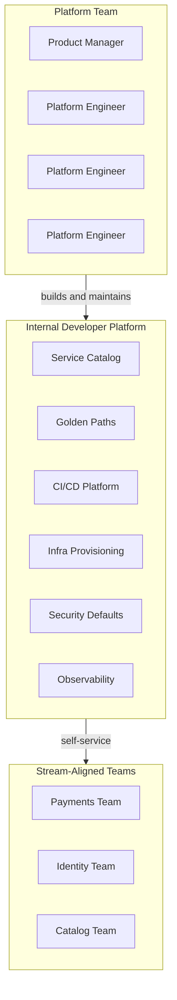
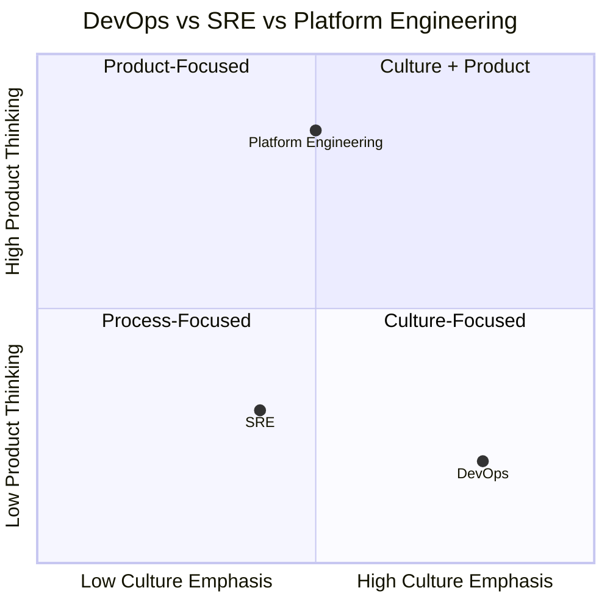
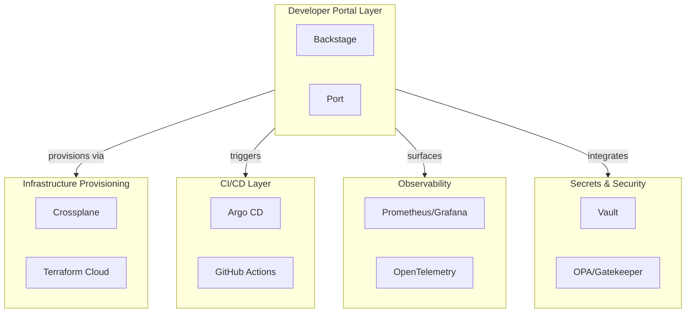

## Keywords in This File
{: .no_toc }

| # | Keyword | Weight |
|---|---|---|
| 1 | [What Is Platform Engineering](#what-is-platform-engineering) | ★☆☆ |
| 2 | [Platform Engineering vs DevOps vs SRE](#platform-engineering-vs-devops-vs-sre) | ★☆☆ |
| 3 | [The Internal Developer Platform Ecosystem](#the-internal-developer-platform-ecosystem) | ★☆☆ |

---

# What Is Platform Engineering

**Interview Weight:** ★☆☆ - The foundational definition
question asked in every platform engineering interview.

---

### 🎯 Model Answer

**30 seconds:**

> Platform engineering is the discipline of designing,
> building, and maintaining Internal Developer Platforms
> (IDPs) - self-service tooling that enables stream-
> aligned teams to deploy, operate, and observe their
> services without requiring deep DevOps expertise.
> Platform teams treat developers as customers, build
> golden paths as their core product, and measure
> success by developer adoption and productivity
> metrics rather than infrastructure uptime alone.

**3 minutes:**

> Platform engineering emerged as a distinct discipline
> around 2019-2022, recognized by the CNCF and widely
> adopted by organizations that outgrew the pure DevOps
> model. The formal CNCF definition: "Platform engineering
> is the discipline of designing and building toolchains
> and workflows that enable self-service capabilities
> for software engineering organizations in the cloud-
> native era."
>
> The "who, what, why" framing: Who: a dedicated team
> of engineers (platform team) whose customers are other
> engineers (stream-aligned teams). What: an Internal
> Developer Platform - the collection of tools, golden
> paths, APIs, and documentation that enables self-
> service infrastructure. Why: to reduce the cognitive
> load of infrastructure configuration on product teams,
> accelerate onboarding, and enforce consistent security
> and compliance posture at scale.
>
> What platform engineering is not: it is not a
> rebranding of DevOps (DevOps is a culture; platform
> engineering is an organizational role). It is not
> centralized IT (centralized IT does infrastructure
> for you; platform engineering enables you to do it
> yourself). It is not just tooling (the tools are the
> implementation; the discipline is product management
> applied to internal infrastructure).
>
> The key metric: platform engineering success is
> measured by developer experience - onboarding time,
> adoption rate of golden paths, developer NPS, and
> time-to-first-deployment for new services. An IDP
> that no one uses has failed, regardless of how
> technically impressive the infrastructure is.

**Blank Mind Recovery:**

**(1) Restate:** "What is platform engineering - let
me define it from first principles by describing
the problem it solves."

**(2) First principles:** "At scale, every engineering
organization needs shared infrastructure: CI/CD,
secrets, observability, deployment automation.
Platform engineering is the discipline of building
that shared infrastructure as a product for internal
customers."

**(3) Bridge:** "Think of AWS or GCP but for internal
use. AWS provides self-service infrastructure to
external customers. Platform engineering builds the
internal equivalent - a smaller, curated set of
capabilities tailored to the organization's specific
tech stack and workflows."

---

### 📘 Concept Explanation

**What it is:**

Platform engineering is the practice of building
and operating Internal Developer Platforms - curated,
opinionated collections of self-service capabilities
that allow development teams to build, deploy, and
operate services without deep operational expertise.
The platform team is a product team whose product
is the developer experience.

**The problem it solves:**

At scale, pure DevOps creates duplication (N teams
each building their own version of CI/CD, IaC,
observability), cognitive overload (product engineers
must master infrastructure tooling unrelated to their
domain), and inconsistency (30 teams produce 30
different security postures). Platform engineering
consolidates this shared infrastructure work into
a dedicated product team that serves all stream-
aligned teams as a self-service provider.

**How it works:**

```
PLATFORM ENGINEERING OPERATING MODEL:

Platform Team
(product team for internal infrastructure)
  |
  | builds and maintains
  v
Internal Developer Platform (IDP)
  |
  |-- Service Catalog (what services exist)
  |-- Golden Paths (how to build & deploy)
  |-- CI/CD Infrastructure (run builds)
  |-- Infrastructure Provisioning (self-service)
  |-- Secrets Management (centralized)
  |-- Observability Platform (metrics/logs/traces)
  |-- Security Scanning (enforced defaults)
  |
  | consumed via self-service by
  v
Stream-Aligned Teams (product development teams)
  - Deploy without contacting platform team
  - Observe their services via shared platform
  - Provision infrastructure via self-service
  - Onboard new services via golden paths
```



> **Diagram walkthrough:** The platform team is a
> product organization (note the Product Manager role)
> that builds and maintains the IDP. The IDP has six
> primary domains: service catalog (visibility),
> golden paths (onboarding and standards), CI/CD
> (build and deploy automation), infrastructure
> provisioning (self-service cloud resources), security
> defaults (compliance built-in), and observability
> (shared metrics/logs/traces). Stream-aligned teams
> consume all IDP capabilities via self-service - no
> tickets, no coordination with the platform team for
> routine use.

**The key insight:**

The platform team's product is not infrastructure -
it is the developer experience of consuming that
infrastructure. A Kubernetes cluster configured for
100% reliability that requires engineers to file tickets
and wait 3 days is a failed platform product. A
slightly less reliable cluster that engineers can
configure via a self-service portal in 10 minutes
is a successful one. Self-service and developer
experience are the product requirements, not just
technical correctness.

**When to use it:**

Platform engineering is appropriate when the
organization has 15-20+ stream-aligned teams, visible
duplication in infrastructure configuration,
onboarding time above 2 weeks, and sufficient budget
for a dedicated 3-5 person platform team. It is
also appropriate in regulated industries at smaller
scale, where compliance enforcement benefits
outweigh the overhead of a dedicated team.

**When NOT to use it:**

Below 10-15 teams, a DevOps guild model (shared
practices, shared templates, but no dedicated team)
is more efficient. Platform engineering overhead
(product management, versioning, adoption support,
user research) is not justified when the duplication
being eliminated is small.

**Alternatives:**

- DevOps guild - shared practice community with no
  dedicated team; works to 15-20 teams
- Embedded SREs - reliability engineers embedded in
  product teams; no shared platform product
- Cloud Center of Excellence (CCoE) - governance-
  focused alternative; less developer-experience
  focused

**First-principles derivation:**

Given that software organizations at scale require
N teams to share M infrastructure capabilities,
the options are: (1) each team builds its own
(pure DevOps - fails at scale), (2) a central team
does it for all teams (central IT - eliminates
autonomy), or (3) a product team builds shared
self-service capabilities (platform engineering -
preserves autonomy while eliminating duplication).
Option 3 is the only approach that preserves
delivery autonomy while eliminating the duplication
tax at scale.

---

### 💻 Code Example

*(Omit: "What Is Platform Engineering" is a conceptual
definition keyword. The implementation artifacts
(IDPs, golden paths, CI/CD templates) are covered
in later L1/L2 keywords. No code block is
appropriate for the definition itself.)*

---

### 🎓 Answers by Seniority

**Junior / Mid (0-5 years):**

> "Platform engineering is the discipline of building
> Internal Developer Platforms - shared tooling that
> lets development teams deploy and operate their
> services without DevOps expertise. A platform team
> builds things like: golden path templates for
> creating new services, CI/CD pipelines that teams
> use without configuring from scratch, self-service
> infrastructure provisioning, and shared observability.
> The goal is to reduce the time developers spend
> on infrastructure so they can focus on product code."

*Push deeper:* "The key distinction from DevOps: a
platform team does not own infrastructure for
everyone - it builds the tools that let everyone
own their own infrastructure. Self-service is the
core product requirement."

---

**Senior / Staff (5+ years):**

> "Platform engineering is a product discipline, not
> an infrastructure discipline. The platform team's
> job is to understand its customers (stream-aligned
> engineers), discover their pain points (user research,
> not just technical intuition), and build products
> (golden paths, self-service APIs, CLIs) that
> eliminate those pain points.
>
> The organizational context: platform engineering
> emerged because DevOps at scale creates compounding
> duplication and cognitive overload. The platform
> team solves this by building shared infrastructure
> once and providing it as a product. Success is
> measured by developer adoption (not infrastructure
> uptime), onboarding time reduction (not deployment
> count), and developer NPS (not ticket close rate).
>
> What changes at staff level: the platform team needs
> a product manager, a roadmap, versioned APIs,
> deprecation policies, and a developer relations
> function. Without these, even technically excellent
> infrastructure fails to achieve adoption."

*Push deeper:* "At staff level, I emphasize platform
as product management: the platform team must run
user interviews, publish a roadmap, have a clear
API versioning policy, and provide migration support
when they deprecate capabilities. Organizations that
staff the platform team with only infrastructure
engineers (no PM, no UX) consistently produce
platforms that are technically impressive but have
low adoption."

---

### ⚠️ Common Misconceptions

**Misconception: "Platform engineering is just
DevOps with a new name."**

DevOps is a cultural movement that distributes
operational responsibility to product teams. Platform
engineering is an organizational response that
emerges when that distribution creates too much
duplication and cognitive overhead at scale. DevOps
is still required after platform engineering exists -
stream-aligned teams still own their operations.
The platform team provides the tools to make that
ownership practical at scale.

---

**Misconception: "A good platform eliminates the
need for DevOps knowledge in product teams."**

A good platform reduces the DevOps knowledge required
for routine operations - deploying, monitoring,
rotating secrets, scaling. Product teams still need
to understand their services in production: how to
diagnose failures, interpret observability data, and
make capacity decisions. Platform engineering
eliminates the infrastructure configuration work;
it does not eliminate operational accountability.

---

**Misconception: "Platform engineering is only
for Kubernetes shops."**

Platform engineering is applicable wherever teams
share infrastructure concerns: on-premise VMs,
managed cloud services, hybrid environments, or
Kubernetes clusters. Kubernetes is the most common
substrate for modern IDPs because its API model
maps well to self-service resource provisioning.
But the platform engineering discipline (product
mindset, golden paths, developer experience focus)
applies independently of the underlying technology.

---

### 🚨 Failure Modes and Diagnosis

**Failure: Platform team built with no product
management**

*Symptom:* After 18 months, the platform has
excellent Kubernetes automation and Terraform modules
that engineers rarely use. Stream teams continue
managing their own pipelines. The most common
feedback: "The platform doesn't support our use
case" and "it's faster to do it ourselves."

*Root cause:* Platform team staffed exclusively
with infrastructure engineers. No user research
conducted. The team built what was technically
interesting, not what developers actually needed.

*Diagnosis:* Ask stream engineers: "What were the
top three things that slowed you down in the last
sprint?" If none of them are things the platform
addresses, the platform missed its market.

*Fix:* Hire a platform product manager. Run user
research with 10 stream teams. Rebuild the roadmap
based on developer pain severity, not infrastructure
completeness.

---

**Failure: Platform team becomes a ticket queue**

*Symptom:* Stream teams submit tickets to the
platform team for: new environment setup, secrets
injection, deployment configuration changes, access
provisioning. Average ticket resolution time: 3
days. Stream engineers report that the platform
slows them down.

*Root cause:* Platform team built infrastructure
but not self-service. The team understands their
systems but did not invest in the self-service
layer (APIs, CLIs, portals) that would allow stream
teams to make changes themselves.

*Fix:* Audit every ticket category. Identify the
top 5 ticket types. Build self-service automation
for each in priority order. The goal: stream teams
should never need to file a ticket for the top
95% of routine operations.

---

### 🎯 Interview Deep-Dive

| Seniority | Time | Focus |
|---|---|---|
| Junior | 3 min | Definition, components of an IDP |
| Mid | 5 min | Platform team model, success metrics |
| Senior | 8 min | Product discipline, failure modes, ROI |

---

**[JUNIOR] Q1 - [CONCEPTUAL] What is an Internal
Developer Platform and what does it contain?**

An Internal Developer Platform (IDP) is the collection
of self-service tools, golden paths, documentation,
and APIs that a platform team builds for internal
engineering customers.

Typical IDP components: a service catalog (registry
of all services, teams, APIs, and documentation),
CI/CD pipelines (automated build, test, and deploy
workflows that teams activate without configuring),
infrastructure provisioning (self-service creation
of databases, queues, caches, and networking via
a portal or CLI), secrets management (centralized
secrets storage with automated rotation and scoped
access), observability platform (shared metrics,
logs, and traces infrastructure), and a developer
portal (the UI that exposes all IDP capabilities
in one place, commonly built on Backstage).

The IDP is not a single product - it is a collection
of connected capabilities. Not every organization
needs all components immediately. The platform team
starts with the highest-pain components (usually
CI/CD and secrets) and expands over time.

*What separates good from great:* Naming specific
components (service catalog, golden paths, secrets
management) rather than describing the IDP vaguely
as "shared tooling." The service catalog and golden
paths are the highest-value starting points.

---

**[MID] Q2 - [CONCEPTUAL] How does a platform team
measure success?**

A platform team's metrics fall into three categories:
adoption, efficiency, and quality.

Adoption metrics: golden path adoption rate (what
percentage of new services use the platform's golden
path?), active users (engineers who used the platform
at least once in the last 30 days), and retention
(did stream teams continue using platform tools
after initial adoption?).

Efficiency metrics: time-to-first-deployment for
new services (before and after platform adoption),
onboarding time for new engineers, lead time for
standard changes (e.g., adding a new feature flag,
provisioning a database). These measure whether
the platform reduces friction.

Quality metrics: security scan pass rate across
platform-managed pipelines, CVE patch time (how
quickly does a patched base image reach all services?),
platform uptime and P99 latency for platform APIs.

The most important single metric: time-to-first-
deployment for a new service. This captures the end-
to-end onboarding experience and is directly felt
by every engineer who joins a team or creates a
new service.

*What separates good from great:* Naming adoption
as the primary metric category, not infrastructure
uptime. Infrastructure uptime measures the platform
team's operational health. Adoption measures whether
the platform is solving the problems it was built
to solve.

---

**[SENIOR] Q3 - [TRADE-OFF] How is platform
engineering different from just adding DevOps
engineers to each team?**

Embedded DevOps engineers: each product team has
1-2 engineers with DevOps expertise. They configure
CI/CD, manage infrastructure, and handle ops for
their team. Benefits: team-specific customization,
immediate availability, tight feedback loop.
Costs: 30 teams * 1-2 DevOps engineers = 30-60
DevOps headcount. Each team builds slightly different
infrastructure. DevOps knowledge is not shared.
When a DevOps engineer leaves, their team loses
the knowledge.

Platform engineering: 3-8 engineers in a dedicated
team build shared infrastructure that 30 teams
consume. Benefits: amortized cost (3-8 engineers
serve 30 teams), consistent infrastructure, shared
knowledge. Costs: platform team overhead (product
management, versioning, adoption support), reduced
customization for teams with non-standard needs,
and organizational change management to migrate
teams from their existing approaches.

The deciding factor: team count and consistency
requirements. Below 15 teams, embedded DevOps may
be cheaper. Above 25 teams, platform engineering
is almost always more cost-effective. In regulated
industries, consistent enforcement of security
defaults often justifies platform engineering at
even 8-10 teams.

*What separates good from great:* The cost-per-team
comparison and the break-even analysis. The embedded
DevOps model is not always wrong - it is wrong at
scale or in regulated environments.

---

**[SENIOR] Q4 - [DEBUGGING] A platform team has
been operating for 12 months. Golden path adoption
is 35%. What went wrong and how do you diagnose it?**

35% adoption after 12 months is a product-market
fit failure, not a technical failure. Three diagnostic
questions:

Question 1: Did you talk to your customers first?
Review the platform team's history: was there a
discovery phase where stream engineers were interviewed
before building started? If not, the platform likely
solved problems the platform team assumed were
important, not problems that actually caused pain.

Question 2: What does the 65% who did not adopt it
say? Run a quick survey or 5 interviews with
non-adopters. The most common reasons: "it doesn't
support [our use case]", "it was faster to just
do it ourselves", "we couldn't figure out the
documentation", "we would need to change our existing
workflow too much."

Question 3: What is the comparison experience?
Compare time-to-first-deployment using the golden
path vs. the team's existing approach. If the golden
path is harder or slower for typical team workflows,
adoption will remain low regardless of its long-
term benefits.

Typical root causes: insufficient abstraction (the
golden path requires understanding Kubernetes even
for simple services), poor documentation (engineers
cannot complete the getting-started guide without
help), or coverage gaps (the golden path works for
Java microservices but the majority of teams use
Python monorepos).

*What separates good from great:* Framing low adoption
as a product failure (missing the customer need)
rather than a communication failure (teams just
don't know about it). The fix requires product
discovery, not marketing.

---

**[STAFF] Q5 - [ARCHITECTURE] How does a platform
team decide what to build first?**

Platform team backlog prioritization follows the
same principles as product development: highest
user pain, most frequent use case, highest impact
per engineering effort.

Three-step process: (1) Discovery: interview 10-15
engineers across 4-5 stream teams. Ask: "What in
the last sprint was not related to your product
goals but you had to do anyway?" and "What took
longer than it should have?" Map responses to
infrastructure domains. (2) Pain scoring: rank
domains by frequency (how many teams experience
this?), severity (how many hours does this cost per
sprint?), and current alternatives (is there already
a good solution teams are using?). (3) MVP: pick
the domain with the highest combination of frequency
and severity and the lowest technical complexity.
Build a minimal golden path for that domain only.
Measure adoption. Iterate.

The first platform capability should almost never
be the most technically interesting one - it should
be the most painful one for stream engineers. CI/CD
pipelines and secrets management are the most
common first platforms for this reason: they are
universally needed, currently inconsistent, and
the self-service bar is achievable in 3-6 months.

*What separates good from great:* The user research
process as the prerequisite to backlog prioritization.
Platform teams that skip this and build what they
find technically interesting consistently produce
low-adoption platforms.

---

**[JUNIOR] Q6 - [COMPARISON] What is the
difference between a platform engineer and
a DevOps engineer?**

DevOps engineer (traditional definition): an engineer
who automates software delivery and infrastructure
management, typically embedded in or closely tied
to product teams. Responsibilities: CI/CD pipeline
configuration, infrastructure scripting, deployment
automation, on-call for infrastructure issues.

Platform engineer: an engineer who builds shared
infrastructure products for internal customers.
Responsibilities include all DevOps engineering
skills plus: product thinking (user research, roadmap
management), API design (versioning, backward
compatibility), developer experience design (golden
paths, documentation, CLIs), and adoption support
(migration guides, onboarding workshops).

The key difference: a DevOps engineer configures
infrastructure for specific teams. A platform
engineer builds self-service capabilities for all
teams. A DevOps engineer fixes a broken pipeline.
A platform engineer builds the system that prevents
broken pipelines.

*What separates good from great:* The "product
thinking" and "developer experience design" additions
to platform engineer responsibilities. These are
what separate a DevOps engineer from a platform
engineer, not just the "shared vs team-specific" scope.

---

**[MID] Q7 - [PRODUCTION] What does a platform
team's on-call rotation look like?**

Platform team on-call differs from product team
on-call in one critical way: platform incidents
affect all stream teams simultaneously. A CI/CD
platform outage stops deployments organization-wide.
An observability platform degradation blinds all
teams.

Platform on-call responsibilities: respond to
platform infrastructure incidents (Kubernetes control
plane issues, registry outages, CI/CD queue backup),
triage and resolve impact before notifying stream
teams, maintain runbooks for common failure modes,
and participate in post-incident reviews.

What platform on-call should NOT include: being on-
call for stream team service incidents. Platform
engineers are not on-call for application behavior
in services they do not own. The boundary: the
platform team owns the infrastructure layer (does
CI/CD work? is Kubernetes schedulable?). Stream
teams own the application layer (is my service
responding correctly?).

The operability requirement: every platform product
must have runbooks before going to production.
Platform engineers cannot afford tribal knowledge
in on-call - the platform serves 30+ teams and must
be operable by any team member under pressure.

*What separates good from great:* The explicit
boundary between platform on-call (infrastructure
layer) and stream team on-call (application layer).
Blurring this boundary creates a bottleneck where
all service incidents involve the platform team.

---

---

# Platform Engineering vs DevOps vs SRE

**Interview Weight:** ★☆☆ - The most common
comparison question asked in platform engineering
interviews, testing conceptual clarity.

---

### 🎯 Model Answer

**30 seconds:**

> DevOps is a culture and practice movement: everyone
> owns their own operations, breaking the wall between
> development and operations. SRE is a role and
> methodology: reliability engineering applied to
> large-scale systems, using software engineering
> to solve operations problems. Platform engineering
> is an organizational pattern: a dedicated team
> builds self-service infrastructure products to
> enable DevOps to scale. They are complementary,
> not competing. DevOps is the why, SRE is how to
> keep it reliable, platform engineering is how
> to make it scale.

**3 minutes:**

> The three are often confused because they overlap in
> tooling (all three use CI/CD, IaC, and observability)
> and in organizational placement (all three bridge
> development and operations). But they answer
> different questions.
>
> DevOps answers: "Who should be responsible for
> software delivery?" The answer: the team that
> builds it. DevOps eliminated the handoff between
> development and operations. It is primarily a
> cultural and organizational change. DevOps teams
> use automation heavily, but DevOps itself is not
> a toolset or a job title.
>
> SRE answers: "How do you maintain reliability
> at scale?" The answer: apply software engineering
> principles to operations work. SRE is an opinionated
> implementation of DevOps that originated at Google.
> Key SRE concepts: service level objectives (SLOs),
> error budgets, toil elimination through automation,
> and blameless post-mortems. SRE engineers typically
> sit between infrastructure and product, owning
> reliability for high-stakes services.
>
> Platform engineering answers: "How do you enable
> DevOps to work for 50 teams without creating a
> duplication and cognitive load crisis?" The answer:
> build shared self-service infrastructure products.
> Platform teams are product teams whose customers
> are other engineers. They apply product management
> methodology to internal tooling.
>
> The relationship: DevOps is the practice that platform
> engineering enables at scale. SRE provides the
> reliability engineering techniques (SLOs, error
> budgets, toil reduction) that platform teams use
> to maintain their own systems. A mature organization
> has all three: DevOps culture in every team, SRE
> practices for high-stakes services, and a platform
> team that reduces the infrastructure toil for all
> stream teams.

**Blank Mind Recovery:**

**(1) Restate:** "What is the difference between
platform engineering, DevOps, and SRE - let me
compare them by the question each one answers."

**(2) First principles:** "DevOps asks who owns ops.
SRE asks how to keep systems reliable. Platform
engineering asks how to make all of that scale
across many teams without creating chaos."

**(3) Bridge:** "Think of it as a building: DevOps
is the principle that each apartment owner is
responsible for their own maintenance. SRE is the
building engineer who maintains the structural
reliability. Platform engineering is the property
management company that builds the common facilities
that all residents share."

---

### 📘 Concept Explanation

**What it is:**

Three complementary disciplines that together address
software reliability and delivery at scale:
DevOps (cultural/organizational), SRE (role and
engineering methodology), and Platform Engineering
(team topology and product discipline).

**The problem it solves:**

Confusion between these three disciplines leads to
organizational design mistakes: companies hire SREs
when they need platform engineers, or form platform
teams without DevOps culture, or apply DevOps
principles without the reliability engineering
(SRE) needed to make it safe. Clarity on the
distinctions enables correct organizational design.

**How it works - the three disciplines compared:**

```
DEVOPS:
  Question: Who owns software operations?
  Answer:   The team that builds it.
  What it is: Culture + practices + automation
  Origin:   2008-2009 (Patrick Debois, DOES conf)
  Key concepts: CI/CD, IaC, "you build it, you run it"
  Failure mode: Works at small scale, creates
    duplication/cognitive overload at 50+ teams

SRE (Site Reliability Engineering):
  Question: How do you maintain reliability at scale?
  Answer:   Apply software engineering to ops.
  What it is: Engineering role + methodology
  Origin:   Google 2003 (Ben Treynor Sloss)
  Key concepts: SLOs, error budgets, toil, postmortems
  Failure mode: SRE team becomes bottleneck if
    responsible for all services, not just critical

PLATFORM ENGINEERING:
  Question: How does DevOps scale to 50+ teams?
  Answer:   Build shared self-service infrastructure.
  What it is: Team topology + product discipline
  Origin:   Emerged 2019-2022, CNCF formalized 2023
  Key concepts: IDP, golden paths, self-service,
    developer experience as product
  Failure mode: Platform built without product
    mindset -> low adoption
```



> **Diagram walkthrough:** DevOps sits high on the
> culture axis (it is primarily a cultural movement)
> and lower on product thinking (its artifacts are
> practices and pipelines, not customer-facing products).
> SRE sits in the middle of both axes - it has
> engineering culture and some product elements
> (SLO dashboards, runbooks) but is primarily an
> operations methodology. Platform Engineering is the
> most product-focused of the three: it requires the
> full product management toolkit (user research,
> roadmaps, adoption metrics, versioned APIs).

**The key insight:**

These three are not alternatives - they are
complementary practices at different organizational
layers. A mature engineering organization runs
all three simultaneously: DevOps culture in every
team (everyone owns their operations), SRE practices
for critical system reliability (SLOs, error budgets,
toil measurement), and platform engineering for
shared infrastructure (golden paths, self-service
provisioning, developer experience). Organizations
that try to substitute one for another create
predictable gaps.

**When to use it:**

Use this comparison when: (1) diagnosing organizational
role design (what kind of team does the organization
need?), (2) explaining platform engineering to
stakeholders who confuse it with DevOps or SRE,
and (3) designing career paths for engineers who
want to understand the landscape.

**When NOT to use it:**

Do not use this comparison to imply that SRE and
DevOps are obsolete because platform engineering
exists. They address different problems and coexist.
Organizations that replace their SRE function with
a platform team will lose reliability engineering
depth. Organizations that replace DevOps culture
with a platform team will create a centralized IT
bottleneck.

**Alternatives:**

- Gartner's Platform Engineering definition -
  more infrastructure-focused than CNCF's
- The Phoenix Project (DevOps origin) - DevOps
  narrative with fictional context
- Google SRE Book - SRE methodology reference

**First-principles derivation:**

Software organizations face three distinct problems:
(1) Who is accountable for production systems?
(DevOps: the development team.) (2) How are
production systems kept reliable? (SRE: engineering
practices applied to ops.) (3) How is shared
infrastructure provided at scale without duplication?
(Platform engineering: internal product teams.)
These are distinct problems requiring distinct
solutions. The same team solving all three creates
organizational confusion and poor outcomes for each.

---

### 💻 Code Example

*(Omit: Platform Engineering vs DevOps vs SRE is
a comparative conceptual keyword. The comparison
is best expressed through org chart design and
team charter documents, not through code. Concrete
tooling examples are covered in L1/L2 keywords.)*

---

### 🎓 Answers by Seniority

**Junior / Mid (0-5 years):**

> "The three answer different questions. DevOps is the
> culture where development teams own their operations -
> no handoff to a separate ops team. SRE is a role
> that applies software engineering to reliability:
> they set SLOs, measure error budgets, and automate
> away toil. Platform engineering is the team that
> builds shared infrastructure products so DevOps
> can scale - CI/CD templates, golden paths, self-
> service provisioning. They complement each other:
> DevOps culture, SRE reliability methods, platform
> engineering for scaling."

*Push deeper:* "The key confusion to avoid: platform
engineering is not replacing DevOps. Stream-aligned
teams still own their services in production (that
is DevOps). The platform team just gives them better
tools to do it."

---

**Senior / Staff (5+ years):**

> "I think of these three as operating at different
> organizational layers. DevOps is the philosophical
> layer: every team is responsible for its services
> end to end. SRE is the technical methodology layer:
> how do you quantify reliability (SLOs), budget
> for failure (error budgets), and systematically
> reduce manual work (toil measurement)? Platform
> engineering is the organizational design layer: how
> do you enable DevOps to work across 50 teams without
> creating 50 copies of every infrastructure concern?
>
> Where I have seen confusion cause real problems:
> companies that replace their SRE team with a platform
> team lose reliability engineering depth. Platform
> teams are good at self-service provisioning; they
> are not substitutes for SREs who design capacity
> plans, chaos engineering programs, and production
> readiness reviews. The two roles are complementary
> and should coexist in organizations above 50 engineers.

*Push deeper:* "At staff level, I add the reporting
structure dimension. SRE teams typically report to
engineering leadership and have authority to stop
deploys if error budgets are exhausted. Platform
teams typically report to a VP of Engineering or
CTO and have authority to define golden paths and
enforce compliance. When the two have clear charters
and report separately, they work well together.
When one team tries to do both jobs, both suffer."

---

### ⚠️ Common Misconceptions

**Misconception: "SRE and platform engineering are
the same role."**

SREs specialize in reliability engineering: they
set SLOs, run capacity planning, design chaos
experiments, and respond to production incidents
for critical systems. Platform engineers specialize
in developer products: they build golden paths,
maintain CI/CD infrastructure, and design self-
service APIs. An SRE who builds a deployment
automation tool is doing platform work. A platform
engineer who sets SLOs for the CI/CD system is
doing SRE work. They share tools and some practices,
but they have distinct core competencies and distinct
organizational missions.

---

**Misconception: "DevOps is obsolete because
platform engineering solves the same problems."**

DevOps and platform engineering solve different
problems. DevOps eliminates the handoff between
development and operations - teams own their services
end to end. Platform engineering reduces the infrastructure
overhead of that ownership at scale. An organization
with platform engineering but without DevOps culture
has stream teams that throw code over the wall to
the platform team, expecting the platform to deploy
and operate their services. That is centralized IT
with a new name.

---

**Misconception: "Platform engineering is just
the SRE team with a product manager."**

SRE teams focus on reliability of services: SLOs,
error budgets, capacity planning, and reliability
engineering for complex systems. Platform teams
focus on the developer experience of building and
deploying services: CI/CD automation, golden paths,
service catalog, self-service provisioning. The
product manager analogy is apt for platform teams
(they have internal customers with product needs)
but not for SRE teams (their "customers" are the
reliability requirements of production systems).

---

### 🚨 Failure Modes and Diagnosis

**Failure: SRE team given platform engineering
charter without product training**

*Symptom:* The "platform" built by the SRE team
is technically reliable (high uptime, comprehensive
runbooks) but has 25% adoption. Stream engineers
report: "it's too complex to configure" and "we
can't get exceptions approved quickly enough."

*Root cause:* SRE teams optimize for reliability
metrics. Platform teams optimize for developer
experience metrics. The SRE team applied their
core competency (making systems reliable) to platform
work but did not run user research or apply product
thinking to the design.

*Fix:* Add a platform product manager. Have the
SRE team run user interviews to discover why adoption
is low. Separate the SRE charter (reliability
engineering for critical services) from the platform
charter (developer experience products). These need
distinct reporting structures and distinct success
metrics.

---

**Failure: Platform team absorbs SRE responsibility**

*Symptom:* Platform team is on-call for all stream
team production incidents. Platform engineers are
context-switching between platform product development
(feature work) and production incident response
(operations work). Platform roadmap progress stalls.

*Root cause:* Organizational confusion about
boundaries. The platform team owns CI/CD and
observability infrastructure - they are on-call for
CI/CD failures. They are not on-call for application
behavior in stream team services.

*Fix:* Define the platform team's on-call boundary
explicitly: platform team owns the infrastructure
layer (is CI/CD operational? is Kubernetes healthy?);
stream teams own the application layer (is my service
returning correct responses?). Document the boundary
in the platform team's charter. Enforce it.

---

### 🎯 Interview Deep-Dive

| Seniority | Time | Focus |
|---|---|---|
| Junior | 3 min | Define all three, one key distinction each |
| Mid | 6 min | Where they overlap, where they diverge |
| Senior | 8 min | Org design, failure modes when combined |

---

**[JUNIOR] Q1 - [CONCEPTUAL] In one sentence each,
what is DevOps, SRE, and platform engineering?**

DevOps: a culture and set of practices where software
development teams own their own deployments and
operations, eliminating the handoff to a separate
ops team.

SRE (Site Reliability Engineering): an engineering
methodology that applies software engineering
principles to operations work, using SLOs, error
budgets, and automation to maintain reliability at
scale.

Platform engineering: the discipline of building
Internal Developer Platforms - self-service shared
infrastructure products that enable development
teams to deploy and operate their services without
deep DevOps expertise.

*What separates good from great:* The one-sentence
precision for each. Vague answers like "SRE is about
reliability" are weaker than "SRE uses SLOs and
error budgets to quantify reliability and budget
for failure." Precision shows actual familiarity.

---

**[MID] Q2 - [COMPARISON] How do the success
metrics differ between SRE and platform engineering?**

SRE success metrics: error rate relative to SLO
(are systems operating within their error budget?),
mean time to recovery (how quickly do we restore
service after incidents?), toil percentage (what
fraction of SRE work is manual and automatable?),
and deployment frequency and change failure rate
(DORA metrics for reliability). SRE teams measure
reliability outcomes.

Platform engineering metrics: golden path adoption
rate (are teams using the platform?), time-to-first-
deployment (how quickly can new services get to
production?), developer NPS (do engineers find the
platform useful?), self-service completion rate
(what percentage of infrastructure requests are
completed without platform team involvement?). Platform
teams measure developer productivity outcomes.

The difference shows when things go wrong. An SRE
team that is meeting all DORA metrics with only 20%
platform adoption is a success by SRE metrics but
a failure by platform engineering metrics. A platform
team with 80% adoption and two major incidents in
the CI/CD platform this quarter is a product success
but an operations concern. Both metrics are needed.

*What separates good from great:* Naming specific
metrics (DORA, error budget, developer NPS, golden
path adoption rate) rather than abstract descriptions.
The contrast between reliability outcomes vs.
productivity outcomes is the key distinction.

---

**[MID] Q3 - [TRADE-OFF] When would you hire
an SRE vs a platform engineer?**

Hire an SRE when: you have services at high scale
or high stakes that require systematic reliability
engineering (defining SLOs, running capacity planning,
designing chaos engineering), your existing engineers
lack the reliability methodology expertise (error
budget calculation, production readiness reviews),
and the services are critical enough to justify
dedicated reliability ownership.

Hire a platform engineer when: you have 15+ teams
each spending significant time on infrastructure
configuration, onboarding new engineers takes more
than 2 weeks, your CI/CD and deployment pipelines
are diverging across teams, and you need to enforce
consistent security policies without per-team
configuration.

The overlap: senior SREs and platform engineers
share tooling skills (Kubernetes, Terraform, CI/CD).
The distinction is orientation: SREs optimize for
reliability of specific services; platform engineers
optimize for developer experience across all services.
The organizational signal: if your primary pain is
"our critical systems are not reliable," hire SREs.
If your primary pain is "our teams spend too much
time on infrastructure," hire platform engineers.

*What separates good from great:* The organizational
pain signal as the decision criterion, with specific
symptoms for each hire.

---

**[SENIOR] Q4 - [ARCHITECTURE] How should SRE
and platform engineering interact organizationally?**

Three successful patterns:

Pattern 1 - Separate teams with shared practices:
the SRE team owns reliability engineering for
critical services and defines reliability standards.
The platform team owns developer experience
infrastructure and enforces reliability standards
for the platform itself. They collaborate on:
observability platform design (SRE defines the
standards; platform builds the shared infrastructure),
deployment safety mechanisms (SRE defines gates;
platform implements them in CI/CD), and incident
response tooling (SRE defines runbooks; platform
builds the alerting infrastructure).

Pattern 2 - SRE as platform customers: the SRE
team has specific platform requirements (SLO
dashboards, error budget tracking, incident response
workflows). They are a customer segment with high
reliability requirements. The platform team builds
for all customers including SREs.

Pattern 3 - Unified reliability platform: for
smaller organizations, the same team does both
SRE and platform work. This works at 20-50 engineers.
Above 50 engineers, the two functions are large
enough to benefit from specialization.

The anti-pattern: SRE team and platform team with
overlapping ownership of observability or CI/CD.
Ownership ambiguity creates both gaps (nobody owns
it clearly) and conflicts (both teams make changes
to shared systems without coordination).

*What separates good from great:* Naming the shared
ownership points (observability, deployment safety,
incident tooling) and the anti-pattern of overlapping
ownership.

---

**[SENIOR] Q5 - [DEBUGGING] An organization has
a platform team and an SRE team but both have low
adoption and low morale. What is the root cause?**

Multiple overlapping root causes are typical in
this scenario. Diagnose by looking for:

Overlapping mandate: both teams believe they own
observability, or CI/CD, or deployment automation.
Each team has built their own version. Stream teams
are confused about which to use and default to
building their own. Symptom: duplicate tools with
no clear owner.

Competing metrics: SRE team measures reliability
(P99 latency, error budget burn). Platform team
measures adoption. These metrics can conflict:
the most reliable platform design may not be the
most developer-friendly, and vice versa. If there
is no mechanism to resolve these metric conflicts,
teams argue and ship slowly.

No executive synthesis: neither team has an
organizational mandate that is clear enough to
drive adoption. Stream teams experience the two
teams as additional coordination overhead rather
than capability enablers.

Fix: define clear non-overlapping charters for
each team, establish a joint working group with
clear decision authority over shared domains (like
observability), and create a combined measure of
success that includes both reliability and adoption.
The two teams should feel like allies with different
specializations, not competitors.

*What separates good from great:* The "competing
metrics create adversarial dynamics" insight. This
is a real and common organizational failure mode.

---

**[JUNIOR] Q6 - [COMPARISON] What DORA metrics
apply to platform engineering?**

DORA (DevOps Research and Assessment) defined four
key metrics: deployment frequency, lead time for
changes, change failure rate, and time to restore
service.

These metrics apply to platform engineering in two
ways.

First, they are the outcome metrics that platform
engineering enables. A successful platform team
improves these metrics for stream-aligned teams
by making deployments faster (deployment frequency,
lead time), more reliable (change failure rate),
and easier to recover from (time to restore). If
stream teams are not improving on DORA metrics after
platform adoption, the platform is not working.

Second, the platform team applies DORA metrics to
its own operations. The platform itself has a change
failure rate (how often do platform updates break
stream team workflows?), a lead time for changes
(how long does a platform feature take from request
to production?), and a deployment frequency (how
often does the platform team ship improvements?).

Platform engineering teams that apply DORA metrics
to themselves tend to deliver more reliable and
more rapid platform improvements - the same discipline
they want to enable in their customers.

*What separates good from great:* The bidirectional
DORA application - platform engineering enables
DORA improvement in stream teams AND applies DORA
to itself.

---

**[MID] Q7 - [PRODUCTION] A company is starting
from scratch. In what order should they adopt
DevOps, SRE, and platform engineering?**

Recommended adoption sequence based on organizational
maturity:

Phase 1 (first 5-15 teams): adopt DevOps culture
and practices. Every team owns its deployments.
Implement CI/CD for all teams. Start with basic
monitoring. The goal: eliminate the wall between
dev and ops.

Phase 2 (15-30 teams): add SRE practices. Define
SLOs for your most critical services. Implement
error budget tracking. Establish a blameless postmortem
culture. At this point, reliability problems are
visible and systematic enough to justify SRE
methodology.

Phase 3 (20-40 teams): start platform engineering.
The duplication and cognitive load costs are now
large enough to justify a dedicated platform team.
Start with the highest-pain shared infrastructure
domain (usually CI/CD). Measure adoption.

These phases overlap - organizations adopt elements
of all three simultaneously. But the sequence matters
for resource allocation. A company that jumps directly
to platform engineering without DevOps culture
will build a self-service platform that nobody
uses because teams are not accountable for their
own operations.

*What separates good from great:* The sequencing
rationale - DevOps culture must precede platform
engineering because the platform enables DevOps
at scale; it doesn't replace the cultural prerequisite.

---

---

# The Internal Developer Platform Ecosystem

**Interview Weight:** ★☆☆ - Establishes the
landscape of tools and concepts within an IDP,
asked to verify conceptual breadth.

---

### 🎯 Model Answer

**30 seconds:**

> The Internal Developer Platform ecosystem covers the
> collection of tools, practices, and frameworks that
> platform teams use to build their IDPs. The core
> domains: a developer portal (Backstage is the
> dominant open-source option), infrastructure
> provisioning automation (Crossplane, Terraform
> Cloud), CI/CD platforms (Tekton, Argo CD, GitHub
> Actions), service catalog, secrets management,
> and observability. The CNCF Platform Engineering
> Working Group and CNOE framework provide reference
> architectures for composing these tools.

**3 minutes:**

> The IDP ecosystem is not a single product - it is
> a collection of composable capabilities that platform
> teams assemble and wire together based on their
> organization's tech stack and needs.
>
> The developer portal layer: the front door to the
> IDP. Backstage (from Spotify, now CNCF) is the
> most widely adopted open-source developer portal.
> It provides a service catalog (all services,
> their owners, and their documentation in one place),
> software templates (golden paths scaffolded via
> Backstage TechDocs), and a plugin ecosystem that
> integrates CI/CD, observability, and security
> tools into a unified developer experience.
>
> The infrastructure provisioning layer: how developers
> request and receive cloud resources (databases,
> queues, caches) without writing Terraform or
> filing tickets. Crossplane (CNCF project) provides
> Kubernetes-native infrastructure APIs. Terraform
> Cloud provides managed Terraform with self-service
> workspaces. Port and Cortex provide opinionated
> portals with built-in provisioning integrations.
>
> The CI/CD layer: how services are built, tested,
> and deployed. Tekton (Kubernetes-native CI/CD),
> Argo CD and Argo Workflows (GitOps and workflow
> automation), GitHub Actions (widely adopted for
> CI), and Flux (GitOps controller) are the primary
> platform-grade CI/CD tools.
>
> The observability layer: shared metrics (Prometheus,
> Thanos), distributed tracing (Jaeger, Tempo),
> logging (Loki, ELK), and alerting (Alertmanager,
> PagerDuty integration). The platform team owns
> the infrastructure; stream teams configure their
> own dashboards and alerts.
>
> The CNOE (Cloud Native Operational Excellence)
> framework from AWS provides a reference IDP
> architecture that wires together Backstage, Argo
> CD, Crossplane, and Keycloak into a working IDP
> skeleton.

**Blank Mind Recovery:**

**(1) Restate:** "What are the main components and
tools in the IDP ecosystem? Let me map it by layer."

**(2) First principles:** "An IDP needs to: show
developers what exists, help them create new things,
automate build and deploy, provision infrastructure,
and observe what is running. Each of those needs
maps to a tool category."

**(3) Bridge:** "Think of it like a city's
infrastructure. The developer portal is the city
map. CI/CD is the transportation network. Infrastructure
provisioning is the utilities. Observability is the
monitoring systems. The platform team is the city
planning department that keeps it all working."

---

### 📘 Concept Explanation

**What it is:**

The collection of open-source projects, commercial
products, frameworks, and reference architectures
that organizations use to build Internal Developer
Platforms. The ecosystem evolves rapidly within the
CNCF landscape, with platform engineering emerging
as a formal category in 2023.

**The problem it solves:**

Platform teams starting from scratch face a confusing
landscape of hundreds of tools with overlapping
capabilities. The ecosystem map provides a structured
vocabulary for understanding which tool categories
are needed and which products serve each category.

**How it works:**

```
IDP ECOSYSTEM LAYERS:

Developer Portal Layer
  Backstage (CNCF, open source)
  Port (commercial, opinionated)
  Cortex (commercial, service catalog focus)
  OpsLevel (commercial)

Infrastructure Provisioning Layer
  Crossplane (CNCF, K8s-native)
  Terraform Cloud (HashiCorp)
  Pulumi (cloud-agnostic)
  AWS Service Catalog / GCP Service Catalog

CI/CD Layer
  GitHub Actions (widely adopted)
  Tekton (CNCF, K8s-native pipelines)
  Argo CD (CNCF, GitOps controller)
  Flux (CNCF, GitOps alternative)
  Jenkins (legacy, widespread)

Secrets Management Layer
  HashiCorp Vault (dominant)
  AWS Secrets Manager
  Sealed Secrets (K8s-native, GitOps)
  External Secrets Operator

Observability Layer
  Prometheus + Grafana (metrics)
  Jaeger / Tempo (distributed tracing)
  Loki / ELK (logging)
  OpenTelemetry (instrumentation standard)

Security & Policy Layer
  OPA/Gatekeeper (K8s policy enforcement)
  Falco (runtime security)
  Trivy (container scanning)
  Snyk (developer-friendly scanning)

Reference Architectures
  CNOE (Cloud Native OpEx) from AWS
  CNCF Platform Engineering WG materials
  Humanitec Platform Reference Architecture
```



> **Diagram walkthrough:** The developer portal
> (Backstage or Port) is the integration point
> that ties together all other IDP layers. It
> does not replace any of the underlying tools -
> it provides a unified interface to them. Developers
> interact with the portal; the portal translates
> those interactions into API calls to Crossplane
> (for infrastructure), Argo CD (for deployments),
> Prometheus (for observability dashboards), and
> Vault (for secrets access). The portal is the
> "one pane of glass" that hides the complexity
> of the underlying ecosystem.

**The key insight:**

No single product is "the IDP." The IDP is an
integration of layers, and the developer portal
is the integration glue - not a replacement for
the underlying components. Organizations that buy
a commercial IDP product (Port, Cortex, OpsLevel)
are buying the portal layer plus pre-built integrations;
they still need the underlying infrastructure (CI/CD,
secrets, provisioning). Organizations that build on
Backstage are building the portal layer and wiring
their own integrations.

**When to use it:**

Use the ecosystem map when: selecting tools for
a new platform team, evaluating commercial IDP
products vs. building on Backstage, or explaining
the platform engineering landscape to stakeholders
or new team members.

**When NOT to use it:**

Do not try to adopt all layers simultaneously.
Most successful platform teams start with 1-2
high-pain domains (usually CI/CD and secrets),
build self-service for those, prove adoption,
and expand. The full ecosystem map describes
a mature IDP, not a starting point.

**Alternatives:**

- CNCF Cloud Native Landscape - broader tool
  inventory, less platform-engineering focused
- Gartner's Internal Developer Platform Magic
  Quadrant - commercial product evaluation
- Thoughtworks Technology Radar - opinionated
  platform tool recommendations by experience

**First-principles derivation:**

An IDP must provide: discovery (what exists?),
creation (how do I start a new service?), delivery
(how do I deploy my changes?), infrastructure
(how do I provision resources?), and observability
(how do I see what is happening?). Each of these
capabilities maps to a tool layer in the ecosystem.
The layered model follows from the functional
requirements of the IDP.

---

### 💻 Code Example

**Example 1: catalog-info.yaml (Backstage catalog)**

```yaml
# BAD: service without catalog registration
# No visibility, no ownership, no documentation link
# Engineers don't know the service exists or who owns it

# GOOD: Backstage catalog-info.yaml
apiVersion: backstage.io/v1alpha1
kind: Component
metadata:
  name: payments-service
  description: "Processes payment transactions"
  annotations:
    # Links to CI/CD pipeline
    github.com/project-slug: myorg/payments-service
    # Links to Grafana dashboard
    grafana/dashboard-selector: "payments"
    # Links to runbook
    runbook-url: https://wiki.internal/runbooks/payments
  tags:
    - java
    - payments
    - critical
spec:
  type: service
  lifecycle: production
  owner: group:payments-team
  system: payment-platform
  dependsOn:
    - component:fraud-detection-service
    - resource:payments-db
  providesApis:
    - payments-api-v2
```

> **Code walkthrough:** The `catalog-info.yaml` is the
> registry entry that makes a service visible in Backstage.
> The `annotations` block is where ecosystem integrations
> live: the GitHub slug links CI/CD status, the Grafana
> selector links the observability dashboard, and the
> runbook URL links incident response documentation.
> The `spec.dependsOn` field maps service dependencies
> - this powers the Backstage dependency graph that
> shows which services a deployment affects. Without
> this file, the service is invisible to the IDP.

**Example 2: Crossplane CompositeResourceClaim**

```yaml
# BAD: developer files a ticket for a database
# Ticket: "Please provision a PostgreSQL database
# for payments service in dev environment"
# Wait time: 3 days. Human error risk. No self-service.

# GOOD: Crossplane self-service database claim
apiVersion: platform.myorg.io/v1alpha1
kind: PostgreSQLInstance
metadata:
  name: payments-db-dev
  namespace: payments-team
spec:
  parameters:
    # Developer specifies requirements
    storageGB: 20
    version: "14"
    environment: dev
    backupsEnabled: false
  # Crossplane composition provisions RDS/Cloud SQL
  # enforcing: encryption, security groups, naming
  # conventions, tagging - all by default
  compositionRef:
    name: postgresql-aws-standard
  writeConnectionSecretToRef:
    name: payments-db-connection
    namespace: payments-team
```

> **Code walkthrough:** The Crossplane claim is how
> self-service infrastructure provisioning works in
> practice. The developer specifies what they need
> (20GB PostgreSQL 14 in dev) in a YAML that reads
> like a cloud resource request. Crossplane's composition
> translates this into actual AWS RDS provisioning
> with all platform-enforced defaults: encryption at
> rest, security group rules, tagging for cost allocation,
> and backup configuration appropriate for the environment.
> The developer does not write Terraform, does not
> file a ticket, and does not make security decisions -
> the platform composition handles all of that.

---

### 🎓 Answers by Seniority

**Junior / Mid (0-5 years):**

> "The IDP ecosystem has several layers. The developer
> portal (Backstage is the most common open-source
> option) is the front door that shows the service
> catalog and golden paths. Below that: CI/CD tools
> (GitHub Actions, Argo CD), infrastructure provisioning
> (Crossplane or Terraform), secrets management
> (Vault), and observability (Prometheus, Grafana,
> OpenTelemetry). The portal wires these tools together
> into a unified experience. Most teams start with
> the highest-pain area (usually CI/CD) and add
> layers over time."

*Push deeper:* "Backstage is a framework, not a
finished product. It provides the plugin architecture
and service catalog data model. The platform team
wires in their CI/CD, observability, and provisioning
tools via Backstage plugins. The heavy lifting is
the integration work, not the Backstage setup itself."

---

**Senior / Staff (5+ years):**

> "The IDP ecosystem is most clearly understood through
> its layers: portal (Backstage/Port), provisioning
> (Crossplane/Terraform Cloud), CI/CD (GitHub Actions/
> Argo CD/Tekton), secrets (Vault/External Secrets),
> and observability (Prometheus/Grafana/OpenTelemetry).
> The CNOE framework from AWS provides a reference
> architecture that wires these together.
>
> The strategic choice is build vs buy for the portal
> layer: Backstage is highly customizable but requires
> significant platform team investment to maintain a
> custom plugin ecosystem. Commercial alternatives
> (Port, Cortex, OpsLevel) provide opinionated portals
> with pre-built integrations at the cost of vendor
> lock-in and per-seat pricing. My heuristic: teams
> with a dedicated platform engineering presence (3+
> engineers) can sustain Backstage; teams with lighter
> platform investment should start with a commercial
> option and migrate to Backstage if they outgrow it."

*Push deeper:* "At staff level, I focus on the
integration complexity. The individual tools in
the ecosystem are generally mature. The hard work
is the integration glue: connecting Backstage to
your specific CI/CD system, mapping Crossplane
compositions to your actual cloud architecture,
and propagating security contexts from SSO through
to all IDP capabilities. A platform team that
underestimates this integration complexity will
spend 12 months building and still not have a
usable IDP at the end."

---

### ⚠️ Common Misconceptions

**Misconception: "Backstage IS the IDP."**

Backstage is the developer portal layer - the
front-end interface to the IDP. It does not provision
infrastructure, run CI/CD pipelines, store secrets,
or collect metrics by itself. Backstage without
integration to actual infrastructure tools is a
blank portal. The IDP is the full stack: portal +
CI/CD + provisioning + secrets + observability.
Backstage is the integration glue at the portal
layer, not the IDP itself.

---

**Misconception: "We should implement all IDP
layers simultaneously."**

A full IDP with portal, provisioning, CI/CD, secrets,
and observability implemented simultaneously is an
18-24 month project that will fail to achieve adoption
during that time. The correct approach: implement
one layer at a time, starting with the highest-pain
area. Get adoption for that layer, measure the
impact, and use that evidence to justify the next
layer. A CI/CD golden path with 80% adoption is
worth more than a full IDP with 10% adoption.

---

**Misconception: "The CNCF ecosystem and cloud
provider tools are competing alternatives."**

Cloud provider managed services (AWS EKS, GCP GKE,
Azure AKS, AWS CodePipeline) and CNCF open-source
tools (Argo CD, Tekton, Crossplane) are complementary,
not competing. Most organizations use cloud provider
infrastructure with CNCF tooling for platform
automation. The choice is: how much cloud provider
lock-in are you willing to accept at each layer?
Crossplane on AWS uses AWS APIs under the hood but
provides a cloud-agnostic interface above them.

---

### 🚨 Failure Modes and Diagnosis

**Failure: Platform team attempts full IDP
implementation simultaneously**

*Symptom:* 18 months after formation, the platform
team has Backstage, Crossplane, Tekton, Vault, and
Prometheus all partially implemented. None is fully
adopted. Stream teams have workarounds for each.

*Root cause:* Platform team tried to build the
complete IDP from day one instead of shipping one
capability at a time. The scope was too large for
the team's capacity.

*Diagnosis:* Count the percentage completion of
each IDP layer vs the platform team's capacity.
If more than 3 layers are simultaneously in progress
with less than 60% completion each, the team is
spread too thin.

*Fix:* Declare a focus quarter. Pick one layer (the
highest-pain one by developer survey). Achieve
full adoption for that layer before starting the
next. Each successful adoption builds organizational
trust and justified budget for the next layer.

---

**Failure: Backstage plugin ecosystem becomes
maintenance burden**

*Symptom:* Platform team spends 40% of sprint capacity
maintaining Backstage plugins rather than building
new platform capabilities. Each time Backstage
releases a new version, multiple plugins break.

*Root cause:* Platform team installed 20+ community
plugins and wrote 5 custom plugins without a
maintenance budget. The Backstage plugin ecosystem
moves fast; each plugin is a dependency that
requires active maintenance.

*Diagnosis:* Count the number of installed plugins,
identify which are actively maintained by the
community vs. abandoned, and calculate the maintenance
burden per plugin per quarter.

*Fix:* Audit and prune. Remove unused plugins.
Contribute to community-maintained plugins rather
than forking. For custom plugins: apply the build
vs. buy decision - is this custom logic worth
the maintenance cost? Consider a commercial Backstage
wrapper (Roadie, Frontside) that handles Backstage
upgrades and plugin compatibility.

---

### 🎯 Interview Deep-Dive

| Seniority | Time | Focus |
|---|---|---|
| Junior | 3 min | Name the layers, name a tool per layer |
| Mid | 6 min | Build vs buy decisions, starting points |
| Senior | 8 min | Integration complexity, ecosystem trade-offs |

---

**[JUNIOR] Q1 - [CONCEPTUAL] What are the main
components of an Internal Developer Platform?**

Six primary components:

Developer portal: the front-end interface where
engineers discover services, create new ones from
templates, view CI/CD status, and access documentation.
Backstage is the most common open-source option.

Service catalog: the registry of all services,
teams, APIs, and their relationships. It answers
"what services exist, who owns them, and how do
they connect?" Usually a Backstage core feature
or a dedicated product like Cortex.

CI/CD infrastructure: the automated build, test,
and deploy pipelines. GitHub Actions, Argo CD,
and Tekton are common. The platform team owns
the pipeline templates; stream teams instantiate
them for their services.

Infrastructure provisioning: self-service capability
to create cloud resources (databases, queues, storage)
without writing Terraform or filing tickets.
Crossplane (K8s-native) or Terraform Cloud are
common choices.

Secrets management: centralized secrets storage
with rotation and scoped access. HashiCorp Vault
is dominant. External Secrets Operator syncs
vault secrets into Kubernetes.

Observability: shared metrics (Prometheus/Grafana),
distributed tracing (Jaeger/Tempo), and logging
(Loki/ELK). The platform team owns the infrastructure;
teams configure their own dashboards.

*What separates good from great:* Naming all six
components and distinguishing "platform team owns
the infrastructure" from "stream teams configure
their own dashboards." This boundary is consistently
misunderstood.

---

**[MID] Q2 - [TRADE-OFF] Backstage vs a commercial
IDP product - how do you decide?**

Backstage advantages: open source (no licensing
cost), highly customizable (plugin architecture),
large community (CNCF project), and the ability
to build exactly the experience your organization
needs. Best for organizations with 3+ dedicated
platform engineers and long-term commitment.

Commercial IDP (Port, Cortex, OpsLevel) advantages:
faster time to value (pre-built integrations with
GitHub, Jira, PagerDuty, etc.), lower initial
maintenance burden, dedicated support, and
opinionated UX that reduces design decisions.
Best for organizations with limited platform
engineering capacity or those who want a working
IDP in 30 days.

The deciding factors: (1) Platform engineering
capacity - can you sustain a Backstage plugin
ecosystem? Each plugin is a dependency. (2) Budget -
commercial IDPs have per-seat licensing that can
exceed Backstage maintenance cost at scale.
(3) Customization requirements - highly custom
workflows (specific approval processes, non-standard
CI/CD) favor Backstage. Standard workflows favor
commercial products.

My recommendation: for organizations hiring their
first platform team, start with a commercial option
to prove value quickly. Migrate to Backstage when
you have 3+ platform engineers who can sustain
the plugin ecosystem.

*What separates good from great:* The "prove value
quickly first" recommendation and the capacity
threshold for Backstage (3+ dedicated engineers).
Generic "it depends" answers are weaker.

---

**[MID] Q3 - [ARCHITECTURE] How does Crossplane
fit into a self-service infrastructure model?**

Crossplane is a CNCF project that extends Kubernetes
to provision cloud infrastructure via custom resource
definitions (CRDs). It provides a Kubernetes-native
API for infrastructure as code.

The self-service model with Crossplane: (1) Platform
team writes Crossplane Compositions that define
how to provision specific resources (e.g., a
PostgreSQL instance means: RDS + security group +
parameter group + secrets with platform-enforced
defaults). (2) Stream teams submit
CompositeResourceClaims (small YAML files describing
what they need) via kubectl or a portal. (3) Crossplane
reconciles the claim against the composition and
provisions the actual cloud resource.

The developer experience: a developer says "I need
a PostgreSQL 14 database, 20GB, in dev." They submit
a 10-line YAML. Crossplane provisions the actual
RDS instance with all platform-required configuration
(encryption, security groups, cost allocation tags)
automatically. The developer gets a Kubernetes secret
with the connection string. No Terraform knowledge
required. No ticket filed.

*What separates good from great:* The distinction
between Compositions (platform team writes, defines
what infrastructure means for the organization)
and Claims (stream teams submit, express what they
need without implementation knowledge). This is the
self-service abstraction boundary in practice.

---

**[SENIOR] Q4 - [DEBUGGING] The platform team
has deployed Backstage with 15 plugins. After
6 months, platform engineers are spending 50%
of their time on Backstage maintenance. What
happened and how do you fix it?**

Root cause: plugin sprawl without maintenance budget
allocation. The 15 plugins each require: version
compatibility checks when Backstage upgrades,
plugin-specific integration testing, migration work
when underlying API changes (GitHub Actions API
changes, Argo CD API version bumps), and custom
plugin maintenance if any are home-built.

At 15 plugins, the maintenance surface is significant.
A Backstage major upgrade may require testing all
15 integrations. If 3 plugins use deprecated APIs,
each becomes a migration project.

Diagnosis: audit the 15 plugins. For each: what
is the active user count? What is the upstream
maintenance status? What was the last Backstage
version incompatibility?

Fix: (1) Prune ruthlessly. Remove any plugin with
< 20% active users - if people aren't using it,
the maintenance cost is pure waste. (2) Prefer
community-maintained plugins over custom ones.
If you have a custom GitHub Actions plugin because
the community one didn't quite fit your workflow,
contribute to the community plugin rather than
maintaining a fork. (3) Pin Backstage version and
schedule upgrades quarterly, not continuously.
(4) For commercial plugins: evaluate using Roadie
(managed Backstage) to offload upgrade maintenance.

*What separates good from great:* The prune-first
recommendation. Most teams add plugins and never
remove them. Pruning unused plugins is the fastest
way to reduce maintenance burden.

---

**[SENIOR] Q5 - [PRODUCTION] How do you approach
secrets management in an IDP?**

The requirements for IDP secrets management: centralized
storage (one place, not scattered across repos and
config files), dynamic secrets (short-lived, auto-
rotated where possible), scoped access (each service
gets only the secrets it needs), audit trail
(who accessed what secret when), and GitOps
compatibility (secrets references in Git, not
actual secrets values).

HashiCorp Vault is the most common solution: it
provides dynamic secrets (Vault generates
short-lived database credentials on request,
rather than storing long-lived static passwords),
KV secret store for non-dynamic secrets, audit
log for all access, and integration with Kubernetes
via the Vault Agent Injector.

External Secrets Operator (ESO) is the Kubernetes-
native integration layer: it reads secrets from
Vault (or AWS Secrets Manager, GCP Secret Manager)
and creates Kubernetes secrets in the target
namespace. Services access secrets via Kubernetes
native environment variables or volume mounts.
The secret values never exist in Git.

The golden path for secrets: service submits a
SecretStore manifest (where to get secrets from)
and an ExternalSecret manifest (which secrets to
sync). ESO handles the sync from Vault into
Kubernetes. Service accesses secrets via env vars.
The platform team owns the Vault infrastructure;
teams manage their own SecretStore and ExternalSecret
configurations within their namespaces.

*What separates good from great:* The dynamic secrets
concept and the "secrets references in Git, not
secret values" principle. These are production
practices that separate experienced platform
engineers from those who only know static secrets.

---

**[STAFF] Q6 - [ARCHITECTURE] How does OpenTelemetry
change the IDP observability strategy?**

Before OpenTelemetry: instrumentation was vendor-
specific. Switching from Datadog to Grafana required
re-instrumenting every service. Teams chose their
instrumentation vendor early and were locked in.

OpenTelemetry (OTel) separates instrumentation from
the observability backend. Services emit OTLP
(OpenTelemetry Protocol) data. The OTel Collector
routes that data to any backend: Jaeger, Tempo,
Prometheus, Datadog, or New Relic. Changing the
backend does not require re-instrumenting services.

For platform engineering: OTel standardizes how
services report observability data. The golden path
mandates OTel SDK usage for all new services.
Platform team operates the OTel Collector as a
shared infrastructure component. Stream teams
instrument their services with standard OTel APIs
without needing to know which backend the platform
team has chosen.

The strategic benefit: the platform team can evolve
the observability backend (moving from ELK to Loki,
from Zipkin to Tempo) without requiring stream teams
to change their instrumentation. This eliminates
observability as a bottleneck for infrastructure
migrations.

*What separates good from great:* The "evolve the
backend without re-instrumenting services" use case.
This is the platform engineering rationale for OTel
adoption - not just standard APIs but backend
independence as a platform migration enabler.

---

**[JUNIOR] Q7 - [COMPARISON] What is the difference
between Argo CD and Argo Workflows?**

Argo CD: a GitOps continuous deployment controller
for Kubernetes. It watches a Git repository for
Kubernetes manifests (Helm charts, Kustomize configs,
raw YAML) and reconciles the live cluster state
to match the declared state in Git. When a developer
merges a change that updates a manifest, Argo CD
detects the change and deploys the updated application
to the cluster. Argo CD is a deployment tool.

Argo Workflows: a Kubernetes-native workflow engine
for running multi-step pipelines. Each step is a
Kubernetes pod. Workflows can be triggered by events,
cron, or API calls. Used for: CI pipelines (build,
test, publish image), data processing pipelines,
machine learning training jobs, and any multi-step
orchestration that needs Kubernetes-native execution.
Argo Workflows is a pipeline orchestration tool.

In an IDP: both are commonly used together. Argo
Workflows runs the CI pipeline (build the image,
run tests, push to registry). Argo CD deploys the
new image to the cluster (continuous delivery). The
combination implements full CI/CD on Kubernetes.

*What separates good from great:* The precise
functional distinction (deployment controller vs.
workflow orchestrator) and the common usage of both
together in a CI/CD pipeline.
