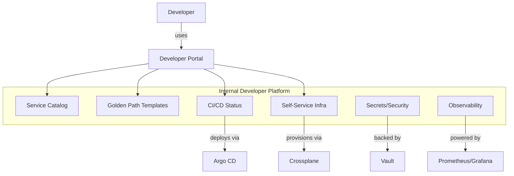
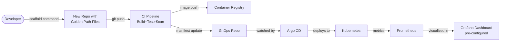

## Keywords in This File
{: .no_toc }

| # | Keyword | Weight |
|---|---|---|
| 1 | [Internal Developer Platform](#internal-developer-platform) | ★☆☆ |
| 2 | [Golden Path](#golden-path) | ★☆☆ |
| 3 | [Self-Service Infrastructure](#self-service-infrastructure) | ★☆☆ |

---

# Internal Developer Platform

**Interview Weight:** ★☆☆ - Core concept definition
asked in every platform engineering interview to
establish baseline understanding.

---

### 🎯 Model Answer

**30 seconds:**

> An Internal Developer Platform (IDP) is the curated
> collection of self-service tools, golden paths, and
> automation that a platform team builds for its
> internal engineering customers. It covers the
> full developer workflow: service creation (golden
> path templates), building and testing (CI/CD
> automation), deploying (GitOps/Argo CD), provisioning
> infrastructure (Crossplane, Terraform self-service),
> managing secrets (Vault), and observing services
> (Prometheus, Grafana). The goal: developers can
> deploy and operate services without deep ops
> expertise.

**3 minutes:**

> An IDP is not a single product - it is a layered
> collection of platform capabilities that reduces
> the cognitive overhead of software delivery.
>
> The four jobs-to-be-done that an IDP must address:
> (1) Discovery - engineers can find existing services,
> their owners, their dependencies, their APIs, and
> their operational status. (2) Creation - engineers
> can create new services using golden path templates
> without starting from scratch or consulting ops
> teams. (3) Delivery - engineers can build, test,
> and deploy their services using automated pipelines
> that enforce security and quality gates by default.
> (4) Operations - engineers can observe, alert, and
> respond to their services using shared infrastructure.
>
> The CNCF defines an IDP as providing five planes:
> the developer control plane (how developers interact
> with the platform), the integration and delivery
> plane (CI/CD), the monitoring and logging plane
> (observability), the resource plane (infrastructure
> provisioning), and the security and policy plane
> (access, compliance, secrets).
>
> What makes an IDP good vs great: a great IDP is
> designed around developer workflows, not infrastructure
> capabilities. The test: can a new engineer deploy
> their first service in under 2 hours? If not, the
> IDP has a developer experience problem regardless
> of its technical completeness.

**Blank Mind Recovery:**

**(1) Restate:** "What is an IDP - let me describe
it by the problems a developer faces on their first
day and how the IDP addresses each one."

**(2) First principles:** "A developer needs to:
find existing services, create new ones, build and
test code, deploy it, provision any infrastructure
it needs, keep secrets secure, and observe it in
production. An IDP automates or simplifies all of
these steps."

**(3) Bridge:** "Think of it as a developer-facing
cloud: AWS is a self-service platform for cloud
infrastructure. An IDP is the same concept but
opinionated for your organization's specific
technology stack and workflows."

---

### 📘 Concept Explanation

**What it is:**

An Internal Developer Platform is the product that
a platform team builds and maintains for internal
engineering customers. It is a curated, opinionated
set of self-service capabilities that covers the
end-to-end developer workflow for building, deploying,
and operating software within an organization.

**The problem it solves:**

Without an IDP, each product team must independently
manage: CI/CD pipeline configuration, infrastructure
provisioning (Terraform), secrets management, container
base images, deployment automation, and observability
setup. At scale, this creates duplication, inconsistency,
cognitive overload, and slow onboarding. The IDP
centralizes these shared concerns as products, freeing
product teams to focus on their domain logic.

**How it works:**

```
IDP FIVE PLANES (CNCF Model):

Developer Control Plane
  Developer Portal (Backstage, Port)
  CLI tools (scaffold, deploy, status)
  Service catalog (service registry)

Integration & Delivery Plane
  CI pipelines (GitHub Actions, Tekton)
  CD controllers (Argo CD, Flux)
  Image registry (Harbor, ECR, GCR)
  Quality gates (tests, SAST, DAST)

Monitoring & Logging Plane
  Metrics (Prometheus, Thanos)
  Dashboards (Grafana, shared templates)
  Tracing (Jaeger, Tempo, OTel)
  Logging (Loki, ELK)

Resource Plane
  Infra provisioning (Crossplane, Terraform)
  K8s namespace management
  Network configuration (service mesh)
  Cost attribution

Security & Policy Plane
  Secrets management (Vault, ESO)
  Identity & access (SSO, RBAC)
  Policy enforcement (OPA, Gatekeeper)
  Compliance scanning (Trivy, Snyk)
```



> **Diagram walkthrough:** The developer interacts
> with the IDP through a single portal (Backstage or
> equivalent). The portal is the unified entry point
> to all platform capabilities. Behind the portal,
> each capability domain has a dedicated tool: Argo CD
> handles continuous deployment, Crossplane handles
> infrastructure provisioning, Vault handles secrets,
> and Prometheus/Grafana handles observability. The
> platform team owns and maintains all of these
> tools; developers use them without needing to
> understand their internals.

**The key insight:**

The IDP's value is measured in developer time saved,
not infrastructure capabilities provided. An IDP
that saves each developer 4 hours per week is worth
more than an IDP that has 20 features that developers
never use. The right metric to maximize is the ratio
of developer time on product code to developer time
on infrastructure toil.

**When to use it:**

An IDP investment is justified when: the organization
has 15+ development teams, onboarding time exceeds
2 weeks, infrastructure configuration consumes more
than 15-20% of engineering time per team, and there
is organizational support for a dedicated platform
team with a product management function.

**When NOT to use it:**

Below 10 teams, the overhead of building and
maintaining an IDP (versioning, adoption support,
user research cycles) exceeds the efficiency gains.
Use shared Terraform modules, a CI/CD template
repository, and informal conventions instead.

**Alternatives:**

- Shared Git repository of templates and scripts -
  works for 5-10 teams, requires tribal knowledge
- Commercial cloud platform capabilities (AWS
  Control Tower, GCP Landing Zone) - cloud-specific
  but reduces custom IDP build
- Heroku/Render/Railway-style PaaS - eliminates
  infrastructure complexity entirely for simple
  workloads

**First-principles derivation:**

Every software organization must provide developers
with the capability to: discover (what exists?),
create (how do I start?), deliver (how do I deploy?),
provision (how do I get a database?), secure (how
do I manage secrets?), and observe (how do I monitor?).
At small scale, these are ad-hoc processes. At large
scale, they must be products. The IDP is the product
abstraction over these six essential developer
capabilities.

---

### 💻 Code Example

**Example 1: IDP CLI - scaffolding (GOOD vs BAD)**

```bash
# BAD: No IDP - new service setup without golden path
# Copy-paste from an existing service in GitHub
# Manually edit Dockerfile, remove old service name
# Copy CI/CD pipeline, update service-specific vars
# Set up Terraform manually, ask team lead for guidance
# Configure secrets by asking the platform/ops team
# Time to first deployment: 2-3 days

# GOOD: IDP golden path CLI
# Developer runs one command:
platform scaffold \
  --name payments-webhook \
  --type java-service \
  --team payments \
  --environment dev

# Platform CLI generates:
# payments-webhook/
#   Dockerfile          (golden path base image)
#   .github/workflows/  (CI/CD pipeline template)
#   k8s/                (Kubernetes manifests)
#   terraform/          (environment-specific infra)
#   catalog-info.yaml   (Backstage registration)
#   OWNERS              (team ownership file)
#   README.md           (golden path docs link)

# First deployment:
git push origin main
# CI/CD triggers automatically
# Service deployed to dev in under 15 minutes
```

> **Code walkthrough:** The `platform scaffold` command
> is the golden path entry point. It generates all the
> files a new service needs with platform-standard
> configurations: a Dockerfile using the golden path
> base image (CVE-managed), a CI/CD pipeline that
> includes all quality gates (unit tests, SAST,
> container scan, DAST), Kubernetes manifests with
> platform-standard resource limits and security
> contexts, and a catalog-info.yaml that registers
> the service in Backstage. Without this, a developer
> copies from another service and inherits all its
> technical debt and custom configuration. The time
> difference between approaches is the primary IDP
> value metric.

**Example 2: IDP self-service infrastructure request**

```yaml
# BAD: Ticket to provision infrastructure
# Title: [INFRA] Need PostgreSQL database for payments-webhook
# Description: Need a Postgres 14 database in dev, ~10GB
# Please configure security groups to allow connection
# from payments namespace in EKS cluster
# Waiting time: 1-3 days

# GOOD: IDP self-service via Kubernetes resource
# Developer submits:
apiVersion: platform.example.io/v1alpha1
kind: Database
metadata:
  name: payments-webhook-db
  namespace: payments-team
spec:
  engine: postgres
  version: "14"
  size: small       # Platform maps to actual size
  environment: dev
  accessFrom:
    - namespace: payments-team
# Platform provisions: RDS instance, security groups,
# parameter group, connection secret, cost tags
# Developer gets: K8s secret 'payments-webhook-db-conn'
# Time: automated, 5-10 minutes
```

> **Code walkthrough:** The self-service Database
> resource is a Crossplane Composite Resource Claim.
> The developer expresses intent ("I need a small
> Postgres 14 database accessible from my namespace
> in dev") without specifying how to provision it.
> The platform's Composition translates this intent
> into actual cloud resources with all compliance
> requirements built in. The `size: small` abstraction
> hides cloud-provider-specific instance type
> selection. The developer never writes Terraform,
> never configures security groups, and never files
> a ticket - the IDP handles all of it.

---

### 🎓 Answers by Seniority

**Junior / Mid (0-5 years):**

> "An IDP is the collection of tools that a platform
> team builds to help development teams deploy and
> operate their services. It typically includes:
> a service catalog showing all services and their
> owners, golden path templates for creating new
> services, shared CI/CD pipelines that run automatically,
> self-service infrastructure provisioning, secrets
> management, and a shared observability stack. The
> goal is that developers can deploy a new service
> without configuring any of this from scratch."

*Push deeper:* "The key metric for an IDP is how
long it takes a new engineer to deploy their first
service. A good IDP gets this under 2 hours. If
it takes a week, the IDP has a usability problem."

---

**Senior / Staff (5+ years):**

> "An IDP is a product, not a collection of tools.
> The product is the developer experience of building
> and deploying software in a specific organization.
> The tools (Backstage, Crossplane, Argo CD, Vault)
> are the implementation.
>
> What makes IDPs succeed or fail: adoption. A technically
> complete IDP with low adoption is a failure. The
> platform team must treat adoption as the primary
> KPI and invest in product discovery (understanding
> what developers actually need), golden paths that
> cover the top 80% of use cases, documentation
> that enables self-service, and migration support
> for teams moving from their existing approaches.
>
> At scale: IDPs need API versioning. When the platform
> team changes the database provisioning API, they
> must maintain backward compatibility or provide
> a migration path. IDPs that break stream teams
> on every update will lose adoption rapidly. Think
> of it as public API management applied to internal
> infrastructure."

*Push deeper:* "The organizational prerequisite
for a successful IDP: executive sponsorship. Platform
teams ask stream teams to change their workflows
(migrate from custom pipelines to golden paths).
Without an organizational directive that makes
the golden path the default path, many teams will
choose the path of least resistance - their existing
approach - even if the golden path is objectively
better."

---

### ⚠️ Common Misconceptions

**Misconception: "An IDP must be built on Kubernetes."**

Kubernetes is the most common substrate for modern
IDPs because its declarative API model aligns well
with self-service resource provisioning. But IDP
principles apply on any infrastructure: on-premise
VMs, managed cloud services, or serverless platforms.
The key properties of an IDP are self-service,
golden paths, and developer experience - none of
which require Kubernetes.

---

**Misconception: "An IDP removes developer
responsibility for production."**

An IDP reduces the infrastructure configuration
work required to deploy and operate services - it
does not reduce accountability. Stream-aligned teams
still own their services in production: they respond
to incidents, set their own SLOs, and make capacity
decisions. The IDP provides the observability tools
and deployment automation that makes this ownership
practical. The DevOps principle ("you build it,
you run it") remains fully intact.

---

**Misconception: "Building an IDP is a one-time
project."**

An IDP is a continuously maintained product, not
a project that is completed and handed over. The
platform team runs user research cycles, ships
improvements based on developer feedback, maintains
backward-compatible APIs, provides migration support
for deprecated features, and responds to platform
incidents. Teams that treat IDP development as a
project (deliver once, move on) end up with an IDP
that falls behind developer needs within 12 months.

---

### 🚨 Failure Modes and Diagnosis

**Failure: IDP golden path covers only one tech
stack**

*Symptom:* 60% of teams adopt the IDP golden path
(they use Java). 40% of teams do not (they use
Python, Go, or Node.js). The non-adopters build
their own pipelines, creating the duplication the
IDP was meant to eliminate.

*Root cause:* Platform team built the first golden
path for their own primary tech stack and did not
invest in additional language support. The IDP
covers one major use case well and ignores the
others.

*Diagnosis:* Measure adoption segmented by tech
stack. If adoption correlates strongly with one
language, the coverage gap is the root cause.

*Fix:* Prioritize the highest-volume non-Java tech
stack for the next golden path. Run user research
with Python/Go/Node.js teams to understand their
specific requirements (different Dockerfile patterns,
different testing conventions, different deployment
artifacts). Build a parameterized golden path that
supports all major stacks.

---

**Failure: IDP CI/CD pipeline breaks stream team
deploys on platform update**

*Symptom:* Platform team ships an update to the
CI/CD pipeline template. 15 stream teams experience
broken builds the next day. Emergency rollback
required. Platform team trust is eroded.

*Root cause:* No backward compatibility policy for
IDP APIs. The pipeline template was updated without
versioning. All teams that referenced `latest` were
affected simultaneously.

*Fix:* Implement semantic versioning for all IDP
products. CI/CD pipeline templates at `v1.2.0`.
Teams pin to a specific version. Platform team
releases new versions alongside migration guides.
Deprecation notices with a 90-day migration window
before removing old versions. Treat IDP APIs like
public APIs.

---

### 🎯 Interview Deep-Dive

| Seniority | Time | Focus |
|---|---|---|
| Junior | 3 min | IDP definition, five planes |
| Mid | 6 min | Platform-as-product, adoption metrics |
| Senior | 8 min | API versioning, IDP governance, ROI |

---

**[JUNIOR] Q1 - [CONCEPTUAL] What are the five
CNCF IDP planes and what does each provide?**

The CNCF Platform Engineering Working Group defines
five capability planes for IDPs.

Developer control plane: the interface developers
use to interact with the IDP. Includes the developer
portal (Backstage), CLI tools, and documentation.
This is the "front door" of the IDP.

Integration and delivery plane: CI/CD automation
for building, testing, and deploying services.
GitHub Actions, Tekton for pipelines; Argo CD or
Flux for GitOps continuous deployment.

Monitoring and logging plane: shared observability
infrastructure. Prometheus for metrics, Grafana
for dashboards, Jaeger or Tempo for distributed
tracing, Loki or ELK for log aggregation.

Resource plane: self-service infrastructure
provisioning. Crossplane or Terraform Cloud for
cloud resources (databases, queues, storage). This
is where developers request infrastructure without
filing tickets.

Security and policy plane: centralized secrets
management (Vault), identity and access management
(SSO with RBAC), policy enforcement (OPA/Gatekeeper),
and security scanning (Trivy, Snyk).

*What separates good from great:* Knowing the CNCF
five-plane model shows familiarity with the formal
framework. Most candidates can name "CI/CD and
monitoring" but struggle to articulate the resource
plane (self-service infrastructure) and the security
plane (policy enforcement) as distinct IDP concerns.

---

**[MID] Q2 - [TRADE-OFF] What is the MVP for a
new IDP and why?**

An IDP MVP should cover exactly one golden path
for the most common service type in the organization,
with end-to-end coverage from creation to deployment.
Not partial coverage of five things - full coverage
of one thing.

Why one golden path: the IDP needs to produce a
working demonstration that earns trust and adoption
before expanding scope. A CI/CD template that reliably
deploys a Java service to Kubernetes in 15 minutes
from a new repository will get adopted. A half-built
Backstage with 8 plugins that all require manual
configuration will not.

The MVP scope: (1) `platform scaffold` command that
generates a repository from a golden path template.
(2) Automated CI pipeline that runs on push (build,
test, container scan, publish image). (3) Argo CD
application configuration that deploys the image
to a target cluster. (4) Backstage catalog registration
so the service appears in the catalog. That is the
MVP. Secrets, infrastructure provisioning, and
full observability come in the next iteration.

*What separates good from great:* The "full coverage
of one thing" principle vs. "partial coverage of
many things." IDP teams that spread thin achieve
neither depth nor breadth of adoption.

---

**[SENIOR] Q3 - [ARCHITECTURE] How do you implement
API versioning for an IDP?**

IDP products (CI/CD pipeline templates, Crossplane
compositions, Backstage software templates) are APIs
consumed by stream teams. They need versioning for
the same reason public APIs do: backward incompatible
changes break existing consumers.

Versioning strategy for CI/CD templates: use semantic
versioning with explicit refs. Stream teams reference
`pipeline-template@v1.2.0` in their GitHub Actions
workflow. Platform team releases `v1.3.0` with
enhancements (non-breaking). `v2.0.0` introduces
breaking changes. Stream teams migrate to v2 with
a migration guide and a 90-day deprecation notice.

Versioning strategy for Crossplane compositions:
compositions are referenced by `compositionRef.name`.
Create versioned compositions: `postgresql-v1` and
`postgresql-v2`. New claims use `postgresql-v2`.
Existing claims keep `postgresql-v1` until they
migrate. Publish a migration guide.

Versioning strategy for Backstage software templates:
Backstage templates are YAML files in a repository.
Use Git branches or tags for versioning. `v1` branch
is the current stable template. `v2` branch is the
next version in development.

The critical policy: never make breaking changes to
a versioned IDP API without (1) publishing a
migration guide, (2) providing at minimum 90 days
of parallel support, and (3) proactively communicating
to all consuming teams. IDP API breaks that are not
communicated in advance destroy platform team trust.

*What separates good from great:* The 90-day parallel
support window and the proactive communication
requirement. Teams that have been burned by silent
IDP API breaks remember it.

---

**[SENIOR] Q4 - [DEBUGGING] How do you measure
whether an IDP is achieving its goals?**

Three measurement layers:

Adoption metrics: golden path adoption rate (what
percent of active services use the golden path?),
weekly active users in the developer portal, and
new service creation rate via the platform vs.
manual setup.

Efficiency metrics: time-to-first-deployment for
new services (establish baseline before IDP, measure
monthly after launch), change lead time (how long
from code commit to production deployment?), and
platform-mediated deployments per week vs. manual
deployments.

Quality metrics: security scan coverage (what
percentage of services have passing SAST in CI/CD?),
CVE remediation time (how quickly are patched base
images propagated?), compliance audit findings
(are audit findings decreasing over time?).

The most actionable single metric: time-to-first-
deployment. Measure it before the IDP (interview
recent hires: "how long did it take you to first
deploy?"), set a target after IDP (under 2 hours),
and measure monthly. If this metric is not improving,
the IDP's golden path has usability problems.

*What separates good from great:* Having a clear
answer for "what single metric would tell you the
IDP is failing?" (time-to-first-deployment) with
a benchmark (under 2 hours = success).

---

**[STAFF] Q5 - [ARCHITECTURE] How do you govern
an IDP at scale when different business units have
different requirements?**

IDP governance at scale has three distinct challenges:
divergent requirements, security posture requirements,
and organizational authority.

Divergent requirements: the payments team has strict
PCI-DSS requirements (encrypted storage, audit logs,
strict network segmentation). The internal tools
team has relaxed requirements (faster development
cycles, more self-service flexibility). A single
golden path for both is impossible.

The solution: layered golden paths. Core golden
path: applies to all services regardless of domain
(base image security, standard CI pipeline stages,
observability instrumentation). Domain-specific
layers: extend the core with domain-specific
requirements. PCI compliance layer adds PCI-required
controls on top of the core golden path.

Organizational authority: who can modify the core
golden path? Who owns domain-specific extensions?
Define a governance model: the platform team owns
the core golden path and is the sole approver of
core changes. Domain owners (payments, identity,
data) own their domain-specific extensions. Changes
to domain extensions require platform team review
for compliance with core requirements.

*What separates good from great:* The layered golden
path model with explicit governance ownership.
Most candidates describe a single monolithic golden
path that will not scale to multi-domain organizations.

---

**[JUNIOR] Q6 - [COMPARISON] How does an IDP
differ from a PaaS like Heroku or Render?**

PaaS (Platform as a Service): a managed platform
for deploying applications. The PaaS handles all
infrastructure: servers, networking, scaling, runtime.
Developers provide application code and configuration.
Heroku: `git push heroku main` deploys to a managed
container runtime. Very low cognitive load. High
vendor lock-in. Limited customization. Expensive
at scale.

IDP: an internally built platform that provides
similar self-service deployment capability but on
infrastructure the organization controls. Higher
initial investment. Full customization. Lower long-
term cost at scale. No vendor lock-in. Requires
dedicated platform team.

When to use PaaS: early-stage teams with limited
infrastructure budget, simple deployment requirements
(no complex networking, no on-prem constraints),
or MVP development where speed of deployment
matters more than infrastructure ownership.

When to use IDP: organizations with specific
infrastructure requirements (on-prem, hybrid cloud,
strict networking), scale that makes PaaS pricing
uncompetitive, or teams that need deep customization
for their specific tech stack and compliance requirements.

*What separates good from great:* The "when to use
PaaS" answer is as important as "how IDP differs."
Interviewers at startup-focused companies want to
know that candidates understand PaaS as a legitimate
alternative for smaller organizations.

---

**[MID] Q7 - [PRODUCTION] What is the right
team size and structure for a platform team?**

Platform team size scales with the number of
stream-aligned teams served and the complexity
of the IDP scope. Reference sizes:

5-15 stream teams: 2-3 dedicated platform engineers
plus a technical lead. Focus: 1-2 golden paths,
basic self-service.

15-30 stream teams: 4-6 engineers plus a product
manager and a tech lead. This is when the product
management function becomes necessary - one person
tracks the backlog, runs user research, and manages
the roadmap while engineers build.

30-60 stream teams: 6-10 engineers, a product
manager, and potentially an embedded developer
relations function to drive adoption.

The mandatory structural element at 15+ stream
teams: a product manager who is not also a platform
engineer. The PM runs user research cycles, manages
the roadmap, communicates with stakeholders, and
advocates for stream team needs in platform team
sprint planning. Without this role, platform teams
build what they find technically interesting rather
than what developers need.

*What separates good from great:* The mandatory
PM role at 15+ teams and the specific size thresholds.
Most candidates describe "a small team of engineers"
without addressing when the product management
function becomes critical.

---

---

---

### 💻 Code Example

*(Omit: this concept does not have a programmatic interface that can be demonstrated in code. The conceptual explanation above is sufficient.)*


---

### 🏛️ System Design

*(Omit: system design diagram not applicable for this concept - see ★★★ keywords for full system design coverage.)*


---

### ⚖️ Comparison Table

*(Omit: this is a ★☆☆ foundational concept with no direct alternatives to compare - see higher-difficulty keywords for trade-off analysis.)*


---

### 📊 Diagram

*(Omit: no standalone visual diagram required for this concept - the explanations and code examples above provide sufficient clarity.)*


# Golden Path

**Interview Weight:** ★☆☆ - Core platform engineering
concept asked to distinguish platform engineering
from generic DevOps automation.

---

### 🎯 Model Answer

**30 seconds:**

> A golden path is the opinionated, documented, and
> supported route for building and deploying a specific
> type of service within an organization. It is not
> mandatory - engineers can deviate - but it is the
> path that requires the least effort, has the most
> documentation, and is actively maintained by the
> platform team. Golden paths encode the organization's
> best practices into automated scaffolding so teams
> do not need to rediscover them.

**3 minutes:**

> The term was coined at Netflix, where the "paved
> road" (their term for what is now widely called the
> golden path) described the set of tools and patterns
> that the platform team actively supported. Engineers
> could go off-road, but off-road meant no platform
> support.
>
> A golden path has three mandatory properties:
> (1) Opinionated - it makes specific technology choices
> (Java 17, Spring Boot, Alpine-based containers,
> GitHub Actions CI/CD). It does not try to support
> every option. (2) Supported - the platform team
> actively maintains the golden path, responds to
> issues, and updates it when underlying tools change.
> (3) Self-service - engineers activate the golden
> path without contacting the platform team.
>
> A golden path is not a mandate. Engineers can use
> non-golden-path approaches, but they accept
> responsibility for maintaining those choices. This
> is the critical cultural dimension: "you can go
> off-road, but you fix your own car." The golden
> path handles the top 80% of use cases; the remaining
> 20% are supported by engineers who understand the
> trade-offs they are making.
>
> What golden paths cover: typically (1) service
> creation (scaffold command), (2) CI/CD pipeline
> (automated build, test, scan, publish), (3) deployment
> (GitOps configuration for the target cluster),
> (4) infrastructure provisioning (database, queue,
> cache via self-service), and (5) observability
> (pre-configured dashboards and alert templates).

**Blank Mind Recovery:**

**(1) Restate:** "What is a golden path in platform
engineering - let me describe it as the opposite
of asking every team to figure out deployment
independently."

**(2) First principles:** "When multiple teams need
to do the same thing (deploy a Java service), there
are two options: each team figures it out themselves,
or someone builds the 'right way' and everyone uses
that. The golden path is the 'right way' made
self-service."

**(3) Bridge:** "Think of a highway vs. a dirt road.
You can take either path. The highway has guardrails,
rest stops, clear signs, and regular maintenance.
The dirt road might be a shortcut, but you are on
your own. The golden path is the highway."

---

### 📘 Concept Explanation

**What it is:**

A golden path is a pre-built, opinionated route
through the platform that covers a specific service
type (Java API, Python ML model, Node.js frontend).
It encodes best practices for service creation, CI/CD,
deployment, infrastructure provisioning, and
observability into a scaffold that engineers activate
with a single command.

**The problem it solves:**

Without golden paths, every new service starts from
scratch or by copying another service (which inherits
all its technical debt). Engineers rediscover the
same best practices (how to write a multi-stage
Dockerfile, which GitHub Actions to use, how to
configure Kubernetes resource limits), make slightly
different choices each time, and produce inconsistent
infrastructure. The golden path encodes these
discoveries once.

**How it works:**

```
GOLDEN PATH LIFECYCLE:

1. CREATION (developer runs once)
   platform scaffold --name my-svc --type java-api
   -> Repository created with:
      Dockerfile (golden path base)
      .github/workflows/ci.yml (standard pipeline)
      k8s/ (manifests with golden path defaults)
      catalog-info.yaml (catalog registration)

2. CI PIPELINE (runs on every push)
   -> Compile + unit tests
   -> SAST (static security analysis)
   -> Container build + scan (Trivy)
   -> Image push to registry
   -> Deploy manifest update

3. DEPLOYMENT (GitOps - automatic)
   Argo CD watches k8s/ directory
   -> On manifest change: sync cluster state
   -> Health check verification
   -> Automatic rollback on failed health check

4. OBSERVABILITY (pre-configured)
   -> Service metrics auto-collected
   -> Default Grafana dashboard provisioned
   -> Default alerts for latency/error rate
```



> **Diagram walkthrough:** The golden path is an
> end-to-end pipeline from developer action to
> production service with observability. The developer
> runs `scaffold` once to create a repository with
> all golden path files pre-configured. After that,
> every `git push` triggers the CI pipeline automatically
> (no per-team CI configuration needed). The CI pipeline
> updates the GitOps manifest, which Argo CD detects
> and deploys. Prometheus collects metrics automatically
> (the golden path configures the metrics endpoint),
> and a pre-built Grafana dashboard is provisioned
> for the service. The developer wrote no CI/CD YAML,
> no Kubernetes manifests, and no Terraform - the
> golden path provided all of it.

**The key insight:**

The golden path is not about removing developer
choice - it is about removing the cost of making
the right choice. A developer who wants to use a
different deployment strategy can do so. But the
golden path makes the correct-and-secure choice
the easiest choice. Security by default is the
result: compliance requirements, security scanning,
and observability are active from day one for any
service created via the golden path, because the
platform team built them in.

**When to use it:**

Build a golden path for any service type that three
or more teams deploy regularly. The amortization
threshold is low: if three teams each spend 4 hours
setting up a new service independently, a golden
path that takes 8 hours to build breaks even on
the next new service each team creates.

**When NOT to use it:**

Do not build a golden path for one-off or experimental
services. The overhead of maintaining an opinionated
scaffold is only justified for recurring patterns.
Also do not force all services into a single golden
path if the organization has legitimately different
requirements across domains (regulated vs. non-
regulated services have different compliance needs).

**Alternatives:**

- Shared template repository (GitHub template repos)
  - works for small scale, no active maintenance
- Cookiecutter / Copier templates - code scaffolding
  without CI/CD integration
- Full developer portal golden path (Backstage
  Software Templates) - the golden path as a
  Backstage feature with a portal UI

**First-principles derivation:**

Given that N teams will each create M new services
over the next year, and each service requires the
same K configuration choices (Dockerfile, pipeline,
manifests, observability), without a golden path
the total configuration work is N * M * K. With
a golden path, the work is K (build the golden path
once). The golden path is economically justified
whenever N * M * K > K + maintenance cost. For any
organization with 3+ teams creating 2+ services
per year, this condition is easily met.

---

### 💻 Code Example

**Example 1: Backstage software template (YAML)**

```yaml
# BAD: No golden path - custom setup per project
# Each team writes their own CI/CD from scratch
# Copy-paste from another project's .github/workflows/
# Manual Kubernetes manifest creation
# Dockerfile written from memory each time

# GOOD: Backstage software template (excerpt)
# platform/scaffolder-templates/java-service/
# template.yaml
apiVersion: scaffolder.backstage.io/v1beta3
kind: Template
metadata:
  name: java-service-golden-path
  title: Java Service - Golden Path
  description: Scaffold a production-ready Java service
  tags:
    - java
    - recommended
spec:
  owner: platform-team
  type: service
  parameters:
    - title: Service Details
      required:
        - name
        - team
      properties:
        name:
          title: Service Name
          type: string
          description: "kebab-case, e.g. payments-api"
        team:
          title: Owning Team
          type: string
          ui:field: OwnerPicker    # Backstage teams list
  steps:
    - id: fetch-template
      name: Fetch Template Files
      action: fetch:template
      input:
        url: ./content     # Template source files
        values:
          name: ${{ parameters.name }}
          team: ${{ parameters.team }}
    - id: publish-github
      name: Create GitHub Repository
      action: publish:github
      input:
        repoUrl: "github.com?owner=myorg&repo=${{ parameters.name }}"
        defaultBranch: main
    - id: register-catalog
      name: Register in Backstage Catalog
      action: catalog:register
      input:
        repoContentsUrl: ${{ steps['publish-github'].output.repoContentsUrl }}
        catalogInfoPath: /catalog-info.yaml
  output:
    links:
      - title: Repository
        url: ${{ steps['publish-github'].output.remoteUrl }}
      - title: Open in Catalog
        url: ${{ steps['register-catalog'].output.entityRef }}
```

> **Code walkthrough:** The Backstage software template
> defines the golden path as a declarative YAML
> configuration. The `parameters` block collects
> developer input via a Backstage portal UI form -
> no CLI interaction required. The `steps` block
> generates the repository from template files, creates
> it in GitHub, and registers the new service in the
> Backstage catalog automatically. After this template
> runs, the developer has: a repository, a CI/CD
> pipeline, Kubernetes manifests, and a catalog entry
> - all without configuring any of these individually.
> The `OwnerPicker` field ensures team ownership is
> always set correctly.

**Example 2: BAD vs GOOD Dockerfile golden path**

```dockerfile
# BAD: Custom Dockerfile per team
FROM openjdk:17-jdk   # Full JDK, not just JRE
                      # 400MB+ image size
                      # Runs as root (security gap)
COPY target/app.jar /app.jar
CMD ["java", "-jar", "/app.jar"]
# No health check
# No JVM memory configuration
# CVE lifecycle: team is responsible

# GOOD: Golden path base image
FROM registry.internal/java-base:17-lts
# This image provides:
# - Eclipse Temurin JRE (not JDK) - smaller, more secure
# - Non-root 'app' user (UID 1001)
# - JVM memory flags optimized for containers
# - /health endpoint wired to Spring Actuator by default
# - Platform team manages CVEs
COPY target/app.jar /app.jar
# Golden path adds: HEALTHCHECK, EXPOSE, USER
# Service team adds: their JAR. Nothing else needed.
```

> **Code walkthrough:** The BAD Dockerfile is typical
> of what teams write without a golden path: full JDK
> instead of JRE (3x larger), root user (security
> misconfiguration), no health check (Kubernetes cannot
> manage pod health), and independent CVE lifecycle.
> The GOOD golden path base image encodes all correct
> decisions: JRE for smaller image, non-root user for
> security, optimized JVM flags for container environments,
> and health check support. Stream teams write one line
> (`FROM registry.internal/java-base:17-lts`) and
> inherit all compliance. The platform team patches
> CVEs once, all teams benefit.

---

### 🎓 Answers by Seniority

**Junior / Mid (0-5 years):**

> "A golden path is the recommended and supported
> way to build and deploy a specific type of service.
> The platform team builds it with all the best
> practices already encoded - the right base image,
> CI/CD pipeline, Kubernetes configuration, and
> observability setup. Developers run a scaffold
> command to get all of this without configuring
> anything manually. They can deviate from the golden
> path if they have good reasons, but the golden path
> handles the typical case with minimal effort."

*Push deeper:* "The key point: golden paths are
recommendations, not mandates. Teams can go off the
golden path, but they accept responsibility for
maintaining their custom approach. This cultural
dimension - 'you can go off-road, but you fix your
own car' - is what makes golden paths work without
creating bureaucracy."

---

**Senior / Staff (5+ years):**

> "A golden path is how the platform team distributes
> best practices at scale. Without golden paths,
> best practices are documented in wikis that nobody
> reads, or exist only in the heads of senior engineers.
> With golden paths, best practices are encoded as
> working automation that teams activate with one
> command. Security defaults, compliance requirements,
> and observability configuration are 'on by default'
> for any service created via the golden path.
>
> The three properties that make golden paths work:
> opinionated (it makes specific choices rather than
> supporting every option), supported (the platform
> team maintains it and responds to issues), and
> self-service (teams activate it without asking
> anyone). A golden path that is maintained but
> requires a ticket to activate is not a golden
> path - it is a slightly faster old process."

*Push deeper:* "At scale, golden paths need versioning
and migration support. When the golden path changes
a breaking convention (e.g., changing the secrets
integration pattern), teams using the golden path
need a migration guide. The platform team that
treats golden paths as just 'templates' without
API versioning semantics will eventually break
stream team workflows and lose trust."

---

### ⚠️ Common Misconceptions

**Misconception: "Golden paths are mandatory -
teams must use them."**

Golden paths are the recommended path with active
platform support, not a mandate. Teams can and do
deviate for legitimate reasons (specialized compliance
requirements, unique tech stacks, legacy systems).
The mechanism is social and economic, not
administrative: the golden path is so much easier
to use than building from scratch that rational
engineers choose it. Mandating golden paths and
enforcing them through governance creates resistance
and a compliance theater mentality.

---

**Misconception: "One golden path fits all
service types."**

A Java API and a Python ML model and a React frontend
have fundamentally different build, deploy, and
runtime requirements. A single golden path that
tries to cover all cases produces one that serves
none well. The right model: one golden path per
major service archetype. Start with the highest-
volume type and add paths as the platform matures.

---

**Misconception: "Golden paths are set once and
rarely updated."**

Golden paths are living products. Base images need
CVE patches. CI/CD pipeline steps need updates
when GitHub Actions versions change. Kubernetes
manifest defaults need updates for new security
policies. A golden path that is not actively
maintained becomes a maintenance burden for the
teams using it within 6-12 months. Platform teams
must allocate ongoing sprint capacity for golden
path maintenance.

---

### 🚨 Failure Modes and Diagnosis

**Failure: Golden path becomes a bureaucratic gate**

*Symptom:* Teams complain that the golden path
requires "approval" before deviating. PR reviews
for any non-golden-path approach take a week.
Engineers work around the golden path by using
personal access tokens and manual deployments.

*Root cause:* Platform team interpreted "golden
path is recommended" as "golden path is required
and deviations need governance." Added approval
gates. Created friction that outweighs the golden
path's benefits.

*Fix:* Remove approval gates for non-golden-path
choices. The correct policy: teams can deviate,
they document why, and they accept maintenance
responsibility. The platform team's response to
deviation is visibility (the service catalog shows
non-golden-path services), not enforcement.

---

**Failure: Golden path scaffold generates
outdated configurations**

*Symptom:* New services scaffolded via the golden
path have security vulnerabilities reported within
days. Teams find they must immediately update the
base image, update dependencies, and fix CI pipeline
steps after scaffolding.

*Root cause:* Golden path template has not been
updated to reflect current best practices. Base
image is outdated. CI pipeline uses deprecated
Action versions. The platform team has not allocated
maintenance capacity for the golden path.

*Fix:* Assign a golden path owner (one platform
engineer who is responsible for keeping it current).
Set up automated dependency update PRs (Dependabot
for Actions, automated base image bump PRs when
the registry publishes a new LTS). Run the golden
path scaffold quarterly in a test environment to
catch breakage before stream teams hit it.

---

### 🎯 Interview Deep-Dive

| Seniority | Time | Focus |
|---|---|---|
| Junior | 3 min | Golden path definition, three properties |
| Mid | 6 min | Implementation, maintenance, deviation policy |
| Senior | 8 min | Adoption strategy, versioning, failure modes |

---

**[JUNIOR] Q1 - [CONCEPTUAL] What is a golden path
and what three properties must it have?**

A golden path is the opinionated, recommended route
for creating and deploying a specific type of service
within an organization. It encodes best practices
into automated scaffolding so teams do not need to
rediscover them.

Three mandatory properties: (1) Opinionated - it
makes specific technology choices rather than trying
to support everything. A Java golden path chooses
Eclipse Temurin 17, Alpine Linux, GitHub Actions
CI/CD, and Argo CD. It does not offer Gradle vs.
Maven as a choice - it picks one. Opinioned choices
reduce cognitive load. (2) Supported - the platform
team actively maintains it, responds to issues, and
updates it when dependencies change. An unsupported
golden path is a shared template with extra steps.
(3) Self-service - engineers activate it without
asking the platform team. If activating the golden
path requires filing a ticket, the self-service
property is broken.

*What separates good from great:* Explaining why
each property matters functionally. "Opinionated"
is not just a style choice - it reduces the decision
surface and enables the platform team to maintain
the path reliably.

---

**[MID] Q2 - [TRADE-OFF] What is the cultural
dimension of golden paths - how do you handle
teams that want to deviate?**

The golden path cultural contract: "you can go
off-road, but you fix your own car." Teams can
deviate from the golden path for legitimate reasons,
but they accept the consequences: they maintain
their own CI/CD pipeline, update their own base
image when CVEs appear, and cannot expect platform
team support for their custom configuration.

Three conditions that justify deviation: (1) The
golden path genuinely does not support the use case
(e.g., a Rust service when the golden path only
covers Java). (2) The team has specific compliance
requirements that conflict with the golden path
defaults (e.g., PCI-DSS requirements that require
a different secrets management approach). (3) The
team has deep domain expertise that justifies custom
infrastructure (e.g., a real-time trading system
that requires specific network configuration that
the golden path cannot support).

How to handle deviation requests: create a lightweight
decision record (1-page ADR) where the team documents
why they are deviating and what they will maintain.
No approval required, but the record creates visibility.
The service catalog flags non-golden-path services
so the platform team knows which services will not
benefit from future golden path improvements.

*What separates good from great:* The three conditions
that justify deviation (not just "teams can choose")
and the ADR mechanism for documented deviation
(creates visibility without bureaucracy).

---

**[SENIOR] Q3 - [DEBUGGING] The golden path adoption
rate is 40% after 12 months. What are the most
likely root causes?**

Four most common root causes at 40% adoption after
12 months:

Coverage gap (most common): the golden path covers
Java services well but the organization has
significant Python, Go, or Node.js services that
have no golden path option. Teams building non-
Java services had no choice but to go off-road.
Diagnosis: segment adoption by tech stack. Fix:
add golden paths for the second and third most
common tech stacks.

Migration friction: teams that existed before the
golden path have significant investment in their
existing pipeline configurations. Migrating to
the golden path requires rewriting CI/CD pipelines,
updating Dockerfiles, and testing the new deployment
path. The activation energy is too high without
explicit migration support. Diagnosis: ask non-
adopters why they haven't switched. Fix: build
a migration guide and offer migration pairing
sessions with platform engineers.

Golden path harder than the alternative: if the
golden path requires more configuration than a
team's existing approach, they will not adopt it
regardless of its long-term benefits. Diagnosis:
ask non-adopters to demo their current deployment
workflow and compare it to the golden path workflow.
Fix: simplify the golden path.

Missing use case: the golden path requires a feature
that stream teams regularly need (e.g., database
migration step in CI, multi-region deployment
support) and does not provide it. Teams go off-road
to get the missing capability. Diagnosis: review
the most common PR requests for golden path
modifications. Fix: add the top 3 missing features
to the golden path backlog.

*What separates good from great:* Systematic
diagnosis approach (segmenting by tech stack,
talking to non-adopters) rather than guessing
the root cause.

---

**[SENIOR] Q4 - [PRODUCTION] How do you handle
security CVEs in golden path base images?**

CVE management in golden path base images is a
critical platform team responsibility with a clear
operational process.

Detection: subscribe to security advisories for
the base images in use (Alpine Linux, Eclipse
Temurin, Ubuntu LTS). CISA known exploited
vulnerabilities list is also relevant. Automate
scanning: Trivy or Grype runs weekly against all
golden path images.

Classification: not all CVEs require immediate
action. Critical (CVSS 9-10) CVEs require a patch
within 24-48 hours for externally facing services.
High (CVSS 7-8.9) within 7 days. Medium and below
within 30 days. This classification aligns with
most security SLAs.

Patching process: platform team patches the base
image, publishes a new tag (e.g., `java-base:17-lts-20260615`),
and updates the golden path scaffold to reference
the new tag. Services using `latest` are updated
immediately. Services pinned to a specific tag
receive a notification.

Stream team notification: platform team posts to
the engineering all-hands Slack channel: "Base image
CVE patch available. Critical CVE: please rebuild
by [date]. Run `platform rebuild my-service` to
update." Automate rebuild PRs for services with
CI/CD integration.

Verification: the platform team tracks rebuild
completion via the container registry. Services
still using the vulnerable image after the deadline
get escalated directly to their team leads.

*What separates good from great:* The classification-
based SLA (critical: 24-48 hours, high: 7 days)
and the automated rebuild PR mechanism. These are
production-grade processes, not theoretical.

---

**[STAFF] Q5 - [ARCHITECTURE] How do you design
golden paths for a multi-cloud organization?**

Multi-cloud golden paths have two architectural
approaches.

Cloud-agnostic abstraction: the golden path hides
cloud provider specifics behind an abstraction layer.
Developers request "a PostgreSQL database" via
Crossplane; the Crossplane composition decides
whether to provision RDS, Cloud SQL, or Azure
Database for PostgreSQL based on the cluster context.
The golden path template is the same regardless
of which cloud the service is deployed to.

Cloud-specific golden paths with shared core: the
core golden path (Dockerfile, CI/CD pipeline steps,
Kubernetes manifests) is cloud-agnostic. Cloud-
specific layers handle infrastructure provisioning
(Terraform modules for AWS, separate modules for
GCP). Teams select their target cloud at scaffold
time.

The Crossplane approach is more elegant but requires
significant upfront investment in composition
authoring. The cloud-specific layer approach is
simpler to implement and easier to debug.

The key decision: how often do services actually
move between clouds? If the answer is "never, teams
are assigned to a cloud at team formation," cloud-
specific golden paths with shared CI/CD are
sufficient. If services genuinely move between clouds,
the abstraction layer investment is justified.

*What separates good from great:* The "how often
do services actually move between clouds?" decision
criterion. Most multi-cloud golden path designs
over-engineer the portability requirement.

---

**[MID] Q6 - [COMPARISON] Golden path vs. inner
source vs. documentation: which is most effective
for distributing best practices?**

Documentation (wikis, runbooks): the lowest-effort
option to produce. Engineers must find it, read it,
interpret it, and implement it correctly. Every
reader makes slightly different implementation
choices. Documentation goes stale without active
maintenance. Effectiveness: low for complex, multi-
step practices.

Inner source (shared templates, reusable modules):
better than documentation. Engineers can copy a
working template and modify it for their use case.
Still requires per-team implementation work.
Templates diverge over time as teams customize
them. No active maintenance guarantee. Effectiveness:
medium.

Golden path (scaffold + CI/CD + deployment automated):
the highest-effort option to build but the most
effective for distribution. Engineers run one
command and get a working, compliant service.
Best practices are "on by default" - no implementation
required. Actively maintained by the platform team.
Effectiveness: high.

The deciding factor: frequency and criticality of
the practice. For high-frequency, critical practices
(how to deploy a new service): golden path. For
medium-frequency practices (how to add a feature
flag): inner source template. For rare, informational
practices (what to do in a major incident): documentation.

*What separates good from great:* The frequency-
criticality decision framework. Not a blanket
"golden path always wins" - a nuanced application
of each mechanism to the right context.

---

**[JUNIOR] Q7 - [PRODUCTION] What does a good
golden path README look like?**

A good golden path README for stream engineers has
four sections.

Getting started (top priority): exactly what to
run to create a new service using this golden path.
One code block, one command. If it takes more than
one command to get started, simplify.

What you get (second): a list of what the golden
path provides out of the box - the Dockerfile
configuration, the CI/CD steps, the K8s defaults,
the observability pre-configuration. Engineers need
to know what they are getting before they commit.

How to customize (third): the sanctioned customization
points in the golden path. How to add service-
specific environment variables. How to add custom
CI/CD steps. How to request infrastructure that
is not in the standard scaffold. What to do if
the golden path does not cover your use case.

How to get help (fourth): the platform team Slack
channel, the GitHub issue template for golden path
bugs, and the escalation path for urgent issues
(broken CI/CD for a critical service).

What NOT to include: theoretical background on
why the golden path makes specific choices, links
to internal architecture decision records, or
governance policy explanations. That information
belongs in separate documentation. The README
is for getting started, not for background.

*What separates good from great:* The "what NOT
to include" section. READMEs that bury the getting
started section under background information reduce
adoption.

---

---

---

### 💻 Code Example

*(Omit: this concept does not have a programmatic interface that can be demonstrated in code. The conceptual explanation above is sufficient.)*


---

### 🏛️ System Design

*(Omit: system design diagram not applicable for this concept - see ★★★ keywords for full system design coverage.)*


---

### ⚖️ Comparison Table

*(Omit: this is a ★☆☆ foundational concept with no direct alternatives to compare - see higher-difficulty keywords for trade-off analysis.)*


---

### 📊 Diagram

*(Omit: no standalone visual diagram required for this concept - the explanations and code examples above provide sufficient clarity.)*


# Self-Service Infrastructure

**Interview Weight:** ★☆☆ - Core platform capability
asked to assess understanding of how IDPs reduce
developer toil for infrastructure tasks.

---

### 🎯 Model Answer

**30 seconds:**

> Self-service infrastructure is the capability for
> developers to provision cloud resources - databases,
> queues, caches, storage - without filing tickets
> or writing Terraform. Platform teams build this
> using Crossplane, Terraform Cloud, or cloud-native
> resource templates. Developers submit a YAML
> describing what they need; the platform automation
> provisions the actual resource with all platform-
> required configuration (encryption, security groups,
> cost tags) enforced by default. The goal: from
> infrastructure request to working resource in under
> 10 minutes with no human in the loop.

**3 minutes:**

> Self-service infrastructure is the IDP capability
> that most directly reduces developer waiting time.
> Traditional infrastructure provisioning flows:
> developer writes a Jira ticket, ops team reviews,
> clarifies requirements, provisions manually, returns
> connection string. The cycle takes 1-5 days.
>
> Self-service infrastructure replaces this with a
> programmatic workflow: developer submits a declarative
> resource claim (a YAML with what they need, not how
> to provision it). The platform automation translates
> the claim into actual cloud resources via Crossplane
> or Terraform Cloud. Resources are provisioned with
> platform defaults enforced: encryption at rest and
> in transit, security group rules scoped to the
> requesting namespace, cost allocation tags for
> billing attribution, and parameter group settings
> optimized for the organizational workload profile.
>
> The key insight is the separation of concerns: the
> developer expresses intent ("I need a PostgreSQL 14,
> 20GB, in dev"). The platform composition expresses
> how to fulfill that intent in this specific
> organization's cloud environment. This separation
> means developers never need to know the cloud
> provider's API details, and the platform team can
> change the underlying provisioning mechanism without
> changing the developer-facing API.

**Blank Mind Recovery:**

**(1) Restate:** "How does self-service infrastructure
work - let me contrast it with the traditional
ticket-based approach."

**(2) First principles:** "Infrastructure provisioning
requires two things: knowing what to provision and
knowing how to provision it. Self-service separates
these: developers specify the what, the platform
automates the how."

**(3) Bridge:** "Think of ordering from a restaurant
menu vs. cooking from scratch. You specify what
you want (menu item), the kitchen handles the how
(recipe, ingredients, cooking). Self-service
infrastructure is the menu: you specify the resource,
the platform handles the provisioning details."

---

### 📘 Concept Explanation

**What it is:**

Self-service infrastructure is the capability for
software engineers to provision cloud resources
(databases, message queues, object storage, caches)
via a self-service interface without human ops
involvement, while having platform-required
configuration enforced automatically.

**The problem it solves:**

Manual infrastructure provisioning (Jira tickets,
ops team review, manual Terraform runs) creates
lead times of 1-5 days for routine requests. It
creates a bottleneck at the ops team, which must
context-switch from platform work to handle individual
requests. It creates inconsistency as different ops
engineers apply slightly different configuration
standards. Self-service eliminates the bottleneck
and enforces consistency programmatically.

**How it works:**

```
SELF-SERVICE INFRASTRUCTURE FLOW:

Developer submits claim (YAML):
  apiVersion: platform.example.io/v1alpha1
  kind: PostgreSQLInstance
  spec:
    storageGB: 20, version: "14"
    environment: dev

Platform controller detects claim
  (Crossplane controller watches for new claims)

Controller reconciles via Composition:
  1. Creates RDS parameter group (golden path settings)
  2. Creates security group (scoped to namespace)
  3. Creates RDS instance with:
     - Encryption at rest (KMS key)
     - Multi-AZ (for production environments)
     - Backup retention (7 days prod, 1 day dev)
     - Cost tags (team, service, environment)
  4. Creates K8s secret with connection string
  5. Reports status: Ready / Error

Developer accesses resource:
  kubectl get secret my-db-conn -o jsonpath=...
  # Or via platform dashboard
```

> **Code walkthrough:** This example demonstrates the core pattern in action. The key mechanism shows how the concept works in practice. Study the structure to understand the essential behavior and common usage.

**The three layers of self-service:**

Layer 1 - Developer interface: how developers
request resources. Options: Kubernetes CRD (kubectl
apply), portal UI (Backstage with form input), or
CLI (`platform db create --name my-db`).

Layer 2 - Platform composition: how requests are
translated into actual cloud resources. Crossplane
Compositions (Kubernetes-native), Terraform Cloud
workspaces (API-triggered), or cloud provider
service catalogs (AWS Service Catalog, GCP Cloud
Deployment Manager).

Layer 3 - Cloud provider API: the actual provisioning
call (AWS RDS API, GCP Cloud SQL API). Hidden from
the developer.

**The key insight:**

Self-service infrastructure is not just automation -
it is a policy enforcement mechanism. Every resource
provisioned via the platform composition gets the
same security configuration, the same cost tagging,
the same network rules. The only way to provision
a resource without encryption is to go outside the
self-service system entirely. This makes "compliant
by default" a property of the provisioning system
rather than a policy that individuals must remember
to follow.

**When to use it:**

Build self-service for any infrastructure resource
type that development teams request repeatedly and
that has well-defined configuration requirements.
The top candidates: relational databases (RDS, Cloud
SQL), caches (ElastiCache, Memorystore), message
queues (SQS, Pub/Sub), object storage (S3, GCS),
and Kubernetes namespace provisioning.

**When NOT to use it:**

Do not build self-service for highly custom
infrastructure that varies significantly between
users (complex VPC peering, specialized networking
for real-time trading systems). The investment in
a self-service abstraction is only justified for
use cases with well-defined requirements and
multiple consumers.

**Alternatives:**

- Terraform Cloud with Service Now integration -
  semi-automated with approval workflow; reduces
  provisioning time to hours but not minutes
- AWS Service Catalog / GCP Service Catalog -
  cloud-native self-service within a single provider
- Pulumi Automation API - programmatic Terraform
  alternative for self-service builds

**First-principles derivation:**

Infrastructure provisioning is a multi-step process:
(1) express the requirement, (2) validate against
policy, (3) create the resource, (4) configure access,
(5) provide connection details. Steps 2-5 are
automatable given a well-defined requirement (step 1).
Self-service automation makes this a code path
rather than a human workflow. The economic argument:
a human infrastructure provisioning workflow costs
30-60 minutes of engineer time per request. At
100 infrastructure requests per month across a
30-team organization, this is 50-100 engineer-hours
per month of purely automatable work.

---

### 💻 Code Example

**Example 1: Crossplane CompositeResourceDefinition**

```yaml
# Platform team defines: what developers can request
# crossplane/composition/postgresql-xrd.yaml
apiVersion: apiextensions.crossplane.io/v1
kind: CompositeResourceDefinition
metadata:
  name: xpostgresqlinstances.platform.example.io
spec:
  group: platform.example.io
  names:
    kind: XPostgreSQLInstance
    plural: xpostgresqlinstances
  claimNames:
    kind: PostgreSQLInstance    # Developer-facing type
    plural: postgresqlinstances
  versions:
    - name: v1alpha1
      served: true
      referenceable: true
      schema:
        openAPIV3Schema:
          type: object
          properties:
            spec:
              type: object
              properties:
                parameters:
                  type: object
                  properties:
                    storageGB:
                      type: integer
                      minimum: 10
                      maximum: 500
                    version:
                      type: string
                      enum: ["13", "14", "15"]
                    environment:
                      type: string
                      enum: ["dev", "staging", "prod"]
                  required:
                    - storageGB
                    - version
                    - environment
```

> **Code walkthrough:** The XRD (Composite Resource
> Definition) is the schema the platform team writes
> to define what parameters developers can specify.
> The `claimNames.kind: PostgreSQLInstance` is the
> type developers use in their YAML - it is the
> developer-facing API. The `schema` section constrains
> valid inputs: storage must be 10-500GB, version
> must be one of three supported values, and environment
> must be one of three values. These constraints
> prevent invalid requests from reaching the cloud
> provider API and encode the set of supported
> configurations.

**Example 2: Self-service developer workflow (GOOD)**

```yaml
# Developer submits (in their team namespace):
# payments/infra/payments-db.yaml
apiVersion: platform.example.io/v1alpha1
kind: PostgreSQLInstance
metadata:
  name: payments-db
  namespace: payments-team
spec:
  parameters:
    storageGB: 30
    version: "14"
    environment: prod
  writeConnectionSecretToRef:
    name: payments-db-conn
    namespace: payments-team
---
# Developer accesses connection details:
# kubectl get secret payments-db-conn \
#   -n payments-team -o yaml
# apiVersion: v1
# kind: Secret
# data:
#   endpoint: <base64 RDS endpoint>
#   port: <base64 5432>
#   username: <base64 app user>
#   password: <base64 auto-rotated>
#   database: <base64 payments>
```

> **Code walkthrough:** This is the complete developer
> workflow for self-service database provisioning.
> The developer writes 12 lines of YAML. Crossplane
> provisions: an RDS instance (30GB, PostgreSQL 14,
> multi-AZ for production), a security group that
> allows connections only from the payments-team
> namespace, a KMS-encrypted RDS parameter group
> with platform-optimized settings, automated backup
> (7-day retention for production), and a Kubernetes
> secret with connection details. The developer accesses
> the connection string via standard kubectl. Total
> time: 10-15 minutes for provisioning to complete
> (RDS creation time). No ticket, no human in the
> loop, no Terraform knowledge required.

---

### 🎓 Answers by Seniority

**Junior / Mid (0-5 years):**

> "Self-service infrastructure lets developers provision
> cloud resources - databases, caches, queues - by
> submitting a YAML describing what they need. The
> platform automation handles the actual provisioning
> using tools like Crossplane. The developer gets a
> Kubernetes secret with the connection details.
> They never write Terraform, never file a ticket,
> and never wait for an ops team. The platform team
> builds and maintains the compositions that translate
> developer requests into actual cloud resources with
> all security and compliance configuration built in."

*Push deeper:* "The key architecture point: the
developer specifies the 'what' (30GB PostgreSQL 14
in production), the Crossplane composition specifies
the 'how' (which RDS instance type, which security
group rules, which encryption key). This separation
means developers never need cloud provider expertise,
and the platform team can update the how without
changing the developer API."

---

**Senior / Staff (5+ years):**

> "Self-service infrastructure is a policy enforcement
> mechanism as much as it is an efficiency mechanism.
> When every database is provisioned via the platform
> composition, every database gets encryption at rest,
> correct security group rules, cost allocation tags,
> and parameter group settings. There is no way to
> provision a database without these controls without
> going outside the platform entirely. This makes
> compliance audits significantly simpler: show the
> auditor the composition, demonstrate that all
> databases are provisioned via the composition, and
> the compliance controls are proven by construction.
>
> The design principle I apply: the self-service
> interface should be narrower than the underlying
> API. Developers should not be able to configure
> every RDS parameter - only the ones relevant to
> their service. The platform team owns the full
> configuration. This narrowing is what makes the
> platform team's control over security defaults
> meaningful."

*Push deeper:* "At staff level, I focus on API
stability for the self-service interface. When
the platform team needs to change the Crossplane
composition (e.g., to support a new cloud region
or a different instance type family), the developer-
facing API must not change. Backward incompatible
changes to the self-service API break claims that
teams have submitted in GitOps repositories. Treating
the XRD as a versioned API with explicit deprecation
policies is what distinguishes mature platform
engineering from ad-hoc automation."

---

### ⚠️ Common Misconceptions

**Misconception: "Self-service infrastructure means
developers can provision anything."**

Self-service infrastructure is narrower than
the full cloud provider API. Platform teams define
the allowed configuration space through the XRD
schema. Developers can only request what the platform
team has explicitly supported. This narrowing is
intentional: it enforces security defaults,
constrains cost to approved instance sizes, and
maintains the platform team's ability to guarantee
compliance. Unrestricted self-service is cloud
console access - not an IDP.

---

**Misconception: "Crossplane is required for
self-service infrastructure."**

Crossplane is one approach (Kubernetes-native,
GitOps-friendly). Alternatives: Terraform Cloud
with API triggers, AWS Service Catalog, GCP Service
Catalog, Pulumi Automation API, or even a custom
service that wraps the cloud provider API with
policy enforcement. The key properties of self-service
infrastructure - developer-facing API, policy
enforcement, automation - are achievable with
multiple tools. Crossplane is popular because it
integrates with existing Kubernetes workflows and
GitOps tooling.

---

**Misconception: "Self-service means no guardrails."**

The most important guardrails in a self-service
system are the ones enforced by the automation,
not by human review. A ticket-based system has
human guardrails (ops engineer reviews the request).
A self-service system has automation guardrails
(XRD schema validates the request, composition
enforces security defaults). The automation guardrails
are more consistent and faster. The gap: automation
guardrails require up-front investment to encode
the correct policies into compositions.

---

### 🚨 Failure Modes and Diagnosis

**Failure: Self-service provisioning creates
zombie resources (cost control failure)**

*Symptom:* Cloud bill increases 30% over 6 months
with no corresponding increase in service count.
Finance team asks for an explanation. Engineers
cannot identify what is running or who owns the
unnamed resources.

*Root cause:* Self-service provisioning without
lifecycle management. Developers provision resources
for testing, forget them, and they run indefinitely.
No automatic deprovisioning for dev/staging resources.
No cost attribution to identify waste.

*Diagnosis:* Query the cloud provider for all
resources in dev and staging. Filter by resources
with no recent read/write activity (CloudWatch
metrics for RDS, S3 access patterns). Resources
with zero activity for 30+ days are candidates.

*Fix:* (1) Add cost allocation tags to all self-
service compositions (team, service, environment).
This makes per-team cost visible. (2) Implement
TTL (time-to-live) for dev resources: any self-
service resource in dev has a 30-day TTL unless
explicitly renewed. (3) Build a Grafana dashboard
showing per-team infrastructure cost to create
visibility.

---

**Failure: Self-service provisioning works for
AWS but not GCP - multi-cloud failure**

*Symptom:* Teams deploying to GCP cannot use the
self-service database provisioning because the
Crossplane composition only supports AWS RDS. GCP
teams file tickets or provision manually.

*Root cause:* Self-service was built for one cloud
and the organization expanded to a second cloud
without updating the compositions.

*Diagnosis:* Check composition coverage by cloud
provider. The XRD is cloud-agnostic; the compositions
are not.

*Fix:* Build a GCP Crossplane composition for the
same database XRD. The developer-facing YAML
stays identical; Crossplane uses the environment
field to route to the correct composition. Test
the GCP composition with the same acceptance
criteria as the AWS composition.

---

### 🎯 Interview Deep-Dive

| Seniority | Time | Focus |
|---|---|---|
| Junior | 3 min | Definition, contrast with ticket-based |
| Mid | 6 min | Crossplane model, policy enforcement |
| Senior | 8 min | Cost control, multi-cloud, API stability |

---

**[JUNIOR] Q1 - [CONCEPTUAL] What is the difference
between self-service infrastructure and traditional
ops ticket-based provisioning?**

Ticket-based provisioning: developer identifies need,
writes Jira ticket with requirements, ops team
reviews (may need clarification), provisions manually
using cloud console or Terraform, returns connection
details. Cycle time: 1-5 days. Human in the loop
at every step. Inconsistency risk: different ops
engineers apply different configuration.

Self-service provisioning: developer submits a
YAML resource claim, platform automation validates
and provisions the resource with all policy
requirements enforced by composition, connection
details available as a Kubernetes secret. Cycle
time: 5-15 minutes (cloud provider provisioning
time). No human in the loop. Consistent by design:
the same composition runs every time.

The critical difference for engineering velocity:
a developer blocked on a 3-day infrastructure ticket
is either idle (waiting) or building technical debt
(using localhost databases that do not match production
configuration). Self-service provisioning eliminates
both failure modes.

*What separates good from great:* The "building
technical debt" failure mode of ticket-based
provisioning. The typical developer response to
infrastructure delays is to use a local substitute
that diverges from production configuration.

---

**[MID] Q2 - [ARCHITECTURE] What is the Crossplane
Composition pattern and why is it powerful?**

Crossplane Compositions implement the "abstract
interface vs. concrete implementation" pattern for
cloud infrastructure.

The XRD (abstract interface): a Kubernetes custom
resource that defines what developers can request
with what parameters. This is the stable API that
developers use. It changes rarely and when it does,
backward compatibility is maintained.

The Composition (concrete implementation): a
Kubernetes custom resource that maps the abstract
XRD parameters to actual cloud provider resources
(AWS RDS, GCP Cloud SQL, etc.). The composition
can change (new instance type family, new region
support) without changing the XRD API.

The power: one XRD, multiple Compositions. The
same `PostgreSQLInstance` claim can be fulfilled
by an AWS RDS Composition, a GCP Cloud SQL Composition,
or an on-premise PostgreSQL Composition. The developer
YAML does not change. The platform team adds and
maintains cloud-specific Compositions without
touching the developer API.

This is the Kubernetes extension model applied to
infrastructure: the platform team uses it to build
opinionated, organization-specific infrastructure
APIs on top of the raw cloud provider APIs.

*What separates good from great:* The abstract/concrete
separation (XRD = interface, Composition = implementation)
and the multi-cloud enablement this provides.

---

**[MID] Q3 - [TRADE-OFF] When should you use
Crossplane vs Terraform Cloud for self-service?**

Crossplane advantages: Kubernetes-native (GitOps-
friendly, resource claims are K8s objects), continuous
reconciliation (Crossplane continuously syncs
declared state to actual state, catching drift),
no separate workflow engine (uses K8s control
loop), and integrates with existing RBAC.

Terraform Cloud advantages: mature (Terraform is
the most widely adopted IaC tool), familiar to
ops teams, supports more cloud providers and
resource types, and simpler debugging (Terraform
plan output is human-readable).

The deciding factors: (1) If the organization is
Kubernetes-native and uses GitOps for all workloads,
Crossplane fits naturally - claims are K8s objects
in the same Git repository as service manifests.
(2) If the ops team is Terraform-experienced and
the platform is not K8s-first, Terraform Cloud with
API triggers (triggered by self-service portal
or webhook) is less organizational change. (3) For
multi-cloud or complex provider scenarios: Terraform
has broader provider coverage.

My rule: if you are already operating Kubernetes
and using GitOps (Argo CD or Flux), start with
Crossplane - the operational complexity of one
control plane system is lower than two. If Kubernetes
is not your primary substrate, Terraform Cloud is
the safer bet.

*What separates good from great:* The "if already
Kubernetes + GitOps, start with Crossplane" rule
with the reasoning (one control plane vs. two).

---

**[SENIOR] Q4 - [PRODUCTION] How do you handle
the lifecycle management of self-service
provisioned resources?**

Lifecycle management has three phases: provisioning,
updating, and deprovisioning.

Provisioning: handled automatically by the self-
service system. The key post-provisioning action:
register the resource in the service catalog with
owner (team), environment, and cost center tags.

Updating: when a developer needs to resize a database
(storage increase, instance type change), the correct
model is declarative: developer updates the claim
YAML, Crossplane reconciles the change. For in-place
changes (storage increase), Crossplane applies the
change with no downtime. For replacement changes
(instance type change requiring recreation), Crossplane
handles the replacement following the composition's
deletion policy.

Deprovisioning: the hardest lifecycle phase.
Developers who no longer need a resource must delete
the claim. Without automated deprovisioning, resources
accumulate (zombie resources). Solutions: (1) TTL
enforcement - platform controller marks resources
as expired after 30 days of inactivity in dev.
Sends notification. If not renewed, deletes claim.
(2) Cost visibility - per-team dashboards showing
running infrastructure costs create economic
incentive to deprovision.

The common failure: teams provision dev resources,
forget them, and they run for months. Cost attribution
tags make this visible to team leads during sprint
reviews.

*What separates good from great:* The TTL enforcement
mechanism for dev/staging resources. This is a
specific operational practice that prevents the
zombie resource problem.

---

**[SENIOR] Q5 - [DEBUGGING] A developer reports
that their Crossplane database claim is stuck in
"Syncing" state for 30 minutes. How do you diagnose?**

Systematic diagnosis for stuck Crossplane claims:

Step 1 - Check claim status:
```bash
kubectl describe postgresqlinstance my-db \
  -n my-namespace
# Look at: Status.Conditions
# Syncing = reconciliation in progress
# Error message in condition = composition failure
```

> **Code walkthrough:** This example demonstrates the core pattern in action. The key mechanism shows how the concept works in practice. Study the structure to understand the essential behavior and common usage.

Step 2 - Check the Composite Resource (XR):
```bash
kubectl get xpostgresqlinstances \
  -o wide  # Find the XR name
kubectl describe xpostgresqlinstance xr-name
# Check Conditions for error details
```

> **Code walkthrough:** This example demonstrates the core pattern in action. The key mechanism shows how the concept works in practice. Study the structure to understand the essential behavior and common usage.

Step 3 - Check Managed Resources (cloud resources):
```bash
kubectl get rdsinstances  # AWS RDS objects
kubectl describe rdsinstance rds-name
# Check if RDS creation is in progress in AWS
# or if it failed with an error
```

> **Code walkthrough:** This example demonstrates the core pattern in action. The key mechanism shows how the concept works in practice. Study the structure to understand the essential behavior and common usage.

Step 4 - Check Crossplane provider logs:
```bash
kubectl logs -n crossplane-system \
  -l app=crossplane-provider-aws
# Look for errors related to the resource name
```

> **Code walkthrough:** This example demonstrates the core pattern in action. The key mechanism shows how the concept works in practice. Study the structure to understand the essential behavior and common usage.

Common root causes: IAM permission error (provider
credentials do not have permission to create the
resource type), quota exceeded (AWS service quota
for the resource type), name conflict (resource
with that name already exists), or a race condition
in composition rendering.

*What separates good from great:* The systematic
layered debugging (claim -> XR -> managed resources
-> provider logs). Most engineers try to debug only
the claim. The actual error is usually in the
managed resource or provider logs.

---

**[STAFF] Q6 - [ARCHITECTURE] How do you implement
cost control in a self-service infrastructure
system?**

Cost control in self-service infrastructure requires
three mechanisms: tagging enforcement, quotas, and
visibility.

Tagging enforcement: every self-service composition
must add mandatory cost tags to all provisioned
resources: team (e.g., `team: payments`), service
(e.g., `service: payments-api`), environment
(`environment: prod`), and cost center. Tags are
added by the composition, not by the developer -
they cannot be omitted. This enables cloud billing
tools (AWS Cost Explorer, GCP Billing) to attribute
costs to teams and services.

Quotas: the self-service API limits what developers
can request. XRD schema enforces: `storageGB:
minimum: 10, maximum: 500`. For higher resources,
developers must request an exception review. This
prevents accidental over-provisioning.

Visibility: a Grafana dashboard (populated from
cloud billing API + resource tags) shows each team
their current infrastructure cost, trend, and budget
utilization. Published weekly to team engineering
leads. Teams that exceed their infrastructure budget
receive an automatic notification with the list of
their most expensive resources.

The organizational effect: when team leads see
their infrastructure cost in every sprint review,
they become advocates for deprovisioning unused
resources. Cost awareness becomes a team behavior,
not just a finance audit.

*What separates good from great:* The "composition
adds tags, not developers" mechanism - tagging
enforcement by construction rather than policy
that individuals must remember to follow.

---

**[JUNIOR] Q7 - [COMPARISON] What is the role
of the External Secrets Operator in a self-service
infrastructure setup?**

External Secrets Operator (ESO) is a Kubernetes
controller that syncs secrets from external secret
stores (HashiCorp Vault, AWS Secrets Manager, GCP
Secret Manager) into Kubernetes native Secrets.

In the self-service infrastructure context: when
Crossplane provisions a database, it creates a
connection secret in the platform's management
namespace. ESO syncs that secret into the service
team's namespace as a Kubernetes Secret. The service
accesses the connection string via environment
variable or volume mount - standard Kubernetes
patterns.

The role: ESO decouples the secret provider from
the secret consumer. Services reference
`secretRef.name: my-db-conn` in their pod spec.
ESO ensures that secret is present and current,
regardless of which external secret store the
platform uses. The platform team can switch from
Vault to AWS Secrets Manager without changing
how services access secrets.

The self-service extension: teams can also use
ESO to self-service their own application secrets
(API keys, OAuth tokens). They submit an ExternalSecret
manifest specifying the Vault path and key names.
ESO syncs the specified secrets into their namespace.
No ticket to the platform team required.

*What separates good from great:* The "decouples
provider from consumer" role - understanding ESO
as an abstraction layer, not just a secret sync tool.

---

### 💻 Code Example

*(Omit: this concept does not have a programmatic interface that can be demonstrated in code. The conceptual explanation above is sufficient.)*


---

### 🏛️ System Design

*(Omit: system design diagram not applicable for this concept - see ★★★ keywords for full system design coverage.)*


---

### ⚖️ Comparison Table

*(Omit: this is a ★☆☆ foundational concept with no direct alternatives to compare - see higher-difficulty keywords for trade-off analysis.)*


---

### 📊 Diagram

*(Omit: no standalone visual diagram required for this concept - the explanations and code examples above provide sufficient clarity.)*


