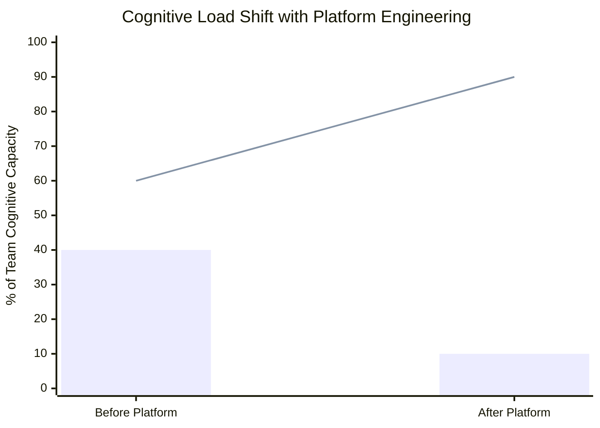

## Keywords in This File
{: .no_toc }

| # | Keyword | Weight |
|---|---|---|
| 1 | [Developer Experience](#developer-experience) | ★☆☆ |
| 2 | [Cognitive Load Reduction in Engineering](#cognitive-load-reduction-in-engineering) | ★☆☆ |
| 3 | [Platform as a Product](#platform-as-a-product) | ★☆☆ |

---

# Developer Experience

**Interview Weight:** ★☆☆ - Core platform engineering
outcome metric asked to verify understanding of
why platforms exist and how success is measured.

---

### 🎯 Model Answer

**30 seconds:**

> Developer Experience (DX) is the sum of all
> interactions an engineer has with tools, processes,
> and systems in their engineering environment - how
> easy, fast, and satisfying it is to build and
> deploy software. Good DX means: fast feedback
> loops (builds complete in minutes, not hours),
> self-service (no tickets for routine tasks), clear
> documentation (engineers find answers without
> asking colleagues), and low cognitive overhead
> (the tools stay out of the way). Platform engineering
> exists specifically to improve DX at scale.

**3 minutes:**

> Developer Experience is to internal tools what
> user experience (UX) is to customer-facing products.
> It encompasses everything that affects an engineer's
> ability to do their job effectively: the quality
> of local development tooling, the speed of CI/CD
> pipelines, the clarity of deployment workflows,
> the responsiveness of infrastructure provisioning,
> and the discoverability of services and documentation.
>
> The SPACE framework (GitHub, 2021) defines five
> dimensions of developer productivity: Satisfaction
> and well-being (are engineers satisfied with their
> environment?), Performance (does the output achieve
> its goals?), Activity (what are engineers doing?),
> Communication and collaboration (how do teams work
> together?), and Efficiency and flow (how much
> uninterrupted focus time do engineers have?). DX
> is the primary driver of the S and E dimensions.
>
> DORA metrics (deployment frequency, lead time for
> changes, change failure rate, time to restore service)
> are the outcome metrics that good DX enables. Teams
> with excellent DX deploy more frequently, with
> lower change failure rates, and recover faster from
> incidents.
>
> The non-obvious dimension: DX is not just about
> tooling speed. Cognitive load (how much mental
> overhead does the environment impose?), psychological
> safety (can engineers experiment without fear?),
> and documentation quality (can engineers find
> answers without interrupting colleagues?) are DX
> factors that are harder to measure but equally
> important.

**Blank Mind Recovery:**

**(1) Restate:** "What is developer experience -
let me describe it by what makes an engineer's
day frustrating vs. productive."

**(2) First principles:** "Engineers need to focus
on solving domain problems. Anything that forces
them to think about infrastructure, tooling, or
process instead of their domain problem is a DX
failure."

**(3) Bridge:** "Think of UX for developer tools.
A good user experience on a consumer app means
users can accomplish their goals without frustration.
A good developer experience means engineers can
deploy their code, provision resources, and observe
their services without frustration."

---

### 📘 Concept Explanation

**What it is:**

Developer Experience is the holistic quality of
a software engineer's interaction with their
engineering environment - tools, processes, systems,
and documentation. It encompasses: local development
setup time, CI/CD pipeline speed and reliability,
deployment workflow clarity, infrastructure provisioning
friction, documentation discoverability, and onboarding
time for new engineers.

**The problem it solves:**

Poor DX is an invisible productivity tax. Engineers
with slow CI/CD, complex deployment processes, and
undiscoverable documentation spend significant
fractions of their time on tooling frustration
rather than domain problem-solving. This reduces
output, increases burnout risk, and raises attrition
among high-performing engineers who have the most
options. Organizations that treat DX as a secondary
concern lose engineering velocity as they scale.

**How it works:**

```
DX MEASUREMENT FRAMEWORK (SPACE + DORA):

SPACE Framework (individual + team measures):
  S - Satisfaction: engineer NPS,
      "Would you recommend this env to a peer?"
  P - Performance: code review quality,
      customer satisfaction from features shipped
  A - Activity: PRs merged, deployments, reviews
  C - Communication: documentation contributions,
      knowledge sharing, collaboration quality
  E - Efficiency: focus time %, flow state
      frequency, context switches per day

DORA Metrics (delivery performance):
  Deployment frequency: how often deploys happen
  Lead time: commit to production time
  Change failure rate: % deploys causing incidents
  MTTR: time to restore service after incident

DX IMPACT ON DORA:
  Good DX -> Fast CI/CD -> More frequent deploys
  Self-service tools -> Low change failure rate
  Clear runbooks -> Fast MTTR
  Golden paths -> Fast lead time
```

**The key insight:**

DX is a business metric, not an engineer comfort
metric. Poor DX produces measurable business
consequences: slower feature delivery (reduced
competitive advantage), higher attrition of senior
engineers (loss of institutional knowledge), and
increased hiring costs (engineers talk - organizations
known for poor DX struggle to attract top talent).
The business case for platform engineering investment
is fundamentally a DX ROI argument.

**When to use it:**

Measure DX explicitly when: building the business
case for a platform team investment, defining
platform team success metrics, running quarterly
platform team effectiveness reviews, or conducting
post-mortems for major platform incidents that
affected developer productivity.

**When NOT to use it:**

Do not optimize DX at the expense of security
or compliance. "Fast" CI/CD that skips security
scanning is not good DX - it is technical debt
that will be paid as security incidents. The platform
team's job is to make security the easy path, not
to make it the optional path.

**Alternatives:**

- DORA metrics alone - outcome-focused without
  the input metrics (SPACE) that explain why
  outcomes are what they are
- Accelerate (Forsgren et al.) - the research
  foundation for DORA metrics with broader
  organizational context
- McKinsey Developer Velocity Index - commercial
  alternative to DORA/SPACE

**First-principles derivation:**

Engineering organizations exist to deliver software
that creates business value. The constraint on
delivery velocity is the sum of: (1) problem
complexity (irreducible), (2) cognitive overhead
from tooling and process (reducible), (3) waiting
time for infrastructure, review, or access (reducible).
Developer Experience improvement reduces (2) and
(3). The economic value of DX improvement is
directly proportional to the engineering headcount:
saving each of 100 engineers 4 hours per week
is 400 engineer-hours per week of recovered capacity.

---

### 💻 Code Example

*(Omit: Developer Experience is a measurement and
design discipline. The code artifacts in DX work
are surveys, dashboards, and tooling improvements.
Specific DX tool implementations (CI/CD pipelines,
golden paths, self-service CLIs) are covered in
dedicated keywords. A code example here would be
misleading about the nature of DX work.)*

---

### 🎓 Answers by Seniority

**Junior / Mid (0-5 years):**

> "Developer experience is the overall quality of
> an engineer's environment - how easy it is to
> build, test, and deploy. Good DX means: CI/CD runs
> in under 10 minutes, I can deploy without asking
> anyone, documentation is findable, and infrastructure
> is self-service. I measure it with DORA metrics
> (deployment frequency, lead time) and developer
> surveys. Platform engineering exists specifically
> to improve DX at scale by giving all teams the
> same high-quality tooling."

*Push deeper:* "The SPACE framework (Satisfaction,
Performance, Activity, Communication, Efficiency)
is a research-backed approach to measuring DX beyond
just DORA metrics. DORA measures delivery outcomes.
SPACE measures the engineer experience that produces
those outcomes."

---

**Senior / Staff (5+ years):**

> "Developer experience is the invisible multiplier
> on engineering productivity. Good DX does not just
> make engineers happier - it makes them measurably
> more productive. DORA research shows that organizations
> with elite DX (fast CI/CD, high deployment frequency,
> low change failure rate) ship 200x more frequently
> than low performers and recover 2,600x faster from
> incidents. These are business outcomes.
>
> The DX dimensions most platform teams underinvest
> in: cognitive load reduction (how much mental
> overhead does the tool impose?) and documentation
> discoverability (can engineers find the answer in
> under 2 minutes without asking a colleague?). Speed
> of CI/CD is easy to measure and improve. Cognitive
> load and documentation quality require different
> measurement approaches: developer time studies,
> quarterly DX surveys, and documentation usage
> analytics."

*Push deeper:* "At staff level, I add the DX impact
on talent acquisition and retention. Organizations
with strong DX cultures have lower attrition among
senior engineers and are mentioned positively in
engineering candidate communities (Glassdoor,
Twitter, engineering blogs). DX investment has
positive externalities that are hard to quantify
but real: better candidates choose to work there,
better engineers stay."

---

### ⚠️ Common Misconceptions

**Misconception: "DX is about making developers
happy, not about business outcomes."**

DX directly impacts business outcomes through
engineering velocity. A team with elite DX (per
DORA elite performers) deploys 200x more frequently
than a low-performing team. That velocity difference
translates directly into feature delivery speed,
competitive responsiveness, and product iteration
speed. Organizations that invest in DX because "we
want developers to be happy" are making the right
investment for the wrong reason. The right reason
is the ROI on engineering velocity.

---

**Misconception: "DX is the same as UX for
developers."**

DX includes UX (the interface design of developer
tools) but is broader. DX also includes: organizational
processes (how easy is it to get approval for a
deployment?), documentation quality (how quickly
can an engineer find the answer to a question?),
psychological safety (can engineers push a change
without fear of career consequences if it fails?),
and team collaboration effectiveness. UI design
is one component of DX, not the whole of it.

---

**Misconception: "High DX requires premium tooling
investments."**

The highest-impact DX improvements are often free:
better documentation, faster code review (a process
change), removing unnecessary approval gates, and
fixing flaky tests (reducing false alerts). Premium
tooling (Datadog, GitHub Copilot, cloud-native
CI/CD) can add DX value, but the highest-ROI DX
improvements usually involve removing friction
from existing tools rather than adding new ones.

---

### 🚨 Failure Modes and Diagnosis

**Failure: Platform team optimizes for their
own metrics, not DX**

*Symptom:* Platform team measures and reports
infrastructure uptime (99.9%), CI/CD pipeline
execution count, and CVE patch time. Stream engineers
report that the platform "slows us down" and "is
hard to use." Both statements are true simultaneously.

*Root cause:* Platform team set metrics for what
they can easily measure (infrastructure reliability)
rather than what their customers care about (DX).
The platform is technically excellent but experientially
poor.

*Diagnosis:* Run a quarterly DX survey. Ask stream
engineers: NPS (0-10: "How likely are you to
recommend this platform to a peer?"), "What one
thing would improve your daily development experience?"
Compare the responses against what the platform
team is working on.

*Fix:* Add DX metrics as primary OKRs for the
platform team: developer NPS target, time-to-first-
deployment target, percentage of infrastructure
requests resolved via self-service. Tie platform
team performance reviews to DX outcomes.

---

**Failure: DX survey shows CI/CD as top pain
point for 18 consecutive months**

*Symptom:* Quarterly DX survey shows "slow CI/CD"
as the number one complaint for 6 quarters. Platform
team has addressed CI/CD in each quarter's roadmap
but the complaint persists.

*Root cause:* Platform team is treating CI/CD
symptomatically (adding more runner capacity, fixing
flaky tests) rather than diagnosing root cause
(the test suite has grown to 30 minutes; the
parallelization strategy is inefficient; the build
cache is misconfigured). Surface-level fixes do
not address structural problems.

*Fix:* Run a CI/CD time audit. Sample 20 recent
pipeline runs. Segment time by phase (unit tests,
integration tests, build, scan, deploy). Identify
the two phases with the highest time contribution.
Address those phases structurally: parallelization
for test suites, caching improvements for builds.

---

### 🎯 Interview Deep-Dive

| Seniority | Time | Focus |
|---|---|---|
| Junior | 3 min | DX definition, DORA, SPACE |
| Mid | 6 min | DX measurement, platform team's role |
| Senior | 8 min | DX ROI, organizational impact |

---

**[JUNIOR] Q1 - [CONCEPTUAL] What is the SPACE
framework for developer productivity?**

SPACE is a developer productivity framework from
GitHub (Forsgren, Storey, et al., 2021) that defines
five dimensions of developer experience and
productivity.

Satisfaction and well-being: engineer satisfaction
with their environment, tools, culture, and career
progression. Measured via NPS surveys and attrition
rate. The "S" is often underweighted by engineering
leaders who focus exclusively on output metrics.

Performance: outcomes from engineering work - code
review quality, customer satisfaction, feature
reliability. Distinct from activity: a small number
of high-quality commits may indicate higher performance
than many low-quality commits.

Activity: what engineers are doing - commits, PRs,
code reviews, deployments, documentation contributions.
Useful as input data; misleading as the primary
measure.

Communication and collaboration: quality of team
interactions, documentation contributions, knowledge
sharing, and dependency coordination.

Efficiency and flow: uninterrupted focus time,
context switches per day, handoff delays, and
CI/CD wait times. Flow state (deep focus) is
correlated with both output quality and satisfaction.

*What separates good from great:* Understanding
that SPACE is not five separate metrics but five
lenses on the same underlying phenomenon. A team
with high Activity but low Satisfaction and
Efficiency is burning out.

---

**[MID] Q2 - [TRADE-OFF] How do you prioritize
DX improvements with limited platform team budget?**

Three-step prioritization process:

Step 1 - Pain frequency: run a DX survey and count
how many engineers cite each pain point. A pain
felt by 80% of engineers outweighs one felt by 10%.

Step 2 - Time impact: estimate how much engineering
time each pain point consumes weekly. A 20-minute
daily CI/CD wait affects 8% of an engineer's
productive time. A 30-minute quarterly Kubernetes
config review affects 0.1%.

Step 3 - Fix effort: estimate platform team effort
to address each pain point. Some fixes are 1-sprint
(fix flaky tests in CI); some are 6-month projects
(rebuild the deployment pipeline).

Prioritization matrix: highest frequency * highest
time impact / lowest fix effort. The top 3 items
in this matrix are the platform team's DX backlog.

Common high-value, low-effort improvements:
(1) Fixing flaky tests (top DX complaint, often
fixable with 2-4 weeks of effort). (2) Improving
CLI error messages (often 1-2 days of work, high
daily friction reduction). (3) Adding auto-complete
to the platform CLI (1-2 weeks, daily interaction
improvement).

*What separates good from great:* The frequency
* time / effort matrix. Most teams prioritize
intuitively; the matrix creates a defensible and
transparent prioritization that stakeholders can
review.

---

**[SENIOR] Q3 - [DEBUGGING] How do you run
a developer experience audit?**

A DX audit has four components: survey, observation,
measurement, and analysis.

Survey: quarterly 10-question DX survey sent to
all engineers. Key questions: NPS (0-10: "Would
you recommend our dev environment to a friend?"),
top three friction points (open-ended), and
comparison to previous employer ("Is our DX better
or worse than where you worked before?"). 30-40%
response rate is typical.

Observation: shadow a new engineer through their
first two weeks. Document every moment of confusion,
every time they asked a colleague for help, and
every tool that did not work as expected. The
onboarding experience is the DX worst case and
reveals the most pain points.

Measurement: instrument what can be measured.
CI/CD pipeline execution time by phase (from CI
system logs). Time-to-first-deployment for new
hires (from deployment records). Self-service
completion rate (how many infrastructure requests
are fulfilled without a platform team ticket?).

Analysis: correlate survey pain points with
measurement data. If "slow CI/CD" is the top survey
pain point and CI/CD time is 25 minutes P90, the
correlation confirms the measurement is the right
one to fix. If "complex deployments" is a pain
point but deployment lead time is under 15 minutes,
the complexity is the issue, not the speed.

*What separates good from great:* The observation
component (shadowing a new engineer). This reveals
pain points that engineers have normalized and
no longer report in surveys.

---

**[SENIOR] Q4 - [PRODUCTION] What is the DX
impact of flaky tests and how do you address it?**

Flaky tests - tests that fail intermittently
without code changes - have a disproportionate DX
impact because they affect every engineer, every
day, in the most time-sensitive part of their
workflow: CI/CD.

DX impact measurement: if a CI/CD pipeline has
a 15% flaky test rate (15% chance of a false
failure per run), engineers must manually re-run
the pipeline once every 6-7 runs. At 20 pipeline
runs per sprint, each engineer is manually re-running
3 times per sprint - approximately 45 minutes of
wasted context switching per sprint per engineer.
For 50 engineers: 37.5 engineer-hours per sprint
lost to flaky tests.

Root causes of flaky tests: race conditions in
async test code, infrastructure dependencies in
unit tests (network calls, real databases), test
isolation failures (tests depending on order of
execution), and time-based assertions (assertions
that fail if the system clock is slow).

The address strategy: (1) Implement a flaky test
quarantine: tests that fail more than 3 times in
5 runs without code changes are automatically
quarantined to a "flaky" suite and flagged for
investigation. They do not block CI. (2) Track
flaky test rate as a DX metric. Publish it weekly
to all teams. Teams own their test suites. (3)
Fix the highest-frequency flaky tests first:
80% of flakiness typically comes from 20% of
tests.

*What separates good from great:* The ROI calculation
(37.5 engineer-hours/sprint for 50 engineers) that
makes flaky tests a business case for investment
rather than a nuisance.

---

**[STAFF] Q5 - [ARCHITECTURE] How does DX
relate to engineering retention and hiring?**

DX has three talent dimensions: acquisition,
retention, and performance.

Acquisition: engineers evaluate their prospective
employer's DX in job interviews. "What does your
CI/CD pipeline look like?" and "How long does it
take to deploy a change?" are DX questions. Organizations
known for excellent DX (Netflix, Spotify, Shopify)
attract top candidates. Organizations known for
poor DX struggle to hire in competitive markets.

Retention: attrition analysis at high-quality
engineers typically finds DX frustration as a
contributing factor. "I was spending 40% of my
time fighting our tooling rather than solving
interesting problems" is a real exit interview
statement. DX improvement reduces attrition
especially at the senior end of the experience
spectrum - where options are plentiful and
tolerance for friction is low.

Performance: engineers in flow state (uninterrupted
focus time) produce significantly higher quality
output than engineers in constant context-switch
mode (responding to CI failures, ticket requests,
access provisioning). DX improvements that reduce
interruptions increase not just output quantity
but output quality.

The organizational argument: in a 100-engineer
organization, reducing senior engineer attrition
from 20% to 15% annually saves approximately 5
senior hires at $30-50K recruiting cost each plus
3-6 months of onboarding productivity loss per
hire. The DX investment ROI from retention alone
often exceeds the platform team's annual cost.

*What separates good from great:* The quantified
retention ROI. Most DX arguments stop at "engineers
are happier." The staff-level argument goes to
"what does 5% lower attrition cost to achieve
vs. what it saves in recruiting?"

---

**[MID] Q6 - [COMPARISON] How do DORA metrics
and SPACE complement each other?**

DORA metrics (deployment frequency, lead time,
change failure rate, MTTR) are outcome metrics -
they measure the result of the software delivery
process. They tell you how well the system is
performing but not why it is performing that way.

SPACE metrics are input metrics - they measure the
conditions that produce delivery outcomes. Low
deployment frequency (DORA) might be caused by
low efficiency and flow (SPACE: long CI/CD wait
times), low satisfaction (SPACE: engineers are
disengaged), or low collaboration (SPACE: PRs wait
days for review).

Used together: DORA tells you there is a problem.
SPACE tells you where to look for the cause. A
team with worsening deployment frequency (DORA)
and deteriorating efficiency scores (SPACE: context
switches increasing, focus time decreasing) has a
developer environment problem. A team with worsening
deployment frequency but stable SPACE scores has
a testing strategy or release process problem.

The platform team's role: DORA metrics are the
ultimate measure of platform team effectiveness.
SPACE metrics are the diagnostic tool that explains
why DORA metrics are what they are and guides
which platform improvements to prioritize.

*What separates good from great:* DORA = outcome,
SPACE = input, and knowing that you need both to
diagnose and fix DX problems.

---

**[JUNIOR] Q7 - [TRADE-OFF] What is the biggest
DX improvement most platform teams overlook?**

Documentation discoverability. Most platform teams
invest heavily in tooling (CI/CD, golden paths,
self-service) and significantly underinvest in
documentation quality and discoverability.

The typical documentation failure mode: excellent
reference documentation (API docs, runbooks) that
is spread across a Confluence wiki, a README in
GitHub, a Notion workspace, and a Backstage TechDocs
page. An engineer who needs to know how to rotate
a secret must search four places.

The DX impact: every minute an engineer spends
searching for documentation is a minute not spent
on their domain problem. For 100 engineers each
spending an average of 30 minutes per day looking
for information that should be findable in under
2 minutes, this is 50 engineer-hours per day of
wasted capacity.

The fix: a single source of truth for developer
documentation (Backstage TechDocs is the platform
engineering standard). All platform documentation
lives there. Service documentation lives in the
service catalog co-located with the service. Search
is federated. This is a documentation architecture
decision, not a content writing decision.

*What separates good from great:* Quantifying the
documentation search time cost and proposing a
specific structural fix (single source of truth)
rather than "write better docs."

---

---

# Cognitive Load Reduction in Engineering

**Interview Weight:** ★☆☆ - Key platform engineering
principle from Team Topologies, asked to assess
understanding of why platforms reduce complexity.

---

### 🎯 Model Answer

**30 seconds:**

> Cognitive load in engineering is the total mental
> effort required to do a job effectively. Team
> Topologies distinguishes three types: intrinsic
> (the inherent complexity of the domain), extraneous
> (accidental complexity from tools and processes),
> and germane (complexity that builds expertise).
> Platform engineering reduces extraneous cognitive
> load - the overhead of infrastructure configuration,
> deployment processes, and tooling management that
> is unrelated to the team's core domain. This frees
> engineers to apply their cognitive capacity to
> domain problems rather than infrastructure problems.

**3 minutes:**

> The cognitive load concept in software engineering
> comes from educational psychology (John Sweller,
> 1988) applied to team design by Matthew Skelton
> and Manuel Pais in Team Topologies. The key insight:
> human working memory has a finite capacity. Every
> unit of cognitive load consumed by extraneous
> concerns (infrastructure, tooling, process) is
> unavailable for domain reasoning.
>
> For software teams, the three types map to: intrinsic
> load (understanding the domain - payments business
> logic, fraud detection algorithms, authentication
> protocols), extraneous load (understanding the tools
> - Kubernetes configuration, Terraform modules,
> CI/CD pipeline syntax, secrets rotation procedures),
> and germane load (building expertise that transfers
> - design patterns, distributed systems principles,
> data modeling skills).
>
> Platform engineering specifically targets extraneous
> cognitive load reduction. When a platform team
> builds a golden path, they absorb the cognitive
> load of "how do I configure a Kubernetes deployment
> with the right security context, resource limits,
> and health checks?" into a template. Stream engineers
> no longer need to hold this knowledge in their
> working memory. They activate the golden path and
> the correct configuration is generated.
>
> The implication for team size: Team Topologies
> recommends that teams be sized to handle a cognitive
> load they can master. A team responsible for both
> a complex product domain AND all their own
> infrastructure is cognitively overloaded. The platform
> team absorbs the infrastructure load so the product
> team can focus on the domain load.

**Blank Mind Recovery:**

**(1) Restate:** "What is cognitive load reduction
in platform engineering - let me explain it from
the perspective of what slows engineers down."

**(2) First principles:** "Human working memory is
limited. Every thing an engineer must think about
that is not their core domain is cognitive overhead.
The platform's job is to remove that overhead."

**(3) Bridge:** "Think of a professional chef: they
could cut their own food, but they have a prep
cook for that. Cognitive load reduction is about
having the right people or tools handle the prep
work so experts can focus on the skilled work."

---

### 📘 Concept Explanation

**What it is:**

Cognitive load reduction is the systematic elimination
of mental overhead in engineering environments by
removing accidental complexity (extraneous cognitive
load) from product teams and absorbing it into
platform products, enabling engineers to focus
cognitive capacity on their core domain.

**The problem it solves:**

Product teams in organizations without effective
platforms carry cognitive load across two distinct
domains simultaneously: their product domain (the
business logic they are hired to implement) and
their infrastructure domain (Kubernetes, Terraform,
CI/CD, secrets, observability). This split attention
reduces the quality and velocity of product work
and increases burnout risk among engineers who
cannot achieve flow state in their core domain.

**How it works:**

```
THREE TYPES OF COGNITIVE LOAD:

Intrinsic load (unavoidable domain complexity):
  Payments team: fraud detection algorithms,
  regulatory compliance, financial data modeling
  -> Cannot be reduced; must be mastered

Extraneous load (accidental tool/process complexity):
  Payments team: K8s YAML syntax, Terraform modules,
  CI/CD pipeline configuration, secrets rotation
  -> Can be reduced by platform team

Germane load (expertise that builds mastery):
  Payments team: distributed transaction patterns,
  event-driven architecture, SRE practices
  -> Should be increased; builds long-term capability

PLATFORM ENGINEERING IMPACT:
  Extraneous load (infrastructure ops)
    Before platform: HIGH (team configures everything)
    After platform: LOW (golden path handles it)

  Cognitive capacity available for domain work:
    Before platform: 60% (40% on infrastructure)
    After platform: 85-90% (10-15% on infrastructure)
```



> **Diagram walkthrough:** The bar series shows
> extraneous cognitive load (infrastructure overhead)
> dropping from 40% to 10% when a platform team
> absorbs infrastructure complexity. The line series
> shows domain cognitive capacity increasing from
> 60% to 90%. The 30-percentage-point shift represents
> the cognitive capacity freed by a well-designed
> platform. For a 10-engineer team, this is equivalent
> to 3 extra engineers focused on domain work -
> without hiring.

**The key insight:**

Cognitive load is not distributed equally across
experience levels. Junior engineers carry higher
cognitive load for the same infrastructure tasks
because they lack the pattern recognition that
makes those tasks fast for senior engineers. When
a platform team absorbs infrastructure cognitive
load via golden paths and self-service, junior
engineers benefit disproportionately: their
effective domain contribution increases more than
senior engineers' does. This makes organizations
more effective at leveraging junior talent.

**When to use it:**

Use cognitive load as the primary framework when:
scoping a platform team's responsibility boundaries,
justifying platform investment to leadership,
designing golden path abstractions (how much
infrastructure knowledge should a developer need
to use this?), and assessing team topology changes.

**When NOT to use it:**

Do not use cognitive load reduction as a justification
for over-abstraction. A golden path that hides all
infrastructure details creates engineers who cannot
diagnose production issues when the abstraction
breaks. Some domain-specific infrastructure knowledge
is valuable germane cognitive load (worth building)
not extraneous cognitive load (worth eliminating).

**Alternatives:**

- DORA metrics - outcome-focused proxy for cognitive
  load effects on delivery velocity
- Developer survey data - direct measurement of
  perceived cognitive load
- Time tracking studies - behavioral measurement
  of time allocation by cognitive domain

**First-principles derivation:**

Given that human working memory capacity is finite
and that software engineering requires simultaneous
mastery of multiple knowledge domains (product
domain + infrastructure domain + process domain),
teams that must span too many domains will either
deepen in none (shallow generalists) or burn out
high performers who compensate for others. Reducing
cognitive load per team by specializing knowledge
(platform team owns infrastructure domain knowledge;
product teams own product domain knowledge) allows
each team to deepen in their domain. This is the
economic argument for specialization applied to
cognitive work.

---

### 💻 Code Example

*(Omit: Cognitive Load Reduction in Engineering is
an organizational design and platform principles
keyword. The implementation artifacts (golden paths,
self-service tools) are covered in separate keywords.
A code example here would conflate the principle
with its implementation.)*

---

### 🎓 Answers by Seniority

**Junior / Mid (0-5 years):**

> "Cognitive load is the mental overhead of engineering
> work. Team Topologies identifies three types:
> intrinsic (the unavoidable complexity of your
> domain), extraneous (the overhead from tools and
> processes that aren't your core job), and germane
> (the complexity that builds useful expertise).
> Platform engineering reduces extraneous cognitive
> load: by providing golden paths and self-service
> tools, the platform team absorbs the infrastructure
> configuration work so product teams can focus on
> their domain problems."

*Push deeper:* "The practical implication: teams
should be sized so their cognitive load matches
what a well-staffed team of 5-8 can master. When
a team is responsible for their product domain
AND all their own infrastructure, the total cognitive
load often exceeds what that team can handle well.
The platform team reduces this by absorbing the
infrastructure portion."

---

**Senior / Staff (5+ years):**

> "Cognitive load is the design constraint that Team
> Topologies centers the entire framework around.
> When scoping a platform team's responsibilities,
> I ask: what is the maximum cognitive load this
> team can master without sacrificing quality in
> any domain? For a 5-person platform team responsible
> for Kubernetes cluster management, CI/CD infrastructure,
> secrets management, and developer portal maintenance,
> the cognitive load is high. Adding a fifth domain
> (say, cost management tooling) may push the team
> past the threshold where quality suffers across
> all domains.
>
> The practical outcome of exceeding cognitive load:
> the team starts producing shallow work across many
> domains rather than deep work in fewer domains.
> Security vulnerabilities appear in platform products.
> Documentation falls behind. Incidents increase.
> These are all cognitive load overflow symptoms.
>
> The inverse: a platform team that scopes tightly
> (owns only CI/CD infrastructure and nothing else)
> can go deep. Excellent documentation, comprehensive
> runbooks, proactive monitoring, and rapid improvement
> cycles. The reduction in scope produces a quality
> improvement that more than compensates for the
> narrower coverage."

*Push deeper:* "At staff level, I use cognitive load
as the primary criterion for splitting or merging
platform capabilities. When a single team owns
too much (over 3-4 distinct infrastructure domains),
I look for a natural split: can the observability
platform become a standalone service owned by a
small team? Can secrets management be delegated
to a cloud provider managed service, reducing the
platform team's ownership surface? The goal is
to keep each team's cognitive load within bounds
that enable deep expertise."

---

### ⚠️ Common Misconceptions

**Misconception: "All cognitive load reduction
is good - the more abstraction, the better."**

Over-abstraction creates its own cognitive load:
the load of understanding what the abstraction
does, diagnosing failures in the abstraction layer,
and working around the abstraction when it does
not support a needed use case. The optimal
abstraction level is the one that eliminates
extraneous load while preserving enough transparency
for engineers to diagnose failures in their domain.
A completely opaque golden path is a black box
that engineers cannot debug in production.

---

**Misconception: "Junior engineers don't need to
understand infrastructure if the platform handles it."**

Engineers who understand nothing about the infrastructure
their code runs on cannot diagnose production issues
when the abstraction breaks. The goal is to reduce
the cognitive load of routine infrastructure tasks
(configuring a deployment, setting up CI/CD), not
to eliminate infrastructure literacy entirely.
Senior engineers should be able to read a Kubernetes
manifest and understand its implications. Junior
engineers should understand what a container is
and why resource limits matter. The platform reduces
the load of creating and managing this infrastructure,
not the load of understanding it at a basic level.

---

**Misconception: "Cognitive load can be measured
precisely."**

Cognitive load is difficult to measure directly.
Proxy metrics include: developer survey responses
("I understand my responsibilities clearly" 1-10),
time allocation studies (what fraction of sprint
work is infrastructure vs. domain?), help requests
(how often do engineers ask colleagues for help
with tooling vs. domain problems?), and incident
counts related to infrastructure misconfiguration.
These proxies provide directional signal, not
precise measurement. Managing cognitive load requires
qualitative judgment alongside quantitative proxies.

---

### 🚨 Failure Modes and Diagnosis

**Failure: Platform abstracts too much - engineers
cannot debug production issues**

*Symptom:* Production incident involves a database
connection pool exhaustion. Stream engineers cannot
identify the root cause because the database was
provisioned via Crossplane and the connection string
is injected via External Secrets Operator. Engineers
do not know which RDS instance is their database
or how to connect to it for emergency diagnostics.

*Root cause:* The platform reduced extraneous
cognitive load to zero by hiding all infrastructure
details. Engineers cannot debug what they cannot
see.

*Fix:* The golden path must include a "break glass"
emergency access procedure. Every self-service
database comes with: the RDS instance name (accessible
via `kubectl describe` on the claim), the namespace
secret with connection details, and a runbook link
showing how to connect via the platform bastion host
for emergency diagnostics. Reduce routine cognitive
load; preserve emergency access.

---

**Failure: Platform team scope exceeds cognitive
load capacity**

*Symptom:* Platform team owns: Kubernetes cluster
management, CI/CD infrastructure, secrets management,
developer portal (Backstage with 20 plugins),
observability platform (Prometheus, Grafana, Loki),
and cost management tooling. Six distinct domains.
Quality is declining across all areas: security
scanner finds issues in platform products, runbooks
are outdated, Backstage plugins are breaking on
new Backstage versions.

*Root cause:* Platform team scope expanded without
headcount growth. Six domains exceed the cognitive
load capacity of a team of 4 engineers.

*Diagnosis:* Count the domains and the per-domain
maintenance burden. Calculate weekly hours available
per domain: 4 engineers * 35 productive hours -
meetings = ~100 hours / 6 domains = 17 hours per
domain per week. For a complex domain like Kubernetes
cluster management, 17 hours per week is insufficient
to maintain quality.

*Fix:* Scope reduction. Identify which domains
have well-defined operational runbooks that can
be handled as steady-state maintenance vs. which
require ongoing innovation. Move the highest-
complexity steady-state domain (Kubernetes cluster
management) to a managed service (EKS, GKE). This
reduces the platform team's cognitive load while
maintaining the capability for stream teams.

---

### 🎯 Interview Deep-Dive

| Seniority | Time | Focus |
|---|---|---|
| Junior | 3 min | Three types, platform's role |
| Mid | 6 min | Measuring, scoping teams |
| Senior | 8 min | Org design, over-abstraction risks |

---

**[JUNIOR] Q1 - [CONCEPTUAL] What are the three
types of cognitive load in Team Topologies?**

Intrinsic cognitive load: the inherent, unavoidable
complexity of the domain a team is responsible for.
A payments team has intrinsic load from: financial
regulations, fraud detection complexity, real-time
transaction processing, and payment network
protocols. This cannot be reduced - it is the
team's reason for existing. The team must master it.

Extraneous cognitive load: accidental complexity
imposed by the environment, tools, and processes
rather than the domain itself. For a payments team:
Kubernetes YAML configuration, Terraform module
maintenance, CI/CD pipeline debugging, secrets
rotation procedures. This is unrelated to payments
and is therefore waste. Platform engineering targets
this type specifically.

Germane cognitive load: complexity that builds
long-term expertise and transfers across domains.
For a payments team: distributed systems patterns,
event-driven architecture, SRE methodology. This
is productive cognitive load - worth increasing,
not reducing.

The platform team's goal: reduce extraneous load
(absorb infrastructure complexity into golden paths
and self-service) to free cognitive capacity for
intrinsic load (domain expertise) and germane load
(transferable expertise).

*What separates good from great:* Mapping each type
to a concrete example from a specific team's reality
(payments team examples above). Abstract definitions
without concrete mapping are weaker answers.

---

**[MID] Q2 - [TRADE-OFF] How do you decide
the right abstraction level for a platform tool?**

The abstraction level decision has two failure modes:
too low (extraneous load not reduced) and too high
(transparency lost, debugging impossible).

Too low: a platform tool that requires engineers
to understand Terraform module internals to use it
has not reduced cognitive load - it has added an
API layer over Terraform without removing the
underlying complexity.

Too high: a platform tool that completely hides
the infrastructure it creates cannot be debugged
when it fails. If engineers do not know which
cloud resources back their Crossplane claim, they
cannot diagnose connectivity issues or performance
problems.

The target abstraction level: engineers can use
the tool without understanding the implementation,
but they can discover the implementation when they
need to debug it. Concretely: a developer should
be able to submit a database claim without knowing
Terraform. But when the database has a performance
issue, they should be able to `kubectl describe`
the claim, see the RDS instance name, and connect
directly for diagnostics.

"Convention over configuration with escape hatches"
is the principle: the default should be a no-
configuration experience that just works. Escape
hatches for the 5% of cases where the defaults
are wrong.

*What separates good from great:* The "escape hatch"
concept. Over-abstracted platforms without escape
hatches fail the 5% of non-standard use cases and
lose the trust of the engineers with those cases.

---

**[SENIOR] Q3 - [ARCHITECTURE] How do you scope
a platform team to stay within cognitive load bounds?**

Platform team scoping uses a four-step process:

Step 1 - Inventory: list all the platform team's
current responsibilities by domain. CI/CD infrastructure,
secrets management, Kubernetes cluster management,
developer portal, observability platform, cost
management, security scanning. Each domain is a
distinct cognitive domain.

Step 2 - Depth assessment: for each domain, rate
depth of current knowledge: expert (the team can
respond to any incident in this domain within SLA),
intermediate (the team can handle routine issues
but escalates complex problems), or shallow (the
team is maintaining without deeply understanding).

Step 3 - Load calculation: a platform team of 5
engineers with 4 domains can achieve expert depth
in all 4. With 7 domains, some domains will be
intermediate or shallow. Shallow domains have higher
incident rates and slower recovery.

Step 4 - Scope reduction: for domains where depth
is insufficient, evaluate: (a) can this be handled
as a managed service (EKS instead of self-managed
K8s)?, (b) can this be delegated to an enabling
team?, or (c) does this need a dedicated sub-team?

The target: every domain the platform team owns
at expert depth. This ensures that incidents in
platform products are resolved quickly and quality
is maintained.

*What separates good from great:* The explicit depth
rating and the "scope reduction via managed service"
option. Many platform teams grow their scope without
growing their depth budget.

---

**[MID] Q4 - [DEBUGGING] How do you diagnose whether
a team is experiencing cognitive overload?**

Four observable symptoms of team cognitive overload:

Incident rate increase: teams experiencing cognitive
overload begin making configuration errors under
pressure. Incidents caused by team-made errors
(not external failures) increase. Review the last
10 incidents: what fraction were caused by team
mistakes vs. external factors?

Quality degradation: code review quality decreases.
PRs with obvious issues are approved without comment.
Documentation is not updated. Tests are written
without edge case coverage. These are symptoms of
insufficient cognitive capacity for quality work.

Context switch signatures: team members are pulled
in multiple directions simultaneously. Calendar
analysis shows engineers in 5+ different project
streams per week. Slack shows engineers answering
questions in 4+ channels simultaneously.

Escalation rate to team lead: team members escalate
decisions that they would normally handle
independently. "Should I do X or Y?" questions
that the engineer should be able to answer
themselves increase, indicating they do not have
the cognitive bandwidth to reason through decisions.

*What separates good from great:* The escalation
rate as a cognitive overload signal. Most diagnoses
focus on external symptoms (incidents, quality).
The escalation rate is an internal signal that
reveals overload earlier.

---

**[SENIOR] Q5 - [PRODUCTION] How does cognitive
load reduction connect to security posture?**

The connection is counterintuitive: reducing
cognitive load improves security posture because
security failures are most often cognitive failures.

Security misconfigurations happen when engineers
carry too much configuration responsibility. An
engineer who must remember to: enable encryption
at rest, configure the right security group rules,
set appropriate IAM permissions, enable audit logging,
and rotate credentials - will eventually miss one
of these under deadline pressure or cognitive load.

Golden paths and self-service infrastructure reduce
this by embedding correct security configuration
into the automation. The developer does not need
to think about encryption because the Crossplane
composition enables it by default. The correct
security group rules are in the composition, not
in the developer's memory.

The CISO argument for platform engineering: "Your
organization currently relies on individual engineer
judgment for security configuration on every
service. Individual judgment under cognitive load
is the root cause of most security incidents.
Platform engineering replaces individual judgment
with automated enforcement. This reduces your
attack surface proportional to how many engineers
you have."

*What separates good from great:* Framing platform
engineering as a security risk reduction mechanism,
not just a velocity improvement. This is the CISO
buy-in argument.

---

**[JUNIOR] Q6 - [COMPARISON] How is cognitive
load reduction different from "making things simple"?**

"Making things simple" is often achieved by hiding
complexity, which can move cognitive load from one
place to another rather than eliminating it. A
completely hidden infrastructure system is "simple"
to use but imposes high cognitive load when it
breaks (engineers must debug a system they don't
understand).

Cognitive load reduction is specific: target extraneous
load (accidental complexity), reduce it, and preserve
enough transparency for engineers to diagnose failures
in their domain. The question is not "is this simple?"
but "does this reduce cognitive load for the target
engineer relative to the alternative, without
making debugging significantly harder?"

A concrete distinction: a bash script that runs a
10-step deployment is "simple" (one command) but
may increase cognitive load (what is the script
doing? which steps can fail? how do I debug a
failure?). A well-designed Kubernetes deployment
that makes all steps visible in kubectl events is
more "complex" (more syntax) but lower cognitive
load (all state is inspectable, all failures are
logged, all steps are documented).

*What separates good from great:* The "simple hiding
complexity vs. cognitive load reduction" distinction.
This is a nuanced point that reveals understanding
of when simplification helps and when it hurts.

---

**[JUNIOR] Q7 - [PRODUCTION] What team size
does Team Topologies recommend to manage
cognitive load?**

Team Topologies (following research by Dunbar and
others) recommends a team size of 5-9 engineers
for most software teams. This range balances:

Cognitive load management: larger teams take on
more scope (adding cognitive load per person) and
develop more complex communication overhead
(cognitive load from coordination). Smaller teams
have lighter cognitive load per person but also
smaller domain scope.

Communication effectiveness: teams of 5-9 maintain
sufficient direct communication without a management
layer. Above 9, subgroups emerge and communication
formality increases.

The "two pizza rule" (Amazon) approximates the same
range (6-8 people fed by two pizzas).

For platform teams specifically: Team Topologies
recommends sizing the platform team to the cognitive
load of the platform products it maintains. A team
responsible for 3 distinct platform domains needs
at least 2 engineers per domain (6 total) to maintain
depth in each. Adding a fourth domain without adding
headcount creates cognitive overload.

*What separates good from great:* The cognitive
load connection to team size rather than just citing
"5-9 people." The reasoning (cognitive load per
person increases with scope; 5-9 balances load
and communication) is the important part.

---

---

# Platform as a Product

**Interview Weight:** ★☆☆ - Core organizational
principle distinguishing successful platform teams
from failed ones, asked to test product mindset.

---

### 🎯 Model Answer

**30 seconds:**

> Platform as a Product means treating the Internal
> Developer Platform like a commercial product:
> running user research to understand what developers
> actually need, maintaining a product roadmap
> prioritized by developer pain, shipping iteratively
> with feedback loops, measuring adoption and NPS,
> and providing a versioned API with migration support.
> The platform team has customers (stream-aligned
> engineers) and measures success by customer outcomes
> (developer productivity) rather than infrastructure
> metrics (uptime, pipeline count).

**3 minutes:**

> The "Platform as a Product" principle is the single
> most differentiating factor between platform teams
> that achieve high adoption and those that build
> technically excellent infrastructure nobody uses.
>
> The product management practices that transfer
> from external products to internal platforms:
> customer discovery (user interviews before building,
> not after), roadmap visibility (the platform team
> publishes its roadmap and stream engineers know
> what is coming), versioning and deprecation (IDP
> APIs are versioned like public APIs, with migration
> guides and deprecation notice periods), and success
> metrics (adoption rate, developer NPS, time-to-
> first-deployment - not infrastructure uptime alone).
>
> The platform team structure that enables this:
> a product manager who owns the roadmap and runs
> user research, while platform engineers focus on
> building. Without a PM, platform engineers default
> to building what is technically interesting rather
> than what developers need.
>
> The organizational enabler: stream-aligned engineers
> are customers of the platform team. They have the
> right to provide feedback and influence the roadmap.
> The platform team has the obligation to listen.
> This is the same customer relationship a product
> team has with its external users.

**Blank Mind Recovery:**

**(1) Restate:** "Platform as a Product - let me
explain this by contrasting a platform team that
acts like a product team vs one that doesn't."

**(2) First principles:** "Every team that delivers
value to customers needs to understand those
customers, build what they need, measure whether
it works, and iterate. A platform team's customers
are engineers. The same principles apply."

**(3) Bridge:** "Think of AWS as a product. AWS
has product managers, user research, versioned APIs,
roadmaps, and customer support. An internal platform
team is building the internal equivalent. The same
product management discipline applies."

---

### 📘 Concept Explanation

**What it is:**

A philosophy and set of practices that applies
external product management methodology to internal
developer platform teams. The platform team treats
stream-aligned engineers as paying customers: runs
customer discovery, maintains a prioritized roadmap,
ships iteratively, measures adoption and satisfaction,
and provides versioned APIs with proper deprecation
policies.

**The problem it solves:**

Platform teams staffed exclusively with infrastructure
engineers default to building what they know (excellent
infrastructure) rather than what their customers
need (excellent developer experience). This produces
platforms that are technically impressive but have
low adoption and fail to deliver the developer
productivity improvements they were built to create.
The Product mindset shift corrects this.

**How it works:**

```
PLATFORM PRODUCT MANAGEMENT CYCLE:

1. DISCOVER (quarterly)
   User interviews: "What slowed you down this sprint?"
   Surveys: developer NPS, pain point rankings
   Analytics: portal usage, golden path adoption,
   self-service completion rates

2. DEFINE (sprint planning)
   Roadmap update: prioritize by pain severity
   OKR alignment: platform OKRs = developer outcome
   Acceptance criteria: "stream team can do X
   without contacting platform team"

3. BUILD (sprint execution)
   Platform engineers build the roadmap items
   Product manager ensures engineer decisions
   stay customer-focused

4. SHIP (continuous)
   Release notes communicated to stream engineers
   Migration guides for breaking changes
   Opt-in beta for new capabilities
   Documentation first, then code

5. MEASURE (weekly)
   Adoption metrics dashboard
   Support request volume (lower = better DX)
   Developer NPS trend
   DORA metric trends for adopters vs non-adopters

6. ITERATE
   Feedback from stream teams drives next sprint
   Non-adopted features are diagnosed and fixed
   Deprecated features are sunset with notice
```

**The key insight:**

The platform team's primary deliverable is not
infrastructure code - it is developer behavior change.
A platform team that builds an excellent CI/CD
golden path but achieves 20% adoption has delivered
20% of its potential value. The remaining 80% of
value is blocked by adoption, not by technical
capability. Product management (user research,
adoption strategy, migration support) is what
unlocks that remaining 80%.

**When to use it:**

Apply product management practices from the first
day of a platform team's existence, not after the
first version of the platform has been built with
no adoption. The product discovery cycle (user
interviews, pain ranking) is the first step, before
any infrastructure is designed. The platform team
that skips discovery will build for itself, not
for its customers.

**When NOT to use it:**

Do not apply full commercial product management
overhead to every internal tool. A 2-person team
that builds a deployment script does not need a
product manager. Platform as a Product is the
right model when the platform team is serving 10+
teams and the adoption and migration management
complexity justifies the PM function.

**Alternatives:**

- Inner source model - community contribution
  model; less product management but more
  community-driven
- Platform engineering lite - small team with
  no PM; works to 20 teams
- Commercial IDP products - the vendor manages
  the product lifecycle; less flexibility

**First-principles derivation:**

A platform team that does not understand its customers
will build for the wrong use cases. Customer
understanding requires customer research - the
same activity that external product teams do.
A platform team that does not measure adoption
cannot know whether it is delivering value. Adoption
measurement requires product analytics. A platform
team that makes breaking changes without migration
support will lose trust and reduce adoption. API
lifecycle management requires product process.
Each product management practice exists because
without it, a specific and predictable failure mode
occurs.

---

### 💻 Code Example

*(Omit: Platform as a Product is an organizational
philosophy and management discipline. Its artifacts
are product documents (roadmaps, OKRs, user interview
notes) and process practices (discovery cycles,
adoption reviews), not code. Specific platform
product implementations are covered in dedicated
L1/L2 keywords.)*

---

### 🎓 Answers by Seniority

**Junior / Mid (0-5 years):**

> "Platform as a Product means treating the internal
> platform like a commercial product. The platform
> team has customers (stream-aligned engineers),
> a product roadmap prioritized by customer needs,
> adoption metrics to measure success, and a product
> manager who runs user research. Instead of building
> what seems technically interesting, the platform
> team builds what developers actually need based
> on interviews and surveys. Success is measured
> by developer NPS and adoption rate, not just
> infrastructure uptime."

*Push deeper:* "The structural requirement: the
Platform as a Product approach needs a dedicated
product manager, not just engineers. Without a PM
who runs discovery cycles and maintains the roadmap,
engineers default to technical interests. At 15+
stream teams, the PM function is essential."

---

**Senior / Staff (5+ years):**

> "Platform as a Product is the most important mindset
> for a platform team to develop. A platform team
> without product management discipline will build
> technically excellent infrastructure with low
> adoption - the most common and expensive platform
> failure mode.
>
> The three product practices that matter most for
> platform teams: (1) Discovery before building -
> run user interviews before writing a line of code
> to validate that you are solving the right problem.
> (2) Adoption as the primary metric - a golden path
> with 80% adoption is worth more than 20 golden
> paths with 10% adoption each. (3) API lifecycle
> management - version all IDP interfaces, provide
> migration guides for breaking changes, and enforce
> deprecation policies with minimum 90-day notice.
>
> The hardest cultural shift: infrastructure engineers
> are trained to optimize for technical correctness.
> Product engineers are trained to optimize for
> adoption. A platform team that makes technically
> correct choices that developers refuse to use
> has failed at its mission. The team needs to
> internalize adoption as the success criterion."

*Push deeper:* "At staff level, I add the feedback
loop design. The platform team needs a structured
mechanism to hear from its customers: a monthly
platform engineering office hours (stream engineers
bring problems), a quarterly DX survey with
aggregated results published back to all engineers,
and a public GitHub Issues tracker for the platform
so engineers can see and vote on feature requests.
Without these mechanisms, the platform team operates
in an information vacuum."

---

### ⚠️ Common Misconceptions

**Misconception: "Platform as a Product means
the platform team must satisfy every request."**

Product teams do not implement every customer
request - they implement the requests that best
serve the most customers in alignment with the
product vision. A platform team with good product
discipline prioritizes high-frequency, high-severity
pain points above niche requirements. Declining
a request that serves 1 of 30 teams while working
on a feature that serves 28 of 30 teams is the
correct product decision. The mechanism: a public
roadmap with voting, so declined requests have
visibility rather than disappearing into a ticket
queue.

---

**Misconception: "Platform as a Product requires
a formal product manager from day one."**

The product management practices (user research,
roadmap, adoption measurement) can be run by a
senior platform engineer with product orientation
for the first 10-15 stream teams. The formal product
manager role becomes necessary at 15-20 teams,
when the volume of user research, stakeholder
communication, and roadmap management exceeds what
an engineer can do alongside building. This is
a team scaling decision, not a prerequisite.

---

**Misconception: "Developer NPS is too subjective
to be a real platform metric."**

NPS (Net Promoter Score) is a widely validated
predictor of customer behavior in commercial
products. Applied to internal platforms, it predicts
adoption and word-of-mouth recommendation among
engineers. A developer NPS of 40+ indicates strong
advocates who will onboard their teams to the
platform voluntarily. A developer NPS below 0
indicates detractors who are actively steering
colleagues away from the platform. These are
actionable signals, not just sentiment data.

---

### 🚨 Failure Modes and Diagnosis

**Failure: Platform team ships features with no
user research**

*Symptom:* Platform team ships a new "self-service
namespace provisioning" feature after 3 months of
development. Stream engineers do not use it.
Investigation reveals that teams already have a
working namespace provisioning script that the
platform team did not know about.

*Root cause:* No user research before building.
The platform team built a solution to a problem
that stream teams had already solved themselves.
The platform feature was redundant from day one.

*Diagnosis:* Review the platform team's development
process. Was there a discovery phase? Were stream
engineers interviewed before the feature was
designed? Were existing solutions inventoried?

*Fix:* Implement a mandatory discovery phase for
any platform feature taking more than 1 sprint
to build. Minimum 5 user interviews, existing
solution inventory, and adoption projection before
design begins.

---

**Failure: Platform API breaks stream team
workflows without notice**

*Symptom:* Platform team updates the CI/CD pipeline
template to use a new secrets integration method.
15 stream teams experience broken builds on Monday
morning. Slack fills with incident reports. Platform
team trust score drops sharply in the quarterly survey.

*Root cause:* No API versioning, no migration guide,
no deprecation notice. The platform team treated
the pipeline template as internal infrastructure
rather than a customer-facing API.

*Diagnosis:* Check the platform team's change
management process. Was the change announced? Was
a migration window given? Were stream teams tested
before rollout?

*Fix:* Implement API versioning for all platform
products. The pipeline template becomes `pipeline-
v1.yml` and `pipeline-v2.yml`. Stream teams
migrate to v2 with a migration guide and a 90-day
window. Announcements in engineering all-hands
Slack 90 days before v1 is deprecated.

---

### 🎯 Interview Deep-Dive

| Seniority | Time | Focus |
|---|---|---|
| Junior | 3 min | What Platform as a Product means |
| Mid | 6 min | Product practices, PM role, metrics |
| Senior | 8 min | Adoption strategy, API lifecycle, failure modes |

---

**[JUNIOR] Q1 - [CONCEPTUAL] What product management
practices transfer to internal platforms?**

Five core product management practices transfer
directly.

Customer discovery: user interviews with stream-
aligned engineers before building platform features.
"What slowed you down this sprint?" is the core
discovery question. At least 5 interviews before
designing any new platform capability.

Roadmap management: a prioritized list of platform
work in progress and planned, visible to all engineers.
Stream teams can see what the platform team is
working on and request additions. The roadmap is
prioritized by developer pain severity, not by
technical interest.

Adoption measurement: platform features are not
done when they ship - they are done when they
achieve target adoption. A golden path at 30%
adoption has not delivered its value. The platform
team owns driving adoption from 30% to 80%.

NPS measurement: quarterly developer NPS survey
that provides the primary satisfaction signal.
Trends over time tell the platform team whether
its improvements are landing.

API lifecycle management: versioned APIs with
migration guides and deprecation notice periods.
Platform interfaces are treated like public APIs
- breaking changes require migration support, not
silent updates.

*What separates good from great:* Including adoption
measurement as a product practice (not just building
features) and explaining that a feature at 30%
adoption has not delivered its value.

---

**[MID] Q2 - [TRADE-OFF] When does a platform team
need a dedicated product manager?**

The PM threshold is approximately 15-20 stream
teams. Below that, a senior platform engineer with
product orientation can handle the discovery,
roadmap, and stakeholder communication functions
alongside building.

Above 15-20 teams, the PM function scales beyond
what an engineer can handle part-time: 15 teams
requires 15+ user interviews per quarter (full day
of PM work), roadmap communication to 15+ teams,
coordination with 15+ engineering leads for
migration notices, and a support function for 15+
teams experiencing platform issues. At this scale,
a PM who is also writing code will under-deliver
in both roles.

The business case for the PM hire: a platform team
with 20 stream teams and no PM will build for
10-12 months and achieve 35-40% adoption. The same
team with a PM will run discovery in month 1,
build for 8 months, and achieve 70-80% adoption.
The PM investment pays back in adoption improvement
within 12 months at this team scale.

The PM profile: not a traditional enterprise product
manager (who drives external product requirements)
but a technical PM who understands engineering
tooling, can run technical user interviews, and
can credibly facilitate roadmap discussions with
senior engineers.

*What separates good from great:* The specific
threshold (15-20 teams) with the reasoning
(PM function workload at scale), and the technical
PM profile requirement.

---

**[MID] Q3 - [DEBUGGING] Platform NPS dropped
from +45 to +12 in one quarter. What happened
and how do you diagnose it?**

An NPS drop of 33 points in one quarter is a
significant event - the equivalent of a major
product regression. Systematic diagnosis:

Step 1 - Correlation with changes: what did the
platform team ship or change in the quarter? Cross-
reference the NPS decline with platform releases.
If a major CI/CD template update shipped in the
same quarter as the NPS decline, that is the
likely cause.

Step 2 - Open comment analysis: the NPS survey
should include an open comment field ("What is
the reason for your score?"). Aggregate the open
comments from detractors (0-6 scores). Identify
the most frequent themes.

Step 3 - Segmented analysis: did NPS decline across
all teams or in specific teams? If the decline is
concentrated in Java teams (who use CI/CD golden
path heavily) and Python teams were unaffected,
the CI/CD golden path is the likely cause.

Step 4 - Direct interviews: schedule brief interviews
with 3-5 detractors (engineers who scored 0-6).
"What changed in your experience with the platform
this quarter?" These interviews almost always
identify the root cause within 20 minutes.

Common root causes for sharp NPS decline: a breaking
change to a widely used platform feature (most
common), a significant increase in platform-caused
incidents, or a new requirement that was added
without clear communication (e.g., new compliance
gate added to CI/CD that blocks deployments).

*What separates good from great:* The segmented
analysis step (which teams declined?) and the
direct interview step (talk to actual detractors).
Most teams do survey analysis without talking to
people, which misses the root cause 40% of the time.

---

**[SENIOR] Q4 - [ARCHITECTURE] How do you design
a platform team's OKRs?**

Platform team OKRs must be developer-outcome
focused, not infrastructure-output focused. The
common failure: OKRs based on outputs (shipped 5
new golden path features, provisioned 200 databases)
rather than outcomes (developer NPS improved by 15
points, time-to-first-deployment reduced from 2 weeks
to 4 hours).

A well-designed platform team OKR set has three
layers.

Adoption OKR: "80% of new services use the golden
path by end of quarter." This measures whether
the platform team's most important product is
being consumed. Key results: golden path adoption
rate (tracked weekly via Backstage analytics),
self-service completion rate for infrastructure
requests, and support ticket volume from platform
adoption.

Experience OKR: "Developer NPS target of +50 by
end of quarter." This measures whether the platform
team's products are satisfying developers. Key
results: quarterly NPS score, percentage of DX
survey respondents who rate "tooling" as a top
friction point (target: reduce this percentage),
and time-to-first-deployment for new hires.

Reliability OKR: "Platform uptime above 99.5%
for all critical platform services." This is the
infrastructure health OKR that ensures the platform
team is not delivering developer experience at
the expense of reliability. Key results: platform
uptime, P99 CI/CD pipeline execution time, and
MTTR for platform incidents.

*What separates good from great:* The three-layer
OKR structure (adoption + experience + reliability)
and the explicit guidance against output-focused
OKRs.

---

**[SENIOR] Q5 - [PRODUCTION] How do you run
a platform product discovery session with
stream engineers?**

Discovery process: six steps, 60 minutes per session,
minimum 5 sessions per quarter.

Participant selection: one engineer from each of
5 stream teams. Rotate participants quarterly to
avoid selection bias (the same vocal engineers
showing up every time). Include junior and mid-level
engineers, not just senior - they experience
platform friction more acutely.

The session structure: (1) warm-up (5 min): "Walk
me through a typical day in your current sprint."
This establishes context. (2) friction mapping
(20 min): "What in the last sprint slowed you down
or required context switching away from your main
work?" Do not prompt with platform-specific questions
yet. (3) platform experience (15 min): "When did
you last interact with the CI/CD pipeline / self-
service portal / secrets manager? Tell me what
happened." (4) ideal future (10 min): "If you had
a magic wand and could change one thing about your
engineering environment, what would it be?" (5)
prioritization check (10 min): show the current
platform roadmap. "Which of these items would
have had the most impact on your work this sprint?"

Output: aggregated notes across 5 sessions become
the raw material for the next quarter's roadmap
prioritization. Themes that appear in 4 of 5
sessions are high-priority signals.

*What separates good from great:* The warm-up
technique (describe your typical day) and the
"no prompting with platform-specific questions"
instruction. Unprompted discovery reveals actual
pain points; directed questions reveal perceived
pain points, which often differ.

---

**[STAFF] Q6 - [ARCHITECTURE] How does Platform
as a Product thinking change the platform team's
relationship with engineering leadership?**

Without product thinking: the platform team
reports to engineering leadership with infrastructure
metrics (uptime, cost, pipeline count). Leadership
evaluates the team on technical deliverables.
Strategic investment decisions ("should we build
a self-service portal or continue with tickets?")
are made by engineering leaders based on incomplete
information.

With product thinking: the platform team reports
with developer experience metrics (NPS trend,
adoption rate, time-to-first-deployment) alongside
infrastructure metrics. Leadership can evaluate
the platform team by the same customer outcome
metrics they use for product teams. Strategic
decisions are backed by user research data ("we
interviewed 20 engineers; here are the top 5 pain
points; here is the ROI of addressing each").

The relationship change: engineering leadership
becomes a platform team stakeholder rather than
just a reporting manager. The platform team brings
insights from user research to leadership discussions
about engineering strategy. "Stream teams report
that 35% of sprint time goes to infrastructure
toil. Here is the roadmap to address this. We
need N headcount to execute." This is a product
team's relationship with its executive stakeholder.

The platform PM role is central to this relationship:
the PM translates developer experience data into
business language for leadership conversations.
Without a PM, platform engineers often lack the
vocabulary and data to make this translation
effectively.

*What separates good from great:* The "platform
team as strategic insight provider" role, not just
an infrastructure delivery function. Platform teams
with product orientation routinely influence
engineering hiring decisions ("we need PM-inclined
platform engineers, not just infrastructure engineers")
and org design ("the platform team's user research
suggests we need an enabling team for ML tooling").

---

**[JUNIOR] Q7 - [COMPARISON] What is the difference
between a platform team that has product management
and one that doesn't?**

Platform team without product management: builds
based on engineering intuition and technical interest.
Roadmap is driven by "what would be technically
impressive to build" or "what we saw at a conference."
Stream team feedback is collected informally via
Slack messages and colleague conversations. Adoption
is hoped for but not measured systematically.
Breaking changes are made without structured
communication. When adoption is low, the conclusion
is "engineers don't understand the value" rather
than "we built the wrong thing."

Platform team with product management: builds based
on user research and pain severity. Roadmap is
driven by "what would have the highest impact on
developer productivity based on interview data."
Stream team feedback is collected systematically
via quarterly surveys and structured discovery
sessions. Adoption is measured weekly and acts as
a forcing function for roadmap adjustments.
Breaking changes follow a structured migration
process. When adoption is low, the conclusion is
"we have a product-market fit problem to diagnose
and fix."

The observable difference: the platform team with
product management talks about adoption, NPS, and
user research in every sprint review. The platform
team without it talks about features shipped and
technical capabilities added.

*What separates good from great:* The specific
diagnostic behavior: how does each type of team
respond to low adoption? Product-oriented teams
treat low adoption as a product failure to diagnose
and fix. Non-product-oriented teams treat it as
a communication or education failure.
