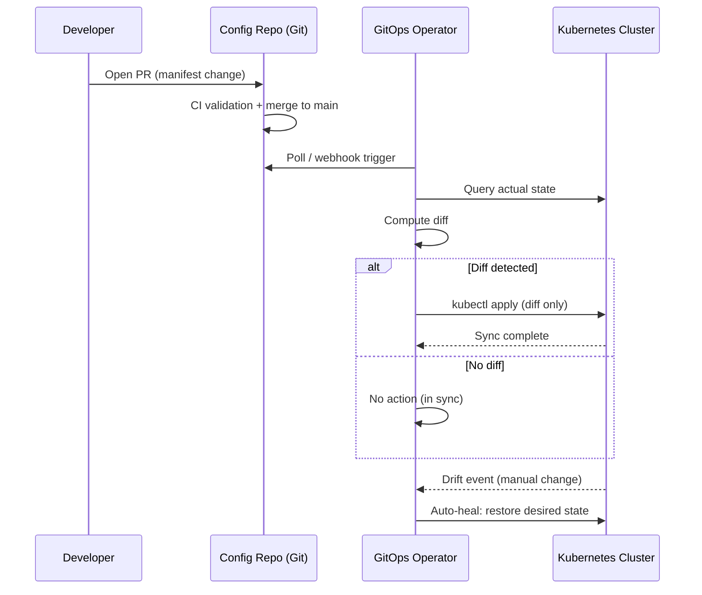
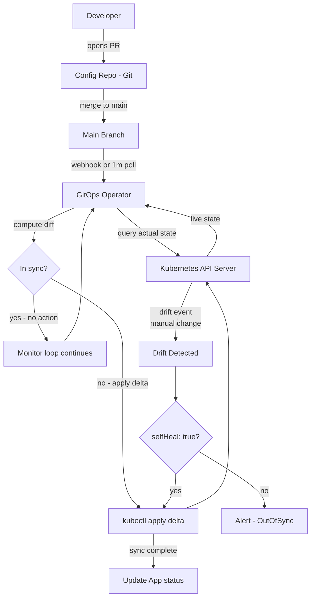
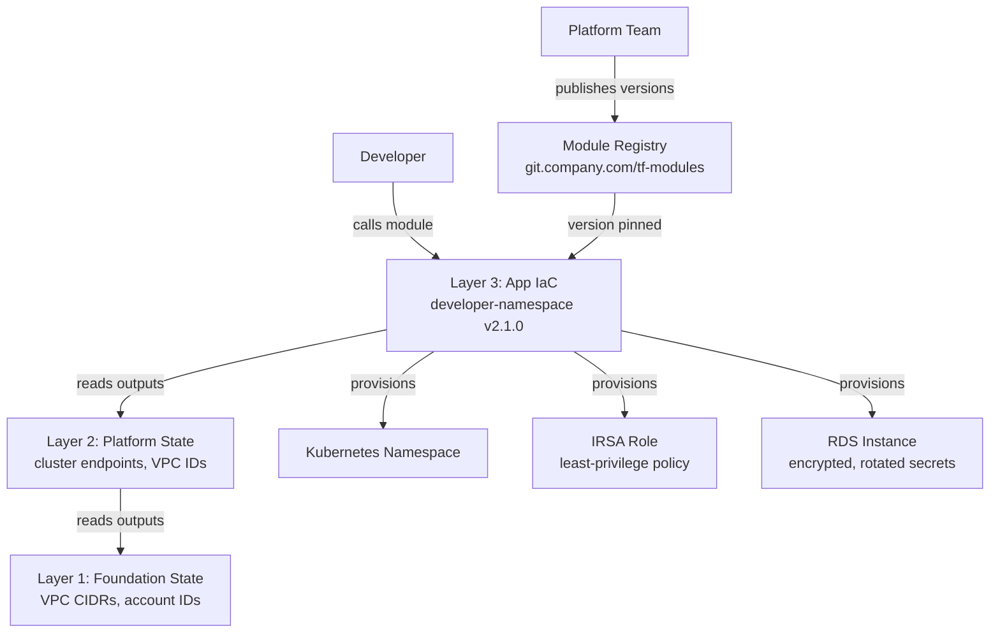
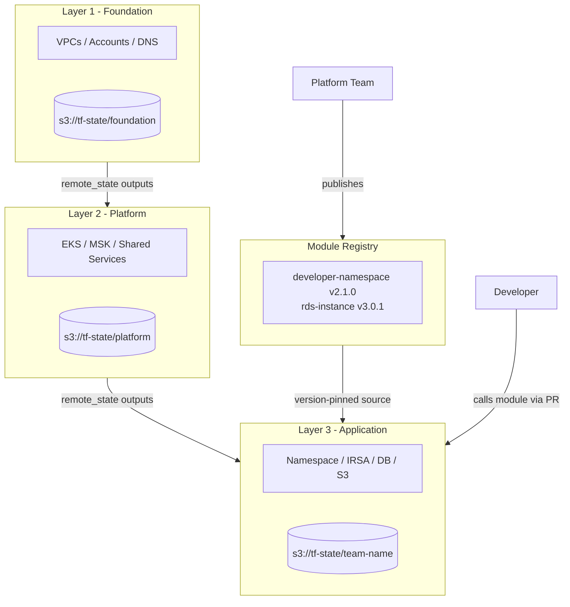

## Keywords in This File
{: .no_toc }

| # | Keyword | Weight |
|---|---|---|
| 1 | [GitOps Workflows for Platform Teams](#gitops-workflows-for-platform-teams) | ★★☆ |
| 2 | [Infrastructure as Code Patterns for Platforms](#infrastructure-as-code-patterns-for-platforms) | ★★☆ |

---

# GitOps Workflows for Platform Teams

**Interview Weight:** ★★☆ - Core platform engineering topic;
asked heavily at cloud-native companies and any team
running Kubernetes at scale. Tests whether the candidate
understands pull-based delivery, drift detection, and
the organizational implications of GitOps, not just the
tooling.

---

### 🎯 Model Answer

**30 seconds:**

> GitOps is an operational model where Git is the single
> source of truth for all cluster and application state.
> Instead of CI pipelines pushing changes to clusters,
> an in-cluster operator pulls from Git and continuously
> reconciles actual state with declared state. For platform
> teams, this means every change to production - config
> tweak, policy update, or Helm upgrade - flows through
> a pull request with full audit trail and `git revert`
> rollback.

**3 minutes:**

> GitOps inverts the traditional CI/CD push model. In
> a push model, a CI pipeline uses kubectl or Helm to
> apply changes to a cluster after a merge. It fires
> and forgets. If a developer later applies a manual
> hotfix with kubectl, the actual cluster state silently
> diverges from what anyone believes it to be. A week
> later, a mysterious deployment failure appears and
> nobody can explain why production does not match
> the repository.
>
> GitOps solves this with a pull-based reconciliation
> loop. An operator running inside the cluster - Argo CD
> or Flux - continuously watches a Git repository. It
> computes the diff between what Git declares and what
> the cluster is running. If there is a diff, it applies
> it. If someone manually patches a running deployment,
> the operator detects the drift within seconds and
> either alerts or auto-heals, depending on the sync
> policy.
>
> For platform teams managing dozens of clusters, this
> is transformative. Cluster bootstrapping, network
> policies, RBAC, Helm releases, and OPA policies all
> live in Git. A new cluster is ready in minutes by
> pointing the GitOps operator at the config repo. A
> production rollback is a `git revert` that the
> operator applies automatically.
>
> The trade-off I have run into is emergency hotfixes.
> GitOps requires a PR for every change, which slows
> emergency responses. The solution I implemented was
> a "break glass" RBAC role that allows direct kubectl
> access for on-call engineers, combined with an audit
> webhook that logs every kubectl command and opens a
> follow-up Jira ticket to commit the change to Git
> after the incident is resolved.

**Blank Mind Recovery:**

**(1) Restate:** "You are asking about GitOps Workflows
for Platform Teams - let me think through what problem
this solves and how it works."

**(2) First principles:** "From first principles, a
platform team managing many clusters needs a way to
ensure actual cluster state always matches intended
state. Manual kubectl creates drift. CI push pipelines
fire-and-forget. The solution is continuous pull-based
reconciliation where Git is the source of truth."

**(3) Bridge:** "This is like how DNS works. You declare
a zone file and the DNS system continuously reconciles
to that declaration. GitOps does the same for Kubernetes
state, with Git as the zone file and Argo CD or Flux
as the recursive resolver that enforces it."

---

### 📘 Concept Explanation

**What it is:**

GitOps is an operational framework that uses Git
repositories as the single source of truth for
infrastructure and application configuration. An
automated agent continuously compares Git-declared
desired state against actual running state and
reconciles any differences.

**The problem it solves:**

Before GitOps, two failure modes were endemic in
Kubernetes operations: configuration drift and
deployment archaeology. Drift happened when engineers
applied manual changes during incidents and forgot
to commit them. Archaeology happened when something
broke and nobody could determine what the cluster
was "supposed to look like" because the CI pipeline
had overwritten different state from different branches
over time. GitOps eliminates both by making Git the
authoritative, append-only record of what should run.

**How it works:**

```
Dev --> PR --> Config Repo (Git)
                    |
               webhook/poll
                    |
          GitOps Operator
          (Argo CD / Flux CD)
          +------------------+
          | desired: Git     |
          | actual:  Cluster |
          | compute diff     |
          +------------------+
                    |
             apply diff only
                    |
          Kubernetes Cluster
                    |
          drift detected?
          |              |
        alert       auto-heal
```



> **Diagram walkthrough:** The sequence shows the
> pull-based reconciliation loop at the core of GitOps.
> The developer never touches the cluster directly -
> all changes flow through Git. The operator runs
> continuously inside the cluster, polling or receiving
> webhooks from the config repo. The critical difference
> from push-based CI/CD is the bottom sequence: when
> someone manually changes cluster state (kubectl patch),
> the operator detects the drift on its next poll cycle
> and can auto-revert to the Git-declared state,
> eliminating the "who changed this and when?" failure
> mode that haunts push-based systems.

**The key insight:**

GitOps is not just a deployment tool - it is an
organizational protocol. The reconciliation loop
enforces the rule: "if it is not in Git, it does not
exist." This changes the operational culture. Engineers
stop treating kubectl as a valid operational tool for
ongoing state changes. Every change becomes reviewable,
traceable, and reversible, regardless of who made it
or why.

**When to use it:**

Use GitOps when: you are operating Kubernetes at more
than one cluster; you need auditable deployment history
for compliance (SOC 2, ISO 27001); you want rollback
to be a self-service `git revert` rather than a
runbook operation; or you are a platform team managing
configuration for many application teams and need
consistent state across all clusters.

**When NOT to use it:**

Do not force GitOps on single-environment setups where
a simple CI push pipeline suffices. GitOps adds PR-
review latency to every change; for a startup with
one cluster and two engineers, this overhead exceeds
the benefit. Also avoid GitOps for stateful schema
migrations - database schema changes require ordered
execution, not drift-reconciliation.

**Alternatives:**

- Jenkins X - opinionated GitOps with automatic
  promotion pipelines; more integrated but less
  flexible than Argo CD
- Spinnaker - push-based CD with canary and blue-green
  baked in; no drift detection but stronger deploy
  strategy support
- CI push model (GitHub Actions + kubectl) - simpler,
  no operator to manage, but no drift detection and
  CI needs cluster credentials

**First-principles derivation:**

Given that clusters must match a known good state, and
that humans will inevitably apply ad-hoc changes during
incidents, you need a system that enforces desired state
continuously rather than at deploy-time only. The
constraint is: humans cannot reliably commit every
manual change they make under incident pressure. The
only solution that survives human fallibility is one
where the system itself enforces the desired state from
an authoritative source - hence Git as truth and the
continuous reconciliation loop.

---

### 💻 Code Example

**Example 1: Push Model (BAD) vs GitOps Application (GOOD)**

```yaml
# BAD: CI pipeline pushes directly to cluster
# .github/workflows/deploy.yml (push model)
name: Deploy
on:
  push:
    branches: [main]
jobs:
  deploy:
    steps:
      - uses: aws-actions/configure-aws-credentials@v3
        with:
          role-to-assume: arn:aws:iam::123:role/deploy
      - run: |
          aws eks update-kubeconfig \
            --name production-cluster
          # Problem 1: CI has cluster write credentials
          # Problem 2: no drift detection after deploy
          # Problem 3: no record of what was running
          # before this apply
          kubectl apply -f k8s/
          # Problem 4: applies ALL manifests, not diff
```

> **Code walkthrough:** The push model requires the CI
> system to hold cluster credentials, creating a wide
> blast radius if the CI system is compromised. It runs
> `kubectl apply -f k8s/` which re-applies all manifests
> on every pipeline run, creating noise and hiding
> unexpected changes. After the pipeline completes,
> there is no agent watching cluster state - manual
> kubectl changes accumulate silently until they cause
> a failure.

```yaml
# GOOD: Argo CD Application (GitOps pull model)
# apps/platform/my-service/application.yaml
apiVersion: argoproj.io/v1alpha1
kind: Application
metadata:
  name: my-service
  namespace: argocd
  finalizers:
    - resources-finalizer.argocd.argoproj.io
spec:
  project: platform-apps
  source:
    repoURL: >-
      https://github.com/org/config-repo
    targetRevision: HEAD
    path: apps/my-service
    helm:
      valueFiles:
        - values-production.yaml
  destination:
    server: https://kubernetes.default.svc
    namespace: my-service
  syncPolicy:
    automated:
      prune: true       # remove resources not in Git
      selfHeal: true    # revert manual changes
    syncOptions:
      - CreateNamespace=true
      - ServerSideApply=true
    retry:
      limit: 3
      backoff:
        duration: 5s
        factor: 2
```

> **Code walkthrough:** The Argo CD Application is a
> Kubernetes custom resource that declares what the
> operator should deploy and how. `selfHeal: true` is
> the drift-correction mechanism - any manual kubectl
> change is detected and reverted within the sync
> interval (default 3 minutes). `prune: true` ensures
> resources deleted from Git are removed from the cluster.
> The `finalizers` block ensures the operator cleans up
> cluster resources when the Application itself is deleted.
> No CI credentials are needed - the operator runs
> inside the cluster and has only the RBAC permissions
> it needs for its own namespace scope.

**Example 2: Flux Kustomization for environment promotion**

```yaml
# Flux GitRepository + Kustomization
# Staging environment (promotes after CI passes)
apiVersion: source.toolkit.fluxcd.io/v1
kind: GitRepository
metadata:
  name: config-repo
  namespace: flux-system
spec:
  interval: 1m
  url: https://github.com/org/config-repo
  ref:
    branch: main
  secretRef:
    name: git-credentials
---
apiVersion: kustomize.toolkit.fluxcd.io/v1
kind: Kustomization
metadata:
  name: my-app-staging
  namespace: flux-system
spec:
  interval: 5m
  path: ./apps/my-app/staging
  prune: true
  sourceRef:
    kind: GitRepository
    name: config-repo
  targetNamespace: my-app-staging
  healthChecks:
    - apiVersion: apps/v1
      kind: Deployment
      name: my-app
      namespace: my-app-staging
  postBuild:
    substituteFrom:
      - kind: ConfigMap
        name: cluster-config
```

> **Code walkthrough:** Flux splits the concern into
> two resources: GitRepository (declares the source)
> and Kustomization (declares what to apply from that
> source). The `healthChecks` field blocks promotion -
> Flux will not report the Kustomization as ready until
> the Deployment it references is healthy. The
> `substituteFrom` block injects cluster-level variables
> (like the cluster DNS name or region) into manifests
> at apply time, enabling a single manifest set to work
> across environments without copy-pasting.

---

### 🎓 Answers by Seniority

**Junior / Mid (0-5 years):**

> "GitOps is a way of managing Kubernetes deployments
> where Git is the source of truth. Instead of running
> kubectl commands or having CI pipelines push to the
> cluster, you commit your Kubernetes manifests or Helm
> values to a Git repository. A tool like Argo CD or
> Flux CD runs inside your cluster, watches the repo,
> and automatically applies any changes. If someone
> manually changes something in the cluster, the tool
> detects the drift and either alerts you or auto-reverts
> to what is in Git. The big win is: every change to
> production is a PR, so you have review, history, and
> easy rollback via git revert."

*Push deeper:* "The two main tools are Argo CD and
Flux CD. Argo CD has a UI dashboard and is better for
teams that want visibility into sync status. Flux CD
is more lightweight, CLI-driven, and works well for
fully automated pipelines. The App of Apps pattern
in Argo CD lets you manage many applications from a
single parent Application manifest - the parent syncs
a directory of Application manifests, each of which
manages its own service."

---

**Senior / Staff (5+ years):**

> "GitOps is an organizational protocol as much as
> a deployment pattern. The technical mechanism is
> well-understood: pull-based reconciliation, drift
> detection, Git as the source of truth. The harder
> problem is making it work at scale for a platform
> team managing 50 clusters and 200 application teams.
>
> The multi-cluster problem requires a fleet management
> strategy. I structure repositories with a cluster
> registry - a directory where each subdirectory is a
> cluster. Each cluster directory contains the bootstrap
> Argo CD ApplicationSet that pulls in all the app-
> specific Applications for that cluster. Application
> teams commit to their own app directories; the platform
> team controls the cluster-level config. Promotion
> from staging to production is a PR that copies the
> staging values to the production directory - reviewed
> and merged by the deployment pipeline or a human.
>
> The operational failure mode I have hit with GitOps
> at scale is sync storms: 50 clusters all receiving
> a webhook at once for a common library update, all
> trying to reconcile simultaneously. The fix is
> staggered reconciliation intervals and ApplicationSet
> rollout strategies with max-unavailable controls."

*Push deeper:* "At the staff level, the conversation
shifts to gitops for policy - OPA/Kyverno policies,
RBAC, network policies, and PodSecurity admission all
living in Git. The real value here is audit: you can
answer any compliance question - when was this policy
changed, who approved it, what was the before/after -
with a single git log command."

---

### ⚠️ Common Misconceptions

**Misconception: "GitOps is just another CI/CD pipeline."**

GitOps is fundamentally different from a CI/CD pipeline.
A CI/CD pipeline is event-driven and stateless - it
fires when code changes and is done. A GitOps operator
is continuous and stateful - it runs indefinitely,
detecting and correcting drift. The critical difference
is that GitOps enforces desired state in perpetuity,
not just at deploy time. A CI/CD pipeline that pushes
to a cluster has no knowledge of what happens to that
cluster after the push completes.

---

**Misconception: "GitOps requires storing secrets in Git."**

This is a common objection that confuses GitOps with
naive Git-only configuration. Production GitOps stores
secret references in Git - Sealed Secrets (encrypted
Kubernetes secrets that only the in-cluster controller
can decrypt), External Secrets Operator references
(pointers to AWS Secrets Manager or HashiCorp Vault),
or SOPS-encrypted values. The plaintext secret never
appears in Git. The reference to where the secret lives
is in Git, along with the encryption key metadata.

---

**Misconception: "GitOps means you can never
use kubectl."**

GitOps restricts who should make persistent state
changes via kubectl - it does not eliminate kubectl
for operational tasks. Read operations (kubectl get,
kubectl describe, kubectl logs) are always valid.
Transient write operations during debugging (adding
a temporary env var to isolate a bug) are acceptable
if you treat them as temporary and understand the
operator will revert them. The operational rule is:
"kubectl for investigation, Git for persistence."

---

### 🚨 Failure Modes and Diagnosis

**Failure: Argo CD shows "Unknown" sync status
across all applications after cluster restart**

*Symptom:* After cluster maintenance, Argo CD reports
all Applications as "Unknown" sync status. No new
deployments are going out. Engineers are making changes
in Git but nothing is being applied.

*Root cause:* The argocd-application-controller
StatefulSet failed to restart cleanly. Its cache state
is lost and it cannot re-establish the connection to
the API server quickly enough, leading to timeout
errors in the controller log.

*Diagnosis steps:*
```bash
# Check controller pod status
kubectl get pods -n argocd \
  -l app.kubernetes.io/name=argocd-application-controller

# Read controller logs for errors
kubectl logs -n argocd \
  argocd-application-controller-0 \
  --tail=100 | grep -E "error|ERROR"

# Check argocd-server is reachable
kubectl rollout status deployment \
  argocd-server -n argocd

# Force a hard refresh on a specific app
argocd app get my-app --hard-refresh
```

*Fix:* Delete and recreate the controller pod to
force a clean restart. If the issue recurs, investigate
whether etcd latency is causing API server response
times to exceed the controller's default timeout.
Set `--request-timeout` on the controller to a higher
value if the cluster API server is slow.

---

**Failure: Git repo is unavailable and the platform
cannot deploy during a production incident**

*Symptom:* The GitHub API is experiencing an outage.
Platform team needs to apply an emergency hotfix
to a running cluster, but the GitOps operator cannot
pull the latest state.

*Root cause:* GitOps has a single dependency on Git
availability. When Git is unavailable, the operator
cannot verify desired state, so it holds position
(does not apply or revert anything). New changes
cannot be deployed.

*Mitigation:*
- GitOps operators hold last-known-good state when Git
  is unreachable - existing workloads continue running.
- For emergencies, implement break-glass access:
  a dedicated RBAC role that allows direct kubectl
  for on-call engineers, with an audit webhook.
- Mirror the config repo to a local GitLab instance
  as a hot standby for the GitOps operator source.

*Long-term fix:* Configure the GitOps operator to fall
back to a local mirror: in Argo CD, add a secondary
`repoURL` in the repository config. Flux supports
a fallback GitRepository source.

---

**Failure: GitOps sync storms degrade cluster API
server during mass updates**

*Symptom:* When the platform team updates a shared
Kustomize base (e.g., bumps a common sidecar version),
all 50 applications simultaneously attempt to reconcile.
The Kubernetes API server shows elevated latency and
the kubelet reports increased memory pressure.

*Root cause:* All Argo CD Applications share the same
sync interval. A webhook from a base manifest change
triggers all 50 Applications simultaneously to
re-evaluate and apply.

*Diagnosis:*
```bash
# Identify sync rate
kubectl get applications -n argocd -o json |
  jq '.items[] | .metadata.name + ": " +
  .status.operationState.phase'

# Check API server request rate
kubectl top node
kubectl get --raw \
  /metrics | grep apiserver_request_total
```

*Fix:* Use ApplicationSet wave-based rollout:
set `syncPolicy.syncOptions` with a `wave` annotation
on Application groups so they sync in staggered batches.
For Flux, use `interval` offsets to spread reconciliation
across time.

---

### 🎯 Interview Deep-Dive

| Role | Allocated time | Expected depth |
|---|---|---|
| Junior | 3-4 min | GitOps concept + basic Argo CD config |
| Mid | 6-8 min | Pull vs push + drift detection + Argo vs Flux |
| Senior | 10-12 min | Multi-cluster fleet + secrets + failure modes |
| Staff | 15-20 min | Org protocol + compliance + scale trade-offs |
| Bar Raiser | 10-15 min | Trade-offs + what you would change about GitOps |

---

**Q1. [CONCEPTUAL] [MID] "What is the difference
between push-based and pull-based deployment? Why
does the distinction matter for platform teams?"**

*Why they ask:* This separates candidates who have
read GitOps documentation from those who understand
the operational consequence of each model.

*Likely follow-up:* "What happens in a push model
when the CI system is compromised?"

**Answer:**

In a push model, the CI system holds cluster credentials
and runs kubectl or Helm commands after a code merge.
The CI system reaches out to the cluster. In a pull
model, an operator inside the cluster reaches out to
Git to fetch desired state and reconciles locally.

The distinction matters for three reasons. First,
security: in a push model, CI has write access to the
cluster. If the CI system is compromised - through
a supply chain attack on a CI plugin or stolen GitHub
Actions secrets - an attacker has direct write access
to production. In a pull model, the only credential
that matters is Git read access for the operator; the
cluster credentials never leave the cluster.

Second, drift: a push model fires-and-forgets. Once
the pipeline completes, nothing monitors whether the
cluster stays in the desired state. Manual kubectl
changes, failed pods, or admission webhook mutations
can cause the actual state to diverge. The pull model
reconciles continuously - the operator runs every 3
minutes (or on webhook) and corrects any deviation.

Third, multi-cluster consistency: in a push model,
deploying to 50 clusters requires 50 kubectl commands
in your pipeline. Managing parallelism, failures, and
partial deploys becomes complex. In a pull model,
each cluster has its own operator watching the same
Git source. A single commit to Git propagates to all
clusters through their independent reconciliation loops.

For platform teams, the operational impact is profound.
GitOps shifts the mental model from "we deploy software"
to "we declare the desired state and the system enforces
it." This changes how you do incidents - instead of
"what did the pipeline deploy?" you ask "what does Git
say should be running?" The answer is always findable
and always authoritative.

*What separates good from great:* Candidates who mention
the security model (CI credential scope) and the
continuous enforcement property, not just "pull is better
than push," are demonstrating production maturity.

---

**Q2. [MECHANISM] [MID] "How does Argo CD detect and
correct configuration drift?"**

*Why they ask:* Tests whether the candidate has
operated Argo CD or just deployed it once.

*Likely follow-up:* "What happens if the cluster
API server is slow to respond? How does Argo CD handle
reconciliation under load?"

**Answer:**

Argo CD runs a resource comparison engine inside the
argocd-application-controller. For each Application,
it maintains two state trees: the desired state (the
Kubernetes manifests generated from the Git source,
whether raw YAML, Helm template, or Kustomize build)
and the live state (queried from the cluster API server
using the Kubernetes client).

The comparison process: Argo CD normalizes both state
trees by stripping fields that are set by Kubernetes
and not by the user (like `resourceVersion`,
`creationTimestamp`, `managedFields`). It then does
a semantic diff on the normalized objects. If any
field differs, the Application enters OutOfSync status.

When `syncPolicy.automated.selfHeal: true` is set,
Argo CD immediately triggers a sync operation on
OutOfSync detection. It applies only the diffed
resources - not the entire manifest set - using
server-side apply. For resources in the desired state
that no longer exist in Git and `prune: true` is set,
it runs kubectl delete on them.

Drift detection cadence: by default, Argo CD compares
state every 3 minutes. For faster detection, configure
a webhook from your Git provider to trigger an
immediate comparison on push. This brings drift
detection from 3 minutes to under 10 seconds.

The failure case I have seen: a custom admission
webhook was mutating resource specs after apply,
adding an annotation. Argo CD would see the annotation
as drift from the spec in Git and immediately try to
remove it. This created an endless sync loop. The fix:
use `ignoreDifferences` in the Application spec to
tell Argo CD to ignore that specific annotation field.

*What separates good from great:* Mentioning the
`ignoreDifferences` pattern shows the candidate has
operated Argo CD in environments with admission
webhooks, not just in a clean lab setup.

---

**Q3. [DEBUGGING] [SENIOR] "Your Argo CD shows an
application as OutOfSync, but the Git repository has
not changed in three days and the running pods match
the last deployed version exactly. What do you
investigate first?"**

*Why they ask:* This is a real production scenario.
It tests systematic debugging over guesswork.

*Likely follow-up:* "How would you prevent this
from happening on 50 applications simultaneously?"

**Answer:**

The symptom - OutOfSync despite no Git changes and
matching pods - points to a few specific root causes.
I would investigate in this order.

First, check the live manifest for mutation by an
admission webhook or controller. Some controllers
add annotations or labels to resources post-apply:
cert-manager adds certificate annotations, Istio adds
sidecar injection labels. Run `kubectl get deployment
my-service -n my-namespace -o yaml` and compare the
live spec to the Git manifest manually. If extra fields
exist in the live spec that are not in Git, an admission
controller is adding them.

```bash
# Compare live state to Git state
argocd app diff my-app

# Check which fields are causing the diff
argocd app diff my-app --server-side
```

Second, if no admission mutation is found, check
whether a Kubernetes version upgrade changed the
default value of a resource field. API server version
upgrades sometimes add new default fields to existing
resource types that were not present when the manifest
was first applied. The live resource now includes the
new default field; the Git manifest does not.

Third, check for ResourceVersion or Generation
changes that Argo CD's normalization is failing to
strip. This is rare but happens with custom resources
whose schemas include server-set metadata in the spec
rather than in metadata.

The fix for persistent admission webhook drift: use
`ignoreDifferences` in the Application spec:

```yaml
spec:
  ignoreDifferences:
    - group: apps
      kind: Deployment
      jsonPointers:
        - /metadata/annotations/sidecar.istio.io
        - /spec/template/metadata/annotations
```

For API version drift, update the Git manifest to
include the new defaults explicitly so the comparison
is stable.

*What separates good from great:* Candidates who go
straight to admission webhooks and then to API version
drift have debugged this before. Candidates who suggest
"re-deploy the app" without understanding the root
cause have not.

---

**Q4. [TRADE-OFF] [SENIOR] "Monorepo versus polyrepo
for GitOps configuration. What are the real trade-offs
and what have you seen break in production?"**

*Why they ask:* This is a genuine architectural decision
with no universal answer. The interviewer wants to see
that the candidate has thought through both sides with
production context, not just theoretical preference.

*Likely follow-up:* "How does your answer change
at 200 microservices versus 20?"

**Answer:**

I have operated both models. The trade-offs are real
and context-dependent.

Monorepo: all application and cluster configuration
in one repository. The advantage is atomic changes -
if my-service needs both a config update and a network
policy change, I make them in a single PR that is
reviewed and applied atomically. Discovery is easy:
one place to look for any service configuration.
The CI validation runs once against the whole config.

The production problem I hit with monorepo at scale:
every PR triggers the CI pipeline on the entire repo.
At 200 services, a one-line YAML change runs lint
and validation on all 200 service manifests, a process
that took 8 minutes. Engineers started bypassing review
because "it takes too long." The GitOps discipline
broke down at scale.

Polyrepo: application configuration lives in the same
repo as application code (app-config alongside app-code),
and cluster-level config lives in a separate platform
repo. Application teams own their config; the platform
team owns the cluster config.

The production problem with polyrepo: config changes
that span multiple services require coordination across
multiple PRs. When we were rolling out a new sidecar
version that required a config annotation change in
every service, we had to open 40 PRs across 40 repos.
Tracking which services had been updated required a
spreadsheet.

My recommendation for a platform team with 50+
application teams: a hybrid. Platform configuration
(cluster bootstrap, shared services, policies) lives
in a dedicated platform monorepo. Application
configuration lives in each application's repo. The
Argo CD ApplicationSet connects them: it generates
an Application for each service by reading a directory
structure from the platform repo, but the source for
each Application points to the application's own repo.

*What separates good from great:* Candidates who have
felt the pain of both models - slow CI on large
monorepos and cross-repo coordination for polyrepos -
will give a nuanced answer with a concrete hybrid
recommendation rather than advocating for one model.

---

**Q5. [PRODUCTION] [SENIOR] "How do you handle
secrets in a GitOps workflow? Walk me through the
production approach you would use."**

*Why they ask:* Secrets management is the hardest
part of GitOps. This separates candidates who have
designed production systems from those who have only
used GitOps in lab environments.

*Likely follow-up:* "How do you handle secret rotation
without triggering a deployment?"

**Answer:**

The naive approach - committing plaintext secrets to
Git - is never acceptable. The three production
approaches I have used, in order of my preference:

External Secrets Operator (ESO): store secrets in
AWS Secrets Manager, HashiCorp Vault, or GCP Secret
Manager. Commit an ExternalSecret Kubernetes manifest
to Git - it contains only the reference to the external
secret, not the value. ESO syncs the value from the
external store into a Kubernetes Secret on a configurable
interval. When the secret rotates in Secrets Manager,
ESO pulls the new value automatically - no Git change
required, no redeployment needed.

Sealed Secrets: encrypt secrets with a cluster-specific
public key using the `kubeseal` CLI. The encrypted
manifest is safe to commit to Git. The in-cluster
Sealed Secrets controller decrypts it with the private
key and creates the Kubernetes Secret. The trade-off:
secret rotation requires re-encrypting and committing.
The operator does not auto-sync from an external store.
This works well for secrets that change rarely.

SOPS with KMS: encrypt YAML files with AWS KMS,
Google KMS, or age encryption. Store the encrypted
file in Git. The Flux Kustomize controller has native
SOPS support and decrypts at apply time. ESO is
preferred for dynamic rotation; SOPS works well for
static configuration like service account credentials.

For secret rotation: ESO is the winner. The
ExternalSecret's refresh interval (set to 1h, for
example) polls the external store and rotates the
Kubernetes Secret without a Git commit or redeployment.
The pods pick up the new secret on the next restart
or via a mounted volume that updates in place.

*What separates good from great:* Knowing the rotation
story for each approach demonstrates that the candidate
has operated these patterns under change, not just
at setup time.

---

**Q6. [ARCHITECTURE] [STAFF] "Design the GitOps
structure for a platform team managing 50 clusters
across three environments. How do you handle fleet
management and promotion?"**

*Why they ask:* This is a staff-level question that
tests system-level thinking, not just tool knowledge.

*Likely follow-up:* "What breaks first at 500 clusters?"

**Answer:**

I would structure this as a three-layer hierarchy:

Layer 1 - Cluster registry (platform repo):
A single platform Git repository contains a `clusters/`
directory where each cluster is a subdirectory. The
cluster directory contains the Argo CD bootstrap
manifest and the cluster-level configuration
(namespaces, RBAC, network policies, admission
webhooks). The platform team owns this layer.

Layer 2 - ApplicationSet (platform repo):
An ApplicationSet in each cluster reads the `apps/`
directory in the platform repo and generates an
Application resource for each subdirectory. This
means adding a new application to the fleet requires
creating one directory in the platform repo - no
manual Application manifest creation per cluster.

Layer 3 - Application config (per-app repo):
Each application team manages their own config repo
(or uses their application repo). The ApplicationSet
points to the app repo for each service. Environment-
specific values live in `values-staging.yaml`,
`values-production.yaml` - the ApplicationSet selects
the right file based on cluster environment label.

Promotion flow: staging -> production promotion is
a PR that bumps the image tag in `values-production.yaml`.
The CI pipeline opens this PR automatically after
a successful staging deploy and integration test pass.
A platform engineer or automated approver merges it.

At 500 clusters the first thing that breaks is the
argocd-application-controller memory. It holds the
desired and live state of every Application in memory.
At 500 clusters x 50 apps = 25,000 Applications, the
controller needs horizontal sharding - Argo CD supports
this via `ARGOCD_CONTROLLER_REPLICAS` and Application
sharding by cluster. Plan for this before you hit 200
clusters.

*What separates good from great:* Mentioning the
controller sharding limit shows the candidate has
thought past setup to long-term operation.

---

**Q7. [COMPARISON] [MID] "Argo CD versus Flux CD.
How do you choose between them for a platform team?"**

*Why they ask:* Tests whether the candidate knows the
tools well enough to have a reasoned opinion, not just
brand preference.

*Likely follow-up:* "When would you use both together?"

**Answer:**

The decisive question is: does the platform team need
a UI dashboard with approval workflows, or is the
team running fully automated pipelines where a CLI
and API are sufficient?

Argo CD strengths: the web UI is genuinely excellent
for visualizing sync status, application health, and
resource trees. Manual sync with approval gates is
simple to configure. The AppProject resource provides
strong multi-tenancy - each team gets an AppProject
that restricts which clusters and namespaces they can
deploy to. Rollback in the UI is a one-click operation
that engineers trust. I use Argo CD when the platform
team needs to give application engineers self-service
visibility and manual deploy control.

Flux CD strengths: Flux is a Kubernetes-native toolkit
- each component (source controller, kustomize
controller, helm controller) is a separate deployment,
which makes it easier to scale individual components
independently. Flux has native SOPS support for secret
decryption. Its Notification API has first-class
webhook support for Slack, GitHub commit status, and
Teams. I use Flux when the platform team is running
fully automated pipelines with no human-in-the-loop
and wants the GitOps operators tightly integrated with
the cluster's own resource lifecycle.

For a large platform team: use Argo CD at the platform
level (cluster fleet management, application delivery
with approval gates) and Flux at the application level
(automated promotion pipelines with health checks).
The two tools are compatible - Argo CD can manage the
Flux installation itself as a GitOps application.

*What separates good from great:* Candidates who frame
the choice around team workflow and operational
philosophy - rather than feature lists - demonstrate
practical experience with both tools.

---

**Q8. [BEHAVIORAL] [SENIOR] "Tell me about a time
GitOps helped you recover from a production incident
or prevented one from becoming worse."**

*Why they ask:* Tests whether the candidate has
actually operated GitOps in production, not just
configured it in a tutorial.

*Likely follow-up:* "What would have happened if
you had been using a push-based pipeline instead?"

**Answer:**

At a previous company, we were running Argo CD for
all production workloads. During a Friday afternoon
deploy, one of our application teams accidentally
pushed a Helm values change that set the replica count
for the payments service to 0. Normally this would
have gone unnoticed until monitoring triggered, but
Argo CD's health checks immediately flagged the
payments Application as "Degraded" because zero
replicas meant the Deployment had no available pods.

The platform team's Slack alert fired within 90 seconds
of the merge. The on-call engineer opened the Argo CD
UI, saw the diff view showing `replicas: 0` as the
change, and immediately reverted the commit on GitHub.
Argo CD detected the revert within 30 seconds and
applied the original replica count. Total downtime:
less than 4 minutes.

What made the difference: the combination of health
checks (Argo CD knew the Deployment was unhealthy)
and the diff view (immediately visible what changed)
meant the diagnosis was instantaneous. With a push-
based pipeline, we would have had to reconstruct the
blast radius by reading CI logs, checking which pipeline
ran, and comparing the git diff manually - probably
a 15-20 minute investigation before the fix.

The GitOps audit trail also made the post-mortem
straightforward: we could show exactly what changed,
who approved the PR, and what time the change was
applied, all from the Argo CD sync history.

*What separates good from great:* Specific numbers
(4 minutes, 90 seconds), the concrete mechanism
(health checks + diff view), and the counterfactual
comparison with push pipelines demonstrate real
operational experience.

---

**Q9. [PERFORMANCE] [STAFF] "Your GitOps setup has
1000 Applications across 20 clusters. How does
scale affect reconciliation performance, and what
are the bottlenecks?"**

*Why they ask:* Tests whether the candidate understands
the operational limits of GitOps tooling.

*Likely follow-up:* "How do you detect when you are
approaching the scaling limit before it causes
production impact?"

**Answer:**

At 1000 Applications across 20 clusters, three
bottlenecks emerge: controller memory, API server
request rate, and Git API rate limits.

Controller memory: the argocd-application-controller
stores the desired state cache and live state cache
for every Application in memory. At 50 Applications
per cluster, the per-cluster controller typically
uses 2-4 GB of memory. The limit is the controller
heap size. The fix is Application sharding -
distributing Applications across multiple controller
replicas using `ARGOCD_CONTROLLER_REPLICAS`. Each
replica manages a shard of the Application set.

API server request rate: with 1000 Applications
each reconciling every 3 minutes, the controller
makes approximately 333 list/watch requests per
minute to the cluster API server. This is tolerable
for most clusters, but in an event storm (like a
node failure causing 200 pod reschedules), the
controller's watch events spike. The fix: tune
`--repo-cache-expiration` and `--app-state-cache-
expiration` to reduce redundant API calls.

Git API rate limits: with 1000 Applications each
polling the Git API, GitHub's rate limit of 5000
requests per hour per token becomes a constraint.
The fix: use webhooks instead of polling. Webhooks
deliver change events immediately and eliminate
polling entirely for clusters behind a firewall, use
Argo CD's repo-server caching layer and ensure all
Applications on a cluster share a single Git connection.

Detection before failure: monitor the controller's
`argocd_app_reconcile_duration_seconds` metric. When
p99 reconcile time starts climbing above 30 seconds,
you are approaching the memory or API rate limit.
Set an alert at p99 > 15 seconds to give yourself
time to tune before degradation.

*What separates good from great:* Naming the specific
metrics to watch (`argocd_app_reconcile_duration_seconds`)
and the fix for each bottleneck shows operational depth.

---

| Interviewer Type | Emphasis |
|---|---|
| Technical Panel | Lead with reconciliation loop mechanism; use precise tool names |
| Hiring Manager | Lead with audit trail and compliance benefits; outcome language |
| Bar Raiser | Lead with trade-offs: what GitOps does NOT solve (secret rotation, stateful migration) |
| Peer Engineer | Collaborative: "The thing I keep finding is self-healing causes issues with admission webhooks" |
| Platform Team | Lead with multi-cluster fleet management and sync storm diagnosis |

---

### ⚖️ Comparison Table

| Option | Drift Detection | Credentials | Multi-cluster | Choose When |
|---|---|---|---|---|
| **GitOps (Argo CD/Flux)** | Continuous, auto-heal | Git read-only in CI | Excellent (fleet mgmt) | Kubernetes at scale, audit required |
| Push CI/CD (Actions + kubectl) | None | Cluster write in CI | Manual per cluster | Simple single-cluster, small team |
| Jenkins X | Limited (GitOps mode) | Git + cluster | Plugin-based | Strong Java CI ecosystem needed |
| Spinnaker | None | Cluster write | Pipeline stages | Complex deploy strategies (canary) |
| Helm operator only | Partial (chart drift) | Cluster write | Not built-in | Helm-only shops, no drift concern |

**The deciding factor:**

Choose GitOps when continuous drift detection and
audit trail are requirements; choose push-based CI/CD
when operational simplicity matters more than drift
detection.

---

### 🏛️ System Design

*(Omit: ★★☆ keyword - system design section requires
★★★ or sd: true in frontmatter. GitOps fleet design
questions are covered in Q6 of the Interview Deep-Dive
section above.)*

---

### 📊 Diagram

*(Diagram included: GitOps reconciliation loop is a
core mechanism that requires visual explanation.)*

```
+-------------------------------+
|  Config Repository  (Git)    |
|  main branch                 |
|  - apps/my-service/          |
|  - clusters/production/      |
+-------------+-----------------+
              |
     webhook / 1m poll
              |
              v
+-------------------------------+
|  GitOps Operator (Argo CD)   |
|  - desired state: parse Git  |
|  - live state: query K8s API |
|  - diff: compute delta       |
|  - sync: apply delta only    |
+--------+----------+----------+
         |          |
   in sync?      out of sync?
         |          |
   no action  apply + report
              |
              v
+-------------------------------+
|  Kubernetes Cluster           |
|  Running state                |
+-------------------------------+
              |
   manual kubectl change?
              |
    drift event -> auto-heal
```



> **Diagram walkthrough:** The flowchart shows the
> continuous reconciliation loop that makes GitOps
> fundamentally different from push-based CI/CD.
> The operator runs indefinitely, not just at deploy
> time. The critical path is the drift detection branch
> at the bottom: when a manual kubectl change creates
> a diff between Git state and cluster state, the
> selfHeal mechanism immediately triggers a re-apply
> from Git, effectively making manual changes ephemeral.
> The loop continues regardless of whether an apply
> was needed - the operator always comes back to check.
> This is the property that makes GitOps a protocol,
> not just a pipeline.

---
---

# Infrastructure as Code Patterns for Platforms

**Interview Weight:** ★★☆ - Essential for senior
platform engineering interviews; tests Terraform
module design, layering, state management at scale,
and the difference between IaC for a single team
versus IaC that serves as a product for many teams.

---

### 🎯 Model Answer

**30 seconds:**

> Infrastructure as Code for platform teams is
> fundamentally different from IaC for a single team:
> you are writing IaC as a product consumed by
> dozens of application teams, not scripts for your
> own use. The pattern that scales is three-layer
> architecture: foundational IaC for VPCs and accounts
> (owned by the cloud team), platform IaC for clusters
> and shared services (owned by the platform team),
> and application IaC as versioned modules that
> developers call with a few simple inputs. Each layer
> has a stable, versioned interface.

**3 minutes:**

> When I joined a platform team at a company with
> 50 application teams, every team had copy-pasted
> the same 800-line Terraform module for Kubernetes
> namespaces, IRSA roles, and RDS databases. Each
> copy had minor variations. Some had security group
> rules that were too permissive; others were missing
> encryption at rest on their database. Updating any
> security policy required finding and fixing 50 copies.
>
> The solution was three-layer IaC. The foundation
> layer manages VPCs, Transit Gateway, AWS Organizations
> accounts, and Route 53 zones. This runs in a dedicated
> `platform-foundation` repository with Terraform state
> stored in S3 with DynamoDB locking. Changes here
> require a senior engineer review and a manual apply
> approval because they affect every workload.
>
> The platform layer manages Kubernetes clusters, MSK,
> ElasticSearch, and shared services. The Terraform
> modules for these are published to an internal module
> registry at versioned releases. Platform SREs run
> Spacelift for the apply automation with environment-
> specific approval gates.
>
> The application layer is where developers interact
> with IaC. We published a `developer-namespace`
> module: developers call it with their team name,
> requested CPU/memory quotas, and a list of the AWS
> services they need. The module provisions the
> Kubernetes namespace, IRSA role with least-privilege
> IAM policy, RDS password rotation, and Datadog
> monitor integration. The developer never sees the
> security group rules, VPC subnets, or KMS keys.
>
> The key insight: treating Terraform modules as a
> product with versioned interfaces means platform
> teams can refactor security internals without
> disrupting consuming teams, as long as the input
> variable interface is backwards compatible. Module
> version pinning ensures applications do not receive
> unexpected changes.

**Blank Mind Recovery:**

**(1) Restate:** "You are asking about IaC Patterns
for Platforms - what makes this different from standard
Terraform usage."

**(2) First principles:** "From first principles, a
platform team serves many teams. Their IaC must handle
multi-tenancy, versioned interfaces, and consistent
enforcement of security policy - none of which matter
when you write IaC for a single team."

**(3) Bridge:** "Think of it like an SDK vs an
application. Application developers write one-off
code. SDK authors write versioned, stable, backwards-
compatible interfaces used by thousands of dependents.
Platform IaC is an SDK - the developer-facing modules
are the public API, and the cloud infrastructure
details are the implementation."

---

### 📘 Concept Explanation

**What it is:**

Infrastructure as Code Patterns for Platforms refers
to the organizational and technical conventions for
using Terraform, Pulumi, or CloudFormation to manage
cloud infrastructure when a central platform team
serves many application teams. The focus is on module
design, layering, state management, and the difference
between IaC as a personal tool versus IaC as a
multi-team product.

**The problem it solves:**

Without IaC patterns, platform teams face three
failure modes. First, copy-paste sprawl: each team
gets a copy of the module template and diverges,
making security patching a 50-team coordination
problem. Second, blast radius ambiguity: all Terraform
state in one giant repository means a single Terraform
apply touches everything. A mistake destroys
unintended resources. Third, cognitive overload:
application developers should not need to understand
VPC CIDR blocks, subnet routing, and IAM trust
policies to create a database. The abstraction layer
is missing.

**How it works:**

```
Three-Layer IaC Architecture:

Layer 1 - Foundation (cloud/platform team)
  Owns: VPCs, accounts, DNS, network backbone
  State: s3://tf-state/foundation/
  Apply: manual approval required
  Change frequency: quarterly

Layer 2 - Platform (platform team)
  Owns: clusters, shared DBs, message queues
  State: s3://tf-state/platform/
  Apply: Spacelift/Atlantis pipeline
  Change frequency: weekly

Layer 3 - Application (dev team via module)
  Owns: namespace, IRSA role, team DB
  State: s3://tf-state/apps/{team}/
  Apply: developer self-service
  Change frequency: daily

Module Registry:
  git.company.com/tf-modules
  - developer-namespace v2.1.0
  - rds-instance v3.0.1
  - kafka-topic v1.2.0

```



> **Diagram walkthrough:** The three-layer model
> creates a clean dependency hierarchy. Application
> IaC reads outputs from the platform layer (cluster
> ARN, VPC ID, subnet IDs) without managing those
> resources directly. This separation means a platform
> team can migrate to a new EKS version in the platform
> layer without changing any application module code,
> as long as the output names remain stable. The module
> registry is the contract point: platform teams publish
> versioned releases, application teams pin to a version
> and upgrade on their own schedule, decoupling platform
> upgrades from application deploys.

**The key insight:**

Terraform modules for platform teams are a public API.
Once published and consumed by 50 teams, the input
variable interface is a contract. A breaking change
to the interface (renaming a required variable)
requires deprecation warning, a migration guide, and
a grace period - exactly like a public library API.
Platform teams that treat modules as internal
implementation details discover this the hard way
when a refactor breaks 50 downstream consumers
simultaneously.

**When to use it:**

Three-layer IaC is warranted when: more than 10
application teams consume the platform; security
policies need centralized enforcement (encryption
at rest, security group rules); developer self-service
is a goal; or the organization has compliance
requirements that mandate consistent infrastructure
configuration across all environments.

**When NOT to use it:**

For a team of 3 engineers with one application,
three-layer IaC is overengineering. A single
Terraform repository with a flat module structure
and manual applies is appropriate. Add layering only
when the multi-team coordination problem becomes
real - not in anticipation of it.

**Alternatives:**

- Pulumi - uses general-purpose programming languages
  (TypeScript, Python, Go); module reuse via standard
  language package managers; better for complex logic
  in modules, harder for operators who know HCL
- AWS CDK - CloudFormation-backed IaC in TypeScript;
  excellent for AWS-only shops; no multi-cloud support
- Crossplane - Kubernetes-native IaC; infrastructure
  as Kubernetes custom resources; integrates with
  GitOps natively; steeper learning curve

**First-principles derivation:**

A platform team is a force multiplier: it solves
infrastructure problems once so that many application
teams can benefit. The constraint is that infrastructure
has security invariants (encryption at rest, least-
privilege IAM, network segmentation) that must hold
for every team, not just those that remember to follow
the wiki. The only way to guarantee these invariants
is to encode them in the module implementation, expose
a simple interface, and version the interface so teams
cannot accidentally break it. This is the same logic
that drives library design in software engineering,
applied to infrastructure automation.

---

### 💻 Code Example

**Example 1: Copy-paste IaC (BAD) vs versioned
module interface (GOOD)**

```hcl
# BAD: Team copies a 900-line Terraform file
# and modifies it for their use case.
# apps/payments-team/infrastructure/main.tf

# Problem 1: security group allows 0.0.0.0/0 ingress
# because the original template was for a test env
resource "aws_security_group" "app" {
  name = "payments-sg"
  ingress {
    from_port   = 0
    to_port     = 65535
    protocol    = "tcp"
    cidr_blocks = ["0.0.0.0/0"]  # INSECURE
  }
}

# Problem 2: RDS has no encryption
resource "aws_db_instance" "main" {
  engine               = "postgres"
  instance_class       = "db.t3.medium"
  # storage_encrypted = true  # commented out
  username             = "admin"
  password             = var.db_password
  # Problem 3: password in plain var, not Secrets Mgr
}
# 847 more lines of copy-pasted infrastructure...
# Platform team cannot patch security issues
# in 50 copies of this file.
```

> **Code walkthrough:** The copy-paste pattern is the
> most dangerous IaC anti-pattern for platform teams.
> Each copy drifts independently - some fix the security
> group, most do not. When a CVE or compliance audit
> requires patching encryption settings across all
> databases, the platform team must find, review, and
> update 50 repositories. The `0.0.0.0/0` CIDR and
> missing encryption are not hypothetical - they appear
> in real copy-pasted modules at companies that did not
> invest in a module library early.

```hcl
# GOOD: Versioned module with safe defaults
# Module: git.company.com/tf-modules//developer-namespace
# Version: 2.1.0

# Developer calls the module with 4 lines:
module "my_team_namespace" {
  source  = "git::https://git.company.com/tf-modules.git"
  # always pin to a version - never HEAD
  ref     = "developer-namespace/v2.1.0"

  team_name       = "payments"
  environment     = "production"
  requested_cpu   = "8"
  requested_memory = "16Gi"

  # Optional: request a database
  database_config = {
    engine        = "postgres"
    instance_class = "db.t3.medium"
  }
}

# Module internals (platform team owns, devs never see):
# - security group with least-privilege rules
# - RDS with storage_encrypted = true (always)
# - password stored in Secrets Manager (always)
# - IRSA role with generated least-privilege policy
# - Kubernetes namespace with ResourceQuota
```

> **Code walkthrough:** The versioned module interface
> hides all infrastructure complexity from the developer.
> The developer provides four inputs: team name,
> environment, resource requests, and optional database
> config. The module internals enforce encryption,
> secure secret storage, and least-privilege networking
> as non-negotiable defaults. When the platform team
> needs to update the encryption key rotation policy,
> they release `developer-namespace/v2.2.0` with the
> change. Teams opt in to the new version on their own
> schedule. The `ref = "developer-namespace/v2.1.0"`
> pin prevents automatic upgrade surprises.

**Example 2: Remote state sharing between layers**

```hcl
# Platform layer output (platform team publishes)
# modules/eks-cluster/outputs.tf
output "cluster_endpoint" {
  description = "EKS API server endpoint"
  value       = aws_eks_cluster.main.endpoint
}

output "cluster_oidc_issuer_url" {
  description = "OIDC issuer URL for IRSA"
  value = aws_eks_cluster.main.identity[0].oidc[0].issuer
}

output "vpc_id" {
  description = "VPC ID for this cluster"
  value       = module.vpc.vpc_id
}

# Application layer reads platform state
# modules/developer-namespace/main.tf
data "terraform_remote_state" "platform" {
  backend = "s3"
  config = {
    bucket = "tf-state-company"
    key    = "platform/eks-production/terraform.tfstate"
    region = "us-east-1"
  }
}

resource "aws_iam_role" "irsa" {
  name = "${var.team_name}-irsa-role"

  assume_role_policy = jsonencode({
    Version = "2012-10-17"
    Statement = [{
      Effect = "Allow"
      Principal = {
        # Uses OIDC issuer from platform state
        Federated = data.terraform_remote_state
          .platform.outputs.cluster_oidc_issuer_url
      }
      Action = "sts:AssumeRoleWithWebIdentity"
      Condition = {
        StringEquals = {
          "${data.terraform_remote_state.platform
            .outputs.cluster_oidc_issuer_url}:sub" =
            "system:serviceaccount:${var.team_name}:${var.team_name}-sa"
        }
      }
    }]
  })
}
```

> **Code walkthrough:** Remote state data sources are
> how layers communicate without coupling. The
> application module reads the cluster OIDC issuer URL
> from the platform layer's state file, not from a
> hardcoded variable. This means when the platform
> team migrates to a new cluster, the OIDC issuer URL
> updates in the platform state, and the next
> `terraform apply` in each application module picks
> up the new value automatically. The boundary between
> layers is expressed through state outputs - a clean
> contract that both teams agree to keep stable.

---

### 🎓 Answers by Seniority

**Junior / Mid (0-5 years):**

> "Infrastructure as Code patterns for platforms are
> about using Terraform or Pulumi to define all cloud
> resources in code so they are reproducible and
> version-controlled. For platform teams, the key
> pattern is creating reusable modules that application
> teams can call with simple inputs - like a module
> that creates a Kubernetes namespace, IAM role, and
> database in one call. The module hides the complexity
> and enforces security defaults. Application teams
> do not need to know how VPCs or IAM trust policies
> work. The platform team maintains the module and
> publishes versioned releases. When a security policy
> changes, the platform team updates the module version;
> application teams upgrade at their own pace."

*Push deeper:* "The three critical patterns: module
versioning (pin to a specific git tag, never HEAD),
remote state sharing (application modules read platform
outputs via `terraform_remote_state`), and state
isolation (each team has their own state file in S3
so a failed apply does not affect other teams)."

---

**Senior / Staff (5+ years):**

> "IaC for platform teams is fundamentally a product
> design problem. The Terraform modules you publish
> are a public API with a contract. Once 50 teams
> consume your `developer-namespace` module, any
> breaking change to the input interface - renaming
> a required variable, removing an output - breaks
> 50 downstream consumers. I treat module versioning
> with the same rigor I apply to service API versioning:
> semantic versioning, deprecation warnings, and a
> migration period before removing old inputs.
>
> At scale, the hard problems are drift detection and
> blast radius control. Drift detection: after an
> engineer manually changes an S3 bucket policy in
> the console, `terraform plan` will show that change
> as a deletion to restore desired state. If the
> engineer does not know this, the next apply deletes
> their manual change. The solution is automated
> `terraform plan` runs on a schedule (drift detection
> mode) that alert when actual state diverges from
> code, even if no apply is triggered.
>
> Blast radius: a single Terraform state file with
> 500 resources means any apply can touch any of them.
> I split state by team, by environment, and by
> functional layer. Foundation state (VPCs, network)
> has the most restrictive apply gates because a
> mistake there affects everything. Application state
> is per-team and isolated."

*Push deeper:* "The staff-level conversation is about
the IaC operator pattern: Crossplane or Terraform
Controller running inside Kubernetes, watching
custom resources and triggering Terraform applies.
This integrates IaC into the GitOps reconciliation
loop - a developer creates a `DatabaseClaim` custom
resource, the Terraform controller creates the RDS
instance, and the state is reconciled continuously.
This is the next evolution beyond declarative Terraform
pipelines."

---

### ⚠️ Common Misconceptions

**Misconception: "Terraform state is just an
implementation detail."**

Terraform state is a first-class operational asset.
It maps the logical resources in your `.tf` files
to their physical IDs in the cloud (the S3 bucket
ARN, the EC2 instance ID, the RDS cluster identifier).
Without state, Terraform cannot determine what to
update versus what to create. Corrupting state by
modifying it manually, running two applies
simultaneously without locking, or losing the state
file means Terraform will try to recreate all resources,
resulting in destructive changes. State must be
stored remotely (S3 + DynamoDB for AWS), backed up,
and access-controlled as carefully as production
databases.

---

**Misconception: "Using IaC means you never need
to touch the AWS console."**

IaC manages the resources it knows about. Console
changes to resources outside the IaC scope (a security
group rule added manually, an EC2 instance tag changed
in the console) are invisible to Terraform until the
next `terraform plan` detects the drift. More
dangerously, console changes to resources that ARE
managed by Terraform will appear as changes to delete
or reset on the next apply. Platform teams need both
IaC for managed resources and guardrails (AWS Config
rules, Service Control Policies) that prevent console
changes to IaC-managed resources, or at minimum alert
when they occur.

---

**Misconception: "More variables in a Terraform
module makes it more flexible and reusable."**

Excessive module variables are an anti-pattern.
A module with 40 input variables provides no
abstraction - it is just a templated `.tf` file.
Every variable the developer must understand is
cognitive load transferred from the module to the
consumer. Platform teams should design module
interfaces with the minimum variables needed for
legitimate customization, and bake security and
configuration decisions into the module as non-
overridable defaults. A developer should be able
to provision a compliant database with 3-4 inputs,
not 40. The module's job is to hide the complexity,
not expose it through a thin wrapper.

---

### 🚨 Failure Modes and Diagnosis

**Failure: Terraform state locking causes apply
blockage during deployment pipeline**

*Symptom:* A Spacelift pipeline run fails with
"Error acquiring the state lock." Another pipeline
run is blocked from starting. Engineers cannot
deploy for 20 minutes.

*Root cause:* Two pipeline runs triggered
simultaneously by concurrent PRs merging. Both try
to acquire the DynamoDB state lock for the same
workspace. One acquires the lock; the other waits.
If the first run hangs (network timeout, Terraform
process killed), the lock is orphaned and never
released.

*Diagnosis:*
```bash
# Check DynamoDB lock table for orphaned entries
aws dynamodb scan \
  --table-name terraform-state-lock \
  --filter-expression "attribute_exists(LockID)"

# Force-unlock with the lock ID from the above output
terraform force-unlock \
  "the-lock-id-from-dynamodb"

# Verify state integrity after force-unlock
terraform plan -detailed-exitcode
```

*Prevention:* Configure CI to queue Terraform runs
per workspace, not run them in parallel. Spacelift
and Terraform Cloud handle this natively. For
self-managed pipelines, use a mutex on the workspace
identifier before triggering apply.

---

**Failure: Terraform plan shows 200+ resource
deletions for a routine apply**

*Symptom:* An engineer runs `terraform plan` for
a routine module version bump. The plan output
shows 200+ resources to destroy and recreate.
The engineer is alarmed and does not apply.

*Root cause:* A required provider version was
bumped (e.g., AWS provider from 4.x to 5.x),
which changed the internal resource address for
a refactored resource. Terraform treats the old
resource address as deleted and the new address
as new, even if they represent the same cloud
resource. Alternatively, a `for_each` map key
was changed, causing Terraform to destroy the
old keyed resources and create new ones.

*Diagnosis:*
```bash
# Show the specific change causing mass destruction
terraform plan -out=tfplan
terraform show -json tfplan | \
  jq '.resource_changes[] |
    select(.change.actions | contains(["delete"]))'

# Check if resources are being replaced vs truly new
# (replaced = destroy + create for same resource)
terraform show -json tfplan | \
  jq '.resource_changes[] |
    select(.change.actions | contains(["create","delete"]))'
```

*Fix:* For provider refactors, use `moved` blocks
in Terraform 1.1+ to tell Terraform that old.resource
is now new.resource without destroying and recreating.
For `for_each` key changes, use `terraform state mv`
to rename the state entry before applying.

---

**Failure: Application team accidentally destroys
the shared platform RDS cluster by running
`terraform destroy` in their workspace**

*Symptom:* The shared authentication database is
gone. 12 services that depend on it are failing.
The application team ran `terraform destroy` in their
workspace, thinking it would only remove their
application resources.

*Root cause:* The application module referenced the
shared RDS cluster using a `resource` block instead
of a `data` source. Terraform treated it as a managed
resource and destroyed it when the workspace was
destroyed.

*Diagnosis:* Check the state file to confirm which
resources were destroyed. Check Terraform plan history
for the apply that caused the destruction.

*Fix and prevention:* Shared resources that are NOT
owned by the consuming workspace must always be
referenced via `data` sources, not `resource` blocks.
A `data` source is read-only - it reads the existing
resource's attributes but does not manage its lifecycle.
Platform teams should validate this in module code
review: any reference to a cross-layer resource in
a `resource` block is a critical review finding.
Add a Sentinel or OPA policy that prevents `resource`
declarations for cross-account resources in application
workspaces.

---

### 🎯 Interview Deep-Dive

| Role | Allocated time | Expected depth |
|---|---|---|
| Junior | 3-4 min | Module concept + basic Terraform usage |
| Mid | 6-8 min | Layering + state + module interface design |
| Senior | 10-12 min | Drift detection + blast radius + module versioning |
| Staff | 15-20 min | IaC as product + operator pattern + compliance |
| Bar Raiser | 10-15 min | Trade-offs + when IaC abstraction fails |

---

**Q1. [CONCEPTUAL] [MID] "What is three-layer IaC
and why does the layering matter for platform teams?"**

*Why they ask:* Tests whether the candidate has
designed IaC at scale or only used it for a single
service.

*Likely follow-up:* "How does the layer boundary
change your blast radius?"

**Answer:**

Three-layer IaC organizes infrastructure ownership
into foundation, platform, and application layers,
each with its own state file, apply cadence, and
review gate.

Foundation layer: VPCs, AWS Organizations accounts,
Transit Gateway, Route 53 zones. This layer is stable -
it changes quarterly at most. It is managed by a
senior platform or cloud infrastructure engineer.
A mistake here - deleting a VPC - affects everything
running in that VPC. The apply gate is manual approval
by two engineers.

Platform layer: Kubernetes clusters, MSK clusters,
ElasticSearch, shared databases. The platform team
owns this. It changes weekly as clusters are upgraded
or new shared services are added. The apply gate
is automated with a Spacelift workspace that requires
a successful `terraform plan` review before applying.

Application layer: the team-specific resources that
application engineers provision for themselves -
Kubernetes namespaces, IRSA roles, team databases.
This is self-service: an application team calls the
versioned module, the Terraform apply runs in their
workspace, and only their resources are in scope.

The layering matters for blast radius: a broken
application module cannot destroy platform resources
because they are in separate state files. The
`data` sources (not `resource` blocks) that cross
layer boundaries are read-only references - they
cannot manage the lifecycle of resources they reference.

It also matters for stability contracts: the
foundation and platform layers publish outputs that
application modules read as inputs. When the platform
team upgrades the EKS cluster, the new cluster ARN
appears in the platform state output. Application
modules that use `data.terraform_remote_state` pick
up the new value on their next apply - no module code
change needed.

*What separates good from great:* Knowing that
`data` sources are read-only and that cross-layer
references should always be data sources, never
resource blocks, shows the candidate understands
the ownership model deeply.

---

**Q2. [MECHANISM] [MID] "How does Terraform remote
state sharing work between layers, and what are
the failure modes?"**

*Why they ask:* Remote state is fundamental to
multi-layer IaC but frequently misunderstood.

*Likely follow-up:* "What happens if the platform
layer removes an output that application modules
depend on?"

**Answer:**

Remote state sharing uses the `terraform_remote_state`
data source to read the outputs of another Terraform
workspace's state file. The application module declares
a data source pointing to the platform workspace's
state bucket and key. At plan time, Terraform fetches
the remote state file, parses the outputs, and makes
them available as input values.

The mechanism:
```hcl
data "terraform_remote_state" "platform" {
  backend = "s3"
  config = {
    bucket = "tf-state-platform"
    key    = "production/eks/terraform.tfstate"
    region = "us-east-1"
  }
}

# Use the output
resource "aws_iam_role" "app_role" {
  assume_role_policy = jsonencode({
    # Uses OIDC issuer from platform state
    Federated = data.terraform_remote_state
      .platform.outputs.cluster_oidc_issuer_url
  })
}
```

The failure modes are important to know:

First, the platform layer removes or renames an
output. Every application module that referenced
the old output name will fail to plan because the
remote state no longer has that key. The fix:
treat outputs as a public API - add new outputs,
mark old ones with deprecation comments, and do
not remove outputs until confirmed no consumers
exist. A Terraform output refactor requires a
migration period with both old and new output names.

Second, the platform layer apply fails mid-way.
The state file contains partial outputs. Application
modules that plan during this window may read
inconsistent values. The fix: use Terraform workspaces
with apply locks (Spacelift or Terraform Cloud
serialize applies per workspace) and do not allow
application workspace plans during a platform apply
that modifies outputs.

Third, IAM permissions on the state S3 bucket
restrict which roles can read the platform state.
Application pipeline roles need `s3:GetObject` on
the platform state file path. Missing this causes
a silent authorization failure that looks like a
missing output.

*What separates good from great:* Knowing the
output-as-contract concept and the specific failure
case of a platform apply failing mid-way affecting
downstream consumers demonstrates real operational
experience.

---

**Q3. [DEBUGGING] [SENIOR] "terraform plan shows
resources to be destroyed that you did not intend
to destroy. Walk me through your debugging process."**

*Why they ask:* Unexpected destructions are the most
dangerous Terraform failure mode. This tests production
competency.

*Likely follow-up:* "How would you recover if the
apply had already run?"

**Answer:**

I approach unexpected destructions methodically.
First, I read the plan output carefully to identify
the resource type, name, and reason for destruction.
The reason is always in the plan output if you look
for it.

```bash
# Get the full plan in machine-readable format
terraform plan -out=tfplan -detailed-exitcode
terraform show -json tfplan > plan.json

# Find resources being destroyed with their reasons
jq '.resource_changes[] |
  select(.change.actions | contains(["delete"])) |
  {address: .address, reason: .action_reason}' \
  plan.json
```

Common reasons and their fixes:

`taint`: someone ran `terraform taint` on the
resource to force recreation. Check: `terraform
state show <resource>` and look for `taint = true`.
Fix: `terraform untaint <resource>`.

`replace` with `-replace` flag: a previous plan
was run with `-replace=resource.name`. Fix: remove
the flag from the apply command.

`for_each` key change: if a `for_each` map was
refactored - a key renamed, an item removed - Terraform
destroys the old keyed resource and creates a new one.
Fix: use a `moved` block to tell Terraform the old
key is now the new key, preserving the existing resource.

Provider major version upgrade: AWS provider 4.x
to 5.x renamed several resource addresses internally.
Terraform treats the old address as deleted and the
new as new. Fix: use `terraform state mv` to rename
the state entry to the new address before applying.

Manual console change: the resource was deleted or
modified in the console. Terraform sees no real resource
to import and plans to recreate it. Fix: import
the existing resource with `terraform import`.

For recovery if the apply already ran: check AWS
CloudTrail for the exact API call that deleted the
resource. If the resource had deletion protection
(RDS multi-AZ with deletion protection, DynamoDB
with deletion protection), verify the protection
prevented actual deletion. If not protected and the
resource is gone, restore from the most recent backup
and immediately recreate the Terraform resource block
to bring it back under management.

*What separates good from great:* The `moved` block
pattern for `for_each` key changes and the `terraform
import` recovery path are what separates candidates
who have debugged real Terraform incidents from those
who know the theory.

---

**Q4. [TRADE-OFF] [SENIOR] "Terraform modules versus
Helm charts for managing Kubernetes resources.
When does each win?"**

*Why they ask:* This is a genuine decision that
platform teams face. There is no universally right
answer; the interviewer wants to see trade-off
thinking.

*Likely follow-up:* "What about Crossplane? When
does it change the answer?"

**Answer:**

The decisive question is: does the platform team
manage cloud resources (AWS, GCP, Azure) alongside
Kubernetes resources, or are they managing Kubernetes
workloads only?

Terraform wins for cloud + Kubernetes hybrid:
when a developer needs a Kubernetes namespace, an
IRSA role, an RDS database, and an S3 bucket for
their team - all provisioned atomically and managed
together - Terraform handles all four resource types
in a single module. Helm only manages Kubernetes
resources; it cannot provision the RDS database or
the IRSA role. For platform teams managing the full
cloud + K8s stack, Terraform modules are the more
expressive tool.

Helm wins for Kubernetes application deployment:
Helm has chart release history, rollback, and
templating designed for Kubernetes manifests. It
understands Kubernetes resource versioning, supports
hooks (pre-install, post-upgrade), and has a mature
chart ecosystem. For deploying applications and
their Kubernetes configuration (Deployments,
Services, ConfigMaps, HPAs), Helm is purpose-built.

The pattern I use: Terraform for infrastructure
provisioning (the resources that persist across
application deploy cycles - namespaces, IAM roles,
databases), Helm for application deployment (the
workloads that change with every code push). GitOps
reconciles both: Argo CD manages Helm releases as
ApplicationSet entries, Atlantis or Spacelift manages
Terraform applies triggered by PR merges.

Crossplane changes the answer at the platform operator
level. If the platform team is building a Kubernetes-
native developer API (developers create `DatabaseClaim`
custom resources; Crossplane provisions the RDS),
Crossplane is better because it integrates directly
into the Kubernetes reconciliation model. Terraform
is a pipeline tool; Crossplane is a running operator.
Crossplane wins when the developer experience must
be Kubernetes-native and GitOps-driven.

*What separates good from great:* The Crossplane
insight and the "Terraform for infrastructure,
Helm for workloads" pattern demonstrates real
platform architecture thinking.

---

**Q5. [PRODUCTION] [SENIOR] "How do you manage
Terraform IaC for 200 AWS accounts in an enterprise
platform? What breaks first?"**

*Why they ask:* Tests whether the candidate has
worked at enterprise scale or only in single-account
setups.

*Likely follow-up:* "How do you handle compliance
drift detection across 200 accounts?"

**Answer:**

At 200 AWS accounts, Terraform IaC faces five
specific challenges: provider configuration
combinatorial explosion, credential management,
state file proliferation, pipeline parallelism,
and compliance drift.

Provider configuration: every Terraform workspace
that needs to manage resources in account X needs
an `aws` provider block configured with account X
credentials. With 200 accounts and 10 resource
types per account, you have 2000 provider
configurations to manage. The solution: use Terragrunt
with a root `terragrunt.hcl` that generates the
provider block dynamically from the account ID
in the directory path. Each account directory name
IS the account ID; Terragrunt generates the provider
with `assume_role_arn = "arn:aws:iam::${account_id}:role/TerraformRole"`.

Credential management: the Terraform pipeline needs
to assume a role in each account. The solution is
a centralized IAM role (`TerraformRole`) deployed
to all accounts via AWS Organizations Service Control
Policy, with a trust policy that allows the CI/CD
account to assume it. This avoids storing 200 sets
of credentials.

State file proliferation: at 200 accounts x 5 layers
= 1000 state files. Name them consistently:
`s3://tf-state/{account-id}/{layer}/{workspace}.tfstate`.
Use an S3 bucket in the central management account
with bucket versioning enabled for accidental deletion
recovery.

Pipeline parallelism: Terragrunt's `run-all apply`
command runs all dependent workspaces in topological
order. Use `--terragrunt-parallelism 10` to run 10
workspaces in parallel within each dependency tier.

Compliance drift: run `terraform plan -detailed-exitcode`
as a scheduled job (daily) in each workspace. A
non-zero exit code means drift exists. Feed results
to a central dashboard (Infracost, Driftctl, or
custom). Alert on any resource showing an unexpected
`update` or `delete` in the daily plan.

*What separates good from great:* Knowing the
Terragrunt dynamic provider generation pattern
and the drift detection scheduled plan approach
shows large-scale IaC operational experience.

---

**Q6. [ARCHITECTURE] [STAFF] "Design the IaC
structure for a platform team serving 30 application
teams, each needing a Kubernetes namespace, a
Postgres database, and an S3 bucket."**

*Why they ask:* This is a system design question
for IaC. It tests module design, self-service
patterns, and state organization.

*Likely follow-up:* "How does the platform team
enforce database encryption without the application
team needing to know about it?"

**Answer:**

I would design a `team-workspace` module as the
single entry point for all 30 teams. The module
interface would expose the minimum viable inputs:
team name, environment, and resource requests. All
security and compliance decisions are baked into
the module.

Module interface:
```hcl
module "team_workspace" {
  source = "git::company.com/tf-modules.git"
  ref    = "team-workspace/v3.0.0"

  team_name   = "fraud-detection"
  environment = "production"
  namespace_config = {
    cpu_limit    = "8"
    memory_limit = "16Gi"
  }
  database_config = {
    engine         = "postgres"
    instance_class = "db.t3.medium"
    # encryption enforced in module - not an input
  }
  storage_config = {
    bucket_purpose = "model-artifacts"
    # versioning + encryption enforced in module
  }
}
```

The module internals enforce: RDS storage_encrypted
= true (hardcoded), S3 versioning = enabled (hardcoded),
S3 bucket policy blocking public access (hardcoded),
IRSA role with minimum permissions for the specific
S3 bucket and RDS instance.

State organization: each team has their own Terraform
workspace with state at `s3://tf-state/{team-name}/
production/terraform.tfstate`. Running `terraform
destroy` in one team's workspace cannot affect
another team's resources.

Self-service apply: each team's PR to their
`team-config.tfvars` file triggers a Spacelift
workspace run that plans and applies only their
workspace. The platform team does not need to
approve routine changes.

Guardrails for new modules: before publishing a
new module version, the platform team runs a
Conftest (OPA) test suite that validates: no
`storage_encrypted = false` in any resource,
no security group with 0.0.0.0/0 ingress,
no IAM policy with `"*"` action scope. These
tests run in CI and block publishing non-compliant
module versions.

*What separates good from great:* The Conftest
test suite for module validation is a staff-level
concern. Ensuring that security invariants are
tested in the module CI, not just in policy
documentation, shows platform engineering maturity.

---

**Q7. [COMPARISON] [MID] "Terraform versus Pulumi.
What drives the choice for a platform team?"**

*Why they ask:* Tests real experience with both
tools and genuine trade-off thinking.

*Likely follow-up:* "What about CDK for Terraform?"

**Answer:**

The decisive factor is team composition and the
complexity of module logic.

Terraform wins when: the team is primarily infrastructure
engineers who know HCL well; the modules are
straightforward resource compositions (create an
EKS cluster with these parameters); the organization
wants to hire infrastructure engineers who already
know Terraform (the larger candidate pool); and
compliance requirements prefer a declarative DSL
over a general-purpose language for auditability.
HCL is intentionally limited - you cannot write
arbitrary code that has side effects, which makes
Terraform plans predictable.

Pulumi wins when: the module logic is genuinely
complex - conditional resource creation based on
input data, dynamic resource generation from
an external API, custom validation logic that
exceeds what HCL can express; the team is primarily
software engineers comfortable with TypeScript,
Python, or Go; or the organization needs to reuse
internal libraries (a company-standard SDK for
cloud resources) in the IaC code.

The failure mode I have seen with Pulumi at scale:
because you can write arbitrary TypeScript, engineers
write side-effectful IaC code (calling external APIs,
reading from databases during plan). This makes plans
non-deterministic and non-idempotent - running plan
twice produces different outputs. Terraform's HCL
limitations prevent this failure mode entirely.

CDK for Terraform (CDKTF): generates Terraform JSON
from TypeScript or Python. You get the ergonomics
of Pulumi with the plan determinism of Terraform.
It is a viable middle ground for software engineering
teams who want type-safe module interfaces but also
want the Terraform plan/apply model. The downside:
it is less mature than either pure Terraform or Pulumi.

*What separates good from great:* Knowing the
non-deterministic plan failure mode in Pulumi and
why HCL's limitations are a feature, not a bug,
for infrastructure teams demonstrates tool expertise.

---

**Q8. [BEHAVIORAL] [SENIOR] "Tell me about a time
when IaC drift caused a production incident or
compliance finding. What did you do about it?"**

*Why they ask:* Tests whether the candidate has
operated IaC under real conditions, not just in
tutorials.

*Likely follow-up:* "How did you prevent recurrence
systematically?"

**Answer:**

At a previous company, we discovered during a SOC 2
Type II audit that 12 of our RDS instances had
automated backup disabled. These were all instances
created by application teams using an early version
of our `rds-instance` Terraform module - before we
had added `backup_retention_period` as a required
field with a minimum of 7.

The immediate impact: the audit finding flagged the
control weakness, and we had 48 hours to enable
backups on all affected instances before the auditor's
next check.

Mitigation: we ran a bulk `terraform plan` across
all 12 application team workspaces to verify that
enabling backups would not cause any resource
replacement (it does not for RDS - backup retention
can be changed in place). We applied the change
across all 12 workspaces with a pipeline that
executed them in parallel. Within 4 hours, all
instances had backup enabled.

Systemic fix: we updated the `rds-instance` module
to make `backup_retention_period` a non-overridable
internal variable set to 7. We added a Conftest
policy test that validates any RDS resource in any
module has `backup_retention_period >= 7`. This test
runs in CI and blocks module publishing if the
invariant is not met.

We also added a daily drift detection job: `terraform
plan` on all production workspaces, with any plan
that shows an unexpected change triggering a Slack
alert to the platform team and the responsible
application team. The next SOC 2 audit found no
backup configuration findings.

*What separates good from great:* The Conftest policy
as a module CI gate - not just a human review - shows
the candidate understands that humans miss things and
automation must enforce invariants.

---

**Q9. [PERFORMANCE] [STAFF] "Your Terraform platform
manages 5,000 cloud resources. How does this affect
plan and apply performance, and what do you optimize?"**

*Why they ask:* IaC performance is rarely discussed
but critical at enterprise scale.

*Likely follow-up:* "How does provider API rate
limiting affect your Terraform applies?"

**Answer:**

At 5,000 resources, the first performance problem
is `terraform plan` duration. By default, Terraform
refreshes the state of every managed resource before
planning - this means 5,000 API calls to AWS to
read current state. At the AWS API rate of 10-50
requests per second per resource type, a full refresh
takes 2-10 minutes depending on resource distribution.

Optimization 1: use `-refresh=false` for plans where
you know the state is accurate (automated applies
triggered by a PR merge where no one has made manual
changes). This skips the refresh phase entirely.
Use full refresh for scheduled drift detection runs.

Optimization 2: state splitting. 5,000 resources
in one state file is a sign of insufficient layering.
Split by team, environment, and functional area.
Each workspace should have 50-200 resources. This
reduces both plan time and blast radius.

Optimization 3: provider parallelism. Set
`TF_CLI_ARGS_plan="-parallelism=20"` to allow
Terraform to make 20 concurrent API calls during
plan. The default is 10. Be careful: some AWS APIs
have per-service rate limits that will throttle
aggressive parallelism.

Optimization 4: provider caching. For workspaces
that run frequently, cache the provider binary
in CI. Downloading the AWS provider binary (150MB)
on every pipeline run adds 30-60 seconds. Use
`TF_PLUGIN_CACHE_DIR` to cache providers in a
shared volume.

Provider rate limiting: AWS throttles Terraform
API calls for large state sizes. The symptom is
`ThrottlingException` errors in the plan output.
The fix is to reduce parallelism and add retry
configuration to the provider block:
`retry_mode = "adaptive"` in the AWS provider.

*What separates good from great:* The `-refresh=false`
optimization and knowing that `retry_mode = "adaptive"`
exists in the AWS provider shows the candidate has
tuned Terraform at real enterprise scale.

---

| Interviewer Type | Emphasis |
|---|---|
| Technical Panel | Lead with three-layer model and state isolation; use precise Terraform terminology |
| Hiring Manager | Lead with self-service impact: 30 teams provision in minutes, not Jira tickets |
| Bar Raiser | Lead with trade-offs: when does the abstraction layer break down? |
| Peer Engineer | Collaborative: "The problem we kept hitting was module versioning discipline" |
| Platform Team | Lead with blast radius control and drift detection pipeline |

---

### ⚖️ Comparison Table

| Option | Multi-team | Cloud scope | Drift detection | Choose When |
|---|---|---|---|---|
| **Terraform + Modules** | Excellent (versioned API) | Multi-cloud | Manual plan | Multi-team, hybrid cloud/K8s |
| Pulumi | Good (package mgr) | Multi-cloud | Manual preview | Complex logic, software-eng team |
| Helm | K8s only | Kubernetes only | None | K8s workloads only |
| Crossplane | Excellent (CRD API) | Multi-cloud | Continuous (K8s loop) | Kubernetes-native IDP |
| AWS CDK | Good (constructs) | AWS only | CloudFormation drift | AWS-only, software-eng team |

**The deciding factor:**

Choose Terraform modules when multi-cloud cloud +
Kubernetes resources must be managed together with
a versioned interface for many consuming teams;
choose Crossplane when the developer experience
must be Kubernetes-native with continuous reconciliation.

---

### 🏛️ System Design

*(Omit: ★★☆ keyword - system design section requires
★★★ or sd: true in frontmatter. IaC architecture
questions are covered in Q6 of the Interview Deep-Dive
section above.)*

---

### 📊 Diagram

*(Diagram included: three-layer IaC with remote state
sharing is a structural concept that benefits from
visual explanation.)*

```
+-----------------------------------+
| Layer 1: Foundation               |
| VPC, Accounts, DNS, Network       |
| State: s3://tf-state/foundation/  |
| Apply: manual approval gate       |
+----------------+------------------+
                 |  remote_state outputs
                 v
+-----------------------------------+
| Layer 2: Platform                 |
| EKS, MSK, shared DBs              |
| State: s3://tf-state/platform/    |
| Apply: Spacelift + review gate    |
+----------------+------------------+
                 |  remote_state outputs
                 v
+-----------------------------------+
| Layer 3: Application (per-team)   |
| Namespace, IRSA, team DB, S3      |
| State: s3://tf-state/{team}/      |
| Apply: self-service via PR        |
+-----------------------------------+
         ^
         |  calls versioned module
+-----------------------------------+
| Module Registry                   |
| developer-namespace v2.1.0        |
| rds-instance v3.0.1               |
+-----------------------------------+
```



> **Diagram walkthrough:** The three-layer model
> creates explicit ownership and blast radius
> boundaries. Each arrow is a remote_state data
> source - read-only, never a managed resource
> reference. A developer's `terraform destroy` on
> their Layer 3 workspace cannot cascade to Layer 2
> or Layer 1 because those resources are in separate
> state files and referenced via data sources, not
> resource blocks. The Module Registry is the
> versioning contract: platform team publishes, teams
> pin. When the platform team refactors module
> internals in v2.2.0, no team is force-upgraded
> until they explicitly update their version pin.
