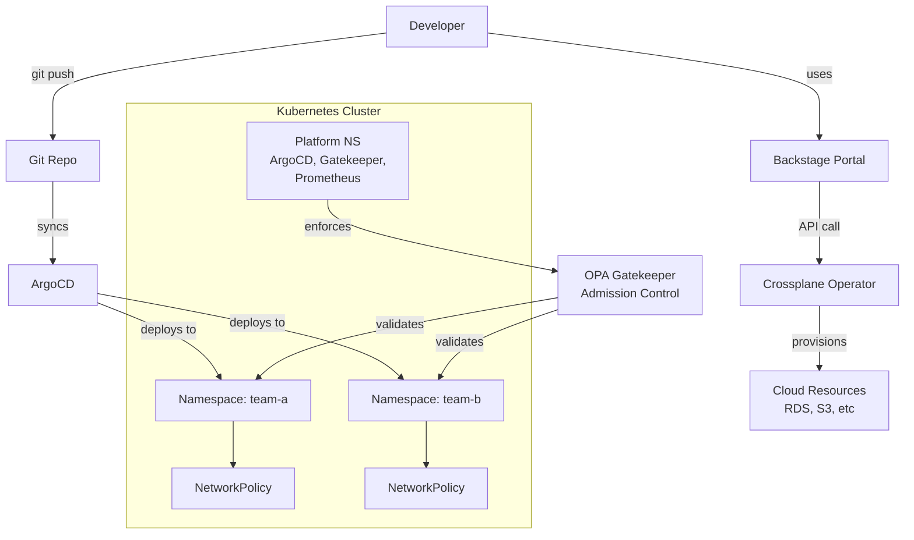

# Platform Engineering - L2 Kubernetes Platform Layer

---

## Keywords in This File

| # | Keyword | Weight |
|---|---|---|
| 1 | [Kubernetes-Based Platform Architecture](#kubernetes-based-platform-architecture) | critical |
| 2 | [Namespace and Tenant Isolation](#namespace-and-tenant-isolation) | high |

---

# Kubernetes-Based Platform Architecture

---
id: PE-013
title: Kubernetes-Based Platform Architecture
category: Platform Engineering
difficulty: ★★☆
interview_weight: critical
asked_at: All
seniority: senior
tags: #platform-engineering, #kubernetes, #architecture, #multi-tenancy
status: draft
version: 1
---

🎯 Interview Weight: critical - Kubernetes is the dominant substrate
for internal developer platforms; every platform engineer interview
asks how you structure Kubernetes for multi-team use.

---

### 🎯 Model Answer

**30 seconds:**
> A Kubernetes-based platform architecture layers platform capabilities
> on top of raw Kubernetes: cluster topology (single vs. multi-cluster),
> tenant isolation (namespaces, network policies, RBAC), golden paths
> (Helm charts, Operators, Crossplane), and a control plane (Backstage,
> ArgoCD, or custom APIs) that developer teams interact with instead of
> raw kubectl. The platform team owns the Kubernetes layer; product teams
> own what runs on it.

**3 minutes (Senior):**
> Most organizations that adopt Kubernetes for developer platforms go
> through a predictable evolution. Phase 1: one cluster per team - simple
> but expensive and operationally overwhelming. Phase 2: shared clusters
> with namespace isolation - cheaper but creates noisy-neighbor problems
> and complex RBAC. Phase 3: a structured multi-cluster topology where
> clusters are segmented by workload class (production, staging, batch)
> or by business unit, with a control plane that abstracts cluster
> selection from product teams.
>
> The platform architecture has three layers. The infrastructure layer
> manages cluster provisioning, upgrades, and fleet management - usually
> with Cluster API or cloud-managed Kubernetes (EKS, GKE, AKS). The
> platform layer installs and manages the standard stack: Ingress
> controllers, cert-manager, service mesh, observability agents,
> policy enforcement (OPA Gatekeeper or Kyverno), and secret management.
> This layer is invisible to product teams. The golden path layer exposes
> curated abstractions - Helm charts, Crossplane Compositions, ArgoCD
> ApplicationSets - that let product teams provision services without
> knowing Kubernetes internals.
>
> The key design decision is what to abstract vs. what to expose. Over-
> abstraction (product teams never touch YAML) creates a support burden
> when abstractions leak. Under-abstraction (product teams manage raw
> Kubernetes) defeats the purpose of a platform. The right balance:
> abstract the cluster lifecycle, network plumbing, and security
> configuration; expose the workload deployment surface through
> controlled APIs.

**Framework:** CLUSTER TOPOLOGY -> ISOLATION MODEL ->
PLATFORM LAYER -> GOLDEN PATH ABSTRACTIONS

*Adapting up:* Staff adds: "The architectural choice that ages worst:
treating namespace isolation as sufficient security isolation. It is
not. Namespace isolation is organizational, not security. For actual
workload isolation, you need separate node pools (if you can tolerate
cost), network policies (necessary but not sufficient), and Pod
Security Standards. At scale, noisy neighbor issues in CPU and memory
are the platform reliability problem you will spend the most time on."

*Adapting down:* Junior: "Kubernetes-based platforms layer tooling
on top of Kubernetes so product teams can deploy without knowing all
the internals. Think of it as Kubernetes with guardrails and defaults
pre-configured. Product teams get a simple 'deploy this app' interface;
the platform team makes that work on top of Kubernetes."

**Blank Mind Recovery:**

**(1) Restate:** "Kubernetes-based platform architecture - let me
walk through the layers and key design decisions."

**(2) First principles:** "Kubernetes provides scheduling, networking,
and storage primitives. A platform architecture answers: how do you
make those primitives safe and accessible for 200 product engineers
who are not Kubernetes experts?"

**(3) Bridge:** "Think of it like an operating system: the kernel
(Kubernetes) is stable and secure, the standard library (platform
layer: cert-manager, ingress, observability) is maintained by the
platform team, and applications (product services) run on top without
needing to understand the kernel."

---

### 📘 Concept Explanation

**What it is:**
A Kubernetes-based platform architecture is the structured layering of
developer platform capabilities on top of Kubernetes clusters. It
defines how clusters are organized, how tenants are isolated, what
platform services are pre-installed, and what abstractions product
teams use to interact with the platform.

**The problem it solves:**
Raw Kubernetes is designed for cluster operators, not application
developers. A product engineer deploying a service needs to understand
Deployments, Services, Ingresses, RBAC, ResourceQuotas, NetworkPolicies,
PodDisruptionBudgets, HorizontalPodAutoscalers, and more. The cognitive
load is prohibitive. A platform architecture defines what product teams
need to know (minimal) vs. what the platform team manages (everything
else), reducing cognitive load to the minimal viable set for each role.

**How it works:**

```
KUBERNETES PLATFORM ARCHITECTURE LAYERS

Layer 4: Developer Interface
  Backstage portal | ArgoCD UI | kubectl (restricted)
  Team interaction surface - intentionally limited

Layer 3: Golden Path Abstractions
  Helm library charts | Crossplane Compositions
  ArgoCD ApplicationSets | Internal operator CRDs
  "Deploy a service" not "write YAML for Deployment+Service+Ingress"

Layer 2: Platform Services (always installed, team-transparent)
  - Ingress: nginx/Traefik ingress controller
  - TLS: cert-manager + Let's Encrypt/Vault
  - Observability: Prometheus + Grafana + Loki agents
  - Service mesh: Istio/Linkerd (optional)
  - Policy: OPA Gatekeeper / Kyverno
  - Secrets: External Secrets Operator
  - GitOps: ArgoCD / Flux

Layer 1: Cluster Infrastructure
  - Cluster provisioning: Cluster API / EKS / GKE / AKS
  - Node pool management: spot/on-demand mix
  - Cluster autoscaler
  - Cluster upgrades (rolling, blue-green)

CLUSTER TOPOLOGY PATTERNS

Single cluster:
  + Simple, cheap, easy to manage
  - Single blast radius, noisy neighbor, complex RBAC
  When: < 10 teams, < 100 services, trusted users only

Multi-cluster by environment:
  dev | staging | production (separate clusters)
  + Production isolation, blast radius contained
  - Multi-cluster networking complexity, cost overhead
  When: production reliability is required

Multi-cluster by workload class:
  user-facing | batch | data | infrastructure clusters
  + Workload-appropriate node pools, cost optimization
  - More complexity, requires cluster federation tooling
  When: mixed workload types with different SLOs

Multi-cluster by business unit:
  + Team autonomy, security isolation
  - Fleet management overhead, inconsistent platform versions
  When: compliance requires separation, M&A integration
```

**The key insight:**
The platform layer is only as good as its upgrade mechanism.
Platform services (cert-manager, ingress, policy) must be upgradable
without product team involvement. This requires the platform team to
own these components through GitOps with automated testing, not manual
upgrades. The test of maturity: can you upgrade OPA Gatekeeper across
your entire fleet in a day without any product team knowing?

**When to use it:**
When you have 20+ product engineers deploying to Kubernetes and the
Kubernetes knowledge required is becoming a bottleneck to shipping.
When platform teams spend more than 30% of their time helping product
teams debug Kubernetes issues.

**When NOT to use it:**
Do not build a Kubernetes platform abstraction for fewer than 5-10
teams. The abstraction layer has a maintenance cost that exceeds the
benefit at small scale. A shared cluster with good documentation and
onboarding is sufficient.

**Alternatives:**
- VM-based platforms (Puppet/Chef) - simpler but less flexible
- Serverless-first (Lambda, Cloud Run) - lower operational overhead
  but less control
- PaaS (Heroku, Render) - zero platform engineering needed,
  but limited customizability

**First-principles derivation:**
Kubernetes gives you the primitives. A platform gives you the defaults.
Given [N product teams] and [Kubernetes cluster], the options are:
(A) each team learns Kubernetes fully (cognitive load too high,
inconsistent practices), (B) a centralized team manages everything
for them (bottleneck, slow), (C) platform team builds abstractions
that let teams self-serve within guardrails (scales with team count,
reduces ops load). Option C is the platform architecture.

---

### 💻 Code Example

**Example 1: BAD vs GOOD - Platform API abstraction**

```yaml
# BAD: product team writes raw Kubernetes YAML
# They need to know Deployment, Service, Ingress,
# ResourceQuota, NetworkPolicy, HPA internals
apiVersion: apps/v1
kind: Deployment
metadata:
  name: payments-api
  namespace: payments-team
spec:
  replicas: 3
  selector:
    matchLabels:
      app: payments-api
  template:
    spec:
      containers:
      - name: payments-api
        image: myregistry/payments-api:v1.2.3
        resources:
          requests:
            cpu: "250m"
            memory: "256Mi"
          limits:
            cpu: "1000m"
            memory: "512Mi"
# ... plus Service, Ingress, HPA, PodDisruptionBudget
# That's 100+ lines of YAML per service
```

```yaml
# GOOD: product team uses platform Helm chart abstraction
# They only specify what varies; platform provides defaults
# Helm values file - everything else is in the library chart
apiVersion: platform.company.com/v1
kind: Service
metadata:
  name: payments-api
spec:
  image: myregistry/payments-api:v1.2.3
  port: 8080
  replicas:
    min: 2
    max: 10
  resources:
    tier: medium          # maps to CPU/memory preset
  ingress:
    host: payments.company.com
  slo:
    availability: 99.9    # platform auto-configures PDB
```

> **Code walkthrough:** The BAD pattern requires product teams to
> understand every Kubernetes resource type, field, and interaction.
> One mistake in resource limits causes OOMKilled; one mistake in
> selector labels causes deployment failure. The GOOD pattern exposes
> only the decisions that vary per service: image, port, scale
> bounds, and SLO. The platform chart fills in the rest from opinionated
> defaults. The result: a junior engineer can deploy a production-grade
> service correctly on first attempt.

**Example 2: Platform policy enforcement (BAD vs GOOD)**

```yaml
# BAD: relying on documentation to enforce policies
# "Please set resource limits on all containers"
# Reality: 30% of deployments lack resource limits,
# causing node OOM and evictions
---
# kubectl get pods -A | grep OOMKilled  # too common
```

```yaml
# GOOD: OPA Gatekeeper policy - enforces at admission time
# Policy: all containers MUST have resource limits
apiVersion: templates.gatekeeper.sh/v1
kind: ConstraintTemplate
metadata:
  name: requireresourcelimits
spec:
  crd:
    spec:
      names:
        kind: RequireResourceLimits
  targets:
  - target: admission.k8s.gatekeeper.sh
    rego: |
      package requireresourcelimits
      violation[{"msg": msg}] {
        container := input.review.object.spec
          .containers[_]
        not container.resources.limits.cpu
        msg := sprintf(
          "Container %v must set CPU limits",
          [container.name]
        )
      }
```

> **Code walkthrough:** The BAD pattern relies on humans following
> documentation. The GOOD pattern uses OPA Gatekeeper to enforce
> the policy at admission time - the Kubernetes API server rejects
> any Deployment missing resource limits before it is written to etcd.
> This means the policy cannot be violated, regardless of how the
> deployment was created (kubectl, ArgoCD, Helm, or CI). Policy as
> code converts "best practices" into hard constraints enforced by
> the system, not by humans.

**Example 3: Crossplane for self-service infrastructure (production pattern)**

```yaml
# Platform team defines Composition (once, maintained by platform)
apiVersion: apiextensions.crossplane.io/v1
kind: Composition
metadata:
  name: postgres.platform.company.com
spec:
  compositeTypeRef:
    apiVersion: platform.company.com/v1alpha1
    kind: Database
  resources:
  - name: rds-instance
    base:
      apiVersion: rds.aws.upbound.io/v1beta1
      kind: Instance
      spec:
        forProvider:
          region: us-east-1
          instanceClass: db.t3.medium  # platform default
          engine: postgres
          engineVersion: "15"
          multiAZ: true               # always HA in prod
    patches:
    - type: FromCompositeFieldPath
      fromFieldPath: spec.size
      toFieldPath: spec.forProvider.instanceClass
      transforms:
      - type: map
        map:
          small: db.t3.small
          medium: db.t3.medium
          large: db.r6g.large

---
# Product team claims a database (self-service, no ticket needed)
apiVersion: platform.company.com/v1alpha1
kind: Database
metadata:
  name: payments-postgres
  namespace: payments-team
spec:
  size: medium              # only decision left to team
  engine: postgres
  writeConnectionSecretToRef:
    name: payments-db-creds # auto-provisioned secret
```

> **Code walkthrough:** The Crossplane Composition defines HOW a
> PostgreSQL database is provisioned on AWS (with platform-mandated
> HA, backup, encryption defaults). Product teams only specify WHAT
> they need: a medium PostgreSQL database. The Composition translates
> that into the full AWS resource configuration. No ticket to the
> platform team, no waiting, no RDS console access needed. Connection
> credentials are automatically written to a Kubernetes Secret.
> This is the self-service IDP pattern: platform team maintains the
> Composition once, product teams consume it N times.

---

### 🎓 Answers by Seniority

**Junior / Mid (0-5 years):**
> A Kubernetes-based platform architecture layers tooling on top of
> Kubernetes to make it accessible for product teams. Instead of
> product engineers learning Deployments, Services, Ingresses, RBAC,
> and resource limits, they interact with simpler abstractions - Helm
> charts with sane defaults, portal UIs, or custom CRDs that accept
> high-level inputs. The platform team manages the underlying Kubernetes
> complexity. The goal: product teams deploy services without becoming
> Kubernetes experts.

*Push deeper:* "The key tools: ArgoCD or Flux for GitOps deployments,
Helm charts for packaging, OPA Gatekeeper or Kyverno for policy
enforcement, Crossplane for self-service cloud resources, and Backstage
as a developer portal."

---

**Senior / Staff (5+ years):**
> Kubernetes-based platform architecture is about determining the right
> abstraction boundary. Too high an abstraction and product teams cannot
> debug when the abstraction leaks. Too low and they become Kubernetes
> operators. The right boundary typically sits at: cluster lifecycle
> (platform-managed), network plumbing and certs (platform-managed),
> workload configuration (product team, with guardrails), and cloud
> resources (self-service via Crossplane Compositions).
>
> The production reliability challenge: cluster upgrade cadence. Kubernetes
> releases quarterly. Platform teams that do not keep up accumulate
> version debt that eventually forces painful emergency upgrades. Mature
> platform teams run a blue-green cluster upgrade strategy: provision
> new cluster with new K8s version, migrate workloads via ArgoCD App
> of Apps pattern, validate, decommission old cluster. Zero-downtime
> cluster upgrades are achievable but require 6-12 months of process
> maturity to execute reliably.

*Push deeper:* "At Staff level: the cost model matters. A multi-cluster
topology can easily 2-3x infrastructure costs without careful node
pool design. The right approach: prod clusters with on-demand nodes
for predictable workloads + spot node pools for batch/CI. Dev clusters
with aggressive spot usage and vertical pod autoscaling. Cluster
autoscaler tuned to balance warmup latency vs cost."

---

### ⚠️ Common Misconceptions

**Misconception: "Namespace isolation is security isolation."**

Namespaces are an organizational boundary, not a security boundary.
By default, pods in different namespaces can communicate freely.
Network policies are required to restrict cross-namespace traffic,
but even with network policies, a compromised pod can attempt
container escapes that affect the entire node (and thus other
tenants on that node). For true workload isolation between untrusted
tenants, you need separate node pools or separate clusters.

**Misconception: "More Kubernetes abstractions = better developer experience."**

Abstractions help until they break. When a product team's deployment
fails and the error message is from an internal platform abstraction
layer, they cannot debug it without platform team help. Good
abstraction design means the failure surface is visible and
debuggable at the product team layer. The rule: every abstraction
must produce debuggable errors at the level of the person consuming it.

**Misconception: "Kubernetes operators solve the upgrade problem."**

Operators manage application lifecycle within a cluster, but they
do not solve the cluster upgrade problem. Kubernetes itself must be
upgraded separately. Operators add complexity (custom CRDs, controllers)
that can break during cluster upgrades if the operator version is
not compatible with the new Kubernetes version. Track operator
compatibility matrices before every cluster upgrade.

---

### 🚨 Failure Modes and Diagnosis

**Failure mode: Noisy neighbor CPU throttling**

Symptom: Intermittent high latency on specific services that appears
unrelated to their own load. Services report "normal" metrics but
users experience degradation.

Cause: CPU throttling from CFS (Completely Fair Scheduler) when
pods have CPU limits set. CPU limits cause hard throttling - the pod
is paused even when physical CPU is available. This affects p99/p999
latency without affecting average latency.

Diagnosis:
```bash
# Check for CPU throttling in Prometheus
container_cpu_cfs_throttled_periods_total /
container_cpu_cfs_periods_total
# > 25% throttling = latency impact confirmed

kubectl top pods -n affected-namespace --sort-by=cpu
```

Fix: Remove CPU limits (set requests only) for latency-sensitive
services. Use ResourceQuota at namespace level to prevent CPU abuse.
This is the Kubernetes community consensus (see Omission of CPU
limits recommendation from Uber and Google SREs).

**Failure mode: PodPending due to resource fragmentation**

Symptom: Pods stuck in Pending state despite cluster having
apparently sufficient resources. `kubectl describe pod` shows
`0/5 nodes are available: insufficient memory`.

Cause: Memory fragmentation. Five nodes each have 500Mi free, but
pod requests 1Gi. No single node has enough contiguous memory.

Diagnosis:
```bash
kubectl describe nodes | grep -A5 "Allocated resources"
# Shows per-node allocation vs capacity

kubectl get events --field-selector \
  reason=FailedScheduling
```

Fix: Reduce pod memory requests (right-size based on actual
usage via VPA recommendations), add nodes, or enable Descheduler
to defragment existing workloads.

---

### 🎯 Interview Deep-Dive

**Timing:** Medium ★★☆ - 9 questions minimum.

---

#### Q1 - How do you decide between single-cluster and multi-cluster topology?

The decision factors, in order of importance:

1. Blast radius: a misconfigured admission webhook can take down
   an entire cluster. In a single-cluster topology, that affects
   all teams. In multi-cluster, only that cluster's teams. The
   blast radius question is the primary driver.

2. Compliance and data residency: regulated workloads (PCI, HIPAA,
   SOC2) often require isolation that namespaces cannot provide.
   Separate clusters give a cleaner compliance boundary.

3. Team size and cognitive load: below 20 teams, a single cluster
   with good namespace hygiene is manageable. Above 50 teams,
   multi-cluster is almost always worth the operational overhead.

4. Cost: each cluster has fixed overhead (control plane, system
   pods, monitoring agents). At small scale, this overhead matters.
   At large scale, it is noise.

Decision framework:
```
< 10 teams:  Single cluster, namespace isolation
10-30 teams: Multi-cluster by environment (dev/staging/prod)
30-50 teams: Multi-cluster by environment + workload class
> 50 teams:  Multi-cluster by BU or product domain
```

*What separates good from great:* The answer to this question
in an interview reveals whether you have operated clusters at
scale vs. designed them on paper. The noisy-neighbor and blast-
radius arguments come from operating clusters, not reading docs.
Name a specific incident where blast radius caused you to move
from single to multi-cluster.

---

#### Q2 - What is the Platform Team's relationship to Kubernetes upgrades?

Kubernetes releases every 4 months. Each release is supported for
about 14 months (3 minor versions back). Teams that fall behind
face emergency upgrades, which are risky and expensive.

Platform team responsibilities:
1. Track Kubernetes release calendar and plan upgrades quarterly
2. Test platform stack (cert-manager, ingress, Gatekeeper, ArgoCD)
   compatibility against each new Kubernetes version before upgrading
3. Communicate breaking changes to product teams 4-6 weeks before
   the upgrade window
4. Execute cluster upgrades via blue-green strategy (new cluster,
   migrate traffic, decommission old)
5. Maintain a version policy: all clusters must stay within N-1
   of the latest release

The failure mode to avoid: treating cluster upgrades as optional
until they become critical. At N-3 minor versions, critical CVEs
often have no patch and the only fix is an emergency upgrade.

*What separates good from great:* Having operated a cluster that
fell behind by 3 versions and understanding the full cost of that
debt: emergency upgrade under time pressure, potential breaking
changes across 3 releases, API deprecations that require product
team YAML changes. The experience of emergency cluster upgrades
teaches more than any design document.

---

#### Q3 - How do you implement multi-tenancy safely on Kubernetes?

Multi-tenancy requires defense in depth because each layer has gaps:

Layer 1 - Namespace isolation: organizational boundary only. Provides
RBAC scope and resource quota scope. Does NOT prevent pod-to-pod
network communication or node-level resource contention.

Layer 2 - NetworkPolicies: restricts pod-to-pod traffic. Required
for any meaningful network isolation. Default-deny ingress and egress
with explicit allow rules per namespace. Note: network policies require
a CNI that supports them (Calico, Cilium, WeaveNet - NOT Flannel).

Layer 3 - PodSecurityStandards (replaces PodSecurityPolicies in K8s 1.25+):
Enforces pod security at admission. Three levels:
- Privileged: no restrictions (only for system namespaces)
- Baseline: prevents known privilege escalations
- Restricted: heavily restricted (required for untrusted workloads)

Layer 4 - ResourceQuota + LimitRange: prevents resource exhaustion
per namespace. ResourceQuota sets namespace-level ceilings; LimitRange
sets per-pod defaults and limits.

Layer 5 - Separate node pools (for strong isolation): node affinity +
taints/tolerations to pin tenant workloads to dedicated node pools.
Prevents container escape from affecting other tenants.

True hard multi-tenancy (untrusted code from multiple organizations):
requires separate clusters. Kubernetes was designed for trusted
multi-tenancy, not adversarial multi-tenancy.

*What separates good from great:* Understanding that each layer has
a specific failure mode: namespaces break for security, network
policies break for compliance, node pools break for cost. The
right tenancy model depends on the threat model, not a template.

---

#### Q4 - What is the role of an Operator in a platform architecture?

A Kubernetes Operator is a custom controller that automates the
management of a complex stateful application or infrastructure
resource by encoding domain knowledge into the controller loop.

In platform architecture, Operators serve two roles:

Platform-installed Operators (managed by platform team):
- cert-manager: certificate lifecycle management
- External Secrets Operator: syncs secrets from Vault/AWS SM
- Prometheus Operator: manages Prometheus CRDs
- ArgoCD: manages application deployments
These are installed cluster-wide and maintained by the platform team.

Custom Platform Operators (built by platform team):
- DatabaseClaim Operator: product teams request databases via CRD;
  operator provisions RDS/Cloud SQL/Spanner
- TenantOperator: manages namespace lifecycle, RBAC, quotas when
  a new team is onboarded
- CostOperator: tracks per-namespace spend and enforces budgets

The build-vs-use decision for custom Operators: Crossplane can often
replace custom Operators for cloud resource management. Build a
custom Operator only when Crossplane's Composition model cannot
express the required logic (stateful workflows, cross-resource
dependencies, complex validation).

*What separates good from great:* Operators are complex to build
and maintain. The operational overhead of a custom Operator includes:
CRD versioning (migration between v1alpha1, v1beta1, v1), leader
election, error handling, retry logic, and testing. Before building
a custom Operator, evaluate: Helm chart, Kustomize, Crossplane
Composition, then Operator - in that order of complexity.

---

#### Q5 - How do you handle a Kubernetes platform migration for 50 teams?

A 50-team Kubernetes platform migration is a multi-month program,
not a technical upgrade. The failure mode is treating it as a
technical project.

Migration framework:

Phase 1 - Assessment (2-4 weeks):
Inventory all services (Helm charts, custom YAML, Kustomize), identify
dependencies on deprecated APIs, document custom admission webhooks
and CRDs that block migration.

Phase 2 - Golden path migration (4-8 weeks):
Migrate the platform's own tooling first (ArgoCD, cert-manager,
Gatekeeper) to the new cluster. Establish the new golden path.
Migrate 3-5 volunteer "pioneer" teams who accept risk in exchange
for early mover advantage.

Phase 3 - Wave migration:
Group teams by risk profile. Low-risk (stateless services, no custom
operators) in early waves. High-risk (stateful, complex dependencies)
in late waves. Each wave: migrate to new cluster, run dual-write or
traffic split for validation, cut over, decommission.

Phase 4 - Forced migration with deadline:
Set a hard decommission date for the old cluster. Teams that have not
migrated get assistance but cannot block the deadline.

Critical success factors:
- Platform team migrates their own tooling first (eats their own
  dog food, discovers issues before product teams do)
- Migration tooling is self-service (teams can trigger their own
  migration, not wait for platform team)
- Rollback is always available until the old cluster is decommissioned

*What separates good from great:* The migration deadline is politically
difficult but technically necessary. Without it, some teams will
not migrate until the old cluster fails. Setting and enforcing the
deadline while providing genuine migration support is the staff-level
leadership skill this question is probing for.

---

#### Q6 - What metrics does a platform team track for platform health?

Platform metrics divide into two categories: platform operational
health and developer experience health.

**Platform operational health:**
- Cluster availability: API server uptime (target 99.99%)
- Control plane latency: P99 of kubectl operations
- Node availability: nodes in Ready state / total nodes
- Platform component error rates: ArgoCD sync failures,
  cert-manager renewal failures, Gatekeeper violations
- Cluster upgrade lag: days since Kubernetes version released
  vs days since applied

**Developer experience health:**
- Deployment success rate: successful deploys / total deploys
- Time to first deployment: new team onboarding time in minutes
- Mean time to self-serve: time from "I need X" to X deployed
  without platform team involvement
- Support ticket volume: tickets to platform team per week
  (decreasing = better self-service; increasing = abstraction gaps)
- DORA metrics per team: deployment frequency, lead time, MTTR
  (platform should improve these over time)

The critical insight: pure Kubernetes metrics (pod restarts, CPU
utilization) are platform operational metrics. The metrics that
reveal whether the platform is delivering value are developer
experience metrics. Teams that track only operational metrics do
not know if their platform is helping or hindering product delivery.

*What separates good from great:* Knowing that support ticket volume
is an anti-metric - you want it to decrease over time as the platform
improves. A platform that generates growing support tickets is a
platform that has not automated its common failure modes. Tracking
"time to self-serve" is the metric that reveals whether the platform
is actually reducing cognitive load.

---

#### Q7 - How does service mesh fit into a Kubernetes platform architecture?

A service mesh (Istio, Linkerd, Cilium) provides mTLS between services,
observability (L7 metrics, distributed tracing), and traffic management
(canary deployments, circuit breaking) at the infrastructure layer.

In platform architecture, service mesh is a platform-managed component
that product teams benefit from without configuring. The platform team
installs the mesh, product teams get mTLS and L7 metrics automatically.

The trade-off:
Pro: zero-config mTLS, automatic service-to-service observability,
     traffic management for canary releases, zero-trust network posture
Con: sidecar overhead (each pod gets an envoy proxy: 50-100MB memory,
     small CPU cost), increased operational complexity (mesh control
     plane is another system to operate), L7 latency addition (1-2ms)

When to adopt service mesh:
- You have a zero-trust network requirement (mTLS between services)
- You are doing canary deployments at scale
- You need per-service L7 metrics without application-level instrumentation
- You have a service mesh operator on the platform team

When NOT to adopt service mesh:
- < 20 services (overhead exceeds benefit)
- No one on the platform team has operated a service mesh in production
  (mesh incidents are complex; you need the operator expertise)
- Budget constraints (sidecar memory cost compounds across hundreds of pods)

eBPF-based meshes (Cilium) are reducing the sidecar overhead: CNI-level
interception without per-pod proxies. This is the direction the ecosystem
is moving for new deployments.

*What separates good from great:* Having operated a service mesh
incident (split-brain control plane, sidecar crash causing traffic
loss, certificate rotation failure) and knowing what the operational
blast radius is. Service mesh control plane failures can affect all
inter-service traffic simultaneously - understanding this blast radius
is what drives mature platform teams toward careful canary rollouts of
mesh versions.

---

#### Q8 - What is the Kubernetes API deprecation strategy for a platform team?

Kubernetes deprecates APIs on a version schedule (typically 2-3 versions
before removal). API deprecation affects both platform components and
product team workloads.

Platform team deprecation strategy:

Step 1 - Detection: Run `kubectl convert` and `kubent` (kube-no-trouble)
against all deployed YAML to identify deprecated API usage before upgrading.
```bash
kubent --target-version 1.29
# Output: files/resources using deprecated APIs
```

Step 2 - Communication: 2 release cycles before removal, issue a
deprecation notice to all teams with specific resources affected
and migration path.

Step 3 - Platform tooling migration: migrate platform components first
(ArgoCD, cert-manager, Helm chart CRDs) before any product team migration.

Step 4 - Automated migration (where possible): provide scripts or
ArgoCD hooks that convert deprecated API versions automatically in
team repositories.

Step 5 - Hard migration date: enforce via admission webhook that
rejects deprecated API versions 4 weeks before the cluster upgrade.

The critical failure mode: skipping Step 1 (detection) and discovering
deprecated API usage after the cluster upgrade, when the API no longer
works. This causes immediate production incidents.

*What separates good from great:* Building the detection tooling into
CI/CD so that deprecated API usage is caught at PR time, not at cluster
upgrade time. The earlier in the pipeline you catch deprecated APIs,
the cheaper the migration.

---

#### Q9 - Describe a major Kubernetes platform incident and what it taught you.

*This is an open question designed to probe production experience.
Here are two realistic incident patterns:*

**Incident A: Admission webhook outage**

A new OPA Gatekeeper policy was deployed with a configuration error.
The webhook timeout was set to "Fail" (reject if webhook cannot be
reached) rather than "Ignore." When Gatekeeper's pod failed during
a restart, ALL new pod schedules failed across the entire cluster
because the admission webhook was unreachable and set to Fail mode.

Impact: 45-minute window where no new pods could be scheduled.
Rollout deployments were blocked. HPA scale-out was blocked. Services
running on spot nodes that were terminated could not be replaced.

Lesson: admission webhooks with "Fail" mode are a single point of
failure for the entire cluster. Platform policy: Gatekeeper must
always run with >=3 replicas, PodDisruptionBudget of 1, and
webhooks must have reasonable timeouts. Platform team now tests
Gatekeeper HA by killing all Gatekeeper pods in staging before
any production deployment.

*What separates good from great:* The response to a platform incident
that affected 50 product teams - how you communicated, how quickly
you identified root cause, what systemic changes you made. This reveals
your incident response maturity and your ownership of platform reliability.

---

### ⚖️ Comparison Table

| Isolation Model | Security Level | Cost | Operational Overhead | Use When |
|---|---|---|---|---|
| Shared cluster, namespaces | Low | Low | Low | Internal, trusted teams, < 20 teams |
| Shared cluster + NetworkPolicy | Medium | Low | Medium | Internal, moderate trust, 20-50 teams |
| Cluster per environment | High (prod) | Medium | Medium | Production isolation required |
| Cluster per business unit | High | High | High | Compliance, > 50 teams, M&A |
| Separate node pools | High | Medium | Medium | Mixed SLOs, trusted tenants |

**The deciding factor:**
Compliance requirements determine isolation model first; operational
capacity determines how many clusters you can realistically operate.

---

### 🏛️ System Design

*(Conditional: included because ★★★-adjacent - multi-team platform
architecture is a system design interview topic for senior and above.)*

**Where Kubernetes Platform Architecture appears in system design:**
- "Design an internal developer platform for 100 teams"
- "How would you enable self-service deployments without loss of governance?"
- "Design the platform that powers a multi-tenant SaaS product"

**Example question:** Design a Kubernetes-based developer platform
for 50 engineering teams across 3 business units.

**6-step framework:**
Step 1 CLARIFY (~5 min) - What is the team-to-cluster ratio target?
What are the compliance requirements? What cloud provider?
What is the current operational maturity?

Step 2 ESTIMATE (~5 min) - 50 teams * 10 services = 500 services.
~2-3 clusters (prod, staging, dev). ~50 namespaces in prod.
~100 pods average per namespace in prod = 5,000 pods.

Step 3 DESIGN (~10 min) - Three-cluster topology (dev, staging, prod).
GitOps with ArgoCD App of Apps. Backstage for portal. Crossplane
for cloud resources. OPA Gatekeeper for policy.

Step 4 DEEP DIVE (~10 min) - The isolation model is the core
design decision. With 3 BUs, compliance may require cluster-per-BU
(discuss trade-off). Platform layer: cert-manager, Gatekeeper,
Prometheus Operator, External Secrets Operator. Golden path:
Helm library chart + ArgoCD ApplicationSet template.

Step 5 ALTS (~5 min) - Evaluated Nomad (less ecosystem), raw
Docker Swarm (less feature-rich), Managed PaaS (too restrictive
for 50 teams with varied needs).

Step 6 EVOLVE (~5 min) - At 200 teams: cluster per domain with
fleet management (Cluster API). Multi-cluster networking (Submariner
or Cilium Cluster Mesh). Cost allocation per team.

**Scale inflection point:**
At 50+ namespaces per cluster, etcd size and API server load become
measurable constraints. At 5,000+ pods, scheduler decisions slow
down. Cluster autoscaler becomes a bottleneck when scaling up 50
pods simultaneously (node provisioning latency). These are the
platform reliability problems that become visible at this scale.

**Common system design traps:**
- Proposing a single cluster for all 50 teams without discussing
  blast radius (shows no production experience)
- Adding service mesh without discussing operational expertise
  required (sounds sophisticated, is a trap if the team cannot operate it)
- Proposing custom platform tooling when open source exists
  (NIH anti-pattern)

**Staff angle:** The 3-cluster architecture is correct for today
but creates fleet management overhead at 10-cluster scale. The staff
question: is the organizational investment in custom GitOps tooling,
cluster fleet management, and platform team headcount worth it vs.
a managed platform (GKE Autopilot + Config Connector)?
The ROI calculation is the staff conversation.

---

### 📊 Diagram

*(Conditional: included because multi-layer platform architecture
requires visual explanation.)*

```
KUBERNETES PLATFORM ARCHITECTURE

Developer Portal (Backstage)
    |                |
    v                v
[Self-Service     [App Deploy]
 Resources]       (ArgoCD)
    |                |
    v                v
[Crossplane     [GitOps Repo]
 Compositions]      |
    |               v
    +------>[Kubernetes Cluster]
                    |
      +-------------+-------------+
      |             |             |
  [Platform      [Product     [Product
   Namespace]    NS: team-a]  NS: team-b]
   ArgoCD          |             |
   Gatekeeper     pods          pods
   Prometheus      |             |
   cert-manager  [NetworkPolicy] [NetworkPolicy]
      |
  [Node Pool: platform]
  [Node Pool: prod-workloads]
  [Node Pool: spot-batch]
```



> **Diagram walkthrough:** The developer has two entry points:
> the Backstage portal for self-service resource provisioning (databases,
> queues via Crossplane), and git for application deployments (via ArgoCD).
> All deployments flow through OPA Gatekeeper at admission, enforcing
> platform policies before workloads are scheduled. NetworkPolicies
> enforce namespace-level traffic isolation. The platform namespace runs
> the infrastructure components maintained by the platform team - product
> team namespaces never directly interact with these components.

---

---

# Namespace and Tenant Isolation

---
id: PE-014
title: Namespace and Tenant Isolation
category: Platform Engineering
difficulty: ★★☆
interview_weight: high
asked_at: All
seniority: senior
tags: #platform-engineering, #kubernetes, #multi-tenancy, #security, #rbac
status: draft
version: 1
---

🎯 Interview Weight: high - multi-tenancy and isolation are core
platform engineering interview topics; understanding what namespaces
do and do not provide is a key senior signal.

---

### 🎯 Model Answer

**30 seconds:**
> Kubernetes namespaces provide organizational isolation: separate
> RBAC scope, ResourceQuota boundaries, and NetworkPolicy targets.
> They do NOT provide security isolation by default - pods in different
> namespaces can communicate freely unless NetworkPolicies are applied.
> True tenant isolation requires namespaces + NetworkPolicies + Pod
> Security Standards + ResourceQuotas, and for hard security isolation,
> separate node pools or separate clusters.

**3 minutes (Senior):**
> When platform teams talk about namespace isolation, they need to be
> precise about what they mean. Namespaces provide four things: RBAC
> scope (team-a cannot see or modify team-b's resources), ResourceQuota
> scope (team-a's CPU/memory usage does not count against team-b's
> quota), NetworkPolicy targets (you can write "deny all traffic to
> namespace team-b"), and name scoping (two services named "api" can
> coexist in different namespaces). What namespaces do NOT provide:
> network isolation (without NetworkPolicies), node isolation (pods
> from different namespaces can land on the same node), and container
> isolation (a container escape affects the node regardless of namespace).
>
> Multi-tenancy in Kubernetes is usually described in two models:
> soft multi-tenancy (teams are trusted, namespaces provide organizational
> separation) and hard multi-tenancy (tenants are untrusted, isolation
> must prevent any cross-tenant impact). Most internal platforms are
> soft multi-tenancy. SaaS products with customer workloads running on
> Kubernetes require hard multi-tenancy, which Kubernetes does not
> provide natively - you need separate clusters or specialized
> tooling (vcluster, Loft).
>
> The production pain point: noisy neighbors. CPU and memory limits
> apply per pod, but node-level resources (disk I/O, network bandwidth,
> kernel parameters) are shared and uncontrolled by Kubernetes. A
> pod doing heavy disk I/O degrades all other pods on the same node.
> The mitigation: dedicated node pools for workload classes, combined
> with node affinity and taints/tolerations.

**Framework:** ORGANIZATIONAL ISOLATION -> NETWORK ISOLATION ->
RESOURCE ISOLATION -> SECURITY ISOLATION

*Adapting up:* Staff adds: "The failure mode that reveals insufficient
isolation thinking: a compliance audit requiring proof of data
isolation between business units. At that point you realize namespaces
alone do not satisfy auditors. The architectural consequence: separate
clusters per compliance domain, at the cost of operational overhead."

*Adapting down:* Junior: "Namespaces in Kubernetes are like folders -
they organize resources and set access boundaries. But unlike OS
folders, they don't automatically block network traffic. You have
to explicitly add NetworkPolicies to restrict which services can talk
to each other."

**Blank Mind Recovery:**

**(1) Restate:** "Namespace and tenant isolation in Kubernetes - let
me walk through what namespaces provide and what they don't."

**(2) First principles:** "In any multi-tenant system, you need to
isolate: access control, resource usage, network traffic, and security
posture. Kubernetes namespaces handle access control and resource
quotas, but require additional tooling for the others."

**(3) Bridge:** "It's like an apartment building: namespaces are walls
(separate space, separate keys), but the building's electrical system
and water supply are still shared. You need additional isolation
layers for anything that goes through shared infrastructure."

---

### 📘 Concept Explanation

**What it is:**
Namespace and tenant isolation is the set of Kubernetes mechanisms
that separate the resources, access, network traffic, and resource
usage of different teams or customers (tenants) sharing a cluster.
It is not a single feature but a layered combination of namespaces,
RBAC, NetworkPolicies, ResourceQuotas, LimitRanges, and Pod Security
Standards.

**The problem it solves:**
Running multiple teams on a shared cluster without isolation creates:
operational problems (team-a's misconfigured pod steals team-b's CPU),
security problems (compromised team-a pod can reach team-b services),
and governance problems (no per-team resource accounting or quota
enforcement). Proper isolation solves all three - but different
isolation layers are needed for each problem.

**How it works:**

```
KUBERNETES ISOLATION LAYERS

LAYER 1: RBAC (access control)
  Role: who can do what in which namespace
  ClusterRole: who can do what cluster-wide
  RoleBinding: bind Role to ServiceAccount/User in namespace
  ClusterRoleBinding: bind ClusterRole cluster-wide

  What it solves: team-a engineers cannot delete
                  team-b deployments
  What it does NOT solve: pod-level network access

LAYER 2: NAMESPACES (organizational boundary)
  Separate name scope for resources
  Separate RBAC scope (Roles are namespace-scoped)
  Separate ResourceQuota scope
  Reference target for NetworkPolicies

  What it solves: name conflicts, RBAC scoping
  What it does NOT solve: network traffic, node sharing

LAYER 3: NETWORK POLICIES (network isolation)
  Ingress rules: who can connect TO this namespace
  Egress rules: what this namespace can connect TO
  Label selectors: precise pod-level targeting

  Default-deny pattern (production best practice):
  # Deny all ingress to namespace by default
  apiVersion: networking.k8s.io/v1
  kind: NetworkPolicy
  spec:
    podSelector: {}    # all pods in namespace
    policyTypes: [Ingress, Egress]
    # No ingress/egress rules = deny all

  Then add explicit allow rules per required path.

  What it solves: lateral movement between namespaces
  What it does NOT solve: node-level resources, kernel

LAYER 4: RESOURCE QUOTAS (resource isolation)
  Namespace-level ceilings:
  - requests.cpu: total CPU requests allowed
  - requests.memory: total memory requests allowed
  - limits.cpu: total CPU limits allowed
  - count/pods: max pod count
  - count/services: max service count

  Prevents: one namespace consuming all cluster resources
  Requires: all pods to set requests/limits (enforced by LimitRange)

LAYER 5: POD SECURITY STANDARDS (security posture)
  Privileged: no restrictions (system namespaces only)
  Baseline: blocks known privilege escalation vectors
  Restricted: maximum restrictions, no hostPath,
              no privileged containers, non-root required

  Applied via namespace label:
  pod-security.kubernetes.io/enforce: restricted

LAYER 6: NODE POOLS (hardware isolation)
  Separate node pools with taints:
  - kubectl taint nodes pool=team-a:NoSchedule
  - Pod adds toleration to land on specific pool
  Prevents: noisy neighbor at node resource level
  Cost: dedicated nodes have lower utilization
```

**The key insight:**
Namespace isolation is additive, not automatic. A namespace with no
NetworkPolicies, no ResourceQuotas, and Privileged pod security
provides almost no isolation except RBAC scope. Platform teams must
deliberately compose all five layers to achieve the intended isolation
level. The most common production gap: teams add namespaces and RBAC
but never add NetworkPolicies, leaving lateral movement paths open.

**When to use it:**
Namespace isolation (with all five layers) is appropriate for soft
multi-tenancy: trusted internal teams sharing a cluster. Hard multi-
tenancy (untrusted tenants, customer workloads) requires separate
clusters or vcluster.

**When NOT to use it:**
Do not use namespace isolation as the sole mechanism for PCI or HIPAA
compliance. Auditors typically require evidence of network isolation
that goes beyond Kubernetes NetworkPolicies (which they may not
understand). Separate clusters with documented network isolation are
more defensible in compliance contexts.

**Alternatives:**
- Separate clusters per tenant: hard isolation, operational overhead
- vcluster: virtual Kubernetes clusters within a namespace (near-hard
  isolation, moderate overhead)
- Loft / Rancher Fleet: fleet management with per-tenant cluster provisioning

**First-principles derivation:**
Multi-tenancy requires: (1) access control (who can modify what) -
solved by RBAC + namespaces, (2) resource fairness (no one tenant
consumes all resources) - solved by ResourceQuota, (3) network
isolation (no unauthorized lateral movement) - solved by NetworkPolicy,
(4) security posture (no privilege escalation) - solved by PodSecurityStandards,
(5) hardware isolation (no CPU/memory contention) - requires node pools.
Each is a separate problem requiring a separate mechanism. Namespace
alone solves only #1 partially.

---

### 💻 Code Example

**Example 1: Namespace setup BAD vs GOOD**

```yaml
# BAD: bare namespace with no policies
# Provides only name scoping and RBAC scope
# Network traffic: unrestricted
# Resources: unbounded
# Security: no enforcement
apiVersion: v1
kind: Namespace
metadata:
  name: team-payments
```

```yaml
# GOOD: namespace with full isolation stack
# 1. Namespace with security label
apiVersion: v1
kind: Namespace
metadata:
  name: team-payments
  labels:
    pod-security.kubernetes.io/enforce: restricted
    pod-security.kubernetes.io/warn: restricted

---
# 2. ResourceQuota for the namespace
apiVersion: v1
kind: ResourceQuota
metadata:
  name: team-payments-quota
  namespace: team-payments
spec:
  hard:
    requests.cpu: "20"
    requests.memory: 40Gi
    limits.cpu: "40"
    limits.memory: 80Gi
    count/pods: "100"

---
# 3. LimitRange: default requests/limits for any pod
#    without explicit values (prevents OOMKilled pods)
apiVersion: v1
kind: LimitRange
metadata:
  name: team-payments-limits
  namespace: team-payments
spec:
  limits:
  - default:
      cpu: "500m"
      memory: 256Mi
    defaultRequest:
      cpu: "100m"
      memory: 128Mi
    type: Container

---
# 4. Default-deny NetworkPolicy
apiVersion: networking.k8s.io/v1
kind: NetworkPolicy
metadata:
  name: default-deny
  namespace: team-payments
spec:
  podSelector: {}
  policyTypes:
  - Ingress
  - Egress

---
# 5. Allow only needed egress (DNS + team's services)
apiVersion: networking.k8s.io/v1
kind: NetworkPolicy
metadata:
  name: allow-dns-egress
  namespace: team-payments
spec:
  podSelector: {}
  policyTypes: [Egress]
  egress:
  - ports:
    - port: 53
      protocol: UDP
    - port: 53
      protocol: TCP
```

> **Code walkthrough:** The BAD pattern creates an organizational
> boundary but leaves all isolation gaps open. The GOOD pattern
> applies all five isolation layers: PodSecurityStandards enforced
> via namespace label, ResourceQuota preventing resource exhaustion,
> LimitRange ensuring every pod has requests/limits (required for
> quota enforcement), default-deny NetworkPolicy blocking all
> unintended lateral movement, and explicit allow NetworkPolicy
> for DNS (without which pods cannot resolve service names).
> Every layer closes a specific gap that the others leave open.

**Example 2: RBAC scoping for team isolation**

```yaml
# Platform team creates namespace-scoped Role
# (NOT ClusterRole - team should not have cluster-wide access)
apiVersion: rbac.authorization.k8s.io/v1
kind: Role
metadata:
  name: team-deployer
  namespace: team-payments
rules:
- apiGroups: ["apps"]
  resources: ["deployments", "replicasets"]
  verbs: ["get", "list", "watch", "create", "update", "patch"]
- apiGroups: [""]
  resources: ["pods", "pods/log", "services", "configmaps"]
  verbs: ["get", "list", "watch"]
- apiGroups: [""]
  resources: ["secrets"]
  verbs: ["get"]  # read-only; no create/update on secrets
---
# Bind to team's ServiceAccount (used by CI/CD)
apiVersion: rbac.authorization.k8s.io/v1
kind: RoleBinding
metadata:
  name: team-payments-ci
  namespace: team-payments
subjects:
- kind: ServiceAccount
  name: team-payments-ci
  namespace: team-payments
roleRef:
  kind: Role
  name: team-deployer
  apiGroup: rbac.authorization.k8s.io
```

> **Code walkthrough:** The Role is namespace-scoped (not a
> ClusterRole) so team-payments CI cannot read or modify resources
> in other namespaces. The Role grants deployment permissions but
> only read access to secrets (CI should not be able to exfiltrate
> secrets). RoleBinding binds to a ServiceAccount (not a user) so
> the binding can be used by the CI system without long-lived
> user credentials. This is the minimum RBAC grant for a CI/CD
> system: can deploy, cannot read secrets, cannot affect other
> namespaces.

---

### 🎓 Answers by Seniority

**Junior / Mid (0-5 years):**
> Kubernetes namespaces separate teams' resources - each team gets
> its own namespace where their pods, services, and config maps live.
> RBAC limits who can deploy to which namespace. ResourceQuotas
> prevent one team from using all the cluster's CPU and memory.
> NetworkPolicies restrict which services can talk to each other.
> Together these form the isolation layer that lets multiple teams
> share one cluster safely.

*Push deeper:* "The most important thing I learned: namespaces don't
provide network isolation by default. I had to add NetworkPolicies
explicitly. Without them, any pod in any namespace can reach any
other pod. That surprised me when I first worked with Kubernetes."

---

**Senior / Staff (5+ years):**
> Namespace isolation is a composition of five distinct mechanisms,
> each solving a different isolation problem. RBAC solves access
> control (who can do what). ResourceQuota solves resource fairness.
> NetworkPolicy solves lateral movement. PodSecurityStandards solve
> container privilege escalation. Node pools solve hardware-level
> noisy neighbor. Any one of these missing leaves a specific gap.
>
> The production gap I see most often: teams create namespaces and
> RBAC but never add NetworkPolicies. Result: a compromised pod in
> any namespace can reach any service in the cluster. In a regulated
> environment, this is a critical finding. In a platform architecture,
> I enforce default-deny NetworkPolicies as part of the namespace
> provisioning template - it cannot be omitted.

*Push deeper:* "At Staff level: the question of isolation leads to
the tenant model decision. For internal teams, namespace isolation
with NetworkPolicies is sufficient. For SaaS with customer workloads,
namespace isolation is not. I have evaluated vcluster for hard
multi-tenancy - it gives each tenant a virtual Kubernetes API server
within a namespace, which provides near-cluster-level isolation
without the cost of separate physical clusters."

---

### ⚠️ Common Misconceptions

**Misconception: "Namespace isolation prevents teams from seeing
each other's resources."**

Namespaces prevent teams from accidentally seeing each other's
resources when using standard kubectl commands (which default to
the current namespace). But if a team member has ClusterRole access
(common for debugging), they can see all namespaces. Namespace
isolation is only as strong as the RBAC model. Without explicit
ClusterRole restrictions, "namespace isolation" can be bypassed by
anyone with cluster-admin or equivalent.

**Misconception: "ResourceQuota is enough to prevent noisy neighbors."**

ResourceQuota controls Kubernetes-level resources (CPU requests,
memory requests, pod count). It does NOT control disk I/O, network
bandwidth, kernel parameters, or ephemeral storage (unless explicitly
configured). A pod doing 10GB/s disk writes degrades all other pods
on the same node regardless of ResourceQuota. Node pools are required
for hardware-level isolation.

---

### 🚨 Failure Modes and Diagnosis

**Failure mode: NetworkPolicy blocks legitimate traffic**

Symptom: New deployment fails to make external API calls. Pods
show `Connection refused` or `i/o timeout` errors.

Cause: Default-deny NetworkPolicy was applied without adding the
required egress rules for the service's external dependencies.

Diagnosis:
```bash
kubectl describe networkpolicy -n affected-namespace
# Review ingress and egress rules

kubectl run debug --image=nicolaka/netshoot \
  -n affected-namespace --rm -it \
  -- curl -v https://api.external.com
# Tests egress from within the namespace
```

Fix: Add egress NetworkPolicy rules for the required external
endpoints. If using service names: add egress rules to the DNS
namespace (kube-system, port 53) and to the target namespace.

**Failure mode: ResourceQuota blocks pod scheduling**

Symptom: New pods stuck in Pending. Event: "exceeded quota:
requests.memory, requested: 1Gi, used: 39Gi, limited: 40Gi"

Cause: Namespace has hit its ResourceQuota ceiling.

Diagnosis:
```bash
kubectl describe resourcequota -n team-payments
# Shows used vs limit per resource type

kubectl top pods -n team-payments --sort-by=memory
# Find highest memory consumers
```

Fix: Either increase the namespace quota (requires platform team
approval), or identify over-allocated pods (memory requests set
much higher than actual usage) and right-size them using VPA
recommendations.

---

### 🎯 Interview Deep-Dive

**Timing:** Medium ★★☆ - 9 questions minimum.

---

#### Q1 - What does default-deny NetworkPolicy actually block?

A default-deny NetworkPolicy applied to a namespace with
`policyTypes: [Ingress, Egress]` and no ingress/egress rules
blocks:
- All incoming connections to pods in this namespace from anywhere
- All outgoing connections from pods in this namespace to anywhere
  (including DNS resolution on port 53)

What it does NOT block:
- Traffic that bypasses the CNI (hostNetwork: true pods use the
  node's network stack, not the pod network - CNI policies don't apply)
- Traffic between containers within the same pod (all share a network
  namespace - NetworkPolicies are between pods, not containers)
- Traffic to/from the Kubernetes API server (if your CNI implementation
  does not enforce policies for API server traffic)

The immediate symptom after applying default-deny with no allow rules:
DNS breaks. Pods cannot resolve service names. kubectl exec into any
pod and run `nslookup kubernetes` - it will time out. First allow rule
to add: egress to kube-dns (port 53, UDP and TCP).

*What separates good from great:* Knowing that hostNetwork pods bypass
NetworkPolicies is a security gap that platform teams must address
separately (via PodSecurityStandards that disallow hostNetwork for
non-system pods).

---

#### Q2 - What is the difference between a Role and a ClusterRole?

A Role defines permissions within a specific namespace. It can only
reference resources in its own namespace. Example: a Role in namespace
`team-payments` that grants `get/list/watch` on Pods only applies to
pods in `team-payments`.

A ClusterRole defines permissions cluster-wide. It can reference
cluster-scoped resources (nodes, persistent volumes, namespaces
themselves) that have no namespace. It can also reference namespaced
resources, but when bound via ClusterRoleBinding it grants those
permissions across ALL namespaces.

The critical distinction: a ClusterRoleBinding to `view` ClusterRole
grants read access to all resources in ALL namespaces - it is not
limited to a single namespace. A RoleBinding to the same ClusterRole
in namespace `team-payments` grants read access only in that namespace.

Platform team rule: never use ClusterRoleBinding for product team
CI/CD service accounts. Always RoleBinding in the specific namespace.
ClusterRoleBindings are only for platform operators and emergency
debug access.

*What separates good from great:* Knowing that many common platform
tools (Helm, operators) request ClusterRole permissions during
installation, when namespace-scoped Role would be sufficient. Reviewing
and restricting tool RBAC permissions before installation is a security
hygiene practice that most platform teams skip.

---

#### Q3 - How do you implement namespace lifecycle management at scale?

At 50+ teams, manual namespace creation is a bottleneck. Namespace
lifecycle management should be automated via:

**Option A: Namespace-as-a-Service via Backstage:**
Product team requests namespace in Backstage portal. A backend
plugin triggers a GitOps PR that creates namespace YAML, RBAC,
ResourceQuota, LimitRange, and NetworkPolicies in a management
repo. ArgoCD applies the PR to the cluster.

**Option B: Custom Operator (TenantOperator):**
Define a `Tenant` CRD. When a Tenant object is created, the
operator creates the namespace + all required sub-resources.
Tenant deletion triggers namespace cleanup.

```yaml
# Product team request (CRD)
apiVersion: platform.company.com/v1
kind: Tenant
metadata:
  name: team-payments
spec:
  team: payments
  quotaProfile: medium    # maps to quota preset
  owners:
  - user: alice@company.com
  - group: team-payments-github
```

**Option C: Crossplane composition:**
Define a Composition that creates all namespace sub-resources
when a composite resource is claimed.

Lifecycle events requiring automation:
- Create: namespace + RBAC + quota + network policies
- Onboard new team member: add to RoleBinding
- Offboard team member: remove from all RoleBindings
- Quota increase: PR + approval + ArgoCD apply
- Namespace deletion: drain workloads, archive, delete

*What separates good from great:* Namespace lifecycle management
is where "platform as a product" meets operational reality. The
question reveals whether you have built self-service tooling vs.
relied on manual operations. Teams that operate at 50+ teams
without automation have a ticket backlog full of namespace requests.

---

#### Q4 - What is vcluster and when would you use it for tenant isolation?

vcluster (by Loft Labs) creates a virtual Kubernetes cluster within
a namespace of a host cluster. The virtual cluster has its own API
server, controller manager, and etcd, but pods are actually scheduled
on the host cluster's nodes through a sync mechanism.

From the tenant's perspective: they have a full Kubernetes cluster
with full admin rights, including the ability to create CRDs, modify
ClusterRoles, and install cluster-wide operators - without affecting
other tenants.

From the platform team's perspective: they manage one host cluster,
with vcluster namespaces for each tenant. Isolation is near-cluster-
level without the cost of separate physical clusters.

Use when:
- Tenants need cluster-level permissions (CRDs, ClusterRoles) but
  you cannot give them real cluster admin
- Development clusters: each developer gets their own "cluster" for
  experimentation
- CI/CD: each test run gets its own fresh cluster

Do NOT use when:
- Compliance requires physical cluster isolation (auditors may not
  accept vcluster as "separate cluster")
- Tenants are untrusted (vcluster isolation depends on host cluster
  security; a host cluster vulnerability can affect all vcluster tenants)
- You need network isolation at the hardware level

*What separates good from great:* vcluster is a bridge between
"namespace multi-tenancy" and "cluster per tenant." Understanding
the limitations (host kernel shared, network isolation imperfect)
and the use cases where it excels (dev environments, CI/CD) shows
nuanced tooling knowledge.

---

#### Q5 - How do you handle secret management across namespaces?

Secret management across namespaces requires deciding what should
be shared vs. isolated.

**Platform-managed secrets (cross-namespace):**
Secrets that all teams need (root CAs, container registry credentials,
cloud provider credentials) are managed by the platform and synced
to all namespaces via External Secrets Operator (ESO):

```yaml
# External Secrets Operator - sync from Vault to namespace
apiVersion: external-secrets.io/v1beta1
kind: ExternalSecret
metadata:
  name: registry-credentials
  namespace: team-payments
spec:
  refreshInterval: 1h
  secretStoreRef:
    name: vault-backend
    kind: ClusterSecretStore
  target:
    name: registry-credentials  # creates this Secret
  data:
  - secretKey: .dockerconfigjson
    remoteRef:
      key: platform/registry
      property: dockerconfig
```

**Team-managed secrets (namespace-scoped):**
Team-specific credentials (database passwords, API keys) are
stored in Vault under the team's path and synced to their
namespace only. Teams cannot read each other's paths.

**Anti-pattern: Kubernetes Secrets without ESO:**
Plain Kubernetes Secrets are base64-encoded (not encrypted)
and stored in etcd. Without encryption at rest and access control,
they are not secrets - they are base64. Always use ESO +
Vault/AWS Secrets Manager for production secrets.

*What separates good from great:* Secret sprawl across namespaces
is a real operational and security problem. Teams copy-paste secrets
rather than using ESO because it is faster. The platform team's
job: make the secure path (ESO + Vault) the default and easier
than the insecure path (copy-pasting secrets). If you have to
fight your developers to use ESO, your UX is wrong.

---

#### Q6 - How do you enforce resource quotas without breaking teams?

The failure mode of resource quotas: setting them too low, causing
pods to fail to schedule when teams legitimately need more resources,
generating platform team support tickets.

**Implementation approach:**

Phase 1 - Observe before enforcing:
Run quota recommendations in audit mode for 2 weeks. Use the
Vertical Pod Autoscaler (VPA) in recommendation mode to identify
actual pod resource usage vs. declared requests. This data reveals
right-sized quotas.

Phase 2 - Set quotas 2x observed peak:
Quotas should not be tight limits - they should prevent runaway
consumption while allowing for legitimate spikes.

Phase 3 - Self-service quota increase:
Provide a Backstage action or PR workflow for teams to request
quota increases with business justification. Auto-approve increases
below a threshold; require review above it.

Phase 4 - Alerting, not hard blocking:
For development namespaces, consider PrometheusRule alerts at 80%
usage instead of hard ResourceQuota limits. Hard limits are for
production where quota exhaustion is a reliability risk.

```bash
# Monitor quota usage across all namespaces
kubectl get resourcequota -A \
  -o custom-columns=\
  'NAMESPACE:.metadata.namespace,\
  CPU_USED:.status.used.requests\.cpu,\
  CPU_LIMIT:.status.hard.requests\.cpu'
```

*What separates good from great:* Resource quotas that are set
correctly require operational data (VPA recommendations, usage
metrics) not guesses. Teams that set quotas on day one without
usage data always set them wrong - either too tight (constant
support tickets) or too loose (no protection against runaway usage).

---

#### Q7 - What is the security implication of privileged pods in a multi-tenant cluster?

A privileged pod (securityContext.privileged: true) runs with full
host capabilities - it can see and modify host processes, mount
host filesystems, and perform container escapes. In a multi-tenant
cluster, a privileged pod in one namespace can completely compromise
the host node, affecting all other pods on that node.

The Kubernetes PodSecurityStandards "Restricted" profile blocks:
- `privileged: true`
- `hostNetwork: true`
- `hostPID: true`
- `hostIPC: true`
- Containers running as root (requires non-root user)
- Capability escalation (allowPrivilegeEscalation: false required)

Platform enforcement:
```yaml
# Namespace label - enforced at admission
metadata:
  labels:
    pod-security.kubernetes.io/enforce: restricted
```

The exception pattern: system namespaces (monitoring, ingress,
storage) often need elevated privileges. These should be in
dedicated system namespaces with limited team access, not in
product team namespaces.

*What separates good from great:* Understanding that even with
Restricted PodSecurityStandards, container runtime vulnerabilities
(runc CVEs) can allow container escape from non-privileged
containers. True multi-tenant security requires: PSS Restricted +
gVisor or Kata Containers (VM-level isolation) + separate node pools.
Most platform teams accept the risk of runtime CVEs in internal
clusters; external customer workloads require the additional
isolation layers.

---

#### Q8 - How do you diagnose namespace quota exhaustion in production?

Quota exhaustion causes pod scheduling failures. In production,
this manifests as: new pods from rolling deployments cannot start,
HPA cannot scale up under load, Kubernetes events show quota
exceeded errors.

Diagnosis steps:

```bash
# Step 1: Identify if quota is the issue
kubectl describe namespace team-payments
kubectl get events -n team-payments \
  --field-selector reason=FailedCreate \
  --sort-by=.lastTimestamp | tail -20

# Step 2: Check current quota usage
kubectl describe resourcequota -n team-payments
# Look for: "requests.memory: 39500Mi/40Gi"
# (near 100% = quota nearly exhausted)

# Step 3: Find the biggest consumers
kubectl top pods -n team-payments \
  --sort-by=memory | head -10

# Step 4: Check for over-declared requests
# (memory requests >> actual memory usage)
kubectl get pods -n team-payments \
  -o json | jq '.items[] |
  {name: .metadata.name,
   requested_memory:
   .spec.containers[0].resources.requests.memory}'
```

Fix options:
1. Emergency: increase quota temporarily
2. Short-term: right-size pods with high over-declaration
3. Long-term: implement VPA in recommendation mode to track
   actual vs declared usage; right-size based on data

*What separates good from great:* Quota exhaustion during a
production incident (HPA cannot scale during a traffic spike
because the namespace is at quota) is a platform reliability
failure. The mitigation: set up PrometheusAlerts at 80%
quota consumption. The platform team gets paged before the
quota is exhausted, not after.

---

#### Q9 - What is the difference between PodSecurityPolicy (deprecated) and PodSecurityStandards?

PodSecurityPolicy (PSP) was Kubernetes' original mechanism for
restricting pod configuration. It was complex, had well-known
confusing RBAC interaction issues (a PSP must exist AND be bound
to the pod's ServiceAccount for it to apply), and was deprecated
in Kubernetes 1.21 and removed in 1.25.

PodSecurityAdmission (PSA) with PodSecurityStandards (PSS) replaced
PSP. PSA is built into the Kubernetes API server (no separate
webhook needed). PSS defines three static profiles (Privileged,
Baseline, Restricted) that are applied via namespace labels.

Key differences:
```
PSP (old):
  - Cluster-wide admission webhook
  - Complex RBAC (ServiceAccount must have USE verb on PSP)
  - Custom policies per namespace
  - Common failure: RBAC misconfiguration silently allows
    policies that should be blocked

PSS (new):
  - Built into API server (always active in 1.25+)
  - No RBAC required - just namespace label
  - Three static profiles (not custom)
  - Mode: enforce (reject), warn (allow + warning), audit (log)
  - Predictable, simple, auditable
```

Migration: platform teams with existing PSPs must migrate to PSS
on Kubernetes 1.25+. The migration path: audit existing PSPs, map
them to Baseline or Restricted profile, apply namespace labels
in warn mode first (to identify violations), then switch to enforce.

*What separates good from great:* Having lived through the PSP
deprecation - running Kubernetes 1.21 with PSP deprecated warnings
and planning the migration to PSS - is a meaningful platform
engineering experience. Understanding the RBAC footgun of PSP
(why it was deprecated) shows depth beyond documentation reading.

---

### ⚖️ Comparison Table

| Isolation Mechanism | Access Control | Network | Resources | Security | Cost |
|---|---|---|---|---|---|
| Namespaces only | RBAC scope | None | None | None | Free |
| + NetworkPolicies | RBAC scope | Medium | None | None | Free |
| + ResourceQuotas | RBAC scope | Medium | CPU/Memory | None | Free |
| + PodSecurityStandards | RBAC scope | Medium | CPU/Memory | Container | Free |
| + Node Pools | RBAC scope | Medium | Full | Container | High |
| Separate Clusters | Full | Full | Full | Full | Very High |

**The deciding factor:**
Compliance requirements and threat model determine isolation level;
the cost of separate node pools vs. separate clusters determines
whether to stop at software isolation or add hardware isolation.
