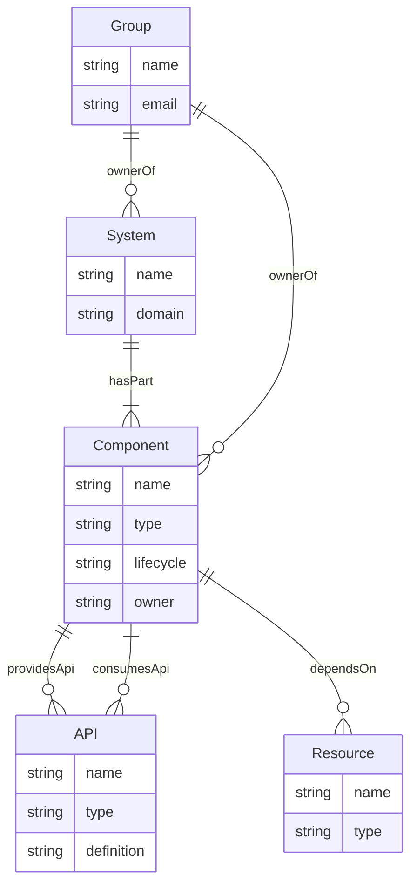
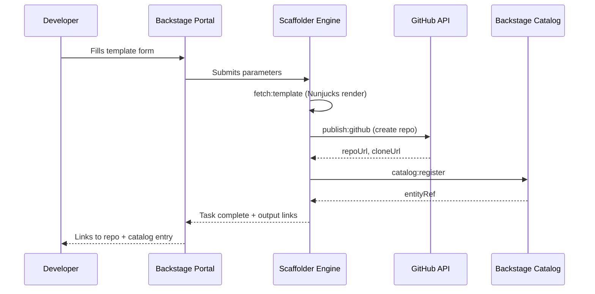

## Keywords in This File
{: .no_toc }

| # | Keyword | Weight |
|---|---|---|
| 1 | [Backstage Service Catalog](#backstage-service-catalog) | ★★☆ |
| 2 | [Software Templates and Scaffolding](#software-templates-and-scaffolding) | ★★☆ |

---

# Backstage Service Catalog

**Interview Weight:** ★★☆ - Core Backstage capability
essential for platform engineering roles; tests
both conceptual understanding and practical YAML
configuration.

---

### 🎯 Model Answer

**30 seconds:**

> The Backstage Service Catalog is a centralized
> registry of all software entities in an organization -
> services, APIs, libraries, websites, data pipelines,
> and the resources they depend on. Each entity is
> described by a `catalog-info.yaml` file in its
> repository. The catalog builds a dependency graph
> from entity metadata, making it possible to answer:
> who owns this service, what APIs does it expose,
> what infrastructure does it depend on, and is it
> healthy right now. It is the "who owns what" source
> of truth for the entire engineering organization.

**3 minutes:**

> The Backstage Service Catalog solves the organizational
> problem of "who owns what" at scale. In organizations
> with 50+ services, locating the owner of a failing
> service during an incident, understanding the
> dependency chain between services, and discovering
> existing APIs before building a new one are all
> painful without a centralized catalog.
>
> The catalog is driven by entity descriptors -
> `catalog-info.yaml` files that live in the
> repository of each software component. Backstage
> discovers and ingests these files via location
> entities or catalog provider integrations (GitHub
> org integration auto-discovers all repos). The
> catalog supports multiple entity kinds: Component
> (services, libraries, websites), API (OpenAPI,
> gRPC, AsyncAPI), Resource (cloud infrastructure -
> databases, queues), System (a collection of
> components and resources with a shared purpose),
> and Domain (a business domain grouping systems).
>
> The practical value: during a production incident,
> a platform engineer can look up the failing service
> in Backstage, see the owning team immediately,
> find the on-call rotation, and navigate to the
> runbook - all without asking colleagues. The
> catalog's metadata annotations drive this: `backstage.io/techdocs-ref`
> links to documentation, `pagerduty.com/service-id`
> links to PagerDuty, `github.com/project-slug`
> links to the repository.
>
> The catalog integrates with Backstage plugins.
> A catalog entity is the entry point to: CI/CD
> status (GitHub Actions plugin), deployment status
> (Argo CD plugin), observability (Grafana, Datadog
> plugins), on-call schedule (PagerDuty plugin),
> security scan results (Snyk plugin), and API
> documentation (API explorer plugin). The catalog
> is the integration hub, not just a registry.

**Blank Mind Recovery:**

**(1) Restate:** "The Backstage Service Catalog -
let me explain it as the answer to three common
engineering questions that are frustrating to
answer at scale."

**(2) First principles:** "Three questions engineers
regularly ask: who owns this service? what does
this service depend on? does an API already exist
for what I need to build? The catalog answers all
three."

**(3) Bridge:** "Think of the catalog as a LinkedIn
for your software. Each service has a profile
(catalog-info.yaml) with its owner, relationships,
and capabilities. The catalog is the directory
where all profiles live and are searchable."

---

### 📘 Concept Explanation

**What it is:**

The Backstage Service Catalog is a software entity
registry that provides a centralized, searchable
inventory of all software assets in an organization.
It is driven by `catalog-info.yaml` files in each
service's repository and builds a typed entity
graph with ownership, dependency, and API relationships.

**The problem it solves:**

In organizations with 50+ services, four problems
emerge simultaneously: (1) Ownership discovery -
which team owns service X? (requires tribal knowledge
or org chart diving), (2) Dependency mapping - what
does service X depend on? (requires reading the
code or asking the team), (3) API duplication - does
an API already exist for what I need? (requires
asking around), (4) New engineer onboarding - where
do I start understanding what our organization's
software landscape looks like? (requires days of
investigation). The catalog solves all four.

**How it works:**

```
BACKSTAGE CATALOG ENTITY MODEL:

Entity Kinds:
  Component: deployable unit
    type: service, website, library,
          documentation, data-pipeline
  API: interface contract
    type: openapi, grpc, asyncapi, graphql
  Resource: infrastructure
    type: database, s3bucket, topic, queue
  System: group of components/APIs/resources
  Domain: business domain grouping systems
  Group: team or organizational unit
  User: individual engineer

Entity Relationships (auto-built from metadata):
  ownerOf / ownedBy    (Component -> Group)
  providesApi / apiProvidedBy  (Component -> API)
  consumesApi / apiConsumedBy  (Component -> API)
  dependsOn / dependencyOf (Component -> Resource)
  hasPart / partOf     (System -> Component)
  memberOf / hasMember (Group -> User)

Discovery Sources:
  catalog-info.yaml in each repo (direct)
  GitHub org integration (auto-discovery)
  Terraform state (resource discovery)
  Custom catalog providers (any source)
```



> **Diagram walkthrough:** The entity relationship
> model shows how Backstage builds a typed graph from
> entity YAML files. A Component (service) has an
> owner (Group), provides APIs, consumes other APIs,
> and depends on Resources (cloud infrastructure).
> Systems group related Components and Resources.
> The relationship lines are generated from annotation
> fields in `catalog-info.yaml`, not from runtime
> discovery - they reflect declared architectural
> intent. This makes the catalog a contract document
> for the organization's software architecture.

**The key insight:**

The catalog's value grows non-linearly with the
number of entities. At 10 services, a shared wiki
serves as a catalog substitute. At 100 services,
the dependency graph queries that Backstage enables
(show me all services that consume the payments API)
are impossible to answer from a wiki. The catalog's
structured entity model enables programmatic queries
over organizational software architecture at scale.

**When to use it:**

Backstage catalog is most valuable when: the
organization has 30+ services, teams regularly
struggle to locate service ownership, new engineers
spend more than a day mapping the software landscape,
and API duplication is a recurring problem. These
conditions typically emerge at 15-20 teams.

**When NOT to use it:**

Below 15 services, a simple README listing all
services with their team owner and repository link
serves the catalog's function with zero overhead.
Backstage has non-trivial operational overhead
(hosting, plugin maintenance, entity sync management).
At small scale, the overhead exceeds the value.

**Alternatives:**

- Port.io - managed developer portal with catalog;
  hosted, less operational overhead than self-hosted
  Backstage, more prescriptive
- Cortex - developer portal focused on service
  quality scorecards; catalog-adjacent
- OpsLevel - service catalog with service maturity
  tracking; similar to Cortex
- Confluence + spreadsheet - manual catalog; works
  to 25 services with active maintenance

**First-principles derivation:**

Software organizations are information systems.
The critical information question is: "what software
exists, who owns it, and how does it relate to other
software?" Without a structured answer to this
question, the organization cannot: perform impact
analysis (what will break if I change this API?),
conduct incident response (who do I page for this
failing service?), manage architectural governance
(are there duplicate services?), or onboard new
engineers efficiently (what exists for them to
work on?). The catalog is the structured answer
to this fundamental information question.

---

### 💻 Code Example

**Example 1: catalog-info.yaml (BAD vs GOOD)**

```yaml
# BAD: Minimal catalog-info.yaml
# Registered in Backstage but provides no value
apiVersion: backstage.io/v1alpha1
kind: Component
metadata:
  name: payments-service
spec:
  type: service
  owner: payments-team
  lifecycle: production
# Missing: API relationships, resource dependencies,
# documentation links, CI/CD annotations, runbook links
# Result: catalog shows the service exists but provides
# no actionable information during an incident or
# for API discovery

# GOOD: Complete catalog-info.yaml
apiVersion: backstage.io/v1alpha1
kind: Component
metadata:
  name: payments-service
  description: "Core payments processing service"
  annotations:
    backstage.io/techdocs-ref: dir:.   # TechDocs
    github.com/project-slug: myorg/payments-service
    pagerduty.com/service-id: "P1234567"
    grafana/dashboard-selector: "payments-service"
    snyk.io/org-name: my-snyk-org
    backstage.io/kubernetes-id: payments-service
  tags:
    - payments
    - pci-dss
    - java
  links:
    - url: https://runbooks.internal/payments
      title: Runbooks
      icon: docs
    - url: https://status.internal/payments
      title: Status Page
      icon: dashboard
spec:
  type: service
  owner: group:default/payments-team
  lifecycle: production
  system: payment-platform
  providesApis:
    - payments-api
    - payment-events-api
  consumesApis:
    - fraud-detection-api
    - kyc-verification-api
  dependsOn:
    - resource:default/payments-db
    - resource:default/payments-queue
```

> **Code walkthrough:** The GOOD catalog-info.yaml
> transforms a service from a name in a registry to
> an integrated hub for operational information.
> The annotations section wires the catalog entity
> to external systems: TechDocs for documentation,
> PagerDuty for incident response, Grafana for
> dashboards, Snyk for security scanning, and
> Kubernetes for deployment status. During a production
> incident, an on-call engineer can open Backstage,
> find the failing service, and immediately access:
> the on-call rotation (PagerDuty annotation), the
> runbook (links section), the live dashboard (Grafana
> annotation), and the owning team. The `providesApis`
> and `consumesApis` fields build the dependency graph
> - enabling impact analysis for API changes.

**Example 2: Multi-entity configuration (System)**

```yaml
# Grouping related entities into a System
# platform/catalog/payment-platform-system.yaml
apiVersion: backstage.io/v1alpha1
kind: System
metadata:
  name: payment-platform
  description: "All payment-related services and APIs"
  annotations:
    backstage.io/techdocs-ref: dir:.
spec:
  owner: group:default/payments-team
  domain: financial-services
---
# API entity referenced by the component
# payments-service/catalog-api.yaml
apiVersion: backstage.io/v1alpha1
kind: API
metadata:
  name: payments-api
  description: "Payment processing REST API"
  annotations:
    backstage.io/techdocs-ref: dir:.
spec:
  type: openapi
  lifecycle: production
  owner: group:default/payments-team
  system: payment-platform
  definition:
    $text: ./openapi.yaml  # Points to OpenAPI spec
```

> **Code walkthrough:** The System entity groups all
> payment-related Components, APIs, and Resources
> into a navigable unit. Engineers new to the codebase
> can navigate to the payment-platform system in
> Backstage and see all related entities. The API
> entity links directly to the OpenAPI specification
> file via `$text: ./openapi.yaml`. Backstage renders
> this as an interactive API explorer, eliminating
> the need for separate Swagger UI hosting. The `system`
> field on the Component and API entities connects
> them to the System entity, building the relationship
> graph automatically.

---

### 🎓 Answers by Seniority

**Junior / Mid (0-5 years):**

> "The Backstage Service Catalog is a centralized
> registry of all services, APIs, and resources in
> an organization. Each service has a catalog-info.yaml
> file in its repository that describes it: who owns
> it, what APIs it provides or consumes, what
> infrastructure it depends on. Backstage ingests
> these files and builds a searchable directory.
> During an incident, you can look up the failing
> service and immediately see: who to page, where
> the runbook is, the live Grafana dashboard, and
> the deployment status. Without the catalog, you
> have to ask colleagues, search Slack history, or
> read the code to find this information."

*Push deeper:* "The five entity kinds: Component
(services, libraries), API (OpenAPI, gRPC, AsyncAPI),
Resource (databases, queues, storage), System (a
group of related components), and Domain (a business
area). Understanding these kinds is necessary to
design a catalog that accurately models your
organization's software architecture."

---

**Senior / Staff (5+ years):**

> "The Backstage catalog is the architectural contract
> for an engineering organization. The catalog-info.yaml
> file is not just metadata - it is a declared
> architectural intent. When a team writes `consumesApis:
> - fraud-detection-api`, they are documenting a
> dependency that drives impact analysis for API
> changes. When they write `providesApis: - payments-api`,
> they are committing to maintaining that API contract.
>
> At scale, I use the catalog for three strategic
> purposes: (1) API governance - the catalog shows
> all APIs and their consumers; this enables the
> API governance committee to identify redundant
> APIs, deprecated APIs with still-active consumers,
> and APIs with no consumers (candidates for removal).
> (2) Migration planning - the catalog's `dependsOn`
> relationships enable impact analysis for any
> infrastructure migration (migrate the payments-db
> - which services are affected? query the catalog).
> (3) Organizational health - the catalog reveals
> team cognitive load through ownership concentration
> (one team owns 30 services - too much scope) and
> orphaned services (no owner - governance risk)."

*Push deeper:* "The hardest catalog problem at scale
is freshness. catalog-info.yaml files become stale
when teams forget to update them after changing
API dependencies. I implement a catalog freshness
check: a weekly automated scan that compares
declared API dependencies in catalog-info.yaml
against actual network traffic from service mesh
telemetry. Discrepancies generate an automatic PR
to update the entity file. This keeps the catalog
as a reliable source of truth."

---

### ⚠️ Common Misconceptions

**Misconception: "The catalog is automatically
accurate if you set up auto-discovery."**

Auto-discovery finds all catalog-info.yaml files
in repositories, but it cannot validate whether
those files accurately reflect the service's current
state. A service that added a dependency on a new
API 6 months ago but never updated its catalog-info.yaml
is registered in the catalog but has inaccurate
relationship data. The catalog's accuracy depends
on teams maintaining their entity files. Automation
can help (compare declared dependencies to service
mesh traffic), but freshness requires both auto-
discovery and a process for keeping entity files
current.

---

**Misconception: "Backstage catalog is a deployment
catalog - it tracks what is running."**

The Backstage catalog is a software architecture
registry - it tracks what exists and how it relates
to other entities, based on declared metadata.
Runtime state (what version is deployed, is the
service healthy, what is the current pod count)
comes from Backstage plugins (Kubernetes plugin,
Argo CD plugin) that pull live data from external
systems. The base catalog entity describes architecture
and ownership, not deployment state.

---

**Misconception: "The Backstage service catalog
requires Kubernetes."**

The catalog entity model is independent of Kubernetes.
Components can represent any software artifact:
a Java service deployed on EC2, a Lambda function,
a Kafka consumer, a Python batch job. The Kubernetes
plugin adds runtime visibility for K8s workloads
but is optional. Organizations running non-K8s
infrastructure use the catalog for ownership
registry, API discovery, and documentation linking
without the Kubernetes plugin.

---

### 🚨 Failure Modes and Diagnosis

**Failure: 40% of catalog entities have
stale metadata**

*Symptom:* Platform team runs a catalog quality
audit. 40% of Component entities have ownership
listed as disbanded teams, APIs listed as "production"
that were deprecated 8 months ago, and resource
dependencies that no longer exist. The catalog is
registered in Backstage but is not trusted.

*Root cause:* No catalog maintenance process.
catalog-info.yaml was written when services were
registered and never updated. Teams do not receive
reminders to update their entity files when they
change service dependencies.

*Diagnosis:* Run a catalog freshness scan:

```bash
# Identify entities with inactive owners
backstage-cli catalog validate \
  --warn-on-inactive-owners

# Compare catalog API relationships to
# service mesh telemetry (if Istio):
kubectl get meshpolicies -A -o json |
  jq '.items[].spec.targets[].name'
# Cross-reference with catalog consumesApis
```

*Fix:* (1) Add catalog-info.yaml review to PR
templates: "Did you update your catalog entity
if you changed API dependencies or resource usage?"
(2) Set up a weekly Atlantis-style bot that opens
PRs for entity files that are older than 90 days
with no changes. (3) Add catalog validation to
CI/CD: `catalog-info.yaml` changes must pass
a Backstage validate-entity step.

---

**Failure: Backstage plugin ecosystem causes
performance degradation**

*Symptom:* Backstage portal takes 8-12 seconds to
load a service catalog page. Engineers stop using
it because it is too slow. NPS drops significantly.

*Root cause:* 15 plugins are installed, each making
its own API calls on page load. The Grafana plugin
fetches dashboard data, the PagerDuty plugin fetches
on-call status, the Snyk plugin fetches vulnerability
data, the GitHub plugin fetches commit history -
all on page load, in sequence.

*Diagnosis:* Open browser dev tools while loading
a catalog entity page. Count network requests,
their duration, and which plugin initiates each.

*Fix:* (1) Enable lazy loading for non-critical
plugins: Snyk vulnerability data loads on tab click,
not on page load. (2) Add response caching for
plugin data with appropriate TTLs: PagerDuty on-call
schedule caches for 5 minutes, Grafana dashboard
for 30 seconds. (3) Audit plugin usage analytics.
If 70% of engineers never click the Snyk tab, remove
it from the default page layout.

---

### 🎯 Interview Deep-Dive

| Seniority | Time | Focus |
|---|---|---|
| Junior | 4 min | Entity kinds, catalog-info.yaml |
| Mid | 7 min | Plugin integration, relationship model |
| Senior | 10 min | At-scale governance, freshness, migration |

---

**[JUNIOR] Q1 - [CONCEPTUAL] What are the five
core Backstage entity kinds and when do you use each?**

Component: the most-used kind. Represents any
deployable or consumable software unit. Types include:
service (a running API or worker), website (a user-
facing frontend), library (an NPM package or Java
library consumed by other services), documentation
(a static docs site), and data-pipeline (a Spark
job or ETL process). Every service in your organization
gets a Component entity.

API: represents an interface contract. Types include:
openapi (REST APIs described with OpenAPI spec),
grpc (gRPC APIs with .proto files), asyncapi
(event-driven APIs with AsyncAPI spec), and graphql.
When you add an API entity, Backstage renders its
specification as an interactive explorer. Use this
for any API that other teams consume.

Resource: represents a managed infrastructure
dependency that software depends on. Types include:
database, s3bucket, topic (Kafka, Pub/Sub), and
queue (SQS, RabbitMQ). Use Resource entities to
model the infrastructure dependencies of your
services, enabling dependency impact analysis.

System: a collection of related Components, APIs,
and Resources that together deliver a business
capability. Use System entities to provide a
navigable grouping above the service level. Example:
"payment-platform" System contains payments-service,
fraud-service, payments-api, and the RDS database.

Domain: a business domain grouping of Systems.
Use for large organizations with clear domain
boundaries (financial-services, customer-experience,
operations). Domains are the highest level of
the Backstage hierarchy.

*What separates good from great:* Knowing when to
use Resource entities (for infrastructure dependencies)
and System/Domain entities (for organizational
structure above the service level). Many candidates
know Component and API but not the full entity
hierarchy.

---

**[MID] Q2 - [ARCHITECTURE] How does Backstage
auto-discovery work and what are its limitations?**

Backstage auto-discovery (the GitHub org integration
plugin) scans GitHub organization repositories for
files matching a configurable pattern (default:
`**/catalog-info.yaml`). For each found file, it
creates a Location entity that Backstage polls for
entity data.

Configuration:

```yaml
# app-config.yaml
catalog:
  providers:
    github:
      myGithubOrg:
        organization: myorg
        catalogPath: /catalog-info.yaml
        filters:
          repository:
            allow:
              - '.*'  # All repos
```

Limitations: (1) Auto-discovery finds catalog-info.yaml
files but does not validate them. Stale entities
with inactive owners or deleted APIs remain in the
catalog until manually removed or until the source
file is deleted. (2) Auto-discovery does not create
catalog-info.yaml files for repositories that do
not have one. New repositories without catalog
registration are invisible to the catalog. (3) Rate
limiting: for large GitHub organizations (500+
repos), the GitHub API rate limits affect how
frequently the catalog can refresh entity data.
Requires GitHub Apps authentication and rate limit
monitoring.

The operational consequence: a GitHub org with
200 repositories will have ~30-40 without catalog-
info.yaml initially. Driving catalog completeness
requires a separate initiative: add catalog-info.yaml
generation to the golden path scaffold, so all
new services are auto-registered. Backfill existing
services by running a discovery sprint.

*What separates good from great:* The three limitations
(stale entities, missing files for new repos, rate
limiting) rather than just describing how it works.
Interviewers are testing whether candidates have
operated Backstage in production.

---

**[MID] Q3 - [DEBUGGING] How do you diagnose
a Backstage catalog entity that is not appearing
in the portal after registration?**

Five-step diagnosis:

Step 1 - Check the Location entity:

```bash
# In Backstage admin panel:
# Settings -> Catalog -> Locations
# Find the location URL for the repo
# Status should be "Refresh" not "Error"
# Error state shows the parse/fetch error
```

Step 2 - Validate the catalog-info.yaml syntax:

```bash
# Backstage CLI validation:
npx @backstage/cli catalog-info validate \
  path/to/catalog-info.yaml
# Common errors: invalid apiVersion, unknown spec
# fields, missing required fields (name, spec.owner)
```

Step 3 - Check GitHub App permissions:

```bash
# Backstage fetches catalog-info.yaml from GitHub
# If the GitHub App does not have read access
# to the repo, the fetch will silently fail.
# Test: does the Backstage GitHub App have access
# to the repository in GitHub App settings?
```

Step 4 - Check catalog entity namespace:

```yaml
# Catalog entities default to the 'default' namespace
# If your spec references a group in a different
# namespace, the owner reference will fail:
spec:
  owner: payments-team       # Error: resolves as
                             # default/payments-team
  owner: group:payments/payments-team  # Correct
```

Step 5 - Force a catalog refresh:

```bash
# In Backstage admin: force-refresh the Location
# Or wait for the next polling interval (default: 60s)
```

*What separates good from great:* The GitHub App
permissions step. This is the root cause of 40%
of "entity not appearing" issues in new Backstage
installations, and most engineers don't check it
until they've exhausted the other options.

---

**[SENIOR] Q4 - [TRADE-OFF] Backstage vs. Port vs.
Cortex for a service catalog - how do you choose?**

The three tools address the same core problem
(service registry, developer portal) with different
trade-offs.

Backstage (open source, self-hosted): maximum
flexibility, maximum operational overhead. Plugin
ecosystem of 150+ plugins covers almost any
integration. Self-hosting means no data leaves
your infrastructure. Requires a dedicated platform
engineer to maintain (Backstage upgrades, plugin
compatibility, hosting). Best for: organizations
with a platform team that can dedicate 20-30%
of one engineer's time to Backstage maintenance
and have specific integration requirements not
covered by managed solutions.

Port (managed SaaS): faster time-to-value, lower
operational overhead. API-first model (define
entity types via API rather than YAML). Good UI
for self-service. Pricing scales with usage. Best
for: organizations that want a service catalog
with self-service capabilities without Backstage's
operational complexity. Data leaves your infrastructure
to Port's SaaS platform.

Cortex (managed SaaS, scorecard-focused): service
quality scorecards (does every service have a
runbook? a PagerDuty integration? passing CI?).
Less flexible as a catalog; stronger as a service
maturity governance tool. Best for: organizations
with a specific focus on engineering standards
enforcement rather than general-purpose catalog.

Decision framework: (1) Do you have a platform
engineer available to maintain Backstage? If no
-> Port or Cortex. (2) Do you have specific integration
requirements (Argo CD plugin, custom auth plugins,
proprietary tools)? If yes -> Backstage. (3) Is
service quality scorecard tracking your primary
goal? If yes -> Cortex. (4) Do you want a general-
purpose developer portal with self-service? If yes
-> Port or Backstage.

*What separates good from great:* The "do you have
a platform engineer available to maintain it?" gate
first. Organizations underestimate Backstage's
operational overhead. The answer to this question
is the most important selection criterion.

---

**[SENIOR] Q5 - [PRODUCTION] How do you implement
a service quality scorecard in the Backstage catalog?**

Service quality scorecards use Backstage's entity
metadata to evaluate services against organizational
standards and surface compliance gaps.

Using Backstage TechInsights plugin:

```yaml
# Define a fact retriever: does the service have
# a PagerDuty annotation?
const pagerdutyFact = createQueryBasedFactRetriever({
  ref: 'pagerduty-service-id-check',
  entityFilter: [{ kind: 'Component' }],
  schema: {
    hasPagerDutyServiceId: {
      type: 'boolean',
      description:
        'Has pagerduty.com/service-id annotation'
    },
  },
  query: async ({ entities }) =>
    entities.map(entity => ({
      entity,
      facts: {
        hasPagerDutyServiceId: !!(
          entity.metadata?.annotations?.[
            'pagerduty.com/service-id'
          ]
        ),
      },
    })),
});
```

Scorecard checks: every Component entity is evaluated
against: (a) has a PagerDuty service ID annotation
(incident response), (b) has TechDocs configured
(documentation), (c) has OpenAPI spec (API definition),
(d) lifecycle is not "experimental" without expiry
date, (e) owner group has at least one current
team member.

The scorecard results display in Backstage as a
traffic light: green (all checks passing), yellow
(1-2 checks failing), red (3+ checks failing).
Teams with red status receive automated Slack
notifications weekly.

*What separates good from great:* Connecting the
scorecard to automated notifications. A scorecard
that displays silently is useful for audits.
A scorecard that proactively notifies team leads
drives improvement.

---

**[JUNIOR] Q6 - [CONCEPTUAL] What is the
relationship between a Component, API, and Resource
entity in Backstage?**

The three entities model different levels of a
service's architecture.

Component is the service itself - the running
process that does work. Example: payments-service.
A Component owns APIs it provides, consumes APIs
from other Components, and depends on Resources.

API is the interface contract - the specification
of how other Components interact with this Component.
Example: payments-api (an OpenAPI spec describing
the REST interface of payments-service). The API
entity decouples the contract from the implementation:
if payments-service is rewritten in Go instead of
Java, the payments-api entity stays the same. API
consumers do not need to change.

Resource is the infrastructure dependency - the
managed service the Component relies on at runtime.
Example: payments-db (an RDS PostgreSQL instance).
Resources are separate entities because multiple
Components may share the same Resource (both
payments-service and reconciliation-service depend
on payments-db). The shared dependency is visible
in the catalog via the dependsOn relationship.

The relationship chain: payments-service (Component)
`providesApi` payments-api (API), `consumesApi`
fraud-detection-api (API), `dependsOn` payments-db
(Resource). This chain enables: "who will be affected
if payments-db is unavailable?" -> query dependsOn.
"Who will be affected if I change the payments-api
contract?" -> query consumesApi.

*What separates good from great:* The impact analysis
use cases. The Component/API/Resource distinction
is only valuable if the candidate can explain how
the relationship model enables concrete operational
queries.

---

**[STAFF] Q7 - [ARCHITECTURE] How do you use
the Backstage catalog to manage API governance
at scale?**

API governance at scale has four problems: API
proliferation (too many similar APIs doing the
same thing), API abandonment (APIs with no active
consumers but still running), API version management
(which consumers are on deprecated versions?), and
API contract drift (the implementation differs from
the declared spec).

Backstage catalog addresses the first three directly.

API proliferation detection: query the catalog for
APIs with similar descriptions or tags. A catalog
with 15 APIs tagged "customer-data" where 3 serve
identical use cases is evidence of proliferation.
The API governance committee reviews the catalog
monthly and consolidates redundant APIs.

API abandonment detection: query for API entities
where no Components have `consumesApi` relationship
pointing to them. These APIs have no declared
consumers. Automate a monthly report: "APIs with
zero declared consumers" -> candidates for
deprecation.

```bash
# Example: Find APIs with no consumers
# Using Backstage catalog API:
curl -s \
  "https://backstage.example.com/api/catalog/entities
  ?filter=kind=API" |
  jq '.[] | select(.relations | map(.type) |
    contains(["apiConsumedBy"]) | not) |
    .metadata.name'
```

API version consumer tracking: for deprecated API
versions, query which Components have
`consumesApi: deprecated-api-v1`. This generates
the migration target list - teams that must migrate
before the deprecated API can be removed.

*What separates good from great:* The "API abandonment
detection" query (APIs with zero consumers) and
the programmatic Backstage API query example. These
show production-level catalog operations beyond
the UI.

---

**[MID] Q8 - [BEHAVIORAL] Tell me about a time
you improved service discoverability in an
engineering organization.**

Model answer structure for this behavioral question:

Situation: "At [previous company], we had 80+
microservices and engineers were regularly interrupted
by colleagues asking 'who owns X?' during incidents.
Post-incident reviews consistently cited 'delayed
escalation due to ownership confusion' as a
contributing factor."

Task: "I was asked to improve service discoverability
as part of a broader platform engineering initiative."

Action: "I introduced Backstage as the service
catalog. The key challenge was adoption - I could
not mandate engineers to add catalog-info.yaml
files. I added catalog-info.yaml generation to the
golden path scaffold, so all new services were
auto-registered. For existing services, I ran a
'catalog sprint' where I paired with each team for
30 minutes to create their entities. I also added
a catalog validation step to CI/CD that warned
(not failed) if catalog-info.yaml was missing
required fields."

Result: "Over 8 weeks, catalog coverage went from
0 to 85% (70+ services registered). Subsequent
post-incident reviews stopped citing ownership
confusion as a factor. New engineer onboarding
time for understanding the service landscape reduced
from 3-4 days to under 4 hours."

*What separates good from great:* The "I could not
mandate" constraint and the non-coercive adoption
strategy (golden path integration + catalog sprint
+ CI/CD warning). Mandating registration creates
resentment. Incentive alignment (golden path does
it automatically) creates adoption.

---

**[SENIOR] Q9 - [PRODUCTION] What are the operational
requirements for a production Backstage deployment?**

Production Backstage has four operational requirements.

Database: Backstage requires PostgreSQL for production.
SQLite is development-only. PostgreSQL is used by
the catalog (entity storage), the scaffolder (template
run history), and TechDocs (documentation metadata).
Size estimate: 100 entities ~ 50MB, 1000 entities
~ 500MB. Use RDS Multi-AZ for availability.

Authentication: Backstage must integrate with
your organization's SSO (OAuth with GitHub, Google,
Okta, Azure AD, or SAML). Self-signed development
auth must not be used in production - the guest
auth provider allows anonymous access to the catalog.

Upgrade management: Backstage releases a new version
approximately every 2 weeks. Plugin compatibility
with the core version requires active management.
The recommended strategy: pin all Backstage package
versions in package.json, test upgrades in a staging
environment before production, run upgrades quarterly
(not weekly).

Plugin configuration management: each plugin has
its own configuration in `app-config.yaml`. Secrets
(API keys for GitHub, PagerDuty, Grafana) must
be injected via environment variables, not committed
to `app-config.yaml`. Use Vault or Kubernetes
secrets for the plugin API keys.

The platform team's Backstage SLA: treating Backstage
as a best-effort tool creates fragile DX. Define
an SLA: 99.5% availability, P99 page load under
3 seconds. Monitor with uptime checks and
real-user monitoring. An unavailable Backstage
during an incident is a DX and operational failure.

*What separates good from great:* The upgrade
management strategy (quarterly, tested in staging)
and the authentication requirement (no guest auth
in production). These are production readiness
requirements that separate a demo Backstage from
a production Backstage.

---

### ⚖️ Comparison Table

| Feature | Backstage | Port | Cortex | OpsLevel |
|---|---|---|---|---|
| Hosting | Self-hosted | SaaS | SaaS | SaaS |
| Entity model | YAML-driven | API-driven | YAML/API | YAML |
| Plugin ecosystem | 150+ OSS | Built-in | Limited | Limited |
| Scorecards | TechInsights | Built-in | Core feature | Core feature |
| Self-service | Scaffolder | Built-in | Limited | Limited |
| Operational overhead | High | Low | Low | Low |
| Customization | Very high | Medium | Medium | Medium |
| Data residency | On-prem | SaaS only | SaaS only | SaaS only |
| License | OSS (Apache 2) | Commercial | Commercial | Commercial |
| Best for | Full IDP hub | Catalog + portal | Standards enforcement | Catalog + quality |

---

### 🏛️ System Design

*(Omit: System design for Backstage as a standalone
component is covered in the L4 Production Platform
keyword which addresses full IDP architecture
including Backstage in a multi-cluster environment.)*

---

### 📊 Diagram

See entity relationship diagram in the Concept
Explanation section above.

---

---

# Software Templates and Scaffolding

**Interview Weight:** ★★☆ - Core Backstage feature
tested for platform engineering roles; requires
practical knowledge of template YAML and scaffolder
action model.

---

### 🎯 Model Answer

**30 seconds:**

> Backstage Software Templates are the golden path
> implementation mechanism in a Backstage-based
> developer portal. A Software Template is a YAML
> file that defines: an input form for the developer
> (service name, team, tech stack), a sequence of
> automated steps (fetch template files, create
> a GitHub repository, register in the catalog),
> and output links (to the new repository and catalog
> entry). Developers fill in the form in the Backstage
> portal and the scaffolder creates a ready-to-deploy
> service in under 5 minutes.

**3 minutes:**

> Software Templates turn the golden path from a
> CLI tool into a portal-native experience. The
> template is defined in YAML with two main sections:
> `parameters` (the input form with validation,
> using JSON Schema) and `steps` (the automation
> sequence using scaffolder actions).
>
> The scaffolder action model is pluggable. Built-in
> actions handle: `fetch:template` (render template
> files with Nunjucks templating from user input),
> `publish:github` (create and populate a GitHub
> repository), `catalog:register` (register the new
> service in the Backstage catalog), and `github:actions:dispatch`
> (trigger a GitHub Actions workflow). Community
> and custom actions extend this with: Terraform
> Cloud workspace creation, ArgoCD application creation,
> Vault namespace provisioning, and Slack notifications.
>
> The template file rendering uses Nunjucks (a
> JavaScript template engine). Template variables
> from the parameters form are available as `${{ values.name }}`,
> `${{ values.team }}`, etc. This enables: generating
> files with the correct service name, team label,
> namespace, and other service-specific values built
> in from creation time.
>
> The end-to-end scaffolding result: a developer
> clicks "Create Java Service" in Backstage, fills
> in service name and team name, clicks Create. In
> 3-5 minutes, they have: a GitHub repository with
> a golden path Dockerfile, CI/CD pipeline, Kubernetes
> manifests with correct service name and namespace,
> and a catalog-info.yaml. The Backstage catalog
> shows the new service immediately.

**Blank Mind Recovery:**

**(1) Restate:** "Software Templates - let me describe
what happens step by step when a developer creates
a new service using the Backstage portal."

**(2) First principles:** "Creating a new service
requires three things: generating files from a
template, pushing those files to a repository, and
registering the service so others can find it.
Backstage Software Templates automate all three."

**(3) Bridge:** "Think of a Software Template as
a GitHub repository template with automation. A
GitHub template repo gives you the files. A Backstage
Software Template gives you the files AND runs the
setup steps automatically: creates the repo, creates
the CI/CD, registers in the catalog, provisions
optional infrastructure."

---

### 📘 Concept Explanation

**What it is:**

Backstage Software Templates are a Backstage feature
that implements the golden path as a portal-native
workflow. A template is a YAML entity defining:
an input form (parameters), a file rendering step
(using Nunjucks), and a sequence of automated steps
(scaffolder actions) that create a new service
from the rendered template files.

**The problem it solves:**

Golden paths implemented as CLI tools require
engineers to install and learn a CLI. Backstage
Software Templates deliver the same capability via
a portal UI that requires no installation and is
accessible to engineers regardless of their local
environment (laptop, cloud shell, remote container).
Additionally, the template declarative model makes
the golden path auditable, versionable, and
peer-reviewable - it is just YAML in a repository.

**How it works:**

```
TEMPLATE EXECUTION FLOW:

1. Developer navigates to Backstage portal
   -> Clicks "Create" -> selects template
   -> Fills in parameters form (JSON Schema)
   -> Clicks "Create"

2. Scaffolder executes steps in sequence:
   Step 1: fetch:template
     -> Renders template files with Nunjucks
     -> Parameters substituted into file content
     -> Output: rendered files in temp workspace

   Step 2: publish:github
     -> Creates GitHub repository
     -> Pushes rendered files to main branch
     -> Sets branch protections
     -> Output: repo URL, clone URL

   Step 3: catalog:register
     -> Adds catalog-info.yaml to Backstage
     -> Service appears in catalog immediately
     -> Output: catalog entity ref

   Step 4 (optional): github:actions:dispatch
     -> Triggers first CI/CD run immediately
     -> Validates the new repo builds correctly

3. Output links shown to developer:
   -> Link to new GitHub repository
   -> Link to Backstage catalog entry
   -> Link to first CI/CD run (if step 4 used)

4. Developer clones repo and begins coding
   -> First deployment triggered on first push
```



> **Diagram walkthrough:** The scaffolder engine
> orchestrates all steps sequentially. The developer
> interacts only with the Backstage portal (form
> input and output links). The scaffolder fetches
> and renders template files without the developer
> seeing or touching them. GitHub API calls create
> the repository and push the rendered files. The
> catalog registration happens automatically at the
> end. The developer receives two links: their new
> repository and their catalog entry. The entire
> flow takes 60-120 seconds of automated work
> after the developer clicks Create.

**The key insight:**

The template separation of concerns - input form
(parameters), file rendering (content folder), and
automation (steps) - enables the golden path to
evolve independently in each dimension. New input
parameters can be added without changing the file
templates. New automation steps (e.g., adding a
Vault namespace provisioning step) can be added
without changing the parameters or file content.
The YAML structure enforces this separation.

**When to use it:**

Build Backstage Software Templates for any service
archetype that three or more teams create regularly.
The break-even: if building the template takes 8
hours and each service creation via the template
saves 4 hours, the template pays back after the
second team uses it.

**When NOT to use it:**

Do not build Backstage Software Templates for
highly specialized use cases (one team creates
this type of service once per year). For complex
multi-step provisioning that requires human approval
at intermediate steps (e.g., a service requiring
PCI-DSS compliance review before repository creation),
the scaffolder's linear execution model is not
designed for multi-step approval workflows.

**Alternatives:**

- Cookiecutter - Python-based code scaffolding
  without CI/CD or catalog integration; no portal
- GitHub Template Repositories - file generation
  without automation or catalog registration
- Terraform Workspaces + GitHub Template + Bash
  script - manual golden path without portal
- Custom CLI (built in-house) - greater flexibility,
  higher maintenance burden than Backstage templates

**First-principles derivation:**

Service creation requires: collecting input (service
name, team, configuration), generating files from
that input (Dockerfile, CI/CD YAML, K8s manifests),
publishing those files to version control, and
registering the service. Each step is automatable.
Backstage Software Templates provide a structured
abstraction over these steps (parameters for input,
fetch:template for file generation, publish:github
for VCS publishing, catalog:register for registration)
with a portal UI and audit logging built in.

---

### 💻 Code Example

**Example 1: Complete Software Template YAML**

```yaml
# BAD: No software template
# Each team creates services by:
# 1. Copying a "reference repo" in GitHub
# 2. Find-and-replace the old service name
# 3. Manually update 14 files with the new name
# 4. Delete irrelevant sections
# 5. Open a ticket for ops to provision CI/CD
# Total time: 2-4 hours, error-prone

# GOOD: Complete Backstage Software Template
apiVersion: scaffolder.backstage.io/v1beta3
kind: Template
metadata:
  name: java-service-template
  title: Java Service (Golden Path)
  description: >
    Production-ready Java 17 / Spring Boot service
    with golden path CI/CD, K8s manifests,
    and catalog registration.
  tags:
    - java
    - spring-boot
    - recommended
spec:
  owner: group:default/platform-team
  type: service

  parameters:
    - title: Service Configuration
      required:
        - name
        - description
        - team
      properties:
        name:
          title: Service Name
          type: string
          description: kebab-case, e.g. payments-api
          pattern: '^[a-z0-9-]+$'
          ui:autofocus: true
        description:
          title: Description
          type: string
          description: What does this service do?
        team:
          title: Owning Team
          type: string
          ui:field: OwnerPicker
          ui:options:
            allowedKinds:
              - Group

    - title: Infrastructure Options
      properties:
        needsDatabase:
          title: Needs a PostgreSQL database?
          type: boolean
          default: false
        environment:
          title: Initial deployment environment
          type: string
          enum:
            - dev
            - staging
          default: dev

  steps:
    - id: fetch-base
      name: Fetch Base Template
      action: fetch:template
      input:
        url: ./content
        values:
          name: ${{ parameters.name }}
          description: ${{ parameters.description }}
          team: ${{ parameters.team }}
          needsDatabase: ${{ parameters.needsDatabase }}
          environment: ${{ parameters.environment }}

    - id: publish
      name: Create Repository
      action: publish:github
      input:
        allowedHosts:
          - github.com
        description: ${{ parameters.description }}
        repoUrl: >
          github.com?owner=myorg
          &repo=${{ parameters.name }}
        defaultBranch: main
        repoVisibility: private
        requireCodeOwnerReviews: true
        deleteBranchOnMerge: true

    - id: provision-db
      name: Provision PostgreSQL (if needed)
      if: ${{ parameters.needsDatabase }}
      action: fetch:template
      input:
        url: ./infra
        targetPath: ./infra
        values:
          name: ${{ parameters.name }}
          environment: ${{ parameters.environment }}

    - id: register
      name: Register in Backstage Catalog
      action: catalog:register
      input:
        repoContentsUrl: >
          ${{ steps['publish'].output.repoContentsUrl }}
        catalogInfoPath: /catalog-info.yaml

  output:
    links:
      - title: Open Repository
        url: ${{ steps['publish'].output.remoteUrl }}
      - title: View in Catalog
        url: ${{ steps['register'].output.entityRef }}
    text:
      - title: Next Steps
        content: |
          1. Clone your repo:
             `git clone ${{ steps['publish'].output.cloneUrl }}`
          2. Your CI/CD runs automatically on push.
          3. First deployment to ${{ parameters.environment }}
             triggers on merge to main.
```

> **Code walkthrough:** The template has three sections:
> metadata (title, tags, description shown in the
> catalog), parameters (a two-step form with JSON
> Schema validation - `pattern: '^[a-z0-9-]+$'`
> prevents invalid service names at form submission
> time), and steps (the automation sequence). The
> conditional step `if: ${{ parameters.needsDatabase }}`
> demonstrates how templates adapt to developer input.
> The `OwnerPicker` UI field presents a dropdown of
> Backstage groups rather than a free-text field,
> preventing orphaned services with invalid owners.
> The output section gives developers direct links
> to their new repository and catalog entry without
> hunting for them.

**Example 2: Template content folder structure**

```
# template content/ folder structure
# (files become the generated repository)
content/
  Dockerfile
  catalog-info.yaml.njk      # Nunjucks template
  .github/
    workflows/
      ci.yml.njk             # Nunjucks template
  k8s/
    deployment.yaml.njk      # Nunjucks template
    service.yaml
    kustomization.yaml.njk
  src/
    main/
      java/
        Application.java.njk
  pom.xml.njk
```

```yaml
# catalog-info.yaml.njk (excerpt)
# Variables from parameters substituted by Nunjucks
apiVersion: backstage.io/v1alpha1
kind: Component
metadata:
  name: ${{ values.name }}
  description: "${{ values.description }}"
spec:
  type: service
  owner: "group:default/${{ values.team }}"
  lifecycle: experimental
```

```yaml
# k8s/deployment.yaml.njk
apiVersion: apps/v1
kind: Deployment
metadata:
  name: ${{ values.name }}
  namespace: ${{ values.team }}
spec:
  replicas: 1
  selector:
    matchLabels:
      app: ${{ values.name }}
  template:
    spec:
      containers:
        - name: ${{ values.name }}
          image: >
            registry.internal/${{ values.team }}
            /${{ values.name }}:latest
          resources:
            requests:
              memory: "256Mi"
              cpu: "250m"
            limits:
              memory: "512Mi"
              cpu: "500m"
```

> **Code walkthrough:** The template content folder
> contains the files that will become the new service's
> repository. Files with `.njk` extension are Nunjucks
> templates - they contain `${{ values.fieldName }}`
> placeholders that the scaffolder replaces with values
> from the form. The catalog-info.yaml.njk generates
> a catalog entity with the correct service name,
> description, and team owner automatically. The
> deployment.yaml.njk generates a Kubernetes manifest
> with correct labels, namespace (equal to the team
> name), and a standard resource allocation. The
> developer never writes any of these files manually -
> the scaffolder renders them from the template content
> folder.

---

### 🎓 Answers by Seniority

**Junior / Mid (0-5 years):**

> "Backstage Software Templates implement the golden
> path as a portal workflow. The template is a YAML
> file with three parts: a parameters section that
> defines the form the developer fills in (service
> name, team, configuration options), a content folder
> with Nunjucks template files that become the new
> repository, and a steps section that automates
> the creation: fetch and render the templates,
> create the GitHub repository, and register the
> service in the Backstage catalog. Developers use
> the portal UI - no CLI required. The whole flow
> takes 2-3 minutes from form submission to a ready-
> to-clone repository."

*Push deeper:* "The key scaffolder actions: `fetch:template`
renders Nunjucks template files, `publish:github`
creates the repository, `catalog:register` adds
the service to the catalog, and conditional steps
(`if: ${{ parameters.needsDatabase }}`) let the
template adapt to developer choices. Custom actions
extend the scaffolder to provision Terraform workspaces,
create Argo CD applications, or send Slack notifications."

---

**Senior / Staff (5+ years):**

> "Software Templates are the most impactful Backstage
> feature for improving DX because they implement
> the full golden path end-to-end with zero developer
> tooling. The portal-native experience removes the
> 'install the platform CLI' barrier. The declarative
> YAML format makes templates peer-reviewable and
> auditable. The conditional step model enables
> one template to cover multiple service variants
> (with or without database, dev or staging deployment).
>
> At scale, template versioning is the hardest problem.
> When the platform team updates the CI/CD pipeline
> template (a new security scan step), services
> created before the update have old pipeline files.
> Two approaches: (1) Renovate Bot integration -
> Renovate can scan all repositories for platform
> template references and open PRs to update outdated
> files. (2) Independent pipeline templates - services
> reference a versioned pipeline template file that
> the platform team maintains centrally (e.g.,
> `.github/workflows/ci.yml` that calls a reusable
> workflow from the platform repository). Template
> updates propagate to all services via the reusable
> workflow, not via regenerating the service file."

*Push deeper:* "The reusable workflow approach is
architecturally superior for CI/CD files specifically:
the service repository contains `.github/workflows/ci.yml`
that has one line: `uses: platform-team/workflows/.github/workflows/java-ci.yml@v1.2`.
All services on this CI golden path receive updates
when the platform team releases `v1.3`. No per-repo
template regeneration. No migration PR per service.
This is the difference between distributed configuration
(each service has a copy of the pipeline) and
centralized configuration (each service delegates
to the platform's managed pipeline)."

---

### ⚠️ Common Misconceptions

**Misconception: "Software Templates require
engineers to use the Backstage portal - they can't
use CLI."**

The Backstage scaffolder API is fully REST-accessible.
Platform teams can build CLI wrappers that call
the Backstage scaffolder API: `platform scaffold
--template java-service --name my-service --team
payments`. The CLI sends parameters to the Backstage
API, which runs the template steps and returns
the output links. The template YAML is the source
of truth regardless of interface. Organizations
that prefer CLI workflows can have both: portal
for engineers who prefer UI, CLI for engineers
who prefer terminal.

---

**Misconception: "Software Templates replace
the need for documentation about the golden path."**

Templates automate the creation steps; they do
not replace understanding. An engineer who uses
a template and gets a repository with a CI/CD
pipeline still needs to understand: how to add
a new environment variable, how to add a custom
CI step, what the Kubernetes resource limits mean
and how to change them, and how to debug a failed
deployment. The template creates the files; documentation
(TechDocs, linked from the catalog entity) teaches
engineers how to work with what the template creates.

---

**Misconception: "Nunjucks is the only templating
option for Software Templates."**

Backstage Software Templates use Nunjucks as the
default file rendering engine via `fetch:template`.
The scaffolder also supports `fetch:plain` (copy
files without rendering, for binary files or files
that should not have templating applied) and custom
actions that implement alternative rendering
approaches (Cookiecutter, Copier, Helm templating
for Kubernetes manifests). Organizations with
existing Cookiecutter templates can wrap them in
a Backstage custom action rather than rewriting
to Nunjucks.

---

### 🚨 Failure Modes and Diagnosis

**Failure: Software template creates a repository
with incorrect content (wrong service name in
generated files)**

*Symptom:* Developer creates a service named
`payments-webhook`. The repository is created
successfully, but the Dockerfile still references
the old template service name (`my-service`), the
Kubernetes deployment label is `my-service`, and
the catalog-info.yaml has `name: my-service`.
The template did not substitute the parameters.

*Root cause:* The content folder files have incorrect
Nunjucks syntax for the service name substitution.
Likely: `{{ values.name }}` instead of `${{ values.name }}`
(Backstage uses `${{` not `{{` to avoid conflicts
with GitHub Actions syntax).

*Diagnosis:*

```yaml
# Check the template content file syntax
# WRONG (no $ prefix):
name: {{ values.name }}

# CORRECT ($ prefix required by Backstage):
name: ${{ values.name }}

# Also check: parameter reference in template
# steps must match the parameters block field name:
# parameters.name -> values.name in content files
```

*Fix:* Update all content folder files to use
`${{ values.fieldName }}` syntax. Test the template
in a non-production Backstage environment before
rolling out to engineers. Add a template validation
step that creates a test service and verifies the
generated files contain the expected values.

---

**Failure: Software template fails at publish:github
step for all new repositories**

*Symptom:* Engineers attempt to create services
via the Backstage Software Template. The form
submits successfully. The `fetch:template` step
completes. The `publish:github` step fails with
"422 Unprocessable Entity" or "Repository already
exists."

*Root cause 1 - Duplicate name:* A repository
with the requested name already exists in the GitHub
organization. The `publish:github` action does
not support creating a repository that already
exists.

*Diagnosis:* Check the error message in the scaffolder
task log. "Repository already exists" confirms the
naming conflict.

*Fix:* Add a `pattern` constraint to the name
parameter that enforces uniqueness conventions
(e.g., `pattern: '^[a-z0-9-]+-[a-z0-9-]+$'`
for `team-service` naming). Add a custom action
that checks GitHub for existing repository names
before the publish step and fails early with a
clear error.

*Root cause 2 - GitHub App permissions:* The
Backstage GitHub App does not have `Contents: write`
permission for the organization, or the installation
does not have access to the target repository
namespace.

*Diagnosis:* Review GitHub App permissions in
GitHub organization settings -> Installed GitHub
Apps -> Backstage App -> Permissions.

*Fix:* Grant `Contents: write` and `Workflows: write`
(for CI/CD file creation) to the Backstage GitHub
App at the organization level.

---

### 🎯 Interview Deep-Dive

| Seniority | Time | Focus |
|---|---|---|
| Junior | 4 min | Template structure, Nunjucks, basic actions |
| Mid | 7 min | Custom actions, versioning, conditional steps |
| Senior | 10 min | Template lifecycle, CLI integration, reusable workflows |

---

**[JUNIOR] Q1 - [CONCEPTUAL] What are the three
main sections of a Backstage Software Template
and what does each do?**

Parameters: defines the input form that developers
fill in when using the template in the Backstage
portal. Each parameter has a title, type (string,
boolean, number, object), and JSON Schema validation
constraints (required fields, pattern validation
for naming conventions). Parameters support custom
UI fields like `OwnerPicker` (shows Backstage groups
in a dropdown) and `RepoUrlPicker` (validates GitHub
repository URL format). The parameters section is
how the platform team collects structured input
from developers without free-form text boxes.

Steps: defines the automation sequence executed
by the scaffolder when the developer submits the
form. Steps use named scaffolder actions: `fetch:template`
(render Nunjucks templates with parameter values),
`publish:github` (create the repository), `catalog:register`
(add the entity to Backstage). Steps run sequentially.
A step can use output from a previous step via
`${{ steps['step-id'].output.fieldName }}`. Steps
can be conditional: `if: ${{ parameters.needsDatabase }}`
skips a step if the developer did not select that
option.

Output: defines the links and text displayed to
the developer after the template completes. Typically:
a link to the new repository, a link to the catalog
entity, and next-steps text explaining what to do
after creation. Good output text eliminates the
"now what?" confusion that happens when the template
completes with no guidance.

*What separates good from great:* Explaining the
conditional steps mechanism and the step output
reference syntax. These are the features that turn
a basic template into a flexible golden path that
handles multiple service variants.

---

**[MID] Q2 - [ARCHITECTURE] How do you build
a custom scaffolder action and when is it needed?**

Custom scaffolder actions are needed when the built-in
actions do not cover a required automation step.
Common cases: Terraform Cloud workspace creation,
ArgoCD application creation, Vault namespace
provisioning, Jira project creation, and Slack
channel creation.

Custom action structure:

```typescript
// Custom action: create-argocd-app
import {
  createTemplateAction,
} from '@backstage/plugin-scaffolder-node';
import { ArgoCDClient } from './argocd-client';

export const createArgoCDAppAction = () =>
  createTemplateAction({
    id: 'argocd:create-application',
    schema: {
      input: {
        required: ['appName', 'repoUrl', 'namespace'],
        type: 'object',
        properties: {
          appName: { type: 'string' },
          repoUrl: { type: 'string' },
          namespace: { type: 'string' },
        },
      },
      output: {
        type: 'object',
        properties: {
          argocdAppUrl: { type: 'string' },
        },
      },
    },
    async handler(ctx) {
      const client = new ArgoCDClient(
        ctx.secrets.argocdToken
      );
      const result = await client.createApp({
        name: ctx.input.appName,
        repoUrl: ctx.input.repoUrl,
        namespace: ctx.input.namespace,
      });
      ctx.output('argocdAppUrl', result.appUrl);
    },
  });
```

Usage in a template:

```yaml
steps:
  - id: create-argocd-app
    name: Create ArgoCD Application
    action: argocd:create-application
    input:
      appName: ${{ parameters.name }}
      repoUrl: >
        ${{ steps['publish'].output.remoteUrl }}
      namespace: ${{ parameters.team }}
```

When NOT to build a custom action: if the automation
can be done via a GitHub Actions workflow triggered
after repository creation (`github:actions:dispatch`
action), prefer that approach. GitHub Actions are
easier to test and iterate on than Backstage custom
actions.

*What separates good from great:* The `ctx.secrets`
access pattern for credentials (not hardcoded in
the action) and the "prefer GitHub Actions dispatch"
recommendation for simpler post-creation automation.

---

**[MID] Q3 - [TRADE-OFF] How do you version
Software Templates and manage the update lifecycle?**

Template versioning has two dimensions: the template
definition (the YAML file) and the generated code
(the content folder files).

Template definition versioning: the template YAML
is a Git-tracked file. Changes to the template
parameters or steps are tracked in Git history.
For backward-incompatible changes (removing a
parameter that existing workflows reference), create
a new template (`java-service-v2`) rather than
modifying the existing one. Both templates coexist
in the Backstage catalog until the old one is
deprecated.

Generated code versioning: services created from
the template have a snapshot of the content folder
at creation time. After creation, the service's
files are independent of the template. This means:
an updated template CI/CD pipeline does not propagate
to existing services automatically.

Three strategies for propagating template updates
to existing services:

Strategy 1 - Renovate Bot: configure Renovate to
detect outdated template files in service repositories
(using a lockfile or manifest that records template
version). Renovate opens PRs to update outdated files.
Pros: automated, per-repo visibility. Cons: complex
Renovate configuration.

Strategy 2 - Reusable workflows: CI/CD files call
a platform-managed reusable workflow. Service files
do not contain pipeline logic - they delegate to the
platform workflow. Updates propagate immediately.
Pros: zero per-service migration. Cons: all services
on the same pipeline simultaneously (risky for
breaking changes).

Strategy 3 - Backstage template migration action:
a scaffolder action that takes a service name and
applies the latest template content, creating a
PR with the diff. Pros: controlled migration.
Cons: requires manual triggering per service.

*What separates good from great:* The reusable
workflow strategy and its trade-off (zero migration
overhead but simultaneous rollout risk). Most
candidates describe strategy 1 or 3; the reusable
workflow approach is the most elegant solution to
the template drift problem.

---

**[SENIOR] Q4 - [PRODUCTION] How do you implement
multi-team templates where different teams have
different requirements?**

Multi-team template requirements have three patterns.

Pattern 1 - Parameterized single template: one
template with parameters that adapt the generated
content for different teams. Use boolean/enum
parameters to toggle optional sections:
`needsPciCompliance: boolean` adds PCI-specific
Kubernetes annotations and CI scan steps when true.
Best for: 2-3 team variants with moderate differences.

Pattern 2 - Template composition via base templates:
a base template provides the core golden path
(Dockerfile, basic CI/CD, catalog-info.yaml). Team-
specific templates extend the base by running the
base template's fetch step, then adding team-specific
content. Best for: clear base with domain-specific
extensions.

Pattern 3 - Separate templates per domain: the
payments team has a `payments-java-service` template
(with PCI DSS controls built in), the analytics team
has an `analytics-spark-job` template. Each template
is tuned to its domain's requirements. Best for:
fundamentally different service types with different
toolchains.

Decision: if two templates share more than 70% of
their content, use parameterization (Pattern 1) to
avoid duplication. If they share only the basic
structure (Dockerfile, CI/CD), use separate templates
(Pattern 3) to avoid a template that has too many
conditional paths and is hard to maintain.

*What separates good from great:* The "70% shared
content" threshold for choosing parameterization
vs. separate templates. This is a practical design
rule rather than a theoretical framework.

---

**[SENIOR] Q5 - [DEBUGGING] Template scaffolding
works for most developers but fails for one team.
How do you diagnose?**

Systematic diagnosis for team-specific failures:

Step 1 - Isolate what is different: what is different
about this team's input vs. successful submissions?
Common team-specific differences: team name with
special characters (hyphens are fine, underscores
are not in Kubernetes names), team's GitHub repository
namespace (may have different GitHub App permission
scope), or team's choice of optional features
(enabling database provisioning that other teams
skip).

Step 2 - Read the scaffolder task log:

```bash
# In Backstage: create a new task, let it fail
# Navigate to: Backstage -> Create -> Task Log
# Find the failed task for this team
# Read step-by-step log - which step failed?
# Copy the exact error message
```

Step 3 - Reproduce with minimal input: create a
test task with the same parameters (team name,
service name) but simplest possible values. Isolate
whether the failure is name-dependent or team-
dependent.

Step 4 - Check team-specific permissions: does
the Backstage GitHub App have access to repositories
in the team's GitHub team namespace? Check GitHub
App installation access in GitHub Settings -> Teams
-> [Team name] -> Repository access.

Step 5 - Check parameter validation: does the team
name pass all parameter validation rules? If the
team name contains characters that fail the Nunjucks
rendering or the Kubernetes name pattern validation,
it may produce invalid generated files.

*What separates good from great:* The GitHub App
team access check. GitHub Apps can have scoped access
per team in GitHub, and a team added to the organization
after the GitHub App was installed may not have
automatic access.

---

**[STAFF] Q6 - [ARCHITECTURE] How does the
scaffolder integrate with infrastructure-as-code
to provision infrastructure during service creation?**

Infrastructure provisioning during scaffolding has
two integration models.

Model 1 - Template generates IaC files: the scaffolder
`fetch:template` step renders Terraform HCL or
Crossplane YAML files into the repository. A CI/CD
pipeline applies them on the first push to main.
The developer gets infrastructure after the first
commit, not during scaffolding.

Pros: the IaC files are in the service repository
(visible, reviewable, version-controlled). Cons:
infrastructure is not available until after the
first CI/CD pipeline run (5-15 minutes after
repository creation).

Model 2 - Custom action provisions infrastructure:
a custom scaffolder action calls the Terraform Cloud
API or Crossplane REST API to provision infrastructure
during the scaffolding step sequence. The developer
gets infrastructure available by the time the
scaffolding completes (if provisioning is fast enough).

Pros: infrastructure ready immediately. Cons:
the IaC configuration is not in the service
repository - it lives in a platform-managed
Terraform workspace or as a Crossplane claim in
the platform namespace. Harder for service teams
to modify.

Hybrid (recommended): the scaffolder generates a
Crossplane claim YAML file into the service
repository AND applies it immediately via a custom
action that calls kubectl apply. The file is in
the repository (reviewable, version-controlled),
and the infrastructure is provisioned during
scaffolding (available quickly).

*What separates good from great:* The hybrid model
recommendation with the rationale (file in repo
for visibility + immediate application for speed).
Most candidates choose one model; the hybrid
achieves the benefits of both.

---

**[JUNIOR] Q7 - [COMPARISON] What is the difference
between `fetch:template` and `fetch:plain` in
the Backstage scaffolder?**

`fetch:template`: renders files from the content
folder using the Nunjucks templating engine. Files
with Nunjucks syntax (`${{ values.name }}`) have
their placeholders replaced with parameter values.
Use this for any text file that should be customized
with the developer's input: Dockerfiles, YAML
manifests, Java source files, README.md.

`fetch:plain`: copies files from a URL or directory
without any templating. Files are copied as-is,
with no substitution. Use this for: binary files
(images, keystores), files that contain Nunjucks-
like syntax for other purposes (e.g., GitHub Actions
workflows that use `${{ }}` syntax for their own
expressions would conflict with Nunjucks), and
static files that require no customization.

Common error: using `fetch:template` for a GitHub
Actions workflow file that contains `${{ github.sha }}`.
Nunjucks tries to substitute `github.sha` as a
template variable and fails (or produces unexpected
output). Fix: use `fetch:plain` for CI/CD workflow
files, or escape the GitHub Actions syntax with
`...${{ github.sha }}...` in
the Nunjucks template.

*What separates good from great:* The GitHub Actions
workflow conflict and the `` escape
mechanism. This is a common real-world pitfall
that candidates who have built Backstage templates
in production will have encountered.

---

**[MID] Q8 - [PRODUCTION] How do you test
a Backstage Software Template before publishing
it to engineers?**

Software Template testing has three layers.

Layer 1 - YAML validation: validate template syntax
before deploying:

```bash
# Backstage CLI: validate entity YAML
npx @backstage/cli catalog-info validate \
  template.yaml
# Checks: valid apiVersion, valid spec.type,
# valid step action names, valid parameter types
```

Layer 2 - Dry-run execution: run the template in
a non-production Backstage environment (a local
Backstage dev instance or a dedicated staging
environment). Create a test service with known
inputs. Verify: generated files contain correct
substitutions, repository is created with correct
settings, catalog entity appears in catalog.

Layer 3 - Generated content validation: run the
generated repository through the same quality gates
as production services. The generated service
should build successfully on first CI/CD run,
the Dockerfile should pass container scan, and the
Kubernetes manifests should pass kubeval or conftest
policy checks.

Automate this: add a CI/CD pipeline that runs the
template in the Backstage API against a test GitHub
organization on every template YAML change. If
the generated repository fails its first CI/CD run,
the template pipeline fails. This catches template
regressions before engineers encounter them.

*What separates good from great:* The automated
CI/CD pipeline for template validation. This is
the production-grade approach - treating the template
as a deliverable that has its own CI/CD pipeline,
not just testing it manually before release.

---

**[STAFF] Q9 - [ARCHITECTURE] How does the
scaffolding approach differ for regulated
environments (PCI-DSS, SOX, HIPAA)?**

Regulated environments introduce three additional
requirements for software scaffolding: audit logging,
mandatory control inclusion, and separation of
duties.

Audit logging: every scaffolding action that creates
infrastructure or commits code must be logged
for audit purposes. Backstage scaffolder task logs
(stored in PostgreSQL) provide this audit trail:
who ran which template, with what parameters, at
what time, with what result. The scaffolder task
log is an audit artifact. For PCI-DSS: the audit
log must be immutable and retained for at least
1 year. Export scaffolder task logs to immutable
storage (S3 with Object Lock, AWS CloudTrail-
equivalent).

Mandatory control inclusion: regulated services
must have specific controls built in (PCI: encrypted
storage, specific network segmentation; HIPAA:
audit logging for PHI access, specific access
controls). The scaffolder enforces this by including
these controls in the template's content folder
with no parameter to disable them. A service created
from the `payments-pci-service` template always
has encrypted RDS configuration and restricted
Kubernetes network policies. The developer cannot
opt out.

Separation of duties: in regulated environments,
the engineer who creates a service should not
also be the one who approves its infrastructure
provisioning. The scaffolder's linear step model
does not support mid-execution approval workflows
natively. Solution: the scaffolder creates the
repository and IaC files, then triggers a GitHub
Actions workflow that opens a pull request for
the infrastructure provisioning step. A compliance
officer reviews and approves the PR before the
infrastructure is created.

*What separates good from great:* The separation
of duties solution (scaffolder creates code,
infrastructure provisioning requires PR approval)
and the specific audit log retention requirement
(1 year, immutable storage). These are production
compliance requirements that distinguish candidates
with regulated environment experience.

---

### ⚖️ Comparison Table

| Feature | Backstage Scaffolder | Cookiecutter | GitHub Template Repos | Custom CLI |
|---|---|---|---|---|
| Portal UI | Yes (native) | No | Yes (GitHub.com) | Depends |
| Catalog registration | Automatic | Manual | Manual | Custom |
| Conditional steps | Yes (if field) | Limited | No | Full |
| CI/CD integration | Via actions | Manual | Manual | Custom |
| Custom actions | Plugin system | Via hooks | No | Full |
| Template testing | CLI validate | Unit tests | Manual | Unit tests |
| Audit logging | Built-in | None | GitHub audit | Custom |
| Template versioning | Git-based | Git-based | Git-based | Git-based |
| Non-repo steps | Yes (Terraform, Vault, etc.) | Limited | No | Full |
| Operational overhead | High (Backstage) | Low | Low | Medium |
| Best for | Full IDP integration | File generation only | Simple repo copy | Maximum control |

---

### 🏛️ System Design

*(Omit: System design for Backstage scaffolding
as a complete IDP component is covered in the L4
Production Platform keyword which covers the full
IDP architecture with golden paths, multi-cluster
deployment, and enterprise-scale considerations.)*

---

### 📊 Diagram

See sequence diagram in the Concept Explanation
section above.
