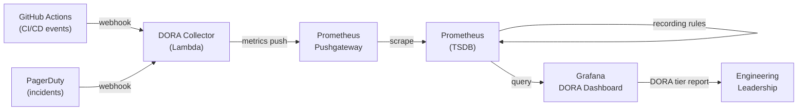

# Developer Productivity Metrics and DORA

---
id: PE-025
title: Developer Productivity Metrics and DORA
category: Platform Engineering
difficulty: ★★★
interview_weight: critical
seniority: staff
status: draft
version: 1
---

### 🎯 Model Answer

**30 seconds:**
> DORA (DevOps Research and Assessment) is the most scientifically
> validated framework for measuring software delivery performance. It
> defines four key metrics: deployment frequency, lead time for changes,
> change failure rate, and mean time to recovery. Elite performers ship
> multiple times per day with sub-hour lead times. The platform engineering
> team's primary job is to build the infrastructure that moves product
> teams from Low/Medium to High/Elite DORA performance.

**3 minutes (Senior):**
> DORA metrics are not vanity metrics - they were derived from six years
> of research across 32,000 survey respondents and validated against
> organizational performance outcomes. High DORA performers have
> statistically significant higher revenue growth, customer satisfaction,
> and ability to pursue new markets. Low performers are organizationally
> stuck: slow deployments create fear of deployments, which leads to less
> frequent but larger deployments, which creates more risk, which creates
> more failed deployments - a vicious cycle.
>
> For platform engineers, DORA metrics serve as the outcome measure for
> platform investment. The platform should measurably improve each metric:
> deployment frequency (by making deployments cheap and automatable),
> lead time (by eliminating pipeline bottlenecks and manual gates), change
> failure rate (by enforcing quality gates automatically), and MTTR (by
> making deployments reversible and providing platform-level observability).
>
> Beyond DORA, modern developer productivity research (SPACE framework,
> DX Core 4) adds dimensions that DORA misses: developer satisfaction,
> cognitive load, collaboration effectiveness, and flow state. DORA tells
> you HOW FAST and HOW RELIABLY teams ship. SPACE tells you WHY.
>
> The trap is measuring DORA metrics without improving them. Many platform
> teams instrument DORA dashboards as a compliance exercise, then present
> "here are our DORA metrics" without connecting platform work to metric
> trends.

**Blank Mind Recovery:**

**(1) Restate:** "Developer Productivity Metrics and DORA - frameworks
for measuring and improving software delivery performance."

**(2) First principles:** "If you cannot measure software delivery
performance, you cannot improve it. DORA is the measurement framework;
platform engineering is the improvement mechanism."

**(3) Bridge:** "DORA is to software delivery what cycle time and
throughput are to manufacturing. The Toyota Production System used cycle
time measurement to systematically eliminate waste in physical manufacturing.
DORA enables the same systematic waste elimination in software delivery."

---

### 📘 Concept Explanation

**What it is:**
DORA (DevOps Research and Assessment) is a research program by Google
that produced the State of DevOps annual report from 2014 onwards. The
research identified four metrics that predict software delivery performance
and organizational outcomes:

1. **Deployment frequency** - how often code is deployed to production
2. **Lead time for changes** - time from code commit to production deployment
3. **Change failure rate** - percentage of deployments that cause degraded service
4. **Mean time to recovery (MTTR)** - time to restore service after an incident

**Performance tiers:**

| Metric | Low | Medium | High | Elite |
|---|---|---|---|---|
| Deployment freq | < 1/month | 1/month - 1/week | 1/week - 1/day | On demand (multiple/day) |
| Lead time | > 6 months | 1-6 months | 1 week - 1 month | < 1 hour |
| Change failure rate | > 45% | 16-30% | 0-15% | 0-15% |
| MTTR | > 6 months | 1-7 days | < 1 day | < 1 hour |

*Source: State of DevOps 2023 (Google Cloud/DORA)*

**How it works - measurement:**

```
DORA METRICS MEASUREMENT (via Prometheus + GitHub Actions)

Deployment frequency:
  Event: each successful production deployment
  Collection: GitHub Actions webhook -> Prometheus Pushgateway
    platform_deployment_total{team, service, environment} counter
  Rate: rate(platform_deployment_total{environment="production"}[30d])

Lead time for changes:
  Start event: git commit timestamp (from GitHub commit API)
  End event: deployment success timestamp
  Collection: record both; calculate delta
    platform_lead_time_seconds{team, service} histogram
  Target: p50, p95, p99 of lead time distribution

Change failure rate:
  Numerator: deployments followed by an incident or rollback within 1hr
  Denominator: total deployments
  Collection: join deployment events with incident events on time window
  Target: < 15% (High), < 5% (Elite)

MTTR (Mean Time to Recovery):
  Start event: incident opened (PagerDuty webhook)
  End event: incident resolved (PagerDuty resolution webhook)
  For deployment-caused incidents only: correlate with deployment events
  Target: < 1 hour (High), < 15 minutes (Elite)
```

> **Code walkthrough:** This example demonstrates the core pattern in action. The key mechanism shows how the concept works in practice. Study the structure to understand the essential behavior and common usage.

**The SPACE framework (2021, Microsoft Research):**

SPACE adds 5 dimensions DORA does not cover:
- **S**atisfaction and wellbeing: is the developer satisfied and not burned out?
- **P**erformance: does the developer's work achieve business outcomes?
- **A**ctivity: how many tasks are completed? (a weak signal - activity != productivity)
- **C**ommunication and collaboration: how well does the team coordinate?
- **E**fficiency and flow: can developers work without interruption?

SPACE is harder to measure than DORA but captures what DORA misses:
a team can have Elite DORA metrics while developers are burned out,
working nights and weekends to maintain that deployment frequency.

**DX Core 4 (2024, DX Research):**

Developer Experience Core 4 (dx.io) proposes four metrics that combine
DORA with developer experience:
1. DORA metrics (delivery performance)
2. Developer effort score (how much unnecessary effort is required?)
3. Interruption frequency (how often is flow interrupted?)
4. Perceived productivity (do developers feel productive?)

**Platform engineering's role:**
The platform engineering team directly controls the infrastructure that
determines 3 of 4 DORA metrics: deployment frequency (CI/CD pipeline
speed and reliability), lead time (pipeline automation and environment
provisioning), and MTTR (observability, rollback automation, incident
tooling). Change failure rate is partly platform-controlled (quality
gates, test automation in the pipeline) and partly team-controlled
(test coverage, code review quality).

---

### 💻 Code Example

**Example 1: BAD vs GOOD - DORA metrics implementation**

```python
# BAD: Self-reported DORA metrics
# Sprint review: "How often did we deploy to production this sprint?"
# Engineer: "Maybe 3 or 4 times? It's hard to remember."
# Manager: "Let's say 4. So deployment frequency = 4/sprint = 2/week."
# Reality: 2 deployments to staging, 1 to production, 1 rolled back.
# Actual deployment frequency (Elite target): 0.5/day = 3.5/week.
# Reported: 2/week. Actual: 0.5/day. Off by 75%.
#
# Self-reported metrics are unreliable, biased toward better outcomes,
# and do not capture the granularity needed for trend analysis.
```

```python
# GOOD: Automated DORA metrics collection via event-driven pipeline

import os
import time
from datetime import datetime
from prometheus_client import (
    CollectorRegistry,
    Counter,
    Histogram,
    push_to_gateway,
)

PUSHGATEWAY = os.environ.get("PUSHGATEWAY_URL", "pushgateway:9091")
registry = CollectorRegistry()

# Metric definitions - collected at every deployment event
deployment_total = Counter(
    "platform_deployment_total",
    "Total deployments to production",
    ["team", "service", "status"],   # status: success | rollback
    registry=registry,
)

lead_time_seconds = Histogram(
    "platform_lead_time_seconds",
    "Lead time from commit to production deploy",
    ["team", "service"],
    buckets=[
        60, 300, 600, 1800, 3600,       # 1min to 1hr (Elite/High)
        7200, 14400, 28800, 86400,       # 2-24 hrs (Medium)
        604800, 2592000,                  # 1 week, 1 month (Low)
    ],
    registry=registry,
)

def record_deployment(
    team: str,
    service: str,
    commit_timestamp: float,   # unix timestamp of the triggering commit
    deploy_status: str = "success",
) -> None:
    """
    Called by CI/CD pipeline on each production deployment.
    Records deployment event and lead time.
    """
    now = time.time()
    lead_time = now - commit_timestamp

    deployment_total.labels(
        team=team,
        service=service,
        status=deploy_status,
    ).inc()

    lead_time_seconds.labels(
        team=team,
        service=service,
    ).observe(lead_time)

    push_to_gateway(
        PUSHGATEWAY,
        job=f"deploy_{team}_{service}",
        registry=registry,
    )

    print(
        f"[DORA] {team}/{service} deployment {deploy_status}. "
        f"Lead time: {lead_time/3600:.2f}h"
    )

# Called from GitHub Actions on production deployment success:
# record_deployment(
#   team="payments",
#   service="payment-api",
#   commit_timestamp=float(os.environ["COMMIT_TIMESTAMP"]),
#   deploy_status="success",
# )
```

> **Code walkthrough:** The key design decision is using Prometheus
> histogram buckets aligned to DORA performance tiers - the first set
> of buckets (1 minute to 1 hour) corresponds to Elite/High performance;
> the second set (2-24 hours) to Medium; the final set (1 week, 1 month)
> to Low. This makes the Grafana dashboard interpretation direct: bars
> in the leftmost buckets = Elite behavior. The `commit_timestamp` is
> read from the git commit metadata (`git log -1 --format=%ct HEAD`) and
> injected as an environment variable in the CI/CD pipeline. The event-
> driven approach (every deployment triggers a record) is accurate;
> self-reported or batch-collected metrics are not.

**Example 2: DORA Prometheus recording rules and alerting**

```yaml
# prometheus/rules/dora.yml
groups:
  - name: dora_recording_rules
    interval: 5m
    rules:

      # Deployment frequency: deployments per day (7-day rolling average)
      - record: dora:deployment_frequency:per_day_7d
        expr: >
          sum(rate(platform_deployment_total{
            status="success"
          }[7d])) by (team)
          * 86400

      # Lead time: 50th percentile, 7-day window
      - record: dora:lead_time_p50_seconds:7d
        expr: >
          histogram_quantile(
            0.50,
            sum(rate(platform_lead_time_seconds_bucket[7d])) by (team, le)
          )

      # Change failure rate: failed deployments / total deployments
      - record: dora:change_failure_rate:7d
        expr: >
          sum(rate(platform_deployment_total{
            status="rollback"
          }[7d])) by (team)
          /
          sum(rate(platform_deployment_total[7d])) by (team)

  - name: dora_alerts
    rules:

      # Alert when a team's change failure rate exceeds 30%
      # (indicating testing or review process breakdown)
      - alert: HighChangeFailureRate
        expr: >
          dora:change_failure_rate:7d > 0.30
        for: 24h
        labels:
          severity: warning
        annotations:
          summary: >-
            Team {{ $labels.team }} has high change failure rate
            ({{ $value | humanizePercentage }})
          description: >-
            Change failure rate > 30% for 24h. Check recent deployments
            for patterns: missing tests, skipped reviews, broken pipeline.

      # Alert when lead time degrades from High to Low tier
      - alert: LeadTimeDegradation
        expr: >
          dora:lead_time_p50_seconds:7d > 86400
        for: 2h
        labels:
          severity: warning
        annotations:
          summary: >-
            Team {{ $labels.team }} lead time > 1 day
          description: >-
            Median lead time has degraded to Low DORA tier.
            Check CI/CD pipeline for bottlenecks or manual gates.
```

> **Code walkthrough:** Recording rules pre-aggregate DORA metrics at
> the Prometheus level, making Grafana queries fast even at high cardinality.
> The change failure rate formula divides `rollback` status deployments
> by total deployments - the CI/CD pipeline must emit a `rollback` event
> when a deployment is reverted. The alert thresholds are set to DORA
> tier boundaries: 30% CFR = Low tier, 1-day lead time = Low tier.
> Teams alerted at tier boundary crossings (not arbitrary thresholds)
> because DORA tier language is meaningful to engineering leaders.

---

### 📊 Diagram

```
DORA METRICS COLLECTION ARCHITECTURE

  +------------------+     webhook    +------------------+
  |  GitHub Actions  | ------------> |  DORA Collector  |
  |  (CI/CD events)  |               |  (Python Lambda) |
  +------------------+               +--------+---------+
        |                                     |
        | commit timestamp                    | metrics push
        | deploy status                       v
        |                            +------------------+
        |                            |   Prometheus     |
        |                            |   Pushgateway    |
        |                            +--------+---------+
        |                                     |
        |                                     | scrape
        |                                     v
        v                            +------------------+
  +------------------+               |   Prometheus     |
  |   PagerDuty      |  webhook      |   (TSDB)         |
  |   (incidents)    | --------+     +--------+---------+
  +------------------+         |              |
                                |     recording rules
                                |     dora:* metrics
                                |              |
                                v              v
                       +------------------+  Grafana
                       |  DORA Calculator |  DORA
                       |  (MTTR / CFR)    |  Dashboard
                       +------------------+
```



> **Diagram walkthrough:** The DORA collection architecture has two event
> streams that must be joined: CI/CD events (deployment success/rollback,
> with commit timestamps for lead time) and incident events (for MTTR
> and change failure rate correlation). A Lambda function receives both
> event types via webhook and pushes Prometheus metrics. Recording rules
> pre-aggregate the four DORA metrics at scrape time, enabling fast
> Grafana queries. The key dependency: MTTR and change failure rate
> require correlating deployment events with incident events by timestamp
> window, which is more complex than deployment frequency and lead time.

---

### 🎓 Answers by Seniority

**Junior / Mid (0-5 years):**
> DORA stands for DevOps Research and Assessment - it's a framework that
> measures how well a software team delivers changes. The four metrics
> are: deployment frequency (how often you deploy), lead time for changes
> (how long from code commit to production), change failure rate (percentage
> of deployments that cause problems), and MTTR (how fast you recover
> from incidents). Elite teams deploy multiple times per day with sub-hour
> lead times. The platform team's job is to make these metrics better
> for all product teams.

---

**Senior / Staff (5+ years):**
> DORA is both a measurement framework and an organizational performance
> predictor. The research establishes that teams in the Elite tier have
> 127x more frequent deployments, 106x faster lead times, 7x lower change
> failure rates, and 2,604x faster MTTR than Low performers - and these
> differences correlate with 2x revenue growth and better organizational
> outcomes.
>
> For platform engineering, DORA provides the outcome metrics that justify
> platform investment. The platform should move product teams up the DORA
> tier ladder by: (1) making deployments fast and automated (frequency +
> lead time), (2) enforcing quality gates in the pipeline (change failure
> rate), and (3) providing platform-level observability and rollback (MTTR).
>
> Beyond DORA, I use the SPACE framework to understand WHY DORA metrics
> are what they are. A team with Low DORA performance might have a
> technical bottleneck (pipeline speed), a process bottleneck (manual
> approval gates), a cognitive load problem (infrastructure is too complex
> for product engineers to manage), or a team health problem (burnout,
> understaffing). DORA tells you the symptom; SPACE helps diagnose the cause.

---

### ⚠️ Common Misconceptions

**Misconception: "DORA metrics are vanity metrics that don't correlate
with real business outcomes."**

The DORA research directly correlates with organizational outcomes:
revenue growth, market share, customer satisfaction, and employee
retention. The 2023 State of DevOps report found that Elite performers
have 1.8x higher probability of exceeding profitability targets. The
research methodology uses structural equation modeling to validate
causal relationships, not just correlations. "We deploy fast, therefore
we grow" is an oversimplification; "fast and reliable delivery capability
gives organizations competitive agility, which enables growth" is the
validated causal pathway.

**Misconception: "We should optimize all four DORA metrics equally."**

Lead time and deployment frequency are throughput metrics. Change failure
rate and MTTR are stability metrics. They are in tension: if you deploy
more frequently, you naturally create more opportunities for failures.
The key insight is that Elite performers have BOTH high throughput AND
high stability - they are not in tension at Elite tier. But getting to
Elite requires first optimizing lead time and deployment frequency
(removing bottlenecks), then optimizing CFR and MTTR (adding automated
quality gates and rollback). Teams that try to improve CFR before
deployment frequency end up with slow, heavily gated pipelines that
improve stability by slowing everything down.

---

### 🚨 Failure Modes and Diagnosis

**Failure mode: Gaming DORA metrics to appear Elite**

Symptom: deployment frequency increases 10x in one month. Lead time
drops to < 1 hour. Change failure rate is 0%. Engineering leadership
reports Elite DORA performance. Product teams still feel like shipping
is slow and painful.

Diagnosis: metric gaming. Common patterns:
- Deployment frequency: deploying documentation or configuration changes
  (that carry no real risk) to inflate the count
- Lead time: resetting the lead time start timestamp to the pipeline
  start time (not the commit time), inflating apparent speed
- Change failure rate: defining "change failure" narrowly to exclude
  incidents that don't trigger automated alerts
- MTTR: closing incidents quickly on paper without resolving the root cause

Detection: cross-validate DORA metrics against team self-report surveys
("does shipping feel fast?"), customer-facing incidents, and product
velocity (are features actually shipping faster?).

Fix: define DORA metrics precisely at the platform level, automate
measurement from CI/CD and incident tooling with no team-level override,
and cross-validate quarterly.

**Failure mode: High DORA but developer burnout**

Symptom: Elite DORA metrics. High deployment frequency. Good change
failure rate. Engineering leadership is satisfied. But developer
satisfaction surveys show declining scores. Attrition is increasing.

Cause: Elite DORA can be achieved through constant overtime and a culture
of deploying-at-any-cost. DORA measures delivery throughput, not
sustainable pace. If the platform automates half the work but the team
is expected to double output, the efficiency gains have been absorbed
by scope expansion rather than sustainable pace improvement.

Diagnosis: SPACE framework - specifically the Satisfaction and
Efficiency dimensions. Are developers in flow, or constantly interrupted?
Are they satisfied with the work environment?

Fix: use DORA and SPACE together. Platform engineering improves both.
The platform should reduce interruptions (automated quality gates catch
bugs before they become on-call incidents), not just increase throughput.

---

### 🎯 Interview Deep-Dive

**Timing:** Hard ★★★ - 12 questions minimum.

---

#### Q1 - How do you instrument lead time for changes accurately?

Lead time for changes is the time from code commit to production
deployment. The key challenge is defining both endpoints precisely.

**Start event options:**

Option 1 - First commit in the change set:
Track the oldest commit included in a deployment. Requires associating
deployments with the list of commits they include (git rev-list between
the previous production tag and the current tag).

Option 2 - PR creation timestamp:
Start time = when the PR was opened. This includes code review time,
which reflects the full lead time including human feedback loops.

Option 3 - PR merge timestamp (most common):
Start time = when the PR was merged to main. This measures pipeline
lead time (automated stages only) and excludes code review time.
Easier to measure but understates actual lead time.

**Recommendation:** measure both PR-open-to-merge (code review cycle
time) and merge-to-production (pipeline lead time) separately. Total
lead time = sum. Product teams typically cannot reduce pipeline lead
time further after platform optimization, but code review cycle time
has significant room for improvement through team practices.

**Implementation:**

```python
# GitHub webhook for PR events
# Extract: PR opened timestamp, PR merged timestamp, deploy timestamp

def calculate_lead_time(pr_open_ts, pr_merge_ts, deploy_ts):
    code_review_time = pr_merge_ts - pr_open_ts
    pipeline_time = deploy_ts - pr_merge_ts
    total_lead_time = deploy_ts - pr_open_ts
    return {
        "code_review_hours": code_review_time / 3600,
        "pipeline_hours": pipeline_time / 3600,
        "total_hours": total_lead_time / 3600,
    }
```

> **Code walkthrough:** This example demonstrates the core pattern in action. The key mechanism shows how the concept works in practice. Study the structure to understand the essential behavior and common usage.

*What separates good from great:* Distinguishing code review cycle time
from pipeline lead time. Platform engineering can reduce pipeline lead
time (by optimizing CI, parallelizing tests, eliminating manual gates)
but cannot directly reduce code review cycle time. A platform team that
measures only pipeline lead time takes credit for fast pipelines while
missing the larger cycle time problem (a 45-minute pipeline with a
5-day code review cycle has a 5-day+ total lead time). Presenting both
components separately focuses improvement on the actual bottleneck.

---

#### Q2 - What is the correct way to measure deployment frequency?

Deployment frequency is deployments to production per unit time. The
measurement challenge is defining "production" and "deployment."

**Definition precision:**

What counts as a deployment?
- Code deployments (Kubernetes image tag changes): Yes, always
- Configuration changes (ConfigMap updates): Yes, if they affect
  service behavior
- Infrastructure changes (Terraform apply): Depends - if it changes
  production behavior, yes
- Documentation deployments: No - do not inflate frequency with
  non-service changes

What counts as production?
- The customer-facing environment: always
- A pre-production environment that 100% of traffic is shadowed to: sometimes
- Staging: no - staging deployments are not production deployments

**Team-level vs. service-level frequency:**

A team of 5 engineers with 3 microservices might deploy 10 times/day.
Should frequency be reported per-team (10/day) or per-service (3.3/day)?

Convention: report deployment frequency per service for engineering
metrics, per team for business metrics. A team that deploys their
3 services multiple times per day is Elite regardless of how it's counted.

**Automation:**

```yaml
# ArgoCD notification: every successful production sync
# pushes a deployment event to Prometheus Pushgateway
apiVersion: argoproj.io/v1alpha1
kind: Application
metadata:
  name: payment-api
  namespace: argocd
  annotations:
    notifications.argoproj.io/subscribe.on-sync-succeeded.webhook: >
      dora-collector
```

> **Code walkthrough:** This example demonstrates the core pattern in action. The key mechanism shows how the concept works in practice. Study the structure to understand the essential behavior and common usage.

*What separates good from great:* Segmenting deployment frequency by
DORA tier to identify bi-modal distributions. In most organizations,
some teams are Elite (3+ deployments/day) and others are Low (1/month).
Presenting the average hides this. A platform team that can show "15 of
40 teams are currently Elite performers, 20 are High, 5 are still Low"
has a specific target: move the 5 Low teams to High. "Our average
deployment frequency is 2.4/day" tells leadership nothing actionable.

---

#### Q3 - How does change failure rate differ from test failure rate?

**Change failure rate (DORA):** percentage of production deployments that
result in degraded service requiring remediation (hotfix or rollback).
Measured from production incidents correlated with recent deployments.
Target: < 15% (High), < 5% (Elite).

**Test failure rate:** percentage of CI pipeline runs that fail due to
test failures. Measured from CI/CD pipeline data.
Target: < 5% (high-quality test suite), though varies widely.

**Key differences:**

Test failure rate measures pipeline health; change failure rate measures
deployment quality reaching production. A team could have:
- High test failure rate + low change failure rate: the CI catches most
  bugs before they reach production (good - this is the desired state)
- Low test failure rate + high change failure rate: either test coverage
  is low (bugs reach production uncaught) or the tests do not represent
  production conditions
- Low test failure rate + low change failure rate: optimal state
- High test failure rate + high change failure rate: tests don't represent
  real bugs and production is unstable

**Measurement:**

Change failure rate requires linking production incidents to the most
recent deployment. The link is temporal: if an incident opens within
60 minutes of a deployment, the deployment is a probable cause. This
is imprecise (correlation, not causation) but sufficient for trend
analysis. A precise correlation requires deployment attribution
(the incident annotation includes the deployment ID that caused it).

*What separates good from great:* Understanding that change failure rate
is a lagging indicator of pipeline quality. You can only reduce change
failure rate by improving the pipeline (better tests, earlier static
analysis, canary deployments with automated rollback). The specific
improvement depends on what the failed deployments have in common. If
60% of failures are database migration failures, the fix is migration
testing. If 40% are configuration-related, the fix is configuration
validation in the pipeline.

---

#### Q4 - What is the SPACE framework and when do you use it over DORA?

**SPACE** (Satisfaction, Performance, Activity, Communication/collaboration,
Efficiency) is a 2021 framework from Microsoft Research for measuring
developer productivity comprehensively.

**Use SPACE when:**

- DORA metrics are good but developers are unhappy (burnout risk)
- You need to diagnose WHY DORA metrics are poor (root cause analysis)
- You are making a business case for reducing cognitive load or improving
  tooling (SPACE quantifies the cost of poor developer experience)
- You are evaluating developer portal adoption or tooling investments

**SPACE dimensions in platform context:**

Satisfaction: "On a scale of 1-10, how satisfied are you with your
ability to deploy services? What is the biggest impediment?"
Platform improvement: reduce deployment friction.

Activity: PR throughput, issue closure rate, test coverage delta.
(This is the weakest SPACE dimension - activity != productivity)

Communication: how many cross-team dependencies exist in a deployment?
Does the platform enable self-service or require cross-team coordination?
Platform improvement: eliminate deployment dependencies through self-service.

Efficiency: "In the last week, how many times were you interrupted while
working on a task? What caused the interruptions?"
Platform improvement: reduce on-call interruptions through better
platform reliability.

**DORA vs. SPACE: when to use each:**

| Question | Framework |
|---|---|
| How fast is our delivery pipeline? | DORA |
| Are developers burning out? | SPACE |
| Where is the bottleneck in delivery? | DORA |
| Why is the bottleneck there? | SPACE |
| Are our DORA investments paying off? | DORA + SPACE together |
| Is our developer portal reducing friction? | SPACE (Efficiency, Satisfaction) |

*What separates good from great:* Using DORA and SPACE together as
complementary lenses. DORA without SPACE can lead to optimizing
for throughput at the cost of developer wellbeing. SPACE without DORA
can lead to improving developer satisfaction without improving delivery
outcomes. The combination identifies sustainable improvement: "Our lead
time improved by 40% AND developer satisfaction improved by 1.5 points
on a 5-point scale - the platform is delivering both outcomes."

---

#### Q5 - How do you use DORA metrics to prioritize platform investments?

DORA metrics identify the bottleneck in software delivery. Platform
investment should target the metric furthest from Elite.

**DORA-driven investment prioritization:**

Step 1: measure all four DORA metrics for all teams. Map each team to
the Elite/High/Medium/Low tier on each metric.

Step 2: find the metric and team cluster furthest from Elite. This is
the platform investment priority.

Example analysis:
- Deployment frequency: 60% of teams are Elite or High. Good.
- Lead time: 40% of teams are still Medium (1-7 days). Bottleneck found.
  Root cause: manual QA gate between staging and production.
- Change failure rate: 15%. At the High/Low tier boundary. Needs attention.
- MTTR: 90% of teams recover in < 1 hour. Good.

Investment priority: eliminate the manual QA gate (leads to lead time
improvement) and improve test coverage (leads to CFR improvement).
Platform work: automated E2E test suite in the pipeline that replaces
manual QA, running in < 30 minutes.

**Investment to DORA metric mapping:**

| Platform Investment | DORA Metric Improved |
|---|---|
| Faster CI (parallel test execution) | Lead time, Deployment frequency |
| Canary deployment with auto-rollback | MTTR, Change failure rate |
| Self-service environment provisioning | Lead time (eliminates wait for environments) |
| Policy as code (automated compliance) | Lead time (eliminates manual security gate) |
| Observability platform | MTTR |
| GitOps automation | Deployment frequency, Lead time |

*What separates good from great:* Segmenting DORA by team and presenting
the distribution (percentiles, not averages). Telling leadership "our
average lead time is 3 hours" is less useful than "5 teams have lead
time > 1 day - they have manual QA gates not yet integrated with the
platform. Removing those gates will bring them to Elite." The latter
has a specific, actionable investment recommendation.

---

#### Q6 - How do you measure and reduce cognitive load using platform metrics?

Cognitive load is not directly measurable, but proxy metrics indicate
high cognitive load:

**Proxy metrics for cognitive load:**

On-call interruption rate:
```
platform_oncall_interruptions_per_week{team}
```
> **Code walkthrough:** This example demonstrates the core pattern in action. The key mechanism shows how the concept works in practice. Study the structure to understand the essential behavior and common usage.

High interruption rate = developers spend time on operational issues
instead of product work. Platform improvement: better automated remediation
reduces interruptions.

Number of tools required to deploy:
"How many tabs do you have open to deploy a service?" (from developer
survey). Platform improvement: integrated developer portal reduces
context switching.

Support ticket rate:
Number of tickets filed to the platform team per product team per week.
High rate = developers cannot self-serve; the platform has high cognitive
load for users. Platform improvement: better documentation, self-service
workflows, and a more intuitive developer portal.

Build failure comprehensibility:
When a build fails, how long does it take a developer to understand
why? Measure: time from build failure notification to PR update (from
GitHub events). Long time = build failures are hard to understand.

**Platform cognitive load reduction investments:**

| Problem | Measurement | Platform Solution |
|---|---|---|
| Too many tools to deploy | Survey: "how many tabs?" | Developer portal integrates deploy UI |
| Unclear build failures | Time from fail to PR update | Better pipeline error messages |
| Frequent on-call interruptions | Alert volume per team per week | Auto-remediation for common alerts |
| Slow environment provisioning | Wait time for environment | Self-service namespace provisioning |

*What separates good from great:* Treating cognitive load reduction as
a first-class platform objective, not an afterthought. Developer Experience
Research (DX) establishes that developers' biggest productivity killers
are: slow feedback loops (addressed by faster CI), unclear errors
(addressed by better pipeline diagnostics), and too many manual processes
(addressed by automation). The platform team that measures and reduces
these specific friction points - not just CI speed - drives the largest
developer experience improvements.

---

#### Q7 - How do you prevent DORA metric gaming in a large organization?

Metric gaming is a natural response to high-stakes measurement. When
DORA metrics are tied to team performance reviews or published to
leadership, teams have incentives to optimize the metric rather than
the underlying behavior.

**Detection:**

Statistical anomaly detection:
```python
# Flag teams with suspicious metric patterns
def detect_gaming(team_metrics: dict) -> list:
    flags = []

    # Sudden large improvement without corresponding process change
    if (team_metrics["lead_time_delta_7d"] < -0.5  # 50% improvement in 7 days
            and team_metrics["process_change_events_7d"] == 0):
        flags.append("sudden_lead_time_improvement_no_process_change")

    # Deployment frequency spike with 0% change failure rate
    # (no test suite can catch 100% of production issues)
    if (team_metrics["deployment_frequency_delta_7d"] > 2.0  # 2x increase
            and team_metrics["change_failure_rate_7d"] == 0.0):
        flags.append("impossible_cfr_with_high_frequency")

    # MTTR < 5 minutes for all incidents
    # (investigations cannot realistically complete in 5 min)
    if team_metrics["mttr_p50_minutes"] < 5:
        flags.append("unrealistically_low_mttr")

    return flags
```

> **Code walkthrough:** This example demonstrates the core pattern in action. The key mechanism shows how the concept works in practice. Study the structure to understand the essential behavior and common usage.

**Prevention through measurement design:**

1. Automate metric collection from authoritative sources (GitHub, ArgoCD,
   PagerDuty) with no team-level override capability. If the metric comes
   from a system teams control, they can control the metric.

2. Cross-validate with complementary metrics that are harder to game:
   - Deployment frequency vs. feature velocity (are more deployments
     actually delivering more features?)
   - MTTR vs. customer-reported incidents (if MTTR is 10 minutes but
     customers reported the service was down for 2 hours, MTTR is wrong)

3. Use DORA for team improvement, not performance evaluation. When DORA
   is tied to performance review, gaming incentives are strong.

*What separates good from great:* Understanding that DORA is a
diagnostic tool, not a scorecard. Publishing team DORA tier rankings
to leadership creates perverse incentives. Publishing "here is how DORA
tiers are distributed across the organization, and here is the platform
investment roadmap to move teams up the tier ladder" is a better use
of the data.

---

#### Q8 - What is DX Core 4 and how does it extend DORA?

DX Core 4 (2024, dx.io, developed by Abi Noda and Nicole Forsgren)
is a four-metric framework that combines DORA delivery metrics with
developer experience metrics.

**The four metrics:**

1. **Speed** (DORA-derived): deployment frequency and lead time. How
   fast can teams deliver changes?

2. **Effectiveness** (DORA-derived): change failure rate and MTTR. How
   reliably do teams deliver changes?

3. **Quality** (new): code review turnaround time, build success rate,
   test coverage trends. How is the quality of the software development
   process?

4. **Developer experience** (new): developer effort score, perceived
   productivity, interruption frequency. How do developers experience
   the work?

**Why DX Core 4 extends DORA:**

DORA measures what the CI/CD system produces. DX Core 4 adds the
developer-side experience of producing it. Two teams can have identical
DORA metrics while one team experiences significant friction (slow
code review, frequent interruptions, confusing tooling) and one does not.
DX Core 4 captures the difference.

**Platform relevance:**

The Developer Experience metric in DX Core 4 is directly influenced by
platform quality: slow provisioning, complex deployment processes, poor
observability tooling, and unclear build failure messages all reduce
the developer experience score. A platform team that tracks DX Core 4
has a direct feedback loop between platform improvements and developer
experience outcomes.

*What separates good from great:* Recognizing DX Core 4 as an evolution
of DORA rather than a replacement. Organizations that have already
implemented DORA measurement should add DX Core 4's developer experience
dimension to understand the human side of delivery performance. The
combination gives the fullest picture of software delivery health.

---

#### Q9 - How do you use DORA data to justify a platform team expansion?

The headcount justification using DORA data follows three steps:

Step 1: Establish current DORA tier distribution.
"Currently: 15 teams Elite, 20 teams High, 5 teams Medium, 0 teams Low."

Step 2: Model the impact of specific platform investments.
"Investment A (automated E2E testing in pipeline): moves the 5 Medium
teams to High tier. Lead time decreases from 3 days to 1 day.
Investment B (self-service environment provisioning): moves 10 High
teams to Elite. Lead time decreases from 6 hours to 45 minutes."

Step 3: Quantify the business value of the DORA tier improvement.
"5 teams moving from Medium to High: 5 teams * 20 deploys/week gain *
50 weeks = 5,000 additional deployments/year. At $5K revenue per
deployment (rough product estimate): $25M incremental value opportunity."

Step 4: Calculate the platform investment required.
"Investment A requires 1 additional platform engineer for 6 months =
$125,000. ROI of this investment: $25M potential value / $125K cost =
200x. Even if the actual revenue impact is 1% of the estimate, it's
a 2x ROI."

**Caveats to present honestly:**
- Revenue attribution per deployment is speculative; use conservative estimates
- DORA tier improvements take 6-12 months to fully manifest after platform changes
- Some teams will not adopt new platform capabilities without migration support

*What separates good from great:* Presenting the ROI analysis with
explicit uncertainty bounds. "If our estimate of $5K revenue value per
deployment is off by 10x (i.e., $500/deployment), the investment still
has a 20x ROI" is a compelling case that survives skeptical scrutiny.
Platform teams that present only the best-case ROI number are less
credible than those who present the range and show positive ROI even
in the conservative case.

---

#### Q10 - How does DORA performance correlate with security and compliance outcomes?

The 2023 State of DevOps report added security measurement (DORA DevSecOps):

**The finding:** Elite DORA performers have 1.6x higher secure software
supply chain practices adoption compared to Low performers. This
challenges the assumption that "moving fast" means "cutting security corners."

**Mechanism:** Elite performers use automation to enforce security at
every stage of the pipeline, not as a manual gate. Manual security
reviews (a common bottleneck in Low/Medium performers) add delay but
do not catch more vulnerabilities than automated scanning. They are
replaced in Elite organizations by automated SAST, DAST, container
scanning, and supply chain signing.

**Platform implications:**

The platform that enables Elite DORA performance through automation
also enables Elite security posture:
- Container image scanning in CI (catches vulnerabilities before deployment)
- SBOM generation at build time (supply chain transparency)
- OPA/Kyverno admission control (prevents non-compliant images from
  reaching production)
- Automated secrets rotation (eliminates long-lived credentials)

These security capabilities are platform capabilities. The same
automation that makes deployments fast also makes them secure.

**Business implication:**

A platform team can make the argument: "Our platform enables both Elite
DORA performance AND Elite security posture. These are not in tension.
Manual security gates slow us down without making us more secure;
automated security gates integrated into the pipeline make us both
faster and more secure."

*What separates good from great:* Citing the DORA DevSecOps research
to counter the "you can have speed or security, not both" objection.
This is a common objection to platform investment from security and
compliance teams who fear that faster deployments mean less scrutiny.
The research data enables a fact-based response.

---

#### Q11 - What are the failure modes of DORA measurement at scale?

At 100+ teams, DORA measurement has specific challenges:

**Cardinality explosion:**
```
# Each team + service combination is a label dimension
platform_deployment_total{team="payments", service="payment-api"}
platform_deployment_total{team="fraud", service="fraud-scorer"}
# ... 400 combinations for 40 teams * 10 services each

# Prometheus cardinality: 400 series for deployment_total
# lead_time histogram: 400 series * 12 buckets = 4,800 series
# At 1,000 teams: 10,000 series * 12 buckets = 120,000 series
# High cardinality: performance degrades, query latency increases
```

> **Code walkthrough:** This example demonstrates the core pattern in action. The key mechanism shows how the concept works in practice. Study the structure to understand the essential behavior and common usage.

Fix: use VictoriaMetrics (better high-cardinality support) or
pre-aggregate to team level in recording rules. Service-level DORA
is rarely needed for platform decisions; team-level is sufficient.

**Attribution errors in change failure rate:**
Production incidents may be caused by infrastructure issues (platform
bugs), external dependencies (third-party API failures), or application
bugs. A naive CFR calculation (incident within 60 min of deployment =
deployment caused it) misattributes platform incidents to application
teams.

Fix: require incident annotations with root cause category. Platform-
caused incidents are filtered from team CFR calculations.

**Lead time measurement for hotfixes:**
Emergency hotfixes have intentionally short code review cycles
(< 1 hour from PR open to merge). Including hotfixes in lead time
measurements inflates apparent lead time speed. Elite teams may have
a bimodal lead time distribution: normal PRs at 2-4 hours, hotfixes
at 20 minutes.

Fix: segment lead time by PR label (hotfix vs. feature vs. refactor)
and report distributions separately.

*What separates good from great:* Treating DORA measurement as a
production system that needs the same engineering care as any other
platform component: monitoring for cardinality growth, testing edge
cases (hotfixes, multi-service deployments, rollbacks), and validating
accuracy quarterly with team-level sampling.

---

#### Q12 - How do you use DORA metrics to run a platform quarterly review?

The platform quarterly review connects platform work to DORA outcome
metrics, demonstrating that platform investment is delivering measurable
software delivery improvement.

**Quarterly Review Structure:**

Section 1: DORA tier distribution (2 slides)
- Current tier distribution vs. 3 quarters ago
- Trend lines for each metric (deployment frequency, lead time, CFR, MTTR)
- Highlight: which teams moved up tiers this quarter?

Section 2: Platform investment attribution (1 slide)
- Which platform capabilities were delivered this quarter?
- Which DORA metrics did each capability improve?
- Example: "Automated E2E pipeline: contributed to 5 teams moving
  from Medium to High lead time tier"

Section 3: Next quarter platform roadmap (1 slide)
- What platform investments are planned?
- What DORA tier improvements do they target?
- For each investment: estimated DORA impact and affected team count

Section 4: Cost and ROI summary (1 slide)
- Platform TCO this quarter
- Productivity ROI from DORA improvements (using hours-saved model)
- Net ROI vs. prior quarter trend

**Key design principle:**
Every platform capability shipped should have a corresponding DORA
metric hypothesis: "this capability should improve [metric] for
[teams]." Every quarterly review validates whether the hypothesis
was correct. Over time, this builds a causal model of which platform
investments drive which DORA outcomes.

*What separates good from great:* Including slides where the data
does not match the hypothesis ("we shipped capability X expecting
to improve lead time, but lead time did not improve - investigation
showed teams are not adopting it because of documentation gaps").
Honest reporting of failed hypotheses builds more credibility than
cherry-picking successes, and identifies where platform adoption
support is needed.

---

### 💻 Code Example

*(Omit: this concept does not have a programmatic interface that can be demonstrated in code. The conceptual explanation above is sufficient.)*


---

### 🏛️ System Design

*(Omit: system design diagram not applicable for this concept - see ★★★ keywords for full system design coverage.)*


---

### ⚖️ Comparison Table

*(Omit: this is a ★☆☆ foundational concept with no direct alternatives to compare - see higher-difficulty keywords for trade-off analysis.)*


---

### 📊 Diagram

*(Omit: no standalone visual diagram required for this concept - the explanations and code examples above provide sufficient clarity.)*


