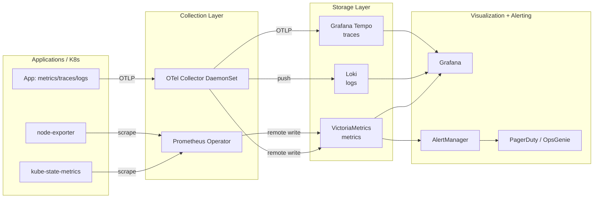

# Platform Observability Architecture

---
id: PE-021
title: Platform Observability Architecture
category: Platform Engineering
difficulty: ★★★
interview_weight: critical
seniority: staff
status: draft
version: 1
---

### 🎯 Model Answer

**30 seconds:**
> Platform observability architecture is the design of the metrics, logs,
> traces, and alerting infrastructure that answers three questions: is the
> platform healthy, are the workloads running on the platform healthy, and
> what is the user experience of teams using the platform? It is distinct
> from application observability - the platform team is both a consumer
> of observability data (to maintain the platform) and a provider of
> observability infrastructure (to serve the 40+ teams running on the
> platform). These two concerns require different designs.

**3 minutes (Senior):**
> Platform observability has three layers, and conflating them is the
> source of most design mistakes. The first layer is platform infrastructure
> observability: is the Kubernetes control plane healthy, are nodes
> available, is the storage layer performing, are admission controllers
> processing requests? This layer is the platform team's responsibility
> exclusively and answers "is the platform we operate healthy?"
>
> The second layer is workload observability infrastructure: the metrics
> pipeline, log aggregation, and distributed tracing stack that serves
> all 40+ teams running on the platform. This layer is a platform product -
> the platform team builds and operates it, and Stream-Aligned teams are
> the consumers. The decisions here are architectural: do we federate
> Prometheus or centralize it, do we run OpenTelemetry Collector as a
> DaemonSet or as a sidecar, what is the retention policy, what is the
> cardinality budget?
>
> The third layer is platform user experience observability: how long
> does it take to provision a new namespace, how fast does a Backstage
> scaffolding template run, what is the deployment pipeline P95 latency?
> This layer measures the developer experience of the platform and is
> the most often neglected. Without it, the platform team cannot track
> whether their work is actually improving developer productivity.

**Framework:** PLATFORM INFRA OBSERVABILITY -> WORKLOAD OBSERVABILITY
INFRASTRUCTURE -> PLATFORM UX OBSERVABILITY -> SLO FEEDBACK LOOP

*Adapting up:* Principal adds: "The architectural decision that most
teams underestimate is the metrics cardinality problem at scale.
Prometheus stores metrics as time-series labeled by arbitrary key-value
pairs. When you allow teams to emit metrics with high-cardinality labels
(user IDs, request IDs, arbitrary tag values), the number of time-series
explodes, causing Prometheus OOM crashes and query performance degradation.
Cardinality governance - defining allowed label key-value namespaces,
setting cardinality limits per namespace, alerting on cardinality growth -
is the most important architectural constraint in a multi-tenant
observability platform."

*Adapting down:* Junior: "Platform observability is about having dashboards
and alerts for the platform itself (is Kubernetes healthy?) and for the
services running on it (are the applications healthy?). The platform team
builds the shared Prometheus/Grafana/Jaeger stack that all teams use,
and also monitors the platform infrastructure itself."

**Blank Mind Recovery:**

**(1) Restate:** "Platform observability architecture - designing the
monitoring and telemetry systems for both the platform infrastructure
and the workloads running on it."

**(2) First principles:** "You can only fix what you can see. Observability
is the property that lets you ask 'what is wrong and why?' without needing
to redeploy code with additional logging."

**(3) Bridge:** "Think of a hospital: the hospital has its own monitoring
(building temperature, power systems, equipment status) AND medical
monitoring for patients. Platform observability is the same: monitoring
for the infrastructure (the 'hospital building') and monitoring services
for the teams using it (the 'medical equipment')."

---

### 📘 Concept Explanation

**What it is:**
Platform observability architecture is the design of the telemetry
collection, storage, query, and alerting systems that serve two purposes:
(1) enabling the platform team to maintain the health of the platform
infrastructure itself, and (2) providing observability tools and
infrastructure for Stream-Aligned teams to monitor their applications.

**The problem it solves:**
Without intentional observability architecture design, platforms develop
ad-hoc monitoring: each team installs their own Prometheus, logs are
scattered across multiple destinations, there is no shared tracing
infrastructure, and the platform team has no visibility into whether
the platform is serving users well. The result: MTTR is high (too long
to find problems), capacity planning is guesswork, and teams don't know
their application's error rate until users report it.

**How it works:**

```
PLATFORM OBSERVABILITY REFERENCE ARCHITECTURE

LAYER 1: Platform Infrastructure Observability

  Kubernetes control plane metrics:
    kube-state-metrics --> Prometheus
    node-exporter --> Prometheus
    API server metrics --> Prometheus
    etcd metrics --> Prometheus (separate, high priority)

  Platform component metrics:
    ArgoCD metrics (sync status, health)
    Gatekeeper/Kyverno metrics (admission latency, violations)
    Cert-manager metrics (certificate expiry)
    External-secrets metrics (sync errors)

  Alerting (Prometheus AlertManager):
    - Node disk > 80%: page platform team
    - API server error rate > 1%: page platform team
    - etcd latency > 100ms: page platform team
    - ArgoCD sync failures > 0: notify platform team

LAYER 2: Workload Observability Infrastructure

  Multi-tenant Prometheus (Victoria Metrics or Thanos):
    Each team --> namespace-scoped ServiceMonitor
    --> Federated Prometheus (tenant isolation)
    --> Long-term storage (Thanos/Cortex/VM)
    --> Grafana (team-scoped dashboards)

  Log aggregation:
    Applications --> stdout/stderr
    --> Node-level log shipper (Fluent Bit DaemonSet)
    --> Log aggregator (Loki or Elasticsearch)
    --> Grafana / Kibana

  Distributed tracing:
    Applications (instrumented with OTel SDK)
    --> OpenTelemetry Collector (sidecar or DaemonSet)
    --> Jaeger / Tempo / Zipkin
    --> Grafana trace viewer

  Cardinality governance:
    Per-namespace time-series quota
    Cardinality limit enforcement (VM/Prometheus)
    Cardinality growth alerting

LAYER 3: Platform UX Observability

  Developer journey metrics:
    Time to provision namespace (Crossplane reconcile latency)
    Time to first deployment (onboarding pipeline duration)
    Deployment pipeline P50/P95 latency (GitOps sync + health check)
    Backstage template execution time

  Platform SLO metrics:
    Namespace provisioning success rate SLO: 99.9%
    Platform API (ArgoCD, Backstage) availability SLO: 99.5%
    Secret sync latency SLO: < 30 seconds P95

  Feedback loop:
    Weekly platform SLO report --> engineering leadership
    Developer satisfaction survey (quarterly DORA metrics)
    Error budget burn rate --> platform team sprint prioritization
```

> **Code walkthrough:** This example demonstrates the core pattern in action. The key mechanism shows how the concept works in practice. Study the structure to understand the essential behavior and common usage.

**Key architectural decisions:**

Decision 1 - Prometheus deployment topology:
- Single cluster: one Prometheus per cluster (simpler)
- Multi-cluster: federated Prometheus or Thanos for cross-cluster view
- At > 10 clusters: Thanos or Victoria Metrics with remote-write
  aggregation (single-cluster Prometheus cannot span clusters)

Decision 2 - Tenant isolation model for metrics:
- Namespace-scoped ServiceMonitors (recommended): each team's metrics
  are scraped by a shared Prometheus but stored in tenant-labeled
  time-series. Teams can query only their own namespace metrics via
  RBAC-controlled Grafana data sources.
- Federated per-team Prometheus (advanced): each team runs their own
  Prometheus. Federated into central long-term storage. Better isolation,
  higher operational cost.

Decision 3 - Log aggregation:
- Loki (recommended for most): label-indexed, low-cost storage,
  integrates with Grafana. Not suitable for full-text search heavy use cases.
- Elasticsearch: full-text search, complex aggregations, but operationally
  expensive and resource-intensive at scale.

Decision 4 - Tracing infrastructure:
- Jaeger: CNCF graduated, good UI, supports multiple storage backends.
- Grafana Tempo: integrates with Grafana ecosystem (traces + metrics + logs),
  lower operational cost, object storage backend.
- OpenTelemetry Collector: vendor-agnostic collection layer. Use regardless
  of backend - makes switching backends trivial.

---

### 💻 Code Example

**Example 1: BAD vs GOOD - per-team Prometheus silos vs. platform observability**

```yaml
# BAD: each team installs their own Prometheus
# 40 teams = 40 Prometheus instances
# No cross-team visibility, no cardinality control,
# no shared alerting, exponential resource waste

# Team A's namespace:
apiVersion: apps/v1
kind: Deployment
metadata:
  name: prometheus
  namespace: team-payments  # siloed Prometheus
spec:
  containers:
  - name: prometheus
    image: prom/prometheus:v2.47.0
    resources:
      requests: { memory: "2Gi", cpu: "500m" }
      limits: { memory: "8Gi", cpu: "2000m" }
# 40 teams x 8Gi peak memory = 320Gi just for Prometheus
# Each team manages their own alert rules
# No cross-team dashboard for platform health
```

```yaml
# GOOD: Platform-managed multi-tenant Prometheus via Prometheus Operator
# One platform-managed Prometheus per cluster
# Team-scoped ServiceMonitors for namespace isolation

# Platform-managed Prometheus (cluster-wide)
apiVersion: monitoring.coreos.com/v1
kind: Prometheus
metadata:
  name: platform-prometheus
  namespace: monitoring
spec:
  replicas: 2
  retention: 7d   # short local retention
  remoteWrite:    # long-term storage to Thanos/Victoria Metrics
  - url: https://thanos-receive.monitoring.svc.cluster.local/api/v1/receive
  serviceMonitorSelector: {}           # scrape all ServiceMonitors
  serviceMonitorNamespaceSelector: {}  # across all namespaces
  podMonitorSelector: {}
  resources:
    requests: { memory: "8Gi", cpu: "2000m" }
    limits: { memory: "16Gi", cpu: "4000m" }
  # Result: 1 Prometheus per cluster instead of 40

---
# Team-scoped ServiceMonitor (teams create these for their services)
apiVersion: monitoring.coreos.com/v1
kind: ServiceMonitor
metadata:
  name: payments-api-metrics
  namespace: team-payments  # team creates in their namespace
spec:
  selector:
    matchLabels:
      app: payments-api
  endpoints:
  - port: metrics
    interval: 15s
  # Platform Prometheus discovers this automatically
  # Team metrics are scraped without team managing Prometheus
```

> **Code walkthrough:** The BAD pattern has 40 teams each running their
> own Prometheus: 320Gi+ of memory consumed by monitoring infrastructure
> alone, no standardization, no cross-team alerting, no platform-wide
> dashboards. The GOOD pattern uses Prometheus Operator with a single
> platform-managed Prometheus cluster that discovers team ServiceMonitors
> automatically via label selectors. Teams create ServiceMonitors in their
> namespaces; the platform Prometheus scrapes them. Resources drop 10x.
> Long-term storage is handled by Thanos remote-write, giving 90-day
> retention for capacity planning without overloading local Prometheus.

**Example 2: Cardinality governance - the most important operational control**

```yaml
# Prometheus recording rule to detect high-cardinality metrics
# Run this alert to catch cardinality explosions early
groups:
- name: cardinality-governance
  interval: 10m
  rules:
  # Alert when a namespace exceeds 100k time-series
  - alert: HighCardinalityNamespace
    expr: |
      sum by (namespace) (
        count by (namespace, __name__)
        ({namespace=~".+"})
      ) > 100000
    for: 15m
    labels:
      severity: warning
      team: platform
    annotations:
      summary: |
        Namespace {{ $labels.namespace }} has too many time-series:
        {{ $value | humanize }}. Investigate label cardinality.
      runbook: https://platform.company.com/runbooks/cardinality

  # Alert when a single metric has > 10k label combinations
  - alert: HighCardinalityMetric
    expr: |
      count by (__name__, namespace) (
        count by (__name__, namespace, job)({namespace=~".+"})
      ) > 10000
    for: 5m
    labels:
      severity: warning
    annotations:
      summary: |
        Metric {{ $labels.__name__ }} in {{ $labels.namespace }}
        has {{ $value }} label combinations. Check for high-cardinality
        labels (user_id, request_id, trace_id, etc.)
```

```python
# BAD: metric with unbounded cardinality label (common mistake)
# Each unique user_id creates a new time-series in Prometheus
from prometheus_client import Counter

request_counter = Counter(
    'api_requests_total',
    'Total API requests',
    ['method', 'endpoint', 'user_id']  # BAD: user_id is high cardinality
)
# 1 million users = 1 million+ time-series for this ONE metric
# Prometheus OOM or disk exhaustion within days

# GOOD: bounded cardinality labels only
request_counter = Counter(
    'api_requests_total',
    'Total API requests',
    ['method', 'endpoint', 'status_code']  # GOOD: bounded cardinality
)
# max 10 methods x 50 endpoints x 10 status codes = 5000 time-series
```

> **Code walkthrough:** The cardinality governance alert detects namespaces
> that are growing beyond the 100k time-series threshold, which correlates
> with Prometheus performance degradation. The Python example shows the
> most common cardinality mistake: using a high-cardinality label like
> `user_id` in a Counter. With 1 million users, this single metric creates
> 1 million+ time-series - enough to crash a Prometheus server. The fix:
> only use labels with bounded cardinality (method, endpoint, status code).
> For per-user analytics, use a different system (event tracking, not
> Prometheus).

**Example 3: OpenTelemetry Collector pipeline for multi-backend routing**

```yaml
# OTel Collector DaemonSet config: one collector per node
# Routes telemetry to appropriate backends
apiVersion: v1
kind: ConfigMap
metadata:
  name: otelcol-config
  namespace: monitoring
data:
  config.yaml: |
    receivers:
      otlp:              # receive from applications (OTLP protocol)
        protocols:
          grpc:
            endpoint: 0.0.0.0:4317
          http:
            endpoint: 0.0.0.0:4318
      prometheus:        # also scrape Prometheus metrics
        config:
          scrape_configs:
          - job_name: node-exporter
            static_configs:
            - targets: ['localhost:9100']

    processors:
      batch:
        timeout: 10s
        send_batch_size: 8192
      memory_limiter:
        check_interval: 1s
        limit_mib: 512
      resource:
        attributes:
        - action: insert
          key: cluster
          value: prod-us-east-1

    exporters:
      prometheusremotewrite:  # metrics to Victoria Metrics
        endpoint: https://victoriametrics.monitoring.svc/api/v1/write
      loki:                   # logs to Loki
        endpoint: https://loki.monitoring.svc:3100/loki/api/v1/push
      otlp/tempo:             # traces to Grafana Tempo
        endpoint: tempo.monitoring.svc:4317
        tls:
          insecure: true

    service:
      pipelines:
        metrics:
          receivers: [otlp, prometheus]
          processors: [memory_limiter, batch, resource]
          exporters: [prometheusremotewrite]
        logs:
          receivers: [otlp]
          processors: [memory_limiter, batch, resource]
          exporters: [loki]
        traces:
          receivers: [otlp]
          processors: [memory_limiter, batch, resource]
          exporters: [otlp/tempo]
```

> **Code walkthrough:** The OTel Collector DaemonSet is the vendor-agnostic
> collection layer - applications send telemetry to the collector via OTLP,
> and the collector routes to backend-specific destinations (Victoria Metrics,
> Loki, Tempo). If the platform team switches from Tempo to Jaeger, only
> the collector exporter changes - no application code changes required.
> The `memory_limiter` processor prevents the collector from OOMing when
> telemetry volume spikes. The `resource` processor adds cluster metadata
> to all telemetry, enabling cross-cluster filtering in dashboards.

---

### 📊 Diagram

```
PLATFORM OBSERVABILITY ARCHITECTURE

 Applications          Collectors         Storage          Consumers
                                                           (Grafana)
 ┌─────────────┐
 │ app: metrics │──OTLP──┐              ┌──────────────┐  ┌──────────┐
 │ app: traces  │        │              │VictoriaMetrics│→ │Dashboard │
 │ app: logs    │        ▼              │(metrics)      │  │Alerts    │
 └─────────────┘  ┌───────────────┐    └──────────────┘  └──────────┘
                  │ OTel Collector│                        ┌──────────┐
 ┌─────────────┐  │  (DaemonSet)  │→→→ ┌──────────────┐  │Trace     │
 │ K8s control │  │               │    │Grafana Tempo  │→ │explorer  │
 │ plane       │→ │  - batch      │    │(traces)       │  └──────────┘
 └─────────────┘  │  - mem_limit  │    └──────────────┘  ┌──────────┐
                  │  - resource   │                        │Log       │
 ┌─────────────┐  └───────────────┘→→→ ┌──────────────┐  │search    │
 │node-exporter│        │              │Loki           │→ └──────────┘
 │kube-state   │        │              │(logs)         │
 └─────────────┘        │              └──────────────┘
                  Prometheus                              ┌──────────┐
                  AlertManager        ┌──────────────┐   │On-call   │
                        │──────────→  │PagerDuty/    │→  │engineer  │
                                      │OpsGenie      │   └──────────┘
                                      └──────────────┘
```



> **Diagram walkthrough:** The architecture has three layers. The collection
> layer (OTel Collector DaemonSet + Prometheus Operator) receives all
> telemetry signals from applications and Kubernetes infrastructure. The
> OTel Collector handles OTLP signals from applications; Prometheus Operator
> handles metrics-only scraping for Kubernetes components. The storage
> layer routes each signal type to a specialized backend: VictoriaMetrics
> for metrics (efficient long-term storage), Loki for logs (label-indexed,
> low cost), Grafana Tempo for traces (object storage backed). Grafana
> provides the unified visualization layer across all three backends, with
> exemplars linking metrics to traces to logs for a complete incident
> investigation workflow. AlertManager handles alert routing to on-call.

---

### 🎓 Answers by Seniority

**Junior / Mid (0-5 years):**
> Platform observability means having metrics, logs, and traces for both
> the platform infrastructure (Kubernetes cluster health) and the
> applications running on it. The platform team typically runs a shared
> Prometheus, Grafana, and log aggregation stack (like Loki) that all
> teams use instead of each team running their own. The most important
> metric for the platform itself is "are the Kubernetes nodes and control
> plane healthy?" For teams' applications: error rate, latency, and
> resource usage per service.

---

**Senior / Staff (5+ years):**
> Platform observability architecture has three distinct concerns that
> are often conflated. Platform infrastructure observability: monitoring
> the control plane, admission controllers, GitOps sync health - this is
> owned entirely by the platform team. Workload observability infrastructure:
> the multi-tenant metrics, logs, and tracing stack that product teams
> consume - this is a platform product the platform team builds and
> operates. Platform UX observability: how fast does namespace provisioning
> complete, what is the P95 latency for template execution, what is the
> developer satisfaction trend - this layer measures the platform's value
> to users.
>
> The architectural decision I spend the most time on: metrics cardinality
> governance. Prometheus at multi-tenant scale collects time-series from
> 40+ teams, and high-cardinality labels (user_id, request_id in metrics)
> from even one team can cause Prometheus OOM and cluster-wide observability
> outages. Cardinality governance - quotas per namespace, automated alerting
> on cardinality growth - is the most important operational control in a
> multi-tenant metrics platform.

---

### ⚠️ Common Misconceptions

**Misconception: "Centralized Prometheus is a single point of failure."**

A properly configured Prometheus with 2 replicas + remote-write to long-
term storage (Thanos, Victoria Metrics) is more reliable than 40 team-
managed Prometheus instances with no HA, no backup, and no upgrade
management. The "SPOF" concern is valid for a single-replica Prometheus
with no remote-write. The architecture addresses this: replicas for HA,
remote-write for durability, short local retention with long-term storage
for capacity management.

**Misconception: "OpenTelemetry replaces Prometheus."**

OpenTelemetry and Prometheus are complementary, not competing. OpenTelemetry
is a standardized instrumentation and collection framework (SDK + wire
protocol + Collector). Prometheus is a time-series database with a pull-
based scrape model and PromQL. Most platform observability stacks use both:
OTel Collector as the telemetry collection layer (vendor-agnostic, can
send to any backend) and Prometheus/Victoria Metrics as the metrics storage
backend. Applications instrumented with OTel can emit metrics to both
Prometheus (via OTLP->Prometheus remote-write) and traces to Jaeger/Tempo.

**Misconception: "More observability data is always better."**

High-cardinality metrics and verbose logging have real costs: storage
costs, Prometheus heap usage, query performance, and alerting latency.
Platform observability requires curation: which metrics are in the critical
path for incident detection, which are nice-to-have? Eliminating low-value
high-cardinality time-series reduces observability cost without reducing
observability value.

---

### 🚨 Failure Modes and Diagnosis

**Failure mode: Prometheus OOM crash from cardinality explosion**

Symptom: Prometheus pod is OOMKilled. All dashboards go dark. Alerts
stop firing. kubectl get pod -n monitoring shows `prometheus-0` in
`CrashLoopBackOff`. The cluster is blind.

Cause: a team deployed a new service with a high-cardinality metric label
(user_id, session_id, or similar), causing the number of active time-series
to spike from 500k to 5 million in hours. Prometheus cannot hold this in
heap memory.

Diagnosis:
```bash
# Check Prometheus heap allocation before OOM
kubectl exec -n monitoring prometheus-0 -- \
  promtool query instant \
  'prometheus_tsdb_head_series'
# High number = cardinality problem

# Find the highest-cardinality metrics
kubectl exec -n monitoring prometheus-0 -- \
  promtool query instant \
  'topk(20, count by (__name__)({job=~".+"}))'
# Shows the 20 metrics with most time-series

# Find which namespace is the source
kubectl exec -n monitoring prometheus-0 -- \
  promtool query instant \
  'topk(5, sum by (namespace)(count by (namespace,__name__)
    ({namespace=~".+"})))'
```

> **Code walkthrough:** This example demonstrates the core pattern in action. The key mechanism shows how the concept works in practice. Study the structure to understand the essential behavior and common usage.

Fix:
1. Increase Prometheus memory limit temporarily (buy time)
2. Identify the high-cardinality metric via queries above
3. Add a Prometheus `metric_relabel_configs` rule to drop the
   high-cardinality label before storage
4. Contact the owning team to fix their instrumentation
5. Add per-namespace cardinality alerting to prevent recurrence

**Failure mode: Missing observability during node pool replacement**

Symptom: platform upgrade replaces node pool (cordoning and draining all
nodes). During the drain, the node-exporter and OTel Collector DaemonSet
pods are evicted. For 2-3 minutes per node, there are metrics and log
collection gaps. Alerts fire for "missing metrics" but these are false
positives during the expected maintenance window.

Diagnosis:
```bash
# Check DaemonSet rollout status during node replacement
kubectl rollout status daemonset/node-exporter -n monitoring
kubectl rollout status daemonset/otelcol -n monitoring

# Check for gaps in node-level metrics
# (PromQL: missing time-series appear as gaps in graphs)
```

> **Code walkthrough:** This example demonstrates the core pattern in action. The key mechanism shows how the concept works in practice. Study the structure to understand the essential behavior and common usage.

Prevention:
- Set `--alerting.for-grace-period 5m` in AlertManager for node-level
  alerts (don't fire if the gap is < 5 minutes)
- Use Prometheus `absent()` alerting with appropriate duration thresholds
  (absent for > 10 minutes, not > 1 minute)
- Pre-notify teams before node pool replacements to avoid confusion

**Failure mode: GitOps sync health not monitored**

Symptom: ArgoCD is stuck in `OutOfSync` state for a team's application
for 3 days. The platform team does not notice. The team's production
deployment is out of date and they do not know why new features are
not appearing in production.

Cause: no alerting on ArgoCD sync health; no dashboard for the platform
team to see sync status across all applications.

Diagnosis:
```bash
# Check ArgoCD application health across all apps
kubectl get applications -n argocd \
  -o custom-columns=\
  'APP:.metadata.name,\
  SYNC:.status.sync.status,\
  HEALTH:.status.health.status' | \
  grep -v Synced
# Shows all apps not in sync
```

> **Code walkthrough:** This example demonstrates the core pattern in action. The key mechanism shows how the concept works in practice. Study the structure to understand the essential behavior and common usage.

Fix: add Prometheus AlertManager rule:
```yaml
- alert: ArgocdSyncFailed
  expr: |
    argocd_app_info{sync_status!="Synced"} == 1
  for: 30m
  labels: {severity: warning}
  annotations:
    summary: "ArgoCD app {{ $labels.name }} not synced for 30m"
```

> **Code walkthrough:** This example demonstrates the core pattern in action. The key mechanism shows how the concept works in practice. Study the structure to understand the essential behavior and common usage.

---

### 🎯 Interview Deep-Dive

**Timing:** Hard ★★★ - 12 questions minimum.

---

#### Q1 - How do you design a multi-tenant observability platform?

Multi-tenant observability serves 40+ teams from shared infrastructure
while maintaining tenant isolation (teams cannot see each other's metrics
or logs) and resource fairness (one team's cardinality explosion cannot
degrade another team's observability).

**Architecture decisions:**

Metrics isolation model:
- Shared Prometheus with RBAC-based Grafana datasources (simplest):
  all metrics in one Prometheus, Grafana restricts team dashboards to
  their namespace's metrics via RBAC-controlled datasource queries.
  Isolation: query-level, not storage-level. Adequate for most platforms.
- Prometheus per-team with federation: stronger isolation, higher cost.
  For teams with strict data residency requirements.

Cardinality isolation:
- Per-namespace time-series quota enforced via Prometheus `limit` in
  ServiceMonitor spec or Victoria Metrics per-tenant rate limiting
- AlertManager rule on namespace cardinality growth
- Regular cardinality review meetings with top N consumers

Log isolation:
- Loki with per-tenant label: `{namespace="team-payments"}` is the
  natural isolation boundary. Grafana data source per team includes
  the namespace label filter. Teams can only query their namespace.

Trace isolation:
- Tempo multi-tenancy (header-based): each team sends traces with
  `X-Scope-OrgID: team-payments` header. Grafana Tempo datasource
  per team sets this header automatically.

**Operational constraints:**

- Admission quota for high-cardinality teams (cardinality > 50k per
  namespace triggers a review, not automatic rejection)
- Storage cost allocation per team (visible in platform cost dashboard)
- On-call rotation: platform team is responsible for observability
  infrastructure SLA; teams are responsible for using it correctly

*What separates good from great:* Building the tenant isolation model
before onboarding the first team. Retrofitting isolation into a shared
Prometheus that already has teams' metrics mixed together requires
a migration (new Prometheus, migrate all ServiceMonitors, update all
Grafana dashboards). The cost of getting isolation right from the start
is zero; the cost of retrofitting is weeks of migration.

---

#### Q2 - How do you implement SLO-based alerting for platform services?

Platform services (namespace provisioning, secret sync, ArgoCD sync,
Backstage availability) should have SLOs with alerting that fires before
the error budget is exhausted, not after the SLO is breached.

**Multi-window, multi-burn-rate alerting (Google SRE approach):**

```yaml
# Platform namespace provisioning SLO: 99.9% success rate
# Error budget: 0.1% of operations can fail
# 30-day window

groups:
- name: platform-slo-namespace-provisioning
  rules:
  # Fast burn: 2% error rate for 1h
  # Consumes 1h/0.1% = 1000h of error budget in 1h
  # = 100x burn rate. Page immediately.
  - alert: PlatformSLONamespaceProvisioningFastBurn
    expr: |
      sum(rate(
        platform_namespace_provisioning_errors_total[1h]
      )) /
      sum(rate(
        platform_namespace_provisioning_total[1h]
      )) > 0.02
    for: 5m
    labels:
      severity: critical
    annotations:
      summary: >
        Platform namespace provisioning error rate {{ $value | humanizePercentage }}
        (fast burn: exhausts error budget in {{ "1" }}h)

  # Slow burn: 0.5% error rate for 6h
  # Consumes 6h * 5x = 30h of error budget.
  # Not urgent, but should be investigated.
  - alert: PlatformSLONamespaceProvisioningSlowBurn
    expr: |
      sum(rate(
        platform_namespace_provisioning_errors_total[6h]
      )) /
      sum(rate(
        platform_namespace_provisioning_total[6h]
      )) > 0.005
    for: 1h
    labels:
      severity: warning
```

> **Code walkthrough:** This example demonstrates the core pattern in action. The key mechanism shows how the concept works in practice. Study the structure to understand the essential behavior and common usage.

The fast burn catches sudden reliability regressions; the slow burn
catches gradual degradation that would exhaust the error budget over
days without a single acute incident.

*What separates good from great:* Multi-window alerting for platform
services is a significant improvement over threshold-based alerting
("error rate > 5% for 5 minutes"). Multi-window alerting accounts for
burn rate context: a 5% error rate for 5 minutes might be a spike;
a 0.5% error rate for 6 hours is a slow but budget-consuming trend.
SLO-based alerting fires only when the budget is actually at risk.

---

#### Q3 - How do you trace the full developer journey for platform UX observability?

Platform UX observability requires measuring the developer experience:
how long does it actually take to go from "create a new service" to
"deployed to production"?

**Developer journey trace:**

Stage 1 - Service creation (Backstage template):
Metric: `backstage_scaffolding_template_duration_seconds`
SLO: P95 < 5 minutes

Stage 2 - Namespace provisioning (Crossplane):
Metric: `crossplane_composition_reconcile_duration_seconds`
SLO: 99.9% success rate, P95 < 3 minutes

Stage 3 - First pipeline run (CI/CD):
Metric: `ci_pipeline_duration_seconds{pipeline_type="initial_deploy"}`
SLO: P95 < 15 minutes

Stage 4 - First deployment to staging (ArgoCD sync):
Metric: `argocd_app_reconcile_duration_seconds`
SLO: P95 < 2 minutes

Stage 5 - First deployment to production:
Same metric as Stage 4 for production namespace.

**End-to-end journey metric:**
The total developer journey time is not directly measurable via a single
metric (it spans multiple systems). The platform team tracks it as a
synthetic transaction: a scheduled Tekton pipeline that runs the full
onboarding flow and measures end-to-end duration.

```yaml
# Synthetic developer journey test (runs daily)
apiVersion: tekton.dev/v1
kind: Pipeline
metadata:
  name: platform-developer-journey-synthetic
spec:
  tasks:
  - name: create-namespace-via-api
    # measure: namespace_provisioning_latency
  - name: deploy-hello-world-service
    runAfter: [create-namespace-via-api]
    # measure: first_deployment_latency
  - name: validate-service-healthy
    runAfter: [deploy-hello-world-service]
    # measure: time_to_first_healthy
  - name: cleanup
    runAfter: [validate-service-healthy]
  # Total pipeline duration = developer journey SLO
```

> **Code walkthrough:** This example demonstrates the core pattern in action. The key mechanism shows how the concept works in practice. Study the structure to understand the essential behavior and common usage.

*What separates good from great:* The synthetic transaction test is the
most direct measure of platform UX but the most effort to build. The
value: it detects platform regressions that affect developers before
developers complain. When the synthetic test's P95 latency increases
from 25 minutes to 45 minutes, the platform team knows before anyone
files a ticket.

---

#### Q4 - How do you handle observability for platform components that are not Kubernetes-native?

Some platform components run outside Kubernetes: an on-premises Vault
cluster, a SaaS developer portal, an external CMDB, or CI/CD agents
running on VMs.

**Approach: OTel Collector as the universal collection agent**

For components with Prometheus metrics endpoints:
```yaml
# OTel Collector scrape config for external Vault
receivers:
  prometheus:
    config:
      scrape_configs:
      - job_name: vault-external
        static_configs:
        - targets:
          - vault-01.internal.company.com:8200
          - vault-02.internal.company.com:8200
        metrics_path: /v1/sys/metrics
        params:
          format: [prometheus]
        bearer_token_file: /etc/vault-metrics-token
```

> **Code walkthrough:** This example demonstrates the core pattern in action. The key mechanism shows how the concept works in practice. Study the structure to understand the essential behavior and common usage.

For components with no metrics endpoint (legacy systems):
- Export structured logs to the log aggregation pipeline
- Write a custom exporter (Prometheus client library) that wraps the
  system's API and exposes metrics
- Use synthetic monitoring (scheduled HTTP probes) for availability

For SaaS components (Backstage, managed CI/CD):
- Most SaaS observability tools provide metrics export APIs or webhooks
- Route to the same Grafana/alerting stack for unified alerting
- Backstage: `@backstage/plugin-prometheus` plugin for metrics

*What separates good from great:* The OTel Collector's value is most
apparent for heterogeneous environments. When the platform has 12
different components each with different telemetry mechanisms, the
OTel Collector provides a single collection layer that normalizes all
telemetry and routes it to the same backends. The alternative (separate
collection pipelines per component) becomes impossible to maintain at
scale.

---

#### Q5 - How do you design alerting to prevent alert fatigue?

Alert fatigue is the state where on-call engineers receive so many alerts
that they stop taking them seriously - every alert is treated as noise
until it proves itself to be an actual incident. Alert fatigue kills the
effectiveness of an on-call program.

**Design principles for alert quality:**

Rule 1 - Alert on symptoms, not causes: "Payment service error rate > 1%"
is a symptom alert (directly impacts users). "Redis memory usage > 80%"
is a cause alert (may or may not impact users). Symptom alerts are more
actionable and have lower false positive rates.

Rule 2 - Every alert must have a corresponding runbook: if the on-call
engineer cannot find a runbook within 2 minutes of an alert firing, the
alert needs more documentation or better error messages.

Rule 3 - Every alert must be actionable: if the action for an alert is
"monitor for 30 minutes and see if it resolves", the alert should not
page. It should be a dashboard panel or a warning-severity notification,
not a page.

Rule 4 - Alert noise budget: track the ratio of actionable alerts to
total alerts. Target: > 80% of paging alerts require a human action.
When below 80%: audit the alert catalog and remove or demote noisy alerts.

Rule 5 - Use multi-window alerting for SLO-based alerts (see Q2):
threshold-based alerts have high false positive rates during temporary
spikes. SLO burn-rate alerts have much lower false positive rates because
they account for context.

*What separates good from great:* The alert noise budget metric (actionable
alerts / total alerts) is the most important operational metric for on-call
program health. Teams that do not track it have no signal to improve.
Teams that track it discover that 50-60% of their alerts are noise and
take systematic action to fix the highest-noise alerts first.

---

#### Q6 - How do you design dashboards for a multi-tenant platform?

Platform dashboards serve two audiences: the platform team (platform
health, capacity, cost) and product teams (their service health).

**Platform team dashboards:**

1. Platform Health Overview:
   - Kubernetes control plane health (API server latency, error rate)
   - Node availability (% of nodes in Ready state)
   - Admission controller health (Gatekeeper/Kyverno admission latency)
   - GitOps sync status (ArgoCD applications in OutOfSync state)
   - Certificate expiry (days until cert-manager-managed certs expire)
   - Platform SLO burn rate (current vs. budget)

2. Capacity Dashboard:
   - Node CPU and memory utilization (per node, per node pool)
   - Top namespaces by resource consumption
   - Pod pending due to insufficient resources
   - Cluster autoscaler activity

3. Security Dashboard:
   - Admission policy violations (by policy, by namespace, trend)
   - Falco alert count (trend, by rule)
   - Image signature verification failures

**Product team dashboards (golden signals per service):**

Each team gets a pre-built golden signals dashboard (latency, traffic,
errors, saturation) automatically when they create a service via the
platform.

```yaml
# Grafana dashboard as code (deployed via platform CI/CD)
# Generated per-namespace on service creation
apiVersion: grafana.integreatly.org/v1beta1
kind: GrafanaDashboard
metadata:
  name: payments-api-golden-signals
  namespace: team-payments
spec:
  folder: "Service Dashboards / team-payments"
  json: |
    {
      "title": "payments-api - Golden Signals",
      "panels": [
        { "title": "Request Rate", "targets":
          [{"expr": "rate(http_requests_total{namespace='team-payments',service='payments-api'}[5m])"}]
        },
        { "title": "Error Rate", "targets":
          [{"expr": "rate(http_requests_total{namespace='team-payments',service='payments-api',status=~'5..'}[5m])"}]
        },
        { "title": "Latency P95", "targets":
          [{"expr": "histogram_quantile(0.95, rate(http_request_duration_seconds_bucket{namespace='team-payments'}[5m]))"}]
        }
      ]
    }
```

> **Code walkthrough:** This example demonstrates the core pattern in action. The key mechanism shows how the concept works in practice. Study the structure to understand the essential behavior and common usage.

*What separates good from great:* Auto-generating the golden signals
dashboard when a service is created (via the Backstage scaffolding
template) means every new service has monitoring from day 0. Teams
do not need to create dashboards; they are provided as part of the
platform's onboarding flow. This eliminates "we don't have dashboards
for this service" as a reason for delayed incident detection.

---

#### Q7 - How do you handle log aggregation at scale (10+ GB/day per cluster)?

At 10+ GB/day, log aggregation requires architectural choices that
trade off cost, query performance, and operational complexity.

**Architecture options:**

Option 1 - Loki (recommended for most):
- Object storage backend (S3/GCS) - very low cost
- Label-indexed (not full-text indexed) - efficient for namespace/app filtering
- PromQL-like query language (LogQL) - familiar for Prometheus users
- Limitation: full-text search is slower than Elasticsearch

Option 2 - Elasticsearch/OpenSearch:
- Full-text search with relevance ranking
- Complex aggregations and analytics
- High operational cost (stateful, resource-intensive, upgrade complexity)
- Use when full-text search is a requirement (security incident investigation)

**Cost optimization for log storage:**

Log tier policy:
```yaml
# Fluent Bit filter: route high-value logs to hot storage,
# low-value logs to cold storage
[FILTER]
  Name grep
  Match *
  # High-value logs (always retain 90 days): errors, warnings
  Regex log_level (ERROR|WARN|CRITICAL)

[OUTPUT]
  Name loki
  Match *
  host loki.monitoring.svc.cluster.local
  labels job=fluentbit,namespace=$kubernetes['namespace_name']
  # retention: 90 days for all logs
  # But cost optimization: compress and move to cold tier after 7 days
```

> **Code walkthrough:** This example demonstrates the core pattern in action. The key mechanism shows how the concept works in practice. Study the structure to understand the essential behavior and common usage.

Cardinality control for logs (same principle as metrics):
- Use bounded-cardinality labels: namespace, app, log_level
- Do not include user_id, request_id in Loki labels (use in log body,
  not as labels - labels are indexed, body is not)

*What separates good from great:* The Loki vs. Elasticsearch decision
is a false binary. Most organizations use both: Loki for application
logs (low-cost, high-volume, namespace-filtered) and Elasticsearch for
security logs (full-text search needed for SIEM and incident investigation).
The OTel Collector fan-out makes this straightforward: route security-
relevant logs to both Loki (for application developers) and Elasticsearch
(for security team SIEM).

---

#### Q8 - How do you implement distributed tracing for a platform with 40+ microservices?

Distributed tracing at 40+ microservice scale requires: standardized
instrumentation, a collection layer that handles throughput, and a
sampling strategy that captures traces of interest without exploding
storage costs.

**Instrumentation strategy:**

Standard: OpenTelemetry SDK (language-agnostic, vendor-neutral). All
services instrument with OTel SDK; backend is swappable (Jaeger -> Tempo
with no code changes).

Zero-code instrumentation for JVM services:
```bash
# Java/JVM: attach OpenTelemetry Java agent
# No code changes required
java -javaagent:/otel/opentelemetry-javaagent.jar \
  -Dotel.service.name=payments-api \
  -Dotel.traces.exporter=otlp \
  -Dotel.exporter.otlp.endpoint=http://otelcol.monitoring.svc:4317 \
  -jar payments-api.jar
# Instruments all HTTP clients, DB drivers, message brokers automatically
```

> **Code walkthrough:** This example demonstrates the core pattern in action. The key mechanism shows how the concept works in practice. Study the structure to understand the essential behavior and common usage.

**Sampling strategy:**

Head-based sampling (OTel Collector):
- Sample 10% of all traces (default)
- Always sample traces with errors (100%)
- Always sample slow traces (P99+ latency)
- Always sample traces from new services (help debugging during ramp-up)

```yaml
# OTel Collector sampling processor
processors:
  tail_sampling:
    decision_wait: 10s
    num_traces: 100000
    policies:
    - name: errors-policy
      type: status_code
      status_code: {status_codes: [ERROR]}
    - name: slow-traces-policy
      type: latency
      latency: {threshold_ms: 1000}
    - name: probabilistic-policy
      type: probabilistic
      probabilistic: {sampling_percentage: 10}
```

> **Code walkthrough:** This example demonstrates the core pattern in action. The key mechanism shows how the concept works in practice. Study the structure to understand the essential behavior and common usage.

*What separates good from great:* Tail-based sampling (sample after
seeing the full trace, not at the head) captures traces of interest
(errors, slow traces) with 100% fidelity while reducing total storage
by sampling normal traces at 10%. Head-based sampling (sample at the
beginning of a trace) will miss errors that occur mid-trace. Implementing
tail sampling via OTel Collector is the right default for production
systems.

---

#### Q9 - How do you handle observability during a platform incident?

When the observability infrastructure itself is the subject of an incident
(Prometheus OOM, Loki disk full, OTel Collector crash), the platform team
is blind during the exact moment they need visibility most.

**Resilience patterns:**

Out-of-cluster monitoring: deploy a lightweight monitoring instance in a
separate cluster or cloud account that monitors the primary cluster's
external health endpoints. This instance cannot be affected by the primary
cluster's problems.

```bash
# Blackbox monitoring from external monitor
# Prometheus job in the external cluster
- job_name: primary-cluster-api-server
  metrics_path: /healthz
  scheme: https
  static_configs:
  - targets:
    - kubernetes.prod.company.com:443
  tls_config:
    insecure_skip_verify: false
  relabel_configs:
  - target_label: cluster
    replacement: prod-us-east-1
```

> **Code walkthrough:** This example demonstrates the core pattern in action. The key mechanism shows how the concept works in practice. Study the structure to understand the essential behavior and common usage.

Degraded mode observability: when the primary observability stack is
down, fall back to kubectl + Kubernetes events:
```bash
# Emergency observability when Prometheus is down
kubectl get events -A --sort-by=.lastTimestamp | tail -50
kubectl top nodes
kubectl top pods -A --sort-by=cpu | head -30
kubectl get componentstatuses  # control plane health
```

> **Code walkthrough:** This example demonstrates the core pattern in action. The key mechanism shows how the concept works in practice. Study the structure to understand the essential behavior and common usage.

Log shipping redundancy: use Fluent Bit with multiple outputs (primary
Loki + secondary Elasticsearch) so that if one storage backend is down,
logs are still captured in the other.

*What separates good from great:* Out-of-cluster external monitoring
is the most important resilience pattern for observability infrastructure.
When Prometheus crashes, you need monitoring of your monitoring. The
external monitor should alert on: Kubernetes API server liveness, key
platform component HTTP endpoints (ArgoCD, Backstage), and DNS resolution
for cluster services. This gives the platform team an independent signal
that something is wrong in the primary cluster before they have no other
observability.

---

#### Q10 - What metrics would you define for measuring platform team effectiveness?

DORA metrics (from DevOps Research and Assessment):

Deployment Frequency: how often does production code deploy successfully?
Lead Time for Changes: time from code commit to production deployment.
Change Failure Rate: % of production deployments causing incidents.
Mean Time to Recovery: time from incident start to service restoration.

Platform-specific additions:

Developer Cognitive Load Index:
- Time-to-first-deployment for new services (target: < 1 day)
- Number of steps required to deploy a new service (target: < 10)
- Average weekly platform team support tickets per engineering team
  (target: decreasing over time)

Platform Reliability:
- Platform SLO adherence (% of months where all platform SLOs met)
- Admission webhook availability (target: 99.9%)
- GitOps sync success rate (target: 99.5%)

Golden Path Adoption:
- % of services deployed via platform API (target: > 90%)
- % of services with monitoring auto-configured at creation (target: 100%)
- % of incidents diagnosed without platform team involvement (target: > 70%)

*What separates good from great:* The most powerful metric is the one
organizations typically do not measure: "% of incidents diagnosed without
platform team involvement." When a product team's service has an incident,
can they investigate and diagnose it using the platform observability
tools (Grafana dashboards, trace search, log query) without paging the
platform team? If yes: the platform's observability tooling is doing its
job. If teams always need the platform team to investigate their own
service incidents: the observability experience is not self-service enough.

---

#### Q11 - How do you approach observability for ephemeral environments?

Ephemeral environments (PR preview environments, feature branch
deployments, load testing environments) are created on demand and
destroyed within hours or days. Observability must account for their
ephemeral nature.

**Challenges:**

- Metrics from ephemeral environments pollute long-term storage with
  short-lived time-series (increases Prometheus TSDB churn rate)
- Dashboards auto-discovery by service name picks up ephemeral services
  (40 preview environments create 40 dashboard entries)
- Alerts for ephemeral environments should not page (expected to be
  less reliable than production)

**Architecture:**

Separate namespace pattern:
All ephemeral environments run in namespaces with a `lifecycle: ephemeral`
label. Platform Prometheus uses relabel configs to route ephemeral metrics
to a separate short-retention storage (7 days) instead of the long-term
storage used for production.

```yaml
# Prometheus remote write: route ephemeral metrics separately
remoteWrite:
- url: https://victoriametrics-production.monitoring.svc/api/v1/write
  writeRelabelConfigs:
  - sourceLabels: [namespace]
    regex: "ephemeral-.*"
    action: drop  # do NOT send ephemeral metrics to prod storage

- url: https://victoriametrics-ephemeral.monitoring.svc/api/v1/write
  writeRelabelConfigs:
  - sourceLabels: [namespace]
    regex: "ephemeral-.*"
    action: keep  # send ONLY ephemeral metrics to ephemeral storage
    # ephemeral storage: 7-day retention, smaller instance
```

> **Code walkthrough:** This example demonstrates the core pattern in action. The key mechanism shows how the concept works in practice. Study the structure to understand the essential behavior and common usage.

Alert suppression for ephemeral environments:
All alert rules include a namespace selector that excludes ephemeral
namespaces. Production alerting is not triggered by ephemeral workload
degradation.

*What separates good from great:* The Prometheus TSDB churn problem.
When 50 ephemeral environments are created and destroyed daily, each
creating 5,000 time-series, that is 250,000 new time-series per day
added to Prometheus's head block. High churn rates increase Prometheus
memory usage and disk I/O for compaction. Routing ephemeral metrics to
a separate short-retention store eliminates the churn problem from the
production Prometheus.

---

#### Q12 - How do you design a runbook automation pipeline for common platform incidents?

A runbook automation pipeline converts manual diagnostic steps into
automated responses, reducing MTTR and on-call burden.

**Automation levels:**

Level 0 - Documentation only: runbook describes manual steps.
Level 1 - Diagnostic automation: alert includes links to pre-populated
  Grafana dashboards and log queries relevant to the incident.
Level 2 - Semi-automated: an automation script collects diagnostic data
  and posts it to the incident Slack channel automatically when an alert
  fires.
Level 3 - Automated remediation: for well-understood failure modes, the
  automation both diagnoses and remediates without human intervention.

**Level 2 implementation (most common target):**

```python
# Alertmanager webhook receiver: auto-diagnosis on alert fire
# When Prometheus alert fires -> Alertmanager -> webhook ->
# -> this function -> Slack thread with diagnostic data

def handle_alert(alert: dict) -> None:
    namespace = alert['labels']['namespace']
    # Collect diagnostic data
    diagnostics = {
        'events': get_k8s_events(namespace, limit=20),
        'pod_status': get_pod_status(namespace),
        'resource_usage': get_resource_usage(namespace),
        'recent_deployments': get_argocd_history(namespace),
    }
    # Post to incident Slack channel automatically
    slack_client.post_message(
        channel='#platform-incidents',
        text=(
            f"Auto-diagnosis for {alert['labels']['alertname']} "
            f"in {namespace}"
        ),
        blocks=format_diagnostic_blocks(diagnostics)
    )
    # On-call engineer receives page + pre-populated diagnostics
    # reduces first-response investigation time from 15m to 3m
```

> **Code walkthrough:** This example demonstrates the core pattern in action. The key mechanism shows how the concept works in practice. Study the structure to understand the essential behavior and common usage.

Level 3 automation examples:
- Prometheus OOM: automatically detect high-cardinality metric, add
  relabel config to drop it, and restart Prometheus.
- Certificate nearing expiry: trigger cert-manager manual rotation.
- ArgoCD sync failure due to CRD mismatch: automated rollback to
  last-good ArgoCD sync revision.

*What separates good from great:* Level 2 (auto-diagnosis to Slack)
is achievable for most platform teams and provides significant MTTR
reduction. Level 3 (automated remediation) is valuable but risky for
complex failure modes - automated remediation for a Prometheus OOM is
safe; automated remediation for an etcd quorum loss is not. Scope
automated remediation to the failure modes where the remediation is
well-understood, reversible, and cannot make the situation worse.

---

### ⚖️ Comparison Table

| Component | Purpose | At Small Scale (<5 clusters) | At Large Scale (10+ clusters) |
|---|---|---|---|
| Prometheus | Metrics storage + alerting | Single instance per cluster | Thanos/Victoria Metrics with remote-write |
| Loki | Log aggregation | Single instance, local storage | Distributed mode, object storage backend |
| Grafana Tempo | Distributed tracing | Single instance | Distributed mode with object storage |
| OTel Collector | Telemetry collection | DaemonSet per cluster | Gateway collector + node collector pattern |
| Grafana | Visualization | Single instance | Multi-org or enterprise for tenant isolation |

**The deciding factor:**
OpenTelemetry Collector as the vendor-agnostic collection layer is the
highest-leverage architectural choice regardless of scale - it decouples
instrumentation from backend choice and makes future backend migrations
zero-cost for application teams.

---

### 🏛️ System Design

**Prompt:** "Design the observability stack for a platform serving 50
engineering teams, 2 production Kubernetes clusters (us-east-1, eu-west-1),
and 200+ microservices. Budget: $15k/month for observability infrastructure."

**Design:**

Collection layer: OTel Collector DaemonSet on each cluster (6 collectors
total - 3 per cluster). One gateway collector per cluster aggregates
before shipping to central storage.

Metrics: Victoria Metrics (open-source) in multi-cluster mode. Single
endpoint for PromQL queries across both clusters. Estimated cost:
self-hosted on 2 VMs: $400/month. Commercial alternative (Grafana Cloud):
$2000/month for this volume.

Logs: Loki distributed with S3 backend. 90-day retention for errors/warnings,
7-day for info/debug. Estimated cost: S3 storage + Loki nodes: $800/month.

Traces: Grafana Tempo with S3 backend. 30-day retention. 10% head sample
+ 100% error sample. Estimated cost: $500/month.

Grafana: single self-hosted Grafana OSS instance with team-scoped
organizations. Dashboards as code deployed via ArgoCD.

Total infrastructure: ~$1700/month. Remaining $13,300 for compute,
storage, and platform engineering time.

**Scaling challenges addressed:**

Cardinality governance: per-namespace quota of 100k time-series.
Alerting at 80k, blocking at 100k. Monthly cardinality review.

Cross-cluster visibility: Victoria Metrics handles multi-cluster
PromQL federation natively.

Tenant isolation: Loki and Tempo multi-tenancy via OrgID. Grafana
data sources scoped per-team.

**What breaks at 500+ microservices:**
Trace sampling becomes more complex (need per-service sample rates).
Loki log volume requires deeper tier policy (auto-archive logs older
than 7 days to S3 Glacier). Grafana dashboard proliferation (500+
services = 500+ dashboards) - requires dashboard template governance.

---

### 💻 Code Example

*(Omit: this concept does not have a programmatic interface that can be demonstrated in code. The conceptual explanation above is sufficient.)*


---

### 🏛️ System Design

*(Omit: system design diagram not applicable for this concept - see ★★★ keywords for full system design coverage.)*


---

### ⚖️ Comparison Table

*(Omit: this is a ★☆☆ foundational concept with no direct alternatives to compare - see higher-difficulty keywords for trade-off analysis.)*


---

### 📊 Diagram

*(Omit: no standalone visual diagram required for this concept - the explanations and code examples above provide sufficient clarity.)*


