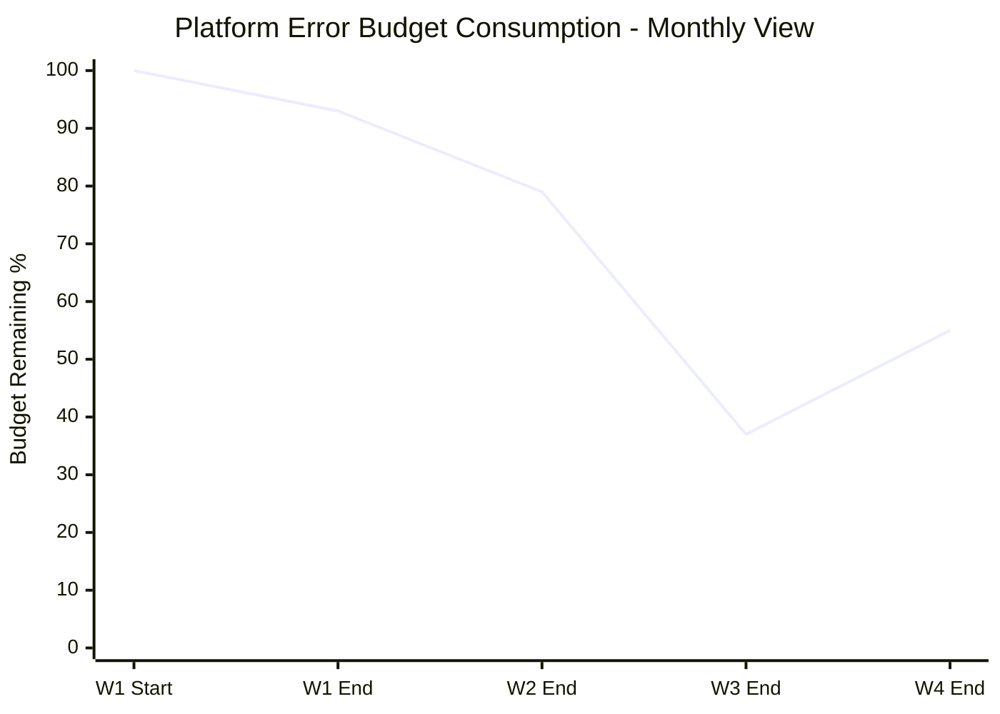

# Platform Engineering - L4 Platform SLOs

## Keywords in This File

| # | Keyword | Weight |
|---|---|---|
| 1 | [Platform SLO Design and Error Budgets](#platform-slo-design-and-error-budgets) | critical |

---

# Platform SLO Design and Error Budgets

---
id: PE-022
title: Platform SLO Design and Error Budgets
category: Platform Engineering
difficulty: ★★★
interview_weight: critical
seniority: staff
status: draft
version: 1
---

### 🎯 Model Answer

**30 seconds:**
> Platform SLOs define the reliability commitments the platform team makes
> to product teams - they are the contract between the platform and its
> users. An error budget is the permitted unreliability within the SLO:
> if your availability SLO is 99.5%, you have 0.5% of time that can be
> "bad" per month (about 3.6 hours). Error budgets convert SLOs from
> reporting metrics into operational drivers: when the budget is burning
> too fast, the platform team stops deploying new features and focuses
> on reliability.

**3 minutes (Senior):**
> Platform SLOs are different from product SLOs in one critical way:
> the platform is not directly user-facing. Platform failures impact
> product team engineering velocity, not end users directly. This means
> platform SLOs must be defined at two levels: availability SLOs
> (is the platform API accessible?), which are analogous to product SLOs,
> and developer experience SLOs (how long does a deployment take, how
> fast does namespace provisioning complete?), which measure the platform's
> value to its users.
>
> The error budget is the operational mechanism that makes SLOs useful.
> Without error budgets, SLOs are lagging indicators - you find out you
> violated them after the fact. With error budgets, the burn rate (how
> fast the budget is being consumed) is a leading indicator. Multi-window
> burn-rate alerting fires when the budget is burning at a rate that
> would exhaust it within hours (fast burn: alert immediately) or days
> (slow burn: alert within hours). This is alerting that is proportional
> to actual user impact, not to raw metric thresholds.
>
> The policy dimension is what separates theoretical SRE from operational
> practice: the error budget policy defines what the platform team does
> when the budget is exhausted. Feature work freezes. New deployments
> are blocked. The team focuses exclusively on reliability improvements
> until the budget recovers. This policy converts the error budget from
> a measurement into a prioritization mechanism.

**Framework:** SLI (what you measure) -> SLO (what you commit to) ->
ERROR BUDGET (what you have to spend) -> POLICY (what you do when it's gone)

*Adapting up:* Principal adds: "The organizational challenge with platform
error budgets: the platform serves 40+ teams, and different teams have
different reliability requirements. A team running a batch processing
pipeline cares about platform throughput more than availability. A team
running a payment processor needs the deployment pipeline to be available
when they need to ship an incident fix at 2am. Platform SLOs need
differentiation: a tiered SLA model (standard/premium) or separate SLOs
for each platform capability (availability SLO vs. deployment latency SLO
vs. provisioning SLO). One SLO for 'the platform' is too coarse."

*Adapting down:* Junior: "An SLO is a target reliability level, like '99.9%
of deployment requests succeed'. The error budget is how much unreliability
you're allowed - if SLO is 99.9%, you have 0.1% to 'spend' on failures.
When you run out of error budget, it's a signal to stop shipping new
features and fix reliability problems."

**Blank Mind Recovery:**

**(1) Restate:** "Platform SLO Design and Error Budgets - defining platform
reliability commitments and using error budgets to prioritize reliability
work."

**(2) First principles:** "If you cannot measure whether the platform is
reliable, you cannot improve its reliability. SLOs give you a number to
optimize. Error budgets give you permission to be unreliable up to a point
and a forcing function to fix reliability when that point is exceeded."

**(3) Bridge:** "Think of the error budget like a budget for quality: you
have $100 to spend on defects this month. If you spend $90 in the first
week, you must stop shipping features that might introduce defects. The
error budget works the same way - if you burn 90% of your monthly budget
in week 1, stop shipping and fix reliability."

---

### 📘 Concept Explanation

**What it is:**
Platform SLOs (Service Level Objectives) are quantitative reliability
commitments that the platform team makes to Stream-Aligned teams. They
define what "good platform behavior" looks like. Error budgets quantify
the permitted unreliability within the SLO and drive operational
decision-making about when to prioritize reliability work over feature
work.

**The problem it solves:**
Without SLOs, platform reliability is measured informally (based on
complaints from product teams) or not at all. This makes it impossible
to make data-driven decisions about when to invest in reliability vs.
features, and impossible to have credible conversations with leadership
about the platform's reliability posture. Error budgets solve the
feature-vs-reliability trade-off tension by making the decision rule
explicit and automatic.

**How it works:**

```
PLATFORM SLO FRAMEWORK

STEP 1: IDENTIFY CRITICAL USER JOURNEYS (CUJs) FOR THE PLATFORM

  Platform users are product engineers. Their critical journeys:
  - "I need to deploy my service" (GitOps sync path)
  - "I need to provision a new namespace" (Crossplane/IDP path)
  - "I need to rotate a secret" (secret management path)
  - "I need to debug my service" (observability path)
  - "I need to onboard a new service" (scaffolding path)

  Each CUJ maps to one or more SLIs and SLOs.

STEP 2: DEFINE SLIs (what you measure)

  Availability SLI:
    = (successful requests / total requests) over rolling window
    What counts as "successful": 2xx or 3xx HTTP response from
    platform API; ArgoCD sync completed without error; namespace
    CRD in Ready state within 5 minutes.

  Latency SLI:
    = % of requests completed within threshold
    E.g.: % of deployments where ArgoCD sync completes within 2 min

  Correctness SLI:
    = % of namespace provisions that result in correct configuration
    (all expected RBAC, NetworkPolicies, and resource quotas applied)

STEP 3: SET SLOs (the commitment)

  Platform capability SLO targets (examples):
  
  | Capability           | SLI Type    | SLO Target |
  |----------------------|-------------|------------|
  | ArgoCD sync          | Availability| 99.5%      |
  | Namespace provision  | Success rate| 99.9%      |
  | Namespace provision  | Latency P95 | < 3 min    |
  | Secret sync (ESO)    | Success rate| 99.9%      |
  | Backstage availability| Availability| 99.0%     |
  | Platform API (CRDs)  | Availability| 99.9%      |
  | Deployment pipeline  | Latency P95 | < 15 min   |

STEP 4: CALCULATE ERROR BUDGETS

  30-day error budget for 99.5% availability SLO:
    = (1 - 0.995) * 30 * 24 * 60 = 216 minutes/month = 3.6 hours

  30-day error budget for 99.9% success rate SLO:
    = 0.001 * total requests/month
    At 1000 provisions/month: 1 failed provision allowed/month

STEP 5: BURN RATE AND MULTI-WINDOW ALERTING

  Fast burn (1-hour window):
    If current burn rate > 14.4x (uses up 1h/720h = 1/720 of budget
    per minute, but at 14.4x rate, entire budget consumed in 50 hours)
    --> PAGE: this will exhaust the budget rapidly if not fixed

  Slow burn (6-hour window):
    If current burn rate > 1x for 6 consecutive hours
    --> WARN: budget is being consumed but not catastrophically

STEP 6: ERROR BUDGET POLICY

  Budget > 50% remaining:  Normal operations. Feature work allowed.
  Budget 25-50% remaining: Monitor closely. Delay risky feature releases.
  Budget 10-25% remaining: No new risky deployments. Focus on stability.
  Budget < 10% remaining:  FREEZE feature work. Reliability sprint only.
  Budget exhausted:        Incident review + root cause fix before resuming.
```

**The key insight:**
SLOs without error budget policies are reporting mechanisms. SLOs with
error budget policies are operational mechanisms. The policy is what
converts the measurement into action.

**What distinguishes Platform SLOs from product SLOs:**
Platform SLOs measure developer experience (how well the platform serves
engineers), not end-user experience. This means:
- The measurement window is typically shorter (minutes, not days)
- The "users" are engineers who can articulate what went wrong
- The SLOs must cover both availability and developer experience
  (latency of developer journeys, not just API uptime)

---

### 💻 Code Example

**Example 1: BAD vs GOOD - informal reliability vs. SLO-driven operations**

```bash
# BAD: reliability measured by complaints
# Monday morning: "the platform seems slow this week"
# Thursday: "ArgoCD is broken again, we can't deploy"
# No data, no trend, no action threshold defined.
# Platform team is reactive; fires discovered by product teams.
# No way to justify reliability work to leadership.
```

```yaml
# GOOD: SLO-based reliability with burn-rate alerting

# Prometheus recording rules for platform SLIs
groups:
- name: platform-slos
  interval: 30s
  rules:
  # Availability SLI for ArgoCD sync
  - record: platform:argocd_sync_success_rate:rate5m
    expr: |
      sum(rate(
        argocd_app_sync_total{status="Succeeded"}[5m]
      )) /
      sum(rate(
        argocd_app_sync_total[5m]
      ))

  # Error budget burn rate (1h window)
  # SLO = 99.5%, so error rate budget = 0.005
  - record: platform:argocd_error_budget_burn_rate:1h
    expr: |
      (1 - platform:argocd_sync_success_rate:rate1h) / 0.005

- name: platform-slo-alerts
  rules:
  # Fast burn: 14.4x burn rate over 1h
  # Will exhaust 30-day budget in ~50 hours
  - alert: PlatformArgocdSLOFastBurn
    expr: |
      platform:argocd_error_budget_burn_rate:1h > 14.4
    for: 5m
    labels:
      severity: critical
      slo: argocd-availability
    annotations:
      summary: >
        ArgoCD sync availability SLO burning fast:
        {{ $value | humanize }}x burn rate.
        At this rate, 30-day budget exhausted in
        {{ (30 * 24 / $value) | humanize }} hours.
      runbook: https://platform.company.com/runbooks/argocd-slo

  # Slow burn: >1x burn rate for 6 consecutive hours
  - alert: PlatformArgocdSLOSlowBurn
    expr: |
      platform:argocd_error_budget_burn_rate:6h > 1
    for: 6h
    labels:
      severity: warning
      slo: argocd-availability
```

> **Code walkthrough:** The Prometheus recording rules calculate the
> ArgoCD sync success rate as a ratio of succeeded syncs to total syncs.
> The burn rate recording rule normalizes the error rate against the
> SLO budget (0.005 for 99.5% SLO) - a burn rate of 1.0 means the error
> budget is being consumed exactly as planned. A burn rate of 14.4 means
> the 30-day budget would be consumed in ~50 hours. The fast-burn alert
> fires within 5 minutes of detecting 14.4x burn rate; the slow-burn
> alert fires after 6 hours of > 1x burn rate. This multi-window approach
> has much lower false positive rates than simple threshold-based alerting.

**Example 2: Error budget policy enforcement**

```python
# Error budget policy automation
# Blocks platform deployments when error budget is low

from datetime import datetime, timedelta
from prometheus_api_client import PrometheusConnect

class ErrorBudgetPolicy:
    def __init__(self, slo_name: str, slo_target: float):
        self.slo_name = slo_name
        self.slo_target = slo_target  # e.g., 0.995 for 99.5%
        self.prom = PrometheusConnect(url="http://prometheus.monitoring.svc")

    def remaining_budget_percent(self) -> float:
        """Returns remaining error budget as % of monthly allocation."""
        # Query: what % of monthly budget has been consumed?
        query = f"""
            1 - (
              sum_over_time(
                platform:argocd_error_rate:rate5m[30d]
              ) / (30 * 24 * 60 / 5)
            ) / {1 - self.slo_target}
        """
        result = self.prom.custom_query(query)
        return float(result[0]['value'][1]) * 100

    def deployment_allowed(self) -> tuple[bool, str]:
        """
        Returns (allowed, reason) based on error budget policy.
        """
        budget_remaining = self.remaining_budget_percent()

        if budget_remaining < 10:
            return False, (
                f"Error budget exhausted ({budget_remaining:.1f}% remaining). "
                f"Platform deployments frozen. Fix reliability first."
            )
        elif budget_remaining < 25:
            return False, (
                f"Error budget critical ({budget_remaining:.1f}% remaining). "
                f"Only hotfixes allowed."
            )
        elif budget_remaining < 50:
            # Allow but warn
            return True, (
                f"Error budget low ({budget_remaining:.1f}% remaining). "
                f"Avoid risky platform changes."
            )
        else:
            return True, f"Error budget healthy ({budget_remaining:.1f}% remaining)."

# Called in platform CI/CD before deploying platform components
policy = ErrorBudgetPolicy("argocd-availability", 0.995)
allowed, reason = policy.deployment_allowed()
if not allowed:
    print(f"DEPLOYMENT BLOCKED: {reason}")
    exit(1)
```

> **Code walkthrough:** The `ErrorBudgetPolicy` class queries Prometheus
> for the remaining error budget and returns a deployment decision. When
> budget is below 10% (exhausted), all platform deployments are blocked.
> When below 25%, only hotfixes are allowed. This is called from the
> platform team's CI/CD pipeline before any platform component is deployed.
> The result: the error budget policy is enforced automatically, not
> through manual judgment. When an engineer attempts to deploy a platform
> change with 5% error budget remaining, the pipeline blocks the deployment
> and reports the budget status - not a human decision, an automated gate.

**Example 3: SLO report generation for stakeholder communication**

```python
# Weekly platform SLO report generator
# Auto-distributed to engineering leadership

def generate_slo_report(period_days: int = 7) -> dict:
    slos = {
        "argocd_sync": {
            "target": 0.995,
            "actual": query_slo_actual("argocd_sync", period_days),
            "description": "ArgoCD sync success rate"
        },
        "namespace_provision": {
            "target": 0.999,
            "actual": query_slo_actual("namespace_provision", period_days),
            "description": "Namespace provisioning success rate"
        },
        "deployment_latency_p95": {
            "target": 900,  # 15 minutes in seconds
            "actual": query_p95_latency("deployment", period_days),
            "description": "Deployment pipeline P95 latency (seconds)"
        }
    }

    for name, slo in slos.items():
        slo["status"] = "MET" if slo["actual"] >= slo["target"] else "MISSED"
        if slo["status"] == "MET":
            budget_consumed = calculate_budget_consumed(slo, period_days)
            slo["budget_remaining"] = f"{100 - budget_consumed:.1f}%"

    return slos
```

> **Code walkthrough:** The report generator collects actual SLO values
> for the reporting period and compares them against targets. Each SLO
> shows target, actual, and MET/MISSED status. For met SLOs, it calculates
> remaining error budget. This report is generated automatically weekly
> and distributed to engineering leadership - it converts the abstract
> "the platform is reliable" statement into a specific, measurable, and
> historically trackable claim. Leadership can see trends across weeks
> and make investment decisions based on data.

---

### 📊 Diagram

```
ERROR BUDGET LIFECYCLE

  SLO: 99.5% availability
  Error budget: 0.5% = 3.6h/month

  BUDGET STATUS OVER TIME:

  Week 1  [==========] 100% remaining
            |
            | Minor incident: -15 min (7% of budget)
            v
  Week 2  [=========]  93% remaining
            |
            | Planned maintenance: -30 min (14% of budget)
            v
  Week 3  [======   ]  79% remaining
            |
            | Outage: -90 min (42% of budget)
            v
  Week 4  [===      ]  37% remaining  <-- WARNING ZONE
            |
            | Feature release paused; stability sprint
            v
  Week 4  [=====    ]  55% remaining  <-- Recovered

  POLICY THRESHOLDS:
  > 50%: GREEN  - normal operations
  25-50%: YELLOW - no risky releases
  10-25%: ORANGE - hotfixes only
  < 10%: RED    - feature freeze + reliability sprint
```



> **Diagram walkthrough:** The chart shows error budget consumption over
> a 30-day period. The budget starts at 100% and decreases with each
> incident or maintenance window. When the budget drops below 50% after
> week 3 (due to a 90-minute outage), the error budget policy triggers:
> no risky feature releases until the budget recovers. The platform team
> conducts a stability sprint, fixing the root cause of the outage. By
> week 4, the budget has recovered to 55% (no new incidents). The recovery
> demonstrates the operational value of the error budget policy: it forced
> reliability focus at exactly the right time, before the budget reached
> the critical < 10% threshold.

---

### 🎓 Answers by Seniority

**Junior / Mid (0-5 years):**
> Platform SLOs define how reliable the platform needs to be - for example,
> "99.5% of ArgoCD sync operations should succeed". The error budget is
> the permitted failure space: 0.5% of operations can fail per month. If
> you're consuming the error budget faster than expected (lots of failures),
> the team should stop adding new features and fix the reliability problems
> instead. This converts "how reliable should we be?" from a subjective
> question into a measurable, objective one.

---

**Senior / Staff (5+ years):**
> Platform SLOs operate at two levels. Availability SLOs (is the platform
> API reachable, does ArgoCD sync succeed?) measure platform infrastructure
> health. Developer experience SLOs (how long does namespace provisioning
> take, what is deployment pipeline P95 latency?) measure the platform's
> value to its users. Both are necessary - a platform with 100% availability
> but 3-hour deployment pipelines is not serving product teams well.
>
> The error budget policy is what I spend the most time getting right:
> defining the thresholds, getting engineering leadership buy-in, and most
> importantly, actually enforcing the feature freeze when the budget is
> exhausted. The cultural battle: product teams always have urgent features
> that "need to ship this week." The error budget policy provides an
> objective, data-driven reason to say no - not "platform team thinks we
> should focus on reliability" but "our contractual reliability commitment
> to you requires us to fix this before we ship anything else."

---

### ⚠️ Common Misconceptions

**Misconception: "100% uptime is the goal - error budgets are admitting defeat."**

100% uptime is operationally impossible for any non-trivial system.
Kubernetes upgrades require rolling restarts. Node replacements cause
brief availability gaps. Certificate rotations require pod restarts. The
question is not whether there will be downtime but how much downtime is
acceptable and how you plan for it. Error budgets set an explicit,
negotiated target and convert the "how much reliability is enough?"
question from indefinite (we want 100%) to operational (we have 3.6
hours this month to spend on planned and unplanned downtime).

**Misconception: "SLOs are for teams that have already achieved reliability.
We need to fix the platform first, then define SLOs."**

SLOs are the mechanism by which you achieve reliability. Starting SLOs
after the platform is "reliable" is backwards - you'll never know when
the platform is reliable enough to set SLOs. Define aspirational SLOs
now (you will likely miss them initially), use the error budget burn
rate to prioritize reliability work, and track progress over months.
SLO attainment trends are more valuable than the absolute SLO value.

**Misconception: "Platform SLOs should be the same as product SLOs."**

Product SLOs measure end-user experience. Platform SLOs measure developer
experience. The stakeholders, the measurement windows, and the consequence
of violations are different. A product SLO breach (end users experiencing
errors) requires immediate response. A platform SLO breach (developers
experiencing deployment latency degradation) requires priority response,
but not the same minute-zero incident response as a revenue-impacting
customer-facing outage.

---

### 🚨 Failure Modes and Diagnosis

**Failure mode: SLO defined on the wrong signal**

Symptom: platform has 99.9% uptime (SLO met) but product teams are
unhappy with the platform. Survey shows teams think the platform is
unreliable and slow. SLO does not reflect actual platform experience.

Cause: availability SLO was defined as "can we reach the Kubernetes API
server?" - a necessary but insufficient signal. Teams do not care about
Kubernetes API availability in isolation; they care about "can I deploy
my service?" End-to-end deployment success rate was never measured.

Diagnosis: user interviews with 5-10 teams. Ask: "What does 'platform
down' mean to you?" Map their answers to measurable SLIs. Compare
against current SLO definitions.

Fix: redefine SLOs around critical user journeys (CUJs): end-to-end
deployment success rate, namespace provisioning success rate, deployment
pipeline P95 latency. These measure what teams actually care about.

**Failure mode: Error budget policy never enforced**

Symptom: error budget is exhausted (0% remaining) in month 2 of SLO
implementation. The platform team continues shipping features. Three
months later, the budget has been at 0% continuously but no reliability
sprint has occurred.

Cause: no organizational agreement on the policy before implementing SLOs.
Engineering leadership approved the SLO definition but not the operational
policy (feature freeze on budget exhaustion).

Diagnosis: check when the error budget was first exhausted; check what
platform deployments occurred after that date. If features shipped after
budget exhaustion: policy was not enforced.

Fix: before publishing SLOs, get explicit agreement from engineering
leadership on the error budget policy: what changes when the budget is
exhausted? Get this in writing (a decision record or policy document).
Without this agreement, error budgets are reporting artifacts, not
operational tools.

---

### 🎯 Interview Deep-Dive

**Timing:** Hard ★★★ - 12 questions minimum.

---

#### Q1 - What are the four golden signals and how do they apply to platform SLOs?

The four golden signals (Latency, Traffic, Errors, Saturation) from
Google's SRE book are a framework for instrumenting any service. Applied
to platform SLOs:

**Latency:** how long do platform operations take?
- Deployment pipeline P50/P95/P99 latency
- Namespace provisioning P95 latency
- Secret sync latency (time for ESO to sync a new secret to namespace)
- Backstage page load time P95

**Traffic:** how much is the platform being used?
- Deployments per hour (detect drop-off = something is wrong)
- Namespace provisioning requests per day
- API server requests per second

**Errors:** what percentage of platform operations fail?
- ArgoCD sync error rate
- Namespace provisioning failure rate
- Admission webhook rejection rate (not all rejections are errors -
  policy violations are expected, infrastructure errors are not)

**Saturation:** how close is the platform to capacity limits?
- Node CPU utilization (approaching 80% = scaling needed soon)
- PVC storage utilization for stateful platform components (Prometheus,
  Loki, Vault)
- Kubernetes API server request queue depth (high queue = near saturation)

*What separates good from great:* Distinguishing between errors that
represent platform failures (admission webhook is down, ArgoCD cannot
reach git) and errors that are expected platform behavior (admission
policy rejected an invalid deployment). Platform SLOs should only count
infrastructure errors as budget-consuming events, not policy enforcement
behavior. Miscounting leads to SLOs that appear to be violated when the
platform is actually functioning correctly.

---

#### Q2 - How do you negotiate SLO targets with product teams and leadership?

SLO negotiation is a business conversation, not a technical one.

**Step 1 - Establish current baseline:** what is the platform's actual
current reliability? Do not start by proposing a target - start by
showing the measured reality. "Over the past 90 days, ArgoCD sync
success rate was 97.2%." This is the data foundation.

**Step 2 - Understand business requirements:** what is the minimum
acceptable reliability for product teams to function? Ask: "If the
platform had a 10-minute deployment outage at 2pm on a Friday, how
impactful would that be?" This surfaces the implicit reliability
requirement.

**Step 3 - Propose a range:** start with an SLO that is achievable
given the current baseline (never propose an SLO you cannot meet in
the first month), with a roadmap to improve it.

Example: "Current baseline: 97.2%. We propose starting with 98.5%
for Q1 (achievable), with a roadmap to reach 99.5% by Q3 after
completing the ArgoCD HA upgrade."

**Step 4 - Agree on the error budget policy before finalizing the SLO:**
the SLO target is meaningless without agreement on what happens when
it is violated. Get leadership buy-in on the feature freeze policy.

**Step 5 - Review quarterly:** SLOs should evolve. A 99.5% SLO
that is consistently met with 60%+ error budget remaining is not
ambitious enough. Tighten it.

*What separates good from great:* Starting with the measured baseline
instead of an aspirational target. Teams that propose SLOs they cannot
currently meet set themselves up for immediate violation, which erodes
the SLO program's credibility. An SLO that is met 3 months in a row
builds organizational trust; an SLO violated in month 1 creates
skepticism about whether the SLO is meaningful.

---

#### Q3 - How do you differentiate SLOs for different platform capabilities?

Platform SLOs should be granular enough to be actionable. A single
"platform availability" SLO is too coarse to drive operational decisions.

**SLO granularity principle:** one SLO per distinct critical user journey.

Recommended platform SLO set:

| Capability | SLO Type | Target |
|---|---|---|
| Deployment (ArgoCD sync) | Success rate | 99.5% |
| Deployment (ArgoCD sync) | Latency P95 | < 2 minutes |
| Namespace provisioning | Success rate | 99.9% |
| Namespace provisioning | Latency P95 | < 5 minutes |
| Secret sync (ESO) | Success rate | 99.9% |
| Backstage catalog | Availability | 99.0% |
| Platform API (CRDs) | Availability | 99.9% |
| CI/CD pipeline | P95 completion | < 20 minutes |

Why differentiate:
A Backstage catalog outage (99.0% SLO - allows 7.2 hours/month) is
less critical than a Kubernetes API outage (99.9% - allows 43 minutes/month)
because Backstage is a convenience tool; the Kubernetes API is in the
critical path for every production deployment. Different criticality
requires different SLO targets.

*What separates good from great:* Having separate latency SLOs for
developer experience journeys, not just availability SLOs. A platform
that is available but slow is still failing its users. P95 latency SLOs
for deployment pipelines and namespace provisioning are the developer
experience measurement that is almost always missing from platform SLO
programs.

---

#### Q4 - How do you handle planned maintenance windows within the error budget?

Planned maintenance (Kubernetes upgrades, node pool replacements, stateful
component upgrades) consumes error budget just like unplanned incidents.
Managing this:

**Option 1 - Maintenance windows don't consume error budget:**
Exclude maintenance windows from SLO calculations. Record the window in
Prometheus with an annotation/recording rule, and exclude the window
from error rate calculations.

```yaml
# Prometheus: exclude maintenance window from SLO calculation
- record: platform:argocd_slo_valid_window
  expr: |
    absent(
      label_replace(
        platform:maintenance_window_active,
        "job", "", "", ""
      )
    )
# SLO queries multiply by this: if maintenance window active = 0,
# if maintenance window inactive = 1
```

**Option 2 - Maintenance windows consume error budget (simpler):**
All downtime, planned or unplanned, consumes error budget. This forces
the platform team to minimize maintenance downtime and plan maintenance
timing carefully (never on Monday morning when teams are deploying).

Which to choose:
Option 1 is more complex but more accurate - teams are not penalized
for planned, communicated maintenance. Option 2 is simpler and creates
a strong incentive to reduce maintenance window duration and frequency.

Most mature SRE implementations use Option 1 for high-availability
critical paths (Kubernetes API) and Option 2 for developer experience
tools (Backstage, CI/CD).

*What separates good from great:* Having a maintenance window policy
that considers the downstream impact on product teams: maintenance
during peak deployment windows (pre-release periods) is more expensive
than maintenance during off-peak hours. The platform team should maintain
a deployment calendar that tracks when product teams have major releases
and avoid platform maintenance during those periods.

---

#### Q5 - What is the difference between SLOs, SLAs, and SLIs?

These terms are related but distinct:

**SLI (Service Level Indicator):** the raw measurement. A ratio, count,
or duration that describes an aspect of service behavior.
Example: "deployment success rate" = successful syncs / total syncs.

**SLO (Service Level Objective):** the target value for an SLI over a
time window.
Example: "deployment success rate SLO: 99.5% over a 30-day rolling window."

**SLA (Service Level Agreement):** a contractual commitment (usually with
financial penalties) between a service provider and a customer.
For internal platform teams, a true SLA (with financial penalties for
violation) is rarely appropriate. The operational equivalent is an SLO
with a defined error budget policy (consequence = feature freeze, not
financial penalty).

**The relationship:**
SLI is what you measure.
SLO is the target on the SLI.
SLA is the contract that includes the SLO (with consequences for violation).

**Why the distinction matters:**
Platform teams often confuse SLOs and SLAs. An internal platform team
should commit to SLOs (operational targets with defined responses to
violations) but not SLAs (contractual commitments with penalty clauses).
Penalty-clause SLAs between internal teams create adversarial dynamics
that damage the collaborative relationship between platform and product teams.

*What separates good from great:* Understanding the organizational dynamic:
SLAs between internal teams tend to generate disputes ("our SLA is 99.9%
and you had 15 minutes of downtime, so you owe us Y") that distract from
the shared goal of serving customers. SLOs with error budget policies
create collaborative alignment: the platform team and product teams both
want the error budget not to be exhausted, so they work together on
reliability rather than negotiating penalties.

---

#### Q6 - How do you bootstrap a platform SLO program from zero?

Starting from scratch, the sequence:

Week 1-2 - Instrument and measure:
Deploy Prometheus metrics for the 3 most critical platform capabilities
(deployment pipeline, namespace provisioning, secret management). Do not
define SLOs yet - just collect data.

Week 3-4 - Establish baseline:
What is the actual reliability of each capability? No SLO is proposed
until you have 4 weeks of baseline data. Surprises are common: the
"always works" deployment pipeline may have a 3% error rate that no one
noticed because errors were silent.

Month 2 - Propose SLOs with error budget policy draft:
Propose SLO targets based on the baseline (slightly above current actual
performance to be achievable), with a draft error budget policy for review.

Month 2-3 - Negotiate with stakeholders:
Present the baseline data, proposed SLOs, and proposed policy to
engineering leadership. Get explicit agreement on the policy.

Month 3+ - Implement alerting and publish:
Implement multi-window burn-rate alerting. Publish the SLO dashboard.
Hold monthly SLO review meetings to track trends and adjust targets.

The critical success factor: publishing the SLO dashboard publicly
(visible to all engineering teams) creates accountability. An SLO that
is tracked privately can be ignored. A public SLO creates organizational
incentive to maintain it.

*What separates good from great:* The 4-week baseline measurement period
before proposing SLOs is the step most teams skip because they are eager
to "have SLOs." Proposing SLOs without baseline data means the SLO
targets are guesses. The first time the guessed SLO is violated in month
1, the entire program loses credibility.

---

#### Q7 - How do you use error budgets to drive platform team sprint planning?

Error budget remaining is the primary input to sprint planning for a
mature platform team.

**Sprint planning decision tree:**

At the start of each sprint:
1. Check current error budget remaining for each SLO.
2. If all budgets > 50%: normal sprint, balance features and reliability.
3. If any budget 25-50%: prioritize reliability work; delay risky features.
4. If any budget < 25%: reliability sprint; pause new features.
5. If any budget exhausted: only work on root cause fix; no new features.

**Error budget as feature request prioritization:**

Product teams will request platform features continuously. Error budget
provides an objective basis for prioritization:
- If budget is healthy and the feature reduces platform cognitive load:
  accept and schedule.
- If budget is low and the feature adds complexity to the platform:
  defer until budget is healthy.
- If the feature directly improves reliability (which improves budget
  recovery): prioritize regardless of current budget status.

**Monthly error budget review:**
Review the budget consumption trends with engineering leadership monthly.
Show: which SLOs were violated, what caused the consumption, and what
reliability improvements have been made. This is the data that justifies
reliability investment in headcount and infrastructure.

*What separates good from great:* Using the error budget to justify
headcount investments. When the error budget is consistently exhausted
and reliability work keeps falling off the sprint due to feature pressure,
the burn rate data and SLO miss history are the evidence for "we need
another platform engineer to focus on reliability." Error budgets convert
"the platform needs more attention" (subjective) into "we missed our SLO
4 of the last 6 months due to capacity constraints" (objective).

---

#### Q8 - How do you communicate SLO status to product teams?

Platform SLO communication requires different formats for different audiences.

**On-demand (Grafana dashboard):**
A public Grafana dashboard showing current SLO status for each platform
capability. Traffic light colors: green (budget > 50%), yellow (25-50%),
red (< 25%). Accessible to any engineer in the organization.

**Weekly digest (automated Slack message):**
```
Platform SLO Weekly Update (2024-01-15 to 2024-01-21):

ArgoCD Sync Availability: 99.7% (target: 99.5%) ✅
  Error budget consumed this week: 12%
  Budget remaining (30-day): 74%

Namespace Provisioning: 99.95% (target: 99.9%) ✅
  Error budget consumed this week: 5%
  Budget remaining (30-day): 91%

Deployment Pipeline P95: 14.2 min (target: < 15 min) ✅

Action items this week:
- ArgoCD had 2 sync failures; root cause: git webhook timeout.
  Fix: deployed in PR #1234.
```

**Monthly SLO review (stakeholder meeting):**
Trend charts showing SLO attainment over the past 3-6 months, error
budget consumption patterns, root causes of SLO violations, and planned
reliability improvements for the next quarter.

*What separates good from great:* The weekly automated Slack message
is the highest-leverage communication artifact. It takes 30 minutes to
set up (template + Prometheus query + scheduled Tekton job) and creates
automatic organizational awareness of platform reliability. Product teams
see it every Monday; leadership sees it every Monday. No manual reporting
required. When an SLO is violated, the Slack message is how the entire
organization learns about it simultaneously - no escalation needed.

---

#### Q9 - How do you handle multi-cluster SLOs?

A platform serving 5 clusters needs SLOs that span clusters, not just
individual cluster SLOs.

**Aggregation approach:**

Cluster-level SLOs: each cluster has individual SLO attainment tracking.
This enables root-cause analysis (which cluster is causing the violation?).

Platform-level SLO: the aggregate across all clusters. This is what
product teams care about - if any cluster's deployment pipeline is broken,
that matters to the teams on that cluster.

```yaml
# Aggregate ArgoCD sync success rate across all clusters
# Using federation or Victoria Metrics multi-tenant query

- record: platform:global_argocd_sync_success_rate:rate5m
  expr: |
    sum by () (
      rate(
        argocd_app_sync_total{status="Succeeded"}[5m]
      )
    ) /
    sum by () (
      rate(
        argocd_app_sync_total[5m]
      )
    )

# Per-cluster SLI (for root cause)
- record: platform:cluster_argocd_sync_success_rate:rate5m
  expr: |
    sum by (cluster) (
      rate(
        argocd_app_sync_total{status="Succeeded"}[5m]
      )
    ) /
    sum by (cluster) (
      rate(
        argocd_app_sync_total[5m]
      )
    )
```

**Error budget policy for multi-cluster:**
The global error budget policy is triggered by the aggregate SLO.
But the alert should identify the affected cluster(s):
"ArgoCD sync SLO at fast-burn rate: prod-us-east-1 cluster is at 8%
success rate."

*What separates good from great:* The correlation between cluster-level
SLO and global SLO is useful for understanding blast radius: if
prod-eu-west-1 has a 90% sync error rate, but that cluster handles
only 15% of total sync volume, the global SLO impact is 13.5% of budget
(90% error * 15% weight), not 90%. This enables priority triage: fix the
highest-volume clusters first for fastest global SLO recovery.

---

#### Q10 - What happens when you consistently miss your SLOs?

Consistently missing SLOs (3+ consecutive months) is a systemic signal
that requires organizational response, not just technical response.

**Diagnosis framework:**

Root cause categories:
1. SLO target is too aggressive: was set aspirationally, not based on
   current actual performance. Loosen the target to be achievable.
2. Reliability debt: the platform has accumulated technical debt that
   causes chronic failures. Requires dedicated reliability investment
   (engineer time, infrastructure upgrades).
3. Insufficient capacity: the platform team cannot maintain reliability
   with current headcount and the growing platform scope.
4. External dependency: reliability is constrained by a vendor or
   upstream component (e.g., managed Kubernetes service reliability,
   cloud provider outages).

**Response by category:**

Category 1 (wrong target): adjust the SLO to be consistent with current
performance baseline, with a roadmap to tighten it once reliability
investments are made. Communicating "we are lowering our SLO because
it was aspirational, not realistic" requires leadership credibility but
is more honest than continuing to miss the target.

Category 2 (reliability debt): reliability sprint + post-mortem program.
Identify the top 3 recurring failure modes; fix all three before resuming
feature work. Measure the impact of each fix on SLO attainment.

Category 3 (capacity): use the SLO miss history as evidence for headcount
request. Calculate: "We missed our SLO 4 of 6 months. Root cause is
inadequate operational capacity. An additional platform engineer would
allow us to complete [X] reliability improvements. Projected impact on
SLO attainment: 90% target achievement."

Category 4 (external): define upstream SLOs, work with vendors, and
where possible, architect for resilience (multi-AZ, circuit breakers,
graceful degradation).

*What separates good from great:* Category 1 (wrong target) diagnosis
requires intellectual honesty. Many teams miss SLOs because the target
was aspirational rather than achievable - but they do not want to lower
the target because it looks like admitting failure. The right framing:
"adjusting the target to reflect our current baseline is the first step
toward improvement; hiding an unachievable target prevents us from
measuring actual progress."

---

#### Q11 - How do you define SLOs for developer experience rather than system availability?

Developer experience SLOs measure the platform from the developer's
perspective, not the infrastructure's perspective.

**Developer experience SLIs:**

Time-to-First-Deploy (TTFD):
= time from "service created in Backstage" to "first successful production deployment"
Measurement: timestamp of Backstage template execution to timestamp
of first ArgoCD sync "Succeeded" for the new service.
SLO target: TTFD P95 < 2 hours.

Deployment Pipeline Time (DPT):
= time from git push to production deployment complete
Measurement: git commit timestamp to ArgoCD sync "Succeeded" timestamp
for the same commit.
SLO target: DPT P95 < 15 minutes.

Onboarding Completion Rate:
= % of new services that are successfully deployed within 1 day of creation
SLO target: > 95% of new services deploy successfully within 1 day.

Self-Service Resolution Rate:
= % of platform-related issues resolved by the product team without
  contacting the platform team
Measurement: inferred from support ticket data (decline in tickets from
  teams that previously required platform help).
SLO target: > 70% of teams resolve their platform issues without tickets.

```python
# Synthetic monitoring: TTFD measurement
# Runs daily to validate the onboarding experience
def measure_ttfd_synthetic():
    start = datetime.now()
    # Step 1: create service via Backstage API
    create_backstage_service("synthetic-test-svc")
    # Step 2: wait for namespace to be provisioned
    wait_for_namespace("team-synthetic")
    # Step 3: wait for first ArgoCD sync
    wait_for_argocd_sync("synthetic-test-svc")
    # Step 4: validate service is healthy
    wait_for_healthy("synthetic-test-svc")
    end = datetime.now()
    # Record metric
    record_metric("platform_ttfd_seconds", (end - start).seconds)
    # Clean up
    delete_service("synthetic-test-svc")
```

*What separates good from great:* Developer experience SLOs using
synthetic monitoring are the most direct measure of platform quality
and the most neglected. A platform team that only tracks availability
SLOs may have a 99.9% uptime platform that takes 4 hours to onboard a
new service. The developer experience SLO is the measurement that catches
this. The synthetic TTFD test runs daily and fires an alert when the
platform's new service onboarding experience degrades - before any team
files a ticket.

---

#### Q12 - How do you retire or upgrade SLOs as the platform matures?

SLOs should become more stringent as the platform matures. A 99.0%
availability SLO appropriate for a year-1 platform is inadequate for
a year-3 platform.

**SLO maturity model:**

Year 1 (Establishing): SLOs based on current baseline + 10%. Focus on
measuring and understanding the platform's reliability characteristics.
Error budget policy: informal (team agrees to prioritize reliability when
budget is low, but no hard feature freeze).

Year 2 (Improving): SLOs tightened to current performance - 5% error
rate headroom. Error budget policy: formal (documented, agreed with
leadership, automated enforcement in CI/CD).

Year 3+ (Optimizing): SLOs at production-grade targets (99.5-99.9%).
Error budget policy: fully automated (deployment gates, feature freeze
automation). Focus: eliminating the reliability patterns that recur.

**SLO retirement:**
When a platform capability is deprecated (e.g., replacing a legacy
CI/CD system with a new platform), the old system's SLO should be
retired. Communicate the retirement 3 months in advance; publish the
new system's SLOs at the same time.

**SLO upgrade triggers:**
- Current SLO consistently met with > 50% remaining budget: target is
  too loose. Tighten by 50% of the current error budget.
- A new platform capability replaces an old one: define the new SLO
  based on the new capability's actual performance, not the old SLO.
- Business requirements change (company scales 10x): recalibrate all
  SLOs against the new traffic and criticality levels.

*What separates good from great:* Having an annual SLO review process
where SLO targets are evaluated against current performance and adjusted.
SLOs that never change become stale - either they are too easy (met with
90%+ budget remaining every month) or they become irrelevant as the
platform evolves. The annual review creates organizational accountability
to keep SLOs meaningful as the platform matures.

---

### ⚖️ Comparison Table

| SLO Maturity Level | Error Budget Policy | Alerting | Review Cadence | Organizational Value |
|---|---|---|---|---|
| None (ad-hoc reliability) | None | Threshold alerts | Never | No visibility into reliability |
| Defined (measured but informal) | Informal (team discretion) | Basic burn-rate | Quarterly | Visibility but no teeth |
| Formalized (documented policy) | Formal (written, agreed) | Multi-window burn-rate | Monthly | Operational prioritization |
| Automated (gates enforce policy) | Automated (CI/CD gates) | Real-time burn-rate | Weekly | Full SLO-driven operations |

**The deciding factor:**
The policy is the key. SLOs without an enforced error budget policy are
reporting artifacts. The organizational investment in getting the policy
agreed upon and enforced is the work that converts SLOs from metrics to
operational drivers.

### 🏛️ System Design

**Prompt:** "Design the SLO program for a platform serving 60 engineering
teams across 4 clusters in 3 regions. The platform team has 8 engineers
and deploys to production 5x/day."

**Design:**

Phase 1 (Month 1): Instrument and baseline.
Deploy Prometheus recording rules for 5 critical capabilities:
deployment sync, namespace provisioning, secret sync, observability
stack availability, Backstage availability. 30-day data collection.

Phase 2 (Month 2): Define SLOs.
Based on 30-day baseline:
- ArgoCD sync: 99.5% success rate, P95 < 2 min
- Namespace provisioning: 99.9% success rate, P95 < 5 min
- Secret sync: 99.9% success rate, P95 < 30 sec
- Backstage: 99.0% availability
Present to engineering leadership; get policy agreement.

Phase 3 (Month 3): Implement alerting + policy.
Multi-window burn-rate AlertManager rules. Automated Slack weekly digest.
CI/CD gate that queries error budget before platform deployments.
Public Grafana SLO dashboard.

Phase 4 (Month 4+): Iterate.
Monthly SLO review. Tighten targets quarterly as platform matures.
Add developer experience SLOs (TTFD, deployment pipeline P95).

**At scale (60 teams, 4 clusters):**
The aggregated SLO must be per-cluster AND global. High-volume clusters
(primary us-east-1) weight the global SLO more heavily. Error budget
burn-rate alerts include cluster context. Regional maintenance windows
exclude the affected region's contribution from the SLO calculation during
the maintenance window.
