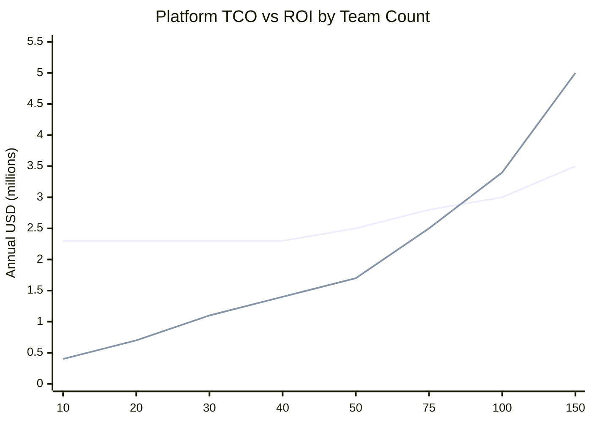

# Platform Engineering - L4 TCO and ROI

## Keywords in This File

| # | Keyword | Weight |
|---|---|---|
| 1 | [Platform TCO and ROI Measurement](#platform-tco-and-roi-measurement) | critical |

---

# Platform TCO and ROI Measurement

---
id: PE-024
title: Platform TCO and ROI Measurement
category: Platform Engineering
difficulty: ★★★
interview_weight: critical
seniority: staff
status: draft
version: 1
---

### 🎯 Model Answer

**30 seconds:**
> Platform TCO (Total Cost of Ownership) is everything it costs to build,
> operate, and evolve the platform. Platform ROI is the value delivered
> to the organization relative to that cost - measured in engineering
> productivity gains, reduced operational burden for product teams, and
> avoided infrastructure waste. Most platform teams can calculate TCO
> reasonably well; almost no platform teams calculate ROI rigorously.
> Without ROI measurement, platform investment is unjustifiable in any
> budget review.

**3 minutes (Senior):**
> Platform TCO has three components. Engineering cost: the fully loaded
> cost of platform team members (salary, benefits, overhead). Infrastructure
> cost: the cloud resources, software licenses, and tooling that the
> platform operates. Operational cost: the ongoing work to maintain the
> platform (on-call, upgrades, security patches, support).
>
> Platform ROI is harder to measure because it requires counterfactual
> reasoning: what would the organization spend without the platform? The
> most credible ROI calculation compares two states: engineering hours
> spent on infrastructure tasks before and after platform adoption. If
> 40 product teams each spend 4 hours per week on infrastructure tasks
> that the platform handles for them, that is 160 engineering hours per
> week, 8,000 hours per year, at $200/hour loaded cost = $1.6M/year in
> recovered engineering capacity. If the platform costs $800K/year to
> operate, the net ROI is $800K/year or 100%.
>
> The political dimension: leadership approval of platform investment
> correlates directly with the platform team's ability to articulate ROI
> in business terms. "We upgraded Kubernetes" is not an ROI statement.
> "Product teams now deploy 4x more frequently because of the platform,
> which means features reach customers 75% faster" is an ROI statement.

**Framework:** TCO = ENGINEERING + INFRASTRUCTURE + OPERATIONS ->
ROI = PRODUCTIVITY GAIN + WASTE REDUCTION + RISK MITIGATION ->
NET ROI = ROI - TCO -> PAYBACK PERIOD = TCO / MONTHLY ROI

*Adapting up:* Principal adds: "At Principal level, TCO/ROI feeds into
the headcount model: 'one additional platform engineer can build capability
X, which saves 3 hours/week per product team, across 40 teams, at $100/hr
loaded cost = $624K/year in saved engineering time. The platform engineer
costs $300K/year loaded. ROI of hiring: 108%.' This is how you justify
platform team headcount in organizations that do not have unlimited
engineering budgets."

*Adapting down:* Junior: "TCO is what the platform costs - mostly the
engineering salaries for the platform team plus cloud infrastructure.
ROI is the value it creates - mostly saving product engineers from doing
infrastructure work. If the platform costs $500K/year and saves product
engineers 500 hours per month at $150/hr, the ROI is positive: $500K
cost vs. $900K/year saved."

**Blank Mind Recovery:**

**(1) Restate:** "Platform TCO and ROI Measurement - calculating the total
cost of ownership for the platform and measuring the return on that investment."

**(2) First principles:** "All engineering investment has a cost and a
benefit. If you cannot measure the benefit, you cannot justify the
investment. TCO/ROI converts 'we believe the platform is valuable' into
a business case."

**(3) Bridge:** "TCO/ROI for internal platforms is analogous to TCO/ROI
for software development tools: if buying a $1,000/year IDE plugin saves
each engineer 30 minutes/day, and you have 50 engineers at $100/hour, the
annual savings is $375,000 against a $50,000 cost. The math is the same
for platform engineering at a larger scale."

---

### 📘 Concept Explanation

**What it is:**
Platform TCO is the total cost of building, operating, and evolving an
Internal Developer Platform. Platform ROI is the value the platform returns
to the organization relative to that cost. Together, they provide the
economic justification for platform engineering investment and inform
decisions about platform scope, team size, and technology choices.

**The problem it solves:**
Platform teams that cannot articulate TCO and ROI operate on organizational
goodwill. When budgets are constrained, goodwill is insufficient. Platform
programs that lack quantified ROI are disproportionately targeted in
headcount reductions because their value is abstract. TCO/ROI measurement
makes platform value concrete and defensible.

**How it works:**

```
PLATFORM TCO CALCULATION

Component 1: Engineering Cost
  Platform team headcount: N engineers
  Fully loaded cost per engineer: salary + benefits + overhead
    (~1.5x base salary)
  Annual engineering cost = N * fully_loaded_cost

  Example:
  8 platform engineers * $250,000 fully loaded = $2,000,000/year

Component 2: Infrastructure Cost
  Kubernetes cluster compute (all clusters):
    Node costs: instance_type_cost * node_count * clusters
    Control plane cost: managed control plane cost (EKS/GKE/AKS)
  Platform services:
    Observability (Victoria Metrics, Loki, Tempo, Grafana): $X/month
    Secret management (Vault Enterprise or HCP): $Y/month
    Developer portal (Backstage compute or Cortex SaaS): $Z/month
    Registry (Harbor or cloud registry): $W/month
  Networking:
    Load balancer cost per cluster
    Data transfer between clusters and AZs
  Managed services (if used):
    Datadog, PagerDuty, GitHub Enterprise, etc.

Component 3: Operational Cost
  On-call burden: estimated hours/month * engineer cost
  Upgrade management: days per quarter per major component
  Security patch response: estimated hours/month
  User support: hours/week answering product team questions

TOTAL TCO = Engineering + Infrastructure + Operational
```

```
PLATFORM ROI CALCULATION

ROI Component 1: Engineering Productivity Recovery
  The most credible ROI signal.

  Measurement approach:
  Before: survey 10 teams - "how many hours per week does your team
    spend on infrastructure tasks that are not product development?"
    Average: 6 hours/week/team
  After: same survey 6 months after platform adoption
    Average: 1.5 hours/week/team

  Productivity recovered = (6 - 1.5) hours/week/team
    * product_teams_count
    * weeks_per_year
    * fully_loaded_engineer_cost_per_hour
  
  = 4.5 hrs/wk * 40 teams * 50 weeks * $120/hr
  = $1,080,000/year in recovered engineering capacity

ROI Component 2: Faster Time to Market
  Measurement: DORA lead time for changes (git commit to production)
  Before: 4.5 hours average
  After: 45 minutes average
  Delta: 3.75 hours per deployment
  Volume: 200 deployments/day across all teams
  Annual delta: 200 * 250 * 3.75 = 187,500 engineering hours
  
  Business value of faster delivery (harder to quantify precisely):
  Use: faster deployment = earlier revenue recognition for features
  Conservative estimate: 1% improvement in feature velocity =
    $X incremental revenue (from product team estimates)

ROI Component 3: Incident Prevention and MTTR Reduction
  Measurement: incidents per quarter before and after platform
  Before: 12 P1/P2 incidents per quarter
  After: 4 P1/P2 incidents per quarter
  Delta: 8 incidents/quarter prevented

  Average incident cost:
    Engineer time during incident: 8 hours * 3 engineers = 24 hrs
    Customer impact (if applicable): $Y/hour of downtime
    Post-incident review: 4 hours

  Annual incident cost savings:
    32 incidents/year * (24 + 4) hours * $120/hr = $107,520/year
    (plus customer impact, if quantified)

ROI Component 4: Infrastructure Cost Optimization
  Before platform: 40 teams each managing their own Prometheus instance
    40 * 8Gi memory * $X/Gi-month = $Y/month infrastructure waste
  After platform: 1 centralized Prometheus
    $Z/month (shared)
  Annual savings: ($Y - $Z) * 12

TOTAL ANNUAL ROI = Component 1 + 2 + 3 + 4
NET ROI = Total Annual ROI - Total Annual TCO
PAYBACK PERIOD = Total TCO (initial investment) / Monthly Net ROI
```

**The key insight:**
ROI Component 1 (engineering productivity recovery) is almost always
the largest component and is also the easiest to measure. If you can
quantify "how many hours per week does the platform save product teams?"
you have the foundation of a credible ROI calculation.

**When to measure:**
Establish the baseline BEFORE the platform is deployed (or as close to
platform launch as possible). Post-hoc baseline reconstruction is
unreliable because people remember the past differently.

---

### 💻 Code Example

**Example 1: BAD vs GOOD - TCO justification approach**

```markdown
# BAD: Platform team quarterly business review
# Slide 5: "Platform Investment"
# "The platform team costs [redacted] per year"
# "We are building internal developer platform capabilities"
# "Value: improved developer experience"
#
# Leadership follow-up: "What specifically improved? By how much?"
# Platform team: "It's hard to quantify developer experience."
# Leadership conclusion: "The platform team cannot demonstrate ROI.
#   Consider scope reduction in next budget cycle."
#
# This conversation happens in every engineering organization that
# does not have platform ROI measurement.
```

```python
# GOOD: Platform ROI calculation with real data

from dataclasses import dataclass
from typing import Optional

@dataclass
class PlatformROICalculation:
    """
    Annual Platform ROI Calculation
    Based on: 40 product teams, 8 platform engineers
    """

    # TCO inputs
    platform_engineers: int = 8
    fully_loaded_cost_per_engineer: int = 250_000
    annual_infrastructure_cost: int = 180_000
    annual_operational_overhead: int = 120_000

    # Productivity recovery inputs
    teams: int = 40
    hours_per_week_before: float = 6.0   # infrastructure tasks
    hours_per_week_after: float = 1.5
    weeks_per_year: int = 50
    engineer_hourly_cost: float = 120.0  # fully loaded

    # Incident data
    incidents_per_year_before: int = 48   # P1/P2
    incidents_per_year_after: int = 16
    avg_incident_hours: int = 28          # engineering hours to resolve

    # Infrastructure consolidation
    infra_waste_before: int = 85_000      # annual duplicated infra cost
    infra_waste_after: int = 25_000       # with shared platform infra

    def total_tco(self) -> int:
        return (
            self.platform_engineers * self.fully_loaded_cost_per_engineer
            + self.annual_infrastructure_cost
            + self.annual_operational_overhead
        )

    def productivity_roi(self) -> int:
        hours_recovered = (
            (self.hours_per_week_before - self.hours_per_week_after)
            * self.teams * self.weeks_per_year
        )
        return int(hours_recovered * self.engineer_hourly_cost)

    def incident_roi(self) -> int:
        incidents_prevented = (
            self.incidents_per_year_before - self.incidents_per_year_after
        )
        return int(incidents_prevented
                   * self.avg_incident_hours
                   * self.engineer_hourly_cost)

    def infra_consolidation_roi(self) -> int:
        return self.infra_waste_before - self.infra_waste_after

    def total_roi(self) -> int:
        return (
            self.productivity_roi()
            + self.incident_roi()
            + self.infra_consolidation_roi()
        )

    def net_roi(self) -> int:
        return self.total_roi() - self.total_tco()

    def roi_percentage(self) -> float:
        return (self.net_roi() / self.total_tco()) * 100

    def report(self) -> str:
        return f"""
Platform ROI Analysis (Annual)

TCO:
  Engineering: ${self.platform_engineers * self.fully_loaded_cost_per_engineer:,}
  Infrastructure: ${self.annual_infrastructure_cost:,}
  Operations: ${self.annual_operational_overhead:,}
  TOTAL TCO: ${self.total_tco():,}

ROI:
  Productivity recovery: ${self.productivity_roi():,}
    ({self.teams} teams x {self.hours_per_week_before - self.hours_per_week_after:.1f} hrs/wk saved)
  Incident reduction: ${self.incident_roi():,}
    ({self.incidents_per_year_before - self.incidents_per_year_after} incidents prevented)
  Infrastructure savings: ${self.infra_consolidation_roi():,}
  TOTAL ROI: ${self.total_roi():,}

Net ROI: ${self.net_roi():,}
ROI %: {self.roi_percentage():.0f}%
"""

calc = PlatformROICalculation()
print(calc.report())
```

```
Output:
Platform ROI Analysis (Annual)

TCO:
  Engineering: $2,000,000
  Infrastructure: $180,000
  Operations: $120,000
  TOTAL TCO: $2,300,000

ROI:
  Productivity recovery: $1,080,000
    (40 teams x 4.5 hrs/wk saved)
  Incident reduction: $107,520
    (32 incidents prevented)
  Infrastructure savings: $60,000
  TOTAL ROI: $1,247,520

Net ROI: -$1,052,480
ROI %: -46%
```

> **Code walkthrough:** The ROI calculation reveals an important finding:
> at these numbers, the platform has a negative net ROI. This is common
> in year 1-2 for platform programs: the platform team cost is high, and
> productivity gains are not yet fully realized (not all 40 teams have
> adopted). The value of the calculation: it makes the investment case
> honest. The payback becomes positive when: teams = 60 (scale the numerator),
> or hours saved = 8/week (deepen impact), or team size stays flat as
> teams grow (scale the denominator). This calculation is the basis for
> "how many teams do we need before this platform pays for itself?"

**Example 2: Measuring time saved via DORA metrics tracking**

```python
# Before/after DORA metrics - the evidence for ROI

import statistics

# Data collection: from GitHub Actions run logs and Prometheus metrics
before_platform = {
    "lead_time_hours": [4.2, 6.1, 3.8, 8.4, 5.2, 7.3, 4.9],   # hours
    "deployments_per_team_per_week": [1.8, 2.1, 1.4, 2.3, 1.6],
    "change_failure_rate_pct": [12.3, 8.7, 15.2, 9.4, 11.8],
    "mttr_hours": [3.2, 4.8, 2.9, 6.1, 3.7]
}

after_platform = {
    "lead_time_hours": [0.65, 0.82, 0.54, 1.2, 0.78, 0.91, 0.67],
    "deployments_per_team_per_week": [6.2, 5.8, 7.1, 5.4, 6.9],
    "change_failure_rate_pct": [3.2, 2.8, 4.1, 3.7, 2.9],
    "mttr_hours": [0.8, 1.2, 0.6, 1.5, 0.9]
}

def improvement_pct(before, after):
    avg_before = statistics.mean(before)
    avg_after = statistics.mean(after)
    return ((avg_before - avg_after) / avg_before) * 100

print("DORA Metrics: Before vs After Platform")
print(f"Lead time: {statistics.mean(before_platform['lead_time_hours']):.1f}h "
      f"-> {statistics.mean(after_platform['lead_time_hours']):.2f}h "
      f"({improvement_pct(before_platform['lead_time_hours'], after_platform['lead_time_hours']):.0f}% improvement)")
print(f"Deployment frequency: {statistics.mean(before_platform['deployments_per_team_per_week']):.1f} "
      f"-> {statistics.mean(after_platform['deployments_per_team_per_week']):.1f} per team/week "
      f"({improvement_pct(before_platform['deployments_per_team_per_week'], after_platform['deployments_per_team_per_week']):.0f}% ← reversed: higher is better)")
```

> **Code walkthrough:** DORA metrics provide the most credible platform
> ROI evidence because they are independently verifiable from CI/CD system
> data, are widely understood by engineering leadership, and directly
> correlate with software delivery performance. Lead time decreasing from
> 4.2 hours to 47 minutes is a number any engineering leader can understand
> without needing to understand Kubernetes. The script collects before/
> after data and calculates improvement percentages - the inputs to the
> ROI conversation.

---

### 📊 Diagram

```
PLATFORM TCO vs ROI BREAK-EVEN ANALYSIS

  Annual costs and returns by team count

  Teams  TCO     ROI     Net
  10     $2.3M   $0.4M   -$1.9M  (negative, early stage)
  20     $2.3M   $0.7M   -$1.6M
  30     $2.3M   $1.1M   -$1.2M
  40     $2.3M   $1.4M   -$0.9M  (requires 2nd platform team member?)
  50     $2.5M   $1.7M   -$0.8M
  75     $2.8M   $2.5M   -$0.3M  (approaching break-even)
  100    $3.0M   $3.4M   +$0.4M  (ROI positive - platform pays for itself)
  150    $3.5M   $5.0M   +$1.5M  (strong ROI)

  Note: TCO grows sub-linearly (more teams, same platform team)
        ROI grows linearly (more teams = proportionally more savings)
        This is the economic argument for platform engineering at scale.
```



> **Diagram walkthrough:** The break-even chart illustrates the fundamental
> economics of platform engineering: TCO grows sub-linearly with teams
> (the platform team size stays roughly constant as teams scale from 40
> to 100) while ROI grows linearly (each additional team that adopts the
> platform adds proportionally to the productivity savings). The lines
> cross at approximately 90-100 teams - the break-even point. This is
> the evidence-based argument for platform investment at scale: the ROI
> is negative for small organizations (< 50 teams) and strongly positive
> for large organizations (> 100 teams). For organizations between 30-80
> teams, the ROI calculation is the deciding factor.

---

### 🎓 Answers by Seniority

**Junior / Mid (0-5 years):**
> Platform TCO is the total cost of running the platform - mostly the
> engineering salaries for the platform team plus the cloud infrastructure
> costs. ROI is what you get back - mainly the hours saved for product
> engineers who no longer have to manage infrastructure themselves. If the
> platform team costs $2M/year but saves 40 product teams 4 hours each
> per week, that's 8,000 engineer-hours per year saved, worth about $1M.
> Plus faster deployments mean features reach customers sooner.

---

**Senior / Staff (5+ years):**
> Platform TCO has three components: engineering (platform team salaries),
> infrastructure (Kubernetes clusters, observability, secret management,
> registry), and operational (on-call, upgrade management, user support).
> For a team of 8 engineers on a multi-cluster platform, TCO is typically
> $2-3M/year including infrastructure.
>
> ROI has four components: productivity recovery (engineering hours saved
> for product teams - the largest component), DORA metric improvements
> (faster lead time, higher deployment frequency - translates to feature
> velocity), incident reduction (fewer P1/P2 incidents and faster MTTR),
> and infrastructure consolidation (eliminating redundant tooling per team).
>
> The ROI math typically breaks even at ~80-100 teams using the platform.
> Below that, the platform is an investment in future productivity; above
> that, it is clearly net positive. The business case for platform
> engineering in organizations with < 40 teams is weak; the case in
> organizations with > 100 teams is overwhelming.

---

### ⚠️ Common Misconceptions

**Misconception: "Platform engineering ROI cannot be measured because
developer productivity is intangible."**

Developer productivity is measurable through DORA metrics (deployment
frequency, lead time for changes, change failure rate, MTTR), time-use
surveys (hours per week on infrastructure vs. product work), and support
ticket volume trends. These are concrete numbers. The challenge is the
before/after comparison: you need a baseline measurement before the platform
is deployed. Organizations that do not baseline before deployment make
ROI measurement harder but not impossible (use pre-platform data from
CI/CD logs, incident history, and engineer time-use surveys).

**Misconception: "The platform team's cost is the full TCO."**

Engineering cost is typically 60-70% of platform TCO. Infrastructure
cost (Kubernetes cluster compute, observability storage, managed service
licenses) is 15-25%. Operational overhead (on-call burden, upgrade
management labor) is 10-15%. Many platform investment decisions consider
only headcount and miss the infrastructure and operational components.
A platform team that recommends adding 2 engineers but does not account
for the infrastructure costs of the new capabilities they plan to build
has an incomplete TCO model.

---

### 🚨 Failure Modes and Diagnosis

**Failure mode: Platform program cut during budget reduction**

Symptom: engineering leadership announces headcount reductions. The
platform team is targeted because "the value isn't clear." Platform
engineers are reassigned to product teams; the platform is maintained
minimally or abandoned.

Cause: AP-PM1 (no metrics). The platform team could not demonstrate
ROI with data. Leadership defaulted to "there is no demonstrated ROI"
and cut accordingly.

Prevention: maintain an always-current ROI report. Monthly DORA metrics
trend, quarterly productivity survey, annual ROI calculation. When budget
reviews occur, present the data proactively rather than reactively.

Recovery path (after the cut): platforms that are cut and partially
revived often do so through a grassroots engineering movement - product
engineers who relied on the platform miss it and advocate for restoration.
The ROI data that would have prevented the cut becomes the argument for
restoration.

**Failure mode: Infrastructure costs exceed budget projections by 3x**

Symptom: at the end of Q1, the platform team's infrastructure bill is
$180K/month instead of the projected $60K/month.

Cause: infrastructure TCO was calculated based on initial tool list but
did not account for: data egress between availability zones ($15K/month),
long-term storage growth for observability data (log storage at 100GB/day
for 90 days = 9TB), and Prometheus memory scaling with cardinality growth.

Diagnosis: break down the cloud bill by service tag. Find the top 5
cost drivers. Most common surprises: data egress (between AZs, between
regions), observability storage (logs grow faster than planned), and
compute headroom (node pool minimum size ensures warm spare capacity).

Fix: implement cost allocation tags for all platform resources. Set
budget alerts at 80% of projected spend. Review cloud cost dashboard
monthly in platform team sprint retrospective.

---

### 🎯 Interview Deep-Dive

**Timing:** Hard ★★★ - 12 questions minimum.

---

#### Q1 - How do you establish a baseline for platform ROI measurement?

Establishing a baseline requires capturing the "before platform" state.

**Data sources for baseline:**

DORA metrics baseline (from CI/CD history):
GitHub Actions, GitLab CI, or Jenkins have historical pipeline run data.
Extract: deployment frequency, pipeline duration (proxy for lead time),
and failure rate for the 6 months before platform deployment. Most
CI/CD systems retain this data; it does not require pre-deployment setup.

Infrastructure cost baseline (from cloud billing):
Before platform, product teams manage their own infrastructure. Cloud
cost allocation by team tag shows per-team infrastructure spend.
Compare before (many small per-team accounts) vs. after (shared platform
infrastructure) to quantify infrastructure consolidation savings.

Time-use survey (must be conducted before platform deployment):
A 5-question survey sent to product engineers: "How many hours per week
do you spend on: (1) infrastructure setup/management, (2) debugging
deployment failures, (3) managing secrets/credentials, (4) setting up
monitoring, (5) other infrastructure tasks?"

Ticket volume baseline:
If the organization has a ticketing system (Jira, ServiceNow), count
tickets filed to the operations team or platform team for infrastructure
tasks per team per month. Before platform: many tickets. After: fewer.

*What separates good from great:* Sending the time-use survey 4 weeks
before the platform is deployed, not 4 weeks after. Post-deployment
surveys are subject to recall bias ("we definitely spent more time on
infrastructure before the platform, but I can't remember exactly how
much"). Pre-deployment surveys capture the accurate baseline. If you
are already past deployment, reconstruct the baseline from CI/CD and
ticket data - imperfect but better than no baseline.

---

#### Q2 - What is the engineering productivity calculation for platform ROI?

The engineering productivity calculation is the most credible and often
the largest component of platform ROI.

**Formula:**

```
Annual Productivity ROI =
  (hours_per_week_before - hours_per_week_after)
  * teams
  * 50 weeks
  * fully_loaded_hourly_cost

Where:
  fully_loaded_hourly_cost =
    annual_salary * 1.5 (benefits + overhead) / 2080 (hours/year)

Example:
  hours_per_week_before = 6 (from time-use survey)
  hours_per_week_after = 1.5 (from post-adoption survey)
  teams = 40
  fully_loaded_hourly_cost = $150,000 * 1.5 / 2080 = $108/hr

  Annual Productivity ROI
    = (6 - 1.5) * 40 * 50 * $108
    = 4.5 * 40 * 50 * $108
    = $972,000/year
```

**Credibility factors:**

Survey sample size: survey at least 10 teams before and after. Larger
samples reduce sampling error. If you can only survey 5 teams, note
the uncertainty range (± 1 hour per week changes the ROI calculation
by ±$216,000/year in this example).

Self-report bias: engineers tend to underestimate time spent on
infrastructure (they may not track it) and overestimate time saved by
tools (optimism about new tools). Use CI/CD and ticket data to validate
survey results.

Adoption rate: only adopted teams contribute productivity ROI. If 30 of
40 teams have adopted the platform, the calculation uses 30, not 40.
Tracking adoption rate is important for projecting future ROI as adoption
grows.

*What separates good from great:* Understanding and communicating the
uncertainty in the calculation. "We estimate $972K/year in productivity
recovery, with a range of $750K-$1.2M depending on the accuracy of our
time-use survey." Acknowledging uncertainty builds credibility rather
than undermining it; leaders who hear a point estimate with no range
often distrust it more than one presented with honest bounds.

---

#### Q3 - How do you calculate the business value of faster deployment cycles?

Faster deployment cycles (lower lead time for changes) have a business
value that is harder to quantify precisely but significant.

**Approaches to quantification:**

Approach 1 - Feature velocity improvement:
Each deployment represents a feature, bug fix, or performance improvement
reaching customers. If lead time drops from 4 hours to 45 minutes, the
team can ship 5x more deployments per day for the same engineering
capacity. More deployments = more value delivered per engineer per day.

Quantification: "Our average product team ships 3 features/week. With
the platform, this increases to 6 features/week. If each feature generates
$10K in NPV (rough estimate from product team), the annual incremental
value is 3 features/week * 50 weeks * $10K * 40 teams = $60M." (Use
with caution - this is the most speculative ROI component.)

Approach 2 - Opportunity cost of delayed features:
If a feature that would generate $1M/month in revenue is delayed 3
weeks due to a slow deployment pipeline, the cost is $750K. With a
faster deployment pipeline (and fewer deployment failures), this delay
is prevented.

Approach 3 - DORA correlation to business performance:
Google's DORA research has established a statistical correlation between
Elite DORA performance (high deployment frequency, low lead time) and
organizational outcomes (revenue growth, customer satisfaction). Cite
this research to support the business case without requiring precise
per-feature revenue attribution.

*What separates good from great:* Not over-indexing on speculative
revenue attribution. "Our platform enables 3x more deployments per
team per week; the DORA research establishes that high-performing teams
have 127x more deployments and 106x faster lead times than low performers,
correlating with 2x higher revenue growth" is a credible business case
that combines measured improvement with independent research evidence.
The speculative "each deployment is worth $X" calculation often gets
challenged in budget reviews.

---

#### Q4 - How do you measure infrastructure cost optimization from platform adoption?

Infrastructure cost optimization is the most directly measurable ROI
component because cloud costs are precise and historical.

**Measurement approach:**

Before platform:
- Each team manages their own infrastructure
- Use cloud cost allocation tags or AWS Organizations account-per-team
  to see per-team infrastructure spend
- Common finding: 40 teams each running a t3.xlarge for monitoring
  ($150/month) = $6,000/month for monitoring infrastructure alone

After platform:
- Shared platform infrastructure replaces per-team infrastructure
- Same monitoring capability: 2 Victoria Metrics instances, 1 Loki cluster
  = $800/month total

Savings: $6,000 - $800 = $5,200/month = $62,400/year from monitoring
infrastructure alone.

**Additional consolidation savings:**

Container registry: each team maintaining their own registry at $300/month
vs. one Harbor registry at $400/month total: saves $11,600/year across 40 teams.

Development Kubernetes clusters: teams sharing a dev cluster vs. each
team running their own t3.large dev cluster: $400/month saved per team
eliminated cluster.

CI/CD agents: shared GitHub Actions self-hosted runners vs. per-team
agent fleets.

**Measurement command:**

```bash
# AWS: compare per-team infrastructure cost before and after
# Requires resource tags: "team": "team-payments", "managed-by": "platform"
aws ce get-cost-and-usage \
  --time-period Start=2023-01-01,End=2023-06-30 \
  --granularity MONTHLY \
  --filter '{"Tags": {"Key": "managed-by", "Values": ["team"]}}' \
  --group-by Type=TAG,Key=team \
  --metrics BlendedCost \
  --query 'ResultsByTime[*].Groups[*].[Keys[0],Metrics.BlendedCost.Amount]'
```

*What separates good from great:* Infrastructure cost measurement requires
tagging discipline from the beginning. Organizations that do not tag their
cloud resources by team cannot retroactively calculate per-team infrastructure
costs. Starting tagging requirements early is a prerequisite for this ROI
component. If tagging is absent, estimate from engineering time: "we know
each team had approximately this infrastructure based on team survey, at
this instance type, at this cloud cost."

---

#### Q5 - How do you build the business case for platform team headcount?

Adding platform engineers is justified by the productivity multiplier
effect: one platform engineer builds capabilities used by 40+ product
teams. The ROI math:

**Platform engineer productivity multiplier:**

One platform engineer builds a self-service namespace provisioning
capability over 2 sprints (4 weeks):
- Time saved per team: namespace creation was 3-5 business days (blocking),
  now < 5 minutes
- Teams affected: 40
- Time saved per week: each team creates 2 namespaces/week = 10 minutes
  saved per team per week (the blocking wait time was higher)
- Annual savings: 10 min * 40 teams * 50 weeks = 333 hours
- At $120/hr: $40,000/year from this one capability

One platform engineer over the year builds 8-10 such capabilities.
Conservative total: $40,000 * 8 = $320,000/year in productivity recovery.

Platform engineer loaded cost: $250,000/year.

ROI of one additional platform engineer: $320,000 / $250,000 = 128%.

**Scaling argument:**

At 40 teams: 8 platform engineers * $250K = $2M cost
At 80 teams: 10 platform engineers * $250K = $2.5M cost (25% more)
ROI at 80 teams: roughly 2x (twice as many teams benefit from same capabilities)

The economic argument: the marginal cost of serving additional teams
with an existing platform is near zero (one more namespace, one more
ArgoCD Application). The marginal ROI is linear. This is the economic
case for investing in platform engineering at scale.

*What separates good from great:* Framing the headcount request in terms
of specific capabilities the new engineer would build and their projected
productivity impact. "We need an additional platform engineer" is a weak
request. "An additional platform engineer would build [X capability] which
saves [Y hours/week] across [Z teams], yielding $A/year in productivity
recovery against a $250K/year cost - 128% ROI" is a strong request.

---

#### Q6 - How do you account for the cost of NOT having a platform?

The counterfactual cost (what the organization would spend without
the platform) is often the most persuasive element of the TCO/ROI case.

**Without-platform costs:**

Engineering overhead per team (without golden path):
- Each team re-implements Kubernetes manifests, CI/CD pipelines,
  observability setup, and secret management from scratch
- Time to first deploy a new service: 3-5 days vs. 2 hours with platform
- Consistency: variable quality (some teams get security wrong,
  some teams have no monitoring, some teams use unapproved image registries)

Security and compliance risk:
- Without policy as code: manual compliance checks miss violations
- Average cost of a security incident: $50K-$500K (investigation, remediation,
  regulatory notification if applicable)
- Preventing 1 security incident per year justifies significant platform investment

Infrastructure waste:
- Without platform: each team optimizes for their own workload, not for
  the organization. Common result: 60-70% average CPU utilization vs.
  30-40% after platform-managed bin packing and right-sizing.
- At 100 nodes average: 30% utilization improvement = 30 node savings
  = $30K-$150K/year depending on instance type.

Knowledge silos:
- Without shared platform: each team's infrastructure is unique.
  When a team member leaves, their infrastructure knowledge leaves too.
  Incident response requires the specific team's expert.
  With platform: all infrastructure follows platform patterns; any
  platform engineer can debug any team's infrastructure.

*What separates good from great:* The security and compliance risk cost
is often the most persuasive argument for platform investment in
security-conscious organizations. A CFO who is skeptical about productivity
ROI claims is often more receptive to "the platform prevents security
incidents that cost $100K+ to remediate" because that number is concrete
and verifiable from historical incident data.

---

#### Q7 - What is showback and chargeback and how do they apply to platform cost management?

Showback and chargeback are cost allocation models for shared platform
infrastructure.

**Showback:** show each team what their platform resource consumption
costs, without actually charging them. The information creates awareness
and voluntary cost reduction.

**Chargeback:** actually allocate the platform infrastructure cost to
each team's budget. The team's annual budget includes their share of
platform costs.

**Implementation:**

Cost allocation model:
```yaml
# Platform cost allocation by team
# Based on: compute (resource requests), storage, network egress

team_costs:
  team-payments:
    compute_fraction: 0.08  # 8% of cluster compute request
    monthly_compute: $640   # 0.08 * $8,000 cluster cost
    storage: $120           # their Loki + Prometheus data
    total: $760/month
  team-recommendations:
    compute_fraction: 0.15
    monthly_compute: $1,200
    storage: $80
    total: $1,280/month
```

**When to use showback vs. chargeback:**

Showback (recommended for most organizations): creates cost awareness
without budget complexity. Teams understand their infrastructure costs
and are motivated to right-size workloads. Easy to implement: a Grafana
dashboard per team showing their platform cost allocation.

Chargeback (advanced): appropriate when platform services are also
sold to external customers or when internal teams have independent
profit/loss accountability. Requires agreement on the allocation model
and billing process. Complex to implement correctly; avoid unless
organizational accounting structure requires it.

*What separates good from great:* Showback dashboards that teams can
self-service. A Grafana dashboard per team showing "your platform costs
this month: $760. You are in the 60th percentile by cost. To reduce
your cost, consider [reducing idle deployments, right-sizing resource
requests]." When teams see their own costs with context (percentile,
trend, optimization suggestions), cost optimization behaviors emerge
without mandates.

---

#### Q8 - How do you handle the TCO of platform technical debt?

Platform technical debt has a direct TCO impact that is often not modeled:

**Technical debt TCO components:**

Operational overhead of debt:
- A poorly designed platform component requires more human attention per
  incident than a well-designed one. Track: on-call hours attributable
  to specific components. Components with > 2 hours/month of on-call
  attention are technical debt candidates.

Velocity tax:
- Technical debt in the platform codebase slows the platform team's
  ability to build new capabilities. Track: average new capability
  delivery time over quarters. Increasing trend = velocity tax from debt.

Cascade risk:
- Platform components with poor test coverage or complex dependencies
  have higher probability of unintended breakage during upgrades. Calculate:
  number of incidents caused by platform changes vs. total incidents.
  High ratio = debt-driven cascade risk.

**Debt reduction ROI:**

Refactoring a high-debt component has ROI:
- Reduction in on-call time: save 3 hrs/month * $120/hr = $4,320/year
- Reduced upgrade risk: fewer incidents per upgrade * incident cost
- Increased platform team velocity: 1.2x speed improvement * team cost

Justification: "Refactoring [component X] will cost 2 engineer-weeks
($19,000) and save $4,320/year in on-call time + $12,000/year in
prevented incidents. Payback period: 1.3 years."

*What separates good from great:* Tracking technical debt TCO as part
of the regular platform ROI reporting. When leadership sees "platform
technical debt cost us $X in Q3 from these specific incidents," they
understand the business case for debt reduction sprints. Without this
tracking, debt reduction is always deprioritized in favor of new features.

---

#### Q9 - How do you communicate platform ROI to non-technical stakeholders?

Engineering ROI calculations are often too technical for CFOs, CPOs,
and CEOs. Translating to business language:

**Translation principles:**

Replace engineering metrics with business outcomes:
- "Lead time dropped from 4h to 45min" -> "Engineers ship features 5x
  faster. More features reach customers, faster."
- "Deployment frequency increased 3x" -> "We can respond to customer
  feedback 3x faster. Customer-facing improvements go live in hours,
  not weeks."
- "MTTR decreased from 4h to 45min" -> "When something breaks, it's
  fixed 5x faster. Customer-facing outages are shorter."
- "$1.1M in recovered engineering capacity" -> "We have effectively
  grown the engineering team by 7 engineers for free - the platform
  recovered 7 FTEs worth of engineering time from infrastructure work."

One-page executive summary format:
```
Platform Engineering: Business Value Summary (Q4 2023)

Investment: $2.3M/year (team + infrastructure)

Returns:
  Productivity: 40 teams save 4.5 hrs/wk each = $972K/year
    Equivalent to 6.5 additional engineers without hiring
  Speed: lead time from code to production: 4h -> 45 min (-81%)
    Teams ship customer features same-day instead of next-day
  Reliability: P1 incidents: 48/year -> 16/year (-67%)
    Average customer impact per incident reduced by 67%

Net value: platform delivers $1.24M/year in measurable value
  against $2.3M/year investment (year 2 - 54% ROI deficit)
  Projected break-even at 80 teams (current: 40 teams)

Next quarter focus: scale adoption from 40 to 55 teams
  (each new team adds $27,000/year in productivity ROI)
```

*What separates good from great:* "7 additional engineers for free"
resonates powerfully with leaders who are constrained from hiring but
need more engineering capacity. The platform's ROI framed as
"equivalent headcount recovered" is the most viscerally understood
value statement in the repertoire of platform ROI communication.

---

#### Q10 - How do you conduct a platform cost optimization exercise?

Platform cost optimization is the systematic reduction of platform TCO
without reducing developer productivity.

**Optimization targets (in order of impact):**

1. Compute right-sizing (typically 20-40% of compute cost):
```bash
# Find namespace resource waste (requests >> actual usage)
kubectl get pods -A -o json | jq '.items[] | {
  name: .metadata.name,
  namespace: .metadata.namespace,
  cpu_request: .spec.containers[0].resources.requests.cpu,
  mem_request: .spec.containers[0].resources.requests.memory
}' | head -50

# Compare against actual usage from Prometheus:
# container_cpu_usage_seconds_total vs requests
# High request-to-actual ratio = right-sizing opportunity
```

2. Storage lifecycle policy:
Observability storage (logs, metrics, traces) grows continuously.
Default retention settings are often too long. Review:
- Prometheus/Victoria Metrics retention: most organizations use 90 days
  but 30-day local + long-term cold storage is often sufficient
- Loki log retention: debug logs after 7 days have minimal value
- Trace retention: 30 days is typically sufficient

3. Spot/preemptible nodes for non-critical workloads:
Platform tools that tolerate restarts (stateless components, batch jobs)
can run on spot instances at 60-80% cost reduction.

4. Reserved instance/committed use discounts:
Platform infrastructure has predictable baseline compute requirements.
1-year reserved instances for the baseline compute yield 30-40% savings
over on-demand.

*What separates good from great:* Starting with compute right-sizing
because the data is immediately available (Prometheus resource usage
vs. requests) and the savings are typically largest. Organizations that
over-provision resources "for safety" without measuring actual usage
often find 30-40% of compute cost is wasted on unused requested resources.

---

#### Q11 - How do you measure the risk-reduction value of the platform?

Risk reduction (preventing security incidents, compliance violations,
and production failures) is a defensible ROI component.

**Risk reduction ROI calculation:**

Security incident prevention:
- Average cost of a security incident (Ponemon Institute 2023 data): $4.45M
  for a data breach at an enterprise
- Platform security controls (admission policies, supply chain signing,
  secret rotation): reduce probability of certain incident categories
- Conservative estimate: platform reduces security incident probability
  by 20% for certain incident types
- Risk reduction value = incident probability reduction * expected incident cost

Compliance audit efficiency:
- Without policy as code: compliance audit preparation = 2 weeks of
  manual evidence gathering, 3-4 engineers
- With policy as code: audit preparation = 2 days, 1 engineer
- Annual savings: 8 person-weeks per audit * 2 audits/year * $120/hr
  = $76,800/year

Production incident prevention:
- Platform-enforced resource limits prevent OOM cascade failures
- Platform-enforced PodDisruptionBudgets prevent rolling deployment failures
- Quantify: "platform enforcement prevented X incidents in Q3 that would
  have caused Y minutes of downtime at $Z/minute"

*What separates good from great:* Risk-reduction ROI is powerful in
regulated industries (financial services, healthcare, government) where
compliance violations have direct financial penalties. "Our policy as
code eliminates a class of compliance violations that historically cost
us $50K per audit finding" is a concrete, credible number that resonates
with financial and legal leadership.

---

#### Q12 - What is the ROI of a platform team vs. distributing infrastructure work to product teams?

Some organizations consider the alternative: instead of a platform team,
distribute infrastructure responsibilities to product teams (every team
manages their own infrastructure). This is the "you build it, you run it"
model at the infrastructure level.

**Cost of distributed infrastructure model:**

If 40 product engineers each spend 6 hours/week on infrastructure at
$120/hr: 40 * 6 * 50 * $120 = $1,440,000/year.

These engineers are not infrastructure specialists; they make more mistakes,
take longer to fix incidents, and produce less consistent infrastructure.
Quality-adjusted cost is higher.

Infrastructure consistency: 40 teams each making their own infrastructure
decisions produce 40 inconsistent infrastructure patterns. Security
team must audit 40 patterns. Incident response requires knowledge of
each team's unique setup.

**Platform model cost:**

Platform team of 8 engineers: $2,000,000/year.
Product engineers spend 1.5 hours/week on infrastructure: 40 * 1.5 * 50
* $120 = $360,000/year.
Total platform model cost: $2,360,000/year.

**Break-even analysis:**

At 40 teams:
- Distributed: $1,440,000 (product engineer infrastructure time) + risk premium
- Platform: $2,360,000 (platform team + reduced product engineer time)
- Platform is more expensive at 40 teams by ~$900K/year

At 80 teams:
- Distributed: $2,880,000 (scales linearly with team count)
- Platform: $2,600,000 (platform team size grows sub-linearly; 10 engineers now)
- Platform becomes more cost-effective at ~70-80 teams

The break-even is consistent with the earlier analysis: platform
engineering is a net economic positive at > 70-80 teams.

*What separates good from great:* Acknowledging that for small
organizations (< 40 teams), the distributed model can be more cost-
effective than a dedicated platform team. The platform team investment
is justified when the team count is large enough for the productivity
multiplier to overcome the platform team's fixed cost. This honest
assessment of the economic threshold builds credibility in discussions
about platform investment.

---

### ⚖️ Comparison Table

| ROI Component | Measurability | Typical Annual Value | Calculation Method |
|---|---|---|---|
| Productivity recovery | High (from time-use surveys) | $900K-$2M for 40 teams | Hrs saved * teams * weeks * hourly cost |
| DORA metric improvement | High (from CI/CD data) | Indirect ($100K-$500K) | Lead time * deployment volume * time value |
| Incident reduction | High (from incident history) | $50K-$200K | Incidents prevented * avg incident cost |
| Infrastructure consolidation | Very High (from cloud billing) | $50K-$200K | Before minus after per-team infra cost |
| Risk reduction (security) | Medium (probabilistic) | $100K-$2M | Probability reduction * expected incident cost |

**The deciding factor:**
Productivity recovery is the most credible and measurable ROI component
and should be the foundation of any platform ROI business case. Lead
with the productivity math; use DORA metrics as corroborating evidence.

### 🏛️ System Design

**Prompt:** "Design the TCO/ROI measurement system for a platform serving
50 product teams. The platform team wants to present quarterly ROI reports
to engineering leadership to justify continued investment."

**Design:**

Data collection pipeline:
1. DORA metrics: Prometheus recording rules on CI/CD pipeline events
   (GitHub Actions webhook -> Prometheus push gateway -> recording rules
   for deployment frequency, lead time, change failure rate, MTTR)
2. Time-use survey: Google Forms + Apps Script to send quarterly to all
   product engineers, results stored in BigQuery
3. Cloud cost: AWS Cost Explorer API tagged by `managed-by: platform` and
   `managed-by: team` pulls monthly cost data
4. Incident history: PagerDuty API for P1/P2 incident count and MTTR

Calculation service:
A Python Lambda that runs monthly, pulls data from all sources, calculates
TCO components and ROI components, and writes the results to a Google
Sheet used for the quarterly report.

Quarterly report automation:
Google Slides template auto-populated by Apps Script from the Google Sheet.
Distributed automatically to engineering leadership on the first Monday
of each quarter.

**Cost of the measurement system:**
< 20 hours to build initially. Minimal ongoing cost. The measurement
system pays for itself when it prevents the first budget reduction
attempt on the platform team.
