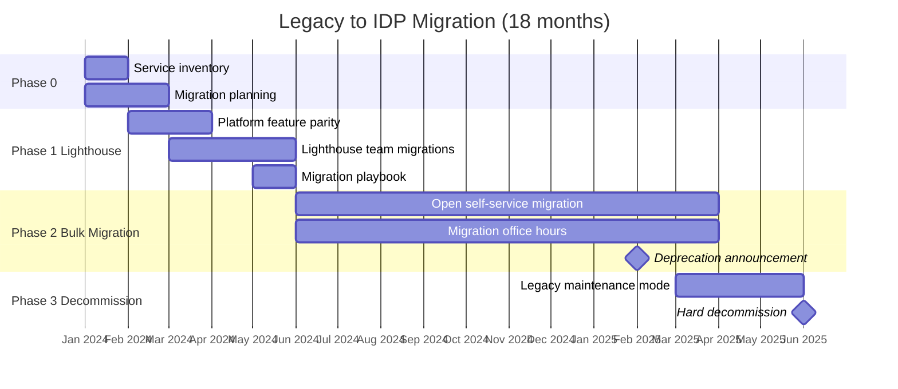

# Platform Engineering - L5 Platform Migration

## Keywords in This File

| # | Keyword | Weight |
|---|---|---|
| 1 | [Legacy to IDP Migration Strategy](#legacy-to-idp-migration-strategy) | critical |

---

# Legacy to IDP Migration Strategy

---
id: PE-027
title: Legacy to IDP Migration Strategy
category: Platform Engineering
difficulty: ★★★
interview_weight: critical
seniority: staff-principal
status: draft
version: 1
---

### 🎯 Model Answer

**30 seconds:**
> Migrating from legacy infrastructure to an Internal Developer Platform
> is a multi-year organizational change program, not a technical project.
> The technical work - moving services onto the new platform - is
> straightforward. The hard parts are: winning adoption without mandating
> migration, maintaining service reliability during migration, and
> decommissioning legacy systems that always have "one more team that
> needs them." Successful IDP migrations use the strangler fig pattern:
> build the new platform alongside the old, migrate teams incrementally,
> and deprecate only after adoption exceeds 90%.

**3 minutes (Senior):**
> Legacy-to-IDP migration has three distinct phases that require different
> skills from the platform team. In phase one, you are building the new
> platform while the old systems continue operating; the challenge is
> feature parity - product teams will not migrate until the IDP is at
> least as capable as what they have today. In phase two, you are running
> two platforms in parallel - the operational cost is high and the
> migration pace determines how long you pay that double cost. In phase
> three, you are decommissioning legacy systems - this is always politically
> harder than expected because there are always edge cases and "the team
> that can't migrate right now."
>
> The migration pattern that works: identify 3-5 "lighthouse" teams who
> are willing to migrate early and give them white-glove support. Their
> success creates social proof. Then open migration with a documented
> playbook. Then set a soft deprecation timeline for the legacy system.
> Never hard deprecate before 90% of teams are migrated - the remaining
> 10% always have legitimate reasons for delay, and forcing them creates
> reliability incidents.

**Blank Mind Recovery:**

**(1) Restate:** "Legacy to IDP Migration Strategy - the approach for
moving an organization from existing infrastructure to a new Internal
Developer Platform."

**(2) First principles:** "Every system that currently works has users
who depend on it. Migration is not just technical (move things over)
but organizational (change how people work). Both must be addressed."

**(3) Bridge:** "Legacy-to-IDP migration is analogous to migrating a
production database to a new schema while users are actively writing
to it. The migration must be: backward compatible (old workflows still
work during migration), incremental (one team at a time, not all at
once), and reversible (a team can move back if the migration causes
problems)."

---

### 📘 Concept Explanation

**What it is:**
Legacy-to-IDP migration is the process of transitioning an organization
from existing, typically inconsistent infrastructure management practices
to a new Internal Developer Platform. The "legacy" varies: it might be
hand-rolled bash scripts and manual Kubernetes manifests, or a previous-
generation internal platform that has become unmaintainable, or cloud
provider-specific tooling that creates vendor lock-in.

**The problem it solves:**
Organizations that have been operating for years before IDP adoption
have accumulated infrastructure debt: inconsistent practices across teams,
security controls applied unevenly, no central catalog, and no golden path.
Migration to an IDP standardizes these practices without requiring teams
to rebuild from scratch.

**How it works - the migration framework:**

```
LEGACY TO IDP MIGRATION PHASES

Phase 0: Assessment and Planning (months 1-2)

  Inventory:
    - How many services exist? (service count)
    - What infrastructure does each service use?
      (namespaces, CI/CD, secrets, monitoring configuration)
    - Which teams manage which services?
    - What is the current "deployment workflow" per team?
      (vary from scripted helm install to GitOps ArgoCD to kubectl apply)
    - What are the critical services that cannot tolerate migration risk?
      (isolate these for last or special-case migration)

  Categorization:
    - Tier 1: critical services (payment processing, auth, data stores)
      Migrate with extra care; plan for rollback; migrate last
    - Tier 2: standard product services
      Migrate with standard playbook; migrate in bulk
    - Tier 3: internal tooling, batch jobs, low-traffic services
      Migrate first; these are low-risk and provide learning

  Migration readiness per team:
    - Rate each team: ready (eager, capacity, low-risk service),
      needs support (willing but needs help), not ready (blocked)
    - Target: identify 3-5 lighthouse teams from "ready" category

Phase 1: Lighthouse Migration (months 3-6)

  Select 3-5 lighthouse teams:
    - Criteria: willing, have capacity for migration work,
      manage Tier 2 or Tier 3 services (not Tier 1)
    - Support model: platform team pairs with lighthouse team
      for the migration (dedicated 2-4 days per service)
    - Goal: produce a migration playbook from the lighthouse experience

  Migration playbook output (from lighthouse migrations):
    Step 1: Audit current service configuration
      - What namespace does it use? (manual or from existing tooling)
      - What secrets does it use? (in env vars, in vault, in k8s secrets)
      - What monitoring does it have? (none, custom Prometheus, Datadog)
    Step 2: Create IDP representation of the service
      - ArgoCD Application definition
      - Standardized Helm chart or Kustomize overlay
      - ESO SecretStore binding for secrets
      - ServiceMonitor for observability
    Step 3: Run both in parallel (validate equivalence)
      - Deploy to IDP in a separate namespace
      - Validate: same behavior, same metrics, same logs
      - Run parallel for 1 week minimum
    Step 4: Cutover
      - DNS switch or load balancer update
      - Monitor for 24 hours post-cutover
    Step 5: Decommission legacy deployment
      - Remove old namespace, old pipeline, old monitoring config

Phase 2: Bulk Migration (months 7-18)

  Publish the playbook from Phase 1.
  Open self-service migration:
    - Teams can migrate at their own pace using the playbook
    - Platform team available for questions (not required)
    - Monthly "migration office hours" for teams with blockers

  Track progress:
    - Migration dashboard: services migrated / total services
    - Teams on IDP / total teams
    - Support tickets filed during migration (trend down as playbook matures)

  Incentive alignment:
    - New capabilities (canary deployment, self-service environments)
      available ONLY on the IDP (motivation to migrate)
    - Legacy system support SLA reduced over time
      (response time for legacy infrastructure issues: 4h initially,
       then 8h, then 24h as deprecation approaches)

Phase 3: Legacy Decommission (months 18-36)

  Deprecation timeline announcement:
    - When 85% of services migrated: announce deprecation date
      for legacy system (6 months notice)
    - Designate legacy system as "maintenance mode" (no new features,
      critical security patches only)

  Remaining services audit:
    - Identify remaining 15% of services
    - For each: is there a legitimate blocker to migration?
    - Common blockers: service is being deprecated (do not migrate),
      technical incompatibility (requires IDP feature not yet built),
      team capacity (needs dedicated migration sprint)
    - Resolve blockers; do not extend deprecation timeline for blockers
      that are organizational ("we didn't have time") vs. technical
      ("the IDP doesn't support X yet")

  Hard decommission:
    - At deprecation date: legacy system enters read-only mode
    - Any remaining services in legacy system: incident risk accepted
    - Complete remaining migrations with emergency support
```

**The strangler fig pattern applied:**

The strangler fig pattern (from Martin Fowler) is the architectural
approach for legacy migration: build the new system alongside the old,
gradually redirect traffic from old to new, and remove the old system
only when it has been fully replaced. Applied to IDP migration:
- Build the IDP alongside the legacy system
- Migrate one service at a time
- The legacy system "strangles" as each service migrates away
- Decommission legacy only when empty (or near-empty)

---

### 💻 Code Example

**BAD vs GOOD: Migration approach**

```yaml
# BAD: Big-bang IDP migration announcement
# Email to all-engineering:
# "Starting next quarter, all services MUST be deployed
# via the new IDP platform. The legacy deployment system
# will be shut down on March 1st. Migration guides to follow."
#
# Result:
# - 40 teams simultaneously trying to migrate
# - Platform team overwhelmed with support requests
# - Teams discover migration blockers (incompatibilities)
#   with no time to fix them
# - March 1st: 30% of services still on legacy system;
#   shutdown is postponed indefinitely
# - Teams lose trust in the platform program
```

```python
# GOOD: Incremental migration with lighthouse program

from dataclasses import dataclass, field
from enum import Enum
from typing import Optional

class MigrationStatus(Enum):
    PENDING = "pending"
    LIGHTHOUSE = "lighthouse"
    IN_PROGRESS = "in_progress"
    MIGRATED = "migrated"
    BLOCKED = "blocked"

class ServiceTier(Enum):
    TIER_1 = "tier1"  # critical: payment, auth, data stores
    TIER_2 = "tier2"  # standard product services
    TIER_3 = "tier3"  # internal tools, low-traffic services

@dataclass
class ServiceMigrationRecord:
    service_name: str
    team: str
    tier: ServiceTier
    status: MigrationStatus = MigrationStatus.PENDING
    blocker: Optional[str] = None
    migrated_date: Optional[str] = None

    def can_be_lighthouse(self) -> bool:
        """Safe for early migration with white-glove support."""
        return (
            self.tier in (ServiceTier.TIER_2, ServiceTier.TIER_3)
            and self.status == MigrationStatus.PENDING
        )

    def migration_risk(self) -> str:
        if self.tier == ServiceTier.TIER_1:
            return "high - migrate last, with full rollback plan"
        if self.tier == ServiceTier.TIER_2:
            return "medium - standard playbook, 24h parallel run"
        return "low - fast-track migration"

class MigrationTracker:
    def __init__(self):
        self.services: list[ServiceMigrationRecord] = []

    def add(self, service: ServiceMigrationRecord) -> None:
        self.services.append(service)

    def progress(self) -> dict:
        total = len(self.services)
        migrated = sum(
            1 for s in self.services
            if s.status == MigrationStatus.MIGRATED
        )
        blocked = sum(
            1 for s in self.services
            if s.status == MigrationStatus.BLOCKED
        )
        return {
            "total": total,
            "migrated": migrated,
            "blocked": blocked,
            "pct_complete": round(migrated / total * 100, 1) if total else 0,
        }

    def lighthouse_candidates(
        self, max_count: int = 5
    ) -> list[ServiceMigrationRecord]:
        return [
            s for s in self.services if s.can_be_lighthouse()
        ][:max_count]
```

> **Code walkthrough:** The migration tracker encodes the incremental
> migration strategy in code: services are categorized by tier (risk
> level), and lighthouse candidates are Tier 2/3 services in pending
> state. Tier 1 services cannot be lighthouse candidates because they
> carry too much risk for early migration experiments. The `migration_risk`
> method surfaces the appropriate migration approach per tier. Tracking
> blockers explicitly enables the platform team to distinguish
> organizational blockers ("we didn't have time") from technical
> blockers ("the IDP doesn't support X yet") and address them differently.

**Example 2: Migration validation - parallel run script**

```bash
#!/usr/bin/env bash
# validate-parallel-migration.sh
# Run this during Phase 1 "parallel run" step
# Compare behavior between legacy and IDP deployments

set -euo pipefail

LEGACY_URL="${LEGACY_URL:?Must set LEGACY_URL}"
IDP_URL="${IDP_URL:?Must set IDP_URL}"
DURATION_SECS="${DURATION_SECS:-300}"  # 5 min default
SERVICE="${SERVICE:?Must set SERVICE name}"

echo "=== Parallel Migration Validation: $SERVICE ==="
echo "Legacy: $LEGACY_URL"
echo "IDP:    $IDP_URL"
echo "Duration: ${DURATION_SECS}s"

# 1. Health check both endpoints
check_health() {
    local url="$1"
    local name="$2"
    local code
    code=$(curl -sfo /dev/null -w "%{http_code}" "$url/health")
    if [[ "$code" != "200" ]]; then
        echo "FAIL: $name health check returned $code"
        return 1
    fi
    echo "OK: $name healthy ($code)"
}

check_health "$LEGACY_URL" "LEGACY"
check_health "$IDP_URL" "IDP"

# 2. Compare response payloads (spot check)
legacy_resp=$(curl -sf "$LEGACY_URL/api/v1/status")
idp_resp=$(curl -sf "$IDP_URL/api/v1/status")

if [[ "$legacy_resp" != "$idp_resp" ]]; then
    echo "WARN: Response body differs between legacy and IDP"
    echo "Legacy: $legacy_resp"
    echo "IDP:    $idp_resp"
    echo "Review differences before cutover"
else
    echo "OK: Response body matches"
fi

# 3. Compare Prometheus metric counts (basic sanity)
# Requires Prometheus to be accessible
PROM="${PROMETHEUS_URL:-http://prometheus:9090}"
legacy_req_rate=$(curl -sf \
    "$PROM/api/v1/query?query=rate(http_requests_total{service=\"${SERVICE}-legacy\"}[5m])" \
    | jq -r '.data.result[0].value[1] // "N/A"')
idp_req_rate=$(curl -sf \
    "$PROM/api/v1/query?query=rate(http_requests_total{service=\"${SERVICE}-idp\"}[5m])" \
    | jq -r '.data.result[0].value[1] // "N/A"')

echo "Legacy request rate: $legacy_req_rate req/s"
echo "IDP request rate:    $idp_req_rate req/s"

echo "=== Validation complete. Review findings before cutover. ==="
```

> **Code walkthrough:** The parallel validation script automates the
> key checks during the "run both in parallel" phase: health endpoint
> verification, response body comparison, and Prometheus metric sanity
> check. The script is intentionally simple - it runs in CI and catches
> gross regressions (IDP not healthy, response body completely different)
> without attempting to prove equivalence exhaustively. The human migration
> engineer reviews the output and makes the cutover decision. The
> Prometheus metric comparison is a sanity check: if legacy is serving
> 100 req/s and IDP is serving 0, the traffic routing is wrong.

---

### 📊 Diagram

```
LEGACY TO IDP MIGRATION TIMELINE (STRANGLER FIG)

Month:   1  2  3  4  5  6  7  8  9  10 11 12 13 14 15 16 17 18
Legacy:  ==========================================----->  decommission
IDP:        +--------------------------------------------->

Phase:   [Assess ][Lighthouse ][Bulk Migration (40 teams)    ][Decomm]

Team adoption:
  0      .  .  .  5  10 15 20 25 30 35 38 40
  Legacy .  .  .  35 30 25 20 15 10  5  2   0

Parallel running cost:
         0  0  0  low med  med  high  med  low  low  0  0
         (peak double-run cost at months 7-12)
```



> **Diagram walkthrough:** The Gantt chart shows the three phases of
> IDP migration over 18 months. The critical overlap period is Phase 1
> and early Phase 2 (months 3-9): the platform team is simultaneously
> building new IDP capabilities, supporting lighthouse migrations, and
> operating the legacy system. This is the highest-cost period. The
> deprecation announcement milestone at month 14 creates urgency for
> the remaining 15% of teams who have not yet migrated. The 18-month
> timeline is a minimum; organizations with > 500 services or complex
> legacy infrastructure should plan for 24-36 months.

---

### 🎓 Answers by Seniority

**Junior / Mid (0-5 years):**
> Migrating to an IDP means moving all team services onto the new
> platform instead of each team managing their own deployment scripts.
> The approach is gradual: pick a few willing teams first, migrate their
> services with close support, use what you learn to write a migration
> guide, then let all teams migrate at their own pace using that guide.
> The old system keeps running until almost everyone is on the new one.
> You don't turn off the old system until 90%+ of teams have migrated.

---

**Senior / Staff (5+ years):**
> Legacy-to-IDP migration follows the strangler fig pattern: build new
> alongside old, migrate incrementally, decommission last. The three
> phases are: lighthouse (3-5 early adopter teams with white-glove support,
> produces migration playbook), bulk migration (self-service migration
> using the playbook, with deprecation timeline incentive), and decommission
> (resolve remaining blockers, hard deprecate after 90% adoption).
>
> The most common failure is the big-bang migration announcement: mandate
> all teams migrate by date X. It causes a rush, surfaces blockers the
> platform wasn't aware of, overloads the platform team with support
> requests, and typically results in pushing the deadline because 20% of
> teams have legitimate blockers. Incremental with incentives (new
> capabilities only on IDP; legacy SLA degrades over time) achieves
> higher adoption with less organizational pain.
>
> At Staff level, I would add: the decommission phase requires executive
> sponsorship. Technical leads can manage the migration. Decommissioning
> the legacy system - which always has "one more team that needs it" -
> requires the ability to set and hold a deprecation deadline. Without
> executive air cover, the legacy system runs in "maintenance mode"
> indefinitely.

---

### ⚠️ Common Misconceptions

**Misconception: "Once a team is on the IDP, migration is complete."**

Migration is complete when the legacy system component is fully
decommissioned - not when the team is running on the IDP in parallel.
Many IDP migration programs report "X% migrated" when the actual state
is "X% running on IDP, but legacy infrastructure still running for all
teams." The double-running cost (operating both systems) is the primary
driver for completing decommission, but it requires deliberate tracking
of which legacy infrastructure has been removed (not just which teams
have adopted the IDP).

**Misconception: "The platform team handles the migration for teams."**

For lighthouse migrations: yes, the platform team provides hands-on
support. For bulk migration (tens of teams): the platform team cannot
migrate 40 services itself; it scales migration through self-service
playbooks and tooling. The platform team's migration role in Phase 2
is: publish the playbook, run office hours, fix playbook gaps when teams
report blockers, and track progress. Individual teams run their own
migrations using the playbook.

---

### 🚨 Failure Modes and Diagnosis

**Failure mode: Migration blockers halt 30% of services indefinitely**

Symptom: 70% of services migrated and progressing; 30% have been "in
progress" for 6 months with various stated blockers. Legacy system
cannot be decommissioned.

Root cause analysis of blockers:
1. "Service will be deprecated soon" (do not migrate, deprecate instead)
2. "We don't have time this quarter" (organizational blocker, not technical)
3. "IDP doesn't support X feature our service requires" (technical blocker
   - platform team must build or provide workaround)
4. "Migration breaks our service" (migration bug - platform team must fix)

Action per category:
- Services being deprecated: remove from migration count; add to
  deprecation tracking; schedule decommission alongside legacy
- Organizational blockers: escalate to engineering leadership;
  if critical services, arrange dedicated migration sprint with
  platform team embedded in the product team
- Technical blockers: prioritize in platform backlog; do not announce
  hard deprecation deadline until technical blockers are resolved
- Migration bugs: fix immediately; these are platform team responsibility

**Failure mode: Performance regression on IDP during parallel run**

Symptom: legacy service at 50ms p99 response time. Same service on IDP
during parallel run: 200ms p99.

Diagnosis:
```bash
# Check: are IDP deployments resource-constrained?
kubectl top pods -n <idp-namespace>
# Compare resource requests/limits between legacy and IDP config

# Check: is the IDP service hitting different network paths?
kubectl exec -it <pod> -n <idp-namespace> -- \
  traceroute <downstream-service>
# vs same from legacy namespace

# Check: is the IDP observability overhead contributing?
# Istio sidecar adds ~1ms latency for mTLS handshake
# Prometheus exporter overhead: negligible for most services
```

Common causes: IDP has CPU limits that are tighter than the legacy
deployment (throttling under load), service mesh sidecar overhead
(Istio mTLS adds 1-5ms p99 for in-cluster calls), or different
network topology (IDP in a different AZ than the downstream services
the migrated service calls).

Fix: match resource limits between legacy and IDP. Validate that
the service topology in the IDP places the migrated service in the
same AZ as its primary downstream dependencies.

---

### 🎯 Interview Deep-Dive

**Timing:** Hard ★★★ - 12 questions minimum.

---

#### Q1 - How do you assess an organization's readiness for IDP migration?

Migration readiness assessment has three dimensions: technical,
organizational, and platform maturity.

**Technical readiness:**

Service inventory completeness:
- Can you enumerate all services that need to be migrated?
- Is there a service registry or catalog that covers > 90% of services?
- Are services using container images (can be migrated to Kubernetes)
  or are some still on VMs/bare metal (different migration path)?

Dependency mapping:
- Do services have documented dependencies? (database, external APIs,
  other services)
- Are there circular dependencies or shared mutable state that will
  complicate migration sequencing?

Current deployment heterogeneity:
- How many different deployment patterns exist? (each distinct pattern
  requires a distinct migration playbook)
- Are deployments reproducible? (if a service can only be deployed by
  one person who knows the deployment script, migration is risky)

**Organizational readiness:**

Team capacity:
- Do product teams have capacity for migration work in addition to
  their regular product roadmap?
- Is there a regular pattern of low-activity quarters (post-launch,
  between major releases) when teams can focus on migration?

Leadership alignment:
- Is engineering leadership committed to the migration timeline?
- Will leadership hold the deprecation timeline even when individual
  teams object?

Platform team capacity:
- Can the platform team support 3-5 lighthouse migrations simultaneously
  without dropping other platform work?

**Platform maturity:**

Feature parity:
- Does the IDP support all deployment patterns used by the target
  services? If not: what are the gaps?
- Are the gaps blockers (teams cannot migrate) or friction (teams
  prefer not to migrate)?

Reliability:
- Is the IDP reliable enough to trust with production workloads?
- Has the IDP been validated with non-critical workloads before
  migrating production services?

*What separates good from great:* Completing the technical readiness
assessment before announcing the migration program. Organizations that
announce IDP migration before completing the service inventory and
dependency mapping often discover unexpected complexity mid-migration
(circular dependencies, services with undocumented deployment procedures,
services owned by teams that have dissolved). The assessment phase is
1-2 months; skipping it adds 6-12 months of surprise to the migration.

---

#### Q2 - How do you select and run the lighthouse migration program?

Lighthouse selection criteria:

1. Team characteristics:
   - Willing and motivated (not assigned)
   - Has engineering capacity in the migration window
   - Senior engineers who can identify and articulate blockers
   - Not responsible for Tier 1 critical services during the lighthouse phase

2. Service characteristics:
   - Tier 2 or Tier 3 (not payment, auth, or core data stores)
   - No unusual deployment requirements (no GPU, no privileged containers,
     no host networking)
   - Has test coverage to validate post-migration behavior
   - Relatively low traffic (failure impact is manageable)

**Running the lighthouse program:**

Week 1-2: service audit
Platform engineer pairs with team lead. Audit: current service configuration
in detail (namespace, secrets, resources, dependencies). Document every
gap between current deployment and IDP template.

Week 3-4: IDP configuration and parallel run
Create IDP representation. Deploy to IDP alongside legacy. Run parallel
for 1-2 weeks with monitoring comparison. Fix issues.

Week 5: cutover and validation
Traffic switch (DNS or load balancer). Monitor 24-48 hours. Platform
engineer available immediately for issues.

Week 6: decommission legacy deployment
Remove legacy namespace, pipeline, monitoring config. Confirm no
regressions after 1 week.

Week 7: playbook update
Capture every issue encountered and its resolution. Update the migration
playbook for the next wave of teams.

**Platform team time investment:**
4-8 platform engineer days per lighthouse migration. Lighthouse program
total: 20-40 days for 5 lighthouse teams. High cost - justified by
the quality of the playbook produced and the social proof created.

*What separates good from great:* Treating lighthouse migrations as
learning exercises as much as migrations. The primary output of the
lighthouse program is not 5 migrated services (relatively low value)
but a validated, detailed migration playbook that enables the next 35
teams to migrate with minimal platform team support.

---

#### Q3 - How do you handle Tier 1 critical service migrations?

Tier 1 critical services (authentication, payment processing, core
data stores) require a migration approach that the standard playbook
does not provide.

**Tier 1 migration principles:**

1. Migrate last (not first):
   Platform should have 12+ months of production hardening before
   Tier 1 services move to it. Every platform failure mode that can
   be triggered by a production workload should have been seen and
   resolved before Tier 1 migration.

2. Extended parallel run:
   Tier 2: 1-2 week parallel run.
   Tier 1: 4-8 week parallel run with full traffic shadowing.
   Some organizations run Tier 1 parallel for an entire quarter before
   cutting over.

3. Gradual traffic shift:
   Use weighted routing (Istio traffic management, nginx split) to
   shift traffic incrementally:
   - Week 1: 5% to IDP, 95% to legacy
   - Week 2: 25% to IDP, 75% to legacy
   - Week 3: 50%/50% with close monitoring
   - Week 4: 100% to IDP if metrics match

4. Full rollback plan:
   Before cutover: documented rollback procedure that can be executed
   in < 5 minutes. Rollback should be a single command or dashboard click.

5. On-call escalation path:
   Platform team engineer is on-call with PagerDuty integration during
   the 48 hours after Tier 1 cutover. Response time SLA: 15 minutes.

**The "no downtime" constraint:**
Tier 1 services cannot tolerate deployment downtime. The IDP must
demonstrate zero-downtime rolling deployments before Tier 1 migration.
This usually means: PodDisruptionBudget configured, readiness probes
tuned, rolling update maxUnavailable=0.

*What separates good from great:* Separating the Tier 1 migration
decision from the bulk migration program. Tier 1 migration requires
a dedicated project: separate timeline, separate risk assessment, separate
rollback plan, and separate stakeholder communication. Organizations
that treat Tier 1 migration like Tier 2 migration create production
incidents.

---

#### Q4 - How do you manage the parallel running period (operating both systems)?

The parallel running period is the most expensive phase of migration:
the platform team operates two systems simultaneously, infrastructure
costs are doubled, and support complexity is high.

**Parallel running cost management:**

Operational burden:
Platform team must:
- Maintain the legacy system (security patches, incident response)
- Develop new IDP capabilities
- Support ongoing migrations
- Manage the IDP infrastructure

Risk: the platform team cannot do all of this well simultaneously.
Strategy: reduce legacy system operational burden to minimum (no new
features, security patches only) to free capacity for IDP development.

Infrastructure cost:
Legacy system infrastructure + IDP infrastructure = 2x peak infrastructure
cost. Acceptable during the transition; budget for this explicitly.
If the parallel period extends beyond 18 months, the cost is significant.

**Incentive design to accelerate migration:**

Carrot (pull toward IDP):
- New platform capabilities (canary deployment, self-service provisioning)
  available ONLY on IDP
- IDP support SLA: 1-hour response. Legacy SLA: 4-hour response.
  (Degrades to 8h at 12 months, 24h at 18 months)

Stick (push away from legacy):
- Legacy system does not receive new features
- Announce deprecation timeline with 6 months notice
- Communicate: "teams still on legacy at deprecation date accept
  that legacy incidents will be handled by the team itself"

**Double-run anti-patterns:**

The open-ended parallel run: "teams can migrate when they are ready"
with no timeline creates a situation where the legacy system runs
indefinitely. Always set a deprecation date. It can be extended if
necessary, but the default must be a fixed date.

*What separates good from great:* Treating the parallel running period
as a bounded project with a clear end date, not an indefinite operational
mode. The deprecation announcement with sufficient notice (6 months)
and gradually degrading legacy SLA is the mechanism that creates urgency
without mandate.

---

#### Q5 - How do you handle migration rollback when the IDP causes a production incident?

Migration rollback is not a failure - it is the safety mechanism that
allows incremental migration to be low-risk.

**Pre-migration rollback preparation:**

Document the rollback procedure before every migration:
```bash
# Rollback procedure for payment-api migration
# Execute if IDP deployment causes production degradation

# Step 1: Redirect traffic back to legacy namespace (< 1 minute)
kubectl patch service payment-api-ingress \
  -n ingress-nginx \
  --type merge \
  -p '{"spec":{"selector":{"deployment":"legacy"}}}'

# Step 2: Confirm legacy is healthy
curl -sf https://payment-api.internal/health

# Step 3: Notify on-call team of rollback
# (automated by PagerDuty runbook link in alert annotations)

# Step 4: Preserve IDP deployment for investigation
# (do NOT delete the IDP deployment - it contains the evidence)
kubectl annotate deployment payment-api \
  -n payment-idp-namespace \
  rollback-reason="production-incident-YYYY-MM-DD"
```

**Post-rollback investigation:**

After rollback:
1. Identify the root cause: what did the IDP deployment do differently
   from the legacy deployment that caused the incident?
2. Common root causes:
   - Resource limits too tight (IDP has stricter limits)
   - Missing environment variable in IDP configuration
   - Different JVM tuning (IDP template uses different heap settings)
   - Network policy blocking a connection that legacy allowed
3. Fix the IDP configuration
4. Re-test in parallel before re-attempting cutover
5. Update migration playbook with the root cause and fix

**Rollback as learning:**
Every rollback improves the migration playbook. If the rollback was
caused by a missing environment variable, the playbook gets a step:
"audit all environment variables against legacy configuration, confirm
all are present in IDP SecretStore and ConfigMap."

*What separates good from great:* Treating migration rollback as a
normal, expected event rather than a failure. Organizations that create
social stigma around rollback create incentives to NOT roll back when
a degradation is detected - the team holds on hoping it will resolve,
which extends the customer impact. Rollback-positive culture: "we detect
an issue, we roll back immediately, we investigate, we re-migrate when
fixed" minimizes customer impact.

---

#### Q6 - How do you communicate migration status and timelines to the organization?

Migration communication requires different messages for different audiences.

**Engineering teams:**

Format: monthly migration status email + migration dashboard.
Content: how many services migrated, how many in progress, upcoming
deprecation dates, migration playbook link, office hours schedule.

Migration dashboard (Grafana or custom):
- Services migrated / total (progress bar)
- Teams on IDP / total teams
- Migration velocity (services migrated per week - trend)
- Open blockers (count and type)

**Engineering leadership:**

Format: quarterly business review section.
Content: migration progress against plan, operational cost of parallel
running, projected deprecation date, risk assessment for remaining
services.

Key metric: projected date when legacy system can be decommissioned.
This translates migration progress into a financial outcome (end of
double-run infrastructure cost).

**Executive:**

Format: one paragraph in the quarterly engineering report.
Content: "IDP migration is X% complete. Legacy system projected to be
decommissioned by Q4, which eliminates $Y/month in legacy infrastructure
costs and $Z/month in legacy operational support costs."

*What separates good from great:* Maintaining a public migration
dashboard that all engineers can see. Transparency about migration
progress creates a collective accountability: teams who have not migrated
can see the overall progress and understand the social expectation.
"85% of teams have migrated; the migration office hours are available
to help the remaining teams" is more motivating than individual email
requests to migrate.

---

#### Q7 - How do you handle services that cannot migrate due to technical incompatibilities?

Some services have requirements that the IDP does not support:
privileged containers, GPU scheduling, stateful workloads with complex
storage requirements, or services that depend on host networking.

**Incompatibility categories:**

Tier A: IDP can support this with small enhancement.
Example: service requires a specific Kubernetes admission webhook.
Fix: add the webhook to the IDP. Unblock the migration.

Tier B: IDP can support this with a significant platform change.
Example: service requires GPU nodes. Fix: add GPU node pool to the IDP
cluster with appropriate node selectors and NVIDIA device plugin.
Timeline: 2-4 weeks of platform engineering work. Add to platform
backlog; announce unblock timeline to the team.

Tier C: IDP cannot support this in the migration timeline.
Example: service requires bare-metal host access with hugepages
and CPU pinning. This is incompatible with Kubernetes containerization.
Decision: do not migrate this service to the IDP. Document it as
an exception; maintain it in the legacy system or on dedicated
infrastructure indefinitely.

**Exception management:**

For each Tier C exception:
- Document: service name, incompatibility reason, owner team
- Classify: is this a service that should eventually be refactored
  to be IDP-compatible? Or is it a permanent exception?
- For permanent exceptions: the legacy system or dedicated
  infrastructure must be maintained indefinitely for this service.
  This is a non-zero ongoing operational cost.

**Implication for decommission:**

If Tier C exceptions exist, the legacy system cannot be fully
decommissioned. Options:
1. Minimize the legacy footprint: migrate all non-exceptional services;
   leave only the exceptional services on a minimal legacy cluster.
2. Refactor exceptional services: if the exceptional services can be
   refactored to be IDP-compatible (reasonable within 1-2 years),
   plan the refactoring as part of the migration program.
3. Accept the permanent exception: acknowledge that some services will
   always run outside the IDP, and maintain the minimal infrastructure
   required for them.

*What separates good from great:* Completing the incompatibility
assessment before the deprecation timeline is announced. Nothing
undermines organizational trust in the migration program more than
announcing a deprecation date, then discovering a class of services
that cannot migrate, then extending the date. The assessment reveals
Tier B and Tier C incompatibilities; Tier B unblocking is added to
the platform roadmap; Tier C exceptions inform the decommission plan.

---

#### Q8 - How do you maintain service reliability during migration?

Migrations create production risk. Managing that risk requires
discipline in the migration approach.

**Reliability controls during migration:**

No-migration windows:
Define windows when migrations are not executed:
- Product launches (service is high-visibility; no migration risk)
- Major releases (team bandwidth is consumed)
- End of quarter (business-critical periods)
- Holidays (reduced on-call coverage)

Migration rollback SLA:
"If a migration causes a P1 or P2 incident, rollback is initiated
within 15 minutes of detection." This requires:
- A rollback procedure that can be executed in < 5 minutes
- An on-call engineer who is informed of the migration and watching
  during the first 24 hours post-cutover

Parallel run minimum:
All Tier 2 services: 1 week minimum parallel run before cutover.
Tier 1 services: 4 weeks minimum parallel run before cutover.
No exceptions to the parallel run minimum.

**Observability during migration:**

During parallel run, monitor these signals from both legacy and IDP:
- Request rate (are they similar?)
- Error rate (is IDP error rate > legacy error rate?)
- Response time p50, p95, p99
- Database connection pool usage
- JVM/GC metrics (if Java service)

Any signal where IDP performance is worse than legacy: investigate
before cutover. "Similar is sufficient" - IDP does not need to be
better than legacy before cutover, just not significantly worse.

*What separates good from great:* Defining "not significantly worse"
with specific thresholds before migration. "Error rate increase > 0.1%
is a migration blocker." "Response time p99 increase > 20% is a
migration blocker." These thresholds are established before the
parallel run, not evaluated subjectively during it. Subjective evaluation
("it seems fine") is subject to the migration team's optimism bias.

---

#### Q9 - What is the organizational change management dimension of IDP migration?

Technical migrations fail for organizational, not technical, reasons.
The organizational change management dimension is as important as the
technical migration plan.

**Stakeholder mapping:**

Engineers (migrating teams):
Concern: migration takes time from product roadmap. Answer: platform
team provides white-glove support for lighthouse teams; playbook reduces
self-service migration to 1-2 days for most services.

Team leads:
Concern: migration risk to their services. Answer: parallel run, rollback
capability, migration office hours for support.

Engineering VP:
Concern: migration timeline, cost of parallel running, impact on
product velocity. Answer: migration dashboard, quarterly progress report,
deprecation timeline with projected infrastructure cost savings.

Security/compliance team:
Concern: does the IDP maintain security posture? Answer: policy as code
in the IDP enforces security controls more consistently than the legacy
system; migration improves security posture.

**Change management tactics:**

Success story amplification:
After each lighthouse migration: send an all-engineering email from
the lighthouse team lead: "We migrated service X to the IDP. What we
found: deployment time dropped from 8 minutes to 2 minutes, and we
eliminated the manual deployment script that only one person understood.
Here is the migration playbook we used."

Migration champions program:
Each team that migrates produces one "migration champion" - an engineer
who has migrated a service and can help their peers. Champions are
recognized publicly and given platform team direct access (Slack channel)
for fast support.

Lunch-and-learn sessions:
Monthly 30-minute sessions showing the migration process live. Engineers
who are uncertain about migration can watch a real migration happen
before committing to their own.

*What separates good from great:* Understanding that the loudest
objections to IDP migration come from the teams whose services are
most different from the golden path - and that these teams' concerns
are often legitimate. Dismissing their concerns ("everyone else
migrated without problems") is counterproductive. Engaging deeply
with their specific technical situation and either: (1) fixing the
IDP to support their pattern, or (2) classifying their service as a
permanent exception - is the approach that resolves the impasse.

---

#### Q10 - How do you run the legacy system decommission phase?

Decommission is the most politically complex phase of migration.

**Decommission preparation:**

At 85% migration: announce the deprecation date (6 months out).
Communication: "The legacy deployment system will be decommissioned
on [date]. Platform team will provide migration support through [date-2M].
After [date-1M], legacy system will be in read-only mode (no changes;
no new deployments)."

Track remaining services:
- Services still on legacy: list by team, tier, blocker type
- Tier 1 services still on legacy: escalate to engineering leadership;
  assign dedicated platform engineer for migration support
- Services being deprecated: remove from tracking; add to deprecation-first list

**The "final 10%" problem:**

The last 10% of services on the legacy system always takes disproportionate
effort. These services are either:
- Tier 1 with complex migration requirements
- Owned by teams with no capacity
- Have technical incompatibilities
- Being deprecated but the deprecation is delayed

Resolution approach:
1. For Tier 1 services: assign platform engineer embedded in the product
   team for a dedicated 2-week migration sprint
2. For capacity-constrained teams: negotiate a dedicated migration sprint
   with engineering leadership
3. For technical incompatibilities: expedite the IDP fix
4. For services being deprecated: accelerate the deprecation to unblock
   the legacy decommission

**Hard decommission execution:**

At deprecation date:
1. Remove the ability to deploy NEW services to the legacy system
2. Keep existing legacy services running (do not immediately kill them)
3. Set final end-of-life date for running legacy services: 2 weeks out
4. Final 2 weeks: any service still running in legacy = incident risk
   owned by the service team

After final end-of-life date:
1. Terminate all legacy compute resources
2. Archive legacy infrastructure configuration (Terraform state, IaC)
3. Document: what legacy patterns were not supported by the IDP and why

*What separates good from great:* Getting executive sign-off on the
hard decommission date BEFORE announcing it to teams. Announcing a
decommission date and then extending it when teams object trains the
organization that deadlines are negotiable. With executive sign-off
committed, the date is firm; teams know the date is real and prioritize
accordingly. Extension still possible, but only for technical blockers
that the platform team is actively resolving, not for organizational
blockers ("we didn't have time").

---

#### Q11 - How do you measure migration success beyond service count?

Service count (services migrated / total) is necessary but not sufficient
to measure migration success.

**Comprehensive migration success metrics:**

Technical success:
- Services migrated / total services (progress)
- Zero-regression migrations / total migrations (quality)
  A regression = production incident during or after migration
- Legacy infrastructure cost as % of total infrastructure cost
  (declining = decommission progress)

Business success:
- DORA metrics before/after migration per migrated service
  (did migration improve delivery performance?)
- Developer time spent on infrastructure per team before/after
  (did migration reduce infrastructure burden?)
- Support ticket volume before/after per team
  (did migration reduce operational friction?)

Adoption quality (beyond just "on the IDP"):
- Teams using IDP self-service for day-2 operations (not just deployed)
  "on the IDP" for deployment but still filing tickets for namespace
  operations = incomplete adoption
- Teams using IDP observability (not maintaining legacy dashboards in parallel)
- Teams using IDP secrets management (not maintaining legacy secret stores)

*What separates good from great:* Distinguishing "migrated" from
"fully adopted." A service that is deployed via ArgoCD but whose team
still manually patches Kubernetes secrets outside the IDP workflow has
partially adopted the platform. True migration success is when the IDP
is the only system the team uses for all infrastructure operations.

---

#### Q12 - How do you manage a migration that is behind schedule?

Migration behind schedule is common. The response must be proportionate
to the cause.

**Diagnosing the delay:**

Root cause type 1 - Platform capability gap:
Migration is blocked because the IDP does not support a pattern used
by multiple teams. Diagnosis: migration playbook has an open issue
for this gap; multiple teams reference the same blocker.
Response: expedite the platform fix. Extend the deprecation timeline
if the fix takes > 4 weeks.

Root cause type 2 - Team capacity constraint:
Migration is blocked because product teams do not have migration capacity.
Diagnosis: teams report "we want to migrate but can't prioritize it."
Response: engineering leadership must create space in product team
roadmaps. This is an organizational problem, not a technical one.

Root cause type 3 - Migration playbook friction:
Migration is technically possible but takes longer than expected because
the playbook is incomplete or difficult to follow.
Diagnosis: time-to-migrate per service is > 5 days on average.
Response: run a migration facilitation workshop. Identify playbook gaps.
Assign platform engineer to improve playbook quality.

Root cause type 4 - Organizational resistance:
Some teams are resistant to migration despite having capacity and no
technical blockers.
Diagnosis: the same team names appear on the "pending" list month
after month.
Response: escalate to their engineering manager. The message: "migration
is an organizational priority; teams that do not migrate by date X
will have reduced legacy support SLA."

**Recovery plan:**

After diagnosing the root causes, create a specific recovery plan:
- Technical blockers: dates by which they will be resolved
- Capacity constraints: teams that engineering leadership will provide
  capacity for
- Playbook improvements: specific gaps to fix by specific dates
- Resistant teams: escalation and support plan

Present the recovery plan to engineering leadership with a revised
deprecation date (if necessary) and the specific actions being taken.

*What separates good from great:* Categorizing delays by root cause
before responding. The response to "the platform is missing a feature"
is fundamentally different from "teams don't have time" or "teams are
resistant." Treating all delays as a single problem leads to ineffective
responses (e.g., speeding up the platform when the bottleneck is team
capacity).
