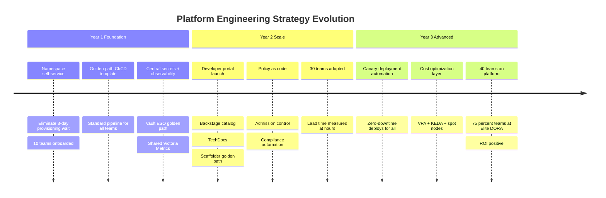

# Platform Engineering Strategy and Roadmap

---
id: PE-026
title: Platform Engineering Strategy and Roadmap
category: Platform Engineering
difficulty: ★★★
interview_weight: critical
seniority: staff-principal
status: draft
version: 1
---

### 🎯 Model Answer

**30 seconds:**
> Platform engineering strategy is the multi-year plan for building an
> Internal Developer Platform that measurably improves software delivery
> performance across the organization. It answers: what capabilities does
> the platform provide, in what order, to which teams, with what business
> justification? Without a strategy, platforms accumulate tools without
> a coherent product vision, become bottlenecks instead of accelerators,
> and fail to demonstrate ROI. With a strategy, platform investment is
> predictable, justified, and delivers compounding value.

**3 minutes (Senior):**
> Platform strategy has four components. Product vision: what developer
> experience are we building toward? (North Star: a developer can go from
> idea to production in under 1 hour without filing a ticket.) Capability
> roadmap: which platform capabilities deliver the highest value per
> engineering effort, sequenced so each capability enables the next?
> Adoption strategy: how do we get 40 product teams to use the platform
> rather than building their own solutions? Go-live strategy is easy;
> adoption is the hard problem. Business justification: how does each
> roadmap item connect to measurable outcomes (DORA metrics, ROI, risk
> reduction)?
>
> The sequencing principle for the capability roadmap is: build the
> golden path before building the platform API. A self-service namespace
> provisioning workflow that 40 teams use immediately delivers more value
> than a sophisticated platform API that 3 teams have adopted. Golden
> path first, extensibility second.
>
> Adoption strategy is where most platform programs fail. You cannot
> mandate platform adoption effectively; you can only make the platform
> better than the alternative. The strategy must account for the adoption
> incentive structure: what does a product team gain from adopting? What
> do they lose?

**Blank Mind Recovery:**

**(1) Restate:** "Platform Engineering Strategy and Roadmap - the
multi-year plan for building and evolving an Internal Developer Platform."

**(2) First principles:** "All investment requires a strategy. Platform
engineering strategy answers: what to build, in what order, for whom,
and why. Without answers to these questions, the platform team is
building features nobody asked for."

**(3) Bridge:** "Platform engineering strategy is analogous to product
strategy for a B2B SaaS company - except the 'customers' are internal
engineering teams. The same product management principles apply: talk
to customers, understand pain points, sequence by impact, measure
adoption, iterate."

---

### 📘 Concept Explanation

**What it is:**
Platform engineering strategy is the articulated plan for how platform
engineering investment will be deployed over time to maximize software
delivery performance across the organization. It includes: a platform
product vision (what developer experience we are building), a capability
roadmap (what to build in what order), an adoption strategy (how to
achieve platform adoption), and success metrics (how to measure progress).

**The problem it solves:**
Without strategy, platform teams build what is technically interesting
or what the loudest team requests. The result is a collection of tools
with poor discoverability, inconsistent UX, and gaps in critical
capabilities. Platform teams without strategy also cannot justify budget:
they spend significant engineering capacity on work that does not
demonstrably improve organizational outcomes.

**How it works:**

**Phase 1: Foundation (months 1-6)**
Focus: eliminate the most common sources of developer friction.

```
Foundation capability targets:
  - Self-service Kubernetes namespace provisioning
    (from: ticket to platform team + 3 business days wait)
    (to: ArgoCD App-of-Apps + automated RBAC + < 5 minutes)
  - Standard CI/CD pipeline template
    (from: each team writes their own GitHub Actions workflow)
    (to: reusable workflow with security gates built in)
  - Centralized secrets management
    (from: secrets in code, .env files, or team-managed Vault)
    (to: ESO pulling from org Vault with automated rotation)
  - Basic observability
    (from: each team running their own Prometheus)
    (to: shared Victoria Metrics with per-team dashboards)

Foundation success metric:
  - 10 teams on the platform by end of month 6
  - Lead time for new service first deployment: < 1 day
    (from: 1-2 weeks)
```

> **Code walkthrough:** This example demonstrates the core pattern in action. The key mechanism shows how the concept works in practice. Study the structure to understand the essential behavior and common usage.

**Phase 2: Standardization (months 7-18)**
Focus: achieve organizational consistency and eliminate security/compliance debt.

```
Standardization capability targets:
  - Developer portal (Backstage or Cortex)
    - Software catalog: all services discoverable
    - Golden path scaffolder: new service in < 30 minutes
    - TechDocs: platform documentation in-portal
  - Policy as code
    - Admission control: no deployment without security baseline
    - Compliance attestation: automated evidence collection
  - Multi-cluster networking
    - Service-to-service mTLS via Istio/Linkerd
    - Ingress standardization

Standardization success metric:
  - 30 of 40 teams on the platform
  - 100% of services in the software catalog
  - Compliance audit preparation time: < 2 days
    (from: 2 weeks)
```

> **Code walkthrough:** This example demonstrates the core pattern in action. The key mechanism shows how the concept works in practice. Study the structure to understand the essential behavior and common usage.

**Phase 3: Advanced (months 19-36)**
Focus: Elite DORA performance and developer experience refinement.

```
Advanced capability targets:
  - Canary and blue-green deployment automation
  - Automated cost optimization (Kubernetes VPA/KEDA)
  - Cross-cluster service mesh federation
  - Platform self-service API (for programmatic workflows)

Advanced success metric:
  - 40 of 40 teams on platform
  - 75% of teams in Elite or High DORA tier
  - Platform ROI positive (against TCO baseline)
```

> **Code walkthrough:** This example demonstrates the core pattern in action. The key mechanism shows how the concept works in practice. Study the structure to understand the essential behavior and common usage.

**Strategy antipatterns to avoid:**

```
WRONG: "We will build all capabilities in year 1"
  Result: overcommitted roadmap, half-finished capabilities,
  frustrated product teams waiting for promised features

WRONG: "We will mandate platform adoption"
  Result: platform compliance on paper, workarounds in practice,
  political conflict, eventual platform abandonment

WRONG: "We will build the platform API before the golden path"
  Result: powerful but unused platform; product teams do not
  know what to do with an API without a prescriptive starting point

RIGHT: "We will build the golden path first, then make it extensible"
  Right sequence: 1. golden path 2. golden path docs 3. golden path
  support 4. extensibility API
```

> **Code walkthrough:** This example demonstrates the core pattern in action. The key mechanism shows how the concept works in practice. Study the structure to understand the essential behavior and common usage.

**The 'thinnest viable platform' principle:**
Ship the minimum viable capability set that is useful to 5+ teams.
Do not build for future flexibility at the expense of current usefulness.
Each quarter: pick the capability that moves the most teams the furthest
up the DORA tier ladder, build it, ship it, measure adoption.

---

### 💻 Code Example

**BAD vs GOOD: Platform roadmap approach**

```markdown
# BAD: Platform roadmap built from technical wishlist
# "Platform Engineering Roadmap 2024-2025"
# Q1: Multi-cluster Istio service mesh federation
# Q2: Custom Kubernetes scheduler for bin packing
# Q3: eBPF-based network observability
# Q4: Custom WASM-based admission controller
#
# Problem: none of these items were requested by product teams.
# Product teams: "we still can't provision a new namespace
# without filing a ticket. We don't care about eBPF."
# Adoption rate after 1 year: 3 of 40 teams.
#
# Technically impressive roadmap; wrong for the organization.
```

```markdown
# GOOD: Platform roadmap built from developer pain point research
# Research method: interview 15 product engineers
# "What is the most painful part of your current deployment workflow?"
#
# Top answers (frequency-ranked):
# 1. "New service setup takes 2 weeks" (12/15 respondents)
# 2. "Secrets management is confusing" (10/15)
# 3. "I can't easily see what version of my service is in production"
#    (8/15)
# 4. "CI pipelines are slow and I don't know how to optimize them"
#    (8/15)
# 5. "On-call is painful because observability is hard to set up"
#    (7/15)
#
# Roadmap derived from pain points:
# Q1: Self-service namespace provisioning (addresses #1)
#   + service scaffolder (new service in < 30 minutes)
# Q2: ESO + Vault golden path (addresses #2)
# Q3: Backstage catalog with deployment status (addresses #3)
# Q4: Shared observability + CI optimization guide (addresses #4, #5)
#
# Adoption rate after 1 year: 28 of 40 teams.
# Product teams: "the platform actually solves problems I have."
```

> **Code walkthrough:** The contrast demonstrates the most common platform
> strategy failure: building what the platform team wants to build rather
> than what product teams need. The GOOD roadmap derives directly from
> frequency-ranked developer pain points, ensuring every platform
> investment solves a real problem that multiple teams face. The key
> practice is structured developer interviews (not informal conversations)
> with a consistent question set, analyzed by frequency across respondents.
> A pain point mentioned by 12/15 respondents is a high-priority capability;
> one mentioned by 1/15 is a low-priority or team-specific issue.

**Example 2: Platform capability scoring model**

```python
# Prioritization model for platform capabilities
# Score each candidate capability before adding to roadmap

from dataclasses import dataclass

@dataclass
class CapabilityScore:
    name: str
    teams_affected: int           # how many teams benefit
    pain_score: float             # 1-5: how painful is the problem today?
    effort_weeks: int             # platform team engineering weeks to build
    adoption_probability: float   # 0-1: will teams actually use this?
    dora_metric_impact: str       # which DORA metric does this improve?

    def value_score(self) -> float:
        """Expected value delivered to the organization."""
        return (
            self.teams_affected
            * self.pain_score
            * self.adoption_probability
        )

    def efficiency_score(self) -> float:
        """Value per engineering week spent."""
        if self.effort_weeks == 0:
            return float("inf")
        return self.value_score() / self.effort_weeks

    def summary(self) -> str:
        return (
            f"{self.name}\n"
            f"  Value: {self.value_score():.1f} "
            f"({self.teams_affected} teams * "
            f"{self.pain_score} pain * "
            f"{self.adoption_probability:.0%} adoption)\n"
            f"  Effort: {self.effort_weeks} weeks\n"
            f"  Efficiency: {self.efficiency_score():.2f} value/week\n"
            f"  DORA impact: {self.dora_metric_impact}"
        )

candidates = [
    CapabilityScore(
        "Self-service namespace provisioning",
        teams_affected=40, pain_score=4.5,
        effort_weeks=6, adoption_probability=0.9,
        dora_metric_impact="lead_time"
    ),
    CapabilityScore(
        "Custom Kubernetes scheduler",
        teams_affected=5, pain_score=2.0,
        effort_weeks=12, adoption_probability=0.4,
        dora_metric_impact="none"
    ),
    CapabilityScore(
        "Golden path service template",
        teams_affected=40, pain_score=4.0,
        effort_weeks=4, adoption_probability=0.85,
        dora_metric_impact="lead_time_deployment_frequency"
    ),
    CapabilityScore(
        "ESO + Vault secrets integration",
        teams_affected=30, pain_score=3.5,
        effort_weeks=5, adoption_probability=0.8,
        dora_metric_impact="change_failure_rate"
    ),
]

sorted_caps = sorted(
    candidates, key=lambda c: c.efficiency_score(), reverse=True
)
for cap in sorted_caps:
    print(cap.summary())
    print()
```

> **Code walkthrough:** The capability scoring model operationalizes the
> strategic prioritization principle: highest value-per-engineering-week
> goes first. The value score multiplies three factors: how many teams
> benefit (breadth), how painful the problem is today (depth), and how
> likely teams are to adopt the solution (realizability). Division by
> effort weeks gives efficiency. In the example, the custom Kubernetes
> scheduler scores low (affects 5 teams, medium pain, 12 weeks effort,
> low adoption probability) while namespace provisioning scores high
> (affects 40 teams, high pain, 6 weeks, 90% adoption probability).
> The model makes the prioritization conversation quantitative rather
> than opinion-based.

---

### 📊 Diagram

```
PLATFORM STRATEGY EVOLUTION MODEL

Year 1: Foundation        Year 2: Scale          Year 3: Advanced
+-------------------+    +-------------------+   +-------------------+
| Self-service       |    | Developer portal   |   | Canary + rollback |
| namespace prov.   |    | (Backstage/Cortex) |   | automation        |
| Golden path CI/CD |    | Policy as code     |   | Cost optimization |
| Central secrets   |    | Service catalog    |   | Platform API      |
| Basic observ.     |    | SLO dashboards     |   | Multi-cluster mesh|
+-------------------+    +-------------------+   +-------------------+
| 10 teams           |    | 30 teams           |   | 40 teams          |
| Lead time: days    |    | Lead time: hours   |   | Lead time: < 1h   |
| TCO > ROI          |    | TCO ~= ROI         |   | ROI > TCO         |
+-------------------+    +-------------------+   +-------------------+

Golden path tracks (vertical cuts through all years):
  Compute -> Storage -> Networking -> Security -> Observability
```



> **Diagram walkthrough:** The timeline shows the three-phase evolution
> from foundation (eliminate friction) through scale (achieve consistency)
> to advanced (Elite DORA performance). The most important pattern:
> team adoption count grows through each phase. A platform that 10 teams
> use after Year 1 is a successful foundation; a platform that still has
> only 10 teams after Year 2 has an adoption problem. The ROI curve
> mirrors adoption: negative in Year 1 (investment phase), break-even
> in Year 2 (scale phase), positive in Year 3 (harvest phase). This is
> the expected economic trajectory for platform engineering investment.

---

### 🎓 Answers by Seniority

**Junior / Mid (0-5 years):**
> Platform engineering strategy is the plan for what capabilities the
> platform team builds and in what order. The key principle is to build
> what developers actually need (based on interviews and pain-point research)
> rather than what is technically interesting. Typically: start with the
> things that cause the most friction (namespace provisioning, CI pipelines,
> secrets management), then add developer experience tooling (portal,
> catalog), then advanced capabilities (canary deployment, cost optimization).
> Each phase should increase the number of teams using the platform.

---

**Senior / Staff (5+ years):**
> Platform strategy has four dimensions: product vision (what developer
> experience are we creating?), capability roadmap (what to build, in
> what order, justified by developer pain-point research and DORA metric
> targets), adoption strategy (how to achieve platform adoption without
> mandates, through making the platform genuinely better than the
> alternative), and business justification (TCO/ROI connected to each
> roadmap phase).
>
> The most common platform strategy failure is the "build it and they
> will come" assumption: if we build a great platform, teams will
> naturally adopt it. Adoption requires deliberate effort: migration
> support, documentation, evangelism, feedback loops, and ongoing
> product iteration based on developer feedback. I would also add:
> the sequencing matters as much as the content. Building the golden path
> before the platform API means the first 10 teams have an immediately
> useful, well-paved path; building the API first means the first 10
> teams need to understand a complex platform model before they can do
> anything useful.

---

### ⚠️ Common Misconceptions

**Misconception: "More platform features = better platform."**

Platform value comes from adoption, not capability count. A platform
with 3 capabilities that 40 teams use is more valuable than a platform
with 30 capabilities that 5 teams use. The strategic question is not
"what capabilities should we build?" but "what capabilities will teams
actually adopt, and what is the minimum we need to build to get there?"

Feature bloat in internal platforms is a common failure mode: the
platform team adds capabilities because they are technically interesting
or because individual teams requested them, without evaluating cross-team
demand. The result is a platform that has an answer for everything but
a coherent experience for nothing.

**Misconception: "Platform adoption can be achieved through mandates."**

Top-down mandates to use the platform ("all teams must use the standard
CI/CD pipeline by Q3") create compliance theater rather than adoption.
Teams will use the required CI/CD pipeline for their primary service
and maintain their own solution for everything else. Mandates work for
security baselines (you must not run containers as root) because the
cost of compliance is low. They fail for platform capabilities where
the cost of adoption is high (migrating an existing service to a new
pipeline workflow is days of work).

Successful adoption comes from: making the platform better than the
alternative, offering migration support, and creating social proof
("10 teams have adopted and report 60% reduction in deployment time").

---

### 🚨 Failure Modes and Diagnosis

**Failure mode: Platform team becomes a bottleneck**

Symptom: product teams file tickets to the platform team for operations
that should be self-service. The platform team has a 2-week backlog
of tickets. Product teams are frustrated. The platform team is
overwhelmed with operational work and cannot build new capabilities.

Cause: the platform was not built for self-service. Key operations
(namespace creation, secret rotation, new service onboarding) require
platform team involvement. The platform is a services team disguised
as a platform team.

Diagnosis:
```bash
# Count tickets filed to platform team by type
# If the top ticket types are things that should be self-service,
# the platform has a self-service gap

# Typical bottleneck symptoms:
# - Namespace requests in ticketing system
# - Secret rotation requests
# - "Please add my team to the platform"
# - "Please create a new ArgoCD Application for my service"
```

> **Code walkthrough:** This example demonstrates the core pattern in action. The key mechanism shows how the concept works in practice. Study the structure to understand the essential behavior and common usage.

Fix: build self-service for the top 3 ticket types. Measure: platform
team tickets per week should decrease after each self-service capability
launch. Success = platform team receives < 2 tickets/week from product
teams (for edge cases and escalations only).

**Failure mode: Platform strategy misalignment with engineering leadership**

Symptom: platform team is building Y while engineering leadership
expects Z. Budget review reveals the disconnect. Platform team budget
is cut or redirected.

Cause: platform strategy was not co-created with engineering leadership.
Platform team defined the roadmap based on technical priorities without
leadership input on business priorities.

Prevention: quarterly strategy sync with engineering VPs and CPO.
Present: "here is what we built last quarter, here are the DORA metric
improvements, here is the roadmap for next quarter, does this align
with organizational priorities?"

Recovery: immediately align the roadmap with leadership priorities.
Be explicit about trade-offs: "if we prioritize X (leadership priority),
we delay Y (platform team priority). Here is the impact of that trade-off."

---

### 🎯 Interview Deep-Dive

**Timing:** Hard ★★★ - 12 questions minimum.

---

#### Q1 - How do you build the initial platform strategy for an organization that has never had one?

Building an initial platform strategy requires understanding the current
state before defining the future state.

**Step 1: Current state assessment (weeks 1-4)**

Developer pain point research:
- Interview 15-20 product engineers from different teams
- Standard question set: "Walk me through how you deploy a new service
  from scratch. What is the most painful step? What takes the longest?
  What do you do that you wish you didn't have to do?"
- Analyze: frequency-rank the pain points across respondents

Infrastructure inventory:
- What tools does each team use for CI/CD, secrets, observability, deployment?
- Where is there duplication (10 teams each running their own Prometheus)?
- Where are there gaps (3 teams have no observability)?

DORA baseline:
- Measure deployment frequency, lead time, CFR, MTTR for a sample of teams
- Identify: which teams are Low/Medium tier? What is the bottleneck?

**Step 2: North Star definition (week 5)**

Define the target developer experience in concrete, measurable terms:
"A developer can take a new service from `git init` to production
deployment in under 2 hours without filing a ticket or waiting for
another team."

This is the North Star. Every roadmap item should move toward it.

**Step 3: Capability roadmap draft (weeks 5-6)**

Map pain points to platform capabilities. Sequence by:
highest teams_affected * highest pain * lowest effort first.

**Step 4: Stakeholder alignment (weeks 6-8)**

Present the draft roadmap to: engineering VP, security team, ops team,
and a sample of product team leads. Collect feedback. Update.

**Step 5: First 90 days plan**

Pick the top 2-3 capabilities by efficiency score. Ship the first
within 30 days (something small: a standard CI pipeline template).
Early wins build momentum and credibility.

*What separates good from great:* Starting with research before
solutions. Platform teams that skip the interview phase and go directly
to "we should build a developer portal" often build the wrong thing.
The research phase is 4 weeks; the platform is 3 years. The investment
in understanding the problem before proposing the solution pays off
throughout the entire platform lifecycle.

---

#### Q2 - How do you sequence the platform capability roadmap?

Capability sequencing is the most consequential strategic decision.
The wrong sequence creates a platform that is impressive but unused;
the right sequence creates early adoption momentum that compounds.

**Sequencing principles:**

Principle 1 - Golden path before API.
Build the opinionated, documented, supported path for the most common
use case before building extensibility. Product teams need a clear
starting point. If the first thing they encounter is "here is our
platform API, you can build any workflow," they will not adopt.

Principle 2 - Friction elimination before experience enhancement.
Remove pain before adding features. "I can't provision a namespace
without filing a ticket" is more urgent than "the developer portal
could have a nicer UI." Friction elimination has immediate adoption
drivers; experience enhancement has incremental improvement value.

Principle 3 - Broad impact before deep impact.
Capabilities that benefit 40 teams slightly come before capabilities
that benefit 5 teams greatly (unless those 5 teams are disproportionately
important). The platform's organizational legitimacy comes from broad
adoption, not deep capability for a few teams.

Principle 4 - Platform foundation before platform product.
Get the infrastructure right before the UX. Backstage is useless
if the underlying CI/CD, secrets, and namespace provisioning systems
are unreliable. Build reliable platform primitives first, then build
the developer portal on top.

**Concrete sequencing example:**

Quarter 1: Namespace provisioning self-service + standard CI template
(eliminates top 2 friction points from research)

Quarter 2: ESO + Vault golden path (addresses secrets friction)
+ Observability onboarding guide (not new tools, just documentation
and dashboards for what already exists)

Quarter 3: Backstage software catalog (makes the platform discoverable)
+ service scaffolder (30-minute new service to first commit)

Quarter 4: TechDocs integration + SLO dashboards
+ first wave of policy as code (image policy, resource limits)

*What separates good from great:* Building feedback loops into the
sequencing. After each quarter: survey the teams that adopted the
new capability. "What worked? What didn't? What would make this better?"
The answers reshape the next quarter's roadmap. A platform roadmap
defined in January that is never updated based on feedback by December
has ignored 4 quarters of learning.

---

#### Q3 - How do you develop a platform adoption strategy?

Adoption strategy is distinct from capability strategy. You can build
excellent platform capabilities and still have < 30% adoption if
adoption strategy is neglected.

**The adoption incentive analysis:**

For each platform capability, analyze:
- What does the product team GAIN from adopting? (faster deployments,
  less on-call, free compliance, self-service operations)
- What does the product team LOSE from adopting? (migration work,
  learning curve, loss of customization, dependency on platform team)
- What is the net incentive? If gain > loss: organic adoption is possible.
  If loss > gain: mandate required (for security baselines) or capability
  needs redesign (for developer experience features).

**Adoption tactics:**

Tier 1 - "Paved road" framing (not mandate):
"We built a golden path. It is the path of least resistance. You can
go off-road, but you own the off-road experience."

Tier 2 - Early adopter program:
Select 3-5 teams as early adopters. Work closely with them. Incorporate
their feedback before broad rollout. Use their success stories as
social proof.

Tier 3 - Migration support:
"Adopting the platform takes 2 days of migration work. The platform
team will pair with your team for those 2 days." The support removes
the migration cost barrier.

Tier 4 - Incentive alignment:
Ensure DORA metric improvement benefits the product team, not just
the platform team's metrics. "Here is how your team's lead time will
improve" is more motivating than "platform adoption is good for the org."

Tier 5 - Mandate only for baselines:
Security, compliance, and reliability baselines are mandated (you
must use the approved image registry; you must set resource limits).
Developer experience features are not mandated (you can use your own
CI pipeline if you want, but the standard one has these advantages).

*What separates good from great:* Measuring adoption rate as a first-
class platform metric - not just "how many teams use the platform?"
but "what percentage of eligible teams have adopted each capability,
and what is the adoption trend?" A capability with 20% adoption after
3 months is either: too painful to adopt (migration cost > value),
not well-communicated (teams don't know it exists), or not valuable
enough (gain < loss). The adoption metric surfaces which problem it is.

---

#### Q4 - How do you handle the "build vs. buy" decision in platform strategy?

Every platform capability requires a build-vs-buy decision: should the
platform team build this capability, adopt an open-source solution, or
purchase a commercial product?

**Decision framework:**

Factor 1 - Differentiating vs. undifferentiated:
Undifferentiated capabilities (secret management, container registry,
observability storage) should be bought or adopted from open source.
The platform team should not build a secret management system; Vault
exists and is excellent. Differentiating capabilities (the specific
workflows that encode your organization's deployment patterns) should
be built on top of open-source foundations.

Factor 2 - Total cost of ownership:
```
TCO(build) = engineering months * $X + ongoing maintenance
TCO(buy-commercial) = license * teams + integration effort
TCO(adopt-OSS) = integration effort + operational complexity + long-term
```
> **Code walkthrough:** This example demonstrates the core pattern in action. The key mechanism shows how the concept works in practice. Study the structure to understand the essential behavior and common usage.

The correct comparison includes the ongoing operational cost of the
open-source solution. Prometheus is "free" but requires dedicated
engineering to operate at scale.

Factor 3 - Operational capability:
Does the platform team have the expertise to operate this technology
reliably? Adopting Kafka for an event-driven platform workflow requires
Kafka operations expertise. If the team lacks it: prefer a managed service.

Factor 4 - Vendor risk:
Commercial products can change pricing (HashiCorp Vault license change
2023), deprecate features, or be acquired. Open-source forks are
available for critical infrastructure (OpenBao fork of Vault). Assess
vendor risk for high-criticality dependencies.

**Example decisions:**

| Capability | Decision | Rationale |
|---|---|---|
| Secret management | Adopt Vault (or cloud-native) | No differentiation; excellent OSS exists |
| Container registry | Adopt Harbor or cloud registry | Commodity capability |
| Developer portal | Adopt Backstage (or buy Cortex/Port) | Framework exists; build plugins for customization |
| CI/CD pipeline | Build golden path on GitHub Actions | Reusable workflows with org-specific gates |
| Namespace provisioning | Build on ArgoCD + Helm | Org-specific workflow; no OSS golden path |

*What separates good from great:* Recognizing when the "build" option
is actually "build a thin layer on top of an existing open-source
solution." Almost no platform capability should be built from scratch.
The platform team builds: the opinionated workflow (the golden path),
the integration glue (connecting Vault to Kubernetes via ESO), and
the developer experience layer (the Backstage plugin). The underlying
heavy lifting is done by proven open-source projects.

---

#### Q5 - How do you communicate platform strategy to engineering leadership?

Platform strategy communication to leadership requires translating
engineering concepts into business language.

**The one-page strategy document:**

```
Platform Engineering Strategy Summary

Problem: 40 product teams spend 20% of engineering time on
infrastructure. New service deployments take 2 weeks. We have
12 different CI/CD pipeline patterns with inconsistent security.

Proposed Solution: Internal Developer Platform in 3 phases.

Phase 1 (Year 1) - Eliminate Friction
  Investment: 4 platform engineers + $80K infrastructure
  Outcome: new service deployment < 2 hours; 10 teams on platform
  ROI: $400K/year in recovered engineering time at 10-team adoption

Phase 2 (Year 2) - Scale Adoption
  Investment: 6 platform engineers + $120K infrastructure
  Outcome: 30 teams on platform; compliance automation saves 3 weeks
    of audit preparation per year
  ROI: $900K/year in recovered time + $72K compliance savings

Phase 3 (Year 3) - Elite Performance
  Investment: 8 platform engineers + $180K infrastructure
  Outcome: 40 teams on platform; 75% of teams at Elite DORA tier
  ROI: $1.4M/year in recovered time + DORA-correlated revenue growth
  Platform becomes ROI-positive: total ROI exceeds TCO

Decision requested: Approve Phase 1 investment.
  Platform team headcount: 4 engineers.
  Infrastructure budget: $80K annual.
  Success metric: 10 teams on platform in 12 months.
```

> **Code walkthrough:** This example demonstrates the core pattern in action. The key mechanism shows how the concept works in practice. Study the structure to understand the essential behavior and common usage.

**Executive Q&A preparation:**

"What if teams don't adopt?" - Answer: early adopter program with
migration support; adoption is measured monthly; if < 8 teams in month 9,
we recalibrate the approach. (Show you have a plan for the scenario.)

"Why can't product teams manage their own infrastructure?" - Answer:
see ROI calculation: 40 teams each spending 20% time on infrastructure
= 8 full-time engineers worth of capacity spent on non-product work
at a cost of $960K/year. Platform centralizes that work in 4 specialists,
recovering 4 FTEs worth of product engineering capacity.

"How long until ROI is positive?" - Answer: Phase 1 has negative net ROI
($400K/year return against $1.2M/year investment). Break-even requires
Phase 2 adoption (30 teams). Full positive ROI in Year 3. This is an
investment with a 2-year payback period - standard for infrastructure.

*What separates good from great:* Presenting the leadership deck as a
decision document, not a status report. Leadership needs to approve
budget and headcount. Every slide should move toward the decision.
The "decision requested" section at the end makes the ask explicit,
which is what makes a strategy presentation effective vs. informational.

---

#### Q6 - How do you evolve the platform strategy as organizational needs change?

Platform strategy must evolve because organizational context changes:
acquisitions, reorgs, technology shifts, and new business priorities
all affect what the platform should prioritize.

**Strategy review cadence:**

Quarterly: DORA metrics review + adoption metrics review + roadmap
validation (is the next quarter's plan still the right priority?).
Adjust roadmap items based on new data.

Annual: full strategy refresh. Re-run developer pain point research
(annual interview cycle with product engineers). Compare current DORA
tiers to last year. Assess whether the North Star is still the right
destination. Update the 3-year roadmap.

Triggered: major organizational change (acquisition, platform incident,
leadership change) triggers an immediate strategy review.

**Signals that strategy needs updating:**

Adoption plateau: adoption was growing but stopped at 60%. Why?
New teams may have different pain points than the early adopters.
New research needed.

DORA metric ceiling: deployment frequency hit Elite but lead time
did not improve further. The bottleneck shifted. New platform investment
needed in the new bottleneck (code review cycle time, not pipeline speed).

Organizational structure change: company acquired 3 new teams with
existing platform infrastructure. Platform strategy must account for
legacy system migration.

Technology evolution: a new platform technology (e.g., WebAssembly-based
platform) could simplify the existing architecture significantly.
Strategy must evaluate when and how to incorporate.

*What separates good from great:* Treating the platform strategy as a
living document with explicit version control and change rationale,
not a one-time artifact. When the Q3 roadmap is updated based on new
research, document: what changed, why, and what was the data that
drove the change. This creates institutional memory about strategic
evolution and enables better decision-making about future changes.

---

#### Q7 - What is the relationship between platform engineering strategy and Conway's Law?

Conway's Law states that organizations design systems that mirror their
communication structures. Platform engineering strategy must account
for this:

**Conway's Law implications for platform strategy:**

Implication 1 - The platform team's communication structure shapes the platform.
If the platform team is structured as functional silos (Kubernetes team,
CI/CD team, observability team), the platform will be a collection of
siloed tools without a coherent developer experience. Product teams
must coordinate across platform teams to accomplish a single deployment.

Inverse Conway Maneuver: structure the platform team to match the
desired developer experience. One team that owns the complete "deploy
a service to production" workflow - owning Kubernetes, CI/CD, secrets,
and observability in that workflow - produces a cohesive experience.

Implication 2 - The number of platform teams scales with product team count.
A platform serving 40 teams can be operated by 8 engineers organized
as one team. A platform serving 400 teams requires multiple platform
teams - likely organized by platform layer or product domain.

Implication 3 - Platform API design reflects team boundaries.
The platform API design (what abstraction does the platform expose to
product teams?) should match the cognitive model of product teams.
If product teams think in terms of "services" (not namespaces, deployments,
and services separately), the platform API should be service-centric.

**Strategic implication:**
Before defining the platform architecture, define the platform team
topology. The team topology constrains and enables the platform design.
Team Topologies (Matthew Skelton and Manuel Pais) recommends the
"enabling team" model for platform teams at small scale and the "platform
team" model for platform teams at large scale. The strategic decision
is which model fits the organizational context.

*What separates good from great:* Using the Inverse Conway Maneuver
deliberately. When designing a new platform capability, ask: "what
team structure would naturally produce this capability?" Then structure
the platform team accordingly. Most platform architecture problems
are actually team topology problems.

---

#### Q8 - How do you handle technical debt in the platform strategy?

Platform technical debt accumulates for the same reasons it accumulates
in product teams: fast initial delivery at the cost of architecture
quality, scope changes that invalidate early design decisions, and
technology evolution that renders early choices obsolete.

**Platform debt taxonomy:**

Operational debt: platform components that require manual intervention
frequently (weekly operator attention = high debt). Symptom: on-call
alert volume is high for a specific component. Fix: automate the common
manual operations, or replace the component with a lower-operational-
overhead alternative.

Architectural debt: platform components that are hard to change because
of coupling or poor abstraction. Symptom: changing one component
requires changes in 3 others. Fix: refactor boundaries, add abstraction
layers, or replace the component.

Documentation debt: platform capabilities that work but are not
documented. Symptom: platform team receives frequent "how do I...?"
tickets for a capability that has been in production for 6 months.
Fix: write TechDocs as part of the definition of done for every
platform capability.

**Debt tracking in the roadmap:**

Reserve 20-30% of each quarter's platform team capacity for debt
reduction. Do not let debt accumulate indefinitely: a platform that
has not refactored any component in 2 years has significant architectural
debt that will slow future development.

Present debt reduction in the roadmap as business value:
"Refactoring the namespace provisioning system (operational debt):
reduces on-call burden from 2 hrs/week to 15 min/week, saves 88 hours/year
of platform engineer time, enables namespace provisioning to scale to
200 teams without redesign."

*What separates good from great:* Classifying debt by type and by the
cost of carrying it (on-call time, velocity tax, incident risk) rather
than treating all debt as equally urgent. Operational debt that costs
the team 2 hours/week is more urgent than architectural debt that
slightly slows feature development. The triage framework ensures debt
reduction is prioritized by business impact.

---

#### Q9 - How do you measure platform strategy effectiveness?

Platform strategy effectiveness is measured by whether the platform
is achieving its intended outcomes, not by the platform capabilities
shipped.

**Effectiveness metrics:**

Leading indicators (measurable within months):
- Team adoption rate (% of eligible teams using each capability)
- Support ticket volume trend (decreasing = self-service is working)
- Developer satisfaction score (from quarterly surveys)
- Time to first deployment for new services (measures friction reduction)

Lagging indicators (measurable within quarters/years):
- DORA tier distribution (% of teams at each tier)
- Platform ROI (productivity recovered vs. platform TCO)
- Incident rate attributable to platform gaps
- Time to audit preparation

**Strategy effectiveness review questions (quarterly):**

1. Did the capabilities we shipped last quarter achieve their target
   adoption rate? If not: why not?
2. Did the capabilities we shipped last quarter improve the DORA metric
   they were designed to improve? If not: what else is needed?
3. Are we on track for the 12-month adoption target? If not: what is
   the blocker?
4. What new pain points have emerged from developer research that are
   not in the roadmap?

**The north star check:**

Once per year: measure the North Star metric directly.
"Can a developer go from idea to production in under 2 hours without
filing a ticket?" Test this with a new engineer onboarding to a new
service. Measure the actual time. If it is 4 hours, the North Star
is not yet achieved; identify the specific bottleneck.

*What separates good from great:* Using the North Star metric as a
direct measurement, not a composite of proxies. Many platform teams
report "lead time improved by 20%" without asking "can a developer
actually ship a new service end-to-end in < 2 hours?" The end-to-end
flow may still be slow despite improved individual metrics. A mystery
shopper-style test (new engineer, new service, timed end-to-end) reveals
the real experience.

---

#### Q10 - How does platform strategy differ between startup, scaleup, and enterprise?

**Startup (< 20 engineers, 1-5 teams):**

Platform investment: near zero. One engineer on CI/CD and cloud
infrastructure. No dedicated platform team. No developer portal.

Why: fixed overhead of a platform team is economically unjustifiable
at this scale. One shared Terraform module and a GitHub Actions workflow
template is the appropriate "platform" for a 15-engineer startup.

Platform anti-pattern: startups that build elaborate platform
infrastructure before they have a product-market fit are optimizing
for a scale problem they don't yet have.

**Scaleup (50-200 engineers, 10-40 teams):**

Platform investment: dedicated platform team of 3-8 engineers.
Focus: golden path (self-service namespace provisioning, standard CI
pipeline, shared observability). No developer portal yet (catalog
provides low value at this scale because the catalog is mostly in
people's heads).

Why: teams are duplicating infrastructure work; the productivity
multiplier of a small platform team is positive but not yet dramatic.
The golden path provides 80% of the value at 20% of the platform cost.

**Enterprise (500+ engineers, 100+ teams):**

Platform investment: multiple platform teams organized by layer or
domain. Full Internal Developer Platform with developer portal,
policy as code, self-service API, and showback/chargeback.

Why: at this scale, inconsistency is extremely costly (100 different
CI pipeline patterns, compliance audit spanning all patterns). The
platform ROI is strongly positive. Platform engineering is a strategic
differentiator.

Platform anti-pattern: enterprise organizations that try to build an
Enterprise Platform in Year 1 instead of evolving from a startup-scale
golden path. The complexity jump from "shared Terraform module" to
"full IDP with Backstage and multi-cluster mesh" takes 2-3 years.
Trying to skip to the end produces vaporware.

*What separates good from great:* Calibrating platform ambition to
organizational scale. The biggest platform engineering mistakes happen
when organizations adopt the platform strategy appropriate for their
aspirational scale rather than their current scale. A 40-engineer
startup that builds a Backstage portal and multi-cluster Kubernetes
platform is over-engineered for their stage. A 500-engineer enterprise
with no platform team is under-engineered for theirs.

---

#### Q11 - What is a platform product management capability and why does it matter?

Platform engineering without product management produces technically
correct solutions to the wrong problems.

**Platform product manager responsibilities:**

Developer research: conduct regular structured interviews with product
engineers. Frequency: quarterly (5-10 interviews). Output: updated
pain-point prioritization.

Roadmap management: translate pain points to platform capabilities.
Prioritize by impact and effort. Maintain the backlog. Communicate
roadmap to product teams and leadership.

Adoption tracking: measure adoption rate for each platform capability.
Identify and investigate adoption blockers. Work with platform engineers
to resolve.

Success metrics: define success metrics for each platform capability
before it is built. Report against metrics after launch.

**Why this matters:**

Platform teams without product management default to: building
technically interesting capabilities, prioritizing based on the
loudest team's request, or building capabilities that mirror the
platform team's existing expertise.

Platform teams with product management: build capabilities that solve
the most common developer pain points, sequence by impact per effort,
and achieve adoption because the capabilities are designed for the
people who will use them.

**At small platform scale (3-5 engineers):**
The most senior platform engineer plays the PM role part-time.
Dedicate 20% of time to developer research, roadmap management, and
adoption tracking.

**At larger platform scale (8+ engineers):**
A dedicated platform product manager (from a product management
background with engineering literacy) is justified. This hire
typically unlocks 30-50% improvement in platform adoption because
the roadmap becomes user-research-driven.

*What separates good from great:* Understanding that "talking to
developers" is a skill, not a meeting. Effective developer research
is structured: consistent question set across interviews, documented
findings, frequency-ranked pain points, trends across quarters.
Ad-hoc conversations ("I talked to the payments team and they said
the platform is great") are not developer research.

---

#### Q12 - How do you build platform strategy in an organization with multiple pre-existing platforms?

Many organizations have multiple "platforms" that accumulated before
a coherent platform strategy existed: the security team built a secrets
platform, the SRE team built an observability platform, the DevOps team
built a CI/CD platform. Each has different UX, different APIs, and
different support models.

**Assessment phase:**

1. Inventory existing platforms: what exists, who built it, who uses it,
   what problem it solves, what is its adoption rate, what is its TCO.

2. Identify consolidation opportunities: where are there overlapping
   capabilities? (3 different secret management solutions = consolidation
   opportunity)

3. Identify capability gaps: what capabilities exist nowhere? (Developer
   portal, namespace self-service)

**Consolidation strategy:**

Principle: consolidate aggressively on the 3-5 capabilities that benefit
most from organizational consistency (secrets, container registry, CI/CD,
observability). Preserve diversity for capabilities where team-level
customization has clear value (IDE plugins, development tooling).

Migration approach: do not force migration by deprecating existing
platforms immediately. Run new and old in parallel for 1-2 quarters.
New teams start on the new platform. Existing teams migrate with support.
Deprecate after adoption exceeds 80%.

**Political dynamics:**

Each existing platform was built by a team that owns it. Consolidating
away their platform is politically sensitive. Approach: invite the
existing platform owners to participate in the new consolidated platform
architecture. Their expertise is valuable; their solution may not be
the right one to consolidate on, but their knowledge of the problem
domain is.

*What separates good from great:* Distinguishing between "platform
consolidation" (bringing existing platforms together) and "platform
standardization" (defining the single way to do each thing going
forward). Consolidation is a one-time migration project. Standardization
is an ongoing governance practice. The strategy needs both: consolidate
what exists today, then maintain standardization so the proliferation
does not recur.

---

### 💻 Code Example

*(Omit: this concept does not have a programmatic interface that can be demonstrated in code. The conceptual explanation above is sufficient.)*


---

### 🏛️ System Design

*(Omit: system design diagram not applicable for this concept - see ★★★ keywords for full system design coverage.)*


---

### ⚖️ Comparison Table

*(Omit: this is a ★☆☆ foundational concept with no direct alternatives to compare - see higher-difficulty keywords for trade-off analysis.)*


---

### 📊 Diagram

*(Omit: no standalone visual diagram required for this concept - the explanations and code examples above provide sufficient clarity.)*


