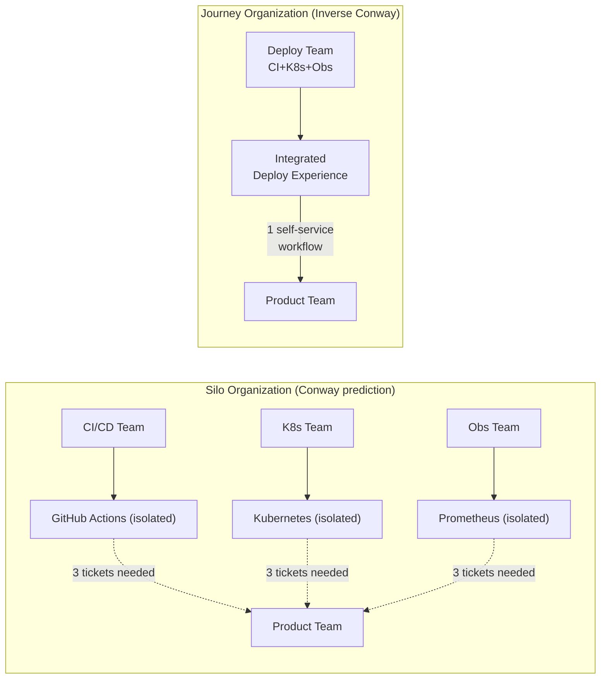
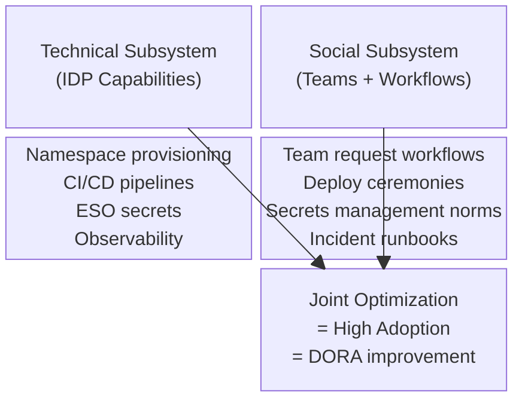

# Platform Engineering - L6 Theory

## Keywords in This File

| # | Keyword | Weight |
|---|---|---|
| 1 | [Conway's Law and Organizational Architecture Theory](#conways-law-and-organizational-architecture-theory) | high |
| 2 | [Sociotechnical Systems Theory](#sociotechnical-systems-theory) | high |

---

# Conway's Law and Organizational Architecture Theory

---
id: PE-028
title: Conway's Law and Organizational Architecture Theory
category: Platform Engineering
difficulty: ★★☆
interview_weight: high
seniority: senior-staff
status: draft
version: 1
---

### 🎯 Model Answer

**30 seconds:**
> Conway's Law: "Organizations which design systems are constrained to
> produce designs which are copies of the communication structures of
> those organizations." In practice: if your organization has separate
> CI/CD, Kubernetes, and observability teams, your platform will have
> three disconnected tools with poor integration. The Inverse Conway
> Maneuver: deliberately restructure teams to produce the system
> architecture you want.

**3 minutes:**
> Conway's Law is not a suggestion - it is a predictive model. The
> evidence for it is overwhelming: microservices organizations have APIs
> that mirror their team boundaries; monolithic organizations have tightly
> coupled codebases that mirror their centralized architecture reviews.
> The practical implication for platform engineering: the platform's
> architecture will reflect the platform team's internal structure. A
> platform team organized as functional silos (CI/CD team, Kubernetes team,
> observability team) produces a platform that requires product teams to
> coordinate across three platform teams to ship a service.
>
> The Inverse Conway Maneuver says: choose your desired architecture first,
> then organize teams to produce that architecture. If you want a cohesive
> "deploy a service" developer experience, create a team that owns the
> entire deploy experience - from CI pipeline to running service to
> observability - and gives them end-to-end ownership. The architecture
> they produce will be cohesive because the team is.
>
> Modern evidence (Accelerate, 2018): organizations that used the Inverse
> Conway Maneuver showed statistically higher DORA performance than those
> that did not. The causal pathway: team structure enables architecture;
> architecture enables delivery performance.

**Blank Mind Recovery:**

**(1) Restate:** "Conway's Law - the observation that systems mirror the
communication structures of the organizations that build them."

**(2) First principles:** "Teams communicate to coordinate. Communication
creates boundaries and interfaces. Those interfaces appear in the systems
teams build."

**(3) Bridge:** "Conway's Law is why org charts predict system architecture
better than architectural documentation does. If you have seen a monolith
at a company with centralized architecture review and microservices at a
company with autonomous teams - you have seen Conway's Law in action."

---

### 📘 Concept Explanation

**What it is:**
Conway's Law (1968, Melvin Conway) is the observation that the structure
of a designed system will mirror the communication structure of the
organization that designed it. The canonical statement: "Any organization
that designs a system (defined more broadly here than just information
systems) will produce a design whose structure is a copy of the
organization's communication structure."

**The mechanism:**

When two teams build components that must work together, the interface
between the components is defined by what the teams can agree on. The
team interface = the system interface. If the communication between
teams is formal, slow, and documented (as in waterfall organizations),
the system interfaces will be formal and infrequent. If communication
is informal, fast, and continuous (as in same-team), the interfaces will
be tight and frequently updated.

**Implications for platform engineering:**

The platform reflects the platform team:
```
Platform team structure          Platform design outcome
----------------------------------------
3 separate teams:                3 disconnected tools:
  CI/CD team                       Jenkins/GitHub Actions
  K8s team                         Raw Kubernetes manifests
  Observability team               Disconnected Prometheus
  -> Product teams coordinate ->   Teams file 3 tickets to ship

1 unified "deploy" team:         1 cohesive deployment experience:
  Owns CI -> deploy -> observ.     GitOps pipeline to running service
  End-to-end ownership             with auto-provisioned observability
  -> Product teams self-serve ->   Teams deploy in < 1 hour
```

**The Inverse Conway Maneuver:**

Coined by Jonny LeRoy and Matt Simons: "structure teams to match the
desired architecture." Steps:
1. Define the target system architecture (the developer experience you want)
2. Map the system to the team structure that would naturally produce it
3. Restructure teams to match that structure
4. Allow the architecture to emerge from the restructured teams

This is not trivial - organizational restructuring is politically and
personally disruptive. But organizations that do it see the architecture
improve to match the team structure, because the communication paths
that shaped the old architecture have been replaced.

**Evidence from research:**

The Accelerate (2018) study found that organizations that used the
Inverse Conway Maneuver had:
- 3x higher DORA deployment frequency
- 2.5x lower lead time for changes
Compared to organizations that did not deliberately design team structure
to support their desired architecture.

---

### 💻 Code Example

**BAD vs GOOD: Conway's Law in platform team structure**

```yaml
# BAD: Platform organized as functional silos
# Org chart:
#   Platform Engineering
#     Infrastructure Team:  owns Terraform, VPC, IAM
#     Kubernetes Team:      owns cluster management, namespaces
#     CI/CD Team:           owns GitHub Actions runners, pipelines
#     Observability Team:   owns Prometheus, Grafana, alerting
#
# To deploy a new service, a product team must:
#   1. File ticket with Infrastructure Team: "need VPC subnets"
#   2. File ticket with Kubernetes Team: "need namespace"
#   3. Work with CI/CD Team: "need pipeline template"
#   4. Work with Observability Team: "need dashboards"
#
# Total wait: 3-15 business days across 4 teams
# Conway's Law prediction: platform will be 4 disconnected tools
# Outcome: exactly as predicted
```

```yaml
# GOOD: Platform organized by customer journey (Inverse Conway)
# Target architecture: "developer deploys service end-to-end in < 1 hour"
#
# Org chart designed to produce that architecture:
#   Platform Engineering
#     Developer Experience Team: owns service scaffolder, golden path,
#       Backstage portal - end-to-end "new service" journey
#     Deploy and Run Team: owns GitOps (ArgoCD), namespace provisioning,
#       Helm templates, canary deployment - end-to-end "deploy" journey
#     Observe and Secure Team: owns observability stack, policy as code,
#       secrets management - end-to-end "operate safely" journey
#
# Conway's Law prediction: platform will have 3 cohesive,
#   well-integrated capability sets matching the 3 journeys
# Outcome: product teams can deploy a new service end-to-end
#   by interacting with a single self-service workflow
```

> **Code walkthrough:** The contrast illustrates Conway's Law mechanically:
> functional silo organization produces disconnected tools (each team
> builds their silo well but integration is poor). Journey-based
> organization produces cohesive experiences (each team owns an entire
> user journey end-to-end, so the interfaces within a journey are
> internal to the team and can be evolved freely). The key insight:
> the architecture in the GOOD example would be impossible to produce
> with the BAD org structure, because no single team owns the full
> deploy journey and therefore no team has the incentive to make the
> cross-component integration seamless.

---

### 📊 Diagram

```
CONWAY'S LAW EFFECT ON PLATFORM ARCHITECTURE

Org Structure        ->   System Architecture

[CI/CD Team]         ->   [GitHub Actions]
     |                         |
[K8s Team]           ->   [Raw Kubernetes]  <- disconnected
     |                         |
[Obs Team]           ->   [Prometheus]
                              |
                     Product team: "file 3 tickets"

vs.

[Deploy Team]        ->   [GitOps + Namespace + Observability]
  owns: CI + K8s + Obs       integrated, self-service
                     Product team: "run one command"
```



> **Diagram walkthrough:** The two architectures in the diagram are not
> the result of different architectural decisions - they are the result
> of different org structures. The silo organization cannot produce the
> integrated architecture even if individual architects want to: no single
> team has the authority and context to integrate across CI/CD, Kubernetes,
> and observability. The journey organization produces integration naturally
> because one team owns all three components of the deploy journey. The
> org structure determines the architecture; architecture decisions are
> downstream.

---

### 🎓 Answers by Seniority

**Junior / Mid:**
> Conway's Law says that the systems we build mirror how our teams are
> organized. If the platform team is split into a CI team, a Kubernetes
> team, and a monitoring team, the platform will have three separate
> tools that don't work together well. The fix is to organize the
> platform team around the developer experience you want to create, not
> around the technologies you use.

---

**Senior / Staff:**
> Conway's Law is predictive, not prescriptive: it tells you what
> architecture your current organization will produce, not what
> architecture you should have. The prescriptive corollary is the
> Inverse Conway Maneuver: start with the target architecture, then
> design the team structure that will produce it.
>
> For platform engineering specifically: the Accelerate research validated
> that organizations using the Inverse Conway Maneuver had 3x better
> DORA deployment frequency. The causal pathway is: team structure enables
> end-to-end ownership; end-to-end ownership enables technical cohesion;
> cohesion enables fast, reliable deployment. Functional silos break each
> link in that chain.

---

### ⚠️ Common Misconceptions

**Misconception: "We can design around Conway's Law with good architecture docs."**

Architecture documents describe intentions. Conway's Law describes
the emergent outcome of communication structures. Teams build what
they can coordinate on - and coordination is constrained by communication
paths. If the CI/CD team and Kubernetes team have a formal interface
(ticket system, quarterly planning), they will produce a formal interface
in the system, regardless of what the architecture document says.
Conway's Law is not about intentions; it is about the mechanics of how
systems emerge from communication patterns.

---

### 🚨 Failure Modes and Diagnosis

**Failure mode: Platform team reorganizes into functional silos
after initial cohesive structure due to growth**

Symptom: platform team of 12 reorganizes into sub-teams by technology
(Kubernetes team, CI/CD team, observability team) because "we need
specialization." 6 months later: product teams are back to filing
multi-team tickets.

Diagnosis: the reorganization violated the Inverse Conway Maneuver.
The specialization gained (deeper Kubernetes expertise) was offset by
the coordination cost created (product teams crossing team boundaries).

Fix: reorganize into end-to-end capability teams. Allow specialization
within a team (Kubernetes specialist on the Deploy team) without
fragmenting team ownership of the full developer journey.

---

### 🎯 Interview Deep-Dive

**Timing:** Medium ★★☆ - 9 questions minimum.

---

#### Q1 - What is Conway's Law and why is it relevant to platform engineering?

Conway's Law (1968): "Organizations which design systems are constrained
to produce designs which are copies of the communication structures of
those organizations."

Relevance to platform engineering: the platform team's internal
communication structure determines the platform's architecture.
Functional silos (CI/CD, Kubernetes, Observability as separate teams)
produce disconnected tools. End-to-end journey teams produce cohesive
developer experiences.

The practical implication: before designing the platform architecture,
design the platform team structure. The architecture will follow the
team structure, not the design document.

*What separates good from great:* Citing the Accelerate research on
the Inverse Conway Maneuver: organizations that deliberately structured
teams to match desired architecture had statistically higher DORA
performance than those that did not. Conway's Law is not theoretical -
it has been validated against organizational performance outcomes.

---

#### Q2 - What is the Inverse Conway Maneuver?

The Inverse Conway Maneuver (Jonny LeRoy, Matt Simons): deliberately
structure teams to produce the desired architecture, rather than allowing
architecture to emerge from existing team structure.

Process:
1. Define target architecture (the developer experience you want)
2. Map what team structure would naturally produce that architecture
3. Restructure teams accordingly
4. Allow architecture to emerge

Example: target architecture = "developer deploys service in < 1 hour
self-service." Team structure to produce it: one team that owns the
full deploy journey (CI -> deployment -> observability auto-provisioning).
Do NOT create separate CI team, Kubernetes team, and observability team -
that structure would produce three disconnected tools.

*What separates good from great:* Acknowledging the political cost of
organizational restructuring. The Inverse Conway Maneuver requires moving
people, changing reporting structures, and disrupting existing team
identities. Leadership support is required. Platform teams that cannot
get organizational restructuring support must compensate with strong
API contracts between functional teams - but this is harder and produces
worse outcomes than the Inverse Conway Maneuver itself.

---

#### Q3 - How does Team Topologies extend Conway's Law?

Team Topologies (Matthew Skelton, Manuel Pais, 2019) operationalizes
Conway's Law into a set of four team types and three interaction modes.

**Four team types:**

Stream-aligned teams: small, long-lived teams aligned to a value stream
(product or service area). Most teams in an organization. Responsible
for end-to-end delivery.

Enabling teams: specialists who help stream-aligned teams adopt new
capabilities. Temporary engagement; do not build permanent dependencies.

Complicated subsystem teams: own a particularly complex component that
requires specialist knowledge (e.g., a custom ML inference engine).

**Platform teams:** provide internal services to stream-aligned teams,
reducing their cognitive load.

**Three interaction modes:**

Collaboration: two teams work closely together for a limited period
(high bandwidth but high cognitive load; temporary).

X-as-a-Service: one team provides a service that another team consumes
via API (low bandwidth, scalable). The IDP is an X-as-a-Service model.

Facilitating: an enabling team helps a stream-aligned team adopt a
new capability (one-directional knowledge transfer).

**Team Topologies for platform engineering:**

The IDP platform team is a Platform Team interacting with product teams
via X-as-a-Service. This means: the platform exposes self-service APIs
and golden paths; product teams consume them without requiring collaboration
or coordination with the platform team. This is the Conway-optimal
structure: the platform's architecture reflects the self-service API
model because the team interaction mode is X-as-a-Service.

*What separates good from great:* Understanding that X-as-a-Service
interaction mode is the target, but many platform teams actually operate
in Collaboration mode (product teams and platform teams work closely
together for each deployment). This is neither scalable nor Conway-optimal.
The transition from Collaboration to X-as-a-Service is the maturity journey
of a platform team.

---

#### Q4 - How do you apply Conway's Law to diagnose platform problems?

Conway's Law as a diagnostic: if the platform has an integration problem
(two components work individually but poorly together), look for the
team boundary that produced that interface.

Example: CI/CD pipeline and Kubernetes deployment have a poor integration
(developer must manually coordinate between them). Conway's Law prediction:
these components are owned by different teams with infrequent, formal
communication.

Diagnostic question: "Who owns the CI/CD pipeline? Who owns the
Kubernetes deployment? When did these two teams last meet to improve
the integration between their systems?"

If the answer is: "different teams, last met in quarterly planning" -
the Conway's Law diagnosis is confirmed. The integration is poor because
the communication creating it is infrequent and formal.

Fix options:
1. Inverse Conway Maneuver: merge the teams under one owner
2. Improve the interface contract: establish a clear API between the
   CI/CD and Kubernetes systems; formalize the interface so it can evolve
   more rapidly
3. Increase communication frequency: embed a CI/CD team member in the
   Kubernetes team (or vice versa) for the integration period

*What separates good from great:* Using Conway's Law diagnostically
as a first step when debugging platform integration problems, rather
than jumping to technical solutions. A poor API between two platform
components is 50% a technical problem (the API is poorly designed) and
50% an organizational problem (the teams producing the API have poor
communication). Fixing only the technical part without fixing the
organizational part means the API will continue to diverge over time.

---

#### Q5 - What is the evidence base for Conway's Law?

Conway's original paper (1968, "How Do Committees Invent?") was
theoretical. Subsequent empirical evidence:

**Nagappan, Murphy, Basili (2008):**
Microsoft study: software dependency structure predicted organizational
coupling. Teams that communicated more frequently produced more
tightly coupled software (supporting Conway's Law bidirectionally).

**MacCormack, Rusnak, Baldwin (2012):**
Compared open-source (distributed, low-communication teams) vs. closed-source
(centralized, high-communication teams) projects. Open-source projects
had more modular architectures (because distributed teams must communicate
through formal interfaces). Closed-source projects had more tightly coupled
architectures (because teams could communicate informally without defining
formal interfaces). Direct evidence for Conway's Law.

**Accelerate (Nicole Forsgren, Jez Humble, Gene Kim, 2018):**
Organizations using the Inverse Conway Maneuver showed significantly
higher DORA performance. Validated the prescriptive corollary: designing
team structure for architecture produces measurably better outcomes.

*What separates good from great:* Knowing the specific research when
discussing Conway's Law in an interview. Saying "studies show Conway's
Law is real" is vague. Citing Accelerate (which is widely read in
engineering leadership) establishes specific evidence that the interviewer
can verify.

---

#### Q6 - How does Conway's Law affect platform API design?

The platform API design mirrors the platform team structure. Two scenarios:

Scenario 1 - Fragmented API (functional silo platform team):
- CI/CD API: managed by CI/CD team
- Kubernetes API: managed by K8s team
- Observability API: managed by Obs team
- Product teams call 3 APIs to deploy one service
- Conway's Law: 3-team structure -> 3-API platform

Scenario 2 - Cohesive API (journey-based platform team):
- Deploy API: single endpoint that orchestrates CI+K8s+Obs
- Product teams call 1 API to deploy one service
- Conway's Law: 1-team-per-journey -> 1-API-per-journey

The practical implication: you cannot design a cohesive Deploy API
if the team responsible for it is three teams. The API will reflect
the three-team structure regardless of design intent. Conway's Law
determines the API structure through team boundary mechanics.

*What separates good from great:* Applying this insight to API review:
when reviewing a platform API that is unnecessarily complex or requires
multiple calls for a single logical operation, ask "how many teams
touch this?" If the answer is > 1, the API complexity is likely
organizational, not technical. The fix is organizational (team structure)
not technical (API refactor) - or at least, the technical fix will
regress unless the organizational cause is also fixed.

---

#### Q7 - How do you use the Inverse Conway Maneuver to design a new platform team?

A new platform team is an opportunity to apply the Inverse Conway
Maneuver from the start.

**Process:**

Step 1: Define the target developer experience.
Write the "press release" for the IDP from the perspective of a product
engineer: "Using the IDP, I can go from idea to production in under
1 hour. I never file a ticket with the platform team. I can see the
status of my service, its logs, and its dependencies in a single portal."

Step 2: Map the developer journey.
What steps does a developer take? (New service setup -> CI pipeline ->
namespace provisioning -> secrets configuration -> deploy -> observe)
Group adjacent steps into logical phases.

Step 3: Map phases to teams.
Each logical phase group becomes one team. Aim for 3-5 teams maximum
(more than 5 creates coordination overhead that violates Conway's Law
in the opposite direction - too many teams creates too many interface
points).

Step 4: Define team APIs.
What does each team expose to product teams? What does each team expose
to other platform teams? Define these APIs before staffing the teams;
the APIs constrain what each team owns.

Step 5: Staff the teams.
Hire/assign engineers to the teams according to the structure. The
team structure, once established, will produce the architecture you
designed it to produce.

*What separates good from great:* Resisting the pressure to organize
by technology (the "Kubernetes team" vs. the "CI team" split is
natural when hiring specialists). Technology-based team structures
produce technology-based architectures (fragmented tools). Journey-based
team structures produce journey-based architectures (cohesive experiences).
The hiring challenge: journey-based teams need engineers who can work
across CI/CD, Kubernetes, and observability within one team.

---

#### Q8 - What happens to Conway's Law when platform teams grow large?

As platform teams grow (from 8 to 30+ engineers), Conway's Law creates
new challenges:

When the platform team grows from 8 to 20 engineers, it naturally splits
into sub-teams. If those sub-teams are organized by technology (Kubernetes
team, CI team, Observability team), Conway's Law predicts that the platform
architecture will fragment. The cohesive experience built by the original
8-person team will be gradually replaced by 3 disconnected systems.

**Growth-safe team structures:**

Structure 1: Feature teams within the platform (maintain journey ownership)
- Deploy Journey team (8 engineers)
- Observe and Secure team (6 engineers)
- Developer Experience team (6 engineers)
Each team owns an end-to-end journey; Conway's Law produces cohesive
experiences per journey.

Structure 2: Platform and developer experience layer teams
- Platform Core (infrastructure primitives) - technical depth
- Developer Experience (golden paths, portal) - user-facing
Each layer has a well-defined API; Conway's Law produces a two-layer
architecture with a clear interface.

**What to avoid:**

Do NOT split into: CI team + K8s team + Obs team + Security team +
Portal team. This creates 5 teams with overlapping responsibilities,
unclear interfaces, and a platform that requires product teams to
understand the internal structure of the platform to accomplish
anything.

*What separates good from great:* Treating team growth as an architectural
event that requires deliberate Inverse Conway Maneuver application.
"We need to split into sub-teams" is simultaneously a team health decision
and an architectural decision. Making it without applying the Inverse
Conway Maneuver produces architecture fragmentation.

---

#### Q9 - How does Conway's Law apply to microservices architecture?

Conway's Law predicts microservices from organizational structure:
organizations with autonomous teams (each team owns a business capability
end-to-end) will naturally produce microservices (small, independently
deployable services that mirror business capability boundaries).

**The evidence:**

Amazon's "two-pizza team" rule (teams small enough to be fed by two
pizzas) predicts Amazon's microservices architecture. The team boundaries
(small, autonomous, business-capability-aligned) produced service
boundaries that match.

Netflix's team structure (multiple autonomous teams, each owning a
specific product experience or infrastructure capability) predicted
Netflix's fine-grained microservices architecture.

**The converse:**

Organizations with centralized architecture review and functional team
structures (all DBAs in one team, all front-end engineers in another)
produce monolithic systems. The monolith's tight coupling reflects
the tight coupling between engineering functions.

**Implication for platform engineering:**

Platform teams that adopt microservices architectures internally should
verify their team structure supports it. A platform team of 8 that
builds 40 microservices will have high per-service ownership diffusion:
each engineer "owns" 5 services and has context on none of them deeply.
Conway's Law: an 8-person team with high microservice count will produce
poorly maintained services.

Practical recommendation: small platform teams (< 15 engineers) should
have larger services with clear ownership (3-5 core services). As the
team grows, service decomposition can follow the team decomposition.

*What separates good from great:* Using Conway's Law bidirectionally:
not just "team structure produces architecture" but "given this team
structure, what architecture will naturally emerge and be maintainable?"
The second direction is the predictive use of Conway's Law as a design
tool.

---

---

# Sociotechnical Systems Theory

---
id: PE-029
title: Sociotechnical Systems Theory
category: Platform Engineering
difficulty: ★★☆
interview_weight: high
seniority: senior-staff
status: draft
version: 1
---

### 🎯 Model Answer

**30 seconds:**
> Sociotechnical Systems (STS) theory holds that organizations are
> composed of two interdependent subsystems: the social (people, roles,
> teams, culture) and the technical (tools, processes, technology). Neither
> can be optimized independently - changing the technical system without
> the social system produces poor outcomes, and vice versa. For platform
> engineering: deploying a new IDP without addressing the social changes
> it requires (team structures, workflows, incentives) is why IDP programs
> fail despite technically excellent platforms.

**3 minutes:**
> Sociotechnical Systems theory (Trist and Bamforth, 1951) emerged from
> coal mining studies that showed that introducing new technology without
> redesigning the social system around it produced worse outcomes than
> the old technology with the old social system. The new technology was
> simply imposed on an unchanged social system, which was not designed
> to use it effectively.
>
> Applied to platform engineering: the IDP is the technical system. But
> the social system - how teams are organized, what workflows they use,
> what behaviors are incentivized - determines whether the technical system
> delivers value. A technically excellent IDP deployed into an organization
> where product teams are incentivized to build their own infrastructure
> (because they own their own reliability SLAs) will not be adopted.
> The incentive structure (social system) outweighs the technical quality
> of the platform.
>
> The practical implication: every platform engineering investment requires
> a corresponding social system change. Deploying self-service namespace
> provisioning (technical change) requires also changing the social expectation
> that teams file tickets for namespaces (social change). Failing to change
> the social system means teams continue filing tickets even though the
> self-service capability exists.

**Blank Mind Recovery:**

**(1) Restate:** "Sociotechnical Systems theory - the principle that
organizations have both social and technical dimensions that must be
designed together."

**(2) First principles:** "Tools and people are both systems. Both
need to be designed to work together. A tool designed without considering
how people will use it, and a team structured without considering the
tools they use, both fail to achieve their potential."

**(3) Bridge:** "Sociotechnical Systems theory is why 'just install the
software' never works. Every tool change requires a workflow change,
a training change, and an incentive change. Platform engineers who
deploy tools without designing the surrounding workflow are doing
sociotechnical half-work."

---

### 📘 Concept Explanation

**What it is:**
Sociotechnical Systems (STS) theory is an organizational theory that
treats organizations as having two interdependent subsystems: the
social subsystem (people, roles, teams, values, norms, communication
patterns) and the technical subsystem (tools, technologies, processes,
workflows). The core principle: optimizing one subsystem without
considering the other produces suboptimal outcomes. Joint optimization
of both is required for high performance.

**Origins:**
Eric Trist and Kenneth Bamforth (1951) studied coal mining in the UK.
New coal cutting machines (technical change) were introduced into existing
mine social structures (teams, roles, division of labor). The result:
worse productivity and higher absenteeism than the old manual methods.
The machines were technically superior; the social system that surrounded
them was not redesigned to use them effectively. The key finding: the
new technology required different social structures to realize its potential.

**Application to platform engineering:**

Every IDP capability has a social system dimension:

| Technical Change | Required Social Change |
|---|---|
| Self-service namespace provisioning | Change team workflow: file request -> run CLI/UI |
| Policy as code (automated compliance) | Change security team workflow: manual review -> exception handling |
| GitOps deployment | Change deploy workflow: run script -> git push |
| Self-service observability | Change ops workflow: ops team sets up dashboards -> team self-serves |
| Incident auto-remediation | Change on-call workflow: manual intervention -> policy override |

STS principle: the technical change and the social change must be
deployed together. Deploying the technical change alone leaves the
social system unchanged; teams will find workarounds to continue
operating the old way.

**STS design principles:**

Minimum critical specification: specify only what is essential; leave
teams freedom in HOW they implement the what. Applied to IDP: specify
security baselines and deployment contracts; do not specify every
workflow detail. Teams have autonomy within the specification.

Multi-skilling: enable team members to perform multiple functions.
Applied to platform: platform engineers who understand both infrastructure
and developer experience produce more cohesive platforms. Product teams
that understand the IDP deeply become self-sufficient.

Boundary management: the IDP-product team boundary should be designed
to minimize coordination overhead. Applied to IDP: the platform API
should be self-documenting and self-service; teams should not need to
coordinate with the platform team for routine operations.

**STS failure mode in platform engineering:**

The most common STS failure: deploying the developer portal (Backstage)
without changing how teams document their services. The portal is deployed
(technical change). Teams continue to maintain documentation in Confluence
(social system unchanged). The portal is empty. "We built the portal
but nobody is using it" - this is an STS failure, not a technical failure.

The fix: simultaneously deploy the portal AND change the social expectation
("new services must have TechDocs in Backstage; Confluence is deprecated
for service documentation").

---

### 💻 Code Example

**BAD vs GOOD: STS failure and fix in IDP adoption**

```python
# BAD: Technical deployment without social system change
# Platform team delivers:
#   - ESO-based secrets management (replaces manual kubectl secrets)
#   - Documentation: "use ESO, see the wiki"
#   - No workflow change communicated
#   - No incentive change
#
# Result: 3 months later, 40% of teams still use kubectl secrets.
# Root cause: the social system was not changed.
#   - Team workflow: engineer creates secret manually (unchanged)
#   - Team incentive: no consequence for using old method (unchanged)
#   - Team knowledge: most engineers did not read the wiki (unchanged)
#   - Team norms: "we do it this way because that's how we've always done it"
#
# The technical capability exists; the social system blocks adoption.
```

```python
# GOOD: STS-aware IDP adoption program

ADOPTION_PROGRAM = {
    "technical_change": {
        "capability": "ESO secrets management",
        "what_changes": "Secrets are now in Vault, pulled by ESO.",
        "golden_path_docs": "docs.internal/secrets",
        "migration_tool": "scripts/migrate-secrets.sh",
    },
    "social_changes": {
        "workflow_change": {
            "old": "kubectl create secret generic my-secret --from-literal=...",
            "new": "define ExternalSecret CR referencing Vault path",
            "how_communicated": [
                "Team lead sync: 30-min walkthrough for each team",
                "Lunch-and-learn demo in all-hands",
                "Updated onboarding runbook for new engineers",
            ]
        },
        "incentive_change": {
            "positive": "Teams on ESO get automatic secret rotation for free.",
            "negative": "Manual kubectl secrets will trigger a security finding "
                        "in the monthly security report after [date].",
        },
        "norm_change": {
            "action": "Update team-of-teams tech radar to 'ADOPT: ESO secrets'",
            "expectation": "New services MUST use ESO from [date]",
            "existing_services_deadline": "[date + 6 months]",
        },
        "capability_change": {
            "training": "30-min self-paced lab in internal LMS",
            "office_hours": "Weekly 30-min ESO Q&A with platform team",
            "documentation": "TechDocs in Backstage with step-by-step guide",
        }
    }
}

def adoption_program_checklist(program: dict) -> list[str]:
    """
    Verify that a platform capability rollout addresses both
    technical and social system dimensions.
    """
    checks = []

    tech = program["technical_change"]
    social = program["social_changes"]

    if not tech.get("golden_path_docs"):
        checks.append("FAIL: No golden path documentation")
    if not social.get("workflow_change", {}).get("how_communicated"):
        checks.append("FAIL: Workflow change not communicated")
    if not social.get("incentive_change"):
        checks.append("FAIL: No incentive change (adoption will be slow)")
    if not social.get("norm_change"):
        checks.append("FAIL: No norm/expectation change")
    if not social.get("capability_change", {}).get("training"):
        checks.append("FAIL: No training provided")

    if not checks:
        checks.append("PASS: STS dimensions addressed")
    return checks

print(adoption_program_checklist(ADOPTION_PROGRAM))
# ['PASS: STS dimensions addressed']
```

> **Code walkthrough:** The adoption program checklist encodes STS
> theory as an operational checklist: every platform capability rollout
> must address all four social system dimensions (workflow, incentive,
> norm, capability). The checklist surfaces the most common failure mode
> early: "we built the capability and wrote documentation" covers the
> technical change and partially covers the capability change, but leaves
> workflow, incentive, and norm change unaddressed. The GOOD example
> shows each social dimension explicitly addressed: the old and new
> workflow documented, a positive incentive (automatic rotation) and
> negative incentive (security finding), a norm expectation (new services
> must use ESO), and training resources.

---

### 📊 Diagram

```
SOCIOTECHNICAL SYSTEMS IN PLATFORM ENGINEERING

TECHNICAL SUBSYSTEM     SOCIAL SUBSYSTEM
+------------------+   +------------------+
| IDP Capabilities |   | Teams + Workflows |
|                  |   |                  |
| Namespace prov.  | <-> Team request flow|
| CI/CD pipelines  | <-> Deploy workflow  |
| ESO secrets      | <-> Secrets workflow |
| Observability    | <-> Incident process |
| Developer portal | <-> Docs norms       |
+------------------+   +------------------+
      |                        |
      v                        v
   Joint Optimization = High Adoption
   (Both subsystems designed together)

   Technical only = Low Adoption
   (Platform built; teams still work the old way)
```



> **Diagram walkthrough:** The STS diagram makes the bidirectional
> relationship explicit: neither the technical nor the social subsystem
> alone determines outcomes. Joint optimization - deliberately designing
> both subsystems to work together - is the condition for high adoption
> and DORA improvement. Each IDP capability has a corresponding workflow
> in the social subsystem; the technical and social components must change
> in parallel. When only the technical component changes (typical platform
> deployment), teams adapt their social system around the new tool using
> old norms, often resulting in workarounds that preserve old behaviors.

---

### 🎓 Answers by Seniority

**Junior / Mid:**
> Sociotechnical Systems theory says that organizations have both a
> technical side (tools and technology) and a social side (people,
> teams, workflows, and culture), and both need to be designed together.
> For platform engineering, this means: deploying a new capability is
> not complete when the technical deployment is done. You also need to
> communicate the workflow change, update team onboarding, and create
> the incentive for teams to adopt the new approach.

---

**Senior / Staff:**
> STS theory is the theoretical foundation for understanding why technically
> excellent platforms fail to get adopted. The social system (team workflows,
> incentives, norms, knowledge) is at least as important as the technical
> system (the IDP capabilities) in determining adoption outcomes. A platform
> team that only delivers technical capabilities is doing half the work.
>
> The operational implication: every platform capability release needs
> a parallel social system release: updated documentation, workflow change
> communication, incentive alignment, and expectation setting. I use a
> four-check adoption readiness model: Has the workflow change been
> communicated? Has an incentive been created? Has a norm/expectation
> been set? Has training been provided? If any of the four is missing,
> the capability will have low adoption regardless of technical quality.

---

### ⚠️ Common Misconceptions

**Misconception: "If we build a better platform, teams will adopt it."**

Technical quality is necessary but not sufficient for adoption. STS
theory predicts that adoption requires both technical quality AND social
system changes. Teams have existing workflows, norms, and incentives
that were designed around the old technical system. These do not
automatically update when the technical system changes. The social
system must be explicitly redesigned in parallel with the technical
system. Building a better platform and waiting for adoption is the
most common platform engineering strategy failure.

---

### 🚨 Failure Modes and Diagnosis

**Failure mode: Developer portal deployed; nobody populates it**

Symptom: Backstage is deployed with 5 services in the catalog. Six months
later: still 5 services (the 5 the platform team added manually). Product
teams are not registering their services.

STS diagnosis:
- Technical system: Backstage is deployed, works correctly
- Social system: teams have no workflow that includes registering services
  in the portal, no incentive to register (it does not benefit them today),
  and no norm that says services should be in the portal

Fix (social system changes):
1. Workflow change: add "register service in Backstage" to the new service
   checklist in the engineering wiki
2. Incentive change: services not in the catalog are not eligible for
   the self-service deployment workflow (only catalog services can use
   the full IDP)
3. Norm change: "all services must be in the catalog by [date]" announced
   in all-hands
4. Capability change: 10-minute self-paced lab on registering a service
   in Backstage, linked from the onboarding guide

*What separates good from great:* Recognizing developer portal low
adoption as an STS problem, not a technical problem. The typical response
to "nobody is using Backstage" is to add more features to Backstage.
This is the wrong response. The problem is not that Backstage lacks
features; it is that the social system has not been redesigned to use
Backstage. STS theory directs the fix at the social system, not the
technical system.

---

### 🎯 Interview Deep-Dive

**Timing:** Medium ★★☆ - 9 questions minimum.

---

#### Q1 - What is Sociotechnical Systems theory and why does it matter for IDP adoption?

STS theory (Trist, 1951): organizations are composed of two
interdependent subsystems - social (people, teams, culture, workflows)
and technical (tools, technology, processes). Neither can be optimized
independently; joint optimization of both is required for high performance.

For IDP adoption: the IDP is the technical subsystem. The social
subsystem includes how teams are organized, what workflows they follow,
what behaviors are incentivized, and what norms govern how they work.
Deploying the IDP (technical change) without changing the social
subsystem (how teams actually work) produces low adoption because the
social system continues to operate as if the old technical system is
in place.

*What separates good from great:* Connecting STS theory to a specific
adoption failure you have seen or experienced. Abstract theory without
a concrete example is not credible in an interview. "I have seen this
with [specific capability] - we deployed it but adoption was low until
we also [social change]" demonstrates that you understand the theory
and apply it in practice.

---

#### Q2 - What are the four social system dimensions that must change when deploying a new IDP capability?

Four dimensions derived from STS theory:

1. **Workflow change:** how does the day-to-day process change?
   "Before: run kubectl apply manually. After: git push triggers GitOps."
   This must be explicitly communicated - engineers do not automatically
   adopt new workflows without instruction.

2. **Incentive change:** what makes teams want to use the new capability?
   Positive incentives: new features only available on new system.
   Negative incentives: old system gets reduced support SLA.
   Without incentives, teams have no reason to change their workflow.

3. **Norm change:** what becomes the organizational expectation?
   "New services must use the ESO golden path from [date]."
   "All services must have TechDocs in Backstage by [date]."
   Norms create social accountability; incentives create individual motivation.

4. **Capability change:** do teams have the knowledge to use the new capability?
   Training, documentation, office hours, and onboarding updates.
   Knowledge gaps create friction that inhibits adoption even when
   workflow, incentive, and norm are addressed.

*What separates good from great:* Being able to diagnose adoption
failures by which dimension was missed. "30% adoption after 3 months"
might be a norm failure (no expectation set), an incentive failure
(no reason to change), a capability failure (teams don't know how),
or a workflow failure (the new workflow is too complex). Different
diagnoses require different interventions.

---

#### Q3 - How does STS theory explain why IDP programs often fail despite good technology?

The STS explanation for IDP program failure:

Hypothesis: "a better IDP platform will be adopted."
STS prediction: adoption depends on both technical quality AND social
system compatibility. A platform that is technically excellent but
incompatible with the social system will not be adopted.

Common social system incompatibilities:

Incentive misalignment:
Product teams are measured on feature delivery velocity. Platform adoption
takes time and creates short-term velocity reduction. If the incentive
system only rewards feature delivery, teams will de-prioritize adoption
even if the platform is good.

Norm conflict:
"We own our infrastructure" is a norm in many product teams. The IDP
standardizes infrastructure across teams. Norm conflict: the IDP
removes team autonomy; teams resist because the IDP violates the norm.

Workflow incompatibility:
The IDP requires a workflow change that is more burdensome than the
existing workflow (in the short term, before the learning curve is
complete). Teams will use the old workflow until the new workflow
feels natural. If the learning curve is never properly supported,
teams stay on the old workflow.

The IDP programs that succeed: technical quality + deliberate social
system redesign (all four dimensions: workflow, incentive, norm, capability).

*What separates good from great:* Identifying which specific social
system dimension explains the failure in a given organization. Generic
"we need better change management" is not useful. "Our teams are
incentivized on feature velocity and have no Q metric for platform
adoption; the incentive system is the blocker" is actionable.

---

#### Q4 - How do you design the social system around a new IDP capability?

Social system design process for a new IDP capability:

Step 1: Define the current social system state.
How do teams currently accomplish the workflow this capability replaces?
What are the existing norms? What are the incentives?

Step 2: Define the target social system state.
What workflow should teams follow after adoption? What norms should
govern this domain? What incentives should drive adoption?

Step 3: Identify the delta.
What social system changes are required to move from current to target?
Use the four-dimension framework: workflow, incentive, norm, capability.

Step 4: Sequence the changes.
Social system changes should be phased:
- Capability changes first (teams need to know how before they can do it)
- Workflow changes second (communicated clearly with old vs. new comparison)
- Incentive changes concurrent with capability launch
- Norm changes after initial adoption evidence (set expectations with evidence)

Step 5: Validate.
After 30 days: measure adoption. Identify which dimension is blocking
adoption. Adjust the social system design.

*What separates good from great:* Treating social system design as an
equal-weight deliverable to technical system design. The platform team's
sprint should include social system change work (documentation, training,
communication) with the same rigor as technical implementation work.
Organizations that separate "platform engineering" (technical) from
"communications and change management" (social) produce suboptimal
outcomes because the two are interdependent.

---

#### Q5 - What is the sociotechnical implication of platform team self-service vs. ticket-based model?

STS framing of self-service vs. ticket-based platform:

Ticket-based model (social system):
- Teams file a ticket to request a platform operation
- Platform team reviews and executes
- Social system: dependency relationship (platform team is a gate)
- Technical system: can be anything, because the platform team operates it
- STS joint optimization: possible, but coordination overhead is high;
  scales poorly with team count

Self-service model (social system):
- Teams use self-service tools to perform platform operations directly
- Platform team builds the tools but does not execute operations
- Social system: autonomy relationship (teams are independent)
- Technical system: must be self-service capable (APIs, CLIs, portal)
- STS joint optimization: technical and social systems are both designed
  for team autonomy; scales linearly with team count

The STS implication: the technical system choice (ticket vs. self-service
API) is a social system choice as well. Ticket-based systems create
dependency norms; self-service systems require and reinforce autonomy norms.
Changing from ticket-based to self-service requires both a technical
change (build the self-service API) and a social change (change the norm
from "I file a ticket" to "I use the self-service workflow").

*What separates good from great:* Understanding that the self-service
vs. ticket debate is often about trust as much as technology. Ticket-
based models can be a form of control (the platform team wants visibility
into what teams do). Moving to self-service requires trusting product
teams to operate within the platform constraints. This is a social system
change (trust norms) that the technical capability change cannot force.

---

#### Q6 - How does STS theory inform the platform team's role in a large organization?

STS theory frames the platform team's role as designing and maintaining
the sociotechnical system (not just the technical system):

Technical system design: architecture, implementation, reliability of IDP capabilities.

Social system design:
- Cognitive load management: design the IDP API to minimize cognitive
  load for product teams (minimum critical specification principle)
- Workflow design: define the developer workflows that the IDP enables
- Norm setting: define what "standard" looks like; enforce through
  policy-as-code and community norms
- Capability building: enable product engineers to be self-sufficient
  on the IDP through training, documentation, and community

**Platform as service vs. platform as community:**

Most platforms are designed as services (technical system: API, tools,
infrastructure). STS theory suggests adding the community dimension:
the platform team actively builds a community of practice around the
platform that collectively stewards the social system (norms, workflows,
knowledge).

The IDP champions program (product engineers who are platform power
users) is a social system design element. Champions spread platform
knowledge, enforce norms among peers, and provide feedback to the
platform team. The technical platform enables the community; the
community sustains the social system.

*What separates good from great:* Building the IDP champions program
as a deliberate social system investment, not an organic side effect.
"Who are the 5 engineers on product teams who know the IDP best and
are passionate about it?" These engineers become the platform team's
social system leverage points. Investing in them (fast support access,
recognition, platform team collaboration) multiplies the platform team's
social system reach without requiring the platform team to grow.

---

#### Q7 - How do you apply STS theory to troubleshoot low platform adoption?

STS adoption troubleshooting:

When adoption is below target, run an STS diagnostic:

Technical system check:
- Is the capability working correctly? (Health check)
- Is the documentation accurate and findable?
- Is the migration path from legacy to IDP reasonable?
- Are there technical errors or friction in the happy path?

Social system check:
- Workflow: do teams know the new workflow? (Ask 3 engineers: "walk me
  through how you would do X using the IDP." If they cannot, workflow
  communication failed.)
- Incentive: is there a reason to change now vs. later? (If no deadline
  and no positive incentive, teams will delay indefinitely.)
- Norm: is there a clear expectation that teams should be using this?
  (If "we recommend" rather than "we expect," the norm is weak.)
- Capability: do teams feel confident using this? (Ask: "on a scale of
  1-5, how confident are you using the IDP for X?" If < 3, capability
  gap is the blocker.)

**Diagnostic conversation:**

"Can you show me how you would use the IDP to [specific task]?"
- If they cannot start: workflow communication failure
- If they start but hit an error: technical system failure
- If they complete but it takes > 10 minutes: friction in UX or workflow
- If they complete quickly but say "but I usually do it the old way":
  incentive or norm failure

*What separates good from great:* Running the diagnostic conversation
instead of collecting survey data. Watching an engineer try to use the
platform for a specific task reveals the actual blocker (not the reported
blocker, which is often "I don't have time to learn it" as a proxy for
something more specific). Observation-based diagnosis is more accurate
than survey-based diagnosis for STS adoption problems.

---

#### Q8 - What is the STS principle of "minimum critical specification" and how does it apply to IDP design?

Minimum critical specification (STS principle): specify only what is
essential; leave people the maximum freedom in HOW they fulfill the
specification. Avoid over-specifying the implementation; specify only
the outcome and the constraints.

Applied to IDP design:

**Over-specified (violates minimum critical specification):**
"Your CI/CD pipeline must use: GitHub Actions with the platform-provided
workflow file, must call the provided security-scan action, must build
using the provided Dockerfile template, must push to the approved registry
using the provided push action, must deploy using the provided ArgoCD
action in exactly this order."

Result: teams either comply (and are frustrated by inflexibility when
their service has legitimate requirements that the template does not
support) or workaround (using a different CI system entirely to avoid
the rigid template).

**Minimum critical specification:**
"Your deployment pipeline must: (1) run the platform security scan action,
(2) push to the approved container registry, (3) deploy via ArgoCD.
How you structure the rest of the pipeline is your choice."

Result: teams comply with the essential requirements (security,
registry, deployment method) and have freedom to implement their
specific testing, building, and validation needs.

**Why this matters for IDP adoption:**

Over-specified platforms create friction for edge cases (every non-trivial
service has edge cases). Teams with edge cases either: (a) adopt the
platform but constantly file change requests, creating bottlenecks; or
(b) do not adopt and build their own solution. Minimum critical
specification reduces both outcomes: edge cases are handled within
team freedom; essential requirements are still enforced.

*What separates good from great:* Understanding that minimum critical
specification requires the platform team to clearly distinguish essential
requirements (what must be true for security, compliance, and operational
consistency) from preferences (what the platform team thinks is the
best way to build a pipeline). The essential requirements become
non-negotiable policy; everything else is recommendation.

---

#### Q9 - How does STS theory explain the relationship between cognitive load and platform adoption?

STS theory predicts: high cognitive load in the technical system produces
compensating behaviors in the social system that reduce the apparent
cognitive load at the cost of effectiveness.

Example:
Platform technical system: high cognitive load (Kubernetes manifests,
Helm charts, ArgoCD configuration, ESO SecretStores, ServiceMonitors).
Social system adaptation: teams designate one engineer as the "Kubernetes
person" who manages all of this. Other engineers do not learn it.

Consequence:
- Knowledge silo: the "Kubernetes person" becomes a bottleneck
- Bus factor: the team cannot operate if this person is out
- On-call pain: incidents involving Kubernetes require the specific person
- Platform adoption: drops when the "Kubernetes person" leaves

The STS fix: reduce technical system cognitive load (that is the platform
team's job - golden paths, self-service, abstraction layers) so that
the social system does not need to create compensating specialization.
When any engineer can use the IDP without being an expert, the team
no longer needs a "Kubernetes person."

*What separates good from great:* Measuring cognitive load as a platform
metric (not just as a feeling). Proxies: number of concepts an engineer
must understand to deploy a service end-to-end (count the unique resource
types, API calls, and tool interfaces); time for a new engineer to deploy
their first production service; support ticket rate per team per week
(high tickets = high cognitive load, teams cannot self-serve). Reducing
cognitive load measured this way is the technical system change that
unlocks the social system benefit of broad, deep platform adoption.
