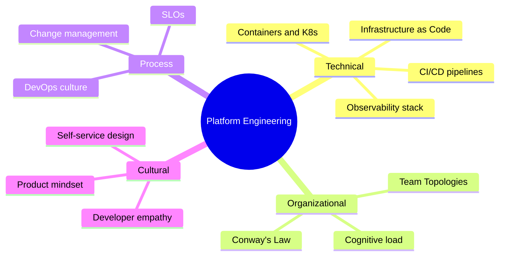
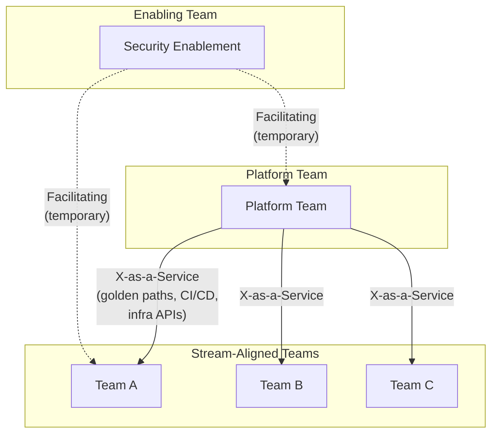

## Keywords in This File
{: .no_toc }

| # | Keyword | Weight |
|---|---|---|
| 1 | [Platform Engineering Prerequisites Map](#platform-engineering-prerequisites-map) | ★☆☆ |
| 2 | [Why DevOps Scaling Fails Without a Platform Team](#why-devops-scaling-fails-without-a-platform-team) | ★☆☆ |
| 3 | [Team Topologies Foundations for Platform Engineering](#team-topologies-foundations-for-platform-engineering) | ★☆☆ |

---

# Platform Engineering Prerequisites Map

**Interview Weight:** ★☆☆ - Orientation keyword that
establishes the mental scaffolding for all subsequent
platform engineering concepts.

---

### 🎯 Model Answer

**30 seconds:**

> Platform engineering sits at the intersection of
> DevOps culture, infrastructure automation, and
> software product management. Before studying it,
> you need three foundations: basic DevOps (CI/CD,
> IaC, containers), understanding of organizational
> scaling problems (why tooling proliferation hurts
> at 50+ engineers), and Conway's Law (team structure
> shapes the platforms organizations build). The
> prerequisites map is a maturity journey: from ad-hoc
> ops, through DevOps, to the platform model.

**3 minutes:**

> Platform engineering solves a specific failure mode
> that appears when DevOps scales beyond roughly 20-50
> engineering teams. To understand why it exists,
> prerequisites span three dimensions.
>
> Technical prerequisites: CI/CD fundamentals (Jenkins,
> GitHub Actions, ArgoCD), infrastructure as code
> (Terraform, Pulumi), containerization (Docker,
> Kubernetes basics), and observability (metrics, logs,
> traces). Without these, platform engineering feels
> abstract - a layer over tools you have never operated.
>
> Organizational prerequisites: Conway's Law - the
> software you build mirrors how your teams communicate.
> The DevOps paradox at scale - DevOps works brilliantly
> for small organizations but creates compounding
> duplication at 50+ engineers. Every team maintaining
> their own deployment pipeline, security scanning setup,
> and monitoring stack creates the "DevOps tax" that
> platform engineering addresses.
>
> Mindset prerequisites: the product mindset shift -
> platform teams that treat engineers as customers,
> measure developer NPS, and build self-service
> products succeed. Teams that operate as ticket queues
> fail. Developer experience as a discipline prepares
> you to design from the customer perspective rather
> than the infrastructure provider perspective.
>
> The non-obvious thing: organizational and cultural
> prerequisites matter as much as technical ones. Most
> platform engineering failures are organizational,
> not technical.

**Blank Mind Recovery:**

**(1) Restate:** "What do I need to understand before
studying platform engineering - let me map the
knowledge domains."

**(2) First principles:** "Platform engineering
industrializes DevOps tooling. To understand it,
I need DevOps fundamentals, plus the organizational
reasons those tools break at scale."

**(3) Bridge:** "Think of learning microservices: you
first need monoliths, then why they break, then why
microservices emerged. Platform engineering is the
same pattern applied to developer tooling and team
structure."

---

### 📘 Concept Explanation

**What it is:**

A mental map of the knowledge domains - technical,
organizational, and cultural - that make platform
engineering concepts immediately understandable
rather than abstract. The map transforms platform
engineering from "another tool wrapper" into a
recognized solution to experienced problems.

**The problem it solves:**

Without context, platform engineering concepts
feel like unnecessary complexity on top of tools
that already work. Engineers with the prerequisites
recognize platform engineering as the systematic
answer to problems they have personally felt: slow
onboarding, inconsistent pipelines, tribal DevOps
knowledge, and the cognitive tax of maintaining
infrastructure alongside product code.

**How it works:**

```
Prerequisites Map:

TECHNICAL LAYER
  CI/CD (GitHub Actions, Jenkins, ArgoCD)
  IaC (Terraform, Pulumi, Crossplane)
  Containers (Docker, Kubernetes basics)
  Observability (Prometheus, Grafana, ELK)

PROCESS LAYER
  DevOps fundamentals (culture, practices)
  SLOs and error budgets
  Change management at scale

ORGANIZATIONAL LAYER
  Conway's Law
  Cognitive load theory
  Team Topologies (stream-aligned, platform)

CULTURAL LAYER
  Developer empathy
  Product mindset for internal tools
  Self-service and golden path thinking
```



> **Diagram walkthrough:** The mindmap shows platform
> engineering as a convergence point of four knowledge
> domains. Most engineers enter through the Technical
> branch (they already know CI/CD). The Organizational
> branch (Conway's Law, Team Topologies) is where most
> platform initiatives succeed or fail. The Cultural
> branch (product mindset) determines whether the
> platform gets adopted. All four domains must be
> activated for a platform team to deliver sustained
> value.

**The key insight:**

Platform engineering is not a technology - it is an
organizational pattern with technology implementation.
Engineers who approach it purely from the technical
layer miss the 70% of platform work that involves
team dynamics, adoption, and organizational design.
The most common platform engineering failure is
technically excellent infrastructure that engineers
refuse to use because it was designed without developer
empathy.

**When to use it:**

Use this map as a learning roadmap when approaching
platform engineering from scratch, or as a gap
analysis when joining a platform team. It also serves
as an interview signal detector: which prerequisites
does the interviewer emphasize most reveals what kind
of platform team you are joining.

**When NOT to use it:**

Do not treat this as a mandatory sequential learning
path. Engineers with strong SRE or distributed systems
backgrounds may prioritize the organizational
prerequisites over additional technical study.
Start where your gaps are, not at the beginning.

**Alternatives:**

- DORA capabilities framework - outcome-focused
  alternative to the prerequisites map
- The DevOps Handbook - process-focused foundation
  for the DevOps prerequisite layer
- CNCF landscape - technology-focused orientation map
  for the technical prerequisite layer

**First-principles derivation:**

Platform engineering addresses tooling proliferation
(each team maintaining its own CI/CD, security, and
observability stack). The prerequisites must therefore
cover: (a) what those tools do (technical), and (b)
why their proliferation is harmful at scale
(organizational). Neither dimension alone is
sufficient - a technically fluent engineer who
misunderstands organizational dynamics will build
a beautiful platform that nobody uses.

---

### 💻 Code Example

*(Omit: Platform Engineering Prerequisites Map is
an organizational orientation concept with no
programmable API. The "code" for this domain is
the human conversation that aligns a platform team
around its customers and purpose.)*

---

### 🎓 Answers by Seniority

**Junior / Mid (0-5 years):**

> "Before platform engineering makes sense, I need
> to understand DevOps fundamentals - CI/CD, IaC,
> containers. Then I need to understand why those
> tools become a problem at scale, when every team
> maintains their own versions. Platform engineering
> is the organizational response to that scaling
> problem."

*Push deeper:* "The non-obvious prerequisite is
Conway's Law - the platforms your organization builds
will mirror your team structure. Understanding that
unlocks why platform teams are organized as separate
enabling teams, not embedded DevOps resources."

---

**Senior / Staff (5+ years):**

> "The technical prerequisites are table stakes -
> most engineers joining platform teams already have
> CI/CD, IaC, and Kubernetes exposure. The harder
> prerequisites are organizational: Conway's Law
> fluency, an understanding of cognitive load as a
> metric, and the product mindset shift from 'I build
> infrastructure' to 'I have internal customers whose
> productivity I am responsible for.'
>
> Platform engineering initiatives fail most often
> not from technical shortcomings but from teams
> that treat it as a DevOps rebrand rather than a
> distinct product discipline. The prerequisite for
> success is organizational alignment, executive
> sponsorship, and a funded dedicated team - not a
> better Helm chart."

*Push deeper:* "At staff level, I add a fourth
prerequisite: change management. Platform adoption
is a behavioral change for hundreds of engineers.
The platform team that understands how to drive
adoption (documentation, migration support, clear
golden paths, feedback loops) outperforms the team
that builds technically superior tooling but assumes
adoption will be organic."

---

### ⚠️ Common Misconceptions

**Misconception: "Platform engineering is just
DevOps with a new name."**

DevOps is a cultural and practice movement - everyone
responsible for their own operations. Platform
engineering is an organizational response to DevOps
scaling: a dedicated product team builds shared
infrastructure so stream-aligned teams can self-serve
without becoming DevOps experts. Platform engineering
enables DevOps to scale; it does not replace it.

---

**Misconception: "You need Kubernetes expertise
before studying platform engineering."**

Kubernetes knowledge is useful context but not
required. Many platform engineering concepts apply
equally to teams not using Kubernetes. The essential
prerequisites are organizational (Conway's Law,
cognitive load, Team Topologies) and process
(DevOps culture, SLOs). Technical prerequisites
can be learned alongside the organizational ones.

---

**Misconception: "Platform teams are just ops
teams with a better name."**

Traditional ops teams own infrastructure and create
tickets. Platform teams build self-service products
and empower stream-aligned teams to own their
infrastructure without tickets. The distinction is
who does the work: ops teams do it for you; platform
teams enable you to do it yourself. This organizational
difference is the core of the prerequisites gap most
engineers have.

---

### 🚨 Failure Modes and Diagnosis

**Failure: Platform initiative started without
organizational prerequisites**

*Symptom:* Platform team builds excellent tooling,
adoption stays below 20%, stream-aligned teams
continue using their own pipelines.

*Root cause:* Platform team was formed from DevOps
engineers without product mindset training. No
customer discovery, no user research, no adoption
strategy. The team built what they thought engineers
needed, not what engineers actually wanted.

*Fix:* Before writing a line of platform code,
conduct user interviews with 10 stream-aligned
engineers. Map their top five pain points. Prioritize
the platform roadmap by pain severity, not by
technical interest.

---

**Failure: Platform team spends 12 months building
before launching**

*Symptom:* First release is comprehensive but
receives negative feedback because it does not match
actual developer workflows.

*Root cause:* Team lacked the product mindset
prerequisite. Built in isolation without iterative
user feedback. By the time the platform launched,
the internal customer landscape had changed.

*Fix:* Ship a minimal viable platform (MVP) at 3
months. A single golden path for the most common
deployment pattern. Gather feedback. Iterate. The
organizational prerequisite to validate is: does
the team know how to run a product discovery cycle?

---

### 🎯 Interview Deep-Dive

| Seniority | Time | Focus |
|---|---|---|
| Junior | 3 min | Identify the prerequisite domains |
| Mid | 5 min | Why organizational prerequisites matter |
| Senior | 7 min | How to assess platform readiness |

---

**[JUNIOR] Q1 - [CONCEPTUAL] What knowledge domains
does a platform engineer need coming in?**

Platform engineering draws from four knowledge
domains. Technical: CI/CD systems, infrastructure
as code (Terraform or Pulumi), container orchestration
(at least Kubernetes basics), and observability
stacks (Prometheus, Grafana, or equivalent).
Process: how DevOps works in practice, what SLOs
and error budgets are, and how change management
works at scale. Organizational: Conway's Law (team
structure shapes system architecture), Team Topologies
(the four team types and their interaction modes),
and cognitive load theory (why too many tools
slow engineers down). Cultural: how to treat internal
engineers as customers, how to design self-service
products, and how developer experience differs from
system reliability.

Most engineers joining platform teams arrive with
strong technical prerequisites and gaps in the
organizational and cultural domains. Those gaps
are where most platform initiatives fail.

*What separates good from great:* Explicitly naming
the organizational and cultural domains alongside
technical ones. The interviewer is testing whether
you treat platform engineering as a technology
problem or as a sociotechnical problem.

---

**[MID] Q2 - [TRADE-OFF] Why do organizational
prerequisites matter as much as technical ones?**

Technical expertise builds the platform. Organizational
expertise determines whether the platform gets adopted.

A technically excellent platform with poor organizational
alignment fails for predictable reasons: (1) No
user research - the team builds what it thinks
engineers need, not what they actually use. The
result is a capable platform with 20% adoption.
(2) No executive sponsorship - platform migration
requires stream-aligned teams to change workflows.
Without organizational pressure and incentives,
teams choose the path of least resistance (their
existing tools). (3) No product roadmap - without
customer discovery cycles, the platform diverges
from what developers actually need over time.

The organizational prerequisites solve these problems
before they happen. A platform team that understands
Conway's Law will design their team structure to
maximize communication with their customers. A team
with product mindset will run user interviews before
building. A team with cognitive load awareness will
measure developer productivity, not just uptime.

The trade-off: investing time in organizational
prerequisites delays initial tooling delivery but
dramatically increases the probability that what
is eventually built gets adopted and sustained.

*What separates good from great:* The specific
connection between organizational prerequisites and
platform adoption rate. Framing adoption as the
primary metric reorients the discussion from "did
we build it?" to "are engineers using it?"

---

**[MID] Q3 - [COMPARISON] How does platform
engineering fit in the DevOps maturity journey?**

DevOps maturity is often modeled in stages: (1) ad-hoc
ops - developers throw code over the wall, ops
team handles everything manually; (2) DevOps adoption -
teams own their deployments, CI/CD is implemented,
everyone learns infrastructure; (3) DevOps at scale
scaling crisis - with 30+ teams, the DevOps model
creates duplication and cognitive load; everyone
builds their own pipelines, inconsistency grows,
junior engineers cannot ramp up without deep ops
training; (4) platform engineering response - a
dedicated platform team absorbs shared infrastructure
concerns, provides golden paths, enables stream-aligned
teams to deploy without deep ops expertise.

Platform engineering is stage 4. It does not make
stages 1-3 unnecessary - it emerges from and depends
on the organizational learning that happened in
stages 2-3. Organizations that try to implement
platform engineering before achieving DevOps basics
(CI/CD, IaC, monitoring) will build platforms for
a tooling reality that does not exist yet.

*What separates good from great:* Understanding that
platform engineering requires DevOps maturity as a
prerequisite, not as an alternative. Citing specific
organizational signals (team count, duplicate tooling,
ramp-up time) that indicate readiness for stage 4.

---

**[SENIOR] Q4 - [DEBUGGING] What happens when a
platform team lacks organizational prerequisites?**

Observable symptoms within 6-12 months of formation:

Platform adoption stays below 30%. Stream-aligned
teams continue using their own pipelines, create
workarounds for platform limitations, and route
around the platform for "urgent" work. The platform
team interprets this as immaturity in the stream
teams, not as a product-market fit failure.

The platform backlog accumulates "architectural
improvements" rather than developer pain points.
The team is building what it finds technically
interesting, not what its customers need. Engineers
report that the platform "doesn't support our
use case" or "requires too much configuration."

The platform team creates ticket queues for
configuration changes, defeating the self-service
premise entirely. The word "exception process"
appears in platform documentation.

Root cause: The team was staffed with infrastructure
engineers who were not given product management
training, customer discovery time, or KPIs tied
to adoption. They defaulted to building technically
because that is what they knew how to measure.

Diagnosis: Review the platform team's OKRs. If
their metrics are infrastructure-oriented (uptime,
pipeline execution time, cost) rather than developer-
oriented (adoption rate, onboarding time, engineer
NPS), the organizational prerequisite gap is confirmed.

*What separates good from great:* Diagnosing from
observable symptoms, not just naming the prerequisite
gap. The ticket queue symptom is a specific tell.

---

**[SENIOR] Q5 - [PRODUCTION] How do you assess
whether an organization is ready for platform
engineering?**

Four readiness signals to evaluate before investing
in a platform team:

(1) Scale signal: at least 15-20 stream-aligned teams
(or 50+ engineers) experiencing shared tooling pain.
Below this threshold, a centralized DevOps guild or
embedded SREs is more efficient than a dedicated
platform team.

(2) Duplication signal: count the number of distinct
CI/CD pipeline definitions across teams. More than
five significantly different pipelines in an organization
is a platform signal. Also count observability stack
variants, deployment mechanisms, and secrets management
approaches.

(3) Ramp-up signal: how long does it take a new
engineer to make their first production deployment?
More than two weeks indicates platform need.

(4) Cognitive load signal: ask stream-aligned engineers
to list their top five distractions from feature
development. If more than two items involve infrastructure
configuration or platform tooling, organizational
readiness exists.

If all four signals are positive, the organization
has sufficient pain to justify platform investment
and sufficient scale to make the investment worthwhile.

*What separates good from great:* Giving concrete
thresholds (15-20 teams, 5+ pipeline variants, 2
weeks to first deployment) rather than vague
"when things feel painful." Interviewers who push
back with "but we only have 10 teams" are testing
whether you know the scale prerequisite.

---

**[STAFF] Q6 - [ARCHITECTURE] How does Conway's
Law shape the prerequisite assessment?**

Conway's Law states: organizations design systems
that mirror their communication structures. For
platform engineering, this means the IDP you build
will reflect the organizational structure that builds
it, for better or worse.

The prerequisite implication: before designing a
platform, map the organization. If stream-aligned
teams communicate primarily within siloed business
units (e.g., payments team never talks to identity
team), the platform will end up with disconnected
domains that mirror those silos. If the platform
team sits organizationally distant from its users
(e.g., buried in IT rather than Engineering), the
platform will optimize for IT governance metrics
(compliance, cost) rather than developer productivity
metrics.

The inverse Conway maneuver (from Team Topologies)
is the prescription: deliberately design your
organizational structure to produce the system
architecture you want. If you want a unified IDP
with coherent golden paths, create a platform team
that has broad visibility across all stream-aligned
teams, has a direct escalation path to engineering
leadership, and runs regular developer experience
forums where all teams are represented.

The prerequisite assessment question: "What is the
current organizational communication structure, and
does it support the platform architecture we want
to build?" If the answer requires organizational
change, platform engineering must be preceded by
organizational design.

*What separates good from great:* Applying Conway's
Law not as a constraint but as a design tool. The
inverse Conway maneuver framing shows architectural
thinking applied to organizational design, not just
software architecture.

---

**[MID] Q7 - [TRADE-OFF] What is the cost of
starting platform engineering too early vs too late?**

Starting too early: at fewer than 15 teams, the
platform team spends most of its time on edge cases
for a handful of users. The cost of maintaining
platform abstractions exceeds the value of removing
duplication because there are not enough teams to
amortize the platform overhead. Engineers on the
platform team feel underutilized. Stream-aligned
teams feel over-governed.

Starting too late: with 40+ teams all maintaining
their own tooling, the organizational change
required to migrate to a shared platform is enormous.
Teams have built local expertise in their custom
pipelines. The platform team must overcome both
technical migration costs and organizational inertia.
The longer the delay, the higher the adoption
challenge.

The optimal window: 15-30 stream-aligned teams,
significant duplication visible, ramp-up time above
two weeks, senior engineering leaders with platform
authority and budget. This window has enough pain
to justify the investment and enough organizational
flexibility to change team behaviors.

*What separates good from great:* Framing platform
engineering as an organizational investment with
a return that depends on scale. Not a technology
decision - a business timing decision.

---

---

# Why DevOps Scaling Fails Without a Platform Team

**Interview Weight:** ★☆☆ - Explains the core
problem platform engineering solves, asked in
every introductory platform engineering interview.

---

### 🎯 Model Answer

**30 seconds:**

> DevOps works for small teams but fails at scale
> because of compounding duplication: every team
> builds its own CI/CD pipeline, security scanning
> setup, secrets management, and observability stack.
> At 30+ teams, engineers spend more time maintaining
> infrastructure tooling than writing product code.
> Onboarding takes weeks instead of hours. The
> platform team emerges to absorb this shared
> infrastructure work and provide it as self-service
> golden paths, so product teams can focus on features.

**3 minutes:**

> In the early DevOps model, teams own their
> deployments end to end. This is the right answer
> at small scale - 5-10 teams, each deploying
> a handful of services. The cognitive load of
> understanding your own deployment infrastructure
> is manageable. The duplication across teams is
> acceptable because there are not many teams.
>
> At 30-50 teams, the model breaks in three ways.
>
> Duplication tax: 30 teams each maintaining a
> Dockerfile, a CI/CD pipeline, a Terraform module
> for their deployment environment, a log aggregation
> configuration, and a secrets access pattern. That
> is 30 copies of the same work, each slightly
> different, each needing maintenance when the
> underlying tools change. When a critical CVE
> appears in a base Docker image, 30 teams each
> need to update independently.
>
> Cognitive load explosion: junior and mid-level
> engineers on each team need enough infrastructure
> knowledge to maintain all of this. The interview
> pipeline narrows because candidates without
> DevOps experience cannot ramp up in the required
> timeframe. Engineers with product ambitions spend
> 30% of their time on infrastructure maintenance.
>
> Inconsistency tax: 30 pipelines each configured
> slightly differently means 30 different approaches
> to compliance, security scanning, deployment
> approval gates, and environment promotion strategies.
> Audits are expensive. Security posture is uneven.
>
> The platform team solves all three: builds the
> shared infrastructure once, provides it as self-
> service, ensures compliance by default, and frees
> product teams to focus on delivering features.

**Blank Mind Recovery:**

**(1) Restate:** "Why does the DevOps model fail
at scale? Let me walk through what happens when
you have 30 teams all following DevOps practices."

**(2) First principles:** "DevOps requires every
team to handle infrastructure. With 5 teams, that's
fine. With 50 teams, it means 50 copies of every
infrastructure pattern, each maintained separately
and each slightly wrong."

**(3) Bridge:** "Think of microservices: they work
brilliantly but at scale you need a service mesh
and API gateway to manage cross-cutting concerns.
Platform engineering plays the same role for
deployment and infrastructure cross-cutting concerns."

---

### 📘 Concept Explanation

**What it is:**

The set of organizational and technical failure
modes that emerge when you scale DevOps across a
large engineering organization without a dedicated
platform team to manage shared infrastructure
concerns.

**The problem it solves:**

In pure DevOps, every stream-aligned team owns
its infrastructure. This creates autonomy and
accountability but at scale creates duplication,
inconsistency, and cognitive overload. The failure
modes are predictable and measurable - they appear
above a roughly consistent threshold of 15-30 teams.

**How it works:**

```
DEVOPS AT SMALL SCALE (5-10 teams):
  Team A: [code] + [CI/CD] + [infra] + [ops]
  Team B: [code] + [CI/CD] + [infra] + [ops]
  Each team maintains own stack.
  Duplication: low. Overhead: manageable.

DEVOPS AT LARGE SCALE (30+ teams):
  Team A:  own Dockerfile, pipeline, Terraform,
           alerts, secrets, compliance scanning
  Team B:  own Dockerfile, pipeline, Terraform,
           alerts, secrets, compliance scanning
  ...
  Team 30: own Dockerfile, pipeline, Terraform,
           alerts, secrets, compliance scanning

  When base image has CVE: 30 manual updates
  When audit happens: 30 different postures
  Onboarding: 2-4 weeks of ramp-up per team
  Junior engineers: blocked without DevOps training
```

**Three failure modes in detail:**

**Duplication tax:** N teams doing N copies of
identical infrastructure work. The cost grows
linearly with team count. For a 30-team org,
the total infrastructure maintenance work done
across all teams could be done by 3 dedicated
platform engineers. Instead, 30 teams each have
one engineer spending 20% of their time on it.
The cost is 6 FTE-equivalents vs 3 FTE-equivalents -
but the 6-FTE version produces 30 inconsistent
implementations.

**Onboarding bottleneck:** Every new engineer must
learn not just the product codebase but the
deployment pipeline, infrastructure configuration,
secrets management, and monitoring setup for their
specific team. Teams build tribal knowledge
("ask Sarah about the deployment process"). This
knowledge does not transfer between teams. Time-
to-first-deployment exceeds two weeks.

**Compliance and security drift:** 30 pipelines
with 30 different security scanning configurations.
Some teams run SAST on every commit; some run it
weekly; some skip it. Some teams have secrets
rotated monthly; others have secrets unchanged for
two years. The first compliance audit reveals the
extent of the drift.

**The key insight:**

DevOps scaling failure is not a technology problem -
it is an organizational cost accounting problem.
The costs of duplication, cognitive load, and
compliance drift accumulate invisibly in individual
team velocity, onboarding time, and audit prep work.
They only become visible as aggregates when a CISO
audits the organization or an executive notices
that engineering velocity is not improving despite
headcount growth.

**When to use it:**

Use this framing when advocating for a platform
team investment. The scaling failure modes are the
business justification. They translate to: reduced
FTE cost (3 dedicated platform engineers vs 6
FTE-equivalents spread across teams), faster
onboarding (first deployment in 2 hours vs 2 weeks),
and improved compliance posture (enforced by default,
not configured per team).

**When NOT to use it:**

Do not use this argument to justify a platform team
for an organization with fewer than 15-20 teams.
The overhead of maintaining a platform (product
management, adoption support, API versioning) exceeds
the savings when the team count is small. For small
orgs, a DevOps guild or shared templates are more
appropriate.

**Alternatives:**

- DevOps guild model - shared practice community
  instead of dedicated team; works to 20 teams
- Platform engineering lite - a small "paved road"
  team without full product methodology; works to
  30 teams
- Full IDP with golden paths - required at 40+
  teams or in regulated industries at any scale

**First-principles derivation:**

Given N teams each needing the same set of M
infrastructure capabilities, pure DevOps requires
N * M implementations. A platform team requires
M implementations shared across N teams. The
break-even point where the platform overhead cost
equals the duplication savings is approximately
N = 10-15 teams (depending on M and team size).
Below that threshold, duplication is cheaper than
coordination. Above it, coordination is cheaper
than duplication.

---

### 💻 Code Example

**Example 1: The duplication problem (BAD)**

```yaml
# Team A's Dockerfile - hand-crafted
FROM openjdk:17-slim
COPY target/app.jar /app.jar
RUN adduser --disabled-password appuser
USER appuser
EXPOSE 8080
CMD ["java", "-jar", "/app.jar"]

# Team B's Dockerfile - different base, different user
FROM eclipse-temurin:17-jre
WORKDIR /app
COPY build/libs/app.jar .
EXPOSE 8080
ENTRYPOINT ["java", "-jar", "app.jar"]
# No non-root user - security gap
# Different base image - separate CVE lifecycle
```

> **Code walkthrough:** Two teams, two Dockerfiles,
> both "working" but with different security postures
> (Team B runs as root), different base images (separate
> CVE patch cycles), and different configurations.
> At 30 teams, this means 30 CVE lifecycles to track
> when a vulnerability appears in the JRE. Team B's
> root-user misconfiguration is a compliance violation
> that will surface in the next security audit.

**Example 2: The golden path solution (GOOD)**

```yaml
# Platform-provided base image (Dockerfile)
# docs.internal/golden-path/java-service
FROM registry.internal/java-base:17-lts
# Platform team maintains: security patches,
# non-root user, JVM options, health endpoint
# Stream teams inherit: security, compliance,
# optimized JVM settings

# All teams use: FROM registry.internal/java-base:17-lts
# CVE patched once by platform team -> all teams fixed
# Non-root enforced by base image design
# OOMKiller protection set by platform-tuned JVM flags
```

> **Code walkthrough:** The golden path base image
> centralizes all security, compliance, and runtime
> configuration. When a CVE appears, the platform team
> patches `registry.internal/java-base:17-lts` once.
> All teams rebuild from the updated base - one patch,
> N fixes. Stream-aligned teams write `FROM
> registry.internal/java-base:17-lts` and inherit
> correct security posture without understanding
> the underlying requirements. This is the duplication
> tax elimination in code.

**Example 3: Onboarding time comparison**

```bash
# BAD: Pure DevOps onboarding (2 weeks)
# Day 1: Set up local dev environment
# Day 2: Learn team-specific Terraform modules
# Day 3: Get access to team-specific secrets store
# Day 4: Understand team-specific CI/CD pipeline
# Day 5: Debug first deployment failure
# Week 2: First successful production deployment
# Each team has different versions of all of the above

# GOOD: Platform golden path onboarding (2 hours)
# 0:00 - scaffold new service:
npx @internal/create-service my-service \
  --type=java-api --team=payments
# 0:15 - service created with: Dockerfile (golden path),
# CI/CD pipeline (golden path), Terraform (golden path),
# observability (golden path), secrets (configured)

# 0:30 - first deployment:
git push  # triggers golden path CI/CD automatically

# 2:00 - first production deployment complete
# Engineer focused on product code, not infrastructure
```

> **Code walkthrough:** The onboarding comparison
> shows the concrete time cost of DevOps scaling
> failure: two weeks per engineer per team vs two
> hours on the golden path. At an organization hiring
> 50 engineers per year distributed across 30 teams,
> the golden path saves roughly 1,950 engineer-hours
> annually in onboarding alone. The `create-service`
> scaffolding command is the operational definition
> of a golden path - one command, all compliance met,
> all infrastructure configured.

---

### 🎓 Answers by Seniority

**Junior / Mid (0-5 years):**

> "DevOps at scale fails because every team ends up
> maintaining the same infrastructure work independently.
> 30 teams, 30 CI/CD pipelines, 30 Dockerfiles, 30
> Terraform configurations - all slightly different.
> When a base image has a CVE, 30 teams need to update.
> New engineers need to learn each team's specific
> setup instead of a shared golden path. The platform
> team solves this by building shared infrastructure
> once and providing it as self-service."

*Push deeper:* "The cognitive load angle - engineers
who spend 20-30% of their time on infrastructure
configuration are not spending that time on product
features. That's the business cost that makes the
ROI calculation for a platform team positive."

---

**Senior / Staff (5+ years):**

> "DevOps scaling failure has three measurable
> components: duplication tax (N teams doing N copies
> of M infrastructure tasks), onboarding bottleneck
> (tribal knowledge about team-specific pipelines
> rather than shared golden paths), and compliance
> drift (30 different security postures instead of
> one enforced default). These show up as: increasing
> time-to-first-deployment for new engineers, security
> audit findings that span many teams, and a growing
> percentage of engineering time spent on infrastructure
> maintenance relative to feature delivery.
>
> The business case: a 3-person platform team can
> eliminate the duplication work that currently
> consumes the equivalent of 6 FTE across 30 teams,
> while delivering better security posture and faster
> onboarding than any individual team can achieve.
> The break-even point in most organizations is around
> 12-15 teams."

*Push deeper:* "At staff level I add the governance
dimension. In regulated industries (finance, healthcare),
the compliance cost of 30 different security
configurations is not just inefficiency - it is
audit risk. A platform team that enforces secure
defaults can reduce audit preparation time by 60-80%
and eliminate entire categories of compliance findings."

---

### ⚠️ Common Misconceptions

**Misconception: "DevOps means every team should
completely own their infrastructure - platform
teams violate this."**

DevOps means teams own their deployments and
operations - not that they must build all their
own tooling from scratch. Platform engineering
provides the infrastructure capabilities as self-
service products; teams still own their deployment
decisions. The distinction: a centralized ops team
that does deployment for you violates DevOps. A
platform team that provides golden-path tools for
self-service deployment does not.

---

**Misconception: "We don't have a scaling problem
- we only have 12 teams."**

Twelve teams is the warning zone, not a safe
threshold. The duplication and cognitive load costs
are accumulating even if they are not yet visible
as a crisis. The right time to build a platform
team is before the crisis, not during it. A 12-team
organization that waits until 40 teams will face
much higher migration costs when platform adoption
is competing with established team-specific tooling
that has years of embedded tribal knowledge.

---

**Misconception: "A platform team creates a bottleneck
- teams can't deploy without it."**

A correctly designed platform team creates self-service
infrastructure that removes bottlenecks. A poorly
designed platform team (one that creates ticket
queues, requires approval for deployments, or acts
as a gatekeeper) recreates the centralized ops
model with a different name. The design goal is
that engineers never need to contact the platform
team for routine deployments. The platform team's
job is to make itself unnecessary for standard
use cases.

---

### 🚨 Failure Modes and Diagnosis

**Failure: "You build it, you run it" culture
collapses under infrastructure maintenance debt**

*Symptom:* Senior engineers who joined to build
products spend 40%+ of their sprint on infrastructure
work. Feature velocity metrics decline despite
headcount growth. Team retrospectives consistently
surface "too much ops work" as a friction point.

*Root cause:* Pure DevOps model applied to a 40-team
organization without the infrastructure amortization
that a platform team provides. Each team is fully
self-sufficient but at the cost of high infrastructure
overhead per team.

*Diagnosis:* Measure time allocation across product
teams. If engineering time on infrastructure
configuration exceeds 15-20%, the scaling failure
threshold has been crossed.

*Fix:* Form a platform team. Start with the highest-
pain infrastructure area (usually CI/CD or secrets
management). Build a golden path for it. Measure
adoption. Expand from there.

---

**Failure: Base image CVE creates multi-team
incident**

*Symptom:* Security scanner reports a critical CVE
in the base Java or Node.js Docker image. Every
team uses a different base image version. Remediation
requires 30 separate PRs, 30 separate deployments,
coordinated by a single security engineer who has
to chase each team individually. Remediation takes
2-3 weeks instead of hours.

*Root cause:* No shared base image managed by a
platform team. Each team pinned to their own base
image version at different points in time.

*Fix (immediate):* Assign one engineer per team
to update their Dockerfile. Track in a security
dashboard. Set a hard deadline.

*Fix (structural):* Platform team takes ownership
of a curated base image registry. All teams use
FROM registry.internal/base. CVE patched once by
platform team, rebuilt images available in hours,
all teams updated at next scheduled build.

---

### 🎯 Interview Deep-Dive

| Seniority | Time | Focus |
|---|---|---|
| Junior | 3 min | Name the failure modes |
| Mid | 6 min | Quantify costs, describe golden path |
| Senior | 10 min | Business case, ROI, migration strategy |

---

**[JUNIOR] Q1 - [CONCEPTUAL] What are the main
ways DevOps breaks down at scale?**

Three failure modes emerge predictably:

Duplication tax: every team builds its own version
of shared infrastructure components. CI/CD pipelines,
Docker base images, Terraform modules, secrets
management configurations, log shipping configs.
At 5 teams, this duplication is manageable. At 30
teams, it is 30 different implementations, each
slightly wrong in different ways.

Onboarding bottleneck: each team has its own
deployment pipeline with its own tribal knowledge.
New engineers cannot transfer infrastructure knowledge
between teams. Onboarding to a new team requires
learning a new set of infrastructure tools even if
the product technology stack is the same.

Compliance drift: 30 teams configure security
scanning, secrets rotation, and deployment approval
differently. Some teams have every security control
active; others have skipped them for "expedience."
The first compliance audit reveals the full extent
of the inconsistency.

*What separates good from great:* Giving specific
examples for each failure mode rather than abstract
descriptions. "30 different base Docker images"
is a better answer than "inconsistent infrastructure."

---

**[MID] Q2 - [TRADE-OFF] At what team count does
DevOps scaling failure become critical?**

The threshold is roughly 15-20 stream-aligned teams
or 80-100 engineers. Below 15 teams, duplication
costs are manageable and the overhead of maintaining
a platform exceeds the savings. Above 20 teams, the
compounding duplication and cognitive load costs
exceed the platform maintenance overhead.

Two additional triggers that can lower the threshold:
(1) Regulatory requirements - compliance-heavy industries
(finance, healthcare, government) can justify a
platform team at even 8-10 teams because the security
and audit cost of per-team configuration is too
high. (2) High deployment frequency - teams deploying
multiple times per day produce more infrastructure
maintenance work per team than teams deploying
weekly. The scaling threshold is lower for high-
frequency deployment organizations.

The early warning indicators to watch before the
crisis: onboarding time above 2 weeks, more than
5 significantly different CI/CD pipeline definitions
across teams, security audit findings that span
multiple teams, and engineering time on infrastructure
maintenance exceeding 20%.

*What separates good from great:* Giving the
15-20 team threshold with the reasoning behind it
(duplication cost exceeds platform overhead), plus
naming the conditions that lower the threshold.

---

**[MID] Q3 - [DEBUGGING] How do you diagnose
whether an organization has a DevOps scaling
problem?**

Four diagnostic measurements:

(1) Time-to-first-deployment: interview a recent
hire who joined 4-6 weeks ago. How long did it
take them to deploy to production for the first
time? Above 2 weeks = strong signal. Below 2 days =
healthy signal. This is the most actionable single
metric.

(2) Pipeline diversity audit: count distinct CI/CD
pipeline definitions across all teams. Using a
script to grep for Jenkinsfiles, .github/workflows,
or equivalent. More than 5 significantly different
definitions = signal.

(3) Infrastructure time allocation: run a two-week
survey asking engineers to estimate percentage of
time on infrastructure vs product work. Above 20%
infrastructure time across the median team = signal.

(4) CVE remediation speed: check the last critical
CVE in a base Docker image. How long did it take
all teams to apply the fix? Above 2 weeks = signal.
Simultaneous patching impossible without shared
base image = signal.

Each signal individually is suggestive. All four
simultaneously = clear case for platform team.

*What separates good from great:* Giving concrete
measurement approaches (scripts, surveys, time
tracking) rather than "you'll know when you see it."

---

**[SENIOR] Q4 - [ARCHITECTURE] What is the
organizational design that prevents DevOps
scaling failure?**

The Team Topologies prescription: create a
stream-aligned team topology with a platform team
that uses the "X-as-a-Service" interaction mode.

Stream-aligned teams own their service, deploy
independently, and are responsible for runtime.
They have minimal platform obligations: use the
golden path, follow the security policies, stay
within the resource constraints set by the platform.

The platform team operates like an internal product
company. Its customers are stream-aligned teams.
Its products are the golden paths, CI/CD templates,
base images, Terraform modules, and observability
configurations. It maintains versioned APIs for
its products, collects developer feedback, runs
user research, and prioritizes its roadmap based
on developer pain.

The key organizational constraint: the platform
team must be fully dedicated, not a shared
responsibility or a part-time role. "DevOps guild"
models (where platform work is a side responsibility
for engineers in each team) fail because the
platform is de-prioritized when team-level deadlines
hit. The platform team needs protected sprint
capacity for platform work.

*What separates good from great:* The X-as-a-Service
interaction mode and the "internal product company"
framing. These show Team Topologies fluency.

---

**[SENIOR] Q5 - [PRODUCTION] How do you build
the business case for a platform team investment?**

Three business case components, each with metrics:

Cost reduction: calculate the current duplication
cost. N teams * (hours/sprint on infrastructure
configuration). For a 30-team organization with
each team spending an average of 4 hours per sprint
on infrastructure, that is 120 engineer-hours per
sprint. Three dedicated platform engineers can
provide that infrastructure more reliably and
consistently in the same time. At typical senior
engineer cost, the ROI becomes positive within
the first year.

Onboarding acceleration: each week reduction in
time-to-first-deployment has a measurable value
for an organization hiring engineers at scale. A
two-week reduction in onboarding time at 50 hires
per year is 100 engineer-weeks recovered annually.

Risk reduction: the compliance and security risk
of 30 different security postures has a quantifiable
probability of audit finding and associated cost.
A platform team that enforces secure defaults
reduces this risk. In regulated industries, this
component of the business case often exceeds
the others.

Present all three components with data. The CFO
conversation is: "Our current model has N teams
spending X FTE-equivalents on infrastructure.
A 3-person platform team replaces that with
consistent, better infrastructure, saves Y FTE-
equivalents annually, and reduces compliance risk."

*What separates good from great:* Translating
engineering observations (duplication, inconsistency)
into financial terms (FTE cost, compliance risk,
hiring cost). The business case succeeds only when
framed in business language.

---

**[STAFF] Q6 - [TRADE-OFF] What are the risks
of moving to a platform model too quickly?**

Three over-correction risks:

Platform over-engineering: the platform team,
suddenly given headcount and mandate, builds
a comprehensive, highly abstracted platform
before understanding what developers actually
need. The first release is architecturally
impressive but covers none of the top developer
pain points. Adoption fails.

Autonomy erosion: a platform team that is too
opinionated or too restrictive eliminates the
developer autonomy that made DevOps attractive
in the first place. Stream teams that cannot
deploy outside the golden path for any legitimate
reason will route around the platform entirely.

New bottleneck creation: a platform team that
does not build self-service infrastructure and
instead requires tickets for configuration changes
recreates the exact centralized ops bottleneck
that DevOps was supposed to eliminate. The new
name ("platform team") does not change the user
experience.

Mitigations: run user research before building,
enforce a "95% self-service" principle (stream
teams should never need a ticket for the top 95%
of use cases), and give stream teams escape hatches
for the 5% of non-standard requirements. Build the
platform in public with stream team representation
in the roadmap process.

*What separates good from great:* Framing platform
risks as organizational risks (autonomy erosion,
bottleneck recreation) rather than only technical
risks. Shows understanding that platform engineering
is fundamentally a sociotechnical challenge.

---

**[JUNIOR] Q7 - [COMPARISON] How does the platform
model differ from traditional central IT or ops teams?**

Traditional central IT: developers hand work to IT,
IT handles all deployment and infrastructure.
Developers have no deployment autonomy. Change
requests and tickets. Slow releases.

Traditional ops team: similar to central IT but
colocated with engineering. Still a handoff model.
"You build it, ops deploys it." Deploys are someone
else's problem until production.

DevOps model: teams own deployments end to end.
No handoff. Developers deploy their own code. Fast
releases, full accountability. Fails at scale.

Platform model: dedicated platform team provides
self-service infrastructure products. Stream teams
deploy their own code using platform golden paths.
The handoff is eliminated. The cognitive load of
infrastructure configuration is absorbed by the
platform. This gives you the autonomy of DevOps
without the scaling failure.

The key distinction from central IT: platform
teams do not deploy for you, they enable you to
deploy yourself. Self-service is the core design
principle that separates the platform model from
all centralized models.

*What separates good from great:* The "deploy
for you vs enable you to deploy yourself" distinction.
This is the operational definition of the platform
model that separates it from central IT.

---

---

# Team Topologies Foundations for Platform Engineering

**Interview Weight:** ★☆☆ - Fundamental framework
that explains how platform teams are structured and
how they interact with other teams.

---

### 🎯 Model Answer

**30 seconds:**

> Team Topologies is a book by Matthew Skelton and
> Manuel Pais that defines four team types: stream-
> aligned, platform, enabling, and complicated
> subsystem. For platform engineering, the key insight
> is that the platform team exists in a permanent
> X-as-a-Service relationship with stream-aligned
> teams - it builds self-service products that
> reduce the cognitive load on the teams that build
> customer-facing software. The interaction mode
> matters as much as the team type: platform teams
> succeed when they operate as service providers,
> not as gatekeepers.

**3 minutes:**

> Team Topologies provides the organizational blueprint
> that platform engineering builds on. Without it,
> platform engineering is a technology problem. With
> it, it becomes a sociotechnical design problem.
>
> The four team types: Stream-aligned teams deliver
> value directly to customers. They own services,
> deploy independently, and are accountable for
> runtime. Platform teams build and maintain the
> shared infrastructure products that stream teams
> use via self-service. Enabling teams are temporary
> structures that help stream or platform teams
> acquire new capabilities (e.g., a security enabling
> team helping all teams adopt zero-trust). Complicated
> subsystem teams own areas of deep technical
> complexity that other teams should not need to
> understand in detail (e.g., a machine learning
> inference team).
>
> The three interaction modes: Collaboration (two
> teams work closely for a period, then separate),
> X-as-a-Service (one team consumes another's
> service with minimal interaction), Facilitating
> (one team helps another acquire a capability,
> then withdraws). Platform teams operate primarily
> in X-as-a-Service mode - they produce services
> that stream teams consume independently.
>
> The critical metric: cognitive load. Team Topologies
> argues that the primary design constraint for
> team topology is not throughput or cost - it is
> cognitive load. Teams should be sized and scoped
> to handle a cognitive load they can master. The
> platform team's job is to reduce the cognitive
> load on stream-aligned teams by absorbing
> infrastructure complexity into self-service products.

**Blank Mind Recovery:**

**(1) Restate:** "What does Team Topologies say
about how platform teams should be structured?"

**(2) First principles:** "Organizations need teams
that deliver features to customers and teams that
support those delivery teams. Team Topologies names
these stream-aligned and platform teams. The platform
exists to reduce the overhead on the delivery teams."

**(3) Bridge:** "It is like a factory: the production
line workers (stream-aligned teams) need the tools,
materials, and processes (platform team) to do their
work efficiently. The tooling team does not produce
customer products, but without it the production
line slows."

---

### 📘 Concept Explanation

**What it is:**

A framework for designing software engineering
organizations that defines four team types and
three interaction modes to minimize cognitive load,
enable fast flow of change, and reduce coordination
overhead.

**The problem it solves:**

Without an organizational framework, engineering
organizations grow organically and develop ad-hoc
team structures that create coordination overhead,
communication bottlenecks, and cognitive overload.
Team Topologies provides prescriptive vocabulary
and patterns for designing organizations that
reduce these problems.

**How it works:**

```
FOUR TEAM TYPES:

Stream-Aligned Team
  - Delivers value directly to customers
  - Owns: services, deployments, runtime
  - Goal: fast, independent delivery

Platform Team
  - Builds shared infrastructure products
  - Customers: stream-aligned teams
  - Goal: reduce cognitive load via self-service

Enabling Team
  - Helps other teams acquire new capabilities
  - Temporary structure (6-12 months typical)
  - Goal: up-skill and then withdraw

Complicated Subsystem Team
  - Owns deep technical complexity
  - Reduces cognitive load for others
  - Goal: encapsulate specialist knowledge
```

```
THREE INTERACTION MODES:

Collaboration
  Team A <==> Team B (working closely together)
  Use for: discovery, new capability acquisition
  Duration: temporary (2-6 months)

X-as-a-Service
  Team A --[self-service API]--> Team B
  Use for: stable, well-defined interfaces
  Platform team's primary mode with stream teams

Facilitating
  Enabling team ----guides----> Stream team
  Use for: capability transfer
  Duration: until capability is acquired
```



> **Diagram walkthrough:** The diagram shows the
> core Team Topologies structure for a platform
> engineering organization. The Platform Team has
> X-as-a-Service relationships with all stream-aligned
> teams - it provides self-service products that
> teams consume independently without coordination.
> The Enabling Team has temporary Facilitating
> relationships - it helps other teams acquire
> capabilities (like zero-trust security adoption)
> and then withdraws. Note that the Enabling Team
> can also facilitate the Platform Team, helping it
> adopt new practices like chaos engineering or
> progressive delivery. The X-as-a-Service mode is
> the key: it eliminates the coordination overhead
> that would exist if platform-stream interaction
> required meetings and approvals.

**The key insight:**

The interaction mode is as important as the team
type. A platform team that operates in Collaboration
mode (working closely with each stream team to
configure their infrastructure) will scale poorly
- the platform team becomes a bottleneck. A platform
team that operates in X-as-a-Service mode (streaming
teams consume self-service products independently)
scales linearly - 3 platform engineers can serve
30 stream teams.

**When to use it:**

Use Team Topologies vocabulary when designing or
diagnosing engineering organizations. Use it to
justify the organizational structure of a platform
team (why it should not be a centralized ops team),
to explain the interaction mode expectations
(self-service, not ticket queue), and to identify
enabling team needs (temporary capability acquisition).

**When NOT to use it:**

Team Topologies is a framework, not a prescription.
Small organizations (under 10 teams) often do not
need formal team topology design - the coordination
overhead of maintaining formal team types exceeds
the benefit. Apply it when the organization is
large enough that informal structures create
measurable friction.

**Alternatives:**

- Spotify Squad Model - an earlier tribal/chapter/
  guild framework, less prescriptive about
  interaction modes
- Two-Pizza Teams (Amazon) - size constraint
  rather than topology framework
- SAFe (Scaled Agile Framework) - heavyweight
  alternative with more formal coordination
  structures; more overhead than Team Topologies

**First-principles derivation:**

Organizations are communication systems. The speed
of software delivery is bounded by the speed of
organizational communication. Team Topologies
reduces communication overhead by defining clear
interaction modes (especially X-as-a-Service) that
enable teams to work independently without constant
coordination. The platform team's X-as-a-Service
mode is the organizational design pattern that allows
infrastructure improvements to be delivered to N
stream teams without N simultaneous coordination
conversations.

---

### 💻 Code Example

*(Omit: Team Topologies is an organizational
framework with no programmable API. The implementation
is in team charter design, OKR setting, and
communication protocol definition, not in code.)*

---

### 🎓 Answers by Seniority

**Junior / Mid (0-5 years):**

> "Team Topologies defines four team types. Stream-
> aligned teams build products for customers. Platform
> teams build shared infrastructure for stream-aligned
> teams. Enabling teams help other teams acquire new
> skills temporarily. Complicated subsystem teams own
> deep technical complexity. For platform engineering,
> the platform team type is central - it reduces cognitive
> load on stream teams by providing self-service
> infrastructure products."

*Push deeper:* "The interaction modes matter as much
as the team types. The platform team's relationship
with stream teams is X-as-a-Service - stream teams
consume platform products independently without
needing to coordinate with the platform team for
routine use."

---

**Senior / Staff (5+ years):**

> "Team Topologies gives platform engineering its
> organizational vocabulary. The platform team is
> not just a group of people who build infrastructure -
> it is a product team whose customers are internal
> engineers, operating in X-as-a-Service mode so
> stream-aligned teams never need to file tickets
> for standard deployments.
>
> The critical success factor is cognitive load
> management. Team Topologies argues that teams
> should be scoped to handle the cognitive load
> they can master - not more. The platform team's
> job is to absorb infrastructure complexity into
> products so stream teams can deploy confidently
> without deep DevOps expertise. When a platform
> team is poorly scoped (too many responsibilities,
> too many interaction modes simultaneously), the
> cognitive load overflows and quality suffers.
>
> At staff level: the inverse Conway maneuver is
> the prescription. If you want a coherent IDP,
> design the organizational structure first.
> A platform team that spans organizational silos
> will produce a platform that mirrors those silos -
> fragmented and inconsistent."

*Push deeper:* "The Team Topologies sensing
mechanisms (team interaction modes as leading
indicators of architectural health) are a powerful
diagnostic tool. If a platform team is in Collaboration
mode with more than 2-3 stream teams simultaneously,
it is in trouble - Collaboration is a temporary mode
for exploration, and if it becomes the default mode
it signals the platform's self-service capabilities
are insufficient."

---

### ⚠️ Common Misconceptions

**Misconception: "The platform team is the DevOps
team renamed."**

DevOps teams in the old model either embedded DevOps
engineers in each product team or created a central
team that handled deployments for others. Platform
teams are neither. They do not deploy on behalf of
stream teams (that is centralized ops). They do not
embed in stream teams (that is the embedded DevOps
model). They build self-service products that stream
teams use to deploy themselves. The distinction is
"deploy for you" vs "enable you to deploy yourself."

---

**Misconception: "Enabling teams are permanent
structures."**

Enabling teams exist to transfer capabilities and
then dissolve or move on. An enabling team that
becomes permanent signals that either (a) the
capability transfer failed or (b) the capability
is too complex for stream teams to own, in which
case it should become a complicated subsystem team.
If a security enabling team has been "enabling"
for 3 years, it is actually a gatekeeper - a sign
that the governance model is broken.

---

**Misconception: "Team Topologies applies to any
size organization."**

Team Topologies is most valuable for organizations
with 20+ engineering teams where coordination
overhead is a measurable problem. For 5-10 teams,
the framework overhead (formal team type assignments,
interaction mode agreements, cognitive load
assessments) may exceed the benefit. Below 10
teams, informal coordination often works adequately.
Apply the framework when informal structures create
visible friction.

---

### 🚨 Failure Modes and Diagnosis

**Failure: Platform team drifts into Collaboration
mode with all stream teams**

*Symptom:* Platform engineers spend 60%+ of time
in meetings, pair programming sessions, or 1:1
support conversations with stream team engineers.
Platform team backlog is not advancing. Stream teams
report that "the platform team is always busy."

*Root cause:* Platform team built products with
insufficient self-service capability. Stream teams
cannot use the platform independently because the
documentation, golden paths, and abstractions are
incomplete. They require platform team hand-holding
for routine tasks.

*Diagnosis:* Count the average number of platform-
stream collaborative touchpoints per sprint per
stream team. Above 2-3 touchpoints per team for
routine tasks signals Collaboration mode drift.

*Fix:* Platform team enters a "self-service sprint"
focus: documentation, golden path completeness,
better error messages, and CLI tool improvements.
The goal is reducing the collaborative touchpoints
to near zero for routine deployments.

---

**Failure: Cognitive load exceeds team capacity**

*Symptom:* Platform team quality degrades. Security
vulnerabilities are found in platform products.
Documentation falls behind. Response time to
stream team requests increases. Burnout in platform
team.

*Root cause:* Platform team scope expanded without
headcount growth. The team is simultaneously owning:
CI/CD platform, Kubernetes cluster management,
secrets management, developer portal, security
scanning integration, cost management, and incident
response tooling. The cognitive load exceeds what
a team of 5 can master.

*Diagnosis:* Count the number of distinct platform
product areas the team is responsible for. More
than 3-4 distinct areas for a team of 5 = cognitive
overload risk.

*Fix:* Apply Team Topologies scoping principles.
Spin off a complicated subsystem team for the
highest-complexity domain (usually Kubernetes
cluster management). Or create an enabling team
for capability transfer rather than the platform
team owning everything directly.

---

### 🎯 Interview Deep-Dive

| Seniority | Time | Focus |
|---|---|---|
| Junior | 3 min | Four team types, three interaction modes |
| Mid | 6 min | Platform team specifics, cognitive load |
| Senior | 10 min | Org design, inverse Conway, sensing mechanisms |

---

**[JUNIOR] Q1 - [CONCEPTUAL] What are the four
team types in Team Topologies?**

Stream-aligned teams: deliver value to external
or internal customers. They own one or more services,
deploy independently, and are responsible for their
services in production. They are the primary delivery
engine of the organization. Most teams in a healthy
organization are stream-aligned.

Platform teams: build and maintain shared internal
products (the IDP) that stream-aligned teams use
as self-service. Their customers are internal
engineers. They measure success by adoption rate
and developer experience, not by infrastructure
uptime alone.

Enabling teams: temporary structures that help
stream-aligned or platform teams acquire new
capabilities. A security enablement team that helps
all teams adopt zero-trust. Once the capability is
transferred, the enabling team moves on. Duration
is typically 3-12 months for a specific capability.

Complicated subsystem teams: own areas of deep
technical complexity that other teams should not
need to understand. An ML inference team that
owns model serving. A cryptography team that owns
certificate management. Other teams consume their
services without needing to understand the internal
complexity.

*What separates good from great:* The enabling
team's temporary nature and the complicated
subsystem team's cognitive load reduction purpose.
Many candidates describe only the first two types.

---

**[MID] Q2 - [CONCEPTUAL] What are the three
interaction modes and when should the platform
team use each?**

Collaboration: two teams work closely together,
sharing daily communication. Used for discovery
and innovation - when building something new where
requirements are unclear. A platform team uses
Collaboration when a new stream team is onboarding
to the platform for the first time, helping them
configure their first golden path deployment. This
is temporary: once the stream team is onboarded,
interaction shifts to X-as-a-Service.

X-as-a-Service: one team consumes another's service
through a well-defined interface, with minimal
interaction. The consumer does not know or care
how the provider implements the service. This is
the platform team's default mode with all established
stream teams. If a stream team needs to contact
the platform team for a routine deployment, the
platform team's X-as-a-Service interface is broken.

Facilitating: an enabling team helps another team
acquire a capability and then withdraws. Used for
knowledge transfer, not ongoing service delivery.
A platform team may use a short facilitating mode
when introducing a new tool to all stream teams,
running workshops, and then handing off ongoing
use as self-service.

*What separates good from great:* The specific
prescription: platform teams should default to
X-as-a-Service and use Collaboration only during
onboarding and major new capability introductions.
Persistent Collaboration is a warning sign.

---

**[MID] Q3 - [TRADE-OFF] What is cognitive load
and why is it the key design constraint in
Team Topologies?**

Cognitive load is the mental effort required to
hold all the knowledge needed to do a job. Team
Topologies identifies three types: intrinsic
(inherent complexity of the domain), extraneous
(accidental complexity from tools and processes),
and germane (complexity that builds long-term
understanding and expertise).

Platform engineering specifically reduces extraneous
cognitive load on stream teams: the complexity of
setting up CI/CD, configuring secrets management,
instrumenting observability, and managing Kubernetes
deployments. None of this is intrinsic to the
stream team's domain - it is accidental complexity
imposed by the infrastructure environment.

The trade-off: reducing cognitive load on stream
teams requires concentrating it in the platform
team. A platform team that over-abstracts infrastructure
may reduce cognitive load on stream teams but create
cognitive load for itself through abstraction
maintenance, version management, and migration
support. The platform team's cognitive load must
remain within bounds.

The design principle: scope each team to handle
a cognitive load that is challenging but not
overwhelming for a team of 5-8 engineers. If a
team's cognitive load exceeds what a well-staffed
team can master, split the scope.

*What separates good from great:* The three types
of cognitive load (intrinsic, extraneous, germane)
and the specific mapping: platform engineering
reduces extraneous cognitive load on stream teams.

---

**[SENIOR] Q4 - [ARCHITECTURE] What is the inverse
Conway maneuver and how does it apply to platform
teams?**

Conway's Law: organizations design systems that
mirror their communication structures. If your
teams are siloed, your architecture will be siloed.
If your platform team is buried in IT and communicates
poorly with engineering, the platform will be built
for IT governance metrics, not developer experience.

The inverse Conway maneuver: deliberately design
your team structure to produce the architecture
you want, rather than letting the organization
design itself and accepting the architectural
consequences.

For platform engineering: if you want a unified
IDP with coherent golden paths across all product
domains, create a platform team with organization-
wide visibility. The platform team needs: direct
access to all stream-aligned teams for user research,
a seat at the engineering leadership table (so
platform priorities compete fairly with product
priorities), and a charter that crosses all product
domain boundaries.

An organization that creates a platform team buried
in "infrastructure IT" (reporting to the CTO
indirectly, accountable to IT governance metrics,
physically separated from the engineering organization)
will produce a platform that works for IT but
frustrates developers. Conway's Law guaranteed it.

*What separates good from great:* Applying Conway's
Law bidirectionally - not just "our architecture
mirrors our org" but "we can deliberately choose
our architecture by choosing our org structure first."

---

**[SENIOR] Q5 - [DEBUGGING] How do you diagnose
whether a platform team is in the wrong interaction
mode?**

Four diagnostic signals:

Signal 1 - Ticket queue growth: if the platform
team has a growing queue of stream team requests
for configuration changes, environment setups, or
secrets additions, the team is operating as a
centralized ops team, not a platform team. Correct
interaction mode: stream teams self-serve all
routine requests.

Signal 2 - Collaboration overload: if platform
engineers are in collaborative sessions with stream
teams for more than 30% of their sprint capacity,
the platform's self-service layer is insufficient.
Correct interaction mode: X-as-a-Service with
minimal coordination for routine use.

Signal 3 - Adoption metrics: if adoption of the
platform's golden paths is below 60% after 12
months, the platform is not reducing cognitive
load enough for stream teams to prefer it over
their own tooling. Investigate: is the golden path
harder to use than the team's existing approach?

Signal 4 - Platform team capacity: if the platform
team is routinely over capacity and cannot advance
their roadmap, their scope is too large or their
staffing is too small. The platform team needs
a headcount that matches the cognitive load of
the products it maintains.

*What separates good from great:* Quantified
thresholds (30% collaboration overhead, 60%
adoption after 12 months) rather than qualitative
observations. These are measurable signals.

---

**[STAFF] Q6 - [ARCHITECTURE] How does Team
Topologies help justify platform engineering
investment at the executive level?**

Team Topologies provides the organizational design
vocabulary to translate platform engineering from
"we want better CI/CD" to "we are restructuring
team topology to reduce cognitive load and improve
flow."

Three executive-level arguments:

Flow improvement: stream-aligned teams in X-as-a-
Service mode can deploy more frequently because
they do not need to schedule coordination with ops.
The platform reduces the coordination overhead that
is a primary bottleneck to deployment frequency.
This maps to DORA metrics (deployment frequency,
lead time for changes).

Risk reduction: stream teams operating independently
with consistent platform-enforced security policies
have better security posture than teams operating
with individually configured infrastructure. The
platform team is a compliance enforcer by default.

Talent efficiency: by concentrating infrastructure
expertise in the platform team and enabling stream
teams to operate with reduced infrastructure
knowledge requirements, the organization can hire
more product-focused engineers and fewer DevOps
specialists. The platform team multiplies the
productivity of every stream engineer it supports.

*What separates good from great:* Mapping Team
Topologies concepts to business metrics (DORA
metrics, security audit findings, talent cost).
Executive conversations are not won with frameworks -
they are won with metrics.

---

**[JUNIOR] Q7 - [COMPARISON] How does the platform
team differ from an enabling team?**

Platform team: permanent structure that builds
and maintains self-service infrastructure products.
Its relationship with stream teams is ongoing and
operational - stream teams consume platform products
every day for deployments, secrets, and observability.
The interaction mode is X-as-a-Service.

Enabling team: temporary structure that transfers
a specific capability to other teams and then
dissolves or moves on. A security enabling team
that helps all teams adopt mTLS for service
communication. Once teams have the capability,
the enabling team's mission is complete. The
interaction mode is Facilitating.

A platform team that acts like an enabling team
(training stream teams to own their own infrastructure
and then withdrawing) is not a platform team - it
is a DevOps guild. Conversely, an enabling team
that persists indefinitely has either failed to
transfer the capability or the capability is too
complex for stream teams and should be moved into
a platform or complicated subsystem team.

*What separates good from great:* The failure modes:
enabling teams that persist indefinitely (capability
transfer failed) and platform teams that act like
enabling teams (no stable product to consume).
These are common organizational anti-patterns.
