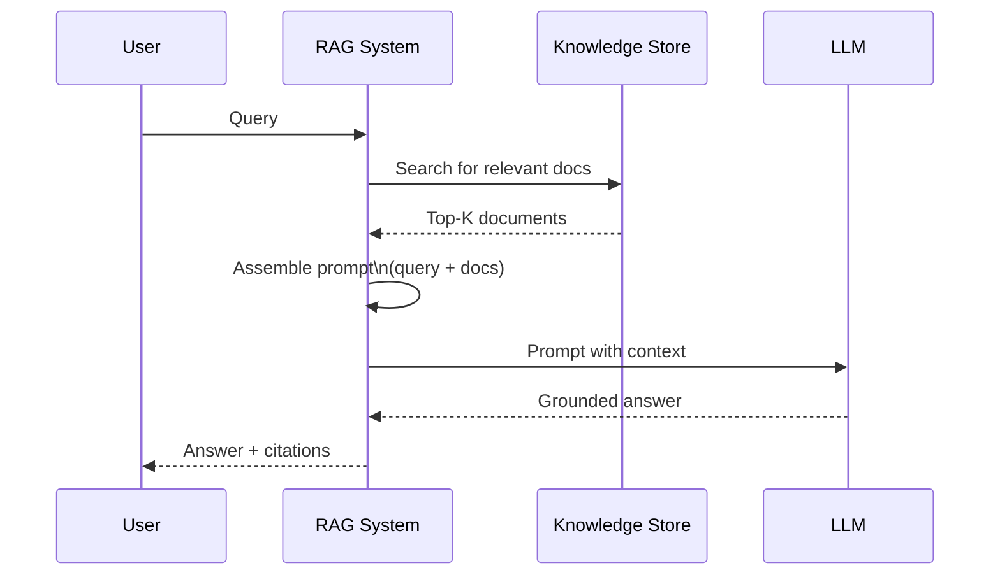
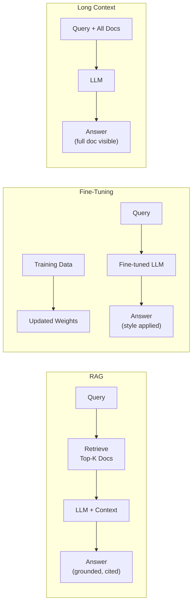
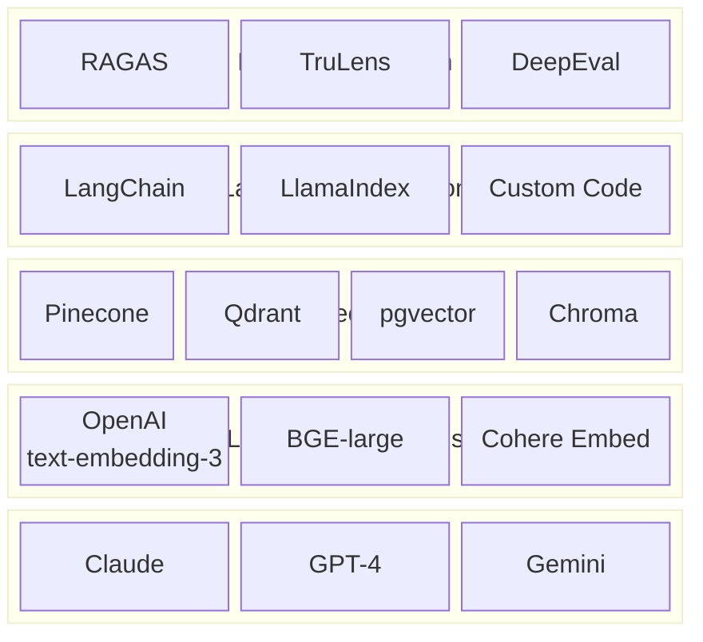

## Keywords in This File
{: .no_toc }

| # | Keyword | Weight |
|---|---|---|
| 1 | [What is RAG](#what-is-rag) | ★☆☆ |
| 2 | [RAG vs Fine-Tuning vs Long Context](#rag-vs-fine-tuning-vs-long-context) | ★☆☆ |
| 3 | [RAG Ecosystem](#rag-ecosystem) | ★☆☆ |

---

# What is RAG

**Interview Weight:** ★☆☆ - The conceptual foundation.
Everyone working with LLMs needs to explain RAG
clearly and concisely.

---

### 🎯 Model Answer

**30 seconds:**

> RAG (Retrieval Augmented Generation) is a pattern
> where, before an LLM generates an answer, relevant
> documents are retrieved from an external knowledge
> store and injected into the LLM's context. The
> LLM then answers based on both its training knowledge
> and the retrieved documents. This solves LLMs'
> three core limitations: knowledge cutoff (can't
> know things after training), hallucination (generating
> plausible but wrong facts), and lack of private
> knowledge (the LLM wasn't trained on your company's
> documents).

**3 minutes:**

> Without RAG: an LLM answers from its training data
> alone. If you ask about a 2024 event, it doesn't
> know. If you ask about your internal policy document,
> it doesn't know. If you ask a complex factual question,
> it may confidently generate a wrong answer.
>
> With RAG: before the LLM generates an answer, the
> system retrieves the most relevant documents from
> your knowledge base (product documentation, company
> policies, recent news, database records) and adds
> them to the prompt. The LLM now has access to current,
> specific, and private knowledge to ground its answer.
>
> The three-step flow: (1) the user asks a question;
> (2) the system retrieves relevant documents from
> the knowledge store; (3) the LLM generates an answer
> using both the retrieved documents and its trained
> knowledge.
>
> Why "augmented": the LLM is still generating (not
> just retrieving). It synthesizes, reasons across
> multiple documents, and explains in natural language.
> Retrieval provides the facts; generation provides
> the coherent answer.

**Blank Mind Recovery:**

**(1) Restate:** "What problem does RAG solve and
how does it work?"

**(2) First principles:** "LLMs are frozen at training.
Your knowledge isn't. RAG connects a fresh knowledge
store to a frozen LLM - the LLM reads your documents
as if they were part of its context."

---

### 📘 Concept Explanation

**What it is:**

RAG is a system design pattern (not a specific algorithm)
that combines: (1) a retrieval system to find relevant
documents, and (2) an LLM to generate grounded answers
from those documents. The pattern was formalized in
the 2020 Facebook paper "Retrieval-Augmented Generation
for Knowledge-Intensive NLP Tasks."

**The RAG flow:**

```
USER QUERY
  |
  v
[Query Encoder]
  Convert query to vector or search terms
  |
  v
[Knowledge Store]
  Retrieve top-K most relevant documents
  (vector database, search index, or both)
  |
  v
[Context Assembly]
  Insert retrieved documents into prompt:
  "Answer based on these documents: [docs]
   Question: [query]"
  |
  v
[LLM Generator]
  Generate grounded answer
  |
  v
ANSWER (with citations to retrieved docs)
```

**What RAG solves:**

```
PROBLEM                   RAG SOLUTION
-------------------       -------------------
Training cutoff           Retrieve fresh documents
                          from your knowledge store

Hallucination             Ground answers in retrieved
                          facts. LLM cites sources.

Private/internal data     Index your documents in the
                          knowledge store. LLM reads them.

Context window limits     Retrieve only relevant docs
                          (not entire corpus)

Compliance/auditability   Every answer has source docs
                          that can be audited
```

**RAG vs. search:**

Search returns documents. RAG generates answers FROM
documents. The LLM reads multiple documents, synthesizes
the relevant information, and produces a coherent
natural language answer - which a search engine cannot.

---

### 💻 Code Example

```python
import anthropic
# Using a simple in-memory document store to illustrate

KNOWLEDGE_BASE = [
    {
        "id": "doc1",
        "content": (
            "Our return policy allows returns within "
            "30 days of purchase with original receipt. "
            "Electronics must be unopened."
        )
    },
    {
        "id": "doc2",
        "content": (
            "Customer service hours: Monday-Friday "
            "9am-5pm EST. Weekend support available "
            "via email only."
        )
    },
    {
        "id": "doc3",
        "content": (
            "Shipping: standard delivery 5-7 days. "
            "Express delivery 2-3 days (+$15). "
            "Free standard shipping on orders over $50."
        )
    }
]

def retrieve_documents(
    query: str, top_k: int = 2
) -> list[dict]:
    """
    Simple keyword-based retrieval (illustrative).
    Production: replace with vector similarity search.
    """
    query_words = set(query.lower().split())
    scored = []
    for doc in KNOWLEDGE_BASE:
        doc_words = set(doc["content"].lower().split())
        overlap = len(query_words & doc_words)
        scored.append((overlap, doc))
    scored.sort(key=lambda x: x[0], reverse=True)
    return [doc for _, doc in scored[:top_k]]

def rag_answer(query: str) -> dict:
    """
    Complete RAG flow:
    1. Retrieve relevant docs
    2. Assemble prompt with retrieved context
    3. Generate grounded answer
    """
    # Step 1: Retrieve
    docs = retrieve_documents(query)

    # Step 2: Assemble context
    context = "\n\n".join([
        f"[Doc {i+1}]: {d['content']}"
        for i, d in enumerate(docs)
    ])

    # Step 3: Generate
    client = anthropic.Anthropic()
    resp = client.messages.create(
        model="claude-haiku-4-5",
        max_tokens=512,
        system=(
            "You are a helpful assistant. "
            "Answer questions based ONLY on the "
            "provided documents. If the answer is "
            "not in the documents, say so. "
            "Always cite which document your "
            "answer comes from."
        ),
        messages=[{
            "role": "user",
            "content": (
                f"Documents:\n{context}\n\n"
                f"Question: {query}"
            )
        }]
    )
    return {
        "answer": resp.content[0].text,
        "retrieved_docs": [d["id"] for d in docs],
        "query": query
    }

# Example
result = rag_answer("How long do I have to return something?")
print(result["answer"])
# "Based on Doc 1, returns are allowed within 30 days
# of purchase with the original receipt. Electronics
# must be unopened."
```

> **Code walkthrough:** The RAG flow has three explicit
> steps. `retrieve_documents` simulates retrieval
> (production: vector similarity search returns the
> top-K semantically relevant documents). The context
> assembly creates a prompt with retrieved documents
> labeled by source. The LLM system prompt instructs:
> answer from documents only, cite sources. This last
> instruction is critical for reducing hallucination:
> the LLM is explicitly constrained to the retrieved
> context. The response includes both the answer and
> which documents were retrieved - enabling auditability
> (you can trace every answer to its source documents).

---

### 🎓 Answers by Seniority

**Junior / Mid:**

> "RAG stands for Retrieval Augmented Generation.
> Before the LLM generates an answer, the system
> retrieves relevant documents from a knowledge store
> and adds them to the prompt. The LLM then answers
> based on those documents. This solves: knowledge
> cutoff (LLM doesn't know recent events), hallucination
> (grounds answers in real documents), and private
> data (LLM can answer from your internal docs)."

---

**Senior / Staff:**

> "RAG is the production pattern for LLM applications
> that need factual accuracy over external or private
> knowledge. The core value proposition is grounding:
> every generated answer traces to retrieved source
> documents, which enables auditability and dramatically
> reduces hallucination. The engineering challenge
> in RAG is not the generation step (that's the LLM)
> but the retrieval step: getting the right documents
> into context. A bad retrieval means the LLM generates
> confidently wrong answers from irrelevant context -
> a worse outcome than no context at all."

---

### ⚠️ Common Misconceptions

**Misconception: "RAG eliminates hallucination."**

RAG reduces hallucination by grounding the LLM in
retrieved documents. It does not eliminate it. The
LLM can still hallucinate when: the retrieved documents
don't contain the answer (the LLM may fabricate one),
the question requires combining information across
retrieved documents in ways the LLM gets wrong, or
the LLM "ignores" the retrieved context and answers
from training data instead. Mitigation: prompt the
LLM to answer only from the provided context and
to say "I don't know" if the answer isn't there.

---

### 🚨 Failure Modes and Diagnosis

**Failure: RAG returns answers not supported by
the retrieved documents**

*Symptom:* The answer cites a document, but the
document doesn't actually support the answer. Or:
the answer contains information not in any retrieved
document.

*Root cause:* The LLM is supplementing retrieved
context with training knowledge. Common when the
query is partially answered by retrieved docs and
the LLM fills in the gaps from its training.

*Diagnosis:* Run the answer through a factual
grounding check: "Is every claim in this answer
supported by the retrieved documents?" (Use a second
LLM call for automated evaluation.)

*Fix:* Add explicit grounding instructions to the
system prompt: "Answer ONLY from the provided
documents. Do not use any knowledge from your
training data. If the answer is not in the documents,
say: 'I don't have information about this in my
knowledge base.'"

---

### 🎯 Interview Deep-Dive

| Seniority | Time | Focus |
|---|---|---|
| Junior | 3 min | Definition, flow, what it solves |
| Mid | 5 min | Implementation, failure modes, tradeoffs |
| Senior | 8 min | Architecture, production considerations |

---

**[JUNIOR] Q1 - What are the three steps in a
basic RAG pipeline?**

(1) Retrieval: the user's query is used to find
    relevant documents from a knowledge store.
    The knowledge store can be a vector database
    (semantic search), a full-text search engine,
    or a combination.

(2) Context assembly: the retrieved documents are
    combined with the original query into a prompt.
    The prompt includes both the question and the
    retrieved context: "Based on these documents,
    answer this question: [query]."

(3) Generation: the LLM reads the assembled prompt
    (query + retrieved context) and generates an
    answer grounded in the retrieved documents.

The distinction from simple LLM Q&A: in RAG, the
LLM has access to fresh, specific documents it wasn't
trained on. Without RAG: the LLM answers from
training data only.

*What separates good from great:* Naming the three
steps with their roles, not just "retrieval then
generation."

---

**[MID] Q2 - What are the key quality metrics for
RAG and what does each measure?**

Faithfulness: does the answer reflect what's in
the retrieved documents? A hallucinated answer that
contradicts the documents has low faithfulness.
Measure: LLM-as-judge checking whether each claim
in the answer is supported by the retrieved docs.

Answer Relevance: does the answer actually answer
the query? Retrieved documents may be relevant
to the topic but the answer may not directly address
the specific question. Measure: cosine similarity
between the question and the answer.

Context Relevance (Recall): did the retrieval step
find the documents needed to answer the question?
If the answer requires information that wasn't
retrieved: low context recall.
Measure: check whether the supporting documents
for the correct answer were in the retrieved set.

Context Precision: are the retrieved documents
relevant to the query, or is there a lot of noise?
Low precision means the LLM's context is polluted
with irrelevant information.
Measure: proportion of retrieved documents that
are relevant to the query.

*What separates good from great:* Distinguishing
context recall and context precision - retrieval
has two dimensions.

---

**[MID] Q3 - [TRADE-OFF] What do you gain and
lose by using RAG vs. a larger context window?**

**RAG GAINS:**
- Scale: can index millions of documents; large
  context can hold only hundreds
- Cost: retrieve only relevant docs (typically
  1,000-5,000 tokens); large context = full corpus
  in context = high token cost
- Freshness: knowledge store can be updated
  independently
- Attribution: every answer traces to retrieved docs

**RAG LOSSES:**
- Retrieval failure risk: if retrieval misses the
  relevant document, the LLM can't answer correctly
- Complexity: the retrieval system itself must be
  built, maintained, and tuned
- Multi-document reasoning: answering questions
  that require integrating information across many
  documents is harder with RAG (you can't retrieve
  all relevant docs)

**Large context GAINS:**
- Simplicity: no retrieval component needed
- Full-document reasoning: entire document corpus
  in context at once
- No retrieval failures: all documents visible

**Large context LOSSES:**
- Cost: O(n) tokens per query (all docs in context)
- "Lost in the middle" effect: LLM attention
  degrades for information in the middle of
  very long contexts
- Not scalable: context window is finite

Decision: use RAG for large, dynamic knowledge
bases. Use large context for small, stable document
sets where you can afford the token cost.

*What separates good from great:* "Retrieval failure
risk" as the main technical risk of RAG - it's
not just slower than large context, it can be worse
if retrieval quality is low.

---

**[SENIOR] Q4 - When does RAG fail and what is
the worst-case failure mode?**

RAG can fail at two points: retrieval and generation.

Retrieval failures:
- Wrong documents retrieved: the query and the answer
  document don't share enough vocabulary/semantic
  overlap. The correct document ranks below the
  top-K.
- No documents retrieved: the answer isn't in the
  knowledge base.
- Context pollution: irrelevant documents are
  retrieved and dilute the relevant ones.

Generation failures:
- Ignoring context: the LLM answers from training
  data, not the retrieved documents.
- Misinterpreting context: the LLM misreads or
  partially reads the retrieved documents.
- Hallucinating citations: the LLM fabricates
  source information.

**Worst-case failure mode:** retrieval failure
combined with confident generation. The system
retrieves tangentially related but incorrect
documents. The LLM confidently synthesizes an
answer from the wrong context. The user receives
a confident, well-written, completely wrong answer
with fabricated source citations.

This is WORSE than no RAG at all (where the LLM
would either hallucinate without source claims
or admit uncertainty).

Mitigation: add a "confidence gate" - if the retrieved
documents have low relevance scores, fall back to
either an explicit "I don't know" or a broader
retrieval strategy.

*What separates good from great:* "Wrong context
+ confident answer" as worse than no context at all.

---

**[SENIOR] Q5 - How do you explain RAG to a
non-technical stakeholder?**

Analogy: an exam question.

Without RAG: an LLM is like a student who studied
from textbooks and must answer from memory. The
student might not remember recent events or internal
company policies (not in the textbooks). And sometimes
they confidently guess wrong.

With RAG: the same student is allowed to use a
reference library during the exam. Before answering,
they quickly look up relevant pages and answer based
on what they found. They cite the specific pages
they used.

Benefits in business terms:
- Accuracy: answers based on your documents, not
  guesses. Wrong answers trace back to wrong source
  documents (auditable).
- Freshness: update your document library and the
  answers improve immediately. No need to "retrain
  the AI."
- Privacy: your proprietary documents stay in your
  controlled infrastructure, not in the AI's training.

Cost: the system needs to maintain the document
library and the retrieval infrastructure. Answers
take slightly longer (retrieval before generation).

*What separates good from great:* The "open-book
exam" analogy, which is both accurate and immediately
graspable by non-technical audiences.

---

**[SENIOR] Q6 - [DEBUGGING] A RAG system is returning
answers that don't match the retrieved documents.
How do you debug it?**

Diagnostic steps:

Step 1: separate retrieval from generation in your
debugging. Log: (a) what documents were retrieved,
(b) what the LLM's answer was, (c) which claims
in the answer are supported by the retrieved docs.

Step 2: if the answer contradicts the retrieved
documents: the LLM is not following the retrieved
context. Run: the same query with the retrieved
documents removed. Does the LLM give the same answer?
If yes: the LLM is answering from training data,
ignoring the context.

Fix for context-ignoring: strengthen the system
prompt: "You MUST answer ONLY from the provided
documents. NEVER use your training knowledge.
If the answer is not in the provided documents,
say: 'This information is not in my knowledge base.'"

Step 3: if the answer is not in any retrieved
document AND not the LLM's training knowledge:
hallucination. The LLM is fabricating.

Fix for hallucination: add an explicit check after
generation: "Is every factual claim in this answer
supported by one of the provided documents? If not,
revise to remove the unsupported claim or say you
don't have that information."

Step 4: if retrieval is returning wrong documents:
the retrieval quality is the issue (separate from
generation). Check embedding model + chunk quality.

*What separates good from great:* "Separate retrieval
from generation in debugging" - treating them as
two independent components with independent failure
modes.

---

**[SENIOR] Q7 - What is the role of citations in
a RAG system and how do you implement them?**

Citations connect the generated answer to its source
documents. They serve: (1) user trust (users can
verify the answer), (2) auditability (compliance
requires evidence trails), (3) debugging (engineers
can check which documents grounded the answer).

Implementation approaches:

(1) Implicit citation (document identifier in context):
    Label retrieved docs with IDs and instruct the
    LLM to reference them:
    "Answer the question using the provided documents.
    When you make a claim, add [DocN] to indicate
    the source."

(2) Structured citation (post-processing):
    Use structured output to separate: answer text,
    cited document IDs, and direct quotes. The
    application layer formats the citations.

(3) Sentence-level citation (most precise):
    After generation, use a second LLM call to
    attribute each sentence to its source document.
    Adds cost but provides fine-grained attribution.

Trade-off: more precise citations = more engineering
complexity and latency. For most applications:
document-level citation (which document supports
this answer) is sufficient. Sentence-level citation
is for high-compliance applications (legal, medical).

*What separates good from great:* Three levels of
citation precision with the trade-off framing.

---

### ⚖️ Comparison Table

| Approach | Knowledge | Freshness | Cost | Use When |
|---|---|---|---|---|
| LLM (no RAG) | Training only | Static | Low | General Q&A, reasoning |
| RAG | External docs + training | Dynamic | Medium | Fact-intensive, private data |
| Fine-tuning | Baked into weights | Static (needs retrain) | High (upfront) | Specialized behavior/style |
| Long context | Entire corpus in context | Dynamic | Very high | Small corpus, full-text needed |

---

### 🏛️ System Design

*(Omit: ★☆☆ orientation concept. Full system design
in L5 Architecture file.)*

---

### 📊 Diagram

```
RAG FLOW:

User Query
  |
  v
[Retrieval]  <- Knowledge Store (indexed docs)
  |
  v
[Context Assembly]
  Query + Retrieved Docs
  |
  v
[LLM Generation]
  |
  v
Answer (with source citations)
```



> **Diagram walkthrough:** The RAG flow is a two-phase
> process before the LLM generates. First, the system
> queries the knowledge store to retrieve the top-K
> most relevant documents for the user's query. Second,
> these documents are assembled into a prompt alongside
> the original query. The LLM receives the enriched
> prompt and generates an answer grounded in the
> retrieved documents. The system returns the answer
> with citations back to the source documents. The
> key insight in the diagram: the user's query goes
> to TWO places - the knowledge store (for retrieval)
> and the LLM (as part of the assembled prompt).

---

---

# RAG vs Fine-Tuning vs Long Context

**Interview Weight:** ★☆☆ - A practical comparison
that helps engineers choose the right approach.
This question comes up constantly when AI products
are being designed.

---

### 🎯 Model Answer

**30 seconds:**

> Three approaches for giving an LLM specific knowledge:
> RAG (retrieve at inference time), fine-tuning (bake
> it into model weights at training time), or long
> context (put everything in the prompt). RAG is for
> dynamic or large knowledge bases where freshness
> matters. Fine-tuning is for changing behavior or
> learning a specific style/domain. Long context
> is for small, stable document sets where you can
> afford the token cost. They are complementary, not
> alternatives.

**3 minutes:**

> RAG: the knowledge store lives outside the model.
> Query-time retrieval brings the relevant subset
> into the context window. Best when: knowledge is
> large or changes frequently, you need citations,
> or the knowledge is private and must stay external.
> Weakness: retrieval failures (the system retrieves
> wrong documents) can cause worse answers than
> no context at all.
>
> Fine-tuning: the knowledge (or more precisely, the
> behavior pattern) is encoded in the model's weights.
> Best when: you need the model to respond in a
> specific style or format, to understand domain-
> specific terminology, or to follow domain-specific
> reasoning patterns. Weakness: the model doesn't
> "know" facts it's been fine-tuned on reliably -
> fine-tuning is better for changing behavior than
> for injecting factual knowledge (which is better
> done via RAG).
>
> Long context: put all relevant documents in the
> prompt. Best when: the total document set is small
> (< 100K tokens) and stable, and you need the model
> to reason across all of them. Weakness: cost scales
> linearly with document count, and the "lost in
> the middle" effect degrades reasoning over very
> long contexts.
>
> Common misconception: fine-tuning and RAG are
> mutually exclusive. In production systems, they're
> complementary: fine-tune for style/behavior,
> RAG for factual knowledge.

**Blank Mind Recovery:**

**(1) Restate:** "When do you use RAG vs. fine-tuning
vs. long context?"

**(2) First principles:** "RAG = read from a library
at exam time. Fine-tuning = learn it beforehand.
Long context = open book with a narrow selection.
Each has different cost, freshness, and scale."

---

### 📘 Concept Explanation

**What it is:**

RAG, fine-tuning, and long context are the three
primary strategies for giving an LLM access to
specific knowledge or behavior beyond its base
training. Each addresses different requirements
and has different cost/quality trade-offs.

**Comparison framework:**

```
DIMENSION         RAG            FINE-TUNING    LONG CONTEXT
---------         ---            -----------    ------------
Best for          Facts, fresh   Style, behavior Full small corpus
                  dynamic data   domain adapt.

Knowledge size    Unlimited      Encoded in weights Limited by ctx

Freshness         Real-time      Requires retrain Static per call

Cost model        Per query      Upfront training Per token (high)

Accuracy for      High (grounded) Variable (can    High (visible)
facts             in docs)        hallucinate)

Style/behavior    No             Yes             No

Citability        Yes            No              Yes (in context)

Typical use case  Q&A over docs  Customer support Summarizing 1 book
                  Knowledge base chatbot in brand
                  Recent events  voice
```

**The correct mental model:**

Fine-tuning changes HOW the model behaves.
RAG changes WHAT the model knows at query time.

These are orthogonal. You can (and should) do both:
fine-tune a customer service model to respond in
your brand voice, then add RAG to give it access
to your product documentation.

---

### 💻 Code Example

```python
# Illustrating when to choose each approach

# SCENARIO 1: Customer support for a SaaS product
# Knowledge: product docs (500 pages), updated monthly
# Goal: answer support questions accurately
# -> USE RAG: large, dynamic knowledge, needs citation

# BAD: fine-tuning for factual Q&A
# Fine-tuning doesn't reliably inject facts.
# The model may "forget" fine-tuned facts when
# generating long responses.

# GOOD: RAG for factual support questions
from anthropic import Anthropic

def rag_support_answer(
    query: str, docs: list[str]
) -> str:
    context = "\n\n".join(docs)
    client = Anthropic()
    resp = client.messages.create(
        model="claude-haiku-4-5",
        max_tokens=512,
        system=(
            "Answer support questions using ONLY "
            "the provided documentation. "
            "If the answer isn't there, say so."
        ),
        messages=[{
            "role": "user",
            "content": f"Docs:\n{context}\n\nQ: {query}"
        }]
    )
    return resp.content[0].text


# SCENARIO 2: Email responses for a law firm
# Knowledge: legal templates, firm style guide
# Goal: draft emails in the firm's formal style
# -> USE FINE-TUNING: consistent behavior/style,
#    not about factual knowledge

# The fine-tuned model learns:
# - Formal legal language
# - Specific phrase patterns the firm uses
# - Structure of different email types
# This is behavior, not facts. RAG doesn't help here.


# SCENARIO 3: Summarize a specific technical report
# Document: 50 pages, one-time task
# -> USE LONG CONTEXT: small doc, one-time, full doc needed

def long_context_summary(document_text: str) -> str:
    """
    For a single document < 100K tokens,
    long context is simpler and better than RAG.
    No retrieval = no retrieval failures.
    """
    client = Anthropic()
    resp = client.messages.create(
        model="claude-sonnet-4-5",
        max_tokens=2048,
        messages=[{
            "role": "user",
            "content": (
                f"Summarize this technical report:\n\n"
                f"{document_text}"
            )
        }]
    )
    return resp.content[0].text


# SCENARIO 4: Combined RAG + fine-tuning
# Goal: a medical chatbot that:
# (1) Responds in formal clinical language (fine-tune)
# (2) Answers questions from medical guidelines (RAG)

# Fine-tuned model (different from base model):
def medical_rag_answer(
    query: str,
    clinical_docs: list[str],
    fine_tuned_model: str = "fine-tuned-medical-model"
) -> str:
    """
    Fine-tuning + RAG: behavior from fine-tune,
    knowledge from RAG. These are complementary.
    """
    context = "\n\n".join(clinical_docs[:3])
    client = Anthropic()
    resp = client.messages.create(
        model=fine_tuned_model,  # fine-tuned for style
        max_tokens=512,
        messages=[{
            "role": "user",
            "content": (
                f"Clinical guidelines:\n{context}\n\n"
                f"Patient question: {query}"
            )
        }]
    )
    return resp.content[0].text
```

> **Code walkthrough:** Four scenarios show the decision
> process. RAG is chosen for product support Q&A
> because the knowledge is large and updated regularly.
> Fine-tuning is chosen for law firm emails because
> the goal is consistent style and tone (behavior),
> not factual accuracy. Long context is chosen for
> a single-document summary task because the full
> document needs to be visible and there's no benefit
> to retrieval. The combined scenario shows that
> fine-tuning and RAG are complementary: the fine-tuned
> model provides clinical language style; RAG provides
> the current clinical guidelines. The mental model:
> fine-tuning + RAG is not unusual in production
> systems.

---

### 🎓 Answers by Seniority

**Junior / Mid:**

> "RAG, fine-tuning, and long context all give the
> LLM additional knowledge. RAG retrieves documents
> at query time - best for large, changing knowledge.
> Fine-tuning bakes knowledge or behavior into the
> model - best for style/behavior changes. Long context
> puts everything in the prompt - best for small,
> stable document sets. They're complementary:
> you can fine-tune a model AND add RAG to it."

---

**Senior / Staff:**

> "The key insight that trips up most teams: fine-
> tuning is not the same as injecting facts. A fine-
> tuned model learns patterns and behavior, not
> discrete facts. If I fine-tune a model on my product
> documentation, it learns how to write in my
> documentation style - but it doesn't reliably
> remember specific feature names or configuration
> parameters. For factual accuracy: RAG. For behavior
> and style: fine-tuning. This is why production
> AI applications almost always combine both."

---

### ⚠️ Common Misconceptions

**Misconception: "Fine-tuning makes RAG unnecessary."**

Fine-tuning is not a reliable mechanism for factual
knowledge injection. Studies show fine-tuned models
forget fine-tuned facts proportionally as the model
generates longer responses. The model also can't
cite sources for fine-tuned knowledge (there are
none to cite). For factual accuracy that users can
verify: RAG is the right tool regardless of whether
the model is fine-tuned. Fine-tuning handles behavior
and style; RAG handles factual grounding.

---

### 🚨 Failure Modes and Diagnosis

**Failure: Fine-tuning was used instead of RAG,
and the model gives outdated answers confidently**

*Symptom:* The model answers questions about product
features that were changed 6 months ago with the
old (incorrect) information. Confidently.

*Root cause:* The team fine-tuned the model on
product documentation and is not re-fining-tuning
as the docs change. The fine-tuned knowledge is
now stale.

*Fix:* Replace the fine-tuning-for-knowledge approach
with RAG. The knowledge store (product docs) can
be updated without re-training the model. The model
generates fresh answers from fresh documents.

Lesson: knowledge that changes belongs in the
retrieval layer (RAG), not the model weights
(fine-tuning).

---

### 🎯 Interview Deep-Dive

| Seniority | Time | Focus |
|---|---|---|
| Junior | 3 min | Differences, when to use each |
| Mid | 5 min | Trade-offs, combination strategies |
| Senior | 8 min | Production decision framework |

---

**[JUNIOR] Q1 - What is the main difference between
RAG and fine-tuning?**

Fine-tuning changes the model's weights. The knowledge
or behavior is baked into the model itself. Every
time the model is used, it applies what it learned
during fine-tuning.

RAG doesn't change the model. Instead, relevant
documents are retrieved and provided to the model
at query time. The model uses this context to
generate an answer, but the model itself is unchanged.

Analogy: fine-tuning is like teaching a student
something - they remember it forever. RAG is like
giving a student open-book access - they can look
it up each time.

When each is appropriate:
- Fine-tuning: behavior change (tone, format, style),
  domain vocabulary, task-specific reasoning patterns
- RAG: factual knowledge, large/dynamic knowledge
  bases, private/proprietary data, citability requirements

*What separates good from great:* "RAG doesn't
change the model" as the fundamental distinction -
many candidates confuse the two.

---

**[MID] Q2 - Can you use RAG and fine-tuning together?
Give an example.**

Yes. They are complementary, not alternatives.

Pattern: fine-tune for style and behavior, add RAG
for knowledge.

Example: a customer service chatbot for a bank.
- Fine-tune: the model learns to respond in formal
  banking language, follow regulatory disclosure
  requirements, and maintain a professional tone.
  This is behavior - it stays consistent regardless
  of what documents are retrieved.
- RAG: the model has access to current account
  holder data, recent policy changes, and product
  documentation. This is knowledge - it must be
  fresh and citeable.

The fine-tuned model produces responses in the
bank's required style. RAG ensures the content
of those responses is grounded in current, accurate
documents.

Production pattern: fine-tune once (or rarely),
update the RAG knowledge base frequently.

*What separates good from great:* A concrete example
that demonstrates why the combination makes sense,
not just "yes they can be combined."

---

**[MID] Q3 - When does long context beat RAG?**

Long context wins when:
(1) The entire document set is small (< 50-100K tokens)
    and fits comfortably in the context window.
(2) The task requires reasoning across the FULL
    document (not just retrieved fragments). Example:
    "Summarize all themes across this 50-page report."
    RAG would only retrieve some pages; long context
    sees all of them.
(3) The document set is stable (doesn't change frequently).
    No need for indexing/retrieval infrastructure.
(4) One-time or low-frequency tasks. The token cost
    is acceptable because it doesn't happen at scale.

Long context loses when:
(1) Document set is large (millions of documents).
    Context window can't hold them all.
(2) High query frequency. Every query = full corpus
    in context = expensive.
(3) Freshness: you can't update what's in the context
    window the same way you can update a knowledge
    store.

Rule of thumb: if it fits in context and you can
afford the tokens: use long context (simpler, fewer
failure modes). If not: use RAG.

*What separates good from great:* "Reasoning across
the full document" as the specific task where long
context beats RAG - RAG can't see the full picture
if the answer requires all documents.

---

**[SENIOR] Q4 - [TRADE-OFF] Describe the cost
model for RAG vs. fine-tuning vs. long context
at production scale.**

**RAG cost model:**
- Upfront: indexing all documents (one-time, per
  update)
- Per query: embedding the query + vector search
  + N documents of LLM tokens
- Marginal cost: low per query, scales linearly

**Fine-tuning cost model:**
- Upfront: training compute (significant, especially
  for large models) - can be $1,000-$100,000+
  depending on model size and data volume
- Per query: same as base model inference
  (slightly higher for larger fine-tuned model)
- Re-training cost: every knowledge update requires
  a new training run

**Long context cost model:**
- Upfront: none
- Per query: full corpus tokens each time. For 100K
  tokens/query × 1M queries/day: 100B tokens/day.
  At Claude Haiku pricing (~$0.25/1M input tokens):
  $25,000/day. Unaffordable at scale.

Cost winner for most production systems: RAG.
Fine-tuning has high upfront cost but low per-query.
Long context has zero upfront but unaffordable
per-query at scale.

The production model: use fine-tuning for the model
once (or infrequently). RAG for all dynamic knowledge.
Long context never in high-frequency paths.

*What separates good from great:* The concrete token
math for long context (100K × 1M = 100B tokens/day)
making the cost argument concrete and inarguable.

---

**[SENIOR] Q5 - What is "catastrophic forgetting"
in fine-tuning and how does it relate to the
RAG decision?**

Catastrophic forgetting: when a model is fine-tuned
on a specific task or domain, it may "forget" its
general capabilities and base knowledge. The fine-
tuned weights overwrite some of the base model's
learned representations.

This is the core problem with fine-tuning for factual
knowledge:
(1) Fine-tune on your product docs in January.
(2) The model learns product-specific facts.
(3) February: product changes. You can't re-fine-tune
    (cost). The model still "knows" January's facts.
(4) Users get wrong answers from the "knowledgeable"
    model.

RAG avoids this: the knowledge store is external.
Update the store; no catastrophic forgetting possible.
The base model (frozen) never forgets its general
capabilities.

The RAG decision rule related to this:
"If the knowledge might change, put it in RAG.
If the behavior might need to change, fine-tune.
Facts change. Good behavior doesn't."

*What separates good from great:* "Facts change.
Good behavior doesn't." as the decision rule that
prevents catastrophic forgetting issues.

---

**[SENIOR] Q6 - [TRADE-OFF] What is "overfitting
to style" in fine-tuning and when does RAG not
help with it?**

Overfitting to style in fine-tuning: the model
learns to respond in the training data's style but
loses flexibility. Example: fine-tune on very formal
responses and the model can no longer respond
naturally for casual queries.

More specifically: fine-tuning on a specific domain
can cause the model to apply domain assumptions
to out-of-domain queries. A medical-fine-tuned model
may frame all questions in clinical terms, even
when asked a general question.

When RAG doesn't help: RAG provides additional
context/knowledge but doesn't change the model's
style or behavioral tendencies. If the fine-tuned
model has an over-formalized style, injecting
different documents via RAG won't change how the
model writes.

Fix: careful fine-tuning dataset design (include
diverse response styles), or use a lighter-weight
fine-tuning approach (instruction tuning on mixed
data), or re-evaluate whether fine-tuning is needed
at all (prompt engineering may suffice for style).

*What separates good from great:* Identifying that
RAG and fine-tuning fix different problems - a common
mistake is thinking RAG can compensate for a poorly
fine-tuned model's style issues.

---

**[SENIOR] Q7 - [BEHAVIORAL] Describe how you
would decide between RAG, fine-tuning, and long
context for a new AI product.**

*(Decision framework)*

I use a three-question framework:

(1) "What kind of knowledge does this system need?"
    - Facts that change regularly -> RAG
    - Behavior/style that stays consistent -> fine-tuning
    - One-time access to a specific small document -> long context

(2) "What is the query volume and acceptable cost?"
    - High volume -> RAG (amortizes indexing cost)
    - Low volume, small docs -> long context might work
    - Acceptable to invest in training -> fine-tuning for behavior

(3) "How fast does the knowledge change?"
    - Real-time or daily updates -> RAG only
    - Quarterly or less -> could do fine-tuning
    - Never -> bake into model or long context

Production example: a compliance assistant for
a financial firm.
- Knowledge: regulatory documents, updated quarterly.
  RAG: yes.
- Behavior: always disclose regulatory caveats.
  Fine-tuning: for the caveat disclosure pattern.
- Long context: no - thousands of regulatory docs,
  not feasible to put all in context.

Decision: fine-tune for caveat behavior +
RAG for regulatory document content.

*What separates good from great:* A structured
3-question framework rather than a vague "it depends"
answer.

---

### ⚖️ Comparison Table

| Dimension | RAG | Fine-Tuning | Long Context |
|---|---|---|---|
| Knowledge type | Dynamic facts | Behavior/style | Static small corpus |
| Freshness | Real-time | Stale (needs retrain) | Static per call |
| Cost model | Low per query | High upfront | High per query |
| Citability | Yes | No | Yes (in context) |
| Hallucination | Grounded | Still possible | Grounded |
| Scale | Unlimited docs | Fixed in weights | Context window limit |
| Combination | + fine-tuning | + RAG | Standalone |

---

### 🏛️ System Design

*(Omit: ★☆☆ orientation concept.)*

---

### 📊 Diagram

```
THREE APPROACHES TO LLM KNOWLEDGE:

         RAG              FINE-TUNE       LONG CONTEXT
          |                   |                |
[Query] -> [Retrieve]   [Training] ->    [Query + All Docs]
          |               [Weights]            |
[LLM + Context]            [LLM]              [LLM]
          |                   |                |
[Grounded Answer]         [Answer]        [Answer]
```



> **Diagram walkthrough:** The three approaches
> differ in where knowledge lives and when it's
> accessed. RAG: knowledge is external; query triggers
> retrieval; retrieved docs join the context at
> inference time. Fine-tuning: knowledge is in the
> model's weights; it was baked in during training
> and is always available but fixed. Long context:
> knowledge is in the prompt itself; the full document
> set is passed with every query. The production
> choice depends on: how much knowledge there is,
> how often it changes, and whether it's about facts
> (RAG) or behavior (fine-tuning).

---

---

# RAG Ecosystem

**Interview Weight:** ★☆☆ - Orienting yourself
in the RAG ecosystem. Demonstrates breadth of
knowledge and practical exposure.

---

### 🎯 Model Answer

**30 seconds:**

> The RAG ecosystem has four layers: (1) embedding
> models (convert text to vectors - e.g., text-
> embedding-ada-002, BGE, Cohere Embed), (2) vector
> stores (store and search vectors - Pinecone, Weaviate,
> Qdrant, pgvector, ChromaDB), (3) orchestration
> frameworks (LangChain, LlamaIndex, Haystack - wire
> everything together), and (4) evaluation frameworks
> (RAGAS, TruLens, DeepEval - measure quality).
> Most production systems use one component from each
> layer.

**3 minutes:**

> Embedding models convert text to dense vector
> representations. The model choice affects retrieval
> quality significantly - two semantically similar
> sentences should produce similar vectors. Open-source
> options: BGE models, E5 models. Commercial: OpenAI
> text-embedding-3, Cohere Embed. Different models
> have different strengths: some for short passages,
> some for long documents, some multilingual.
>
> Vector stores store embedding vectors and support
> fast approximate nearest neighbor (ANN) search.
> Managed cloud options: Pinecone, Weaviate, Qdrant
> Cloud. Self-hosted: Weaviate, Qdrant, Chroma.
> Integrated in existing databases: pgvector (Postgres),
> Redis Vector, OpenSearch. Choice depends on: scale
> requirements, existing infrastructure, filtering
> needs.
>
> Orchestration frameworks (LangChain, LlamaIndex)
> handle the boilerplate: chunking documents, generating
> embeddings, connecting to vector stores, assembling
> prompts, integrating with LLMs. They accelerate
> development but add abstraction layers that can
> make debugging harder.
>
> Evaluation: RAGAS provides standard RAG metrics
> (faithfulness, answer relevance, context precision,
> context recall). TruLens and DeepEval provide
> similar metric frameworks. Production systems need
> continuous evaluation to detect retrieval or
> generation quality regression.

**Blank Mind Recovery:**

**(1) Restate:** "What are the key tools and
components in the RAG ecosystem?"

**(2) First principles:** "To build RAG, I need:
something to turn text into searchable vectors
(embedding), somewhere to store and search vectors
(vector DB), and something to wire it together
(orchestration or custom code)."

---

### 📘 Concept Explanation

**What it is:**

The RAG ecosystem is the collection of tools, libraries,
databases, and frameworks used to build retrieval
augmented generation systems. Understanding the
ecosystem helps engineers make informed technology
choices.

**Ecosystem map:**

```
LAYER 1: EMBEDDING MODELS
  Commercial:  OpenAI text-embedding-3-small/large
               Cohere embed-english-v3
               Google textembedding-gecko
  Open-source: BAAI/bge-large-en-v1.5 (top performer)
               intfloat/e5-large-v2
               sentence-transformers/*

LAYER 2: VECTOR STORES
  Managed cloud: Pinecone, Weaviate Cloud, Qdrant Cloud
  Self-hosted:   Weaviate, Qdrant, Chroma, Milvus
  In existing DB: pgvector (Postgres), pgvecto.rs
                  Redis Stack, OpenSearch k-NN

LAYER 3: ORCHESTRATION
  Full framework: LangChain (broad), LlamaIndex (RAG-focus)
  Lightweight:    Haystack, custom Python
  Production:     Many teams go custom after prototyping

LAYER 4: EVALUATION
  RAGAS:     Standard metrics (faithfulness, relevance,
             precision, recall)
  TruLens:   Evaluation + observability
  DeepEval:  Unit test framework for LLM outputs

LAYER 5: FULL PLATFORMS
  Amazon Bedrock Knowledge Bases
  Azure AI Search (with OpenAI integration)
  Vertex AI Search
  (Managed RAG pipeline, less flexible)
```

**Framework vs. custom code trade-off:**

```
USE FRAMEWORK (LangChain/LlamaIndex) WHEN:
  - Prototyping quickly
  - Standard RAG pattern (no complex customization)
  - Team not deep in AI yet

USE CUSTOM CODE WHEN:
  - Full control over each step needed
  - Non-standard pipeline (multi-hop, agentic)
  - Framework abstraction is causing debugging pain
  - Production optimization required
```

---

### 💻 Code Example

```python
# Minimal RAG implementation without frameworks
# Shows what frameworks abstract

import anthropic, json
import numpy as np

# Simulated embedding (production: use real model)
def embed(text: str) -> list[float]:
    """
    Production: use openai.embeddings.create() or
    sentence_transformers.SentenceTransformer.encode()
    """
    # Placeholder: real embedding is ~1536 or 768 dims
    return [0.1] * 768  # stub

def cosine_similarity(a: list, b: list) -> float:
    a_arr = np.array(a)
    b_arr = np.array(b)
    return float(
        np.dot(a_arr, b_arr) /
        (np.linalg.norm(a_arr) * np.linalg.norm(b_arr))
    )


class SimpleVectorStore:
    """
    Minimal in-memory vector store.
    Production: use Pinecone, Qdrant, or pgvector.
    """

    def __init__(self):
        self.documents: list[str] = []
        self.embeddings: list[list[float]] = []
        self.metadata: list[dict] = []

    def add(
        self, text: str, metadata: dict = None
    ):
        self.documents.append(text)
        self.embeddings.append(embed(text))
        self.metadata.append(metadata or {})

    def search(
        self, query: str, top_k: int = 3
    ) -> list[dict]:
        query_emb = embed(query)
        scores = [
            cosine_similarity(query_emb, doc_emb)
            for doc_emb in self.embeddings
        ]
        ranked = sorted(
            enumerate(scores),
            key=lambda x: x[1],
            reverse=True
        )[:top_k]
        return [{
            "text": self.documents[i],
            "score": score,
            "metadata": self.metadata[i]
        } for i, score in ranked]


# LangChain equivalent (for reference):
# from langchain.vectorstores import Chroma
# from langchain.embeddings import OpenAIEmbeddings
# vectorstore = Chroma.from_documents(
#     documents, OpenAIEmbeddings()
# )
# results = vectorstore.similarity_search(query, k=3)

# LlamaIndex equivalent:
# from llama_index import VectorStoreIndex, Document
# index = VectorStoreIndex.from_documents(documents)
# query_engine = index.as_query_engine()
# response = query_engine.query(query)


def build_rag_pipeline(
    documents: list[dict]
) -> 'SimpleVectorStore':
    """Index documents into the vector store."""
    store = SimpleVectorStore()
    for doc in documents:
        store.add(doc["content"], doc.get("metadata", {}))
    return store


def query_rag(
    question: str,
    store: 'SimpleVectorStore'
) -> str:
    """Full RAG query: retrieve -> assemble -> generate."""
    retrieved = store.search(question, top_k=3)
    context = "\n\n".join([
        f"[Score: {r['score']:.2f}] {r['text']}"
        for r in retrieved
    ])
    client = anthropic.Anthropic()
    resp = client.messages.create(
        model="claude-haiku-4-5",
        max_tokens=512,
        system=(
            "Answer questions based only on the "
            "provided context. Cite sources by score."
        ),
        messages=[{
            "role": "user",
            "content": (
                f"Context:\n{context}\n\nQ: {question}"
            )
        }]
    )
    return resp.content[0].text
```

> **Code walkthrough:** The custom RAG implementation
> shows what frameworks like LangChain and LlamaIndex
> abstract. `SimpleVectorStore` implements: add (embed
> + store), search (embed query + cosine similarity
> over all stored embeddings + return top-K). In
> production: replace with Pinecone (managed, ANN
> search), pgvector (in Postgres, good for existing
> PG users), or Qdrant (self-hosted, good performance).
> The comments show the LangChain and LlamaIndex
> equivalents - much less code but less transparent.
> The production trade-off: frameworks for prototyping,
> custom for production tuning.

---

### 🎓 Answers by Seniority

**Junior / Mid:**

> "The RAG ecosystem has four layers: embedding models
> (text to vectors - OpenAI, BGE, Cohere), vector
> stores (store and search vectors - Pinecone, Chroma,
> pgvector), orchestration frameworks (LangChain,
> LlamaIndex - wire everything together), and evaluation
> frameworks (RAGAS - measure quality). For starting
> out: LlamaIndex + ChromaDB + any LLM API."

---

**Senior / Staff:**

> "My ecosystem choices depend on scale and team.
> For prototyping: LlamaIndex or LangChain with
> ChromaDB or a Postgres + pgvector setup. This
> gets you running in hours. For production at scale:
> custom pipeline code with Qdrant or Pinecone for
> the vector layer, a reliable embedding model (BGE-
> large or OpenAI text-embedding-3-small depending
> on latency budget), and RAGAS running continuously
> for evaluation. I'm skeptical of full orchestration
> frameworks in production - they add debugging
> difficulty. I've found it cleaner to write the RAG
> pipeline directly and use frameworks only for
> components (chunking, embedding calls)."

---

### ⚠️ Common Misconceptions

**Misconception: "Use LangChain/LlamaIndex for
production - they handle all the hard parts."**

Frameworks accelerate prototyping. In production,
their abstractions can become liabilities: debugging
requires understanding multiple abstraction layers,
performance tuning is harder when the code is hidden,
and framework limitations constrain your architecture.
Many production teams start with LangChain/LlamaIndex
and gradually replace their components with custom
code as they hit limitations. Starting with a custom
pipeline (more code upfront) often leads to a cleaner
production system.

---

### 🚨 Failure Modes and Diagnosis

**Failure: Embedding model is mismatched with the
retrieval task**

*Symptom:* Semantic search returns documents that
are topically related but not specifically relevant
to the query. For example: a question about Python
error handling retrieves documents about Python
performance.

*Root cause:* The embedding model used for indexing
and querying doesn't capture fine-grained semantic
distinctions needed for the task. General-purpose
embedding models may not distinguish between
"Python error handling" and "Python optimization"
as well as a code-specialized model would.

*Diagnosis:* Run the query and check: do the retrieved
documents actually contain information that could
answer the question? If the top-3 results are all
topically related but none contain the answer:
embedding model mismatch or chunking problem.

*Fix:* Evaluate multiple embedding models on your
specific retrieval task using your actual queries
and expected relevant documents. Domain-specific
embedding models (code, medical, legal) often
significantly outperform general models in their
domain.

---

### 🎯 Interview Deep-Dive

| Seniority | Time | Focus |
|---|---|---|
| Junior | 3 min | Key tools, their roles |
| Mid | 5 min | Technology choices, trade-offs |
| Senior | 8 min | Production technology decisions |

---

**[JUNIOR] Q1 - Name the four layers of the RAG
ecosystem and one tool for each.**

(1) Embedding models: convert text to vector representations.
    Tool: OpenAI text-embedding-3-small.
    Alternatively: BAAI/bge-large-en-v1.5 (open-source).

(2) Vector stores: store embedding vectors and support
    similarity search.
    Tool: ChromaDB (easy local setup for development).
    Alternatively: Pinecone (managed cloud), pgvector
    (Postgres extension).

(3) Orchestration frameworks: wire all components
    together (document loading, chunking, embedding,
    retrieval, prompt assembly, generation).
    Tool: LlamaIndex (RAG-focused).
    Alternatively: LangChain (broader).

(4) Evaluation frameworks: measure RAG quality
    (faithfulness, relevance, precision, recall).
    Tool: RAGAS.
    Alternatively: TruLens, DeepEval.

*What separates good from great:* Knowing both
commercial/managed AND open-source options for each
layer.

---

**[MID] Q2 - What are the trade-offs between managed
vector stores (Pinecone) vs. self-hosted (Qdrant)
vs. integrated (pgvector)?**

**Pinecone (managed cloud):**
- Pros: zero operational overhead, automatic scaling,
  built-in monitoring
- Cons: cost (significant at high query volume),
  data leaves your infrastructure, vendor lock-in
- Use when: need fast start, no ops team for DB,
  data compliance allows cloud

**Qdrant (self-hosted):**
- Pros: full control, data stays in-house, open-source,
  strong performance on filtering + vector search
- Cons: you operate it (sizing, backup, upgrades),
  more engineering overhead
- Use when: data privacy requirements, cost at scale
  matters, team can run infrastructure

**pgvector (Postgres extension):**
- Pros: RAG data in your existing Postgres (no new
  service), familiar SQL querying, ACID transactions,
  structured metadata filtering easy
- Cons: not optimized for pure ANN search (slower
  than dedicated vector DBs at large scale),
  limited vector operations vs. dedicated stores
- Use when: already on Postgres, moderate scale
  (< 1M vectors), want to join vector search with
  SQL queries

Decision matrix: small team + fast start = Pinecone.
Data privacy + scale = Qdrant. Already on Postgres
+ moderate scale = pgvector.

*What separates good from great:* "pgvector for
joining with SQL queries" - the specific technical
advantage, not just "it's in Postgres."

---

**[MID] Q3 - When would you choose NOT to use
an orchestration framework?**

Cases for NOT using LangChain/LlamaIndex in production:

(1) Complex debugging requirements: framework
    abstractions hide what's happening at each step.
    When something goes wrong (wrong documents
    retrieved, poor answer quality), tracing through
    framework code is harder than tracing through
    your own code.

(2) Non-standard pipelines: if your RAG pipeline
    has custom retrieval logic, multi-hop retrieval,
    or agentic components, framework abstractions
    often don't fit. You spend more time working
    around the framework than using it.

(3) Performance optimization: frameworks add overhead.
    When you need to optimize latency or throughput,
    direct API calls give you full control.

(4) Stability requirements: frameworks have frequent
    breaking changes. LangChain v0.1 to v0.2 changed
    many APIs. Production systems need stable
    dependencies.

When frameworks ARE good:
- Prototyping: build a working prototype in hours
- Standard pipelines: if your pipeline fits the
  framework's opinionated patterns
- Onboarding: standard patterns are well-documented

*What separates good from great:* "Framework churn
(breaking changes)" as a production stability risk.

---

**[SENIOR] Q4 - How do you evaluate which embedding
model to use for a new RAG application?**

Embedding model selection process:

(1) Identify your retrieval characteristics:
    - What is the average query length? (Short vs. long)
    - What is the average chunk length?
    - What domain? (General, code, medical, multilingual)
    - What's the latency budget for embedding?

(2) Benchmark on your data (not public benchmarks):
    Public benchmarks (MTEB, BEIR) are useful but
    your actual data may behave differently. Create
    a test set of 50-100 (query, relevant document)
    pairs from your real data. Measure retrieval
    accuracy@5 for each candidate model.

(3) Evaluate the models on your test set:
    - Retrieval metrics: precision@5, recall@5, MRR
    - Embedding speed: tokens/second (if latency-sensitive)
    - Embedding cost: $/1M tokens (if using commercial)

(4) Common results:
    - OpenAI text-embedding-3-large: strong general
      performance, high cost
    - OpenAI text-embedding-3-small: 80% of large
      at 20% cost
    - BGE-large-en-v1.5: top open-source performer
      for English
    - Cohere Embed: strong multilingual

Decision: for cost sensitivity - BGE-large (free).
For ease of use and strong general performance -
OpenAI text-embedding-3-small. For multilingual -
Cohere Embed or BGE-M3.

*What separates good from great:* "Benchmark on
your data, not public benchmarks" - the recommendation
to use real domain data for model selection.

---

**[SENIOR] Q5 - What is the difference between
LangChain and LlamaIndex, and when do you choose each?**

LangChain: general-purpose LLM application framework.
Covers: RAG, agents, chains, memory, tools, callbacks.
Philosophy: maximum flexibility, many integrations
(100+ tools, databases, LLMs). Breadth over depth.

LlamaIndex: RAG-focused framework. Covers: document
loading, chunking, indexing, retrieval, query
engines. More specialized than LangChain for RAG
specifically. Provides higher-level RAG abstractions:
recursive retrieval, knowledge graphs, sub-question
decomposition.

When to choose LangChain:
- Building applications that combine RAG + agents
- Need a broad ecosystem of integrations
- Already using LangChain in other parts of the
  product

When to choose LlamaIndex:
- Primary use case is RAG (not agents or chains)
- Need advanced RAG patterns out-of-the-box
  (recursive retrieval, query transformation, etc.)
- Want RAG-specific abstractions with less general
  complexity

When to use neither:
- Building a custom pipeline for production
- Framework overhead and churn is unacceptable
- Your RAG pattern is too specialized for framework
  abstractions

*What separates good from great:* "LlamaIndex for
advanced RAG patterns" as the specific technical
reason, not just "it's RAG-focused."

---

**[SENIOR] Q6 - How do RAGAS metrics work and
what do they measure?**

RAGAS (Retrieval Augmented Generation Assessment)
provides four standard metrics for RAG evaluation:

**Faithfulness:**
Measures: does the answer accurately reflect what's
in the retrieved documents?
Method: LLM-as-judge decomposes the answer into
claims, then checks each claim against the retrieved
context. Score = claims supported / total claims.
Range: 0-1. Low = hallucination.

**Answer Relevance:**
Measures: does the answer actually address the question?
Method: generate N synthetic questions from the answer.
Measure semantic similarity between these questions
and the original question.
Range: 0-1. Low = answer is off-topic or incomplete.

**Context Precision:**
Measures: what fraction of retrieved documents
were actually relevant to answering the question?
Method: for each retrieved document, check if
it contributed to the correct answer.
Range: 0-1. Low = retrieval is noisy.

**Context Recall:**
Measures: did the retrieval step find all documents
needed to answer the question?
Method: decompose the reference answer into
claims. Check how many claims are supported by
retrieved documents.
Range: 0-1. Low = retrieval missed relevant documents.

Using RAGAS: run automatically on a sample of
production queries. Set alert thresholds (e.g.,
faithfulness < 0.8 = alert). Track trends over time
to detect degradation.

*What separates good from great:* The method for
each metric (how it's computed) not just what it
measures.

---

**[SENIOR] Q7 - [BEHAVIORAL] How would you approach
choosing the technology stack for a new enterprise
RAG application?**

*(Decision framework)*

My stack selection follows four questions:

**Question 1: What are the data constraints?**
- Data stays on-premises? -> self-hosted vector store
  (Qdrant, Weaviate self-hosted, pgvector)
- Data in cloud, existing infra? -> check if Postgres
  is already there (pgvector), or use cloud-native
  (Pinecone, Weaviate Cloud)

**Question 2: What is the expected query volume?**
- < 1M vectors, moderate queries -> pgvector (no
  new infrastructure, familiar operations)
- > 1M vectors or high QPS -> dedicated vector DB
  (Qdrant or Pinecone)

**Question 3: What is the domain?**
- General text -> OpenAI text-embedding-3-small
  (solid default, reasonable cost)
- Code -> code-specific embedding (CodeBERT, etc.)
- Multilingual -> BGE-M3 or Cohere multilingual
- Privacy/no commercial APIs -> BGE-large (self-hosted)

**Question 4: How complex is the pipeline?**
- Standard RAG (chunk -> embed -> retrieve -> generate)
  -> LlamaIndex for prototype, then evaluate if custom
  is needed
- Complex (multi-hop, agentic, hybrid) -> custom
  pipeline from the start

Typical enterprise starting point: pgvector
(data on-prem, familiar ops) + BGE-large (open-source,
no API cost) + custom pipeline code. This stack
has no external API dependencies for indexing and
retrieval - only the LLM call is external.

*What separates good from great:* "No external API
dependencies for indexing/retrieval" as an enterprise
requirement that drives the stack choice.

---

### ⚖️ Comparison Table

| Tool | Type | Managed | Scale | Best For |
|---|---|---|---|---|
| ChromaDB | Vector store | Self-hosted | Dev/small | Local dev, prototyping |
| pgvector | Vector store | Self-hosted | Medium | Existing Postgres users |
| Qdrant | Vector store | Both | High | Production self-hosted |
| Pinecone | Vector store | Managed | Unlimited | Managed production |
| LangChain | Framework | N/A | Any | Full LLM app stack |
| LlamaIndex | Framework | N/A | Any | RAG-focused apps |
| RAGAS | Evaluation | N/A | Any | Standard RAG metrics |
| BGE-large | Embedding | Self-hosted | Any | Open-source embeddings |
| OpenAI text-3 | Embedding | Managed | Any | Commercial embeddings |

---

### 🏛️ System Design

*(Omit: ★☆☆ orientation concept.)*

---

### 📊 Diagram

```
RAG ECOSYSTEM LAYERS:

Layer 4: EVALUATION    [RAGAS] [TruLens] [DeepEval]
Layer 3: ORCHESTRATION [LangChain] [LlamaIndex] [Custom]
Layer 2: VECTOR STORES [Pinecone] [Qdrant] [pgvector]
Layer 1: EMBEDDINGS    [OpenAI] [BGE] [Cohere]
                              +
Layer 0: LLM           [Claude] [GPT-4] [Gemini]
```



> **Diagram walkthrough:** The RAG ecosystem is
> organized in layers from foundation to evaluation.
> Layer 0 (LLM) is the generation backbone - interchangeable
> with any capable model. Layer 1 (Embeddings) converts
> text to vectors for semantic search - choice significantly
> affects retrieval quality. Layer 2 (Vector Stores)
> stores and searches embeddings - choice affects
> scale, cost, and operational complexity. Layer 3
> (Orchestration) wires everything together - choose
> based on pipeline complexity (standard = LlamaIndex/
> LangChain, complex = custom). Layer 4 (Evaluation)
> measures system quality over time. Production systems
> need all five layers operational.
