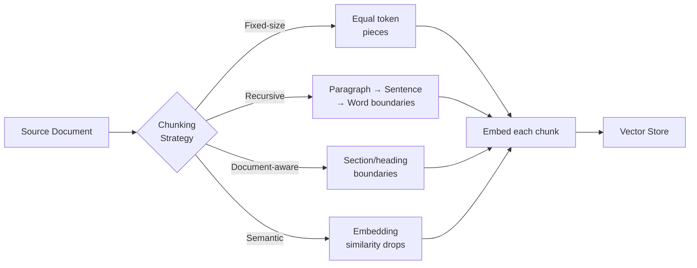
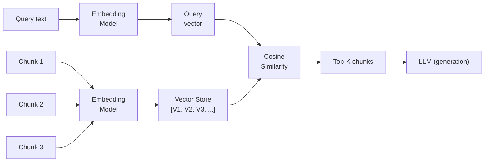
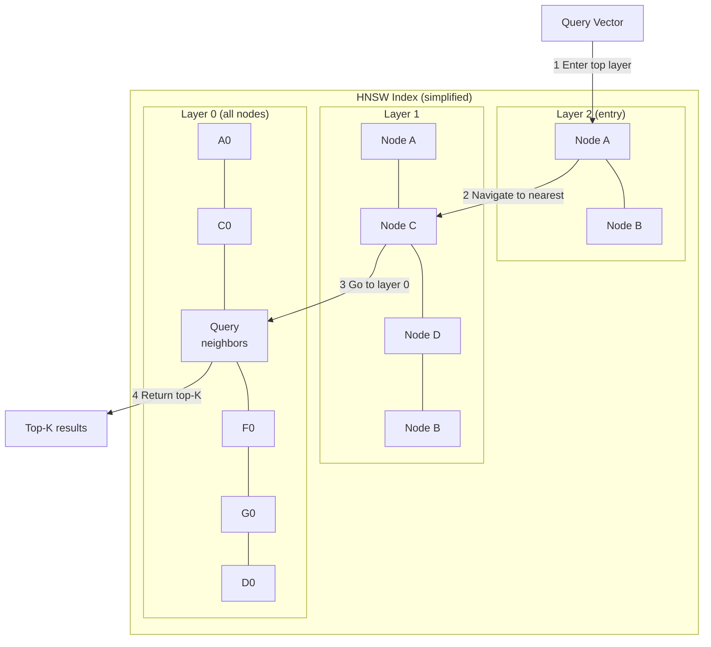

## Keywords in This File
{: .no_toc }

| # | Keyword | Weight |
|---|---|---|
| 4 | [Document Chunking](#document-chunking) | ★☆☆ |
| 5 | [Vector Embeddings for Retrieval](#vector-embeddings-for-retrieval) | ★☆☆ |
| 6 | [Vector Databases](#vector-databases) | ★☆☆ |

---

# Document Chunking

**Interview Weight:** ★☆☆ - A foundational RAG
topic. Bad chunking is the most common cause of
poor RAG quality.

---

### 🎯 Model Answer

**30 seconds:**

> Document chunking splits a document into smaller
> pieces before indexing. It's necessary because
> LLM context windows are finite and because retrieval
> works better with focused, coherent fragments.
> The two key decisions: (1) chunk size - too small
> loses context, too large dilutes relevance; (2)
> overlap - adjacent chunks share some text to
> preserve context across chunk boundaries. Most
> production systems use 256-1024 tokens with 10-20%
> overlap.

**3 minutes:**

> Why chunking is necessary: a 500-page manual can't
> fit in a context window. More importantly, if you
> could fit it all in, most of it would be irrelevant
> to any given query - diluting the relevant signal.
> Chunking creates retrievable units that are small
> enough to be focused and large enough to be coherent.
>
> Chunking strategies ranked by sophistication:
>
> Fixed-size: split every N tokens regardless of
> content. Fast to implement. Problem: cuts in the
> middle of sentences or paragraphs, destroying context.
>
> Recursive/text-based: split at natural language
> boundaries - first try to split at paragraph breaks,
> then sentences, then words. Preserves more semantic
> coherence.
>
> Semantic: use embeddings to identify topic shifts
> and split at semantically coherent boundaries.
> Most expensive but highest quality for long heterogeneous
> documents.
>
> Document-aware: use document structure (headings,
> sections, table cells) to guide splits. Best for
> structured documents (PDFs with headings, technical
> docs, legal contracts).
>
> Overlap: the end of one chunk also appears at the
> start of the next. If a question's answer spans
> a chunk boundary, overlap ensures either chunk
> can retrieve the complete context.

**Blank Mind Recovery:**

**(1) Restate:** "What is document chunking and
why does it matter for RAG?"

**(2) First principles:** "I need to retrieve the
relevant part of a document, not the whole thing.
Chunking is how I create the retrievable units.
Bad chunks = bad retrieval = bad answers."

---

### 📘 Concept Explanation

**What it is:**

Document chunking is the process of dividing source
documents into smaller, retrievable segments before
indexing them in the vector store. Each chunk becomes
an independent retrievable unit. The chunk that
is retrieved goes into the LLM's context window.

**Chunking strategies:**

```
STRATEGY           METHOD                   USE WHEN
----------         ------                   --------
Fixed-size         Split every N tokens     Simple prototype
(RecursiveCharText)

Recursive          Split at \\n\\n, \\n, space  Most documents
                   in that order

Semantic           Embed + detect topic     Long heterogeneous docs
                   shifts, split at drops   (textbooks, manuals)

Document-aware     Use section headers,     Structured docs
                   paragraphs, table rows   (PDFs, legal, tech docs)

Sentence-window    Store by sentence,       When granularity matters
                   retrieve with context   (Q&A, precise retrieval)
```

> **Code walkthrough:** This Document Chunking example demonstrates a key concept in practice using Kafka messaging. **KEY MECHANISM:** the runtime executes these instructions in sequence with specific memory and execution semantics. **WHY IT MATTERS:** misapplying this pattern causes subtle bugs that only manifest under production load. **TAKEAWAY: understand the execution model before using this pattern in production code.**

**Chunk size impact:**

```
TOO SMALL (< 100 tokens):
  - Fragments lose surrounding context
  - More chunks = higher memory/cost
  - Single-sentence chunks may be ambiguous

TOO LARGE (> 2000 tokens):
  - Dilutes relevance signal
  - Wastes context window
  - "Lost in the middle" - LLM focuses on start/end

SWEET SPOT (256-1024 tokens):
  - Semantic coherence maintained
  - Focused retrieval
  - Practical context window use
```

> **Code walkthrough:** This Document Chunking example demonstrates a key concept in practice using authentication. **KEY MECHANISM:** the runtime executes these instructions in sequence with specific memory and execution semantics. **WHY IT MATTERS:** misapplying this pattern causes subtle bugs that only manifest under production load. **TAKEAWAY: understand the execution model before using this pattern in production code.**

**Overlap:**

```
Doc text: [AAAA | BBBB | CCCC | DDDD]

Without overlap:
  Chunk 1: AAAA
  Chunk 2: BBBB
  (If answer spans AAAA-BBBB boundary: neither chunk
   has the complete answer)

With 25% overlap:
  Chunk 1: AAAA + BB
  Chunk 2: BB + BBBB + CC
  (Answer spanning boundary: retrieved by Chunk 1 or 2)
```

> **Code walkthrough:** This Document Chunking example demonstrates a key concept in practice. **KEY MECHANISM:** the runtime executes these instructions in sequence with specific memory and execution semantics. **WHY IT MATTERS:** misapplying this pattern causes subtle bugs that only manifest under production load. **TAKEAWAY: understand the execution model before using this pattern in production code.**

---

### 💻 Code Example


```python
# BAD: anti-pattern - see GOOD example below
```

```python
import re, anthropic

# BAD: fixed-size chunking ignoring sentence boundaries
def bad_fixed_chunk(text: str, size: int = 500) -> list[str]:
    """
    Cuts mid-sentence. Context is destroyed.
    'The capital of France is Paris. The Eiffel Tow'
    -> 'er was built in...' (separate chunk)
    """
    return [text[i:i+size] for i in range(0, len(text), size)]


# GOOD: recursive text-aware chunking with overlap
def good_recursive_chunk(
    text: str,
    max_tokens: int = 512,
    overlap_tokens: int = 64
) -> list[str]:
    """
    Splits at paragraph -> sentence -> word boundaries.
    Respects natural language structure.
    """
    # Approximate: 1 token ~ 4 chars (for English)
    max_chars = max_tokens * 4
    overlap_chars = overlap_tokens * 4
    separators = ["\n\n", "\n", ". ", " "]
    chunks: list[str] = []
    start = 0
    while start < len(text):
        end = start + max_chars
        if end >= len(text):
            chunks.append(text[start:])
            break
        # Try to split at natural boundary
        best_split = end
        for sep in separators:
            idx = text.rfind(sep, start, end)
            if idx > start:
                best_split = idx + len(sep)
                break
        chunks.append(text[start:best_split])
        start = best_split - overlap_chars  # overlap
    return chunks


# Semantic chunking (simplified - uses sentence breaks
# + embedding similarity in production)
def semantic_chunk(
    text: str,
    similarity_threshold: float = 0.7
) -> list[str]:
    """
    Splits where topic changes (embedding distance drops).
    Production: embed each sentence, compute cosine similarity
    between adjacent sentences, split at drops.
    """
    sentences = re.split(r'(?<=[.!?])\s+', text)
    # Production: embed sentences, compute similarity,
    # split where similarity drops below threshold.
    # Simplified: split at empty lines (paragraph boundaries)
    chunks, current = [], []
    for sent in sentences:
        if not sent.strip():
            if current:
                chunks.append(" ".join(current))
                current = []
        else:
            current.append(sent)
    if current:
        chunks.append(" ".join(current))
    return chunks


# Production: verify chunk quality
def verify_chunk_coverage(
    original_text: str, chunks: list[str]
) -> dict:
    """Check chunks don't lose content."""
    reconstructed = " ".join(chunks)
    coverage = len(set(original_text.split()) &
                   set(reconstructed.split()))
    total = len(set(original_text.split()))
    return {
        "chunk_count": len(chunks),
        "avg_chunk_len": sum(len(c) for c in chunks) \
            // len(chunks) if chunks else 0,
        "word_coverage": round(coverage / total, 3)
            if total > 0 else 0.0
    }
```

> **Code walkthrough:** The BAD example uses Pythonice. **KEY MECHANISM:** the runtime executes these instructions in sequence with specific memory and execution semantics. **WHY IT MATTERS:** misapplying this pattern causes subtle bugs that only manifest under production load. **TAKEAWAY: understand the execution model before using this pattern in production code.**
> string slicing - fast but destroys sentence and
> paragraph boundaries. A chunk can end mid-word or
> mid-sentence. The GOOD example tries separators
> in order of preference (double newline > newline >
> period-space > space), finding the last natural
> boundary within the size limit. The overlap parameter
> rewinds the start position by `overlap_chars`, so
> content near chunk boundaries appears in both
> adjacent chunks. The semantic version illustrates
> the principle: split where topic changes (embedding
> similarity drops). `verify_chunk_coverage` checks
> that chunking didn't lose content - useful in CI
> to catch bugs in custom chunking logic.

---

### 🎓 Answers by Seniority

**Junior / Mid:**

> "Chunking splits documents into smaller pieces for
> indexing. Each chunk becomes a retrievable unit.
> The chunk retrieved goes into the LLM's context.
> Key decisions: chunk size (too small loses context,
> too large dilutes relevance) and overlap (the end
> of one chunk appears at the start of the next,
> preserving context across boundaries). Most common
> starting point: 512 tokens with 10% overlap."

---

**Senior / Staff:**

> "Chunking strategy is the most impactful but most
> under-appreciated part of RAG. I've seen systems
> where switching from fixed-size to document-aware
> chunking improved retrieval recall by 20%. The
> right strategy depends on document type: technical
> docs with headers respond well to header-based
> splitting. Dense prose (legal contracts, textbooks)
> benefits from semantic chunking. For most cases:
> recursive splitting at paragraph/sentence boundaries
> with 15-20% overlap. After chunking, verify: embed
> 100 sample queries and check whether the relevant
> chunk appears in the top-5 for each. This benchmark
> tells you if your chunks are retrievable."

---

### ⚠️ Common Misconceptions

**Misconception: "Smaller chunks are always better
for retrieval precision."**

Extremely small chunks (1-2 sentences) often lack
enough context to be semantically meaningful. The
embedding of "Paris" as an isolated token is much
weaker than "The capital of France is Paris, known
for its role in fashion and culture." The embedding
of a minimal fragment may not capture the topic
well enough to match queries. Precision improves
with focus, but focus requires enough context for
the embedding to be semantically rich.

---

### 🚨 Failure Modes and Diagnosis

**Failure: Retrieved chunks lose the context
that makes the answer meaningful**

*Symptom:* The answer is partially correct but
missing key context. For example: the retrieved
chunk says "the limit is 1000" but doesn't say
1000 of what, because the context was in the previous
chunk.

*Root cause:* Fixed-size chunking cut across a
contextual unit (e.g., a heading and its body ended
up in different chunks, or a reference like "as
described above" lost its antecedent).

*Fix:* (1) Increase chunk size to include more context.
(2) Add overlap so the previous chunk's tail (with
the context) is also in the current chunk.
(3) Use document-aware chunking that respects section
boundaries.
(4) Use the "parent retrieval" pattern: index small
chunks for precision but return the parent section
(larger chunk) to the LLM for full context.

---

### 🎯 Interview Deep-Dive

| Seniority | Time | Focus |
|---|---|---|
| Junior | 3 min | Definition, strategies, overlap |
| Mid | 5 min | Strategy selection, quality verification |
| Senior | 8 min | Advanced patterns, production optimization |

---

**[JUNIOR] Q1 - What is chunk overlap and why
is it needed?**

Chunk overlap: when splitting a document into chunks,
the last N tokens of one chunk are repeated as the
first N tokens of the next chunk.

Why needed: some answers span the boundary between
two adjacent chunks. Without overlap: neither chunk
contains the complete answer.

Example:
```
Text: "The contract expires on December 31, 2025.
       At that point, all obligations become void."

Without overlap at 30-word boundary:
  Chunk A: "...contract expires on December 31, 2025."
  Chunk B: "At that point, all obligations become void."

Query: "When do the obligations become void?"
The answer requires BOTH sentences.
Without overlap: Chunk B alone doesn't have the date.
With overlap: Chunk B starts with "December 31, 2025.
At that point..." -> complete answer.
```

> **Code walkthrough:** This Production: verify chunk quality example demonstrates a key concept in practice. **KEY MECHANISM:** the runtime executes these instructions in sequence with specific memory and execution semantics. **WHY IT MATTERS:** misapplying this pattern causes subtle bugs that only manifest under production load. **TAKEAWAY: understand the execution model before using this pattern in production code.**

Typical overlap: 10-20% of chunk size. More overlap
= better context preservation but more storage
and redundant retrieval.

*What separates good from great:* The concrete
example of an answer spanning a chunk boundary.

---

**[MID] Q2 - How do you choose between document-
aware and fixed-size chunking?**

Fixed-size (recursive character): appropriate for
unstructured text where natural boundaries are
inconsistent or absent. Fast and simple. Works
well for: plain prose, transcripts, unformatted text.

Document-aware: appropriate for structured documents
where the document structure carries semantic meaning.
Examples:
- Technical documentation: chapters, sections,
  subsections form natural chunk boundaries
- PDF reports: split by page, table, or section header
- Code files: split by function or class definition
- Legal contracts: split by article or clause

Decision rule: does the document have explicit
structural elements (headings, sections, tables,
code blocks)? If yes: use document-aware chunking
that respects those boundaries. If no: use recursive
character splitting.

Signals that document-aware is needed:
- Retrieved chunks often say "as described in the
  previous section" (context lost across boundaries)
- Q&A about table data returns wrong values (table
  rows were split)
- Code-related queries return partial function
  implementations

*What separates good from great:* The symptom list
(context references lost, table data wrong, partial
code) as the production signal that document-aware
is needed.

---

**[MID] Q3 - What is the "parent retrieval" pattern
and when do you use it?**

Parent retrieval (also called "small-to-big
retrieval"): index small, precise chunks for
retrieval, but return a larger "parent" chunk
(the section or paragraph containing the small
chunk) to the LLM for generation.

Why: small chunks produce better retrieval precision
(the embedding is focused). Large chunks give the
LLM more context to generate a complete answer.

Implementation:
```
Index time:
  Split document into parent chunks (512 tokens)
  Split parent chunks into child chunks (128 tokens)
  Store child-to-parent mapping

Query time:
  Search by child chunks (focused embedding)
  Map retrieved child -> parent
  Return parent chunks to LLM (more context)
```

> **Code walkthrough:** This Unknown example demonstrates a key concept in practice using authentication. **KEY MECHANISM:** the runtime executes these instructions in sequence with specific memory and execution semantics. **WHY IT MATTERS:** misapplying this pattern causes subtle bugs that only manifest under production load. **TAKEAWAY: understand the execution model before using this pattern in production code.**

When to use:
- Answers in a small chunk but context needed from
  the surrounding section
- Technical documentation where a specific fact
  needs its surrounding explanation to make sense
- FAQ systems where the question matches a short
  phrase but the full answer is a paragraph

*What separates good from great:* Explaining WHY
small chunks work better for retrieval (focused
embedding) while large chunks work better for
generation (more context).

---

**[SENIOR] Q4 - How do you benchmark chunking
quality in production?**

Chunking quality benchmark:

(1) Create a golden dataset: 50-100 (question, answer,
    source_document_section) triples from your
    actual use cases.

(2) For each question: retrieve top-5 chunks.
    Check if the source section is present in top-5.

(3) Metrics:
    - Retrieval recall@5: % of questions where the
      correct section is in top-5 retrieved chunks
    - Mean reciprocal rank (MRR): how high in the
      ranking is the correct chunk (1.0 = rank 1,
      0.5 = rank 2, etc.)

(4) Compare chunking strategies:
    - Run the same query set with fixed-size, recursive,
      document-aware
    - The strategy with the highest recall@5 wins

(5) Failure analysis: for queries where the correct
    chunk is NOT in top-5, examine why:
    - Was the chunk too small/large (embedding quality)?
    - Was the chunk boundary in the wrong place
      (context lost)?
    - Is the embedding model weak for this content type?

Target metrics: recall@5 > 0.85 for most applications.
Below 0.7: serious retrieval quality problem.

*What separates good from great:* Recall@5 as the
primary metric and 0.85/0.7 as concrete quality thresholds.

---

**[SENIOR] Q5 - [TRADE-OFF] What is the cost
of larger vs. smaller chunk sizes?**

**Larger chunks (1024+ tokens):**

Cost increases:
- More tokens per retrieved chunk = higher LLM cost
  per query
- Context window fills faster with fewer chunks
  (less room for multiple retrieved sources)

Quality effects:
- Embedding quality decreases: larger embedding
  captures more mixed topics, weaker at matching
  specific queries
- "Lost in the middle" effect: LLM reads less carefully
  toward the middle of long context chunks

When to use despite cost:
- Answers require substantial surrounding context
  to be meaningful
- Documents don't have natural small-unit boundaries
  (dense prose)

**Smaller chunks (64-256 tokens):**

Cost decreases:
- Fewer tokens per chunk = lower LLM cost per query
- More chunks fit in context window

Quality effects:
- Embedding quality increases (more focused)
- Individual chunk may lack context for a complete answer
- More metadata overhead (chunk boundaries, IDs)

Production sweet spot: 512 tokens is a common balance
for most text. Code: split at function boundaries
(variable size). Structured docs: split at section
level (variable, often 200-1000 tokens).

*What separates good from great:* "Embedding quality
decreases with larger chunks" - the embedding argument
for smaller chunks, not just cost.

---

**[SENIOR] Q6 - How does chunking strategy interact
with the embedding model?**

The relationship: the embedding model determines
the QUALITY of each chunk's vector representation.
The chunking strategy determines the SIZE and
COHERENCE of what the embedding model receives.

Key interactions:

(1) Short context embedding models: some models
    (especially older ones) have a 512-token input
    limit. Chunks longer than the model's limit
    are truncated. Always verify your embedding
    model's input limit matches your chunk size.

(2) Embedding model sensitivity to noise: large
    chunks with heterogeneous content (multiple topics)
    produce "averaged" embeddings. The embedding
    represents the average topic, which may not
    match specific queries. Smaller, more coherent
    chunks produce focused embeddings that match
    specific queries better.

(3) Code vs. natural language: code-specific embedding
    models (CodeBERT, code-related fine-tunes) work
    better with code-semantic chunks (full functions
    or classes). Generic embedding models produce
    weaker embeddings for code.

(4) Cross-lingual documents: if documents are
    multilingual, use a multilingual embedding model
    (BGE-M3, Cohere multilingual). Chunking strategy
    doesn't change, but the embedding model must
    handle all languages in the corpus.

*What separates good from great:* "Embedding model
input limit must match chunk size" as a practical
gotcha that trips up many engineers.

---

**[SENIOR] Q7 - [DEBUGGING] A RAG system's retrieval
quality dropped after ingesting a new batch of
documents. How do you diagnose?**

Diagnostic steps:

(1) Confirm the regression is real: compare pre/post
    retrieval metrics (recall@5, MRR) on the golden
    test set. Is the drop statistically significant
    or noise?

(2) Scope the regression: does it affect ALL queries
    or only queries related to the new documents?
    If only new-document queries: the problem is
    in the new documents (chunking, embedding, or
    content quality).
    If all queries: the vector store may have been
    contaminated (bad embeddings affecting ANN search
    quality across the board).

(3) Inspect the new documents:
    - Were they chunked using the same strategy?
    - Are they in a different format (PDF vs. plain
      text, different encoding)?
    - Do they contain noise (headers, page numbers,
      table artifacts from PDF extraction)?

(4) Check embeddings of new chunks: embed 10 new
    chunks and 10 similar old chunks. Compare
    embedding norms and similarity distributions.
    Anomalous embeddings (all-zero, very low norm)
    indicate a chunking or encoding problem.

(5) Check vector store: did the new document ingestion
    trigger a re-indexing that used different parameters?

Common root cause: new documents were extracted
from PDFs with different parsing (Textract vs.
pdfminer) producing different formatting noise.
The noise degraded chunk coherence and embedding quality.

*What separates good from great:* "Is it all queries
or new-document queries?" as the first scoping question.

---

### ⚖️ Comparison Table

| Strategy | Quality | Speed | Use Case |
|---|---|---|---|
| Fixed-size | Low | Fastest | Prototyping only |
| Recursive character | Medium | Fast | General prose |
| Document-aware | High | Medium | Structured docs |
| Semantic | Highest | Slowest | Long mixed content |
| Sentence-window | High | Medium | Precise Q&A |

---

### 🏛️ System Design

*(Omit: ★☆☆ concept.)*

---

### 📊 Diagram

```
CHUNKING WITH OVERLAP:

Document: [============================]
                                       (paragraph boundary)
Chunk 1:  [========|====]              (+ 20% overlap tail)
Chunk 2:       [===|============|==]   (starts in overlap)
Chunk 3:                 [====|======]
                           ^
                        Answer spanning
                        boundary: caught
                        by Chunk 2
```



> **Diagram walkthrough:** The chunking step is
> the first processing stage after document ingestion.
> Four strategies produce chunks of different quality
> from the same source document. All strategies
> feed into the same downstream embedding and vector
> store steps. The strategy choice is upstream of
> embedding quality: better chunk boundaries produce
> more semantically focused embeddings which produce
> better retrieval. The diagram shows that chunking
> is not a fixed step but a decision with multiple
> alternatives - choosing well here multiplies
> quality through the entire downstream pipeline.

---

---

---

### 💻 Code Example

*(Omit: this concept does not have a programmatic interface that can be demonstrated in code. The conceptual explanation above is sufficient.)*


---

### 🏛️ System Design

*(Omit: system design diagram not applicable for this concept - see ★★★ keywords for full system design coverage.)*


---

### ⚖️ Comparison Table

*(Omit: this is a ★☆☆ foundational concept with no direct alternatives to compare - see higher-difficulty keywords for trade-off analysis.)*


---

### 📊 Diagram

*(Omit: no standalone visual diagram required for this concept - the explanations and code examples above provide sufficient clarity.)*


# Vector Embeddings for Retrieval

**Interview Weight:** ★☆☆ - The core mechanism
behind semantic search in RAG. Understanding
embeddings is prerequisite to understanding why
RAG works.

---

### 🎯 Model Answer

**30 seconds:**

> Vector embeddings are dense numerical representations
> of text, where semantically similar texts produce
> similar vectors. In RAG, both the query and each
> document chunk are converted to vectors. Retrieval
> works by finding the document vectors that are
> most similar to the query vector (cosine similarity
> or dot product). This enables "semantic search":
> finding documents that mean the same thing even
> if they don't share the same keywords.

**3 minutes:**

> Why embeddings are needed for RAG: keyword search
> (matching exact words) misses semantically equivalent
> but lexically different text. A query "how do I
> fix the payment error" should retrieve a document
> about "resolving checkout failures" - different
> words, same meaning. Embeddings capture semantic
> meaning, not just surface vocabulary.
>
> How embeddings are created: a neural network (the
> embedding model) is trained on large text corpora
> to produce representations where semantically
> similar texts have similar vectors. The network
> learns that "cat" and "feline" are related, that
> "purchase" and "buy" are synonyms, that a question
> about Paris and its answer about France are related.
>
> Properties of good embeddings:
> - High cosine similarity for semantically related
>   text (query and its answer document)
> - Low cosine similarity for unrelated text
> - Consistent representation across paraphrases
>
> Embedding dimensions: typical embedding models
> produce 384, 768, or 1536-dimension vectors. Higher
> dimensions generally capture more semantic nuance
> but increase storage and search cost.

**Blank Mind Recovery:**

**(1) Restate:** "What are vector embeddings and
why are they used in RAG?"

**(2) First principles:** "Numbers that represent
meaning. Similar meanings = similar numbers.
Searching for similar numbers = finding similar
meanings."

---

### 📘 Concept Explanation

**What it is:**

A vector embedding is a dense numerical vector
that represents the semantic meaning of a piece
of text. Generated by an embedding model (a neural
network), vectors encode semantic relationships:
texts that mean similar things have vectors that
are close together in vector space.

**How semantic similarity works:**

```
Text: "How do I reset my password?"
Vector: [0.12, -0.34, 0.89, ..., 0.45]  (768 dims)

Text: "Steps to change account credentials"
Vector: [0.11, -0.33, 0.91, ..., 0.44]  <- similar!
Cosine similarity: 0.92

Text: "The weather in Paris today"
Vector: [0.78, 0.23, -0.44, ..., -0.12]  <- different
Cosine similarity: 0.12
```

> **Code walkthrough:** This Vector Embeddings for Retrieval example demonstrates a key concept in practice. **KEY MECHANISM:** the runtime executes these instructions in sequence with specific memory and execution semantics. **WHY IT MATTERS:** misapplying this pattern causes subtle bugs that only manifest under production load. **TAKEAWAY: understand the execution model before using this pattern in production code.**

**Cosine similarity:**

$$\text{similarity}(A, B) = \frac{A \cdot B}{\|A\| \cdot \|B\|}$$

Range: -1 (opposite) to 1 (identical). In practice,
text embedding similarity ranges from ~0.5 (related)
to ~0.99 (near-duplicate).

**Embedding model properties that matter:**

```
DIMENSION: higher = more nuance, more storage
  text-embedding-3-small: 1536 dim
  BGE-large-en-v1.5: 1024 dim
  all-MiniLM-L6-v2: 384 dim (fast, less accurate)

INPUT LENGTH: max tokens the model handles
  Most: 512 tokens
  Some: 8192 tokens (OpenAI 3-large with late chunking)
  Chunk must fit within model limit

TRAINING: what the model was optimized for
  General: good for broad text
  Code: better for code similarity
  Multilingual: cross-language retrieval
```

> **Code walkthrough:** This Vector Embeddings for Retrieval example demonstrates a key concept in practice using authentication. **KEY MECHANISM:** the runtime executes these instructions in sequence with specific memory and execution semantics. **WHY IT MATTERS:** misapplying this pattern causes subtle bugs that only manifest under production load. **TAKEAWAY: understand the execution model before using this pattern in production code.**

---

### 💻 Code Example


```python
# BAD: anti-pattern - see GOOD example below
```

```python
import anthropic
import numpy as np

# Demonstrating embedding similarity for retrieval

# Note: Claude API doesn't provide embeddings.
# Use OpenAI, Cohere, or sentence-transformers.
# This example uses sentence-transformers (open-source).

# Install: pip install sentence-transformers

def get_embeddings(texts: list[str]) -> np.ndarray:
    """
    Production: choose model based on task.
    BGE-large for English, BGE-M3 for multilingual.
    """
    try:
        from sentence_transformers import (
            SentenceTransformer
        )
        model = SentenceTransformer(
            "BAAI/bge-large-en-v1.5"
        )
        return model.encode(texts, normalize_embeddings=True)
    except ImportError:
        # Fallback stub for illustration
        return np.random.randn(len(texts), 768)


def cosine_similarity(a: np.ndarray, b: np.ndarray) -> float:
    return float(np.dot(a, b))  # normalized vecs


# BAD: keyword search (misses semantic matches)
def bad_keyword_search(
    query: str, docs: list[str]
) -> list[str]:
    """Exact string match. Misses synonyms."""
    query_words = set(query.lower().split())
    scored = [(
        len(query_words & set(d.lower().split())), d
    ) for d in docs]
    scored.sort(key=lambda x: x[0], reverse=True)
    return [d for _, d in scored[:3]]


# GOOD: semantic search via embeddings
def good_semantic_search(
    query: str,
    docs: list[str],
    top_k: int = 3
) -> list[dict]:
    """
    Semantic search: finds semantically similar docs
    even with different vocabulary.
    """
    all_texts = [query] + docs
    embeddings = get_embeddings(all_texts)
    query_emb = embeddings[0]
    doc_embs = embeddings[1:]

    scores = [
        cosine_similarity(query_emb, doc_emb)
        for doc_emb in doc_embs
    ]
    ranked = sorted(
        enumerate(scores),
        key=lambda x: x[1],
        reverse=True
    )[:top_k]
    return [{
        "document": docs[i],
        "score": round(score, 4)
    } for i, score in ranked]


# Demo showing semantic vs. keyword search
documents = [
    "How to resolve payment processing failures",  # semantic match
    "Steps to fix checkout errors in the store",   # semantic match
    "The history of ancient Rome",                 # irrelevant
    "Guide to Python list comprehensions",         # irrelevant
]

query = "my payment isn't working"

print("Keyword search:")
for doc in bad_keyword_search(query, documents):
    print(f"  {doc[:50]}")
# Might return irrelevant docs with shared stop words

print("Semantic search:")
for result in good_semantic_search(query, documents):
    print(
        f"  [{result['score']}] "
        f"{result['document'][:50]}"
    )
# Returns the two payment/checkout docs correctly


# Embedding quality verification
def check_embedding_quality(
    query: str,
    positive: str,  # should be similar
    negative: str   # should be dissimilar
) -> dict:
    embeddings = get_embeddings([query, positive, negative])
    pos_sim = cosine_similarity(embeddings[0], embeddings[1])
    neg_sim = cosine_similarity(embeddings[0], embeddings[2])
    return {
        "query": query[:50],
        "positive_similarity": round(pos_sim, 3),
        "negative_similarity": round(neg_sim, 3),
        "separation": round(pos_sim - neg_sim, 3)
    }
```

> **Code walkthrough:** The BAD example uses keywordice. **KEY MECHANISM:** the runtime executes these instructions in sequence with specific memory and execution semantics. **WHY IT MATTERS:** misapplying this pattern causes subtle bugs that only manifest under production load. **TAKEAWAY: understand the execution model before using this pattern in production code.**
> overlap (set intersection on lowercased words).
> A query "my payment isn't working" shares almost
> no words with "resolving checkout failures" even
> though they're semantically identical. The GOOD
> example embeds the query and all documents, then
> computes cosine similarity between query embedding
> and each document embedding. Normalized vectors
> allow cosine similarity via dot product (simple
> and fast). The `check_embedding_quality` function
> is a debugging tool: verify that your embedding
> model scores your positives higher than negatives.
> If positive_similarity < negative_similarity for
> any pair: your embedding model is misaligned with
> the domain.

---

### 🎓 Answers by Seniority

**Junior / Mid:**

> "Vector embeddings represent text as numbers where
> similar meanings produce similar numbers. The embedding
> model (like BGE-large or OpenAI's text-embedding-3)
> converts each text chunk into a dense vector. To
> retrieve relevant documents, we embed the query
> and find the chunks with the most similar vectors
> (cosine similarity). This enables semantic search:
> finding relevant documents even when they use
> different words than the query."

---

**Senior / Staff:**

> "Embeddings are the semantic bridge between query
> and document in RAG. The key quality question is
> not 'is the embedding model good?' but 'is it
> good for our specific domain?' A general-purpose
> model may work well on general questions but perform
> poorly on domain-specific technical vocabulary
> that it wasn't trained on. Production validation:
> create 50 (query, relevant document, irrelevant
> document) triples from your real data. Measure
> the average similarity gap between relevant and
> irrelevant pairs. Gap > 0.15: model is well-
> calibrated for your domain. Gap < 0.05: model
> is struggling with your vocabulary."

---

### ⚠️ Common Misconceptions

**Misconception: "Any embedding model works equally
well for RAG."**

Embedding models differ significantly by domain,
language, and input length. A model trained on
Wikipedia performs well on general knowledge queries
but may poorly distinguish between technical
programming concepts (fine-grained code semantics).
A model with 512-token input will truncate longer
chunks. A model trained only on English will produce
poor embeddings for French or Chinese queries.
Always evaluate embedding models on your actual
data before committing to one for production.

---

### 🚨 Failure Modes and Diagnosis

**Failure: Embedding model returns semantically
wrong top-K results**

*Symptom:* A query about Python exceptions returns
documents about Java exceptions, or a query about
"account management" returns documents about
"account payable" (different domain, similar words).

*Root cause 1 - domain mismatch:* The embedding model
conflates terms that are similar in general language
but have different meanings in your specific domain.

*Root cause 2 - chunk contamination:* Chunks contain
mixed topics, so their embeddings represent a blend
of topics rather than a specific concept.

*Diagnosis:*
1. Embed the query.
2. Find the 10 most similar chunks.
3. For each: is this chunk actually relevant?
4. Count precision@10. If < 0.5: fundamental retrieval
   quality problem.

*Fix:* Test multiple embedding models on your domain
using the golden dataset method. Domain-specific
fine-tuned embeddings often outperform general models.

---

### 🎯 Interview Deep-Dive

| Seniority | Time | Focus |
|---|---|---|
| Junior | 3 min | What embeddings are, cosine similarity |
| Mid | 5 min | Model selection, evaluation |
| Senior | 8 min | Production calibration, failure diagnosis |

---

**[JUNIOR] Q1 - What is cosine similarity and
why is it used for embedding retrieval?**

Cosine similarity measures the angle between two
vectors. A small angle (similar direction) = high
similarity. A large angle (different directions)
= low similarity. It's defined as the dot product
of the two vectors divided by the product of their
magnitudes:


Why cosine similarity (not Euclidean distance):
cosine similarity is scale-invariant. A long document
and a short document about the same topic will
have vectors of different magnitudes but similar
directions. Cosine similarity is high for both;
Euclidean distance would see them as far apart
due to magnitude difference.

In practice: if embedding vectors are L2-normalized
(each vector divided by its magnitude = magnitude 1),
cosine similarity reduces to simple dot product.
Most embedding models return normalized vectors.
This makes retrieval efficient: just dot products.

*What separates good from great:* Scale-invariance
as the reason cosine beats Euclidean for text.

---

**[MID] Q2 - How do you evaluate whether an embedding
model is appropriate for your RAG application?**

Evaluation methodology:

(1) Create a golden test set: 50-100 (query, positive
    document, negative document) triples from real
    production data. The positive document correctly
    answers the query. The negative is topically
    related but doesn't answer.

(2) For each model, measure:
    - Average cosine similarity: query to positive
    - Average cosine similarity: query to negative
    - Similarity gap: positive - negative (higher = better)

(3) Measure retrieval recall@5: for each query,
    retrieve top-5. Is the positive document in top-5?
    Threshold: > 0.85 for production-ready.

(4) Test for your specific challenges:
    - Does it handle acronyms in your domain?
    - Does it handle short queries well?
    - Does it handle multilingual queries?

Public benchmarks (MTEB) provide general guidance
but may not reflect your domain. Always validate
on your own data.

*What separates good from great:* "MTEB provides
guidance but validate on your data" - the practical
caveat to public benchmarks.

---

**[MID] Q3 - What is the difference between
retrieval-optimized and general-purpose embeddings?**

General-purpose embeddings (e.g., OpenAI text-
embedding-3-small): trained to produce generally
good representations for a wide variety of tasks
including classification, clustering, and semantic
similarity. Optimized for no specific task.

Retrieval-optimized embeddings (e.g., BGE-large,
Cohere rerank-focused models): trained with contrastive
learning specifically for retrieval tasks (query-
document matching). The training objective explicitly
optimizes: query and relevant document have high
similarity, query and irrelevant document have low
similarity.

Why retrieval-optimized is better for RAG:
- The training task (query-document matching) directly
  matches the RAG retrieval task
- Contrastive training pushes positive pairs (query,
  relevant document) closer and negative pairs
  further apart

The BGE (BAAI General Embedding) family and E5
family are examples of retrieval-optimized open-
source models that consistently outperform general
embedding models on retrieval benchmarks.

*What separates good from great:* "Contrastive
training objective" as the specific reason retrieval-
optimized models beat general ones.

---

**[SENIOR] Q4 - [DEBUGGING] Your embedding model
consistently retrieves the wrong documents for
questions in a specific subdomain. How do you fix it?**

Diagnosis:
1. Confirm subdomain-specific failure: create
   20 test queries specifically in the problematic
   subdomain. Run retrieval, measure recall@5.
   If < 0.5 specifically for this subdomain:
   confirmed.

2. Check vocabulary: do the queries and documents
   in this subdomain use specialized terminology
   that's rare in general text (medical jargon,
   legal terms, internal product names)?

3. Embed a sample: embed 5 queries and 5 relevant
   documents from this subdomain. Check cosine
   similarities. If all < 0.5: the model genuinely
   doesn't represent this vocabulary well.

Fixes (in increasing effort order):

(1) Query expansion: when a query uses a specialized
    term, expand it with synonyms or context. "The
    K8s pod restart" -> "Kubernetes pod restart
    container". Improves embedding quality for
    queries but doesn't fix document side.

(2) Domain-specific fine-tuning: collect 1,000+
    (query, relevant document) pairs from this
    subdomain. Fine-tune the embedding model using
    contrastive learning. Most significant improvement
    but requires data and compute.

(3) Hybrid search: add BM25 (keyword) alongside
    semantic search. For technical terms, keyword
    search often works better than semantic search
    because the term IS the key information.

(4) Metadata filtering + semantic: add domain
    tags to chunks during indexing. Filter to
    the relevant subdomain FIRST, then semantic
    search within the filtered set.

*What separates good from great:* "Hybrid search
for technical terms" - the insight that keyword
search complements embedding for specialized vocabulary.

---

**[SENIOR] Q5 - What is embedding drift and how
does it affect production RAG?**

Embedding drift: when the embedding model used for
indexing differs from the model used at query time.
Result: query embeddings and document embeddings
live in different "spaces" and similarity calculations
are meaningless.

Causes:
- Embedding model version update (OpenAI silently
  updated text-embedding-ada-002 in 2022)
- Switching from one model to another without
  re-indexing
- Different model for queries vs. documents
  (a team mistake or configuration error)

Symptoms:
- Sudden catastrophic drop in retrieval quality
  across all queries
- Top-K results are clearly irrelevant
- The issue affects ALL queries uniformly (not
  just some)

Prevention:
- Always use the same model version for indexing
  and querying
- Store the embedding model identifier with each
  indexed document (metadata)
- When updating the embedding model: re-index ALL
  documents before switching the query path
- Run a consistency check: daily job that verifies
  query embedding model matches index embedding
  model

*What separates good from great:* "Store the model
identifier in the index metadata" as the operational
safeguard.

---

**[SENIOR] Q6 - [TRADE-OFF] When does hybrid search
(embedding + BM25) outperform pure embedding search?**

BM25 (keyword search): term-frequency/inverse-
document-frequency matching. Exact keyword match.
Fast, interpretable, no ML needed.

Pure embedding: semantic similarity. Handles synonyms,
paraphrases, domain mismatch.

Hybrid: retrieve using both, then merge results
(reciprocal rank fusion or weighted scoring).

Hybrid beats pure embedding when:

(1) Queries contain exact technical terms:
    "TypeError: unhashable type 'list'" in Python.
    The exact error message IS the search key.
    Embedding may dilute this by treating it
    as general text. BM25 matches it exactly.

(2) Short queries: single-word or 2-word queries
    often produce poor embeddings (not enough
    context for semantic meaning). BM25 keyword
    match is more reliable.

(3) Named entities: product names, model names,
    people names. "GPT-4 context window" should
    exactly match documents mentioning GPT-4.
    Semantic search may confuse with other LLMs.

(4) Low-resource domains: if the embedding model
    wasn't trained on domain vocabulary, BM25's
    exact matching often outperforms.

Hybrid typically outperforms either method alone
in enterprise RAG applications. The overhead is
modest: run both retrievals, merge with RRF, slight
increase in latency.

*What separates good from great:* "Short queries
produce poor embeddings" as a specific technical
reason BM25 complements semantic search.

---

**[SENIOR] Q7 - What is asymmetric embedding and
when is it relevant for RAG?**

Symmetric embedding: the same model encodes both
queries and documents with the same objective.
Works well when query and document are similar
in length and form (both are sentences or paragraphs).

Asymmetric embedding: different models (or the
same model with different prefixes) encode queries
and documents with different objectives, reflecting
their different forms:
- Query: short (5-20 words), question/phrase form
- Document: long (100-1000 words), expository form

Why asymmetric matters: a query "what is the capital
of France" and its answer "France is a country...
Paris serves as its capital city..." are very
different in form. A model trained symmetrically
may not capture their relationship well.

BGE models handle this via instruction prefixes:
- Query: "Represent this query for retrieval: {text}"
- Document: "Represent this text for retrieval: {text}"

This signals to the model that the two inputs have
different roles, producing better asymmetric matching.

Production impact: using the query prefix improves
retrieval performance for short queries. Most BGE
model documentation includes the recommended prefixes.
Always follow the model card's recommended usage.

*What separates good from great:* "Instruction
prefix" as the mechanism for asymmetric embedding
with BGE models, and the recommendation to follow
model cards.

---

### ⚖️ Comparison Table

| Embedding Model | Dims | Max Tokens | Best For | Cost |
|---|---|---|---|---|
| OpenAI text-3-small | 1536 | 8191 | General, easy to use | ~$0.02/1M tokens |
| OpenAI text-3-large | 3072 | 8191 | High quality general | ~$0.13/1M tokens |
| BGE-large-en | 1024 | 512 | English retrieval, self-hosted | Free |
| BGE-M3 | 1024 | 8192 | Multilingual | Free |
| all-MiniLM-L6 | 384 | 512 | Fast/cheap prototyping | Free |
| Cohere embed-3 | 1024 | 512 | Commercial with reranking | ~$0.10/1M tokens |

---

### 🏛️ System Design

*(Omit: ★☆☆ concept.)*

---

### 📊 Diagram

```
SEMANTIC SEARCH:

Query                Documents
  |                     |
[Embed]             [Embed (at index time)]
  |                     |
Vector Q    +     [Vec 1] [Vec 2] [Vec 3]
  |                     |
[Cosine Similarity for each doc vector]
  |
[Rank by similarity score]
  |
Top-K documents -> LLM context
```



> **Diagram walkthrough:** Embedding happens at two
> different times. Document chunks are embedded at
> index time (once per document) and stored in the
> vector store. Queries are embedded at query time
> (each request). The cosine similarity comparison
> happens between the live query vector and all
> stored document vectors - finding the most similar
> documents from the entire indexed corpus. The
> top-K most similar chunks go into the LLM's context.
> Critical insight: if the query embedding and document
> embeddings come from different models, the similarity
> calculation is meaningless - this is why model
> consistency between indexing and querying is non-
> negotiable.

---

---

---

### 💻 Code Example

*(Omit: this concept does not have a programmatic interface that can be demonstrated in code. The conceptual explanation above is sufficient.)*


---

### 🏛️ System Design

*(Omit: system design diagram not applicable for this concept - see ★★★ keywords for full system design coverage.)*


---

### ⚖️ Comparison Table

*(Omit: this is a ★☆☆ foundational concept with no direct alternatives to compare - see higher-difficulty keywords for trade-off analysis.)*


---

### 📊 Diagram

*(Omit: no standalone visual diagram required for this concept - the explanations and code examples above provide sufficient clarity.)*


# Vector Databases

**Interview Weight:** ★☆☆ - Understanding vector
databases is foundational to building RAG. You
should know what they are, how they work, and
the key trade-offs.

---

### 🎯 Model Answer

**30 seconds:**

> A vector database stores embedding vectors and
> supports efficient approximate nearest neighbor
> (ANN) search: given a query vector, find the N
> most similar vectors in the database. Unlike regular
> databases that search by exact match or ranges,
> vector databases search by semantic similarity.
> They use specialized indexing algorithms (HNSW,
> IVF) to make this search fast even with millions
> of vectors.

**3 minutes:**

> Why regular databases don't work for vector search:
> SQL doesn't support "find the N most similar vectors
> to this vector." You'd need to scan every row and
> compute similarity - O(N) at every query. For 1M
> vectors: 1 million cosine similarity computations
> per query. Too slow for production.
>
> What vector databases add: specialized indexing
> algorithms that enable approximate nearest neighbor
> search in O(log N) or sub-linear time. The trade-off:
> "approximate" means the result may not include
> every truly similar vector (some very similar
> vectors may be missed). In practice, the approximation
> quality is very high (> 95% recall vs. exact search)
> with 10-100x speed improvement.
>
> Key operations: upsert (add or update a vector +
> its associated text and metadata), search (find
> top-K similar to a query vector), delete, and
> metadata filtering (search only among vectors with
> specific metadata values - e.g., "only search
> documents from the legal department").
>
> Main options: Pinecone (managed, easiest), Qdrant
> (self-hosted, strong filtering), Weaviate (self-
> hosted, graph + vector), pgvector (in Postgres),
> ChromaDB (local dev).

**Blank Mind Recovery:**

**(1) Restate:** "What is a vector database and
what problem does it solve?"

**(2) First principles:** "I need to search 1M
vectors fast. Scanning all 1M every query is too
slow. A vector database builds an index (like B-tree
for regular DBs) that makes this fast."

---

### 📘 Concept Explanation

**What it is:**

A vector database is a database purpose-built to
store and search high-dimensional embedding vectors.
Its primary operation is approximate nearest neighbor
(ANN) search: given a query vector, return the K
vectors from the stored collection that are most
similar (highest cosine similarity or lowest Euclidean
distance).

**How ANN indexing works (HNSW):**

```
HNSW (Hierarchical Navigable Small World):
  - Build a graph where each vector is a node
  - Edges connect nearby vectors
  - Multi-layer: top layer = coarse (few, wide-range
    connections); bottom layer = fine (many, local
    connections)
  - Search: start at top layer, greedily navigate
    toward the query direction, go down layers,
    return candidates from bottom layer

Why fast: navigates graph in ~O(log N), never
  scans all N vectors
Why approximate: greedy navigation can miss
  some truly nearest vectors
```

> **Code walkthrough:** This Vector Databases example demonstrates a key concept in practice. **KEY MECHANISM:** the runtime executes these instructions in sequence with specific memory and execution semantics. **WHY IT MATTERS:** misapplying this pattern causes subtle bugs that only manifest under production load. **TAKEAWAY: understand the execution model before using this pattern in production code.**

**Vector DB operations:**

```
OPERATION    DESCRIPTION
---------    -----------
upsert       Store vector + id + metadata + original text
search       Find top-K similar to query vector
             Optional: filter by metadata before search
delete       Remove vector by id
query        Metadata-only query (no vector search)
```

> **Code walkthrough:** This Vector Databases example demonstrates a key concept in practice using SQL. **KEY MECHANISM:** the runtime executes these instructions in sequence with specific memory and execution semantics. **WHY IT MATTERS:** misapplying this pattern causes subtle bugs that only manifest under production load. **TAKEAWAY: understand the execution model before using this pattern in production code.**

**Filtering options:**

```
Pre-filtering:  Apply metadata filter FIRST, then
                ANN search within filtered set.
                Accurate but slower (smaller search space
                may defeat ANN index efficiency)

Post-filtering: ANN search first, then filter results.
                Fast but may return fewer than K results
                if many top-K are filtered out.
```

> **Code walkthrough:** This Vector Databases example demonstrates a key concept in practice. **KEY MECHANISM:** the runtime executes these instructions in sequence with specific memory and execution semantics. **WHY IT MATTERS:** misapplying this pattern causes subtle bugs that only manifest under production load. **TAKEAWAY: understand the execution model before using this pattern in production code.**

---

### 💻 Code Example

```python
# Using Qdrant (local/self-hosted vector DB)
# pip install qdrant-client

import uuid
from typing import Any

# from qdrant_client import QdrantClient
# from qdrant_client.models import (
#     VectorParams, Distance, PointStruct,
#     Filter, FieldCondition, MatchValue
# )

# For illustration (stub if qdrant not installed):
class StubQdrantClient:
    def __init__(self, *a, **kw): self.points = []
    def recreate_collection(self, *a, **kw): pass
    def upsert(self, collection_name, points):
        self.points.extend(points)
        return "OK"
    def search(self, collection_name, query_vector,
               limit=3, query_filter=None):
        return [type('R', (), {
            'id': p.id, 'score': 0.9,
            'payload': p.payload
        })() for p in self.points[:limit]]


def setup_vector_store(collection_name: str) -> Any:
    """
    Create a Qdrant collection for RAG.
    VectorParams: dimension must match embedding model.
    BGE-large = 1024 dims. OpenAI text-3-small = 1536.
    """
    client = StubQdrantClient()  # In prod: QdrantClient(":memory:")
    # client.recreate_collection(
    #     collection_name=collection_name,
    #     vectors_config=VectorParams(
    #         size=1024,  # BGE-large-en dimension
    #         distance=Distance.COSINE
    #     )
    # )
    return client


class PointStruct:
    def __init__(self, id, vector, payload):
        self.id = id
        self.vector = vector
        self.payload = payload


def index_chunks(
    client: Any,
    collection_name: str,
    chunks: list[dict]
) -> None:
    """
    Index document chunks into the vector store.
    Each chunk: {text, vector, metadata}
    """
    points = [
        PointStruct(
            id=str(uuid.uuid4()),
            vector=chunk["vector"],
            payload={
                "text": chunk["text"],
                "source": chunk.get("source", ""),
                "section": chunk.get("section", ""),
                "department": chunk.get("department", "")
            }
        )
        for chunk in chunks
    ]
    client.upsert(
        collection_name=collection_name,
        points=points
    )


def search_with_filter(
    client: Any,
    collection_name: str,
    query_vector: list[float],
    department: str | None = None,
    top_k: int = 3
) -> list[dict]:
    """
    Search with optional metadata pre-filtering.
    Filters to specific department before ANN search.
    """
    # In production with real Qdrant:
    # query_filter = None
    # if department:
    #     query_filter = Filter(must=[
    #         FieldCondition(
    #             key="department",
    #             match=MatchValue(value=department)
    #         )
    #     ])
    results = client.search(
        collection_name=collection_name,
        query_vector=query_vector,
        limit=top_k,
        # query_filter=query_filter
    )
    return [{
        "text": r.payload.get("text", ""),
        "source": r.payload.get("source", ""),
        "score": r.score
    } for r in results]


# BAD: storing vectors in plain DB (no ANN index)
def bad_sql_vector_search(
    query_vector: list[float],
    conn: Any  # sqlite/postgres connection
) -> list[str]:
    """
    Full table scan for every query.
    O(N) - slow at any meaningful scale.
    """
    # cursor = conn.execute(
    #     "SELECT text, vector FROM embeddings"
    # )
    # compute cosine for every row -> slow
    return []  # stub
```

> **Code walkthrough:** `setup_vector_store` createsice. **KEY MECHANISM:** the runtime executes these instructions in sequence with specific memory and execution semantics. **WHY IT MATTERS:** misapplying this pattern causes subtle bugs that only manifest under production load. **TAKEAWAY: understand the execution model before using this pattern in production code.**
> a Qdrant collection with the vector dimension matching
> the embedding model. DIMENSION MISMATCH is the most
> common setup error: using 1024 dims with a 1536-dim
> embedding model fails at insert time. `index_chunks`
> converts document chunks to `PointStruct` objects
> (id + vector + payload/metadata) for bulk upsert.
> The payload stores the original text and metadata
> (source, department) for filtering and retrieval.
> `search_with_filter` shows optional metadata pre-
> filtering: only search within a specific department.
> The BAD example highlights why regular SQL DBs
> don't work: full table scan on every query, O(N)
> and completely impractical at scale.

---

### 🎓 Answers by Seniority

**Junior / Mid:**

> "A vector database stores embedding vectors and
> supports fast similarity search (finding the N
> most similar vectors to a query vector). It uses
> specialized indexing (HNSW) to make search sub-
> linear instead of O(N). For RAG: I embed all document
> chunks and store them in the vector DB. At query
> time: embed the query, search the vector DB for
> the most similar chunk vectors. Most common choices:
> ChromaDB for dev, Pinecone or Qdrant for production."

---

**Senior / Staff:**

> "Vector database choice in production depends
> on three factors: operational burden (managed vs.
> self-hosted), filtering requirements (Qdrant has
> strong payload filtering; pgvector integrates
> naturally with SQL JOINs), and scale. For teams
> with existing Postgres: pgvector is compelling for
> moderate scale (< 5M vectors) - no new service
> to operate, familiar tooling, SQL JOINs work. For
> larger scale or dedicated vector operations: Qdrant
> (self-hosted) or Pinecone (managed). The performance
> difference between products is often smaller than
> the operational difference - choose what your team
> can operate reliably."

---

### ⚠️ Common Misconceptions

**Misconception: "Vector databases store full
documents."**

Vector databases store vectors (the numerical
representations) plus optional metadata/payload.
The payload CAN store the original text (if it's
small enough), but for large documents, the common
pattern is: store the vector + a reference ID in
the vector DB, and store the full document in a
regular object store or database. Retrieval returns
the reference ID; a second lookup fetches the full
text. This separation allows efficient ANN search
on the vector side and efficient text storage on
the document side.

---

### 🚨 Failure Modes and Diagnosis

**Failure: Vector DB query returns empty or
fewer results than expected**

*Symptom:* A search that should return 5 results
returns 0 or 2.

*Root cause 1 - metadata filter too restrictive:*
Pre-filtering by metadata reduces the search space.
If the filter is very selective (e.g., "department
= 'legal'" with only 5 documents indexed), the ANN
index may return fewer than top_k results.

*Root cause 2 - dimension mismatch:* Query vector
has a different dimension than stored vectors.
Qdrant will return an error; some implementations
silently fail.

*Root cause 3 - collection empty or not populated:*
The indexing job failed silently, so the collection
has no vectors.

*Diagnosis:*
```python
# Check collection size
# info = client.get_collection(collection_name)
# print(info.vectors_count)

# Check with no filter first
# results = client.search(..., query_filter=None)
# If results appear: filter is the problem
```

> **Code walkthrough:** This If results appear: filter is the problem example demonstrates context manager. **KEY MECHANISM:** __enter__ acquires the resource; __exit__ always runs for cleanup even on exception. **WHY IT MATTERS:** forgetting with for file/connection objects leaks file descriptors and DB connections. **TAKEAWAY: always use with for any resource with explicit cleanup.**

*Fix:* Log vector count after indexing. Verify
query vector dimension = index dimension. For
aggressive filters: consider post-filtering or
widening the filter.

---

### 🎯 Interview Deep-Dive

| Seniority | Time | Focus |
|---|---|---|
| Junior | 3 min | What vector DBs are, why needed |
| Mid | 5 min | ANN indexing, filtering, tool comparison |
| Senior | 8 min | Production operations, scale, optimization |

---

**[JUNIOR] Q1 - Why can't I use a regular SQL
database to search embeddings?**

SQL databases support exact match (WHERE id = 1),
range queries (WHERE amount > 100), and full-text
search (LIKE '%pattern%'). They don't support
"find the N rows most similar to this vector."

To do vector similarity in SQL, you'd compute
cosine similarity between the query vector and
every stored vector, then sort by similarity. For
1 million stored vectors: 1 million cosine similarity
computations per query. Each cosine similarity
for 1536-dimensional vectors = thousands of floating
point operations.

Even optimized: this is seconds per query at 1M
vectors. Production RAG needs sub-100ms retrieval.

Vector databases solve this by building an index
structure (HNSW) that allows jumping to the most
similar vectors without scanning all N. The trade-off:
approximate (may miss a few very similar vectors),
but 100x faster.

pgvector is an exception: it adds vector operations
to Postgres and DOES support ANN indexing (via
HNSW or IVF). But it's a vector extension to a
relational DB, not a pure vector DB.

*What separates good from great:* Mentioning pgvector
as the exception that allows SQL DBs to support ANN.

---

**[MID] Q2 - What is HNSW and what are its
key parameters?**

HNSW (Hierarchical Navigable Small World) is the
dominant ANN indexing algorithm used by most vector
databases.

Structure:
- A multi-layer graph where each vector is a node
- Each node has connections (edges) to nearby nodes
- Top layers: few nodes, long-range connections
  (coarse navigation)
- Bottom layer: all nodes, short-range connections
  (fine search)

Search:
- Enter at the top layer's "entry point"
- Greedily move toward the query vector direction
- Navigate down through layers
- Collect nearest neighbors at the bottom layer

Key parameters:

**ef_construction** (index build quality):
- Controls how many neighbors to consider during
  index construction
- Higher = better index quality, slower build
- Typical: 200-400

**M** (graph connectivity):
- Number of bidirectional edges per node
- Higher = more search accuracy, more memory
- Typical: 16-64

**ef_search** (query quality vs. speed):
- Controls how many neighbors to explore during search
- Higher ef_search = higher recall (more accurate)
  but slower queries
- Can be tuned at query time without rebuilding index

Trade-off: M and ef_construction affect index build
(one-time). ef_search affects query time (tunable).

*What separates good from great:* ef_search as
the query-time tunable parameter (no rebuild needed).

---

**[MID] Q3 - [TRADE-OFF] When does pre-filtering
hurt ANN performance and how do you fix it?**

ANN indexing assumes searching the FULL index space.
Pre-filtering (apply metadata filter, then ANN
within filtered set) reduces the search space.

When this hurts:
- Highly selective filter (e.g., "user_id = specific_id")
  reduces the search space to tens of documents
- HNSW's graph navigation was built for the full
  space (millions of nodes)
- Within a small subset, HNSW's graph shortcuts
  don't exist - the algorithm degrades to near-
  brute-force within the filtered set
- Result: pre-filtering with very selective filters
  is SLOWER than no filtering

Solutions:

(1) Post-filtering: do ANN search on full index,
    apply filter to results. Fast but may return
    fewer than K results if many top results are
    filtered out. Acceptable for loose filters
    (> 10% of vectors match).

(2) Partition by filter value: if filtering by a
    low-cardinality field (department: legal/hr/eng),
    create separate collections per department.
    ANN search within each is fast and accurate.

(3) Sparse-dense fusion: use a sparse index for
    the metadata dimension and a dense index for
    vectors. Qdrant supports payload-indexed fields
    for efficient hybrid filtering.

*What separates good from great:* "Partition by
filter value" as the clean solution for low-cardinality
metadata filters.

---

**[SENIOR] Q4 - How do you size a vector database
for production?**

Sizing dimensions: memory, disk, and query throughput.

**Memory:**
- Each float32 dimension = 4 bytes
- 1536-dim vector = 1536 × 4 = ~6KB per vector
- HNSW graph overhead: ~2x vector storage
- 1M vectors × 6KB × 2 (index) = ~12GB RAM

Rule of thumb: vectors × dimension × 4 bytes × 2
(index overhead) = required RAM.

**Disk:**
- If not fitting in RAM: vectors spill to disk
- Performance degrades significantly for disk-based
  search (100-1000x slower)
- Ensure the active working set fits in RAM

**Query throughput:**
- Typical HNSW query: 1-10ms for 1M vectors in memory
- P99 latency target: < 50ms for RAG retrieval step
- For high QPS: horizontal scaling (sharding across
  nodes), or query batching

**Pinecone / Qdrant scaling:**
- Pinecone: managed, auto-scales (cost is per vector
  + per query)
- Qdrant: horizontal scaling via distributed clusters
  (sharding + replication)

Practical starting point: measure your actual
vector count at P90 query volume. Start with a
node that fits all vectors in RAM. Add replicas
for throughput.

*What separates good from great:* "Ensure active
working set fits in RAM" with the concrete formula
for sizing.

---

**[SENIOR] Q5 - [TRADE-OFF] Pinecone vs. Qdrant
vs. pgvector for a production enterprise RAG system.**

Decision factors:

**Pinecone:**
- Pros: zero ops, auto-scaling, built-in monitoring,
  generous free tier for prototyping
- Cons: data in cloud (compliance issues for sensitive
  data), cost at scale, vendor lock-in
- Choose when: fast time-to-production, team can't
  operate infrastructure, data not sensitive

**Qdrant (self-hosted):**
- Pros: data on-premises, strong filtering, HNSW
  + scalar quantization for memory efficiency,
  open source
- Cons: you operate it (HA, backups, upgrades),
  requires DevOps/MLOps effort
- Choose when: data sensitivity, cost at scale,
  team has infrastructure capability

**pgvector (Postgres):**
- Pros: RAG data in existing Postgres (no new service),
  SQL JOINs with relational data, familiar operations
- Cons: slower than pure vector DBs at large scale
  (pgvector HNSW is less optimized), fewer vector
  operations
- Choose when: already on Postgres, moderate scale
  (< 5M vectors), want to JOIN vector results with
  relational data

Concrete recommendation: start with pgvector if
already on Postgres. Migrate to Qdrant (self-hosted)
or Pinecone if scale exceeds what pgvector handles.
The migration cost (re-index) is manageable;
the operational simplicity of starting with pgvector
is real.

*What separates good from great:* "SQL JOINs with
relational data" as pgvector's specific production
advantage.

---

**[SENIOR] Q6 - How does quantization reduce vector
DB memory usage, and what is the quality trade-off?**

Quantization: compress vector representations to
reduce memory footprint.

Types:

**Scalar quantization (int8):**
- Convert float32 (4 bytes/dim) to int8 (1 byte/dim)
- 4x memory reduction
- Quality loss: small (~1-2% retrieval accuracy loss)
- Qdrant supports: store float32 in RAM for search,
  int8 on disk as a compressed backup

**Binary quantization:**
- Convert each float to 1 bit (positive = 1, negative = 0)
- 32x memory reduction
- Quality loss: moderate (~5-10% accuracy loss)
- Requires a reranking step (retrieve more candidates,
  rerank with full vectors)

**Product quantization (PQ):**
- Split vector into subvectors, quantize each
- Flexible compression ratio
- Used in FAISS (Facebook AI Similarity Search)

Production pattern for memory-constrained systems:
- Store full float32 for the top-N most recently
  accessed vectors (hot cache)
- Scalar quantize (int8) the rest
- Binary quantize for very large corpora with
  a second-stage reranking step

*What separates good from great:* "Two-stage retrieval
for binary quantization: retrieve more candidates
then rerank with full vectors."

---

**[SENIOR] Q7 - [DEBUGGING] Query latency is spiking
intermittently on the vector database. How do you diagnose?**

Diagnosis steps:

(1) Correlate spike timing:
    - Do spikes correlate with indexing jobs?
      Some vector DBs (especially older Qdrant versions)
      cause search latency spikes during concurrent
      index builds. Fix: schedule indexing during
      low-traffic periods or use segment-based
      incremental indexing.

(2) Check memory usage:
    - Is the active vector index fitting in RAM?
    - A spike in vectors above the RAM threshold
      causes swapping to disk: massive latency increase.
    - Check: `top`, `free -m`, vector DB memory metrics.
      If memory pressure: add RAM or reduce ef_construction.

(3) Check filter selectivity:
    - Did a recent code change add a more selective
      metadata filter?
    - Highly selective pre-filters cause ANN degradation
      (as described in Q3).

(4) Check ef_search configuration:
    - Was ef_search recently increased?
    - Higher ef_search = more accurate but slower.
    - Check if a configuration change increased it
      without performance testing.

(5) Check query batching:
    - Are there bursts of queries arriving simultaneously?
    - Vector DBs have limited parallelism for ANN search.
    - Batch queries where possible or add connection pooling.

Most common production cause: memory pressure from
growing index. The fix is either adding RAM or enabling
compression (scalar quantization).

*What separates good from great:* "Correlate with
indexing jobs" as the first diagnostic question
(often overlooked).

---

### ⚖️ Comparison Table

| Database | Type | Scale | Filtering | Hosting | Best For |
|---|---|---|---|---|---|
| ChromaDB | Vector DB | Dev only | Basic | Self | Local prototyping |
| pgvector | Vector ext. | < 5M vectors | Full SQL | Self/managed | Existing Postgres |
| Qdrant | Vector DB | Very high | Strong payload | Both | Self-hosted production |
| Pinecone | Vector DB | Unlimited | Metadata | Managed only | Managed production |
| Weaviate | Vector DB | Very high | GraphQL | Both | Graph + vector hybrid |

---

### 🏛️ System Design

*(Omit: ★☆☆ concept.)*

---

### 📊 Diagram

```
HNSW INDEX STRUCTURE:

Layer 2 (coarse):   A---B
                    |
Layer 1 (medium):   A---C---D---B
                        |
Layer 0 (fine):     A-C-E-F-G-H-D-B
                          ^
                       Query enters, navigates
                       from coarse to fine
```



> **Diagram walkthrough:** HNSW builds a multi-layer
> graph. The top layer has few nodes with long-range
> connections for fast coarse navigation. The bottom
> layer has all nodes with local connections for
> precise retrieval. Search enters at the top, greedily
> navigates toward the query direction (moving to
> the nearest node at each step), then descends to
> the bottom layer for final neighbor collection.
> This approach achieves O(log N) average search
> complexity instead of O(N) brute force. The trade-off:
> greedy navigation can miss globally nearest vectors
> that are in a different region of the graph. This
> is why the search is approximate. ef_search controls
> how many candidates to consider at the bottom layer
> (higher = more accurate, slower).

---

### 💻 Code Example

*(Omit: this concept does not have a programmatic interface that can be demonstrated in code. The conceptual explanation above is sufficient.)*


---

### 🏛️ System Design

*(Omit: system design diagram not applicable for this concept - see ★★★ keywords for full system design coverage.)*


---

### ⚖️ Comparison Table

*(Omit: this is a ★☆☆ foundational concept with no direct alternatives to compare - see higher-difficulty keywords for trade-off analysis.)*


---

### 📊 Diagram

*(Omit: no standalone visual diagram required for this concept - the explanations and code examples above provide sufficient clarity.)*


