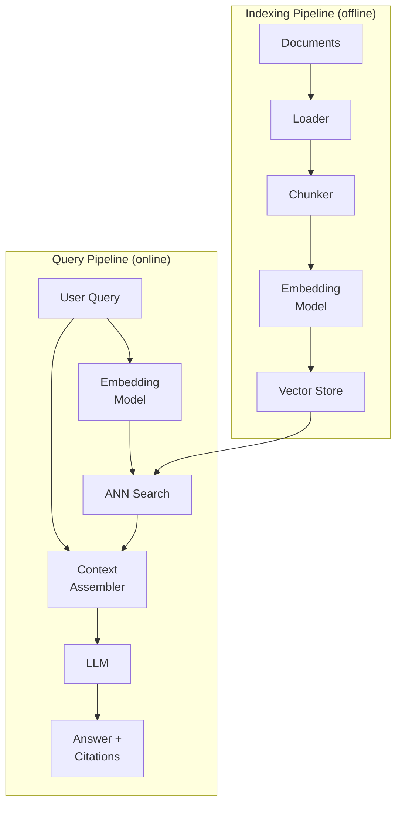
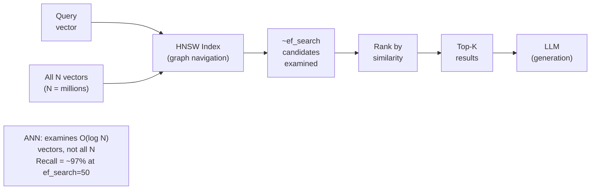
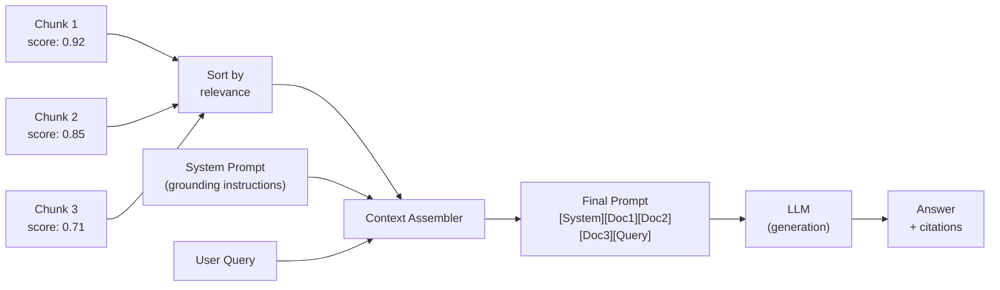

## Keywords in This File
{: .no_toc }

| # | Keyword | Weight |
|---|---|---|
| 7 | [RAG Pipeline Architecture](#rag-pipeline-architecture) | ★☆☆ |
| 8 | [Similarity Search and ANN](#similarity-search-and-ann) | ★☆☆ |
| 9 | [Context Assembly and Prompt Construction](#context-assembly-and-prompt-construction) | ★☆☆ |

---

# RAG Pipeline Architecture

**Interview Weight:** ★☆☆ - Understanding the
full pipeline from document ingestion to answer
generation.

---

### 🎯 Model Answer

**30 seconds:**

> A RAG pipeline has two sub-pipelines: indexing
> (offline) and retrieval-generation (online). Indexing:
> load documents, chunk, embed, store in vector DB.
> Retrieval-generation: receive query, embed query,
> search vector DB for top-K chunks, assemble prompt
> with retrieved chunks, send to LLM, return grounded
> answer. The separation is important: indexing runs
> once per document update; retrieval-generation
> runs for every user query.

**3 minutes:**

> The indexing pipeline (offline, runs once):
> (1) Document loading: read PDFs, web pages, databases,
>     APIs - whatever your knowledge sources are.
> (2) Chunking: split into retrievable units (256-1024
>     tokens with overlap).
> (3) Embedding: convert each chunk to a vector.
> (4) Metadata extraction: extract useful metadata
>     (author, date, section, category) for filtering.
> (5) Vector store write: upsert vectors + metadata
>     + text into the vector database.
>
> The query pipeline (online, runs per request):
> (1) Query preprocessing: clean input, optionally
>     expand or rewrite the query.
> (2) Query embedding: convert query to vector using
>     the same model used for indexing.
> (3) Retrieval: search vector DB for top-K similar
>     chunks; optionally filter by metadata.
> (4) Context assembly: combine query + retrieved
>     chunks into a structured prompt.
> (5) Generation: LLM generates answer from the
>     assembled context.
> (6) Post-processing: extract citations, format
>     response, optional faithfulness check.

**Blank Mind Recovery:**

**(1) Restate:** "What are the two sub-pipelines
in RAG and what does each do?"

**(2) First principles:** "Indexing = prepare your
library (once per update). Retrieval-generation =
use your library to answer a question (every request)."

---

### 📘 Concept Explanation

**What it is:**

The RAG pipeline is the sequence of processing
steps from raw documents to grounded LLM answers.
It has two distinct phases with different triggers:
the indexing pipeline (triggered by document updates)
and the query pipeline (triggered by user queries).

**Full pipeline:**

```
=== INDEXING PIPELINE (offline) ===

[Document Sources]
  Files, PDFs, DBs, APIs, Web pages
  |
  v
[Document Loader]
  Extract text from source format
  |
  v
[Text Chunker]
  Split: 256-1024 tokens, 10-20% overlap
  |
  v
[Metadata Extractor]
  Source, date, author, section, tags
  |
  v
[Embedding Model]
  text -> vector (768/1024/1536 dims)
  |
  v
[Vector Store]
  Upsert: {id, vector, text, metadata}

=== QUERY PIPELINE (online, per request) ===

[User Query]
  |
  v
[Query Preprocessor]
  Clean, optionally expand/rewrite
  |
  v
[Query Embedder]
  Same model as indexing!
  |
  v
[Retriever]
  ANN search, optional metadata filter
  Returns top-K {text, score, metadata}
  |
  v
[Context Assembler]
  Build prompt: system + docs + query
  |
  v
[LLM]
  Generate answer grounded in retrieved docs
  |
  v
[Post-Processor]
  Extract citations, format, quality check
  |
  v
[Response]
  Answer + source references
```

**Component responsibilities:**

```
COMPONENT              WHAT IT OWNS
---------              ------------
Document Loader        Format parsing (PDF, HTML, DOCX)
Chunker                Split strategy, overlap, boundaries
Metadata Extractor     Structured attributes for filtering
Embedding Model        text -> vector (shared by both paths)
Vector Store           Storage + ANN search
Query Preprocessor     Cleaning, expansion, rewriting
Context Assembler      Prompt template + document ordering
LLM                    Generation from retrieved context
Post-Processor         Citations, format, guardrails
```

---

### 💻 Code Example

```python
import anthropic
import json

# Minimal end-to-end RAG pipeline

def embed(text: str) -> list[float]:
    """Stub: replace with real embedding model."""
    return [0.1] * 768


class InMemoryVectorStore:
    """Stub vector store for illustration."""

    def __init__(self):
        self._chunks: list[dict] = []

    def add(self, chunk: dict):
        chunk["vector"] = embed(chunk["text"])
        self._chunks.append(chunk)

    def search(self, query: str, top_k: int = 3):
        q_vec = embed(query)
        # Stub: real impl uses cosine similarity
        return self._chunks[:top_k]


def build_indexing_pipeline(
    documents: list[dict]
) -> InMemoryVectorStore:
    """
    Indexing pipeline (runs on document updates).
    documents: [{text, source, section}]
    """
    store = InMemoryVectorStore()
    for doc in documents:
        # Chunk the document (simplified: 1 chunk/doc)
        chunk = {
            "text": doc["text"][:2000],  # simplified
            "source": doc.get("source", ""),
            "section": doc.get("section", "")
        }
        store.add(chunk)
    return store


def run_query_pipeline(
    query: str,
    store: InMemoryVectorStore
) -> dict:
    """
    Query pipeline (runs per user request).
    Returns answer + retrieved source metadata.
    """
    # 1. Retrieve
    retrieved = store.search(query, top_k=3)

    # 2. Assemble context
    context_parts = [
        f"[Source: {c.get('source', 'unknown')}, "
        f"Section: {c.get('section', '')}]\n{c['text']}"
        for c in retrieved
    ]
    context = "\n\n---\n\n".join(context_parts)

    # 3. Generate
    client = anthropic.Anthropic()
    resp = client.messages.create(
        model="claude-haiku-4-5",
        max_tokens=1024,
        system=(
            "You are a helpful assistant. "
            "Answer the user's question using ONLY "
            "the provided document excerpts. "
            "Always cite the [Source] for each claim. "
            "If the answer is not in the documents, "
            "respond: 'I don't have information on "
            "this in my knowledge base.'"
        ),
        messages=[{
            "role": "user",
            "content": (
                f"Documents:\n{context}\n\n"
                f"Question: {query}"
            )
        }]
    )
    answer = resp.content[0].text

    # 4. Post-process (extract source citations)
    sources = [c.get("source", "") for c in retrieved]
    return {
        "query": query,
        "answer": answer,
        "sources": list(set(sources)),
        "retrieved_count": len(retrieved)
    }


# Usage
if __name__ == "__main__":
    docs = [
        {
            "text": "Our return policy is 30 days.",
            "source": "policy-doc.pdf",
            "section": "Returns"
        },
        {
            "text": "Support is available Mon-Fri.",
            "source": "faq.pdf",
            "section": "Support"
        }
    ]

    store = build_indexing_pipeline(docs)
    result = run_query_pipeline(
        "What is the return policy?", store
    )
    print(json.dumps(result, indent=2))
```

> **Code walkthrough:** The pipeline is split cleanly
> into `build_indexing_pipeline` (runs once per
> document update) and `run_query_pipeline` (runs
> per request). The indexing pipeline adds documents
> to the vector store with metadata preserved. The
> query pipeline runs in order: retrieve top-K chunks
> from the store, assemble a structured prompt with
> source attribution, generate via LLM with explicit
> grounding instructions, and return both the answer
> and the list of cited sources. The key instruction
> "answer using ONLY the provided document excerpts"
> is critical for grounding - without it, the LLM
> may supplement with training knowledge.

---

### 🎓 Answers by Seniority

**Junior / Mid:**

> "A RAG pipeline has two parts. The indexing pipeline
> (runs when documents update): load documents, chunk,
> embed, store in vector DB. The query pipeline (runs
> per request): embed the query, search the vector DB,
> assemble a prompt with the retrieved chunks, generate
> with the LLM, return the answer with citations. The
> critical constraint: use the same embedding model
> for both indexing and querying."

---

**Senior / Staff:**

> "The RAG pipeline has two failure points: retrieval
> and generation. I design each independently with
> its own metrics: retrieval recall@5 (are the right
> chunks in top-5?), context precision (are the
> retrieved chunks relevant?), faithfulness (does
> the answer reflect the chunks?), and answer relevance
> (does the answer address the query?). I instrument
> each stage with logging so I can diagnose failures
> at the right component. A bad answer might be:
> retrieval got wrong chunks (retrieval problem),
> or got right chunks but LLM ignored them (generation
> problem). Separate observability for each stage
> is essential for production debugging."

---

### ⚠️ Common Misconceptions

**Misconception: "The RAG pipeline is just one
query to the LLM."**

RAG adds a retrieval step before the LLM call and
often additional steps after (post-processing,
faithfulness checks, citation extraction). Advanced
RAG systems also add steps before retrieval (query
rewriting, query decomposition for multi-hop questions)
and within retrieval (reranking the initial retrieved
set). A production RAG pipeline typically involves
3-7 distinct processing steps, multiple model calls,
and dedicated logging for each stage.

---

### 🚨 Failure Modes and Diagnosis

**Failure: Pipeline works in development, breaks
in production due to document format changes**

*Symptom:* After adding a new document source
(e.g., PDFs from a new vendor), retrieval quality
drops for those documents. The chunks retrieved
are garbled or contain extraction artifacts.

*Root cause:* The document loader extracts different
text for different PDF formats. PDFs can be: text-based
(extractable directly), image-based (requires OCR),
or hybrid. A loader that handles text PDFs may
fail on scanned PDFs, producing OCR artifacts or
empty text.

*Fix:* Add document type detection to the loading
step. Route different formats to appropriate loaders.
Log chunk quality metrics (average chunk length,
empty chunk count) after loading to detect format
issues before they reach the vector store.

---

### 🎯 Interview Deep-Dive

| Seniority | Time | Focus |
|---|---|---|
| Junior | 3 min | Two pipelines, component roles |
| Mid | 5 min | Pipeline design, failure handling |
| Senior | 8 min | Production instrumentation, optimization |

---

**[JUNIOR] Q1 - What are the two sub-pipelines
in RAG and what triggers each?**

Indexing pipeline (offline):
- Trigger: a new document is added or an existing
  document is updated in the knowledge base.
- Steps: load, chunk, embed, store.
- Frequency: once per document update (not per query).
- Goal: keep the vector store synchronized with
  the knowledge base.

Query pipeline (online):
- Trigger: a user submits a query.
- Steps: embed query, retrieve, assemble, generate.
- Frequency: every user request.
- Goal: generate an accurate, grounded answer.

The separation matters because: the indexing pipeline
is expensive (processes every document) but runs
infrequently. The query pipeline is cheap (processes
only the query) but runs constantly. Mixing them
(re-indexing on every query) would make the system
too slow and expensive.

*What separates good from great:* "Mixing them
would make the query pipeline too slow" - the
reason the separation is architecturally necessary.

---

**[MID] Q2 - What information should be logged
at each stage of the RAG pipeline for production
observability?**

Stage 1 - Indexing:
- Document count ingested per run
- Chunk count per document (detect outliers)
- Embedding failures (null chunks, OOM errors)
- Vector store write confirmation + final count
- Timestamp of last index update (stale index alert)

Stage 2 - Query:
- Query text (or hash for privacy)
- Retrieved chunks: IDs, scores, sources
- Context length (total tokens in prompt)
- LLM response: latency, tokens in/out
- Final answer (or hash)

Stage 3 - Quality (sample-based):
- Retrieval score distribution (P50/P95 of top-1 score)
- Low-score alerts (if top-1 score < threshold:
  likely retrieval failure)
- Answer length distribution (very short = "I don't
  know"; investigate context quality)

This logging enables: diagnosing individual request
failures (trace a bad answer to retrieval vs.
generation), detecting systematic regressions
(score distribution trending down), and measuring
end-to-end quality over time.

*What separates good from great:* "Low-score alerts"
as a proactive quality signal - detecting retrieval
failures before users complain.

---

**[SENIOR] Q3 - How do you handle document updates
in a production RAG system?**

Three update scenarios:

(1) New documents: embed + upsert to vector store.
    Simple. No existing vectors affected.

(2) Modified documents: the old chunks are stale.
    Process:
    - Delete all chunks associated with the old
      document ID from the vector store.
    - Re-chunk, re-embed, and re-insert the updated
      document.
    - This requires storing a mapping: document_id
      -> list of chunk vector IDs.

(3) Deleted documents: delete all chunks for that
    document from the vector store using the
    document_id -> chunk_ids mapping.

Implementation pattern:
- At indexing time: store metadata `{document_id,
  chunk_index}` with each vector.
- At update time: query vector store by document_id
  filter, delete all matches, re-index.

Pitfall: if you just add new chunks without deleting
old ones, both old and new versions of a document
exist in the index. Retrieval may return outdated
information from the old chunks alongside current
information from the new ones.

*What separates good from great:* "Delete old chunks
before adding new ones" as a non-obvious but critical
consistency requirement.

---

**[SENIOR] Q4 - [TRADE-OFF] When do you add a
reranking step to the RAG pipeline?**

Reranking: after initial ANN retrieval (top-K
candidates), run a more expensive but more accurate
model (cross-encoder) to re-score and re-order
the candidates.

Reranking adds latency (100-500ms extra). It's
justified when:

(1) Retrieval precision is low: ANN search returns
    related but not truly relevant documents. The
    cross-encoder can distinguish between a document
    that mentions the query topic and one that
    actually answers the query.

(2) High-stakes domain: medical, legal, financial
    - where a wrong retrieved document causes
    a dangerous answer.

(3) Long documents or dense technical content:
    the bi-encoder (embedding model) may not capture
    fine-grained relevance for specialized content.
    Cross-encoders read both query and document
    together and can catch subtle relevance signals.

Trade-off:
- Without reranking: fast (50ms), moderate precision
- With reranking: +100-500ms, higher precision

The latency cost is often acceptable because:
retrieval + reranking (150ms) is still much faster
than a second LLM call (1000+ms). Reranking is
one of the highest-ROI improvements for RAG quality.

*What separates good from great:* "Highest-ROI
improvement" as the practical evaluation of reranking's
value.

---

**[SENIOR] Q5 - How do you handle multi-hop questions
in RAG? ("What is the capital of the country where
the Eiffel Tower is located?")**

Multi-hop questions require information from multiple
documents, where the first retrieval informs what
to retrieve next.

Single-hop RAG fails: "What is the capital of the
country where the Eiffel Tower is located?" A single
retrieval for "Eiffel Tower capital" may not retrieve
the right documents.

Solutions:

(1) Query decomposition: before retrieval, use an
    LLM to decompose the complex query into sub-queries:
    Sub-query 1: "What country is the Eiffel Tower in?"
    Sub-query 2: "What is the capital of France?"
    Retrieve for each sub-query separately, then
    combine results for the final generation step.

(2) Iterative retrieval: retrieve, generate intermediate
    answer, use intermediate answer as new query,
    retrieve again. Repeat until the full answer
    is assembled.

(3) Graph RAG: store documents as a knowledge graph
    (entities + relationships). Multi-hop traversal
    naturally follows relationships between entities.

Complexity: multi-hop adds latency (multiple
retrieval steps) and complexity (query decomposition
logic). Reserve for applications where multi-hop
questions are common (knowledge-intensive Q&A,
research assistants).

*What separates good from great:* Naming three
distinct approaches with different trade-offs.

---

**[SENIOR] Q6 - What is the "RAG triad" and why
does it matter?**

The RAG triad is the three-way quality measurement
framework from RAGAS and TruLens: context relevance,
groundedness, and answer relevance. Together they
characterize where quality breaks down.

Context Relevance: is the retrieved context relevant
to the question? Low score = retrieval problem.
(Retrieved wrong documents.)

Groundedness (Faithfulness): is the answer grounded
in the retrieved context? Low score = generation
problem. (LLM ignored context or hallucinated.)

Answer Relevance: does the answer address the question?
Low score = answer quality problem. (Answer is
factually correct but doesn't answer what was asked.)

Why it matters:

Without decomposing quality into the RAG triad,
a low-quality answer is just "bad" - you don't
know if to fix the retrieval, the generation, or
the prompt. The triad tells you exactly which
component to fix:
- Context Relevance low: fix chunking, embedding,
  or retrieval parameters
- Groundedness low: fix system prompt, add stronger
  grounding instructions, check for LLM ignoring context
- Answer Relevance low: fix query preprocessing
  or answer generation instructions

*What separates good from great:* "The triad tells
you which component to fix" - the diagnostic value
of decomposed metrics.

---

**[SENIOR] Q7 - [DEBUGGING] A RAG pipeline is
slow. How do you find and fix the bottleneck?**

Profiling steps:

(1) Instrument each stage with timing:
    - Document loading: ms per document
    - Chunking: ms per document
    - Embedding: ms per chunk (or batch)
    - Vector store write: ms per batch
    - Query embedding: ms per query
    - ANN search: ms per query
    - LLM generation: ms per query (first token + total)

(2) Identify the slowest stage. Common culprits:

**Embedding bottleneck (indexing):**
- Embedding a large corpus one-by-one is slow
- Fix: batch embedding (embed 100 chunks per API call)
- Commercial APIs: most support batch embedding

**Vector store write bottleneck:**
- Writing vectors one-by-one is slow
- Fix: batch upsert (1000 vectors per batch)

**LLM generation bottleneck (query):**
- LLM is usually the slowest step at 1-3s
- Fix: streaming (return tokens as generated),
  use faster model for retrieval-intensive queries,
  cache common query-answer pairs

**Embedding bottleneck (query):**
- Embedding model slow at inference
- Fix: use a smaller, faster embedding model
  (all-MiniLM-L6: 384 dims, very fast)
- Or cache embeddings for repeated queries

(3) Add concurrency for independent steps:
    Chunking is parallelizable (each chunk is
    independent). Embedding batches can run concurrently.

*What separates good from great:* "Batch embedding"
and "batch upsert" as the first fixes for indexing
performance.

---

### ⚖️ Comparison Table

| Pipeline Type | Trigger | Frequency | Cost per Run |
|---|---|---|---|
| Naive RAG | Document update | Per doc update | Embed all chunks |
| Incremental RAG | Document delta | Per change | Embed new/changed chunks only |
| Streaming RAG | Continuous input | Real-time | Per document as it arrives |
| Batch RAG | Scheduled | Daily/weekly | Full re-index |

---

### 🏛️ System Design

*(Omit: ★☆☆ concept.)*

---

### 📊 Diagram

```
RAG PIPELINE:

INDEXING (offline):
Docs -> Loader -> Chunker -> Embedder -> VectorDB

QUERY (online):
Query -> Embedder -> VectorDB.search
         -> Context Assembler -> LLM -> Answer
```



> **Diagram walkthrough:** The two pipelines share
> one component: the embedding model (used at indexing
> to embed documents and at query time to embed the
> query). The indexing pipeline flows left to right,
> ending with vectors stored in the vector store.
> The query pipeline converges: the query embedding
> and the stored document embeddings both feed into
> the ANN search. The ANN search results AND the
> original query both feed the context assembler,
> which combines them into the final prompt. The
> LLM sees: the system prompt (grounding instructions),
> the retrieved document chunks, and the user query.

---

---

# Similarity Search and ANN

**Interview Weight:** ★☆☆ - The technical mechanism
behind vector retrieval. Understanding ANN vs.
exact search trade-offs.

---

### 🎯 Model Answer

**30 seconds:**

> Similarity search finds the N vectors most similar
> to a query vector. Exact similarity search (brute
> force) computes similarity for every stored vector
> - accurate but O(N) and too slow at scale. Approximate
> nearest neighbor (ANN) uses an index (HNSW, IVF)
> to find very similar vectors in O(log N) time.
> The trade-off: ANN may miss a small number of
> the truly nearest vectors (approximate). In practice,
> ANN achieves > 95% recall at 10-100x speed improvement.

**3 minutes:**

> The problem: for RAG with 1M document chunks,
> brute force similarity search requires 1M cosine
> similarity computations per query. Each computation
> for 1536-dim vectors = thousands of floating-point
> ops. Result: seconds per query. Unacceptable for
> production.
>
> ANN algorithms build a data structure (index) that
> allows fast approximate similarity search. The
> two main approaches:
>
> HNSW (Hierarchical Navigable Small World): builds
> a multi-layer graph. Search navigates the graph
> from coarse to fine, never scanning all N vectors.
> Fast at query time, expensive to build (O(N log N)).
> Best for: low-latency read-heavy workloads.
>
> IVF (Inverted File Index): groups vectors into
> clusters (voronoi cells). Search only examines
> vectors in the nearest clusters. Fast to build,
> slightly less accurate than HNSW. Best for: write-
> heavy workloads or very large collections where
> HNSW memory is prohibitive.
>
> Quality control parameter: `ef_search` (HNSW) or
> `nprobe` (IVF) controls the speed-accuracy trade-off
> at query time. Higher value = more accurate (approaches
> exact search) but slower. Default values achieve
> > 95% recall at production query speeds.

**Blank Mind Recovery:**

**(1) Restate:** "What is ANN and why is it used
instead of exact search in RAG?"

**(2) First principles:** "Finding the most similar
needle in a haystack of 1M needles takes too long
if you check every needle. ANN builds a map that
lets you jump to the right neighborhood, then
check only a few."

---

### 📘 Concept Explanation

**What it is:**

Similarity search is the retrieval operation in
RAG: given a query vector, find the K stored vectors
that are most similar (highest cosine similarity).
Approximate Nearest Neighbor (ANN) is the class
of algorithms that make this search fast for large
collections.

**Similarity metrics:**

```
METRIC         FORMULA                USE WHEN
------         -------                --------
Cosine         A·B / (|A||B|)         Embedding vectors
similarity                            (text, images)

Dot product    A·B                    Normalized vectors
                                      (cosine on normalized = dot)

Euclidean      sqrt(sum((a-b)^2))     Unormalized vectors,
distance                              image patches

Manhattan      sum(|a-b|)             Sparse, categorical
```

**ANN vs. exact search:**

```
EXACT SEARCH (brute force):
  Compute similarity with EVERY stored vector
  Time complexity: O(N * D)  where D = dimensions
  At N=1M, D=1024: 1 billion float ops per query
  Latency: seconds

ANN SEARCH (HNSW/IVF):
  Navigate index, examine subset of vectors
  Time complexity: ~O(D * log N)
  At N=1M, D=1024: millions of ops per query
  Latency: 1-10ms
  Cost: may miss up to 5% of truly nearest vectors
```

**Recall vs. speed trade-off:**

```
ef_search   Recall    Latency
---------   ------    -------
10          ~90%      1ms
50          ~97%      5ms
100         ~99%      10ms
500         ~99.9%    50ms
"Exact"     100%      1000ms+

For RAG: ef_search=50 is typically the sweet spot
```

---

### 💻 Code Example

```python
# Showing similarity search concepts

import numpy as np
from typing import Callable

def cosine_similarity(
    a: np.ndarray, b: np.ndarray
) -> float:
    """For normalized vectors: dot product = cosine."""
    return float(np.dot(a, b))


def exact_similarity_search(
    query: np.ndarray,
    stored: list[tuple[str, np.ndarray]],
    top_k: int = 5
) -> list[tuple[str, float]]:
    """
    Exact (brute force) search.
    O(N * D) - prohibitively slow at N > 10K.
    Use only for small collections or testing.
    """
    scores = [
        (doc_id, cosine_similarity(query, vec))
        for doc_id, vec in stored
    ]
    scores.sort(key=lambda x: x[1], reverse=True)
    return scores[:top_k]


# ANN with FAISS (production alternative)
# pip install faiss-cpu
def build_faiss_index(
    vectors: list[np.ndarray],
    use_hnsw: bool = True
) -> tuple:  # (index, id_map)
    """
    Build HNSW or IVF index.
    Returns index + mapping from FAISS id to doc id.
    """
    try:
        import faiss
        dim = len(vectors[0])
        matrix = np.array(vectors, dtype="float32")

        if use_hnsw:
            # HNSW: low latency, high memory
            index = faiss.IndexHNSWFlat(dim, 32)
            # M=32: connections per node (accuracy vs memory)
        else:
            # IVF: lower memory, slightly less accurate
            nlist = max(4, int(len(vectors) ** 0.5))
            quantizer = faiss.IndexFlatL2(dim)
            index = faiss.IndexIVFFlat(
                quantizer, dim, nlist
            )
            index.train(matrix)
            index.nprobe = 10  # clusters to search

        index.add(matrix)
        return index
    except ImportError:
        return None  # faiss not available


def ann_search(
    query: np.ndarray,
    index,  # FAISS index
    k: int = 5
) -> list[int]:
    """
    ANN search: returns top-k indices.
    10-100x faster than exact search.
    """
    if index is None:
        return list(range(k))  # stub
    import faiss
    query_matrix = np.array([query], dtype="float32")
    # D = distances, I = indices
    D, I = index.search(query_matrix, k)
    return I[0].tolist()


# Measuring ANN recall vs. exact search
def measure_recall(
    queries: list[np.ndarray],
    stored: list[tuple[str, np.ndarray]],
    ann_search_fn: Callable,
    k: int = 5
) -> float:
    """
    Compare ANN results to exact search.
    Recall = fraction of exact top-k found in ANN top-k.
    """
    total_recall = 0.0
    for q in queries:
        exact_ids = {
            doc_id for doc_id, _ in
            exact_similarity_search(q, stored, k)
        }
        ann_ids = set(ann_search_fn(q, top_k=k))
        recall = len(exact_ids & ann_ids) / k
        total_recall += recall
    return total_recall / len(queries) if queries else 0.0
```

> **Code walkthrough:** `exact_similarity_search`
> computes cosine similarity against every stored
> vector - accurate but O(N). Fine for < 10K vectors;
> prohibitively slow for 1M+. The FAISS index shows
> both HNSW (best for read-heavy, low-latency) and
> IVF (train + probe, better for write-heavy or
> memory-constrained). `measure_recall` implements
> the quality metric: how many of the exact top-K
> appear in the ANN top-K? Production target: > 95%
> recall@10. The `nprobe` (IVF) and HNSW graph
> parameters control the recall-speed trade-off.

---

### 🎓 Answers by Seniority

**Junior / Mid:**

> "Similarity search finds the most similar vectors
> to a query. Exact search checks every vector
> (accurate but slow at scale). ANN uses an index
> to find very similar vectors quickly (may miss
> a small fraction). For RAG: ANN achieves > 95%
> accuracy at 10-100x speed improvement. The main
> algorithms: HNSW (best latency, higher memory)
> and IVF (more memory efficient). Vector databases
> like Qdrant and Pinecone use these algorithms
> under the hood."

---

**Senior / Staff:**

> "ANN recall is a system parameter, not a fixed
> property. By adjusting ef_search (HNSW), you trade
> latency for recall. For most RAG applications,
> ef_search=50 (> 97% recall, ~5ms) is the right
> balance. If the application is safety-critical
> (medical, legal), increase ef_search toward 100+.
> If latency is critical and recall can be slightly
> lower, decrease ef_search. The important thing:
> measure recall against your actual data, not
> theoretical guarantees."

---

### ⚠️ Common Misconceptions

**Misconception: "ANN search finds the exact nearest
neighbors."**

ANN search finds APPROXIMATE nearest neighbors -
it may miss some of the truly closest vectors.
This is the fundamental trade-off for speed: a
perfectly accurate ANN search degenerates to O(N)
exact search. For typical RAG applications, the
approximation is acceptable (> 95% recall) because
missing 1-2 of the top-10 similar chunks rarely
affects answer quality. For high-stakes applications
where every relevant document matters, use higher
ef_search values or consider exact search for
small collections.

---

### 🚨 Failure Modes and Diagnosis

**Failure: ANN recall drops after index grows
past a threshold**

*Symptom:* Retrieval quality was good at 100K vectors,
degraded noticeably after growing to 1M.

*Root cause:* HNSW's M parameter (connections per
node) was set too low for the current collection
size. As the index grows, under-connected nodes
create "isolated regions" that greedy search
can't navigate to.

*Diagnosis:* Measure recall@5 at different collection
sizes (100K, 500K, 1M). If recall drops as size
grows: index connectivity is insufficient.

*Fix:* Rebuild the index with a higher M value
(32 -> 64). M=64 provides better recall at large
scales at the cost of ~2x memory for the graph.
Alternative: increase ef_search (no rebuild) to
partially compensate.

---

### 🎯 Interview Deep-Dive

| Seniority | Time | Focus |
|---|---|---|
| Junior | 3 min | Similarity metrics, why ANN needed |
| Mid | 5 min | HNSW vs. IVF, recall measurement |
| Senior | 8 min | Parameter tuning, production trade-offs |

---

**[JUNIOR] Q1 - What is the difference between
cosine similarity and Euclidean distance for
embedding retrieval?**

Cosine similarity: measures the angle between two
vectors. Range: -1 to 1. Only the direction matters,
not the magnitude. Two vectors pointing in the same
direction have similarity 1 even if one is 2x longer.

Euclidean distance: measures the straight-line
distance between two points. Magnitude matters.
Two identical-direction vectors with different
magnitudes have large Euclidean distance.

For text embeddings: cosine similarity is standard.
Why: the same text embedded in a shorter or longer
context may produce vectors of different magnitudes
but similar directions. Cosine similarity correctly
identifies them as similar; Euclidean distance
would not.

Practical shortcut: if you L2-normalize all vectors
(divide each by its magnitude = force magnitude 1),
cosine similarity equals dot product. This is why
most embedding models normalize output by default.
Dot product is faster to compute than full cosine
similarity formula.

*What separates good from great:* "L2-normalization
makes dot product = cosine similarity" as the
practical efficiency insight.

---

**[MID] Q2 - When is HNSW better than IVF and
vice versa?**

HNSW better when:
- Low query latency is critical (1-10ms queries)
- Read-heavy workload (many queries, few updates)
- Collection fits in RAM
- Moderate collection size (< 100M vectors)

IVF better when:
- Memory is constrained (IVF + product quantization
  can compress vectors significantly)
- Write-heavy workload (IVF index rebuild is faster
  than HNSW for large batches)
- Very large collections (> 100M vectors) where
  HNSW graph memory becomes prohibitive

Hybrid: IVF-PQ (Inverted File + Product Quantization)
is the choice for very large collections where
memory efficiency is critical. Coarser recall but
dramatically lower memory.

For most RAG applications (< 10M vectors, read-
heavy): HNSW is the right default. pgvector, Qdrant,
and Weaviate all default to HNSW for good reason.

*What separates good from great:* IVF-PQ as the
third option for very large scale, not just "IVF
for large collections."

---

**[MID] Q3 - How do you measure ANN recall in
production?**

Two approaches:

(1) Offline golden test set:
    Create 50-100 (query, expected top-5 document IDs)
    pairs from real data. Run ANN and exact search.
    Measure: how many of exact top-5 appear in ANN
    top-5? Goal: > 95%.

(2) Shadow exact search:
    For a random 1% of production queries, run both
    ANN and exact search in parallel. Compare results.
    Report: recall@K for that sample. Alert if
    recall drops below threshold.

Shadow exact search is expensive (runs exact search
for 1% of traffic) but gives ground-truth recall
measurement on actual production query distribution.

When to re-measure:
- After growing the index by > 50%
- After changing HNSW parameters
- After changing the embedding model

Alerting threshold: if recall@5 drops below 0.90,
investigate index health (connectivity, memory
pressure, parameter tuning).

*What separates good from great:* "Shadow exact
search on 1% of traffic" as the production measurement
approach.

---

**[SENIOR] Q4 - [TRADE-OFF] How do you tune ef_search
for a production RAG system?**

ef_search controls how many candidate vectors HNSW
examines during query execution. Higher = more
accurate (approaches exact) but slower.

Tuning process:

(1) Measure baseline: with default ef_search (typically
    50), run recall measurement (shadow exact search
    or golden test set). Record P50/P95 query latency.

(2) Define targets:
    - Acceptable recall: > 0.95 for most RAG
    - P99 latency target: < 50ms for retrieval step

(3) Sweep ef_search values: test recall and latency
    at ef_search = [10, 25, 50, 100, 200].
    Plot recall vs. latency for your specific data.

(4) Choose the point where:
    - Recall meets the target (> 0.95)
    - Latency is within budget (< 50ms)
    - Further increasing ef_search adds diminishing
      recall improvement

For most RAG: ef_search = 50-100 is the sweet spot.
For safety-critical RAG (medical, legal): ef_search
= 100-200 (accept higher latency for higher recall).

Important: ef_search can be changed at query time
without rebuilding the index. Different query types
can use different ef_search values (simple queries:
low ef_search; complex/high-stakes: high ef_search).

*What separates good from great:* "Different query
types can use different ef_search values" - per-query
tuning without index rebuild.

---

**[SENIOR] Q5 - What is retrieval at different
recall levels: what does 90% vs 99% recall mean
in practice for RAG?**

Recall@5 = fraction of queries where the correct
document is in the top-5 retrieved.

90% recall: for 10% of queries, the most relevant
document for answering correctly is NOT in the
top-5. The LLM generates from suboptimal context.
For informational Q&A: usually acceptable (the
second-best documents often still contain partial
answers). For high-stakes: not acceptable.

95% recall: for 5% of queries, the best document
is missed. This is the minimum acceptable threshold
for most production RAG.

99% recall: for 1% of queries, the best document
is missed. For general knowledge RAG: excellent.
For compliance, medical, or financial RAG: still
investigate the 1%.

100% recall: exact search. O(N) at query time.
Only feasible for very small collections.

The gap between 90% and 99%: 9% of queries potentially
have worse answers. At 1M queries/day: 90,000 queries
per day with potentially degraded answers from the
90% system, vs. 10,000 from the 99% system. For
high-volume systems: this is a meaningful quality
difference.

*What separates good from great:* The 1M queries/day
calculation showing that small recall differences
have large absolute impact at scale.

---

**[SENIOR] Q6 - How does dimensionality reduction
affect ANN search quality?**

High-dimensional vectors (1536 dim) are expensive:
more memory, slower distance computations. Dimensionality
reduction (PCA, UMAP, matryoshka representation)
compresses vectors to fewer dimensions.

OpenAI text-embedding-3 supports matryoshka
representation: the model produces 1536-dim vectors
where the first N dimensions capture the most
important semantic information. You can truncate
to 512 or 256 dims with modest quality loss.

Quality impact of dimension reduction:
- 1536 -> 1024 dims: ~1-2% recall loss, 1.5x memory
  savings
- 1536 -> 512 dims: ~3-5% recall loss, 3x memory
  savings
- 1536 -> 256 dims: ~10-15% recall loss, 6x memory
  savings

When to use:
- Memory-constrained environments: dimension reduction
  is often more practical than quantization for
  maintaining quality at lower memory.
- Cost-sensitive indexing: fewer dimensions = fewer
  computations = cheaper ANN search.

Trade-off: dimension reduction degrades recall.
Quantization degrades recall. Combining both
degrades recall more. Test empirically on your data.

*What separates good from great:* "Matryoshka
representation" as the mechanism in OpenAI's latest
models that enables clean dimension reduction.

---

**[SENIOR] Q7 - [DEBUGGING] ANN search returns
different results for identical queries. How do
you diagnose?**

Non-determinism in ANN: HNSW with concurrent updates
can return slightly different results for identical
queries if the graph is being modified during search.

Root causes:

(1) Concurrent index updates: if new documents are
    being indexed while queries are running, the
    HNSW graph is in flux. Different query executions
    may read different graph states.

    Fix: separate indexing from querying. Use read
    replicas: the write node handles indexing, replicas
    handle queries. Periodic snapshot promotion
    to read replicas.

(2) Random seed in ANN algorithms: some IVF
    implementations use random initialization.
    Queries can return slightly different clusters
    if re-initialized.

    Fix: set a deterministic random seed for the
    index. Or use HNSW (deterministic at query time).

(3) Multi-threading: some ANN libraries are not
    thread-safe for concurrent queries.

    Fix: verify thread safety of the library version.
    Some libraries require locking around search
    operations.

Diagnosis: log the exact query vector (or its hash),
retrieved doc IDs, and scores for every query. If
two queries with identical vectors return different
docs: non-determinism confirmed. Check for concurrent
writes during those queries.

*What separates good from great:* "Read replicas
with snapshot promotion" as the clean architectural
fix for concurrent indexing/querying.

---

### ⚖️ Comparison Table

| Algorithm | Latency | Memory | Build Time | Recall | Best For |
|---|---|---|---|---|---|
| Brute force | Very slow | Low | None | 100% | < 10K vectors |
| HNSW | Fast (1-10ms) | High | Medium | 95-99%+ | Read-heavy, moderate size |
| IVF | Medium | Medium | Fast | 90-97% | Write-heavy, large scale |
| IVF-PQ | Fast | Very low | Medium | 85-95% | Very large, memory-constrained |

---

### 🏛️ System Design

*(Omit: ★☆☆ concept.)*

---

### 📊 Diagram

```
ANN SEARCH CONCEPT:

Query point Q
     |
     v
Navigate graph/clusters toward Q's region
     |
     v
Examine small neighborhood (not all N points)
     |
     v
Return top-K from examined candidates
     (May miss a few truly nearest - "approximate")
```



> **Diagram walkthrough:** The ANN search step is
> the bridge between the query vector and the retrieved
> documents. Instead of comparing against all N
> stored vectors (brute force), HNSW navigates its
> graph structure to identify a small set of candidates
> (controlled by ef_search). Only these candidates
> are scored and ranked. The result: retrieval in
> milliseconds instead of seconds. The "approximate"
> trade-off is acceptable because: (1) missing one
> of the top-10 similar chunks rarely affects final
> answer quality; (2) ef_search can be increased
> for higher precision when needed.

---

---

# Context Assembly and Prompt Construction

**Interview Weight:** ★☆☆ - How retrieved documents
are combined with the query to form the LLM prompt.
Small changes here have large effects on answer quality.

---

### 🎯 Model Answer

**30 seconds:**

> Context assembly combines the retrieved documents
> and the user query into the final prompt sent
> to the LLM. Key decisions: how to format the
> documents (labeled sections vs. plain text), how
> to order them (highest relevance first or last?),
> how many to include (enough context vs. context
> window budget), and what system prompt instructions
> to use (grounding, citation format, uncertainty
> expression). These choices directly affect answer
> quality and faithfulness.

**3 minutes:**

> The context assembly step sits between retrieval
> and generation. Its job is to format the retrieved
> information so the LLM can use it effectively.
>
> What matters in context assembly:
>
> Source labeling: mark each retrieved chunk with
> its source (document name, section, URL). The
> LLM can then cite sources, and users can verify
> answers. Without labels: the LLM may hallucinate
> citation details.
>
> Ordering: where you place the most relevant
> information matters. LLMs have an "attention
> bias" toward information at the beginning and
> end of the context (the "lost in the middle"
> effect). Place the most relevant chunk first
> or last.
>
> Token budget: LLMs have a finite context window.
> If you include too many chunks: the window fills
> up, costs increase, and "lost in the middle"
> degrades quality. If too few: important context
> may be missing. Typical: 3-5 chunks totaling
> 1000-3000 tokens.
>
> System prompt grounding instructions: "Answer
> ONLY from the provided documents" is the key
> instruction that prevents the LLM from supplementing
> with training knowledge. "If the answer is not
> in the documents, say so" is equally important
> to prevent hallucination when retrieval misses.

**Blank Mind Recovery:**

**(1) Restate:** "What is context assembly in RAG
and what are the key decisions?"

**(2) First principles:** "The prompt is what the
LLM reads. If I format it poorly, the LLM gives
poor answers - even if I retrieved the right documents."

---

### 📘 Concept Explanation

**What it is:**

Context assembly (prompt construction) is the process
of combining: retrieved document chunks + user query
+ system instructions into the final prompt sent
to the LLM. The assembly format directly affects
how well the LLM uses the retrieved context.

**Prompt structure for RAG:**

```
[SYSTEM PROMPT]
  Role definition
  Grounding instructions (answer from docs only)
  Citation format instructions
  Uncertainty expression (say I don't know)

[RETRIEVED CONTEXT]
  [Doc 1: {source}, {section}]
  {chunk text}

  [Doc 2: {source}, {section}]
  {chunk text}

  (max 3-5 docs, 1000-3000 tokens total)

[USER QUERY]
  {original query}
```

**The "lost in the middle" effect:**

```
Position in context    Attention strength
--------------------   -----------------
First 20% (start)      HIGH
Middle 60%             LOW
Last 20% (end)         HIGH

Strategy: put most relevant chunk first or last.
Put least relevant in the middle.
```

**Grounding instruction strength levels:**

```
WEAK (hallucination-prone):
  "Use the provided documents to help answer."

MEDIUM:
  "Answer based on the provided documents."

STRONG (recommended):
  "Answer ONLY from the provided documents.
   Do not use any other knowledge. If the
   answer is not in the documents, say:
   'I don't have information on this.'"
```

---

### 💻 Code Example

```python
# Context assembly patterns

from dataclasses import dataclass

@dataclass
class RetrievedChunk:
    text: str
    source: str
    section: str
    score: float


# BAD: no structure, no grounding
def bad_assemble_prompt(
    query: str,
    chunks: list[RetrievedChunk]
) -> dict:
    """No source labels, weak grounding instruction."""
    context = " ".join(c.text for c in chunks)
    return {
        "system": "You are a helpful assistant.",
        "user": f"Context: {context}\n\nQ: {query}"
    }
# Problems:
# - No source labels: LLM can't cite accurately
# - Weak system prompt: LLM may supplement with
#   training knowledge
# - All context crammed together: LLM loses track
#   of where information came from


# GOOD: structured context with grounding
def good_assemble_prompt(
    query: str,
    chunks: list[RetrievedChunk],
    max_context_tokens: int = 3000
) -> dict:
    """
    Best practices:
    - Source-labeled sections
    - Strong grounding instruction
    - Token budget management
    - Most relevant first (highest score)
    """
    # Sort by score (most relevant first = LLM sees first)
    sorted_chunks = sorted(
        chunks, key=lambda c: c.score, reverse=True
    )

    # Assemble context with budget management
    context_parts = []
    token_count = 0
    chars_per_token = 4  # approximation

    for i, chunk in enumerate(sorted_chunks):
        chunk_tokens = len(chunk.text) // chars_per_token
        if token_count + chunk_tokens > max_context_tokens:
            break
        context_parts.append(
            f"[Document {i+1}]\n"
            f"Source: {chunk.source}\n"
            f"Section: {chunk.section}\n"
            f"Relevance score: {chunk.score:.2f}\n\n"
            f"{chunk.text}"
        )
        token_count += chunk_tokens

    context = "\n\n---\n\n".join(context_parts)

    system_prompt = (
        "You are a helpful assistant with access to "
        "specific documentation excerpts.\n\n"
        "CRITICAL INSTRUCTIONS:\n"
        "1. Answer ONLY from the provided document "
        "excerpts below.\n"
        "2. Do NOT use any knowledge from your "
        "training. Only use what is in the documents.\n"
        "3. For every factual claim, cite the source "
        "as [Document N].\n"
        "4. If the answer is not in the documents, "
        "respond EXACTLY: "
        "'This information is not in my knowledge base.'\n"
        "5. Do not speculate or extrapolate beyond "
        "what the documents state."
    )

    return {
        "system": system_prompt,
        "user": (
            f"Document excerpts:\n\n{context}\n\n"
            f"---\n\nQuestion: {query}"
        )
    }


# Advanced: dynamic system prompt based on query type
def adaptive_assemble_prompt(
    query: str,
    chunks: list[RetrievedChunk],
    query_type: str = "factual"  # factual/comparative/procedural
) -> dict:
    """
    Tailor prompt based on query intent.
    """
    type_instructions = {
        "factual": (
            "Provide a direct, concise answer. "
            "Cite the specific document."
        ),
        "comparative": (
            "Compare options as described in the "
            "documents. Use a structured comparison "
            "if helpful."
        ),
        "procedural": (
            "List the steps in the order shown in "
            "the documents. Number each step."
        )
    }
    type_instr = type_instructions.get(
        query_type, type_instructions["factual"]
    )
    base = good_assemble_prompt(query, chunks)
    base["system"] += f"\n\nFor this query: {type_instr}"
    return base
```

> **Code walkthrough:** The BAD example dumps all
> chunks into a single string without labels and
> uses a generic system prompt. The LLM receives
> no guidance about grounding or citation format.
> The GOOD example addresses each failure: sorted
> by relevance score (most relevant first to benefit
> from attention bias), each chunk labeled with
> source and section (LLM can cite accurately),
> token budget management (prevents context overflow),
> and a strong five-rule system prompt that explicitly
> prohibits using training knowledge and instructs
> the LLM to say "not in knowledge base" when needed.
> The adaptive version shows that prompt instructions
> can be tailored to the query type (procedural
> questions need step-by-step instructions; comparisons
> need structured output).

---

### 🎓 Answers by Seniority

**Junior / Mid:**

> "Context assembly takes the retrieved chunks and
> formats them into the LLM prompt. Key things: label
> each chunk with its source so the LLM can cite
> it, put the most relevant chunk first, include
> a strong grounding instruction ('answer ONLY from
> the provided documents'), and manage the token
> budget. The system prompt quality is as important
> as retrieval quality - even the right documents
> produce wrong answers if the prompt doesn't constrain
> the LLM."

---

**Senior / Staff:**

> "Context assembly is where I spend most time tuning
> in production RAG. The biggest lever: grounding
> instruction strength. Weak grounding = LLM supplements
> retrieved facts with training knowledge, producing
> confident but wrong answers. Strong grounding =
> LLM stays in the documents, says 'I don't know'
> when appropriate. The second lever: document ordering
> due to the 'lost in the middle' effect. The third:
> number of retrieved chunks - more is not always
> better. Adding a 4th or 5th chunk that's marginally
> relevant often hurts answer quality (more noise,
> more lost-in-the-middle effect)."

---

### ⚠️ Common Misconceptions

**Misconception: "Include as many retrieved chunks
as possible to give the LLM more information."**

More context is not always better. Each additional
chunk: (1) increases token cost, (2) may introduce
irrelevant information that confuses the LLM, (3)
shifts the most relevant information toward the
middle of the context (lost in the middle effect).
Production best practice: 3-5 chunks with a relevance
score threshold. If a chunk scores below 0.6 cosine
similarity: exclude it even if it's in the top-K.
Low-relevance chunks add noise, not signal.

---

### 🚨 Failure Modes and Diagnosis

**Failure: LLM answers with training knowledge
instead of retrieved context**

*Symptom:* The answer contains information not
in any retrieved document. Often happens for well-
known topics where the LLM has strong training
data.

*Root cause:* Weak grounding instruction. The LLM
defaults to training knowledge when the context
doesn't fully answer the question, or when training
knowledge contradicts the documents.

*Diagnosis:* Add a faithfulness check: after
generation, prompt a second LLM call: "Is every
factual claim in this answer supported by the
provided documents? List any claims that are not."

*Fix:* Strengthen the system prompt:
- Add "Do NOT use your training knowledge"
- Add "If the documents don't answer the question,
  say 'I don't have information on this'"
- For high-stakes: add an explicit "forbidden list":
  "Do not mention [topic] unless it is in the documents"

---

### 🎯 Interview Deep-Dive

| Seniority | Time | Focus |
|---|---|---|
| Junior | 3 min | Prompt structure, source labeling |
| Mid | 5 min | Token budget, ordering, grounding |
| Senior | 8 min | Failure modes, adaptive prompts, quality |

---

**[JUNIOR] Q1 - Why is source labeling important
in context assembly?**

Source labeling: marking each retrieved chunk with
its origin (document name, URL, section, page).

Why essential:

(1) Citation accuracy: if chunks are labeled "[Doc 1]:
    Policy Guide, Section 3.2", the LLM can cite
    "[Doc 1]" accurately. Without labels, the LLM
    may fabricate citation details.

(2) User verification: users can follow citations
    to verify answers. Without source labels: the
    answer is a black box.

(3) Compliance/audit: regulated industries require
    every answer to trace to a source document.
    Source labels in the prompt become source
    citations in the answer.

(4) Multi-document disambiguation: if two chunks
    contain conflicting information, source labels
    allow the LLM to say "According to Policy Guide
    v1.2: X, but the newer guide v2.0 states: Y."
    Without labels: the LLM can't distinguish sources.

*What separates good from great:* "Multi-document
disambiguation" - the case where two sources conflict
and source labels are the only way to handle it.

---

**[MID] Q2 - What is the "lost in the middle" effect
and how do you mitigate it?**

Lost in the middle: LLM attention degrades for
information positioned in the middle of a long context.
Information at the beginning and end of the context
receives higher attention. Information in the middle
may be effectively ignored.

Experimental evidence: studies show LLM accuracy
drops significantly for multi-hop questions where
the relevant information is in the middle of a
20-document context, vs. the beginning or end.

Mitigations:

(1) Order by relevance: put the most relevant chunk
    FIRST (highest attention position). Less relevant
    chunks go in the middle.

(2) Limit chunks: 3-5 chunks reduces the middle
    effect. At 20 chunks: severe degradation. At
    3-5: manageable.

(3) Sentence window retrieval: retrieve small, focused
    chunks. Small chunks = relevant information
    is never in the "middle" because the context
    is shorter.

(4) Reorder after initial retrieval: retrieve top-10,
    then use a reranker to place the highest-quality
    chunk first rather than just the highest-similarity
    chunk (similarity != LLM utility).

*What separates good from great:* "Similarity does
not equal LLM utility" - reranking specifically
addresses this.

---

**[MID] Q3 - How do you set the right token
budget for context assembly?**

Token budget: the maximum tokens allocated to
retrieved context in the prompt.

Calculation:
```
LLM context window: 100K tokens (Claude)
Reserved for system prompt: 500 tokens
Reserved for query: 200 tokens
Reserved for answer: 1000 tokens
Available for retrieved context: ~98,300 tokens

But: larger context = higher cost + more lost-in-
the-middle effect.

Practical budget: 2,000-5,000 tokens for retrieved
context (3-7 chunks × 500-700 tokens/chunk)
```

Dynamic budget strategy:
- Simple queries (likely one chunk answers): 1-2
  chunks, 1,000 tokens
- Complex queries (multi-aspect): 4-5 chunks, 3,000
  tokens
- Based on query analysis or model confidence

Signs the budget is too large:
- Answer quality not improving with more chunks
- LLM says "I don't know" despite relevant information
  present (information is in the middle, being ignored)
- Cost is high with no quality benefit

Signs the budget is too small:
- Answer is correct but missing details present
  in retrieved chunks
- "This is not in my knowledge base" for queries
  you know should be answerable

*What separates good from great:* The two "signs"
lists - diagnosing budget-related quality issues.

---

**[SENIOR] Q4 - [TRADE-OFF] When should you use
a two-stage prompt approach in context assembly?**

Two-stage: Stage 1 asks the LLM to identify the
relevant section of the retrieved context. Stage 2
asks the LLM to answer using only the identified
section.

Why: if retrieved chunks are long and the relevant
information is a small part of each, a single-pass
prompt may cause the LLM to overlook the precise
relevant sentences. Two-stage forces explicit
identification before generation.

When to use:

(1) Long chunks (> 1,000 tokens each): the relevant
    information may be buried.

(2) Low faithfulness scores: the LLM consistently
    ignores the precise supporting sentence and
    gives a general answer.

(3) Multi-hop reasoning: Stage 1 identifies the
    intermediate fact. Stage 2 uses it for the
    final answer.

Cost: 2x LLM calls per query. Acceptable for
high-quality, lower-latency-tolerance use cases
(legal, medical, compliance).

Example two-stage prompt:

Stage 1: "From the documents below, identify the
exact sentences that are relevant to answering
the question. Copy them verbatim."

Stage 2: "Using only these sentences (do not add
information): [Stage 1 output]\n\nAnswer: [query]"

*What separates good from great:* "Low faithfulness
scores" as the specific signal that triggers considering
two-stage prompting.

---

**[SENIOR] Q5 - How do you handle conflicting
information across retrieved documents?**

Conflict scenarios:
(1) Two documents state different facts (e.g., an
    old policy says 30 days, new policy says 60 days)
(2) A document is partially outdated (some sections
    old, some new)
(3) Different sources have different perspectives
    on a subjective topic

Handling strategy:

For temporal conflicts: include a "document date"
in each source label. Instruct the LLM: "If sources
conflict on factual matters, prefer the most recent
source and explicitly note the conflict."

For policy/factual conflicts: surface the conflict
to the user rather than picking one answer silently.
Instruct: "If documents provide conflicting information,
present both versions with their sources. Do not
choose between them."

For perspective differences: label sources with
their perspective/authority level. "Company policy
document" vs. "Employee FAQ" - different authority.

System prompt instruction for conflicts:
"If the documents provide conflicting information:
(1) State both versions with their source labels.
(2) Note that the sources conflict.
(3) If one source is more recent or authoritative,
    mention that."

Never instruct the LLM to "pick the most likely
correct" - this re-introduces hallucination risk.

*What separates good from great:* "Surface the
conflict to the user" rather than silently picking
one - preserving transparency.

---

**[SENIOR] Q6 - What is the difference between
a retrieval-focused and a generation-focused
system prompt?**

Retrieval-focused system prompt: optimized to
constrain the LLM to the retrieved context.

Example:
"Answer ONLY from the provided documents. Do not
use any other knowledge. If the answer is not in
the documents: say 'I don't have this information.'"

This is appropriate when: factual accuracy is
critical, users need to trust that answers come
from authoritative sources, regulatory/compliance
requirements.

Generation-focused system prompt: gives the LLM
more creative latitude.

Example:
"You are an expert assistant. Use the provided
documents as a starting point, and expand with
your expertise where helpful."

This is appropriate when: the documents provide
scaffolding but the LLM's synthesis is part of
the value, the task is analysis or synthesis
(not pure fact retrieval), completeness is more
valuable than strict grounding.

Risk of generation-focused: faithfulness decreases,
citations become less accurate. Risk of retrieval-
focused: the LLM may refuse to answer when the
documents are incomplete, even when a helpful
answer is possible.

Production guidance: start retrieval-focused.
Add generation latitude only for well-defined
synthesis tasks where you explicitly want the
LLM's analysis beyond the documents.

*What separates good from great:* "Start retrieval-
focused, add generation latitude only for synthesis
tasks" - the concrete operational guidance.

---

**[SENIOR] Q7 - [DEBUGGING] Answers are correct
but citations are wrong or fabricated. How do you fix?**

Symptoms of citation fabrication:
- Answer cites "Policy Guide, Section 4.3" but no
  document called "Policy Guide" was in the retrieved
  context.
- Answer cites a correct-sounding document name
  that doesn't exist.
- Answer attributes a claim to one document when
  it actually came from another.

Root causes:
(1) No source labels in context: LLM infers or
    fabricates source names.
(2) Ambiguous source labels: "Document 1" vs.
    "HR Policy Guide v2.1" - the former is generic
    and error-prone.
(3) Multiple documents from the same source: LLM
    confuses which chunk came from which section.

Fixes:

(1) Add explicit, unique source labels to every chunk:
    "[Policy Guide v2.1, Section 4.3, Page 12]"
    Not: "[Document 1]"

(2) Instruct the LLM to cite from the labels ONLY:
    "When citing a source, copy the EXACT source
    label shown in brackets at the top of each
    document excerpt. Do not paraphrase or modify
    the source label."

(3) Post-processing verification: after generation,
    verify each citation in the answer matches a
    label that appeared in the assembled context.
    Any citation not matching a label = fabricated.
    Replace with: "[Citation not found in provided
    documents]" or re-generate with a stricter prompt.

*What separates good from great:* Post-processing
citation verification as an automated guardrail.

---

### ⚖️ Comparison Table

| Context Strategy | Faithfulness | Citation | Cost | Complexity |
|---|---|---|---|---|
| Plain context dump | Low | None | Low | Low |
| Labeled sections + basic grounding | Medium | Possible | Low | Low |
| Strong grounding + source labels | High | Accurate | Low | Medium |
| Two-stage (identify then answer) | Very high | Very accurate | 2x | High |
| Adaptive by query type | High | Accurate | Low | Medium |

---

### 🏛️ System Design

*(Omit: ★☆☆ concept.)*

---

### 📊 Diagram

```
CONTEXT ASSEMBLY:

Retrieved:     [Chunk1, score=0.92]
               [Chunk2, score=0.85]
               [Chunk3, score=0.71]
                      |
                      v
Assembled Prompt:
  [System: grounding + citation instructions]
  [Doc1: source, section] <- highest score first
  {chunk1 text}
  ---
  [Doc2: source, section]
  {chunk2 text}
  ---
  [Doc3: source, section]
  {chunk3 text}
  [User Query]
```



> **Diagram walkthrough:** Three retrieved chunks
> are sorted by relevance score before assembly.
> The assembler combines three inputs: the sorted
> chunks (labeled with source metadata), the system
> prompt (containing grounding and citation instructions),
> and the original user query. The assembled prompt
> structure places the system prompt first, then
> the labeled document chunks, then the query.
> This order is deliberate: the system prompt sets
> behavior rules, the documents provide the grounding
> material, and the query is the final instruction
> that triggers generation. The LLM sees all of
> this as one context window and generates a grounded
> answer with citations back to the labeled sources.
