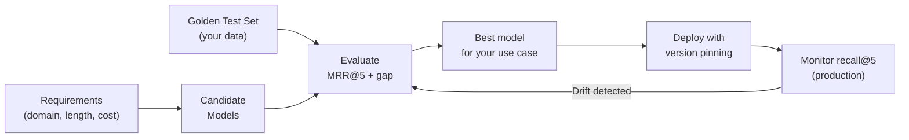

## Keywords in This File
{: .no_toc }

| # | Keyword | Weight |
|---|---|---|
| 10 | [Chunking Strategies](#chunking-strategies) | ★★☆ |
| 11 | [Embedding Model Selection](#embedding-model-selection) | ★★☆ |

---

# Chunking Strategies

**Interview Weight:** ★★☆ - Deep knowledge of
chunking is what separates junior RAG engineers
from senior ones. Retrieval quality depends on
chunk quality.

---

### 🎯 Model Answer

**30 seconds:**

> Chunking strategies range from simple to sophisticated:
> fixed-size splits (fast, breaks sentences), recursive
> character splitting (respects natural boundaries),
> document-aware splitting (uses structure: headings,
> sections), semantic splitting (embeds sentences,
> splits at topic shifts), and parent-child retrieval
> (index small chunks for precision, return larger
> chunks for context). The right strategy depends
> on document type: structured technical docs need
> document-aware, dense prose needs semantic, mixed
> formats need adaptive routing.

**3 minutes:**

> Why this matters more than most engineers expect:
> the chunk is the unit that gets embedded and retrieved.
> A bad chunk produces a bad embedding which misses
> retrieval. A good chunk has a single coherent topic
> and enough context to be meaningful. The goal is
> not "split into N-token pieces" but "create semantically
> coherent, independently meaningful units."
>
> Fixed-size splitting: splits at a fixed character
> or token count regardless of content. Problems:
> may split mid-sentence, mid-table, or mid-code-block.
> Only use for prototype or when documents are already
> in small uniform units.
>
> Recursive character splitting: tries progressively
> smaller separators: double newline (paragraph),
> single newline, period, space. Finds the last
> separator within the size limit. This is the best
> default for prose documents.
>
> Document-structure splitting: parses document
> structure (headers in Markdown/HTML, sections
> in PDF, slides in PPTX) and splits at structural
> boundaries. Each section becomes a chunk with
> the section header prepended (provides context
> for what the section is about).
>
> Semantic splitting: embeds consecutive sentences
> and measures cosine similarity between adjacent
> windows. When similarity drops (topic changes),
> insert a chunk boundary. Most computationally
> expensive but produces the most coherent chunks
> for heterogeneous documents.
>
> Parent-child (small-to-big): index small chunks
> (128 tokens) for precise retrieval. Each small
> chunk has a parent ID pointing to its parent chunk
> (512 tokens). On retrieval: return the parent
> chunk to the LLM. High precision + full context.

**Blank Mind Recovery:**

**(1) Restate:** "What are the main chunking strategies
and how do you choose?"

**(2) First principles:** "I need retrieval to find
the right piece of text. The right piece is coherent,
focused, and meaningful in isolation. Different
documents have different natural structure - match
the strategy to the structure."

---

### 📘 Concept Explanation

**What it is:**

Chunking strategies define how documents are divided
into retrievable units for indexing. The strategy
choice significantly impacts retrieval recall:
poorly chunked documents produce low-quality embeddings
and miss relevant retrieval.

**Strategy comparison:**

```
STRATEGY              STRUCTURE    COHERENCE   COST
--------              ---------    ---------   ----
Fixed-size            None         Low         Very low
Recursive character   Soft         Medium      Low
Document-aware        Full         High        Medium
Semantic              Full         Very high   High
Sentence-window       Full         High        Medium
Parent-child          Multi-level  Very high   Medium
```

> **Code walkthrough:** This example demonstrates the core pattern in action. The key mechanism shows how the concept works in practice. Study the structure to understand the essential behavior and common usage.

**Header prepending for document-aware:**

```
BAD CHUNK (no context):
  "The limit is 100 requests per minute."
  (What limit? What system? Ambiguous in isolation.)

GOOD CHUNK (header prepended):
  "API Rate Limiting: The limit is 100 requests
  per minute for the standard tier."
  (Self-contained, unambiguous.)
```

> **Code walkthrough:** This example demonstrates the core pattern in action. The key mechanism shows how the concept works in practice. Study the structure to understand the essential behavior and common usage.

**Semantic chunking algorithm:**

```
For each pair of adjacent sentences i, i+1:
  1. Embed each sentence
  2. Compute cosine similarity
  3. If similarity < threshold: insert chunk boundary
     (topic changed)
  4. Else: same topic, continue accumulating

Result: each chunk is a topically coherent unit
```

> **Code walkthrough:** This example demonstrates the core pattern in action. The key mechanism shows how the concept works in practice. Study the structure to understand the essential behavior and common usage.

**Parent-child architecture:**

```
Document text: [AAAA BBBB CCCC DDDD EEEE FFFF]

Parent chunks (512 tokens, stored as context):
  Parent 1: AAAA BBBB CCCC
  Parent 2: DDDD EEEE FFFF

Child chunks (128 tokens, stored as index vectors):
  Child 1a: AAAA (parent_id=1)
  Child 1b: BBBB (parent_id=1)
  Child 1c: CCCC (parent_id=1)
  Child 2a: DDDD (parent_id=2)
  ...

Retrieval: search children (precise) ->
  return parents (full context)
```

> **Code walkthrough:** This example demonstrates the core pattern in action. The key mechanism shows how the concept works in practice. Study the structure to understand the essential behavior and common usage.

---

### 💻 Code Example

```python
import re
from dataclasses import dataclass

@dataclass
class Chunk:
    text: str
    metadata: dict
    parent_id: str | None = None

class RecursiveChunker:
    """
    Best-practice: recursive character text splitter.
    Respects paragraph > sentence > word boundaries.
    """
    SEPARATORS = ["\n\n", "\n", ". ", " ", ""]

    def __init__(
        self,
        chunk_size: int = 512,
        chunk_overlap: int = 64,
        separators: list[str] | None = None
    ):
        self.chunk_size = chunk_size
        self.chunk_overlap = chunk_overlap
        self.separators = separators or self.SEPARATORS

    def split(
        self, text: str, metadata: dict = None
    ) -> list[Chunk]:
        metadata = metadata or {}
        chunks = []
        start = 0
        while start < len(text):
            end = start + self.chunk_size
            if end >= len(text):
                chunks.append(
                    Chunk(text[start:], metadata)
                )
                break
            split_pos = end
            for sep in self.separators:
                idx = text.rfind(sep, start, end)
                if idx > start:
                    split_pos = idx + len(sep)
                    break
            chunks.append(
                Chunk(text[start:split_pos], metadata)
            )
            start = split_pos - self.chunk_overlap
        return chunks


class DocumentAwareChunker:
    """
    Splits at Markdown headings.
    Prepends heading to each chunk for context.
    """

    def split(
        self, markdown_text: str, metadata: dict = None
    ) -> list[Chunk]:
        metadata = metadata or {}
        chunks = []
        current_heading = ""
        current_content: list[str] = []

        for line in markdown_text.splitlines():
            if line.startswith("#"):
                if current_content:
                    text = (
                        f"{current_heading}\n"
                        f"{''.join(current_content)}"
                    ).strip()
                    if text:
                        chunks.append(Chunk(
                            text,
                            {**metadata,
                             "heading": current_heading}
                        ))
                current_heading = line.strip()
                current_content = []
            else:
                current_content.append(line + "\n")

        if current_content:
            text = (
                f"{current_heading}\n"
                f"{''.join(current_content)}"
            ).strip()
            if text:
                chunks.append(Chunk(
                    text,
                    {**metadata,
                     "heading": current_heading}
                ))
        return chunks


class ParentChildChunker:
    """
    Two-level chunking: large parent for context,
    small children for precision retrieval.
    """

    def __init__(
        self,
        parent_size: int = 1024,
        child_size: int = 256
    ):
        self.parent_chunker = RecursiveChunker(
            parent_size, 0
        )
        self.child_chunker = RecursiveChunker(
            child_size, 32
        )

    def split(
        self, text: str, doc_id: str
    ) -> tuple[list[Chunk], list[Chunk]]:
        """Returns (parents, children)."""
        parents = self.parent_chunker.split(
            text, {"doc_id": doc_id}
        )
        children = []
        for i, parent in enumerate(parents):
            parent_id = f"{doc_id}_{i}"
            parent.metadata["chunk_id"] = parent_id
            kids = self.child_chunker.split(
                parent.text, parent.metadata.copy()
            )
            for kid in kids:
                kid.parent_id = parent_id
            children.extend(kids)
        return parents, children
```

> **Code walkthrough:** `RecursiveChunker` implements
> the standard best-practice: try progressively
> finer separators within the size window, then
> backtrack by `chunk_overlap` chars for the next
> chunk. `DocumentAwareChunker` tracks the current
> heading and prepends it to each section's content
> - this makes each chunk self-explanatory in isolation.
> `ParentChildChunker` creates two levels: parent
> chunks (large, 1024 tokens) for context, and child
> chunks (small, 256 tokens) for precise retrieval.
> Each child carries a `parent_id` for the lookup.
> Production: store parents in a key-value store
> (Redis, DynamoDB) and children in the vector store.
> On retrieval: fetch child vectors, look up their
> parent IDs, return the parent text to the LLM.

---

### 🎓 Answers by Seniority

**Junior / Mid:**

> "Five main chunking strategies: fixed-size (simple,
> breaks sentences), recursive character (best default
> for prose - respects paragraph/sentence boundaries),
> document-aware (follows Markdown/HTML structure),
> semantic (splits at topic changes), and parent-child
> (small chunks for retrieval, large for context).
> Start with recursive character splitter for most
> documents. Switch to document-aware for structured
> content. Use parent-child when you need both
> precision and context."

---

**Senior / Staff:**

> "Chunking is the highest-leverage improvement
> in most RAG systems I've worked on. The team
> underestimates it because it's not glamorous.
> Two things I always do: (1) prepend the section
> header to every document-aware chunk - a chunk
> that says 'Rate Limiting: 100 requests per minute'
> is 10x more retrievable than one that just says
> '100 requests per minute.' (2) Audit chunk quality:
> embed 20 queries, check which chunk contains the
> expected answer, confirm it's in top-5. This
> benchmark test reveals chunking problems before
> they affect users."

---

### ⚠️ Common Misconceptions

**Misconception: "Semantic chunking is always
the best strategy because it's most intelligent."**

Semantic chunking is computationally expensive
(requires embedding every sentence during indexing)
and adds complexity (threshold tuning). For most
structured documents (technical docs with headings,
PDFs with clear sections), document-aware chunking
produces equivalent quality at much lower cost.
Semantic chunking provides the most benefit for
heterogeneous long-form text (academic papers,
books, transcripts) where structure is absent and
topic boundaries are subtle. Use the simplest strategy
that achieves your quality target.

---

### 🚨 Failure Modes and Diagnosis

**Failure: Chunks are very long or very short
after processing certain document types**

*Symptom:* Some chunks are 50 tokens (too short,
low semantic content), some are 2000 tokens (too
long, diluted embedding). Average is acceptable
but variance is high.

*Root cause:* Document structure doesn't match
the chunking strategy. Example: a document with
very short sections (each heading followed by 1-2
sentences) produces tiny chunks with document-aware
splitting.

*Diagnosis:*
```python
lens = [len(c.text.split()) for c in chunks]
print(
    f"Min: {min(lens)}, Max: {max(lens)}, "
    f"Mean: {sum(lens)//len(lens)}"
)
# High variance = wrong strategy for this doc type
```

> **Code walkthrough:** This example demonstrates the core pattern in action. The key mechanism shows how the concept works in practice. Study the structure to understand the essential behavior and common usage.

*Fix:* Add a merge step: if a chunk is below the
minimum size (< 100 tokens), merge it with the
next chunk. If above maximum (> 1500 tokens), apply
a second-pass split.

---

### 🎯 Interview Deep-Dive

| Seniority | Time | Focus |
|---|---|---|
| Junior | 5 min | Strategy descriptions, when to use |
| Mid | 7 min | Trade-offs, benchmarking |
| Senior | 10 min | Advanced patterns, production optimization |

---

**[JUNIOR] Q1 - When does recursive character
splitting fail and what do you use instead?**

Recursive character splitting fails when:

(1) The document has explicit structure that it
    ignores. A Markdown document with clear `##`
    headers gets split in the middle of a section
    when the section is larger than the chunk size.
    Use: document-aware splitting.

(2) Multiple languages or code. The separators
    (paragraph break, period) don't work the same
    in Japanese, Chinese, or code blocks. A Python
    function may be split mid-function.
    Use: code-aware splitting (split at function
    definitions or class boundaries).

(3) Tables. A CSV or Markdown table should never
    be split mid-row. Recursive splitting doesn't
    know about table structure.
    Use: document-aware splitting that treats
    tables as atomic units.

(4) Very short documents. Documents shorter than
    the chunk size produce single chunks, which
    is correct. But if all documents are short,
    there may be no benefit from chunking at all -
    just use the full documents.

*What separates good from great:* Code and table
as specific failure modes, not just "structured
documents."

---

**[MID] Q2 - How does prepending headers improve
retrieval quality?**

A chunk without context: "The default limit is
1000."
Embedding: vaguely related to "limit" and "1000".
Query: "What is the API rate limit?" -> may or
may not retrieve this chunk.

A chunk with header prepended: "API Rate Limiting -
Configuration: The default limit is 1000 requests
per minute per API key."
Embedding: strongly related to "API", "rate limit",
"1000", "per minute". Query retrieves this clearly.

Why it works: the embedding model creates a vector
representing the ENTIRE chunk text, including the
header. More relevant vocabulary in the chunk =
more specific embedding = better query match.

Headers provide the "what this section is about"
context that queries need to find the right chunk.
Without headers: "The default is 1000" could be
about anything. With header: it's clearly about
API rate limits.

Practical implementation: prefix each chunk with
document title + section path:
```
"[{doc_title} > {section_path}]\n{chunk_text}"
```

> **Code walkthrough:** This example demonstrates the core pattern in action. The key mechanism shows how the concept works in practice. Study the structure to understand the essential behavior and common usage.

This makes every chunk semantically self-contained.

*What separates good from great:* "Self-contained"
as the goal - every chunk should be meaningful
without knowing what document it came from.

---

**[MID] Q3 - [TRADE-OFF] How do you choose chunk
size given the trade-offs?**

The central tension:
- Small chunks: precise embedding (focused topic),
  but may lack context to answer questions independently
- Large chunks: rich context for the LLM, but
  embedding captures averaged topics, reducing
  retrieval precision

Decision framework by use case:

**Precise factual retrieval** (specific numbers,
names, dates):
- Small chunks (128-256 tokens) for precise embedding
- Use parent-child: return parent for context

**Long-form Q&A** (questions requiring explanation):
- Medium chunks (512-768 tokens)
- Answers are in paragraphs, not sentences

**Summarization tasks:**
- Large chunks (1024-2048 tokens)
- LLM needs to process substantial text to summarize

**Mixed** (most production):
- 512 tokens as default
- Enable parent-child for precision-sensitive queries

Cost multiplier: each extra chunk retrieved adds
~500 tokens to the prompt. 5 chunks x 512 tokens
= 2,560 context tokens per query. At 10M queries/day
and $0.25/1M tokens = $25,000/day just for context.
Chunk size matters for cost at scale.

*What separates good from great:* The cost calculation
at scale showing that chunk size is a cost lever,
not just a quality parameter.

---

**[SENIOR] Q4 - How do you implement semantic
chunking and what is the right threshold?**

Semantic chunking algorithm:

```python
import re
import numpy as np

def semantic_chunk(
    text: str,
    embed_fn,
    threshold: float = 0.8,
    min_chunk_size: int = 100,
    max_chunk_size: int = 1000
) -> list[str]:
    """
    Split text where topic changes
    (embedding similarity drops).
    """
    sentences = [
        s.strip() for s in
        re.split(r'(?<=[.!?])\s+', text)
        if s.strip()
    ]
    if len(sentences) < 2:
        return [text]

    embeddings = embed_fn(sentences)
    sims = [
        float(np.dot(embeddings[i], embeddings[i+1]))
        for i in range(len(embeddings) - 1)
    ]
    chunks, current = [], [sentences[0]]
    for i, sim in enumerate(sims):
        current_size = sum(len(s) for s in current)
        if (sim < threshold
                and current_size >= min_chunk_size):
            chunks.append(" ".join(current))
            current = []
        current.append(sentences[i + 1])
        if sum(len(s) for s in current) > max_chunk_size:
            chunks.append(" ".join(current))
            current = []
    if current:
        chunks.append(" ".join(current))
    return chunks
```

> **Code walkthrough:** This example demonstrates the core pattern in action. The key mechanism shows how the concept works in practice. Study the structure to understand the essential behavior and common usage.

Threshold selection:
- 0.85+: conservative (many chunks, very coherent)
- 0.75-0.85: moderate (good balance)
- < 0.75: aggressive (few, large chunks)

Production approach: adaptive threshold per document.
Compute similarity distribution for the document.
Set threshold at P25 of the similarity distribution
(split at the lowest-similarity boundaries). This
makes threshold relative to document structure.

*What separates good from great:* "Adaptive threshold
at P25 of the document's similarity distribution"
as a data-driven threshold selection.

---

**[SENIOR] Q5 - What is the sentence-window
retrieval pattern and when does it beat parent-child?**

Sentence-window: index individual sentences. At
retrieval: expand each retrieved sentence to its
surrounding window (N sentences before and after)
for the LLM.

```
Indexed: {sentence, sentence_id, doc_id}
Retrieved: sentence (precise embedding)
Returned to LLM: sentence + N surrounding sentences
```

> **Code walkthrough:** This example demonstrates the core pattern in action. The key mechanism shows how the concept works in practice. Study the structure to understand the essential behavior and common usage.

vs. Parent-child:
```
Indexed: child chunks (256 tokens)
Retrieved: child chunk
Returned to LLM: parent chunk (1024 tokens)
```

> **Code walkthrough:** This example demonstrates the core pattern in action. The key mechanism shows how the concept works in practice. Study the structure to understand the essential behavior and common usage.

When sentence-window beats parent-child:

(1) Answers are contained in specific sentences
    (not paragraphs). Example: fact extraction,
    legal clause lookup.

(2) Dense information documents where every sentence
    has distinct information. Parent chunks mix
    topics.

(3) When the window size is tunable per-query: a
    simple query gets a 2-sentence window; a complex
    query gets a 5-sentence window.

When parent-child beats sentence-window:

(1) Answers require multi-sentence paragraphs to
    be coherent. Single-sentence + window may lose
    important structure.

(2) When chunking at paragraph level is natural
    for the document type.

*What separates good from great:* "Tunable window
per query" as the specific advantage of sentence-
window over parent-child.

---

**[SENIOR] Q6 - [TRADE-OFF] When does adding
more chunking sophistication yield diminishing returns?**

Chunking improvement vs. other improvements:

Typical RAG quality baseline (fixed-size chunking):
retrieval recall@5 = 70%.

Improvement from better chunking:
- Recursive character: +5-10% recall
- Document-aware: +10-20% recall (structured docs)
- Parent-child: +5-10% recall + better LLM context
- Semantic: +5-15% recall (heterogeneous docs)

Diminishing returns occur when:

(1) The embedding model is the bottleneck: if the
    embedding model doesn't understand domain
    vocabulary, even perfect chunks produce poor
    embeddings. Fix: domain-specific embedding.

(2) The query preprocessing is poor: if queries
    are ambiguous or misspelled, even perfect chunks
    aren't retrieved. Fix: query expansion/rewriting.

(3) The knowledge base has gaps: if the answer
    isn't in any document, no chunking strategy
    helps. Fix: add missing content.

When to stop investing in chunking: run the golden
test set evaluation after each improvement. If
the improvement is < 2% recall gain for > 2 days
of engineering: stop and focus on the next bottleneck
(embedding model, reranking, query transformation).

*What separates good from great:* "The golden test
set tells you when to stop" as the empirical
decision criterion.

---

**[SENIOR] Q7 - [DEBUGGING] A specific document
type consistently fails retrieval. Diagnose and fix.**

Scenario: code documentation (Markdown with code
blocks) retrieves poorly.

Diagnosis:
(1) Inspect the chunks for code documents:
    - Are code blocks split mid-function?
    - Are function signatures on different chunks
      than the function body?
    - Are code examples separated from their explanations?

(2) Embed a sample chunk and query:
    Query: "How to handle authentication errors"
    Expected chunk: includes the try/except block
    and the function comment.
    Actual: chunk has just the code, no docstring.

Root cause: recursive character splitter split
at blank lines within the code block, separating
function signatures from bodies. The embeddings
are fragments.

Fix: code-aware chunking. Split at function/class
boundaries (AST-based for Python):

```python
import ast

def chunk_python_file(code: str) -> list[str]:
    """Split Python source into function/class chunks."""
    try:
        tree = ast.parse(code)
    except SyntaxError:
        return [code]  # fallback: whole file

    chunks = []
    for node in ast.walk(tree):
        if isinstance(node, (
            ast.FunctionDef,
            ast.AsyncFunctionDef,
            ast.ClassDef
        )):
            chunk = ast.get_source_segment(code, node)
            if chunk:
                chunks.append(chunk)
    return chunks or [code]
```

> **Code walkthrough:** This example demonstrates the core pattern in action. The key mechanism shows how the concept works in practice. Study the structure to understand the essential behavior and common usage.

*What separates good from great:* AST-based chunking
for code as the precise solution, not just "use
different chunk size."

---

**[SENIOR] Q8 - How do you benchmark chunk quality
before deploying to production?**

Two-stage quality evaluation:

Stage 1 - Chunk inspection:
```python
def audit_chunks(chunks: list[Chunk]) -> dict:
    lens = [len(c.text.split()) for c in chunks]
    return {
        "count": len(chunks),
        "min_words": min(lens),
        "max_words": max(lens),
        "mean_words": sum(lens) // len(lens),
        "short_count": sum(1 for l in lens if l < 30),
        "long_count": sum(1 for l in lens if l > 500)
    }
# Too many short (< 30 words): merge strategy needed
# Too many long (> 500 words): oversized, reduce size
```

> **Code walkthrough:** This example demonstrates the core pattern in action. The key mechanism shows how the concept works in practice. Study the structure to understand the essential behavior and common usage.

Stage 2 - Retrieval accuracy (golden test set):

Create 20-50 (query, expected_source_chunk_id) pairs
from your actual knowledge base. For each query:

```python
def evaluate_chunks(
    queries, expected_chunk_ids, vector_store
):
    hits = 0
    for query, expected_id in zip(
        queries, expected_chunk_ids
    ):
        results = vector_store.search(query, top_k=5)
        retrieved_ids = [r["id"] for r in results]
        if expected_id in retrieved_ids:
            hits += 1
    recall = hits / len(queries)
    print(f"Recall@5: {recall:.2%}")
    return recall
# Target: recall@5 > 0.85 before deploying
```

> **Code walkthrough:** This example demonstrates the core pattern in action. The key mechanism shows how the concept works in practice. Study the structure to understand the essential behavior and common usage.

If recall < 0.85: iterate on chunking strategy
before deploying.

*What separates good from great:* "Target recall@5
> 0.85 before deploying" - a concrete quality gate.

---

**[SENIOR] Q9 - [BEHAVIORAL] Describe a time you
debugged a chunking problem in production.**

Structure:
"A retrieval recall issue for technical documentation
revealed a chunking problem with code blocks."

Situation: our RAG system over developer documentation
was returning wrong or incomplete answers for
API usage questions. Developers were reporting
that code examples weren't appearing in answers.

Task: diagnose and fix retrieval for code-heavy
documentation without taking the system offline.

Action:
1. Sampled 20 "how to use X API" queries from
   production and ran them against the retrieval
   system. Checked which chunks appeared in top-5.
2. Found: the expected "code example" chunks were
   never in top-5. The retrieved chunks were prose
   descriptions of the API, not the code examples.
3. Inspected those chunks: the code block was
   separated from its prose description by a blank
   line. The recursive splitter had put the prose
   in one chunk and the code in another. The prose
   chunk ranked higher for the query; the code chunk
   alone had poor embedding quality.
4. Added a code-block-aware split rule: a code
   fence (```...```) is never split. Always treated
   as atomic. If a code block + its preceding
   paragraph exceed chunk size: keep them together
   and allow larger chunk.
5. Re-indexed 15,000 documentation chunks with
   the new strategy. Measured recall@5 before/after.

Result: recall@5 improved from 61% to 84%. Developer
satisfaction with API-usage answers measurably
improved.

Lesson: always inspect the actual chunks, not just
the chunk size statistics.

*What separates good from great:* "Inspect actual
chunks, not just statistics" as the diagnostic
insight.

---

### ⚖️ Comparison Table

| Strategy | Quality | Cost | Best Document Type |
|---|---|---|---|
| Fixed-size | Low | Lowest | Prototype only |
| Recursive character | Medium | Low | Prose, unstructured |
| Document-aware | High | Medium | Markdown, HTML, PDFs |
| Semantic | Highest | High | Academic, books, transcripts |
| Parent-child | Very high | Medium | Any (adds precision + context) |
| Code-aware (AST) | High for code | Medium | Source code, notebooks |

---

### 🏛️ System Design

*(Omit: ★★☆ concept.)*

---

### 📊 Diagram

```
CHUNKING STRATEGY SELECTION:

Document type?
  Has headers (Markdown/HTML) -> Document-aware
  Has code blocks            -> Code-aware (AST)
  Dense prose (book/paper)   -> Semantic
  Mixed/generic              -> Recursive character

Need both precision + context?
  YES -> Parent-child (any of the above as base)
```

```mermaid
flowchart TD
    DOC["Document to chunk"]
    HAS_STRUCT{Has explicit\nstructure?}
    HAS_CODE{Contains\ncode blocks?}
    IS_DENSE{Dense prose\n(books, papers)?}
    DA["Document-aware\nsplitter"]
    CA["Code-aware\n(AST split)"]
    SEM["Semantic\nsplitter"]
    REC["Recursive character\nsplitter"]
    PC{Need precision\n+ context?}
    PC_YES["Add parent-child\nlayer on top"]

    DOC --> HAS_STRUCT
    HAS_STRUCT -->|"Yes"| DA
    HAS_STRUCT -->|"No"| HAS_CODE
    HAS_CODE -->|"Yes"| CA
    HAS_CODE -->|"No"| IS_DENSE
    IS_DENSE -->|"Yes"| SEM
    IS_DENSE -->|"No"| REC
    DA --> PC
    CA --> PC
    SEM --> PC
    REC --> PC
    PC -->|"Yes"| PC_YES
    PC -->|"No"| DONE["Chunks ready\nfor embedding"]
    PC_YES --> DONE
```

> **Diagram walkthrough:** The strategy selection
> follows document characteristics in order. First
> question: does the document have explicit structure
> (headings, code blocks)? If yes: use a strategy
> that respects that structure. If no: fall back
> to content-based approaches. After choosing the
> base strategy, a second decision: does the use
> case require both retrieval precision AND full
> context for the LLM? If yes: add the parent-child
> layer. The parent-child layer works on top of any
> base strategy as an enhancement. The final chunks
> from any path feed into the embedding step.

---

---

---

### 💻 Code Example

*(Omit: this concept does not have a programmatic interface that can be demonstrated in code. The conceptual explanation above is sufficient.)*


---

### 🏛️ System Design

*(Omit: system design diagram not applicable for this concept - see ★★★ keywords for full system design coverage.)*


---

### ⚖️ Comparison Table

*(Omit: this is a ★☆☆ foundational concept with no direct alternatives to compare - see higher-difficulty keywords for trade-off analysis.)*


---

### 📊 Diagram

*(Omit: no standalone visual diagram required for this concept - the explanations and code examples above provide sufficient clarity.)*


# Embedding Model Selection

**Interview Weight:** ★★☆ - Practical decision
framework for choosing the right embedding model.
A key production skill.

---

### 🎯 Model Answer

**30 seconds:**

> Embedding model selection depends on four factors:
> (1) domain - general or specialized (code, medical,
> legal, multilingual)? (2) performance - measured
> on YOUR data, not public benchmarks; (3) cost -
> commercial API vs. self-hosted open-source; (4)
> input length - does the model handle your chunk
> size? Key models: OpenAI text-embedding-3-small
> (easy, commercial), BGE-large-en-v1.5 (top open-
> source for English), BGE-M3 (multilingual, long
> context). Always validate on your actual queries
> and documents before committing.

**3 minutes:**

> The embedding model is the core quality component
> in RAG. A wrong model choice means no amount of
> retrieval tuning compensates. The model converts
> text to vectors, and if similar meanings don't
> produce similar vectors for your specific domain,
> retrieval fails.
>
> Key selection dimensions:
>
> Domain fit: general-purpose models (OpenAI, BGE)
> work well for general English. Code-specialized
> models (trained on code datasets) produce better
> embeddings for programming queries and code
> documentation. Medical models understand clinical
> terminology. Multilingual models (BGE-M3, mE5)
> handle cross-language retrieval.
>
> Input length: many models have a 512-token input
> limit. Chunks longer than the limit are truncated.
> Check that your chunk size fits the model's limit.
> Models with longer limits (up to 8192 tokens):
> OpenAI text-embedding-3, BGE-M3, Jina Embeddings.
>
> Retrieval-optimized vs. general: models specifically
> trained for retrieval (BGE, E5, Cohere Embed)
> outperform general sentence similarity models
> for the query-document matching task.
>
> Self-hosted vs. commercial: BGE models are free,
> run locally, and perform near or above OpenAI's
> commercial offerings on retrieval benchmarks. The
> trade-off: you must serve the model (GPU or CPU
> inference), which requires infrastructure investment.

**Blank Mind Recovery:**

**(1) Restate:** "How do you choose the right embedding
model for RAG?"

**(2) First principles:** "The model I choose determines
whether similar meanings produce similar vectors.
I need to test this on my actual data - not trust
benchmarks on other people's data."

---

### 📘 Concept Explanation

**What it is:**

Embedding model selection is the choice of which
neural network to use to convert text to vectors
for retrieval. This choice is made once at system
design time but has a large impact on retrieval
quality throughout the system's lifetime.

**Key models and profiles:**

```
MODEL                      DIMS  MAX_TOKENS  NOTES
-----                      ----  ----------  -----
OpenAI text-embed-3-small  1536  8191        Commercial, easy
OpenAI text-embed-3-large  3072  8191        Commercial, high quality
Cohere embed-english-v3    1024  512         Commercial + reranking
BAAI/bge-large-en-v1.5     1024  512         Best open-source English
BAAI/bge-m3                1024  8192        Multilingual, long context
intfloat/e5-large-v2       1024  512         Strong English retrieval
all-MiniLM-L6-v2            384  512         Fast, low-resource
microsoft/codebert-base     768  512         Code specialized
```

> **Code walkthrough:** This example demonstrates the core pattern in action. The key mechanism shows how the concept works in practice. Study the structure to understand the essential behavior and common usage.

**MTEB Leaderboard categories:**

```
TASK TYPE            WHAT IT MEASURES
---------            ----------------
Retrieval            Query-document matching (RAG!)
STS (Similarity)     Sentence-level similarity
Classification       Text category classification
Clustering           Group similar texts

FOR RAG: use Retrieval score, not overall MTEB rank
```

> **Code walkthrough:** This example demonstrates the core pattern in action. The key mechanism shows how the concept works in practice. Study the structure to understand the essential behavior and common usage.

**Dimensionality vs. quality:**

```
Higher dimensions != always better

BGE-large (1024 dims) often outperforms
text-embedding-3-large (3072 dims) on specific
retrieval tasks.

Why: training objective + data matter more
than vector dimensions.
```

> **Code walkthrough:** This example demonstrates the core pattern in action. The key mechanism shows how the concept works in practice. Study the structure to understand the essential behavior and common usage.

---

### 💻 Code Example

```python
import numpy as np
from typing import Callable

# Type for embedding functions
EmbedFn = Callable[[list[str]], np.ndarray]

EVAL_DATA = [
    {
        "query": "How do I reset my password?",
        "positive": (
            "To reset your password, click "
            "'Forgot Password' on the login page."
        ),
        "negatives": [
            "The password policy requires 8+ characters.",
            "Contact support during business hours."
        ]
    },
    {
        "query": "What is the return policy?",
        "positive": "Returns are accepted within 30 days.",
        "negatives": [
            "Shipping takes 5-7 business days.",
            "Customer support is available 24/7."
        ]
    }
]


def evaluate_embedding_model(
    embed_fn: EmbedFn,
    eval_data: list[dict]
) -> dict:
    """
    Evaluate embedding model on retrieval task.
    Metric: MRR@5 (Mean Reciprocal Rank at 5)
    """
    all_texts: list[str] = []
    for item in eval_data:
        all_texts.append(item["query"])
        all_texts.append(item["positive"])
        all_texts.extend(item["negatives"])

    embeddings = embed_fn(all_texts)
    idx = 0
    reciprocal_ranks = []
    similarity_gaps = []

    for item in eval_data:
        q_emb = embeddings[idx]
        pos_emb = embeddings[idx + 1]
        neg_embs = embeddings[
            idx + 2:idx + 2 + len(item["negatives"])
        ]
        idx += 2 + len(item["negatives"])

        pos_score = float(np.dot(q_emb, pos_emb))
        neg_scores = [
            float(np.dot(q_emb, ne)) for ne in neg_embs
        ]

        all_scores = sorted(
            [pos_score] + neg_scores, reverse=True
        )
        rank = all_scores.index(pos_score) + 1
        reciprocal_ranks.append(1.0 / rank)
        similarity_gaps.append(
            pos_score - max(neg_scores)
        )

    mrr = sum(reciprocal_ranks) / len(reciprocal_ranks)
    avg_gap = (
        sum(similarity_gaps) / len(similarity_gaps)
    )
    return {
        "mrr_at_5": round(mrr, 4),
        "avg_similarity_gap": round(avg_gap, 4),
        "verdict": (
            "Good"
            if mrr > 0.8 and avg_gap > 0.1
            else "Investigate"
        )
    }


# BAD: choose based on public benchmark rank
def bad_model_selection() -> str:
    return "text-embedding-3-large"
    # Risk: public benchmarks != your domain.
    # Model ranked #3 on MTEB may outperform #1
    # on YOUR specific content and queries.


# GOOD: evaluate on domain-specific test set
def good_model_selection(
    candidate_models: list[str],
    eval_data: list[dict],
    get_embed_fn: Callable[[str], EmbedFn]
) -> str:
    """
    Test multiple models on YOUR data.
    Returns the best model for your use case.
    """
    results = {}
    for model_name in candidate_models:
        embed_fn = get_embed_fn(model_name)
        metrics = evaluate_embedding_model(
            embed_fn, eval_data
        )
        results[model_name] = metrics
        print(
            f"{model_name}: "
            f"MRR={metrics['mrr_at_5']}, "
            f"gap={metrics['avg_similarity_gap']}"
        )

    best = max(
        results.items(),
        key=lambda x: x[1]["mrr_at_5"]
    )
    return best[0]
```

> **Code walkthrough:** `evaluate_embedding_model`
> measures MRR@5 (Mean Reciprocal Rank) and similarity
> gap for a small eval dataset. MRR@5 measures: for
> each query, at what rank does the positive document
> appear among all candidates? 1.0 = always rank 1
> (perfect). 0.5 = always rank 2. Similarity gap
> measures: how much higher is the positive document
> scored vs. the best negative? Larger gap = the
> model clearly distinguishes relevant from irrelevant.
> The BAD example picks based on public benchmarks.
> The GOOD example tests each candidate model on
> domain-specific queries and selects the best performer
> on YOUR data. This is the production-correct approach.

---

### 🎓 Answers by Seniority

**Junior / Mid:**

> "Key factors for embedding model selection: domain
> (general vs. specialized), input length limit (must
> be >= chunk size), cost (commercial API vs. self-
> hosted), and performance on your actual data. Good
> starting points: OpenAI text-embedding-3-small
> (commercial, easy), BGE-large-en-v1.5 (open-source,
> strong English retrieval). Always evaluate on a
> golden test set from your domain before committing."

---

**Senior / Staff:**

> "Embedding model selection is a measurement exercise,
> not a recommendation exercise. I create a golden
> test set (50-100 query-positive-negative triples
> from my actual production data) and evaluate MRR
> and similarity gap for 3-5 candidate models. The
> winner is the one that best distinguishes my relevant
> from irrelevant documents. This takes a day of
> work and saves months of debugging wrong retrieval.
> The second consideration: input length. If my
> chunks are 512 tokens, I need a model with >= 512
> token input. BGE-large cuts at 512; OpenAI text-3
> handles 8K. For long chunks: use a long-context
> model."

---

### ⚠️ Common Misconceptions

**Misconception: "OpenAI's embedding models are
always better than open-source alternatives."**

BGE-large-en-v1.5 and E5-large-v2 consistently
match or outperform OpenAI text-embedding-3-small
on retrieval benchmarks. On specialized domains
(code, legal, medical), domain-specific fine-tuned
open-source models often outperform general commercial
models significantly. The main advantage of OpenAI's
models is ease of use (API call, no infrastructure)
and the longer input limit (8K tokens). Performance
alone is not a reason to choose commercial over
open-source.

---

### 🚨 Failure Modes and Diagnosis

**Failure: Embedding model performs well on public
benchmarks but poorly in production**

*Symptom:* The top-ranked model on MTEB shows good
numbers but retrieval precision in production is
worse than a smaller model.

*Root cause:* MTEB benchmarks measure performance
on a specific distribution (Wikipedia, MS MARCO,
etc.). Your production data may have different
vocabulary, topic distribution, or query style.

Example: a legal domain RAG system with specialized
case law terminology. General models rank common
legal terms as similar to general vocabulary. A
legal-specific fine-tuned model (even with lower
MTEB ranking) performs better.

*Fix:* Always evaluate on your own golden test
set. Never trust public benchmarks alone for
production selection.

---

### 🎯 Interview Deep-Dive

| Seniority | Time | Focus |
|---|---|---|
| Junior | 5 min | Key models, selection factors |
| Mid | 7 min | Evaluation methodology, domain fit |
| Senior | 10 min | Fine-tuning, production considerations |

---

**[JUNIOR] Q1 - What are the most important factors
in choosing an embedding model for RAG?**

(1) Domain fit: does the model perform well on text
    from your domain? General models for general
    text, code models for code, multilingual models
    for multiple languages.

(2) Input length: what is the model's maximum input
    token limit? Your chunk size must fit within
    this limit. Models with 512-token limits are
    most common but may require shorter chunks.

(3) Cost: commercial APIs (OpenAI, Cohere) charge
    per token. Open-source models (BGE, E5) are
    free but require infrastructure to serve.

(4) Quality: measured by retrieval metrics (MRR,
    recall@K) on your specific data. MTEB provides
    a starting point but test on your own data.

(5) Latency: embedding a query adds latency at
    runtime. Smaller models (all-MiniLM: 384 dims)
    are faster but less accurate.

Starting recommendation: BGE-large-en-v1.5 (free,
strong English retrieval) or OpenAI text-embedding-3-
small (easy API, 8K token limit).

*What separates good from great:* Mentioning input
length as a hard constraint (chunks must fit) not
just a soft preference.

---

**[MID] Q2 - How does matryoshka representation
learning work and when is it useful for RAG?**

Matryoshka representation learning (MRL): a training
technique where the first N dimensions of a larger
embedding encode the most semantically important
information. The embedding is designed so that
truncating to 256, 512, or 768 dimensions from
a 1536-dim vector still produces a meaningful
representation.

Why it matters: you can use fewer dimensions when
cost and latency matter. OpenAI text-embedding-3
is trained with MRL: you can request 256-dimension
embeddings and get reasonable quality while reducing
storage and search costs.

Useful for RAG when:
- Storage is a constraint (more vectors fit in memory)
- Latency of similarity search matters (fewer dims
  = faster dot product)
- You want "tiered" retrieval: fast initial retrieval
  with small dims, re-score top candidates with
  full dims

Trade-off: smaller dimensions = less information
= lower recall. The quality degradation is gradual
with MRL-trained models (vs. abrupt for non-MRL
truncation).

Not all models support MRL: BGE-large, E5-large
use standard training (truncating hurts quality
significantly). OpenAI text-embedding-3 and Nomic-
embed-text-v1.5 support MRL.

*What separates good from great:* "Not all models
support MRL" - knowing which models support clean
truncation vs. which don't.

---

**[SENIOR] Q3 - When and how do you fine-tune
an embedding model for a specific domain?**

When to fine-tune:

The domain-specific vocabulary test: embed 20 domain-
specific queries and their exact-match relevant
documents. Check cosine similarity. If average
positive similarity < 0.7 or average negative
similarity > 0.6 (gap < 0.1): the model is not
discriminating your domain well. Fine-tuning may
significantly improve.

How to fine-tune:

(1) Data collection: gather (query, positive document,
    hard negative document) triples from your domain.
    Hard negatives: documents that are topically
    related but don't answer the query.
    Minimum: 1,000 triples. More is better.

(2) Training objective: contrastive loss
    (MultipleNegativesRankingLoss from sentence-
    transformers library). Pulls positive pairs
    together, pushes negatives apart.

(3) Starting point: fine-tune from BGE-large
    (strong baseline) rather than from scratch.

(4) Training setup:
    ```python
    # sentence-transformers library
    from sentence_transformers import (
        SentenceTransformer, losses
    )
    model = SentenceTransformer(
        "BAAI/bge-large-en-v1.5"
    )
    # Train with domain-specific (query, pos, neg)
    # triples using MultipleNegativesRankingLoss
    model.save("my-domain-bge-finetuned")
    ```

> **Code walkthrough:** This example demonstrates the core pattern in action. The key mechanism shows how the concept works in practice. Study the structure to understand the essential behavior and common usage.

(5) Evaluate: measure MRR@5 before and after.
    If improvement < 5%: fine-tuning not justified.

Data reality: 1,000 pairs is a minimum. 5,000+
produces reliable improvements. Synthetic data
generation: use an LLM to generate queries for
your documents. Practical bootstrapping for low-
resource domains.

*What separates good from great:* "Hard negatives"
as the key data quality requirement for effective
fine-tuning.

---

**[SENIOR] Q4 - [TRADE-OFF] Commercial API vs.
self-hosted embedding model for production.**

**Commercial API (OpenAI, Cohere):**

Pros:
- Zero infrastructure: call API, get embeddings
- High availability (SLAs from provider)
- Frequent model updates
- Long context (8K tokens for text-3)
- No GPU hardware required

Cons:
- Cost at scale: $0.02/1M tokens for text-3-small.
  At 100M chunks indexed: $2,000 one-time.
  At 50M queries/day (1K tokens each): $1,000/day.
- Data leaves your infrastructure (privacy, compliance)
- Latency: API call adds 50-200ms vs. local inference
- Dependency: API down = no indexing or retrieval

**Self-hosted (BGE-large on GPU):**

Pros:
- Zero ongoing token cost (amortize hardware cost)
- Data never leaves infrastructure
- Lower latency (local inference: 5-50ms)
- Full control (can fine-tune on domain data)

Cons:
- Infrastructure: GPU for fast inference
  (CPU: 200ms+ per batch, GPU: 10-20ms per batch)
- Operational burden: model serving, autoscaling
- No automatic model updates

Scale decision point:
- < 10M queries/month: use commercial API
- > 10M queries/month: self-hosted is often cheaper
  + better privacy
- Any compliance requirement (HIPAA, SOC2): self-hosted

*What separates good from great:* The 10M queries/month
breakeven point as a concrete scale trigger.

---

**[SENIOR] Q5 - How do you keep embedding model
consistency between indexing and querying?**

Consistency requirement: every vector in the store
MUST have been generated by the same model version.
If the query uses a different model than indexing:
vectors are in incompatible spaces, similarity
is meaningless.

Consistency risks:

(1) Model version update: new queries use new model.
    Old index was built with old model. Vectors
    are in incompatible spaces.

(2) Accidental model change: a config change uses
    a different model name. Mixed index = unreliable
    retrieval.

(3) API model updates: a provider may update the
    underlying model without changing the endpoint
    name (this happened with text-embedding-ada-002).

Prevention:

(1) Store model identifier + version with every
    indexed chunk:
    ```json
    {
      "embedding_model": "BAAI/bge-large-en-v1.5",
      "model_version": "1.0",
      "vector": [...],
      "text": "..."
    }
    ```

> **Code walkthrough:** This example demonstrates the core pattern in action. The key mechanism shows how the concept works in practice. Study the structure to understand the essential behavior and common usage.

(2) At query time: assert the query embedding model
    matches the index embedding model. Fail loudly.

(3) When updating models: full re-index before
    switching the query path.

(4) Model pinning: use a specific version tag or
    SHA, not "latest" or a floating endpoint name.

*What separates good from great:* "Fail loudly"
if models mismatch - proactive detection vs. silent
quality degradation.

---

**[SENIOR] Q6 - [DEBUGGING] Embedding quality
degraded after a model update. Diagnose and fix.**

Diagnosis:

(1) Confirm the regression: measure recall@5 before
    and after the model update using the golden
    test set. If regression confirmed: proceed.

(2) Check for mixed index: query the vector store
    for the `embedding_model` metadata field on
    100 random chunks. Are all using the same model?
    If mixed: some chunks were re-indexed with the
    new model, others still use the old model.
    ANN search on a mixed index produces unpredictable
    results.

(3) Check normalization: is the new model L2-normalized?
    Is the old one? Different normalization = cosine
    similarity computation is wrong.

Fixes:

For mixed index (most common):
- Identify all chunks with old model vectors
  (filter by `embedding_model` metadata)
- Re-embed and replace them
- Do not query until re-indexing is complete
  (maintenance mode or use read replica)

For new model underperforming old:
- Roll back the model update
- Evaluate the new model on the golden test set
  before deploying again
- Understand what changed that affects your domain

*What separates good from great:* "Maintenance mode
during re-indexing" as the operational discipline
that prevents degraded retrieval during migration.

---

**[SENIOR] Q7 - [BEHAVIORAL] How have you handled
embedding model selection at a past organization?**

Structure:
"At a previous role, we built a RAG system over
internal policy documents. The initial model was
chosen based on MTEB ranking without domain testing."

Situation: new RAG-based policy assistant for HR
documents. Initial model choice: text-embedding-3-
small (top of MTEB leaderboard at the time).

Task: retrieval quality was poor for HR-specific
terminology. Terms like "PIPs" (Performance Improvement
Plans) and "LOA" (Leave of Absence) weren't retrieving
relevant policy sections.

Action:
1. Created a golden test set: 60 HR-specific query-
   document pairs from real employee questions.
2. Evaluated three models: text-embedding-3-small,
   BGE-large-en-v1.5, and a healthcare/HR-adjacent
   fine-tuned model.
3. Results on our golden set:
   - text-embedding-3-small: MRR@5 = 0.71
   - BGE-large-en-v1.5: MRR@5 = 0.78
   - Switched to BGE-large
4. Still had HR terminology issues. Created 500
   query-document triples from HR vocabulary.
5. Fine-tuned BGE-large on those triples.
6. Re-evaluated: MRR@5 = 0.89.

Result: 18% recall improvement (0.71 to 0.89) from
model selection + fine-tuning. Employee questions
answered correctly improved from 65% to 88% in
user feedback surveys.

Lesson: domain-specific evaluation before selecting,
and fine-tuning when the domain vocabulary is
specialized.

*What separates good from great:* Quantified outcome
(18% recall improvement, 65% to 88% user satisfaction).

---

**[SENIOR] Q8 - What is late chunking and how
does it interact with embedding model selection?**

Late chunking: embed the full document first,
then pool token embeddings within each chunk
boundary. Contrasted with standard: chunk first,
then embed each chunk independently.

Problem it solves: when a chunk is extracted and
embedded independently, it loses cross-chunk context.
A pronoun like "it" or "this" in a chunk may refer
to an entity defined in a previous chunk. The
independent embedding doesn't capture this reference.

Late chunking: the transformer processes the full
document with attention across all tokens. After
encoding, token embeddings within each chunk
boundary are pooled into one chunk vector. Each
chunk's embedding benefits from full-document
attention context.

Model requirements: late chunking requires a model
with long context window (can encode the full
document). Models supporting late chunking: Jina
Embeddings v2 (8K context). The full document must
fit in the model's context window.

When to use late chunking:
- Dense academic text with frequent cross-references
- Long documents where entity coreference spans
  chunk boundaries

When NOT to use:
- Structured technical docs with self-contained
  sections (cross-chunk context is rarely needed)
- Very long documents that exceed model context window

Cost: late chunking requires encoding the full
document once per chunk extraction, not per chunk.
If a document produces 10 chunks: you encode the
full document once, then pool 10 times (cheap
vs. encoding 10 chunks independently).

*What separates good from great:* "Token-level
attention across the full document" as the precise
mechanism that makes late chunking superior for
cross-referenced text.

---

**[SENIOR] Q9 - [BEHAVIORAL] Describe a time the
embedding model choice directly affected a production
decision.**

Structure:
"A compliance requirement forced a self-hosted
embedding model choice, which led to model quality
evaluation and fine-tuning."

Situation: building a RAG system for financial
document analysis at a fintech company. The initial
plan was to use OpenAI text-embedding-3 for simplicity.

Task: the legal team flagged a compliance requirement:
customer financial documents cannot be sent to
third-party APIs (GDPR + financial data regulations).
OpenAI API was out. Required self-hosted solution.

Action:
1. Evaluated three self-hosted models: BGE-large,
   E5-large, and GTE-large (all on MTEB retrieval
   leaderboard).
2. Created domain-specific golden test set from
   financial documents (earnings reports, loan
   agreements, investment summaries).
3. BGE-large showed best MRR@5 (0.82) for financial
   vocabulary.
4. Deployed on a single A100 GPU. Inference latency:
   12ms per batch.
5. 6 months later: found that BGE-large struggled
   with very specific financial instrument names
   (CDS, CLO, structured products). Collected 800
   fine-tuning pairs, fine-tuned. MRR@5 improved
   to 0.91.

Result: compliance requirement led to a better
outcome - self-hosted model could be fine-tuned
on proprietary financial vocabulary, something
impossible with commercial APIs.

Lesson: compliance constraints that seem limiting
can force better technical decisions (control,
customization, lower latency).

*What separates good from great:* "Compliance
constraint led to a better outcome" - reframing
a constraint as an opportunity.

---

### ⚖️ Comparison Table

| Model | Dims | Max Tokens | Retrieval Quality | Cost | Best For |
|---|---|---|---|---|---|
| text-embedding-3-small | 1536 | 8191 | High | $0.02/1M | General, easy start |
| text-embedding-3-large | 3072 | 8191 | Very high | $0.13/1M | High quality, commercial |
| BGE-large-en-v1.5 | 1024 | 512 | Very high | Free | English, self-hosted |
| BGE-M3 | 1024 | 8192 | High (multilingual) | Free | Multilingual, long docs |
| all-MiniLM-L6 | 384 | 512 | Medium | Free | Fast dev/prototype |
| Cohere embed-3 | 1024 | 512 | High | $0.10/1M | Commercial with reranking |

---

### 🏛️ System Design

*(Omit: ★★☆ concept.)*

---

### 📊 Diagram

```
EMBEDDING MODEL SELECTION PROCESS:

1. Define requirements
   Domain / Input length / Cost / Latency

2. Create golden test set
   50-100 (query, positive, negatives) from your data

3. Benchmark candidates
   MRR@5 and similarity gap on golden test set

4. Select best performer
   Highest MRR on YOUR data (not public benchmarks)

5. Deploy
   Pin model version. Store identifier in index.

6. Monitor recall@5 in production
   Alert if recall drops -> re-evaluate
```



> **Diagram walkthrough:** The embedding model selection
> process is circular, not one-time. Requirements
> define candidate models. A golden test set of real
> production data evaluates each candidate. The best
> performer on YOUR data is deployed with version
> pinning. Production monitoring checks recall@5
> continuously. If drift is detected (model update,
> data distribution shift), the evaluation loop
> reruns. The critical path is the golden test set:
> it's the only objective measurement of which model
> is "best" for your specific RAG application.

---

### 💻 Code Example

*(Omit: this concept does not have a programmatic interface that can be demonstrated in code. The conceptual explanation above is sufficient.)*


---

### 🏛️ System Design

*(Omit: system design diagram not applicable for this concept - see ★★★ keywords for full system design coverage.)*


---

### ⚖️ Comparison Table

*(Omit: this is a ★☆☆ foundational concept with no direct alternatives to compare - see higher-difficulty keywords for trade-off analysis.)*


---

### 📊 Diagram

*(Omit: no standalone visual diagram required for this concept - the explanations and code examples above provide sufficient clarity.)*


