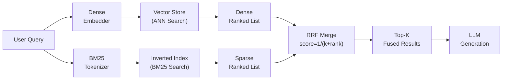
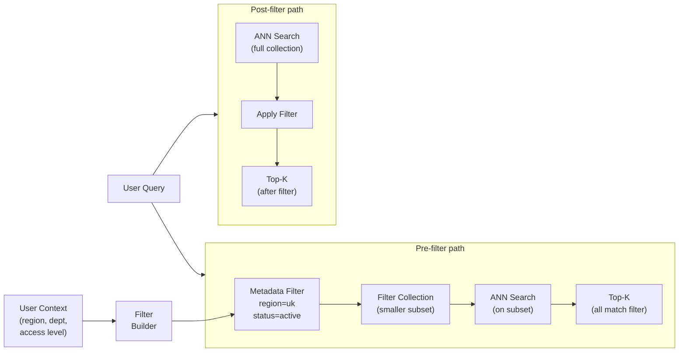

## Keywords in This File
{: .no_toc }

| # | Keyword | Weight |
|---|---|---|
| 12 | [Hybrid Search](#hybrid-search) | ★★☆ |
| 13 | [Metadata Filtering and Structured Retrieval](#metadata-filtering-and-structured-retrieval) | ★★☆ |

---

# Hybrid Search

**Interview Weight:** ★★☆ - One of the most impactful
retrieval improvements. Combining vector and keyword
search is a must-know for production RAG.

---

### 🎯 Model Answer

**30 seconds:**

> Hybrid search combines dense vector search (semantic)
> and sparse keyword search (BM25/TF-IDF) to get
> the best of both: semantics finds conceptually
> similar text, keywords find exact terms. The results
> are fused with Reciprocal Rank Fusion (RRF) or
> weighted scoring. Hybrid search consistently
> outperforms either method alone, especially for
> queries with specific terms (product names, codes,
> proper nouns) that semantic search may miss.

**3 minutes:**

> The problem: dense embeddings capture meaning well
> but miss specific terms. "CUDA out of memory error"
> might not be retrieved by a query embedding for
> "GPU memory error" because the embedding space
> represents "memory" similarly across contexts.
> But keyword (BM25) search finds "CUDA" exactly.
>
> Conversely: "How does attention work?" retrieves
> poorly with keyword search (too many documents
> with "how", "work") but retrieves well with
> semantic search (embeddings cluster attention-
> mechanism documents together).
>
> Hybrid search: run BOTH searches, get two ranked
> lists, merge with Reciprocal Rank Fusion (RRF).
>
> RRF formula:
> ```
> score = sum(1 / (k + rank_i))
> ```
> where k = 60 (typical constant) and rank_i is
> the position in each ranked list. A document
> ranked #1 in BOTH lists gets the highest combined
> score. RRF is robust to score scale differences:
> it doesn't require normalizing vector scores
> and BM25 scores to the same scale.
>
> Implementation options: many vector databases
> (Qdrant, Weaviate, Elasticsearch) support hybrid
> search natively. For custom: run BM25 with a
> library like rank_bm25, run vector search in
> parallel, merge with RRF.

**Blank Mind Recovery:**

**(1) Restate:** "What is hybrid search and why
is it better than vector search alone?"

**(2) First principles:** "Semantic search knows
what you mean. Keyword search knows what you said.
Sometimes both matter: 'What is the CVE-2024-1234
vulnerability?' - semantic: understand 'vulnerability';
keyword: find the exact CVE ID."

---

### 📘 Concept Explanation

**What it is:**

Hybrid search combines dense vector retrieval
(ANN search on embeddings) with sparse keyword
retrieval (BM25 or TF-IDF) and merges the results.
The combination captures both semantic similarity
and exact term matches.

**Dense vs. Sparse retrieval:**

```
DENSE (vector) search:
  Pros: finds semantically similar text
        handles synonyms and paraphrases
        language-agnostic
  Cons: misses exact terms
        poor for rare proper nouns, codes, IDs
        poor for out-of-vocabulary terms

SPARSE (BM25) search:
  Pros: exact term matching
        handles product codes, error codes, IDs
        interpretable (you know why a doc matched)
  Cons: requires exact vocabulary match
        no synonym understanding
        "bag of words" - no semantic understanding
```

**Reciprocal Rank Fusion (RRF):**

```
Given: two ranked lists A and B

For each candidate document d:
  score(d) = 1/(k + rank_A(d)) + 1/(k + rank_B(d))
  (if d not in a list: use rank = infinity)

k = 60 is the standard constant (controls the
    impact of low-ranked documents)

Example:
  Doc1: rank 1 in A, rank 3 in B
  score = 1/(60+1) + 1/(60+3)
        = 0.01639 + 0.01587 = 0.03226

  Doc2: rank 1 in A only (not in B)
  score = 1/(60+1) = 0.01639

  Doc1 > Doc2 because it appeared in both lists
```

**When hybrid is most valuable:**

```
QUERY TYPE             BEST SEARCH
----------             -----------
"What is attention?"   Dense (semantic)
"CVE-2024-1234"        Sparse (exact ID)
"OutOfMemoryError"     Sparse (exact error name)
"memory problems"      Dense (conceptual)
"REST vs GraphQL"      Dense (conceptual comparison)
"AWS SDK v3 config"    Hybrid (semantic + exact terms)
"rate limiting in API" Hybrid (concept + terms)
```

---

### 💻 Code Example

```python
from dataclasses import dataclass
from typing import Any

@dataclass
class SearchResult:
    doc_id: str
    text: str
    dense_rank: int | None = None  # None if not in list
    sparse_rank: int | None = None
    rrf_score: float = 0.0


def reciprocal_rank_fusion(
    dense_results: list[dict],
    sparse_results: list[dict],
    k: int = 60,
    top_k: int = 10
) -> list[SearchResult]:
    """
    Merge dense and sparse results with RRF.

    dense_results: [{doc_id, text, score}] (sorted)
    sparse_results: [{doc_id, text, score}] (sorted)
    """
    scores: dict[str, SearchResult] = {}

    # Process dense results
    for rank, result in enumerate(dense_results, 1):
        doc_id = result["doc_id"]
        if doc_id not in scores:
            scores[doc_id] = SearchResult(
                doc_id=doc_id,
                text=result["text"]
            )
        scores[doc_id].dense_rank = rank
        scores[doc_id].rrf_score += 1.0 / (k + rank)

    # Process sparse results
    for rank, result in enumerate(sparse_results, 1):
        doc_id = result["doc_id"]
        if doc_id not in scores:
            scores[doc_id] = SearchResult(
                doc_id=doc_id,
                text=result["text"]
            )
        scores[doc_id].sparse_rank = rank
        scores[doc_id].rrf_score += 1.0 / (k + rank)

    # Sort by RRF score
    merged = sorted(
        scores.values(),
        key=lambda r: r.rrf_score,
        reverse=True
    )
    return merged[:top_k]


# BAD: vector-only retrieval (misses exact terms)
def bad_retrieve(query: str, vector_store: Any):
    """Dense only - misses exact term queries."""
    return vector_store.search(query, top_k=10)


# GOOD: hybrid retrieval with RRF
def hybrid_retrieve(
    query: str,
    vector_store: Any,
    bm25_index: Any,
    top_k: int = 10
) -> list[SearchResult]:
    """
    Parallel dense + sparse, merged with RRF.
    """
    # Run both searches
    dense_results = vector_store.search(
        query, top_k=top_k * 2  # retrieve more for fusion
    )
    sparse_results = bm25_index.search(
        query, top_k=top_k * 2
    )

    # Convert to common format
    dense = [
        {"doc_id": r["id"], "text": r["text"]}
        for r in dense_results
    ]
    sparse = [
        {"doc_id": r["id"], "text": r["text"]}
        for r in sparse_results
    ]

    return reciprocal_rank_fusion(dense, sparse, top_k=top_k)


# BM25 (sparse) index - production: use rank_bm25
class SimpleBM25:
    """Stub BM25 implementation for illustration."""
    def __init__(self, corpus: list[dict]):
        self._corpus = corpus

    def search(
        self, query: str, top_k: int = 10
    ) -> list[dict]:
        query_terms = set(query.lower().split())
        scored = []
        for doc in self._corpus:
            doc_terms = set(doc["text"].lower().split())
            # Jaccard-like overlap as score stub
            overlap = len(query_terms & doc_terms)
            if overlap > 0:
                scored.append({"id": doc["id"],
                                "text": doc["text"],
                                "score": overlap})
        scored.sort(key=lambda x: x["score"],
                    reverse=True)
        return scored[:top_k]
```

> **Code walkthrough:** `reciprocal_rank_fusion`
> implements the standard RRF merge: for each document,
> accumulate `1/(k + rank)` from each list it appears
> in. Documents appearing in both lists get contributions
> from both, naturally ranking above documents in
> only one list. The k=60 constant is the empirically
> validated default - it prevents the top-ranked
> documents from completely dominating. The BAD
> example runs only dense search, missing documents
> that match by exact term. The GOOD example runs
> both searches in parallel (2x top_k candidates
> each) and merges - the extra candidates allow
> RRF to correctly identify documents that were
> lower-ranked in one list but high in the other.

---

### 🎓 Answers by Seniority

**Junior / Mid:**

> "Hybrid search runs both dense vector search
> (semantic) and sparse keyword search (BM25) and
> merges the results. The merge algorithm is Reciprocal
> Rank Fusion (RRF), which gives higher scores to
> documents that appear highly ranked in both lists.
> Hybrid consistently outperforms either alone,
> especially for queries with specific terms like
> error codes, product names, and IDs that semantic
> search misses."

---

**Senior / Staff:**

> "For production RAG, hybrid search is the first
> retrieval upgrade I implement after establishing
> a baseline. The wins are immediate and consistent:
> Elasticsearch, Qdrant, and Weaviate all have built-
> in hybrid search with BM25. For dense-only Pinecone:
> run a separate BM25 index in parallel and merge
> with RRF externally. The only tuning parameter
> that matters in practice: the alpha weight between
> dense and sparse. Start with 0.5 (equal), shift
> toward sparse (0.3 dense, 0.7 sparse) if queries
> are ID-heavy, shift toward dense (0.7, 0.3) if
> queries are conceptual. Measure on your golden
> test set."

---

### ⚠️ Common Misconceptions

**Misconception: "Hybrid search always outperforms
dense-only search."**

Hybrid search can hurt if the sparse search adds
noise for the query distribution. For purely
conceptual queries over well-structured prose
documents with controlled vocabulary (e.g., internal
wiki), BM25 may return unrelated documents that
happened to share common words with the query.
These noise documents then depress the ranking of
the truly relevant documents in RRF. The solution:
test on your golden set. If hybrid underperforms
dense-only for your query distribution, stick with
dense-only. Hybrid is not a universal improvement
- it's a hypothesis to test.

---

### 🚨 Failure Modes and Diagnosis

**Failure: Hybrid search degrades for certain
query types**

*Symptom:* Product support queries that include
model numbers (e.g., "Widget Pro 3000 firmware
update") now return wrong results after enabling
hybrid search.

*Root cause:* BM25 over-weights the model number
("3000") because it appears rarely in the corpus
(high IDF). Documents that happen to mention "3000"
in any context rank higher than documents about
firmware updates in general.

*Diagnosis:* Compare hybrid vs. dense-only results
for the failing query type. If dense-only is correct
and hybrid is wrong: BM25 is adding noise for
this query type.

*Fix:*
(1) Adjust alpha: for this query type, shift toward
    dense (alpha_dense = 0.8, alpha_sparse = 0.2).
(2) Apply query-type routing: if the query matches
    a known pattern (model number, SKU, version number),
    use dense-only for those queries and hybrid for others.
(3) Filter the BM25 vocabulary: exclude product
    codes from BM25 scoring (they add noise).

---

### 🎯 Interview Deep-Dive

| Seniority | Time | Focus |
|---|---|---|
| Junior | 5 min | Dense vs. sparse, RRF formula |
| Mid | 7 min | Implementation, alpha tuning |
| Senior | 10 min | Production deployment, failure modes |

---

**[JUNIOR] Q1 - What is BM25 and why is it
still relevant in the era of embeddings?**

BM25 (Best Match 25): a probabilistic term-frequency
scoring algorithm. For each query term, BM25 computes
a score based on:
- Term frequency in the document (how often the
  term appears)
- Inverse document frequency (how rare the term
  is across all documents - rare terms are more
  discriminative)
- Document length normalization (longer documents
  aren't artificially boosted)

Why still relevant:

(1) Exact term matching: embeddings are trained
    to generalize across vocabulary. For rare or
    specialized terms (error codes, product names,
    chemical formulas, proper nouns), the embedding
    might not have seen them in training and
    generalizes poorly. BM25 finds exact matches.

(2) Interpretability: BM25 can tell you exactly
    why a document was retrieved (these terms
    matched). Embeddings are black-box - you can't
    explain why two vectors are similar.

(3) Zero-shot for new terms: if a new product
    launches ("WidgetPro X500"), BM25 retrieves
    it correctly from day 1. An embedding model
    would need to be updated to understand the
    new name's semantic context.

(4) Speed: BM25 is extremely fast (inverted index
    lookup). No neural network inference required.

*What separates good from great:* "Zero-shot for
new terms" - BM25 handles new vocabulary immediately
without model updates.

---

**[MID] Q2 - How does RRF work and why k=60?**

RRF (Reciprocal Rank Fusion):
```
score(d) = sum over lists: 1 / (k + rank(d, list))
```

k=60: the constant that reduces the influence of
rank position. Without k: rank 1 vs. rank 2 difference
is 1.0 vs. 0.5 (50% drop). With k=60: rank 1 vs.
rank 2 is 1/61 vs. 1/62 (1.6% drop). This means
the absolute rank matters less - all top-ranked
documents score similarly, reducing noise from
rank order.

Why 60 specifically: empirically validated across
many retrieval tasks as a robust default. Higher
k = more equal weighting of all ranked positions.
Lower k = top ranks dominate more. k=60 provides
a good balance.

Alternative to RRF: linear score combination.
```
score(d) = alpha * dense_score(d) +
           (1-alpha) * sparse_score(d)
```

Problem with linear combination: dense scores
(cosine similarity: 0.0 to 1.0) and sparse scores
(BM25: can be any positive float) have incompatible
scales. Requires normalization (min-max scaling
per query) before combining. RRF avoids this
because ranks are always comparable across lists.

*What separates good from great:* "Incompatible
score scales" as the specific reason RRF is preferred
over linear combination.

---

**[MID] Q3 - [TRADE-OFF] When should you use
native hybrid search (in the vector DB) vs.
building it yourself?**

Native hybrid search (Qdrant, Weaviate, Elasticsearch):
- Single query, one response
- Lower latency (parallel execution server-side)
- Fewer infrastructure components to manage
- Limited tuning options (RRF parameters fixed or
  limited by the database's implementation)

Custom hybrid search:
- Full control: any BM25 library, any merge algorithm
- Can run different models for dense search
  vs. different corpus for sparse
- Can implement custom weighting per query type
  (route conceptual queries to dense-only)
- More infrastructure: separate BM25 index to manage,
  merge logic to maintain
- Higher latency if poorly implemented (serial
  execution)

Decision:
- Start with native if your vector DB supports it:
  faster to implement, lower operational overhead
- Switch to custom if: (1) you need query-type
  routing (different alpha per query), (2) you
  need a specialized BM25 corpus that differs from
  the vector index, (3) the native implementation
  doesn't let you tune RRF parameters

*What separates good from great:* "Query-type routing"
as the specific feature that justifies custom
hybrid over native.

---

**[SENIOR] Q4 - How do you tune the alpha parameter
in hybrid search?**

Alpha: the weight between dense and sparse scores
in linear combination hybrid search.

```
hybrid_score = alpha * dense_score +
               (1 - alpha) * sparse_score
```

(Note: for RRF, there is no alpha - both lists
are given equal weight by default. Alpha tuning
applies to weighted linear combination.)

Tuning process:

(1) Classify your query distribution:
    - ID/code queries: "CVE-2024-1234", "SKU-4892"
    - Conceptual queries: "how does JWT work?"
    - Mixed: "JWT authentication error code"

(2) Test recall@5 at different alpha values
    (0.1, 0.25, 0.5, 0.75, 0.9) using your golden
    test set, segmented by query type.

(3) Find the optimal alpha per query type:
    - ID-heavy: alpha ~0.2-0.3 (favor sparse)
    - Conceptual: alpha ~0.7-0.8 (favor dense)
    - Mixed: alpha ~0.5 (balanced)

(4) Implement query-type classification:
    Simple heuristic: if the query contains a digit
    sequence or all-caps abbreviation (regex match):
    classify as ID/code, use alpha=0.2. Otherwise:
    use alpha=0.7.

Production: Weaviate uses a fixed alpha parameter
("hybridFusion" parameter). Qdrant supports "using"
to select fusion mode. For alpha tuning: use a
proxy layer that routes queries with different
parameters.

*What separates good from great:* Query-type
classification using simple heuristics (regex for
IDs/codes) as a practical implementation.

---

**[SENIOR] Q5 - How does hybrid search interact
with reranking?**

Pipeline: hybrid search -> reranking -> generation.

Hybrid search provides the top-K candidates.
Reranking re-scores those candidates with a
cross-encoder model (slower but more accurate
than bi-encoder retrieval).

The interaction:

(1) Hybrid search produces a better initial candidate
    set than dense-only because:
    - Includes documents that matched by exact term
    - Documents in both lists have higher initial
      confidence
    - The reranker has more relevant candidates
      to work with

(2) Reranker can still improve over hybrid: hybrid
    scores are based on individual document similarity
    to the query. The reranker reads both query
    AND document together (cross-attention) and
    scores the pair. This catches subtle relevance
    that neither dense embedding nor BM25 captures.

(3) Typical configuration:
    Hybrid: top 20-50 candidates
    Reranker: score all 20-50, return top 5-10
    Generation: use top 5-10 chunks

Value of each step:
- Hybrid alone: recall@10 typically 80-90%
- Hybrid + rerank: precision@5 typically 70-85%
  (not just recall - the right documents are at
  the top)

*What separates good from great:* "Precision vs.
recall" - hybrid improves recall (more relevant
docs in the set), reranking improves precision
(right docs at the top).

---

**[SENIOR] Q6 - [TRADE-OFF] What are the latency
and cost implications of hybrid search?**

Latency breakdown:

Dense search: ANN search, 1-20ms
Sparse search: inverted index lookup, 1-10ms
RRF merge: O(N) where N = candidates, < 1ms

Total additional latency vs. dense-only:
- Native hybrid: +5-15ms (parallel execution)
- Custom (parallel): +10-30ms
- Custom (serial): +20-60ms (avoid this)

Always run dense and sparse in parallel.

Cost breakdown:

Dense search: vector store query cost (usually
compute-based or per-query pricing)
Sparse search: typically free (BM25 is cheap
to run on a text inverted index)
Additional data storage: BM25 inverted index
(typically 10-30% of vector store size)

Cost vs. benefit:

Hybrid adds ~5-15ms latency and a small storage
overhead. It typically improves retrieval recall
by 5-15% depending on query distribution. For
most production RAG systems: this is one of the
best cost-to-quality ratios available.

When to skip hybrid:
- Latency budget is extremely tight (< 10ms total
  retrieval budget)
- Query distribution is purely conceptual/semantic
  (no ID/code/exact-match queries) - hybrid adds
  marginal benefit
- The vector store doesn't support BM25 index and
  adding external infra is not justified

*What separates good from great:* "Parallel execution"
as the non-negotiable implementation constraint
for acceptable latency.

---

**[SENIOR] Q7 - [DEBUGGING] Hybrid search retrieves
relevant documents for general queries but fails
for rare technical terms. Diagnose and fix.**

Symptom: "What is the rate limit?" retrieves well.
"XYZ-PRO-v2 API rate limit" fails - the correct
document isn't in top-5.

Diagnosis:
(1) Run dense-only for "XYZ-PRO-v2 API rate limit":
    - Check if the correct document is in dense top-5
    - If not: embedding model doesn't understand
      "XYZ-PRO-v2" as an entity

(2) Run sparse-only (BM25) for the same query:
    - Check if the correct document is in sparse top-5
    - If not: "XYZ-PRO-v2" may not exist in the
      BM25 index (it might be tokenized to "XYZ",
      "PRO", "v2" and each matches too many documents)

(3) Check the BM25 tokenization: how is "XYZ-PRO-v2"
    tokenized?
    - If split by hyphen: "XYZ", "PRO", "v2" are
      common terms with low IDF -> low BM25 score
    - If kept as single token: high IDF, exact match
      is strong

Root cause: BM25 tokenization splits the product
code at hyphens, distributing signal across common
sub-tokens.

Fix: custom tokenizer for the BM25 index that
preserves hyphenated tokens as single units:

```python
import re

def technical_tokenizer(text: str) -> list[str]:
    """Keep hyphenated and versioned tokens intact."""
    # Preserve: XYZ-PRO-v2, CVE-2024-1234, AWS-S3
    tokens = re.findall(
        r'[A-Z0-9][A-Z0-9\-\.v]*[A-Z0-9]|[a-z]+',
        text, re.IGNORECASE
    )
    return [t.lower() for t in tokens if len(t) > 1]
```

*What separates good from great:* "Custom tokenizer
that preserves compound technical tokens" as the
root-cause fix.

---

**[SENIOR] Q8 - [BEHAVIORAL] Describe a time you
implemented hybrid search and what you learned.**

Structure:
"Hybrid search solved a recurring retrieval failure
for product code queries in a customer support system."

Situation: customer support RAG system over product
documentation. Dense-only retrieval. Customer
queries often included model numbers ("GX-7000
power supply replacement") but the correct
documentation pages weren't retrieved.

Task: improve retrieval for model-number queries
without degrading general conceptual queries.

Action:
1. Added logging to identify failing query patterns.
   Found 23% of queries contained model numbers.
   For these, recall@5 was 41% (vs. 87% for general).
2. Added BM25 index over the same document corpus.
   Ran parallel hybrid search with RRF (k=60).
3. For model-number queries: recall@5 improved
   to 78%. For general queries: no regression.
4. Discovered that BM25 tokenization split model
   numbers (GX-7000 -> "GX", "7000"). Added custom
   tokenizer to preserve hyphenated tokens.
5. After tokenizer fix: model-number recall@5 = 91%.

Result: overall recall@5 improved from 76% to 87%.
Customer support ticket resolution rate for product-
specific queries improved measurably.

Lesson: dense-only is sufficient for conceptual
queries but fails for queries with exact identifiers.
Hybrid is the right default for production systems
where query distribution includes both types.

*What separates good from great:* The 23% query
pattern discovery - using logging to identify the
problem before guessing the solution.

---

**[SENIOR] Q9 - [BEHAVIORAL] When have you decided
NOT to use hybrid search and why?**

Structure:
"For a scientific literature RAG, hybrid search
degraded quality and I reverted to dense-only."

Situation: RAG over biomedical research papers
for a pharmaceutical company. Initially deployed
with hybrid search (RRF of dense + BM25).

Task: retrieval quality was inconsistent. Some
queries improved, others degraded.

Investigation:
1. Segmented golden test set by query type:
   - Conceptual ("mechanisms of CRISPR gene editing"): 
     dense-only better
   - Name-based ("PCSK9 inhibitor clinical trials"):
     hybrid better
   - Gene/protein codes ("BRCA1 pathway"):
     neither was great

2. Found: BM25 over-weighted common biomedical
   terms ("protein", "expression", "cell") that
   appeared in nearly every paper. High frequency
   = low IDF = near-zero BM25 contribution for
   these terms. BM25 was effectively adding noise
   without signal for conceptual queries.

Decision:
- For conceptual queries (60% of traffic): dense-only
- For name/code queries (40% of traffic): hybrid

Implemented query-type routing at the retrieval
layer:
```python
def route_retrieval(query: str, ...):
    if contains_identifier(query):  # regex check
        return hybrid_retrieve(query, ...)
    return dense_retrieve(query, ...)
```

Result: segmented approach outperformed always-hybrid
or always-dense.

Lesson: hybrid is not always better. Measure on
your specific query distribution. Route when
different query types need different strategies.

*What separates good from great:* "Route when
different query types need different strategies"
as the mature operational approach.

---

### ⚖️ Comparison Table

| Search Type | Semantic Match | Exact Match | Latency | Best For |
|---|---|---|---|---|
| Dense-only | Excellent | Poor | Low | Pure conceptual queries |
| Sparse (BM25) only | None | Excellent | Very low | Exact term lookup |
| Hybrid (RRF) | Excellent | Good | Low-Medium | Mixed query types |
| Hybrid + rerank | Best | Good | Medium | High-quality, latency-tolerant |

---

### 🏛️ System Design

*(Omit: ★★☆ concept.)*

---

### 📊 Diagram

```
HYBRID SEARCH:

Query
  |
  +--> Dense search --> [D1 D2 D3 D4 D5...]
  |
  +--> Sparse (BM25) -> [S1 S2 S3 S4 S5...]
                                     |
                                     v
                              RRF Merge
                          score = sum(1/(k+rank))
                                     |
                                     v
                             Fused Top-K
```



> **Diagram walkthrough:** The query flows in parallel
> to two retrieval systems: the dense path converts
> the query to a vector and searches the vector store
> (ANN search); the sparse path tokenizes the query
> and performs BM25 lookup against an inverted index.
> Both paths produce ranked lists independently.
> The RRF merge step combines both lists: documents
> appearing in both lists accumulate scores from
> both, naturally rising to the top. Documents
> appearing in only one list get a partial score.
> The fused top-K results are passed to the LLM
> for generation. The key insight: the two paths
> are complementary - dense handles semantics,
> sparse handles exact terms, and RRF picks the
> documents that both agree on.

---

---

# Metadata Filtering and Structured Retrieval

**Interview Weight:** ★★☆ - Practical production
technique that dramatically improves precision and
reduces noise in enterprise RAG systems.

---

### 🎯 Model Answer

**30 seconds:**

> Metadata filtering adds structured predicates to
> the vector search: retrieve documents that are
> BOTH semantically similar AND match specific attributes
> (date range, department, document type, author,
> version). Pre-filtering (apply metadata filter
> before ANN search) is faster but may miss some
> relevant results. Post-filtering (apply filter after
> ANN search) is slower but more accurate. Most
> production vector databases support pre-filtering
> with inverted indexes on metadata fields.

**3 minutes:**

> Why metadata filtering matters: in enterprise RAG,
> documents are not all equally applicable to a query.
> A query about "expense policy" from a UK employee
> should only retrieve UK expense policy documents,
> not the US, Australian, or historical versions.
> Without metadata filtering: the top-K may contain
> a mix of US, UK, and archived documents.
>
> Metadata fields to index: date, department, region,
> document_type, version, author, status (active/archived),
> access_level.
>
> Pre-filtering: apply the metadata filter first,
> then run ANN search only on the filtered subset.
> Fast (smaller search space) but requires the filter
> to be supported by the vector DB's indexing system.
>
> Post-filtering: run full ANN search, then filter
> results. Accurate (sees all candidates) but:
> if many results are filtered out, you may end up
> with fewer than K results.
>
> Hybrid (pre-filter + ANN): most production vector
> databases (Qdrant, Pinecone, Weaviate) support
> HNSW index with metadata payload index. The
> metadata filter is applied at the HNSW graph level,
> skipping filtered nodes during graph traversal.

**Blank Mind Recovery:**

**(1) Restate:** "What is metadata filtering in RAG
and when is it necessary?"

**(2) First principles:** "Even if a document is
semantically similar, it might be the wrong version,
wrong region, or wrong access level. Metadata filtering
adds structured constraints so I only retrieve
the right documents for the context."

---

### 📘 Concept Explanation

**What it is:**

Metadata filtering constrains vector search to a
subset of the document collection using structured
attributes. Instead of searching all N vectors,
search only the subset matching the filter condition.

**Types of metadata filters:**

```
FILTER TYPE     EXAMPLE
-----------     -------
Equality        department == "hr"
Range           date >= "2024-01-01"
Contains        tags contains "public"
Not equal       status != "archived"
Multiple AND    region == "uk" AND status == "active"
OR              type == "policy" OR type == "procedure"
```

**Pre-filter vs. Post-filter:**

```
PRE-FILTER:
  1. Filter collection: keep docs matching metadata
  2. Run ANN search on filtered subset
  3. Return top-K

  Time: O(filtered_N * log(filtered_N))
  Accuracy: may miss docs at edge of filtered set
  Problem: if filter reduces to tiny subset, ANN
           quality degrades (HNSW needs enough
           nodes to navigate effectively)

POST-FILTER:
  1. Run full ANN search: get top-(K * multiplier)
  2. Filter results
  3. Return first K that match filter

  Time: O(N * log N) (full ANN search)
  Accuracy: high (saw all candidates)
  Problem: if filter is very restrictive, may get
           < K results even with large multiplier
```

**Metadata design for filterability:**

```
GOOD metadata (low-cardinality, filterable):
  department: "hr" | "finance" | "engineering"
  status: "active" | "archived" | "draft"
  region: "us" | "uk" | "eu"
  doc_type: "policy" | "procedure" | "faq"
  year: 2022 | 2023 | 2024

BAD metadata (high-cardinality, not filterable):
  content_hash: "a8f3d..." (unique per document)
  embedding_norm: 0.9923  (continuous, not filterable)
  full_url: "https://..." (too specific to be useful)
```

---

### 💻 Code Example

```python
from dataclasses import dataclass, field
from typing import Any

@dataclass
class Document:
    doc_id: str
    text: str
    metadata: dict  # structured attributes


@dataclass
class MetadataFilter:
    """
    Composable metadata filter for vector search.
    """
    field_name: str
    operator: str  # eq, ne, gt, gte, lt, lte, in
    value: Any

    def matches(self, metadata: dict) -> bool:
        doc_val = metadata.get(self.field_name)
        if doc_val is None:
            return False
        if self.operator == "eq":
            return doc_val == self.value
        if self.operator == "ne":
            return doc_val != self.value
        if self.operator == "gt":
            return doc_val > self.value
        if self.operator == "gte":
            return doc_val >= self.value
        if self.operator == "lt":
            return doc_val < self.value
        if self.operator == "lte":
            return doc_val <= self.value
        if self.operator == "in":
            return doc_val in self.value
        return False


@dataclass
class CompoundFilter:
    """AND/OR of multiple MetadataFilters."""
    filters: list[MetadataFilter]
    logic: str = "AND"  # "AND" or "OR"

    def matches(self, metadata: dict) -> bool:
        results = [f.matches(metadata)
                   for f in self.filters]
        if self.logic == "AND":
            return all(results)
        return any(results)


# BAD: no metadata filtering
def bad_retrieve(query, vector_store, user_region):
    """
    Returns all regions mixed together.
    UK employee sees US policy documents in results.
    """
    return vector_store.search(query, top_k=5)


# GOOD: pre-filter by user context
def filtered_retrieve(
    query: str,
    vector_store: Any,
    filters: CompoundFilter,
    top_k: int = 5,
    pre_filter: bool = True
) -> list[Document]:
    """
    Vector search constrained by metadata filters.
    """
    if pre_filter:
        # Apply filter before ANN search
        # Most vector DBs support this natively
        return vector_store.search(
            query,
            top_k=top_k,
            filter=filters  # DB-native filter
        )
    else:
        # Post-filter: retrieve more, then filter
        candidates = vector_store.search(
            query, top_k=top_k * 5  # over-retrieve
        )
        matched = [
            c for c in candidates
            if filters.matches(c.metadata)
        ]
        return matched[:top_k]


# Automatic filter extraction from request context
def build_filters_from_context(
    user_context: dict
) -> CompoundFilter | None:
    """
    Build metadata filters from user/session context.
    """
    filter_list = []

    if user_context.get("region"):
        filter_list.append(MetadataFilter(
            "region", "eq", user_context["region"]
        ))

    if user_context.get("department"):
        filter_list.append(MetadataFilter(
            "department", "eq",
            user_context["department"]
        ))

    # Always exclude archived documents
    filter_list.append(MetadataFilter(
        "status", "ne", "archived"
    ))

    if not filter_list:
        return None

    return CompoundFilter(filter_list, logic="AND")


# Usage
user_context = {
    "region": "uk",
    "department": "hr"
}

filters = build_filters_from_context(user_context)
# Resulting filter: region==uk AND department==hr
# AND status!=archived
```

> **Code walkthrough:** `MetadataFilter` implements
> a single predicate (field, operator, value) with
> a `matches` method that evaluates against document
> metadata. `CompoundFilter` composes multiple filters
> with AND/OR logic. The BAD example retrieves without
> filters - a UK employee may see US policies, or
> archived/deprecated documents in their top-5. The
> GOOD example applies filters before (or after) ANN
> search. `build_filters_from_context` extracts
> relevant filters from the user session automatically
> (region, department, and an always-on archived
> filter). This pattern - deriving filters automatically
> from user context - prevents developers from
> forgetting to apply filters for specific query types.

---

### 🎓 Answers by Seniority

**Junior / Mid:**

> "Metadata filtering adds structured constraints
> to vector search: retrieve documents that match
> BOTH semantic similarity AND metadata predicates
> (region, date, type, department). Pre-filtering
> (filter first, then ANN) is faster. Post-filtering
> (ANN first, then filter) is more accurate but
> may return fewer than K results if the filter
> is very restrictive. Most vector databases support
> pre-filtering natively with payload indexing."

---

**Senior / Staff:**

> "Metadata filtering is what makes RAG useful
> in enterprise environments. Without it: a query
> about 'leave policy' returns a mix of UK, US,
> and 2021 archived policies. With it: a UK employee
> asking about leave sees only active UK policy.
> The design principles I follow: (1) extract
> filters from user context automatically (don't
> rely on the user to specify); (2) always filter
> out archived/deprecated documents by default;
> (3) keep metadata cardinality low (department,
> region, status: 5-20 values) - high-cardinality
> metadata fields become unique-per-document and
> are effectively unusable for filtering."

---

### ⚠️ Common Misconceptions

**Misconception: "Pre-filtering is always better
because it's faster."**

Pre-filtering can hurt recall when the filtered
subset is too small. HNSW graph traversal works
well on large collections. If a filter reduces
the search space to < 1,000 documents, the HNSW
graph for that subset may be poorly connected
(not enough entries for the graph structure to
be efficient), leading to degraded recall. In that
case: post-filtering (or full search with post-filter)
may actually be better despite being "slower" because
the full HNSW graph is always well-connected. The
rule: use pre-filtering when the filtered subset
is large (> 10,000 documents), post-filtering when
the filtered subset is small.

---

### 🚨 Failure Modes and Diagnosis

**Failure: Metadata filtering returns 0 results
for a valid query**

*Symptom:* User query is valid. The knowledge base
contains relevant documents. But the retrieval
returns 0 results.

*Root cause:* The metadata filter is too restrictive.
One of the filter conditions doesn't match any
document in the index, producing an empty result
set.

*Common causes:*
- Case sensitivity: filter has `region == "UK"` but
  documents have `region: "uk"` (lowercase).
- Missing metadata: some documents were indexed
  without the metadata field. The filter excludes
  them.
- Wrong field name: typo in the filter definition.

*Diagnosis:*
```python
def debug_filter(
    vector_store, filter, query, top_k=20
):
    # Run unfiltered first
    unfiltered = vector_store.search(query, top_k=20)
    print(f"Unfiltered top-{top_k}: {len(unfiltered)}")

    # Apply filter to unfiltered results
    matched = [
        d for d in unfiltered
        if filter.matches(d.metadata)
    ]
    print(f"After filter: {len(matched)}")

    # Print metadata of first unfiltered result
    if unfiltered:
        print("Sample metadata:", unfiltered[0].metadata)
```

*Fix:*
- Normalize metadata at index time (all lowercase,
  consistent format)
- Add a fallback: if filtered results < 2, re-run
  without filter and log the relaxation

---

### 🎯 Interview Deep-Dive

| Seniority | Time | Focus |
|---|---|---|
| Junior | 5 min | What it is, basic filter types |
| Mid | 7 min | Pre vs. post, filter design |
| Senior | 10 min | Enterprise patterns, failure modes |

---

**[JUNIOR] Q1 - When is metadata filtering
necessary in a RAG system?**

Metadata filtering is necessary when:

(1) Multi-tenant content: different users should
    only see their organization's documents. Filter
    by `tenant_id` or `org_id`.

(2) Versioned content: multiple versions of the
    same document exist. Filter by `status == "active"`
    to avoid archived or draft versions.

(3) Regional variation: policies, prices, or procedures
    vary by region. Filter by `region` to match
    the user's location.

(4) Access control: some documents are confidential.
    Filter by `access_level == "public"` or by the
    user's clearance level.

(5) Temporal relevance: for time-sensitive information,
    filter by `date >= "2024-01-01"` to only use
    recent documents.

Without metadata filtering: the vector search finds
semantically similar documents regardless of tenant,
version, region, or access level. Semantic similarity
does not enforce these business constraints.

*What separates good from great:* Access control
as a requirement (not just convenience) - metadata
filtering for security, not just relevance.

---

**[MID] Q2 - How do you design metadata fields
for effective filtering?**

Design principles:

(1) Low cardinality: filterable fields should have
    a small, finite set of values. Good: `status`
    (active, archived, draft). Bad: `document_url`
    (unique per document - can't filter meaningfully).

(2) Normalized values: consistent format across
    all documents. Use enums or controlled vocabularies.
    Bad: "UK", "uk", "United Kingdom" as values
    for the same concept. Good: always lowercase
    ISO code "gb".

(3) Defined at indexing time: metadata must be
    extracted and stored with the document when
    indexed. You can't add metadata retroactively
    without re-indexing.

(4) Common filter axes for enterprise RAG:
    ```
    document_type: policy|procedure|faq|report
    department: hr|finance|engineering|legal
    region: us|uk|eu|apac
    status: active|archived|draft|review
    access_level: public|internal|confidential
    year: 2022|2023|2024 (or ISO date for range)
    ```

(5) Avoid: storing the full text as metadata,
    embedding vectors as metadata, or computed
    values that change over time.

*What separates good from great:* "Controlled
vocabularies" as the implementation of low cardinality
- not just a recommendation.

---

**[MID] Q3 - [TRADE-OFF] How do you handle queries
where the metadata filter is too restrictive?**

Scenario: user asks about "leave policy" with
filters `region=uk AND department=hr AND year=2024`.
But there's no 2024 UK HR leave policy - only a
2023 version.

Result: 0 documents retrieved.

Strategies:

(1) Filter relaxation hierarchy: define a fallback
    order for filter relaxation. If the strict
    filter returns < 2 results: relax the most
    specific constraint (year). If still < 2:
    relax the next most specific (department).
    Continue until a minimum result count is met.

(2) Inform the user: "No 2024 UK HR leave policy
    found. Showing the most recent available version
    (2023)."

(3) Alternative: fuzzy time filters. Instead of
    `year == 2024`, use `year >= 2022 AND year <= 2024`
    to catch adjacent years.

Implementation:

```python
def relaxing_filtered_retrieve(
    query: str, filters: list[MetadataFilter],
    vector_store: Any, min_results: int = 3
) -> tuple[list, list]:
    """
    Returns (results, applied_filters).
    Relaxes filters until min_results are found.
    """
    current_filters = filters.copy()
    while current_filters:
        results = vector_store.search(
            query, top_k=10,
            filter=CompoundFilter(current_filters)
        )
        if len(results) >= min_results:
            return results, current_filters
        current_filters.pop()  # remove most restrictive
    return vector_store.search(query, top_k=10), []
```

*What separates good from great:* "Inform the user
that filters were relaxed" - transparency about
what was retrieved.

---

**[SENIOR] Q4 - How do you implement access-level
filtering for multi-tenant RAG?**

Multi-tenant requirement: user A can only see their
organization's documents. User B cannot see A's
documents even if semantically similar to their query.

Implementation:

(1) At indexing time: store `tenant_id` and
    `access_level` with every chunk.

(2) At query time: extract the user's tenant from
    the authenticated session (never from the user's
    query - that would allow injection). Build a
    mandatory filter:
    ```python
    mandatory_filter = MetadataFilter(
        "tenant_id", "eq", current_user.tenant_id
    )
    ```

(3) Make the tenant filter non-overridable: the
    application layer ALWAYS applies the tenant
    filter. The user cannot remove it or substitute
    a different tenant ID.

(4) For access levels within a tenant:
    ```python
    # User has "internal" access: can see public + internal
    access_filter = MetadataFilter(
        "access_level", "in",
        list_accessible_levels(user.clearance)
    )
    ```

Security requirement: the `tenant_id` filter must
be derived from the server-side authenticated user
session, never from the user's input. Deriving
from user input = access control bypass (the user
specifies `tenant_id=other_company`).

*What separates good from great:* "Never derive
tenant_id from user input" - the security rule
that prevents the most common access control bypass.

---

**[SENIOR] Q5 - [TRADE-OFF] How do you handle
metadata that you want to filter by but is absent
from some documents?**

Scenario: older documents were indexed before
`department` metadata was added. They have no
`department` field. A filter for `department == hr`
correctly excludes them.

But: some old documents ARE HR-relevant and should
be retrieved.

Options:

(1) Re-index with inferred metadata: use an LLM
    to infer the metadata for old documents:
    ```python
    # One-time backfill
    for doc in docs_without_department:
        dept = llm_classify_department(doc.text)
        doc.metadata["department"] = dept
        vector_store.update(doc.id, metadata=doc.metadata)
    ```
    Pros: clean metadata for all documents.
    Cons: LLM inference errors, significant one-
    time cost.

(2) Default value for missing: set `department = "unknown"`
    for documents without the field. Add an OR
    filter: `department == "hr" OR department == "unknown"`.
    Simple but "unknown" may match many irrelevant docs.

(3) Separate filter for known vs. unknown:
    First search with `department == "hr"`.
    If < 3 results: also search with `department is null`
    and merge.

(4) Document coverage tracking: maintain a metric
    "fraction of documents with complete metadata."
    Alert when coverage drops below threshold.
    Enforce metadata completeness at ingestion time.

Best approach: enforce metadata at ingestion (prevent
documents without required fields from being indexed).
Backfill for existing documents.

*What separates good from great:* "Enforce at
ingestion" as the prevention strategy vs. treatment.

---

**[SENIOR] Q6 - How do you implement temporal
relevance filtering for fast-changing domains?**

Fast-changing domains: pricing, product availability,
regulations, news. Documents become stale quickly.

Three temporal strategies:

(1) Hard date filter: only retrieve documents
    indexed after a cutoff:
    ```python
    MetadataFilter("indexed_date", "gte", "2024-01-01")
    ```
    Simple. Misses valid older documents that
    haven't changed (timeless policies, foundational
    reference material).

(2) Soft freshness score: add a freshness decay
    to the retrieval score:
    ```python
    days_old = (today - doc.indexed_date).days
    freshness = max(0.5, 1.0 - 0.001 * days_old)
    final_score = similarity * 0.8 + freshness * 0.2
    ```
    Old but highly relevant documents are still
    retrieved but ranked lower than fresh equivalents.

(3) Document-type specific TTL: apply different
    freshness rules per document type:
    - Pricing sheets: TTL = 30 days (filter hard)
    - Policy documents: TTL = 1 year (soft decay)
    - Technical specs: no TTL (timeless)

Implementation: at indexing time, compute `expiry_date`
= `indexed_date + doc_type_ttl`. At query time:
filter `expiry_date >= today`.

*What separates good from great:* "Document-type
specific TTL" as the nuanced approach vs. blanket
date filtering.

---

**[SENIOR] Q7 - [DEBUGGING] Retrieval filters
pass in testing but fail in production for some users.**

Symptom: filter `region == "uk"` works for most
UK users but 5% of UK users get US documents in
their results.

Diagnosis:

(1) Check how `region` is determined: is it from
    the user's profile (server-side) or from the
    HTTP request (user-controlled)?

(2) Check the user records for affected users:
    do their profiles have `region` set?

(3) Log the actual filter applied per query: what
    value was used for `region` when the US documents
    appeared?

Root causes found:

(a) `region` missing for some users: new users
    onboarded before the `region` field was required.
    Their profile has `region = null`. The filter
    `region == "uk"` excludes all documents when
    evaluated against their profile (the filter
    is applied but no region is passed = no filter
    at all in some implementations).

(b) Case mismatch: some users have `region = "UK"`
    (uppercase) but the filter checks lowercase.

(c) Filter not applied: some code paths skip filter
    construction for users without a `region` attribute.

Fix:
- Normalize: ensure all user profiles have a region
  (backfill with IP geolocation or require on
  first login)
- Fallback: if user has no region, apply `region in ["uk", "us"]`
  based on their organization's default
- Add observability: log which filters were applied
  for every query

*What separates good from great:* "Log which filters
were applied for every query" - the audit capability
that makes this class of bug diagnosable.

---

**[SENIOR] Q8 - [BEHAVIORAL] Describe an access
control implementation you built for RAG.**

Structure:
"For a legal document RAG system, we implemented
multi-level access control using metadata filtering."

Situation: a law firm RAG assistant over client
documents, internal memos, and publicly available
case law. Strict requirement: lawyers can only
see documents for their assigned clients.

Task: implement access control that prevents cross-
client document exposure without requiring a separate
vector store per client (too expensive with 2,000+
clients).

Action:
1. Metadata schema:
   ```json
   {
     "doc_type": "client_doc | internal | public",
     "client_id": "client-123 | null",
     "access_level": "public | internal | client_restricted",
     "authorized_users": ["user-456", "user-789"]
   }
   ```

2. At query time: build mandatory filters from
   authenticated user session:
   ```python
   def get_access_filter(user_id, client_id):
       return CompoundFilter([
           # Can see public
           # OR internal (if firm member)
           # OR client docs for their client
       ], logic="OR")
   ```

3. Mandatory filter applied at the retrieval layer,
   never in the application layer (to prevent
   bypass through direct API access).

4. Logged every query with the applied filter and
   the user/client context for audit.

Result: zero access control incidents in 18 months.
Filter overhead: < 2ms additional latency per query.

Lesson: access control via metadata filtering scales
linearly with document count, not with user count.
One vector store handles all clients efficiently.

*What separates good from great:* "Mandatory filter
applied at retrieval layer, not application layer"
as the security architecture principle.

---

**[SENIOR] Q9 - What is "self-querying retrieval"
and how does it relate to metadata filtering?**

Self-querying retrieval: the LLM automatically
generates the metadata filter from the user's
natural language query, removing the need for
explicit filter construction.

Example:
Query: "What is the UK HR leave policy from 2024?"
LLM generates: `{region: "uk", department: "hr", year: 2024}`
The generated filter is applied to the vector search.

Implementation:
```python
def self_query_filter(
    query: str, client: anthropic.Anthropic
) -> dict:
    """Use LLM to extract metadata filters from query."""
    resp = client.messages.create(
        model="claude-haiku-4-5",
        max_tokens=200,
        system=(
            "Extract search filters from queries as JSON. "
            "Valid fields: region, department, year, "
            "doc_type, status.\n"
            "Return ONLY valid JSON. "
            "Use null for missing fields."
        ),
        messages=[{
            "role": "user",
            "content": (
                f"Query: '{query}'\n"
                "Filters (JSON only):"
            )
        }]
    )
    import json
    try:
        return json.loads(resp.content[0].text)
    except json.JSONDecodeError:
        return {}  # no filter if extraction fails
```

Benefit: users don't need to understand the metadata
schema. They ask natural questions and the system
extracts the filter automatically.

Risk: LLM may extract wrong filters (hallucinate
field values). Mitigation: validate extracted values
against a whitelist of valid values before applying.

*What separates good from great:* "Validate extracted
values against a whitelist" - preventing LLM
hallucination from producing invalid or dangerous
filter values.

---

### ⚖️ Comparison Table

| Approach | Precision | Complexity | Latency | Best For |
|---|---|---|---|---|
| No filtering | Low | None | Fastest | Small, homogeneous corpus |
| Post-filter | High | Low | Medium | Small filtered subsets |
| Pre-filter (native) | High | Medium | Fast | Most production cases |
| Self-querying filter | Very high | High | +LLM call | Complex natural language queries |
| Hierarchical filter | Very high | High | Fast | Multi-tenant, RBAC |

---

### 🏛️ System Design

*(Omit: ★★☆ concept.)*

---

### 📊 Diagram

```
METADATA FILTERING:

PRE-FILTER (faster):
  [All docs] -> [Filter: region=uk] -> [ANN search]
  -> top-K (all from UK docs)

POST-FILTER (more results):
  [All docs] -> [ANN search] -> [Filter: region=uk]
  -> top-K (filtered from all semantic results)
```



> **Diagram walkthrough:** Two retrieval paths are
> shown. The pre-filter path: extract filters from
> user context (region, department, access level),
> apply them to reduce the searchable collection,
> then run ANN search only on the filtered subset.
> This is faster (smaller search space) but requires
> the filtered subset to be large enough for HNSW
> to work well. The post-filter path: run full ANN
> search on the entire collection, then apply the
> filter to the results. This is more accurate but
> may return fewer than K results. The filter builder
> always derives filters from the server-side user
> context (authenticated session) - never from
> user input - to prevent access control bypass.
