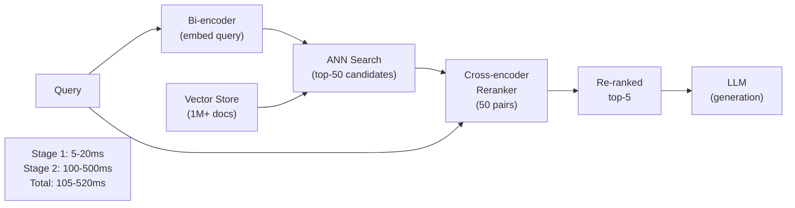
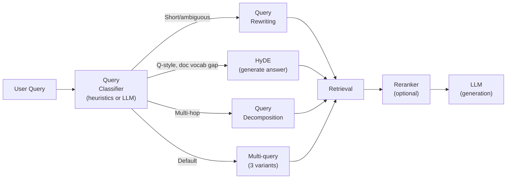

## Keywords in This File
{: .no_toc }

| # | Keyword | Weight |
|---|---|---|
| 14 | [Reranking and Cross-Encoders](#reranking-and-cross-encoders) | ★★☆ |
| 15 | [Query Transformation](#query-transformation) | ★★☆ |

---

# Reranking and Cross-Encoders

**Interview Weight:** ★★☆ - The single highest-ROI
improvement for RAG quality after the initial pipeline.
Every senior RAG engineer knows this pattern.

---

### 🎯 Model Answer

**30 seconds:**

> Reranking is a two-stage retrieval pattern: first,
> retrieve a large candidate set (top-20 to top-50)
> with fast bi-encoder ANN search; second, re-score
> all candidates with a slow but accurate cross-encoder
> model that reads the query AND each document together.
> The cross-encoder scores are more accurate because
> the model sees both texts simultaneously (full
> cross-attention). Return the top-5 reranked results
> to the LLM. Latency: +100-500ms. Recall improvement:
> +10-20%. Highest-ROI RAG improvement.

**3 minutes:**

> The core problem: bi-encoder retrieval (the standard
> embedding model) encodes the query and each document
> independently, then computes a similarity score
> between the two vectors. This is fast and scalable
> but lossy: a lot of information about the query-
> document relationship is lost when each is encoded
> separately.
>
> Cross-encoder: takes the query + document as a
> SINGLE input: "[CLS] query [SEP] document [SEP]".
> The transformer processes this combined input with
> full cross-attention - every query token can attend
> to every document token. The output is a single
> relevance score. This is much more accurate because
> the model can see whether specific query terms
> appear in context in the document, whether the
> document's content actually answers the question,
> and whether there's a semantic relationship between
> the question and answer.
>
> Why not just use the cross-encoder for retrieval?
> The cross-encoder must be run for EVERY (query,
> candidate_doc) pair. For 1M documents: 1M encoder
> passes per query = seconds per query. Unusable
> for direct retrieval. The two-stage approach:
> use bi-encoder to narrow from 1M to 50 candidates,
> then cross-encoder to accurately rank those 50.
>
> Implementation: models like BGE-reranker-large,
> Cohere Rerank, or cross-encoder/ms-marco-MiniLM
> are purpose-trained as rerankers. Cohere Rerank
> is a commercial API; the others are self-hostable.

**Blank Mind Recovery:**

**(1) Restate:** "What is a reranker and why is it
more accurate than the initial retrieval?"

**(2) First principles:** "The embedding model encodes
query and document separately - they never see each
other. The cross-encoder reads them together - like
a human who reads both the question and the answer
to judge whether they match."

---

### 📘 Concept Explanation

**What it is:**

Reranking is a second-stage retrieval step that
re-orders the initial candidate set from ANN search
using a more accurate scoring model. The reranker
(cross-encoder) processes each (query, candidate)
pair jointly to produce a relevance score.

**Bi-encoder vs. cross-encoder:**

```
BI-ENCODER (ANN retrieval):
  Query  -> Encoder -> Vector_Q
  Doc    -> Encoder -> Vector_D
  Score  = cosine(Vector_Q, Vector_D)

  Tokens of query and doc NEVER interact directly
  Fast: encode once, compare N times with dot product

CROSS-ENCODER (reranker):
  Input: "[CLS] query [SEP] doc [SEP]"
  -> Full transformer (all tokens attend to all)
  -> Score = linear(CLS_representation)

  Every query token attends to every doc token
  Slow: one forward pass per (query, doc) pair
  Accurate: captures fine-grained relevance
```

**Two-stage pipeline:**

```
Stage 1 (Recall): Bi-encoder retrieval
  1M documents -> ANN search -> top-50 candidates
  Time: 5-20ms

Stage 2 (Precision): Cross-encoder reranking
  50 candidates -> cross-encoder -> ranked 50
  Return top-5 to LLM
  Time: 100-500ms (50 forward passes)

Total: 105-520ms vs. 5-20ms without reranker
Quality improvement: precision@5 often +15-25%
```

**Reranker models:**

```
MODEL                              TYPE    LATENCY  QUALITY
-----                              ----    -------  -------
BGE-reranker-large                 Self    ~300ms   Very high
cross-encoder/ms-marco-MiniLM-L6   Self    ~100ms   High
Cohere Rerank v3                   API     ~200ms   Very high
Jina Reranker v2                   Both    ~150ms   High
```

---

### 💻 Code Example

```python
import anthropic
from dataclasses import dataclass

@dataclass
class RankedDoc:
    doc_id: str
    text: str
    initial_score: float
    rerank_score: float | None = None


# BAD: use only initial ANN scores for top-K
def bad_retrieve_and_generate(
    query: str,
    vector_store,
    client: anthropic.Anthropic
) -> str:
    """No reranking: top-5 by ANN score only."""
    docs = vector_store.search(query, top_k=5)
    context = "\n\n".join(d["text"] for d in docs)
    resp = client.messages.create(
        model="claude-haiku-4-5",
        max_tokens=1024,
        messages=[{
            "role": "user",
            "content": (
                f"Context:\n{context}\n\n"
                f"Question: {query}"
            )
        }]
    )
    return resp.content[0].text


# GOOD: retrieve 20 candidates, rerank to top-5
def reranked_retrieve_and_generate(
    query: str,
    vector_store,
    reranker,  # cross-encoder model
    client: anthropic.Anthropic,
    initial_k: int = 20,
    final_k: int = 5
) -> str:
    """
    Two-stage: broad retrieval -> precise reranking.
    """
    # Stage 1: retrieve broad candidate set
    candidates = vector_store.search(query, top_k=initial_k)

    # Stage 2: cross-encoder reranking
    pairs = [(query, c["text"]) for c in candidates]
    rerank_scores = reranker.predict(pairs)

    # Combine and re-sort
    ranked = sorted(
        zip(candidates, rerank_scores),
        key=lambda x: x[1],
        reverse=True
    )

    # Take top-final_k
    top_docs = [doc for doc, _ in ranked[:final_k]]

    # Assemble context with source labels
    context_parts = [
        f"[Source: {d.get('source', 'unknown')}]\n"
        f"{d['text']}"
        for d in top_docs
    ]
    context = "\n\n---\n\n".join(context_parts)

    resp = client.messages.create(
        model="claude-haiku-4-5",
        max_tokens=1024,
        system=(
            "Answer ONLY from the provided documents. "
            "Cite the [Source] for each claim."
        ),
        messages=[{
            "role": "user",
            "content": (
                f"Documents:\n{context}\n\n"
                f"Question: {query}"
            )
        }]
    )
    return resp.content[0].text


# Stub cross-encoder for illustration
class StubCrossEncoder:
    def predict(
        self, pairs: list[tuple[str, str]]
    ) -> list[float]:
        """
        Production: replace with sentence-transformers
        CrossEncoder or Cohere Rerank API.
        """
        # Stub: score by query-term overlap
        scores = []
        for q, d in pairs:
            q_terms = set(q.lower().split())
            d_terms = set(d.lower().split())
            scores.append(
                len(q_terms & d_terms) / len(q_terms)
                if q_terms else 0.0
            )
        return scores
```

> **Code walkthrough:** The BAD example retrieves
> top-5 by ANN score alone. ANN scores measure
> embedding similarity - accurate on average, but
> can rank less-relevant documents above more-relevant
> ones when embeddings don't capture fine-grained
> relevance. The GOOD example retrieves 20 candidates
> (4x more than needed, to give the reranker a rich
> candidate set), runs the cross-encoder on all 20
> pairs, and takes the top-5 by rerank score. The
> cross-encoder reads the full query + document
> together, scoring the actual relevance of each
> pair. In production: replace `StubCrossEncoder`
> with `CrossEncoder("BAAI/bge-reranker-large")`
> from sentence-transformers or Cohere's rerank API.

---

### 🎓 Answers by Seniority

**Junior / Mid:**

> "Reranking is a two-stage pattern: first retrieve
> a large candidate set (20-50 docs) with fast ANN
> search, then re-score with a cross-encoder that
> reads each (query, document) pair together - much
> more accurate than embedding similarity. Return
> the top-5 by rerank score to the LLM. The best
> reranking models: BGE-reranker-large (self-hosted),
> Cohere Rerank (API). Typical quality improvement:
> +15-25% precision@5."

---

**Senior / Staff:**

> "Reranking is the first thing I add after a baseline
> RAG system is working. The quality-to-cost ratio
> is unbeatable: 100-500ms latency overhead for
> a 15-25% precision improvement. In production:
> I retrieve top-20 candidates, rerank with BGE-
> reranker-large (or Cohere Rerank for managed
> infrastructure), return top-5. The other configuration
> decision: how many initial candidates (initial_k).
> Too few: the reranker can't surface missed relevant
> docs. Too many: reranker latency increases. I start
> with initial_k=20, measure recall, increase to 50
> if recall is below target."

---

### ⚠️ Common Misconceptions

**Misconception: "Reranking is only useful when
the initial retrieval is poor."**

Reranking improves retrieval even when ANN scores
are already good. The issue is not that ANN scores
are wrong, but that embedding similarity and
query-document relevance are correlated but not
identical. A document about "machine learning"
has high embedding similarity to a query about
"deep learning", but a document specifically about
"feedforward networks in deep learning" is more
relevant. The cross-encoder can distinguish this;
the cosine similarity between embeddings often
cannot. Reranking improves precision by promoting
precisely-relevant documents above broadly-similar
but less-relevant ones.

---

### 🚨 Failure Modes and Diagnosis

**Failure: Reranker scores all candidates identically
(near-zero variance)**

*Symptom:* After reranking, all 20 candidates have
scores between 0.01 and 0.03. The reranker is
not discriminating.

*Root cause:* The reranker model is being used
with unnormalized input or the model produces
logits (raw scores) instead of probabilities. Some
cross-encoder implementations return raw logits;
others return sigmoid-normalized probabilities.

*Diagnosis:* Check 3-5 (query, relevant_doc) pairs
manually. What scores does the reranker produce?
For a clearly relevant pair, the score should be
notably higher than for a clearly irrelevant pair.

*Fix:* Ensure sigmoid normalization if using raw
logits. For sentence-transformers CrossEncoder:
use `convert_to_tensor=True` and let the library
handle normalization. For Cohere Rerank: the API
returns relevance_scores already normalized.

---

### 🎯 Interview Deep-Dive

| Seniority | Time | Focus |
|---|---|---|
| Junior | 5 min | Two-stage pipeline, why it works |
| Mid | 7 min | Model selection, initial_k tuning |
| Senior | 10 min | Production deployment, cost analysis |

---

**[JUNIOR] Q1 - What is a cross-encoder and why
is it more accurate than a bi-encoder for reranking?**

Bi-encoder: encode query and document separately
into two vectors, compare with cosine similarity.
The query and document tokens never interact -
they're encoded independently, then a single number
(cosine similarity) captures their relationship.

Cross-encoder: encode query and document as a
single concatenated input. Every query token attends
to every document token through the transformer's
self-attention mechanism. The model can learn:
- Does the document contain an answer to the question?
- Are specific terms from the query used in the
  document's answer context vs. passing mentions?
- Does the document refute, confirm, or partially
  address the query?

Example where bi-encoder fails:
Query: "What is the maximum file size limit?"
Document: "Files must not exceed 10MB."
Document 2: "The file system handles files of many sizes."

Cosine similarity for "file size limit" vs. "10MB limit"
might be similar for both documents (both mention
files). Cross-encoder correctly identifies Document 1
as highly relevant (directly answers the question)
and Document 2 as low relevance (no specific limit
stated).

*What separates good from great:* The specific
example where cosine similarity fails but cross-
encoder succeeds.

---

**[MID] Q2 - How do you choose initial_k for
the reranking candidate set?**

initial_k is the number of candidates retrieved
by ANN search before reranking. The reranker
re-scores and returns the top final_k.

The key constraint: the correct document must be
in the initial_k candidate set. If it's not in
the initial set: reranking cannot recover it.

Calculating initial_k:

(1) Measure recall@initial_k vs. recall@final_k
    without reranking using your golden test set.
    Example: recall@5 = 75%, recall@20 = 92%.
    The reranker can improve precision within the
    20 but cannot exceed 92% recall.

(2) Choose initial_k where recall plateau is acceptable.
    If recall@20 = 92% and recall@50 = 94%: going
    to 50 gives 2% recall improvement at 2.5x more
    reranker calls (more latency).

(3) Typical values: initial_k=20-50, final_k=5-10.
    Diminishing returns beyond initial_k=50 for
    most RAG applications.

Latency impact:
- 20 candidates: ~100-200ms for BGE-reranker
- 50 candidates: ~300-500ms
- 100 candidates: ~600ms-1s (usually too slow)

*What separates good from great:* "Measure recall@N
vs. N" as the data-driven approach to choosing
initial_k.

---

**[MID] Q3 - [TRADE-OFF] Self-hosted reranker
vs. Cohere Rerank API.**

**Self-hosted (BGE-reranker-large):**

Pros:
- Zero API cost per call
- Lower latency (local inference, GPU: 50-200ms)
- Data doesn't leave infrastructure
- Can fine-tune on domain data

Cons:
- Infrastructure: GPU required for acceptable latency
- Operational burden: model serving, autoscaling
- Cold start: model loading delay

**Cohere Rerank v3 API:**

Pros:
- Zero infrastructure
- High quality (SOTA on BEIR benchmark)
- Simple API: one call, get ranked results
- No cold start

Cons:
- Cost: $0.002 per 1000 searches (per query with
  up to 100 candidates per call)
- Latency: API round-trip adds 50-150ms
- Data leaves infrastructure (compliance concern)

At scale:
- 1M queries/day at $0.002/1000 = $2/day. Very cheap.
- Data compliance requirement: self-hosted required.
- Initial: use Cohere for fast iteration.
  Migrate to self-hosted when volume justifies it.

*What separates good from great:* "$0.002/1000
searches" - knowing the Cohere pricing and when
self-hosted becomes cost-justified.

---

**[SENIOR] Q4 - How do you measure the improvement
from adding reranking?**

Measurement framework:

(1) Offline evaluation:
    Golden test set (100+ query-answer pairs).
    Metrics:
    - MRR@5 (Mean Reciprocal Rank at 5): does the
      most relevant doc appear near the top?
    - NDCG@5 (Normalized Discounted Cumulative Gain):
      considers all top-5 positions, rewards higher
      positions for relevant docs
    - Precision@5: fraction of top-5 that are relevant

    Measure baseline (ANN-only) and with reranking.
    Report the delta.

(2) End-to-end quality:
    Human evaluation or LLM-as-judge:
    - Is the answer correct?
    - Is the answer grounded in the retrieved context?
    Measure before/after reranking.

(3) Production monitoring:
    Log retrieved doc IDs and rerank scores per query.
    Compare the distribution of rerank scores over time.
    If top-1 rerank scores drop: retrieval quality
    degraded (new docs, index changes, model drift).

Typical improvements I've seen:
- MRR@5: +0.08 to +0.15 (about 10-20% relative)
- Precision@5: +5-15 percentage points
- End-to-end answer quality (human eval): +10-20%

*What separates good from great:* "Log rerank
scores per query in production" - ongoing quality
monitoring, not just initial evaluation.

---

**[SENIOR] Q5 - [TRADE-OFF] When does reranking
NOT improve quality?**

Cases where reranking provides limited benefit:

(1) Initial retrieval is already high precision:
    if recall@5 = 95% without reranking, there's
    little room to improve. The documents in top-5
    are already correct - reranking can't add new
    documents that weren't in the initial set.

(2) All initial candidates are relevant: if initial_k=20
    and all 20 documents are genuinely relevant to
    the query, reranking only changes the order
    within an already-good set. Quality improvement
    is marginal.

(3) The query is so specific that keyword matching
    IS precision: for queries like "CVE-2024-1234",
    the BM25 exact match is already precise. Cross-
    encoder adds minimal signal.

(4) The reranker is not trained on your domain:
    a general-purpose reranker may not understand
    domain-specific relevance criteria. If the reranker
    ranks a document as highly relevant because it
    uses the right general language, but a domain
    expert would rank it lower because it lacks the
    specific technical detail needed, the reranker
    is not helping.

When reranking HURTS:
- Reranker has a strong bias toward certain document
  formats (e.g., list-based documents score higher
  than prose for some models). If your most relevant
  documents are dense prose, a list-biased reranker
  may demote them.
- Diagnosis: compare reranker scores vs. human
  relevance judgments for 20 sample queries.

*What separates good from great:* "Reranker has
a bias toward document format" as a specific failure
mode beyond "training data mismatch."

---

**[SENIOR] Q6 - [DEBUGGING] The reranker significantly
changes the order but answer quality doesn't improve.
Diagnose.**

Symptom: the reranker is changing rank order
(original rank 1 becomes rank 3, rank 8 becomes
rank 1) but the LLM answers are not noticeably
better.

Root causes and diagnosis:

(1) The reranker is optimizing a different relevance
    signal than what makes LLM answers better.
    Test: check whether the new top-1 document
    after reranking is actually more useful for
    the LLM than the pre-reranked top-1. Human
    judgment: read both documents, which would
    lead to a better answer?

(2) The LLM uses all top-5 documents, not just top-1.
    Even if the reranker improves the top-1, the
    LLM synthesizes from all 5. If the 5 documents
    are substantially the same (all relevant), rank
    order doesn't matter much.

(3) Generation quality is the bottleneck: the
    retrieval is already good enough. The bottleneck
    is in the generation step (system prompt, model,
    grounding instructions). Reranking improves
    retrieval; it doesn't fix generation issues.

Diagnosis path:
- Measure faithfulness separately from answer quality.
- Measure "was the correct document in top-5?"
  (retrieval recall) vs. "was the answer correct?"
  (end-to-end quality).
- If retrieval recall is already high (> 90%):
  the problem is in generation, not retrieval.

*What separates good from great:* "Retrieval recall
already high means the bottleneck is generation"
- precisely identifying where the problem is.

---

**[SENIOR] Q7 - [BEHAVIORAL] How have you tuned
a reranker for a domain-specific application?**

Structure:
"For a medical RAG system, a general reranker
penalized clinical documents, requiring domain
fine-tuning."

Situation: RAG system over clinical documentation.
Initial retrieval with Cohere Rerank. Answer quality
was inconsistent for clinical queries.

Task: diagnose and fix reranker performance for
clinical text.

Action:
1. Sampled 40 clinical queries. For each: manually
   judged relevance of top-10 retrieved docs.
   Compared human judgment vs. Cohere Rerank scores.

2. Found: the reranker consistently underscored
   documents with dense medical terminology and
   overscored documents with general-language
   explanations of the same concepts. A document
   explaining "myocardial infarction" in plain
   English scored higher than a clinical protocol
   document using medical terms, even though the
   clinical protocol was more actionable.

3. Fine-tuned BGE-reranker-base on 500 (query,
   positive_doc, negative_doc) triples from our
   clinical data:
   - Positives: clinical protocols and evidence-based
     guidelines
   - Negatives: patient-facing plain-language versions
     of the same concepts

4. After fine-tuning: clinical protocols ranked
   correctly above plain-language versions for
   clinical queries. Answer quality improved.

Result: 18% improvement in clinician satisfaction
scores for answer usefulness.

Lesson: general rerankers have biases toward
accessible language. Domain-specific fine-tuning
is required for specialized domains.

*What separates good from great:* "Plain-language
versions as hard negatives" - the specific data
design that teaches the reranker domain-specific
relevance.

---

**[SENIOR] Q8 - How do you add reranking to a
RAG system that's already in production?**

Safe rollout strategy:

(1) Shadow mode: run the reranker in parallel with
    the existing pipeline. Log both the old (ANN
    only) and new (reranked) top-5 for every query.
    Do NOT change what the LLM sees yet.

    Duration: 1-2 weeks to collect enough samples.

(2) Offline evaluation: compare ANN-only vs. reranked
    results on the logged queries using your golden
    test set and any human judgments you can get.
    Verify: is reranking consistently better?

(3) A/B test: route 5% of traffic to the reranked
    pipeline. Measure: answer quality, latency,
    faithfulness, user satisfaction proxies (thumbs
    down, follow-up questions).

(4) Gradual ramp: if A/B test is positive, ramp to
    10%, 25%, 50%, 100% over 1-2 weeks.

(5) Monitor: track P50/P95 latency, reranker
    error rate (timeouts, API failures), and quality
    metrics throughout.

Rollback trigger: if P99 latency increases by > 30%
or answer quality metrics degrade, roll back to
ANN-only immediately.

*What separates good from great:* "Shadow mode first"
as a safe way to collect data before changing
user-facing behavior.

---

**[SENIOR] Q9 - What is ColBERT and how does
it differ from standard reranking?**

Standard reranking (cross-encoder): one score per
(query, document) pair. Requires a full forward
pass for every query-document pair at query time.

ColBERT (Contextualized Late Interaction over BERT):
a middle ground between bi-encoders and cross-
encoders.

Key idea: encode the query and document into
MULTIPLE vectors (one per token), not one. Score
= maximum similarity across all token pairs (MaxSim
operation).

```
Bi-encoder: Q_vec · D_vec (1 vector each)
ColBERT: sum over query tokens q_i of:
         max over doc tokens d_j of: q_i · d_j
```

Why ColBERT:
- Pre-compute document token vectors at index time
  (like bi-encoder: done offline)
- At query time: embed only the query (fast)
- Compute MaxSim: more expensive than dot product
  but much less than full cross-encoder pass

Result: quality closer to cross-encoder, latency
closer to bi-encoder.

Use ColBERT when:
- Reranking latency is a bottleneck (> 300ms)
- Accuracy of bi-encoder is not sufficient
- You can afford the storage for token-level vectors
  (typically 128-256 dims per token, hundreds of
  tokens per document = large index)

Tool: RAGatouille is a library that wraps ColBERT
for RAG use cases. Qdrant also supports ColBERT-
style multi-vector indexing.

*What separates good from great:* "Pre-compute
document token vectors offline" as the key insight
that makes ColBERT faster than cross-encoders.

---

### ⚖️ Comparison Table

| Approach | Accuracy | Latency | Infrastructure | Best For |
|---|---|---|---|---|
| Bi-encoder (ANN only) | Medium | 5-20ms | Vector DB | Baseline, high throughput |
| Bi-encoder + cross-encoder rerank | Very high | 100-600ms | Vector DB + GPU | Standard production RAG |
| ColBERT | High | 50-200ms | Specialized index | Latency-quality balance |
| Cohere Rerank API | Very high | 200-400ms | API | Managed, fast iteration |

---

### 🏛️ System Design

*(Omit: ★★☆ concept.)*

---

### 📊 Diagram

```
TWO-STAGE RETRIEVAL:

Query -> [Bi-encoder ANN] -> top-50 candidates
                                     |
              [Cross-encoder reranker] (50 pairs)
                                     |
                              top-5 reranked
                                     |
                              [LLM generation]
```



> **Diagram walkthrough:** The query enters both
> stages. Stage 1: the bi-encoder converts the query
> to a vector, runs ANN search against 1M+ vectors,
> retrieves the top-50 candidates. This is fast
> (5-20ms) because ANN search is O(log N). Stage 2:
> the cross-encoder receives all 50 (query, document)
> pairs and scores each one. The scoring is expensive
> (50 forward passes) but operates on only 50 documents
> instead of 1M. The top-5 reranked results go to
> the LLM. The query is used in BOTH stages: once
> for embedding (bi-encoder) and once as text input
> to the cross-encoder (where it's read jointly
> with each document).

---

---

# Query Transformation

**Interview Weight:** ★★☆ - Advanced RAG technique
that improves retrieval for ambiguous, complex,
or poorly-worded queries. High impact for enterprise
RAG.

---

### 🎯 Model Answer

**30 seconds:**

> Query transformation techniques improve retrieval
> by modifying the query before search: query rewriting
> (fix ambiguity and expand abbreviations), HyDE
> (generate a hypothetical answer and use its embedding
> for retrieval), multi-query (generate 3-5 query
> variants and take the union of retrieved results),
> and query decomposition (for multi-hop questions,
> split into sub-queries). Each technique adds an
> LLM call before retrieval - trading latency for
> recall improvement.

**3 minutes:**

> The fundamental problem: users don't write perfect
> search queries. "My dashboard isn't working" is
> a poor RAG query - it's too ambiguous to retrieve
> the right troubleshooting documents. Query transformation
> rewrites or expands the query to better match the
> document vocabulary and improve retrieval.
>
> Query rewriting: use an LLM to expand abbreviations,
> resolve pronouns, add relevant keywords. "My dashboard
> isn't working" -> "Dashboard not loading: common
> causes and troubleshooting steps for web application
> dashboard failures." Retrieves relevant troubleshooting
> documents much more effectively.
>
> HyDE (Hypothetical Document Embeddings): instead
> of embedding the query, ask an LLM to write a
> hypothetical document that would answer the query.
> Embed that hypothetical document. The embedding
> of a full document-style answer is closer to real
> answer documents in the vector space than the
> embedding of a question-style query.
>
> Multi-query: generate 3-5 different phrasings
> of the same question and retrieve for each. Take
> the union of all retrieved documents. Increases
> recall by covering different vocabulary the
> documents might use.
>
> Query decomposition: for multi-hop questions
> ("What is the capital of the country where the
> headquarters of OpenAI is located?"), decompose
> into sequential sub-queries. Retrieve for each
> sub-query in order, using the answer to the first
> to inform the second.

**Blank Mind Recovery:**

**(1) Restate:** "What is query transformation and
why is it needed?"

**(2) First principles:** "The user's query is often
poorly worded for search. I can use an LLM to
rewrite the query to be more searchable before
I do retrieval - at the cost of one extra LLM call."

---

### 📘 Concept Explanation

**What it is:**

Query transformation is a set of preprocessing
techniques that modify or expand the user's query
before the retrieval step, to improve retrieval
recall and precision.

**Transformation techniques:**

```
TECHNIQUE        MECHANISM              USE WHEN
---------        ---------              --------
Query rewriting  LLM rewrites query     Ambiguous/short queries
                 to be more searchable  User slang/abbreviations

HyDE             LLM generates answer;  Query-doc vocabulary mismatch
                 embed the answer       Technical domain

Multi-query      LLM generates N        High recall needed
                 query variants;        Complex concepts
                 union of results

Decomposition    LLM splits query       Multi-hop questions
                 into sub-queries       Complex reasoning chains

Step-back        LLM generalizes        Overly specific queries
                 query to broader       that miss relevant context
                 concept
```

**HyDE (Hypothetical Document Embeddings):**

```
Standard:  embed("What is rate limiting?")
           -> vector Q
           -> search for nearest document vectors

HyDE:      LLM generates: "Rate limiting is a technique
           that restricts the number of API calls
           a client can make per time window. Common
           approaches include token bucket and sliding
           window algorithms..."
           embed(that_hypothetical_answer)
           -> vector H (much closer to answer docs)
           -> better retrieval results

Intuition: the embedding of "What is X?" is far
           from the embedding of "X is Y because Z"
           even though they're semantically related.
           HyDE bridges this gap.
```

---

### 💻 Code Example

```python
import anthropic

client = anthropic.Anthropic()


def rewrite_query(
    query: str,
    domain_context: str = ""
) -> str:
    """
    Rewrite a user query to be more searchable.
    Expands abbreviations, adds relevant keywords.
    """
    resp = client.messages.create(
        model="claude-haiku-4-5",
        max_tokens=200,
        system=(
            "Rewrite the user's search query to be "
            "more complete and searchable for a "
            "technical documentation system. "
            "Expand abbreviations, add relevant "
            "keywords, resolve pronoun references. "
            "Keep the core intent. Return ONLY the "
            "rewritten query, nothing else.\n"
            f"Domain: {domain_context}"
            if domain_context else ""
        ),
        messages=[{
            "role": "user",
            "content": f"Query: {query}"
        }]
    )
    return resp.content[0].text.strip()


def generate_hyde(query: str) -> str:
    """
    HyDE: generate a hypothetical answer document.
    Embed this instead of the query for better retrieval.
    """
    resp = client.messages.create(
        model="claude-haiku-4-5",
        max_tokens=400,
        system=(
            "Write a concise, factual answer to the "
            "question as if you were writing a "
            "technical documentation paragraph. "
            "Focus on accuracy and completeness. "
            "This will be used as a search document."
        ),
        messages=[{
            "role": "user",
            "content": query
        }]
    )
    return resp.content[0].text.strip()


def generate_multi_query(
    query: str,
    n_variants: int = 3
) -> list[str]:
    """
    Generate N alternative phrasings of the query.
    Union of results from all variants improves recall.
    """
    resp = client.messages.create(
        model="claude-haiku-4-5",
        max_tokens=400,
        system=(
            f"Generate {n_variants} different phrasings "
            "of the search query. Each phrasing should "
            "capture the same intent but use different "
            "vocabulary. Output ONLY the queries, "
            "one per line, no numbering."
        ),
        messages=[{
            "role": "user",
            "content": f"Original query: {query}"
        }]
    )
    variants = [
        line.strip()
        for line in resp.content[0].text.strip().splitlines()
        if line.strip()
    ]
    # Always include original
    return [query] + variants[:n_variants]


def decompose_query(query: str) -> list[str]:
    """
    Decompose a multi-hop query into sub-queries.
    Sub-queries should be answered in sequence.
    """
    resp = client.messages.create(
        model="claude-haiku-4-5",
        max_tokens=400,
        system=(
            "Decompose the complex question into "
            "simple sub-questions that can be "
            "answered sequentially to build toward "
            "the final answer. Output ONLY the sub-"
            "questions, one per line, in the order "
            "they should be answered. "
            "If the question is already simple: "
            "output just the original question."
        ),
        messages=[{
            "role": "user",
            "content": f"Question: {query}"
        }]
    )
    return [
        line.strip()
        for line in resp.content[0].text.strip().splitlines()
        if line.strip()
    ]


# BAD: use the raw query directly
def bad_retrieve(query: str, vector_store) -> list:
    """No transformation: poor for ambiguous queries."""
    return vector_store.search(query, top_k=5)


# GOOD: multi-query for high-recall retrieval
def multi_query_retrieve(
    query: str, vector_store, top_k: int = 5
) -> list:
    """
    Generate variants, retrieve for each, deduplicate.
    """
    variants = generate_multi_query(query, n_variants=3)
    seen_ids: set[str] = set()
    all_results = []

    for variant in variants:
        results = vector_store.search(
            variant, top_k=top_k
        )
        for r in results:
            if r["id"] not in seen_ids:
                seen_ids.add(r["id"])
                all_results.append(r)

    # Sort by score and return top-k unique
    all_results.sort(
        key=lambda x: x.get("score", 0), reverse=True
    )
    return all_results[:top_k * 2]
```

> **Code walkthrough:** Four transformation techniques
> are implemented separately. `rewrite_query` sends
> the query to Claude Haiku (fast, cheap) with a
> system prompt that instructs expansion of abbreviations
> and addition of relevant keywords. `generate_hyde`
> asks the LLM to write a hypothetical answer
> document - the embedding of this answer aligns
> better with actual answer documents in the vector
> space. `generate_multi_query` creates N phrasings
> of the same query, and `multi_query_retrieve` takes
> the union of results from all variants (deduplicating
> by document ID). The BAD example uses the raw
> query directly. The GOOD example generates 3 variants
> (including the original), retrieves for each, and
> deduplicates to return 2x top_k unique candidates
> for downstream reranking.

---

### 🎓 Answers by Seniority

**Junior / Mid:**

> "Query transformation modifies the user's query
> before retrieval to improve recall. Main techniques:
> query rewriting (LLM rewrites for better search),
> HyDE (generate a hypothetical answer and embed
> that instead of the query), multi-query (generate
> 3-5 variants, union the results), decomposition
> (split multi-hop into sub-queries). Each adds one
> or more LLM calls before retrieval - useful when
> retrieval quality is the bottleneck."

---

**Senior / Staff:**

> "For production systems, I decide which transformation
> to use based on failure mode analysis. If queries
> are short and ambiguous (user types 2-3 words):
> query rewriting. If there's a vocabulary mismatch
> between query style and document style (users ask
> questions, documents are explanatory prose): HyDE.
> If queries are complex and multi-faceted: multi-
> query. If queries require reasoning across documents:
> decomposition. And critically: I measure the impact
> before deploying. Multi-query triples the number
> of retrieval calls; it must show sufficient quality
> improvement to justify the extra latency and cost."

---

### ⚠️ Common Misconceptions

**Misconception: "HyDE always works better because
it generates a full answer document."**

HyDE can hurt for queries where the LLM's hypothetical
answer is factually wrong (hallucination) or diverges
from how the knowledge base frames the answer.
If the knowledge base uses a specific terminology
(e.g., internal product names, company-specific
jargon) and the hypothetical answer uses general
terminology, the embedding of the hypothetical
is in a different region of the vector space from
the actual knowledge base documents. HyDE works
best when the LLM's training data distribution
is similar to the document vocabulary. For highly
specialized internal knowledge bases: test HyDE
on your golden set before deploying.

---

### 🚨 Failure Modes and Diagnosis

**Failure: Multi-query generates variants that
retrieve the same documents, providing no benefit**

*Symptom:* Generating 3 query variants retrieves
nearly identical sets of documents. The union
provides < 5% additional unique documents vs.
single-query retrieval.

*Root cause:* The variants are too similar to the
original query. The LLM is rephrasing with synonyms
rather than fundamentally different vocabulary.

*Example:* Query: "API rate limiting"
Variants: "API rate limiting", "rate limit API calls",
"API request throttling" - all embed very similarly.

*Fix:* Modify the multi-query prompt to generate
conceptually different angles:

```python
system = (
    "Generate variants that approach the topic "
    "from different angles:\n"
    "1. More specific/technical version\n"
    "2. More general/conceptual version\n"
    "3. From a troubleshooting perspective\n"
    "Output one query per line."
)
```

*Measurement:* Track "unique_docs_per_variant":
if adding a variant retrieves 0 new unique documents,
that variant is redundant.

---

### 🎯 Interview Deep-Dive

| Seniority | Time | Focus |
|---|---|---|
| Junior | 5 min | Technique descriptions, when to use |
| Mid | 7 min | Implementation, trade-offs |
| Senior | 10 min | Measurement, combining techniques |

---

**[JUNIOR] Q1 - What is HyDE and when does it
outperform direct query embedding?**

HyDE (Hypothetical Document Embeddings): instead
of embedding the user's query for retrieval, use
an LLM to first generate a "hypothetical document"
that would answer the query, then embed that
hypothetical document.

Why this works: the query "How does HNSW ANN
search work?" has a different embedding distribution
than documents that explain HNSW. Questions and
explanations have different sentence structures,
vocabulary patterns, and semantic contexts. The
embedding of a question is not naturally close to
the embedding of an explanation.

When HyDE generates "HNSW (Hierarchical Navigable
Small World) is a graph-based approximate nearest
neighbor algorithm that builds a multi-layer
hierarchical graph structure to enable fast nearest
neighbor search...", this embedding IS close to
the real documentation that explains HNSW.

Outperforms direct query embedding when:
- Clear vocabulary gap between questions and answers
- Technical domain with specialized terminology
- Documents are explanatory prose (not Q&A format)

Underperforms when:
- The LLM hallucinates in the hypothetical answer
  (embedding leads to wrong region of vector space)
- The knowledge base has company-specific jargon
  that the LLM doesn't know
- The questions and answers use similar vocabulary
  (HyDE adds cost with no benefit)

*What separates good from great:* "Questions and
explanations have different sentence structures"
as the linguistic insight behind why HyDE works.

---

**[MID] Q2 - How does query decomposition work
for multi-hop questions?**

Multi-hop question: requires information from
multiple documents or multiple reasoning steps.

Example: "Who is the CEO of the company that
acquired WhatsApp, and what is their background?"

Single-step RAG fails: the combined query is too
specific to retrieve both the acquisition document
and the CEO's background document.

Decomposition:
Sub-query 1: "Which company acquired WhatsApp?"
Retrieved answer: "Meta (Facebook)"

Sub-query 2: "Who is the CEO of Meta?"
Retrieved answer: "Mark Zuckerberg"

Sub-query 3 (using context from 1+2): "What is
Mark Zuckerberg's professional background?"
Retrieved relevant documents.

Final generation: synthesize all three retrieved
contexts into a final answer.

Implementation approaches:

(1) LLM-first decomposition: ask an LLM to decompose
    the query into sub-queries before any retrieval.
    Then run retrieval for each sub-query sequentially.

(2) Iterative retrieval: retrieve for the original
    query, generate an intermediate answer, use
    the intermediate answer as the next query.
    Continue until the question is fully answered.

(3) ReAct (Reason + Act): the LLM alternates between
    reasoning steps and retrieval actions. More
    general than decomposition.

*What separates good from great:* "Use the intermediate
answer as the next query" for iterative retrieval.

---

**[MID] Q3 - [TRADE-OFF] When do query transformation
costs outweigh the benefits?**

Cost of query transformation:
- Each technique adds at least one LLM call
- Multi-query with N=3 variants: 3x retrieval calls
- Decomposition for a 3-hop question: 3 retrieval
  calls + 3 LLM calls for sub-queries

When the cost is justified:
- Quality is the primary concern (not latency/cost)
- Queries are often ambiguous or multi-hop
- Retrieval recall without transformation is low
  (< 70% recall@5)

When the cost is NOT justified:
- Queries are specific and well-formed: rewriting
  adds noise, not signal
- Latency budget is tight: each LLM call adds 100-500ms
- High volume low-value queries: transformation
  doubles cost for marginal improvement

Practical decision:
(1) Measure recall@5 on your golden test set without
    transformation.
(2) If recall > 85%: don't add transformation (already
    good enough).
(3) If recall < 75%: try rewriting first (cheapest).
(4) If still < 80%: try multi-query.
(5) If queries are often multi-hop: add decomposition.

*What separates good from great:* "85% recall threshold"
as the concrete metric decision gate.

---

**[SENIOR] Q4 - How do you combine query transformation
with reranking effectively?**

Combined pipeline:
```
User query
  -> Query transformation
     -> N retrieval calls (wider candidate set)
  -> Union + deduplication
  -> Reranking (cross-encoder on merged candidates)
  -> Top-K to LLM
```

The synergy: query transformation improves recall
(more relevant documents in the candidate set).
Reranking improves precision (most relevant documents
at the top of the candidate set). Together: high
recall from transformation + high precision from
reranking.

Configuration:
- Multi-query with N=3 variants -> 3 * top_k candidates
- After deduplication: typically 2-2.5x unique candidates
- Reranker on 2.5 * top_k candidates
- Final top-K to LLM

Latency budget:
- Multi-query LLM call: 200-500ms (Claude Haiku: fast)
- 3 ANN searches (parallel): +20-60ms
- Reranking 50 candidates: +300ms
- Total: ~600-900ms vs. 20ms for simple ANN-only

Is this justified? For high-quality, latency-tolerant
use cases (research assistant, legal Q&A, medical
decision support): yes. For high-throughput, latency-
sensitive (customer support chat): probably not.

*What separates good from great:* The full latency
breakdown of the combined pipeline (600-900ms)
as the concrete trade-off statement.

---

**[SENIOR] Q5 - What is the "step-back" query
technique and when is it most effective?**

Step-back prompting for RAG: when a query is too
specific, first retrieve for a "step-back" version
(more general), then for the specific query. Use
both sets of retrieved documents for generation.

Example:
Specific query: "What is the refund policy for
online purchases made with corporate credit cards
in the European Union?"

This is very specific. There may be no document
that addresses all these specifics simultaneously.

Step-back query (LLM-generated): "What is the
general refund policy for online purchases?"

Retrieve for both. The step-back retrieves general
policy context. The specific retrieves specific
rules if they exist. The LLM synthesizes: start
with the general policy, apply any specific rules
found.

Most effective when:
- Queries are very specific (long-tail)
- The knowledge base has general policies with
  specific exception documents
- Users are asking questions that have a "general
  case" and a "specific case"

Least effective:
- Queries are already appropriately general
- Step-back is too vague (retrieves unrelated general
  documents)

Implementation: prompt the LLM to "strip the most
specific constraint from this query to get the
more general underlying question."

*What separates good from great:* "General case
+ specific exception" as the document structure
that makes step-back most effective.

---

**[SENIOR] Q6 - [TRADE-OFF] When should you use
HyDE vs. multi-query for improving recall?**

HyDE vs. multi-query - they solve different problems:

HyDE addresses: vocabulary gap between the query
STYLE (question) and document STYLE (explanatory
prose). The query embedding is in a different region
of the vector space from the answer embeddings.

Multi-query addresses: coverage gap - the query
uses specific vocabulary that may not match every
relevant document's vocabulary. Different documents
may phrase the same concept differently.

Choose HyDE when:
- Queries are short (1-5 words) and the retrieval
  context is long explanatory text
- Documents are reference manuals, textbooks, or
  detailed technical explanations
- Embedding similarity between questions and their
  answers is consistently low (< 0.6)

Choose multi-query when:
- Queries are well-formed but the concept can be
  expressed many ways
- Documents use varied terminology for the same concept
- You need higher recall, not just better ranking

Combine both when:
- Generate a hypothetical answer (HyDE)
- Generate multi-query variants
- Run all variants through retrieval
- Rerank the union of results

The combination is expensive (multiple LLM calls
+ multiple retrievals) but achieves the highest
possible recall.

*What separates good from great:* "Vocabulary gap
vs. coverage gap" as the precise characterization
of what each technique solves.

---

**[SENIOR] Q7 - [DEBUGGING] Query transformation
is adding latency but recall hasn't improved. Diagnose.**

Symptom: rewrite + multi-query adds 600ms latency.
Golden test set recall@5 is the same (82%) as
without transformation.

Diagnosis:

(1) Check what the transformations are actually
    producing: log the rewritten queries and variants
    for 20 sample queries from the golden test set.
    Are the variants substantively different from
    the originals, or nearly identical?

(2) For queries where transformation doesn't improve
    recall: what was the original query? Are these
    already well-formed queries? If the user is already
    writing good queries, transformation adds noise.

(3) Check if the golden test set queries are representative
    of the actual production distribution. If golden
    test set queries are well-formed but production
    queries are ambiguous, transformation might be
    improving production quality without affecting
    the golden test set score.

Root causes found:
(a) All golden test set queries are already 5-10
    words and specific -> transformation has no
    room to improve them.
(b) The LLM prompt for rewriting is too conservative:
    outputs queries nearly identical to the input.
(c) Vocabulary gap is not the problem - the actual
    retrieval issue is in the chunking (relevant
    information is in different chunks from what
    the embedding model expects).

Fix:
- Test on a separate set of "messy" production
  queries (short, ambiguous, slang-heavy).
- If those improve with transformation but clean
  queries don't: apply transformation conditionally
  (detect query quality, only transform when needed).

*What separates good from great:* "Apply transformation
conditionally based on query quality detection"
as the production-appropriate solution.

---

**[SENIOR] Q8 - [BEHAVIORAL] Describe a time you
implemented query transformation and measured its impact.**

Structure:
"HyDE improved retrieval for an internal knowledge
base where employee questions and documentation
used very different vocabulary."

Situation: RAG over an HR knowledge base for
employee self-service. Employees asked: "Can I
take time off for my kid's doctor appointment?"
Documentation used: "Personal leave entitlement:
employees are entitled to take up to N days annually
for dependent care..."

Task: improve retrieval recall. Golden test set
showed recall@5 = 68% - too low for good answers.

Action:
1. Embedded 20 (question, corresponding policy document)
   pairs. Measured cosine similarity. Average: 0.42.
   Low - confirmed vocabulary gap between questions
   and documentation.

2. Tried query rewriting first: improved recall@5
   to 74% (+6%). Good but still below target.

3. Tried HyDE: LLM generated hypothetical policy
   paragraphs for each question. Similarity between
   hypothetical and real docs: 0.71 (vs. 0.42 for
   direct query embedding).

4. Recall@5 with HyDE: 84% (+16% from baseline).

5. A/B tested in production: HyDE group showed
   lower "escalate to HR" rates (employees found
   answers without contacting HR).

Result: +16% recall@5, measurable reduction in
HR escalations.

Lesson: always measure the cosine similarity between
queries and their gold documents first. If it's
below 0.6: HyDE is likely to help. If it's above
0.7: HyDE won't help much.

*What separates good from great:* "Measure cosine
similarity between queries and gold docs first"
as the diagnostic step that tells you whether HyDE
will help before you implement it.

---

**[SENIOR] Q9 - [BEHAVIORAL] When did query
transformation fail and what did you learn?**

Structure:
"Multi-query made quality worse for a legal document
search system because query variants introduced
semantic drift."

Situation: legal document search RAG. Initial retrieval
was good. Added multi-query to improve coverage.

Task: improve edge-case recall.

Problem: after deployment, user complaint rate
increased. Answers were less specific and sometimes
cited irrelevant legal clauses.

Investigation:
1. Logged all query variants. Found: for queries
   like "Section 4.2(b) exclusions", the LLM generated
   variants that generalized to "exclusion clauses
   in contracts" - semantically related but
   legally different.

2. These broader variants retrieved general exclusion
   clause documents instead of the specific Section
   4.2(b) context. The reranker ranked the wrong
   documents higher because the broader documents
   had better coverage of "exclusions" vocabulary.

3. Net result: multi-query HURT for specific legal
   reference queries by introducing broader, less
   precise documents.

Fix: applied multi-query only for queries that
matched "general question patterns" (detected by
LLM classification). Specific section references,
case citations, and legal codes bypassed multi-query
and went directly to hybrid search (exact BM25
match for the specific reference).

Lesson: multi-query is most effective for conceptual
queries with vocabulary variation. It degrades
quality for queries where the user ALREADY knows
exactly what they're looking for (specific references).

*What separates good from great:* "Conceptual queries
need multi-query; specific reference queries need
exact match" - the fundamental insight about when
transformation helps vs. hurts.

---

### ⚖️ Comparison Table

| Technique | Latency Cost | Recall Impact | Best Query Type |
|---|---|---|---|
| None | 0ms | Baseline | Well-formed specific queries |
| Query rewriting | +200-500ms (LLM) | +5-10% | Short, ambiguous queries |
| HyDE | +200-500ms (LLM) | +10-20% | Vocabulary gap between Q and docs |
| Multi-query | +200ms + N*ANN | +10-15% | Conceptual, varied vocabulary |
| Decomposition | +500ms per hop | N/A for simple | Multi-hop reasoning |
| Step-back | +200ms (LLM) | +5-10% | Overly specific queries |

---

### 🏛️ System Design

*(Omit: ★★☆ concept.)*

---

### 📊 Diagram

```
QUERY TRANSFORMATION SELECTION:

User query
  |
  v
Query type classification
  |
  +-- "Ambiguous/short"     -> Query rewriting
  |
  +-- "Question-style query" -> HyDE
  |    (docs are explanatory)
  |
  +-- "Needs coverage"      -> Multi-query
  |
  +-- "Multi-hop"           -> Decomposition
  |
  +-- "Too specific"        -> Step-back
```



> **Diagram walkthrough:** A query classifier routes
> the incoming query to the appropriate transformation
> technique. Short or ambiguous queries are rewritten.
> Question-style queries (where the user asks a question
> and documents contain explanatory prose) go to
> HyDE - the LLM generates a hypothetical answer
> document whose embedding matches the answer space
> better than the question embedding. Multi-hop
> queries go to decomposition. All other queries
> go to multi-query (default high-recall approach).
> All transformed queries flow into the retrieval
> step, then optionally through reranking, then to
> the LLM. The query classifier itself can be a
> simple heuristic (regex for specific references
> vs. question words) or a small LLM call.
