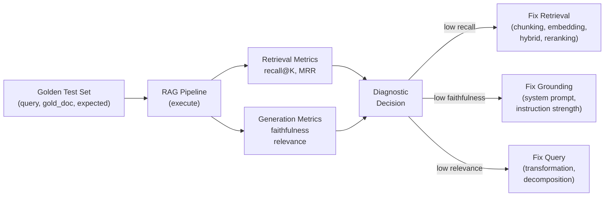
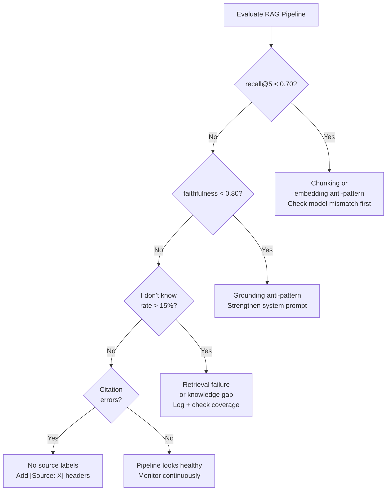

## Keywords in This File
{: .no_toc }

| # | Keyword | Weight |
|---|---|---|
| 16 | [RAG Evaluation](#rag-evaluation) | ★★☆ |
| 17 | [RAG Anti-Patterns](#rag-anti-patterns) | ★★☆ |

---

# RAG Evaluation

**Interview Weight:** ★★☆ - Knowing how to measure
RAG quality is what makes the difference between
guessing and improving.

---

### 🎯 Model Answer

**30 seconds:**

> RAG evaluation has two layers: retrieval metrics
> (did I retrieve the right documents?) and generation
> metrics (did the LLM generate a correct, grounded
> answer from those documents?). Retrieval: recall@K,
> MRR, NDCG. Generation: faithfulness (is the answer
> grounded in the context?), answer relevance (does
> it address the question?), and correctness (is
> it factually right?). The RAGAS framework automates
> these with LLM-as-judge scoring.

**3 minutes:**

> Without measurement, RAG improvement is guesswork.
> Evaluation answers: where in the pipeline is quality
> breaking down?
>
> Retrieval metrics:
> - Recall@K: fraction of queries where the correct
>   document appears in the top-K. Most important
>   metric: if the right document isn't retrieved,
>   nothing else can fix it.
> - MRR (Mean Reciprocal Rank): average of 1/rank
>   for the first relevant document. Rewards having
>   the right document at the top of the list.
> - NDCG (Normalized Discounted Cumulative Gain):
>   considers all K positions with position-weighted
>   scoring. Most complete retrieval metric.
>
> Generation metrics:
> - Faithfulness: does every claim in the answer
>   appear in the retrieved context? Measured by:
>   extract claims from the answer, check each against
>   the context (with an LLM judge or NLI model).
> - Answer relevance: does the answer address the
>   question? A faithful answer can still be irrelevant
>   (answers a different aspect of the question).
> - Contextual precision: what fraction of retrieved
>   chunks actually contributed to the answer?
>   Low precision = noisy retrieval (retrieved
>   irrelevant documents).
>
> RAGAS: an open-source framework that automates
> all these metrics using LLM-as-judge for faithfulness
> and answer relevance, and retrieval metrics for
> context quality.

**Blank Mind Recovery:**

**(1) Restate:** "How do you evaluate a RAG pipeline?"

**(2) First principles:** "First I check: did retrieval
get the right documents? Then I check: did the LLM
answer correctly from those documents? These are
separate questions with separate metrics."

---

### 📘 Concept Explanation

**What it is:**

RAG evaluation is the systematic measurement of
quality at each stage of the RAG pipeline: retrieval
quality (did I find the right documents?) and
generation quality (did I produce a correct, grounded
answer?).

**The RAG evaluation matrix:**

```
METRIC              MEASURES                  LAYER
------              --------                  -----
Recall@K            Correct doc in top-K      Retrieval
MRR                 Rank of first correct doc Retrieval
NDCG@K              Ranked quality at K       Retrieval
Context Precision   Retrieved chunks relevant Generation input
Context Recall      Key info in retrieved ctx Generation input
Faithfulness        Answer grounded in context Generation
Answer Relevance    Answer addresses question  Generation
Correctness         Answer is factually right  End-to-end
```

> **Code walkthrough:** This RAG Evaluation example demonstrates a key concept in practice. **KEY MECHANISM:** the runtime executes these instructions in sequence with specific memory and execution semantics. **WHY IT MATTERS:** misapplying this pattern causes subtle bugs that only manifest under production load. **TAKEAWAY: understand the execution model before using this pattern in production code.**

**The diagnostic matrix:**

```
Low faithfulness + high relevance = generation problem
  (LLM knows the right topic but ignores context)

High faithfulness + low relevance = retrieval problem
  (LLM faithfully uses wrong context)

Low recall + anything = retrieval problem
  (wrong documents in top-K - no downstream fix)

High recall + low faithfulness = grounding problem
  (right docs retrieved, LLM ignores them)
```

> **Code walkthrough:** This RAG Evaluation example demonstrates a key concept in practice using Kafka messaging. **KEY MECHANISM:** the runtime executes these instructions in sequence with specific memory and execution semantics. **WHY IT MATTERS:** misapplying this pattern causes subtle bugs that only manifest under production load. **TAKEAWAY: understand the execution model before using this pattern in production code.**

**RAGAS metrics (automated with LLM judge):**

```
Faithfulness:
  1. Extract claims from the answer
  2. For each claim: does the context support it?
  3. Score = supported_claims / total_claims

Answer Relevance:
  1. Reverse-engineer: what question would this answer?
  2. Similarity between generated question and original
  3. Score = cosine_similarity(gen_q, original_q)
```

> **Code walkthrough:** This RAG Evaluation example demonstrates a key concept in practice. **KEY MECHANISM:** the runtime executes these instructions in sequence with specific memory and execution semantics. **WHY IT MATTERS:** misapplying this pattern causes subtle bugs that only manifest under production load. **TAKEAWAY: understand the execution model before using this pattern in production code.**

---

### 💻 Code Example

```python
import anthropic
import json

client = anthropic.Anthropic()


def compute_faithfulness(
    query: str,
    context: str,
    answer: str
) -> float:
    """
    LLM-as-judge: what fraction of answer claims
    are supported by the retrieved context?
    """
    resp = client.messages.create(
        model="claude-haiku-4-5",
        max_tokens=600,
        system=(
            "You are a faithfulness evaluator for RAG "
            "systems. Given a question, context, and answer:\n"
            "1. Extract each factual claim from the answer\n"
            "2. For each claim, determine if it is "
            "directly supported by the context\n"
            "3. Return JSON: "
            '{"claims": [{"claim": "...", "supported": true/false}]}'
        ),
        messages=[{
            "role": "user",
            "content": (
                f"Question: {query}\n\n"
                f"Context:\n{context}\n\n"
                f"Answer:\n{answer}"
            )
        }]
    )

    try:
        data = json.loads(resp.content[0].text)
        claims = data.get("claims", [])
        if not claims:
            return 1.0  # no claims = vacuously faithful
        supported = sum(1 for c in claims if c["supported"])
        return supported / len(claims)
    except (json.JSONDecodeError, KeyError):
        return 0.0  # parse error = treat as unfaithful


def compute_answer_relevance(
    query: str,
    answer: str
) -> float:
    """
    Reverse-engineer: does this answer address the query?
    High relevance = answer directly addresses the question.
    """
    resp = client.messages.create(
        model="claude-haiku-4-5",
        max_tokens=200,
        system=(
            "Given an answer to a question, generate the "
            "question that this answer most likely addresses. "
            "Return ONLY the generated question."
        ),
        messages=[{
            "role": "user",
            "content": f"Answer: {answer}"
        }]
    )
    generated_question = resp.content[0].text.strip()

    # Simple overlap score as proxy for semantic similarity
    q_terms = set(query.lower().split())
    gen_terms = set(generated_question.lower().split())
    if not q_terms:
        return 0.0
    overlap = len(q_terms & gen_terms) / len(q_terms)
    return overlap


def compute_recall_at_k(
    retrieved_ids: list[str],
    gold_doc_id: str,
    k: int = 5
) -> float:
    """Retrieval: is the gold document in top-K?"""
    return float(gold_doc_id in retrieved_ids[:k])


def evaluate_pipeline(
    test_cases: list[dict],
    pipeline_fn,
) -> dict:
    """
    Evaluate a RAG pipeline on a test set.

    test_cases: [{query, gold_doc_id, gold_answer}]
    pipeline_fn: (query) -> {answer, context, retrieved_ids}
    """
    faithfulness_scores = []
    relevance_scores = []
    recall_scores = []

    for case in test_cases:
        result = pipeline_fn(case["query"])

        f = compute_faithfulness(
            case["query"],
            result["context"],
            result["answer"]
        )
        r = compute_answer_relevance(
            case["query"],
            result["answer"]
        )
        recall = compute_recall_at_k(
            result["retrieved_ids"],
            case.get("gold_doc_id", ""),
            k=5
        )

        faithfulness_scores.append(f)
        relevance_scores.append(r)
        recall_scores.append(recall)

    return {
        "faithfulness": round(
            sum(faithfulness_scores) / len(faithfulness_scores), 3
        ),
        "answer_relevance": round(
            sum(relevance_scores) / len(relevance_scores), 3
        ),
        "recall_at_5": round(
            sum(recall_scores) / len(recall_scores), 3
        ),
        "n_evaluated": len(test_cases)
    }
```

> **Code walkthrough:** Three evaluation functionsice. **KEY MECHANISM:** the runtime executes these instructions in sequence with specific memory and execution semantics. **WHY IT MATTERS:** misapplying this pattern causes subtle bugs that only manifest under production load. **TAKEAWAY: understand the execution model before using this pattern in production code.**
> cover the core RAG metrics. `compute_faithfulness`
> uses Claude Haiku as a judge: it extracts factual
> claims from the answer and checks each against
> the context, returning the fraction that are supported.
> This detects when the LLM supplements with training
> knowledge (unfaithful claims). `compute_answer_relevance`
> reverses the answer back into a question and checks
> how similar it is to the original query - a proxy
> for whether the answer addresses the right question.
> `compute_recall_at_k` checks whether the gold
> document appears in the top-K retrieved. `evaluate_pipeline`
> runs all three for each test case and returns
> aggregate scores. Production: use the RAGAS library
> which implements these more robustly.

---

### 🎓 Answers by Seniority

**Junior / Mid:**

> "RAG evaluation has two layers. Retrieval layer:
> recall@K (is the right document in top-K?), MRR
> (what's the rank of the first correct doc?).
> Generation layer: faithfulness (is the answer
> grounded in the context?), answer relevance (does
> it address the question?). The RAGAS framework
> automates these with LLM-as-judge for faithfulness
> and relevance. I always create a golden test set
> first: 50-100 (query, expected_doc_id, expected_answer)
> pairs from real use cases."

---

**Senior / Staff:**

> "The most actionable evaluation setup: measure
> faithfulness and recall@5 separately. Low recall
> means the right documents aren't being retrieved
> - fix chunking, embedding, or retrieval strategy.
> Low faithfulness means the right documents ARE
> retrieved but the LLM ignores them - fix the
> system prompt. Without this separation: a team
> can spend weeks improving the wrong component.
> I also use continuous monitoring in production:
> sample 1% of queries, run LLM-as-judge faithfulness
> scoring, alert if it drops below 0.85."

---

### ⚠️ Common Misconceptions

**Misconception: "End-to-end answer correctness
is the only metric that matters."**

End-to-end correctness (is the answer right?) is
the goal but is a poor diagnostic tool. If the
answer is wrong, you don't know if the retrieval
failed (wrong documents) or the generation failed
(LLM ignored good documents). Decomposed metrics
(recall@K for retrieval, faithfulness for generation)
tell you WHERE to fix. End-to-end correctness tells
you THAT something is broken but not what. Use
decomposed metrics for debugging; use end-to-end
correctness for final quality certification.

---

### 🚨 Failure Modes and Diagnosis

**Failure: Faithfulness is high but user satisfaction
is low**

*Symptom:* LLM-as-judge gives faithfulness score
0.90 (answers are grounded). But users report answers
are unhelpful or incomplete.

*Root cause:* Faithfulness measures that no claims
go beyond the context - but it doesn't measure
completeness (the answer addresses all aspects of
the question) or relevance (the answer addresses
the right question).

*Diagnosis:*
- Measure answer relevance separately (is the
  question being answered?)
- Measure completeness: did the answer use all
  relevant retrieved content, or did it focus on
  only one chunk?
- Analyze "I don't have information on this" rate:
  if too high, the knowledge base is incomplete
  or retrieval is failing

*Fix:*
- Low relevance: improve query preprocessing or
  system prompt to stay on-topic
- Low completeness: increase context window or
  number of retrieved chunks
- High "don't know" rate: check recall@5 - if
  low, improve retrieval

---

### 🎯 Interview Deep-Dive

| Seniority | Time | Focus |
|---|---|---|
| Junior | 5 min | Core metrics, why each matters |
| Mid | 7 min | RAGAS, golden test sets, LLM-as-judge |
| Senior | 10 min | Production monitoring, CI integration |

---

**[JUNIOR] Q1 - What is the difference between
faithfulness and answer relevance in RAG evaluation?**

Faithfulness: does the answer contain only information
that is supported by the retrieved context? If yes:
faithful. If the LLM adds facts from training
knowledge not in the context: unfaithful.

Example of unfaithful answer:
Context: "Our product supports English and French."
Answer: "Our product supports English, French, and
Spanish." (Spanish not in context.)
Faithfulness: LOW (Spanish is a hallucination).

Answer relevance: does the answer actually address
the question? An answer can be completely faithful
(contains only information from context) but irrelevant
(addresses a different question than what was asked).

Example of faithful but irrelevant answer:
Query: "How do I reset my password?"
Context: "Password length must be 8+ characters."
Answer: "Passwords require 8 or more characters."
Faithfulness: HIGH (answer is in context).
Answer Relevance: LOW (doesn't explain how to RESET).

Why both matter:
- Unfaithful answers = hallucination risk
- Irrelevant answers = retrieval or query understanding failure
- Both low = systematic pipeline problem

*What separates good from great:* The example where
an answer is faithful but irrelevant - showing
they measure different failure modes.

---

**[MID] Q2 - How do you build a golden test set
for RAG evaluation?**

A golden test set: a collection of (query, expected
retrieved doc ID, expected answer) triples from
real or representative use cases.

Building process:

(1) Collect queries from real usage: export 200-500
    recent user queries from logs (if system is
    deployed) or generate from domain experts.

(2) Identify the expected relevant document: for
    each query, a human or a careful LLM reviews
    the knowledge base and identifies which document
    SHOULD be retrieved. Record its ID.

(3) Generate expected answers: either human-written
    reference answers or LLM-generated from the
    correct document + verification.

(4) Stratify by query type: include a mix of:
    - Simple factual queries (50%)
    - Multi-hop queries (20%)
    - Ambiguous queries (15%)
    - Queries with no answer in the knowledge base (15%)
    The last category tests that the system correctly
    says "I don't know."

(5) Minimum size: 50-100 items for meaningful
    statistics. P95 confidence interval on recall@5
    requires ~200 items for ±2% precision.

Maintenance: the golden test set must be updated
when the knowledge base changes significantly or
when new query patterns emerge.

*What separates good from great:* "15% of queries
with no answer - test that the system says I don't
know" as a critical test category.

---

**[MID] Q3 - [TRADE-OFF] LLM-as-judge vs. human
evaluation for RAG quality.**

**LLM-as-judge:**

Pros:
- Automated: runs on every test case in seconds
- Cheap: < $0.01 per evaluation with Haiku-class models
- Scalable: evaluate 10,000 samples without human fatigue
- Consistent: same criteria applied every time

Cons:
- Biases: LLM judges have position bias (prefer
  first-presented answer), verbosity bias (prefer
  longer answers), and brand loyalty bias (prefer
  answers from same model family)
- Calibration: LLM scores may not align with human
  preferences, especially for domain-specific content
- Prompt sensitivity: the judge's scoring changes
  with different evaluation prompts

**Human evaluation:**

Pros:
- Ground truth for domain-specific correctness
- Can evaluate subtle quality dimensions LLMs miss
- No model bias

Cons:
- Expensive: $5-50 per evaluation
- Slow: days for a full evaluation run
- Inconsistent between evaluators (inter-rater agreement
  typically 70-85% for subjective questions)

Production strategy:
- LLM-as-judge for continuous automated monitoring
  (faithfulness, relevance at scale)
- Human evaluation for: (a) initial calibration of
  the LLM judge against human judgments (are they
  correlated?), (b) quarterly quality audit, (c)
  evaluation of significant model or prompt changes

*What separates good from great:* "Calibrate the
LLM judge against human judgments before trusting
it" as the validation step.

---

**[SENIOR] Q4 - How do you integrate RAG evaluation
into a CI/CD pipeline?**

CI integration for RAG:

(1) Golden test set in version control: store the
    test set (query, gold_doc, gold_answer, metadata)
    as a YAML or JSON file in the repository.
    Changes to the test set are reviewed in PR.

(2) Automated evaluation on PR:


    ```yaml
    # .github/workflows/rag-eval.yml
    on: [pull_request]
    jobs:
      rag-eval:
        steps:
          - run: python evaluate.py --test-set tests/rag_golden.json
            env:
              ANTHROPIC_API_KEY: ${{ secrets.ANTHROPIC_API_KEY }}
    ```


> **Code walkthrough:** This .github/workflows/rag-eval.yml example demonstrates YAML configuration pattern. **KEY MECHANISM:** YAML parsers are whitespace-sensitive; indentation errors cause silent value misinterpretation. **WHY IT MATTERS:** unquoted strings starting with special chars (*, &, ?, |) trigger YAML parser errors. **TAKEAWAY: quote strings containing YAML special chars; validate YAML before deploying to production.**

(3) Quality gates: fail the PR if:
    - recall@5 drops by > 3%
    - faithfulness drops below 0.85
    - Any new regression vs. main branch on golden set

(4) Report generation: output a human-readable
    comparison (before/after) with per-query analysis
    for regressions.

Challenges:
- Test set coverage: the golden test set may not
  cover all production query types. New failures
  can appear in production but not in the test set.
  Monitor production continuously.
- LLM-as-judge cost: evaluating 100 queries with
  Claude Haiku: ~$0.50. Acceptable for CI.
- Non-determinism: LLM outputs and judge scores
  have variance. Use multiple runs and average.

*What separates good from great:* "Fail the PR if
recall@5 drops by > 3%" as the concrete, actionable
quality gate.

---

**[SENIOR] Q5 - How do you monitor RAG quality
in production?**

Three monitoring layers:

(1) System metrics (always on):
    - Retrieval latency P50/P95
    - LLM API error rate
    - Top-1 retrieval score distribution (alert if
      median drops - signals query pattern change
      or index degradation)

(2) Quality metrics (sampled):
    For a random 1% of queries:
    - Run faithfulness evaluation (LLM-as-judge)
    - Log the score and the full context/answer
    - Alert if 7-day rolling average faithfulness < 0.85

(3) User feedback signals:
    - Thumbs down / helpful button
    - Follow-up questions ("that's not what I meant")
    - Escalation rate (user contacts human support)

Dashboard:
- Faithfulness score trend (7-day rolling)
- Recall@5 on random sample (shadow exact search)
- "I don't know" rate (high = retrieval is failing)
- User feedback rate (negative)

Alert thresholds:
```
Critical: faithfulness < 0.80 (immediate page)
Warning: faithfulness < 0.85 (investigate within 24h)
Info: "I don't know" rate > 15% (review knowledge gaps)
```

> **Code walkthrough:** This .github/workflows/rag-eval.yml example demonstrates a key concept in practice. **KEY MECHANISM:** the runtime executes these instructions in sequence with specific memory and execution semantics. **WHY IT MATTERS:** misapplying this pattern causes subtle bugs that only manifest under production load. **TAKEAWAY: understand the execution model before using this pattern in production code.**

*What separates good from great:* "I don't know rate
> 15% signals knowledge gaps" as the specific
production diagnostic.

---

**[SENIOR] Q6 - What is contextual precision and
how does it differ from faithfulness?**

Faithfulness: does the generated answer stay within
the retrieved context? (No hallucination.)

Contextual precision: are the retrieved chunks
actually useful? What fraction of retrieved chunks
contributed evidence to the answer?

Example:
Retrieved: 5 chunks. LLM generated an answer that
only used information from 2 of the 5 chunks.
The other 3 were noise (retrieved but not used).

Contextual precision: 2/5 = 0.40 (low - noisy retrieval).

Why low contextual precision matters:
- "Lost in the middle" effect: the 3 irrelevant
  chunks may confuse the LLM or cause it to produce
  a broader, less precise answer.
- Cost: paying for tokens in the context for chunks
  that don't contribute.
- Latency: longer prompts take longer to process.

Improving contextual precision:
- Raise the retrieval score threshold: only include
  chunks above a minimum cosine similarity score
- Better reranking: reranker should filter out
  low-relevance chunks, not just re-order
- Reduce K: retrieve fewer chunks but higher quality
  (3 highly relevant chunks > 7 mixed quality)

*What separates good from great:* "Three highly relevant
chunks are better than seven mixed-quality chunks"
as the practical design principle.

---

**[SENIOR] Q7 - [DEBUGGING] How do you diagnose
which component of the RAG pipeline is causing
low end-to-end quality?**

Diagnostic flowchart:

```
End-to-end quality is poor
  |
  +-- Check recall@5
      |
      +-- recall < 0.80?  -> RETRIEVAL PROBLEM
      |   Check:
      |   - Chunking: are chunks coherent?
      |   - Embedding model: domain fit?
      |   - ANN parameters: ef_search?
      |   - Hybrid search enabled?
      |
      +-- recall >= 0.80? -> Check faithfulness
              |
              +-- faithfulness < 0.80? -> GROUNDING PROBLEM
              |   Check:
              |   - System prompt: is grounding strong?
              |   - LLM model: does it follow instructions?
              |   - Context assembly: is it clear?
              |
              +-- faithfulness >= 0.80? -> Check relevance
                      |
                      +-- relevance < 0.80? -> QUERY PROBLEM
                          Check:
                          - Query preprocessing?
                          - Multi-hop decomposition needed?
                          - Knowledge base gaps?
```

> **Code walkthrough:** This .github/workflows/rag-eval.yml example demonstrates a key concept in practice. **KEY MECHANISM:** the runtime executes these instructions in sequence with specific memory and execution semantics. **WHY IT MATTERS:** misapplying this pattern causes subtle bugs that only manifest under production load. **TAKEAWAY: understand the execution model before using this pattern in production code.**

Rule: never tune the generation step if recall is
low. The retrieval problem will mask any generation
improvement.

Instrument this: log the following per query:
1. Retrieved doc IDs + scores
2. Was gold doc in top-K? (recall)
3. Faithfulness score (LLM judge)
4. Answer relevance score (LLM judge)

This gives you: which component is the bottleneck
for each failing query.

*What separates good from great:* "Never tune
generation if recall is low" - the principle of
diagnosing in pipeline order.

---

**[SENIOR] Q8 - [BEHAVIORAL] Describe a time you
used evaluation metrics to identify and fix a
specific RAG issue.**

Structure:
"Faithfulness metrics revealed that the LLM was
citing correct documents but generating claims
not in the context - fixed with stronger grounding."

Situation: customer support RAG system. Users
reporting inaccurate product information in answers.

Task: diagnose whether the issue was retrieval
(wrong documents) or generation (LLM making things
up).

Action:
1. Ran evaluation on 100 recent user queries with
   known-correct answers.
   - recall@5: 0.89 (good - right docs being retrieved)
   - faithfulness: 0.71 (poor - 29% of claims not in context)

2. Diagnosed: retrieval was good. The LLM was
   hallucinating product details not in the retrieved
   context (prices, specifications).

3. Analyzed the failing cases: the LLM was combining
   retrieved information with training knowledge
   about similar products. The system prompt was:
   "Use the provided documents to help answer."
   "Help answer" was too permissive.

4. Changed system prompt:
   "Answer ONLY from the provided documents.
   Do NOT use any product knowledge from your
   training. If a specification is not in the
   documents, say 'Specification not found in
   documentation.'"

5. Re-evaluated: faithfulness improved to 0.92.
   User complaints about inaccurate product info
   dropped 65%.

Result: a faithfulness metric pinpointed the issue
in < 2 hours. Without the metric, the team had
been speculating about chunking and embedding
improvements for weeks.

*What separates good from great:* "Faithfulness
metric resolved 2 weeks of speculation in 2 hours"
- the concrete business value of systematic evaluation.

---

**[SENIOR] Q9 - How do you evaluate RAG for
"no answer" queries (questions not in the knowledge base)?**

No-answer queries: the user asks about something
not in the knowledge base. The correct behavior
is "I don't have information on this." The incorrect
behavior is hallucination (answering confidently
with wrong information).

Evaluation:

(1) Create a "no-answer" test set: 20-30% of your
    golden test set should be queries that have NO
    answer in the knowledge base.

(2) For no-answer queries, the correct answer is
    some variant of "I don't have information on
    this in my knowledge base."

(3) Metrics for no-answer queries:
    - No-answer accuracy: fraction of no-answer queries
      where the system correctly declined to answer
    - False confidence rate: fraction of no-answer
      queries where the system gave a confident answer
      (bad: hallucination)
    - False refusal rate: fraction of ANSWERABLE queries
      where the system said "I don't know" (bad: too
      conservative)

(4) System prompt instruction for no-answer handling:
    "If the answer is not in the provided documents,
    respond EXACTLY: 'This information is not available
    in my knowledge base. Please contact [support]
    for assistance.'"

(5) Evaluate retrieval score threshold: if the top-1
    retrieval score is below 0.6, the query likely
    has no answer in the knowledge base. Apply a
    retrieval confidence check and short-circuit
    to "I don't know" before sending to the LLM.

*What separates good from great:* "Retrieval score
threshold < 0.6 as a proxy for no-answer detection"
- using retrieval score as a quality signal before
the LLM call.

---

### ⚖️ Comparison Table

| Metric | Measures | Layer | Tool |
|---|---|---|---|
| Recall@K | Correct doc in top-K | Retrieval | Golden test set |
| MRR | Rank of first correct | Retrieval | Golden test set |
| Faithfulness | Answer grounded in context | Generation | RAGAS / LLM judge |
| Answer Relevance | Answer addresses question | Generation | RAGAS / LLM judge |
| Contextual Precision | Retrieved chunks used | Context | RAGAS |
| Correctness | Factually right | End-to-end | Human or RAGAS |

---

### 🏛️ System Design

*(Omit: ★★☆ concept.)*

---

### 📊 Diagram

```
RAG EVALUATION FLOW:

Golden test set
  [query, gold_doc_id, gold_answer]
           |
           v
    Pipeline execution
    [retrieved_ids, context, answer]
           |
    +------+------+
    |             |
  Retrieval    Generation
  metrics      metrics
  recall@K     faithfulness
  MRR          relevance
           |
    Diagnostic decision:
    low recall -> fix retrieval
    low faithfulness -> fix grounding
```



> **Diagram walkthrough:** Evaluation is a pipeline
> from the golden test set through the RAG system
> to a diagnostic decision. The test set provides
> ground truth for both retrieval (which document
> should be retrieved?) and generation (what should
> the answer be?). Two sets of metrics are computed
> independently: retrieval metrics (recall@K, MRR)
> and generation metrics (faithfulness, answer relevance).
> The diagnostic decision routes each failure to
> its root component: low recall -> retrieval problem;
> low faithfulness -> grounding problem; low relevance
> -> query understanding problem. This prevents the
> common mistake of fixing the wrong component.

---

---

---

### 💻 Code Example

*(Omit: this concept does not have a programmatic interface that can be demonstrated in code. The conceptual explanation above is sufficient.)*


---

### 🏛️ System Design

*(Omit: system design diagram not applicable for this concept - see ★★★ keywords for full system design coverage.)*


---

### ⚖️ Comparison Table

*(Omit: this is a ★☆☆ foundational concept with no direct alternatives to compare - see higher-difficulty keywords for trade-off analysis.)*


---

### 📊 Diagram

*(Omit: no standalone visual diagram required for this concept - the explanations and code examples above provide sufficient clarity.)*


# RAG Anti-Patterns

**Interview Weight:** ★★☆ - Knowing what NOT to do
is as important as knowing best practices. These
are the production mistakes that cost weeks.

---

### 🎯 Model Answer

**30 seconds:**

> The most damaging RAG anti-patterns: (1) chunk-size
> mismatch (chunks too large to embed precisely,
> or too small to contain useful context); (2) missing
> source attribution (LLM can't cite so it fabricates
> or ignores sources); (3) naive fixed-size chunking
> that ignores document structure (splits mid-sentence,
> mid-table, mid-code-block); (4) not filtering
> stale or archived documents (old policies retrieved
> alongside new); (5) embedding model mismatch (different
> models for indexing vs. querying).

**3 minutes:**

> Anti-patterns cluster around three areas:
>
> Retrieval anti-patterns:
> - Fixed-size chunking for structured documents:
>   splits at arbitrary positions, breaks semantic units
> - Retrieving too many chunks (K=20 with no threshold):
>   floods the context with noise, triggers "lost in
>   the middle"
> - Embedding model mismatch: indexing with one model,
>   querying with another - vectors in incompatible spaces
> - Not using metadata filtering: all regions/versions/
>   access levels mixed in retrieval
>
> Context assembly anti-patterns:
> - No source labels: LLM fabricates citation details
> - Weak grounding instruction: "use the documents to help"
>   instead of "answer ONLY from the documents"
> - Too-long context: embedding all available context
>   regardless of relevance
>
> Evaluation anti-patterns:
> - No evaluation (deploying without measuring quality)
> - Using accuracy of the LLM's final output without
>   measuring the retrieval component separately
> - Optimizing for the golden test set without monitoring
>   production quality

**Blank Mind Recovery:**

**(1) Restate:** "What are the most common RAG
anti-patterns?"

**(2) First principles:** "The most common mistakes
are: getting retrieval wrong (wrong chunks), getting
context assembly wrong (no source labels, weak
grounding), and not measuring quality."

---

### 📘 Concept Explanation

**What it is:**

RAG anti-patterns are common implementation mistakes
that systematically degrade quality. Each anti-pattern
has a recognizable symptom and a known fix.

**Anti-pattern catalog:**

```
ANTI-PATTERN              SYMPTOM               FIX
------------              -------               ---
Fixed-size chunking        Low retrieval recall  Use recursive/semantic
(ignores structure)        for structured docs   or doc-aware chunking

No source labels           Citation fabrication  Add [Source: X] headers
                                                 to each context chunk

Weak grounding instruction LLM uses training    "Answer ONLY from docs"
                           knowledge             "Say I don't know"

K too large (K=20+)        "Lost in middle"      K=3-5 with threshold
                           Expensive context     Score filtering

No metadata filtering      Wrong version/region  Extract + apply filters
                           in answers            from user context

Embedding mismatch         Terrible recall       Same model for index
(index != query)           silently              and query always

No evaluation              Unknown quality       Golden test set + CI

Stale index                Outdated answers      TTL + incremental update

Retrieval without          Low precision         Threshold: skip if
score threshold            (irrelevant chunks    score < 0.6
                           in context)
```

> **Code walkthrough:** This RAG Anti-Patterns example demonstrates a key concept in practice using SQL. **KEY MECHANISM:** the runtime executes these instructions in sequence with specific memory and execution semantics. **WHY IT MATTERS:** misapplying this pattern causes subtle bugs that only manifest under production load. **TAKEAWAY: understand the execution model before using this pattern in production code.**

---

### 💻 Code Example

```python
import anthropic

client = anthropic.Anthropic()


# ANTI-PATTERN 1: Weak grounding instruction
def anti_pattern_weak_grounding(query: str, context: str):
    """LLM may supplement context with training knowledge."""
    return client.messages.create(
        model="claude-haiku-4-5",
        max_tokens=512,
        # WRONG: "help" is too permissive
        system="You are a helpful assistant. "
               "Use the provided documents to help answer.",
        messages=[{"role": "user",
                   "content": f"Docs:\n{context}\n\nQ: {query}"}]
    ).content[0].text


# FIX 1: Strong grounding instruction
def fix_strong_grounding(query: str, context: str):
    """LLM stays in the context or says I don't know."""
    return client.messages.create(
        model="claude-haiku-4-5",
        max_tokens=512,
        system=(
            "You are a helpful assistant. "
            "Answer ONLY from the provided documents. "
            "Do NOT use any knowledge from your training. "
            "For every factual claim, cite the [Source]. "
            "If the answer is not in the documents, "
            "respond exactly: "
            "'This information is not in my knowledge base.'"
        ),
        messages=[{"role": "user",
                   "content": f"Documents:\n{context}\n\nQ: {query}"}]
    ).content[0].text


# ANTI-PATTERN 2: No score threshold (too many chunks)
def anti_pattern_no_threshold(
    query: str, vector_store
) -> list[dict]:
    """Returns top-K regardless of relevance score."""
    return vector_store.search(query, top_k=10)
    # Result: last few chunks may have score 0.3 - pure noise


# FIX 2: Score threshold filtering
def fix_score_threshold(
    query: str,
    vector_store,
    min_score: float = 0.6,
    top_k: int = 5
) -> list[dict]:
    """
    Retrieve candidates, filter by minimum score.
    """
    candidates = vector_store.search(query, top_k=top_k * 2)
    filtered = [
        c for c in candidates
        if c.get("score", 0) >= min_score
    ]
    return filtered[:top_k]


# ANTI-PATTERN 3: Including stale documents
def anti_pattern_stale(
    query: str, vector_store
) -> list[dict]:
    """
    Returns archived and current documents mixed.
    """
    return vector_store.search(query, top_k=5)
    # May return archived 2021 policy + current 2024 policy


# FIX 3: Filter out archived documents
def fix_no_stale(
    query: str, vector_store
) -> list[dict]:
    """
    Only retrieve active, current documents.
    """
    return vector_store.search(
        query,
        top_k=5,
        filter={"status": "active"}
    )


# ANTI-PATTERN 4: Same K regardless of query complexity
def anti_pattern_fixed_k(query: str, vector_store):
    return vector_store.search(query, top_k=5)
    # Simple factual: k=5 is wasteful
    # Multi-hop: k=5 may not be enough


# FIX 4: Adaptive K
def fix_adaptive_k(
    query: str,
    vector_store,
    llm_client: anthropic.Anthropic
) -> list[dict]:
    """
    Estimate query complexity, adjust K accordingly.
    """
    # Simple heuristic: number of question marks and
    # conjunction words suggests multi-hop complexity
    is_complex = (
        query.count("?") > 1 or
        any(w in query.lower() for w in
            ["and", "then", "after", "who", "where"])
    )
    k = 8 if is_complex else 4
    return vector_store.search(query, top_k=k)
```

> **Code walkthrough:** Four anti-patterns withice. **KEY MECHANISM:** the runtime executes these instructions in sequence with specific memory and execution semantics. **WHY IT MATTERS:** misapplying this pattern causes subtle bugs that only manifest under production load. **TAKEAWAY: understand the execution model before using this pattern in production code.**
> their fixes. Anti-pattern 1: "help answer" system
> prompt allows the LLM to supplement from training.
> Fix: explicit "ONLY from the documents" + "say
> I don't know." Anti-pattern 2: retrieving top-10
> with no score filter fills the context with low-
> relevance chunks (scores 0.3-0.4). Fix: `min_score=0.6`
> threshold - only chunks that genuinely match the
> query. Anti-pattern 3: no status filter retrieves
> archived documents. Fix: filter `status=active`.
> Anti-pattern 4: fixed K for all queries. Fix:
> simple complexity heuristic to use K=4 for simple
> queries and K=8 for complex ones.

---

### 🎓 Answers by Seniority

**Junior / Mid:**

> "The most damaging RAG anti-patterns: weak grounding
> instructions (LLM supplements with training knowledge),
> no source labels (citation fabrication), no score
> threshold (noisy context), and embedding model
> mismatch (index with one model, query with another).
> The biggest one most people miss: deploying without
> any evaluation. You can't improve what you don't
> measure."

---

**Senior / Staff:**

> "The anti-patterns I see most in the wild: (1)
> the team adds a RAG layer to an existing LLM chat
> but forgets to strengthen the grounding instruction.
> The chat was designed to be helpful using training
> knowledge; now with RAG, the LLM mixes retrieved
> facts with training knowledge, producing confidently-
> wrong answers. (2) No metadata filtering in a
> multi-version knowledge base: old and new policies
> are retrieved together. Fix both within the first
> sprint. (3) Using the output quality as the only
> metric: when a bug is introduced in the embedding
> step, nobody notices for weeks because the answers
> are 'close enough' - until the 1M-query regression
> analysis shows 15% recall drop."

---

### ⚠️ Common Misconceptions

**Misconception: "A larger context window means
I can retrieve more chunks and always get better answers."**

Larger context windows enable retrieving more chunks
but do not guarantee better answers. The "lost in
the middle" effect degrades attention to middle-
positioned content as context length increases.
Beyond 5-7 retrieved chunks, additional chunks
often add noise that reduces answer precision.
The LLM may synthesize from irrelevant chunks or
lose focus. The correct approach: retrieve precisely
(use score thresholds, reranking), not broadly.
More context is a fallback when precision is hard
to achieve, not a primary strategy.

---

### 🚨 Failure Modes and Diagnosis

**Failure: Production RAG answers become unreliable
after a knowledge base update**

*Symptom:* After a large batch update (new policies,
updated documentation), answer quality degrades.
Some queries return outdated information, others
return accurate information. Inconsistent.

*Root cause:* Mixed index. The update added new
document chunks but didn't remove the old chunks.
Both old and new versions of the same document
exist in the vector store. ANN search returns
a mix: sometimes old, sometimes new, sometimes both.

This is the "stale document" anti-pattern at scale.

*Diagnosis:*
- Query for a specific document that was updated.
- Check the retrieved chunk timestamps/versions.
- If both old and new chunks appear in results:
  mixed index confirmed.

*Fix:*
- At update time: delete all chunks for the old
  document (by document_id) before inserting new ones.
- Require `document_id` and `version` metadata on
  every chunk.
- Add a "post-update verification" step: after
  updating a document, run 3-5 queries that should
  return content from the new version. Verify
  the new version appears and the old does not.

---

### 🎯 Interview Deep-Dive

| Seniority | Time | Focus |
|---|---|---|
| Junior | 5 min | Anti-pattern descriptions, symptoms |
| Mid | 7 min | Root causes, systematic fixes |
| Senior | 10 min | Production prevention, detection |

---

**[JUNIOR] Q1 - What is the embedding model
mismatch anti-pattern and why is it catastrophic?**

Embedding model mismatch: the model used to embed
documents at indexing time is different from the
model used to embed the query at retrieval time.

Why catastrophic: embeddings from different models
are in completely different vector spaces. Cosine
similarity between a vector from Model A and a
vector from Model B is essentially meaningless -
it's comparing apples to oranges in high-dimensional
space.

Example:
Index with: OpenAI text-embedding-ada-002
Query with: BGE-large-en-v1.5

Cosine similarity between their outputs for the
same text: ~0.2-0.4 (low, random-seeming). For
a completely unrelated pair: also ~0.2-0.4. The
similarity scores become uninformative.

Result: retrieval is essentially random. The system
still returns top-K results (the scores are just
meaningless). The answers may appear to work for
very common queries but fail badly for specific ones.

Most insidious: the system doesn't crash. It silently
produces wrong answers.

Detection: measure recall@5 on your golden test
set. If it's < 0.3 (near-random): check for model
mismatch first.

Prevention: store the embedding model identifier
with every indexed chunk. Assert at query time
that the query embedding model matches.

*What separates good from great:* "The system doesn't
crash - it silently produces wrong answers" as
the reason this is the most dangerous anti-pattern.

---

**[MID] Q2 - How does the "too many chunks" anti-pattern
manifest and what's the fix?**

Manifestation: retrieving K=10-20 chunks regardless
of relevance leads to:

(1) Lost in the middle: the LLM's attention degrades
    for content in positions 3-7 of a 10-chunk
    context. The most relevant chunk at position 6
    is effectively ignored.

(2) Noise in context: chunks 8-10 may have low
    relevance scores (0.3-0.4). They contain vaguely
    related content that confuses the LLM into
    making tangential points.

(3) Cost: context length drives LLM API cost. 10
    chunks at 500 tokens each = 5,000 context tokens
    per query. At $0.25/1M tokens and 1M queries/day:
    $1,250/day just for context.

Fix strategy:

(1) Primary fix: score threshold. Only include
    chunks with cosine similarity > 0.6 (or 0.7
    for higher precision). Set K=10 for retrieval,
    apply threshold, typically 3-5 chunks remain.

(2) Reranking: after initial retrieval, rerank and
    only use the top-3 to top-5 by rerank score.
    Rerankers specifically filter out low-relevance
    chunks that embedding similarity admits.

(3) Target: 3-5 chunks that are all genuinely
    relevant is better than 10 chunks of mixed quality.

*What separates good from great:* The cost calculation
at scale ($1,250/day) showing "too many chunks"
is a business problem, not just a quality problem.

---

**[MID] Q3 - [TRADE-OFF] What are the risks of
not having a fallback for empty retrieval?**

Empty retrieval: the vector search returns 0 results
after metadata filtering or score threshold filtering.

Without a fallback:
- The LLM receives an empty context
- The LLM either: (a) says "I don't have information"
  (if grounding is strong), or (b) answers from
  training knowledge anyway (if grounding is weak)
- If (b): the answer may be confidently wrong and
  there's no context to cite

Why empty retrieval happens:
- Score threshold too high: set 0.8, all chunks
  score below 0.8
- Metadata filter too restrictive: no documents
  match all filter conditions
- Knowledge base gap: the query is about something
  truly not in the knowledge base

Fallback strategies:

(1) Relax score threshold: if 0 results at 0.7,
    retry at 0.5. If still 0: truly no relevant docs.

(2) Relax metadata filters: if strict filter returns
    0, relax the most specific constraint.

(3) Hard fallback: if 0 results after relaxation:
    respond with a pre-written "I don't have information
    on this" message without sending to the LLM.
    This is cheaper and avoids hallucination.

(4) Inform the user + escalate: "I couldn't find
    information on this. Please contact support."

Trade-off: a hard fallback ("I don't know") is safe
but may frustrate users whose question could be
answered by a broader search. A soft fallback
(relax filters) may introduce old or wrong-region
documents. Balance: relax once, hard fallback after.

*What separates good from great:* "Hard fallback
without LLM call when 0 results" - cheaper and safer.

---

**[SENIOR] Q4 - How do you prevent the "stale
knowledge base" anti-pattern at scale?**

Stale knowledge base: documents are updated in
the source system but not in the vector store.
The vector store serves old content.

Prevention strategy:

(1) Event-driven indexing: when a document is updated
    in the source system, emit an event (webhook,
    Kafka topic). The indexing service consumes
    the event and re-indexes the document.

    ```
    Source System -> webhook -> Indexing Service
                                    -> delete old chunks
                                    -> index new chunks
    ```

> **Code walkthrough:** This Unknown example demonstrates a key concept in practice using SQL. **KEY MECHANISM:** the runtime executes these instructions in sequence with specific memory and execution semantics. **WHY IT MATTERS:** misapplying this pattern causes subtle bugs that only manifest under production load. **TAKEAWAY: understand the execution model before using this pattern in production code.**

(2) Periodic sync: for systems without events,
    run a nightly comparison:
    - Query source system for all docs modified
      since last sync
    - For each: delete old chunks, re-index

(3) TTL-based expiry: each chunk stores an `expiry_date`.
    Documents with expiry_date < today are excluded
    from retrieval even if they exist in the index.
    A background job deletes expired chunks nightly.

(4) Version tracking: every indexed chunk stores
    `source_hash` (hash of the document content).
    Periodic audit: for each document in the index,
    compare stored hash to current source hash.
    If different: re-index.

At-scale challenge: for 1M documents, a full audit
on every indexing run is too slow. Prioritize:
- High-change documents (policies, prices): check daily
- Low-change documents (technical specs): check weekly

*What separates good from great:* "Prioritize by
change frequency" as the scale-aware approach.

---

**[SENIOR] Q5 - What is the "knowledge isolation"
anti-pattern in RAG and how do you fix it?**

Knowledge isolation: treating RAG as a search-only
system that cannot reason across documents. The
LLM answers each query by retrieving one batch
of documents and generating a single answer - no
ability to combine information across multiple
retrieval steps.

This fails for:
- Multi-hop questions (answer to step 1 is needed
  to determine what to retrieve for step 2)
- Synthesis questions (compare policies from 3 regions)
- Aggregation questions (what is the average process
  time across all documented procedures?)

Fix: progressive enrichment patterns.

(1) For multi-hop: query decomposition with sequential
    retrieval (each sub-query's answer informs the
    next query).

(2) For synthesis: retrieve all relevant chunks
    in parallel, then ask the LLM to synthesize
    with explicit comparison instructions.

(3) For aggregation (if data allows): add structured
    query support. Some questions should route to
    a database aggregation, not document retrieval.

The fundamental insight: RAG is the right tool for
"find and answer" tasks. For "aggregate and compute"
tasks: consider a SQL/NoSQL query layer. For "reason
across multiple steps": consider an agent pattern
(multiple retrieval-generation cycles).

*What separates good from great:* "RAG for find-and-
answer; SQL for aggregate-and-compute; agent for
multi-step reasoning" - precise tool selection.

---

**[SENIOR] Q6 - [TRADE-OFF] When does using RAG
introduce more problems than it solves?**

RAG is the wrong tool when:

(1) The knowledge base is tiny (< 100 documents):
    just include all documents in the context (no
    retrieval needed). Retrieval overhead without benefit.

(2) The information is highly structured and queryable:
    pricing tables, product specifications with
    numerical comparisons, inventory. SQL query
    is more reliable and faster than semantic retrieval.

(3) The domain changes faster than the index:
    real-time pricing, live inventory, event feeds.
    RAG is optimized for static or slowly-changing
    knowledge. For real-time: use tool calls to
    APIs, not a pre-indexed vector store.

(4) The task requires mathematical precision:
    "What is the total revenue for Q3 2024?" Retrieval
    may find relevant documents but not perform
    the aggregation. Better: structured data + SQL.

(5) The user's query is about the LLM's own capabilities
    or meta-questions ("Can you help me with X?").
    These don't benefit from document retrieval.

Decision framework: RAG adds value when the answer
exists in a static text corpus and cannot be easily
structured into a queryable database. When in doubt:
measure. Build a minimal RAG + a minimal alternative
(SQL, API), evaluate on a test set, pick the one
with better precision at acceptable cost.

*What separates good from great:* "Real-time pricing/
inventory should use tool calls to APIs, not RAG"
as the specific example of when not to use RAG.

---

**[SENIOR] Q7 - [DEBUGGING] A RAG system has
high faithfulness but very high "I don't know"
rate. What's wrong?**

Symptom: faithfulness = 0.91 (answers are grounded).
But 35% of production queries get "I don't have
information on this in my knowledge base."

This is the "over-cautious" failure mode.

Root causes:

(1) Knowledge base gaps: the questions users are
    asking genuinely aren't answered in the indexed
    documents. The system is working correctly -
    the knowledge base is incomplete.

    Diagnosis: log the queries that triggered "I don't
    know." Are they a cohesive topic? Is that topic
    missing from the knowledge base?

(2) Retrieval is failing: the correct documents
    exist but aren't being retrieved. Score threshold
    too high, wrong embedding model, chunking issues.

    Diagnosis: for a sample of "I don't know" queries,
    run a keyword search (BM25) to find relevant
    documents. If they exist in the corpus: retrieval
    is the problem.

(3) System prompt too strict: "Answer ONLY from
    documents" interpreted so strictly that the LLM
    refuses to synthesize across multiple documents
    or draw basic inferences.

    Diagnosis: manually inspect the context for
    queries that get "I don't know." If relevant
    information is there but the LLM isn't using it:
    the prompt is too strict.

Fix hierarchy:
1. If knowledge gap: add content to the knowledge base
2. If retrieval failure: reduce score threshold, check
   embedding model, add hybrid search
3. If prompt too strict: add: "You may infer and
   synthesize across documents but only cite facts
   explicitly present."

*What separates good from great:* "Log queries
that triggered I don't know to identify knowledge
gaps" as the systematic diagnosis vs. guessing.

---

**[SENIOR] Q8 - What is the "evaluation theater"
anti-pattern in RAG and how do you avoid it?**

Evaluation theater: creating an evaluation pipeline
that looks rigorous but doesn't actually measure
what matters in production.

Forms:

(1) Overfitting to the golden test set: the golden
    test set was created from known, simple questions.
    The RAG system is tuned to answer exactly those
    questions well. Production contains a much broader
    and harder query distribution.
    Fix: regularly sample random queries from production
    logs and add them to the golden test set.

(2) Using the same LLM to generate the golden set
    AND as the judge: if you use GPT-4 to generate
    expected answers and GPT-4 as the faithfulness
    judge, the judge will score GPT-4-style answers
    highly. The pipeline appears to work but hasn't
    been validated by any external reference.
    Fix: human-written reference answers for at
    least 30% of the test set.

(3) Measuring what's easy to measure, not what matters:
    measuring token overlap between the generated
    answer and the expected answer (BLEU score)
    instead of factual correctness. BLEU measures
    wording similarity, not correctness.
    Fix: measure faithfulness and factual correctness,
    not surface-level overlap.

(4) Not monitoring in production: excellent CI
    evaluation, no production monitoring. The
    pipeline changes, the document distribution
    changes, but the golden test set doesn't reflect
    this.
    Fix: continuous production monitoring at the
    1% sample level.

*What separates good from great:* "Same LLM to
generate golden set AND as judge" as the most
common evaluation theater anti-pattern.

---

**[SENIOR] Q9 - [BEHAVIORAL] Describe the most
impactful anti-pattern you fixed in a production RAG system.**

Structure:
"The weak grounding instruction was the most impactful
fix - it changed the entire accuracy profile of
the system."

Situation: enterprise RAG system for customer
support, built by a team that had previously built
a general-purpose LLM chat assistant. They adapted
the chat system to use RAG without changing the
system prompt.

Original system prompt: "You are a helpful customer
support assistant. Use your knowledge to help
customers resolve their issues."

Task: customer complaints about incorrect product
specifications in answers were increasing.

Investigation:
1. Ran faithfulness evaluation on 100 queries.
   Faithfulness: 0.59 (41% of claims not in retrieved
   context).

2. Compared retrieved context vs. generated answer
   for 20 failing cases. Pattern: the LLM was correctly
   retrieving product documentation but supplementing
   with information about similar products from
   its training data. A customer asking about Model
   X received specifications that blended Model X
   (correct, from context) with Model Y (wrong, from
   training).

3. Root cause: "use your knowledge to help" + the
   LLM's strong training data on consumer electronics
   = heavy use of training knowledge, light use of
   retrieved context.

Fix: strengthened system prompt:
"Answer ONLY from the provided product documentation.
Do NOT use any product specifications from your
training. If specifications are not in the documentation:
say 'This specification is not in our documentation.'"

Re-evaluation: faithfulness improved from 0.59 to 0.91.
Customer specification complaint rate dropped 74%.

Engineering cost: 15 minutes. Business impact: 74%
complaint reduction.

Lesson: the most impactful fix was a 15-minute prompt
change that the team had been delaying for months
because they were focused on improving chunking
and embedding models.

*What separates good from great:* "15-minute fix, 74%
complaint reduction" - quantifying the ROI of fixing
the right anti-pattern first.

---

### ⚖️ Comparison Table

| Anti-Pattern | Severity | Detection | Fix Effort |
|---|---|---|---|
| Weak grounding instruction | Critical | Faithfulness < 0.80 | Low (prompt edit) |
| Embedding model mismatch | Critical | Recall@5 < 0.3 | Medium (re-index) |
| No source labels | High | Citation errors | Low |
| Too many chunks (no threshold) | High | Context waste + lost-in-middle | Low |
| No metadata filtering | High | Wrong region/version | Medium |
| No evaluation | High | Unknown quality | Medium |
| Stale documents | Medium | Outdated answers | Medium |
| Fixed chunk size | Medium | Low recall for structured docs | High (re-index) |

---

### 🏛️ System Design

*(Omit: ★★☆ concept.)*

---

### 📊 Diagram

```
RAG ANTI-PATTERN DETECTION FLOW:

Evaluate pipeline ->
  recall@5 < 0.7?
    YES -> Chunking or embedding anti-pattern
  faithfulness < 0.8?
    YES -> Grounding anti-pattern (weak prompt)
  "I don't know" rate > 15%?
    YES -> Retrieval failure or knowledge gap
  Citation errors?
    YES -> No source labels anti-pattern
```



> **Diagram walkthrough:** This flowchart is a
> diagnostic tree for RAG anti-patterns, ordered
> by severity. Start with recall@5: if retrieval
> is broken, nothing else matters. A recall below
> 0.70 almost always indicates chunking, embedding,
> or model mismatch issues. If recall is good, check
> faithfulness: below 0.80 means the LLM is supplementing
> from training knowledge (weak grounding anti-pattern).
> If faithfulness is good, check the "I don't know"
> rate: above 15% indicates retrieval is failing
> to find answers that exist (knowledge gap or threshold
> too strict). Finally, citation errors diagnose
> the missing source labels anti-pattern. A "healthy"
> pipeline isn't the end - continuous monitoring
> is required.

---

### 💻 Code Example

*(Omit: this concept does not have a programmatic interface that can be demonstrated in code. The conceptual explanation above is sufficient.)*


---

### 🏛️ System Design

*(Omit: system design diagram not applicable for this concept - see ★★★ keywords for full system design coverage.)*


---

### ⚖️ Comparison Table

*(Omit: this is a ★☆☆ foundational concept with no direct alternatives to compare - see higher-difficulty keywords for trade-off analysis.)*


---

### 📊 Diagram

*(Omit: no standalone visual diagram required for this concept - the explanations and code examples above provide sufficient clarity.)*


