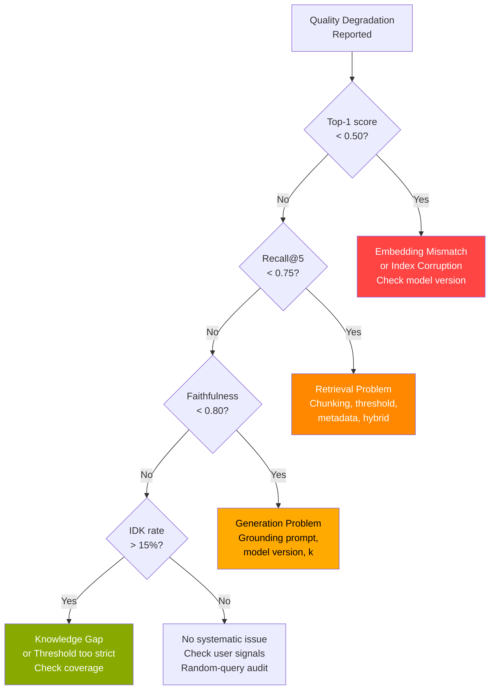

## Keywords in This File
{: .no_toc }

| # | Keyword | Weight |
|---|---|---|
| 18 | [Production RAG Debugging](#production-rag-debugging) | ★★★ |

---

# Production RAG Debugging

**Interview Weight:** ★★★ - The skill that separates
engineers who build demos from engineers who run
production RAG systems at scale.

---

### 🎯 Model Answer

**30 seconds:**

> Production RAG debugging starts with isolation:
> is this a retrieval failure, a generation failure,
> or a knowledge base integrity issue? Instrument
> every query with retrieval scores, retrieved doc IDs,
> and faithfulness scores. Retrieval failure: recall@5
> drops (check embedding model, ANN parameters, chunking).
> Generation failure: faithfulness drops (check system
> prompt, LLM model version). Knowledge base integrity:
> stale or missing documents (check index update
> pipeline). The single most important investment:
> a shadow evaluation pipeline that scores 1% of
> live traffic continuously.

**3 minutes:**

> Production RAG systems fail in ways that are invisible
> without instrumentation. Unlike traditional software
> where bugs produce exceptions, RAG failures produce
> plausible-sounding wrong answers. An uncaught bug
> in the embedding step silently degrades retrieval
> for weeks until users stop trusting the system.
>
> Diagnostic framework - three failure categories:
>
> (1) Retrieval failures - the right documents aren't
> in the top-K. Causes: embedding model issue, ANN
> index misconfiguration, poor chunking, stale index,
> missing metadata filters. Detected by: recall@5
> drop on continuous evaluation.
>
> (2) Generation failures - right documents retrieved
> but LLM produces wrong answers. Causes: weak grounding
> instruction, model version change (API silently
> changed the default model), context window too long
> (lost-in-the-middle), hallucination on partial context.
> Detected by: faithfulness score drop.
>
> (3) Knowledge base integrity issues - documents
> are missing, duplicated, or stale. Causes: broken
> ingestion pipeline, failed async job, failed delete
> operation. Detected by: monitoring ingestion job
> success rates and comparing document counts between
> source and index.
>
> Tooling: instrument every RAG query to log:
> - Retrieval scores (all K, not just top-1)
> - Retrieved document IDs and timestamps
> - Context length
> - LLM response time and model version
> - Sample faithfulness scores (1% of queries)
>
> Triage protocol: when a user reports a wrong answer,
> replay the exact query against the logged context
> and compare to the live context. If the logged
> context was correct but the live context is different:
> index integrity issue. If the logged context was
> wrong: retrieval failure at the time of the report.
> If context was right but the answer was wrong:
> generation failure.

**Blank Mind Recovery:**

**(1) Restate:** "How do you debug a wrong answer
in a production RAG system?"

**(2) First principles:** "I need to know: was the
right document retrieved? If yes: did the LLM use
it? If the document wasn't retrieved, I debug
retrieval. If it was retrieved but the LLM ignored
it, I debug generation. I can only distinguish
these two cases if I log the retrieved documents
per query."

---

### 📘 Concept Explanation

**What it is:**

Production RAG debugging is the systematic process
of diagnosing quality degradation or failures in
a deployed RAG system by isolating failures to
specific pipeline components and applying targeted
fixes.

**The four-component RAG pipeline for debugging:**

```
[1] Document Ingestion
    | source -> chunk -> embed -> store
    | Failures: chunking bugs, embedding errors,
    |           stale data, failed updates

[2] Retrieval
    | query -> embed -> ANN search -> candidates
    | Failures: model mismatch, low ef_search,
    |           wrong metadata filter, score distribution

[3] Context Assembly
    | candidates -> filter -> rank -> assemble
    | Failures: wrong ordering, no source labels,
    |           too many/few chunks, no threshold

[4] Generation
    | context + query -> LLM -> answer
    | Failures: weak grounding, model version change,
    |           lost-in-the-middle, hallucination
```

> **Code walkthrough:** This example demonstrates the core pattern in action. The key mechanism shows how the concept works in practice. Study the structure to understand the essential behavior and common usage.

**Debugging evidence matrix:**

```
SYMPTOM                         COMPONENT    NEXT CHECK
-------                         ---------    ----------
recall@5 dropped                Retrieval    Embedding model?
                                             Index rebuild?
                                             Score distribution?

Faithfulness dropped            Generation   System prompt?
                                             LLM model version?
                                             Context length?

"I don't know" rate high        Retrieval or Knowledge gaps?
                                Ingestion    Threshold too high?
                                             Failed ingestion?

Answers became outdated         Ingestion    Index update job?
                                             Document TTL?

Random answer quality           Any          A/B config leak?
  (inconsistent per query)                   Multiple index shards?

Latency spike                   Retrieval    ANN ef_search?
  (not quality-related)         or Generation LLM API?
```

> **Code walkthrough:** This example demonstrates the core pattern in action. The key mechanism shows how the concept works in practice. Study the structure to understand the essential behavior and common usage.

**Retrieval score distribution analysis:**

```
Healthy state:
  Top-1 score: 0.80-0.95 for relevant queries
  Top-5 score: 0.65-0.85
  Scores form a clear descending curve

Warning signs:
  Top-1 score: 0.40-0.55 for ALL queries
    -> Embedding model mismatch
    -> Wrong distance metric (L2 vs. cosine)

  All scores clustered (0.60-0.65 for all)
    -> Embedding model collapse
    -> Index using wrong dimension

  Top-K scores flat (no decay)
    -> ANN returning random neighbors
    -> ef_search too low
```

> **Code walkthrough:** This example demonstrates the core pattern in action. The key mechanism shows how the concept works in practice. Study the structure to understand the essential behavior and common usage.

---

### 💻 Code Example

```python
import anthropic
import json
import time
from dataclasses import dataclass, field
from datetime import datetime, timezone

client = anthropic.Anthropic()


@dataclass
class RAGQueryTrace:
    """
    Complete audit trail for a single RAG query.
    Required for production debugging.
    """
    query_id: str
    query: str
    timestamp: str
    retrieved_docs: list[dict] = field(default_factory=list)
    context: str = ""
    answer: str = ""
    retrieval_latency_ms: float = 0.0
    generation_latency_ms: float = 0.0
    model_version: str = ""
    faithfulness_score: float | None = None
    error: str | None = None


def rag_query_with_tracing(
    query: str,
    vector_store,
    query_id: str | None = None
) -> RAGQueryTrace:
    """
    Execute a RAG query with full audit tracing.
    Every field is logged for production debugging.
    """
    import uuid
    trace = RAGQueryTrace(
        query_id=query_id or str(uuid.uuid4()),
        query=query,
        timestamp=datetime.now(timezone.utc).isoformat(),
    )

    # Stage 1: retrieval with timing
    t0 = time.perf_counter()
    try:
        candidates = vector_store.search(query, top_k=10)
        trace.retrieval_latency_ms = (
            time.perf_counter() - t0
        ) * 1000

        # Log ALL retrieved docs with scores
        trace.retrieved_docs = [
            {
                "doc_id": c.get("id"),
                "score": round(c.get("score", 0), 4),
                "source": c.get("source"),
                "timestamp": c.get("updated_at"),
                "snippet": c.get("text", "")[:100]
            }
            for c in candidates
        ]

        # Score distribution analysis
        scores = [c.get("score", 0) for c in candidates]
        if scores:
            avg_score = sum(scores) / len(scores)
            if avg_score < 0.45:
                # ALERT: abnormally low scores
                trace.error = (
                    f"WARN: low retrieval scores "
                    f"(avg={avg_score:.3f}). "
                    f"Check embedding model or index."
                )

        # Apply score threshold
        filtered = [
            c for c in candidates
            if c.get("score", 0) >= 0.6
        ]
        if not filtered:
            trace.error = (
                "EMPTY_RETRIEVAL: 0 chunks above "
                "threshold 0.6"
            )
            trace.answer = (
                "This information is not available "
                "in my knowledge base."
            )
            return trace

    except Exception as e:
        trace.error = f"RETRIEVAL_ERROR: {e}"
        return trace

    # Stage 2: context assembly with source labels
    context_parts = [
        f"[Source: {c.get('source', 'unknown')}]\n"
        f"{c.get('text', '')}"
        for c in filtered[:5]
    ]
    trace.context = "\n\n---\n\n".join(context_parts)

    # Stage 3: generation with timing
    t1 = time.perf_counter()
    try:
        resp = client.messages.create(
            model="claude-haiku-4-5",
            max_tokens=512,
            system=(
                "Answer ONLY from the provided documents. "
                "Do NOT use knowledge from your training. "
                "Cite [Source] for each factual claim. "
                "If the answer is not in the documents: "
                "'This information is not in my knowledge "
                "base.'"
            ),
            messages=[{
                "role": "user",
                "content": (
                    f"Documents:\n{trace.context}\n\n"
                    f"Question: {query}"
                )
            }]
        )
        trace.generation_latency_ms = (
            time.perf_counter() - t1
        ) * 1000
        trace.answer = resp.content[0].text
        trace.model_version = resp.model

    except Exception as e:
        trace.error = f"GENERATION_ERROR: {e}"

    return trace


def diagnose_retrieval_degradation(
    traces: list[RAGQueryTrace],
    baseline_recall: float = 0.85
) -> dict:
    """
    Analyze a batch of query traces for
    retrieval health signals.
    """
    all_scores = []
    empty_retrievals = 0
    errors = []

    for t in traces:
        if t.error and "EMPTY_RETRIEVAL" in (t.error or ""):
            empty_retrievals += 1
        if t.error and "RETRIEVAL_ERROR" in (t.error or ""):
            errors.append(t.error)
        for doc in t.retrieved_docs:
            all_scores.append(doc["score"])

    if not all_scores:
        return {"status": "ERROR", "reason": "No scores"}

    avg_score = sum(all_scores) / len(all_scores)
    top1_scores = [
        t.retrieved_docs[0]["score"]
        for t in traces
        if t.retrieved_docs
    ]
    avg_top1 = sum(top1_scores) / len(top1_scores) if top1_scores else 0

    diagnosis = {
        "avg_score": round(avg_score, 3),
        "avg_top1_score": round(avg_top1, 3),
        "empty_retrieval_rate": round(
            empty_retrievals / len(traces), 3
        ),
        "error_rate": round(len(errors) / len(traces), 3),
        "n_traces": len(traces),
    }

    # Diagnostic rules
    if avg_top1 < 0.45:
        diagnosis["alert"] = (
            "CRITICAL: avg top-1 score < 0.45. "
            "Likely embedding model mismatch or "
            "index corruption. Verify that the same "
            "embedding model is used for indexing "
            "and querying."
        )
    elif avg_top1 < 0.60:
        diagnosis["alert"] = (
            "WARNING: avg top-1 score 0.45-0.60. "
            "Retrieval quality degraded. Check for "
            "index staleness or chunking changes."
        )
    elif diagnosis["empty_retrieval_rate"] > 0.15:
        diagnosis["alert"] = (
            "WARNING: empty retrieval rate > 15%. "
            "Knowledge base may have gaps or score "
            "threshold may be too strict."
        )
    else:
        diagnosis["status"] = "HEALTHY"

    return diagnosis
```

> **Code walkthrough:** `RAGQueryTrace` captures
> every debuggable field for a single RAG query:
> retrieved doc IDs and scores, context, answer,
> latency per stage, model version, and faithfulness.
> This is the audit trail that makes production
> debugging possible. `rag_query_with_tracing` runs
> the full pipeline with two key diagnostic behaviors:
> it logs ALL retrieved documents with their scores
> (not just the ones used), and it alerts immediately
> if the average score is below 0.45 (a reliable
> signal of embedding model mismatch). `diagnose_retrieval_degradation`
> aggregates traces to detect system-level degradation
> patterns: critically low average scores, high
> empty-retrieval rate, or error rate spikes. In
> production: ship these traces to your observability
> platform (Datadog, Honeycomb) with the query_id
> so you can replay any query from its trace.

---

### 🎓 Answers by Seniority

**Junior / Mid:**

> "Production RAG debugging starts with the right
> logging: log the retrieved doc IDs and scores for
> every query. When an answer is wrong, check whether
> the right document was in the top-K (retrieval
> failure) or whether the right document was there
> but the LLM ignored it (generation failure). These
> are completely different bugs with different fixes."

---

**Senior / Staff:**

> "I treat production RAG debugging like distributed
> systems debugging: trace ID per request, structured
> logs per stage. The three failure categories each
> have a specific telemetry signal: retrieval failure
> shows up as declining recall@5 on continuous sampling;
> generation failure shows up as declining faithfulness
> scores; knowledge base integrity issues show up
> as increasing 'I don't know' rate + index document
> count divergence from source. When a user reports
> a wrong answer at 2pm on Tuesday: I replay that
> exact query_id from the trace log, compare the
> logged context to the current live context, and
> determine if the knowledge base changed between
> then and now."

---

### ⚠️ Common Misconceptions

**Misconception: "Improving the LLM model always
improves RAG quality."**

Upgrading the LLM only improves RAG quality if
the bottleneck is in generation. If recall@5 is
0.65 (retrieval failure), upgrading from Claude
Haiku to Claude Opus changes nothing: the right
documents still aren't in the context. LLMs generate
from what's in the context - a better LLM generating
from bad context still produces bad answers. Diagnose
the bottleneck first; if recall is below 0.80,
fix retrieval before touching the LLM. Upgrading
the LLM when retrieval is broken is expensive and
produces no improvement.

---

### 🚨 Failure Modes and Diagnosis

**Failure: Answer quality degrades silently over 3 weeks**

*Symptom:* No system alerts. A monthly user survey
shows satisfaction dropped from 4.2/5 to 3.6/5
over the past 3 weeks. No deployment changes.

*Why this happens:* RAG failures are silent. An
embedding bug, index staleness, or LLM API change
produces plausible-sounding wrong answers - not
errors or exceptions.

*Root causes to check:*

1. Check LLM model version: did the underlying
   API model change? Some providers silently change
   the default model.
   Fix: pin the model name explicitly in every API call.

2. Check index document count: does the number of
   documents in the vector store match the source
   system?
   Fix: monitor index document count as a metric.

3. Check embedding model: is the same model version
   being used for both indexing and querying?
   Fix: store model name + version in chunk metadata;
   assert at query time.

4. Check for document churn: were major documents
   updated in the source system without re-indexing?
   Fix: event-driven re-indexing or periodic hash-based
   sync.

*Systematic prevention:* continuous faithfulness
sampling at 1% of queries with a 7-day rolling
alert. This would have caught the degradation
within 3-4 days instead of 3 weeks.

---

### 🎯 Interview Deep-Dive

| Seniority | Time | Focus |
|---|---|---|
| Junior | 8 min | Logging, isolation of retrieval vs. generation |
| Mid | 10 min | Diagnostic protocols, tooling |
| Senior/Staff | 15 min | Observability design, incident response |

---

**[JUNIOR] Q1 - What would you log per query
in a production RAG system to make debugging possible?**

Minimum logging per query to enable debugging:

Required:
```
- query_id: unique trace ID (links all stages)
- query_text: the exact user query
- retrieved_doc_ids: list of doc IDs returned
- retrieval_scores: score for each doc_id
- k_retrieved: how many were retrieved
- context_used: the context sent to the LLM
  (or a hash + length if PII concerns)
- answer: the generated answer
- retrieval_latency_ms
- generation_latency_ms
- llm_model_version: exact model name used
- timestamp: ISO 8601
```

> **Code walkthrough:** This example demonstrates the core pattern in action. The key mechanism shows how the concept works in practice. Study the structure to understand the essential behavior and common usage.

Optional but useful:
```
- user_id (for per-user debugging)
- session_id (for multi-turn context)
- rerank_scores (if reranking is used)
- faithfulness_score (for 1% sample)
- metadata_filters_applied
- score_threshold_applied
```

> **Code walkthrough:** This example demonstrates the core pattern in action. The key mechanism shows how the concept works in practice. Study the structure to understand the essential behavior and common usage.

Why each matters:
- `retrieved_doc_ids + scores`: was the right doc
  in the top-K? What was its score?
- `llm_model_version`: detects silent model changes
  (API provider upgraded default)
- `context_used`: what did the LLM actually see?
- `query_id`: links all logs for a single request
  when debugging specific user complaints

*What separates good from great:* "llm_model_version
logged per request" - catches silent upstream API
model changes that degrade quality.

---

**[MID] Q2 - How do you triage a user complaint
that says "the system gave me wrong information
about topic X"?**

Triage protocol:

(1) Get the query_id: ask the user for the timestamp
    and their account ID. Retrieve the exact query
    from logs using those.

(2) Pull the full trace: retrieved_doc_ids, retrieval_scores,
    context_used, answer, llm_model_version, timestamp.

(3) Check the context: was the correct information
    for topic X in the retrieved context?

    If YES (context was correct): this is a GENERATION
    FAILURE. The LLM ignored correct context. Check:
    - Was the grounding instruction in the prompt?
    - What was the LLM model version at query time?
    - Was the context too long (> 4K tokens)?

    If NO (context was wrong/absent): this is a RETRIEVAL
    FAILURE. Check:
    - What were the retrieval scores? (Low = embedding issue)
    - Is the correct document indexed? Search the vector
      store for topic X manually.
    - When was the correct document last updated? Is
      it in the index?

(4) Determine if it was a one-time issue or systematic:
    run the same query now. If you get the same wrong
    answer: systematic failure. If you get the right
    answer now: a transient issue (stale index at that
    specific time) or an intermittent failure.

(5) Document the root cause in the incident log and
    track resolution time.

*What separates good from great:* "Run the same query
NOW and compare to the logged answer" - distinguishing
transient from systematic.

---

**[MID] Q3 - How do you detect embedding model
drift or mismatch in a production RAG system?**

Embedding model mismatch: indexing and querying
use different embedding models. Scores become
meaningless. Retrieval degrades silently.

Detection methods:

(1) Score distribution monitoring:
    Healthy: top-1 retrieval score is 0.75-0.95
    for relevant queries. Alert threshold: if the
    7-day moving average of top-1 scores drops
    below 0.6, investigate model mismatch.

(2) Canary queries:
    Maintain 10-20 "sentinel" queries with known
    expected documents. Run these every hour.
    If recall@5 on sentinels drops: embedding changed.

(3) Model version metadata:
    Store `embed_model` + `embed_model_version` in
    chunk metadata at index time. At query time:
    assert that the query embedding model matches.
    Raise an alert (not an exception) if there's
    a mismatch.

(4) Hash-based verification:
    After embedding 10 test strings with the new
    model, compare the cosine similarities to known
    expected values. If they differ by > 0.05:
    the model changed.

Root causes of mismatch:
- Infrastructure change: new model container deployed
  without updating the indexing job
- API provider change: OpenAI / Anthropic updated
  the default embedding model
- Partial rollout: indexing service updated but
  query service still on the old version

Prevention: always specify the exact embedding model
version in code (`text-embedding-ada-002` not
`text-embedding`). Log the model name in chunk
metadata.

*What separates good from great:* "Canary queries
run every hour" as proactive detection before users
report issues.

---

**[SENIOR] Q4 - How do you design a production
RAG observability stack from scratch?**

Four observability layers:

**(1) Per-query traces (structured logs):**

Every query emits a structured JSON log:
```json
{
  "query_id": "uuid",
  "timestamp": "ISO-8601",
  "query": "...",
  "retrieved": [
    {"doc_id": "...", "score": 0.87}
  ],
  "context_length_tokens": 1847,
  "answer_length_tokens": 142,
  "retrieval_ms": 24,
  "generation_ms": 380,
  "model": "claude-haiku-4-5",
  "faithfulness": null
}
```

> **Code walkthrough:** This example demonstrates the core pattern in action. The key mechanism shows how the concept works in practice. Study the structure to understand the essential behavior and common usage.

Ship to: Elasticsearch, Honeycomb, or Datadog Logs.

**(2) Aggregate metrics (time-series):**

Metrics emitted per minute:
- `rag.retrieval.top1_score.avg` (rolling 5-minute)
- `rag.retrieval.empty_rate` (empty retrievals / total)
- `rag.generation.latency_p99`
- `rag.faithfulness.rolling_avg` (1% sample)
- `rag.idk_rate` ("I don't know" responses / total)

Ship to: Prometheus + Grafana or Datadog.

**(3) Scheduled evaluation jobs:**

Hourly: run 20 canary queries on the golden test
set. Emit recall@5 and faithfulness as metrics.

Daily: run full 100-query golden set evaluation.
Compare to baseline. Alert if recall drops > 3%.

**(4) User feedback signals:**

Collect: thumbs down, escalation to human support.
Join to query_id: "which specific queries triggered
thumbs down?" becomes an actionable debugging log.

Alert thresholds:
```
CRITICAL: top-1 avg score < 0.50 (pager)
CRITICAL: faithfulness < 0.80 (pager)
WARNING:  empty retrieval rate > 10%
WARNING:  canary recall < 0.80
INFO:     idk_rate > 15%
```

> **Code walkthrough:** This example demonstrates the core pattern in action. The key mechanism shows how the concept works in practice. Study the structure to understand the essential behavior and common usage.

*What separates good from great:* "Join user thumbs-
down to query_id" - turning user feedback into
a debuggable, queryable log.

---

**[SENIOR] Q5 - How do you handle a RAG incident
where answers are confidently wrong for a high-traffic
topic?**

Incident: 2pm Tuesday, answers about "refund policy"
are confidently wrong. Volume: 2,000 queries/hour
for refund-related questions.

Incident response:

**(1) Triage (0-10 min):**
- Sample 10 recent refund queries from logs
- Check retrieved docs: are any from the new
  refund policy (updated this morning)?
- Check index: query vector store directly for
  "refund policy" - does the new document exist?

If new policy is NOT in the index: INGESTION FAILURE.

**(2) Mitigation (10-30 min):**

Option A (fastest): emergency re-index the specific
document. If ingestion is automated: trigger
a manual re-index of the refund policy doc.

Option B (safer): add the refund policy as hardcoded
context for all refund-related queries (keyword
trigger: "refund", "return", "money back"). This
bypasses the vector search entirely for this topic.

Option C (if Option A is not possible): put up
a circuit breaker for refund queries - route them
to a human agent immediately rather than letting
the system confidently answer wrong.

**(3) Resolution (30-60 min):**
- Fix the ingestion failure root cause
- Verify the new document is indexed
- Re-run refund canary queries to confirm correct answers
- Remove Option B/C workaround

**(4) Post-incident:**
- Add "document updated at source but not in index"
  as a monitored metric
- Add canary query: "What is the current refund
  policy?" as a scheduled hourly test

*What separates good from great:* "Circuit breaker
to human agent as Option C" - protecting users
from confident wrong answers while the fix is applied.

---

**[SENIOR] Q6 - How do you debug "lost in the
middle" in a production RAG context?**

Lost in the middle: the LLM pays less attention
to content in positions 3-7 of a long context
window. A relevant document at position 5 of 10
is partially or fully ignored.

Detection:

(1) Correlation analysis: for queries where the
    correct document was retrieved but the answer
    was still wrong, what was the POSITION of the
    correct document in the context? If most failures
    have the correct document at positions 3-7:
    lost-in-the-middle confirmed.

(2) Controlled experiment: take 20 failing queries.
    Move the correct document to position 1 of the
    context. Rerun the query (offline). Did the answer
    improve? If yes: position effect.

Diagnosis query:
```sql
SELECT retrieved_docs[*].position,
       avg(case when answer_correct then 1 else 0 end)
         as accuracy_rate
FROM rag_traces
WHERE faithfulness < 0.7
GROUP BY position
```

> **Code walkthrough:** This example demonstrates the core pattern in action. The key mechanism shows how the concept works in practice. Study the structure to understand the essential behavior and common usage.

Fixes:

(1) Reduce K: retrieve fewer but higher-quality
    chunks (3-5 instead of 10). Correct doc is more
    likely at position 1 or 2.

(2) Reranking: reranker puts the most relevant
    document at position 1. Fixes lost-in-the-middle
    for reranked results.

(3) Sandwich technique: place the highest-scoring
    document first AND last in the context. Attention
    is highest at beginning and end.

(4) Chunking: if the correct document is often
    at position 5, the previous 4 chunks are less
    relevant. Add score threshold to eliminate
    low-relevance chunks before they push the relevant
    one into the middle.

*What separates good from great:* "Correlate correct-
doc-position with answer accuracy" as the specific
data analysis that confirms lost-in-the-middle.

---

**[SENIOR] Q7 - [DEBUGGING] ANN search is returning
correct documents but the LLM is generating answers
that contradict the context. Debug.**

Symptom: you can verify (from traces) that the
correct document is in position 1 of the context.
The answer still contradicts it.

This is a pure GENERATION failure.

Causes:

(1) Weak grounding instruction: the system prompt
    uses "helpful assistant" framing, which trained
    on being helpful using training knowledge. Test:
    add explicit instruction "Answer ONLY from the
    provided documents. Do NOT use any other knowledge."
    If this fixes the issue: prompt was the cause.

(2) LLM model version changed: the API provider
    silently changed the model. A newer model may
    have stronger prior beliefs that override context.
    Check: log the model name in every response.
    Compare current model to historical model for
    the queries in question.

(3) Context is malformed or truncated: the context
    appears correct in logs but the actual prompt
    construction has an error (encoding issue, template
    bug). Check: log the EXACT bytes sent to the LLM
    API for 3 failing queries. Visually inspect.

(4) Few-shot examples in the prompt are outdated:
    if the system prompt includes few-shot examples
    with old information, the LLM may follow the
    examples rather than the context.

(5) Model has strong prior for query type: for some
    well-known facts ("What is the speed of light?"),
    even strong grounding instructions don't prevent
    the LLM from using training knowledge because
    the prior is too strong.

Systematic fix:

```python
# Add explicit anti-hallucination markers
system = (
    "You are a DOCUMENT READER, not an expert. "
    "You have NO knowledge. You can ONLY read "
    "the provided documents and answer based on "
    "what you find there. "
    "If a document says X, your answer is X - "
    "even if you believe X is wrong. "
    "If you cannot find the answer: "
    "'Not found in provided documents.'"
)
```

> **Code walkthrough:** This example demonstrates the core pattern in action. The key mechanism shows how the concept works in practice. Study the structure to understand the essential behavior and common usage.

*What separates good from great:* "Log the EXACT
bytes sent to the LLM API" - going to the protocol
level to rule out template bugs.

---

**[SENIOR] Q8 - How do you debug RAG quality for
multi-turn conversations?**

Multi-turn adds complexity: the current query depends
on conversation history. The retrieval query must
incorporate context from previous turns.

Failure modes specific to multi-turn:

(1) Context blindness: the RAG system retrieves
    based on the latest message only, missing relevant
    context from previous turns.
    Example: turn 1 - "Tell me about our enterprise
    plan." Turn 2 - "How does pricing work?" The
    retrieval for turn 2 retrieves generic pricing
    docs rather than enterprise-plan-specific pricing.

(2) Context accumulation: the system appends all
    previous turns to the current query for retrieval.
    After 10 turns, the retrieval query is 2,000 tokens.
    ANN search degrades with very long query embeddings.

(3) Answer leakage: a previous (possibly wrong) answer
    is included in the context window for the next
    turn. The LLM is now grounding on a previous
    hallucination as if it were a reliable document.

Debugging:
- Log the retrieval query (not just the user query)
  for each turn: what was actually sent to ANN search?
- Verify that the retrieval query incorporates the
  right conversation context.
- For leakage: check if previous answers are included
  in the context. If yes: separate "retrieved docs"
  from "conversation history" in the prompt.

Fix for context blindness: query condensation before
retrieval. Ask an LLM (fast, cheap) to restate
the latest question in a way that is self-contained:
"Given [conversation history], rephrase the user's
latest question to be self-contained for document search."

*What separates good from great:* "Answer leakage:
previous hallucinations become context for next turn"
as the subtle multi-turn failure mode.

---

**[SENIOR] Q9 - How do you maintain debug capability
with PII in user queries?**

Problem: log enough to debug but don't store PII.

Strategies:

(1) PII detection + redaction before logging:
    use a lightweight PII detector (regex for email,
    phone, SSN patterns; or a model) to redact
    before storing.
    ```python
    from presidio_analyzer import AnalyzerEngine
    analyzer = AnalyzerEngine()
    safe_query = redact_pii(query, analyzer)
    log.info("query", query=safe_query, ...)
    ```
> **Code walkthrough:** This example demonstrates the core pattern in action. The key mechanism shows how the concept works in practice. Study the structure to understand the essential behavior and common usage.

    Downside: redacted logs are harder to debug
    (you may lose context-relevant identifiers).

(2) Hash-based tracing: log a hash of the query
    (SHA-256 of the exact query text). Users can
    provide the query, you compute its hash, find
    the log entry. No plaintext stored.

(3) Separate PII handling: store the full query
    in an encrypted, short-retention (7-day) store.
    Store non-PII metadata (query_id, retrieved_doc_ids,
    scores) in the main logging system indefinitely.
    For debugging specific incidents: access the
    full query from the short-retention store.

(4) Consent-based logging: for debugging purposes,
    users can opt in to full query logging. This
    is common in consumer products.

Recommendation: Option 3 (separate stores) provides
the best balance. PII is encrypted + auto-deleted
after 7 days. Non-PII debug metadata is retained
for trend analysis and incident replay.

*What separates good from great:* "Query hash as
the join key between the public log and the private
PII store" - specific technical design.

---

**[SENIOR] Q10 - What production dashboards do
you build for a RAG system?**

Four essential dashboards:

**(1) Real-time health:**
- Top-1 retrieval score (5-minute moving average)
- Empty retrieval rate (% of queries with 0 results above threshold)
- LLM error rate (timeouts, API errors)
- P99 total latency
- "I don't know" rate

**(2) Quality trending:**
- 7-day rolling faithfulness (sampled 1%)
- 7-day rolling canary recall@5 (hourly)
- Comparison: current week vs. previous week
- Breakdown by query category (if categories are defined)

**(3) Knowledge base health:**
- Documents indexed vs. documents in source
- Last index update timestamp (alert if > 24h for active docs)
- Index size trend (should grow or stay stable; sudden drop = problem)
- Failed ingestion job rate

**(4) User satisfaction proxy:**
- Thumbs down rate (rolling 7-day)
- Session abandonment after RAG answer (user left without follow-up)
- Escalation to human rate
- Follow-up question rate (high rate = answer was incomplete/wrong)

Each dashboard has a "compare to baseline" mode
that shows deltas from the deployment day.

Alerts fire to the on-call channel for:
- Any CRITICAL threshold
- Any metric moving > 2 standard deviations from baseline

*What separates good from great:* "Follow-up question
rate as a proxy for answer incompleteness" - using
user behavior as a quality signal.

---

**[SENIOR] Q11 - [TRADE-OFF] When do you invest
in better retrieval vs. better generation for
a production RAG system?**

Decision framework:

First: measure. Get your current recall@5 and
faithfulness scores from the golden test set.

**If recall@5 < 0.75: invest in retrieval first.**

No amount of generation improvement helps if the
right documents aren't being retrieved. Priority
order for retrieval improvements:
1. Chunking quality (most impactful, usually)
2. Embedding model selection/fine-tuning
3. Hybrid search (BM25 + semantic)
4. Reranking
5. Metadata filtering

Cost: reranking is cheap (100-500ms, +$0.002/query
with Cohere). Embedding model change requires
full re-index: expensive one-time cost, then same
operational cost.

**If recall@5 >= 0.80 and faithfulness < 0.80:
invest in generation.**

The right docs are being retrieved but the LLM
is ignoring them or hallucinating. Priority:
1. Strengthen grounding instruction (free, instant)
2. Reduce context size (fewer, more precise chunks)
3. Try a stronger model (Claude Sonnet vs. Haiku)
4. Fine-tune the LLM on domain (expensive, last resort)

**If both recall >= 0.80 and faithfulness >= 0.85:
focus on end-to-end quality.**

The pipeline is working. End-to-end quality issues
are likely in query understanding (query transformation)
or knowledge base completeness (fill gaps).

*What separates good from great:* "Strengthen the
grounding instruction is free and instant" - identifying
the highest-ROI generation improvement.

---

**[SENIOR] Q12 - [BEHAVIORAL] Describe a production
RAG incident you led, from detection to resolution.**

Structure:
"A silent retrieval degradation over 2 weeks,
detected by a faithfulness alert, traced to an
embedding service deployment mismatch."

**Situation:**
Enterprise knowledge base RAG system. 50,000 queries/day.
Two-week period: user satisfaction metric declining
slowly (4.1 -> 3.8 out of 5).

**Task:**
No alerts fired. Diagnosis: we didn't have continuous
quality monitoring - only infrastructure monitoring
(uptime, latency). Lead the investigation.

**Action:**

Week 1 (day 14-17 of degradation):
1. Pulled random sample of 50 queries from logs.
   Ran faithfulness evaluation offline.
   Faithfulness: 0.67 (vs. 0.88 baseline from 30 days ago).

2. Checked retrieval scores: top-1 avg score had
   dropped from 0.82 to 0.56. This was a major signal.

3. Score drop that severe = embedding model mismatch.
   Checked: the indexing service and the query service.
   Found: the indexing service had been silently
   upgraded during a routine infrastructure update.
   The new container used `text-embedding-3-small`
   while the query service still used `text-embedding-ada-002`.

4. These are different vector spaces. All new documents
   (the last 2 weeks of content) were indexed with
   the wrong model. The entire new-document corpus
   was effectively unsearchable.

**Resolution:**

Day 17:
- Pinned both services to `text-embedding-ada-002`
  (same version as before) in their deployment configs
- Triggered re-indexing of all documents added in
  the last 14 days

Day 18 (re-index complete):
- Top-1 avg score: 0.81 (back to baseline)
- Faithfulness: 0.87 (back to baseline)
- User satisfaction: recovered over 3 days as users
  saw correct answers again

**Post-incident (day 20):**
- Added embedding model name + version to chunk metadata
- Added assertion in query service: if query model
  doesn't match index model, raise alert (not exception)
- Added hourly canary query metric: would have detected
  on day 2, not day 14

**Result:** 0 user-visible incidents during recovery.
System restored to baseline in 24 hours.

**Lesson:** Embedding model mismatch is the most
dangerous RAG failure mode. It's completely silent
(no exceptions), progressively degrades (as new
content is added with the wrong model), and can
persist for weeks without detection.

*What separates good from great:* "Assertion on
model mismatch at query time" as the prevention
that would have caught this in CI, not production.

---

### ⚖️ Comparison Table

| Failure Mode | Detection Signal | Time to Detect (no monitoring) | Time to Detect (with monitoring) |
|---|---|---|---|
| Embedding model mismatch | Top-1 score < 0.55 | Weeks | Hours |
| Stale index | "I don't know" rate + index age | Days | Hours |
| Weak grounding | Faithfulness < 0.80 | Weeks | Days |
| Broken ingestion | Doc count divergence | Days | Hours |
| Lost in the middle | Position-accuracy correlation | Weeks | Days |
| Empty retrieval | Empty retrieval rate | Days | Hours |

---

### 🏛️ System Design

**Production RAG Observability System**

Design a complete observability system for a RAG
system serving 100K queries/day.

**Requirements:**
- Detect retrieval degradation within 2 hours
- Enable per-query debugging (replay specific queries)
- PII-safe logging
- Cost-efficient sampling

**Architecture:**

```
RAG Service
    |
    +-- Structured query trace -> S3 (encrypted, 7-day)
    |   (full context, PII included)
    |
    +-- Redacted metrics log -> Elasticsearch
    |   (query_id, doc_ids, scores, model, latency)
    |
    +-- Real-time metrics -> Prometheus
        (score avg, empty rate, latency)

Async evaluation pipeline (1% sample):
  Elasticsearch query logs
    -> faithfulness scorer (Claude Haiku)
    -> Prometheus: rag.faithfulness.sampled

Hourly canary job:
  20 golden queries -> full pipeline -> recall@5
    -> Prometheus: rag.canary.recall

Grafana dashboards: real-time + quality + KB health
Alertmanager: CRITICAL/WARNING thresholds -> PagerDuty
```

> **Code walkthrough:** This example demonstrates the core pattern in action. The key mechanism shows how the concept works in practice. Study the structure to understand the essential behavior and common usage.

**Data retention:**
- Full traces (S3): 7 days (PII, encrypted)
- Redacted metrics: 90 days
- Aggregate metrics: 2 years
- Golden test set results: forever (audit trail)

**Scale numbers:**
- 100K queries/day = ~1.2 queries/second
- 1% sampled for faithfulness = 1,000/day
- Faithfulness evaluation: $0.001/query (Haiku) = $1/day
- Canary queries: 20/hour * 24 = 480/day = $0.48/day
- Total monitoring cost: ~$1.50/day

*What separates good from great:* Total monitoring
cost: $1.50/day for a 100K-query/day system. Making
the cost concrete shows this is non-negotiable.

---

### 📊 Diagram

```
PRODUCTION RAG DEBUGGING DECISION TREE:

Quality degradation reported
          |
          v
Check retrieval traces:
  Top-1 score < 0.50?
     YES -> Embedding mismatch / index corruption
            Check model version in chunks
     NO  ->
  Recall@5 < 0.75?
     YES -> Retrieval problem
            Check chunking, threshold, metadata
     NO  ->
  Faithfulness < 0.80?
     YES -> Generation problem
            Check grounding prompt, model version
     NO  ->
  "I don't know" > 15%?
     YES -> Knowledge gap or threshold too strict
     NO  -> No systematic issue: check user signal
```



> **Diagram walkthrough:** This is the production
> debugging decision tree ordered by severity and
> diagnostic priority. Start with the top-1 retrieval
> score - if it's below 0.50, almost certainly the
> embedding model is mismatched or the index is corrupt.
> This is a CRITICAL failure that affects every query.
> If scores are reasonable but recall@5 is low, the
> retrieval is finding low-quality documents (chunking
> or metadata problem). If recall is good but faithfulness
> is low, the LLM is ignoring good context (generation
> problem - often just a prompt fix). If faithfulness
> is good but users are getting "I don't know" frequently,
> the knowledge base has coverage gaps or the threshold
> is too strict. Only if none of the metrics fire
> should you resort to a random-query audit to find
> non-systematic issues. The color coding matches
> alert severity: red = critical, orange = warning,
> yellow = investigate.

---

### 💻 Code Example

*(Omit: this concept does not have a programmatic interface that can be demonstrated in code. The conceptual explanation above is sufficient.)*


---

### 🏛️ System Design

*(Omit: system design diagram not applicable for this concept - see ★★★ keywords for full system design coverage.)*


---

### ⚖️ Comparison Table

*(Omit: this is a ★☆☆ foundational concept with no direct alternatives to compare - see higher-difficulty keywords for trade-off analysis.)*


---

### 📊 Diagram

*(Omit: no standalone visual diagram required for this concept - the explanations and code examples above provide sufficient clarity.)*


