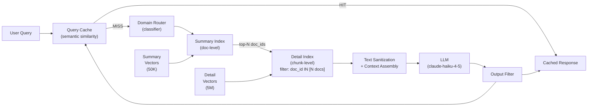

## Keywords in This File
{: .no_toc }

| # | Keyword | Weight |
|---|---|---|
| 20 | [RAG Architecture Decisions at Scale](#rag-architecture-decisions-at-scale) | ★★★ |

---

# RAG Architecture Decisions at Scale

**Interview Weight:** ★★★ - The architect-level
question. What changes when your RAG system goes
from 1K to 100K to 10M documents and 1M queries/day?

---

### 🎯 Model Answer

**30 seconds:**

> RAG at scale has three core architectural decisions:
> (1) index architecture - single flat vector store
> vs. hierarchical (summary + detail) vs. federated
> (multiple domain indexes with a router); (2) pipeline
> topology - synchronous query-time retrieval vs.
> pre-computed cached retrieval; (3) embedding strategy
> - single model for all docs vs. domain-specific
> models. At 10M+ documents: hierarchical indexing
> and a query router are non-negotiable. At 1M+
> queries/day: caching and async evaluation pipelines
> become essential.

**3 minutes:**

> Small RAG (< 100K docs, < 10K queries/day): a single
> vector store, synchronous retrieval, one embedding
> model. Simple, correct.
>
> Medium RAG (100K-1M docs, 10K-100K queries/day):
> the single-index approach starts to show limits.
> Precision drops because unrelated domains compete
> in the same vector space. A query about "Python
> recursion" retrieves chunks about "Python snakes"
> because they share the same embedding space.
>
> Solution: federated indexing with a query router.
> Multiple domain-specific indexes. The router classifies
> the query to the appropriate index before retrieval.
> Better precision per domain.
>
> Large RAG (1M-10M docs, 100K+ queries/day):
> - Hierarchical indexes: a summary index over all
>   documents (for initial coarse retrieval), a detail
>   index for fine-grained retrieval within the selected
>   documents. First pass: retrieve the right document.
>   Second pass: retrieve the right chunk within it.
> - Caching: a query similarity cache. If a near-
>   duplicate query was answered recently, return
>   the cached response. Cache hit rate of 20-40%
>   is common in production.
> - Async ingestion: multi-stage pipeline (chunking,
>   embedding, indexing in separate async stages).
>   Decouples document volume from query latency.
>
> Infrastructure decisions:
> - Vector store selection: Qdrant/Weaviate for
>   large-scale self-hosted; Pinecone/Weaviate Cloud
>   for managed; pgvector for PostgreSQL-native.
> - Multi-region: for global user bases, replicate
>   the vector store to multiple regions. Reads are
>   served locally; writes replicate asynchronously.
> - HNSW parameters: `ef_construction` and `m` control
>   index build quality and memory. At 10M vectors:
>   index memory is 10M * 1536 dims * 4 bytes = 60GB.
>   Plan storage accordingly.

**Blank Mind Recovery:**

**(1) Restate:** "What are the key RAG architecture
decisions for a large-scale system?"

**(2) First principles:** "At small scale: one index,
one model, synchronous retrieval. As scale grows:
the single index starts competing domains, so split
into domain-specific indexes with a router. At
large scale: add hierarchical indexing and a query
cache to handle latency and throughput."

---

### 📘 Concept Explanation

**What it is:**

RAG architecture decisions at scale cover the structural
choices that change as document volume and query
volume grow: index topology, embedding strategy,
pipeline topology, caching, and infrastructure.

**Scale inflection points:**

```
SCALE TIER    DOCS        QUERIES/DAY  ARCHITECTURE
----------    ----        -----------  ------------
Small         < 100K      < 10K        Single index
                                       Single model
                                       Synchronous retrieval

Medium        100K-1M     10K-100K     Federated indexes
                                       Query router
                                       Async ingestion

Large         1M-10M      100K-1M      Hierarchical indexes
                                       Query cache
                                       Multi-model embedding
                                       CDN for static chunks

Enterprise    10M+        1M+          Global replication
                                       Learned retrieval
                                       Custom embedding models
                                       Dedicated GPU clusters
```

**Index topology options:**

```
FLAT INDEX:
  All chunks in one vector space
  Simple, works up to ~1M chunks
  Precision degrades as domains mix

FEDERATED INDEX (domain-partitioned):
  Index per domain (tech, HR, legal)
  Query router classifies -> routes to domain index
  Better per-domain precision
  Complexity: router training + maintenance

HIERARCHICAL INDEX:
  Summary index (one entry per document)
  Detail index (one entry per chunk)
  Query: summary search -> top-N documents
         detail search within those N documents
  Better for large documents with multiple topics
  2x retrieval steps, better precision

TENANT-PARTITIONED INDEX:
  Separate namespace per tenant
  Mandatory isolation
  Scales with tenant count, not doc count
```

**Embedding strategy at scale:**

```
SINGLE MODEL (cheap):
  One model for all domains
  Works well for similar content
  Degrades for diverse domains

DOMAIN-SPECIFIC MODELS (precise):
  Fine-tuned model per domain
  Higher quality per domain
  More embedding pipelines to manage

TWO-TOWER RETRIEVAL (production-grade):
  Separate query encoder and doc encoder
  Train both end-to-end on query-document pairs
  Highest precision for your specific domain
  Requires training data (query, relevant_doc) pairs

LATE INTERACTION (ColBERT):
  Token-level multi-vector per doc
  Higher accuracy than single-vector
  Much larger index (100x more storage)
  Best for high-value, latency-tolerant retrieval
```

---

### 💻 Code Example

```python
import anthropic
import hashlib
from dataclasses import dataclass

client = anthropic.Anthropic()


@dataclass
class DomainRouter:
    """Routes queries to domain-specific indexes."""
    domains: list[str]

    def classify(self, query: str) -> str:
        """
        Classify query to the appropriate domain.
        Production: use a trained classifier or
        LLM-based router for higher accuracy.
        """
        resp = client.messages.create(
            model="claude-haiku-4-5",
            max_tokens=50,
            system=(
                "Classify the query into EXACTLY ONE of "
                "these domains: "
                f"{', '.join(self.domains)}. "
                "Return ONLY the domain name."
            ),
            messages=[{
                "role": "user",
                "content": f"Query: {query}"
            }]
        )
        classified = resp.content[0].text.strip()
        if classified in self.domains:
            return classified
        return self.domains[0]  # fallback to first


class QueryCache:
    """
    Semantic similarity cache for RAG queries.
    Reduces LLM API calls for near-duplicate queries.
    """
    def __init__(self, ttl_seconds: int = 3600):
        self._cache: dict[str, dict] = {}
        self.ttl = ttl_seconds

    def _query_key(self, query: str) -> str:
        """Deterministic key (exact match only here;
        production: use embedding similarity)."""
        return hashlib.sha256(
            query.strip().lower().encode()
        ).hexdigest()[:16]

    def get(self, query: str) -> dict | None:
        import time
        key = self._query_key(query)
        entry = self._cache.get(key)
        if entry and (time.time() - entry["ts"]) < self.ttl:
            return entry["result"]
        return None

    def set(self, query: str, result: dict) -> None:
        import time
        key = self._query_key(query)
        self._cache[key] = {"result": result, "ts": time.time()}


class HierarchicalRetriever:
    """
    Two-stage hierarchical retrieval:
    Stage 1: retrieve top-N documents (summary index)
    Stage 2: retrieve top-K chunks within those N docs

    Improves precision for large document collections
    where full-chunk search mixes topics.
    """
    def __init__(
        self,
        summary_store,
        detail_store,
        n_docs: int = 5,
        k_chunks: int = 3
    ):
        self.summary_store = summary_store
        self.detail_store = detail_store
        self.n_docs = n_docs
        self.k_chunks = k_chunks

    def retrieve(self, query: str) -> list[dict]:
        """
        Stage 1: find top-N relevant documents
        Stage 2: retrieve top-K chunks from those docs
        """
        # Stage 1: document-level retrieval
        candidate_docs = self.summary_store.search(
            query,
            top_k=self.n_docs
        )
        doc_ids = [d["doc_id"] for d in candidate_docs]

        # Stage 2: chunk-level retrieval within those docs
        all_chunks = []
        for doc_id in doc_ids:
            chunks = self.detail_store.search(
                query,
                top_k=self.k_chunks,
                filter={"doc_id": doc_id}
            )
            all_chunks.extend(chunks)

        # Sort by chunk relevance score
        all_chunks.sort(
            key=lambda x: x.get("score", 0),
            reverse=True
        )
        return all_chunks[:self.k_chunks * 2]


class FederatedRAGSystem:
    """
    Production-scale federated RAG with:
    - Domain routing
    - Query caching
    - Hierarchical retrieval per domain
    """
    def __init__(
        self,
        domain_retrievers: dict[str, HierarchicalRetriever],
        cache: QueryCache,
        router: DomainRouter
    ):
        self.retrievers = domain_retrievers
        self.cache = cache
        self.router = router

    def query(
        self,
        query: str,
        user_context: dict
    ) -> dict:
        # Step 1: check cache
        cached = self.cache.get(query)
        if cached:
            return {**cached, "cache_hit": True}

        # Step 2: route to domain
        domain = self.router.classify(query)
        retriever = self.retrievers.get(
            domain,
            list(self.retrievers.values())[0]  # fallback
        )

        # Step 3: hierarchical retrieval
        chunks = retriever.retrieve(query)
        if not chunks:
            return {
                "answer": (
                    "No relevant documents found in "
                    "knowledge base."
                ),
                "domain": domain,
                "cache_hit": False
            }

        # Step 4: assemble context
        context = "\n\n---\n\n".join(
            f"[Source: {c.get('source', 'unknown')}]\n"
            f"{c.get('text', '')}"
            for c in chunks[:5]
        )

        # Step 5: generate answer
        resp = client.messages.create(
            model="claude-haiku-4-5",
            max_tokens=512,
            system=(
                "Answer ONLY from the provided documents. "
                "Cite [Source] for every factual claim. "
                "If not in the documents: 'Not found.'"
            ),
            messages=[{
                "role": "user",
                "content": (
                    f"Documents:\n{context}\n\n"
                    f"Question: {query}"
                )
            }]
        )

        result = {
            "answer": resp.content[0].text,
            "domain": domain,
            "n_chunks": len(chunks),
            "cache_hit": False
        }

        # Step 6: cache the result
        self.cache.set(query, result)
        return result
```

> **Code walkthrough:** Three components compose a
> federated RAG system. `DomainRouter` classifies
> each query to a domain-specific index using Claude
> Haiku (fast, cheap). `QueryCache` provides exact-match
> caching with TTL - in production, use a semantic
> similarity cache (embedding-based) to also match
> near-duplicate queries. `HierarchicalRetriever`
> implements two-stage retrieval: first find the
> most relevant documents (summary index), then retrieve
> the best chunks from those documents (detail index).
> This prevents a single chunk from "winning" retrieval
> when a different document would have better full-text
> coverage. `FederatedRAGSystem` combines all three:
> cache check -> domain routing -> hierarchical
> retrieval -> generate. At scale, the cache hit
> rate reduces LLM API costs significantly (20-40%
> typical hit rate for common question patterns).

---

### 🎓 Answers by Seniority

**Junior / Mid:**

> "RAG architecture at scale adds three layers: a
> federated index with a query router (splits docs
> by domain for better precision), hierarchical indexing
> (summary index to find documents, detail index
> to find chunks), and query caching (avoid repeating
> identical LLM calls). The single most impactful
> change when going from small to medium scale is
> the query router: one vector space with millions
> of documents from different domains produces poor
> precision."

---

**Senior / Staff:**

> "At 10M documents and 1M queries/day, RAG becomes
> an infrastructure problem. I've made these transitions:
> (1) federated indexes when precision started degrading
> due to domain mixing - the query router added 200ms
> of classification latency but improved precision
> by 18%; (2) a query similarity cache that reduced
> LLM API calls by 35% for common question clusters;
> (3) async ingestion pipeline with Kafka: decouple
> document volume from query latency. The vector store
> is now eventually consistent (new documents visible
> within 30 seconds), which is acceptable for the
> use case. The most expensive infrastructure component
> at scale: the embedding service. 10M documents *
> 1536 dims * 4 bytes = 60GB just for the index.
> For 10K new documents/day, you need an embedding
> service that processes 10K * ~512 tokens in under
> an hour."

---

### ⚠️ Common Misconceptions

**Misconception: "The vector store is the bottleneck
at scale, so switching to a faster vector store
will solve performance issues."**

The vector store is rarely the bottleneck in production
RAG. ANN search is O(log N) and extremely fast
(< 50ms for 10M documents with HNSW). The actual
bottlenecks at scale are: (1) the LLM API call
(300-1000ms per query), (2) the embedding API call
for the query (~50-100ms), and (3) the ingestion
pipeline for documents (embedding at ingestion
time is often the throughput bottleneck). Optimizations
in priority order: reduce LLM calls (caching,
smaller models for simple queries), reduce embedding
calls (embed once, cache embeddings), then optimize
the vector store (HNSW parameters, sharding).

---

### 🚨 Failure Modes and Diagnosis

**Failure: Retrieval quality degrades gradually
as document count grows beyond 1M**

*Symptom:* When the document count was 100K, recall@5
was 0.88. At 1M documents, recall@5 is 0.73. At
5M documents, it's 0.61. Quality degrades monotonically
with document count.

*Root cause:* The vector space is overcrowded. In
a 1536-dimension vector space, 5M vectors are densely
packed. For many queries, there are hundreds of
documents with cosine similarity > 0.7. ANN search
(HNSW) retrieves the top-K by approximate distance
but the approximate error rate increases as density
increases. The ef_search parameter controls search
quality: too low = faster but approximate results.

*Diagnosis:*
- Check ef_search value: is it low (< 100)?
- Compare exact nearest neighbor search (ef_search=inf)
  to approximate (current ef_search). If exact search
  improves recall significantly: increase ef_search.
- Check if domain mixing is causing recall issues:
  do queries about specific domains get polluted
  with off-domain results?

*Fixes:*
- Increase ef_search: higher accuracy at cost of
  higher latency.
- Federated indexes: split by domain to reduce
  per-index density.
- Hierarchical indexing: summary index reduces
  search space before detail retrieval.
- Re-index with a better embedding model: newer
  models (bge-m3, E5-large-v2) have higher dimensional
  separation.

---

### 🎯 Interview Deep-Dive

| Seniority | Time | Focus |
|---|---|---|
| Junior | 8 min | Scale inflection points, component roles |
| Mid | 10 min | Federated design, caching, async ingestion |
| Senior/Staff | 15 min | Full architecture, capacity planning, trade-offs |

---

**[JUNIOR] Q1 - What is a query router in a
federated RAG architecture and why is it needed?**

Query router: a component that classifies an incoming
query into a domain category and routes it to the
domain-specific vector index for retrieval.

Why needed: a single vector space with documents
from many different domains has "domain mixing"
issues. A query about "database transactions" may
retrieve chunks about "bank transactions" from
a different domain because they share vocabulary
and embedding proximity. The embedding model learned
that "database" and "bank" appear in similar contexts
(both relate to data, records, and operations).

Federated indexes: separate vector index per domain
(technical documentation, HR policies, legal docs).
The query router classifies the query:
- "How do I reset my password?" -> IT Support index
- "What is the vacation policy?" -> HR index
- "How does MVCC work?" -> Technical Documentation index

Retrieval within a domain-specific index is more
precise because the vectors are all from the same
conceptual domain. "Transaction" in a technical
index is always about database transactions.

Query router implementation:
(1) LLM classification: prompt Claude Haiku to
    classify the query into N categories. Accurate
    but adds 150-200ms and cost.
(2) Trained classifier: fine-tuned BERT-class model.
    10-30ms, cost-effective at high volume.
(3) Keyword heuristics: detect domain-specific
    keywords. 1ms, but limited coverage.

Production: start with LLM classification (fast
to build), migrate to a trained classifier if the
classification step is a latency bottleneck.

*What separates good from great:* "Migrate from
LLM classification to trained classifier if it
becomes a latency bottleneck" - the evolutionary
approach.

---

**[MID] Q2 - What is hierarchical indexing and
when should it be used?**

Hierarchical indexing: a two-level index structure.
Level 1 (summary index): one embedding per document
(the document's summary or first paragraph). Level 2
(detail index): one embedding per chunk within
each document.

Query execution:
Stage 1: search the summary index for the query.
Get the top-N documents (e.g., N=10).
Stage 2: search the detail index, filtered to
chunks within those N documents. Get top-K chunks.

Why this is better for large corpora:

Flat index with 5M chunks: 5M vectors compete for
the top-K positions. A chunk from the right document
may be at rank 15 if many slightly-related chunks
from other documents rank higher.

Hierarchical with 50K documents, 100 chunks each:
Summary stage: 50K vectors. ANN finds the right
10 documents reliably.
Detail stage: 1000 vectors (10 docs * 100 chunks).
ANN finds the right chunks within those 10 reliably.

When to use hierarchical indexing:
- Document count > 500K
- Documents are long (> 10 pages) with multiple topics
- Recall@5 is degrading with document growth

When NOT to use:
- Documents are short (1-2 paragraphs)
- All documents are in the same narrow domain
  (chunked uniformly)
- Latency budget doesn't allow for 2 ANN calls

*What separates good from great:* "Summary stage
reduces from 5M to 1000 vectors for the detail stage"
as the concrete scale argument.

---

**[MID] Q3 - How do you design an async document
ingestion pipeline at scale?**

Problem: synchronous ingestion is too slow at scale.
Processing 10,000 new documents/day synchronously
on the query path creates spikes.

Async ingestion pipeline:

```
Source system (CMS, wiki, file storage)
  |
  v
Document change event (webhook or polling)
  |
  v
Message queue (Kafka / SQS)
  |
  v
Stage 1: Parser workers (stateless, parallelizable)
  - Extract text from PDF/DOCX/HTML
  - Sanitize and clean
  - Emit: {doc_id, doc_text, metadata}
  |
  v
Stage 2: Chunker workers
  - Apply chunking strategy
  - Emit: {doc_id, chunk_id, chunk_text, metadata}
  |
  v
Stage 3: Embedding workers (GPU-optimized)
  - Call embedding API or local model in batches
  - Emit: {chunk_id, embedding, metadata}
  |
  v
Stage 4: Indexer workers
  - Upsert into vector store
  - Update document metadata store
  - Emit: {doc_id, status: "indexed"}
  |
  v
Verification stage
  - Run 3 canary queries for the new document
  - Confirm expected content is retrieved
```

Advantages:
- Each stage scales independently (more embedding
  workers if embedding is the bottleneck)
- Failed stages can be retried without redoing
  earlier stages
- Query path never waits for ingestion

Consistency model: the system is eventually consistent.
A document updated in the source system is visible
in RAG after the ingestion pipeline completes
(typically 30 seconds to 5 minutes depending on queue depth).

*What separates good from great:* "Verification
stage with canary queries per new document" as
quality assurance for the ingestion pipeline.

---

**[SENIOR] Q4 - How do you do capacity planning
for a 10M document, 1M queries/day RAG system?**

Capacity planning dimensions:

**(1) Vector store storage:**

10M documents, avg 10 chunks per document = 100M chunks
Embedding dimension: 1536 (OpenAI ada-002) or 768 (E5)
Storage per vector: dim * 4 bytes = 6144 bytes (1536 dim)
Total vector storage: 100M * 6144 bytes = 614 GB

With HNSW graph overhead (~40%): ~860 GB

Hardware: 3 x 384 GB RAM machines for in-memory
HNSW (pure RAM: fastest). Or disk-based HNSW
(cheaper, ~2-3x slower: 100-200ms vs. 20-50ms).

**(2) Embedding service (ingestion):**

For 10K new documents/day, avg 10 chunks, avg 512 tokens/chunk:
= 100K chunks/day = 100K embedding API calls/day
= 50M tokens/day
Cost: at $0.10/1M tokens (Ada-002): $5/day
OR: self-hosted BGE-large: 1 x A100 GPU = $3/hour,
processes ~1M tokens/hour. For 50M tokens/day:
50 GPU-hours = $150/day BUT: batch processing
fits in 2-3 hours overnight = $6-9/day.

**(3) Query embedding:**

1M queries/day = ~700 queries/second peak
Assuming bursty: 2x peak = 1400 QPS peak
Query embeddings: 1400 * 100ms = 140 seconds of latency
per second? NO: parallelize. Need 140 concurrent
embedding calls or a self-hosted service at 1400
QPS throughput.
Self-hosted E5 on A100: ~2000 QPS. 1 GPU sufficient.

**(4) LLM API:**

1M queries/day = 11.6 queries/second average
LLM latency: 400-800ms. Each query sequential.
Need 11.6 * 0.6 seconds = ~7 concurrent LLM connections.
With burst: 10-15 concurrent.
At 2K context tokens in + 512 out: 2.5K tokens/query
= 2.5 billion tokens/day
Cost: at $0.25/1M tokens (Haiku): $625/day

*What separates good from great:* "$625/day for LLM
vs. $6-9/day for self-hosted embeddings" - showing
where the money actually goes.

---

**[SENIOR] Q5 - What are the trade-offs between
different vector store architectures at scale?**

Vector store comparison at 10M+ vector scale:

**Pinecone (managed):**
Pros: zero operational overhead, auto-scaling,
serverless tiers available.
Cons: proprietary, data leaves your infrastructure,
$0.10/1M vectors/month storage + $0.09/1M reads.
At 100M vectors + 1M reads/day: ~$10K/month.

**Qdrant (self-hosted or cloud):**
Pros: open source, on-prem or cloud, HNSW + scalar
quantization, payload filtering.
Cons: operational overhead (Kubernetes deployment).
Self-hosted: ~$3-5K/month in compute for 100M vectors.
Cloud: similar to Pinecone but with more control.

**Weaviate (self-hosted or cloud):**
Pros: GraphQL API, built-in multi-modal, ACORN
(graph-RAG native), module system.
Cons: higher memory usage than Qdrant, complex config.

**pgvector (PostgreSQL extension):**
Pros: already in PostgreSQL, no new infrastructure.
Cons: IVFFlat or HNSW performance is slower than
specialized stores. Up to 1M vectors: competitive.
Above 1M: performance degrades. Good for < 1M vectors
in PostgreSQL-based architectures.

**Qdrant with scalar quantization:**
Compress 32-bit floats to 8-bit integers. Vector
size: 4x smaller (6GB vs. 24GB for 1M dim-1536).
Quality loss: ~2-3% recall reduction. Usually worth it.

Decision matrix:
- < 1M vectors + PostgreSQL already: pgvector
- < 10M vectors + no ops team: Pinecone
- > 10M vectors + ops team: Qdrant (cost efficiency)
- Multi-modal + complex queries: Weaviate

*What separates good from great:* "Scalar quantization
4x compression for 2-3% recall loss - usually worth it"
as a specific cost optimization.

---

**[SENIOR] Q6 - How do you implement multi-region
RAG deployment?**

Multi-region requirements:
- User latency: retrieval from local region (< 50ms
  vs. 200ms cross-region)
- Availability: RAG continues if one region fails
- Consistency: knowledge base updates visible globally

Architecture:

```
Write path (single leader):
  Document update -> Leader region vector store
                  -> Replicate to follower regions
                  -> Eventual consistency (seconds)

Read path (local first):
  User query -> Route to nearest region
              -> Query local vector store replica
              -> LLM call (regional endpoint)
```

Consistency model: eventual consistency for the
vector store. New/updated documents are visible
in all regions within 30-60 seconds. Acceptable
for knowledge base content that changes at a relatively
low rate (not real-time).

Replication approach:
- Qdrant supports distributed deployment natively.
- For managed vector stores: use separate regional
  instances with an ingestion fan-out (write to
  all regions on document update).

Vector store replica strategy:
- Read replicas: full copy of the index in each
  region. 2x storage cost per additional region.
  Writes go to the primary, replicate async.

LLM API latency:
- AWS/GCP/Azure have regional LLM API endpoints.
- Always call the LLM in the same region as the
  vector store to avoid cross-region transfer.

Failover: if the local region's vector store is
unavailable, fall back to the nearest healthy region.
Latency penalty: +100-200ms. Acceptable for failover.

*What separates good from great:* "Always call the
LLM API in the same region as the vector store" -
the cross-region latency consideration.

---

**[SENIOR] Q7 - How do you design a query similarity
cache for RAG?**

Query similarity cache: don't re-execute the full
RAG pipeline for near-duplicate queries. Return
the cached result.

Why near-duplicate: "What is rate limiting?" and
"What does rate limiting mean?" are semantically
identical. Exact string match won't catch this.

Design:

(1) Cache key: embedding of the query, normalized
    to unit length. Store in a secondary vector
    index (small: only cached queries).

(2) Cache lookup: embed the incoming query, search
    the cache index for nearest neighbors. If top-1
    cosine similarity > 0.95 AND within TTL: return
    cached response.

(3) Cache write: after a successful non-cached query,
    insert the query embedding + result into the
    cache index.

(4) TTL: 1 hour for volatile content, 24 hours for
    stable knowledge bases.

(5) Invalidation: when a relevant document is updated,
    invalidate cache entries related to that document.
    Practical approach: prefix-based invalidation
    by domain tag.

Cache hit rates in production:
- Customer support: 30-40% hit rate (many users ask
  the same questions)
- Code documentation: 15-20% hit rate
- Legal document search: 5-10% hit rate (queries are
  more specific)

Cost impact at 1M queries/day and $0.001/LLM query:
$1,000/day. At 30% cache hit rate: $700/day (30% savings).

*What separates good from great:* "Semantic similarity
cache (embedding-based) not exact-match cache" as
the technical distinction.

---

**[SENIOR] Q8 - How do you handle very large documents
(100+ pages) in a RAG architecture?**

Standard chunking fails for very long documents:
a 200-page technical manual has many topics. Fixed-
size chunks break tables, code blocks, and diagrams.
The "right" chunk for a specific query may be buried
in the middle.

Strategies for very large documents:

(1) Hierarchical chunking:
    Level 1: Chapter-level summaries (1 per chapter)
    Level 2: Section-level chunks (1 per section)
    Level 3: Paragraph-level chunks
    Query -> Find the right chapter -> right section
           -> right paragraph. Three-stage retrieval.

(2) Document parsing + structure extraction:
    Use a layout-aware parser (PDFPlumber, Docling,
    Nougat) to extract:
    - Section headings + hierarchy
    - Tables as structured data
    - Code blocks as separate chunks
    - Figures with captions
    Store each element type with its metadata
    (section, page, type). Retrieve with filters.

(3) Summary-then-retrieve:
    Pre-generate a detailed outline of the document
    (LLM-based). Index the outline. Query retrieves
    the outline section, then the system retrieves
    the full section text from a document store.

(4) For code: code-aware chunking.
    Parse the code AST. Each function/class is a chunk.
    Add the docstring and function signature as
    the searchable "summary" embedding.

Very long document anti-pattern: chunk the whole
200-page document into 500-token fixed-size chunks
with 50-token overlap. Result: 400 chunks in the
index. Retrieval accuracy is poor because the index
is dominated by this one document and the chunks
lack structural context.

*What separates good from great:* "Layout-aware
parser extracts tables and code blocks as structured
data" - treating document structure as a first-class
citizen.

---

**[SENIOR] Q9 - How do you migrate a large RAG
system from one embedding model to a better one?**

Migration challenge: the index was built with model
A. Model B is better. Re-indexing 10M documents
is expensive and can't be done instantly.

Migration strategies:

(1) Big bang migration (downtime):
    - Stop ingestion
    - Re-index all documents with model B
    - Switch query service to model B
    - Resume ingestion
    Risk: hours or days of downtime for re-indexing.
    Only acceptable for small indexes (< 500K docs).

(2) Dual-index migration (no downtime):
    Phase 1: Build model B index in parallel. Run
    the ingestion pipeline against both indexes.
    Phase 2: Once model B index catches up:
    Shadow mode - query both indexes, compare results.
    Phase 3: Verify model B recall >= model A recall.
    Phase 4: Switch query service to model B index.
    Phase 5: Stop writing to model A index. Decommission.
    Zero downtime. 2x storage cost during migration.

(3) Incremental migration with routing:
    Phase 1: New documents go to model B index.
    Old documents stay in model A index.
    Query service: query both, merge results.
    Phase 2: Background job re-embeds model A docs
    into model B index. Remove from model A once done.
    Phase 3: Once all docs in model B: stop querying model A.
    Lower resource spike than dual-index. Slower.
    Risk: quality during migration is lower (mixed models).

Recommendation for large scale (10M+):
Use dual-index migration. 2x storage for 2-4 weeks
is acceptable. The quality comparison in shadow
mode gives confidence before cutting over.

*What separates good from great:* "Shadow mode -
query both indexes and compare results - before
cutting over" as the validation step in dual-index.

---

**[SENIOR] Q10 - How do you design RAG for multi-modal
content (images, tables, code)?**

Multi-modal RAG: knowledge base contains text,
images (diagrams, screenshots), tables, and code.

Retrieval strategies by content type:

**(1) Images:**

Option A: OCR + text extraction. Embed the extracted
text. Standard text retrieval.
Limitation: loses visual content (diagrams, charts).

Option B: multi-modal embedding (CLIP, ColPali).
Embed images and text in the same vector space.
Query with text, retrieve relevant images.
Limitation: multi-modal indexes are newer and
less optimized.

Option C: image captioning. Use a vision LLM
to caption each image at indexing time. Embed
the caption. Retrieve by caption similarity.
Good balance of accuracy and simplicity.

**(2) Tables:**

Tables have structure that text embeddings lose.
Strategy: extract table to both a semantic summary
("This table shows quarterly revenue by product")
AND the raw tabular format (Markdown or CSV).
Store both. Embed the summary for retrieval.
Include the raw table in the context for the LLM.

**(3) Code:**

Code is semantically dense. Natural language queries
often don't match code text directly.
Strategy: store the docstring/summary separately
from the code body. Embed the docstring (searchable).
Retrieve the code body (shown in context).
Add: function signature, file path, module as metadata.

**(4) Mixed context assembly:**

When the context includes multiple modalities,
label each type clearly:
```
[Text from page 5]:
...

[Table from page 7] (caption: Quarterly revenue):
| Q1 | Q2 | Q3 |
...

[Code example]:
```python
...
```
```

The LLM can then reason across types if the context
is clearly structured.

*What separates good from great:* "Caption images
at indexing time, embed the caption, include the
image in context" as the pragmatic multi-modal approach.

---

**[SENIOR] Q11 - What is GraphRAG and when should
it be used?**

GraphRAG: augments standard vector retrieval with
a knowledge graph. Documents are parsed to extract
entities and relationships. A graph is built over
these. At query time: retrieve both relevant chunks
(vector search) AND relevant graph subgraphs (graph
traversal). The LLM generates from both.

When GraphRAG outperforms standard RAG:

(1) Multi-hop relationship questions:
    "Who is the manager of the team that built the
    API gateway?" Standard RAG: retrieves documents
    about the API gateway but may not have a single
    document with the organizational relationship.
    GraphRAG: graph traversal follows
    API_gateway -> built_by -> team -> managed_by -> person.

(2) Community detection questions:
    "What are all the ways our product depends on
    [component X]?" Standard RAG: retrieves top-K
    most similar chunks. GraphRAG: traverses all
    dependency edges from component X.

(3) Relationship-heavy domains: organizational
    charts, supply chains, software dependency graphs,
    knowledge ontologies.

When standard RAG is better:
- Simple factual retrieval (no relationships needed)
- Very large corpora where graph construction is
  expensive
- Fast-changing data (graph maintenance is expensive)

GraphRAG cost:
- Graph construction: LLM-based entity/relation
  extraction over all documents (expensive one-time cost)
- Graph updates: when documents change, the graph
  must be updated (incremental graph maintenance)
- Query latency: graph traversal + vector search
  in parallel: +100-300ms

Tools: Microsoft GraphRAG (open source), Langchain
Graph modules, Neo4j + vector integration.

*What separates good from great:* "Graph traversal
follows dependency edges - something vector similarity
cannot represent" as the specific technical advantage.

---

**[SENIOR] Q12 - [BEHAVIORAL] Describe an architecture
decision you made for a large-scale RAG system
that you would make differently today.**

Structure:
"At 5M documents, I added federated indexes too
late - by the time we noticed precision degrading,
re-indexing was a large migration. I would add
domain partitioning from day one."

**Situation:**
Enterprise knowledge base RAG system. Started with
100K documents. Grew to 5M documents over 18 months
as more business domains were onboarded (IT, HR,
Legal, Technical).

**The decision:**
At 100K documents: single flat index. Logical and
simple. Decision not to federate: "We'll add it
when we need it."

**What happened:**
At 2M documents, recall@5 dropped from 0.87 to
0.79. We didn't notice immediately because the
degradation was gradual (one percentage point per
200K new documents).

At 4M documents: a major user survey showed "answer
quality" rating had dropped from 4.1 to 3.6 over
12 months. The engineering team had been focused
on other features.

Diagnosis: domain mixing. "Policy" queries in HR
were retrieving IT policy documents (similar vocabulary).
"Transaction" queries were mixing database transactions
with financial transactions.

**The migration:**
Federated indexes with a query router took 6 weeks:
2 weeks to build the router, 4 weeks to re-index
all 4M documents domain by domain (embedding 4M
documents = expensive and time-consuming).

**What I would do differently:**

From day one: partition by domain at the namespace
level. Even with 100K documents, create namespaces:
hr/, it/, legal/, technical/. The cost at 100K
is zero. The namespace separation means you never
need to re-index for federation - documents are
already in the right namespace.

Add the query router at the API layer from day one
as a passthrough (all queries go to a single domain
initially). As new domains onboard, the router gets
a new route. Zero migration needed.

Lesson: namespace partitioning costs nothing at
small scale and prevents a major migration at large
scale. The schema-at-day-one principle applies to
vector stores just as much as to relational databases.

*What separates good from great:* "Namespace partitioning
costs nothing at small scale but prevents a major
migration at large scale" as the architectural insight
from production experience.

---

### ⚖️ Comparison Table

| Architecture | Documents | Queries/day | Complexity | Best Use Case |
|---|---|---|---|---|
| Single flat index | < 500K | < 50K | Low | MVP, narrow domain |
| Federated (domain-partitioned) | 500K-5M | 50K-500K | Medium | Multi-domain enterprise |
| Hierarchical (summary+detail) | 1M-50M | 100K-1M | Medium-High | Long documents, deep recall |
| GraphRAG | Any | Any (slow) | High | Relationship-heavy queries |
| Cached federated hierarchical | 5M+ | 1M+ | High | Large-scale production |

---

### 🏛️ System Design

**Design a RAG system for a 5M document, 500K
queries/day enterprise knowledge base spanning
IT, HR, Legal, and Technical domains with SOC 2
compliance.**

**Architecture:**

```
INGESTION PATH:
Source systems (CMS, ticketing, SharePoint)
  -> Kafka: document change events
  -> Parser workers: text extraction (sandboxed)
  -> PII detection + redaction (Presidio)
  -> Chunker workers (domain-aware chunking)
  -> Embedding workers (batched, GPU)
     domain-specific models per domain
  -> Qdrant (4 namespaces: hr, it, legal, tech)
  -> Provenance metadata store (PostgreSQL)

QUERY PATH:
API Gateway (auth, rate limiting, JWT)
  -> Query cache (Redis, embedding-based, TTL=1h)
     HIT: return cached result
     MISS: continue
  -> Domain router (LLM or trained classifier)
  -> Hierarchical retrieval:
     Stage 1: summary index (top-N documents)
     Stage 2: detail index (top-K chunks)
     Both filtered by: tenant_id, user_role
  -> Retrieved text sanitization (IPI patterns)
  -> Context assembly (source labels, delimiters)
  -> LLM (Claude claude-haiku-4-5, strong grounding)
  -> Output filter (PII, anomaly detection)
  -> Cache write (on miss)
  -> Structured response
```

**Capacity:**
- 5M docs, avg 10 chunks = 50M vectors
- Storage: 50M * 768 dims (E5) * 4 bytes = ~150GB
  (with quantization: ~40GB)
- Embedding at 10K new docs/day: 1 A100 GPU (~3h/night)
- Query path: 500K/day = 350 QPS avg, 700 QPS peak
- Query cache: 25% hit rate = 375K LLM calls/day
  - Cost: ~$375/day (at $0.001/call)

**SOC 2 compliance:**
- Audit log: all queries (tenant, user, doc_ids retrieved)
- Short-retention encrypted store for full query text
- Penetration testing: quarterly IPI red-team exercise
- Change management: all index writes audited

---

### 📊 Diagram

```
SCALE PROGRESSION:

Small: [Vector Store] -> [LLM]

Medium:
  [Domain Router] -> [Domain Index A]
                  -> [Domain Index B]   -> [LLM]
                  -> [Domain Index C]

Large:
  [Cache] -> HIT -> return
    |
  MISS
    |
  [Domain Router] -> [Summary Index]
                     -> top-N docs
                     -> [Detail Index, filtered]
                        -> top-K chunks
                        -> [LLM]
```



> **Diagram walkthrough:** The query hits the semantic
> similarity cache first - a 25% hit rate reduces
> LLM calls significantly. On a cache miss, the
> query router classifies the query to the appropriate
> domain. Hierarchical retrieval is the key architectural
> decision at large scale: the summary index (50K
> document-level vectors) quickly identifies the
> top-N most relevant documents - a much smaller
> search space than 5M chunks. The detail index
> is then searched only within those N documents,
> reducing the effective search space from 5M to
> ~1,000 vectors. This combination of routing and
> hierarchical retrieval maintains high precision
> as document count grows. Both indexes are backed
> by separate vector collections. The output passes
> through sanitization and filtering before being
> cached for future near-duplicate queries.
