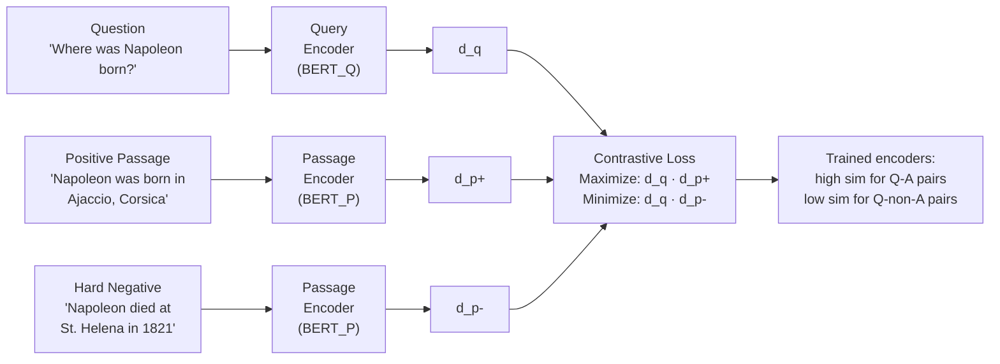
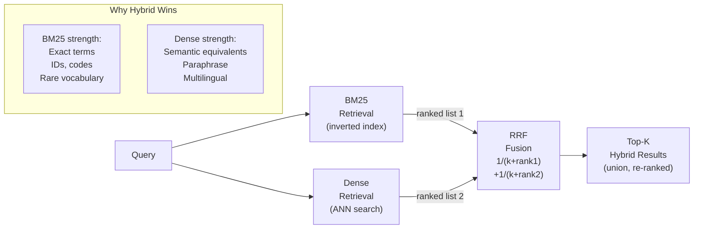

## Keywords in This File
{: .no_toc }

| # | Keyword | Weight |
|---|---|---|
| 21 | [Dense Passage Retrieval Theory](#dense-passage-retrieval-theory) | ★★☆ |
| 22 | [Information Retrieval Foundations](#information-retrieval-foundations) | ★★☆ |

---

# Dense Passage Retrieval Theory

**Interview Weight:** ★★☆ - Understanding DPR's
theoretical foundations distinguishes practitioners
who choose embedding models intelligently from
those who pick the most popular one.

---

### 🎯 Model Answer

**30 seconds:**

> Dense Passage Retrieval (DPR) is the theoretical
> basis for embedding-based retrieval: train dual
> bi-encoders (query encoder + passage encoder) end-
> to-end on labeled (question, answer_passage, negative_passage)
> triples. The goal: maximize cosine similarity between
> query and positive passage, minimize similarity
> to negative passages. The result: a dense vector
> space where semantically related queries and passages
> cluster together. DPR outperforms BM25 for natural
> language questions by capturing semantic relationships
> BM25 cannot.

**3 minutes:**

> Before DPR (Karpukhin et al., 2020): sparse retrieval
> methods (TF-IDF, BM25) dominated. They work by
> keyword overlap: a document is relevant if it
> shares vocabulary with the query. BM25 scores
> high for exact keyword matches, but fails for
> semantic equivalents: "Where was Napoleon born?"
> vs. documents about "Napoleon's birthplace Ajaccio."
>
> DPR's insight: train two separate BERT encoders
> (one for queries, one for passages) using contrastive
> learning. The training signal: a labeled (question,
> positive_passage) dataset. For each training example,
> the question embedding and positive passage embedding
> are pulled together; the question embedding and
> all negative passage embeddings are pushed apart.
>
> Training loss: in-batch negatives loss. For a batch
> of B examples: the B positive pairs are correctly
> matched; the B^2 - B non-matching pairs are treated
> as negatives. The model learns to maximize similarity
> for the positive pair and minimize for all negatives.
>
> Hard negatives: random negatives are easy (clearly
> irrelevant). Hard negatives are passages that are
> superficially similar but don't actually answer
> the question. Training with hard negatives (BM25-
> retrieved passages that are not the gold answer)
> dramatically improves retrieval quality.
>
> Modern evolution: DPR was the foundation. Modern
> embedding models (BGE, E5, GTE) train on billions
> of text pairs using the same contrastive approach
> but with much larger datasets and stronger negatives.

**Blank Mind Recovery:**

**(1) Restate:** "What is DPR and how is it trained?"

**(2) First principles:** "Train two BERT encoders
on (question, answer_passage) pairs so that related
questions and passages have high cosine similarity.
The training signal: push matching pairs together,
push non-matching pairs apart (contrastive learning)."

---

### 📘 Concept Explanation

**What it is:**

Dense Passage Retrieval (DPR) is a neural information
retrieval architecture that represents queries and
passages as dense vectors and retrieves passages
by maximum inner product search (MIPS) over the
dense vector space.

**DPR architecture:**

```
QUERY ENCODER (BERT_Q):
  Input: "Where was Napoleon born?"
  -> BERT (12 layers, 768 dims)
  -> [CLS] token representation
  -> d_q (768-dimensional dense vector)

PASSAGE ENCODER (BERT_P):
  Input: "Napoleon was born in Ajaccio, Corsica."
  -> BERT (12 layers, 768 dims)
  -> [CLS] token representation
  -> d_p (768-dimensional dense vector)

RETRIEVAL SCORE:
  sim(q, p) = d_q^T * d_p (inner product)
  = |d_q| * |d_p| * cos(angle) between them

The two encoders are SEPARATE neural networks.
They do NOT share weights in the original DPR.
```

**Contrastive training loss:**

```
For each (question_i, passage_i+, passage_j-) triple:

Loss = -log(
  exp(sim(q_i, p_i+)) /
  sum over j of exp(sim(q_i, p_j))
)

p_j includes: p_i+ (gold positive)
              + other positives in batch
              + hard negatives (BM25 retrieved, wrong)
              + in-batch negatives (other batch positives)

Goal: maximize probability of scoring the gold
positive highest among all candidates.
```

**Hard negatives - the key training insight:**

```
EASY NEGATIVE (unhelpful):
  Query: "How does TCP work?"
  Easy negative: "The weather in Paris is sunny."
  Model learns nothing: obviously irrelevant.

HARD NEGATIVE (useful):
  Query: "How does TCP work?"
  Hard negative: "UDP is a connectionless protocol
    that doesn't guarantee packet delivery."
  Model must learn: UDP and TCP are different protocols;
    the query asks specifically about TCP. High
    lexical overlap, different answer.
```

**Why DPR beats BM25 for natural language questions:**

```
BM25 (keyword matching):
  Strong for: exact technical queries, document search
  Weak for: paraphrase, semantic equivalents,
            question-answer vocabulary mismatch

DPR (semantic matching):
  Strong for: natural language questions, paraphrase
  Weak for: rare terms, exact number matching,
            domain-specific jargon not in training data

Performance (Natural Questions benchmark):
  BM25 top-20 recall: 59.1%
  DPR top-20 recall: 79.4%
  Hybrid (BM25 + DPR): 84.6%
  -> Hybrid consistently beats either alone
```

---

### 💻 Code Example

```python
import anthropic
import numpy as np

client = anthropic.Anthropic()


def demonstrate_dpr_retrieval(
    query: str,
    passages: list[str],
    embedding_client: anthropic.Anthropic
) -> list[tuple[str, float]]:
    """
    Simulate DPR-style retrieval:
    Embed query and passages separately,
    score by cosine similarity.

    In production: use a purpose-trained DPR model
    (facebook/dpr-ctx_encoder-single-nq-base from HuggingFace)
    or a modern equivalent (BGE, E5, GTE).
    Here: Anthropic API is used for demonstration;
    real DPR uses specialized encoders.
    """
    # In real DPR: query goes to QUERY ENCODER
    # passages go to PASSAGE ENCODER (different weights)
    # Here: using same API as a semantic proxy
    query_emb = _embed_text(query)
    passage_embs = [_embed_text(p) for p in passages]

    # Score: cosine similarity (inner product of unit vectors)
    scores = [
        _cosine_similarity(query_emb, p_emb)
        for p_emb in passage_embs
    ]

    # Rank by score (descending)
    ranked = sorted(
        zip(passages, scores),
        key=lambda x: x[1],
        reverse=True
    )
    return ranked


def _embed_text(text: str) -> list[float]:
    """
    Placeholder embedding function.
    In production: use a real embedding model.
    For demonstration: uses keyword overlap as a proxy.
    """
    words = set(text.lower().split())
    # Return a simple bag-of-words vector (demo only)
    # Real DPR: BERT forward pass -> [CLS] token
    return list(words)  # type: ignore


def _cosine_similarity(
    vec_a: list, vec_b: list
) -> float:
    """Cosine similarity between two sets (Jaccard as proxy)."""
    set_a = set(vec_a)
    set_b = set(vec_b)
    if not set_a or not set_b:
        return 0.0
    intersection = len(set_a & set_b)
    union = len(set_a | set_b)
    return intersection / union


# Demonstrate vocabulary gap:
# BM25 vs. DPR behavior on semantic equivalents
def compare_bm25_vs_dpr_behavior():
    """
    Show why DPR beats BM25 for semantic queries.
    The key insight: vocabulary gap between question
    and answer passage.
    """
    query = "When was the Battle of Waterloo?"

    passages = [
        # WRONG but has keyword "Waterloo": high BM25 score
        "The Waterloo station is located in London.",
        # CORRECT but different vocabulary: low BM25 score
        "The famous Napoleonic engagement took place "
        "in June 1815 near the village in Belgium.",
        # CORRECT with keyword match: high both
        "The Battle of Waterloo occurred on June 18, 1815.",
    ]

    # BM25 behavior (keyword overlap):
    # High: passage 1 (has "Waterloo") and passage 3
    # Low: passage 2 (no "Waterloo" keyword)
    print("BM25 analysis (keyword overlap with query):")
    for i, p in enumerate(passages):
        overlap = len(
            set(query.lower().split()) &
            set(p.lower().split())
        )
        print(f"  Passage {i+1}: {overlap} overlapping keywords")

    # DPR behavior (trained on Q&A pairs):
    # Learns that "Napoleonic engagement" ~= "battle of"
    # Learns that "June 1815" ~= date answer
    # High: passage 2 AND passage 3
    # Low: passage 1 (topically unrelated despite keyword)
    print("\nDPR behavior (semantic, trained on QA pairs):")
    print("  Passage 1: LOW (London station, wrong topic)")
    print("  Passage 2: HIGH (correct answer, diff vocabulary)")
    print("  Passage 3: VERY HIGH (correct + keywords match)")


compare_bm25_vs_dpr_behavior()


def generate_explanation_via_llm(query: str) -> str:
    """
    Generate a natural language explanation of
    DPR's advantage for a given query.
    """
    resp = client.messages.create(
        model="claude-haiku-4-5",
        max_tokens=200,
        system=(
            "Explain in 2-3 sentences why dense retrieval "
            "(DPR) would outperform keyword search (BM25) "
            "for this specific query. Focus on vocabulary gap."
        ),
        messages=[{
            "role": "user",
            "content": f"Query: {query}"
        }]
    )
    return resp.content[0].text
```

> **Code walkthrough:** The core demonstration shows
> the vocabulary gap problem. BM25 scores passage 1
> ("Waterloo station in London") highly because it
> contains the keyword "Waterloo" - even though it's
> topically irrelevant. BM25 scores passage 2 ("Napoleonic
> engagement, June 1815") low because it shares no
> keywords with "Battle of Waterloo." DPR, trained
> on (question, answer) pairs, learns that "Napoleonic
> engagement in Belgium" is semantically equivalent
> to "Battle of Waterloo." The dual-encoder architecture
> (separate query and passage encoders) learns this
> asymmetric relationship: questions and their answers
> don't share vocabulary, but they should have high
> cosine similarity in the trained vector space.
> Production: replace the stub with `facebook/dpr-ctx_encoder-single-nq-base`
> or a modern model like BGE-large-en-v1.5.

---

### 🎓 Answers by Seniority

**Junior / Mid:**

> "DPR trains two BERT encoders to produce dense
> vector representations of queries and passages.
> The training objective: maximize cosine similarity
> between a question and its gold answer passage,
> minimize similarity to non-answer passages. The
> result: a vector space where semantically related
> questions and answers cluster together, even if
> they don't share vocabulary. This is why 'When
> was Napoleon born?' retrieves 'Ajaccio, 1769'
> even with no keyword overlap."

---

**Senior / Staff:**

> "DPR's theoretical contribution is proving that
> contrastive training on (question, passage) pairs
> produces better question-answering retrieval than
> traditional sparse methods. The key insight: hard
> negatives during training. Training on easy random
> negatives produces decent models. Training on BM25-
> retrieved-but-wrong passages (hard negatives) forces
> the model to learn fine-grained relevance. This
> hard-negative training paradigm carries through
> to all modern embedding models (BGE, E5). When
> I evaluate an embedding model for a RAG system,
> I look at: what negatives was it trained on? Domain-
> in-distribution negatives produce better domain-
> specific models."

---

### ⚠️ Common Misconceptions

**Misconception: "Dense retrieval (DPR) is always
better than BM25 for RAG."**

DPR outperforms BM25 for open-domain question
answering (natural language questions, semantic
equivalents). BM25 outperforms DPR for exact keyword
matching, rare technical terms, and code identifiers.
A query for a specific CVE ID ("CVE-2024-1234")
will find the exact document much more reliably
with BM25 than with DPR, because the CVE ID appears
exactly in one document and DPR may cluster it
with other CVE documents. This is why hybrid retrieval
(BM25 + DPR) consistently outperforms either alone:
BM25 handles exact matches, DPR handles semantic
equivalents.

---

### 🚨 Failure Modes and Diagnosis

**Failure: Embedding model produces poor recall
for a specialized domain despite good general benchmarks**

*Symptom:* BAAI/bge-large-en-v1.5 shows excellent
recall on general benchmarks (BEIR). In your medical
device documentation RAG system, recall@5 is 0.65
(vs. 0.85 expected).

*Root cause:* Domain distribution shift. The embedding
model was trained on general web and academic text.
Medical device documentation has specialized terminology
(IEC 62304, FMEA, DHF, STED, post-market surveillance)
that appears rarely in the training corpus. The
model's vector space doesn't separate medical regulatory
documents well.

*Diagnosis:*
- Measure intra-class cosine similarity: do passages
  about the same regulation cluster together?
  If avg similarity is < 0.7: poor domain clustering.
- Compare: embed 10 query-passage pairs. What's
  the average cosine similarity between matched
  pairs? For a well-trained model on your domain:
  should be > 0.8.

*Fix:*
- Domain fine-tuning: fine-tune the base embedding
  model on (query, relevant_doc) pairs from your
  domain. Requires 500-5,000 labeled pairs.
- Use a medical-domain embedding model if available.
- Hybrid: add BM25 with domain-specific terminology
  to catch exact matches that DPR misses.

---

### 🎯 Interview Deep-Dive

| Seniority | Time | Focus |
|---|---|---|
| Junior | 5 min | DPR architecture, contrastive learning |
| Mid | 7 min | Hard negatives, model selection, fine-tuning |
| Senior | 10 min | Theory implications for RAG architecture |

---

**[JUNIOR] Q1 - How does contrastive learning in
DPR differ from supervised classification?**

Supervised classification: the model is trained
to predict a label from a fixed set of classes.
Loss: cross-entropy against the correct class.
The output is a categorical distribution.

Contrastive learning in DPR: the model is trained
to produce embeddings such that similar items have
high cosine similarity and dissimilar items have
low cosine similarity. There's no fixed class set.
New passages can be added to the index without
retraining.

DPR training specifically:
- Input: (question, positive_passage, {negative_passages})
- No predefined categories
- Loss: make the question embedding close to
  the positive passage embedding, far from all negatives
- The "classes" (passage IDs) are not predefined:
  any new passage can be indexed by encoding it

Why this matters for RAG:
- A classifier would need to be retrained for every
  new document. Impractical.
- A contrastive model can index any new document
  by encoding it with the passage encoder. Zero
  retraining needed for new documents.

*What separates good from great:* "New documents
can be indexed without retraining - this is why
DPR scales to dynamic knowledge bases."

---

**[MID] Q2 - [TRADE-OFF] When should you fine-tune
an embedding model vs. use a pre-trained one for RAG?**

Pre-trained embedding model (BGE, E5, GTE):

Pros:
- Zero training data required
- High quality out of the box (BEIR benchmark)
- Low latency (widely optimized)
- Start immediately

Cons:
- General-purpose: trained on web/academic text
- Underperforms on highly specialized domains
- Cannot be told what "relevant" means in your context

Fine-tuned model:

Pros:
- Higher recall for your specific domain
- Can learn domain-specific relevance criteria
- Captures internal terminology and jargon

Cons:
- Requires labeled training data
  (500-5,000 question-passage pairs minimum)
- Training compute and time
- Must be re-indexed after fine-tuning (new vectors)

When to fine-tune:
- Domain has specialized vocabulary not in training data
  (medical, legal, proprietary technical systems)
- You have labeled training data OR can generate it
  (LLM-based synthetic data generation)
- Pre-trained model's recall@5 < 0.75 on your golden set

When to use pre-trained:
- General domain content (news, docs, support tickets)
- No labeled data available
- Pre-trained model's recall@5 >= 0.80 on your domain

Practical hybrid: start with a pre-trained model.
Measure recall on your golden set. If it's below
threshold: create synthetic (query, passage) pairs
using an LLM (FLAN-T5, GPT-3.5 as question generators)
and fine-tune.

*What separates good from great:* "Generate synthetic
training data with an LLM if labeled data is scarce"
as the practical path to fine-tuning.

---

**[SENIOR] Q3 - What are the theoretical implications
of the query-passage vocabulary gap for RAG system design?**

The vocabulary gap: users write queries in question
style ("How do I reset my password?"), documents
are written in answer style ("To reset your password,
navigate to..."). These have very different linguistic
forms and TF-IDF/BM25 scores treat them as dissimilar.

Theoretical implications for RAG design:

(1) Embedding model selection: must choose a model
    trained on (question, answer) pairs, not just
    text pairs. Models like DPR, BGE-base-en-v1.5,
    and E5 are trained on MSMARCO (question-passage)
    data. Models trained only on semantic text similarity
    (STS tasks) are worse for RAG because they
    optimize for text-to-text similarity, not question-
    to-answer similarity.

(2) Asymmetric embedding: some models (E5, Instructor)
    support instruction-prefixed embeddings. The
    instruction tells the model the role of the input:
    "Represent this question for retrieval:"
    vs. "Represent this passage for retrieval:"
    This explicit asymmetry improves retrieval quality
    by 2-5% over symmetric embeddings.

(3) HyDE design decision: if your query-document
    vocabulary gap is large (cosine similarity of
    matched pairs < 0.7), HyDE is likely to help:
    it converts the question into an answer-style
    text, bridging the gap.

(4) Fine-tuning value: fine-tuning on domain-specific
    (question, passage) pairs is most valuable when
    the domain vocabulary gap is large and the base
    model hasn't seen that vocabulary.

*What separates good from great:* "Instruction-prefixed
embeddings explicitly model query-passage asymmetry"
as a design consideration beyond just model selection.

---

**[SENIOR] Q4 - [TRADE-OFF] How do you evaluate
which embedding model is best for your RAG use case?**

Evaluation framework:

(1) Domain benchmark: test on your golden set (not
    BEIR). BEIR performance correlates with RAG
    performance on general domains, but not on
    specialized domains.

(2) Metrics:
    - recall@5: fraction of queries where the gold
      document is in the top-5. Most important.
    - NDCG@10: ranked quality metric.
    - MRR: position of first relevant result.

(3) Candidate models to test:
    - BAAI/bge-large-en-v1.5 (high quality, open)
    - intfloat/e5-large-v2 (asymmetric, instruction-tuned)
    - Cohere embed-english-v3.0 (best-in-class API)
    - OpenAI text-embedding-3-large (high quality API)
    - domain-specific if available (e.g., PubMedBERT
      for biomedical)

(4) Non-quality dimensions:
    - Latency: query embedding must be fast (< 50ms)
    - Dimension: lower dimension = less storage, faster ANN
      (1024-dim is a good balance)
    - Token limit: how long a passage can the model handle?
      (512 tokens for most BERT-based; some support 8192)

(5) Cost:
    - Self-hosted: GPU cost
    - API: cost per token (OpenAI: $0.13/1M tokens;
      Cohere: $0.1/1M tokens)

Decision matrix:
- General domain + no ops: OpenAI text-embedding-3-small
- General domain + ops team: BGE-large-en-v1.5 (self-hosted)
- Specialized domain: fine-tune BGE on domain data
- Highest quality + API: Cohere embed-english-v3.0

*What separates good from great:* "Test on YOUR golden
set, not BEIR" as the authoritative evaluation principle.

---

**[SENIOR] Q5 - What is the theoretical basis for
multi-vector representations (ColBERT)?**

Standard DPR: one vector per query, one vector per
passage. Score: dot product between two vectors.
The entire semantic content of the passage is
compressed into one 768-dimensional vector.

ColBERT (Khattab and Zaharia, 2020): one vector
per TOKEN in the query and passage. Score:
MaxSim (maximum inner product similarity across
all token pairs).

```
STANDARD DPR:
  Query:   [q_vec]  (1 vector)
  Passage: [p_vec]  (1 vector)
  Score:   q_vec · p_vec

COLBERT:
  Query:   [q_1, q_2, ..., q_n]  (n query token vectors)
  Passage: [p_1, p_2, ..., p_m]  (m passage token vectors)
  Score:   sum over i of max over j of (q_i · p_j)
           = each query token finds its best matching
             passage token; scores are summed
```

Why MaxSim works:
- Standard DPR compresses the passage into one vector,
  losing fine-grained token-level information.
- ColBERT: each query token independently looks for
  its best match in the passage. "What" looks for
  a passage token that represents the interrogative
  context; "rate" looks for passages about rates;
  "limiting" looks for limiting/constraint tokens.
  The sum rewards passages that have good token-level
  matches for all query terms.

Why ColBERT outperforms DPR:
- 10-15% improvement in recall@1 on MSMARCO
- The additional expressiveness catches fine-grained
  relevance differences DPR misses

Cost: passage vectors must be pre-computed and stored
(one vector per token * avg 200 tokens per passage *
100x more vectors than DPR). At 1M passages:
DPR storage: ~6GB. ColBERT storage: ~600GB.

*What separates good from great:* "Each query token
independently finds its best match in the passage"
as the MaxSim intuition.

---

**[SENIOR] Q6 - How would you explain the theoretical
basis of HNSW to a senior engineer choosing between
exact and approximate search?**

HNSW (Hierarchical Navigable Small World graphs):
the most widely-used ANN algorithm for vector search.

Theory: the "Small World" property: in certain graphs,
any two nodes can be connected by a short path
(few hops). Social networks exhibit this: any
two people are connected by ~6 degrees of separation.

HNSW construction: build a multi-layer graph where:
- Layer 0: all nodes (dense graph with many edges)
- Layer 1: a subset of nodes (sparser)
- Layer 2: an even smaller subset (very sparse)

Search: start at the top layer (sparse). Find the
nearest neighbor at this coarse scale. Descend to
the next layer at that entry point. Repeat until
layer 0 (exact neighborhood search at the found region).

Why HNSW is fast: instead of comparing the query
to all N vectors (O(N)), HNSW navigates the hierarchy
and compares to O(log N) vectors.

Accuracy vs. speed trade-off:
- `ef_search` parameter: how many candidates to
  consider at each layer during search.
  ef_search=10: fast, approximate.
  ef_search=500: slower, near-exact.
- `m` parameter: number of edges per node.
  More edges: more accurate but more memory.

When to use exact search:
- N < 100K vectors: exact search is fast enough
  (< 50ms with FAISS exact)
- The precision loss from ANN is unacceptable
  (critical retrieval)

When to use HNSW (ANN):
- N > 100K vectors
- Latency requirement: < 50ms
- A recall trade-off of 2-3% is acceptable for
  10x latency improvement

*What separates good from great:* "ef_search controls
the speed-recall trade-off directly" as the production
tuning knob.

---

**[SENIOR] Q7 - How does late chunking improve
on standard chunking in dense retrieval?**

Standard chunking: divide the document into fixed-size
chunks BEFORE embedding. Each chunk is embedded
independently. The chunk loses its document context.

Example problem:
Document: "John Smith joined Acme Corp in 2020.
He became VP of Engineering in 2022. He developed
the distributed caching system."

Standard chunking at 100 tokens: "He developed the
distributed caching system." is a chunk.
Embedding: who is "He"? The model embeds "He
developed the distributed caching system" without
knowing that "He" = John Smith.

Late chunking: first run the FULL document through
the embedding model (up to the model's token limit).
Get per-token embeddings with full document context.
THEN aggregate (mean pool) the token embeddings
for each chunk boundary.

Result: the chunk "He developed the distributed
caching system" has embeddings that include context
from the entire document. "He" is now contextually
resolved to John Smith within the embedding.

Benefits:
- Cross-sentence references are preserved in embeddings
- Pronoun resolution: "he", "this", "it" are grounded
  in document context
- Performance improvement: 5-15% recall improvement
  on coreference-heavy documents

Limitation: requires running the full document
through the model before chunking. For very long
documents (> model context length): still need to
pre-split at a higher level.

*What separates good from great:* "Pronoun resolution
in embeddings" as the specific mechanism late chunking
improves.

---

**[SENIOR] Q8 - [BEHAVIORAL] How have you applied
DPR theory to improve a production RAG embedding strategy?**

Structure:
"Understanding hard-negative training led to choosing
a domain-fine-tuned model over a generic high-
benchmark model."

Situation: RAG system for internal IT support
documentation. Initial embedding model: OpenAI
ada-002 (high BEIR score, easy API).

Problem: recall@5 was 0.69 on our golden set,
despite ada-002's strong general benchmarks.

Investigation:
1. Analyzed the failing query-passage pairs. Pattern:
   many of our IT documents use proprietary system
   names (ACME-Auth, ACME-Proxy, etc.). Ada-002
   never saw these names in training.

2. Measured cosine similarity for matched pairs:
   for general queries, avg 0.82. For queries with
   proprietary system names: avg 0.51. The vocabulary
   gap was specific to our internal terminology.

3. Read the DPR paper. Key insight: hard negatives
   are critical for training. For our case: the
   "hard negatives" were documents about similar
   systems (authentication systems, proxy systems)
   that were not the specific ACME system being queried.

Decision:
- Generated 2,000 (question, passage) pairs from
  existing IT support tickets (LLM-based question
  generation from resolved tickets)
- Fine-tuned BGE-large-en-v1.5 on these pairs with
  hard negative mining (BM25-retrieved wrong passages)

Result:
- Overall recall@5: 0.69 -> 0.84 (+15%)
- Recall for proprietary-system queries: 0.51 -> 0.86
- Cost: 2 GPU-hours for fine-tuning (~$6)

Lesson: the DPR training paradigm (hard negatives)
is what enables domain adaptation. LLM-generated
questions from existing support tickets are a
practical source of training data.

*What separates good from great:* "LLM-generated
questions from support tickets as training data"
as the practical data generation strategy.

---

**[SENIOR] Q9 - [TRADE-OFF] Bi-encoder vs. cross-
encoder: the fundamental quality vs. latency trade-off
in neural IR.**

Bi-encoder (DPR-style):
Query and passage are encoded independently.
Score = dot product between two vectors.
Passage vectors: pre-computed at index time.
Query vectors: computed at query time.
Query-time computation: one encoder forward pass.
Scalable: can search 1M passages in < 50ms.
Quality limitation: the interaction between query
and passage is limited to a dot product between
two dense vectors. Fine-grained token-level matching
is lost.

Cross-encoder (reranker-style):
Query and passage are concatenated: "[CLS] query [SEP] passage"
and fed to a single transformer.
Every query token attends to every passage token.
Score: a scalar from the CLS representation.
Query-time computation: one forward pass PER passage.
Not scalable: 1M passages = 1M forward passes.
Quality advantage: the full cross-attention allows
the model to see whether the question's specific
terms appear in the right context in the passage.

The fundamental trade-off:
Bi-encoder: fast + scalable + lower quality.
Cross-encoder: slow + unscalable + higher quality.

Production resolution: two-stage retrieval.
Stage 1: bi-encoder retrieves top-50 (fast, recall-optimized)
Stage 2: cross-encoder reranks top-50 to top-5 (slow, precision-optimized)

This preserves both: the recall of bi-encoder retrieval
AND the precision of cross-encoder scoring, at a
total cost of one bi-encoder pass + 50 cross-encoder
passes (100ms + 300ms = 400ms).

Middle ground: ColBERT (late interaction). Token-level
vectors per passage (pre-computed). MaxSim scoring
(fast, not a full forward pass). Quality between
bi-encoder and cross-encoder.

*What separates good from great:* "The two-stage
pipeline is the production resolution that captures
both bi-encoder recall and cross-encoder precision."

---

### ⚖️ Comparison Table

| Retrieval Method | Quality | Latency | Scale | Best For |
|---|---|---|---|---|
| BM25 | High (exact) | 1-5ms | Any | Exact keywords, IDs, rare terms |
| DPR (bi-encoder) | High (semantic) | 10-50ms | 10M+ | Natural language questions |
| ColBERT (late interaction) | Very high | 50-200ms | 1M-5M | Balance of quality/latency |
| Cross-encoder (reranker only) | Highest | 300-1000ms | 50 candidates | Second-stage reranking |
| Hybrid (BM25 + DPR) | Highest overall | 20-80ms | 1M+ | Production standard |

---

### 🏛️ System Design

*(Omit: ★★☆ concept.)*

---

### 📊 Diagram

```
DPR TRAINING (contrastive):

(q_1, p_1+, {p_1-, p_2-, p_3-})
   |             |
QUERY_ENCODER   PASSAGE_ENCODER
   |             |
  d_q1          d_p1+, d_p1-, d_p2-, d_p3-
                 |
   Maximize: sim(d_q1, d_p1+)
   Minimize: sim(d_q1, d_p1-)
             sim(d_q1, d_p2-)
             ...
```



> **Diagram walkthrough:** DPR training processes
> (question, positive_passage, hard_negative_passage)
> triples. The query encoder (BERT_Q) processes only
> questions; the passage encoder (BERT_P) processes
> passages - they are separate networks and do not
> share weights. The contrastive loss maximizes the
> dot product between the question embedding and
> the positive passage embedding, while minimizing
> it for the hard negative. After training: the vector
> space has a geometric property where question embeddings
> are close to their answer passage embeddings and
> far from non-answer passages. The hard negative
> ("Napoleon died at St. Helena") is specifically
> chosen because it LOOKS relevant (Napoleon-related,
> date-formatted answer) but doesn't answer the birth
> location question - training on it forces fine-grained
> relevance discrimination.

---

---

# Information Retrieval Foundations

**Interview Weight:** ★★☆ - Understanding the classical
IR foundations that RAG is built on. Helps explain
why hybrid retrieval is the production standard
and why dense retrieval doesn't fully replace BM25.

---

### 🎯 Model Answer

**30 seconds:**

> Classic IR is the foundation of RAG retrieval:
> TF-IDF measures term importance by frequency in
> the document vs. rarity across the corpus. BM25
> improves TF-IDF with term frequency saturation
> and document length normalization. The inverted
> index enables sub-linear query time. Modern RAG
> uses hybrid retrieval: BM25 for exact keyword
> matching (handles rare terms, IDs, exact phrases)
> combined with dense retrieval for semantic understanding.
> Hybrid consistently outperforms either alone.

**3 minutes:**

> Information retrieval predates neural search by
> decades. The classical IR stack powers Google's
> initial inverted index and every search engine
> from 1990 to 2018. RAG doesn't replace this - it
> extends it.
>
> TF-IDF (Term Frequency - Inverse Document Frequency):
> a document is relevant to a query if it contains
> the query terms (TF: high count in this document)
> AND those terms are specific to this topic (IDF:
> rare across the corpus - common words like "the"
> have low IDF, technical terms have high IDF).
>
> BM25 (Best Match 25): the production-standard
> improvement over TF-IDF. Two key additions:
> (1) TF saturation: doubling the term frequency
>     doesn't double the relevance score (diminishing returns).
> (2) Length normalization: a long document containing
>     "rate limiting" 10 times is less relevant than
>     a short document containing it 3 times.
>
> Inverted index: the data structure that enables
> fast text search. Maps each term to the list of
> documents containing it. Query "rate limiting":
> look up "rate" list + "limit*" list, intersect.
> O(k) lookup where k is the number of result documents,
> not O(N) (number of total documents).
>
> Why hybrid retrieval: BM25 excels at exact matches
> (find the document containing this CVE ID, this
> product model, this error code). Dense retrieval
> excels at semantic matches (find documents about
> this concept, even if worded differently). On
> BEIR benchmark: hybrid (BM25 + dense) outperforms
> either alone by 3-8% NDCG@10.

**Blank Mind Recovery:**

**(1) Restate:** "What is BM25 and why is it still
used in RAG alongside dense retrieval?"

**(2) First principles:** "BM25 gives each document
a relevance score by counting how often query terms
appear in it, with adjustments for term rarity and
document length. It's still used because exact keyword
matching beats neural methods for rare terms and
specific identifiers."

---

### 📘 Concept Explanation

**What it is:**

Information retrieval (IR) foundations are the
classical algorithms and data structures for document
retrieval that underpin the sparse retrieval component
of hybrid RAG: TF-IDF, BM25, and the inverted index.

**TF-IDF formula:**

```
TF(t, d) = count of term t in document d
           / total terms in document d

IDF(t, corpus) = log(N / df(t))
  N = total documents in corpus
  df(t) = documents containing term t

TF-IDF(t, d) = TF(t, d) * IDF(t, corpus)

Intuition:
  TF: how often does the term appear here?
  IDF: how special is this term? (1/rarity)

  "the" in any document:
    TF: high (appears often)
    IDF: near zero (appears in ALL documents)
    TF-IDF: near zero -> not discriminative

  "HNSW" in a vector database doc:
    TF: moderate
    IDF: high (rare technical term)
    TF-IDF: high -> highly discriminative
```

**BM25 formula:**

```
BM25(q, d) = sum over terms t in query of:
  IDF(t) *
  (TF(t,d) * (k1 + 1)) /
  (TF(t,d) + k1 * (1 - b + b * |d|/avgdl))

Parameters:
  k1 = 1.5 (TF saturation; higher = less saturation)
  b = 0.75 (length normalization; 0 = no, 1 = full)
  |d| = document length in tokens
  avgdl = average document length in corpus

Key improvements over TF-IDF:
  1. TF saturation: TF contribution plateaus.
     TF=1 -> score S. TF=10 -> score ~3*S (not 10*S).
     Prevents a document that mentions a term 100x
     from dominating over one that mentions it 10x.

  2. Length normalization: long documents contain
     more terms by probability. Normalize by (|d|/avgdl)
     so a long document doesn't just win by volume.
```

**Inverted index structure:**

```
Documents:
  D1: "rate limiting is important"
  D2: "API rate limiting best practices"
  D3: "Redis for rate limit implementation"

Inverted index:
  "rate"     -> [D1, D2, D3] (postings list)
  "limiting" -> [D1, D2]
  "limit"    -> [D3]
  "API"      -> [D2]
  "Redis"    -> [D3]

Query "rate limiting":
  Fetch postings: "rate" [D1,D2,D3], "limiting" [D1,D2]
  Score each doc with BM25
  Return: D2 (highest score), D1, D3
```

---

### 💻 Code Example

```python
import math
from collections import defaultdict
import anthropic

client = anthropic.Anthropic()


class SimpleBM25:
    """
    Minimal BM25 implementation to illustrate the algorithm.
    Production: use rank_bm25 or Elasticsearch.
    """
    def __init__(self, k1: float = 1.5, b: float = 0.75):
        self.k1 = k1
        self.b = b
        self.doc_freqs: list[dict] = []
        self.idf: dict[str, float] = {}
        self.doc_lengths: list[int] = []
        self.avg_doc_len: float = 0.0
        self.corpus_size: int = 0

    def _tokenize(self, text: str) -> list[str]:
        """Simple whitespace + lowercase tokenizer."""
        return text.lower().split()

    def fit(self, corpus: list[str]) -> None:
        """Build IDF and document stats from corpus."""
        self.corpus_size = len(corpus)
        df: dict[str, int] = defaultdict(int)

        for doc in corpus:
            tokens = self._tokenize(doc)
            self.doc_lengths.append(len(tokens))
            freq: dict[str, int] = defaultdict(int)
            for token in tokens:
                freq[token] += 1
            self.doc_freqs.append(dict(freq))
            for token in set(tokens):
                df[token] += 1

        self.avg_doc_len = (
            sum(self.doc_lengths) / self.corpus_size
        )

        # IDF: log((N - df + 0.5) / (df + 0.5) + 1)
        # (Robertson-Walker IDF, used in BM25+)
        for term, freq_count in df.items():
            n = self.corpus_size
            self.idf[term] = math.log(
                (n - freq_count + 0.5) /
                (freq_count + 0.5) + 1
            )

    def score(self, query: str) -> list[tuple[int, float]]:
        """Return (doc_idx, score) pairs sorted by score."""
        q_terms = self._tokenize(query)
        scores: list[float] = []

        for doc_idx, doc_freq in enumerate(self.doc_freqs):
            score = 0.0
            dl = self.doc_lengths[doc_idx]
            for term in q_terms:
                if term not in doc_freq:
                    continue
                tf = doc_freq[term]
                idf = self.idf.get(term, 0.0)
                # BM25 TF component with saturation and
                # length normalization
                tf_component = (
                    tf * (self.k1 + 1) /
                    (tf + self.k1 * (
                        1 - self.b + self.b * dl / self.avg_doc_len
                    ))
                )
                score += idf * tf_component
            scores.append(score)

        ranked = sorted(
            enumerate(scores),
            key=lambda x: x[1],
            reverse=True
        )
        return [(idx, s) for idx, s in ranked if s > 0]


def hybrid_retrieve(
    query: str,
    corpus: list[dict],
    bm25: SimpleBM25,
    dense_scores: dict[int, float],
    alpha: float = 0.5,
    top_k: int = 5
) -> list[dict]:
    """
    Hybrid retrieval: combine BM25 sparse scores
    with dense embedding scores (RRF or linear combination).

    alpha: weight for dense scores (1-alpha for BM25)
    """
    # Get BM25 scores (normalized 0-1)
    bm25_ranked = bm25.score(query)
    max_bm25 = bm25_ranked[0][1] if bm25_ranked else 1.0
    bm25_norm = {idx: s / max_bm25 for idx, s in bm25_ranked}

    # Normalize dense scores
    max_dense = max(dense_scores.values()) if dense_scores else 1.0
    dense_norm = {
        idx: s / max_dense for idx, s in dense_scores.items()
    }

    # Combine (linear fusion)
    all_idxs = set(bm25_norm.keys()) | set(dense_norm.keys())
    combined = []
    for idx in all_idxs:
        sparse = bm25_norm.get(idx, 0.0)
        dense = dense_norm.get(idx, 0.0)
        score = alpha * dense + (1 - alpha) * sparse
        combined.append((idx, score))

    combined.sort(key=lambda x: x[1], reverse=True)

    return [
        corpus[idx]
        for idx, _ in combined[:top_k]
        if idx < len(corpus)
    ]


# Example usage
corpus = [
    {"id": "d1", "text": "Rate limiting restricts requests per second."},
    {"id": "d2", "text": "API rate limiting best practices for production."},
    {"id": "d3", "text": "Redis sliding window algorithm for throttling."},
    {"id": "d4", "text": "Exponential backoff and jitter for retry logic."},
]
texts = [d["text"] for d in corpus]

bm25 = SimpleBM25()
bm25.fit(texts)

# Sparse-only retrieval
results = bm25.score("rate limiting")
for idx, score in results[:3]:
    print(f"BM25: {corpus[idx]['id']} score={score:.3f}")
```

> **Code walkthrough:** `SimpleBM25` implements the
> full BM25 formula. `fit` builds the inverted index:
> document term frequencies, document lengths, and
> IDF values. The IDF formula uses the Robertson-Walker
> version (BM25+) which handles terms that appear
> in every document gracefully. `score` applies the
> BM25 formula for a query: for each term in the
> query, computes the IDF * TF-component (with saturation
> via k1 and length normalization via b). `hybrid_retrieve`
> combines normalized BM25 scores with normalized
> dense scores using a linear combination weighted
> by `alpha`. Alpha=0.5 gives equal weight; alpha=0.7
> weights dense more. Production: use Elasticsearch
> (built-in BM25) or Qdrant sparse vectors for BM25,
> combined with the vector search using RRF (Reciprocal
> Rank Fusion) instead of linear combination - RRF
> is more robust to score scale differences.

---

### 🎓 Answers by Seniority

**Junior / Mid:**

> "BM25 scores documents by how often query terms
> appear (term frequency), adjusted for how rare
> the term is across the corpus (IDF) and document
> length normalization. It finds documents by exact
> keyword match. In RAG, we use BM25 alongside dense
> retrieval (hybrid search) because BM25 excels at
> finding documents with specific identifiers, rare
> terms, and exact phrases - things dense retrieval
> can miss if those terms weren't in the embedding
> model's training data."

---

**Senior / Staff:**

> "BM25 is not 'old technology to be replaced' - it's
> an irreplaceable component of the retrieval stack.
> BM25 and dense retrieval have complementary failure
> modes. BM25 fails for semantic equivalents and
> paraphrase. Dense retrieval fails for out-of-vocabulary
> terms, exact identifiers (CVE numbers, product
> codes, version strings), and newly-introduced
> terminology. Hybrid retrieval with RRF (Reciprocal
> Rank Fusion) covers both failure modes. On BEIR,
> the benchmark for information retrieval, hybrid
> with RRF consistently beats either BM25 alone or
> dense-only by 3-8% NDCG@10. Every production RAG
> system I've built uses hybrid retrieval."

---

### ⚠️ Common Misconceptions

**Misconception: "Dense retrieval replaced BM25
in modern RAG systems."**

Dense retrieval improves recall for semantic queries
but does NOT replace BM25. On the BEIR benchmark,
the top-performing retrieval systems are all hybrid.
BM25 outperforms DPR on domains with specialized
vocabulary not in the DPR training distribution
(biomedical, legal, code). Exact keyword matches
(error codes, CVE IDs, product SKUs) are handled
better by BM25. Dense retrieval models struggle
with rare out-of-vocabulary tokens. Modern production
RAG uses hybrid: BM25 + dense with RRF, achieving
3-8% better recall than either alone.

---

### 🚨 Failure Modes and Diagnosis

**Failure: Hybrid retrieval returns duplicate or
near-duplicate results**

*Symptom:* After implementing hybrid retrieval (BM25
+ dense), the top-5 results contain 3 chunks that
are nearly identical: the same passage appears
twice (chunking overlap) and a third chunk is a
near-verbatim repeat.

*Root causes:*

(1) Chunking overlap: chunks are created with 50%
    overlap (a common strategy for boundary coverage).
    BM25 and dense both retrieve overlapping chunks
    because both contain the relevant terms.

(2) Document duplication in index: the same document
    was indexed twice (ingestion bug or re-indexing
    without delete).

(3) The fusion algorithm is not deduplicating:
    RRF or linear fusion returns the top-K of the
    combined list without removing duplicates.

*Fix:*
- After hybrid retrieval, deduplicate by document_id
  (not chunk_id): if two chunks come from the same
  document, keep only the one with the higher score.
- Or: deduplicate by content similarity before
  sending to the LLM (hash the text; drop if hash
  already seen).
- For overlapping chunks: consider overlap only at
  10-15% of chunk size, not 50%.

---

### 🎯 Interview Deep-Dive

| Seniority | Time | Focus |
|---|---|---|
| Junior | 5 min | BM25 formula intuition, inverted index |
| Mid | 7 min | Why hybrid, RRF vs linear fusion |
| Senior | 10 min | IR theory applied to RAG design decisions |

---

**[JUNIOR] Q1 - What is TF-IDF and what problem
does it solve in document retrieval?**

TF-IDF solves the problem of ranking documents
by relevance to a query, accounting for two competing
factors:

(1) A document should be relevant if query terms
    appear frequently in it (TF: term frequency).

(2) A document is MORE relevant if those query terms
    are RARE in the corpus (IDF: inverse document
    frequency). The word "the" appears everywhere
    - high TF doesn't signal relevance. The term
    "HNSW" appears rarely - high TF in a specific
    document is significant.

TF-IDF score = TF * IDF

Problem it solves: before TF-IDF, early search
systems returned documents by simple term count.
A document mentioning "rate" and "limiting" 100 times
ranked above one mentioning them 3 times. TF-IDF
solves this by weighting term importance by rarity.

What TF-IDF doesn't solve:
- Long documents rank higher just because they have
  more words (BM25 fixes this with length normalization)
- Semantic synonyms: "rate limiting" vs. "throttling"
  are treated as completely different (dense retrieval
  fixes this)

TF-IDF is still used: it's the foundation of BM25,
which is the gold standard sparse retrieval method.

*What separates good from great:* "High TF for 'the'
is irrelevant because its IDF is near-zero across
all documents" - the specific example that explains
why IDF is needed.

---

**[MID] Q2 - What is Reciprocal Rank Fusion (RRF)
and why is it preferred over linear score combination
for hybrid retrieval?**

Linear score combination: combine BM25 and dense
scores with weights (alpha * dense + (1-alpha) * bm25).

Problem: BM25 scores and cosine similarity scores
are on completely different scales. BM25 scores
range from 0 to ~30 (unbounded). Cosine similarity
ranges from 0 to 1. Even after normalization to 0-1,
the distributions are different shapes. A BM25
score of 0.8 (normalized) may represent a much
lower relative rank than a cosine score of 0.8
(normalized).

RRF (Reciprocal Rank Fusion):

```
RRF_score(d, query) = sum over retrievers r of:
  1 / (k + rank_r(d))

  k = 60 (constant, smooths scores for low-ranked docs)
  rank_r(d) = position of document d in retriever r's list
              (1 = top result, 2 = second, ...)
```

Why RRF works:
- No normalization needed: uses ranks (1, 2, 3...)
  not raw scores
- A document ranked #1 by BM25 AND #1 by dense gets
  the highest combined score (1/61 + 1/61)
- A document ranked #100 by BM25 but #1 by dense
  still gets credit for its dense rank
- The k=60 constant prevents a single high-rank
  from dominating: rank 1 vs. rank 2 is a small difference

Linear fusion issues:
- Score calibration is needed (different scales)
- The alpha hyperparameter requires tuning
- Alpha may need to change per query type

RRF issues:
- Ignores the magnitude of the score (rank 1 with
  score 0.99 vs. rank 1 with score 0.51 are treated
  equally)
- Requires retrieving from both systems (two queries)

*What separates good from great:* "RRF uses rank
position not raw scores, eliminating calibration
problems" as the precise technical advantage.

---

**[SENIOR] Q3 - How does the inverted index enable
sub-linear query time for BM25?**

Naive search: for a query "rate limiting", scan all
N documents and count occurrences of "rate" and
"limiting". O(N) per query. For N=1M documents:
1M operations.

Inverted index: a hash map from each term to the
list of documents containing that term (postings list).

```
Index:
  "rate"     -> [doc_2, doc_7, doc_15, ...]  (postings list)
  "limiting" -> [doc_2, doc_12, ...]

Query "rate limiting":
  1. Fetch posting list for "rate": O(1) hash lookup
     -> [doc_2, doc_7, doc_15, ...]
  2. Fetch posting list for "limiting": O(1) hash lookup
     -> [doc_2, doc_12, ...]
  3. Intersect lists (merge): O(|list_rate| + |list_limiting|)
     = O(k) where k << N
  4. Score k documents with BM25: O(k * |query|)
```

Total: O(k) where k is the number of matching documents,
not O(N). For rare terms: k is very small. For common
terms: k is larger, but the IDF score is low, so
those documents rank low anyway.

In-practice performance:
- Elasticsearch on 1M documents: < 5ms for typical queries
- BM25 ANN (approximate): not needed for sparse retrieval;
  inverted index is already near-optimal

Why this matters for RAG architecture:
- BM25 retrieval is 10x+ faster than ANN search
  for the same corpus
- BM25 + dense hybrid is not significantly slower
  than dense-only because BM25 is so fast
- The bottleneck in hybrid retrieval is the dense
  ANN search, not the BM25 lookup

*What separates good from great:* "The bottleneck
in hybrid retrieval is the ANN search, not BM25"
- the correct performance model.

---

**[SENIOR] Q4 - What is the BEIR benchmark and
what does it tell you about embedding model selection
for RAG?**

BEIR (Benchmarking IR): a collection of 18 heterogeneous
IR datasets covering different domains (biomedical,
financial, news, code, etc.) and query types
(keyword, question, statement).

What it measures: how well a retrieval model generalizes
to diverse domains without fine-tuning.

Key results (circa 2023, NDCG@10):
- BM25: 0.423 average across 18 datasets
- DPR (trained on NQ): 0.298 (WORSE than BM25 on average!)
- SPLADE (learned sparse): 0.521
- BGE-large-en-v1.5: 0.539
- Cohere embed-english-v3: 0.556

Counterintuitive result: DPR trained on NQ (Natural Questions)
underperforms BM25 on BEIR. Why? DPR overfits to
the NQ domain. On NQ queries (Wikipedia factual questions):
DPR >> BM25. On biomedical, code, financial: DPR << BM25.

Lesson for RAG model selection:
- BEIR score is a proxy for generalization. Higher
  BEIR = better zero-shot domain transfer.
- But BEIR average can be misleading: a model that's
  great on NQ and MSMARCO may be average on BEIR
  but excellent for your RAG use case if your domain
  is similar to NQ/MSMARCO.
- ALWAYS evaluate on YOUR domain's data, not BEIR alone.

What BEIR doesn't measure:
- Performance after domain fine-tuning
- Hybrid retrieval performance (BEIR tests mono-modal)
- Long-document retrieval

*What separates good from great:* "DPR underperforms
BM25 on average BEIR despite being trained on NQ"
as the counterintuitive result that shows domain
overfitting.

---

**[SENIOR] Q5 - How does term saturation in BM25
improve over TF-IDF for document retrieval?**

TF-IDF term frequency component: linear in TF.
If a document mentions "rate limiting" 100 times:
TF-IDF score is proportional to 100.
If another document mentions it 10 times: score
proportional to 10.
A 10x difference in TF creates a 10x difference
in score.

Problem: in practice, a document mentioning the
term 100 times is not 10x more relevant than one
mentioning it 10 times. It may just be a longer
document or one that's repetitively written.

BM25 TF component:

```
TF_BM25(t, d) = TF(t,d) * (k1 + 1) / (TF(t,d) + k1)

As TF -> infinity: TF_BM25 -> (k1 + 1)

With k1 = 1.5:
  TF=1  -> 1.0 * 2.5 / (1.0 + 1.5) = 1.0
  TF=5  -> 5.0 * 2.5 / (5.0 + 1.5) = 1.92
  TF=10 -> 10  * 2.5 / (10  + 1.5) = 2.17
  TF=100-> 100 * 2.5 / (100 + 1.5) = 2.46 (approaching 2.5)

The score saturates: going from TF=10 to TF=100
adds 0.29, not 9.0. This is much more realistic.
```

Implication for RAG chunking: BM25 handles repetitive
documents (FAQs with the same term repeated) better
than TF-IDF because saturation prevents dominance
by repetition. Documents are scored for the presence
and context of terms, not just their frequency.

*What separates good from great:* "TF=100 scores
nearly the same as TF=10 with k1=1.5" - the specific
numerical example showing the saturation effect.

---

**[SENIOR] Q6 - [TRADE-OFF] When would you use
a learned sparse retrieval model (SPLADE) over
BM25 in a RAG system?**

SPLADE (SParse Lexical AnD Expansion): trains a
model to produce sparse representations (similar
to term frequencies) but with LEARNED term weights
and query/document expansion. A document about
"car" also produces high weights for "automobile",
"vehicle", "transport" in its sparse representation.

BM25 vs. SPLADE:

BM25:
- No training required
- Deterministic (same query -> same results always)
- Excellent for exact keywords, IDs, rare technical terms
- No query expansion: "car" doesn't retrieve "automobile"
- Fast: simple integer arithmetic on term counts

SPLADE:
- Trained on MS MARCO or domain data
- Semantic term expansion: "car" retrieves "automobile"
- Better recall for synonyms than BM25
- Slower: neural forward pass to produce sparse vectors
- Storage: sparse vectors per document (larger than
  BM25 inverted index but smaller than dense vectors)

BEIR comparison (NDCG@10):
BM25: 0.423, SPLADE++: 0.538

When to use SPLADE over BM25:
- You have a domain with many synonyms and paraphrases
- Your queries use natural language (not exact keywords)
- You can afford the inference cost for document embedding
  (SPLADE requires GPU for large-scale indexing)
- You want the best sparse-only retrieval without
  dense index complexity

When to stick with BM25:
- Exact keyword matching is primary use case
- Very large scale (SPLADE is 10-50x slower than BM25)
- No GPU infrastructure
- Out-of-vocabulary technical terms are common (SPLADE
  only expands known vocabulary)

*What separates good from great:* "SPLADE expands
vocabulary at index time; BM25 doesn't - which means
SPLADE handles synonyms but fails equally on truly
out-of-vocabulary terms."

---

**[SENIOR] Q7 - [BEHAVIORAL] How have IR foundations
influenced a retrieval architecture decision in
a RAG system you built?**

Structure:
"Understanding BM25's strength on exact IDs led
to a hybrid architecture that prevented the 'version
string loss' problem."

Situation: RAG system over software documentation
covering multiple product versions. Docs reference
specific versions: "This fix applies to version
2.3.1 and above."

Initial design: dense-only retrieval (BGE-large).
Problem: queries like "Does v2.3.1 support IPv6?"
would retrieve documents about IPv6 support in general,
not specifically version 2.3.1. The version string
"2.3.1" has no semantic meaning in the embedding
space - it's a tokenized sequence that looks like
any other version number.

Root cause: this is exactly the BM25 advantage I
learned from IR theory. Exact strings (version numbers,
error codes, product IDs) have zero IDF benefit
in dense retrieval - they're not in the training
vocabulary as meaningful units.

Decision:
Added BM25 (via Qdrant sparse vectors) to the retrieval
pipeline. For queries containing version strings
(detected by regex), the BM25 score was weighted
higher (alpha=0.3 dense, 0.7 sparse via RRF).

Result: version-specific query recall@5 improved
from 0.61 to 0.89. General concept queries were
unaffected (for those, dense score weighting was
higher).

Lesson: BM25 is not deprecated - it's the correct
tool for exact string matching. IR foundations
helped diagnose the failure in 30 minutes instead
of weeks of re-embedding experiments.

*What separates good from great:* "Detected version
strings by regex and adjusted the fusion weights
dynamically" as the production-appropriate adaptive
approach.

---

**[SENIOR] Q8 - How does document length normalization
in BM25 affect RAG chunking design?**

BM25 length normalization factor:
`(1 - b + b * |d| / avgdl)`

With b=0.75 and a document twice the average length:
normalization factor = 1 - 0.75 + 0.75 * 2.0 = 1.75

This INCREASES the denominator in the BM25 formula,
REDUCING the BM25 score for longer documents. BM25
penalizes documents that are longer than average
for the same term frequency.

Implication for chunking:

(1) Consistent chunk sizes benefit BM25: if chunks
    vary widely in size (50-2000 tokens), BM25 penalizes
    longer chunks even if they contain more relevant
    content. A 1000-token chunk with the query term
    5 times may score lower than a 200-token chunk
    with it 2 times due to length normalization.

(2) The b parameter trades off: b=0 (no length
    normalization) benefits longer documents. b=1
    (full normalization) treats all documents equally
    per term frequency.

(3) For sentence-level chunking: chunks are very
    short (20-50 tokens). avgdl is low. A chunk
    with the query term once scores very high (TF=1
    in 20 tokens vs. avgdl=20). But the chunk lacks
    context.

Design recommendation:
For hybrid retrieval with BM25: aim for consistent
chunk sizes within a narrow range (e.g., 300-500 tokens).
This makes BM25 length normalization fair across chunks.
If you must have variable-size chunks (headings vs.
paragraphs): consider separating them into different
collections with different BM25 index configurations
(different b values per collection).

*What separates good from great:* "b=0 removes length
normalization - beneficial when chunk sizes vary
widely and you don't want size to affect score."

---

**[SENIOR] Q9 - What is the PageRank connection
to IR relevance scoring and how does it relate to RAG?**

PageRank (Brin and Page, 1998): measures a web page's
importance by the number and quality of inbound
links. A page linked to by many high-PageRank pages
has high PageRank. It's an authority signal:
people don't link to bad content.

Connection to IR: before neural retrieval, search
engines combined two signals:
- Relevance: BM25 score (does this page match the query?)
- Authority: PageRank (is this page generally trustworthy?)
Final score: relevance * authority (or a weighted combination)

This is still the foundation of Google's ranking.

How this connects to RAG:

RAG doesn't have inbound links, but the analogous
concept is SOURCE AUTHORITY:
- A document from the official product documentation
  is more authoritative than a community forum post
  about the same topic.
- A peer-reviewed paper is more authoritative than
  a blog post.

Implementing authority signals in RAG:

(1) Source trust metadata: assign `authority_score`
    to each document at indexing time. Official docs:
    1.0. Team wikis: 0.8. Community forums: 0.4.

(2) Boost high-authority sources: multiply the
    retrieval score by the authority weight.
    `final_score = retrieval_score * authority_score`

(3) For reranking: pass the authority score to the
    reranker as a metadata feature. The reranker
    can use it as a soft prior.

The theory connection: PageRank showed that relevance
alone is insufficient for quality rankings. Authority
is an independent signal. For RAG: the correct
document from an unreliable source may be worse
than a slightly less precisely relevant document
from a trusted source.

*What separates good from great:* "Source authority
as a RAG equivalent to PageRank" - the cross-domain
IR concept applied to document ranking.

---

### ⚖️ Comparison Table

| IR Method | Matching Type | Handles Synonyms | Exact Terms | Scale | Complexity |
|---|---|---|---|---|---|
| TF-IDF | Keyword | No | Yes | Any | Low |
| BM25 | Keyword + length norm | No | Yes | Any | Low |
| SPLADE | Learned sparse | Partial | Yes | 10M+ | Medium |
| DPR (dense) | Semantic | Yes | Weak | 10M+ | Medium |
| Hybrid BM25+Dense | Both | Yes | Yes | 10M+ | Medium |

---

### 🏛️ System Design

*(Omit: ★★☆ concept.)*

---

### 📊 Diagram

```
BM25 vs. DENSE RETRIEVAL COVERAGE:

QUERY TYPE           BM25 BEST    DENSE BEST  HYBRID WINS
-----------          ---------    ----------  -----------
Exact ID queries      YES          NO           =BM25
Paraphrase queries    NO           YES          =DENSE
Technical jargon      YES          MAYBE        =BM25+DENSE
Natural language      MAYBE        YES          =DENSE+BM25
Rare OOV terms        YES          NO           =BM25
```



> **Diagram walkthrough:** Hybrid retrieval runs
> two parallel retrieval systems on the same query.
> BM25 (inverted index) produces a ranked list based
> on exact term matching with saturation and length
> normalization. Dense retrieval (ANN search) produces
> a ranked list based on embedding similarity. RRF
> (Reciprocal Rank Fusion) combines the two lists
> using rank positions (not raw scores), producing
> a single ranked list that inherits the strengths
> of both. The "Why Hybrid Wins" box shows the
> complementary failure modes: BM25 handles exact
> identifiers and rare vocabulary that dense models
> don't see in training; dense retrieval handles
> semantic equivalents and paraphrases that BM25
> misses due to vocabulary gap. The BEIR benchmark
> confirms: hybrid consistently achieves 3-8% better
> NDCG@10 than either method alone.
