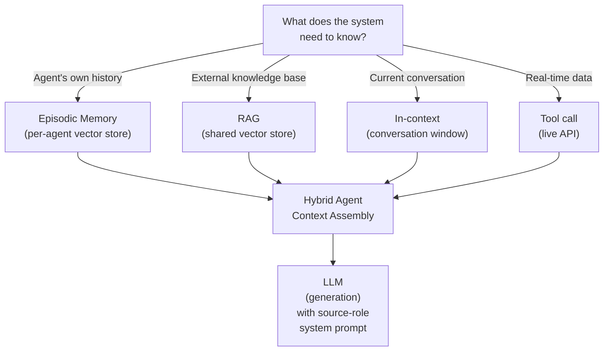

## Keywords in This File
{: .no_toc }

| # | Keyword | Weight |
|---|---|---|
| 23 | [Retrieval-Generation Quality Trade-off](#retrieval-generation-quality-trade-off) | ★☆☆ |
| 24 | [Knowledge Freshness vs Model Knowledge](#knowledge-freshness-vs-model-knowledge) | ★☆☆ |
| 25 | [RAG vs Agent Memory Architecture Decision](#rag-vs-agent-memory-architecture-decision) | ★☆☆ |

---

# Retrieval-Generation Quality Trade-off

**Interview Weight:** ★☆☆ - The meta-pattern that
explains most RAG quality failures and prioritizes
improvement investments.

---

### 🎯 Model Answer

**30 seconds:**

> RAG quality has two independent levers: retrieval
> quality (are the right documents in the context?)
> and generation quality (does the LLM use those
> documents correctly?). Low retrieval quality cannot
> be fixed by a better LLM. Low generation quality
> cannot be fixed by better retrieval. Diagnose first:
> measure recall@5 (retrieval) and faithfulness (generation)
> separately before improving anything.

**3 minutes:**

> The fundamental insight: retrieval and generation
> are independently failing subsystems. A degradation
> in either produces wrong answers, but the fix is
> completely different.
>
> If retrieval fails: the context doesn't contain
> the right information. No matter how good the LLM
> is, it cannot generate a correct answer from a
> context that doesn't contain the answer. Upgrading
> from Claude Haiku to Claude Opus when retrieval
> is the bottleneck: zero improvement.
>
> If generation fails: the right context is there,
> but the LLM supplements from training knowledge
> or fails to extract the relevant information.
> Improving chunking or adding reranking when
> generation is the bottleneck: zero improvement.
>
> The productive mental model: RAG is a pipeline
> with a capacity ceiling. The ceiling is set by
> the WEAKER of the two components.
> - If recall@5 = 0.65: the pipeline's ceiling is 65%
>   (at best, only 65% of answers can be correct).
>   Fix retrieval first.
> - If recall@5 = 0.90 and faithfulness = 0.70:
>   the pipeline has the right documents but the
>   LLM ignores them 30% of the time. Fix generation.
>
> Practical improvement sequence:
> (1) Measure both metrics on the golden test set.
> (2) Fix the lower metric first (the bottleneck).
> (3) The bottleneck shifts - re-measure.
> (4) Repeat until both metrics are above threshold.

**Blank Mind Recovery:**

**(1) Restate:** "What is the retrieval-generation
quality trade-off in RAG?"

**(2) First principles:** "Two things can go wrong
in RAG: not finding the right document, or not
using the right document. I need to know which
one is broken before I fix anything."

---

### 📘 Concept Explanation

**What it is:**

The retrieval-generation quality trade-off is the
framework for understanding that RAG quality is
bounded by the weaker of its two components and
that diagnostic measurement must precede improvement.

**The cascade failure:**

```
RETRIEVAL FAIL:
  Right doc not in context
    -> LLM generates from training knowledge
    -> Confident, plausible, WRONG answer
    -> Faithfulness appears fine (no context to contradict)
    -> But end-to-end answer is wrong

GENERATION FAIL:
  Right doc IS in context
    -> LLM supplements with training knowledge
    -> Combines context + training = mixed accuracy
    -> Faithfulness: LOW (claims not in context)
    -> End-to-end answer: partially wrong

BOTH FAIL:
  Wrong doc in context + LLM ignores it
    -> Complete breakdown
    -> Very wrong answers
```

**The improvement decision matrix:**

```
recall@5   faithfulness   ACTION
--------   ------------   ------
< 0.75     any            Fix retrieval FIRST
                          (chunking, embedding, hybrid,
                          reranking, metadata filters)

>= 0.80    < 0.80         Fix generation
                          (grounding prompt, model,
                          context length, source labels)

>= 0.80    >= 0.85        Good baseline. Invest in:
                          - Recall improvement at the margin
                          - Query transformation
                          - Knowledge base coverage
                          - User experience / latency

> 0.90     > 0.90         Excellent. Focus on:
                          - Edge cases
                          - Domain-specific fine-tuning
                          - Scale and cost optimization
```

---

### 💻 Code Example

```python
import anthropic

client = anthropic.Anthropic()


def diagnose_rag_quality(
    query: str,
    pipeline_result: dict,
    gold_doc_id: str | None = None
) -> dict:
    """
    Diagnose whether a RAG failure is retrieval
    or generation based on trace data.

    Returns a diagnosis with recommended action.
    """
    retrieved_ids = [
        d.get("doc_id") for d in
        pipeline_result.get("retrieved_docs", [])
    ]
    context = pipeline_result.get("context", "")
    answer = pipeline_result.get("answer", "")

    # Step 1: retrieval diagnosis
    retrieval_ok = False
    if gold_doc_id:
        retrieval_ok = gold_doc_id in retrieved_ids
    else:
        # Heuristic: is there any high-score content?
        top_score = max(
            (d.get("score", 0) for d in
             pipeline_result.get("retrieved_docs", [])),
            default=0
        )
        retrieval_ok = top_score >= 0.65

    # Step 2: generation diagnosis (LLM judge)
    generation_ok = True
    if context and answer:
        resp = client.messages.create(
            model="claude-haiku-4-5",
            max_tokens=200,
            system=(
                "Given context and answer, check: "
                "is every factual claim in the answer "
                "directly supported by the context? "
                "Respond: FAITHFUL or UNFAITHFUL, "
                "then one sentence of reason."
            ),
            messages=[{
                "role": "user",
                "content": (
                    f"Context:\n{context[:1000]}\n\n"
                    f"Answer:\n{answer}"
                )
            }]
        )
        generation_ok = "FAITHFUL" in resp.content[0].text

    # Diagnosis
    if not retrieval_ok:
        return {
            "diagnosis": "RETRIEVAL_FAILURE",
            "action": (
                "Fix retrieval first: check chunking, "
                "embedding model, hybrid search, "
                "metadata filters, ANN parameters."
            ),
            "retrieval_ok": retrieval_ok,
            "generation_ok": generation_ok
        }
    elif not generation_ok:
        return {
            "diagnosis": "GENERATION_FAILURE",
            "action": (
                "Fix generation: strengthen grounding "
                "instruction, add source labels, "
                "reduce context length, or upgrade LLM."
            ),
            "retrieval_ok": retrieval_ok,
            "generation_ok": generation_ok
        }
    else:
        return {
            "diagnosis": "PIPELINE_HEALTHY",
            "action": "Monitor continuously. No immediate action.",
            "retrieval_ok": retrieval_ok,
            "generation_ok": generation_ok
        }
```

> **Code walkthrough:** `diagnose_rag_quality` takes
> a query trace and runs two diagnostic checks. First:
> retrieval diagnosis - if a gold_doc_id is known
> (from a golden test set), check if it's in the
> retrieved list. If not: retrieval is broken and
> must be fixed before generation improvements
> can help. Second: generation diagnosis via LLM-
> as-judge - is the answer faithful to the context?
> The diagnosis routes to three outcomes: retrieval
> failure (fix chunking/embedding), generation failure
> (fix grounding prompt), or healthy pipeline. The
> action recommendation is specific - not "improve
> quality" but "fix chunking first" or "strengthen
> grounding instruction." This prevents the common
> mistake of improving the wrong component.

---

### 🎓 Answers by Seniority

**Junior / Mid:**

> "RAG has two failure modes: retrieval failure
> (wrong documents retrieved) and generation failure
> (LLM ignores correct documents). Before improving
> anything, I measure: is the right document in
> the top-5? Is the answer faithful to the context?
> These are separate metrics. Low retrieval: fix
> chunking or embedding. Low faithfulness: fix the
> grounding prompt. Never optimize generation when
> retrieval is the bottleneck."

---

**Senior / Staff:**

> "The retrieval-generation trade-off is the diagnostic
> framework for all RAG improvements. In my experience:
> most teams fix the wrong thing first. They see
> wrong answers, upgrade the LLM model, see marginal
> improvement, then spend months on prompt engineering.
> Meanwhile, retrieval recall is 0.65 - meaning 35%
> of answers are unfixable no matter what you do
> to the generation side. The 30-minute fix: run
> your golden test set, check recall@5 and faithfulness
> separately, fix the lower one. This has resolved
> months-long quality plateaus in every RAG system
> I've worked on."

---

### ⚠️ Common Misconceptions

**Misconception: "High faithfulness means the RAG
system is working correctly."**

High faithfulness means the LLM is not hallucinating
beyond the context. It does NOT mean the context
contains the right information. A system with recall@5
= 0.60 and faithfulness = 0.95 has high faithfulness
but wrong answers 40% of the time (because the
right document isn't retrieved). The LLM faithfully
generates from the wrong context. Faithfulness and
recall are independent metrics. Both must be high
for the system to work correctly.

---

### 🚨 Failure Modes and Diagnosis

**Failure: Improving the LLM model doesn't improve answer quality**

*Symptom:* Team upgrades from Haiku to Sonnet.
Answer quality (human evaluation) improves by < 2%.
Cost triples.

*Root cause:* Retrieval is the bottleneck. If recall@5
is 0.68: 32% of queries have the wrong context
regardless of LLM quality. Sonnet is better at
generating from correct context, but the problem
is that the context is frequently wrong.

*Diagnosis:* Measure recall@5 before and after the
model upgrade. If recall is < 0.80: the LLM upgrade
is premature. Fix retrieval first, THEN measure
whether a better LLM provides additional improvement.

*Fix:* Revert to Haiku. Invest the cost savings
in: better chunking, hybrid search, or reranking.
Measure recall@5 improvement. Once recall > 0.85,
re-evaluate whether a better LLM provides meaningful
generation improvement.

---

### 🎯 Interview Deep-Dive

| Seniority | Time | Focus |
|---|---|---|
| Junior | 4 min | Two failure modes, how to diagnose |
| Mid | 6 min | Measurement, improvement sequencing |
| Senior | 8 min | Production application, team dynamics |

---

**[JUNIOR] Q1 - If a RAG system produces wrong
answers, how do you determine if it's a retrieval
problem or a generation problem?**

Step-by-step diagnosis:

(1) For a sample of wrong answers, look at the
    retrieved context (if you're logging it):
    - Was the correct answer in the retrieved context?
    - YES -> generation problem (LLM had the answer
               but produced something wrong)
    - NO -> retrieval problem (the information
             wasn't in the context)

(2) If you don't have context logged (fix this!),
    use a manual test:
    - Manually find the correct document in the
      knowledge base
    - Directly include it in the LLM's prompt
      (bypassing retrieval)
    - Ask the same question
    - If the answer is now correct: retrieval was failing
    - If the answer is still wrong: generation is failing

(3) Metric shortcut: measure recall@5 and faithfulness
    on your golden test set.
    - Low recall@5 (< 0.75): retrieval is failing
    - High recall, low faithfulness (< 0.80): generation failing
    - Both low: systematic pipeline failure

The key principle: retrieval and generation are
independent. You cannot fix a retrieval failure
by improving generation.

*What separates good from great:* "Manually include
the correct document in the prompt and test" as
the quick diagnostic hack before building formal evaluation.

---

**[MID] Q2 - How do you prioritize retrieval vs.
generation improvements on a limited engineering budget?**

Budget prioritization framework:

(1) Measure first, always:
    Run golden test set. Get recall@5 and faithfulness.
    These take a few hours to set up, save months of
    misdirected effort.

(2) If recall@5 < 0.75: ALL budget goes to retrieval.
    Generation improvements give near-zero return
    when 1 in 4 queries has wrong context.

    Retrieval improvements in order of ROI:
    - Grounding prompt (free): eliminates some false
      recalls by making LLM say "I don't know"
    - Hybrid search (medium): add BM25 alongside dense;
      +5-10% recall for most corpora
    - Better chunking (medium): switch from fixed-size
      to recursive or semantic; +5-15% recall
    - Reranking (low effort, high impact): +10-20% precision

(3) If recall@5 >= 0.80 and faithfulness < 0.80:
    ALL budget goes to generation.

    Generation improvements in order of ROI:
    - Grounding prompt strength (free, instant)
    - Source labels in context (1 day)
    - Reduce context size (1 day)
    - Upgrade LLM (expensive, diminishing returns)

(4) If both > 0.85: focus on scale and cost:
    caching, smaller model for simple queries,
    async evaluation pipeline.

*What separates good from great:* "Grounding prompt
appears in BOTH retrieval and generation improvement
lists - it's often the first thing to try regardless."

---

**[SENIOR] Q3 - [BEHAVIORAL] Describe a time you
diagnosed and fixed a RAG quality issue using this framework.**

Structure:
"Months of generation improvements made no difference;
10 minutes of measurement showed recall was 0.61.
Fixed retrieval in 2 weeks, quality improved 25%."

Situation: enterprise knowledge base RAG. Quarter-long
sprint to improve "answer quality" (measured by
user thumbs-up rate). Team had:
- Upgraded LLM (Haiku -> Sonnet)
- Added few-shot examples
- Tuned the system prompt multiple times
- Increased context window (top-5 -> top-10)
Quality improvement: +4% over the quarter.

Task: diagnose why improvements were marginal.

Action:
1. Built a 100-question golden test set from user
   sessions. Ran the current pipeline.
   - recall@5: 0.61 (terrible)
   - faithfulness: 0.89 (good)

2. Presented the diagnosis: the pipeline had a
   39% ceiling problem. 39% of queries couldn't
   be answered correctly because the right document
   wasn't retrieved. All the LLM improvements were
   in the 61% that already had correct context.

3. Fixed retrieval over 2 weeks:
   - Switched from fixed 512-token chunks to
     recursive splitter with semantic headers
   - Added BM25 hybrid search
   - Recall@5: improved from 0.61 to 0.84

4. Then re-evaluated the LLM improvements:
   With correct context more often, Sonnet vs. Haiku
   showed +8% faithfulness improvement (meaningful,
   not the <2% seen before).

Result: quarterly thumbs-up rate improved 25%
in the 2 weeks after the retrieval fix vs. 4%
in the previous quarter with generation-only work.

*What separates good from great:* "39% ceiling problem"
as the precise language that communicated the
root cause to stakeholders.

---

**[SENIOR] Q4 - What is the quality ceiling concept
in RAG and how does it affect system design?**

Quality ceiling: the maximum achievable end-to-end
answer quality, bounded by the weaker component.

For retrieval:
If recall@5 = 0.70: at most 70% of queries have
the right context. The ceiling on end-to-end quality
is 70%. No generation improvement can exceed this.

For faithfulness:
If faithfulness = 0.80: 20% of answers contain
hallucinated claims even when context is correct.
The ceiling on factually correct answers is 80%
of the queries with correct context.

Combined ceiling:
End-to-end correct = P(right doc retrieved) * P(LLM uses it correctly)
= recall * faithfulness
= 0.70 * 0.80 = 0.56 (56% of queries get correct answers)

System design implications:

(1) Design for equal component quality: having
    recall=0.95 and faithfulness=0.60 is worse than
    recall=0.80 and faithfulness=0.85.
    0.95 * 0.60 = 0.57 vs. 0.80 * 0.85 = 0.68.

(2) The first improvement target should be whichever
    component is below threshold (not the more
    interesting one to work on).

(3) Component independence: retrieval and generation
    bugs are often introduced by different changes.
    Retrieval degrades when chunking or embedding
    changes. Generation degrades when the LLM model
    or system prompt changes. Separate CI tests for
    each component catch regressions in isolation.

(4) Minimum viable quality thresholds:
    recall@5 >= 0.80 before any generation optimization
    faithfulness >= 0.85 before any retrieval fine-tuning

*What separates good from great:* "0.95 * 0.60 = 0.57
vs. 0.80 * 0.85 = 0.68" - the specific arithmetic
that shows balanced components outperform a lopsided system.

---

**[SENIOR] Q5 - How does context length affect
the retrieval-generation trade-off?**

Context length creates a non-obvious trade-off:

Increasing retrieved chunks (K: 3 -> 10):
- Improves recall: more chances for the right doc
  to appear in the context (retrieval quality up)
- Hurts generation: longer context with more noise
  -> "lost in the middle" -> generation quality down

Net effect depends on which component is the
bottleneck:

If retrieval is the bottleneck (recall@5 < 0.75):
Increasing K helps (the right doc appears more often).
The generation degradation from more noise is
a smaller effect.

If generation is the bottleneck (faithfulness < 0.80):
Increasing K hurts (more noise, worse focus).
The retrieval improvement from more candidates is
irrelevant (you already have the right doc).

Evidence (from the "Lost in the Middle" paper,
Liu et al. 2023): LLM accuracy on a QA task with
the relevant document explicitly present:
- Position 1 (first): 75% accuracy
- Position 6 (middle): 52% accuracy
- Position 20 (last): 68% accuracy

U-shaped attention: LLMs attend best to content
at the START and END of the context.

Design principle:
- Put the most relevant (reranked highest) document FIRST
- K=5 with score threshold is better than K=20 without threshold
- The goal is not a long context but a PRECISE context

*What separates good from great:* "U-shaped attention:
put the highest-scoring chunk first, not in the middle."

---

**[SENIOR] Q6 - [BEHAVIORAL] How do you communicate
the retrieval-generation quality framework to a
non-technical stakeholder?**

The challenge: a product manager wants to know
"why are we still getting wrong answers?" and the
engineering team is debating whether to upgrade
the LLM or improve the embedding model.

Communication approach:

(1) The plumbing analogy:
    "Our RAG system has two pipes: the 'find it'
    pipe and the 'explain it' pipe. If the 'find it'
    pipe is only 65% reliable, it doesn't matter
    how smart the 'explain it' pipe is - 35% of
    the time there's no information for it to work with."

(2) The measurable ceiling:
    "Our current measurements show the 'find it'
    pipe is working correctly 72% of the time.
    This means we have a mathematical ceiling of
    72% correctness, regardless of AI improvements.
    We need to fix the 'find it' pipe to 85% before
    AI investments pay off."

(3) The investment priority:
    "Fixing the search component takes 2 weeks and
    costs $X. Upgrading the AI model costs $3X/month
    and gives us 3% improvement in the 72% that
    already works. The search fix is 5x better ROI."

(4) After the fix, re-communicate:
    "We've moved the 'find it' pipe to 84%. Now
    AI improvements will have a much larger effect.
    Here's what we're seeing: the same AI model
    that gave 3% improvement before now gives 12%
    improvement because it has correct information
    more often."

*What separates good from great:* "72% correctness
ceiling vs. 3% improvement" - translating the technical
metric into business ROI language.

---

**[SENIOR] Q7 - [TRADE-OFF] When is it correct
to accept a lower recall in exchange for higher precision?**

Recall@K: fraction of queries where the correct
document is in the top-K.
Precision: quality of the top-K results (fraction
that are actually relevant).

When higher precision at lower recall is correct:

(1) User experience is primary: if users see only
    the top-3 results and irrelevant results erode
    trust, precision matters more. A user who sees
    3 highly relevant results trusts the system.
    A user who sees 5 results where 2 are irrelevant
    loses confidence.

(2) Context window is limited: if only 3 chunks
    fit in the context, 3 high-precision chunks
    produce better answers than 3 out of 10 random
    quality chunks.

(3) High-stakes domains: in medical or legal RAG,
    a hallucinated claim from a low-precision retrieved
    document is worse than "I don't have enough
    information." Lower recall, lower risk.

When higher recall (more K) is correct:

(1) Complex multi-faceted queries: the answer requires
    information from multiple documents. Higher K
    = more documents in context = more complete answer.

(2) Reranking is in the pipeline: if a reranker
    selects the best 5 from 20, you want 20 candidates
    (high recall) to maximize the quality of the
    reranked top-5 (high precision).

The resolution: use recall-for-retrieval + precision-for-context.
- Retrieve K=20 (high recall stage)
- Rerank to K=5 (high precision stage)
- Send K=5 to LLM
- Best of both worlds

*What separates good from great:* "Recall in the
retrieval stage, precision in the context stage -
they can be different K values."

---

### ⚖️ Comparison Table

| Bottleneck | Symptom | Fix |
|---|---|---|
| Retrieval | recall@5 < 0.75 | Chunking, embedding, hybrid, reranking |
| Generation | faithfulness < 0.80 | Grounding prompt, source labels, model |
| Both | recall < 0.75 AND faith < 0.80 | Retrieval first, then generation |
| Neither | Both > 0.85 | Scale, cost, UX, edge cases |

---

### 🏛️ System Design

*(Omit: ★☆☆ concept.)*

---

### 📊 Diagram

*(Omit: not a visual concept - mathematical/diagnostic framework.)*

---

---

# Knowledge Freshness vs Model Knowledge

**Interview Weight:** ★☆☆ - The fundamental design
question when choosing between RAG, fine-tuning,
and prompt injection.

---

### 🎯 Model Answer

**30 seconds:**

> LLM knowledge is frozen at the training cutoff.
> RAG provides fresh, updatable knowledge from an
> external store. The design choice: use RAG for
> information that changes (policies, prices, current
> events) and rely on LLM training knowledge for
> information that doesn't change (programming language
> syntax, mathematical theorems, general concepts).
> Mixing these incorrectly causes either wasted
> retrieval (asking RAG for stable facts) or stale
> answers (relying on the LLM for current information).

**3 minutes:**

> LLM knowledge has a training cutoff date. Any
> information after that date is unknown to the model.
> Even before the cutoff, low-frequency or niche
> information may be poorly represented.
>
> The freshness spectrum:
> - Completely stable: mathematical proofs, historical
>   facts, language specifications. LLM training
>   is sufficient. RAG adds overhead with no benefit.
> - Slowly changing: programming frameworks (major
>   API changes), company organizational structure,
>   product documentation. RAG preferred for accuracy.
> - Frequently changing: pricing, policies, personnel,
>   current events, real-time data. RAG is mandatory
>   if accuracy is required.
> - Real-time: live inventory, stock prices, weather.
>   RAG over a static index is NOT sufficient. Need
>   tool calls to live APIs.
>
> Three solutions by freshness requirement:
> (1) Prompt injection: include the current fact
>     directly in the system prompt. Best for a small
>     number of frequently-referenced stable facts.
> (2) RAG: retrieve from an updated knowledge base.
>     Best for large, periodically-updated knowledge.
> (3) Tool calls / API retrieval: call a live service
>     at query time. Best for real-time data.

**Blank Mind Recovery:**

**(1) Restate:** "What is the knowledge freshness
problem in LLMs and how does RAG solve it?"

**(2) First principles:** "LLMs are trained once.
The world changes. For any information that changes,
don't rely on the LLM's training - retrieve it
from a knowledge base that you control and update."

---

### 📘 Concept Explanation

**What it is:**

The knowledge freshness vs. model knowledge decision
framework guides when to rely on LLM training data,
when to use RAG, and when to use real-time retrieval.

**The freshness spectrum:**

```
STABLE                         FREQUENTLY CHANGING
-------                        -------------------
Math theorems                  Pricing
Language syntax               Policies
General CS concepts            Product documentation
Historical facts               Org charts
Classic algorithms             Personnel
                               Bug databases
                               Compliance rules

SOLUTION:                      SOLUTION:
LLM training knowledge         RAG or tool calls

MIXED: use RAG only
for the changing parts;
let LLM handle the stable parts
```

**Three solutions comparison:**

```
APPROACH         FRESHNESS    SCALE    LATENCY    COST
--------         ---------    -----    -------    ----
LLM training     Cutoff date  Any      0ms        0
Fine-tuning      Training date Any     0ms        High (retraining)
Prompt injection Same as now  Small    0ms        Medium (large prompt)
RAG              Index update Large    +100-500ms Low (retrieval)
Tool call / API  Real-time    Any      +200-2000ms Medium (API)
```

---

### 💻 Code Example

```python
import anthropic
from datetime import datetime

client = anthropic.Anthropic()


# Decision function: when to use RAG vs LLM knowledge
def answer_with_appropriate_source(
    query: str,
    query_type: str,
    vector_store=None
) -> str:
    """
    Route query to the appropriate knowledge source:
    - STABLE: use LLM training knowledge directly
    - DYNAMIC: use RAG (retrieve from knowledge base)
    - REALTIME: fail fast (should use tool call)
    """
    # STABLE: LLM training is sufficient and accurate
    if query_type == "stable":
        resp = client.messages.create(
            model="claude-haiku-4-5",
            max_tokens=256,
            messages=[{"role": "user", "content": query}]
        )
        return resp.content[0].text

    # DYNAMIC: retrieve from knowledge base
    elif query_type == "dynamic" and vector_store:
        docs = vector_store.search(query, top_k=5)
        if not docs:
            return (
                "I don't have current information on this. "
                "Please check the official documentation."
            )
        context = "\n".join(d["text"] for d in docs[:3])
        resp = client.messages.create(
            model="claude-haiku-4-5",
            max_tokens=256,
            system=(
                "Answer ONLY from the provided documents. "
                "These documents are from "
                f"{datetime.now().strftime('%B %Y')}."
            ),
            messages=[{
                "role": "user",
                "content": f"Docs:\n{context}\n\nQ: {query}"
            }]
        )
        return resp.content[0].text

    # REALTIME: this architecture can't serve real-time data
    elif query_type == "realtime":
        return (
            "This query requires real-time data. "
            "Please use the live dashboard or API "
            "for current information."
        )

    return "Unknown query type."
```

> **Code walkthrough:** The routing function makes
> the knowledge freshness decision explicit. STABLE
> queries go directly to the LLM - no retrieval
> overhead, LLM training is authoritative. DYNAMIC
> queries go through RAG - the knowledge base is
> the authoritative source, not LLM training. REALTIME
> queries are explicitly refused - a RAG system
> over a static index cannot provide real-time data
> and should not pretend to. The timestamp in the
> system prompt for dynamic queries signals to the
> LLM that the provided documents are current as
> of the retrieval time.

---

### 🎓 Answers by Seniority

**Junior / Mid:**

> "LLM training knowledge is static (frozen at the
> training cutoff). RAG provides dynamic, updatable
> knowledge from an external store. Use LLM training
> for stable facts (math, programming concepts).
> Use RAG for changing information (policies, documentation,
> prices). Use tool calls for real-time data (live
> inventory, current prices). The common mistake:
> using RAG for stable facts (wasted overhead) or
> relying on LLM for current information (stale answers)."

---

**Senior / Staff:**

> "The knowledge freshness decision is an architecture
> decision, not just a RAG decision. My rule: if
> the answer to 'when was this last updated?' is
> 'in the LLM training data' - use LLM training.
> If the answer is 'in our knowledge base, updated
> periodically' - use RAG. If the answer is 'right
> now, from a live system' - use a tool call/API.
> Mixing these up is how you get expensive RAG systems
> that retrieve math theorems from a vector store,
> or LLM answers about current pricing that are
> 18 months stale."

---

### ⚠️ Common Misconceptions

**Misconception: "RAG is always better than relying
on LLM training knowledge because retrieval is
more controlled."**

For stable, well-established knowledge (programming
language syntax, mathematical concepts, general
CS principles), LLM training is MORE reliable than
RAG. Why: LLM training has seen millions of consistent
examples of this knowledge. RAG retrieves from a
document corpus that may be incomplete, poorly
chunked, or stale. Asking RAG "what is Big-O notation?"
retrieves one or a few documents about Big-O. The
LLM's training has seen thousands of correct explanations.
For stable knowledge: LLM training is the better
source. Use RAG only for knowledge that changes
or is domain-specific to your organization.

---

### 🚨 Failure Modes and Diagnosis

**Failure: RAG gives stale answers despite regular updates**

*Symptom:* The policy documentation is updated weekly.
But queries about current policies frequently return
old policy versions.

*Root cause:* The ingestion pipeline is partial.
Not all updated documents are being re-indexed.
The policy document was updated in the CMS but
the ingestion job only picks up NEW documents, not
UPDATED documents.

*Diagnosis:*
- Check the ingestion job logic: does it re-index
  documents that have changed, or only new documents?
- Compare document versions in the vector store vs.
  source system for a sample of recently-updated documents.

*Fix:*
- Track `last_modified` timestamp at both source
  and vector store.
- Ingestion job: re-index any document where
  `source_last_modified > index_last_updated`.
- Test: verify that an update to a policy document
  appears in RAG results within the SLA window
  (e.g., 30 minutes).

---

### 🎯 Interview Deep-Dive

| Seniority | Time | Focus |
|---|---|---|
| Junior | 4 min | Freshness spectrum, basic decision |
| Mid | 6 min | Architecture routing, failure modes |
| Senior | 8 min | When RAG is wrong tool, trade-offs |

---

**[JUNIOR] Q1 - What is the LLM knowledge cutoff
and how does RAG address it?**

LLM knowledge cutoff: large language models are
trained on text data collected up to a specific
date. Events, documents, and changes after that
date are unknown to the model.

Example: Claude's training cutoff is some date.
Any policy change, product update, or organizational
change after that date is unknown to Claude unless
explicitly provided.

How RAG addresses it:

RAG stores knowledge in an external vector store
that YOU control and update. When a policy changes:
update the document in the vector store. Future
queries retrieve the updated document and the LLM
generates from it.

What RAG doesn't address:
- Real-time data: the vector store is updated on
  a schedule (hourly, daily), not in real-time.
  For stock prices, live inventory, or event streams:
  tool calls to live APIs are needed.
- LLM reasoning capability: RAG provides current
  facts, but the LLM must still reason correctly.
  RAG can't fix reasoning errors.

When to still rely on LLM training:
- Information that doesn't change (math, CS concepts,
  language specifications)
- When the LLM's synthesis of many training examples
  is more valuable than a single retrieved document

*What separates good from great:* "RAG is NOT for
real-time data - that requires tool calls to live APIs."

---

**[MID] Q2 - When would you choose fine-tuning
over RAG for knowledge freshness?**

Fine-tuning: update the LLM's weights to incorporate
new knowledge. The knowledge is "baked in."

RAG: keep the LLM weights unchanged. Retrieve new
knowledge at query time.

Fine-tuning for freshness (when it's appropriate):

(1) Stable but domain-specific knowledge that the
    base LLM doesn't know well: internal processes,
    proprietary terminology, company-specific policies
    that are unlikely to change often.

(2) Style and format: fine-tune on examples of the
    correct output format (structured JSON, specific
    tone). This doesn't require RAG.

(3) Instruction following: if the base LLM consistently
    fails to follow specific instructions, fine-tune
    on (instruction, correct_output) pairs.

Why RAG is almost always preferred for knowledge:

(1) Fine-tuning is expensive: compute, time, and
    you need labeled data.

(2) Fine-tuning is a snapshot: fine-tuned on data
    from January. February has new policies. You
    need to fine-tune again.

(3) Fine-tuning can cause catastrophic forgetting:
    the LLM may lose general capabilities in the
    process of learning domain knowledge.

(4) RAG is instantly updatable: update the vector
    store, new knowledge available in seconds.

Decision rule: RAG for knowledge that changes.
Fine-tuning for style, format, and instruction-following
that doesn't change. Never fine-tune for knowledge
that you expect to update more than once a year.

*What separates good from great:* "Fine-tuning for
style and instruction-following; RAG for knowledge"
as the precise role assignment.

---

**[SENIOR] Q3 - When is RAG the wrong tool for
knowledge freshness and what should you use instead?**

RAG is the wrong tool when:

(1) Real-time data is needed:
    - Current stock prices: RAG index is stale by
      definition. Use a live API call.
    - Live inventory: same. Index from 5 minutes
      ago is already stale.
    - Sensor readings, event streams.
    Solution: LLM tool-calling with a live API.
    Not RAG.

(2) The knowledge is mathematical or computable:
    "What is 2.5% of $142,873?" RAG retrieves
    documents about percentages. The LLM should
    just compute it.
    Solution: code interpreter tool or direct LLM
    computation. Not RAG.

(3) The knowledge base is tiny (< 50 documents):
    Include all documents in the context window
    directly. RAG overhead (embedding, indexing,
    retrieval) is not justified for 50 documents.
    Solution: system prompt with full knowledge base.

(4) Structured data queries:
    "How many orders did customer #12345 place this
    quarter?" RAG retrieves text documents. The
    answer is in a database.
    Solution: SQL query via tool call. Not RAG.

(5) Aggregation questions:
    "What is the average ticket resolution time
    across all tickets?" RAG retrieves sample tickets.
    The answer requires aggregating all tickets.
    Solution: database aggregation query. Not RAG.

When RAG IS the right tool:
- Large text corpus (> 100 documents)
- Information changes periodically (not real-time)
- Answers are found within single documents
  (not computed across all documents)
- Natural language queries against knowledge base

*What separates good from great:* "For aggregation
questions: database query not RAG" - the specific
use case where RAG is architecturally wrong.

---

**[SENIOR] Q4 - [TRADE-OFF] What is the cost-freshness
trade-off in RAG index maintenance?**

Fresher index = more expensive to maintain.

Update frequency options:

(1) Batch (daily/nightly):
    Cost: low (runs once overnight)
    Freshness: up to 24h stale
    Acceptable for: HR policies, annual reports,
    stable documentation

(2) Periodic (hourly):
    Cost: moderate
    Freshness: up to 1h stale
    Acceptable for: product documentation,
    technical specifications

(3) Event-driven (on document change):
    Cost: higher (always-on ingestion service)
    Freshness: seconds to minutes stale
    Acceptable for: compliance rules, active policies,
    customer-facing product information

(4) Real-time (on change, synchronous):
    Cost: high (blocking ingestion pipeline)
    Freshness: near-zero stale
    Acceptable for: time-sensitive support info

For each tier, the cost is primarily:
- Embedding compute (re-embedding changed documents)
- Index write operations (upsert in vector store)
- Monitoring and verification pipeline

Decision: the freshness requirement of the use case
determines the update tier. Don't build event-driven
ingestion for documentation that changes monthly.
Don't use daily batch for compliance rules that
may change same-day and carry legal risk if stale.

*What separates good from great:* "Daily batch for
monthly-change docs; event-driven for same-day
compliance risk" - matching update frequency to business risk.

---

**[SENIOR] Q5 - How do you handle the scenario
where RAG retrieves an outdated document and the
LLM uses it?**

Prevention (preferred):

(1) Document TTL: each document has an `expires_at`
    timestamp. Retrieval query includes:
    `filter: {expires_at: {$gt: now}}`
    Expired documents are never retrieved.

(2) Version-aware retrieval: each document has
    a `effective_date` and `superseded_by` field.
    Filter: `{superseded_by: null, effective_date: {$lte: now}}`
    Only retrieve currently effective versions.

(3) Source timestamp in context: include the document's
    `last_updated` date in the source label:
    `[Source: HR Policy v3.2, updated Jan 2025]`
    The LLM can then caveat: "According to the
    January 2025 policy...". Users can spot outdated info.

Detection (for when prevention fails):

(4) The LLM as a freshness sanity check: in the
    system prompt:
    "The provided documents are from [date range].
    If any information appears inconsistent with
    current standards or regulations, note the document
    date and recommend verification."

(5) Confidence signal: if the LLM adds caveats
    like "based on the 2023 documentation provided..."
    when the current year is 2025: flag this for
    review.

Recovery:
- Log the query, retrieved doc IDs, and doc timestamps.
- Alert when outdated documents are retrieved.
- Trigger immediate re-indexing for those documents.

*What separates good from great:* "superseded_by:
null as a filter" - the data model design that
prevents outdated documents from being retrieved.

---

**[SENIOR] Q6 - [BEHAVIORAL] Describe a knowledge
freshness failure you encountered in production.**

Structure:
"An LLM API change made the RAG system answer with
outdated pricing, exposed via a customer complaint."

Situation: RAG-powered customer support for a SaaS
product. Pricing changed in October. The RAG index
was updated the day of the change (event-driven).

The bug: the LLM had Claude 2 as the base model
during development. The pricing documents were
created when Claude 2 was current.

A price change message: "Pricing updated as of
October 15: Standard plan is now $49/month (was $39)."

The vector store was correctly updated with the
new pricing document.

The problem: the LLM was also trained on the OLD
pricing through countless web pages. When a customer
asked "what is your standard plan price?", the
RAG context provided "$49/month." But the grounding
instruction was weak ("use documents to help answer").
The LLM sometimes "corrected" the RAG answer to
"$39/month" because it had seen that price more
frequently in training.

Detection: a customer complained that they were
quoted $39/month by the AI but billed $49/month.

Root cause: weak grounding + LLM training knowledge
overriding current RAG content for specific,
well-known facts.

Fix:
1. Strengthened grounding: "Answer ONLY from the
   provided pricing documents. Do NOT use any pricing
   information from your training. Pricing information
   changes frequently."
2. Added pricing-specific validation: after generation,
   check that the stated price matches the retrieved
   document price (regex match).
3. Added a "pricing confidence" note: "Prices are
   as of [document date]. Verify with the current
   pricing page."

Result: zero pricing discrepancy complaints in
the following 3 months.

Lesson: for specific, high-stakes facts (prices,
legal terms), the grounding instruction must be
domain-explicit, not just generic.

*What separates good from great:* "Post-generation
price validation via regex" as the defense-in-depth
against training-knowledge override.

---

**[SENIOR] Q7 - What patterns determine when to
inject context directly vs. use RAG?**

Direct context injection (prompt engineering):
Include the knowledge directly in the system prompt
or user message.

When to inject directly:

(1) Small, critical facts:
    Current date, user's name, their subscription
    plan, their account settings. These are < 100
    tokens and change per-user-session, not per-document.

(2) System configuration:
    The LLM needs to know it's acting as "Acme Corp
    support assistant" with specific behavior rules.
    These are stable per-deployment.

(3) Dynamic per-request context:
    In a customer support context: inject the customer's
    recent tickets, account status, and product version.
    This is user-specific and changes per request.

(4) Golden few-shot examples:
    3-5 examples of the correct behavior. Stable.
    More efficient in the prompt than in RAG.

When to use RAG instead:

(1) Large knowledge base (> 10 documents):
    Including all 10,000 documents in the system
    prompt is impractical. Retrieve only the relevant
    3-5.

(2) Changing content:
    Knowledge that updates frequently. RAG decouples
    knowledge update from prompt update.

(3) Unknown query type:
    You don't know which documents are relevant until
    you see the query. RAG retrieves dynamically.

Hybrid pattern (common in production):
System prompt: inject user context (name, subscription,
recent activity) + behavior instructions.
RAG: retrieve relevant knowledge base documents.
Together: the LLM has both personalization (injected)
and knowledge base context (retrieved).

*What separates good from great:* "User context
in system prompt + knowledge base via RAG = personalization
+ knowledge" as the standard hybrid production pattern.

---

### ⚖️ Comparison Table

| Approach | Freshness | Update Cost | Scale | Best For |
|---|---|---|---|---|
| LLM training | Training cutoff | Retraining | Any | Stable facts, reasoning |
| System prompt injection | Real-time | Per-request | Small | Session-specific context |
| RAG | Index update cadence | Indexing cost | Large | Periodically-changed knowledge |
| Tool call / API | Real-time | API call cost | Any | Real-time data |

---

### 🏛️ System Design

*(Omit: ★☆☆ concept.)*

---

### 📊 Diagram

*(Omit: covered sufficiently in the freshness spectrum table above.)*

---

---

# RAG vs Agent Memory Architecture Decision

**Interview Weight:** ★☆☆ - The meta-architectural
question: when should a system use RAG retrieval,
and when should it use an agent's working memory
or long-term memory?

---

### 🎯 Model Answer

**30 seconds:**

> RAG and agent memory solve different problems.
> RAG: retrieve relevant information from a large,
> externally-maintained knowledge base to answer
> a specific query. Agent memory: store and retrieve
> information that the AGENT has accumulated through
> its own actions and observations across sessions.
> Use RAG when the knowledge source is external and
> large. Use agent memory when the system needs to
> remember its own history and accumulate context
> across interactions.

**3 minutes:**

> The architecture decision comes down to the knowledge
> source and the accumulation pattern.
>
> RAG is designed for: external, large knowledge
> bases that exist independently of the agent. The
> enterprise document library, product documentation,
> policy database. The knowledge is created and
> maintained by humans; the agent queries it.
>
> Agent memory is designed for: information the agent
> itself generates and needs to recall. Three memory types:
>
> (1) In-context (working memory): the current conversation
>     history. Everything within the active context
>     window. The LLM processes this on every call.
>     Limited by context window size.
>
> (2) External (episodic memory): past interactions
>     stored outside the context window. Retrieved
>     when relevant using semantic similarity (essentially
>     a personal RAG over the agent's history).
>     Used by: Claude's Projects, ChatGPT Memory,
>     custom agent frameworks.
>
> (3) Parametric (semantic memory): knowledge baked
>     into the LLM's weights via training. Stable,
>     not updatable without retraining.
>
> When to use hybrid (RAG + agent memory):
> Most production agents use both. RAG retrieves
> from the shared knowledge base. Agent memory retrieves
> from the agent's personal history. A customer support
> agent: RAG retrieves product documentation (shared),
> agent memory recalls previous tickets from this
> customer (personal history).

**Blank Mind Recovery:**

**(1) Restate:** "What is the difference between
RAG and agent memory and when should each be used?"

**(2) First principles:** "RAG is for external knowledge
(someone else's documents). Agent memory is for
the agent's own history and accumulated context.
Most production agents need both."

---

### 📘 Concept Explanation

**What it is:**

The RAG vs. agent memory architecture decision
guides when to retrieve from external knowledge
bases (RAG) vs. when to retrieve from the agent's
own accumulated history and working context.

**Memory taxonomy:**

```
MEMORY TYPE   SCOPE         STORAGE      RETRIEVAL    USE FOR
-----------   -----         -------      ---------    -------
In-context    This session  LLM context  Always       Conversation history
working       (< 200K tokens) window      (no search)  Current task state

External      Multi-session External     Similarity   User preferences
episodic      (personal)    store        search       Past decisions
                            (per-agent)               Relevant history

RAG           All users     Vector store Similarity   Product docs
(shared KB)   (shared)      (shared)     search       Policies
                                                       Reference info

Parametric    Universal     Model        Direct       General knowledge
(training)    (baked in)    weights      recall       Reasoning
```

**Decision flow:**

```
"Does this system need to remember...?"

Its own history across sessions?
  YES -> Agent external memory (episodic store)

External documents maintained by humans?
  YES -> RAG (shared knowledge base)

Both?
  YES -> Hybrid: RAG + agent memory (common in
         production customer support agents)

Neither (just this conversation)?
  YES -> In-context only (simple chat)
```

---

### 💻 Code Example

```python
import anthropic
import json

client = anthropic.Anthropic()


class AgentMemoryRAGSystem:
    """
    Production-grade agent combining:
    - RAG over shared knowledge base
    - External episodic memory over agent's history
    """
    def __init__(
        self,
        knowledge_store,  # Shared RAG index
        memory_store,     # Per-agent/user episodic store
        user_id: str
    ):
        self.knowledge_store = knowledge_store
        self.memory_store = memory_store
        self.user_id = user_id

    def _retrieve_relevant_memories(
        self, query: str
    ) -> list[dict]:
        """Retrieve relevant past interactions for this user."""
        return self.memory_store.search(
            query,
            top_k=3,
            filter={"user_id": self.user_id}
        )

    def _retrieve_knowledge(
        self, query: str
    ) -> list[dict]:
        """Retrieve from shared knowledge base."""
        return self.knowledge_store.search(query, top_k=5)

    def _store_interaction(
        self, query: str, answer: str
    ) -> None:
        """Store this interaction in episodic memory."""
        self.memory_store.upsert({
            "text": f"Query: {query}\nAnswer: {answer}",
            "user_id": self.user_id,
            "type": "interaction"
        })

    def answer(self, query: str) -> str:
        """
        Answer using both RAG knowledge and memory.
        """
        # 1. Retrieve from both sources
        knowledge = self._retrieve_knowledge(query)
        memories = self._retrieve_relevant_memories(query)

        # 2. Assemble context with clear separation
        knowledge_context = "\n\n".join(
            f"[KB: {d.get('source', 'docs')}]\n{d.get('text', '')}"
            for d in knowledge[:3]
        )
        memory_context = "\n\n".join(
            f"[MEMORY: past interaction]\n{m.get('text', '')}"
            for m in memories
        )

        # 3. Generate with both
        system = (
            "You are a helpful assistant. "
            "KNOWLEDGE BASE: official documentation (authoritative). "
            "MEMORY: past interactions with THIS USER "
            "(use for personalization, NOT for facts). "
            "For factual answers: cite only KNOWLEDGE BASE. "
            "For personalization: reference MEMORY."
        )
        content = (
            f"KNOWLEDGE BASE:\n{knowledge_context}\n\n"
            f"USER HISTORY:\n{memory_context}\n\n"
            f"Question: {query}"
        )

        resp = client.messages.create(
            model="claude-haiku-4-5",
            max_tokens=512,
            system=system,
            messages=[{"role": "user", "content": content}]
        )
        answer = resp.content[0].text

        # 4. Store interaction for future context
        self._store_interaction(query, answer)
        return answer
```

> **Code walkthrough:** `AgentMemoryRAGSystem` combines
> two retrieval sources for a single query. The shared
> knowledge store (RAG) retrieves official documentation
> that any user would access. The personal memory
> store retrieves relevant past interactions with
> THIS specific user - personalization context.
> The system prompt explicitly separates their roles:
> "KNOWLEDGE BASE = facts; MEMORY = personalization."
> This prevents the LLM from treating stale memories
> as factual sources. The interaction is stored after
> generation - the agent learns its own history,
> building an episodic memory across sessions.
> This pattern is used in production customer support
> agents: RAG for product knowledge, agent memory
> for customer context.

---

### 🎓 Answers by Seniority

**Junior / Mid:**

> "RAG retrieves from an external, shared knowledge
> base (documents, policies). Agent memory stores
> and retrieves the agent's own history. Most production
> agents need both: RAG for product knowledge, agent
> memory for user-specific context. The key design
> rule: agent memory for personalization, RAG for
> facts. Don't use memories as factual sources."

---

**Senior / Staff:**

> "The RAG vs. agent memory decision comes down to
> ownership and accumulation. RAG is for knowledge
> maintained by humans that many agents access.
> Agent memory is for context the agent itself generates
> and must recall later. The failure mode I've seen:
> treating both as the same store (one vector index
> for product docs AND conversation history).
> This causes the LLM to ground factual claims on
> past conversation summaries (hallucination risk)
> and to treat old user preferences as current policy.
> Always separate the two stores with different
> grounding instructions for each."

---

### ⚠️ Common Misconceptions

**Misconception: "Agent memory replaces RAG for
a personalized experience."**

Agent memory and RAG are complementary, not substitutes.
Agent memory stores what the AGENT has learned
about the user (preferences, past interactions,
stated context). RAG stores the authoritative external
knowledge (product documentation, policies, technical
reference). An agent that answers product questions
using only its memory of past user interactions
is treating stale, possibly incorrect conversation
summaries as factual. The correct pattern: RAG
for facts (authoritative, maintained externally),
agent memory for personalization context (accumulated
per-user). The system prompt must explicitly separate
which source is used for facts vs. personalization.

---

### 🚨 Failure Modes and Diagnosis

**Failure: Agent memory leaks incorrect facts across sessions**

*Symptom:* A user was once told an incorrect price
by the system. In future sessions, the agent remembers
this interaction ("In our past conversation, the
price was X") and uses it as a factual source,
perpetuating the incorrect price.

*Root cause:* The agent memory store is being used
as a factual source. The LLM is grounding pricing
claims on past interactions rather than on the
current RAG knowledge base.

*Fix:*
- In the system prompt: "USER HISTORY is for context
  and personalization ONLY. For factual claims
  (prices, specifications, policies): ALWAYS use
  the KNOWLEDGE BASE documents."
- Post-generation validation for high-stakes facts:
  check that the stated price matches the KB document.
- Prune memories that are clearly factual: if a
  memory record says "Price is $39/month" (a factual
  claim): don't store this in episodic memory.
  Only store personalization context (preferences,
  tone, past issues).

---

### 🎯 Interview Deep-Dive

| Seniority | Time | Focus |
|---|---|---|
| Junior | 4 min | Memory types, when to use each |
| Mid | 6 min | Hybrid architecture, failure modes |
| Senior | 8 min | Production agent design, accumulation patterns |

---

**[JUNIOR] Q1 - What are the three types of memory
in an LLM agent system?**

Three memory types, from most immediate to most
persistent:

(1) In-context memory (working memory):
    The current conversation in the context window.
    Everything the LLM can "see" in the current call.
    Capacity: limited by the context window (typically
    16K-200K tokens).
    Retrieval: the LLM accesses this directly, no search.
    Lifespan: the current session only.
    Use for: multi-turn conversation history, current
    task state.

(2) External memory (episodic memory):
    Past interactions, notes, and context stored
    in an external database (vector store, key-value).
    Capacity: unlimited (disk/cloud storage).
    Retrieval: similarity search (like RAG), retrieved
    into the context window when relevant.
    Lifespan: across sessions, persistent.
    Use for: user preferences, past decisions, long-term
    context that won't fit in context window.

(3) Parametric memory (semantic memory):
    Knowledge baked into the LLM's weights during
    training. Can't be updated without retraining.
    Retrieval: direct: the LLM "knows" this without
    needing retrieval.
    Use for: general world knowledge, reasoning,
    language understanding.

RAG vs. (2): External/episodic memory can be implemented
as a user-specific RAG over past interactions.
The difference is scope: RAG retrieves from the
shared, human-maintained knowledge base; external
memory retrieves from the agent's personal, accumulated
history.

*What separates good from great:* "External memory
can be implemented as a user-scoped RAG" - the
connection between the two patterns.

---

**[MID] Q2 - How do you prevent agent memory from
becoming a hallucination source?**

The problem: agent memory stores what was said
in past conversations, not what is factually true.
A user might have been given wrong information.
A past answer might have been outdated. If the agent
retrieves these memories and uses them as factual
sources: hallucination or stale-information propagation.

Prevention strategies:

(1) System prompt role separation:
    ```python
    system = (
        "KNOWLEDGE BASE: authoritative facts. "
        "Use ONLY for factual claims. "
        "USER HISTORY: past interactions. "
        "Use ONLY for personalization (tone, preferences, "
        "past issues). NEVER for factual answers."
    )
    ```

(2) Memory content filtering:
    Don't store factual claims in episodic memory.
    Store: user preferences, past problem categories,
    communication preferences.
    Don't store: "The price is $X", "The policy says Y".
    Those belong in the RAG knowledge base.

(3) Memory + KB cross-check:
    If a memory contradicts the KB: prefer the KB.
    ```python
    system += (
        "If USER HISTORY contradicts the KNOWLEDGE BASE: "
        "trust the KNOWLEDGE BASE as the authoritative source."
    )
    ```

(4) Memory expiration: old memories may be stale.
    Apply TTL to agent memories (e.g., 90-day expiry).
    Re-verify critical memories against current KB.

*What separates good from great:* "Store preferences,
not facts, in episodic memory" as the content
filtering principle.

---

**[SENIOR] Q3 - How do you design a production
customer support agent that combines RAG and memory?**

Production pattern:

```
User request
    |
    v
Session context:
  - User ID, account status, subscription tier
  - Recent tickets (last 5, pulled from CRM)

    |
    v
Query routing:
  Is this a factual product question?
    YES -> RAG (shared product KB)
  Is this about the user's specific account?
    YES -> CRM API tool call (not RAG - real-time)
  Is this a general support question?
    YES -> RAG + past memory (personalization)

    |
    v
Context assembly:
  [From RAG]: relevant documentation chunks
  [From memory]: past interactions, stated preferences
  [From CRM]: current account state (injected, not retrieved)
  [From session]: current ticket context

    |
    v
LLM generation:
  - System prompt: roles of each context source
  - Faithfulness: KB for facts, memory for personalization
  - Post-generation: validate against KB for price/policy claims
```

Key design decisions:

(1) Account state from CRM API (tool call), not RAG:
    Account balance, subscription status, ticket history
    are real-time and user-specific. RAG is wrong here.

(2) Product knowledge from RAG:
    How-to guides, feature documentation, pricing tables.
    These are large and periodically updated.

(3) User preferences from episodic memory:
    "User prefers technical explanations." "User escalated
    last time." Use for tone and depth, not facts.

(4) Failover: if RAG retrieves nothing relevant:
    fall back to "I'll connect you with a support agent."
    Don't hallucinate product information.

*What separates good from great:* "Account state
from CRM API, not RAG" - recognizing that real-time
user data requires a tool call, not retrieval.

---

**[SENIOR] Q4 - [TRADE-OFF] When should conversation
history stay in context vs. be stored in external
memory?**

In-context conversation history:
- Pro: LLM has direct access to all turns without
  retrieval latency
- Pro: no search errors (all turns are present)
- Con: context window limit (last 100K tokens max)
- Con: longer context = higher LLM cost + latency

External episodic memory:
- Pro: unlimited capacity (millions of past turns)
- Pro: lower cost per query (shorter context)
- Con: retrieval may miss relevant turns
- Con: retrieval latency (+50-100ms)

Decision:

For SHORT sessions (< 20 turns, single topic):
Use in-context only. No retrieval needed.
Context is small enough to be efficient.

For LONG sessions (20+ turns, multiple topics):
Summarize older turns into external memory.
Keep recent 10 turns in context.
Retrieve relevant older turns when needed.

For MULTI-SESSION (user returns after days):
External memory is mandatory. Context is fresh
(new session). Retrieve relevant past context:
preferences, unresolved issues, tone.

The SLIDING WINDOW pattern (production standard):
Keep the last N turns in context.
Summarize and externalize turns older than N.
On each new turn: retrieve top-K relevant past summaries.
Inject both: recent context (in-window) + relevant
history (retrieved) into the prompt.

*What separates good from great:* "Summarize and
externalize turns older than N" - the specific
sliding window approach.

---

**[SENIOR] Q5 - What is the architectural difference
between RAG and the Retrieval Augmented Generation
pattern in agent frameworks like LangGraph?**

Standard RAG (this content's definition):
A pipeline: query -> retrieve -> generate.
Single-turn: one retrieval per query.
The LLM is a black box that consumes context.
The retrieval is a single step.

RAG in agent frameworks (LangGraph, AutoGen):
Multi-turn with feedback loops.
The LLM can REQUEST additional retrievals.
The agent decides WHEN and WHAT to retrieve.
Multiple retrieval calls per user request.

LangGraph RAG agent pattern:

```
User query
  -> Agent (LLM) decides: what do I need to retrieve?
  -> Tool: retrieve from knowledge base
  -> Agent evaluates: is this sufficient?
     YES -> generate answer
     NO  -> Agent decides: what ELSE do I need?
         -> Tool: retrieve from different source
  -> Agent: now I have enough, generate answer
```

The agent has AGENCY over retrieval.
Standard RAG: the retrieval is fixed (top-K ANN).
Agent RAG: the LLM decides what to retrieve.

When to use agent RAG:
- Multi-hop questions requiring information synthesis
- Research tasks where the required information
  isn't known upfront
- Complex problem-solving that needs iterative
  context-building

When to use standard RAG:
- Simple Q&A with predictable information needs
- High-throughput, latency-sensitive applications
- When every query has a similar retrieval pattern

Agent RAG trade-offs:
- Higher quality for complex queries
- Much higher latency (multiple LLM calls per query)
- Much higher cost (multiple LLM calls per query)
- Less deterministic (different queries may trigger
  different numbers of retrieval calls)

*What separates good from great:* "Agent RAG: LLM
decides what to retrieve. Standard RAG: fixed top-K.
Different quality vs. cost profiles."

---

**[SENIOR] Q6 - How do you architect an agent that
needs both real-time data and historical knowledge?**

Real-time + historical hybrid:

```
Types of knowledge:
  Historical (RAG): product documentation,
    past policies, technical reference, bug database
  Real-time (tools): current inventory, live pricing,
    account status, event streams
  Accumulated (agent memory): user history,
    past decisions, preferences

Architecture:
  User query
    |
    v
  Query classification (what types of info needed?)
    |
    +-- Historical? -> RAG retrieval
    |
    +-- Real-time?  -> Tool call (API)
    |
    +-- Personal?   -> Agent memory retrieval
    |
    v
  Context assembly (combine all sources)
    |
    v
  LLM generation with clear source attribution

System prompt role assignment:
  HISTORICAL DOCS: use for product knowledge
  LIVE DATA: always prefer over historical docs
             if they conflict
  MEMORY: personalization only, not facts
```

Example: inventory management agent
- "What is the specification of product X?"
  -> RAG (product docs, stable)
- "How many units of X are in stock?"
  -> Inventory API tool call (real-time)
- "Does this customer usually order in bulk?"
  -> Agent memory (past order history)

All three are needed. All three have different
update frequencies and authority levels.

*What separates good from great:* "LIVE DATA
overrides HISTORICAL DOCS if they conflict" as
the explicit precedence rule in the system prompt.

---

**[SENIOR] Q7 - [BEHAVIORAL] Describe a production
agent system you designed that combined RAG and
agent memory.**

Structure:
"A customer onboarding agent that remembered past
sessions (memory) and retrieved product docs (RAG)
to reduce repeat questions."

Situation: B2B SaaS product. Customers go through
a multi-session onboarding process. Each session
with a support agent started from scratch -
customers had to re-explain their setup and goals
every time.

Task: build an AI agent that remembers past sessions
and retrieves relevant documentation to guide
onboarding.

Action:

1. Memory store (per-customer):
   After each session, LLM-generated a structured
   summary:
   ```json
   {
     "customer_id": "acme-123",
     "setup_stage": "data_integration",
     "known_issues": ["slow sync with Salesforce"],
     "preferences": "prefers code examples",
     "last_topic": "webhook configuration"
   }
   ```
   Stored in a vector store (per customer namespace).

2. RAG store (shared):
   Full product documentation, setup guides,
   troubleshooting articles.

3. Agent logic:
   - At session start: retrieve customer's past summary
     from memory (personalization context)
   - During session: retrieve relevant documentation
     from RAG (product knowledge)
   - System prompt: "Memory = context about this customer.
     Documentation = authoritative product knowledge."

4. Handoff protocol:
   At session end, update the customer memory summary
   with new progress and any unresolved issues.

Result:
- "Time to value" (customer fully onboarded) reduced
  by 35% (fewer sessions needed)
- Customer satisfaction (CSAT) improved by 18%
  (customers felt "remembered")
- Average session length reduced by 22% (agent
  already knew the context)

Lesson: the separation of RAG (shared product knowledge)
and agent memory (per-customer context) was the
key architectural decision. Mixing them would have
caused the agent to treat customer-specific notes
as authoritative product documentation.

*What separates good from great:* "35% reduction
in time to value" - the business outcome that
validates the architectural decision.

---

### ⚖️ Comparison Table

| Approach | Knowledge Source | Update Model | Scope | Best For |
|---|---|---|---|---|
| RAG | External human-maintained KB | Periodic/event | Shared | Product docs, policies |
| Agent episodic memory | Agent-accumulated history | Per-interaction | Per-agent/user | Personalization, past context |
| In-context | Current conversation | Per-turn | This session | Short conversations |
| Tool call | Live external API | Real-time | Global | Real-time data |
| LLM training | Training corpus | Never (until retrained) | Universal | Stable facts, reasoning |

---

### 🏛️ System Design

*(Omit: ★☆☆ concept.)*

---

### 📊 Diagram

```
MEMORY ARCHITECTURE DECISION:

Need to remember...

Agent's own history? --> Episodic memory (external store)
                         (vector store, per-agent-id filter)

External knowledge?  --> RAG (shared knowledge base)

Current session?     --> In-context (conversation history)

Real-time data?      --> Tool call (live API)

All of the above?    --> Hybrid agent
                         (combine all sources, separate roles)
```



> **Diagram walkthrough:** The architecture decision
> starts with "what does the system need to know?"
> Different knowledge types map to different storage
> and retrieval patterns. Agent history goes into
> a per-agent episodic memory store (a RAG index
> filtered by agent/user ID). External knowledge
> goes into the shared RAG knowledge base. Current
> conversation stays in the context window. Real-time
> data is fetched via tool calls at query time. Most
> production agents need multiple of these simultaneously
> - the Hybrid Agent pattern combines all four sources
> in the context assembly step, with the system prompt
> explicitly assigning each source's authority role.
> The LLM generates from this combined context,
> knowing which parts are authoritative (KB, live API)
> vs. contextual (memory, conversation).
